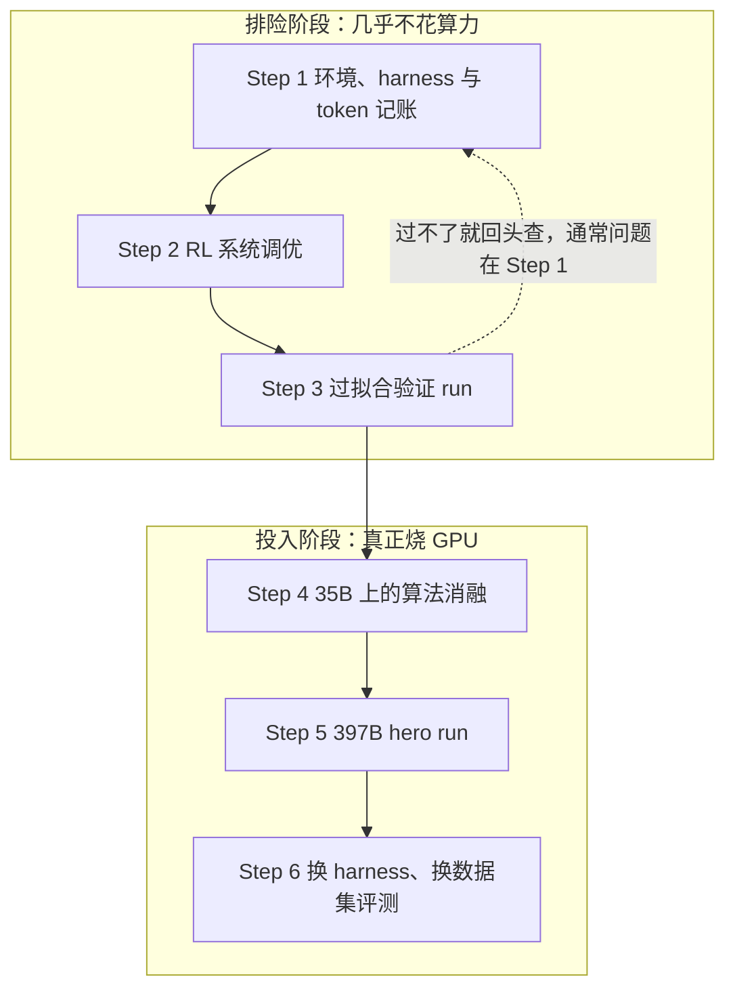
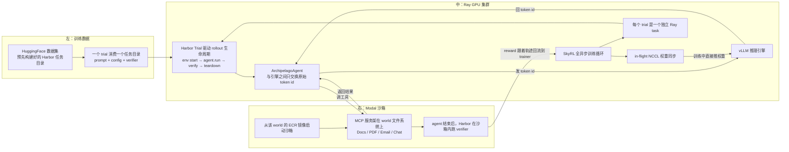

# 397B 知识工作 Agent 的 RL 全流程：算力从第四步才开始花，胜负在前三步就定了

<!-- release-date: 2026-09-01 -->

> 本文依据 Mercor 与 SkyRL 团队于 2026-09-01 发布的官方博客 **Training frontier knowledge work agents: A 397B RL training guide with SkyRL**，访问日期 2026-09-06。原件是网页，没有 PDF，所以本文不用页码，改为标注原文小节名，例如（原文 1.2 节）、（原文 Step 2 第 3 条）、（原文 Table 1）。
>
> 原文地址：<https://www.mercor.com/blog/training-frontier-knowledge-work-agents-a-397b-rl-training-guide-with-skyrl/>
>
> 原文的 Table 1–4 在网页里是图片而非 HTML 表格，本文的表格由维护者逐张读图录入后核对。正文中的统计图是原文自带的 Figure，已下载到本站并注明「引自原文 Figure N」。原文 Figure 3 是一张架构图，本文用 Mermaid 按它的长图注重画，并标为「机制示意」。
>
> 全文严格区分三层：**原文写了什么**、**我们如何解释它**、**哪些是外部核实的补充**。第三类会写明来源。

## 阅读前先把词说成人话

这篇材料的密度很高，术语几乎每段都出现。先花几分钟把它们讲清楚，后面就不用反复解释。

**先是最基础的四个：**

- **RL（Reinforcement Learning，强化学习）**：不给模型标准答案，只让它自己做事，事后按结果打分，再用分数去调参数。
- **rollout（轨迹生成）**：让模型真的把一个任务从头做到尾，产生的那一整串「思考、调工具、看结果、再思考」的记录，就叫一条 trajectory（轨迹）。rollout 既指这个过程，也指这条记录。
- **reward（奖励）**：一条轨迹做完后打的分。本文里它不是简单的对错，而是按一份评分细则给的部分分。
- **harness（脚手架）**：包在模型外面、让它能真正干活的那层代码。它规定模型能用哪些工具、工具结果怎么塞回上下文、上下文满了怎么办、解析失败怎么处理。**同一个模型换一套 harness，分数可以差好几分**，所以它不是无关紧要的胶水。

**然后是这份 recipe 特有的几个：**

- **MCP（Model Context Protocol，模型上下文协议）**：一种让模型调用外部服务的标准接口。本文里，模拟公司的文档、PDF、邮件、聊天都各自架成一个 MCP 服务。
- **sandbox（沙箱）**：为每次试验单独启动的一个隔离容器，里面装着任务需要的整个文件系统和服务。
- **Pass@1 与 Pass@16**：Pass@1 是「采一次就把全部评分项都做对」的任务比例；Pass@16 是「采 16 次里至少有一次全对」的比例。前者衡量稳定性，后者衡量上限。**Pass@k 与平均奖励不是一回事**：平均奖励给部分分，所以数值总是高不少。
- **MoE（Mixture-of-Experts，混合专家）**：每个 token 只激活一小部分参数。`Qwen3.5-397B-A17B` 里 397B 是总参数，A17B 是每个 token 实际激活的 17B。同理 `Qwen3.6-35B-A3B` 是总 35B、激活 3B。
- **KV cache（键值缓存）**：模型生成时把读过的内容留成中间结果，避免每出一个 token 就重算全部历史。它是推理显存的主要开销。
- **异步 RL 与 staleness（陈旧度）**：训练和采样同时跑，采样端用的权重可能落后训练端若干步，落后的步数就叫 staleness。允许一点陈旧可以让 GPU 不空转，但陈旧太多，采到的数据就不再代表当前策略。
- **logprob（对数概率）**：模型认为某个 token 有多可能出现，取对数。训练端和推理端对同一条轨迹算出的 logprob 应该接近；差太多说明两边跑的其实不是同一个模型。

**最后是几个算法名字，正文会各自展开，这里先各给一句：**

- **GRPO（Group Relative Policy Optimization，组相对策略优化）**：同一个提示采多条轨迹，用组内相对好坏当优势信号，省掉单独的价值网络。出处是 DeepSeekMath，本库有[解读](../DeepSeek/DeepSeekMath.md)。
- **DAPO**：在 GRPO 上做长思维链 RL 的一组工程改动，本文只用到它的损失归一化方式。本库有[解读](../ByteDance/DAPO.md)。
- **DPPO**：一种策略损失，靠「把训练端与推理端分歧太大的 token 直接屏蔽掉」来处理训推不一致。
- **TIS（Truncated Importance Sampling，截断重要性采样）**：用重要性比修正「采样时的策略」和「更新时的策略」之间的偏差，比值太大就截断。
- **TITO（token-in-token-out，进出都是 token）**：训练端拿到的 token 序列，必须与推理端当时真正生成的 token 序列逐个对齐，中间不许重新分词。这是本文 Step 1 的压轴内容。

## 一句话先说清

这份 recipe 最反直觉的一条，藏在还没开始训练的地方。

他们只是把 harness 里的几个 bug 修掉、加了三条小规则，同一个**没有经过任何训练**的 `Qwen3.6-35B-A3B` 的平均奖励就从 22.74% 涨到 28.69%。原文明确说：这几个修复带来的收益，大约等于在没修的 harness 上训满一个 epoch 能拿到的收益（原文 1.2 节）。

整篇文章的结构就是这个判断的展开：

> **RL 的六个步骤里，前三步不花什么算力，却决定了后三步能不能赢。**

- Step 1 环境、harness 与 token 记账；
- Step 2 RL 系统调优；
- Step 3 过拟合验证 run。

原文把这三步统称为 de-risking（排险），并明确写道：在 Step 4 之前，不投入显著算力。

真正花钱的是后三步：Step 4 在 35B 上做算法消融，Step 5 把最好的配置放到 397B 上跑 hero run，Step 6 换 harness、换数据集验证泛化。

结果是：`Qwen3.5-397B-A17B` 的 Pass@1 从 16.11% 涨到 27.29%，相对提升约 70%；`Qwen3.6-35B-A3B` 从 13.96% 涨到 22.71%，超过了同榜的 Opus 4.5 High（20.7%）。

而全文最后的结论，恰好也在给算法降温：**五个算法旋钮里最好的一个只值 +3.9 分，整体后训练却给两个模型各带来 10–12 分**。差距在数据，不在损失函数。

## 全景：六步是怎么串起来的



这张图是按原文目录重画的流程示意，不是原文的图。

值得先记住的是那条虚线：**过拟合验证过不了，不要往下走，回头查 Step 1**（原文 Step 3）。它把「模型学不会」和「环境没搭对」这两件容易混淆的事，用一个便宜的实验切开了。

## 全景：一次 RL trial 里，到底谁在跑什么

原文 Figure 3 是一张三栏架构图，图注把左中右讲得很细。下面是按那段图注重画的机制示意，不含任何实测时间或吞吐数字。



三件事值得从这张图里读出来：

1. **agent loop 跑在 GPU 节点上**。原文明确说这只是他们的选择，它同样可以跑在环境沙箱里、单独的容器里，或者 Ray 集群的其他 CPU 节点上（原文 1.0 节）。
2. **agent 与推理引擎之间流动的是 token id，不是字符串**。这就是 TITO，1.3 节会解释为什么这条线必须是 token。
3. **verifier 在沙箱里跑**。因为很多任务的判分依据是「rollout 前后文件系统的差异」，判分器必须能看到那个文件系统。

## 背景：APEX-Agents 是什么，为什么它难

### 每个任务都活在一个「世界」里

APEX-Agents 是 Mercor 面向专业服务业的长时程跨应用基准，共 480 个任务（原文背景节，论文见 arXiv:2601.14242，编号经 arXiv API 核实为 APEX-Agents）。

它和常见的「只给一段提示」的基准不一样：**每个任务都活在一个 world（世界）里**。一个 world 是一家模拟公司，里面有几十份 PDF、表格和幻灯片，还架着聊天服务器和邮件服务器。很多任务共享同一个 world。

Agent 要么通过 MCP 工具干活，要么直接写代码执行。480 个任务和它们的全部文件都公开在 Hugging Face 上。

为什么这类基准少见？原文给的理由很直接：**真实环境造起来贵，长时程 rollout 训起来也贵**。开源社区在 27B–32B 规模的编码 Agent 上已经有实打实的进展，但知识工作 Agent 的公开研究少得多（原文背景节）。

### 三篇里的第三篇

这是 Mercor「用专家数据后训练开源模型」系列的第三篇：

| 时间 | 数据规模 | 结果 | 训练栈 |
|---|---|---|---|
| 2026 年 1 月 | 不到 1000 条专家标注任务 | 开源权重模型在 APEX-Agents 上的分数接近翻倍 | 私有 |
| 2026 年 2 月 | 约 2000 条 | Applied Compute: Small（自 GLM-4.7 355B 后训练），公司法第一、总榜第四 | 私有 |
| 本篇 | 1928 条 OTS 任务 | 在公开的 SkyRL 上复现，并扩到 397B，训练脚本、权重、评测 trace 全部开放 | 公开 |

前两次都用私有 RL 栈，这一次把 recipe 完全打开。

### 为什么不做 SFT warmup

原文给的理由只有一句，但很实在：**RL 是后训练里最难做对的部分，所以他们专门只做 RL，不先做 SFT 热身**（原文背景节）。

这不是在说 SFT 没用，而是在说：如果目标是把 RL 这条路走通并公开出来，就不要让 SFT 把难点提前抹平。

### 为什么选 SkyRL

三条理由（原文背景节）：

1. **能轻松接入任意 agent harness**。这对本任务是硬需求——他们要接的是自己的 Archipelago loop，不是框架自带的示例。
2. **支持完全异步训练**。长时程任务的轨迹长度差异极大，同步训练会被最慢的那条拖死。
3. **训练循环兼容 Tinker**，因此可以换算力后端。

SkyRL 由伯克利 Sky Computing Lab 与 Anyscale 合作构建。集群搭建由 Anyscale 协助（原文致谢）。

### 训练数据与污染

训练用的是 APEX-Agents 的 off-the-shelf（OTS，现成）数据集：**1928 个专家创建的任务**，覆盖管理咨询、投行、公司法三个领域。

它们与公开的 480 个基准任务形状相同，但**没有任何一个 world 或提示出现在基准里，所以不存在污染**（原文背景节）。

这一句非常重要。同样的 world 结构 + 完全不重叠的实例，是把「学到能力」和「记住答案」分开的前提。

### 头条结果


图 1：保留的 480 个 APEX-Agents 任务上的 Pass@1 随训练步数的变化。引自原文 Figure 1。

两条曲线的四个标注点分别是：

| 训练步 | Qwen3.6-35B-A3B | Qwen3.5-397B-A17B |
|---|---|---|
| 0 | 13.96 | 16.11 |
| 约 90 | 18.82 | 22.71 |
| 约 175 | 22.50 | 26.25 |
| 约 265 | 22.71 | 27.29 |

图上还有三条横向参考虚线，它们**没有步数轴**，只是标出参照模型的水平：Grok 4.5 High 29.4%、Post-trained GLM-4.7 355B 23.0%、Opus 4.5 High 20.7%。

读这张图要读出三件事：

1. **两条曲线都是前陡后平**。397B 在约 90 步就越过了 GLM-4.7 355B 那条线，之后爬升明显放缓；35B 在约 130 步附近越过 Opus 4.5 High，最后停在 22.71%，仍略低于 23.0% 那条线。
2. **每个点都有误差棒**，而且不小。所以「越过某条线」在末段要谨慎说，图里 35B 末点的误差棒是跨过 23.0% 那条线的。
3. **397B 到最后也没追上 Grok 4.5 High 的 29.4%**。原文没有宣称追上，本文也不替它宣称。

我们的观察：Figure 1 的 35B 起点标注是 13.96，而 Table 2 里同一个数记作 13.97%。这是同一个三次均值的取整差异，不是两次不同的测量。


图 2：分领域的增益，浅色柱是基座模型，深色柱是后训练后的 -Mercor 模型。引自原文 Figure 2。

| 领域 | 35B 基座 → 后训练 | 397B 基座 → 后训练 |
|---|---|---|
| 公司法 | 12.9 → 23.7 | 18.8 → 25.0 |
| 管理咨询 | 13.3 → 18.5 | 12.9 → 27.7 |
| 投行 | 15.6 → 25.8 | 16.7 → 29.2 |

两个模型的短板不同：**35B 涨得最多的是公司法，397B 涨得最多的是管理咨询**（原文 Figure 2 图注）。而 35B 在管理咨询上只涨了 5.2 分，是六个格子里最小的一个，误差棒也最大。

把每个 run 的最终 checkpoint 取出来，就得到本文反复出现的两个名字：`Qwen3.6-35B-A3B-Mercor` 与 `Qwen3.5-397B-A17B-Mercor`。

注意一个容易读错的细节：**小模型是 Qwen3.6 代，大模型是 Qwen3.5 代**。这不是笔误，而且它在 Step 6 会变成解释泛化差异的关键。

## Step 1：环境、harness 与 token 记账

原文把这一步拆成三件事，并给了理由（原文 Step 1 开头）：

- **稳健的环境基础设施**：失败的轨迹既浪费 GPU 小时，也会让奖励产生偏差；
- **正确的 harness**：harness 的怪癖会教会模型绕过 harness，而这些探索预算本该花在任务上；
- **精确的 token 记账**。

第二条是这一步最值得记住的一句话：**模型会认真学习你 harness 的每一个 bug**。

### 1.0 什么跑在哪

数据格式与 rollout 生命周期管理都交给 **Harbor**。Harbor 出自 Terminal-Bench 团队，它在容器环境里评测和优化 agent，可以跨 Modal、Daytona 这类沙箱供应商并行跑试验，也能为 RL 生成 rollout（原文 1.0 节）。

在 Harbor 之上，他们实现了自己的 `BaseAgent`，等价于 Mercor 内部的 archipelago loop agent。

一次 trial 的物理流程是这样的：

1. Mercor 的 OTS 数据交付会把每个 world 打包成一个 `image.tar`；
2. 这个镜像被推到 ECR（AWS 的容器镜像仓库）；
3. 试验开始时，Modal 拉取镜像启动沙箱；
4. 镜像里装着这个 world 的文件系统，并运行操作它的 MCP 服务：Docs、PDF、Email、Chat；
5. agent loop 连上沙箱的 MCP 服务，把它们的工具暴露给大模型。

recipe 仓库刻意做得很小：SkyRL 和 Harbor 都是 pip 安装的依赖，**没有 fork**，需要自己写的代码只有几个文件。目录结构如下（路径与文件名照原文，注释为本文改写）：

```text
ApexAgents-SkyRL-Recipe/
├── apex_agents_skyrl_recipe/
│   ├── entrypoints/
│   │   └── main_tito_harbor_fully_async.py   # 入口：把自己的配置接到
│   │                                         #   SkyRL 的全异步 trainer 上
│   ├── tito_harbor_generator.py   # 唯一需要自己写的 SkyRL 代码：
│   │                              #   实现 GeneratorInterface，
│   │                              #   把每个 trial 作为 Ray task 交给 harbor 的 Trial
│   ├── agents/
│   │   └── archipelago.py         # 调 MCP 工具的 agent，harbor BaseAgent 的子类；
│   │                              #   agents/ 下其余文件是它的辅助件（如 TITO 记账）
│   └── harbor_trial_config/
│       └── archipelago_tito.yaml  # agent 与 trial 配置：超时、重试、沙箱设置
│
└── scripts/                       # 启动脚本，装着 Step 2 与 Step 4 调过的每个 SkyRL 旋钮
```

这个结构本身就是一条可迁移经验：**判断一个 RL 框架好不好接，看的是「不 fork 也能接进来」，以及需要你实现的接口有几个**。这里的答案是一个（`GeneratorInterface`）。

### 1.1 环境稳健性：四条具体做法

知道了什么跑在哪，接下来的工作是把环境失败率压下去，同时让 GPU 别闲着。原文诚实地说，这基本是打地鼠，但给了四个有代表性的样本（原文 1.1 节）：

**第一，凡事加超时。** 文件下载、MCP 交互、容器拆除，都要有超时。任何没有超时的东西，早晚会把一条 rollout 挂到它端到端预算的最后一秒。

这条的杀伤力在于它不报错。一条被挂住的轨迹既不成功也不失败，它只是安静地占着并发额度，直到整体预算耗尽。

**第二，绕开 LLM-judge 的限流。** 一次评测产生的裁判流量不算大，但 RL 在 **800 条以上并发 rollout** 时会狠狠撞上限流。他们的做法是在多个裁判 API key 之间轮询，并带退避重试（实现在 `agents/llm.py`）。

**第三，每个进程隔离 MCP 客户端。** 让几百个 agent loop 共用一个 Python 进程，会导致 MCP 连接不断掉线，环境本身变成不必要的瓶颈。他们的做法是**把每个 agent loop 跑成独立的 Ray task**。

**第四，把每一种残余错误分类成「判这条试验失败」还是「重试」。** 建在 Harbor 上的好处之一是这类容错逻辑大量已经存在（在 `harbor-framework/harbor` 里搜 `@retry` 即可）；他们自己加的补丁在 `agents/archipelago.py`，用来匹配失败特征的代码在 `metrics_helper.py`。

**以及一条给读者的建议**（原文 1.1 节末）：

> 在开始训练之前，**按你 RL 时预期的并发**跑一遍完整训练集的评测，把非模型错误率压到接近零。他们的并发是 **300–600**。**不要太指望「训练时把错误 mask 掉」**。

这条建议为什么重要，值得说透：mask 掉错误看起来是把坏数据排除了，实际上它同时改变了数据分布。如果失败更容易发生在长任务、重工具调用的任务上，那么被 mask 掉的恰好是最难也最有价值的那批样本，剩下的批次会系统性地偏简单。**错误率不是噪声，它是有结构的偏差。**

### 1.2 优化 harness：全文最反直觉的一节

基础设施稳定之后，看 harness 本身。方法是：**用未训练的模型跑一遍评测，然后读 trace**——有多少失败反映了模型真实的能力上限，又有多少来自 harness 的怪癖甚至纯 bug？在 RL 之前把后者降到最低，训练才是在教真本事，而不是在教绕路。

原文特别说明这类问题只有读 trace 才会暴露，而这是慢的人工活；但编码 agent 很擅长自动化它：让它系统性地分析 trace，用每个工具的失败率之类的指标去找模式（原文 1.2 节）。

**他们靠这个方法找到的三个真实问题：**

1. **沙箱里一开始缺了一些 Python 包**。于是 agent 要烧掉很多轮次去试探到底装了什么，或者退回去用有时更不趁手的 MCP 服务。
2. **PowerPoint 的 MCP 工具每次调用都返回 `None`，即使调用其实成功了。** 他们直接打了补丁，在 `slides_output_validation_fix.py` 里修了这个 MCP 工具的实现。
3. **PDF 阅读器的 MCP 工具把二维版面压成一维文本，多栏表格因此串行、读乱了。** 他们的处理不是重写工具，而是引导模型改用 Python 包 `pdfplumber`。

第二个 bug 特别值得停一下。工具成功了却返回 `None`，模型看到的是「我做了一件事，什么反馈都没有」。它会怎么办？它会重试、会改参数、会换工具、会开始怀疑自己前面的判断。**一个静默失败的工具，消耗的不是一次调用，而是一整段推理。**

**他们还给 harness 加了三条增强：**

1. **快用完上下文预算时，提醒模型收尾**；
2. **工具调用解析失败时，提示模型重试，而不是直接判这条轨迹失败**；
3. **工具结果按固定的 token 或字符预算截断**，这样单次调用不可能把上下文撑爆。

**然后是那个数字：**

这些修复加在一起，让基座 `Qwen3.6-35B-A3B` 的平均奖励从 **22.74% 提到 28.69%，零训练**。原文明确写道：这些修复买到的收益，大约等于在没修的 harness 上训满一个 epoch 能买到的收益（原文 1.2 节）。

+5.95 分，没有梯度更新，没有一张 GPU 用于训练。

这条为什么值得当成全文最重要的结论之一？因为它把一个常见的因果关系反过来了。默认的想法是「模型不够强，所以要训练」；这里的证据是「**在某个区间里，模型看起来不够强，只是因为它的工具在骗它**」。而且这两件事在指标上长得一模一样——都表现为平均奖励低。

它还有一层更冷酷的推论：如果你没有先修 harness 就开始训练，那一个 epoch 的算力，大概率被花在让模型学会绕过你的 bug 上。这些「能力」在你修好 bug 之后会立刻贬值。

**可迁移的做法**很清楚：在任何 agentic RL 项目开跑之前，先用未训练模型做一次全量评测，然后人工（或用编码 agent）读 trace，把失败按「模型问题」和「脚手架问题」分类。这个动作的成本是一次评测，收益可能是一个 epoch。

### 1.3 TITO：为什么绝不能把引擎的文本重新分词

这是 Step 1 的最后一块，也是最技术性的一块。

**问题是什么。** RL 训练循环里有两端：推理引擎负责生成轨迹，trainer 负责用这条轨迹算梯度。中间要把引擎的输出转成 trainer 的输入。如果这一步是「引擎输出字符串 → trainer 重新分词」，就会产生两类错位（原文 1.3 节）：

1. **模型实际生成的 token，和 trainer 以为它生成的 token，不是同一串**；
2. **多轮场景里，第 N 轮的输出 token id，和后续轮次把它当输入时的 token id，也不是同一串**。

**原文用一个四 token 的词表把第一类讲透了：**

假设词表只有四个 token：

| id | token |
|---|---|
| 0 | `<` |
| 1 | `search` |
| 2 | `<search` |
| 3 | `>` |

模型实际生成的是 `0, 1, 3`。把它拼成字符串，得到 `<search>`。如果不记账、直接把这个字符串交给 trainer 重新分词，分词器很可能选择更长的匹配，切成 `2, 3`。

于是 trainer 拿到的是一条**模型从没生成过的序列**。它会去增大 `2` 的概率，而模型当时真正做的选择是先出 `0` 再出 `1`。原文把这种情况称作 silent misalignment（静默错位）：没有报错，没有异常，训练悄悄变成了 off-policy（离策略）。

在这个例子里错位只有一个 token。但真实词表有十几万条目，工具调用的标签、JSON 括号、缩进和换行都是分词器最爱做长匹配的地方，而 agentic 轨迹里全是这些结构。**错位不是偶发，是系统性的。**

第二类错位更隐蔽：多轮对话里，第 N 轮的输出会被拼进第 N+1 轮的输入。如果这两次分词结果不同，那么同一段文字在同一条轨迹的不同位置就有两种 token 表示，trainer 无法把它当成一条连续的序列来算。

**怎么做到 TITO。** 原文给了三条路径，并且明确列出各自的代价：

| 路径 | 做法 | 好处 | 代价 |
|---|---|---|---|
| 一 | 改写 harness，用 `/completions` 代替字符串进字符串出的 `/chat/completions` | 控制力最强 | 工程量最大 |
| 二 | 让 `/chat/completions` 顺便返回输入和输出的 token id（如 vLLM 的 `return_token_ids`） | 改动量最小 | **解决不了第二类错位**；于是每条轨迹会碎成多段训练序列，伤害系统性能 |
| 三 | 让 RL 框架提供一个代理层，把 `/chat/completions` 翻译成 `/completions` 并在内部记账 | 最方便 | 有隐式性，例如 harness 侧自己做重试时行为不明确。SkyRL 即将支持 |

**他们选了第一条**，实现细节在 `agents/tito.py`。

第二条的代价值得展开：一条轨迹碎成多段训练序列，意味着原本一次前向就能算完的东西，现在要分几次算，还要额外的 padding 和调度。在 10 万 token 量级的轨迹上，这不是小开销。

**这一节的可迁移启发**：任何「模型生成 → 文本 → 再解析回结构」的回路，都要问一句「这一圈转回来还是原来那个东西吗」。分词器、JSON 序列化、Markdown 渲染、模板拼接，都是会悄悄改变内容的环节。RL 对这类不一致格外敏感，因为它会把不一致直接算进梯度。

## Step 2：RL 系统调优

环境和 harness 定下来之后，才轮到 RL 栈本身。

长时程 agentic RL 的默认配置是**全异步训练 + in-flight 权重更新**，目的是把掉队者（straggler）的影响降到最小（原文 Step 2 开头，引用 [6][7]）。经外部核实，这两篇分别是 AReaL（arXiv:2505.24298，本库有[解读](../AntGroup/AReaL.md)）与 PipelineRL（arXiv:2509.19128）。

推理引擎用 vLLM，训练后端用 Megatron。调优严格按下面的顺序进行。

### 第一步：把 Megatron 的旋钮调快

原文的说法很具体：**花一个通宵的 Claude Code 会话**，用一个 dummy 脚本扫参数，把 Megatron 的速度调出来。要扫的三类是（原文 Step 2 第 1 条）：

- **并行度**：TP（张量并行）、EP（专家并行）、PP（流水线并行）、CP（上下文并行）；
- **CPU offload 的粒度**：把哪些状态、以多细的粒度卸到 CPU 内存；
- **micro-batch 大小**：配置项是 `max_tokens_per_microbatch`。

原文特别强调了一句：**他们使用动态 micro-batching，这对 trainer 吞吐是关键的**。

为什么是「关键」而不是「有帮助」？因为这里的轨迹长度从 2k 到 128k token 都有（这个范围出自原文 Step 4）。如果 micro-batch 按条数固定，那么装满一批短轨迹的显存占用和装满一批长轨迹能差几十倍——要么按最长的留余量、平时严重浪费，要么偶尔 OOM。按 token 数动态成批，才能让每个 micro-batch 的显存占用大致相等。**长度分布越宽，动态成批越不可省。**

### 第二步：把集群切给 rollout 和训练

原文给的经验法则分两步（原文 Step 2 第 2 条）：

1. **先根据你的算力定下训练 GPU 的数量**；
2. **再把尽可能多的 GPU 分给 rollout，直到 trainer 不需要等生成**。

判据非常干脆：在 SkyRL 里看 `timing/wait_for_generation_buffer` 这个面板，**它为 0，就表示 trainer 从来没有在等生成，因此一直在忙**。

他们的推理节点比训练节点是：

| run | 推理节点 : 训练节点 |
|---|---|
| 35B 的各次运行 | 12 : 4 |
| 397B 的 hero run | 12 : 8 |

注意这个比例的方向：**推理侧远多于训练侧**。这与同步 RL 的直觉相反，但对长时程任务是自然的——一条轨迹要跑几十轮工具调用、几万到十几万 token，生成才是瓶颈。397B 换的是训练侧翻倍（4 → 8），推理侧数量不变。

这条经验法则的真正价值在于它给了一个**可观测的停止条件**。不是「凭感觉觉得够了」，而是「这个面板归零就停」。任何异步系统的资源切分都可以照抄这个思路：先找到那个「谁在等谁」的指标，再把它推到零。

### 第三步：定 rollout 并发

rollout 并发（配置项 `generator.rate_limit.max_concurrency`）有两个天花板，**取两者中较小的那个**（原文 Step 2 第 3 条）。

**系统天花板**——对长时程任务来说，通常就是它绑定了并发：

$$
C_{\text{sys}} = \frac{\text{total KV cache capacity in tokens}}{\text{average trajectory length in tokens}}
$$

分子是全部推理 GPU 上 KV cache 的总容量（按 token 计），分母是平均轨迹长度。抬高它的办法有两个：**开 CPU KV cache offloading**，或者**提高并行度**（TP / PP / EP）。

**算法天花板**——它由你在全异步训练里能容忍多少陈旧度决定：

$$
C_{\text{algo}} = (\text{max staleness steps} + 1) \times \text{mini batch size} \times \text{samples per prompt}
$$

他们的取值是 $(3+1)\times 16\times 16 = 1024$ 条轨迹。超过这个数，多出来的轨迹对 trainer 来说已经太陈旧，不会被接受。

**两次运行都是系统天花板先绑定的：**

| run | 并发设置 | 算法天花板 |
|---|---|---|
| 35B | 550 | 1024 |
| 397B | 300 | 1024 |

两个数都远低于 1024。

这个对比本身就是一条结论：**在长时程 agentic RL 里，限制你的通常不是算法容忍度，而是显存**。所以在纠结 staleness 该设 2 还是 4 之前，先算一下 KV cache 除以平均轨迹长度是多少——很可能这个数才是你真正的上限。

顺带一个便于换算的直觉：397B 的并发只有 35B 的一半略多，而它的激活参数是 17B 对 3B。KV cache 的容量差异、更大的模型占用、加上训练节点从 4 涨到 8（推理节点数不变），共同把并发压了下来。原文没有给出这个分解，这里只是把可观察到的几个量摆在一起。

### 第四步：检查训推一致性

配置定好之后，**跑几步训练，比对 trainer 和推理引擎算出的 logprob**（原文 Step 2 第 4 条）。

这个检查抓到了一个真实的正确性问题：**vLLM 的 CPU offloading、GDN 模型、in-flight 权重更新，这三者的组合有 bug**。

关于 GDN：原文只给了缩写。经外部核实，GDN 一般指 Gated DeltaNet（门控 DeltaNet），是 Qwen 近几代混合线性注意力用的那类模块——这层展开是本文的补充，原文没有写。原文也没有公开这个 bug 的根因，只说是这三者组合下的正确性问题。我们只能说，这三件事各自都会动到「权重或状态在什么时刻是什么」这个问题，凑在一起容易出错；但具体是哪一环，原文没讲，本文不猜。

**他们的差值本身很小，而且没有用 rollout router replay 就做到了**。（router replay 指重放路由决策，让 MoE 在训练端和推理端选到同一批专家。原文只提到没用它，没有解释它，这层说明是本文的补充。）


图 4：trainer 与推理引擎之间的平均 logprob 差。引自原文 Figure 4，图注给的健康线是**低于 0.03**。

据图读数：

- **35B 的曲线（蓝）** 开头有一个约 0.027 的尖峰，随后回落，在前 50 步左右震荡于 0.019–0.021，之后整体缓慢下行，到 250 步附近落在 0.017–0.018；
- **397B 的曲线（橙）** 全程更低也更平，基本在 0.012–0.014 之间震荡，没有明显趋势；
- 两条线**全程都在 0.03 以下**，符合原文给的健康线。

我们的观察：更大的模型这里反而更稳。原文没有解释这一点，本文也不给因果解释，只指出「模型更大 = 训推更容易漂」这个直觉在这份数据里没有得到支持。

这一步的可迁移启发很实用：**logprob 差是 RL 系统里最便宜的正确性探针**。它不需要跑完整训练，几步就能看出来；它对权重同步、量化、offload、并行切分的所有错误都敏感；而且它有一个具体的健康阈值可以照抄。

## Step 3：过拟合验证 run

环境和 RL 系统都就绪了，终于可以启动 run——但还不是 hero run。

先做一次**过拟合验证**，确认这些任务确实可学：**如果你连少数几个任务都过拟合不了，端到端的训练就毫无机会**（原文 Step 3）。

配置很小：

| 项 | 取值 |
|---|---|
| 任务子集 | 32 个（每个在离线评测里奖励方差非零） |
| batch size | 32 |
| 每个提示的采样数 | 8 |
| 训练方式 | 同步 |

因为 batch size 等于任务总数，又是同步训练，**每一步就是一个 epoch**。

「奖励方差非零」这个筛选条件是关键：如果一个任务在离线评测里永远是 0 分或永远是满分，它给不出任何梯度信号，放进来只会稀释批次。


图 5：32 任务上的过拟合验证 run。引自原文 Figure 5，图注说你应该在很少的步数内就看到学习信号。

据图读数：曲线是 `reward/avg_raw_reward`，横轴约 24 步。起点约 0.195，末点约 0.322。整体明显上行，但**不是单调的**：第 5 步、第 12 步、第 15 步都有回落，第 20 步冲到约 0.303 后，第 22 步猛跌回约 0.253，最后两步又拉到最高。

这个形状本身也是信息：**判据是趋势，不是每一步都涨**。在 32 个任务、每个 8 条样本的小批次上，单步噪声本来就很大。

**过不了怎么办。** 原文的指示是：回头走一遍前面的步骤，找出哪里出了错，**通常在 Step 1**。

他们真实踩到的例子非常有代表性：

> **用「rollout 前后 diff 文件」评分的任务，比只看最终回复的任务，难过拟合得多。**

这个现象把矛头指向了判分逻辑而不是模型。顺着查下去，问题出在文件抽取的保真度上；**换成第三方的文件 diff 工具之后，文件抽取的保真度大幅提高，这些任务就变得可学了**。

这个例子值得单独记住，因为它演示了一个很难自己想到的诊断动作：**按判分方式给任务分组，看哪一组学不动**。如果某种判分方式的任务系统性地学不会，那多半不是模型的问题，而是这种判分方式本身有噪声——而噪声化的奖励在 RL 里等于没有奖励。

## Step 4：35B 上的算法消融

排险做完，才开始把算力花在科学上。

原文先给了一个很诚实的前提（原文 Step 4 开头）：**在 RL 里，奖励形状、探索、系统吞吐是一起变的，所以 scaling 研究没有 SFT 那么干净**。因此他们只消融了少数几个自己有具体假设的旋钮，在 `Qwen3.6-35B-A3B` 上做，**每个实验组都用它的 epoch-1 checkpoint、在保留的 480 个任务上评测 3 次**。他们相信这些旋钮的结论可以跨模型规模迁移。

### Table 1：算法消融

（`Qwen3.6-35B-A3B`，epoch-1 checkpoint，480 个保留任务评测 3 次，mean ± std。`/` 表示与 baseline 相同。）

| Run | Loss agg | IS variant | Context nudge | Mean Reward (%) | Avg turns | Tokens / turn | Tool call success (%) |
|---|---|---|---|---|---|---|---|
| Untrained model | — | — | — | 22.74 ± 1.04 | 16.80 ± 0.13 | 882.9 ± 19.0 | 96.60 ± 0.28 |
| 1. Baseline | token_mean | GLM-5 loss | False | 28.69 ± 0.80 | 21.21 ± 0.27 | 834.0 ± 14.7 | 98.37 ± 0.32 |
| 2. prompt_mean | prompt_mean | / | / | 32.54 ± 1.19 | 32.12 ± 0.64 | 837.8 ± 8.2 | 95.88 ± 0.02 |
| 3. DPPO | / | DPPO | / | 29.03 ± 0.45 | 32.40 ± 0.66 | 587.5 ± 13.1 | 97.16 ± 0.22 |
| 4. Context nudge | / | / | True | 31.64 ± 0.68 | 38.31 ± 0.64 | 685.8 ± 5.8 | 97.31 ± 0.18 |
| 5. DPPO + prompt_mean + nudge | prompt_mean | DPPO | True | 31.81 ± 0.81 | 35.99 ± 0.44 | 775.3 ± 8.4 | 97.74 ± 0.14 |

原文另有 adaptive length penalty、overlong filtering、重置 KV cache 三组实验，均未显著帮助，完整实验表在原文外链。

**读这张表之前必须知道的一条**（原文 Step 4）：这一节的绝对分数低于头条结果，因为**消融做完之后他们又落地了更多 Step 1 的 harness 优化**。消融内部的所有 run 共用同一套 harness，所以组内比较是公平的；但**不能把这一节的分数和 Table 2 的分数直接对比**。

### 旋钮一：token 聚合（+3.9 分）

一个 batch 里的策略损失要怎么在 token 之间求平均？原文列了三种自然的做法（原文 Step 4）。

设一个 batch 里有 $G$ 个提示（也就是 $G$ 个 rollout 组），共 $N$ 条轨迹，第 $i$ 条轨迹长 $|y_i|$ 个 token，每个 token 上的代理损失记作 $\ell_{i,t}$。

**`token_mean`：全体 token 一个池子，人人平等。**

$$
L_{\text{tok}} = \frac{1}{\sum_i |y_i|}\sum_i \sum_t \ell_{i,t}
$$

这是大多数开源框架实现 token 级损失的方式。原文补充：Dr. GRPO 是它的等 token 变体，改成按一个常数归一化（arXiv:2503.20783，经核实标题为 Understanding R1-Zero-Like Training: A Critical Perspective）。

**`sequence_mean`：每条序列先自己平均，再在序列之间平均。**

$$
L_{\text{seq}} = \frac{1}{N}\sum_i \frac{1}{|y_i|}\sum_t \ell_{i,t}
$$

这是原始 GRPO 的做法（arXiv:2402.03300，即 DeepSeekMath）。

**`prompt_mean`：每个 rollout 组权重相等，组内 token 权重相等。**

$$
L_{\text{prompt}} = \frac{1}{G}\sum_{g=1}^{G}\frac{\sum_{i\in g}\sum_t \ell_{i,t}}{\sum_{i\in g}|y_i|}
$$

这是 DAPO 目标所规定的形式（arXiv:2503.14476），后来 ScaleRL 又强调了一次（arXiv:2510.13786，标题经核实为 The Art of Scaling Reinforcement Learning Compute for LLMs）。

**为什么这个选择在这里格外要紧。** 他们的轨迹长度跨度是 **2k 到 128k token**，六十多倍。在 `token_mean` 下，梯度被 token 数加权，于是**哪个提示的 rollout 最长，哪个提示就主导整个 batch 的梯度**。一个碰巧写了 12 万 token 的任务，可以顶掉几十个正常长度的任务。

`prompt_mean` 把这个偏置去掉：每个提示不论长短，对梯度的贡献相同。

**结果：`prompt_mean` 比 `token_mean` 基线高 3.9 分。**

**我们的观察（原文的一处编号笔误）**：原文在这句话后面标注的是 run 4 vs. 1。但按 Table 1，`prompt_mean` 是 **run 2**（32.54 − 28.69 = 3.85，四舍五入正是 3.9）；run 4 是 context nudge（31.64 − 28.69 = 2.95 ≈ 3.0，恰好是紧接着下一条引用的数字）。所以**括号里的编号应为 run 2 vs. 1**。这是编号错位，不影响任何结论——3.9 这个数字本身与 Table 1 完全对得上。

### 旋钮二：策略损失，DPPO 还是 GLM-5 loss

**两者的共同点，其实比区别更重要。**

DPPO 与 GLM-5 loss 都在修正两件事：**训推不一致**，以及**全异步带来的策略陈旧**。而且它们都是**直接把 rollout 的 logprob 用进损失里**（原文 Step 4）。

这一点带来一个实打实的节省：传统 TIS 需要**额外跑一次前向**，才能拿到 trainer 自己算的 logprob；DPPO 和 GLM-5 loss 都不需要这一次前向。在 10 万 token 量级的轨迹上，省掉一次完整前向是真金白银。（TIS 的出处是原文引用 [11]，一篇 Notion 笔记，不是 arXiv 论文。）

**两者的区别，在于怎么处理分歧大的 token：**

- **DPPO 把训练端与推理端 logprob 分歧大的 token 直接屏蔽掉**，屏蔽的判据是全变差散度的一个二值近似。全变差散度是两个分布之间的一种距离：

  $$
  D_{TV}(p,q)=\frac{1}{2}\sum_x |p(x)-q(x)|
  $$

  「二值近似」的意思是不去算这个连续的距离值，而是化简成一个开关：分歧超过阈值就把这个 token 的梯度扔掉，否则照常算。他们是在 Tmax 论文给出正面报告之后才试的（原文引用 [1]，arXiv:2606.23321，经核实标题为 Tmax: A simple recipe for terminal agents）。DPPO 本身的出处是 arXiv:2602.04879，经核实标题为 Rethinking the Trust Region in LLM Reinforcement Learning。

- **GLM-5 loss 则是截断重要性比**，出处是 GLM-5 报告的 3.3 节（arXiv:2602.15763，本库有[解读](../Z.ai/GLM-5.md)）。

两者的哲学差别可以这样说：**一个把不可信的样本丢掉，一个把不可信的样本压小。** 丢掉更干脆，但会损失数据；压小保留了全部数据，但可信度低的样本仍然参与更新。

**结果一：在 epoch 1，两者的分数在噪声范围内不分胜负。** run 3（29.03 ± 0.45）对 run 1（28.69 ± 0.80），差 0.34 分。

**结果二，也是更有意思的一条：DPPO 最明显的效果不在分数，而在行为。**

| 指标 | run 1（GLM-5 loss） | run 3（DPPO） |
|---|---|---|
| 平均轮数 | 21.21 | 32.40 |
| 每轮 assistant token 数 | 834.0 | 587.5 |

原文把它概括成：**DPPO 一致地把模型推向「更多轮、每轮更短」**。

这个观察方式值得学。分数持平的两个配置，行为可以完全不同；而行为的差别会在更长的训练、更难的任务上放大成分数差别。**只看一个标量，你会以为这两个旋钮等价。**

### 旋钮三：context nudge——一个改 harness 的手段，却算进了算法消融

**做法**：当上下文预算**只剩 20%** 时，往对话里注入一条提示，请模型收尾（原文 Step 4）。

**机制**：更少的 rollout 会撑爆上下文，因此更少的 rollout 被整条清零；于是**每个 batch 里可用的信号更多**。

这里的因果链要讲清：撑爆上下文的轨迹拿不到有效奖励，通常直接记 0。这条轨迹不只是浪费了一次生成，它还进了 batch，把这一组的优势估计往下拉。少一条被清零的轨迹，等于多一条有效样本，同时少一次对同组其他样本的干扰。

**还有一个附带好处**：因为它按**百分比**触发而不是按绝对 token 数触发，所以它能在一定程度上吸收「训练上下文长度」和「评测上下文长度」不一致的问题。训练是 160k，评测是 256k，同一条百分比规则在两边都成立。

**关键的实验设计**：**表里所有评测都关掉了 nudge**。所以它的 +3.0 分是**纯粹的训练期收益**——不是评测时多给了一条提示换来的。

这个设计值得单独表扬。一个在训练和评测都开着的 harness 改动，你无法区分它带来的是「模型变强了」还是「考试时多给了提示」。只在训练期开、评测期关，才把这两件事分开。

### 没帮上忙的两个

**overlong filtering（OLF，超长过滤）**：把超长的 rollout 从损失里 mask 掉，而不是给它一个惩罚。

原文的预期和结果是一致的：他们**训练在 160k、评测在 256k，两者差距不算悬殊，而且两边都不做 compaction**（compaction 指上下文快满时把历史压成摘要再继续），所以本来就预期收益不大；消融的结果是**加上 OLF 反而掉 1.5 分**。原文说这与 Composer 2 的发现一致（arXiv:2603.24477，经核实标题为 Composer 2 Technical Report）。

**adaptive length penalty（ALP，自适应长度惩罚）**：对 agent 自己生成的 token 和环境返回的 token，使用不同的惩罚系数（arXiv:2506.05256，经核实标题为 Just Enough Thinking: Efficient Reasoning with Adaptive Length Penalties Reinforcement Learning）。

结果是**在他们试过的每一组设置下都是中性到负面**。原文给了两个可能的解释，并且明确标成猜测：也许他们的训练时程太短，长度压力还来不及带来回报；也许系数还需要进一步调。

**重置 KV cache** 也在「没有显著帮助」的名单里，原文没有展开细节。

这三条一起构成了这一节最诚实的部分：**五个旋钮里有三个是白试的**。原文没有把它们藏进附录，而是写清了预期、结果和可能的原因。

### 两条读表的习惯

原文说，有两条习惯让他们在读这张表时保持诚实（原文 Step 4 末）。

**第一，480 个任务单次评测的噪声是 ±1–3 分。** 所以表里每个数都是 3 次评测的均值；**差距在 1 分以内的，当平手看**。

按这条标准回看 Table 1：run 2（32.54）、run 4（31.64）、run 5（31.81）三者互相都在 1 分以内，是三个并列。真正与 baseline 拉开差距的是这三个，而 run 3（29.03）与 baseline（28.69）是平手。

**第二，要看行为，不只看奖励。** 具体地说：**轮数多、每轮 assistant token 少、工具调用成功率高**，这三个凑在一起，说明模型在做审慎的多步工作，而不是在长篇大论。

原文在这里加了一句很少见的自我限制：**他们对这样读表没有严格的理由，只是发现按这些指标看起来「审慎」的 run，也正是分数最好的那些**。

**最后他们选了 run 5（DPPO + prompt_mean + nudge）作为 hero run 的配置。**

**我们的观察：他们没有选表里分数最高的那一行。** run 2 的平均奖励是 32.54，比 run 5 的 31.81 高 0.73 分——按他们自己的「1 分以内算平手」标准，这两个是平手。而在工具调用成功率上，run 2 是 **95.88%，全表最低，甚至低于未训练模型的 96.60%**；run 5 是 97.74%。这正是「看行为不只看奖励」那条习惯的一个具体后果：**分数最高的配置，恰好是唯一一个把工具调用成功率训坏了的配置。**

## Step 5：397B hero run

Step 4 之后，挑出最有信心的旋钮，启动 397B 的 run。

**最终配置**（原文 Step 5）：

- DPPO；
- `prompt_mean`；
- harness 的 context nudge；
- **不用长度惩罚**；
- **不用课程学习**。

原文还给了一句很有分量的经验判断：**在他们的经验里，35B 的 run 和 397B 的 run 之间唯一真正的差别，就是 RL 系统工作——而那部分在 Step 2 已经排过险了。**

这句话的含金量在于它是一个可证伪的主张：如果它成立，那么算法消融确实可以在小模型上做完再搬到大模型；如果不成立，Step 4 的全部结论都要打折。原文用 397B 的 run 复现了 35B 的增益方向，算是对这句话的一次支持，但样本只有一个规模对，不构成普遍证明。

### 三条曲线


图 5-1：两个 hero run 的 Pass@1 训练曲线，指标名是 `reward/avg_perfect_mean_at_1`。引自原文 Step 5。

据图读数（每条曲线都有很噪的原始线和一条平滑线，下面说的是平滑线）：**397B（橙）** 起点约 0.48，在前 20 多步陡跌到约 0.28，之后在 0.26–0.28 徘徊到约第 60 步，再稳步上行，约 130 步到 0.33、175 步到 0.36，200 步附近走平，末段升到约 0.385。**35B（蓝）** 起点约 0.37，跌到约 0.215（第 20–30 步），随后缓慢上行：50 步约 0.24、100 步约 0.27、150 步后在 0.30 附近走平，末点约 0.315。原始线的波动范围大到 0.05–0.6。


图 5-2：两个 hero run 的 Pass@16 训练曲线，指标名是 `reward/avg_perfect_at_16`。引自原文 Step 5。

据图读数：**397B（橙）** 起点约 0.68，跌到约 0.51（第 20–40 步），之后一路缓升，175 步附近约 0.63，末点约 0.65。**35B（蓝）** 起点约 0.70，跌到约 0.47（第 25 步左右），随后缓升，末点约 0.565。两条线的间距在训练过程中逐渐拉开。

**关于开头那个下跌，原文给了明确解释**：Pass@1 和 Pass@16 的初期下降是**异步 RL 动态**造成的，因为**简单任务先跑完**。

这句话值得展开，因为它是异步 RL 特有的一个陷阱：在全异步设置里，最早回流到 trainer 的那批轨迹，是最快跑完的那批，也就是最简单的那批。于是训练最初几步的批次里，简单任务的比例被系统性地放大，指标看起来虚高；等长任务陆续回流，比例回到正常，指标就「掉」下来了。**这不是模型变差，是采样偏差在消退。**

如果你在异步 RL 里看到前几十步指标先高后跌，先别急着回滚——**先检查回流轨迹的难度分布**。


图 5-3：两个 hero run 的策略熵曲线，指标名是 `policy/policy_entropy`。引自原文 Step 5。

据图读数：**35B（蓝）** 起点约 0.40，先跌到约 0.30（第 5–30 步），随后整体上行，约 130–150 步到 0.42–0.45，约 230 步冲到最高约 0.52，末点回到 0.39–0.40。**397B（橙）** 起点约 0.145，先跌到约 0.11，之后持续上行：40–60 步约 0.18–0.20，第 95 步附近有一次回落，130–155 步爬到 0.22–0.28，200–240 步在 0.30–0.32，末点约 0.27–0.28。

**我们的观察（原文没有评论这三条曲线的形状）**：

1. **两条熵曲线整体是上升的，不是下降的。** RL 里常见的担忧是熵坍缩——模型越训越确定、越训越不敢探索。这两个 run 都没有出现这个现象，反而在长时间训练中把熵抬了上去。原文没有说这是刻意为之还是自然结果，我们也不替它下因果结论。
2. **397B 的初始熵（约 0.145）远低于 35B（约 0.40）。** 更大的基座在这个任务分布上一开始就更确定。
3. **熵的最低点出现在最前面十几到三十步，与 Pass@1 / Pass@16 的最低点大致重合。** 我们不认为这能证明两者同因，只是指出这个时间上的巧合。

**我们的观察（来自图例字符串）**：三张 hero 图和 Figure 4、Figure 6 的图例都露出了 run 名字：

```text
apex_qwen36_35b_tito_rl_16h100_dev1928_prompt_mean_dppo_prompt_nudge_072826
apex_qwen35_397b_tito_rl_19h200_rightKey_072326
```

可以直接读出来的有几条：`tito` 印证了 Step 1.3 的 token 记账；`prompt_mean_dppo_prompt_nudge` 正是 Table 1 的 run 5 配置；`dev1928` 对应 1928 条 OTS 任务。`16h100` 与 `19h200` 看起来是节点规格与数量，其中 16 恰好等于 35B 的 12 + 4；397B 按 12 + 8 应为 20，字符串里是 19，原文没有解释命名规则，这里不做推断。末尾的六位数字像日期，但这只是猜测。

## Step 6：评测与泛化

这是全篇最能说明「这套增益到底有多结实」的一步。

原文先摆出要检验的怀疑（原文 Step 6 开头）：**这个领域最近的经验表明，RL 的增益是绑在它训练时所用的那套 harness 上的**。这条引用经核实是 arXiv:2607.24653，标题为 Kimi K3: Open Frontier Intelligence（本库有[解读](../Moonshot/Kimi-K3.md)）。

### 换 harness：从 MCP 换成纯代码

他们把训练用的 MCP 版 harness **Archipelago**，换成流行的、基于代码的 **OpenCode**，在**同样的 480 个 APEX-Agents 任务**上评测。

差别有多大？**在 OpenCode 下，他们完全不暴露任何 MCP 服务**：预装好 agent 可能需要的 Python 包，然后让它纯靠代码和文件工具干活——`bash`、`glob`、`read`、`grep`、`write`、`edit`、`todowrite`。

这不是换个包装，这是换一整套操作世界的方式。

### Table 2：训练用的 harness 对比保留的 harness

格式为 MeanReward / Pass@1。

| 模型 | Archipelago（训练用） | OpenCode（保留） |
|---|---|---|
| Qwen3.6-35B-A3B | 28.69% ± 1.2 / 13.97% ± 1.46 | 26.22% ± 1.5 / 12.50% ± 1.04 |
| Qwen3.6-35B-A3B-Mercor | 38.69% ± 0.49 / 22.71% ± 0.95 | 37.93% ± 0.91 / 22.15% ± 0.87 |
| 差值 | +10.00 pt / +8.74 pt | +11.71 pt / +9.65 pt |
| Qwen3.5-397B-A17B | 31.29% ± 1.98 / 16.11% ± 1.48 | 28.92% ± 2.2 / 15.07% ± 2.29 |
| Qwen3.5-397B-A17B-Mercor | 43.18% ± 0.93 / 27.29% ± 1.04 | 37.62% ± 0.37 / 21.94% ± 0.12 |
| 差值 | +11.89 pt / +11.18 pt | +8.7 pt / +6.87 pt |

**原文的结论是：增益大体迁移得过去，而且 35B 迁移得比 397B 明显更好。**

把差值单独拎出来看更清楚：

- **35B 在没训过的 harness 上，涨得比在训练用的 harness 上还多**（MeanReward +11.71 对 +10.00，Pass@1 +9.65 对 +8.74）。这是很强的迁移证据。
- **397B 在保留 harness 上丢掉了约四分之一的增益**（MeanReward +8.7 对 +11.89，Pass@1 +6.87 对 +11.18）。

**我们的观察**：换到 OpenCode 之后，后训练过的 397B（MeanReward 37.62 ± 0.37，Pass@1 21.94 ± 0.12）在数值上略低于后训练过的 35B（37.93 ± 0.91，22.15 ± 0.87）。按原文自己「差距在 1 分以内算平手」的标准，这两个是平手，误差棒也重叠。但一个 397B 的模型在保留 harness 上只能和一个 35B 打平，本身说明这两次后训练的**可迁移性差得很远**。原文没有把这个对比拎出来说，这是我们从表里读到的。

### 为什么 35B 迁移得更好

原文给的解释很具体：**训练过程中，`Qwen3.6-35B-A3B` 越来越依赖代码执行而不是 MCP 服务，而 `Qwen3.5-397B-A17B` 一直守着 MCP**。可能的原因是 **Qwen3.6 接受了重得多的 agentic 后训练**（原文 Step 6，「可能」二字是原文自己的措辞）。

这也解释了本文前面提醒过的那个细节：小模型是 3.6 代，大模型是 3.5 代。**代际差异在这里比参数量更能解释结果。**


图 6：工具调用中代码执行所占的比例（相对于 MCP 工具调用）。引自原文 Figure 6，图注说 35B 越来越依赖代码执行，397B 全程保持同样的偏好。

据图读数：**35B（蓝）** 从第 1 步的约 0.37 起步，25–50 步升到 0.5–0.6，75–100 步到 0.65–0.70，125 步之后稳定在 0.70–0.75，末段升到约 0.77–0.79。**397B（橙）** 从约 0.29 起步，很快升到 0.5–0.6，然后**全程在 0.5 附近震荡，没有趋势**，末段约 0.48–0.50。

这张图和 Table 2 是同一件事的两种视角：**35B 在训练中学会了一种更通用的做事方式（写代码），所以换掉工具接口它也还会做；397B 学会的是把手头这套 MCP 工具用得更好，接口一换，这部分能力就带不走。**

这条经验非常值得迁移：**如果你希望 RL 的增益能跨脚手架存活，就要留意模型学到的是「通用的操作原语」还是「你这套 API 的用法」。** 而这件事可以在训练中直接观测——像 Figure 6 那样，把工具调用按类型统计出比例曲线。

### 再换一步：连数据集也换掉

为了再进一步，他们**同时换了数据集和 harness**：用 terminus-2 harness 评测 Terminal-Bench 2.1。

（值得一提的是，Harbor 本身就出自 Terminal-Bench 团队，terminus 是这条线上的 agent harness。这层关系是原文 1.0 节交代的。）

**Table 3：Terminal-Bench 2.1**（terminus-2，3 次平均）

| 模型 | 分数 |
|---|---|
| Qwen3.6-35B-A3B | 44.57% ± 2.85 |
| Qwen3.6-35B-A3B-Mercor | 50.94% ± 3.04 |
| 差值 | +6.37 pt |
| Qwen3.5-397B-A17B | 50.56% ± 2.66 |
| Qwen3.5-397B-A17B-Mercor | 55.43% ± 2.83 |
| 差值 | +4.87 pt |

评测设置：**每个任务最多 1000 步，沙箱超时 3 小时，3 次平均**。

**基线复现了 artificial-analysis 报告的分数**：35B 报的是 44.6%，397B 报的是 50.6%，都在误差范围内（原文 Table 3 图注）。这一步做得很到位——先证明自己的评测管线能复现第三方公开数字，再拿它去量自己的增益。**否则一个 +6.37 分你没法判断是模型变强了还是评测跑法不同。**

结果同样是**小模型迁移得更多**，原文认为多半也能用它对代码执行的偏好来解释。

注意：在 Terminal-Bench 2.1 上，**后训练过的 35B（50.94%）大致追平了未训练的 397B（50.56%）**，两者误差棒重叠。这是一个直观的性价比参照。

### 确认没有把别的能力训坏

除了 APEX-Agents 和 Terminal-Bench 2.1，他们还评了 HLE 和 GPQA，目的是确认模型**没有丢掉非 agentic 的推理能力**。同样是 3 次平均。

**Table 4：HLE（single-turn）与 GPQA**

| 模型 | HLE | GPQA |
|---|---|---|
| Qwen3.6-35B-A3B | 21.07% ± 0.60 | 84.51% ± 2.04 |
| Qwen3.6-35B-A3B-Mercor | 21.95% ± 0.80 | 84.51% ± 2.49 |
| 差值 | +0.88 pt | +0 pt |
| Qwen3.5-397B-A17B | 28.93% ± 0.67 | 87.54% ± 1.05 |
| Qwen3.5-397B-A17B-Mercor | 29.72% ± 0.18 | 88.55% ± 1.27 |
| 差值 | +0.79 pt | +1.01 pt |

**原文对这张表的定性非常克制，值得原样记住：所有差值都落在误差棒之内，所以他们把它读成「没有退化」，而不是「有提升」**（原文 Table 4 图注）。

四个差值都是正的，但都很小，而且标准差普遍比差值大。**如果作者想把它写成「后训练顺便还提升了通用推理」，数据表面上是允许的——他们没有这么写。** 这是全篇最能体现作者取向的一处。

## 一个数字出现两次，含义完全不同

现在两张表都摆出来了，可以讲这份材料里最容易读错的地方。

**`28.69%` 在原文里出现了两次，含义并不相同：**

| 出现位置 | 含义 | 模型状态 | harness 版本 |
|---|---|---|---|
| Table 1，run 1 Baseline | 消融的基线 | **训练满一个 epoch 之后** | 消融期的 harness |
| Table 2，Qwen3.6-35B-A3B 在 Archipelago 下 | 基座模型的分数 | **完全没有训练** | 最终的 harness |

而原文 1.2 节那句「harness 修复把 22.74% 提到 28.69%，零训练」，正是拿这两个数在作比较：

- **22.74%** 是未训练模型在**消融期 harness** 上的分数（Table 1 第一行）；
- **28.69%** 是未训练模型在**最终 harness** 上的分数（Table 2 第一行）；
- 而 Table 1 的 run 1 说明，在消融期那套 harness 上**训满一个 epoch**，得到的也正好是 28.69%。

所以原文那句「这些修复约等于在没修的 harness 上训一个 epoch」，不是修辞，是把三个数字对齐后的直接读数。**这个巧合是原文有意为之的论证，不是笔误。**

但读者极容易混淆，因为：

1. 两个 28.69% 分别出现在两张表里，中间隔着好几节；
2. 原文在 Step 4 明确说过「消融期的绝对分数低于头条结果，因为之后又落地了更多 harness 优化」，但**没有回过头去指出 1.2 节那两个数正是分别取自这两套 harness**；
3. Table 1 里 28.69% 标着 Baseline，读者的默认理解会是「基线 = 没做什么特别的」，而不是「训练过一个 epoch」。

把它彻底讲清的一句话是：**同一个未训练的模型，在修好的 harness 上，能打平它自己在没修的 harness 上训一个 epoch 的成绩。**

## 结语：两条结论

原文的收尾只有两句话，但都很硬（原文 Lessons and forward-looking）。

**第一，算法选择的影响小于数据。**

> **五个旋钮里最好的一个给了 +3.9 分；而整体后训练给两个模型各带来了 10–12 分。**

对照 Table 2 可以验证这个 10–12 分的说法：35B 在 Archipelago 上 +10.00、在 OpenCode 上 +11.71；397B 在 Archipelago 上 +11.89、在 OpenCode 上 +8.7。四个数里三个落在 10–12 区间。

原文并由此推断：**接下来向前沿收敛的那一段差距，预计会从数据侧关掉。**

**第二，增益能跨 harness 迁移。**

这意味着**一个后训练过的开源模型是一份可复用的资产，而不是焊死在某一套脚手架上的东西**。这条结论对采购和工程规划的意义很直接：你花在后训练上的钱，不会因为明年换了 agent 框架就归零。

不过要按 Table 2 的实际数字给它加个边界：**迁移程度取决于模型学到的是通用原语还是特定 API**。35B 几乎全额迁移，397B 丢了约四分之一。

**他们接下来要做的：**

- Step 1 的排险过程本身暴露了 APEX-Agents 数据集的一批可改进之处，会放进 **APEX-Agents v1.1**；
- 把这套 playbook 应用到更多现成数据集上，并分享心得；
- 数据侧继续投入 **trace 分析**，因为搞清楚模型在哪里进步、在哪里失败，才知道该补什么新数据；
- 框架侧，SkyRL 正在落地一批改进，让用户尽可能少做 Step 1–2 的工作：**TITO 代理层即将上线**；
- 借助 SkyRL 的 Tinker-first 设计，让同一套训练循环和 agent 集成能跑在**任何 Tinker 兼容的算力后端**上，包括托管服务。

## 开放材料与作者

**开放的东西**（原文开头与结尾各列了一次）：

- 训练脚本：`github.com/Mercor-Intelligence/ApexAgents-SkyRL-Recipe`；
- 模型权重与评测 trace：Hugging Face 上的 ApexAgents-SkyRL-Recipe collection；
- 480 个 APEX-Agents 基准任务及其全部文件：Hugging Face。

原文特别说明：**训练脚本是为私有数据设计的，但他们把完整的任务格式文档化了，所以你可以把它指向自己的数据。**

**作者与致谢**：这项工作由 Charlie Ruan（原文标注为在 Mercor Research 期间完成）、Sumanth Hegde、Eric Tang、Tyler Griggs、Jungyeon Park、Maanas Baraya、Philipp Moritz、Michael Haines、Edward J. Hu 等 Mercor Research 与 SkyRL 团队成员完成。集群搭建由 Anyscale 协助；Nathan Lambert、Lifan Yuan、Kourosh Hakhamaneshi、Hamish Ivison 为博客提供了反馈。

## 可以直接搬走的十条

### 1. 训练之前，先用未训练模型跑一次全量评测

成本是一次评测，收益可能是一个 epoch。而且这个动作还顺便给你一条基线，让后面每一次「涨了几分」都有参照。

### 2. 把失败分成「模型问题」和「脚手架问题」两类再看

这两类在平均奖励上长得一模一样，但处理方式完全相反。分不开，你就会用 GPU 去解决一个用 `git diff` 就能解决的问题。

### 3. 用你 RL 时的真实并发去压测环境

300–600 并发下会出现的限流、连接泄漏、句柄耗尽，在 10 并发的调试里一个都看不见。**并发本身就是一种测试条件。**

### 4. 凡是跨进程、跨网络的调用都加超时

没有超时的调用不会报错，它会安静地占住一个额度直到预算耗尽。这类故障在指标上表现为「吞吐莫名其妙地降了」，最难查。

### 5. 别指望训练时 mask 掉错误

错误率是有结构的，不是随机噪声。被 mask 掉的多半是最难的那批样本，剩下的批次会系统性偏简单。

### 6. 任何「生成 → 文本 → 再解析」的回路都要验证往返一致

TITO 是这条原则在 RL 上的具体形态。分词器、序列化、模板拼接都会悄悄改变内容，而 RL 会把这种改变直接算进梯度。

### 7. 给异步系统找一个「谁在等谁」的零值指标

`timing/wait_for_generation_buffer` 等于 0，是一个可观测、可停止的切分判据，远好过凭感觉配比例。任何生产者—消费者系统都可以照抄。

### 8. 用 logprob 差当最便宜的正确性探针

几步就能跑出来，对权重同步、量化、offload、并行切分的错误全都敏感，而且有一个可以直接照抄的健康线：**低于 0.03**。

### 9. 先做一次小规模过拟合验证，再启动正式训练

32 个任务、方差非零、同步训练、每步一个 epoch。过不了就回头查环境，不要往下走。**这是整份 recipe 里性价比最高的一个实验。**

### 10. 看行为指标，不只看奖励

轮数、每轮 token 数、工具调用成功率，这些能区分开「分数一样但做法完全不同」的配置。本文里最好的例子是：分数最高的 run 2，恰好是唯一一个把工具调用成功率训到低于未训练模型的配置。

## 原文没写、本文也不补的部分

按本模块的规矩，材料里没有的东西不替它补。这份 recipe 明确留白的有：

- **总算力与训练时长**。原文给了节点比例（12:4、12:8）和并发（550、300），但没有给 GPU 总数、训练总时长、总成本；`16h100` 与 `19h200` 只出现在 run 名字里，原文没有解释命名规则。
- **训练步数对应多少 epoch**。Figure 1 的横轴到约 265 步，但一个 epoch 是多少步、总共训了几个 epoch，原文没有直接给。
- **奖励函数的具体形状**。我们只知道它给部分分（因为 MeanReward 始终高于 Pass@1），知道有些任务靠文件 diff 判分、有些靠最终回复判分，也知道用到了 LLM-judge。但完整的评分细则、各项权重、judge 的提示词，原文都没有公开。
- **`Qwen3.5-397B-A17B` 的 GDN 相关 bug 的根因**。原文只说是 vLLM CPU offloading、GDN 模型、in-flight 权重更新三者组合下的正确性问题，没说是哪一环、怎么修的。
- **DPPO 屏蔽阈值、GLM-5 loss 截断上下界、nudge 的具体措辞**。这些超参和提示词原文没有列出，需要去看开放的训练脚本。
- **完整的消融表**。adaptive length penalty、overlong filtering、重置 KV cache 三组实验的逐条数字在原文外链，博客正文只给了定性结论和 OLF 的 −1.5 分。
- **Applied Compute: Small 与 Figure 1 那条 GLM-4.7 355B 参考线是不是同一个模型**。背景节说 Applied Compute: Small 是从 GLM-4.7 355B 后训练来的，Figure 1 的参考线写的是「Post-trained GLM-4.7 355B 23.0%」，两者高度吻合，但原文没有明说是同一个 checkpoint。这是我们的推测，不是原文结论。

## 关键词回看

- **APEX-Agents**：480 个真实知识工作任务的基准，每个任务活在一个模拟公司「世界」里，多个任务共享世界。
- **OTS 数据集**：1928 个专家创建的训练任务，形状与基准相同但实例完全不重叠，因此无污染。
- **world**：一份模拟公司的文件系统加上运行其上的 MCP 服务，打包成镜像，按需启动成沙箱。
- **Harbor**：数据格式与 rollout 生命周期管理框架，出自 Terminal-Bench 团队；`Trial` 负责 env start → agent.run → verify → teardown 这一圈。
- **Archipelago**：他们训练时用的 MCP 版 agent harness。
- **OpenCode**：评测时换用的纯代码 harness，不暴露任何 MCP，只有 `bash`、`glob`、`read`、`grep`、`write`、`edit`、`todowrite`。
- **TITO**：训练端拿到的 token 必须与推理端真正生成的 token 逐个对齐，中间不重新分词。
- **静默错位**：重新分词导致 trainer 学到一条模型从没生成过的序列；不报错，但训练悄悄变成离策略。
- **全异步训练 + in-flight 权重更新**：训练和采样同时跑，权重在训练途中直接推给推理引擎，用来减少掉队者的影响。
- **staleness（陈旧度）**：采样时用的权重落后训练端多少步；它决定了算法上能容忍多少并发。
- **系统天花板 / 算法天花板**：并发的两个上限，分别由 KV cache 除以平均轨迹长度、以及 $(\text{staleness}+1)\times$ mini-batch $\times$ 每提示样本数 决定；取小的那个。
- **`token_mean` / `sequence_mean` / `prompt_mean`**：策略损失的三种聚合方式，分别以 token、序列、rollout 组为等权单位。
- **DPPO**：屏蔽训推 logprob 分歧大的 token，判据是全变差散度的二值近似。
- **GLM-5 loss**：截断重要性比，而不是屏蔽 token。
- **TIS**：传统的截断重要性采样，需要额外一次前向才能拿到 trainer 的 logprob。
- **context nudge**：上下文预算只剩 20% 时提醒模型收尾；按百分比触发，只在训练期开启。
- **OLF（overlong filtering）**：把超长 rollout 从损失里屏蔽掉；在本文设置下反而掉 1.5 分。
- **ALP（adaptive length penalty）**：对 agent token 与环境 token 用不同惩罚系数；本文各设置下都是中性到负面。
- **compaction**：上下文快满时把历史压成摘要再继续；本文训练与评测都不做。
- **过拟合验证 run**：32 个方差非零的任务、batch 32、每提示 8 样本、同步训练，用来确认任务可学。
- **Pass@1 / Pass@16 / MeanReward**：前两个要求满足全部评分项，最后一个给部分分，所以数值总是更高。

## 最后的判断

这份 recipe 最有价值的地方，不是它公开了哪一个损失函数，而是它把 RL 工程的**顺序**写了出来，并且用数字证明了这个顺序。

六步里，前三步不花算力：把环境跑稳、把 harness 修对、把 token 记账做准，然后调系统、再用一个 32 任务的小实验确认任务可学。到这里为止，你还没有做任何「研究」。

但正是这三步决定了后三步的天花板。修 harness 值 +5.95 分且零训练；换一个文件 diff 工具，一整类任务从学不会变成可学；一个 logprob 检查抓出了三个组件组合下的正确性 bug。而后面真正做「研究」的 Step 4，五个旋钮里最好的一个值 +3.9 分，还有三个是白试的。

所以如果只带走一句话，可以带走这句：

> **在 agentic RL 里，你的模型正在同时学习任务和你的 bug。先把后者删干净，前者才配得上你花的算力。**

## 资料与阅读边界

- **原始依据**：Mercor 与 SkyRL 团队官方博客 [Training frontier knowledge work agents: A 397B RL training guide with SkyRL](https://www.mercor.com/blog/training-frontier-knowledge-work-agents-a-397b-rl-training-guide-with-skyrl/)，发布日期 2026-09-01，访问日期 2026-09-06。全文无付费墙，共 14 个小节。
- **首发日证据**：博客标注 Sep 1 2026；训练脚本仓库 `github.com/Mercor-Intelligence/ApexAgents-SkyRL-Recipe` 的 `created_at` 为 2026-09-01T18:50:22Z；Hugging Face collection 同日。三者一致。
- **表格数据**：原文的 Table 1–4 在网页里是图片而非 HTML 表格，本文的四张表由维护者逐张读图录入并核对，数字未做任何改动。
- **统计图**：正文中的 8 张图全部引自原文 Figure（Figure 1、2、4、5、6，以及 Step 5 的三条 hero 曲线），已下载到本站 `public/reports/mercor-skyrl/`。图注中的曲线形状与读数是我们据图描述的，不是原文文字。
- **重画的图**：Step 1 之前那张「一次 RL trial 里谁在跑什么」是按原文 Figure 3 的长图注用 Mermaid 重画的**机制示意**，不含任何实测时间或吞吐数字；六步流程图是按原文目录重画的，原文没有对应的图。
- **arXiv 编号核实**：原文引用的 13 个 arXiv 编号已逐个通过 arXiv API 核实，标题与原文的指称一致：[1] 2606.23321 Tmax、[3] 2601.14242 APEX-Agents、[6] 2505.24298 AReaL、[7] 2509.19128 PipelineRL、[8] 2602.04879 Rethinking the Trust Region in LLM Reinforcement Learning（DPPO）、[9] 2607.24653 Kimi K3、[10] 2602.15763 GLM-5、[12] 2503.14476 DAPO、[13] 2510.13786 ScaleRL、[14] 2503.20783 Understanding R1-Zero-Like Training（Dr. GRPO）、[15] 2402.03300 DeepSeekMath（GRPO）、[16] 2506.05256 Just Enough Thinking（ALP）、[17] 2603.24477 Composer 2。原文的 [2]、[4]、[5]、[11] 不是 arXiv 条目，分别是 together.ai、vllm.ai、Hugging Face 博客与一篇 Notion 笔记。
- **本文标为「我们的观察」的地方**：原文 token 聚合一节的 run 编号应为 run 2 vs. 1；两个 28.69% 分属不同 harness 与不同训练状态；hero run 的熵曲线整体上升；换到 OpenCode 后后训练的 397B 与后训练的 35B 打平；run 5 不是 Table 1 里分数最高的一行；图例字符串里的 run 命名。这些都不是原文结论。
- **本文标为外部补充的地方**：GDN 一般指 Gated DeltaNet；router replay 的含义；13 个 arXiv 编号对应的论文标题。这些用于帮助理解，不冒充原文内容。
- **本库相关阅读**：[AReaL](../AntGroup/AReaL.md)（大规模异步 RL 系统）、[Laminar](../ByteDance/Laminar.md)（异步 RL 后训练框架）、[HybridFlow](../ByteDance/HybridFlow.md)（verl 的编程模型）、[DAPO](../ByteDance/DAPO.md)、[DeepSeekMath](../DeepSeek/DeepSeekMath.md)（GRPO 出处）、[GSPO](../Alibaba/GSPO.md)（序列级重要性比）、[Stabilizing-RL-with-LLMs](../Alibaba/Stabilizing-RL-with-LLMs.md)（训推不一致的形式化）、[GLM-5](../Z.ai/GLM-5.md)、[Kimi-K3](../Moonshot/Kimi-K3.md)。
