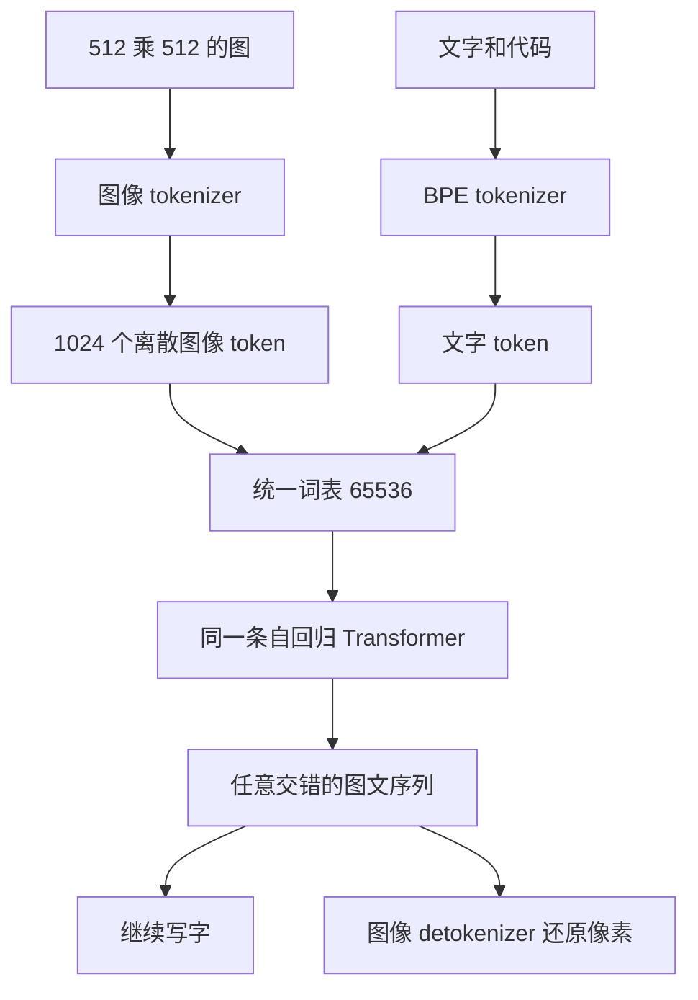
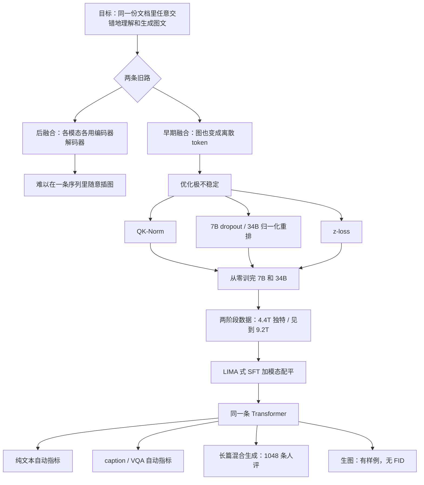

# Chameleon：把图像也切成 Token，同一条 Transformer 从零学会又看又画

<!-- release-date: 2024-06-18 -->

> 本文依据 Chameleon Team（FAIR at Meta）的 **Chameleon: Mixed-Modal Early-Fusion Foundation Models**，即 arXiv:2405.09818v2，封面水印 `arXiv:2405.09818v2 [cs.CL] 21 Mar 2025`，共 27 页。论文封面日期是 May 17, 2024；arXiv 第一次公开是 2024-05-16。页码均指这份 27 页 PDF。全文把三件事分开标注：**报告写了什么**、**我们如何解释它**、**哪些是外部资料补充**。
>
> `release-date` 取 **2024-06-18**。覆盖对外公布的模型：官方博客当日宣布以研究许可开放 7B / 34B 关键组件。arXiv v1 是论文日、当时权重不可用；v2 修订日不得回写。Hugging Face `createdAt` 禁用。完整证据见文末。
>
> 同方向后作只作边界：本篇讲的是「早期融合、图文都变成离散 token、同一条 Transformer 又能理解又能生成图」。不要把后作的实验数字读进来。

## 读前先把几个词说成人话

后面会反复碰到这几个名字，先用人话过一遍：

- **Token（词元）**：模型读写时的最小单位。一个英文单词、一个汉字，都可能被切成一块或几块。
- **离散化 / 量化**：把连续的东西（像素、向量）变成整数编号。编号来自一张固定的查询表。
- **码本（codebook）**：那张查询表。表里有固定数量的候选向量，每个候选一个编号。编码时找最接近的候选，记下编号；解码时按编号取回向量，再还原成像素。
- **自回归（autoregressive）**：一次只预测下一个 Token，把刚预测出来的接回输入，再预测下一个。写字是这样；把图像也变成整数编号之后，画图也可以是这样。
- **早期融合（early fusion）**：一开始就把各模态投进同一套表示、同一份权重。相对的是**后融合（late fusion）**：图像走自己的编码器，文字走自己的编码器，中间某处再拼起来。
- **QK-Norm（query-key 归一化）**：注意力里，先把 Query 和 Key 各自做一次归一化，再算点积。用来管住送进 softmax 的向量长度。
- **z-loss**：给最后一层 softmax 的配分函数加一项惩罚，阻止 logits 整体漂走。
- **SFT（Supervised Fine-Tuning，监督微调）**：用「问题—标准答案」成对数据继续训练。这篇对齐几乎只做这一步，没有 RLHF。

报告自己点名的两条能力必须先分开：

- **理解**：看图说话。VQA、caption、纯文本问答。
- **生成**：往外吐图像 token，再解回像素。可以单独画图，也可以在一段文字中间插入一张图。

后文所有「对 GPT-4V 赢了多少」都是**人评、而且期望输出是图文交错**的那一套；所有「MMLU 多少」默认是**没做 SFT 的预训练基座**。两套数字不能混用。

## 先说矛盾：后融合写不出交错文档，早期融合又训不稳

2024 年前后，公开的多模态基模大多还是后融合。图像有自己的编码器，文字有自己的语言模型，中间用一层投影或一组交叉注意力接起来。这条路适合「看一张图、写一段话」：caption、VQA、视觉指令跟随。

它不适合另一件事：**在同一份文档里，任意交错地生成图和文。**

因为生成端被拆开了。文字由语言模型吐，图像往往外包给另一个解码器或扩散模型。模型很难在一段食谱中间决定「这里该插入一张成品图」，再接着把后文写完。报告把这件事称为完整的多模态文档建模，并认为它是图像生成、看图推理和纯文本 LLM 的共同推广（PDF p. 1）。

早期融合的回答看起来很干净：把图像也编成离散 token，和文字用同一张词表、同一条 Transformer、同一个「预测下一个 token」目标。从第一层开始，图和文就已经在同一套表示里。

代价立刻出现。报告写得很直白：这条路的技术挑战主要是**优化稳定性和规模**（PDF p. 1）。超过 8B 参数、超过 1T token 之后，发散常常拖到训练后段才爆发（PDF p. 6）。消融还显示：关掉图像生成，同一套训练就不炸（PDF p. 7，Figure 6b）。

所以这篇真正要解决的，不是再发明一个视觉编码器，而是：

> **怎样从零、在早期融合设定下，把 7B 和 34B 稳定地训完；再用一份轻量对齐，让同一个模型既能做 VQA 和 caption，又能写纯文本、画图、生成长篇混合文档。**

## 一句话先说清

Chameleon 不是「在 Llama-2 外面接一个视觉编码器」。

它从零训练一条稠密 Transformer，把 512×512 的图压成 1024 个离散 token，和文字共用 65536 的词表；训练过程中一共见到 9.2T token，其中既有纯文本，也有图文对和交错网页（PDF p. 4、8）。为了让这件事在 bf16 下不炸，它改了注意力归一化、层归一化的位置，并给最后的 softmax 加了 z-loss。

对齐很轻：高质量 SFT，没有 RLHF。7B 和 34B 两档。

报告给出的成绩需要按评测类型分开读：caption 的 CIDEr 是自动指标；纯文本对 Llama-2 的优势也是自动指标；「匹敌更大模型」的长篇混合生成是 1048 条提示上的人评，而且强基线还被外挂了 DALL-E 3。图像生成本身，这份 PDF **没有 FID、CLIP 或 GenEval**。

它真正想证明的是：

> **只要图像也变成离散 token，理解和生成可以共用同一条自回归主干。难的不是这个想法，而是从零把它训稳。**

## 报告地图：27 页里各写了什么

这份 PDF 27 页。正文大约到第 18 页，参考文献占第 18–22 页，附录样例和人评分表占第 23–27 页。先摊开，后面就知道哪里能深挖、哪里只能到此为止。

| 报告章节 | PDF 页 | 讲了什么 |
|---|---|---|
| 摘要 + §1 引言 | p. 1–2 | 早期融合定位；头条声明；四条贡献 |
| Figure 1 | p. 2 | 图文都变成离散 token，同一条自回归主干 |
| Figure 2–4 | p. 3–5 | 交错生成样例（展示，不是证据） |
| §2.1 Tokenization | p. 4 | 512×512 → 1024 token，码本 8192，词表 65536 |
| §2.2 预训练数据 | p. 5–6 | 两阶段；2.9T 纯文本 + 1.5T 图文对 + 0.4T 交错 |
| §2.3 稳定性 | p. 6–8 | QK-Norm、dropout、归一化重排、z-loss；Table 1、Table 2 |
| §2.4 推理 | p. 8 | 交错生成的逐步依赖、模态掩码、图像块定长 |
| §3 对齐 | p. 9–11 | LIMA 式 SFT；六类数据；模态配平 |
| Table 3 / Figure 7 | p. 9–10 | SFT 规模与样例 |
| §4 人评与安全 | p. 11–14 | 1048 条提示；Gemini / GPT-4V 及外挂图像版 |
| Figure 9 / Table 4 / Table 5 | p. 12–15 | 完成率、胜率、标注一致性、安全测试 |
| §5.1 纯文本 | p. 15–16 | 预训练基座对 Llama-2 / Mixtral / Gemini-Pro |
| §5.2 图到文 | p. 16–17 | caption 与 VQA；Table 7 |
| §6 相关工作 | p. 17 | 和后融合、Gemini、CM3Leon 的位置 |
| §7 结论 | p. 17–18 | 收束，几乎不单列失败模式 |
| 附录 A / B | p. 23–27 | 更多样例；人评分表 |

三件事值得先知道：

- **没有图像生成的自动指标表。** 「non-trivial image generation」写在摘要里（PDF p. 1），证据是人评和样例。
- **稳定性是这篇真正的方法贡献。** 架构骨架几乎就是 Llama-2，改动集中在归一化和正则。
- **人评的 60.4% / 51.6% 不能按摘要字面去用。** 附录把分母和对照对象写清楚了，正文和摘要有一处对不齐。后面会回表。

## 先看全景：同一条序列、两种颜色的 token

根据 PDF p. 2 的 Figure 1 重画。这是机制示意，不是吞吐实测。绿色是文字 token，蓝色是图像 token；图的两端还有 Start Image / End Image 边界。

读这张图时记住三件事：

1. **没有单独的视觉编码器接在主干外面。** 图像先被量化成整数，再和文字走完全相同的 Transformer。
2. **生成也走同一条路。** 模型吐出图像 token 块，再由 detokenizer 还原成图；不是另调一个扩散模型。
3. **训练数据本身就是交错的。** 纯文本、单张图配一段话、网页里图文穿插，三种都出现。

这和后融合的差别，可以用写菜谱来想。后融合模型通常能看懂香蕉的照片、再写出食谱文字；真要配一张成品图，往往得把描述交给另一个生图模型。Chameleon 想在「这里插入一张图」的位置，自己接着往下生成 1024 个图像 token，然后再把烤箱温度写完。

## 核心设计一：统一离散 token，图像也变成整数编号

### 旧问题

后融合把「看」和「写」拆成两套网络。好处是可以复用已经训好的视觉编码器和语言模型；坏处是生成端不对称。报告点名的后融合例子包括带独立图像/文本编码器的路线，以及带领域专用解码器的生图模型（PDF p. 1）。

早期融合把不对称取消了：大家都是 token。但这要求图像 tokenizer 足够好——它决定了后面所有层能看见、能画出的上限。

### 新设计

报告新训了一个图像 tokenizer，做法基于 Gafni 等人 2022 年的 Make-A-Scene（PDF p. 4）。规格必须按原文写：

- 输入分辨率：$512 \times 512$
- 每张图编成 **1024 个离散 token**
- 码本大小 **8192**
- 只用授权图像来训这个 tokenizer
- 含人脸的图像在 tokenizer 预训练里上采样 2 倍
- 明确弱点：重建含大量文字的图像很差，因此重度 OCR 任务被这个 tokenizer 本身卡住

文字侧新训了一个 BPE tokenizer，词表大小 **65,536，其中已经包含那 8192 个图像码本编号**，用 sentencepiece 实现（PDF p. 4）。

### 工作机制

1024 这个数字很好记：$512 / 16 = 32$，$32 \times 32 = 1024$。也就是按 16 像素的格子切，每格一个离散编号。报告没有把「16 像素一格」写成公式，这是从规格反推的；原文只保证了 512×512 → 1024 token。

词表把图像编号和文字子词放在一起，所以 Transformer 看到的永远是整数 ID。注意力、前馈、位置编码都不需要知道「当前这个 ID 来自像素还是来自单词」。边界靠 Start Image / End Image 这类特殊 token 来标。

生成一张图时，模型必须连续吐出固定长度的一块图像 token，再送给 detokenizer。这和文字的可变长度不同，后面推理一节会再碰到。

### 收益

架构因此变简单：没有模态专用编码器，也没有模态专用解码器。同一份权重既做理解也做生成。相关工作里，报告把 Gemini 称为最像的早期融合对照，但强调 Gemini 仍使用独立的图像解码器，而 Chameleon 是端到端稠密模型、没有路由组件（PDF p. 17）。

### 代价和边界

量化是信息瓶颈。码本只有 8192 个候选，对不进码本的细节，编码那一刻就没了。报告自己承认 OCR 上限来自 tokenizer，不是后面 Transformer 再努努力就能补的（PDF p. 4）。人评集合里也几乎没有 OCR / 读图表题，脚注写得很清楚（PDF p. 12）。

本站另一篇 Transfusion 后来走了相反的选择：图像保持连续，用扩散来画。那是后作，数字不要读进这篇。本篇只负责把「离散视觉 token + 自回归」这条路在 2024 年中的配方讲清楚。

### 可迁移启发

如果你的项目既要看图又要画图，先问：量化损失能不能被任务接受？接受的话，架构会简单一个数量级；不接受的话，不要为了「统一成同一种符号」强行量化。Chameleon 把这个选择做到了 34B，同时也把 OCR 弱点和开源时的生图安全问题一起暴露出来。

## 核心设计二：从零训练为什么会炸，以及他们改了哪些归一化

### 旧问题

骨架几乎就是 Llama-2：RMSNorm、SwiGLU、RoPE（PDF p. 6）。按纯文本配方把混合模态数据灌进去，会在训练中后期出现复杂发散，有时已经走完 20%–30% 才爆（PDF p. 6）。

报告把原因收到 softmax 的平移不变性上：

$$
\operatorname{softmax}(z)=\operatorname{softmax}(z+c)
$$

图和文的熵差很多。权重完全共享时，每个模态都会把「自己的」向量略微拉长，好在 softmax 里抢到更大的份额。训练初期还看不出来；进了 bf16 的有效表示范围之后，就变成 logit 漂移，最后一层输出范数失控。Figure 5a 把输出范数和处理步画在一起：范数狂涨，是未来 loss 发散的强先行指标（PDF p. 6）。

两个对照把故事钉死：

- 7B 去掉 QK-Norm，大约一个 epoch 的 20% 处发散（PDF p. 6–7，Figure 5b）。
- 关掉图像生成，同一条 7B 曲线不炸（PDF p. 7，Figure 6b）。

所以不稳定不是「多模态」四个字，而是**共享权重 + 图像生成 + softmax** 叠在一起。

### 新设计：三处补丁，7B 和 34B 配方还不一样

softmax 在 Transformer 里出现两次：注意力内部，以及最后的词表分类。补丁也按这两处来。

**1. QK-Norm。** 在注意力里对 Query 和 Key 做 LayerNorm，直接管住送进 softmax 的向量长度。7B 和 34B 都开。报告说这是相对 Llama 架构的第一处偏离，灵感来自 Dehghani 等人和 Wortsman 等人（PDF p. 6）。

**2. Dropout 或归一化重排，两者不宜同时用。**

7B 的稳定配方是：QK-Norm + 注意力和前馈后面的 dropout 0.1（PDF p. 7–8）。

34B 加 dropout 不够。它改用 Swin Transformer 那套归一化位置，把 norm 从「进子层之前」挪到「子层输出上」（PDF p. 7）：

$$
\begin{aligned}
\text{Chameleon-34B:}\quad
h &= x + \operatorname{attention\_norm}(\operatorname{attention}(x)) \\
\text{output} &= h + \operatorname{ffn\_norm}(\operatorname{feed\_forward}(h)) \\[0.6em]
\text{Llama-2:}\quad
h &= x + \operatorname{attention}(\operatorname{attention\_norm}(x)) \\
\text{output} &= h + \operatorname{feed\_forward}(\operatorname{ffn\_norm}(h))
\end{aligned}
$$

人话版：Llama-2 是先归一化再计算；34B 是先计算，再把子层输出的范数按住，然后加回残差。报告认为这能限制前馈块的范数增长；SwiGLU 本身是乘法，范数更容易被放大（PDF p. 7）。

重排和 dropout 合在一起不好用，所以 34B 不用 dropout。事后他们发现：7B 如果用归一化重排，也可以去掉 dropout；**QK-Norm 在两种规模上都是刚需**（PDF p. 7）。

发散之前，有没有重排，困惑度看不出差别。也就是说，这不是「让模型更强」的改动，是「让模型能活着训完」的改动。

**3. z-loss。** QK-Norm 管注意力内部的 softmax，不管最后一层分类。他们给配分函数加正则。设

$$
\sigma(x)_i=\frac{e^{x_i}}{Z},\qquad Z=\sum_i e^{x_i}
$$

往总损失里加 $10^{-5}\log^2 Z$（PDF p. 7）。7B 需要 dropout 和 z-loss 一起上；34B 只需要 z-loss。

### 优化器其余部分

AdamW，$\beta_1=0.9$，$\beta_2=0.95$，$\epsilon=10^{-5}$；4000 步线性 warmup，之后学习率指数衰减到 0；weight decay 0.1；全局梯度裁剪阈值 1.0（PDF p. 7）。学习率两档都是 $1.0\times 10^{-4}$，比 Llama-2 的 $3.0\times 10^{-4}$ / $1.5\times 10^{-4}$ 更保守（PDF p. 8，Table 1）。

### 收益、代价、可迁移启发

收益很具体：7B 和 34B 都画出了前 60 万步的稳定曲线（PDF p. 7，Figure 6a）。没有这些补丁，早期融合在这个规模上根本训不完，后面所有榜都无从谈起。

代价也具体：

- 学习率更低，同样数据要更多步；
- 7B 带着 0.1 dropout，等于主动扔容量换稳定；
- 归一化重排改变了残差的数值路径，推理实现必须按 34B 的公式来，不能假设「Llama-2 的 pre-norm 内核可以直接套」。

对自己项目最有用的不是抄 QK-Norm 三个字母，而是这条诊断链：**先盯最后一层输出范数，再判断是注意力 softmax 还是词表 softmax 在漂，再对症下药。** 多模态共享权重时，范数竞赛是默认风险，不是偶发 bug。

## 核心设计三：两阶段预训练，以及 4.4T、9.2T、约 10T 分别指什么

数据数字在报告里出现了三套，必须分开写，不能揉成「训了 10T」。

### 第一阶段：前 80%，大规模无监督

三桶（PDF p. 5–6）：

| 桶 | 报告写的规模 | 含不含图像 |
|---|---|---|
| 纯文本 | 2.9T token；Llama-2 预训练数据 + CodeLlama 预训练数据 | 不含图像 |
| 图文对 | 14 亿对，tokenize 后 1.5T token；公开来源 + 授权数据 | 含图像。图被 resize 并中心裁成 512×512 |
| 交错图文 | 0.4T token；公开网页，不含 Meta 产品或服务数据 | 含图像，过滤口径与图文对相同 |

图文对还有一个顺序细节：50% 的时间图像在文字前面，也就是按 caption 来训（PDF p. 5）。

三桶相加是 $2.9+1.5+0.4=4.8$T。这个和 Table 1 对不上，下一小节单独说。

### 第二阶段：最后 20%，提高质量

第一阶段数据的权重降到 50%，混入更高质量数据，图文 token 比例大致保持；另外加入一批指令微调训练集的过滤子集（PDF p. 6）。报告没给第二阶段各来源的 token 数，也没给「更高质量」的过滤规则。

### 见到的 token 次数：9.2T；图注写成约 10T

Table 1 把 Chameleon 的 Tokens 列写成 **4.4T**，Epochs **2.1**（PDF p. 8）。正文接着写：在完整训练数据上走 2.1 个 epoch，训练过程中一共见到 **9.2T token**（PDF p. 7–8）。$4.4\times 2.1=9.24$，和 9.2 对得上。

Figure 1 图注写的是在约 10T 交错混合模态数据上从零端到端训练（PDF p. 2）。引言又说 Chameleon-34B 的 token 数是 Llama-2 的 5 倍（PDF p. 1）。Llama-2 是 2.0T（Table 1），5 倍大约是 10T，对应的是「见到的次数」，不是 Table 1 那一列 4.4T。

**9.2T / 约 10T 里含图像。** 第一阶段就已经有 1.5T 图文对 token 和 0.4T 交错 token；第二阶段还保持相近的图文比例。不要把 9.2T 读成「纯文本 9.2T」。

第一阶段三桶之和 4.8T，和 Table 1 的 4.4T 差 0.4T。报告没有解释。可能的原因包括第二阶段权重调整、过滤、或 4.4T 是去重后的独特 token——都是猜测，不当作报告原话。

### 硬件

预训练在 Meta 的 Research Super Cluster 上，对齐在其他内部研究集群；两边都是 NVIDIA A100 80 GB。RSC 用 Quantum InfiniBand，研究集群用 Elastic Fabric（PDF p. 8）。

| 模型 | 并发 GPU | GPU 小时 |
|---|---:|---:|
| 7B | 1024 | 856,481 |
| 34B | 3072 | 4,282,407 |

（PDF p. 8，Table 2）

7B 全局 batch 约 8M token（$2^{23}$），34B 约 12M token（$3\times 2^{22}$）（PDF p. 7）。上下文长度两档都是 4k；34B 用 GQA，7B 不用（PDF p. 8，Table 1）。

## 核心设计四：轻量对齐，以及为什么 SFT 也要配平模态

### 旧问题

预训练会「下一个 token」；不会自动知道用户想要一段带插图的回答，还是一句拒答。纯文本 LLM 已经有 SFT / RLHF 配方。混合模态多出来的问题是：模型可能学会一个**与内容无关的模态先验**——提示里并没有要求画图，它也开始狂吐图像 token；或者反过来，该插图的地方一直写字。

### 新设计

对齐明确写成 LIMA 那条轻量路线：高质量 SFT，不在这篇报告里做 RLHF（PDF p. 9，引用 Zhou et al., 2023）。数据分成六类（PDF p. 9，Table 3）：

| 类别 | 样本 | Token | 图像 |
|---|---:|---:|---:|
| Text | 1.6M | 940.0M | — |
| Code | 14.1K | 1.1M | — |
| Visual Chat | 15.6K | 19.4M | 16.7K |
| Image Generation | 64.3K | 68.0M | 64.3K |
| Interleaved Generation | 16.9K | 35.8M | 30.7K |
| Safety | 95.3K | 38.6M | 1.6K |

文字 SFT 继承 Llama-2，代码 SFT 继承 CodeLlama。生图 SFT 用美学分类器打分，先留至少 6 分的图，再取最接近 512×512 的 top 64K。Visual Chat 和交错生成找第三方供应商收高质量数据，不含 Meta 用户数据（PDF p. 9）。

安全数据是「可能诱发不安全输出的提示 + 拒答」，覆盖暴力、管制物品、隐私、色情等；来源包括 Llama-2-Chat、Rainbow Teaming 合成文本、Pick-A-Pic 里人工挑的生图提示、网络安全，以及内部标注和自动扩展的混合模态提示。报告特别强调：混合模态攻击不在纯文本或文生图安全数据的分布里（PDF p. 9）。

优化：余弦学习率，起点 $1\times 10^{-5}$，weight decay 0.1，batch 128，序列最长 4096；把多条 prompt–answer 打包进同一序列，中间插入分隔 token；**只在 answer token 上算损失**；dropout 0.05；预训练的 z-loss 保留（PDF p. 9–11）。

图像预处理在 SFT 里按角色分开：提示里的图用加边 padding 的 resize，保证信息不被裁掉；回答里的图中心裁，保证生成观感（PDF p. 11）。

### 模态配平

报告写：SFT 阶段如果某一种模态配对严重失衡，模型会学到无条件先验，把某一种模态压哑巴或放得太大（PDF p. 9）。这是早期融合特有的对齐问题。后融合模型通常由「现在该不该调用生图模块」的外部逻辑管；Chameleon 的「该不该开始吐图像 token」就写在同一条分布里。

### 代价

对齐很轻，也意味着安全主要靠拒答样本，而不是奖励模型。报告在红队一节自己说：RLHF / RLAIF 还能再硬，当前这套是给「合理、善意使用这份研究产物」的保护（PDF p. 14）。开源时把生图能力掩掉，是这条轻量对齐在产品侧的直接后果——那是官方博客的话，下一节当外部补充。

## 推理：交错生成让「每一步看一下当前 token」变成刚需

训练可以假装整条序列已经铺好。推理必须一边生成一边决定：现在在写字，还是在画图。

报告列了三条独特困难（PDF p. 8）：

1. **逐步数据依赖。** 当前步是图像还是文字，解码公式不同。每一步都要把 token 从 GPU 拷回 CPU 做控制流。
2. **模态约束掩码。** 只允许生图时，词表里的文字 token 必须被掩掉。
3. **图像块定长。** 文字可变长；一张图对应固定一块 token（按 tokenizer 规格就是 1024 个）。

他们为此写了独立的 PyTorch 推理管线，注意力核来自 xformers。支持文字和图像的流式输出。非流式时，整块图像 token 可以融合生成、少做条件计算；即便如此，写字阶段仍要检查有没有碰到 image-start，以便切到图像解码（PDF p. 8）。

这不是算法贡献，但是早期融合真正落地时一定会碰到的系统税：统一表示省掉了双塔，却把控制流从「两个模块之间的接口」搬进了「每一个生成步」。

## 7B 和 34B：同一条故事，两套稳定配方

Table 1 值得整张留下（PDF p. 8）：

| 模型 | 参数 | 上下文 | GQA | 数据 | 学习率 | Epochs | Dropout | z-loss | QK-Norm |
|---|---|---|---|---|---|---|---|---|---|
| Llama-2 | 7B | 4k | 否 | 2.0T | $3.0\times 10^{-4}$ | 1.0 | 0.0 | 0.0 | 否 |
| Llama-2 | 34B | 4k | 是 | 2.0T | $1.5\times 10^{-4}$ | 1.0 | 0.0 | 0.0 | 否 |
| Chameleon | 7B | 4k | 否 | 4.4T | $1.0\times 10^{-4}$ | 2.1 | 0.1 | $10^{-5}$ | 是 |
| Chameleon | 34B | 4k | 是 | 4.4T | $1.0\times 10^{-4}$ | 2.1 | 0.0 | $10^{-5}$ | 是 |

读这张表时，不要只看「Chameleon 数据更多」。34B 比 7B 多出来的，是 GQA、归一化重排、以及「不用 dropout」。稳定配方不能在两档之间直接复制：7B 靠 dropout，34B 靠把 norm 挪位置。

后文评测也要看是哪一档、有没有 SFT：

- 纯文本 Table 6：预训练基座，7B 和 34B 都报；
- 图到文 Table 7：只报 34B，还分成预训练 / 单任务 SFT / 多任务微调；
- 人评：Chameleon 34B；
- 安全：7B 和 34B，红队只打了更大的那一档。

正文安全测试有一处把更大的模型写成 30B（PDF p. 14），Table 5 表头写 34B（PDF p. 15）。官方仓库和 Hugging Face 卡片后来也出现 30B 这种叫法。那是外部命名，不拿来改论文表。本文按 PDF 主表称 34B，并在文末标明仓库侧的叫法。

## 实验怎么证明：先分清自动指标和人评

摘要里的成绩有四句，类型完全不同（PDF p. 1–2）：

1. caption **SOTA** —— 自动指标 CIDEr；
2. 纯文本 **超过 Llama-2**，并和 Mixtral 8x7B、Gemini-Pro 有竞争力 —— 自动指标；
3. **非平凡的图像生成** —— 没有自动指标表；
4. 长篇混合生成的人评 **匹敌更大模型** —— 1048 条提示、三人多数票。

下面按这个顺序回表。Table 7 里出现的 Flamingo / IDEFICS / Llava-1.5 数字，是**本 PDF 自己的对照列**，不是去那些论文主表里抄来的。

### 纯文本：预训练基座，没做 SFT

评测协议跟 Llama-2，常识和阅读理解默认 0-shot；GSM8K 8-shot，MATH 4-shot，maj@N（PDF p. 15–16）。摘几行关键的（Table 6，PDF p. 15）：

| 任务 | Chameleon 7B | Chameleon 34B | Llama-2 7B | Llama-2 34B | Llama-2 70B | Mixtral 8x7B | Gemini-Pro |
|---|---:|---:|---:|---:|---:|---:|---:|
| PIQA | 79.6 | 83.3 | 78.8 | 81.9 | 82.8 | 83.6 | — |
| HellaSwag 0-shot | 74.2 | 82.7 | 77.2 | 83.3 | 85.3 | 84.4 | — |
| HellaSwag 10-shot | 75.6 | 85.1 | — | — | 87.1 | 86.7 | 84.7 |
| ARC-C | 46.5 | 59.7 | 45.9 | 54.5 | 57.4 | 59.7 | — |
| BoolQ | 81.4 | 86.0 | 77.4 | 83.7 | 85.0 | — | — |
| GSM8K maj@1 | 41.6 | 61.4 | 14.6 | 42.2 | 56.8 | — | — |
| GSM8K 更高 maj | 50.9 maj@8 | 77.0 maj@32 | — | — | — | 75.1 maj@32 | 86.5 maj@32 CoT |
| MATH maj@4 | 12.9 | 24.7 | — | — | — | 28.4 | 32.6 |
| MMLU | 52.1 | 65.8 | 45.3 | 62.6 | 68.9 | 70.6 | 71.8 |

报告自己的读法（PDF p. 15–16）：

- 常识和阅读：两档都对得上同规模 Llama-2；34B 在 8 项里有 5 项超过 Llama-2 70B，和 Mixtral 8x7B 同一档。
- GSM8K：7B 的 maj@8（50.9）接近 Mistral 7B 的 maj@8（52.1）；34B 的 maj@1（61.4）超过 Llama-2 70B（56.8），maj@32（77.0）略高于 Mixtral（75.1）。
- MMLU：两档都超过对应 Llama-2；34B 的 65.8 接近 Mixtral 70.6 / Gemini-Pro 71.8，离 GPT-4 的 86.4 还远。

这些增益，报告归因于三件事，而不是「早期融合神奇地让文字变好」：Llama-2 预训练数据走了两个 epoch、整体算力更多、代码数据、以及最后 20% 的高质量数据（PDF p. 16）。HellaSwag 0-shot 上，Chameleon-7B 的 74.2 还低于 Llama-2 7B 的 77.2，并不是「全面碾压」。

### 图到文：caption 的 SOTA 主要在 COCO CIDEr

Table 7 只报 34B（PDF p. 16–17）。caption 用 CIDEr，COCO / Flickr30k 都是 Karpathy 测试划分；VQA 用 VQA-v2 test-dev。Chameleon 这边 caption 最长 30 个 token。预训练没为 0-shot 专门排版，评测时借用了其他模型公开的提示。

| 模型 | 设定 | COCO CIDEr | Flickr30k CIDEr | VQAv2 |
|---|---|---:|---:|---:|
| Flamingo-80B | 预训练，32/4/32-shot | 113.8 | 75.1 | 67.6 |
| IDEFICS-80B | 预训练，32/4/32-shot | 116.6 | 73.7 | 65.9 |
| Chameleon-34B | 预训练，2-shot | 120.2 | 74.7 | 66.0 |
| Chameleon-34B-SFT | 单任务微调 | 140.8（0-shot） | 82.3（2-shot） | — |
| Chameleon-34B-MultiTask | 多任务微调 | 139.1（2-shot） | 76.2 | 69.6 |
| Flamingo-80B-FT | 微调 | 138.1 | — | 82.0 |
| IDEFICS-80B-Instruct | 32-shot | 123.2 | 78.4 | 68.8 |
| GPT-4V | API，8-shot | 78.5 | 55.3 | 77.2 |
| Gemini Pro | API | 99.8（2-shot） | 82.2（4-shot） | 71.2 |

报告的读法（PDF p. 16–17）：

- **预训练 caption：** 34B 用 2-shot，COCO 超过 80B 的 Flamingo / IDEFICS 的 32-shot；Flickr30k 与它们持平。
- **微调 caption：** 单任务 SFT 和多任务在 COCO 上都超过表里其他模型；Flickr30k 上 SFT 最高，多任务次之。
- **VQA：** 预训练 2-shot 的 66.0，大约对上 Flamingo / IDEFICS 的 32-shot。多任务微调到 69.6，接近 IDEFICS-Instruct 和 Gemini Pro，明显低于 Flamingo-FT 的 82.0、GPT-4V 的 77.2、Gemini Ultra 的 77.8。Llava-1.5 在 VQAv2 上高于 Chameleon-34B，报告把它归因于 GPT-4 对话、ShareGPT、GQA 和区域级 VQA 等额外微调，并说它在其他任务上落后。

所以「caption SOTA」基本落在 COCO CIDEr，尤其是微调后的 140.8。VQA 不是同一句话能罩住的 SOTA。GPT-4V / Gemini 的 CIDEr 很低，报告说是他们用 API 试了多种提示之后能拿到的最好成绩（PDF p. 16）；这类 API 数字只能当参考，不能当闭源模型的正式榜。

### 长篇混合生成：人评，1048 条，不是自动指标

这是报告最强调的「新能力」，也是最容易被摘要带跑的一段。

**题集。** 第三方众包，先让标注者按生活场景构思提示，再由三人多数票丢掉「不清楚」和「并不期望图文输出」的题。最终 **1048** 条：441（42.1%）输入本身就是混合模态，607（57.9%）纯文本；期望输出一律是图文混合。人工分成 12 类，Brainstorming 18.6%、Explanation 14.4%、How-to 12.5% 等（PDF p. 11，Figure 8）。OCR / 读图表几乎没有，脚注写明不是故意考这些（PDF p. 12）。

**对照。** Chameleon 34B 对 GPT-4V 和 Gemini Pro 的 API。这两个 API 当时只返回文字。报告又做了加硬版：让它们在需要生图时改写 caption，再用 DALL-E 3 配图，称为 GPT-4V+ 和 Gemini+（PDF p. 12）。绝对评测三人各自打；相对评测两人回答并排、顺序随机。

**绝对完成率，读自 Figure 9a 的正文数字（PDF p. 12）：**

| 模型 | 完全完成 | 说明 |
|---|---:|---|
| Chameleon | 55.2% | 原生就能插图 |
| GPT-4V+ | 44.7% | 文字 + DALL-E 3 |
| Gemini+ | 37.6% | 文字 + DALL-E 3 |
| GPT-4V | 23.1% | 纯文字 API |
| Gemini | 17.6% | 纯文字 API |

报告自己怀疑：题集期望混合输出，纯文字回答容易被看成只完成了一半（PDF p. 12）。这是评测设计带来的倾斜，不是 Gemini / GPT-4V「不会看图」。

按输入模态拆开（附录 Table 10，PDF p. 25）：Chameleon 在纯文本提示上完全完成 57.7%，混合输入 55.3%；Gemini+ / GPT-4V+ 则是混合输入略好。按任务类型：Brainstorming、Comparison、Hypothetical 较好，Identification、Reasoning 较差；Story 上 GPT-4V+ 的完全完成率（53.7%）高于 Chameleon（31.7%）（PDF p. 12、24，Table 9）。

**相对胜率必须回附录。** 脚注定义：赢记 1 分，平记 0.5 分（PDF p. 13）。正文写「总体胜率对 Gemini+ 60.4%、对 GPT-4V+ 51.6%」（PDF p. 13）。附录 Table 11 / Table 12 给出的是计数（PDF p. 26）：

| 对照 | 赢 / 平 / 负 | 胜率 | 样本 |
|---|---|---:|---:|
| vs Gemini+ 全体 | 435 / 362 / 251 | **58.8%** | 1048 |
| vs Gemini+ 混合输入 | 194 / 145 / 102 | **60.4%** | 441 |
| vs GPT-4V+ 全体 | 375 / 331 / 342 | **51.6%** | 1048 |
| vs GPT-4V+ 混合输入 | 149 / 119 / 173 | 47.3% | 441 |
| vs Gemini 全体（无外挂图） | 561 / 327 / 160 | 69.1% | 1048 |
| vs GPT-4V 全体（无外挂图） | 482 / 329 / 237 | 61.7% | 1048 |

摘要和引言把 60.4%、51.6% 写成对 Gemini-Pro 和 GPT-4V 的偏好率（PDF p. 1–2）。回表之后：

- 51.6% 对得上 **全体 vs GPT-4V+**；
- 60.4% 对得上 **混合输入子集 vs Gemini+**，不是全体 58.8%，也不是「没外挂 DALL-E 3 的 Gemini」。

三人一致性一般：相对评测里约 10% 完全没共识，约 55%–60% 只有两人一致（PDF p. 14，Table 4）。任务完成率的 Krippendorff's Alpha 只有 0.338（PDF p. 14）。报告自己也说，许多题目上 Chameleon 和基线接近，相对判断并不容易。

人评的边界，§4.5 写了三条（PDF p. 14）：提示来自众包不是真实用户；覆盖有限；OCR / Infographics 被排除；当时没有另一个原生混合生成模型可直接比，只能给 API 文字外挂 DALL-E 3。

### 图像生成：有能力，没有自动指标

摘要说「non-trivial image generation, all in a single model」（PDF p. 1）。贡献列表又写 high quality image generation（PDF p. 2）。正文没有 FID、没有 CLIP、没有 Inception Score、没有 GenEval。能作为证据的是：

- Figure 2–4 和附录 A 的样例（PDF p. 3–5、23）；
- 人评里「图通常和上下文相关，交错文档好看」（PDF p. 14）——这是观察，不是表。

不要用后作复现 Chameleon 配方时的 FID 来填这个空。那不是本 PDF 的实验。

### 安全测试：自动没有，人标有

2 万条众包提示，覆盖文本和混合输入，以及诱发不安全文字、图像或混合输出的意图。7B 不安全 78 条（0.39%），更大一档 19 条（0.095%）。内部红队对更大一档打了 445 轮（含多轮），7 条不安全（1.6%），20 条不确定（4.5%）（PDF p. 14–15，Table 5）。绝对人评里，各模型都几乎没有 objectionable content，三人判断高度一致（PDF p. 13，Figure 10）。

## 限制、没公开的，以及开源时砍掉了什么

### 报告写了的限制

- tokenizer 重建带字的图很差，OCR 被上限卡住（PDF p. 4）；
- 人评不是真实用户日志，题型偏「请给出图文回答」，对只输出文字的 API 不公平（PDF p. 14）；
- 没有和其他原生混合生成模型对比（PDF p. 14）；
- 轻量 SFT 挡得住善意使用，挡不住认真越狱；RLHF / RLAIF 还能再做（PDF p. 14）。

结论节几乎不另写失败模式（PDF p. 17–18）。限制要自己从 tokenizer、人评讨论和开源声明里读。

### 报告没有公开的

- 图像 tokenizer 的码本训练损失、重构 FID、是否在主干训练时冻结；
- 第二阶段各来源的 token 数和过滤规则；4.4T 和 4.8T 差在哪；
- 并行策略、精度、MFU、墙钟时间、钱；
- 推理核的具体融合方式和吞吐数字；
- 图像生成的任何自动指标；
- RLHF 奖励模型——这篇没有做。

### 外部补充：权重开了理解，没开生图

下面不是 PDF 原文。

2024-06-18，Meta FAIR 官方博客宣布：在研究许可下公开 Chameleon 7B 和 34B 的关键组件；当天放出的模型经过安全调优，**支持混合模态输入、只输出文字**；「At this time, we are not releasing the Chameleon image generation model」，理由是风险仍在，希望社区先做检测和缓解。同一天的 Meta 新闻室稿、AI at Meta 官方账号帖子、以及共同一作 Srinivasan Iyer 的帖子（「Image-gen capabilities are masked for safety reasons」）口径一致。

[官方博客](https://ai.meta.com/blog/meta-fair-research-new-releases/) · [新闻室](https://about.fb.com/news/2024/06/releasing-new-ai-research-models-to-accelerate-innovation-at-scale/) · [GitHub 仓库](https://github.com/facebookresearch/chameleon)（2025-09-01 起只读归档）

仓库 README 把更大一档称为 30B，Hugging Face 卡片同样写 7B 和 30B checkpoint。社区后来的 fork、非官方生图解锁，不是本报告系统的一部分，也不拿来补这篇没写的实现。

## 被证据支持的，不要读过的

### 被证据支持的

- 早期融合可以在 7B / 34B 上从零训完，前提是 QK-Norm + z-loss，并按规模选择 dropout 或归一化重排（Figure 5、Figure 6、Table 1）。
- 关掉图像生成就不炸，说明不稳定和「共享权重下的生图」绑定（Figure 6b）。
- 预训练 34B 用更少 in-context 例子，COCO CIDEr 超过表里更大的后融合预训练模型（Table 7）。
- 没做 SFT 的纯文本基座，整体超过同规模 Llama-2；报告把原因主要写在数据重复、代码和高质尾段，而不是融合方式本身（Table 6、PDF p. 16）。
- 在「期望图文输出」的 1048 条人评上，原生交错生成对纯文字 API 有很大完成率优势；对外挂 DALL-E 3 的 GPT-4V+，全体胜率 51.6%，接近打平（Figure 9、Table 12）。

### 不要读过的

- **没有证明早期融合在同等数据、同等算力下一定强于后融合。** 对照模型的数据、规模、shot 数都不同。
- **没有证明图像生成达到专用扩散模型的自动指标。** 本 PDF 没有那张表。
- **没有证明对 GPT-4V / Gemini-Pro 的全面胜利。** 人评题集偏向混合输出；60.4% 不是全体 vs 原版 Gemini。
- **没有证明 OCR、读图表、多轮真实用户对话已经可用。** 这些要么被 tokenizer 上限挡住，要么被题集排除。
- **开源权重不能复现论文里的生图人评。** 官方明确没放图像生成。

## 可以带回自己项目的几条

### 1. 统一表示之前，先问生成端是否也要统一

如果产品只需要看图回答，后融合往往更省事，还能复用现成视觉编码器。Chameleon 的统一是因为生成端也要在同一条序列里插图。需求不在，就不必付早期融合的稳定税。

### 2. 多模态共享权重时，把输出范数当成第一监控指标

loss 还没炸，范数已经在爬。这比等 NaN 更早。QK-Norm、z-loss、把 norm 挪到子层输出上，都是在管同一件事：softmax 的平移不变性让模态互相抬范数。

### 3. 稳定配方按规模分叉，不要假设 7B 的 dropout 能救 34B

报告写得很清楚：7B 要 dropout，34B 要归一化重排，两者一起用不好。从小模型抄超参到大模型，在早期融合里会直接训崩。

### 4. SFT 配的是「何时发出哪种 token」，不是只配内容质量

早期融合把「该不该画图」写进同一个 next-token 分布。安全拒答、生图美学、交错文档，都要在 SFT 里配平。只堆文字指令，模型会把图像通道用歪。

### 5. 人评如果期望混合输出，纯文字基线会看起来更差

这不是作弊，但必须写明。给 API 外挂 DALL-E 3 之后，Chameleon 对 GPT-4V+ 只剩 51.6%。做混合生成评测时，至少要像这篇一样同时报「原版 API」和「加硬版」。

### 6. Tokenizer 的弱点会变成整条系统的弱点

OCR 不是后面再加一个检测头就能补的，因为信息在 1024 个离散编号里已经丢了。选离散视觉 token，等于提前承认哪些视觉任务你不打算做好。

## 用一张图重新串起全文

根据 PDF p. 1–2、6–9、11–17 的机制重画，不是一张实测时间图。

## 关键词怎么串回整个系统

读完之后，这些词应该已经连成一条链：

- **后融合 / 早期融合**：要不要在第一层就把图文投进同一套表示；
- **离散视觉 token / 码本 8192 / 1024 token**：图像进入那套表示的具体形状；
- **softmax 平移不变 / logit 漂移 / 输出范数**：早期融合从零训练会炸的原因；
- **QK-Norm / 归一化重排 / dropout / z-loss**：按规模分叉的稳定补丁；
- **4.4T、9.2T、约 10T**：独特数据、见到的次数、图注圆整，三者不是同一个数，且都含图像；
- **两阶段预训练 / 模态配平 SFT**：先灌大规模交错数据，再用少量高质量数据教「何时发出哪种 token」；
- **定长图像块 / 逐步数据依赖**：统一表示省掉双塔之后，推理控制流要付的税；
- **CIDEr / maj@N / 人评胜率**：三类不能互相替代的证据。

如果只留一句：

> **统一的是 token 和主干；稳住的是范数；没统一的，是评测口径和开源范围。**

## 最后的判断

Chameleon 最强的叙事不是「一个模型刷了四张榜」，而是：**它把「完整混合文档」当成第一等需求，愿意为此放弃现成视觉编码器，再付一笔从零训练的稳定税。**

QK-Norm、z-loss 和 Swin 式 norm 位置，是这笔税的收据。两阶段数据、LIMA 式 SFT 和模态配平，是把这份主干变成能对话、能插图、能拒答的配方。caption 的 CIDEr 和纯文本对 Llama-2 的优势，说明统一没有把单模态能力彻底打崩；1048 条人评说明原生交错生成确实是后融合 API 当时做不到的体验。

它也留下清楚的缺口：生图没有自动指标；人评的 60.4% 不能按摘要直接引用；OCR 被 tokenizer 卡住；官方开源把图像生成掩掉。正因为这些缺口被看见，这份报告才适合当早期融合的设计材料，而不只是 2024 年中的一张成绩单。

同方向后来的路会分叉。有的继续把图像当离散 token，有的改回连续扩散。那些是后作的选择题。本篇只把 2024 年这条「全部离散、从零训稳、一份权重又看又画」的配方记下。

## 资料与阅读边界

**本文依据：** 本地 `papers/Meta/Chameleon.pdf`，标题 *Chameleon: Mixed-Modal Early-Fusion Foundation Models*，作者 Chameleon Team，单位 FAIR at Meta。封面 `arXiv:2405.09818v2 [cs.CL] 21 Mar 2025`，27 页。arXiv：[abs](https://arxiv.org/abs/2405.09818) / [pdf](https://arxiv.org/pdf/2405.09818)。提交历史：第一次公开 2024-05-16，2025-03-21 修订。封面 Date: May 17, 2024。页码一律用这份 27 页 PDF，不用 HTML 版被拆开的图号。

**`release-date` 取 2024-06-18。** 本文覆盖对外公布的 Chameleon 模型与技术。按流程：取该家族首次通过官方渠道向公众开放使用的日期。2024-05-16 的 arXiv 是论文日，模型当时不可用，只作为候选。2024-06-18 官方博客、新闻室和权重申请页同时宣布：研究许可下开放 7B / 34B 关键组件（混合模态输入、文字输出）。证据：

- [Sharing new research, models, and datasets from Meta FAIR](https://ai.meta.com/blog/meta-fair-research-new-releases/)（官方博客，标注 June 18, 2024，正文为当天公开）；
- [Releasing New AI Research Models to Accelerate Innovation at Scale](https://about.fb.com/news/2024/06/releasing-new-ai-research-models-to-accelerate-innovation-at-scale/)（新闻室，同日）；
- [facebookresearch/chameleon](https://github.com/facebookresearch/chameleon) 与 [下载页](https://ai.meta.com/resources/models-and-libraries/chameleon-downloads/)。

Hugging Face 仓库 `createdAt` 不用。2025-03-21 的 PDF 修订不回写首发日。

**外部补充，已标明、未冒充报告内容：**

- 开源范围与「不放图像生成」来自上述官方博客，不是 PDF 正文；
- 仓库 / Hugging Face 把更大一档称为 30B，与 PDF 主表的 34B 并存；
- 本站 Transfusion 一篇是后续相反路线（连续扩散而不是离散 token），不把那边的 FID 表读进这篇；
- 社区 fork 与非官方生图解锁不是本报告系统的一部分。
