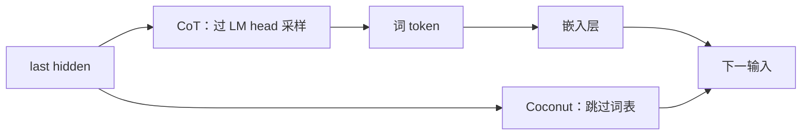

# Coconut：把推理从词表里拿出来，并不等于已经赢过语言 CoT

<!-- release-date: 2024-12-09 -->

> 本文依据 FAIR / UCSD 的 **Training Large Language Models to Reason in a Continuous Latent Space**，即 arXiv:2412.06769v4。本地原件已用 v4 替换旧 v3：v4 于 2026-08-23 上传，封面写 Last updated: August 25, 2026，全文 18 页。页码一律以这份 18 页 v4 为准，不要沿用旧 v3 的页码或图号。
>
> 方法名 Coconut = Chain of Continuous Thought。作者 Shibo Hao（FAIR / UCSD，脚注 *Work done at Meta*）、Sainbayar Sukhbaatar、DiJia Su、Xian Li、Zhiting Hu、Jason Weston、Yuandong Tian。本站按 FAIR 放在 Meta 目录。v1 于 2024-12-09 首次公开，本文 `release-date` 取这一天，不用 v4 修订日。arXiv 页面 Comments 栏写 Accepted to COLM 2025；**PDF 封面没有印会议名**。
>
> 文中始终分开三层：**论文写了什么**、**本文如何解释它**、**哪些是外部资料补充**。数字紧跟页码。

## 读这篇之前，先分清三种「在连续空间里做事」

同一批潜空间邻居里，至少有三条路，不要读成一件事。

- **Coconut（本篇）**：后训练。预训练好的语言模型照旧说话，只是推理时不把 last hidden state 解码成词，而是把它直接喂回，当作下一个输入嵌入。连续向量在这里替代的是 CoT 的推理步。
- **Ouro（后作，ByteDance Seed）**：预训练循环共享权重。同一组层在前向里跑多圈，推理写进预训练，不是把 last hidden 当下一 token。本篇只点这个切面，不引用它的实验数字。
- **Cola DLM（并行工作，ByteDance Seed）**：Text VAE 加 block-causal DiT 做生成。连续空间用来运语义先验、再解码成字，不是 CoT 的替代品。本篇同样只点切面，不引用它的实验数字。

本篇还会反复出现这几个词：

- **Chain-of-Thought（CoT，思维链）**：先用自然语言把中间步骤写出来，再给答案。
- **连续 thought（continuous thought）**：当前位置的 last hidden state，当作「现在推理到哪了」的连续表示。
- **语言模式 / 潜空间模式**：前者照常采词；后者跳过词表，把 hidden 直接当下一输入。
- **`<bot>` / `<eot>`**：Begin / End of Thought。框住一段连续 thought，本身不计入 thought 个数 $c$。
- **课程（curriculum）**：先用完整语言 CoT 训，再一步步把前面的语言推理步换成连续 thought。灵感来自 iCoT（Deng et al., 2024）。
- **ProsQA**：这篇新做的逻辑题，图是有向无环图（DAG），问的是「某实体是概念 A 还是概念 B」，需要在分叉里找路。

## 一句话先说清

语言模型平时的推理，必须先把 hidden state 压进词表，再采出一个词，再把这个词嵌回去。Coconut 把中间那一跳拿掉：推理还在同一个 Transformer 里发生，只是下一步读到的不再是某个词的嵌入，而是上一步的连续向量。

论文真正想证明的，不是「连续空间一定更聪明」，而是：

> **语言空间会逼模型过早选定一条路。连续 thought 可以同时装着几条候选下一步，表现得像广度优先搜索（BFS）。这在需要规划的逻辑题上压过 CoT；在 GSM8k 上没有。**

实验主体是 **GPT-2**。附录里的 Llama 3.2-3B / Llama 3-8B 只和 no-CoT 比，没有和 CoT 比。不要把这篇读成 70B 级前沿基座的成绩单。

## 报告地图：18 页里各写了什么

正文到第 11 页结束，参考文献占第 12–14 页，附录占第 15–18 页。

| 报告章节 | PDF 页 | 讲了什么 |
|---|---|---|
| 摘要 + §1 引言 | p. 1–2 | 语言空间不一定适合推理；Coconut 的定义；声称逻辑题上超过 CoT、准确率和效率有更好折中 |
| Figure 1 | p. 2 | CoT 采词再嵌回去；Coconut 把 last hidden 当下一输入 |
| §2 相关工作 | p. 2–3 | CoT、pause / filler、iCoT、looped Transformer、循环记忆；v4 补了 RMT 两篇 |
| §3 方法 | p. 3–5 | 语言/潜空间两种模式、课程、$n+1$ 次前向、推理时如何结束 latent |
| Figure 2 | p. 4 | 课程示意：每阶段多 $c$ 个连续 thought，少一步语言推理 |
| §4.1–4.2 | p. 5–6 | ProsQA 设定；按 $k$ 插值 latent 和语言；Figure 3 的对错拆解 |
| §4.3 | p. 6–8 | 把连续 thought 探成树搜索；Figure 4 案例、Figure 5 分布、Figure 6 并行度 |
| §4.4 | p. 8 | 为什么迟点做决定更有利；Figure 7 的节点高度与 value |
| §5 + Table 1 | p. 8–11 | GSM8k / ProntoQA / ProsQA 主表；基线与消融 |
| Figure 8 / 9 | p. 10 | 准确率–token 折中；$c$ 的影响；把连续 thought 解码回词 |
| §6 结论 | p. 11 | 收束，并说要把潜空间推理做到预训练 |
| 附录 A | p. 15–16 | 三份数据样例；ProsQA 构图；规模 |
| 附录 B | p. 17 | A100、batch=1 的墙钟 |
| 附录 C | p. 17–18 | $c=3$ 不稳；Llama 3.2-3B / 3-8B 只对 no-CoT |

## 旧问题：推理被锁在词表里

论文的出发点不是「CoT 没用」，而是 CoT 把两件不同的事绑死了（PDF p. 1–2）。

第一件：Transformer 每一步分到的计算几乎一样。一段推理里，多数词只是为了把句子写顺，真正要规划的只有少数关键位置。语言空间没有给「这一步更难」单独加预算。

第二件：采词是硬选择。模型一旦把「Alex is a lempus」写出来，后面就沿着这条路走。走错了，要么编一条不存在的边，要么停在无关的点上。论文后面用 ProsQA 的案例把这件事画出来（PDF p. 7，Figure 4）。

先前修法仍停在语言空间里：把 CoT 写短（Madaan and Yazdanbakhsh, 2022），或者在关键 token 前多想一会儿（Quiet-STaR / Zelikman et al., 2024）。pause token 和省略号这类 filler，只是给模型多几个位置做计算，并不像 CoT 那样把输出再送回输入、加深有效深度（PDF p. 3）。iCoT 则是逐步删掉语言推理，最后让模型直接答；它把推理「内化」进权重，但中间没有可训练的连续状态。

**本文怎么读：** 这三条旧路可以记成「少说话」「在说话前多算一会儿」「最后连话也不说了」。Coconut 要的是第四条：推理过程仍占用序列上的位置，但这些位置不再经过词表。

**论文没写成的边界：** 神经成像「语言网络在推理时不怎么亮」被拿来当动机，不是本实验的证据。不要把它升级成「所以模型也应该不说话」。

## 新设计：连续 thought 就是被喂回去的 last hidden

普通语言模型做两件事（PDF p. 3）。先把到目前为止的嵌入序列 $E_t$ 送进 Transformer，得到各位置的 last hidden；再拿当前位置的向量 $h_t$ 过语言模型头，得到下一个词的分布。

人话先说一遍：模型脑子里已经有一个连续向量，表示「读到这里时的状态」。平时必须先把这个向量翻译成某个词，再把这个词的嵌入当作下一拍的输入。Coconut 认为翻译这一步才是枷锁。

$$
H_t = \mathrm{Transformer}(E_t)
$$

$$
\mathcal{M}(x_{t+1} \mid x_{\leq t}) = \mathrm{softmax}(W h_t)
$$

- $E_t$：到位置 $t$ 为止的输入嵌入；
- $H_t$：对应的 last hidden 矩阵；
- $h_t$：第 $t$ 个位置那一行；
- $W$：语言模型头；
- $e(\cdot)$：词嵌入。

潜空间模式里，$h_t$ 不再被要求对应某个词。它被直接写进下一拍的 $E$，当作连续 thought。论文强调：这些 hidden 已经过最后一层归一化，幅度不会大到把后面冲垮（PDF p. 4）。潜空间步上 $\mathcal{M}(x_{t+1} \mid x_{\leq t})$ 没有定义，因为本来就不打算映回词表；需要探的时候，仍可以算 $\mathrm{softmax}(W h_t)$（PDF p. 4）。

切换用两个特殊 token。问题后面立刻插 `<bot>`；连续 thought 结束于 `<eot>`。设 $x_i=\texttt{<bot>}$、$x_j=\texttt{<eot>}$，则 $i<t<j$ 时输入是：

$$
E_t = [e(x_1),\ldots,e(x_i),\, h_i,\, h_{i+1},\,\ldots,\, h_{t-1}]
$$

出了 `<eot>` 之后，又改回词嵌入（PDF p. 4）。

下面这张图是机制示意，根据 Figure 1（PDF p. 2）重画，不是实测时间。

读这张图时抓住三件事：

1. **骨干没换。** 还是原来那个因果语言模型，没有新的搜索模块，也没有另训一棵树。
2. **省掉的是词表往返。** CoT 的每一步都是「向量 → 词 → 向量」；Coconut 的 latent 步是「向量 → 向量」。
3. **答案仍要说人话。** `<eot>` 之后重新走语言模式，把结论写出来。

**可迁移启发：** 若你怀疑某个中间量根本不需要是词，先问能不能让它以 hidden 的身份再进模型，而不是先发明一种新的离散标记。Coconut 证明这条路在 GPT-2 上可训；它没有证明这条路已经比把步骤写出来更强。

## 课程：先会说人话，再把前面的步骤换成连续向量

连续 thought 全程可微，理论上可以直接在「问题 → 答案」上做梯度。论文把这种做法叫做 w/o curriculum。主表里它全面失败，后面会写数字。真正能训起来的，是借语言 CoT 当脚手架的多阶段课程（PDF p. 4，Figure 2）。

人话：第一阶段还是普通 CoT 微调。之后每一阶段，把 CoT 最前面的一步语言推理删掉，换成 $c$ 个连续 thought。第 $k$ 阶段就是「$k \times c$ 个连续 thought + 剩下的语言步骤 + 答案」。语言链比 $k$ 短时，语言步骤全部删掉（PDF p. 4 脚注 1）。`<bot>` / `<eot>` 包在外面，不计入 $c$。阶段切换时重置优化器状态，这点跟 iCoT 一样。

损失是普通的负对数似然，但问题和连续 thought 上的 loss 被 mask 掉。论文写得很清楚：这个目标并不要求连续 thought 去压缩被删掉的那句人话，而是要求它有利于预测后面还没删的推理和答案（PDF p. 4）。因此，学出来的表示可以和人类句子不一样。

训练时，当前阶段若安排了 $n$ 个 latent thought，就要做 $n+1$ 次前向：每次算出一个新的连续 thought 写回输入，最后再前向一次，在剩下的文本上算损失。重复计算可以用 KV cache 省掉，但这 $n+1$ 次必须串行，并行不友好。论文把训练效率列为未来工作（PDF p. 5）。

推理时，问题后固定插 `<bot>`。何时出 `<eot>`，论文试过两种：在连续 thought 上训一个二分类器，或把 latent 长度 pad 成常数。两者差不多，实验为了简单，默认用固定长度（PDF p. 5）。

**本文怎么读：** 课程的形状决定了 Coconut 仍是后训练方法。它假定你手里已经有逐步的语言推理监督。没有这根绳子，只把 hidden 喂回去，GPT-2 学不会有用的连续 thought。结论第 6 节自己也说，要把潜空间推理做到预训练，还需要另外的研究（PDF p. 11）。

**可迁移启发：** 「让模型在连续空间里想」和「让模型自己发现该怎么想」是两件事。Coconut 做的是前者，脚手架仍是语言 CoT。若项目里没有逐步标注，这篇的主结果不能直接搬。

## 连续空间里长出的，是可探的广度优先，不是另写的搜索算法

§4 是全文的解释核心。论文的说法是：ProsQA 这种需要规划的题上，Coconut 超过语言 CoT；连续表示能同时编码多个下一步，于是推理看起来像 BFS，而不是 CoT 那种过早定死的一条路（PDF p. 5）。

这句话要拆开。论文没有实现 BFS，也没有用搜索轨迹当训练数据。树是事后用语言模型头，把连续 thought 后面的第一个概念概率探出来，再画上去的。

### ProsQA 在测什么

ProsQA 的全称是 Proof with Search Question-Answering。每道题是一堆虚构概念之间的蕴涵，写成自然语言，问「某实体是 A 还是 B」（PDF p. 5、p. 15）。图是 DAG：从实体到正确概念有路，到错误概念没有路。和 ProntoQA 相比，分叉更多，更容易走进死胡同。

构图细节在附录 A.2（PDF p. 15–16）。新节点入边数抽自泊松分布，均值 1.5；有 35% 的概率禁止成为某一侧的后代，用来保持两族分开、避免捷径；采样权重偏向离根更远的点，好让金标链更长。问句里 A、B 的左右顺序随机打乱。Table 2：平均 23.0 个节点、36.0 条边、最短路长度 3.8、最短路条数 1.6（PDF p. 16）。

基座是预训练 GPT-2，学习率 $1\times 10^{-4}$，有效 batch 128。ProsQA 最长 6 步，所以训练阶段 $N=6$；每阶段 5 个 epoch，最后一阶段一直留到总 50 epoch，取最后阶段验证集最好的 checkpoint（PDF p. 5）。

为了在「全语言」和「全 latent」之间插值，推理时手动改 `<eot>` 的位置。强制用 $k$ 个连续 thought 时，模型要从第 $k+1$ 步起用语言把剩下的链写完。$k\in\{0,1,2,3,4,5,6\}$ 共用同一份权重，只改推理（PDF p. 5）。

过程指标分成六类，互不重叠（PDF p. 6）：

| 类别 | 含义 |
|---|---|
| Correct Path | 输出是通往正确答案的一条最短路 |
| Longer Path | 路是对的，但不是最短 |
| Hallucination | 出现不存在的边，或路径不连通 |
| Wrong Target | 路上的边都在图里，但终点不是被问的那个 |
| Correct Label / Incorrect Label | 只给出最终标签、没有部分路径时用 |

$k>0$ 时前面几步是连续的，只在语言里看到后半段：如果存在一种合法补全能接上，就算 Correct Path；补不上就进 Hallucination。

### Figure 3：多想几步，幻觉和走错目标一起掉

论文对 Figure 3 的文字结论是：CoT 经常幻觉出不存在的边，或走到错误目标，所以答案准确率更低；Coconut 随着连续 thought 变多，答案准确率上升，Correct Label / Correct Path 变多，Hallucination 和 Wrong Target 变少（PDF p. 6）。这些早期错误，正是「第一步就说死」的典型后果。

主表里的 Coconut 对应最后阶段的充分 latent 推理，ProsQA 准确率 $97.0\pm 0.3$，CoT 是 $77.5\pm 1.9$（PDF p. 9，Table 1）。Figure 3 左图是按 $k$ 拆开的条形图，正文没有再给每个 $k$ 的精确百分比，这里不从图上估数。

Figure 4 的案例把机制说成人话（PDF p. 7）。问的是 Alex 到底是 gorpus 还是 bompus。金标走 `grimpus → rorpus → bompus`。CoT 先走 lempus 那一支，卡死后编出「Every yumpus is a rempus」这种图里没有的边，最后答成 gorpus。Coconut（$k=1$）走出一条到无关节点 brimpus 的路。Coconut（$k=2$）答对。

**本文怎么读：** 语言 CoT 的失败模式很像贪心走迷宫：每一步必须说出一个邻居，说出口就不能收回。连续 thought 把「选邻居」推迟了。这能解释为什么 $k$ 变大时 Wrong Target 和 Hallucination 一起下降。它还不能解释成「模型在跑教科书上的 BFS 算法」——没有队列，没有显式的 visited 集合，只有一个可反传到整个 Transformer 的连续向量。

### 探出来的分布：第一步并不贪心

§4.3 强迫模型在连续 thought 之后立刻用语言吐下一个概念，用这个概念上所有 token 概率的乘积当 value（PDF p. 7，Figure 5）。例如：

$$
p(\text{lempus}) = p(\text{le})\,p(\text{mp})\,p(\text{us}) = 0.33
$$

论文把它解释成隐式价值函数：这个节点有多大可能通向正确目标。

同一道题上，第一步四个孩子的 value 是：lempus $0.33$（高度 2）、grimpus $0.32$（高度 2）、zhorpus $0.16$（高度 1）、sterpus $0.01$（高度 0）。lempus 最高。第二步，最高的却是 grimpus 的孩子 rorpus，$0.87$，而不是继续跟 lempus。论文说这不像贪心，像 BFS：先在连续表示里同时留着几条候选，再在更靠近叶子的地方做决定（PDF p. 7）。

Figure 6 把这种并行画成测试集上的百分位曲线（PDF p. 8）。第一步里 top-1 / top-2 / top-3 的累积 value 之间空隙大，说明还在广探；第二步空隙收窄，开始收束。论文认为，这就是 $k$ 变大时准确率稳定上升的机制，不只是这一个例子。

**必须分开的层次：** 「连续向量能叠加多条下一步」是论文的解释，也是后文 Zhu et al. (2025a, 2025b) 理论化的方向，写在 v4 的相关工作里（PDF p. 3）。「模型在执行 BFS」不是训练目标，也没有搜索算法的实现对照。把它当成观察，不要当成已经实现的规划器。

### 为什么迟一点决定更有利

§4.4 的假说很具体：离最终叶子越远的节点越难估准，因为后面分叉还很多；离叶子近的节点，对错更容易分开（PDF p. 8）。Figure 7 按节点高度画出正确 / 错误节点的预测 value：高度低时，对错分得开；高度高时，两边都含糊。

这里有一处论文内部不一致，不能帮它圆。Figure 5 图注把高度定义成「到任意叶子的最长距离」；§4.4 正文又写成「到任意叶子的最短距离」（PDF p. 7–8）。两条定义会给同一个节点不同的数。趋势「越靠近叶子越分得清」仍然读得通，但高度轴的绝对刻度不要拿去复现。

**可迁移启发：** 若错误代价主要来自「第一步说死」，连续状态或至少延迟离散化，可能比把每一步都写成句子更合适。若错误代价来自算术必须逐步对齐，语言 CoT 仍可能更强——下一节的 GSM8k 就是这个方向。

## 主实验：逻辑题上赢 CoT，GSM8k 上输给 CoT

§5 把同一套方法放到三份数据上。基座仍是 GPT-2。解码全部贪心。过完既定阶段后，都在最后阶段留到总 50 epoch，按验证集准确率选 checkpoint；推理时的连续 thought 个数与最后训练阶段对齐（PDF p. 9）。

### 数据、课程和基线

GSM8k 的训练数据不是原版 7 千条，而是 Deng et al. (2023) 的合成集。Table 3：训练 385,620，验证 500，测试 1319（PDF p. 16）。每一步语言推理换成 $c=2$ 个连续 thought；除 Stage 0 外走 3 个阶段，再加一个阶段：连续 thought 数仍是 $3\times c$，但剩下的语言链全部删掉，用来消化超过 3 步的长尾。Stage 0 训 6 个 epoch，之后每阶段 3 个 epoch（PDF p. 9）。

ProntoQA 和 ProsQA 用 $c=1$，因为最长 6 步，所以在 Stage 0 之外再走 6 个阶段，最后阶段完全用连续 thought 解题，每阶段 5 个 epoch（PDF p. 9）。ProntoQA 训练 9,000 / 验证 200 / 测试 800；ProsQA 训练 17,886 / 验证 300 / 测试 500（PDF p. 16）。

基线和变体（PDF p. 9–10）：

| 名字 | 论文里实际在做的事 |
|---|---|
| CoT | 用完整语言推理链训练和生成 |
| No-CoT | 只看问答，推理时直接答 |
| iCoT | Deng et al. (2024) 的内化课程，逐步删掉推理链开头的 token，推理时直接答。GSM8k 的 30.0 带星号，来自原论文，不是本篇复现 |
| Pause Token | 问答之间插入与 Coconut 数量相同的 `<pause>`，没有语言推理链 |
| w/o curriculum | 直接训最后阶段，连续 thought 一次扛完全程 |
| w/o thought | 保留多阶段删步，但不插入连续 thought。日程跟 Coconut 对齐，以便和 iCoT 严格比较 |
| pause as thought | 用 `<pause>` 替换连续 thought，课程与 Coconut 相同 |

### Table 1：弱的那边也要写

数字全部来自 Table 1（PDF p. 9）。更高准确率表示更强；更少 token 表示更省生成。

| 方法 | GSM8k Acc. | GSM8k #Tok | ProntoQA Acc. | ProntoQA #Tok | ProsQA Acc. | ProsQA #Tok |
|---|---:|---:|---:|---:|---:|---:|
| CoT | $42.9\pm 0.2$ | 25.0 | $98.8\pm 0.8$ | 92.5 | $77.5\pm 1.9$ | 49.4 |
| No-CoT | $16.5\pm 0.5$ | 2.2 | $93.8\pm 0.7$ | 3.0 | $76.7\pm 1.0$ | 8.2 |
| iCoT | $30.0^{*}$ | 2.2 | $99.8\pm 0.3$ | 3.0 | $98.2\pm 0.3$ | 8.2 |
| Pause Token | $16.4\pm 1.8$ | 2.2 | $77.7\pm 21.0$ | 3.0 | $75.9\pm 0.7$ | 8.2 |
| Coconut | $34.1\pm 1.5$ | 8.2 | $99.8\pm 0.2$ | 9.0 | $97.0\pm 0.3$ | 14.2 |
| w/o curriculum | $14.4\pm 0.8$ | 8.2 | $52.4\pm 0.4$ | 9.0 | $76.1\pm 0.2$ | 14.2 |
| w/o thought | $21.6\pm 0.5$ | 2.3 | $99.9\pm 0.1$ | 3.0 | $95.5\pm 1.1$ | 8.2 |
| pause as thought | $24.1\pm 0.7$ | 2.2 | $100.0\pm 0.1$ | 3.0 | $96.6\pm 0.8$ | 8.2 |

先读弱的那边。

**GSM8k 上 Coconut 没有超过 CoT。** $34.1$ 对 $42.9$，大约少 9 个点。论文自己写了「does not surpass CoT on GSM8k」，然后把话头转到准确率–token 折中（PDF p. 10）。不要改写成「已经接近」或「考虑到更短所以其实更好」——那是作者的叙事，不是表上的胜负。相对 No-CoT 的 $16.5$、iCoT 的 $30.0$、pause as thought 的 $24.1$，连续 thought 确实有用；相对把步骤写出来的 CoT，它仍是输的。

**ProsQA 上赢的是语言 CoT，不是所有基线。** Coconut $97.0$ 对 CoT $77.5$，这是摘要里「某些逻辑题超过 CoT」的主证据。可是 iCoT 是 $98.2$，token 还更少（8.2 对 14.2）；pause as thought 是 $96.6$，也在同一档。也就是说，ProsQA 上「把前面的语言步骤拿掉」这件事本身就极强，不一定非要连续向量。论文在 §5.3 也承认：两道合成逻辑题上，计算容量可能不是瓶颈；GSM8k 更吃上下文和计算（PDF p. 10）。

**ProntoQA 接近饱和。** Coconut $99.8$，CoT $98.8$，iCoT $99.8$，pause as thought $100.0$。这里看不出连续 thought 的独特优势，只能看出「别用会幻觉的长 CoT」。

**没有课程就不要做。** w/o curriculum 在 GSM8k 上 $14.4$，低于 No-CoT 的 $16.5$；在 ProntoQA 上掉到 $52.4$；ProsQA 上 $76.1$，和 No-CoT 一个水平。把 hidden 喂回去，不会自动长出推理。

**只加 pause、不加课程，也几乎等于 No-CoT。** Pause Token 在 GSM8k 是 $16.4$，ProsQA 是 $75.9$。多几个位置算，不等于多了可训练的连续状态。

### 链式连续 thought、效率折中、解码回词

论文把 CoT 能加深 Transformer 有效深度这件事，直接搬到连续 thought 上：把更多连续 thought 串起来，相当于推理时多给计算（PDF p. 10）。Figure 8（II）里 $c$ 从 0 到 1 到 2，GSM8k 准确率上升。附录 C.1 写 $c=3$ 时略降、方差变大，最后一次阶段切换会把训练 loss 打出尖峰（PDF p. 17）。所以「再串几个」不是单调免费的。

Figure 8（I）把「逐步内化语言 CoT」和「每步换成两个连续 thought」画在同一张准确率–生成 token 图上。语言那条线随跳过的步数很快往下掉；Coconut 掉得慢。这是论文「更好折中」的图证（PDF p. 10）。折中成立的前提是：你接受 GSM8k 绝对准确率低于完整 CoT。

Figure 9 把第一个连续 thought 再过 LM head，看它像什么词。样例题是「每周 3 次、每次 3 个 sprint、每个 sprint 60 米，一周跑多少米」。解码出来的高概率词是 `"180"`（0.22）、`"180"`（0.20）、`"9"`（0.13），对应中间量而不是最终的 540（PDF p. 10）。论文说这表示连续 thought 是更高效的推理表示。这是定性观察，没有在测试集上统计「解码出来的词有多少是中间量」。

附录 B 的墙钟是 A100、batch=1、每个测试例的平均秒数（PDF p. 17，Table 4）：

| 方法 | GSM8k | ProntoQA | ProsQA |
|---|---:|---:|---:|
| No-CoT | 0.03 | 0.03 | 0.08 |
| CoT | 0.26 | 0.85 | 0.47 |
| Coconut | 0.09 | 0.11 | 0.15 |

论文说墙钟大致和新生成 token 数成正比。Coconut 的连续 thought 仍要一次前向，只是不经过词表采样；所以 token 列会偏少，墙钟不会少到 No-CoT 那种程度。这张表不能外推到大 batch 或长上下文服务。

### 附录里的更大模型：增益更小，而且没和 CoT 比

附录 C.2 在 GSM8k 上把 Coconut 接到 Llama 3.2-3B 和 Llama 3-8B，$c=1$，Stage 0 训 3 个 epoch，之后每阶段 1 个 epoch（PDF p. 17，Table 5）。

| 模型 | no-CoT | Coconut |
|---|---:|---:|
| Llama 3.2-3B | 26.0 | 31.7 |
| Llama 3-8B | 42.2 | 43.6 |

3B 上从 26.0 到 31.7；8B 上从 42.2 到 43.6，只多 1.4 个点。论文说增益不如 GPT-2 上那么明显，一个可能原因是更大模型已经在语言上预训练得很深，转到潜空间推理更难（PDF p. 18）。**这两行都没有 CoT 对照。** 不能读成「8B 上也优于语言 CoT」。更不能读成前沿 70B 已经验证。

作者把这篇的目标写成：指出潜空间推理值得做，并打开这条方向。要普遍超过语言 CoT，可能需要针对潜空间的预训练（PDF p. 18）。他们点名的近期工作是 Geiping et al. (2025)、Barrault et al. (2024)、Gladstone et al. (2025)，并说这些模型提供了可扩展的潜表示学习，但潜空间还没有为推理显式优化。

## 相关工作里，这篇把自己放在哪

§2 分两块（PDF p. 2–3）。

CoT 这一侧：提示、SFT、RL 都算「先在语言里写中间过程」；理论工作指出 CoT 能加深有效深度，因为输出被 loop 回输入。这也是 Coconut 把连续 thought 喂回输入的直接动机。规划这一侧点了 Tree of Thoughts、显式树搜索、以及在搜索轨迹上训练。Coconut 的差异是：去掉语言约束之后，BFS 式模式自己冒出来，没有按搜索算法来训。

Latent 这一侧：多数前人把「潜空间推理」定义成 Transformer 内部已经在算的那部分，比如从 hidden 里读出两跳的中间变量、back-patching、并行潜路径、以及 CoT 不忠实。增强办法包括 pause token、filler、planning token、把 CoT 蒸馏或内化进模型。另一些工作换架构：looped Transformer、句子嵌入空间里的扩散、循环记忆 Transformer。

v4 相对 v3 的一处实质增补就在这里：补了 Recurrent Memory Transformer（Bulatov et al., 2022）和后来用联想记忆把这种循环扩到更长上下文的工作（Rodkin et al., 2024）。RMT 是跨片段传递连续记忆，不是用连续向量替代逐步推理。Coconut 强调自己关注的是通用多步推理，以及潜空间相对语言空间的独特表现。

同一段还写了后作理论：Zhu et al. (2025b) 论证连续 CoT 能靠叠加态同时编码多条路径，从而在某些任务上比离散 CoT 更高效；Zhu et al. (2025a) 再分析这种叠加怎样在 Coconut 的训练目标下出现（PDF p. 3）。这是论文自己列的后续，不是本实验的一部分。

**和本批另外两篇邻居的切面，只说到这一层：**

- **Ouro** 把「在潜空间里多算」写成预训练目标：共享权重循环，前向里反复跑同一组层。Coconut 是后训练、把 last hidden 当下一输入。一个改的是层怎么复用，一个改的是序列上下一步吃什么。
- **Cola DLM** 用 Text VAE 学文本到连续 latent 的映射，再用 block-causal DiT 在连续空间里运语义先验，最后条件解码。它针对的是生成要不要从左到右，不是推理步要不要写成词。不要把 Cola 的 latent 理解成本篇的 continuous thought。

两篇的实验数字都不在本解读里出现。

## 限制、没写的事、不要读过的结论

### 实验支持的

- 在 GPT-2 上，用语言 CoT 课程把前面的步骤换成连续 thought，相对 No-CoT 能涨点。
- ProsQA 上相对语言 CoT 的优势很大（97.0 对 77.5），且随着 $k$ 增加，幻觉和走错目标下降。
- 没有课程时，连续 thought 帮不上忙，甚至更差。
- GSM8k 上，$c$ 从 0 增到 2 有帮助；相对 iCoT / pause as thought / w/o thought，连续向量比「只删步」或「只占位」强。
- 把连续 thought 解码回词，至少在展示的数学题里像中间量。这是定性。

### 不要读过的

- **没有证明连续推理已经赢过语言 CoT。** GSM8k 主表是反例。ProsQA 上 iCoT 还略高。
- **没有证明模型在跑 BFS。** 那是对探测分布的解释。
- **没有证明对大模型成立。** 8B 只比 no-CoT 多 1.4 点，没有 CoT 对照。
- **没有证明不需要语言监督。** 主结果全程依赖逐步 CoT 数据。
- **没有证明这是测试时缩放的通用方案。** $c=3$ 已经不稳。固定 pad 长度意味着推理预算在训练时就锁死，不能按题目难度随时加圈。

### 论文没有公开的

- GPT-2 的具体 checkpoint 名、层数以外的实现超参；有效 batch 128 如何在多卡上拼；
- 主表每个数字的独立重复次数（只给了 $\pm$）；
- Figure 3 每个 $k$ 的精确准确率；
- 二分类结束 latent 的具体结构和它与固定长度的逐项对比；
- Llama 实验的完整课程、是否从 CoT checkpoint 初始化、验证集选点方式；
- 训练墙钟、显存、MFU；$n+1$ 次前向的实际倍数；
- 权重文件。封面给了代码仓库，见下一节。

Figure 5 与 §4.4 的高度定义冲突，复现 Figure 7 前必须先选定一个定义。

## 可以带回自己项目的几条

### 先问中间量是不是必须是词

若某步的作用是「更新搜索状态」而不是「给人看」，强迫它经过词表会引入两个副作用：浪费计算在流畅性上，以及过早离散化。Coconut 给的最小改法是：同一套权重，下一步直接吃 last hidden。适用边界是：你有逐步监督，而且任务的错误主要来自早承诺。

### 脚手架比回路更关键

回路（把 hidden 喂回去）很简单；没有课程，这条回路是负贡献。迁移时优先复现「先 CoT、再逐步替换、阶段切换重置优化器」，而不是先改架构。

### 探测时再用词表，训练时不要用

论文在训练中 mask 掉连续 thought 的词表损失，分析时又把 LM head 打开当探针。这是可复用的分工：训练目标对准「后面还能不能算对」，解释手段另走一套。不要把探针上的词误当成模型内部真的在说这些词。

### 合成逻辑图适合讲规划，不适合讲通用推理

ProsQA 的 DAG、虚构概念、二选一，专门放大「走错分支」；GSM8k 放大的是逐步算术和语境。同一方法在两边胜负相反。选评测时先问自己要放大哪种失败，不要只用更漂亮的那张表。

### 训练串行是真实代价

$n$ 个连续 thought 就要 $n+1$ 次前向。推理 token 变少，不等于训练便宜。工程上若不能接受串行前向，这篇的训练配方搬不过去。

## 关键词怎么串回整个系统

读完之后，这些词应该已经连成一条链：

- **语言空间 / 潜空间**：中间状态要不要经过词表；
- **连续 thought**：被喂回去的 last hidden，不是新模块的输出；
- **`<bot>` / `<eot>`**：模式开关，也是序列上的边界；
- **课程 $k \times c$**：第 $k$ 阶段用多少连续 thought 替换多少语言步；
- **mask 掉的 NLL**：不重建被删的人话，只预测后面；
- **$n+1$ 次前向**：连续 thought 可微的代价；
- **ProsQA**：用来放大规划失败的 DAG 逻辑题；
- **隐式 value**：连续 thought 之后，第一个概念的 token 概率乘积；
- **BFS 式模式**：对探测分布的解释，不是实现；
- **GSM8k 34.1 对 CoT 42.9**：连续路线没有赢下的那一侧。

如果只留一句：

> **Coconut 证明：在 GPT-2 上，用语言 CoT 当课程、把 last hidden 喂回当下一输入，可以在需要搜索的逻辑题上少说话、少幻觉；它没有证明这条路已经替代语言推理，也没有证明大模型或预训练阶段同样成立。**

## 资料与阅读边界

**本文依据：** 本地 `papers/Meta/Coconut.pdf`，即 arXiv:2412.06769v4，2026-08-23 上传，18 页。标题 *Training Large Language Models to Reason in a Continuous Latent Space*。arXiv：[abs](https://arxiv.org/abs/2412.06769) / [pdf](https://arxiv.org/pdf/2412.06769)。提交历史：v1 2024-12-09、v2 2024-12-11、v3 2025-11-03、v4 2026-08-23。本文 `release-date` 取 v1。解读依据 v4。

**v4 相对本地旧 v3，核到的实质差异：**

- 相关工作补了 Recurrent Memory Transformer（Bulatov et al., 2022）和 associative memory 扩展（Rodkin et al., 2024）；
- 正文把 ProsQA 案例的图号改顺：v3 HTML 有一处把案例写成 Figure 5，v4 改为 Figure 4，与现图一致；
- Table 1 主数字与 v3 HTML 一致，没有改实验表；
- 封面 Last updated：v3 HTML 写 August 24, 2026，v4 写 August 25, 2026。

**外部补充，已标明、未冒充论文内容：**

- 官方代码 <https://github.com/facebookresearch/coconut>。封面给出的地址。README 写明默认 `openai-community/gpt2`；GSM8k 要先按 `args/gsm_cot.yaml` 训 CoT（验证准确率预期约 40%），再把该 checkpoint 填进 `args/gsm_coconut.yaml` 的 `load_model_path`。复现说明按 4 张 A100 80GB 来写。`coconut.py` 里 `MAX_N_LATENT = 8`；`generate()` 断言 `batch_size == 1`；注释写 tested with GPT2 and Llama3。这些是仓库现状，不能用来补论文没写的主表超参。
- GSM8k 预处理脚本指向 Deng 等人 Internalize CoT 仓库的增强划分，与 Table 3 的 385,620 条训练规模一致，这是数据来源的外部核对，不是另一套成绩。
- 同方向后作 / 并行工作：Ouro（预训练循环共享权重）、Cola DLM（VAE + DiT 做生成）。切面见上文，数字不引用。
- 论文相关工作里点到的理论后作：arXiv:2505.12514、arXiv:2509.23365。不是本实验。

**同方向不要读串的：** Coconut 的连续 thought 是序列维度上的下一步输入；Ouro 的循环是深度维度上的权重复用；Cola 的连续 latent 是生成用的语义先验。三篇都出现「continuous / latent」，指的不是同一个接口。
