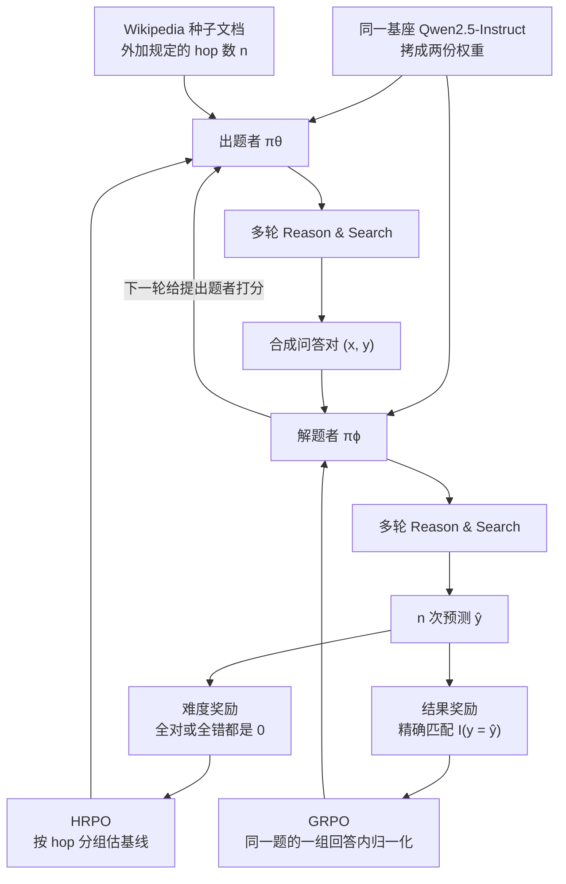

# Dr. Zero：零掉的是人类问答标注，不是搜索引擎；HRPO 改的是出题那条基线

<!-- release-date: 2026-01-11 -->

> 本文依据 Meta Superintelligence Labs 与伊利诺伊大学厄巴纳-香槟分校（UIUC）发布的 **Dr. Zero: Self-Evolving Search Agents without Training Data**，即 arXiv:2601.07055v2、封面日期 July 22, 2026、共 26 页的版本。第一作者 Zhenrui Yue 同时署 Meta 与 UIUC，脚注写 *Work done while at Meta*。本站按主要归属放在 Meta 目录。v1 于 2026-01-11 首次公开，本文 `release-date` 取这一天，不用 v2 修订日。页码均指 PDF 本身的页码。文中会明确区分「论文写了什么」「本文如何解释它」「哪些是外部资料补充」。

## 读之前需要的最少背景

这篇论文只讲一件事：开放域搜索 agent 能不能在**没有人类问答标注**的前提下，靠自己出题、自己做题、用搜索引擎当知识环境，把多轮检索和推理练出来。

先把六个会反复出现的词说成人话。

- **搜索 agent**：不是一次性检索再生成。模型一边想、一边决定要不要调用搜索工具，根据返回的段落再想下一步，多轮之后才给出短答案。
- **出题者 / 解题者（proposer / solver）**：两份从同一基座拷出来的权重。出题者负责发明问答对；解题者负责检索并作答。和 [Absolute Zero](/reports/Tsinghua/Absolute-Zero) 不同，这里**不是**同一套权重扮演两个角色。
- **跳（hop）**：一条推理链上的节点数。第 1 跳是种子文档里已经有的实体，后面每一跳都要靠搜索接到下一个实体；最终答案是第 $n$ 跳。1 跳题不用搜，4 跳题要搜 3 次。
- **组相对策略优化（Group Relative Policy Optimization，GRPO）**：不对同一道题训一个价值网络，而是对同一道题采一组回答，用组内均值和标准差当基线。本站 [DeepSeek-R1](/reports/DeepSeek/DeepSeek-R1) 与 [DAPO](/reports/ByteDance/DAPO) 已经把这条算法讲过，这里不重复推导。
- **跳分组相对策略优化（Hop-grouped Relative Policy Optimization，HRPO）**：这篇给**出题者**改的 GRPO。基线不再是「同一条种子提示下的多道候选题」，而是「同一个 hop 数、不同种子上的那些题」。
- **环境（environment）**：这里是外挂搜索引擎加它索引的语料。论文用 E5 在英文 Wikipedia dump 上做近邻检索。它提供证据，**并不**像代码执行器那样独立算出金标。

跨篇只留对照，避免把别的文章再讲一遍：

- [Absolute Zero](/reports/Tsinghua/Absolute-Zero) 的环境是代码执行器，金标来自程序跑出来的结果。本篇的环境是搜索引擎，金标是出题者自己写的短答案。
- [R-Zero](/reports/Tencent/R-Zero)（Huang 等人，2025a）也是出题者 / 解题者共进化，但主战场是数学与推理，没有搜索工具。本篇把它加成带搜索的 R-Zero* 当无数据基线。
- [Reward-Free](/reports/Tencent/Reward-Free-Self-Evolution) 讲的是推理时不再依赖外部奖励。本篇相反：训练时每一步都要靠搜索引擎和合成答案打分。
- [AIDE2](/reports/Weco/AIDE2) 改的是包在模型外面的 harness。[Self-Rewarding-LM](/reports/Meta/Self-Rewarding-LM) 改的是同一套权重能不能给自己打分。本篇改的是**任务从哪来**。

## 一句话先说清

RLVR 已经证明：有可靠验证器，模型可以自己长出推理过程。Absolute Zero 接着证明：有代码执行器，模型可以自己长出课程。Dr. Zero 问的是下一句：

> **如果环境不是执行器，而是搜索引擎，开放域搜索 agent 还能不能在零条人类问答上自进化？**

它的做法是两份权重交替训。出题者从一篇 Wikipedia 种子文档出发，按规定 hop 数搜出一条链，写出一道短问答；解题者对这道题做多轮检索，用精确匹配对出题者给的答案。出题者用 HRPO 按 hop 分组估优势，解题者用普通 GRPO。三轮之后，Qwen2.5-3B-Instruct 在七个开放域问答基准上的平均精确匹配是 0.326，和用了人类问答监督的 Search-R1（0.327）打平（PDF p. 6，Table 1）。

这句话听起来像「完全不需要数据」。论文自己没有这么写。真正零掉的是**后训练阶段的人类问答对**；预训练权重、Wikipedia dump、E5 检索器、种子文档、hop 日程、格式奖励和提示词，全都还在。后文会把这条边界单独摊开。

先看它最终怎么转：

这是机制示意图，不是实测时间轴，根据 PDF p. 4 的 Figure 2、p. 5 的式 2–5 与附录 p. 14 的交替训练流程重画。Figure 1（PDF p. 2）画的是 R-Zero 那套出题—解题共进化骨架，不是 Dr. Zero 自己的实现图。

## 旧方法卡在哪：无数据自进化一进搜索就贵、一进开放域就塌

自进化语言模型的常见写法，是让模型自己出题、自己做题、从对错里更新。数学和代码上这条路已经能涨分，因为题型窄、对错清楚，哪怕题不够多样也能练（PDF p. 1–2）。

开放域搜索不是这种题。论文点了三条同时成立的约束（PDF p. 2）：

1. **题要从哪来。** 现有搜索 agent 大多还在吃人类写的问题、长上下文或标准答案。并行列上的 Search Self-Play 仍然要真实标签和大量人类例子（PDF p. 3）。
2. **出题者会塌成 1 跳。** 作者拿 SQLM 和 R-Zero 这两套无数据方法，补上多轮推理和搜索之后再看：500 道合成题里，1 跳分别占 93.4% 和 95.6%（PDF p. 16）。多样性不够，解题者在多跳基准上就涨不动。
3. **GRPO 的嵌套采样太贵。** 出题者的奖励要看解题者这道题有多难，于是标准 GRPO 变成两层采样：同一条种子提示先吐 $m$ 道候选题，每道题再让解题者答 $n$ 次。实现里是 4 道题 × 4 次解答，外加 4 次出题，一共 20 次 rollout（PDF p. 4）。多轮工具调用本身就慢，这个乘数会把训练卡死。

所以这篇要同时解决两件事：让合成题在 hop 结构上铺开，以及让出题者的优势估计不再依赖「同一条种子下再采一堆题」。HRPO 是为第二件事设计的；第一件事很大一部分其实写进了提示词里的 hop 日程，后文会把这两层分开。

## 环境到底是什么：搜索引擎当知识源，不是当判官

和 Absolute Zero 对照，最容易读混的就是「环境」。

| | Absolute Zero | Dr. Zero |
|---|---|---|
| 环境 | 代码执行器 | 搜索引擎 + Wikipedia 索引 |
| 一道题长什么样 | 程序三元组 $(p,i,o)$ | 短问答 $(x,y)$，外加 hop 链 |
| 金标从哪来 | 执行器跑 $p(i)$ 得到 $o$ | 出题者自己把答案写在 `<answer>` 里 |
| 合法检查 | 语法、安全、确定性 | 格式标签、工具调用、hop 接地提示 |
| 对错怎么判 | 再执行一次 | 解题者输出与合成答案做精确匹配 |

论文的原话是：两边都初始化自同一基座，**只**靠搜索工具 $R$ 获取外部知识，训练过程不用演示、不用人类写的题、不用标注答案（PDF p. 4）。评测时所有方法共用同一套 E5 检索器和同一份英文 Wikipedia dump（PDF p. 7）。

把这句话读成「搜索引擎会告诉你答案对不对」，就越界了。检索器返回的是 top-3 段落（PDF p. 14），对错是拿解题者的短答案去对出题者写的那个 $y$。出题提示要求每一跳和最终答案都要能在种子文档或检索段落里找到支撑（PDF p. 5，Figure 5 在 p. 18），全错的题也不给难度奖励。论文自己写了：这些约束**减少、但不消除**错误或含糊的合成答案（PDF p. 5）。

**本文的读法：** Absolute Zero 的老师是执行器，因为它能独立给出金标；Dr. Zero 的老师是「检索器 + 出题者自称的答案」。搜索引擎解决的是「证据从哪来」，不是「这句话是不是真的」。边界写在这里，后面的分数才不会被读成「Wikipedia 替你批改」。

**可迁移的部分**：换环境之前先问一句，这个环境能不能独立给出金标。能，才是 Absolute Zero 那种零人类题；不能，合成答案的错误会写进解题者的梯度。Dr. Zero 选择把问题限制在短答案、可精确匹配的开放域问答上，不是偶然。

## 系统怎么连起来：两份权重，交替各跑 50 步

形式化目标写在式 1（PDF p. 4）。出题者要最大化的，是解题者那一组预测上的奖励 $r$；解题者要最大化的，是最终答案是否与合成金标一致：

$$
\text{出题者：}\quad
\mathbb{E}_{(x,y)\sim\pi_\theta(\cdot\mid R),\{\hat y_i\}_{i=1}^{n}\sim\pi_\phi(\cdot\mid x,R)}
\bigl[r(y,\{\hat y_i\}_{i=1}^{n})\bigr]
$$

$$
\text{解题者：}\quad
\mathbb{E}_{(x,y)\sim\pi_\theta(\cdot\mid R),\hat y\sim\pi_\phi(\cdot\mid x,R)}
\bigl[\mathbb{I}(y=\hat y)\bigr]
$$

$R$ 是搜索引擎。$n$ 在出题者奖励里是解题者的采样次数，附录取 5（PDF p. 14，Table 5 的 Reward size）。

一轮自进化按附录 .1 走（PDF p. 14）：

1. 用当前解题者给出题者打分。第一轮还没有训过的解题者，就用基座自己当「生成式奖励」。
2. 出题者每条提示只 rollout 一道题，抽出 $(x,y)$，按式 4 算奖励，用 HRPO 更新 50 步。
3. 用更新后的出题者在同一批提示上生成问答数据。
4. 解题者用 GRPO 在这批数据上再训 50 步。
5. 把解题者 checkpoint 转成 Hugging Face 格式，供下一轮给出题者打分。

默认跑 3 轮，每边各 150 步。论文说这比 R1、Search-R1 少得多；solver 通常在第 2 到第 3 轮见顶，再训收益很小（PDF p. 14）。GitHub 仓库把出题者脚本叫做 `iter*_challenger.sh`，那是外部实现命名，论文正文用的是 proposer。

出题者不是从空白提示开始编题。提示词把 hop 数 $n$ 和一篇 Wikipedia 源文档写死，要求第 1 跳必须在原文里，后面每一跳必须靠搜索接上，恰好发出 $n-1$ 次 `<tool_call>`，问题里只能出现第 1 跳、不能剧透中间节点（PDF p. 18，Figure 5）。默认 hop 比例是 1 / 2 / 3 / 4 跳按 4:3:2:1，也就是 40% 单跳、60% 多跳（PDF p. 14、p. 16）。

这一步很关键。SQLM* / R-Zero* 的 1 跳塌缩，Dr. Zero 不是靠奖励「学出」多样性来修的，而是**在提示里把 hop 结构当成生成约束**。奖励负责的是「这道题对当前解题者难不难、能不能做」；结构覆盖是日程给的。

## 出题者奖励：太易和太难都零掉，峰值故意不放在 50%

出题者要同时满足两件事：题必须能做（可验证），又不能人人都会（有难度）。论文用解题者 $n$ 次采样里答对的次数 $k$ 当代理（PDF p. 5，式 4）：

$$
r\bigl(y,\{\hat y_i\}_{i=1}^{n}\bigr)
=\mathbb{I}(0<k<n)\,\frac{n-k}{n-1}+r_f,
\qquad
k=\sum_{i=1}^{n}\mathbb{I}(y=\hat y_i)
$$

$r_f$ 是格式奖励，后面单独说。先看难度项。$n=5$ 时，它长这样：

| 答对次数 $k$ | 难度项 | 含义 |
|---|---:|---|
| 0 | 0 | 全错，可能太难，也可能金标本身是错的 |
| 1 | $1.00$ | 恰好一人做对，奖励最高 |
| 2 | $0.75$ | 开始变容易 |
| 3 | $0.50$ | |
| 4 | $0.25$ | |
| 5 | 0 | 全对，太简单，没有训练信号 |

最大值落在 $k=1$，然后随答对人数线性往下掉。这和 Absolute Zero 那种「成功率太高或太低都接近 0、中间最高」的可学习性奖励不是同一条曲线：那边峰值大约在中等通过率，这边峰值故意贴着「几乎没人会、但不是零」。

论文拿抛物线奖励做过对照，抛物线在解题者正确率约 50% 时最高。3B 单轮消融里，默认线性奖励整体更好（PDF p. 15，Table 7）。Bamboogle 上抛物线只有 0.144，默认是 0.216，这一项差得最明显。

全对和全错都零掉难度项，听起来像 DAPO 的动态采样，其实动作不同。DAPO 是把零梯度的题从 batch 里丢掉再采；这里题还留着，只是难度分为 0，格式分还可以拿到。SQLM* 用的是零方差过滤，论文明确拿来对比：SQLM* 过滤掉的那些题，Dr. Zero 改成「看当前解题者的通过率再打分」（PDF p. 7）。

格式奖励 $r_f$ 最多 0.5，和难度项的 0 到 1 分开算（PDF p. 14）。四条各算一次、下限为 0、加总封顶 0.5：

1. 有合法的 `<think>...</think>`；
2. 工具调用和参数格式正确；
3. 能抽出 `<question>...</question>`；
4. 能抽出 `<answer>...</answer>`。

拿掉格式奖励，3B 单轮平均从 0.304 掉到 0.289（PDF p. 15，Table 7）。论文的解释是：复杂生成时结构会塌，格式项用来把「会交错推理和搜索」这件事按住。

**可迁移的部分**：出题奖励要回答的不是「这道题客观上有多难」，而是「对**当前**解题者来说，它是不是处在还能学的那一段」。把峰值放在 $k=1$ 还是 50%，是在「逼难」和「保可解」之间选边。换模型、换 $n$，这条曲线大概率要重画。

## HRPO：改的是哪条基线，省的是哪笔采样

### 旧问题：同一条种子下再采一堆题，贵；全 batch 一条基线，不稳

出题者如果走标准 GRPO，组的定义是「同一条种子提示下的 $m$ 道候选题」。要得到组内均值，就得先把这 $m$ 道题都生成出来，再让解题者对每道题答 $n$ 次。论文写的成本是 $m+mn=m(n+1)$；实现里 $m=4$、$n=4$，共 20 次 rollout（PDF p. 4–5）。

另一条省采样的路是 REINFORCE++：每条提示只出一道题，用**整个 batch** 的奖励均值当基线。论文说这条全局基线在 hop 结构混杂时会不稳，梯度方差高，经常直接训崩（PDF p. 5）。原因按本文的话写是：1 跳题和 4 跳题的奖励量纲本来就不是同一件事，混在一起归一化，等于让出题者以为「出 1 跳永远比出 4 跳好」。

所以要改的不是优势公式的形状，而是**谁和谁比**。

### 新设计：hop 只负责分组，难不难仍看通过率

HRPO 每条种子只生成一道题，然后把一个 batch 里 hop 数相同的题收成一组 $I_h$，在组内标准化奖励（PDF p. 5，式 2–3）：

$$
J(\theta)
=\mathbb{E}\left[
\frac{1}{N}\sum_{h\in H}\sum_{i\in I_h}
\log\pi_\theta(x_i,y_i\mid R)\,A_{i,h}
\right]
-\beta D_{\mathrm{KL}}
$$

$$
A_{i,h}
=\frac{r_i-\mathbb{E}_{j\in I_h}[r_j]}{\sqrt{\mathrm{Var}_{j\in I_h}[r_j]+\delta}}
$$

$N$ 是 batch 大小，$H$ 是 hop 取值的集合，$I_h$ 是 hop 为 $h$ 的那些下标。$\delta$ 是防止方差为零的小常数，论文没有给取值。

这里有一句论文写了、但很容易读漏的话：**hop 只是结构分组变量，经验难度由式 4 的解题者通过率决定**（PDF p. 5）。4 跳不一定比 1 跳难；难不难看当前解题者答得过几个。HRPO 要避免的，是让 1 跳和 4 跳去抢同一条基线。

和标准 GRPO 的对照可以缩成一张表：

| | 出题者上的 GRPO | 出题者上的 HRPO |
|---|---|---|
| 一条种子生成几道题 | $m=4$ | $1$ |
| 组里比的是谁 | 同一条种子下的候选题 | 同一个 hop、不同种子上的题 |
| 解题者每道题答几次 | $4$ | $5$ |
| 每次提示的 rollout | $20$ | $6$（1 次出题 + 5 次解答） |
| 重要性比裁剪 | 有 | **没有**，严格 on-policy |
| KL 系数 | 通常非零 | 公式里留着，表里 $\beta=0$（PDF p. 14） |

解题者仍然走普通 GRPO，带裁剪，组的定义回到「同一道题的一组回答」（PDF p. 5，式 5）。HRPO 只动出题者。GitHub README 有一处写成「HRPO 降低解题者训练算力」，和论文摘要、第 3.2 节不一致；那是外部仓库的笔误，正文口径是出题者和奖励估计。

出题者为什么能删掉裁剪？论文的理由是「为了出题表现和训练效率，采用严格 on-policy」（PDF p. 5）。代价是每一步都必须用当前策略重新采样，不能复用旧轨迹。KL 项在式 2 里还在，超参表把 HRPO 的 KL 写成 0（PDF p. 14，Table 5），等于这项实际没开。

### 收益：平均分没掉，出题那一截少了六成墙钟

附录把 3B、单节点 8×H100 上的出题者训练成本写成表（PDF p. 16，Table 9；测量说明在 p. 15）：

| 方法 | Rollout | 墙钟 | GPU 小时 | GPU 利用率 |
|---|---|---:|---:|---:|
| HRPO | 6（1 题 + 5 次预测） | 4.16 h | 33.28 | 21.63% |
| GRPO | 20（4 题 + 16 次预测） | 10.58 h | 84.64 | 17.84% |

解题者两边一样，大约 3 小时，所以省下的全是出题和奖励估计（PDF p. 15 脚注 1）。墙钟从 10.58 小时降到 4.16 小时，大约是 39%；GPU 小时从 84.64 降到 33.28，大约是 39%。论文正文说「不到三分之一的 rollout」（PDF p. 16），6/20=0.3，对得上。

同一张对照的分数在 Table 8（PDF p. 16）：

| 基准 | HRPO | GRPO |
|---|---:|---:|
| NQ | 0.397 | 0.361 |
| TriviaQA | 0.572 | 0.548 |
| PopQA | 0.431 | 0.377 |
| HotpotQA | 0.298 | 0.303 |
| 2WikiMQA | 0.291 | 0.279 |
| MuSiQue | 0.091 | 0.100 |
| Bamboogle | 0.200 | 0.272 |
| 平均 | **0.326** | 0.320 |

平均分 HRPO 略高。拆开看，赢在单跳；多跳上 GRPO 仍有优势，Bamboogle 的 0.272 对 0.200 差得最大。论文自己的结论是：复杂多步推理仍然更吃计算，才能把基线估准、把合成数据里的信号吃干净（PDF p. 16）。

**代价和边界**：HRPO 把「同一条种子的局部对比」换成「同一 hop 的 batch 对比」。它能成立，前提是一个 batch 里每个 hop 都有足够多样本去估均值和方差。默认 hop 比例 4:3:2:1、batch 256，4 跳只占约 26 条，已经偏瘦。再往上加 hop、或者把 batch 缩小，这条基线会先从长 hop 那一组烂掉。论文没有做 hop 组内样本数的消融。

**可迁移的部分**：组相对方法真正的设计问题不是「要不要分组」，而是「组的同质性从哪来」。按题分、按 hop 分、按任务头分（Absolute Zero 的 TRR++），改的都是统计范围。哪一种结构会系统性抬高或压低奖励，就不要把它留在组外当噪声。

## 解题者：回到普通 GRPO，金标是合成的

解题者的目标是标准带裁剪的 GRPO（PDF p. 5，式 5）。优势用一组 $n$ 个回答的对错做标准化：

$$
A_i
=\frac{\mathbb{I}(y=\hat y_i)-\operatorname{mean}\bigl(\{\mathbb{I}(y=\hat y_i)\}_{i=1}^{n}\bigr)}
{\operatorname{std}\bigl(\{\mathbb{I}(y=\hat y_i)\}_{i=1}^{n}\bigr)+\delta}
$$

奖励只看最终短答案，不看中间检索是否走对。合成金标 $y$ 来自出题者。随着出题者把题变难，解题者被逼着把搜索和推理修得更细；解题者变强以后，简单题的出题奖励下降，反过来逼出题者走更复杂的链（PDF p. 6）。这就是论文说的「共生课程」。

解题者提示比出题者短得多：先在 `<think>` 里想，缺知识就 `<tool_call>`，可以搜很多次，确定了就在 `<answer>` 里给短答案，例如 `<answer> Beijing </answer>`（PDF p. 19，Figure 6）。训练时最多 5 轮工具调用，最长 3072 token；出题者最长 4096（PDF p. 14–15，Table 5–6）。

**这里必须把监督来源说死。** 解题者学的是「如何检索并命中出题者写的那个词」，不是「如何命中 Wikipedia 上的客观事实」。评测改用人类标注的 NQ / HotpotQA 等，等于在问：这套合成课程有没有碰巧迁到真题上。主表说明它在若干基准上迁过去了；它没有证明合成 $y$ 的事实正确率。

## 实验设置：测的是短答案开放域问答，不是任意搜索 agent

评测七个基准，三个单跳、四个多跳（PDF p. 6–7）：

| 类型 | 数据集 |
|---|---|
| 单跳 | Natural Questions、TriviaQA、PopQA |
| 多跳 | HotpotQA、2WikiMultihopQA、MuSiQue、Bamboogle |

基座是 Qwen2.5-3B-Instruct 和 Qwen2.5-7B-Instruct，两边的基线也用同一套。指标是精确匹配。检索器是 E5-base，语料是英文 Wikipedia dump，训练和评测同一套（PDF p. 7、p. 14）。Table 1 按 verl 实现用 greedy 解码；附录 Table 10 另报了带标准差的多次结果（PDF p. 16–17）。

少样本基线：直接 prompting、IRCoT、Search-o1、RAG。有监督基线：SFT、不带搜索的 R1-Instruct、带搜索的 Search-R1。无数据基线：SQLM* 和 R-Zero*，星号表示作者给它们补上了多轮推理和搜索，否则不能直接比（PDF p. 7）。

Dr. Zero 不用这些基准的训练问答，也不用演示。它用的是同一份 Wikipedia 索引。把「零数据」读成「连 Wikipedia 都不用」，就读错了。

超参只做了很小的搜索，扫的是最大梯度范数和 KL 系数，其余固定（PDF p. 14）：

| 项目 | 出题者 HRPO | 解题者 GRPO |
|---|---|---|
| 每轮步数 | 50 | 50 |
| 优化器 | AdamW，$\beta_1,\beta_2=0.9,0.999$ | 同左 |
| 学习率 | $5\times10^{-7}$ 或 $1\times10^{-6}$ | $1\times10^{-6}$ |
| 最大梯度范数 | 0.1 或 1.0 | 同左 |
| 组大小 | 1（每条提示一道题） | 5 |
| 奖励估计次数 | 5 | — |
| KL | 0 | 0 或 0.001 |
| 裁剪 $\varepsilon$ | 无 | 0.2 |
| batch | 256 | 256 |
| 最长回合 / 序列 | 5 / 4096 | 5 / 3072 |
| 精度 | BF16-mixed | BF16-mixed |

引言里还提到「进一步的训练和推理优化」（PDF p. 2），正文没有展开是哪些优化。

## 主结果：3B 平均打平 Search-R1，赢在单跳，多跳仍落后

Table 1 是全文的主表（PDF p. 6）。下面只抄需要用来下判断的那些行。

**Qwen2.5-3B-Instruct：**

| 方法 | NQ | TriviaQA | PopQA | HotpotQA | 2WikiMQA | MuSiQue | Bamboogle | 平均 |
|---|---:|---:|---:|---:|---:|---:|---:|---:|
| Prompting | 0.106 | 0.288 | 0.108 | 0.149 | 0.244 | 0.020 | 0.024 | 0.134 |
| Search-o1 | 0.238 | 0.472 | 0.262 | 0.221 | 0.218 | 0.054 | **0.320** | 0.255 |
| RAG | 0.348 | 0.544 | 0.387 | 0.255 | 0.226 | 0.047 | 0.080 | 0.270 |
| Search-R1 | 0.323 | 0.537 | 0.364 | **0.308** | **0.336** | **0.105** | 0.315 | **0.327** |
| Dr. Zero | **0.397** | **0.572** | **0.431** | 0.298 | 0.291 | 0.091 | 0.200 | 0.326 |

**Qwen2.5-7B-Instruct：**

| 方法 | NQ | TriviaQA | PopQA | HotpotQA | 2WikiMQA | MuSiQue | Bamboogle | 平均 |
|---|---:|---:|---:|---:|---:|---:|---:|---:|
| RAG | 0.349 | 0.585 | 0.392 | 0.299 | 0.235 | 0.058 | 0.208 | 0.304 |
| Search-R1 | 0.397 | 0.606 | 0.404 | **0.380** | 0.326 | **0.168** | **0.408** | **0.384** |
| Dr. Zero | **0.406** | **0.608** | **0.416** | 0.362 | **0.347** | 0.104 | 0.360 | 0.372 |

论文据此写了四条（PDF p. 7），需要逐条收窄：

1. **总体竞争力。** 3B 平均 0.326 对 Search-R1 的 0.327，确实是聚合意义上的打平。7B 是 0.372 对 0.384，没有打平。摘要和贡献第 3 条写的是「3B 规模上匹配有监督搜索 agent 的聚合表现，并在若干单项上超过有监督基线」（PDF p. 3），这个口径比「全面超过」准。
2. **对少样本的优势。** 3B 在 NQ 上 0.397，对 prompting 0.106、IRCoT 0.111、Search-o1 0.238，这一条表支持。Bamboogle 上 3B 的 Search-o1 反而是 0.320，高于 Dr. Zero 的 0.200，所以「几乎每个基准」那句（PDF p. 7）不是逐项成立。
3. **单跳相对增益。** 3B 对 Search-R1：NQ +22.9%（0.397 / 0.323）、TriviaQA +6.5%、PopQA +18.4%。这三项是相对提升，不是绝对百分点。多跳上 7B 大约是 Search-R1 的 90%，并在 2WikiMQA 上反超（0.347 对 0.326）。把四个多跳平均一下：Search-R1 约 0.321，Dr. Zero 约 0.293，0.293 / 0.321 ≈ 91%，和「roughly 90%」对得上。这是本文按 Table 1 算的，论文没有写出这个四项平均。
4. **规模。** 3B 到 7B，多跳涨得更明显。论文把这件事归因于 HRPO 和难度奖励给出的课程（PDF p. 7）。它同时写了一句很重要的限定：评测**没有**把「会搜」和「会根据检索段落推理」拆开（PDF p. 7）。平均分涨了，不能直接说搜变得更好，也不能直接说推理变得更好。

无数据对照是 Table 2，只有 3B（PDF p. 7）：

| 方法 | NQ | TriviaQA | PopQA | HotpotQA | 2WikiMQA | MuSiQue | Bamboogle | 平均 |
|---|---:|---:|---:|---:|---:|---:|---:|---:|
| SQLM* | 0.264 | 0.432 | 0.258 | 0.226 | 0.238 | 0.060 | 0.158 | 0.233 |
| R-Zero* | 0.389 | 0.513 | 0.370 | 0.243 | 0.128 | 0.052 | 0.096 | 0.256 |
| Dr. Zero | **0.397** | **0.572** | **0.431** | **0.298** | **0.291** | **0.091** | **0.200** | **0.326** |

平均相对 SQLM* +39.9%、相对 R-Zero* +27.3%。四个多跳上相对 R-Zero* 的平均相对增益是 83.3%（PDF p. 8）。这个 83.3% 是四项相对提升再平均，不是把四项 EM 平均后再比：HotpotQA +22.6%、2WikiMQA +127%、MuSiQue +75%、Bamboogle +108%。R-Zero* 在 2WikiMQA 上只有 0.128，分母小，相对值会被放大。绝对平均仍然是 0.220 对 0.130 这一量级。

附录用 gemini-3-flash-preview 给 SQLM* / R-Zero* 的 500 道合成题标 hop，用来解释为什么它们多跳弱：1 跳占了九成以上；Dr. Zero 靠 4:3:2:1 的日程把 60% 的种子分给 2–4 跳（PDF p. 16）。这是诊断，不是训练时的自动分类器。

Table 10 把 greedy 换成带标准差的均值（PDF p. 17）。3B 的 NQ 变成 $0.382\pm 0.016$，7B 的 2WikiMQA 变成 $0.351\pm 0.007$。论文只点名这两处「知识密集型单跳」和「复杂多跳」上的增益显著；不要把 Table 1 的每一格都读成已经做过显著性检验。Bamboogle 的 3B 从 Table 1 的 0.200 变成 $0.229\pm 0.033$，解码协议一换，小集合上的点估计会晃。

## 训练动态：3B 能涨到第 3 轮，7B 在第 2 轮见顶然后掉

Table 3 按迭代把主结果拆开（PDF p. 8）：

| | NQ | TriviaQA | PopQA | HotpotQA | 2WikiMQA | MuSiQue | Bamboogle | 平均 |
|---|---:|---:|---:|---:|---:|---:|---:|---:|
| 3B Iter 1 | 0.381 | 0.526 | 0.392 | 0.284 | 0.243 | 0.084 | 0.216 | 0.304 |
| 3B Iter 2 | 0.401 | 0.563 | 0.408 | 0.289 | 0.255 | 0.102 | 0.216 | 0.319 |
| 3B Iter 3 | 0.397 | 0.572 | 0.431 | 0.298 | 0.291 | 0.091 | 0.200 | **0.326** |
| 7B Iter 1 | 0.392 | 0.597 | 0.395 | 0.347 | **0.361** | 0.108 | 0.360 | 0.366 |
| 7B Iter 2 | 0.406 | 0.608 | 0.416 | 0.362 | 0.347 | 0.104 | 0.360 | **0.372** |
| 7B Iter 3 | **0.416** | 0.608 | 0.412 | 0.352 | 0.319 | 0.107 | 0.320 | 0.360 |

论文写的观察（PDF p. 8）：

1. 两边的解题者都在大约 50 步内摸到第一轮高峰，最大增益发生在最开始。
2. 第 2 轮平均再涨 4.93%（3B）和 1.64%（7B）。
3. 第 3 轮分叉：3B 再涨 2.2%，7B 从 0.372 掉到 0.360。再往下加轮次，两边都只有边际收益或没有收益。
4. 最常见的失败模式是多轮搜索里 token ID 不一致；7B 更频繁，Figure 3 里 7B 出题者第 3 轮被点名。

Figure 3（PDF p. 8）把奖励画成三段，每段 50 步。图注写：每一轮开始时奖励地板会下移，因为对方变强了，简单题不再值钱。这是作者对曲线形状的解释。按图目视（正文没有给这些中间点）：第 1 轮四条曲线都在爬，3B 解题者大约从 0.15 升到 0.5 附近，7B 解题者从 0.4 升到 0.65 附近；第 2、第 3 轮起点明显低于上一轮终点，7B 出题者在第 3 轮晃得更厉害。

Figure 4 只画 3B 的熵和回复长度（PDF p. 9）。解题者熵和长度在第 1 轮明显下降，之后稳住；出题者后两轮仍在波动。论文的读法是：解题者很快学会核心搜索和推理、越来越自信；出题者保持一定多样性，才能继续出难题。解题者熵降到低位并稳住，和结论里「要防止更大模型上的熵坍缩」（PDF p. 10）是同一条线的两端：3B 上这是「收敛」，再放大就可能变成 DAPO 里那种早熟确定性。

**不要把「自进化」读成可以无限转。** 论文自己把第 3 轮的平台和回撤写成技术约束，不是还没训够。

## 消融：最痛的是拿掉种子文档，不是少训 50 步

计算不够，消融只做 3B、单轮（PDF p. 15，Table 7）：

| 配置 | NQ | TriviaQA | PopQA | HotpotQA | 2WikiMQA | MuSiQue | Bamboogle | 平均 |
|---|---:|---:|---:|---:|---:|---:|---:|---:|
| 完整，50 步 | 0.381 | 0.526 | 0.392 | 0.284 | 0.243 | 0.084 | 0.216 | 0.304 |
| 改成 100 步 | 0.379 | 0.552 | 0.425 | 0.281 | 0.243 | 0.064 | 0.168 | 0.302 |
| 去掉格式奖励 | 0.365 | 0.501 | 0.350 | 0.287 | 0.272 | 0.056 | 0.192 | 0.289 |
| 改成抛物线奖励 | 0.388 | 0.541 | 0.408 | 0.279 | 0.246 | 0.058 | 0.144 | 0.295 |
| 去掉初始文档 | 0.273 | 0.461 | 0.239 | 0.239 | 0.241 | 0.099 | 0.163 | 0.245 |

后两列平均是本文按七项算的；论文正文写了 0.304、0.302、0.289、0.245 这四个，抛物线那一行没有给平均。

四条结论里，真正决定「零数据」怎么理解的是最后一行。拿掉初始 Wikipedia 文档，平均从 0.304 掉到 0.245，比拿掉格式奖励更痛。出题者并不是从空白语言模型里凭空编开放域问题，它需要一篇种子文档把第 1 跳钉在语料里。50 步改 100 步几乎不涨，说明每轮的饱和来得很快，这也是他们把每轮定在 50 步的依据。

hop 比例是另一张表（PDF p. 9，Table 4）。1:1:1:1、2:1:1:1 和默认 4:3:2:1 都试了。3B 并没有因为多跳占比提高而变好；默认 4:3:2:1 的多跳四项平均是 0.220 EM，总体平均 0.326 也是三档里最高。7B 同样是默认比例总平均最高（0.372），但 1:1:1:1 在 2WikiMQA / MuSiQue 上更好，2:1:1:1 在 HotpotQA / Bamboogle 上更好。论文的判断是：两边都需要混合课程，最优配比随规模和基准变，不是越多跳越好（PDF p. 9）。

**可迁移的部分**：如果合成数据有一种「看起来更高级」的结构标签（hop、工具步数、思维链长度），不要默认把它的比例拉满。3B 上把基本检索练扎实，比硬堆 4 跳更划算。

## 提示词和失败案例：论文自己选了塌掉的例子

附录 .3 把出题者和解题者的完整提示、以及 1–4 跳的生成轨迹都印出来了（PDF p. 17–26，Figure 5–14）。正文观察有四条（PDF p. 17）：

1. 出题者能从单跳抽取走到多跳合成，会找「桥接实体」把不相邻的文档连起来。
2. 解题者用 `<think>` 把问题拆成子查询，先核对中间事实再走下一步。
3. 两边都会用搜索；解题者表现出「自适应检索」：内部知识不够才搜。
4. hop 变多之后，格式约束和长度上限会先破。最后几个例子是故意选的失败：指令偏离，或者写到最大长度被截断。

Figure 14 那道题把「纽约最早运入奴隶的人」和「指环王拍摄地」拧在一条问题上，解题者搜了三轮还没给出 `<answer>`，轨迹在「新西兰最早的定居者是波利尼西亚人」处断开（PDF p. 26）。这和最长 5 轮、3072 / 4096 token 的硬上限是同一类限制。

这些例子说明能力上限，不单独承担「所以方法成立」。主表已经用七个基准说话。

## 它怎么支撑搜索 agent 的训练

**论文明确写了的：**

- 正式名称是 DeepResearch-Zero，简称 Dr. Zero（PDF p. 2）。对象是短答案、可验证的开放域问答，不是任意长篇调研。
- 代码仓库写在封面上：<https://github.com/facebookresearch/drzero>（PDF p. 1）。实现基于 Search-R1 和 verl，这是仓库致谢里的外部说明，论文参考文献里有 Search-R1 和 Qwen2.5。
- 没有人类问答训练数据时，3B 聚合上能追上 Search-R1，若干单跳上超过它；无数据方法里明显超过 SQLM* 和 R-Zero*。
- HRPO 把出题者的嵌套采样拆掉，3B 上墙钟和 GPU 小时大约降到原来的 40%，平均分不掉。

**论文没有写的：**

- 没有在 Qwen 之外的基座上报告主表，尽管仓库 README 写了「例如 Qwen 或 Llama」。
- 没有把 Search-R1 的人类训练题量、步数、墙钟拿来并排，所以「步数更少」是作者陈述，不是对照实验。
- 没有报告合成答案的事实正确率，也没有报告检索命中率。评测不拆「搜」和「读」。
- 没有公开种子文档如何从 Wikipedia dump 里抽样、每轮生成多少条问答、数据去重怎么做。
- 引言里的「进一步训练和推理优化」没有清单。
- 多轮 token ID 不一致具体指哪一层错位，正文只给了现象。
- 没有把方法迁到不可精确匹配的长答案、多文档综合、或实时网页搜索。检索器是本地 Wikipedia 近邻，不是开放互联网。

所以它对训练搜索 agent 的支撑，准确讲是这样的：**在短答案、可精确匹配、有本地检索语料的前提下，出题者—解题者交替加上 hop 分组基线，可以把人类问答对从后训练里拿掉，并且在 3B 上把平均分推到有监督搜索 RL 旁边。** 缺了精确匹配，金标立刻失去落地；缺了种子文档，出题者会塌；缺了 hop 日程，多样性会回到 1 跳。

## 关键词回看

- **没有训练数据 / data-free**：零掉的是后训练阶段的人类问答对，不是预训练权重，不是 Wikipedia 索引，不是种子文档。
- **DeepResearch-Zero（Dr. Zero）**：出题者与解题者交替自进化的搜索 agent 框架。
- **出题者 / 解题者**：两份独立权重，不是 Absolute Zero 那种共享角色。
- **跳（hop）**：推理链节点数；提示词里写成生成约束，HRPO 里写成分组键，不是难度本身。
- **HRPO**：出题者的组相对方法。组 = 同一 hop 的不同种子题；每条种子只出一道题，省掉嵌套采样。
- **嵌套采样**：GRPO 给出题者用时，「先采多道题、再对每道题采多次解答」的那一乘。
- **难度奖励**：$\mathbb{I}(0<k<n)(n-k)/(n-1)$，峰值在恰好答对 1 次；全对全错都是 0。
- **格式奖励 $r_f$**：think / 工具 / question / answer 四项，上限 0.5。
- **Search-R1**：有监督的搜索 RL 基线，主表里的主要对照。
- SQLM* / R-Zero*：无数据方法补上多轮搜索之后的版本；星号是本篇作者加的，不是原论文设定。
- **E5 + Wikipedia dump**：共享知识环境。评测和自进化用同一套索引，不是开放 Web。

## 最后的判断

这篇论文真正做硬的，不是又一个「模型自己出题」的口号，而是把自进化从「执行器说了算」的代码世界，搬到「检索器只给段落、金标得出题者自己写」的开放域问答里，并且用 HRPO 把那笔嵌套采样从 20 次打到 6 次。

实验支持的部分很清楚：3B 平均 EM 与 Search-R1 打平，单跳上相对领先；对 SQLM* / R-Zero* 的多跳优势很大，和它们 90% 以上的 1 跳塌缩对得上；种子文档、格式奖励、线性难度项，拿掉都会掉分；HRPO 在 3B 上用更少算力保住平均分。这些都有表。

观察的部分同样清楚，但不应升格：奖励地板随迭代下移、解题者熵先降后稳、出题者后段波动、7B 第 3 轮回撤、token ID 不一致。它们解释「训练时发生了什么」，不单独承担「所以可以无限自进化」。

没公开的部分会影响复现和迁移：种子抽样、合成数据规模、合成答案正确率、检索命中、那批未展开的系统优化、以及 token ID 失败的机制。官方仓库把出题者叫做 challenger、README 有一处把 HRPO 的省算力写到解题者头上，说明论文叙事和仓库文本已经不是逐句对齐。

和 Absolute Zero 并排读，差在老师是不是真的能批改。代码执行器可以独立给金标；搜索引擎不能。Dr. Zero 用短答案精确匹配、hop 接地提示和「全错零奖励」把这个问题按住，但论文自己承认错误合成答案还在。把标题里的 without Training Data 读成「什么数据都不要」，既不是 3B 那 0.326 能证明的事，也不是方法描述允许的事。

如果只记一句话，可以记：

> **RLVR 证明了有验证器可以自己长推理；Absolute Zero 证明了有执行器可以自己长课程。Dr. Zero 证明的是：在短答案开放域问答里，有搜索引擎当知识环境、再把出题者的基线按 hop 分组，也可以在零条人类问答上把平均分推到有监督搜索 RL 旁边。它没有证明搜索引擎能当判官，也没有证明这套循环在 7B 以上还能一直转。**

## 资料与阅读边界

- 原始依据：本地 `papers/Meta/Dr-Zero.pdf`，即 arXiv:2601.07055v2，封面日期 July 22, 2026，26 页。页眉机构为 Meta Superintelligence Labs 与 UIUC。本站按主要归属放在 Meta 目录。
- arXiv 页面：<https://arxiv.org/abs/2601.07055>。提交历史为 v1（2026-01-11）与 v2（2026-07-21）。Comments 栏标注 COLM 2026。本文 `release-date` 取 v1 首次公开日，不用 v2 / July 22。截至 2026-09-10 核验，当前最新版本仍是 v2，与本地原件一致。
- 官方代码仓库：<https://github.com/facebookresearch/drzero>。封面给出的地址，打开可访问。README 写明依赖 Search-R1 与 verl 0.5.0，检索默认 `intfloat/e5-base-v2`，训练脚本按 `challenger → gen_data → solver → convert` 三轮循环。许可证为 CC BY-NC 4.0，非商业。这些是外部补充，不能冒充论文正文。
- Search-R1：<https://github.com/PeterGriffinJin/Search-R1>，论文参考文献 Jin et al., 2025。
- 训练框架 verl / HybridFlow：<https://github.com/volcengine/verl>，本站有 [HybridFlow](/reports/ByteDance/HybridFlow) 篇。
- 跨篇参考：代码执行器当环境的自进化，见 [Absolute Zero](/reports/Tsinghua/Absolute-Zero)；zero setting 与结果奖励，见 [DeepSeek-R1](/reports/DeepSeek/DeepSeek-R1)；naive GRPO 的默认陷阱，见 [DAPO](/reports/ByteDance/DAPO)；模型兼任奖励模型，见 [Self-Rewarding-LM](/reports/Meta/Self-Rewarding-LM)；改 harness 的自改进，见 [AIDE2](/reports/Weco/AIDE2)；出题—解题共进化见 [R-Zero](/reports/Tencent/R-Zero)；推理时零外部奖励见 [Reward-Free](/reports/Tencent/Reward-Free-Self-Evolution)。本篇对 R-Zero 的数字一律来自 Dr. Zero 论文里的 R-Zero* 再实现，不是 R-Zero 原文表格。这些对照是本站的阅读框架，不是 Dr. Zero 论文自己的章节。
