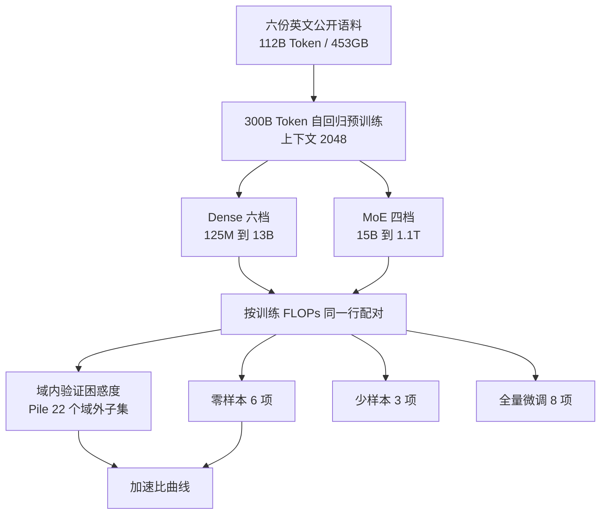
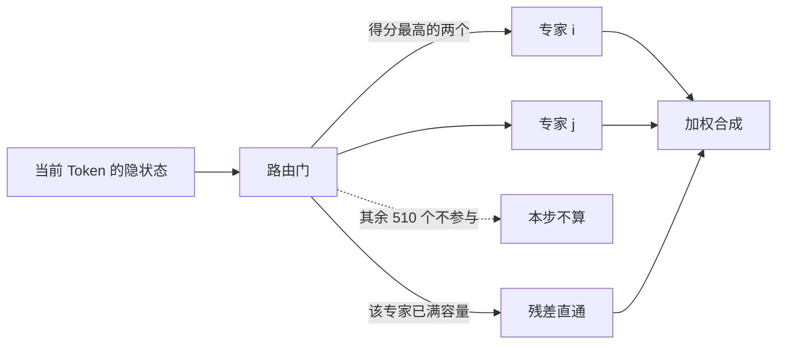

# 同样 FLOP 下 MoE 何时赢过 dense，以及微调为什么赢不了

<!-- release-date: 2021-12-20 -->

> 本文依据 Meta AI 的 **Efficient Large Scale Language Modeling with Mixtures of Experts**，即 arXiv:2112.10684v2（2022-10-26），共 17 页。EMNLP 2022。截至核验 arXiv 最新是 v2。页码均指这份 PDF。全文把三件事分开标注：**报告明确写了什么**、**我们如何解释或验算它**、**哪些是外部资料补充**。

## 读前先把几个词说成人话

这篇论文几乎不发明新模块。它难读的地方，是它把「模型有多大」和「一次前向要算多少」故意拆成两件事，再用四套评测去问：拆开之后，哪边还值钱。

先把后面会反复出现的词说清楚：

- **Token（词元）**：模型读写文本时的最小单位。
- **Dense（稠密模型）**：每一层的全部参数，对每一个 Token 都要算一遍。参数翻倍，单次计算量大致也翻倍。
- **MoE（Mixture-of-Experts，混合专家）**：把某一层的前馈网络拆成很多个小网络（专家）。每个 Token 只让其中少数几个干活。总参数可以很大，单次浮点运算却不必跟着涨。
- **条件计算（conditional computation）**：按输入决定「算哪一部分」，而不是每次把整张网跑完。MoE 是它在 Transformer 里最常用的实现。
- **FLOPs（浮点运算次数）**：一次训练或一次推理实际做了多少加减乘。本文拿它当「算力账单」，不拿总参数当账单。
- **ZFLOPs**：论文的训练成本单位，即 $10^{21}$ 次浮点运算（PDF p. 3 表 1）。
- **零样本 / 少样本（zero-shot / few-shot priming）**：权重不动，只在输入里塞 0 条或 $k$ 条示例，让语言模型给候选答案打分。
- **全量微调（full-shot fine-tuning）**：用下游任务的全部训练集，更新模型里所有参数。

论文自己反复出现的几个专有设定：

- **Top-2 路由**：每个 Token 只激活得分最高的两个专家（PDF p. 2）。
- **隔层专家（alternating dense and expert layers）**：不是每一层都换成 MoE，而是隔一层换一次，沿用 GShard 的排布（PDF p. 2、p. 3）。
- **专家容量（capacity）**：一个 batch 里每个专家最多接多少 Token。接满了，多出来的 Token 从残差连接「漏」过去，这一层等于没走专家（PDF p. 3）。
- **MoE 加速比（speedup factor）**：打到和某档 dense 一样的成绩，MoE 少用了多少倍训练 FLOPs（PDF p. 1 图 1、p. 5）。

这篇不是 Switch Transformers 的复述。Switch 走 top-1、几乎每层都上专家；本文明确写自己跟的是 GShard 的隔层 top-2（PDF p. 2–3）。Switch 那篇是本站另一份未写的报告，本文只在它被引用时点一下，不展开。

## 一句话先说清

2021 年底的大模型叙事还是一条直线：想更强，就加参数、加训练算力。两边是绑死的。

Meta 这篇要量的不是「MoE 能不能训到万亿」，而是更窄的一句话：

> **如果拿训练 FLOPs 当钱，而不是拿总参数当钱，MoE 在语言模型、零样本、少样本上都能少花钱办成 dense 的事；全量微调是唯一还不上的账。**

摘要把结论写得很硬（PDF p. 1）：

- 微调除外，MoE 明显更算力高效；
- 小预算上，MoE 大约用 4 倍少的算力打平 dense；
- 差距随规模收窄，但最大的 1.1T MoE 仍然优于算力相当的 6.7B dense；
- 任务和领域之间的差距很大，说明两种模型的泛化方式并不一样。

后面所有表格，都是在给这四句找边界。对推理服务来说，边界比口号更要紧：你买到的是「同样 FLOPs 下更大的容量」，不是「同样显存、同样微调流程下免费升级」。

### 一条阅读路线

如果只有半小时读原文，建议按这个顺序：

1. **p. 1 图 1**：三条加速比曲线。域内、域外、零样本不是同一回事。
2. **p. 3 表 1**：谁和谁算「算力相当」。1.1T MoE 对上的是 6.7B dense，不是 175B。
3. **p. 6 图 2、图 3**：域内能省 8–16 倍，Pile 上只剩 2–4 倍；数学子集几乎打平。
4. **p. 7 表 2、图 4**：零样本全程 MoE 赢，但曲线在靠拢。
5. **p. 8 表 3、图 5、表 4**：少样本 MoE 仍赢，但从零样本涨上去的幅度更小；微调是例外。
6. **p. 15–17 附录 E、F、G**：蒸馏、纯 FP16、FLOPs 公式。服务侧真正能搬走的，多半在这里。

正文第 2 节的相关工作第一次可以只看 2.2。附录 C 的偏见表证明「稀疏不会自动更干净」，不必先当主线。

## 主要矛盾：容量和 FLOP 被绑在同一张账单上

论文没有从「我们做了一个万亿 MoE」开场。它先指出一个具体的封闭循环（PDF p. 1）：

- 加参数、加算力，是当时提高零样本和少样本最可靠的办法，有些能力只在很大的模型上才出现；
- 训练这种模型的计算资源把很多实验室挡在外面，环境成本也被点名；
- 稀疏模型已经在语言模型和机器翻译上证明「参数可以变多、计算不必等比例变多」，但**还没有被证明对微调和零样本 / 少样本有效**。

最后这句是全文的靶子。作者点名的缺口有两个：Fedus 等人的 Switch Transformers 当时还没把微调做扎实；零样本和少样本更是空白（PDF p. 1–2）。本文不补一套新路由算法，而是做对照实验：同样的解码器骨架、同样的 300B Token、按 FLOPs 而不是按总参数把 dense 和 MoE 配对，看下游到底谁省钱。

于是矛盾变成：

> dense 把「能记住多少」和「每次要算多少」焊在一起。MoE 声称能把这两件事拆开。拆开之后，省下来的算力在语言模型上好不好使，是一回事；拿到零样本、少样本、全量微调上还好不好使，是另一回事。

「用 MoE 换算力」这句口号，必须被这三套评测分别定价。不能只用验证集困惑度宣布胜利。

## 先看全景：这不是一座新模型，是一张配对表

这张图是按 PDF p. 1–5 的叙事重画的流程示意，不是论文原图。它要表达的是：主路径不是新注意力，而是「按 FLOPs 配对 → 四种评测 → 问 MoE 到底省了几倍」。

贯穿全文的对照尺是表 1（PDF p. 3）。同一行的模型，论文认为训练 FLOPs 大致可比：

| 行 | Dense 参数 / 训练 ZFLOPs | 层 / 宽 | MoE 参数 / 训练 ZFLOPs | 专家数 |
|---|---|---|---|---:|
| 1 | 125M / 0.36 | 12 / 768 | 15B / 0.43 | 512 |
| 2 | 355M / 1.06 | 24 / 1024 | 52B / 1.30 | 512 |
| 3 | 1.3B / 3.57 | 24 / 2048 | 207B / 4.53 | 512 |
| 4 | 2.7B / 7.08 | 32 / 2560 | 这一档没有 MoE | — |
| 5 | 6.7B / 17.12 | 32 / 4096 | 1.1T / 22.27 | 512 |
| 6 | 13B / 32.67 | 40 / 5120 | 这一档没有 MoE | — |

表里还有 GPT-3 的 760M 和 175B，作者自己没训（PDF p. 3）。所有模型都训 300B Token，序列长度 2048。

有两个数字对必须先钉住，后面所有「1.1T 赢了」都踩在这上面。

第一，**1.1T 对上的不是 175B，是 6.7B**。$22.27 / 17.12 \approx 1.30$，也就是多花约 30% 的训练 FLOPs，换来约 160 倍总参数。这句话论文没写成「160 倍」，是我们用表 1 的两个参数量相除得到的；官方模型卡后来把同一笔账写成「160x increase in parameters with only a 30% increase in FLOPS」，见文末外部补充。

第二，**FLOPs 相当不等于 GPU 时间相当**。附录 D 按实测吞吐反推 GPU 日：dense 按每卡 160 TFLOP/s，MoE 按 115 TFLOP/s，因为多了 all-to-all 通信（PDF p. 14 脚注 14）。表 8 给出 6.7B dense 是 1238 GPU 日，1.1T MoE 是 2241 GPU 日，大约 1.8 倍，不是 1.3 倍（PDF p. 16）。引言里写「约 5000 GPU 日」的大预算（PDF p. 2），和表 8 单模型的 2241 / 2363 对不上；更像是把最大几档加在一起说的量级，论文没有给出拆账。谈省算力时，要先问省的是 FLOPs 还是卡时。

## 核心设计：条件计算怎样让容量和 FLOP 脱钩

### 旧问题：dense 的前馈层是按「每个 Token 都跑完整张矩阵」计费的

标准 Transformer 块里，注意力之后是一个大前馈网络。对 dense 模型，这个前馈对每个 Token 用同一组权重。加宽、加深、加层，都会让单 Token 的 FLOPs 一起涨。GPT-3 把这条路走到 175B，训练成本在论文的同一张表上是 430.17 ZFLOPs（PDF p. 3），比本文最大的 1.1T MoE 高一个数量级还多。

### 新设计：隔层换成 512 个专家，每个 Token 只走两个

作者把 dense 骨架尽量对齐 Brown 等人 2020 年的 GPT-3（PDF p. 3），然后只改前馈侧：

- 隔一层，把 dense 前馈换成 MoE 层；
- 一层里放 $E = 512$ 个专家；
- 路由门给每个 Token 挑 **top-2** 个专家；
- 加一项加权的 gate loss，鼓励 Token 在专家之间均匀分布，写法跟 GShard 一样（PDF p. 2）。

工作机制可以用一句人话讲完：每个 Token 先问门「这 512 个小网络里谁最适合我」，只让前两名干活，其余 510 个权重这一步完全不算。总参数几乎按专家数膨胀，单 Token 的前馈计算量只相当于「两个小 FFN」，不按 512 倍涨。

这张图是按 PDF p. 2–3 的文字重画的机制示意，不是论文原图，也不表示实测耗时。

容量公式写在 p. 3：每个专家最多接

$$
\frac{C \cdot B}{E}
$$

个 Token。$B$ 是这个 batch 的 Token 总数，$C$ 是容量因子，本文取 2，$E = 512$。接满之后再来的 Token 被标成 overflow，表示从残差绕过这一层专家。

**我们如何解释它。** $C = 2$ 搭配 top-2 这一设定，意味着如果路由完全均匀，每个专家接到的 Token 数正好等于容量，没有余量。任何一点不均衡都会溢出。论文没有报告溢出比例，所以我们不知道有多少 Token 实际上「白走了一层」。这是后面谈泛化差异时，一个不能假装不存在的实现细节。

### 他们改了什么、故意没改什么

跟 GPT-3 比，dense 骨架有两处明确不同（PDF p. 3）：

1. 只用密集注意力，GPT-3 是密集与局部带状稀疏交替；
2. 位置编码用正弦，跟 Shortformer，而不是可学习位置嵌入。脚注说早期实验认为效果相当，还能少学一些参数。

优化器和训练日程也按 GPT-3 的规模来（PDF p. 4）：

- 预归一化 Transformer + GELU；
- Adam，$\beta_1 = 0.9$，$\beta_2 = 0.98$，$\epsilon = 10^{-8}$，权重衰减 0.01，dropout 0.1；
- 学习率从 0 线性热身 375M Token，再线性降回 0；
- 批量与峰值学习率随模型大小走 Brown 等人的表。

例外写在脚注 4：355M dense 和与它 FLOPs 对齐的 52B MoE **关掉了 dropout**，作者认为小规模上略好（PDF p. 4）。

MoE 训练上，他们明确拒绝了 Switch 的一个补丁：Fedus 等人报告过大 MoE 不稳，建议缩放初始权重；本文「并不觉得有必要」（PDF p. 3）。他们改的是另一件事：专家参数看到的 batch 是 dense 参数的 $1/E$，于是把专家梯度乘 $1/\sqrt{E}$。理由对准 Krizhevsky 2014 年那条经验：batch 变 $E$ 倍，学习率该变 $\sqrt{E}$ 倍；现在专家的 batch 更小，就该把步子按 $\sqrt{E}$ 收掉（PDF p. 3）。$E = 512$ 时 $\sqrt{E} \approx 22.6$，专家更新大约被压到共享学习率下的二十分之一。这是训练能否稳住的关键旋钮，论文没有做消融。

### FLOPs 为什么几乎与专家数无关

附录 G 把账单写成解析式，并假定训练开了 activation checkpointing，等于多一次前向（PDF p. 17）。Dense 是

$$
F_{\text{dense}} = 96\, T\, l\, h^{2}\left(1 + \frac{s}{6h} + \frac{V}{16 l h}\right)
$$

MoE 在此之上加一项：

$$
F_{\text{MoE}} = F_{\text{dense}} + 32\, T\, l\, h^{2}
$$

符号：$T$ 是训练 Token 数，$l$ 层数，$h$ 隐维度，$s$ 序列长度，$V$ 词表大小。本文全部模型 $T = 300 \times 10^{9}$，$s = 2048$，$V = 51200$（PDF p. 17）。

多出来的 $32 T l h^{2}$，论文的解释是：隔层的 top-2 相当于每隔一层多算一个前馈，路由投影的 FLOPs 忽略不计。**这一项不含 $E$**。512 个专家还是 51 个专家，解析式给出的训练 FLOPs 一样——前提是真的只激活两个，而且溢出不多。

我们按公式验算过表 1 的 6.7B：$l = 32$，$h = 4096$，得到约 17.12 ZFLOPs，与表一致；再加上 $32 T l h^{2} \approx 5.16$ ZFLOPs，得到 22.28，与 1.1T 的 22.27 一致。公式和表格对得上。

### 可迁移启发

想用 MoE 换算力，先把横轴从「总参数」改成「每 Token 激活的 FLOPs」，再决定专家数。专家数加到 512，容量几乎只进总参数和通信，不进这条解析式。自己做对照时，**同一行必须是 FLOPs 对齐，不能是参数对齐**；参数对齐会让 MoE 看起来永远更贵，FLOPs 对齐才会暴露它到底省没省。

## 数据与训练：112B 的池子，看了约 2.7 遍

预训练数据是六份英文语料的并集，共 112B Token、453GB（PDF p. 4）：

| 来源 | 体量 | 论文怎么描述 |
|---|---:|---|
| BookCorpus | 4GB | 一万多本未出版书 |
| 英文维基 | 12GB | 去掉列表、表格、标题 |
| CC-News | 76GB | 2016-09 至 2019-02 的约 6300 万篇英文新闻 |
| OpenWebText | 38GB | GPT-2 所用 WebText 的开源复刻 |
| CC-Stories | 31GB | 滤成 Winograd 那种故事风格的 CommonCrawl 子集 |
| 英文 CC100 | 292GB | 2018 年 CommonCrawl，滤成维基风格 |

前五份就是 RoBERTa 用过的那一组，第六份是 CC100 的英文部分。切分器用 GPT-2 / RoBERTa 那套 BPE，词表 5 万（PDF p. 4）。

脚注 3 写得很清楚：Token 总数故意对齐 GPT-3 的 300B，**预训练数据不是同一份**（PDF p. 4）。$300 / 112 \approx 2.7$，最大模型把自己的池子看了大约两遍半。这是我们的除法，不是论文原话。后面域内加速比特别高、域外尤其是数学子集几乎没优势，和「池子更小、重复更多、风格更偏网页与维基」是同一张背景，论文没有把它做成因果消融。

实现栈写在 p. 4：PyTorch + fairseq。大模型训练的三件套——纯 FP16、activation checkpointing、FSDP——正文只点名，细节在附录 F，后面单独讲。

## 他们怎么给「省了多少算力」定价

下游成绩不能直接拿「1.1T 比 6.7B 高 3 分」当加速比。两档模型的成绩很少正好相等。于是 3.3.3 节定义了 MoE speedup factor（PDF p. 5）。

人话版：想达到成绩 $t$，dense 要花 $c_{\text{dense}}(t)$ FLOPs，MoE 要花 $c_{\text{MoE}}(t)$ FLOPs，加速比就是两者相除。手头只有离散的几档模型，中间值在对数坐标上线性插值：

$$
c(t) = \exp\bigl(\log c_{\text{lo}}(t) + r \bigl(\log c_{\text{hi}}(t) - \log c_{\text{lo}}(t)\bigr)\bigr)
$$

其中

$$
r = \frac{t - t_{\text{lo}}}{t_{\text{hi}} - t_{\text{lo}}}
$$

$t_{\text{lo}}$、$t_{\text{hi}}$ 是成绩刚好夹住 $t$ 的两档，$c_{\text{lo}}$、$c_{\text{hi}}$ 是它们的训练成本。论文自己举的例子：dense 花 20 ZFLOPs 打到 90 分，MoE 花 5 ZFLOPs 打到同一分，加速比就是 4（PDF p. 6）。

图的横轴用 $c_{\text{dense}}(t)$，所以不同任务可以画在同一张「dense 花了多少钱」的尺子上。图 1 就是这把尺子的总览（PDF p. 1）：

- 蓝线（域内语言模型）：加速比大约从 8 爬到 16，再落回约 10；
- 红线（Pile 域外）：大约 4，向 2 下滑；
- 黄线（六项零样本平均）：小预算大约 3–4，大预算靠近 2。

这些是我们从图上读的走势，精确数字以正文为准：域内 8–16 倍，Pile 上 2–4 倍；dense 训练预算 2–6 ZFLOPs 时约 4 倍，到约 30 ZFLOPs 时约 2 倍（PDF p. 6）。

有一条使用限制必须说在前面：**加速比量的是训练 FLOPs，不是推理延迟，也不是服务吞吐**。论文贡献里写了「训练和推理的计算量只要一小部分」（PDF p. 2），但正文实验没有单独报服务延迟、batch 大小或专家并行的通信。推理侧的「省」是从同一套条件计算推出来的，不是测出来的。对「推理服务与架构探索」这个方向，这是原文最大的缺口之一。

## 语言模型：域内很赚，换个域就没那么赚

图 2 把困惑度直接画在训练 ZFLOPs 上（PDF p. 6）。黄点（MoE）整条曲线在红点（dense）下面，也就是更好。但两张子图的缝宽不一样：

- 域内验证：15B MoE 的 12.58 已经贴着贵得多的 1.3B dense 的 12.48；1.1T 做到 6.80，13B dense 还在 8.97（PDF p. 15 表 5）。
- Pile 22 个子集平均：15B 对上自己的搭档 125M 是 13.97 vs 21.23，仍然大赢；但已经打不赢 1.3B dense 的 12.36。1.1T 是 9.11，13B 是 9.39，只剩一个很小的缝（PDF p. 15 表 5）。

正文把这件事说成：所有 MoE 在所有数据集上优于对应 dense，但优势随领域和规模变化很大；域内能匹配「多花 8–16 倍算力」的 dense，Pile 上只剩 2–4 倍；规模越大，优势越小（PDF p. 6）。

图 3a 把 Pile 拆开看（PDF p. 6）。我们从图上读到的相对位置，和正文点名的例子一致：

| 子集 | 它相对训练集像什么 | 加速比走势（正文 + 图 3a） |
|---|---|---|
| CommonCrawl | 最接近训练语料 | 最高，大约 5 倍并向 3–4 回落 |
| ArXiv、OpenSubtitles | 明显换域 | 中等，大约 3 倍并向 1–2 回落 |
| DM Mathematics | 论文认为「与训练域非常不同」 | 几乎贴着 1 |

最大 MoE 在 DM Mathematics 上是 7.63，对应 dense 是 7.66，「几乎刚刚好赢」（PDF p. 7）。换到 13B dense 的 7.41，1.1T MoE 其实输了（PDF p. 15 表 5）。**这是表 5 里的数字，不是正文原话。** 算力再往上加一档 dense，数学子集上稀疏的那点优势就没了。

同表里还可以看到另一种极端。英文维基：1.1T 是 6.65，6.7B 是 9.22，13B 是 8.56，MoE 仍大幅领先。GitHub：1.1T 是 3.99，13B 是 4.03，基本打平。CommonCrawl：1.1T 是 10.02，13B 是 10.80，MoE 仍赢。领域不是「一律省 4 倍」，是「像训练集的地方省得多，不像的地方可能省光」。

### 我们如何解释它

条件计算加的容量，优先拟合训练分布里那些反复出现的模式。专家可以变成「网页 / 维基 / 新闻」的专用前馈。换到数学、字幕、代码这种训练里少见的分布，路由没有对应的专家可分，容量就变成闲置参数。Dense 没有这条捷径，容量和计算绑在一起，换域时掉得慢一些。论文把这种现象称为两种模型「泛化方式不同」，并列为值得另做的研究（PDF p. 1、p. 9），没有给出路由可视化或专家特化分析。

### 可迁移启发

用 MoE 换训练算力之前，先问线上请求和预训练分布有多近。域内日志、检索来的网页、维基风格的知识问答，这篇论文支持「小预算大约 4 倍、域内甚至 8 倍以上」；竞赛数学、陌生代码仓库、领域字幕，不要默认能把同一张加速比曲线搬过去。

## 零样本：全程赢，但曲线在收窄，而且任务之间不像同一件事

表 2 是六项零样本的准确率（PDF p. 7）。评测协议跟 GPT-3：除 OpenBookQA 和 StoryCloze 用测试集，其余用开发集；每个候选单独打分，取最高（PDF p. 4–5）。

先看 dense 基线成不成立。作者自己的 dense 平均分贴着、略高于论文里的 GPT-3；用公开 API 复测 davinci，也能对上原论文最大模型的数字（PDF p. 7）。他们因此认为：尽管语料不同、注意力不同、位置编码不同，这套评测框架可以拿来衡量 MoE。SuperGLUE 被丢掉了，因为他们用公开 API 复现不了 GPT-3 论文的数字，作者私下确认 GPT-3 那一项用了另一套协议（PDF p. 4 脚注 7）。

六项平均（PDF p. 7 表 2）：

| 算力档 | Dense 平均 | MoE 平均 | MoE 多出来的分 |
|---|---:|---:|---:|
| 125M vs 15B | 53.6 | 62.4 | +8.8 |
| 355M vs 52B | 60.4 | 68.2 | +7.8 |
| 1.3B vs 207B | 66.8 | 70.7 | +3.9 |
| 6.7B vs 1.1T | 72.2 | 75.0 | +2.8 |
| 13B dense（无 MoE 搭档） | 74.2 | — | — |
| GPT-3 175B（论文数字） | 76.9 | — | — |

三件事同时成立。

第一，**每一档 MoE 都高于配对的 dense**，论文原话如此（PDF p. 7）。

第二，**多出来的分在变少**：+8.8 → +2.8。图 4 把同一件事画成三条几乎要交汇的曲线（PDF p. 7）。1.1T 的 75.0 仍高于 6.7B 的 72.2，也略高于更贵的 13B 的 74.2，但已经摸不到 GPT-3 175B 的 76.9。引言说「即使在更大预算上，1.1T 仍优于算力相当的 6.7B」（PDF p. 2），表 2 支持这句。结论里另一句「dense 那边要两倍计算」（PDF p. 8），对的是图 1、图 4 在大预算上大约 2 倍的加速比，不是表 1 里 22.27 vs 17.12 那 30%。两句话量的不是同一个差。

第三，**任务不是同一张脸**。图 3b 把四项零样本的加速比拆开（PDF p. 6–7）：HellaSwag 和 PIQA 很高，ReCoRD 和 WinoGrande 低得多。用表 2 的原始分核对：

| 任务 | 6.7B dense | 1.1T MoE | 13B dense | GPT-3 175B |
|---|---:|---:|---:|---:|
| HellaSwag | 70.2 | **78.6** | 73.7 | 78.9 |
| PIQA | 78.2 | **80.3** | 79.0 | 81.0 |
| ReCoRD | 87.5 | 88.0 | **88.5** | 90.2 |
| WinoGrande | 64.7 | 66.4 | **67.6** | 70.2 |
| StoryCloze | 80.5 | **81.8** | 80.9 | 83.2 |
| OpenBookQA | 51.8 | 55.2 | **55.4** | 57.6 |

HellaSwag 上，1.1T MoE 的 78.6 已经贴着 GPT-3 175B 的 78.9，而 6.7B dense 只有 70.2。WinoGrande 和 ReCoRD 上，13B dense 反而更高。论文的判断是：MoE 在某些任务上「显著加速」，在另一些任务上「更温和」（PDF p. 7）。**没有解释为什么是这两类**。限制一节把「哪些因素让任务更偏爱 MoE」列为未解（PDF p. 9）。

### 可迁移启发

不要用六项平均去决定要不要上 MoE。平均分会被 HellaSwag 这种「常识续写」拉高，也会被 WinoGrande 这种「代词消歧」拉低。自己的核心业务若更像后者，表 2 并不支持「换 MoE 就能少花四倍算力」。

## 少样本：MoE 仍赢，但从零样本往上爬得更慢

少样本只做了三项：WinoGrande（$k = 50$）、StoryCloze（$k = 70$）、OpenBookQA（$k = 100$）。这是 GPT-3 论文里，在他们这个规模上、相对零样本和多数类基线至少涨 2 分的非生成任务（PDF p. 4）。每项随机抽 25 组示例取平均，示例顺序对每道测试题再打乱；上下文塞不下就从完整示例里截（PDF p. 5）。

表 3 同时给绝对分和相对零样本的涨幅（PDF p. 8）。关键对比是论文自己写的那一对（PDF p. 8）：

- 6.7B dense：零样本到少样本，三项平均 +3.6，到 69.3；
- 1.1T MoE：+2.3，到 70.1。

1.1T 的绝对分仍高于 6.7B，也高于 207B MoE 的 65.4。但 **MoE 从 priming 里多拿到的那几分，比 dense 少**。图 5 把涨幅对训练 ZFLOPs 画出来：dense 和 GPT-3 随规模往上走，MoE 也走，斜率更平（PDF p. 8）。小 MoE 甚至会出现负涨幅：15B 平均 −0.9，StoryCloze 一项就 −2.1。

论文把 dense 随规模涨得更多，读成对 GPT-3 那句「某些能力在规模上涌现」的再确认；对 MoE 则只记录「更大的 MoE 也会从少样本受益，且所有设定下仍优于 dense 搭档」（PDF p. 7–8）。**它没有解释为什么 MoE 的少样本边际更小**。

我们能说的边界是：零样本已经把 MoE 多出来的容量用掉了一部分，上下文里再塞示例，dense 还有空间，MoE 的空间更少。这是读图 5 的一种解释，不是论文证据。另一种同样兼容表格的解释是：MoE 更贴训练分布，提示词里的示例格式一旦和预训练文档格式不一致，少样本的「示范作用」就弱于 dense。官方仓库后来提醒过，这批模型预训练时没见过换行符，少样本格式必须把换行换成 `</s>`——那是外部补充，见文末。

### 可迁移启发

如果产品形态是「权重不动、全靠提示词」，这篇论文支持 MoE：绝对分仍高。如果产品形态是「靠精心写的 few-shot 模板再挤几分」，dense 的边际可能更好。不要把零样本的加速比直接抄到少样本预算里。

## 微调是例外：同一套 recipe 下，有的任务会把零样本优势吐回去

这是全文最不听话的一张表，也是「用 MoE 换算力」最容易在业务上翻车的地方。

作者按 GPT-1 的办法：在最后一层表示上加一个任务专用线性层 $W_y$，再接 softmax；**所有参数都更新**，用完整训练集（PDF p. 5）。除了原来的零样本任务，还加了 BoolQ、MNLI、SST-2 三个分类任务。没做 6.7B、13B dense 和 1.1T MoE 的微调，原因是资源不够（PDF p. 8）。附录 B：固定 epoch（BoolQ / OpenBookQA / StoryCloze / PIQA 100 轮，HellaSwag / WinoGrande / SST-2 25 轮，MNLI 6 轮），按验证集选点；没有验证集或就在验证集上报告时，把训练集 80/20 切开（PDF p. 14）。

表 4 的结构是「零样本 vs 微调」并排（PDF p. 8）。Dense 一侧没有意外：八个数据集、四个规模，微调一律涨。MoE 一侧拆成两类。

**微调仍有帮助、但追不上 dense 的**是 StoryCloze、OpenBookQA、BoolQ、MNLI、SST-2。以 StoryCloze 为例，2.7B dense 从 78.2 拉到 97.0；207B MoE 从 78.1 只拉到 80.9，还低于 52B MoE 微调后的 84.9。SST-2 上 MoE 能到 90 左右，dense 在 93–95。论文的原话是：这些情况下，微调后的 MoE「接近对应的 dense」（PDF p. 8）。「接近」不是「超过」。

**微调反而掉下去的**是 HellaSwag、PIQA、WinoGrande。数字比口号刺眼：

| 任务 | 模型 | 零样本 | 全量微调 | 变化 |
|---|---|---:|---:|---:|
| HellaSwag | 2.7B dense | 65.9 | 90.0 | +24.1 |
| HellaSwag | 15B MoE | 53.2 | 37.3 | −15.9 |
| HellaSwag | 52B MoE | 64.9 | 45.4 | −19.5 |
| HellaSwag | 207B MoE | 70.5 | 42.2 | −28.3 |
| PIQA | 2.7B dense | 76.6 | 80.3 | +3.7 |
| PIQA | 207B MoE | 78.2 | 68.3 | −9.9 |
| WinoGrande | 2.7B dense | 61.4 | 69.5 | +8.1 |
| WinoGrande | 207B MoE | 60.9 | 50.4 | −10.5 |

HellaSwag 上，207B MoE 零样本已经 70.5，和 6.7B dense 的 70.2 持平；一微调，掉到 42.2，比 125M dense 微调后的 50.7 还差。这不是「涨得少」，是「把预训练挖出来的能力挖回去」。

论文对原因几乎没做分析。它只写了三句（PDF p. 8）：

1. 他们用和 dense **完全相同** 的微调方法；
2. MoE 也许该用别的办法，例如只微调专家、或只微调非专家参数；
3. 这件事留给未来。

所以「微调是例外」是实验事实，不是已经定位的机制。可能的机制有很多——512 个专家在小数据集上被 25–100 个 epoch 洗乱、路由在微调时崩了、容量因子在下游 batch 里溢出更多——**原文一个都没测**。我们不能把其中任何一个写成论文结论。

还有一个表 4 自己没强调、但和「规模」叙事打架的细节：BoolQ 的 MoE 零样本随规模变差，15B 是 60.9，52B 是 56.0，207B 是 54.2。更大并不自动更好。论文没有讨论。

### 这对「用 MoE 换算力」意味着什么

如果目标是**预训练一次、用 priming 伺候很多任务**，表 2 和表 3 支持换 MoE：同样 FLOPs，零样本和少样本更强，小预算大约 4 倍。

如果目标是**每个下游任务全量微调一份权重再上线**，表 4 不支持这笔交换。算力在预训练上省下来的，可能在微调阶段连同零样本优势一起吐回去。而且微调后要存的是 15B / 52B / 207B 的整份稀疏权重，不是 125M / 355M / 1.3B。服务侧的显存账单按总参数走，不按 FLOPs 走。

2021 年这篇论文碰到的墙，后来业界主要不是靠「把同一套全量微调硬做上去」翻过去的，而是换了后训练对象：指令微调、人类反馈、只改部分专家。那些都不在本 PDF 里。本文能负责任说的只有：在 GPT-1 式全量微调、八个 2020 年前后的分类 / 常识任务上，MoE 不是更算力高效的那一方。

### 可迁移启发

把微调 recipe 从 dense 原样搬到 MoE 上，是这篇论文明确记录的失败模式。若一定要微调稀疏模型，最少要单独做：学习率、epoch、是否冻路由、是否只更新共享层。不要把表 2 的零样本胜利，当成表 4 也会胜利。

## 蒸馏：稀疏训练的红利，可以交给一个稠密学生

附录 E 处理的是服务侧真正会问的下一个问题：稀疏模型推理时参数太多，大多数还是闲着的，存和搬都贵（PDF p. 15–16）。

做法是经典知识蒸馏。学生一律是 12 层、宽 768 的 dense，也就是表 1 里那个 125M。损失是 25% 标准交叉熵 + 75% 软蒸馏，让学生学老师的 logits；序列长度降到 1024 以加快实验（PDF p. 16）。老师可以是更大的 dense，也可以是 MoE。

表 9（PDF p. 16）：

| 老师 | 老师训练成本（ZFLOPs） | 学生域内验证 PPL |
|---|---:|---:|
| 无（125M 自己训） | 0.36 | 16.01 |
| 15B MoE | 0.43 | 15.20 |
| 355M dense | 1.06 | 14.88 |
| 1.3B dense | 3.57 | 14.67 |
| 52B MoE | 1.30 | 14.64 |
| 2.7B dense | 7.08 | 14.62 |

论文的原话是：无论老师是 dense 还是稀疏，蒸馏学生都优于调好的 dense 基线；**稀疏训练的一部分效率优势，可以通过蒸馏传给 dense 学生**。具体例子：52B MoE 老师成本 1.30，学生 PPL 14.64；1.3B dense 老师成本 3.57，学生 14.67。老师便宜一倍以上，学生几乎一样好（PDF p. 16）。

这条路径和正文的微调失败是 complementary 的：不会微调 MoE，并不等于 MoE 训出来的能力只能锁在稀疏权重里。可以在预训练用条件计算省 FLOPs，再蒸成 dense 去部署。论文没测蒸馏学生的零样本和微调，所以不能说「服务问题已经解决」。它只证明了域内困惑度这一项，效率可以转移。

### 可迁移启发

若线上必须 dense（量化工具链、batch 友好、没有专家并行），这篇附录给的是「训练用 MoE、部署用学生」，不是「部署也上 1.1T」。52B → 125M 这一档，已经能把老师的训练成本从 3.57 降到 1.30 而不伤学生 PPL。再往 207B、1.1T 蒸，原文没做。

## 系统侧：纯 FP16、FSDP，以及 MoE 为什么更吃通信

附录 F 是把万亿稀疏和 13B dense 塞进数据并行的那套工程，不是新算法（PDF p. 16–17）。

**纯 FP16。** 常规混合精度要把 FP32 主权重、FP32 优化器状态、FP16 权重和梯度都留下，Adam 大约 16 字节 / 参数。他们丢掉 FP32 主权重（大批量试点里「对质量没影响」），再把 Adam 的一阶、二阶矩动态缩放到 FP16 能表示的范围，每步仍在 FP32 里算更新（PDF p. 16，变换式来自 Jukebox）。内存大约再砍 50%。正文 2.4 节把它叫作 pure FP16 training（PDF p. 3）。

**Activation checkpointing。** 只在 Transformer 层与层之间留激活，层内反向时重算。计算大约 +33%，激活内存可降约 10 倍，数字引的是 ZeRO 那篇（PDF p. 17）。

**FSDP。** 参数就地分片，前向 / 反向用到某一层时才 all-gather。包的粒度是「每一层一个 FSDP wrap」：太细则通信消息太小，太粗则峰值内存按整块模型涨（PDF p. 17）。实现放在 fairscale，论文写它可以当 PyTorch DDP 的即插替换。

MoE 在这套栈上的额外代价，出现在附录 D 而不是 F：同样 A100，dense 观察到 160 TFLOP/s，MoE 只有 115，作者归因为 all-to-all（PDF p. 14 脚注 14）。脚注还说「再优化实现可以降下来」。**原文没有给专家并行的拓扑、没有给推理时的 expert capacity、也没有给 serving batch 下的通信占比**。

碳排按 Azure NDv4、A100 TDP 400W、West US 2 的 0.3 kgCO2e/kWh、PUE 1.125 估算，每个 GPU 日 3.24 kgCO2e，云厂商宣称 100% 抵消（PDF p. 14）。表 8：本项目合计 7345 GPU 日、23.8 吨；1.1T MoE 7.3 吨，13B dense 7.7 吨，GPT-3 175B 引 Patterson 等人是 552.1 吨，Switch 1.5T 是 72.2 吨，GShard 600B 是 4.8 吨（PDF p. 16）。这些数字不含制造基础设施，也不含前期试跑；作者估计试跑大约再乘 2，因为他们早期扔掉过一版 6.7B dense 和一版 1.1T MoE，13B 只训了一次（PDF p. 15）。

### 可迁移启发

条件计算省的是矩阵乘，不自动省通信和显存。1.1T 对 6.7B 是「FLOPs +30%、参数 ×160、GPU 日 ×1.8」。训练集群如果已经被 all-to-all 卡住，表 1 上的 4 倍加速比会先被利用率吃掉一块。部署时更是参数账单做主：没有专家并行和很强的专家放置，1.1T 不是 6.7B 的替代品。

## 偏见、限制，以及论文承认没做的事

伦理一节用 StereoSet 和 CrowS-Pairs 比了 dense 与 MoE（PDF p. 9，表在 p. 15）。结论三条：

- 规模越大，刻板印象越重，dense 和 MoE 都是，bootstrap 下最好档和最差档的差异显著；
- 算力对齐的 dense 与 MoE，StereoSet 上差不多，CrowS-Pairs 上 MoE 略好，但差异不显著；
- 作者直觉上觉得稀疏「天生更好控」——比如专门设计某些专家——但没做实验。

限制一节同样短，而且诚实（PDF p. 9）：

- 只试了一种 MoE 配置，超参和结构都跟 GPT-3；这套对 MoE 可能不是最优；
- 没扫专家数等 MoE 专用超参；
- 任务和领域之间的差距很大，**不知道具体是什么因素在起作用**。

加上正文里已经写明的缺口：没微调最大几档；没试选择性微调；没报溢出率；没报服务延迟。贡献列表里的「推理计算量只要一小部分」（PDF p. 2），证据强度低于「训练 FLOPs 上的加速比」。

代码和模型，论文写了公开，给的地址是 fairseq 的 `examples/moe_lm`（PDF p. 1 脚注 1）。这一点原文有，所以正文必须写；仓库后来变成什么状态，是外部补充，见下一节。

## 读完该留下的判断，不是另一份摘要

把四套评测叠在同一句「用 MoE 换算力」上，会得到一张分层的价目表：

| 你真正要买的东西 | 这篇论文支不支持用 MoE 换 | 证据 |
|---|---|---|
| 同样训练 FLOPs 下更低的域内困惑度 | 支持，小预算大约 4 倍，域内可到 8–16 倍 | 图 1、图 2、表 5 |
| 换域后的语言模型 | 支持，但只剩 2–4 倍；数学几乎没有 | 图 3a、DM Mathematics 7.63 vs 7.66 |
| 零样本 priming | 支持，且 1.1T 仍优于 6.7B；任务差异大 | 表 2、图 3b、图 4 |
| 少样本 priming | 绝对分支持，边际涨幅更小 | 表 3、图 5 |
| 全量微调后上线 | **不支持**，部分任务会掉到零样本以下 | 表 4 |
| 把稀疏老师蒸成 dense 学生再部署 | 域内 PPL 支持，下游没测 | 表 9 |
| 同样显存 / 同样 GPU 日下的服务吞吐 | **原文没测** | 只有 115 vs 160 TFLOP/s 的训练利用率 |

所以这篇 2022 年 EMNLP 论文真正改写的，不是「MoE 是否能做语言模型」——GShard 和 Switch 已经做过——而是把 GPT-3 那套零样本 / 少样本协议第一次套到稀疏自回归模型上，并公开承认微调是例外。对后来的推理服务，它留下的不是一套 serving 系统，而是一条选型原则：

> **MoE 换到的是「每 FLOP 的容量」，不是「每张卡的容量」，更不是「每份微调 recipe 的容量」。** 零样本、少样本、域内日志，这张票有效；全量微调、换域数学、按总参数计费的显存，这张票会失效。

和本站 [GPT-3](/reports/OpenAI/GPT-3) 对着读：GPT-3 证明少样本可以少做微调；本文证明，若把骨架换成 MoE，少样本仍然成立，微调反而更危险。和本站 [OPT](/reports/Meta/OPT) 对着读：OPT 后来把 13B dense 和 1.1T 稀疏当作「社区已经拿得到的例外」写进脚注，指的就是这批权重。和本站 [DeepSeek-V2](/reports/DeepSeek/DeepSeek-V2) 对着读：V2 的 DeepSeekMoE 已经是细粒度专家加共享专家，并且把 KV 和训练算力拆开处理；不要把 2022 年这套 512 专家、隔层 top-2、全量微调失败，直接说成今天 MoE 基座的行为。

## 关键词回看

- **条件计算**：按输入选择计算哪些参数。本文用它把总参数从每步 FLOPs 里拆出去。
- **Top-2 + 隔层专家 + $E = 512$**：本文唯一的 MoE 配置，来自 GShard，不是 Switch 的 top-1。
- **容量因子 $C = 2$**：专家接满就溢出到残差。均匀路由时几乎没有余量。
- **专家梯度 $1/\sqrt{E}$**：用来补偿专家更小的 batch，替代 Switch 那种改初始化。
- **加速比**：对数插值之后，打到同一成绩 MoE 少花的训练 FLOPs 倍数。域内、域外、零样本三条线不是同一个数。
- **算力相当的 6.7B**：1.1T MoE 的对照尺。不是 175B。
- **微调例外**：同一套全量微调下，HellaSwag / PIQA / WinoGrande 的 MoE 会掉点。
- **蒸馏转移**：52B MoE 老师可以比 1.3B dense 老师便宜一倍以上，蒸馏出几乎同样的 125M 学生 PPL。

## 资料与阅读边界

### 本文依据的版本

- 本地原件：`papers/Meta/Efficient-Large-Scale-MoE.pdf`，17 页，页脚 `arXiv:2112.10684v2 [cs.CL] 26 Oct 2022`。
- 官方页：[arXiv:2112.10684](https://arxiv.org/abs/2112.10684)。v1 于 2021-12-20 17:05:11 UTC 提交，v2 于 2022-10-26 16:14:05 UTC 提交。截至撰写时最新仍是 v2，与本地页数一致。
- 会议：EMNLP 2022，ACL Anthology [2022.emnlp-main.804](https://aclanthology.org/2022.emnlp-main.804/)。
- `release-date` 取 **2021-12-20**。这篇文章讲的是一项对照方法和与之配套的公开模型，按「该技术首次官方公开日」取值，用 arXiv v1；不用 v2 日或 EMNLP 开会日回写。

### 报告明确写了、本文覆盖了的部分

第 1 节引言与图 1；第 2 节背景（GPT-3、稀疏 MoE、零样本 / 少样本、大规模训练）；第 3 节设定（表 1、数据、评测协议、加速比公式）；第 4 节结果（困惑度、零样本、少样本、微调）；第 5 节结论；伦理与限制；附录 A 表 5 的代表性子集；附录 B 微调 epoch；附录 C 偏见；附录 D 碳排与 GPU 日；附录 E 蒸馏；附录 F 训练技术；附录 G FLOPs 公式。

### 外部资料补充（不是 PDF 原文）

- 论文脚注 1 的代码地址是 [pytorch/fairseq `examples/moe_lm`](https://github.com/pytorch/fairseq/tree/main/examples/moe_lm)。该路径现在重定向到 [facebookresearch/fairseq](https://github.com/facebookresearch/fairseq/tree/main/examples/moe_lm)。仓库 README 与论文一致地提供 dense 125M–13B 和 MoE 15B、52B 的下载链接；207B 与 1.1T 写的是 Available by request。GitHub 显示该仓库于 2026-03-20 被归档为只读——这是论文之后的仓库状态，不能写成 2021 年的发布口径。
- 同目录 [model card](https://github.com/facebookresearch/fairseq/blob/main/examples/moe_lm/model_card.md) 把表 1 那笔账写成：「1.1T MoE 相对 6.7B dense 只多 30% FLOPS，即参数增加 160 倍、FLOPS 只增加 30%」。与我们按表 1 做的除法一致，但原文 PDF 没有写「160 倍」这四个字。
- README 还写：这批模型预训练时把换行替换成 `</s>`，少样本提示里不该再出现换行符。PDF 未写这一条。
- 本站相关解读：[GPT-3](/reports/OpenAI/GPT-3) 是零样本 / 少样本协议的出处；[OPT](/reports/Meta/OPT) 在 2022 年把本文的 13B dense 与 1.1T 稀疏列为社区已能申请到的例外；[DeepSeek-V2](/reports/DeepSeek/DeepSeek-V2) 是后来细粒度 MoE 的一条不同路线。Switch Transformers、GShard 在本站仍是未解读原件，本文不代替它们。

### 原文没有公开、本文也不补的缺口

- 溢出 Token 的比例、路由是否均匀、专家是否特化；
- 推理延迟、服务吞吐、专家并行拓扑、推理时的 capacity；
- 1.1T 与 6.7B / 13B 的微调数字；
- 只微调专家或非专家的实验；
- 专家数、容量因子、隔层频率的消融；
- 蒸馏学生的零样本 / 微调数字；
- 引言「约 5000 GPU 日」与表 8 单模型 GPU 日如何对账。
