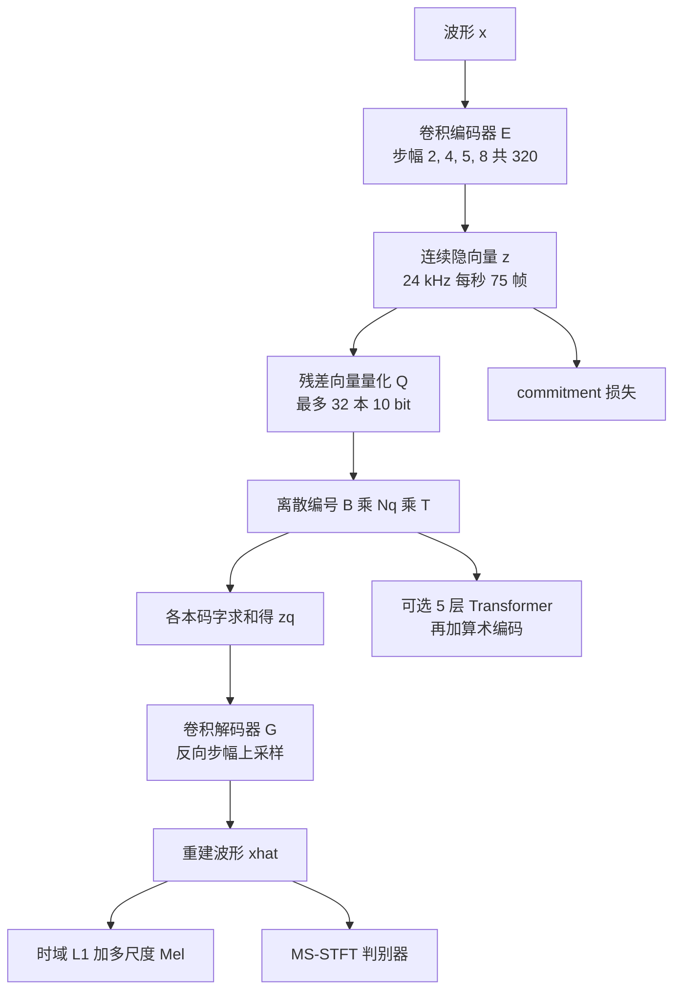

# EnCodec：把极低码率听感从手调滤波器，换成一条能实时切带宽的神经网络

<!-- release-date: 2022-10-24 -->

> 本文依据 Meta AI FAIR 的 **High Fidelity Neural Audio Compression**，系统名 **EnCodec**。原件是 [arXiv:2210.13438](https://arxiv.org/abs/2210.13438) 的 v1，封面水印 `arXiv:2210.13438v1 [eess.AS] 24 Oct 2022`，共 19 页（正文与结论 10 页、参考文献 5 页、附录 A 共 4 页）。并列一作 Alexandre Défossez\* 与 Jade Copet\*，并列通讯 Gabriel Synnaeve† 与 Yossi Adi†；前三位在巴黎，Adi 在特拉维夫，单位都是 Meta AI FAIR（PDF p.1）。页码均指这份 PDF。全文把三件事分开写：**论文明确写了什么**（带页码）、**我们如何解释或验算它**（凡属推算、换算或读图都会写明）、**哪些是外部资料补充**（给链接并标明）。
>
> 这是一篇音频编解码器技术论文，不是基模报告。没有大规模预训练 recipe，也没有推理服务。密度最高的是第 3 节的残差量化、流式填充、多尺度频谱对抗、梯度 balancer，以及第 4 节相对 Opus / EVS / Lyra-v2 的 MUSHRA。
>
> 截至 2026-09-11 核验，arXiv 提交历史只有 v1：2022-10-24 17:52:02 UTC（639 KB）。本地 `papers/Meta/EnCodec.pdf` 即这一版，`pdfinfo` 为 19 页、letter、1,217,926 字节，CreationDate 2022-10-25 09:05:02 CST。后来正式发表于 TMLR 2023（OpenReview 标注 Published: 17 Sept 2023），本文没有逐页比对 TMLR 版与 arXiv v1。

## 读之前：这篇会反复用到的词

这篇论文的门槛不在新网络骨架，而在「听感」为什么没法写进手调公式。先说人话。

- **采样率**：一秒钟切成多少个波形点。论文有两档：24 kHz 单声道，48 kHz 立体声。CD 是 44.1 kHz；48 kHz 是音乐发行常见的「全频带」。
- **码率 / 带宽（bitrate / bandwidth）**：压缩后每秒用多少 bit。1.5 kbps 就是每秒大约 1500 bit。电话级 Opus 常见 12 kbps 以上；论文要打的是 1.5–24 kbps 这一段。
- **编解码器（codec）**：编码器把波形变成码流，解码器再变回波形。有损压缩允许听不太出来的失真，换更小的码流。
- **码本（codebook）**：一本有限的「向量词典」。编码器给出一个连续向量，量化器在词典里找最近的那一条，只记下它的编号。
- **向量量化（Vector Quantization，VQ）**：把连续向量换成码本里最近邻的那一条。一本 10 bit 的码本最多 1024 条。
- **残差向量量化（Residual Vector Quantization，RVQ）**：第一本只抓住最粗的结构，剩下的误差交给第二本，再剩下的交给第三本。多本叠起来，才能在不太长的序列上凑够码率。
- **对抗训练**：生成器要骗过判别器。音频这边，判别器听的是波形或频谱，用来压人工痕迹。
- **Mel 谱 / STFT**：把波形变成「时间–频率」图。Mel 更接近人耳；复数 STFT 同时保留幅度和相位。
- **MUSHRA**：让人听一段参考、一段低锚点和若干被测压缩，按 1–100 打分。论文用它当主指标。
- **实时因子（Real Time Factor，RTF）**：音频时长除以处理时间。大于 1 表示快于实时。

论文自己反复出现的五个名字：

- **EnCodec**：这篇提出的神经音频编解码器。论文标题不带这个词，正文从 Figure 1 开始用它。
- **SEANet 风格卷积编解码**：1D 卷积、按步幅下采样、残差块、中间夹两层 LSTM。骨架来自 SoundStream / SEANet，不是本篇发明。
- **MS-STFT 判别器（Multi-Scale STFT Discriminator）**：在多个窗长的复数频谱上打分，本篇用来替换「波形判别器加频谱判别器」那一套。
- **损失 balancer**：按梯度范数重标定各损失，让权重表示「这块梯度该占几成」，而不是「这个数字该乘几」。
- **码上的小 Transformer**：在离散编号上做语言模型，再配算术编码，把已经量化好的码流再压 25%–40%。

## 一句话先说清

传统有损 codec 靠手调滤波器和心理声学表，在 12–24 kbps 还能听，到 3 kbps、尤其是音乐，听感会塌。神经网络可以把「听起来像」写成对抗损失，但训练时重建、频谱、对抗三股梯度量级差很大，一不小心判别器就把解码器压垮。

EnCodec 的回答不是再发明一种量化器家族。它沿用 SoundStream 的卷积编解码加 RVQ，改的是三件纠缠在一起的工程：

> **一条流式卷积，用残差量化在 1.5–24 kbps 之间切码率；只用一个多尺度频谱对抗管听感；再用梯度 balancer 把各损失的权重从「数字大小」改成「梯度占比」。可选地，再在码上训一个小 Transformer，无损地再压 25%–40%。**

24 kHz 单声道模型要在单核 CPU 上快于实时，算法延迟 13 ms；48 kHz 立体声模型走非流式，算法延迟 1 秒，用来打音乐归档和接近 CD 音质的压缩（PDF p.1–2、p.10）。

这也是全文最值得记住的 insight：

> **极低码率的瓶颈，常常不是「量化器不够新」，而是「听感损失的量级把训练拽歪了」。先让权重表示梯度占比，再谈对抗和码率。**

## 报告地图：19 页各写了什么

| 报告章节 | PDF 页 | 讲了什么 | 密度 |
|---|---|---|---|
| 标题、摘要、署名 | p.1 | 实时高保真、单一多尺度频谱对抗、balancer、Transformer 再压最多 40%；代码仓 | 高 |
| Figure 1 | p.2 | 编码器–RVQ–解码器–判别器总图；可选码上语言模型 | 高 |
| §1 引言 | p.1–2 | 互联网流量、手调 codec 的限度、本篇要同时管多样性和效率 | 高 |
| §2 相关工作 | p.2–3 | 声码器 GAN、Opus / EVS、SoundStream、音频离散化 | 中 |
| §3.1 编解码 | p.3–4 | 步幅 (2, 4, 5, 8)、流式 / 非流式填充、LayerNorm 对 WeightNorm | 高 |
| §3.2 RVQ | p.4 | 最多 32 本（48 kHz 16 本）、每本 10 bit、训练时随机切码率 | 高 |
| §3.3 语言模型与熵编码 | p.4–5 | 5 层 Transformer、并行预测各码本、算术编码与浮点误差 | 高 |
| Figure 2 + §3.4 目标 | p.5–6 | 时域 L1、多尺度 Mel、MS-STFT 对抗、特征匹配、commitment、balancer | 高 |
| §4.1–4.4 | p.6–8 | 数据与混合策略、基线、MUSHRA 协议、300 epoch 配方 | 高 |
| Figure 3 + Table 1 | p.7–8 | 24 kHz 流式听感 vs Opus / EVS / Lyra-v2 | 高 |
| Table 2–3 + §4.5.1 | p.9 | 判别器消融；流式 vs 非流式 | 高 |
| Table 4–5 + §4.5.2–4.6 | p.9–10 | 48 kHz 立体声 vs MP3 / Opus；延迟与 RTF | 高 |
| §5 结论 | p.10 | 三项贡献收口 | 中 |
| 参考文献 | p.11–15 | — | — |
| Table A.1 + §A.1 | p.16 | 数据集时长与划分；自研 SoundStream | 高 |
| §A.2 DiffQ / Gumbel | p.16–17 | 两种备选量化器，主实验没用上 | 中 |
| Table A.2–A.3 | p.18 | 3 kbps vs 自研 SoundStream；通道数 / LSTM / 残差块 | 高 |
| Table A.4 + §A.4 | p.18–19 | balancer 开关的对照；社会影响 | 高 |

三件事先知道：

- **主表的神经基线是 Lyra-v2，不是 SoundStream 论文里的数字。** 作者把 Lyra 2 仓库当作 SoundStream 的官方实现，在上采样到 32 kHz 的音频上跑 3.2 kbps 与 6 kbps；同时又自己复现了一版 SoundStream，数字放在附录 Table A.2（PDF p.7、p.18）。两套口径不要混。
- **Table 1 把 Lyra-v2 写成 3.0 kbps，§4.2 正文写成 3.2 kbps。** 论文没解释差额。读主表时跟 3.0 走，并记住这是一处对不上的地方（PDF p.7–8）。
- **48 kHz 立体声只在音乐上训。** 24 kHz 单声道才覆盖语音、噪声语音、音乐和通用音频（PDF p.6）。

## 旧矛盾：手调 codec 在极低码率上听感塌了，神经网络则把训练稳定性一起塌进去

论文开头给的背景很具体：2021 年流媒体占互联网流量的 82%（Cisco 2021）。有损压缩要同时压码率和失真，而失真最好跟人耳相关（PDF p.1）。

传统 codec 的做法是：用信号处理变换把输入拆开，再按「哪些成分不太影响听感」做取舍。Opus 和 EVS 是这条路上当时的 SOTA，能覆盖多种采样率、多种码率、还能实时（PDF p.2）。附录把它们的舒适区写得更直白：12–24 kbps 还能保持高音质低延迟；到大约 3 kbps，非语音就会明显变差（PDF p.19）。

神经网络把变换本身变成可训练的编码器–解码器。这条线从 1990 年的多层网络语音编码，经过 VQ-VAE、WaveNet 条件声码器，落到 2021 年 Google 的 SoundStream：全卷积编解码、RVQ、重建损失加对抗（PDF p.1、p.3）。EnCodec 明确说自己是这条线的延续，而且「最相关的相关工作」就是 SoundStream（PDF p.3）。

论文把神经压缩的问题收成两件（PDF p.1–2）：

1. **覆盖面**：模型必须能表示很宽的信号，否则一出训练分布就出伪影。对策是大数据加判别器当感知损失。
2. **效率**：计算上要单核 CPU 实时；码率上要把编码器的浮点输出量化成紧码流。对策是 RVQ。

把这两件放在一起，矛盾就清楚了：

> 手调 codec 在极低码率、尤其是音乐上听感不够；神经网络能学听感，但编码器、量化器、感知损失是缠在一起的选择，梯度尺度还互相打架。

本篇的设计空间因此有三个轴：编解码结构、量化方法、感知损失。客观指标会报，但有损音频的最终裁判是人。所以他们为语音和音乐都做了 MUSHRA（PDF p.2）。

## 先看全景：一条卷积、一套 RVQ、一个频谱判别器

这张图根据 Figure 1 与 §3 重画（PDF p.2–6），是**机制示意**，不是实测延迟。Figure 1 里编码器、解码器两侧还画了输入 / 重建的频谱，用来提示这是波形进、波形出，中间被量化掐成离散码。

人话版流水线只有四步：

1. 编码器把波形在时间上压 320 倍：24 kHz 变成每秒 75 帧，48 kHz 变成每秒 150 帧（PDF p.3）。
2. 每一帧用若干本 10 bit 码本做残差量化。用几本，码率就是几档。
3. 解码器按相反的步幅把量化后的向量变回波形。
4. 训练时，时域 L1、多尺度 Mel、对抗、特征匹配、commitment 一起拉；前四项走 balancer，commitment 不走。

可选的第五步：冻结编解码，在离散编号上训一个小 Transformer，用它的概率做算术编码。这一步不改听感，只改码流长度（PDF p.4–5）。

## 8 个数字先算清楚：步幅、帧率、码率

论文写 C = 32、B = 4、步幅 (2, 4, 5, 8)（PDF p.3）。**本文验算**：

$$
2\times 4\times 5\times 8=320
$$

24 kHz 下每帧对应 320 个采样点，也就是 13.33 ms，和流式延迟那句「一收到 320 个点就吐 320 个点」对得上（PDF p.4）。帧率：

$$
\frac{24000}{320}=75\ \text{Hz},\qquad
\frac{48000}{320}=150\ \text{Hz}
$$

每本码本 10 bit。24 kHz 的标称码率因此是

$$
75\times 10\times N_q=750\,N_q\ \text{bit/s}
$$

$N_q$ 取 2、4、8、16、32，正好是 1.5、3、6、12、24 kbps。48 kHz 最多 16 本：

$$
150\times 10\times N_q
$$

$N_q$ 取 2、4、8、16，正好是 3、6、12、24 kbps（PDF p.4、p.6）。

Table 4 的压缩倍数按 16 bit PCM 算也对得上（本文验算，论文没把这句算术写出来）：48 kHz 立体声未压缩是 $48000\times 2\times 16=1.536$ Mbps；6 kbps 对应 $1536/6=256$ 倍，24 kbps 对应 64 倍，MP3 64 kbps 对应 24 倍。表内数字一致（PDF p.10）。

最终隐维度 $D$ 论文没写。编码器最后一层是 kernel 7 的 1D 卷积，输出 $D$ 通道，但 $D$ 本身没有给数（PDF p.3）。这是一处实现缺口。

## 核心设计一：同一套卷积，用填充方式决定能不能流

### 旧问题

实时通话要的是「来一点、出一点」。非流式模型喜欢看未来：卷积两边垫，LayerNorm 还要沿时间维算统计量。这两件事都会引入前瞻，或者在流式时根本算不出来。

### 新设计

骨架两边共用（PDF p.3–4）：

- 开头一层 kernel 7 的 1D 卷积，C = 32 通道；
- B = 4 个卷积块：每个块是一个残差单元（两层 kernel 3 卷积加跳连），再接一层步幅卷积做下采样，kernel 是步幅的两倍；
- 每下采样一次，通道加倍；
- 块之后接两层 LSTM，再接一层 kernel 7、D 通道的 1D 卷积；
- 激活是 ELU；
- 解码器镜像编码器，用转置卷积、步幅倒序，最后吐单声道或立体声。

24 kHz 和 48 kHz 用同一套结构。差别在两套填充和归一化（PDF p.4）：

| | 非流式 | 流式 |
|---|---|---|
| 填充 | 总长 $K-S$，前后均分 | 全部垫在第一个时间步之前 |
| 转置卷积 | 常规 | 先吐前 $s$ 步，剩下 $s$ 步留到下一帧补齐 |
| 切块 | 1 秒一块，重叠 10 ms，块内归一化，解码后再还原；尺度单独传，带宽可忽略 | 不切块 |
| 归一化 | LayerNorm，统计量含时间维，保留相对音量 | WeightNorm，因为沿时间的统计量不适合流式 |

流式模型因此可以在收到前 320 个采样点（13 ms）时就输出 320 个点（PDF p.4）。

### 收益、代价、边界

Table 3 在 6 kbps、语音和音乐各一半上比（PDF p.9）。表里 Streamable 列是对勾 / 叉，抽取文本会变成奇怪符号，下面按页面渲染读：

| 模型 | 流式 | SI-SNR | ViSQOL |
|---|---|---:|---:|
| Opus | 是 | 2.45 | 2.60 |
| EVS | 是 | 1.89 | 2.74 |
| EnCodec | 是 | 6.67 | 4.35 |
| EnCodec | 否 | 7.46 | 4.39 |

非流式略好，流式仍然把传统 codec 远远甩开。论文自己的评价是「有一点下降，但性能仍强，而且能流」（PDF p.9）。

代价写在 Table 5：24 kHz 流式算法延迟 13 ms（正文又写成 13.3 ms）；48 kHz 非流式因为块归一化，算法延迟 1 秒（PDF p.10）。熵编码还会再加大约 13 ms，因为码流不能每帧都 flush，解第 $t$ 帧需要第 $t+1$ 帧的一部分（PDF p.10）。

**可迁移启发**：流式不是换网络，是换因果边界。同一套权重，把 padding 全部挪到过去、把需要全序列统计的归一化换成不看未来的重参数，就能从「归档」切到「通话」。做流式 ASR、实时声码器、边下边播的 tokenizer，都可以先问这一句。

## 核心设计二：RVQ 让一条模型覆盖五档码率

### 人话版残差量化

把一帧编码器输出想成一个向量 $z$。一本 10 bit 码本只能从 1024 个候选里挑一个最近邻。这一下通常抓得住最粗的轮廓，但会留下残差。第二本不去量化 $z$，去量化这份残差。第三本再量化新残差。各本码字加起来，送进解码器（PDF p.4）。

训练沿用 Jukebox / SoundStream 那套：被选中的码字用衰减 0.99 的指数滑动平均更新；长期不用的条目用当前 batch 里的候选替换；反传用直通估计，量化步在反向里当作恒等。再加一项 commitment：量化器输入与输出的 MSE，梯度只对输入（PDF p.4）。

### 新设计：训练时随机丢掉后面几本

24 kHz 最多 32 本，48 kHz 最多 16 本。可变码率训练时，$N_q$ 随机取 4 的倍数，对应 1.5 / 3 / 6 / 12 / 24 kbps（48 kHz 则是 3 / 6 / 12 / 24）（PDF p.4、p.6）。

形状变化很具体：编码器输出 $[B, D, T]$ 的连续张量，量化后变成 $[B, N_q, T]$ 的整数编号；解码前再按编号取码字、沿码本维求和，变回向量（PDF p.4）。

他们还发现：**每个码率用自己的判别器更好**。于是整个 batch 共用一个码率，只更新对应的那一个判别器（PDF p.6）。

### 收益、代价、边界

收益是部署简单：同一份权重，推理时少用几本就是更低码率。主表所有 24 kHz 结果都来自这个流式多码率模型（PDF p.8）。

代价论文写在对抗一侧：判别器容易压过解码器，所以 24 kHz 上判别器只以 2/3 的概率更新，48 kHz 上是 1/2（PDF p.6）。可变码率本身也会让满码率变差一点——后作 DAC 把这件事量化了，见后文「论文之后」；**本篇没有报码本利用率，也没有报「关掉可变码率之后满码率能好多少」。**

备选量化器试过 Gumbel-Softmax 和 DiffQ，初步结果相似或更差，主实验不用（PDF p.8）。附录把两种方法写全了：DiffQ 是可学习每维 bit 数的加性伪量化噪声，Gumbel 是带先验的可微向量量化（PDF p.16–17）。Table A.2 在 3 kbps 上给了一次对照（PDF p.18）：

| 模型 | 码率（kbps） | MUSHRA |
|---|---:|---:|
| Reference | — | 96.1±1.41 |
| Opus | 6.0 | 21.1±2.62 |
| EVS | 6.0 | 62.9±2.18 |
| SoundStream（自研） | 3.0 | 71.8±1.51 |
| EnCodec（DiffQ） | 3.0 | 72.3±1.18 |
| EnCodec（RVQ） | 3.0 | 76.8±1.31 |

RVQ 明显好于 DiffQ，也好于他们复现的 SoundStream。注意这张表的 SoundStream 是作者自己的实现，判别器是 STFTD+MSD，训练超参跟 EnCodec 对齐，因为原论文没公开超参（PDF p.16）。**不能把它读成「对官方 SoundStream 论文数字的复现」。**

**可迁移启发**：可变预算的正确单位往往是「用几层残差」，不是「再训一个模型」。RVQ 把码率变成了可以在前向里开关的整数。任何要把同一套表示同时送给低带宽链路和高带宽归档的系统，都可以先问：粗信息和细信息是不是已经按残差排好了。

## 核心设计三：单一 MS-STFT 对抗，替换「波形加频谱」那一摞判别器

### 旧问题

神经声码器为了打伪影，堆过很多判别器：MelGAN 的多尺度波形判别器（MSD）、HiFi-GAN 的多周期判别器（MPD）、SoundStream 的单网络复数 STFT 判别器。多一个判别器就多一套更新节奏，训练更慢，也更难调。

### 新设计

本篇只用一个多尺度 STFT 判别器，结构见图 2（PDF p.5）。输入是复数 STFT，实部虚部拼接。每个子网络：

1. 一层 2D 卷积，kernel $3\times 8$，32 通道；
2. 三层 2D 卷积，时间维膨胀率 1、2、4，频率维步幅 2；
3. 最后一层 kernel $3\times 3$、步幅 (1, 1) 出 logits。

五个尺度，窗长 [2048, 1024, 512, 256, 128]。48 kHz 把每个窗长加倍，并且每两个 batch 才训一次判别器；立体声则左右声道分开跑（PDF p.5）。激活 LeakyReLU，判别器全程 WeightNorm（PDF p.6）。

生成器对抗是 hinge：

$$
\ell_g(\hat x)=\frac{1}{K}\sum_{k=1}^{K}\max\bigl(0,\,1-D_k(\hat x)\bigr)
$$

判别器对称：

$$
L_d(x,\hat x)=\frac{1}{K}\sum_{k=1}^{K}\Bigl[\max\bigl(0,\,1-D_k(x)\bigr)+\max\bigl(0,\,1+D_k(\hat x)\bigr)\Bigr]
$$

再加相对特征匹配。先说它要算什么：每一层特征图上，生成与真实的 L1 差，除以真实特征的平均幅度，避免某一层特别大就把损失吸走（PDF p.6，式 2）：

$$
\ell_{\mathrm{feat}}(x,\hat x)=\frac{1}{KL}\sum_{k=1}^{K}\sum_{l=1}^{L}
\frac{\lVert D_k^{l}(x)-D_k^{l}(\hat x)\rVert_1}{\operatorname{mean}\lVert D_k^{l}(x)\rVert_1}
$$

重建侧还有两块（PDF p.5，式 1）。时域是 L1：$\ell_t=\lVert x-\hat x\rVert_1$。频域是 64-bin Mel，窗长 $2^i$、hop $2^i/4$，$i\in\{5,\ldots,11\}$，L1 与 L2 等权相加，$\alpha_i=1$。commitment 按残差步累加（PDF p.6，式 3）：

$$
\ell_w=\sum_{c=1}^{C}\lVert z_c-q_c(z_c)\rVert_2^2
$$

### 收益

Table 2 把四套判别器放在一起（PDF p.9）：

| 判别器 | SI-SNR | ViSQOL | MUSHRA |
|---|---:|---:|---:|
| MSD+Mono-STFT | 5.99 | 4.22 | 62.91±2.62 |
| MPD | 7.35 | 4.24 | 60.7±2.8 |
| MS-STFT+MPD | 6.55 | 4.34 | 79.0±1.9 |
| MS-STFT | 6.67 | 4.35 | 77.5±1.8 |

读法有三层：

1. **只看客观，MPD 的 SI-SNR 最高（7.35），听感却最低（60.7）。** 波形误差好，不等于人觉得好。
2. **SoundStream 那套 MSD+Mono-STFT，MUSHRA 只有 62.91**，比单一 MS-STFT 的 77.5 差一截。
3. **MS-STFT 加 MPD 的听感略高（79.0 vs 77.5），客观几乎持平。** 论文因此说：只用多尺度 STFT 判别器就够了，训练更简单、更快；MPD 只带来一点听感增益（PDF p.9）。

最终模型用的是单一 MS-STFT，没有把 MPD 留在主配方里。

### 代价与边界

对抗仍然容易压过生成器，所以才有 2/3 和 1/2 的更新概率（PDF p.6）。Table 2 没有「完全关掉对抗」的一行，因此本篇不能直接回答「对抗对码本利用率有没有贡献」——后作 DAC 补了这一刀，见后文。

**可迁移启发**：判别器不是越多越好。Table 2 的教训是：先换判别器看的域（波形 vs 频谱 vs 相位），再决定要不要叠第二个。音频上，复数多尺度频谱往往已经覆盖了 MSD 想打的结构。另一条更通用：客观指标和听感可以打架，主表必须同时留两套。

## 核心设计四：balancer 让损失权重表示梯度占比

### 旧问题

生成器总损失是五项加权和（PDF p.6，式 4）：

$$
L_G=\lambda_t\ell_t+\lambda_f\ell_f+\lambda_g\ell_g+\lambda_{\mathrm{feat}}\ell_{\mathrm{feat}}+\lambda_w\ell_w
$$

对抗项的梯度范数会随训练剧烈波动。$\lambda$ 写成 3 还是 100，含义取决于「这个损失今天有多大」，调参的人其实在同时调两件事：你有多在乎它，以及它今天的自然尺度。

### 新设计

balancer 只作用于「对模型输出 $\hat x$ 可微」的那些损失，commitment 除外（PDF p.6）。对每个损失 $\ell_i$，先算 $g_i=\partial\ell_i/\partial\hat x$，再维护梯度范数的指数滑动平均，衰减 $\beta=0.999$。给定权重 $\lambda_i$ 和参考范数 $R=1$，重标定后的梯度是（PDF p.6，式 5）：

$$
\tilde g_i=R\cdot\frac{\lambda_i}{\sum_j\lambda_j}\cdot\frac{g_i}{\langle\lVert g_i\rVert_2\rangle_\beta}
$$

反传到网络的是 $\sum_i\tilde g_i$，而不是原来的 $\sum_i\lambda_i g_i$。论文承认这改了优化问题本身，但换来一件事：$\lambda$ 可以脱离各损失的自然尺度来读。如果 $\sum\lambda_i=1$，每个 $\lambda_i$ 就是「这块梯度该占总梯度的几成」（PDF p.6）。

实际配方并不把 $\lambda$ 归一化到 1。24 kHz 用 $\lambda_t=0.1$、$\lambda_f=1$、$\lambda_g=3$、$\lambda_{\mathrm{feat}}=3$；48 kHz 把后两项改成 4（PDF p.8）。**按式 5，真正起作用的是相对比例。** 24 kHz 上四项之和是 7.1，对抗加特征匹配大约占总梯度的 $6/7.1\approx 85\%$（本文换算）。commitment 仍按普通加权加进去。

### 收益：Table A.4 是全文最硬的一张消融

附录在 Jamendo 音乐、DiffQ 量化器上扫了一大组 $\lambda$，每组开 / 关 balancer（PDF p.18–19）。页面上 Balancer 列的对勾表示打开。摘几行足够看清机制：

| $\lambda_t$ | $\lambda_f$ | $\lambda_g$ | $\lambda_{\mathrm{feat}}$ | balancer | SI-SNR | ViSQOL |
|---:|---:|---:|---:|---|---:|---:|
| 1 | 1 | 1 | 1 | 开 | 10.32 | 4.16 |
| 1 | 1 | 1 | 1 | 关 | 6.16 | 3.89 |
| 1 | 2 | 4 | 1 | 开 | 9.93 | 4.17 |
| 1 | 2 | 4 | 1 | 关 | 1.72 | 3.52 |
| 1 | 2 | 100 | 1 | 开 | 8.41 | 4.05 |
| 1 | 2 | 100 | 1 | 关 | -35.83 | 2.82 |
| 2 | 2 | 100 | 4 | 开 | 8.52 | 4.03 |
| 2 | 2 | 100 | 4 | 关 | -34.31 | 2.91 |
| 10 | 1 | 1 | 1 | 开 | 10.53 | 3.65 |
| 10 | 1 | 1 | 1 | 关 | 8.16 | 4.00 |

三件事：

1. **同一组 $\lambda$，打开 balancer 几乎总是更稳。** $\lambda_g=100$ 时，关掉它 SI-SNR 会掉到 -35 附近，等于重建已经崩了。
2. **打开之后，$\lambda$ 从 1 扫到 100，SI-SNR 仍留在 8–10。** 这就是「权重与自然尺度解耦」的实验含义。
3. **这张表用的是 DiffQ，而且只在 Jamendo 上训。** 它证明的是训练稳定性，不是主模型的听感。论文也说：balancer 相对一组已经调好的系数「没有退化」（PDF p.18）。

后作 DAC 明确选择不用 balancer，改成固定权重，理由是消融更好归因。两边不矛盾：EnCodec 要解决的是「对抗梯度把训练掀翻」；DAC 要解决的是「改一项不知道分数为什么变」。**本篇只负责 2022 年这张表。**

**可迁移启发**：多损失训练里，权重的单位应该是「梯度占比」，不是「损失数值」。任何 GAN、重建加感知、主损失加辅助损失的配方，都可以先把各 $g_i$ 的范数记下来。如果某一项今天比昨天大十倍，你写死的 $\lambda$ 昨天和今天已经不是同一个意思。

## 核心设计五：码上的小 Transformer，再压 25%–40%，听感不变

### 旧问题

RVQ 给出的是近似均匀的离散编号。编号之间仍有时间相关：语音的音素、音乐的节拍，都会让下一帧更好猜。这部分冗余，量化器没有拿走。

### 新设计

另外训一个小 Transformer，目标是整条编解码加熵编码在单核 CPU 上仍快于实时（PDF p.4）。规格：5 层、8 头、宽 200、FFN 800、无 dropout。每个时间步 $t$ 的输入，是 $t-1$ 时刻各码本 embedding 之和；$t=0$ 用特殊符号。输出接到 $N_q$ 个线性层，每层 1024 维，一次性给出这一帧所有码本的分布。

论文故意忽略同一时间步各码本之间的互信息。这样不用按码本串行，也不用多阶段预测，推理更快，交叉熵损失有限（PDF p.4）。注意力因果感受野 3.5 秒；正弦位置编码的起点随机偏移，用来模拟处在更长序列中间。训练序列 5 秒（PDF p.5）。

熵编码用 range 算术编码器。他们观察到：同一模型在不同架构、以及「整段 batch 前向」对「真正流式逐步前向」时，概率差会超过 $10^{-8}$，编解码两端一旦对不上就会解错。对策是把概率先四舍五入到 $10^{-6}$，总区间宽度 $2^{24}$，最小区间宽度 2。论文说实际部署还需要在更多环境里测（PDF p.5）。

### 收益

Table 1 和 Table 4 的「Entropy Coded」列就是这一步（PDF p.8、p.10）：

| 标称码率 | 熵编码后（24 kHz） | 再压缩 | 熵编码后（48 kHz 立体声） | 再压缩 |
|---:|---:|---:|---:|---:|
| 1.5 kbps | 0.9 kbps | 40% | — | — |
| 3.0 kbps | 1.9 kbps | 37% | — | — |
| 6.0 kbps | 4.1 kbps | 32% | 4.2 kbps | 30% |
| 12.0 kbps | 8.9 kbps | 26% | 8.9 kbps | 26% |
| 24.0 kbps | — | — | 19.4 kbps | 19% |

百分比是本文按表内数字算的。摘要里「最多 40%」对应 1.5→0.9 这一档；正文写 25%–40%，高码率更低，论文归因于 Transformer 太小，很难同时建模所有码本（PDF p.1、p.8）。立体声正文另写 20%–30%（PDF p.9），和 6 / 12 / 24 三档一致。

听感不因这一步改变：Figure 3 把熵编码后的点画成空心，横坐标左移、纵坐标不变（PDF p.7）。这是「无损再压缩」该有的形状。

### 代价

Table 5 在 6 kbps、MacBook Pro 2019 单线程上测 RTF（PDF p.10）：

| 模型 | 算法延迟 | 编码 RTF | 解码 RTF | 编码+熵编码 | 解码+熵编码 |
|---|---|---:|---:|---:|---:|
| Lyra v2（32 kHz） | — | 27.4 | 67.2 | — | — |
| EnCodec 24 kHz | 13 ms | 9.8 | 10.4 | 1.6 | 1.6 |
| EnCodec 48 kHz | 1 s | 6.8 | 5.1 | 0.68 | 0.66 |

24 kHz 无熵编码大约 10 倍于实时；加上熵编码仍快于实时，但只剩 1.6。48 kHz 加上熵编码已经慢于实时。论文的定位很清楚：熵编码适合延迟不敏感的场景，例如音乐流；48 kHz 还可以用于归档（PDF p.10）。Lyra v2 明显更快，但主表听感更差。

**可迁移启发**：离散码上的语言模型不必生成新内容，也可以当熵编码器。条件是：编解码两端的浮点概率必须对齐到比特。任何「先量化、再算术编码」的系统，都值得先测 batch 前向和逐步前向的概率差，再决定要不要量化到固定小数位。

## 数据与训练：24 kHz 混域，48 kHz 只训音乐

### 数据从哪来

Table A.1（PDF p.16）：

| 数据集 | 域 | 采样率 | 声道 | 时长 |
|---|---|---|---:|---:|
| Common Voice 7.0 | 语音 | 48 kHz | 1 | 9,096 h |
| DNS Challenge 4（干净语音） | 语音 | 48 kHz | 1 | 2,425 h |
| AudioSet | 通用音频 | 48 kHz | 2 | 4,989 h |
| FSD50K | 通用音频 | 44.1 kHz | 1 | 108 h |
| Jamendo | 音乐 | 多种 | 2 | 919 h |

24 kHz 单声道模型用上面这些域；48 kHz 立体声模型只在音乐上训（PDF p.6）。划分：Common Voice 99.5 / 0.25 / 其余；DNS 干净段 98 / 1 / 1；AudioSet 与 FSD50K 用官方 train / eval 再把 eval 对半；Jamendo 按艺术家 96 / 2 / 2，训练、验证、测试无艺术家重叠（PDF p.16）。另有一套专有音乐集只用于测试（PDF p.7）。

训练时的混合策略有四档（PDF p.7）：

- 0.32：只抽 Jamendo；
- 0.32：只抽其它数据集；
- 0.24：从全部数据混两路；
- 0.12：从除音乐外的数据混三路。

文件级归一化，随机增益 -10 到 6 dB，削波的扔掉。20% 概率加 DNS 的房间脉冲，RT60 在 [0.3, 1.3]，单源音乐不加（PDF p.7）。

测试四类：DNS 干净语音；干净语音混 FSD50K；Jamendo；专有音乐。

### 配方

所有模型 300 epoch，每 epoch 2000 次更新，Adam，batch 64 条 1 秒音频，学习率 $3\times 10^{-4}$，$\beta_1=0.5$，$\beta_2=0.9$，8 张 A100（PDF p.8）。balancer 权重见上一节。

**本文换算**：300 × 2000 = 60 万步；每步 64 秒音频，大约 1.07 万小时的采样量（有放回，不是不重复数据量）。论文没报去重后的有效时长，也没报各域实际被抽到的比例。

架构消融在 Table A.3，全部是 24 kHz 流式、6 kbps、同一台 2019 MacBook 单线程（PDF p.18）：

| 变体 | 编码 RTF | 解码 RTF | SI-SNR | ViSQOL |
|---|---:|---:|---:|---:|
| EnCodec base（C=32，1 个残差单元） | 9.8 | 10.4 | 6.67 | 4.35 |
| 通道 16 | 26.0 | 25.7 | 6.40 | 4.32 |
| 通道 64 | 1.3 | 3.1 | 6.70 | 4.38 |
| 无归一化 | 10.1 | 10.4 | 6.45 | 4.29 |
| 去掉 LSTM | 15.0 | 14.6 | 6.40 | 4.35 |
| 3 个残差块，无 LSTM | 6.0 | 7.3 | 6.32 | 4.35 |

通道加到 64，客观几乎不动，RTF 掉到勉强实时。LSTM 换 3 个膨胀残差块，SI-SNR 略差、还更慢。论文因此留下 C=32 加 LSTM：质量与速度的折中（PDF p.18）。无归一化那一行也解释了正文「保留某种归一化，客观指标有一点增益」（PDF p.4）。

## 实验：听感在哪一档真正超过基线

### 评测怎么做

主观：MUSHRA，隐藏参考加低锚点，众包打 1–100。每类测试集约 50 条 5 秒，每条至少 10 个有效标注。过滤规则：参考分低于 90 的次数达到 20% 就丢掉；低锚点高于 80 的次数超过 50% 也丢掉（PDF p.8）。客观：ViSQOL 和 SI-SNR。

基线：Opus、EVS 当传统 DSP；48 kHz 立体声再加 MP3 64 kbps；神经侧用 Lyra 2 仓库里的 SoundStream，3.2 kbps 与 6 kbps，音频先上采样到 32 kHz（PDF p.7）。

### 24 kHz 流式主表

Table 1（PDF p.8）：

| 模型 | 标称码率 | 熵编码后 | 干净语音 | 噪声语音 | 音乐 Set-1 | 音乐 Set-2 |
|---|---:|---:|---:|---:|---:|---:|
| Reference | — | — | 95.5±1.6 | 93.9±1.8 | 93.2±2.5 | 97.1±1.3 |
| Opus | 6.0 | — | 30.1±2.8 | 19.1±5.9 | 20.6±5.8 | 17.9±5.3 |
| Opus | 12.0 | — | 76.5±2.3 | 61.9±2.1 | 77.8±3.2 | 65.4±2.7 |
| EVS | 9.6 | — | 84.4±2.5 | 80.0±2.4 | 89.9±2.3 | 87.7±2.3 |
| Lyra-v2 | 3.0 | — | 53.1±1.9 | 52.0±4.7 | 69.3±3.3 | 42.3±3.5 |
| Lyra-v2 | 6.0 | — | 66.2±2.9 | 59.9±3.3 | 75.7±2.6 | 48.6±2.1 |
| EnCodec | 1.5 | 0.9 | 49.2±2.4 | 41.3±3.6 | 68.2±2.2 | 66.5±2.3 |
| EnCodec | 3.0 | 1.9 | 67.0±1.5 | 62.5±2.3 | 89.6±3.1 | 87.8±2.9 |
| EnCodec | 6.0 | 4.1 | 83.1±2.7 | 69.4±2.3 | 92.9±1.8 | 91.3±2.1 |
| EnCodec | 12.0 | 8.9 | 90.6±2.6 | 80.1±2.5 | 91.8±2.5 | 92.9±1.2 |

论文的概括是：同码率下 EnCodec 全面高于已评基线；**3 kbps 的 EnCodec 平均好于 6 kbps 的 Lyra-v2 和 12 kbps 的 Opus**（PDF p.8）。**本文按四类等权平均验算**：EnCodec 3 kbps 约 76.7，Lyra-v2 6 kbps 约 62.6，Opus 12 kbps 约 70.4。方向对。

分域读更有信息：

- **音乐是 EnCodec 拉开最大的地方。** 3 kbps 已经 87–90，Lyra-v2 在 Music Set-2 上 6 kbps 仍只有 48.6。
- **噪声语音是最难的一类。** EnCodec 6 kbps 才 69.4，12 kbps 才 80.1，和 EVS 9.6 kbps 的 80.0 持平，并没有碾压。
- **干净语音上，12 kbps EnCodec（90.6）超过 EVS 9.6（84.4），6 kbps（83.1）与 EVS 接近。**

Figure 3 把语音和音乐混在一起画，EnCodec 的实心点从 1.5 kbps 的大约 55 升到 12 kbps 的大约 88；空心点是熵编码后的同一听感、更低码率。Opus 6 kbps 在图底部大约 20，12 kbps 大约 70；EVS 9.6 与 EnCodec 6–12 的上沿接近。读图数字是近似值，精确分域以 Table 1 为准（PDF p.7）。

### 48 kHz 立体声：6 kbps 对齐 64 kbps MP3

Table 4（PDF p.10）：

| 模型 | 码率 | 熵编码后 | 压缩倍数 | MUSHRA |
|---|---:|---:|---:|---:|
| Reference | — | — | 1× | 95.1±1.8 |
| MP3 | 64 | — | 24× | 82.7±3.2 |
| Opus | 6 | — | 256× | 17.7±5.9 |
| Opus | 24 | — | 64× | 82.9±3.7 |
| EnCodec | 6 | 4.2 | 256× | 82.9±2.4 |
| EnCodec | 12 | 8.9 | 128× | 88.0±2.7 |
| EnCodec | 24 | 19.4 | 64× | 87.5±2.6 |

论文原话：6 kbps EnCodec 显著好于 6 kbps Opus，与 64 kbps MP3 相当；12 kbps 与 24 kbps 的 EnCodec 彼此接近（PDF p.9）。表内 12 kbps 的 88.0 略高于 24 kbps 的 87.5，置信区间重叠，不能读成「更高码率反而差」。

官方博客后来说「相对 64 kbps MP3 大约 10 倍压缩、质量不降」（外部补充，见文末）。按表内 6 kbps 对 64 kbps，倍数是 $64/6\approx 10.7$，和 82.9 对 82.7 的听感对得上。**这只在 48 kHz 立体声音乐上成立**，不要搬到 24 kHz 语音。

§4.5.2 有一句容易读乱的话：先写「EnCodec at 6 kbps，EnCodec with RVQ at 6 kbps，Opus at 6 kbps，MP3 at 64 kbps」（PDF p.9）。Table 4 里并没有两行不同的 6 kbps EnCodec。本文把它当作行文残留，主证据以表格为准。

## 论文自己划的边界，以及它没写的

结论收成三项（PDF p.10）：单一频谱对抗提升听感并简化训练；balancer 稳住训练、让权重可解释；小 Transformer 再压最多 40%，适合延迟不敏感的场景。

正文和附录还承认了这些限制：

- **48 kHz 加熵编码慢于实时**，48 kHz 本身算法延迟 1 秒（PDF p.10）。
- **高码率上 Transformer 再压缩变弱**，因为模型太小（PDF p.8）。
- **浮点概率在 batch 与流式之间对不齐**，他们只做了 $10^{-6}$ 的四舍五入，部署还要再测（PDF p.5）。
- **社会影响一节只谈包容性接入，不谈深度伪造。** 附录 A.4 的论点是：极低码率让弱网也能通话和听音乐（PDF p.19）。

本文核对后，论文没公开、读的人需要自己记住的缺口：

1. 隐维度 $D$、逐层通道的完整表，以及总参数量。
2. 码本利用率 / 熵。主实验没有任何一张「每本码本用了多少 bit」的图。
3. 关掉可变码率之后，满码率听感能好多少。
4. 48 kHz 模型在语音上的表现——它没在语音上训。
5. 官方 SoundStream 论文数字；主表用的是 Lyra-v2，附录用的是自研复现。
6. Table 1 的 3.0 kbps 与正文 3.2 kbps 的差额。
7. 训练数据去重后的有效时长、各域实际采样比例。
8. balancer 在主模型（RVQ、混域数据）上相对「一组已调好的 $\lambda$」的听感差。Table A.4 是 DiffQ + 只有 Jamendo。

## 外部补充：论文之后，这条离散码变成了音频语言模型的词表

**以下全部不是本篇 PDF 的内容。** 按流程，论文之后发生的事只给官方外部证据，不拿后作数字改写 2022 年的表。

- 官方博客 [Using AI to compress audio files for quick and easy sharing](https://ai.meta.com/blog/ai-powered-audio-compression-technique/) 写于 **2022-10-25**，晚于 arXiv v1。它把 48 kHz 立体声 6 kbps 对 64 kbps MP3 说成「大约 10 倍、质量不降」，并给出代码与论文链接。
- 代码仓 [facebookresearch/encodec](https://github.com/facebookresearch/encodec) 的 `CHANGELOG` 把 v0.1.0 / v0.1.1 标成 2022-10-25。仓库 `created_at` 是 2022-10-20T12:35:53Z，按本模块规则这不是首发日——空仓或未公开仓可以提前建好。GitHub Releases API 当前返回空列表，公开可用的时间锚点仍是 changelog 与博客。
- 2023 年 8 月 2 日，Meta 在 [AudioCraft 博客](https://ai.meta.com/blog/audiocraft-musicgen-audiogen-encodec-generative-ai-audio/) 里把 EnCodec 的离散码当成 MusicGen / AudioGen 的词表，并发布了改进过的解码器。那是后作系统，离散码的用法已经从「压缩」扩成「生成」。本站若写 AudioCraft / MusicGen，走它们自己的原件。
- 后作 [DAC](/reports/Descript/DAC) 在 2023 年指出：即使用 k-means 初始化和随机重启，EnCodec 在 24 kbps 上仍然码本利用率不足。那是 DAC 自己测试集上的图，**不是本篇 Table 1 的否定**，而是后作要解决的问题。两边时间轴不同，说法不一致是正常的。

## 可迁移启发

### 1. 听感损失要先变成可训练的域，再变成可解释的权重

手调 codec 把听感写在心理声学表里，到 3 kbps 就不够用。神经网络把听感写进判别器，但若权重仍按损失数值来调，对抗一项就能掀翻训练。balancer 的贡献不是「又一个超参」，而是把 $\lambda$ 的单位改成梯度占比。多损失系统都可以先问：我现在调的是偏好，还是量纲。

### 2. 可变预算优先做残差，而不是做多套权重

RVQ 让码率变成前向里的整数 $N_q$。训练时随机抽 4 的倍数，推理时按带宽开关。代价是满码率会受低码率拖累，本篇没量化这笔税。需要可变预算时，先保证粗细信息已经按残差排好，再决定要不要每步都随机降档。

### 3. 流式往往是因果边界问题，不是容量问题

同一套卷积，padding 全部挪到过去、LayerNorm 换成 WeightNorm，就从 1 秒块延迟变成 13 ms。Table 3 显示听感只掉一点。做实时系统时，先列出「哪些统计量看了未来」，再决定要不要加更大的模型。

### 4. 判别器先换域，再叠加

Table 2 里，单一 MS-STFT 已经把 MSD+Mono-STFT 的 MUSHRA 从 63 拉到 77；再加 MPD 只多 1.5 分。复数频谱自带相位，多尺度自带不同时间分辨率。堆第二个判别器之前，先确认第一个看的是不是错误的域。

### 5. 离散码上的语言模型可以不生成，只压缩

5 层、宽 200 的 Transformer 把 3 kbps 压到 1.9 kbps，听感不变。条件是概率在两端对齐。任何已经离散化的表示（RVQ 码、token、事件 ID）都可以问：时间相关还剩多少，值不值得用一个小模型把熵拿走。

### 6. 主表要连着分母读

「3 kbps 好于 12 kbps Opus」在四类平均上成立，在噪声语音上没那么夸张。立体声「10 倍于 MP3」只在 48 kHz 音乐、6 kbps 对 64 kbps 这一档成立。看到跨码率、跨域的 SOTA 句，先回到分域表。

## 关键词回看

- **EnCodec**：端到端神经音频编解码器。24 kHz 流式单声道覆盖 1.5–24 kbps；48 kHz 非流式立体声覆盖 3–24 kbps。
- **残差向量量化（RVQ）**：多本 10 bit 码本逐级量化残差。用几本就是哪一档码率。
- **步幅 320 / 帧率 75 Hz**：24 kHz 下每帧 13.3 ms，标称码率 $750 N_q$ bit/s。
- **流式填充**：全部 pad 在过去；转置卷积先吐 $s$ 步。算法延迟 13 ms。
- **MS-STFT 判别器**：五档窗长的复数频谱对抗，用来替换 MSD+STFT 或 MPD 为主的配方。
- **相对特征匹配**：每层 L1 差除以真实特征均值，避免某一层吸走损失。
- **损失 balancer**：按滑动平均梯度范数重标定，$R=1$、$\beta=0.999$。commitment 不参加。
- **码上 Transformer + 算术编码**：并行预测各码本，再压 25%–40%；高码率收益更小。
- **MUSHRA**：1–100 的听感评分，本篇主指标。
- **RTF**：时长 / 处理时间。24 kHz 无熵编码约 10，加熵编码 1.6；48 kHz 加熵编码低于 1。

## 最后的判断

EnCodec 没有发明 RVQ，也没有发明对抗声码器。它盯住的是 2022 年那句已经开始被「我们用了 SoundStream」盖过去的话：

> **极低码率要的不是更多判别器，而是一条能实时、能切带宽、还能把听感训练稳住的完整配方。**

三项工作各自解决一层矛盾，而且互相咬合：

- **RVQ 加随机 $N_q$** 解决「一档码率一个模型」——推理时少用几本就是更低带宽；
- **单一 MS-STFT 对抗** 解决「感知损失太重、太碎」——复数多尺度频谱已经够用，训练更简单；
- **balancer** 解决「$\lambda$ 的含义跟着损失尺度跑」——权重变成梯度占比，对抗项不再轻易把解码器压垮。

可选的 Transformer 熵编码是第四层，不改听感，只在延迟不敏感时把码流再收一截。

被实验直接支持的结论：

- 24 kHz 流式、同码率 MUSHRA 高于 Opus / EVS / Lyra-v2，3 kbps 平均高于 6 kbps Lyra-v2 和 12 kbps Opus，见 Table 1（PDF p.8）。
- 48 kHz 立体声 6 kbps 对齐 64 kbps MP3 与 24 kbps Opus，见 Table 4（PDF p.10）。
- 单一 MS-STFT 的听感远好于 MSD+Mono-STFT 和纯 MPD，见 Table 2（PDF p.9）。
- balancer 在 $\lambda_g$ 扫到 100 时仍能把 SI-SNR 留在正值，关掉则崩到 -35，见 Table A.4（PDF p.19）。
- 熵编码最多再压 40%，RTF 在 24 kHz 上仍大于 1，见 Table 1 与 Table 5（PDF p.8、p.10）。

只是作者观察、或口径需要打折的：

- 「SOTA at 1.5, 3, 6, 12 kbps」的神经对照主要是 Lyra-v2，不是 SoundStream 原论文的表（PDF p.2、p.7）。
- 附录里「EnCodec 优于 SoundStream」指的是自研复现（PDF p.18）。
- 48 kHz「实时」在加熵编码后不成立（PDF p.10）。

如果只记一句话，可以记：

> **把听感写进网络之后，真正要设计的是梯度以什么单位相加。码率可以是残差的层数，权重可以是梯度的占比，流式可以只是把 padding 挪到过去。**

## 资料与阅读边界

**原件与版本**

- 本地原件：`papers/Meta/EnCodec.pdf`，标题 **High Fidelity Neural Audio Compression**，系统名 EnCodec，19 页，封面水印 `arXiv:2210.13438v1 [eess.AS] 24 Oct 2022`。`pdfinfo`：letter，1,217,926 字节，CreationDate 2022-10-25 09:05:02 CST，Producer pdfTeX-1.40.21。
- 版本核对：[arXiv:2210.13438](https://arxiv.org/abs/2210.13438) 提交历史只有 v1，2022-10-24 17:52:02 UTC（639 KB），From Alexandre Defossez。截至 2026-09-11，最新仍是 v1，与本地原件一致，无需替换。
- 正式发表：TMLR 2023，OpenReview [ivCd8z8zR2](https://openreview.net/forum?id=ivCd8z8zR2) 标注 Published: 17 Sept 2023，Featured Certification 与 Reproducibility Certification。本文没有逐页比对 TMLR 版。
- 署名：Alexandre Défossez\*、Jade Copet\*、Gabriel Synnaeve†、Yossi Adi†，单位 Meta AI FAIR。\*、† 为同等贡献。

**首发日证据**

`release-date` 取 **2022-10-24**。对象是公开技术加随后开源的 codec，按「该技术首次官方公开日」：

1. arXiv v1 提交 2022-10-24 17:52:02 UTC，是已核查官方渠道里最早的公开事件。
2. Meta 官方博客为 2022-10-25，晚一天，不回写。
3. GitHub changelog 的 v0.1.0 标成 2022-10-25；仓库 `created_at` 2022-10-20 按规则不采信。Hugging Face `createdAt` 禁用。
4. TMLR 2023-09-17 是后续正式发表，不回写。

**文中图表与公式**

- Figure 1：总架构（PDF p.2）。正文 Mermaid 按它重画，机制示意。
- Figure 2：MS-STFT 判别器（PDF p.5）。
- Figure 3：混域 MUSHRA–码率曲线（PDF p.7）。读图数字只作形状，分域以 Table 1 为准。
- Table 1：24 kHz 流式听感（PDF p.8）。
- Table 2–3：判别器与流式消融（PDF p.9）。
- Table 4–5：立体声听感、延迟与 RTF（PDF p.10）。
- Table A.1–A.4：数据、自研 SoundStream、架构、balancer（PDF p.16–19）。
- 式 1–5：Mel 重建、特征匹配、commitment、总损失、balancer（PDF p.5–6）。

**外部补充，不是 PDF 正文**

- 官方博客与「约 10 倍于 64 kbps MP3」的表述：[ai.meta.com/blog/ai-powered-audio-compression-technique](https://ai.meta.com/blog/ai-powered-audio-compression-technique/)。
- 官方仓与 changelog：[facebookresearch/encodec](https://github.com/facebookresearch/encodec)。
- AudioCraft 把 EnCodec 码当生成词表：[AudioCraft 博客](https://ai.meta.com/blog/audiocraft-musicgen-audiogen-encodec-generative-ai-audio/)。
- 后作对码本利用率的批评，见 [DAC](/reports/Descript/DAC)。那一篇的测试集和主表与本篇不同。

**未公开 / 无法核实的缺口**：隐维度 $D$ 与总参数量、码本熵、可变码率对满码率的税、48 kHz 语音、官方 SoundStream 原表、Table 1 的 3.0 / 3.2 kbps 差额、混域数据的真实采样比例、balancer 在主模型上的听感差。
