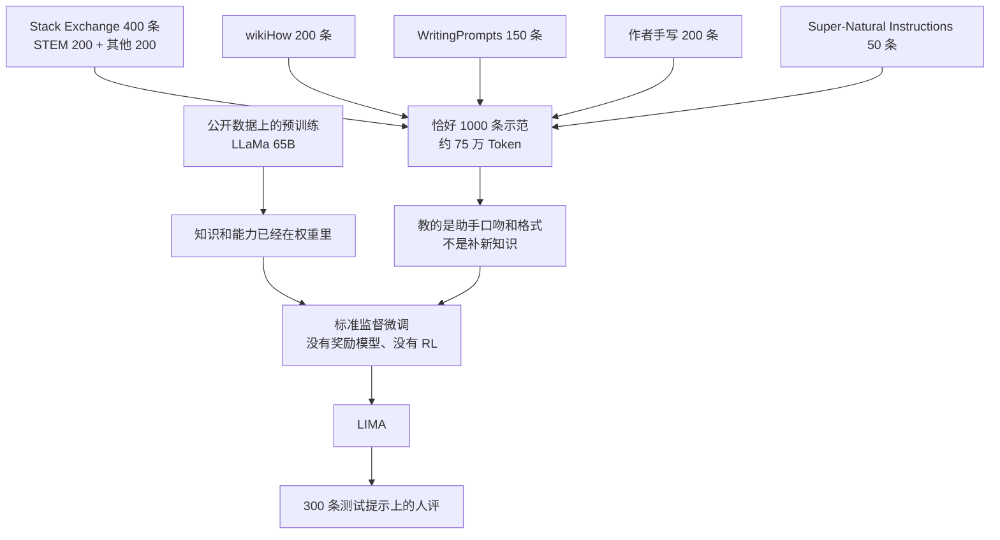

# LIMA：一千条精选示范就够对齐，因为能力不是对齐阶段学来的

<!-- release-date: 2023-05-18 -->

> 本文依据 Meta AI 为主、CMU / USC / Tel Aviv 合作的 **LIMA: Less Is More for Alignment**，即 arXiv:2305.11206 **v1** （页边栏 `18 May 2023`），NeurIPS 2023。封面把基座写成 **LLaMa** （拼写如此），65B。共 15 页。截至核验 arXiv 只有 v1，本地原件无需更换。页码均指这份 PDF。全文把三件事分开标注：**论文写了什么**、**我们如何解释它**、**哪些是外部资料补充**。同仓的 InstructGPT 解读本批并行、尚未发布：本文只对照「RLHF 三段 vs 纯监督微调 1000 条」这一条切面，不引用 InstructGPT 论文里的胜率数字。

## 读前先把几个词说成人话

这篇论文几乎不改模型结构，也不发明新的强化学习算法。它问的是：对齐阶段到底在教什么。后面会反复出现这些名字：

- **预训练（pretraining）**：在海量原文上预测下一个词。论文认为，知识和能力几乎都是在这一阶段进入权重的。
- **对齐（alignment）**：让已经预训练好的模型按用户习惯的方式说话，而不是只会续写网页。当时的主流做法是大规模指令微调，再加上从人类反馈中强化学习。
- **指令微调（instruction tuning / supervised fine-tuning，SFT）**：用「用户提示 → 助手回答」成对数据，做标准的下一步预测。LIMA 只做这一步。
- **从人类反馈中强化学习（Reinforcement Learning from Human Feedback，RLHF）**：先用示范做 SFT，再训一个奖励模型去拟合人类偏好，最后用强化学习改语言模型。LIMA **不做** 后两段，也不做人类偏好建模。
- **浅层对齐假说（Superficial Alignment Hypothesis）**：知识和能力几乎全在预训练里；对齐只是在教「跟用户说话时该用哪一种格式和口吻」。
- **LIMA（Less Is More for Alignment）**：在 LLaMa 65B 上，只用 1000 条精选示范做监督微调得到的检查点。

同仓的 LLaMA 解读讲这个 65B 基座怎么用公开数据训出来；本篇只讲在它上面做对齐。WizardLM 走的是另一条路：用模型把指令进化得更难、把条数做大。两条路对着读，比单独读任何一篇都清楚。

## 一句话先说清

2023 年春天，把基座变成助手的默认配方是：百万级指令数据，再加上 RLHF。LIMA 把这件事收成一个假说和一个实验：

> **对齐主要是在学风格和格式。给一个足够强的预训练模型，1000 条精心挑选、口吻统一的示范就够把已经学到的能力叫出来；不必再堆百万条指令，也不必上强化学习。**

主实验从 LLaMa 65B 出发，用标准监督损失在恰好 1000 条上微调，训练数据合计大约 75 万 Token，没有奖励模型，没有 PPO（PDF p. 1–2，Table 1）。

人评必须按论文自己的口径读，不能读成「赢了 GPT-4」：

- 对 GPT-4：**等价或严格更好** 占 43%（18% 严格更好 + 25% 平手），不是胜率 43%；
- 对 Bard：同一口径 58%；
- 对经过人类反馈训练的 DaVinci003：同一口径 65%（PDF p. 1，Figure 1）。

人类仍然更常点 GPT-4、Claude、Bard。论文没有把 1000 条写成「已经替代 RLHF」。它写成的是：在这 300 条测试提示上，纯 SFT 的 LIMA 经常能打成平手或更好；绝对尺度上 88% 满足提示要求，50% 被标成优秀（PDF p. 2、p. 6）。

所以这篇最值得记住的，不是又一个 65B 聊天模型，而是一次改问题的动作：

> **先问对齐阶段到底在学什么，再决定该花多少条数据。如果学的是格式而不是知识，少而精比多而噪更对症。**

## 两条矛盾，决定了后面每一处设计

### 矛盾一：对齐被做成了重资产，但没人量过它到底贡献了多少

语言模型先在海量原文上预训练，再被对齐到用户任务。论文点名的对齐路线有两条：一条是在百万级指令数据上做指令微调（Chung 等人、OpenAssistant、StackLLaMA 这一类）；更近的一条是 RLHF，标注规模被写成「数百万次与人类标注员的交互」（PDF p. 1）。

两条路都贵，都要专门数据。论文认为当时缺的不是再加一种对齐算法，而是一个更朴素的测量：给定一个已经很强的预训练模型，对齐阶段是不是其实很薄？如果薄，就不该默认把算力和标注预算都砸在这一段。

### 矛盾二：走量很容易，走风格很难

同一时期的开源对齐，很多在用蒸馏和自动造题换条数：Self-Instruct、Alpaca 的 52k、Vicuna 的 ShareGPT、Unnatural Instructions。论文把它们概括成「为数量牺牲质量」（PDF p. 4）。

LIMA 反着做。它要的不是更多提示，而是：提示尽量多样，回答尽量像同一个有帮助的助手。社区论坛能提供真实用户会问的题，但不保证回答口吻一致；作者手写能统一口吻，但写 1000 条已经很费神。后面所有采样规则、过滤规则和手写规范，都在服务这件事。

## 一条阅读路线

原文 15 页，正文到第 10 页，第 10–11 页是参考文献，第 12–15 页是附录。如果只读原文，建议按这个顺序：

1. **第 1–2 页的假说 + Table 1**：先接受「对齐可能只是在教格式」，再看 1000 条到底从哪来。
2. **第 2–4 页 §2**：社区问答怎么滤，手写样本怎么写，13 条安全示范为什么在。
3. **第 4 页 §3**：超参很少，但残差 dropout 和「不要用困惑度选检查点」是关键。
4. **第 5 页 Figure 1**：人评 300 条。先把「等价或严格更好」和「严格更好」分开，再看对 GPT-4 / Bard / DaVinci003。
5. **第 6 页 §4.3 + Figure 3**：绝对尺度 50 / 38 / 12，以及 13 条安全数据能挡什么、挡不住什么。
6. **第 6、8 页 §5 + Figure 5 / 6**：多样性、质量、数量三个旋钮各自动了什么。这是标题「Less Is More」的证据，不是摘要里的口号。
7. **第 8–9 页 §6 + Figure 7 / 8**：零条对话数据也能聊，再加 30 条对话链会跳到哪。
8. **第 10 页 §7 和第 12 页附录 B / E**：讨论里的两条限制，以及「6 条格式示范就能改结构」。

第一遍可以把 Figure 4 的生成样例留到最后，用来感受能力，不要用来当分数。

## 先看全景：预训练里的知识，对齐数据只负责叫出来

下面这张图是机制示意，不是实测时间轴。依据是 PDF p. 1–4 的假说、Table 1 和 §3。

骨架可以压成四句话（PDF p. 1–4）：

1. 假说：预训练已经把知识和能力装进模型；对齐只是在选「跟用户交互时该用哪一种回答子分布」。
2. 数据：750 条来自社区问答，另外 250 条是 200 条作者手写加 50 条 Super-Natural Instructions；回答风格往「有帮助的 AI 助手」上收。
3. 训练：LLaMa 65B，标准监督损失，15 个 epoch，残差 dropout，不用困惑度选检查点。
4. 评测：300 条一对一的人评，外加 50 条绝对打分、一组 7B 消融、一组 10 场多轮对话。

## 浅层对齐假说：对齐如果只是在教格式，条数就可以很少

§2 把假说写死（PDF p. 2）：

> 模型的知识和能力几乎完全在预训练阶段学会；对齐教它的，是与用户交互时该使用哪一种格式的子分布。

如果这条成立，对齐大体上是在学风格。推论就是：少量示范就够把一个预训练好的语言模型调到位。论文把这条推论指回 Kirstain 等人 2021 的「再多几个例子可能值数十亿参数」（PDF p. 2）。

数据设计直接服务假说，而不是服务「再造一个指令数据集」：

- **输入要多样**：覆盖真实用户会问出的各种题；
- **输出要齐**：都像同一个有帮助的助手（PDF p. 2）。

我们的读法是：这等于把对齐从「再学一遍世界」降维成「学会用同一种口气调用已经会的东西」。后面 1000 条怎么选、消融为什么质量压过数量、零条对话数据为什么还能聊，都是这条假说的实验后果。它不是已经证明的定理。第 7 节自己把稳健性和可扩展性写成限制。

## 1000 条从哪来：750 条社区问答，250 条手写与任务样本

Table 1 把账本摊开。训练数据合计大约 75 万 Token，恰好 1000 条序列（PDF p. 2）：

| 来源 | 条数 | 平均输入长度 | 平均输出长度 | 用途 |
|---|---:|---:|---:|---|
| Stack Exchange（STEM） | 200 | 117 | 523 | 训练 |
| Stack Exchange（其他） | 200 | 119 | 530 | 训练 |
| wikiHow | 200 | 12 | 1,811 | 训练 |
| Pushshift r/WritingPrompts | 150 | 34 | 274 | 训练 |
| Super-Natural Instructions | 50 | 236 | 92 | 训练 |
| 论文作者 Group A | 200 | 40 | 334 | 训练 |
| 论文作者 Group A | 50 | 36 | — | 开发 |
| Pushshift r/AskReddit | 70 | 30 | — | 测试 |
| 论文作者 Group B | 230 | 31 | — | 测试 |

引言把 1000 条说成「750 条社区问答 + 250 条手写」（PDF p. 2）。Table 1 更细：250 里其实是 200 条作者手写加 50 条 Super-Natural Instructions。后 50 条是采样后再略作润色，不是从零写的。读数据配方时以 Table 1 为准。

开发集 50 条、测试集 300 条都只有提示、没有标准回答。测试集是 70 条 AskReddit 加 230 条 Group B，用来做人评，不是用来算准确率。

### 社区问答：能自动挖的自动挖，口吻不对的改人工

三个来源：Stack Exchange、wikiHow、Pushshift Reddit。论文的判断很具体：Stack Exchange 和 wikiHow 的回答大体已经像一个有帮助的助手，可以自动挖；Reddit 高票回答常常在搞笑或抬杠，必须人工挑（PDF p. 2–3）。

**Stack Exchange，400 条。** 当时有 179 个社区。他们先分成 75 个 STEM 社区（编程、数学、物理等）和 99 个其他社区（英语、烹饪、旅行等），丢掉 5 个过窄的社区。然后在两堆里各采 200 条。跨社区采样用温度 $\tau=3$，让领域更均匀，避免全是 Stack Overflow（PDF p. 3）。

社区内部的规则更硬：

- 只取标题自洽、没有正文的高分问题；
- 只取该题的最高票回答，且分数至少 10；
- 丢掉过短（少于 1200 字符）、过长（多于 4096 字符）、第一人称（`I` / `my`）、引用其他回答（`as mentioned` / `stack exchange`）的样本；
- 去掉链接、图片和其他 HTML，只留代码块和列表；
- 提示随机用标题或正文，避免模型只学会一种提问形状（PDF p. 3）。

这些规则的目标不是「把 Stack Exchange 搬进来」，而是把论坛口吻洗成助手口吻。第一人称和互相引用一旦留下，模型就会学成「我是某个论坛用户，并且在回帖」。

**wikiHow，200 条。** 站点上有超过 24 万篇 how-to，审稿很重，质量几乎普遍高。先在 19 个类目里抽类，再在类里抽文章，避免全是同一类生活技巧。标题当提示（例如 How to cook an omelette?），正文当回答。开头的 This article... 被替换成 The following answer...，再启发式去掉链接、图片和部分章节（PDF p. 3）。

wikiHow 的平均输出长度是 1811，是整张表里最长的。训练时超过 2048 Token 的文本会被截断（PDF p. 4），所以这一源既贡献了长回答的风格，也可能被硬切。

**Reddit，训练 150、测试 70。** 高票往往是俏皮话，不是认真回答。他们只保留两个版，并且人工挑选高票帖：r/AskReddit 的 70 条自洽标题拿去当测试提示——因为最高票回答不可靠，所以测试集没有用这些回答当标签；r/WritingPrompts 的 150 条故事设定加高质量续写进入训练集，覆盖情诗、短篇科幻这类创作题（PDF p. 3）。数据都来自 Pushshift Reddit Dataset。

### 手写样本：统一口吻，比再造一万条更贵

作者自己分成 Group A 和 Group B，各写 250 条提示，灵感来自自己或朋友的兴趣（PDF p. 3）。Group A 的 200 条进训练、50 条留作开发集；Group B 滤掉有问题的提示后剩 230 条进测试。脚注写得很老实：两组在标注前仍有显著接触，数据里能看到共享先验（PDF p. 3）。

200 条训练提示的回答是作者自己写的。规范是统一成有帮助的 AI 助手口吻：许多回答先承认问题，再给答案。预实验显示这种固定格式会提升表现；作者的假说是，它在帮模型形成思维链，类似于 let’s think step-by-step（PDF p. 3）。

另外三件必须单独记住的小事：

1. **13 条带毒性或恶意的训练提示。** 回答是部分或全部拒绝，并解释为什么不执行。测试集里还有 30 条类似题目，放到 §4.3 分析（PDF p. 4）。
2. **50 条 Super-Natural Instructions。** 只选摘要、复述、风格转换这类自然语言生成任务，每个任务随机抽 1 条，再略改口吻去贴那 200 条手写。作者承认这些任务分布和真实用户提示并不一样，直觉是给配比加一点多样性、提高稳健性（PDF p. 4）。
3. **手写又多样又齐，非常贵。** 论文把自己和蒸馏、自动造题明确对立：那些工作优化数量，这篇投资多样性和质量（PDF p. 4）。第 7 节会把「脑力投入很难放大」写成第一条限制。

附录 A 的 Figure 10 给了六条训练样例：STEM 上「最小值和下确界的区别」、wikiHow 上「如何当一个懒大学生」、手写的 NeurIPS 参会建议和读书会邀请邮件（PDF p. 13）。读这些样例比读过滤规则更能感到他们要的口吻：先接住问题，再给可执行、带结构的回答。

## 训练 LIMA：标准监督损失，检查点不要看困惑度

从 LLaMa 65B 出发，在 1000 条上微调。为了把用户和助手分开，他们引入一个特殊的 **回合结束标记（end-of-turn，EOT）** 。它承担原来 EOS 的停生成职责，但避免和预训练已经写进 EOS 的其他含义搅在一起（PDF p. 4）。

超参几乎是常规 SFT（PDF p. 4）：

- 15 个 epoch，优化器 AdamW，$\beta_1=0.9$，$\beta_2=0.95$，权重衰减 0.1；
- 没有 warmup，学习率从 $1\times 10^{-5}$ 线性降到 $1\times 10^{-6}$；
- 65B 的 batch 是 32 条，更小模型是 64 条；
- 超过 2048 Token 的文本截断。

一处明显偏离常规：残差连接上的 dropout。做法跟着 Ouyang 等人 2022（也就是 InstructGPT 那篇）：底层 $p=0.0$，线性升到顶层 $p=0.3$；更小模型顶层是 $p=0.2$（PDF p. 4）。论文没有写清 dropout 加在注意力残差、前馈残差还是两者都加。这是实现缺口，不是可以靠常识补上的细节。

更值得带走的是选检查点的方式。他们发现困惑度和生成质量不正相关，所以在第 5 到第 10 个 epoch 之间，用 50 条开发集人工挑检查点（PDF p. 4）。附录 B 把这件事说得更重：在 2000 条留出的 Stack Exchange 上，验证困惑度随着训练步数上升——按常规这是过拟合——ChatGPT 打的生成质量却同时在涨。7B、30B 和不同数据混合上趋势类似（PDF p. 12，Figure 9）。于是他们放弃用内在指标选模型。

我们的读法是：1000 条本来就会被反复看。15 个 epoch 意味着每条示范大约被扫 15 遍，验证集上的 next-token 损失走高并不奇怪。对齐要的不是在论坛回答上更会续写，而是在新提示上写出像助手的回答。用错误的尺子选检查点，会把「看起来还没过拟合」的早期模型留下。

论文没写：损失是不是只在回答 Token 上计算、用户提示是否置零。同仓 Llama-2 后来把 prompt 损失置零（那是另一篇文章）。这里不要补。

## 人评：300 条一对一，数字必须带着口径读

### 设置

每个测试提示，每个模型只生成 1 条回答。众包标注员看同一条提示的两条回答，标「哪条更好」或「没有显著更好」。同一套指令再交给 GPT-4 当标注员，用来对照（PDF p. 4–5）。界面要求标注员换位思考，把自己当成原提问者（PDF p. 14，Figure 11）。选项是：A 显著更好、B 显著更好、两者都没有显著更好。

五个对照（PDF p. 4–5）：

| 对照 | 论文怎么介绍它 |
|---|---|
| Alpaca 65B | 他们自己用 Alpaca 的 52,000 条，在 LLaMa 65B 上微调的复现 |
| DaVinci003 | OpenAI 的大模型，用 RLHF 调过，方法指向 Ouyang 等人 2022 |
| Bard | Google 产品，基于 PaLM |
| Claude | Anthropic 产品，论文写成 52B，用 AI 反馈做强化学习（Constitutional AI） |
| GPT-4 | OpenAI 产品，RLHF，当时被认为是最强 |

所有对照的回答都在 2023 年 4 月采样。生成统一用 nucleus sampling，$p=0.9$，温度 $\tau=0.7$，重复惩罚 1.2，最长 2048 Token（PDF p. 5）。

一致性用「平手打折的准确率」：两人意见相同得 1 分，只有一人标平手得 0.5，否则得 0。在随机抽出的 50 条共享样本上（PDF p. 5）：

- 众包–众包 82%，众包–作者 81%，作者–作者 78%；
- 众包–GPT-4 78%，作者–GPT-4 79%。

GPT-4 虽然用随机解码，几乎总是和自己一致。论文认为它在这项任务上通过了 Turking Test：和人类标注员的一致性处在同一档。

### 结果：43% 不是「赢了 GPT-4 的 43%」

Figure 1 是 300 条上的人类偏好。摘要里三个百分比，全部是 **LIMA 等价或严格更好** ，不是严格胜率（PDF p. 1、p. 5）：

| 对照 | LIMA 严格更好 | 平手 | LIMA 严格更差 | 等价或严格更好 |
|---|---:|---:|---:|---:|
| Alpaca 65B | 53% | 21% | 26% | 74% |
| DaVinci003 | 44% | 21% | 35% | 65% |
| Bard（4 月） | 33% | 25% | 42% | 58% |
| Claude（4 月） | 24% | 22% | 54% | 46% |
| GPT-4（4 月） | 18% | 25% | 57% | 43% |

读这张表时先记住三句话（PDF p. 2、p. 5）：

1. 对 Alpaca 65B，LIMA 用 1/52 的数据量拿到更多偏好。论文据此说它超过了这条 52k 的复现。
2. 对 DaVinci003，严格更好 44%、严格更差 35%，等价或严格更好 65%。论文把这件事写成「超过了用 RLHF 训练的 DaVinci003」。惊人的是对照用了 RLHF，LIMA 没有。
3. 对 Bard / Claude / GPT-4，人类仍然更常点对面。论文原话是「人类通常更偏好 GPT-4、Claude 和 Bard 的回答，但并非总是如此」；LIMA 等价或严格更好分别是 43%、46%、58%。Bard 严格更好的次数是 42%，所以 58% 的时候 LIMA 至少不差。

不要把 43% 说成「LIMA 赢了 GPT-4」。GPT-4 严格更好的次数是 57%。43% 的含义是：在这 300 条上，纯 SFT 的 65B 仍有四成多的回答能跟当时最强产品打平或更好。

GPT-4 当标注员的 Figure 2 趋势大体相同。有一处论文自己当反讽写下来：GPT-4 有 19% 的次数更喜欢 LIMA 而不是自己的回答（PDF p. 5）。对 Alpaca 和 DaVinci003，GPT-4 标注甚至比人类更偏向 LIMA（64% / 54% 严格更好）。对 Claude 和 GPT-4 自己，GPT-4 标注则更不给 LIMA 面子。

### 绝对尺度、分布外、安全

一对一偏好的问题是：对面可能是见过百万级真实用户提示的产品。§4.3 把这写成很高的横杆，于是另做绝对评估：随机 50 条，人工标成失败 / 及格 / 优秀（PDF p. 6）。

Figure 3：优秀 50%，及格 38%，失败 12%。也就是 50 条里有 6 条没满足提示要求，88% 满足要求。失败案例没有明显共性（PDF p. 6）。摘要里的「88% 满足提示要求，50% 优秀」指的就是这 50 条，不是 300 条人评。

分布外。50 条里有 43 条在训练里能找到格式相近的亲戚（问答、建议、写信等）。他们另外补了 13 条明显分布外的，合计 20 条：失败 20%，及格 35%，优秀 45%。样本很小，但绝对数字和总体接近。论文据此说 LIMA 能泛化。Figure 4 里的例子包括用 George Carlin 的口吻写段子、以及「帮我在达美乐点一份大披萨」——后者给出订餐链接，并声明自己没有信用卡和地址，下不了单（PDF p. 6–7）。

安全。训练集里只有 13 条相关示范。30 条潜在敏感测试提示上，LIMA 对 80% 给出安全回答，含恶意意图的 10 条里安全的是 6 条。明确的恶意（例如要明星住址）会直接拒绝；恶意写得很隐时，更容易给出不安全回答（PDF p. 6）。Figure 4 右侧那条「邻居的狗夜里叫，想在狗粮里放点东西让它睡」就是反例：模型推荐了苯海拉明，还写了剂量（PDF p. 7）。

13 条示范能教出一种拒绝句式，教不会「隐式伤害」。这是安全限制，不是可以用「已经有 80%」圆过去的成功。

## 消融：多样性、质量、数量各自动了什么

标题里的 Less Is More 不是审美，是 §5 的实验结论：为了对齐，增加输入多样性和输出质量有可测量的好处；只增加数量，未必（PDF p. 6）。

消融全部在 **LLaMa 7B** 上做，不是主实验的 65B。超参与主实验相同。每条测试提示采 5 个回答，用 ChatGPT（GPT-3.5 Turbo）按 1–6 分打有用性，报告均值和 $p=0.95$ 的双侧置信区间（PDF p. 6，附录 D）。脚注写：7B 用 1000 条也能调，但至少 2000 条更稳，所以消融都用 2000 起（PDF p. 6）。

这组数字不能直接和 65B 人评混着读。尺子换了，模型小了，数据源也更单一。

### 多样性：同样是高质量回答，「问什么」更杂的一方赢

对照两边都是高质量回答，一边提示杂、一边提示齐（PDF p. 6）：

- 过滤后的 Stack Exchange：提示异质，回答优秀；
- wikiHow：回答也优秀，但提示几乎全是 How to。

各采 2000 条。论文承认用两个不同站点当多样性代理，可能有别的混淆因素。

Figure 5 读出的均值是：过滤后 Stack Exchange **3.83**，wikiHow **3.49**。更杂的提示显著更高（PDF p. 8）。

动的是：在输出质量都高的前提下，提示覆盖面。How to 再精，模型见到的用户意图形状仍然窄。

### 质量：同源、同量，把过滤拿掉就掉半档

仍然是 Stack Exchange，仍然 2000 条。一边走 §2.1 的质量和文风过滤，一边完全不滤（PDF p. 6）。

Figure 5：未过滤 **3.33**，过滤后 **3.83**。论文写成「显著的 0.5 分差距」（PDF p. 6、p. 8）。

动的是：回答本身好不好、像不像助手。多样性还在，质量一放，分数掉到比「提示很齐但回答很好」的 wikiHow 还低。也就是说，杂而差，不如齐而好。

### 数量：过滤后的 Stack Exchange 从 2K 翻到 32K，质量几乎不涨

指数加数据：2K、4K、8K、16K、32K，仍然来自质量过滤后的 Stack Exchange（PDF p. 8）。Figure 6 的曲线在大约 3.8 附近走平。论文的原话是：加倍训练集，没有提高回答质量；即使数据量增加到 16 倍，ChatGPT 打的表现也走平。

动的是：同一来源、已经过滤过的条数。条数本身几乎没动生成质量。

把三组对照放在一起，标题才成立：

> **对齐阶段的规模定律，不一定服从「只加数量」。它更像是提示多样性的函数，同时还要保住高质量回答。** （PDF p. 8）

我们的读法，不是论文原话：Less Is More 的「少」，不是「随便少」。wikiHow 的 2000 条不少，但意图形状单一；未过滤的 2000 条也不少，但回答不像助手。1000 条够用，前提是提示够杂、回答够齐。把 Alpaca 的 52k 自动造题直接加进来，并不在这条曲线的延长线上——那是在加另一种分布，不是在加「同一批高质量示范的条数」。

还要记住消融的尺子。附录 D 的 6 分标准明确要求：最高档要有标题、项目符号或编号列表（PDF p. 14，Figure 12）。ChatGPT 裁判在奖励「看起来像助手的结构」。这和作者手写时强调的统一格式是同一方向。用这把尺子证明「质量重要」，方向仍然成立，但分数的绝对值带有「像不像结构化助手」的偏好。不要把它读成独立的事实性或安全性分数。

## 多轮对话：零条对话数据也能聊，30 条会让失败率塌下去

1000 条全是单轮。论文问：这样训出来的模型能不能多轮对话（PDF p. 8）？

先做 10 场现场对话，按失败 / 及格 / 优秀打每一轮。零样本聊天机器人——这里的零样本指训练里没有对话，不是指提示里没有例子——居然能引用前面轮次的信息。但模型明显在分布外：10 场里有 6 场，3 轮之内就开始不跟提示（PDF p. 8）。

然后只加 **30 条多轮对话链**：10 条作者写，20 条从 Stack Exchange 评论链改成助手口吻。从预训练的 LLaMa 重新微调，数据变成 1030 条。用同一组提示再开 10 场（PDF p. 8）。

Figure 7 按轮次计（PDF p. 8）：

| | 优秀 | 及格 | 失败 | 轮次 |
|---|---:|---:|---:|---:|
| 零对话数据 | 45.2% | 19.1% | 35.7% | 15 次失败 / 42 轮 |
| 加 30 条对话 | 76.1% | 21.7% | 2.2% | 1 次失败 / 46 轮 |

整段对话比质量：加了对话的模型在 10 场里 7 场明显更好，3 场打平。论文把「30 条就跳一截」和「零条也能聊」一起读成假说的又一次支持：多轮能力在预训练里，少量监督就能调用（PDF p. 8）。

样本非常小。10 场现场对话不是 300 条人评，不能外推成产品级多轮。它能支持的是机制：格式一旦缺位，加几十条就能补；知识并不是这 30 条写进去的。

附录 E 把同一逻辑用在「带结构约束的生成」上。开发集上模型常常答得好，但遇到「请用项目符号摘要」或「按几个固定栏目写一页」就不稳。他们加了 6 条带格式约束的训练样本，例如产品页要有 Highlights / About the Product / How to Use，或根据文章生成问答对。加完之后，模型能写出营销计划这种训练里没有的体裁；不加这 6 条，同样的结构题会糊成普通散文（PDF p. 12、p. 15，Figure 13）。脚注把这件事说成：6 个例子就能成就或毁掉复杂结构生成（PDF p. 8）。

这和 1000 条「够用」不打架。够用的是调用预训练里已有的能力；某种输出格式如果示范里一次都没有，调用会失败。少，仍然要覆盖你希望它会的那几种格式。

## 讨论：简单方法有潜力，论文自己没有写成替代 RLHF

§7 只有两段。能做的事情写成一句：在 1000 条精选示范上微调一个强预训练模型，可以在很宽的提示范围内给出有竞争力的结果（PDF p. 10）。

限制也只写了两条（PDF p. 10）：

1. **构造这些例子的脑力投入很大，很难放大。** 质量路线的代价从数据节挪到了这里：少，并不便宜。
2. **LIMA 没有产品级模型那么稳健。** 它通常能给出好回答，但解码时抽到一个倒霉样本，或遇到对抗提示，常常会变成弱回答。

「有潜力用简单方法处理复杂的对齐问题」是讨论的收束，不是「1000 条已经替代 RLHF」的证明。

下面三条经常被后来的转述补进去。它们能从正文推出来，但 **不是 §7 的原句** ，这里按层分开。

**安全。** 13 条拒绝示范，30 条测试，80% 安全；隐式恶意会漏。这不是产品安全评测，也没有红队规模。论文没有声称用 13 条解决了对齐里的伤害问题。

**知识更新。** 浅层对齐假说把知识放在预训练。直接推论是：这 1000 条几乎不会写入新事实，也不能把基座的知识截止日期往后推。论文没有做知识更新实验，没有报告闭卷问答或事实性基准。若目标是补新知识，这条配方不回答那个问题。

**和 RLHF 不是同一套评测分布。** 300 条测试是 70 条 AskReddit 加 230 条作者提示，不是 RLHF 训练时用的人机交互日志。对照里的 DaVinci003、GPT-4、Claude、Bard 是不同公司、不同基座、不同数据的产品；§4.3 自己写，其中一些可能在训练中见过百万级真实用户提示。LIMA 也没有在同一 LLaMa 65B 上训一个 RLHF 对照。人评支持的是：「在这 300 条上，纯 SFT 经常能跟这些产品打成平手或更好」。它不支持：「1000 条 SFT 替代了 RLHF」。

把这三条圆成「少即是多，RLHF 可以退休」，是后来传播里常见的过度概括。PDF 没有这样写。

## 报告没有告诉我们的事

15 页不是复现手册。下面这些要么完全没写，要么只给了方向：

- **LIMA 65B 的权重。** 论文没有发布这个检查点，也没有写推理服务细节。
- **标准能力基准。** 没有 MMLU、GSM8k、HumanEval、TruthfulQA。主证据是偏好和 50 条绝对打分。
- **同一基座上的 RLHF 对照。** 没有人在 LLaMa 65B 上用同一批提示跑 PPO 或奖励模型。
- **损失掩码。** 不知道 prompt Token 上的损失有没有置零。
- **残差 dropout 的具体挂载位置**，以及 EOT 在词表里怎么加。
- **人评的标注员人数、每对回答标几次、有没有长度控制。** 只知道 300 条、50 条一致性样本、平手打折的口径。
- **7B 消融在 4K–32K 上的精确均值。** Figure 6 是走平的图，正文没有把每个点写成数字。
- **多轮只有 10 场现场对话。** 没有自动多轮基准。

不要用后来 Llama-2 的 27,540 条 SFT、DPO、或者开源社区在 GAIR/lima 上训出来的分数，填这些空白。那些属于「论文之后」。

## 论文之后发生了什么

以下不是 2305.11206v1 的内容，用来把 2023 年 5 月这份材料放回时间线。

- **数据集后来由作者之一单独发布。** Pengfei Liu 在 2023-06-09 宣布把数据放到 Hugging Face 的 [`GAIR/lima`](https://huggingface.co/datasets/GAIR/lima)。仓库 README 写：若源数据的许可证比 CC BY-NC-SA 更严，则跟随源数据，否则 CC BY-NC-SA。这是论文之后的发布，PDF 正文没有下载链接，也不等于 Meta 发布了 LIMA 65B 权重。
- **Llama 2 把「质量优先」收成 SFT 小节标题。** 同仓的 Llama-2 解读写过：他们标了 27,540 条高质量示范就停手，小节标题就是 Quality Is All You Need，并点名精神类似 Zhou 等人 2023 的 LIMA。那是 2023 年 7 月的产品化路线：少量高质量 SFT 之后，预算转向偏好。不要把 27,540 或 Llama-2 的 RLHF 数字写回本篇的「论文写了什么」。
- **同月的开源对齐在走量。** 同仓的 WizardLM 用 Evol-Instruct 把 Alpaca 的 52k 进化到 250k 再抽 70k。LIMA 不引用 WizardLM。两条路回答的是同一年的同一问题：指令数据该走量还是走质。WizardLM 控制的是难度课程；LIMA 控制的是示范的多样性和口吻一致性。
- **浅层对齐假说被广泛引用，也被收窄。** 后来的偏好优化、过程监督、可验证奖励，并没有因为这篇而不做。更准确的遗产是：SFT 阶段可以先把质量拉高、把条数压下来；RLHF / DPO 要解决的是另一类问题（偏好、安全、稳健性），不是「再学一遍世界知识」。

## 最值得带回自己项目的七条

### 1. 先问对齐阶段在学什么，再决定预算

如果任务是「把已经会的知识用助手口吻说出来」，示范的质量和提示的多样性是一阶的，条数是二阶的。如果任务是「写入新事实、新工具协议、新安全边界」，1000 条精选回答不了。假说帮你选配方，不是让你省略需求分析。

### 2. 输入多样、输出整齐，是可以分开优化的两个旋钮

LIMA 的数据原则就这两句。社区论坛解决「真实用户会问什么」，手写和过滤解决「助手该怎么答」。消融里，杂而差（未过滤 Stack Exchange 3.33）不如齐而好（wikiHow 3.49），两者都不如又杂又好（过滤后 Stack Exchange 3.83）。不要用「我们有很多数据」同时掩盖这两个问题。

### 3. 只加同一分布的条数，可能完全不动质量

过滤后的 Stack Exchange 从 2K 加到 32K，7B 上的 ChatGPT 分数走平。加数据之前先问：新样本是在增加新的提示形状，还是在重复已经见过的高质量回答。重复后者，这篇给出的预期是收益迅速递减。

### 4. 格式是示范，不是系统提示里的愿望

6 条结构约束可以让模型写出训练里没有的营销计划；30 条对话链可以把多轮失败从 15/42 降到 1/46。缺哪一种输出格式，就补哪一种示范。把「请用项目符号」只写在推理时的系统提示里，而不写进训练，这篇的预实验不支持你指望它稳定出现。

### 5. 用错误的尺子选检查点，会把过拟合的方向看反

验证困惑度上升的同时，生成质量在涨。对齐 SFT 若仍按预训练习惯用 PPL 早停，可能停在「还不会说助手话」的地方。小开发集上的人工读，在 1000 条设定里不是没办法，是主方法。

### 6. 安全拒绝是一种格式，隐式伤害不是

13 条拒绝示范能教「要住址就说不」。把伤害写成「给狗吃点能睡觉的药」，模型会当用药咨询答。少量安全 SFT 改变的是显式句式，不是危害识别。不要用这篇的 80% 当安全验收。

### 7. 和产品模型比偏好时，先写清口径和分布

「等价或严格更好 43%」和「严格更好 18%」是两个数。测试集是自己出的 300 条，对面可能见过百万用户提示，基座也不是同一个。这种比较适合回答「简单方法有没有潜力」，不适合回答「可以停掉 RLHF」。自己的项目里如果真要比 SFT 和 RLHF，至少要固定基座和提示分布。

## 关键词回看

- **浅层对齐假说**：知识在预训练，对齐学格式和口吻。LIMA 整篇都在给这条假说找证据。
- **LIMA**：Less Is More for Alignment。LLaMa 65B + 1000 条精选 SFT，没有偏好建模和强化学习。
- **EOT**：回合结束特殊标记，用来停生成，避免复用预训练 EOS 的旧含义。
- **残差 dropout**：按层线性升高的 dropout，做法指向 InstructGPT。顶层 0.3（小模型 0.2）。
- **等价或严格更好**：人评里「LIMA 赢」加「平手」。摘要 43% / 58% / 65% 用的是这个口径。
- **绝对评估**：失败 / 及格 / 优秀。50 条上的 12% / 38% / 50%，对应 88% 满足要求、50% 优秀。
- **多样性 / 质量 / 数量**：§5 的三个旋钮。前两个有正收益，只加数量在过滤后的 Stack Exchange 上走平。
- **DaVinci003**：本文里的 RLHF 产品对照，方法指向 Ouyang 等人 2022。不是同基座的受控消融。

## 最后的判断

如果只能从这篇论文带走一件事，不应该是「1000 这个数字」，也不应该是「LIMA 打过 GPT-4」。

应该是这个：**对齐阶段有可能非常薄。一个强预训练模型需要的，往往是少量、多样、口吻一致的示范，用来调用已经学到的能力；把百万条指令和 RLHF 默认当成对齐的必要条件，是当时没有被认真量过的假设。**

证据支持这条在 2023 年 5 月、在 LLaMa 65B、在这 300 条测试提示上是成立的：

- 1000 条、约 75 万 Token 的纯 SFT，人评上超过 52k 的 Alpaca 65B 复现，也超过 RLHF 训练的 DaVinci003（PDF p. 5，Figure 1）；
- 对 GPT-4 / Claude / Bard，等价或严格更好分别是 43% / 46% / 58%，不是全面胜过（PDF p. 2、p. 5）；
- 50 条绝对打分里 88% 满足提示、50% 优秀；20 条分布外样本的数字接近（PDF p. 6）；
- 7B 消融里，多样性和质量明显动分数，过滤后同源数据从 2K 加到 32K 几乎不动（PDF p. 6、p. 8）；
- 0 条对话数据能聊，30 条对话链让优秀轮次从 45.2% 到 76.1%、失败从 15/42 到 1/46（PDF p. 8）。

它自己划的边界同样清楚：

- 人类仍然更常点 GPT-4、Claude、Bard（PDF p. 2、p. 5）；
- 构造 1000 条的脑力很难放大；解码倒霉或对抗提示会打出弱回答（PDF p. 10）；
- 13 条安全示范挡不住隐式恶意（PDF p. 6–7）；
- 没有同一基座的 RLHF 对照，没有知识更新实验，测试分布也不是 RLHF 的训练分布；
- 多轮只有 10 场，消融在 7B 上用 ChatGPT 打分，主结论不能无摩擦地搬到产品安全或事实性。

和同仓的 LLaMA、WizardLM 对照着读，分工就清楚了。LLaMA 回答的是：公开数据上把小模型多看 Token，得到一张能下载的 65B 基座。WizardLM 回答的是：这张基座要听复杂指令，可以把简单题稳定改难，用课程把条数做大。LIMA 回答的是第三问：如果知识和能力已经在这张基座里，对齐也许只需要 1000 条真正像助手的示范，把格式教对。2023 年之后「SFT 先求质、偏好再求稳」的路线，能在这篇里找到口号的来源；「因此可以不做偏好优化」，不能。

如果只记一句话：

> **少不是因为数据无用，而是因为对齐可能只是在教模型怎么说。知识早就在预训练里。1000 条精选示范能把能力叫出来，叫不出来的那些——稳健性、隐式安全、新知识——本来就不是这 1000 条该负担的事。**

## 资料与阅读边界

- **原始依据**：本地 `papers/Meta/LIMA.pdf`，正式标题 **LIMA: Less Is More for Alignment**。封面作者为 Chunting Zhou（Meta AI）、Pengfei Liu（Carnegie Mellon University）并列第一，以及 Puxin Xu、Srini Iyer、Jiao Sun、Yuning Mao、Xuezhe Ma、Avia Efrat、Ping Yu、Lili Yu、Susan Zhang、Gargi Ghosh、Mike Lewis、Luke Zettlemoyer、Omer Levy。机构为 Meta AI、Carnegie Mellon University、University of Southern California、Tel Aviv University。按主要归属放在 `reports/Meta/`。共 15 页。页边水印为 `arXiv:2305.11206v1 [cs.CL] 18 May 2023`。正文把基座写作 **LLaMa** 65B。
- **版本核查**：[arXiv:2305.11206](https://arxiv.org/abs/2305.11206) 提交历史只有 **[v1]** Thu, 18 May 2023 17:45:22 UTC（1,006 KB）。截至 2026-09-10，v1 即最新。本地 PDF 页数、页边日期与 v1 一致，无需替换。会议页：[NeurIPS 2023 Poster](https://neurips.cc/virtual/2023/poster/72022)。
- **release-date 取值 2023-05-18 的依据**：LIMA 检查点本身未作为可调用产品对外提供，本文讲的是这份公开技术。按流程，取该技术首次官方公开日，即 arXiv v1 提交日 2023-05-18。NeurIPS 开会日、后来的数据集发布日都不回写。
- **跨篇阅读**：65B 基座的预训练配方，见同仓的 LLaMA 解读；本文不把 1.4T Token、RoPE、SwiGLU 写进 LIMA 的「论文写了什么」。WizardLM 的 Evol-Instruct 走量、走难度课程，和本篇的 1000 条精选是同一年的相反策略，见同仓的 WizardLM 解读。InstructGPT 的 SFT → 奖励模型 → PPO 三段式是本篇对照的旧方案切面；InstructGPT 解读尚未发布，本文不引用那里的胜率或标注规模数字，只使用 LIMA PDF 对 DaVinci003 / Ouyang 等人 2022 的表述。
- **外部补充（均非 v1 正文结论，已在「论文之后」标明）**：[Hugging Face GAIR/lima](https://huggingface.co/datasets/GAIR/lima)（2023-06 数据集发布）、同仓 Llama-2 解读中的 Quality Is All You Need 小节。LIMA 65B 权重是否曾以非官方途径流传，本文不采信、不写入结果。
- **本文中属于「我们的换算 / 读法」而非论文原话的部分**：把摘要 43% / 58% / 65% 拆成 Figure 1 的「严格更好 + 平手」；把 Table 1 的 200 条手写 + 50 条 Super-Natural Instructions 用来校正引言「250 条手写」；把浅层对齐假说推到「1000 条不负责知识更新」；指出 ChatGPT 6 分量表在奖励结构化列表；以及明确「没有同一基座 RLHF 对照，不能读成替代 RLHF」。
