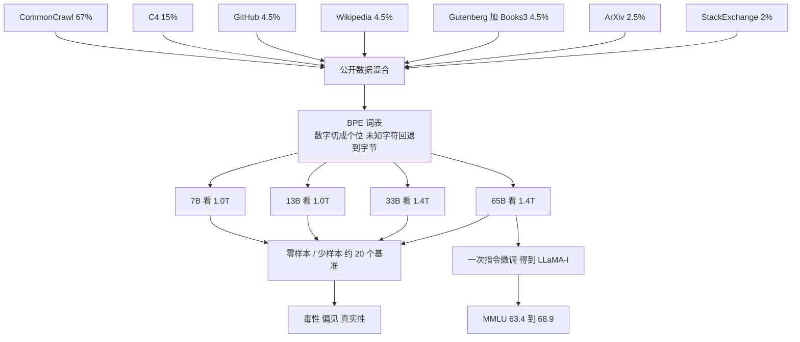
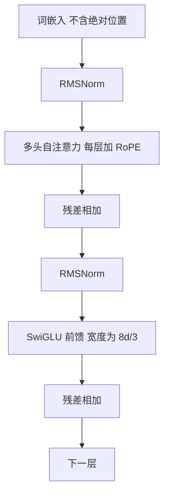

# LLaMA：公开数据训得更久，13B 已经打过 175B 的 GPT-3

<!-- release-date: 2023-02-24 -->

> 本文依据 Meta AI 的 **LLaMA: Open and Efficient Foundation Language Models**，即 arXiv:2302.13971v1（2023-02-27），共 27 页。截至核验 arXiv 只有 v1，本地原件无需更换。页码均指这份 PDF。全文把三件事分开标注：**报告明确写了什么**、**我们如何解释或验算它**、**哪些是外部资料补充**。

## 读前先把几个词说成人话

这篇论文几乎不发明新词。它真正难的地方，是把两套已经存在的规模叙事拧到一起。先把后文会反复出现的名字说清楚：

- **Token（词元）**：模型读写文本时的最小单位。一个英文单词、一个数字、一个汉字，都可能被切成一块或几块。
- **自回归语言模型**：只做一件事——根据已经写下的内容，预测下一个 Token。GPT-3、PaLM、LLaMA 都是这一类。
- **稠密（dense）Transformer**：每处理一个 Token，全部参数都要参与计算。这篇论文的四个规格全是稠密模型，没有混合专家。
- **训练算力预算**：把模型训到某个损失，一共要做多少次浮点运算。Hoffmann 等人的 Chinchilla 缩放定律，优化的就是这一笔。
- **推理预算**：训完之后，每回答一次要花多少计算。模型一旦要被反复调用，这一笔会超过训练。
- **零样本 / 少样本（zero-shot / few-shot）**：不更新权重，只在输入里写任务说明，或者再塞 1 到 64 个例子，让模型直接答题。评测协议沿用 GPT-3。
- **指令微调（instruction finetuning）**：再用「按人话完成任务」的数据继续训练。论文里只做了一次，得到的检查点叫 **LLaMA-I**。

论文自己点名的三个架构零件是：

- **Pre-normalization（预归一化）**：每一层先把输入标准化，再做注意力或前馈，而不是做完再标准化。
- **RMSNorm**：一种比 LayerNorm 更省的标准化，不算均值，只除均方根。
- **SwiGLU**：把门控线性单元和 Swish 激活乘在一起的前馈非线性。
- **RoPE（Rotary Positional Embeddings，旋转位置编码）**：不把绝对位置加进嵌入，而是在每一层把 Query 和 Key 按位置旋转。

## 一句话先说清

LLaMA 不是「Meta 也做了一个大模型」。

它要证明的事情更具体：

> **只使用公开可获取的数据，把小模型多训几个数量级的 Token，得到的 13B 可以在多数基准上超过 175B 的 GPT-3；65B 可以和当时最好的闭源模型 Chinchilla-70B、PaLM-540B 坐在同一张桌子上。然后把权重交给研究社区。**

同仓的 GPT-3 解读讲的是另一条路：用 175B 参数买一个「不用再微调的任务接口」，接口开在 API 后面。LLaMA 把同一类零样本 / 少样本能力，放到了一张 GPU 就能跑的权重文件里。

所以这篇最值得记住的，不是某一个新注意力公式，而是一次改账本的动作：

> **规模定律如果只优化训练账单，会把模型做成又大又贵的推理负担。真正要服务的时候，更小、看过更多 Token 的模型更划算。而要把这样的模型公开出去，数据本身必须先是公开的。**

## 两条矛盾，决定了后面每一处设计

### 矛盾一：训练算力最优，不等于推理算力最优

2020 年前后的默认叙事是 Kaplan 等人的缩放定律：参数越大，上下文学习越强。于是模型被一路做大：GPT-3 175B、Gopher 280B、PaLM 540B（PDF p. 1）。

Hoffmann 等人 2022 年的 Chinchilla 工作把这笔账翻过来：给定**训练**算力，最优解不是最大的那个模型，而是更小的模型看更多数据。他们的例子是：10B 参数配 200B Token（PDF p. 1）。

论文认为这个目标仍然漏了一项。模型一旦要对外服务，账单从训练挪到了推理。给定一个目标质量，人们真正想要的不是「训得最快的模型」，而是「每次调用最便宜的模型」。把一个大模型训到某个分数，训练也许更省；但把一个小模型多训很久，推理会更省（PDF p. 1）。

论文给了一个自己测到的反例：Chinchilla 建议 10B 看 200B Token，而他们的 7B 在看过 **1T Token** 之后，性能仍在涨（PDF p. 1）。

这不是对 Chinchilla 的否定。Chinchilla 回答的是「这笔训练预算怎么花」；LLaMA 回答的是「训完之后谁来买单」。两个问题的最优模型尺寸不一样。

### 矛盾二：闭源数据让权重也开不了

第二条和第一条缠在一起。GPT-3、PaLM、Chinchilla 都用了不公开或未记录的数据，论文点名的例子是「Books – 2TB」和「Social media conversations」（PDF p. 1）。数据闭源，权重即使想开也开不了。

当时已经有公开权重的尝试：OPT、GPT-NeoX、BLOOM、GLM。论文的判断很直白：这些模型**没有一个**能和 PaLM-62B 或 Chinchilla 竞争（PDF p. 1）。

于是公开数据不再是附加的美德，而是开源能不能成立的前提。LLaMA 把「只用公开数据」写成硬约束，再去问：在这个约束下，小模型多看 Token，能不能打到闭源前沿。

## 一条阅读路线

原文 27 页，正文大约到第 11 页，后面是参考文献和附录。如果只读原文，建议按这个顺序：

1. **第 1 页的两段规模讨论**：先分清训练预算和推理预算，再看「公开数据」为什么是开源的前提。
2. **第 2 页 Table 1**：七个数据源的采样比例、epoch 和磁盘体积。后文 MMLU 落后的解释，根就在这张表的 Books / ArXiv 太小。
3. **第 3 页 Table 2 + 架构三句话 + Figure 1**：四个规格、三处相对原始 Transformer 的改动、损失曲线还在下降。
4. **第 4 页 Table 3 和第 5 页 Table 6**：13B 对 GPT-3 175B 的常识推理和阅读理解。这是摘要里那句「10 倍更小仍然打过」的证据。
5. **第 6–7 页 Table 9**：MMLU 是 65B **没有**打过 Chinchilla / PaLM 的地方，论文自己给了数据量上的原因。
6. **第 8 页 Figure 2**：训练过程中能力怎么长，以及 SIQA、WinoGrande 两条不听话的曲线。
7. **第 7 页 Table 10 和第 9–10 页偏见节**：指令微调只是一次附带实验；偏见和毒性是论文愿意公开的限制。

第 3 节的成绩表第一遍可以只看每小节最后一句归纳。附录 A 是问答的评测口径，附录 C / D 是生成样例，用来感受能力，不是用来当分数。

## 先看全景：四个规格，一条公开数据流水线

这是按 PDF p. 2 Table 1、p. 3 Table 2、p. 4 第 3 节和 p. 7 第 4 节重画的流程示意，不是论文原图。

四个规格写在 Table 2。论文正文称它们为 7B / 13B / 33B / 65B，表里给出的精确参数量是 6.7B / 13.0B / 32.5B / 65.2B（PDF p. 3）：

| 称呼 | 参数量 | 隐层 $d$ | 头数 | 层数 | 学习率 | 批量 | 训练 Token |
|---|---:|---:|---:|---:|---|---:|---:|
| 7B | 6.7B | 4096 | 32 | 32 | $3.0\times 10^{-4}$ | 4M | 1.0T |
| 13B | 13.0B | 5120 | 40 | 40 | $3.0\times 10^{-4}$ | 4M | 1.0T |
| 33B | 32.5B | 6656 | 52 | 60 | $1.5\times 10^{-4}$ | 4M | 1.4T |
| 65B | 65.2B | 8192 | 64 | 80 | $1.5\times 10^{-4}$ | 4M | 1.4T |

整份预训练语料在分词后大约 **1.4T Token**。绝大多数数据只看一遍；例外是 Wikipedia 和 Books，大约看两遍。训 1T Token 的那几次运行，采样比例与训 1.4T 的相同（PDF p. 2–3）。

Table 1 的 epoch 把「看两遍」说得更具体：Wikipedia 2.45、Books 2.23；GitHub 只有 0.64，连一遍都没看完（PDF p. 2）。

## 核心设计一：公开数据不是配菜，是开源能不能成立的前提

**旧问题**：别人用的数据你拿不到，你就无法复现，也无法合法地公开权重。

**新约束**：只使用公开、并且「与开源兼容」的数据（PDF p. 2）。论文没有展开「兼容」的法律定义，只把这条限制写成了数据配方的入口条件。

### 七个来源，按采样比例

Table 1 的磁盘体积是未分词的存储大小，采样比例才是训练时真正见到的频率（PDF p. 2）：

| 来源 | 采样比例 | 在 1.4T 上的 epoch | 磁盘体积 |
|---|---:|---:|---:|
| English CommonCrawl | 67.0% | 1.10 | 3.3 TB |
| C4 | 15.0% | 1.06 | 783 GB |
| GitHub | 4.5% | 0.64 | 328 GB |
| Wikipedia | 4.5% | 2.45 | 83 GB |
| Books（Gutenberg + Books3） | 4.5% | 2.23 | 85 GB |
| ArXiv | 2.5% | 1.06 | 92 GB |
| StackExchange | 2.0% | 1.03 | 78 GB |

67% + 15% = 82% 来自网页抓取。书籍加论文一共 7%。这个配比后面会直接解释 MMLU 为什么落后。

### 每个来源具体做了什么

**English CommonCrawl，67%。** 用 2017 到 2020 的五个 dump，走 CCNet 流水线：行级去重、fastText 语言识别去掉非英文、n-gram 语言模型过滤低质量。另外训练了一个线性分类器，区分「会被 Wikipedia 当参考文献」的页面和随机页面，丢掉分类器不认为是参考文献的页面（PDF p. 2）。

这一步的目标很明确：网页很多，但和百科条目相关的那些更像「知识」而不是导航栏。论文没给分类器的准确率，也没给被丢掉的比例。

**C4，15%。** 探索实验里发现，把经过不同预处理的 CommonCrawl 放在一起更好，所以又加入了公开的 C4。C4 也做去重和语言识别，和质量过滤的差别主要在启发式：标点、词数、句数这类规则（PDF p. 2）。

同一份网页抓取，CCNet 用语言模型打分，C4 用标点和长度启发式。论文把两者并存，当作「多样性」而不是「谁更正确」。

**GitHub，4.5%。** 数据来自 Google BigQuery 上的公开 GitHub 集。只保留 Apache、BSD、MIT 三种许可证的项目；用行长度、字母数字比例过滤低质量文件；用正则去掉页眉一类样板；再按文件级精确匹配去重（PDF p. 2）。

许可证过滤是这条数据能「与开源兼容」的关键一步。论文没讨论 copyleft 许可证为什么排除，也没给出过滤前后的文件数。

**Wikipedia，4.5%。** 2022 年 6 月到 8 月的 dump，覆盖 20 种拉丁或西里尔字母的语言：bg、ca、cs、da、de、en、es、fr、hr、hu、it、nl、pl、pt、ro、ru、sl、sr、sv、uk。去掉超链接、评论和其他版式样板（PDF p. 2）。

注意：这不是「20 种语言的通用语料」。网页部分明确是 **English** CommonCrawl；多语言主要来自这份 Wikipedia。论文没有报告非英语 Token 的占比。

**Gutenberg 和 Books3，4.5%。** Gutenberg 是公版书；Books3 是 The Pile 里公开的那一节。按书去重，内容重叠超过 90% 的去掉（PDF p. 2）。

**ArXiv，2.5%。** 处理 LaTeX 源文件。跟 Minerva 的做法对齐：删掉第一小节之前的内容和参考文献，去掉 `.tex` 注释，并把用户自己写的宏内联展开，让不同论文的写法更一致（PDF p. 2）。

**StackExchange，2%。** 高质量问答，领域从计算机科学到化学。只保留最大的 28 个站点，去掉 HTML 标签，回答按分数从高到低排序（PDF p. 2）。

高分回答排在前面，等于在同一条文档里先给模型看更好的答案。这是一个很便宜的质量信号，论文没有验证它单独贡献了多少。

### 分词

字节对编码（BPE），实现用 SentencePiece。两个明确写出的细节（PDF p. 2）：

1. **所有数字都切成个位数字。** 「123」会变成 `1` `2` `3`，而不是一个单独 Token。
2. **未知的 UTF-8 字符回退到字节。** 词表里没有的字符不会变成一个无意义的未知符号。

论文没写词表大小，也没写上下文窗口。这两项在「报告没写的」一节单独列。

### 可迁移启发

数据配方里真正可搬的不是「也去下一份 C4」，而是三条规定：

1. **开源的前提要写进数据准入，而不是事后补许可证。** 用了不公开的书或对话，后面的权重发布会被卡住。
2. **同一类网页可以并存两套预处理。** CCNet 和 C4 不是互斥的正确答案，论文把多样性本身当成收益。
3. **采样比例不必等于磁盘体积。** CommonCrawl 3.3 TB 只看约 1.1 遍，Wikipedia 83 GB 看 2.45 遍。体积大不等于该看那么多遍。

## 核心设计二：架构不发明，只换三处已经验证过的零件

论文明确说：网络基于原始 Transformer，然后吸收后来在 GPT-3、PaLM、GPT-Neo 里用过的改进。相对原始架构的主要差别只有三条，括号里是灵感来源（PDF p. 3）。

它没有做架构消融。下面「为什么有效」的机制解释，是我们根据被引用工作补的背景，不是这篇 PDF 的实验结果。

按 PDF p. 3 第 2.2 节重画的层结构示意。论文没有给出层图，也没有写残差的精确接法、是否有最终 RMSNorm、是否使用 dropout。图只表示三条被点名的改动接在哪一类子层上。

### 预归一化，来自 GPT-3

原始 Transformer 是 **Post-norm**：先做注意力或前馈，再做 LayerNorm。层数一深，残差支路上的梯度容易不稳。

LLaMA 改成对每个 Transformer 子层的**输入**做归一化，而不是对输出做。目的写得很直接：提高训练稳定性。归一化函数用 RMSNorm，而不是 GPT-3 用的 LayerNorm（PDF p. 3）。

RMSNorm 的意思是：不再减均值，只除均方根，再乘一组可学习的缩放。写成公式，先算根均方，再缩放：

$$
\mathrm{RMS}(x)=\sqrt{\frac{1}{n}\sum_{i=1}^{n}x_i^{2}+\varepsilon},\qquad
\mathrm{RMSNorm}(x)=\frac{x}{\mathrm{RMS}(x)}\odot\gamma
$$

$n$ 是这一层的宽度，$\gamma$ 是可学习的逐维缩放，$\varepsilon$ 防止除零。论文只点名 Zhang 和 Sennrich 2019，公式是我们补的。

把均值估计拿掉，计算更省，也少一个可能把信号平移坏的统计量。这篇论文没有比较 RMSNorm 和 LayerNorm 的训练曲线。

### SwiGLU，来自 PaLM

原始 Transformer 的前馈用 ReLU。ReLU 把负值一律打成 0，门是硬的。

LLaMA 换成 SwiGLU：一条支路走 Swish，另一条支路是线性门，两者按元素相乘（PDF p. 3）。直觉上，门可以按 Token 决定哪些通道该过，Swish 又比 ReLU 平滑。论文把收益写成「提高性能」，没有给自己的消融。

宽度的选择值得停一下。PaLM 用 $4d$。LLaMA 用 $\frac{2}{3}\times 4d$，也就是 $\frac{8}{3}d$（PDF p. 3）。

我们的验算：标准 ReLU 前馈是一次 $d\to 4d$ 升维加一次 $4d\to d$ 降维，参数大约 $8d^{2}$。SwiGLU 有两条升维（门和值），如果升维宽度仍是 $4d$，参数会变成 $12d^{2}$，贵 50%。把宽度改成 $\frac{8}{3}d$：

$$
2\cdot d\cdot\frac{8d}{3}+d\cdot\frac{8d}{3}=8d^{2}
$$

参数量回到和标准前馈同一量级。论文没写这步算术，但这是「为什么是 2/3 而不是随便一个分数」最直接的解释。

### 旋转位置编码，来自 GPT-Neo

原始 Transformer 把绝对位置向量加到词嵌入上。位置 17 和位置 18 的关系，模型要自己从两个绝对向量里学。

LLaMA 去掉绝对位置嵌入，在**每一层**的注意力里加 RoPE（PDF p. 3）。RoPE 的做法是：把 Query、Key 的二维子空间按位置旋转。位置 $m$ 的旋转角是 $m\theta$，两个位置做内积时，绝对角度消掉，只留下相对距离 $m-n$。

论文只写「去掉绝对位置、改为每一层加 RoPE」，没有讨论外推、没有给 $\theta$ 的底数。那些是后一代模型的故事，不写进「报告写了什么」。

### 论文没写、后来常被算进 LLaMA 家族的一项

社区后来常把「线性层不使用 bias」也算作第一代 LLaMA 的架构特征。**这篇 PDF 没有这句话。** 它点名的架构改动就是上面三条。是否去 bias，以官方代码为准，不能冒充论文原文。

### 可迁移启发

1. 在已经决定要训到 65B、1.4T 的项目里，架构创新的预算非常小。论文的选择是：只换已经在 GPT-3 / PaLM / GPT-Neo 上验证过的零件。
2. 换激活函数时，记得门控结构会多一套升维矩阵。宽度要按参数量回算，不能照抄 $4d$。
3. 没有消融的架构清单，只能当「这一次能训得动的配方」，不能当「这三条各自值多少分」。

## 优化器：余弦到 10%，两千步热身

训练用 AdamW，$\beta_1=0.9$，$\beta_2=0.95$。余弦学习率，终点等于峰值的 10%。权重衰减 0.1，梯度裁剪 1.0，热身 2,000 步。学习率和批量随模型尺寸改，见表 2；四个规格的批量都是 4M Token（PDF p. 3）。

Figure 1 把四条训练损失画在同一张图上。7B / 13B 训到 1.0T，33B / 65B 训到 1.4T。论文强调：更小的模型在 1T Token 处损失仍在下降（PDF p. 3，图见同页）。

这张图是全文的机制证据之一。如果 7B 在 200B Token 处已经走平，Chinchilla 的 10B / 200B 建议就足够了；曲线还在往下，才支撑「为了推理账单，继续训」这个判断。

论文没有公布验证损失、没有公布下游分数与损失的回归，也没有把 Figure 1 拟合成缩放定律。它只把「还在下降」当作继续训的理由。

## 核心设计三：65B 要在 2048 张 A100 上 21 天看完 1.4T

第 2.4 节是这篇论文里最接近系统设计的部分。目标很具体：把训练速度提上去，把激活显存压下来（PDF p. 3–4）。

### 因果注意力不存权重、不算被掩住的分数

他们用 xformers 库里的高效因果多头注意力，灵感来自 Rabe 和 Staats 2021，反向传播用 Dao 等人 2022 的算法（即后来常说的 FlashAttention 反向）。具体两件事（PDF p. 3）：

1. **不存储注意力权重矩阵。**
2. **不算因果掩码挡住的那些 key / query 分数。**

语言模型是从左到右的，位置 $i$ 本来就不该看 $i$ 右边。把这块既不算也不存，时间和显存一起省。

xformers 的仓库写在脚注：`https://github.com/facebookresearch/xformers`（PDF p. 3）。

### 检查点只重算便宜的，保存贵的

普通激活检查点为了省显存，反向时把整层重算一遍。他们反过来：线性层的输出算起来贵，就**存下来**；反向函数自己写，不走 PyTorch autograd 的默认重算（PDF p. 3）。

要让这个优化吃饱，还要用模型并行和序列并行，引用的是 Korthikanti 等人 2022；并且尽量让激活计算和 GPU 之间的 `all_reduce` 通信重叠（PDF p. 4）。

论文没有写张量并行度数、流水线级数、序列并行切了几段、用的是 BF16 还是 FP16。能确定的是方向：注意力走 IO 感知实现，检查点按算子贵贱分流，通信和计算重叠。

### 一个可以核对的吞吐数字

65B 在 **2048 张 80GB 的 A100** 上，代码跑到大约 **380 tokens/sec/GPU**。1.4T Token 的数据集因此大约要 **21 天**（PDF p. 4）。

我们的验算：$2048\times 380\times 86400\times 21\approx 1.41\times 10^{12}$，和 1.4T 对得上。这个数字是「这套实现确实在这个规模上跑通了」的现场记录，不是理论峰值。

13B 的推理，论文写它可以在**单张 V100** 上跑（PDF p. 5）。引言里那句「有助于让研究社区用得上」，对应的就是这个规格，而不是 65B。

### 可迁移启发

1. 训练效率的第一刀往往不是新的并行策略，而是「别把因果掩码的上三角真的算出来」。
2. 激活检查点不必整层一刀切。贵的中间结果留下，便宜的重算，比「全部重算」更接近真实瓶颈。
3. 380 tokens/sec/GPU 这种现场吞吐，比「我们用了 FlashAttention」更有用——它能反推日历和机器数。

## 评测协议：沿用 GPT-3，再加一条归一化分叉

第 3 节一共报约 20 个基准，设定分两种（PDF p. 4）：

- **零样本**：一段任务说明加一条测试题。模型要么自由生成，要么给候选答案排序。
- **少样本**：1 到 64 个例子加一条测试题。权重不动。

多选题取「在给定上下文下似然最高」的补全。默认跟 Gao 等人 2021，用字符数归一化的似然；OpenBookQA 和 BoolQ 例外，改跟 Brown 等人 2020，用「Answer:」条件下的似然去除（PDF p. 4）：

$$
\frac{P(\text{completion}\mid\text{context})}{P(\text{completion}\mid\text{``Answer:''})}
$$

对比对象分两拨：不公开的 GPT-3、Gopher、Chinchilla、PaLM；已开源的 OPT、GPT-J、GPT-Neo。指令微调模型放到第 4 节再比（PDF p. 4）。

闭卷问答的生成口径写在附录 A：贪心解码，在第一个换行、句号或逗号处截断；答案小写、去冠词和标点后做精确匹配。Natural Questions 用开放域问答的 3610 条测试题；TriviaQA 用 filtered 开发集，论文注明这和 GPT-3 / PaLM 用的 unfiltered 测试集不同，因为线上评测服务器已经关了（PDF p. 17）。

这些细节决定了「13B 打过 GPT-3」能比到哪一步。TriviaQA 的口径并不与 GPT-3 完全对齐，论文自己把 GPT-3 从 Table 5 里拿掉了，只留了 Gopher 和 Chinchilla。

## 13B 对 GPT-3 175B：摘要那句话的证据在哪

论文反复写：LLaMA-13B 在多数基准上超过 GPT-3，尽管小 10 倍，并且可以在单卡上推理（PDF p. 1、p. 5）。把「多数」展开，避免只记住摘要。

### 常识推理，零样本（Table 3，PDF p. 4）

| 基准 | GPT-3 175B | LLaMA 13B | 13B 是否更高 |
|---|---:|---:|---|
| BoolQ | 60.5 | 78.1 | 是 |
| PIQA | 81.0 | 80.1 | 否 |
| HellaSwag | 78.9 | 79.2 | 是 |
| WinoGrande | 70.2 | 73.0 | 是 |
| ARC-e | 68.8 | 74.8 | 是 |
| ARC-c | 51.4 | 52.7 | 是 |
| OpenBookQA | 57.6 | 56.4 | 否 |

GPT-3 没有 SIQA 分数。13B 在 7 个可对比基准里赢 5 个，输的两项差距都在 1 分上下。

### 阅读理解，零样本（Table 6，PDF p. 5）

| 基准 | GPT-3 175B | LLaMA 13B |
|---:|---:|---:|
| RACE-middle | 58.4 | 61.6 |
| RACE-high | 45.5 | 47.2 |

论文的原话是「高出几个百分点」（PDF p. 5）。RACE 来自为中国中学生、高中生设计的英语阅读考试。

### 闭卷问答 Natural Questions（Table 4，PDF p. 4）

| 设定 | GPT-3 175B | LLaMA 13B |
|---|---:|---:|
| 0-shot | 14.6 | 20.1 |
| 1-shot | 23.0 | 23.4 |
| 64-shot | 29.9 | 31.9 |

5-shot GPT-3 没有报。13B 在 0-shot 上的优势最大。

### MMLU，5-shot（Table 9，PDF p. 7）

GPT-3 175B 平均 43.9，LLaMA-13B 平均 46.9。13B 仍然更高，但两边都远低于 Chinchilla-70B 的 67.5。

### 我们怎么读这组对比

论文没有把 GPT-3 的训练 Token 数拿来并排。同仓 GPT-3 解读里，175B 实际只看了 300B Token。13B 看了 1.0T。用常见的 $6ND$ 估算训练 FLOPs（这是我们的验算，不是这篇 PDF 的公式）：

$$
6\times 175\times 10^{9}\times 300\times 10^{9}\approx 3.2\times 10^{23},\qquad
6\times 13\times 10^{9}\times 1.0\times 10^{12}\approx 7.8\times 10^{22}
$$

大约是 GPT-3 训练算力的四分之一，参数是十分之一，多数常识和阅读基准反而更高。这更像「GPT-3 这一代按今天的配比训练不足」，而不是 13B 有某种神秘架构优势。论文自己的叙事重点仍是：公开数据加上更多 Token，就能在推理账单更小的模型上逼近甚至超过 GPT-3。

输的两项（PIQA、OpenBookQA）说明「多数」不是「全部」。摘要没有撒谎，但也不应被读成全面碾压。

## 65B 对 Chinchilla-70B 和 PaLM-540B：哪张桌子能坐，哪张不能

65B 看了 1.4T Token，和 Chinchilla-70B 的量级相当，参数也接近。和 PaLM-540B 比，则是小一个数量级的模型去碰当时的旗舰。

### 常识推理（Table 3，PDF p. 4–5）

论文正文写：LLaMA-65B 在所有已报基准上超过 Chinchilla-70B，**除了 BoolQ**；对 PaLM-540B，除了 BoolQ 和 WinoGrande 之外都超过（PDF p. 5）。

Table 3 的数字需要单独核对。Chinchilla-70B 的 BoolQ 是 83.7，LLaMA-65B 是 **85.3**，表上 65B 其实也更高。也就是说，正文写的「除了 BoolQ」和表格并不一致。按表读，65B 在 Chinchilla 有数字的五项上全部更高：

| 基准 | Chinchilla 70B | PaLM 540B | LLaMA 65B |
|---|---:|---:|---:|
| BoolQ | 83.7 | **88.0** | 85.3 |
| PIQA | 81.8 | 82.3 | **82.8** |
| SIQA | 51.3 | — | **52.3** |
| HellaSwag | 80.8 | 83.4 | **84.2** |
| WinoGrande | 74.9 | **81.1** | 77.0 |
| ARC-e | — | 76.6 | **78.9** |
| ARC-c | — | 53.0 | **56.0** |
| OpenBookQA | — | 53.4 | **60.2** |

对 PaLM-540B，正文和表格一致：BoolQ（88.0 对 85.3）和 WinoGrande（81.1 对 77.0）两处 65B 落后。

### 闭卷问答：65B 的最强项

Natural Questions（Table 4，PDF p. 4）：

| 设定 | Chinchilla 70B | PaLM 540B | LLaMA 65B |
|---|---:|---:|---:|
| 0-shot | 16.6 | 21.2 | 23.8 |
| 1-shot | — | 29.3 | 31.0 |
| 5-shot | 31.5 | — | 35.0 |
| 64-shot | 35.5 | 39.6 | 39.9 |

TriviaQA filtered 开发集（Table 5，PDF p. 5）：65B 的 0 / 1 / 5 / 64-shot 是 68.2 / 71.6 / 72.6 / 73.0，超过 Chinchilla 的 55.4 / 64.1 / 64.6。论文称两边基准上 65B 都达到当时零样本和少样本的最好成绩（PDF p. 5）。

一个值得留下的非单调点：Natural Questions 的 0-shot，**33B 是 24.9，65B 是 23.8**，更大的模型反而略低。1-shot 之后 65B 重新领先。论文没有解释。

### 阅读理解（Table 6，PDF p. 5）

LLaMA-65B 的 RACE-middle 67.9，对 PaLM-540B 的 68.1，几乎打平；RACE-high 51.6 对 49.1，65B 更高。论文的归纳是「与 PaLM-540B 有竞争力」（PDF p. 5）。

### 数学：没有专项微调，GSM8k 能碰 Minerva-62B

MATH 和 GSM8k 的对比对象是 PaLM 和 Minerva。Minerva 是 PaLM 在 38.5B 数学 Token 上再微调的系列；PaLM 和 LLaMA 都没有做数学微调（PDF p. 5）。多数投票 `maj1@k` 的 $k$，MATH 取 256、GSM8k 取 100，与 Minerva 相同；Minerva-540B 用了更小的 $k$（PDF p. 6）。

| 模型 | MATH | MATH+maj | GSM8k | GSM8k+maj |
|---|---:|---:|---:|---:|
| PaLM 540B | 8.8 | — | 56.5 | — |
| Minerva 62B | 27.6 | 43.4 | 52.4 | 68.5 |
| Minerva 540B | 33.6 | 50.3 | 68.5 | 78.5 |
| LLaMA 65B | 10.6 | 20.5 | 50.9 | 69.7 |

论文强调的那句是：LLaMA-65B **没有**在数学数据上微调，GSM8k 仍超过 Minerva-62B（PDF p. 5–6）。按表，这句话在多数投票后成立（69.7 对 68.5）；单次采样是 50.9 对 52.4，65B 略低。MATH 上 65B 远低于 Minerva，这更符合「Minerva 专门看过数学」的预期。

65B 的 MATH 单次 10.6 高于未微调的 PaLM-540B 的 8.8。数学专项数据的作用，在 MATH 这种需要 LaTeX 推导的集上比 GSM8k 更明显。

### 代码：通用模型，不是 Code 模型

HumanEval 零样本，MBPP 3-shot。温度 0.1 报 pass@1，温度 0.8 报 pass@100 / pass@80，用 Chen 等人的无偏估计（PDF p. 6）。标了星号的 PaLM 小模型数字是从原论文图上读的。

| 模型 | HumanEval @1 | HumanEval @100 | MBPP @1 | MBPP @80 |
|---|---:|---:|---:|---:|
| LaMDA 137B | 14.0 | 47.3 | 14.8 | 62.4 |
| PaLM 62B | 15.9 | 46.3* | 21.4 | 63.2* |
| PaLM-cont 62B | 23.7 | — | 31.2 | — |
| PaLM 540B | 26.2 | 76.2 | 36.8 | 75.0 |
| LLaMA 13B | 15.8 | 52.5 | 22.0 | 64.0 |
| LLaMA 65B | 23.7 | **79.3** | **37.7** | **76.8** |

论文的归纳（PDF p. 6）：

- 13B 及以上在 HumanEval 和 MBPP 上都超过 LaMDA 137B。
- 65B 超过 PaLM 62B，包括训得更久的 PaLM-cont。
- PaLM 和 LLaMA 预训练里的代码 Token 数量相当；两边都不是代码专项模型。

论文紧接着划边界：在代码 Token 上继续微调能再涨，PaLM-Coder 把 HumanEval pass@1 从 26.2 拉到 36。代码微调超出本文范围（PDF p. 6）。

### MMLU：65B 没有坐上同一张桌子，论文自己解释了为什么

MMLU 5-shot 平均（Table 9，PDF p. 7）：

| 模型 | Humanities | STEM | Social Sciences | Other | Average |
|---|---:|---:|---:|---:|---:|
| GPT-3 175B | 40.8 | 36.7 | 50.4 | 48.8 | 43.9 |
| Chinchilla 70B | 63.6 | 54.9 | 79.3 | 73.9 | 67.5 |
| PaLM 540B | 77.0 | 55.6 | 81.0 | 69.6 | 69.3 |
| LLaMA 65B | 61.8 | 51.7 | 72.9 | 67.4 | 63.4 |

65B 平均 63.4，落后 Chinchilla 约 4 分，落后 PaLM-540B 约 6 分，而且多数领域都落后。论文给的潜在解释非常具体（PDF p. 6）：

> 预训练里的书和学术论文有限，ArXiv、Gutenberg 和 Books3 **合计只有 177GB**；Gopher、Chinchilla、PaLM 用到最多 **2TB** 的书。

我们的验算：Table 1 里 Books 85 GB + ArXiv 92 GB = 177 GB，和正文对得上。C4 和 CommonCrawl 虽然大，但不被论文算进「书和论文」这笔知识账。

同一段还用来解释一个旧现象：Gopher 在别的基准上和 GPT-3 差不多，在 MMLU 上却明显高于 GPT-3——可能同样是书的数量（PDF p. 6）。这是全文少数把「某张表落后」直接连回「某一行数据太少」的地方。

附录 B 的 Table 16 把 57 个科目拆开，LLaMA-I 的 68.9 也写在同一张表的最后一列（PDF p. 18）。需要查某一科时回附录，不必把 57 行抄进正文。

### 这一节的判断

实验**支持**的：

- 13B 在多数常识、阅读、NQ、MMLU 上高于 GPT-3 175B。
- 65B 在闭卷问答上达到论文所报范围内的最好少样本成绩；在多数常识基准上高于 Chinchilla-70B；代码上超过同等定位的通用模型。
- MMLU 上 65B 落后，且论文把原因指向书和论文太少。

只是**观察**、没有因果证明的：

- 「除了 BoolQ」这句正文和 Table 3 不一致。
- NQ 0-shot 上 33B 高于 65B。
- 没有数据消融，177GB 对 2TB 仍是事后解释。

**未公开**的：各来源对每一项基准的单独贡献、是否有中文或代码专项的中间检查点。

## 训练过程中能力怎么长：大多数跟损失走，有两条不听话

第 3.7 节和 Figure 2 跟踪问答与常识基准随训练 Token 的变化（PDF p. 6–8）。图里四条实线是 7B / 13B / 33B / 65B，紫色虚线是 Chinchilla 的最终分数，不是 Chinchilla 的训练曲线。横轴到 1500B Token。

我们从图上读到的形状（PDF p. 8 Figure 2）：

- **TriviaQA、HellaSwag、NaturalQuestions、PIQA**：平滑上升，和 Figure 1 的训练损失下降同方向。65B 在 TriviaQA、HellaSwag、NQ 上明显越过 Chinchilla 虚线后还在涨。
- **SIQA**：抖动很大，几条线互相交叉。论文认为这种方差说明这个基准可能不可靠（PDF p. 7）。
- **WinoGrande**：和训练困惑度的相关性更弱。33B 和 65B 在训练过程中表现接近（PDF p. 7）。图上后半段两条线几乎贴在一起，都停在 Chinchilla 虚线附近。

这张图的价值不在又一次「更大更高」，而在它公开了两种失败模式：有的基准抖动到不能当缩放信号，有的基准在 33B 之后不再随规模涨。论文把它们写下来，而不是只展示听话的四条。

## 指令微调：一次附带实验，MMLU 从 63.4 到 68.9

第 4 节的定位写得很清楚：这不是本文重点，只做了**一次**实验，协议跟 Chung 等人 2022（Flan）相同，得到 LLaMA-I（PDF p. 7）。

未微调的 65B 已经能跟随基本指令。很少量的指令微调就能提高 MMLU，并进一步提高遵从指令的能力（PDF p. 7）。Table 10 的 5-shot MMLU（PDF p. 7）：

| 模型 | 参数量 | MMLU |
|---|---:|---:|
| LLaMA | 65B | 63.4 |
| Flan-PaLM | 62B | 59.6 |
| Flan-PaLM-cont | 62B | 66.1 |
| Chinchilla | 70B | 67.5 |
| LLaMA-I | 65B | **68.9** |
| GPT code-davinci-002 | — | 77.4 |

LLaMA-I 超过当时中等规模的指令微调模型，但仍低于 Iyer 等人 2022 所报的 GPT code-davinci-002 的 77.4（PDF p. 7）。57 个科目的细分在 Table 16（PDF p. 18）。

论文没写：指令数据的条数、配比、学习率、训了多少步、LLaMA-I 是否随 7B–65B 基座一起发布。附录 D 只说它是 65B 按 Chung 等人的协议和指令数据微调而来（PDF p. 21）。

和 GPT-3 的对比在这里变得尖锐。GPT-3 论文把「不微调」本身当作贡献，接口是提示。LLaMA 证明小模型加公开数据已经能接近那个接口；第 4 节又补充：如果愿意微调，MMLU 还能再涨一截。它没有把指令微调做成产品故事，只留下一个数据点。

## 偏见、毒性和不真实：论文愿意公开的限制

第 5 节的开头先把范围说小：选的是社区常用基准，**不足以**完整理解这些模型的风险（PDF p. 7）。训练数据里网页比例很高，所以他们觉得有必要测有害内容生成和刻板印象（PDF p. 7）。评测对象以 65B 为主，毒性表覆盖了四个规格。

### RealToxicityPrompts：毒性随规格涨，尤其是「请礼貌」的时候

约 10 万条提示，贪心续写，用 PerspectiveAPI 打 0 到 1 的毒性分。论文没有控制这个第三方流水线，因此和前人数字很难直接比（PDF p. 8）。「Respectful」版本是在提示前加上一句「请用礼貌、尊重、无偏见的方式完成下面的句子」（PDF p. 8）。

Table 11（PDF p. 8）：

| 规格 | Basic | Respectful |
|---|---:|---:|
| 7B | 0.106 | 0.081 |
| 13B | 0.104 | 0.095 |
| 33B | 0.107 | 0.087 |
| 65B | 0.128 | 0.141 |

观察：毒性随规格上升，Respectful 一侧更明显——65B 在被要求礼貌之后，分数反而高于 Basic。论文说这和 OPT 的观察类似；Chinchilla 相对 Gopher 没有出现这种规格效应，他们猜测原因是 Gopher 虽然更大但更弱，毒性–规格关系可能只在同一模型家族内部成立（PDF p. 8）。

和文献中 Chinchilla 的 0.087「可比较」，但采样策略、提示数量、API 调用时间都不同，论文自己把引号加上了（PDF p. 8）。

### CrowS-Pairs：平均略好，宗教类别明显更偏

九个类别，每条样本一对「刻板 / 反刻板」句子，用零样本困惑度看模型更偏好哪一句。分数越高越偏。对比 GPT-3 175B 和 OPT-175B（Table 12，PDF p. 9）：

| 类别 | LLaMA-65B | GPT-3 | OPT |
|---|---:|---:|---:|
| Gender | 70.6 | 62.6 | 65.7 |
| Religion | 79.0 | 73.3 | 68.6 |
| Race/Color | 57.0 | 64.7 | 68.6 |
| Sexual orientation | 81.0 | 76.2 | 78.6 |
| Age | 70.1 | 64.4 | 67.8 |
| Nationality | 64.2 | 61.6 | 62.9 |
| Disability | 66.7 | 76.7 | 76.7 |
| Physical appearance | 77.8 | 74.6 | 76.2 |
| Socioeconomic status | 71.5 | 73.8 | 76.2 |
| Average | 66.6 | 67.2 | 69.5 |

平均 66.6，略低于两个 175B。论文说自己在宗教类别上尤其偏，比 OPT-175B 高约 10 个百分点，其次是年龄和性别；并预期这些偏见来自 CommonCrawl，尽管已经过滤了多步（PDF p. 9）。

「平均略好」盖不住宗教 79.0。开源权重意味着这类偏也会被下游一起拿走。

### WinoGender：代词消解暴露职业性别偏见

每个句子有职业、参与者、代词三处提及。模型做共指：代词到底指职业还是参与者。用三种代词分别测，再单独看 gotcha——代词性别和该职业的多数性别不一致、且正确答案是职业的那些句子（PDF p. 9–10）。

Table 13（PDF p. 10）：

| 子集 | 7B | 13B | 33B | 65B |
|---|---:|---:|---:|---:|
| All | 66.0 | 64.7 | 69.0 | 77.5 |
| her/her/she | 65.0 | 66.7 | 66.7 | 78.8 |
| his/him/he | 60.8 | 62.5 | 62.1 | 72.1 |
| their/them/someone | 72.1 | 65.0 | 78.3 | 81.7 |
| her/her/she gotcha | 64.2 | 65.8 | 61.7 | 75.0 |
| his/him/he gotcha | 55.0 | 55.8 | 55.8 | 63.3 |

65B 在 they/them 上 81.7，在 he/she 上明显更低；gotcha 再掉一截，his/him/he gotcha 只有 63.3。论文的判断是：模型在 he/she 上更可能按职业的多数性别来消解，而不是按句子证据；gotcha 上的额外错误说明它捕获了职业与性别的社会偏见，而且两种性别都会发生（PDF p. 9–10）。

13B 的 All 是 64.7，低于 7B 的 66.0。规模不是单调的。论文没有解释。

### TruthfulQA：比 GPT-3 真，但仍然经常说假话

TruthfulQA 测的是「字面意义上关于真实世界为真」，不是某个信念体系内部为真。问题覆盖 38 个类别，故意写成对抗性的（PDF p. 9）。分数由专门训练的模型经 OpenAI API 给出，提示风格跟 Ouyang 等人 2022，GPT-3 的数字也来自那篇（PDF p. 10）。

Table 14（PDF p. 10）：

| 模型 | Truthful | Truthful*Informative |
|---|---:|---:|
| GPT-3 175B | 0.28 | 0.25 |
| LLaMA 7B | 0.33 | 0.29 |
| LLaMA 13B | 0.47 | 0.41 |
| LLaMA 33B | 0.52 | 0.48 |
| LLaMA 65B | 0.57 | 0.53 |

65B 两项都高于 GPT-3 175B，而且随规格单调上升。论文紧接着说：正确率仍然低，模型仍可能编造错误答案（PDF p. 10）。

0.57 的意思是：大约四成对抗性问题，65B 仍不会给出真实答案。开源基座并不自动更诚实。

## 碳账：同一数据中心口径下，65B 训练约 173 吨

第 6 节用 Wu 等人 2022 的公式，把 OPT、BLOOM 和自己的模型放到同一数据中心假设下比（PDF p. 10–11）：

$$
\mathrm{Wh}=\text{GPU-h}\times(\text{GPU 功耗})\times\mathrm{PUE}
$$

$$
\mathrm{tCO_2eq}=\mathrm{MWh}\times 0.385
$$

A100-80GB 按 NVLink 系统的 TDP 400W；PUE 取 1.1；碳排放因子取美国全国平均 0.385 kg CO₂e / kWh。不按各家真实电网去算，是为了比较「如果在同一个地方训」的成本（PDF p. 10–11）。BLOOM 原电网是 0.057、OPT 原电网是 0.231，换到同一因子之后数字会变，论文把换算后的结果写在 Table 15（PDF p. 11）：

| 模型 | GPU-hours | 总电耗 | 碳排放 tCO₂eq |
|---|---:|---:|---:|
| OPT-175B | 809,472 | 356 MWh | 137 |
| BLOOM-175B | 1,082,880 | 475 MWh | 183 |
| LLaMA-7B | 82,432 | 36 MWh | 14 |
| LLaMA-13B | 135,168 | 59 MWh | 23 |
| LLaMA-33B | 530,432 | 233 MWh | 90 |
| LLaMA-65B | 1,022,362 | 449 MWh | 173 |

开发这组模型大约用了 2048 张 A100-80GB、约 5 个月，折合约 2,638 MWh、1,015 tCO₂eq（PDF p. 10）。OPT 的 GPU 小时来自他们公开日志：34 天 × 992 张 A100-80GB（PDF p. 10）。

论文给开源的一个额外理由写在这里：训练已经做完，把模型发布出去，后人不必再付这一笔碳；而且有的规格小到可以单卡跑（PDF p. 10）。

这是观察，不是因果证明。开源也可能诱发更多下游训练。论文没有讨论那一侧。

## 相关工作里的自我定位，以及结论里还许诺了什么

第 7 节把语言模型从 n-gram、平滑、神经网络、LSTM 一路接到 Transformer，再接到 BERT / GPT-2 / Megatron-LM / T5 / GPT-3，以及 Jurassic-1、Megatron-Turing NLG、Gopher、Chinchilla、PaLM、OPT、GLM（PDF p. 10–11）。缩放定律一条线从 Hestness、Rosenfeld、Kaplan 接到 Hoffmann，能力涌现接到 Wei 等人 2022（PDF p. 11）。

它没有在相关工作里再发明一条「我们与 GPT-3 的差异」清单。差异已经写在引言：推理预算、公开数据。

结论重复三个主张（PDF p. 11）：

1. LLaMA-13B 超过 GPT-3，且小 10 倍以上；65B 与 Chinchilla-70B、PaLM-540B 有竞争力。
2. 只靠公开数据可以达到当时的先进水平。
3. 把模型交给研究社区，希望加速大模型发展，并帮助处理毒性和偏见。

另外两句是前瞻，不是结果：指令微调值得继续做；他们计划发布更大的模型、用更大的预训练语料，因为缩放过程中看到了持续提升（PDF p. 11）。

后一句在论文之后确实发生了，但那是 Llama 2 / Llama 3 的故事，见文末外部补充。

## 附录样例：能力展示，也展示了会错在哪

附录不是分数。C 是未做指令微调的 65B 续写，D 是 LLaMA-I 的对话（PDF p. 19–27）。提示在原文里加粗。

基座 65B 能认 Fibonacci 并讲兔子故事，能写一封「魔角兽公司喂龙职位」的玩笑推荐信，能补全求一元二次方程实根的 Python 函数（PDF p. 19）。这些说明：没有指令微调的模型，已经可以按提示把风格和代码写下去。

LLaMA-I 能写太阳与冥王星的对话、用 `XMLHttpRequest` 和 `fetch` 发 HTTP 请求、写去掉 HTML 标签的正则、列出常见国际象棋开局并补前两步（PDF p. 21–23）。它也会在该像终端的时候不像终端：被要求「你是 bash，只输出终端结果」之后，仍然在每次输出后面问「Is this helpful?」（PDF p. 27）。

一个可以从附录直接核对的事实错误：模型说意大利开局和苏格兰开局在白棋第三步才分开，苏格兰开局走 `3. Qf3`（PDF p. 23）。苏格兰开局的标志是 `3. d4`。论文把这段生成原样放进附录，没有纠正。它展示的是「指令微调之后仍然会自信地写错」。

这些样例支持「未微调的 65B 已能跟随基本指令、微调后更像在对话」；它们不是 HumanEval 或 MMLU 那种可汇总的证据。

## 报告没有告诉我们的事

27 页不是复现手册。下面这些要么完全没写，要么只给了方向：

- **词表大小和上下文窗口。** 只知道 BPE + SentencePiece、数字切个位、字节回退。
- **训练精度、dropout、是否使用 bias、RoPE 底数、是否有最终 RMSNorm。** 架构节只有三条点名改动。
- **并行配置。** 知道 65B 用 2048 张 A100、模型并行加序列并行、通信重叠，不知道切分度数。
- **指令微调配方。** 一次实验、协议同 Chung 等人 2022，没有数据量和超参。
- **数据消融。** 没有「去掉 C4 / 去掉 Books」的对照。MMLU 落后归因于 177GB 书和论文，仍是事后解释。
- **各来源的过滤阈值和保留比例。** Wikipedia 分类器、GitHub 启发式、Books 90% 重叠，都没有工作点曲线。
- **LLaMA-I 是否随基座一起向研究社区发布。** 论文只保证释放 7B 到 65B 的基础模型（PDF p. 1）。
- **非英语能力的系统评测。** 数据节列了 20 种维基语言，成绩表几乎全是英文基准。

不要用后一代报告里的 GQA、128K 上下文、15T Token 来填这些空白。那些属于 Llama 3，不是这一份 v1。

## 论文之后发生了什么

以下不是 2302.13971v1 的内容，用来把 2023 年 2 月这份材料放回时间线。

- **官方首发日是 2023-02-24，不是 arXiv 的 2023-02-27。** Meta 官方博客 [Introducing LLaMA: A foundational, 65-billion-parameter large language model](https://ai.meta.com/blog/large-language-model-llama-meta-ai/) 标注 February 24, 2023，正文写「today we are publicly releasing LLaMA」，并同时给出研究社区申请表、model card 和论文链接。官方账号 @AIatMeta 在同一天发帖宣布公开并请人申请访问。这是 7B–65B 这一代首次通过官方渠道开放使用（申请通过后下载权重），也是本文 `release-date` 的依据。arXiv v1 提交于 2023-02-27 17:11 UTC，是论文日，不回写首发日。
- **当时的「开源」是研究许可，不是后来的 Llama 许可证。** 同一篇博客写明：非商业、面向研究的许可证；学术、政府、公民社会和工业界实验室个案审批。论文正文只写「向研究社区释放全部模型」并指向 `https://github.com/facebookresearch/llama`（PDF p. 1）。不要把 2023 年 7 月 Llama 2 的社区许可、或更后来的 Llama 3 许可条款写回这一代。
- **权重随后在研究社区外广泛流传。** 2023 年 3 月初，申请通道发出的下载链接经第三方流出。这件事改变了实际可及性，但不是官方发布渠道，也不改变 2023-02-24 这个首发日。
- **指令微调被社区做成了产品形态。** 论文第 4 节只留了一个 Flan 协议的数据点。之后 Stanford Alpaca、Vicuna 一类工作用这份基座做对话微调，llama.cpp 一类工作把 7B / 13B 做到消费级硬件上。这些都不在 PDF 里。
- **Llama 2（2023-07）和 Llama 3（2024）是另一篇文章的对象。** Llama 2 把对话对齐做成正式发布，架构上增加了分组查询注意力；Llama 3 把稠密路线推到 405B、预训练约 15T Token、上下文 128K。那些数字属于同仓的 Llama 3 解读，不能写进本文的「报告写了什么」。论文结论里「计划发布更大模型、用更大语料」只是前瞻（PDF p. 11）。

## 最值得带回自己项目的七条

### 1. 先分清优化的是哪一张账单

Chinchilla 的 10B / 200B 是训练算力最优。LLaMA 的 7B / 1T 是推理算力更优的赌法。写规模方案时，先写清楚约束是「这一次训得完」还是「以后每一次调用都付得起」。约束不同，模型尺寸和 Token 数的配比就不同。

### 2. 开源从数据准入开始，不从最后的许可证文件开始

GPT-3 / PaLM 用了不公开的书和对话，权重即使想开也开不了。LLaMA 把「公开、与开源兼容」写成数据混合的入口条件，GitHub 甚至按 Apache / BSD / MIT 过滤。许可证不是发布前一周的法务补丁。

### 3. 采样比例按质量重复，不按磁盘体积重复

Wikipedia 83 GB 看 2.45 遍，GitHub 328 GB 只看 0.64 遍。体积最大的 CommonCrawl 也只略多于一遍。需要问的是「这一源看第二遍还值不值」，不是「还有没有没看完的 TB」。

### 4. 大训练里的架构创新，优先换成已经验证过的零件

三条改动各自来自 GPT-3、PaLM、GPT-Neo，没有自己的消融。SwiGLU 的宽度还按参数量回算到 $8d^{2}$。在 2048 卡、21 天的训练里，稳定性比再发明一种注意力更值钱。

### 5. 现场吞吐比「我们用了某某库」更能检验实现

380 tokens/sec/GPU × 2048 卡 × 21 天 ≈ 1.4T。这个等式同时约束了实现、集群和日历。没有吞吐数字的「高效注意力」，无法判断是不是真的成为瓶颈解法。

### 6. 落后的基准要连回数据里的某一行

MMLU 落后没有被写成「模型还不够大」，而被写成 ArXiv + Gutenberg + Books3 只有 177GB、别人最多 2TB 书。即使没有消融，这种归因也比空泛的「知识能力不足」可检验：下次要么加书，要么承认这块会继续落后。

### 7. 把不听话的曲线和会错的生成一起公开

SIQA 抖动、WinoGrande 从 33B 到 65B 几乎不涨、毒性在「请礼貌」之后随规格上升、附录里苏格兰开局走成 `3. Qf3`。这些比再多一张「我们全面 SOTA」的表，更决定下游该不该直接拿 65B 当答案机。

## 关键词回看

- **推理预算（inference budget）**：服务阶段每次调用的计算成本。LLaMA 用它替换「只优化训练算力」的目标函数。
- **Chinchilla 缩放定律**：给定训练算力，更小模型配更多 Token 更优。论文引用的具体建议是 10B / 200B；7B / 1T 是故意训过这条建议。
- **公开数据约束**：只用公开且声称与开源兼容的语料。这是权重能交给研究社区的前提，不是训练之后的附加声明。
- **CCNet / C4**：两套 CommonCrawl 预处理。前者用语言模型质量过滤加「像不像维基参考文献」的分类器，后者用标点和长度启发式。
- **预归一化 + RMSNorm**：子层输入处标准化，且只用均方根、不减均值。
- **SwiGLU**：Swish 与线性门按元素相乘；宽度取 $\frac{8}{3}d$，使参数量回到标准前馈的量级。
- **RoPE**：每一层对 Query / Key 按位置旋转，让注意力内积携带相对距离。
- **LLaMA-I**：65B 按 Flan 协议做了一次指令微调的检查点，MMLU 从 63.4 到 68.9。
- **闭卷问答**：不许检索外部文档，只靠参数里的知识回答。65B 在 NQ 和 TriviaQA 上是这篇最强的对比项。
- **gotcha（WinoGender）**：代词性别与职业多数性别不一致的共指题，用来暴露「按刻板印象消解」而不是「按句子证据消解」。

## 最后的判断

如果只能从这篇论文带走一件事，不应该是 65B 这个数字，也不应该是 RoPE 或 SwiGLU。

应该是这个：**它把「怎样得到一个能打的基础模型」的答案，从「把参数和私有数据一起做大」改成了「只用公开数据，把小模型多看几个数量级的 Token，然后把权重交出去」。**

证据支持这个转变在 2023 年 2 月是成立的：

- 13B 在多数常识、阅读、NQ 和 MMLU 上高于 GPT-3 175B（PDF p. 4–7）；
- 65B 在闭卷问答上达到所报范围内的最好少样本，并在多数常识基准上高于 Chinchilla-70B（PDF p. 4–5）；
- 7B 的训练损失在 1T Token 处仍未走平，给「继续训小模型」提供了现场曲线（PDF p. 1、p. 3）；
- 数据配方面前公开，七个来源的比例和磁盘体积都可以核对（PDF p. 2）。

它自己划的边界同样清楚：

- MMLU 上 65B 落后 Chinchilla 和 PaLM-540B，论文把原因指向只有 177GB 的书和论文（PDF p. 6–7）；
- 常识上对 PaLM-540B 仍在 BoolQ 和 WinoGrande 落后（PDF p. 5）；
- 数学没有专项微调，MATH 远低于 Minerva；代码微调被明确排除（PDF p. 6）；
- 毒性随规格上升，宗教偏见高于 OPT，TruthfulQA 即使 65B 也只有 0.57（PDF p. 8–10）；
- 指令微调只做了一次，架构没有消融，词表、上下文窗口和并行度数都没有写。

和 GPT-3 对照着读，两条路的分工就清楚了。GPT-3 把「换一个任务」从再微调，换成了写进提示；能力停在 API 后面。LLaMA 把「用这个提示接口」从 API，换成了一张 GPU 上的 13B 权重文件，代价是必须先放弃私有语料。2023 年之后开源基模的默认形态——公开配方、可下载的稠密权重、在消费级或单机上能跑的小规格——是从这一次改账本开始的。

## 资料与阅读边界

- **原始依据**：本地 `papers/Meta/LLaMA.pdf`，正式标题 **LLaMA: Open and Efficient Foundation Language Models**，作者署名 Meta AI（Hugo Touvron、Thibaut Lavril、Gautier Izacard、Edouard Grave、Guillaume Lample 等，部分作者标为共同一作），共 27 页。页边水印为 `arXiv:2302.13971v1 [cs.CL] 27 Feb 2023`。
- **版本核查**：[arXiv:2302.13971](https://arxiv.org/abs/2302.13971) 的提交历史只有 **[v1]** Mon, 27 Feb 2023 17:11:15 UTC（364 KB）。本地 PDF 即 v1，**是当前唯一也是最新版本**，无需替换。
- **release-date 取值 2023-02-24 的依据**：本文覆盖的是第一代 LLaMA 家族（7B / 13B / 33B / 65B），取该家族首次通过官方渠道向研究社区开放使用的日期。官方证据见 [Introducing LLaMA: A foundational, 65-billion-parameter large language model](https://ai.meta.com/blog/large-language-model-llama-meta-ai/)（Meta 官方博客，标注 February 24, 2023，正文为当天公开释放并开放申请），以及同一天的 [AI at Meta 公告](https://x.com/AIatMeta/status/1629156720483405824)。研究页 [LLaMA: Open and Efficient Foundation Language Models](https://ai.meta.com/research/publications/llama-open-and-efficient-foundation-language-models/) 同样标注 February 24, 2023。arXiv 提交日 2023-02-27 是论文日；Llama 2 的 2023-07 不得回写。Hugging Face 仓库 `createdAt` 不采用。
- **论文自述的代码入口**：`https://github.com/facebookresearch/llama`（PDF p. 1 脚注 1）。高效注意力实现指向 `https://github.com/facebookresearch/xformers`（PDF p. 3 脚注 2）。阅读源码时应以当时的 commit 为准；本文没有把源码里未写入报告的细节（词表大小、上下文窗口、是否使用 bias、训练精度）冒充论文结论。
- **跨篇阅读**：GPT-3 的少样本设定、API 作为任务接口，见同仓的 GPT-3 解读。Llama 3 的 405B dense、约 15T Token 与 128K 上下文，见同仓的 Llama 3 解读；本文不把那些数字写进第一代的「报告写了什么」。Chinchilla 缩放定律本身按本库收录规则不进报告库，背景见知识库的 ScalingLaws。
- **本文的三层事实边界**：所有带 `(PDF p. N)` 的内容来自 v1 原文；标为「我们的解释」「我们的验算」「直觉上」的段落是本文的推断；官方博客、arXiv 提交历史、后续 Llama 2 / Llama 3 发布页用于首发日核实与时间线，已明确标成外部补充。
