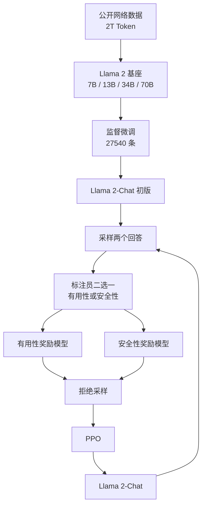

# Llama 2：开源基模第一次认真做对话对齐

<!-- release-date: 2023-07-18 -->

> 本文依据 Meta 的 **Llama 2: Open Foundation and Fine-Tuned Chat Models**，即 arXiv:2307.09288v2（2023-07-19），共 77 页。截至核验 arXiv 最新仍是 v2。页码均指这份 PDF。全文把三件事分开标注：**报告明确写了什么**、**我们如何解释或验算它**、**哪些是外部资料补充**。

## 读前先把几个词说成人话

这篇报告几乎不发明新架构。它难读的地方，是把「预训练」和「对话对齐」两条线同时铺开，又用了好几套打分器。先把后文会反复出现的名字说清楚：

- **Token（词元）**：模型读写文本时的最小单位。一个英文单词、一个数字、一个汉字，都可能被切成一块或几块。
- **自回归语言模型**：只做一件事——根据已经写下的内容，预测下一个 Token。Llama 2 全系列都是这一类。
- **稠密（dense）Transformer**：每处理一个 Token，全部参数都要参与计算。这篇没有混合专家。
- **SFT（Supervised Fine-Tuning，监督微调）**：用「问题—标准答案」成对数据继续训练，教模型按人话回答。
- **RLHF（Reinforcement Learning with Human Feedback，人类反馈强化学习）**：先让人在两个回答里挑更好的，再训练一个打分器，最后用这个打分器继续改模型。
- **奖励模型（Reward Model，RM）**：吃进「提示 + 回答」，吐出一个标量分数。它不是聊天模型，是裁判。
- **PPO（Proximal Policy Optimization，近端策略优化）**：一边生成、一边按奖励更新，每一步都不让新策略离旧策略太远。
- **拒绝采样（Rejection Sampling）**：同一道题生成很多个回答，用奖励模型挑最好的那个，再拿它当训练数据。
- **GQA（Grouped-Query Attention，分组查询注意力）**：多个 Query 头共用一组 Key / Value，用来压推理时的 KV 缓存。
- **GAtt（Ghost Attention，幽灵注意力）**：一种改微调数据的技巧，让多轮对话里的系统消息不要被忘掉。
- **系统消息（system message）**：对话开始时给模型的一条总指令，例如「用表情回答」或「扮演拿破仑」。它应当管后面每一轮，而不只是第一轮。

报告自己点名的两条产品线必须先分开：

- **Llama 2**：预训练基座。
- **Llama 2-Chat**：在基座上做完 SFT 和 RLHF、面向对话的模型。

后文所有「对 ChatGPT 赢了多少」都是 Chat 这一条线的数字；所有「MMLU 多少」默认是基座，除非写明 Chat。

## 一句话先说清

Llama 2 不是「再训一个更大的 LLaMA」。

它要做的事情更具体：

> **把开源基座再做扎实一层：语料加 40%、上下文翻倍到 4k、大模型改用 GQA；然后第一次由官方自己完成对话对齐，并把基座和 Chat 两条产品线一起交给研究和商用。**

本站另一篇 LLaMA 解读讲的是 2023 年 2 月那一步：只用公开数据，把 13B 训到能打过 GPT-3。那一篇交出去的是基座，指令微调只做了一次附带实验。Llama 2 承认：基座对得上 GPT-3，并不等于对得上 ChatGPT。差距在对齐，而对齐一直关在闭源产品后面。

所以这篇最值得记住的，不是某一个新注意力公式，而是一次产品形态的切换：

> **开源社区缺的不是又一个能刷榜的基座，而是一份可以下载、可以复现、并且认真做过安全和有用性对齐的对话模型。**

## 两条矛盾，决定了后面每一处设计

### 矛盾一：开源基座已经能打，开源助手还不能当产品

引言把当时的局面写得很直白。BLOOM、LLaMA-1、Falcon 这类公开预训练模型，已经能对上 GPT-3、Chinchilla 这一档闭源基座；但它们仍然不是 ChatGPT、Bard、Claude 的替代品。原因不是预训练差一截，而是后者做了很重的人类偏好对齐，好用性和安全性都因此上去。这一步又贵、又不透明、也不容易复现（PDF p. 3）。

于是矛盾变成：

> 社区已经能拿到能打的基座，却拿不到一份写清楚的对齐配方。想当助手，只能自己用 Alpaca、Vicuna 一类办法去补。

Llama 2 的回答是把这一层官方做完，并且把方法写进报告。

### 矛盾二：有用和安全不是同一个分数

对齐如果只用一个打分器，会把两件经常打架的事揉在一起：尽量满足用户，和遇到危险请求时拒绝。报告引用 Bai 等人的观察：有用性和安全性有时会互换（PDF p. 10）。「教人做炸弹的详细步骤」按有用性可以很高，按安全指南必须拒。

后面所有「两个奖励模型」「分段奖励」「安全数据加进去会不会把有用性打崩」，都是在给这道裂缝装护栏。

## 一条阅读路线

原文 77 页，正文到第 36 页，后面是参考文献和附录。如果只读原文，建议按这个顺序：

1. **第 3–4 页 Figure 1 到 Figure 4**：先看人类评测和训练总图，认清「基座」和「Chat」是两条线。
2. **第 6 页 Table 1 加 Figure 5**：规格、2T Token、4k、GQA、损失还没走平。
3. **第 8 页 Table 3、Table 4**：基座相对 Llama 1 涨了多少，对 GPT-3.5 / GPT-4 还差在哪。
4. **第 9–15 页第 3.1–3.2 节**：SFT 只要几万条高质量；RLHF 才是主战场。
5. **第 16–17 页 GAtt**：系统消息多轮会忘，这是这篇自己提出的方法。
6. **第 18–19 页 Figure 11、Figure 12**：Chat 怎么一步步追上 ChatGPT，以及人类评测自己划的边界。
7. **第 20–31 页第 4 节**：预训练不过度清洗、安全微调、红队、和闭源模型的安全人类评测。
8. **第 32–35 页第 5 节**：RLHF 之后出现的时间感和工具使用，是观察，不是消融。
9. **附录 A.2 / A.3 / A.6 / A.7**：GQA 消融、4k 上下文、污染、model card。第一次读可以只看结论句。

第 3 节的奖励模型表和第 4 节的安全样例，第一遍不必逐行核对。

## 先把家族关系理清楚

这一步不理清，后面所有数字都会读错。

报告向公众发布的是两套权重（PDF p. 4）：

1. **Llama 2**：Llama 1 的更新版。新的公开数据混合，预训练语料加 40%，上下文翻倍，大模型采用 GQA。发布 7B、13B、70B。
2. **Llama 2-Chat**：在 Llama 2 上面向对话微调。同样发布 7B、13B、70B。

**34B 训了，写进了几乎所有表，但不发布。** 脚注写明原因：来不及做充分红队（PDF p. 4）。后文 Table 3、安全评测、人类评测里出现的 34B-chat，都是内部检查点，不是可下载产品。

许可证口径先按报告自己的句子：**面向研究和商用向公众发布**（PDF p. 4）。自定义商用许可证的入口写在 model card（PDF p. 77）。许可证文本里还有一条 7 亿月活限制，那是外部补充，见文末，不冒充报告原文。

对照本站另一篇 LLaMA：那一代是研究许可、个案审批；这一代报告明确写成研究和商用。不要把后一代 Llama 3 的许可条款写回这里。

## 全景：先预训练，再 SFT，再进入奖励模型和策略的共进化

这是按 PDF p. 5 Figure 4 重画的流程示意，不是原图描摹。原图还画了一条从 Chat 回到「人类反馈」的回边：RLHF 期间必须同步收集新的奖励建模数据，否则奖励模型会离开当前模型的分布（PDF p. 5）。

这条回边是全文的结构，不是装饰。后面「每周一批偏好数据」「奖励模型要跟 Chat 一起迭代」，都是在执行它。

## 规格：报告写了什么，就只信什么

Table 1 把两代放在同一张表里（PDF p. 6）。Token 数只计预训练。全局 batch 都是 4M Token。

| 系列 | 数据 | 参数 | 上下文 | GQA | 预训练 Token | 学习率 |
|---|---|---:|---:|:---:|---:|---|
| Llama 1 | 见 Touvron 等人 2023 | 7B | 2k | 否 | 1.0T | $3.0\times 10^{-4}$ |
| Llama 1 | | 13B | 2k | 否 | 1.0T | $3.0\times 10^{-4}$ |
| Llama 1 | | 33B | 2k | 否 | 1.4T | $1.5\times 10^{-4}$ |
| Llama 1 | | 65B | 2k | 否 | 1.4T | $1.5\times 10^{-4}$ |
| Llama 2 | 新的公开网络数据混合 | 7B | 4k | 否 | 2.0T | $3.0\times 10^{-4}$ |
| Llama 2 | | 13B | 4k | 否 | 2.0T | $3.0\times 10^{-4}$ |
| Llama 2 | | 34B | 4k | 是 | 2.0T | $1.5\times 10^{-4}$ |
| Llama 2 | | 70B | 4k | 是 | 2.0T | $1.5\times 10^{-4}$ |

相对本站另一篇 LLaMA，这里能直接核对的变化有三条：

1. **语料约 +40%。** Llama 1 最大规格看 1.4T，Llama 2 四个规格都看 2.0T。$2.0/1.4\approx 1.43$，和正文「加 40%」一致（PDF p. 5–6）。
2. **上下文从 2k 翻倍到 4k。**
3. **GQA 只给 34B 和 70B。** 7B / 13B 仍是普通多头注意力。

报告**没有**给出层数、头数、隐层宽度。本站另一篇 LLaMA 的 Table 2 有 7B / 13B / 33B / 65B 的精确宽度，不能拿来冒充这一份 Table 1。70B 为什么不是 65B，报告也没解释。

词表这次写明了：沿用 Llama 1 的 BPE + SentencePiece，数字切成个位，未知 UTF-8 回退到字节，词表 **32k**（PDF p. 6）。本站另一篇 LLaMA 没写词表大小，这个数字属于这一份。

## 核心设计一：预训练加料，但不另起炉灶

**旧问题**：Llama 1 已经证明「公开数据 + 小模型多看 Token」走得通。若 Llama 2 在架构上大改，就说不清新分数来自数据、来自上下文，还是来自新模块。

**新设计**：预训练设定和模型架构大部分沿用 Llama 1——标准 Transformer、RMSNorm 预归一化、SwiGLU、RoPE——只改三处：更干净的数据混合、40% 更多 Token、更长上下文，以及大模型的 GQA（PDF p. 5）。

### 数据：公开、不上自家产品、不过度清洗

训练语料是「新的公开来源混合」，**不含 Meta 产品或服务数据**。他们努力去掉已知含大量私人信息的站点。训 2T Token，理由写成「性能和成本的折中」；并对最偏事实的来源上采样，希望增加知识、压低幻觉（PDF p. 5）。

安全节把「不过度清洗」说得更明确。他们没有额外过滤数据集，为的是让基座在更多下游任务上能用（例如仇恨言论分类），也避免清洗过猛把某些人群擦掉。这个选择的代价写在同一段：Llama 2 **必须先做显著的安全微调才能部署**（PDF p. 20）。

这和「安全模型从预训练就开始洗数据」是两条路。报告的判断是：脏一点的基座，安全对齐时需要的示范更少（PDF p. 20、p. 22）。

语言分布几乎是英文语料。Table 10：英语 89.70%，unknown 8.38%（部分是代码），德语 0.17%，法语 0.16%。超过 0.005% 的语言才进表（PDF p. 22）。模型卡把预期用途写成「英语的研究和商用」（PDF p. 77）。

毒性：用在 ToxiGen 上微调过的 HateBERT，给英文预训练语料打分。约 0.2% 的文档毒性似然 $\ge 0.5$（PDF p. 21，图见同页 Figure 13）。他们把这读成「有少量毒性，但为了下游泛化选择不洗掉」。

人口统计：He 代词比 She 多；国籍、种族、宗教呈西方偏向，「American」占国籍提及的 69.4%（PDF p. 20–21，Table 9）。这些是预训练语料的快照，不是 Chat 的生成统计。

数据截止日期写在 model card：预训练截止 **2022 年 9 月**，部分微调数据更新到 **2023 年 7 月**（PDF p. 77）。知识什么时候停，要以这行为准。

报告没给出各来源的比例、磁盘体积、过滤阈值。本站另一篇 LLaMA 的七源配比表，不能写进这一份的「报告写了什么」。

### 优化器几乎原样搬来

AdamW，$\beta_1=0.9$，$\beta_2=0.95$，$\varepsilon=10^{-5}$。余弦学习率，2,000 步热身，终点降到峰值的 10%。权重衰减 0.1，梯度裁剪 1.0（PDF p. 5）。和本站另一篇 LLaMA 比，多写了一个 $\varepsilon$。

Figure 5 把 7B / 13B / 34B / 70B 的训练困惑度画在同一张图上。横轴到 2T Token。报告的观察是：**训完 2T 仍没有饱和迹象**（PDF p. 6）。

这张图是「继续加 Token 还值」的现场证据。它不是缩放定律拟合，也没有验证损失。和 Llama 1 的 Figure 1 同一类用法：曲线还在往下，就支持「为了推理账单，继续训小模型」。

### 4k 上下文：长任务涨，短任务不掉

附录把 2k 和 4k 做成对照。两个模型都只训 150B Token，其余超参相同（PDF p. 47）。

长上下文基准 SCROLLS 上，4k 明显更高。例如 NarrativeQA 的 F1 从 0.21 到 17.26，Qasper 从 0.71 到 18.52；SQuAD 的 EM/F1 从 57.23/62.89 到 57.99/64.46，没有掉（PDF p. 47，Table 16）。

通用任务上 4k 基本持平：HellaSwag 75.1 对 74.8，NQ 64-shot 都是 25.5，GSM8K 从 4.9 到 6.5（PDF p. 47，Table 17）。

**因果链**：聊天和摘要需要看更长的历史；把窗口从 2k 拉到 4k，是产品形态从「续写」转向「多轮对话」的物理前提。代价是 KV 缓存变大，这正好把下一节的 GQA 接进来。

### GQA：为大模型的 KV 缓存服务，不为刷分

自回归解码会缓存已经算过的 Key 和 Value。上下文或 batch 变大时，多头注意力的 KV 缓存会先成为瓶颈。做法是让多个 Query 头共用 Key / Value 投影：要么 MQA（所有头共用一套），要么 GQA（例如 8 组 KV）（PDF p. 47）。

附录在固定约 30B、只训 150B Token 的设定下比 MHA / MQA / GQA。为了总参数量接近，MQA 把前馈宽度乘 1.33，GQA 乘 1.3。结论：GQA 在多数任务上和 MHA 基线相当，平均优于 MQA。因此 34B 和 70B 选用 GQA 而不是 MQA（PDF p. 47–48，Table 18）。

他们还写了一个推理侧的具体约束：最大模型用单节点 8 张 A100 做张量并行。MQA 的头数少于 GPU 数时，无法再按头切分，只能复制 KV，或改按 batch 维切。前者让 MQA 的 KV 缓存变得和 GQA 一样大；后者会把推理服务变复杂（PDF p. 47）。

Figure 24 的吞吐实验：输出固定 128 Token，batch 从 1 倍增到显存耗尽。MHA 在 256 上下文、batch 1024 以及 2k 上下文、batch 128 时 OOM；MQA 和 GQA 还能跑（PDF p. 48）。

**可迁移启发**：GQA 不是「让 70B 更聪明」的模块，是「让 70B 在 4k 上下文上还推得动」的模块。7B / 13B 不用它，是因为它们的 KV 还没有先成为瓶颈。

### 硬件和碳足迹：两套集群，一个 539 吨的账单

预训练跑在 Meta 的 Research Super Cluster 和内部生产集群，都是 A100。差别有两条（PDF p. 6–7）：

- 互联：RSC 用 NVIDIA Quantum InfiniBand；生产集群用基于商品以太网交换机的 RoCE。两端都是 200 Gbps。
- 单卡功耗上限：RSC 400W，生产 350W。

报告写：RoCE 这种更便宜的商用互联，在大约 2000 张 GPU 上可以几乎赶上昂贵的 InfiniBand（PDF p. 7）。这是观察，不是一张完整的缩放曲线。

Table 2 的碳排只计 GPU 的 TDP 估算，不含互联、非 GPU 功耗、冷却和硬件制造（PDF p. 7）：

| 规格 | GPU 小时 | 功耗（W） | tCO$_2$eq |
|---|---:|---:|---:|
| 7B | 184,320 | 400 | 31.22 |
| 13B | 368,640 | 400 | 62.44 |
| 34B | 1,038,336 | 350 | 153.90 |
| 70B | 1,720,320 | 400 | 291.42 |
| 合计 | 3,311,616 | | 539.00 |

合计约 **3.3M GPU 小时**，估算排放 **539 tCO$_2$eq**，报告称 100% 由 Meta 的可持续发展项目直接抵消（PDF p. 7）。开放发布的另一句理由是：别人不必再付一遍预训练账单。

34B 的功耗写成 350W，其他三档 400W。报告没解释为什么 34B 记在生产集群的 TDP 上。不要补原因。

### 预训练评测：对开源赢在知识，对 GPT-4 仍有一条编码鸿沟

Table 3 把基准收成八组。Code 是 HumanEval 和 MBPP 的平均 pass@1；常识是一串 0-shot（CommonsenseQA 是 7-shot）；世界知识是 NQ 和 TriviaQA 的 5-shot 平均；阅读是 SQuAD / QuAC / BoolQ 的 0-shot 平均；Math 声称是 GSM8K（8-shot）和 MATH（4-shot）的平均；再加 MMLU / BBH / AGI Eval（PDF p. 7–8）。

Llama 2 70B 对 Llama 1 65B：MMLU 从 63.4 到 68.9（约 +5），BBH 从 43.5 到 51.2（约 +8）。报告原话是「$\approx 5$ 和 $\approx 8$ 分」（PDF p. 8）。70B 在这张表上超过所有列出的开源基座。

对闭源的 Table 4 更有信息量（PDF p. 8）：

| 基准 | GPT-3.5 | GPT-4 | PaLM 540B | PaLM-2-L | Llama 2 70B |
|---|---:|---:|---:|---:|---:|
| MMLU 5-shot | 70.0 | 86.4 | 69.3 | 78.3 | 68.9 |
| TriviaQA 1-shot | — | — | 81.4 | 86.1 | 85.0 |
| NQ 1-shot | — | — | 29.3 | 37.5 | 33.0 |
| GSM8K 8-shot | 57.1 | 92.0 | 56.5 | 80.7 | 56.8 |
| HumanEval 0-shot | 48.1 | 67.0 | 26.2 | — | 29.9 |
| BBH 3-shot | — | — | 52.3 | 65.7 | 51.2 |

读这张表时要分开三层：

- **报告明确写了什么**：70B 在 MMLU 和 GSM8K 上接近 GPT-3.5，编码差距显著；对 PaLM 540B 几乎全面持平或更好；对 GPT-4 和 PaLM-2-L 仍有大缺口（PDF p. 8）。
- **我们如何读它**：MMLU 68.9 对 70.0、GSM8K 56.8 对 57.1，是「同一张桌子」；HumanEval 29.9 对 48.1，不是同一张桌子。Llama 2 仍然是通用基座，不是代码模型。
- **表格内部的不一致**：Table 3 声称 Math 是 GSM8K 和 MATH 的平均。附录 Table 25 给出分项后，70B 的 $(56.8+13.5)/2=35.15$，对得上 Table 3 的 35.2；34B 的 $(42.2+6.24)/2=24.22$，对得上 24.2。但 7B 的平均应约为 8.6、13B 约为 16.3，Table 3 却分别写成 14.6 和 28.7，恰好等于各自的 GSM8K。这更像 7B / 13B 两行误抄了 GSM8K。按附录分项读，不要按 Table 3 的 13B Math 28.7 去谈「13B 数学超过 34B」。

另一个非单调点即使按附录也成立：34B 的 MATH 是 6.24，低于 Llama 1 33B 的 7.1（PDF p. 51）。报告没有解释。

污染分析在附录 A.6。方法按 Token 匹配，而不是整段 n-gram 碰撞。只有 HellaSwag 和 MMLU-Humanities 有足够证据表明污染抬高了分数；70B 的 MMLU 总体因此有一个很小的增量，clean 子集和抽样均值只差约 0.9 分（PDF p. 75–76）。其他评测集报告认为没有受到实质影响。

## 核心设计二：SFT 只要几万条高质量，然后把预算交给偏好

**旧问题**：第三方指令数据很多，但多样性和质量不够，尤其难以对齐到对话式指令（PDF p. 9）。

**新设计**：先用公开指令数据起步（Chung 等人 2022，也就是本站另一篇 LLaMA 里 LLaMA-I 用过的那一类），然后把百万级第三方例子放下，改成自己找供应商写几千到几万条高质量示范。他们一共标了 **27,540** 条就停手。不含 Meta 用户数据（PDF p. 9）。

「Quality Is All You Need」是这一节的小标题。精神类似 Zhou 等人 2023 的 LIMA：干净的少量指令数据可以够用（PDF p. 9）。

一个改变后续预算分配的观察：他们抽 180 条，把人写的答案和 SFT 模型自己采样的答案对比，发现模型输出常常已经能跟人写的竞争。于是标注力量转向 RLHF 的偏好对比（PDF p. 9）。

微调配方写得很具体（PDF p. 9）：

- 余弦学习率，初始 $2\times 10^{-5}$
- 权重衰减 0.1，batch 64，序列长度 4096
- 把训练集里的 prompt 和 answer 拼起来填满序列，中间用特殊 Token 分开
- 自回归损失，**用户 prompt 上的损失置零**，只在 answer Token 上回传
- 训 2 个 epoch

Table 5 给了两条示范：一首周期表诗，和一次拒绝「把我骂得很脏」的请求（PDF p. 9）。有用性和安全性从 SFT 开始就是同一套标注流程里的两条指南，不是 RLHF 才突然出现的。

**可迁移启发**：对话对齐的第一刀往往不是「再买一百万条指令」，而是先确认标注平台会不会把下游分数打歪。报告写：不同平台和供应商会导致明显不同的下游表现，即便外包也要做数据抽查（PDF p. 9）。

## 核心设计三：两个奖励模型，因为有用和安全会打架

RLHF 的数据协议选了二选一，而不是打分或排序列表。理由是这样能最大化提示多样性（PDF p. 10）。标注员先写提示，再在两个来自不同模型变体、不同温度的回答里选一个，并标出偏好强度：显著更好、更好、略好、可忽略 / 不确定。

有用性：回答是否满足请求、是否提供了所要的信息。安全性：回答是否不安全。安全阶段额外打三档标签（PDF p. 10）：

| 类别 | 占比 |
|---|---:|
| 选中的安全、落选的不安全 | 18% |
| 两个都安全 | 47% |
| 两个都不安全 | 35% |

他们**不收录**「选中的不安全、落选的安全」这种例子，因为假定更安全的回答也会被人类标成更好。

数据量是这一节的另一个锚。Table 6：Meta 自己的 Safety & Helpfulness 有 **1,418,091** 对比较，平均 3.9 轮、每条 798.5 Token；加上开源偏好数据一共 2,919,326 对（PDF p. 11）。附录 Table 26 把这 140 万拆成 14 个周批次，从第 1 批 5,561 对涨到第 14 批 249,356 对（PDF p. 52）。

开源偏好数据一开始是为了在自己的标注还没堆积起来时启动奖励模型。报告说没观察到负迁移，于是留在混合里，指望泛化更好、也更不容易被 Chat 钻空子（PDF p. 11）。

### 奖励模型从 Chat 检查点初始化

输入是「提示（含历史）+ 回答」，输出一个标量。分类头换成回归头。从预训练过的 **chat 检查点** 初始化，理由是让奖励模型和 Chat 知道同一批知识，避免一边觉得事实对、另一边觉得事实错，从而鼓励幻觉（PDF p. 10–11）。

基础损失和 InstructGPT 一致，是 pairwise ranking：

$$
L_{\mathrm{ranking}}=-\log\sigma\bigl(r_\theta(x,y_c)-r_\theta(x,y_r)\bigr)
$$

$y_c$ 是选中的回答，$y_r$ 是落选的。再加一个与偏好强度有关的间隔 $m(r)$：

$$
L_{\mathrm{ranking}}=-\log\sigma\bigl(r_\theta(x,y_c)-r_\theta(x,y_r)-m(r)\bigr)
$$

差别大的一对用大间隔，差别小的用小间隔（PDF p. 11，式 1–2）。附录 Table 27 试了两档：小间隔是 $1,\tfrac{2}{3},\tfrac{1}{3},0$，大间隔是 $3,2,1,0$（PDF p. 52）。间隔能提高「显著更好」上的准确率，但大间隔会把分数推成更极端的双峰，PPO 对这种分布更敏感。报告把校准留给未来（PDF p. 51–52）。

### 为什么要两个模型，而不是一个

Helpfulness RM 最终用全部 Meta Helpfulness，再均匀混入等量的 Meta Safety 和开源数据。Safety RM 用全部 Meta Safety 和 Anthropic Harmless，再按 90/10 混入 Meta Helpfulness 和开源有用性数据。那 10% 有用性数据，对「两个回答都安全」这类样本特别有帮助（PDF p. 12）。

Table 7：Helpfulness RM 在 Meta Helpful 上 63.2，Safety RM 在 Meta Safety 上 64.5，都高于 GPT-4 的 58.6 / 58.1，也高于 SteamSHP 和 Open Assistant（PDF p. 12）。这不能读成「我们的 RM 比 GPT-4 更懂人类」——测试集就是按 Llama 2-Chat 的分布收的，自家模型占主场。报告自己也把这句话写在结果段里（PDF p. 12）。

Table 8 按偏好强度拆开：差别越大越好判。「显著更好」上 Safety RM 达到 94.3，「可忽略 / 不确定」掉到 55.3，几乎是随机（PDF p. 12）。报告强调：对 Chat 真正有用的，是拉开明显差距的那一端。

Figure 6 的缩放：更大的模型和更多周数据，准确率都还在涨，没有走平。报告把奖励模型准确率当成 Chat 最终表现最重要的代理之一，因为生成式评测没有唯一答案，而排序任务没有歧义（PDF p. 13）。

**可迁移启发**：有用和安全如果共用一个标量，模型必须同时学会「哪个回答更好」和「这条提示是不是在攻击」。拆成两个 RM，是承认目标函数本身有裂缝。主场测试集上赢 GPT-4，只能说明「对这个分布校准得好」，不能说明奖励模型可以当通用法官。

## 核心设计四：先拒绝采样，后 PPO，而且只在 70B 上探索

迭代版本叫 RLHF-V1 到 RLHF-V5（PDF p. 13）。两条算法：

1. **PPO**：RLHF 文献里的标准做法。
2. **拒绝采样微调**：对每个提示采 $K$ 个回答，用当前最好的奖励模型挑最高分，再像 SFT 一样梯度更新。报告把它和 Bai 等人 2022b、Deng 等人 2019 对齐，并多走了一步：被选中的输出不只用来重排，还用来更新参数（PDF p. 13–14）。

两条算法的差别，报告写成广度和深度（PDF p. 14）：

- **广度**：拒绝采样一次看 $K$ 个样本，PPO 每个提示只生成一个。
- **深度**：PPO 第 $t$ 步的样本来自第 $t-1$ 步更新后的策略；拒绝采样是在当前策略上把数据集采完，再做一轮类似 SFT 的微调。

因为他们本来就在做多轮迭代，两种算法的界线会变模糊。

**直到 RLHF-V4，只用拒绝采样；之后在拒绝采样得到的检查点上再跑 PPO，然后再采样**（PDF p. 14）。

拒绝采样**只在 70B Chat 上做**。更小的模型微调这些被 70B 挑出来的样本，等于把大模型能力蒸馏下去。蒸馏效果的分析留给未来（PDF p. 14）。

早期版本（到 V3）只在「上一轮的袋子」里挑，例如 V3 只用 V2 的样本。分数还在涨，但出现了能力回退：V3 写押韵诗比前几版更差。后来改成把 V1、V2 里的顶尖样本也加回来。报告没给具体数字，只说相当有效（PDF p. 14–15）。

Figure 7：在训练提示集上，N 个样本里的最大奖励随 N 上升，中位奖励几乎不动。最大和中位的差，就是拒绝采样理论上能吃到的便宜（PDF p. 14）。

Figure 8 把温度加进来。SFT 和 RLHF 的最优温度不一样。对已经 RLHF 过的 Chat，在 10 到 100 个样本里挑时，最优温度大约 $T\in[1.2,1.3]$。给定有限算力，每个新版本都要重新调温度；而且每次都从基座出发跑固定步数（PDF p. 15）。

### PPO：安全分数优先，再加 KL 护栏

目标是让策略 $\pi$ 在提示分布 $D$ 上拿到更高的期望奖励（PDF p. 15，式 3）。实际优化的标量是：

$$
R(g\mid p)=\tilde R_c(g\mid p)-\beta D_{\mathrm{KL}}\bigl(\pi_\theta(g\mid p)\,\|\,\pi_0(g\mid p)\bigr)
$$

KL 项惩罚偏离初始策略 $\pi_0$。和 Stiennon、Ouyang 一样，它被用来稳住训练、减少「奖励模型分数很高、人类分数却很低」的 reward hacking（PDF p. 15）。

$R_c$ 是安全和有用的分段组合。提示若被标成可能不安全，或者安全 RM 分数低于 0.15，就用安全分数；否则用有用性分数。0.15 这个阈值在 Meta Safety 测试集上对应精确率 0.89、召回率 0.55。线性分数先做 logit 再 whitening，为的是和 KL 项的 $\beta$ 对齐（PDF p. 15）：

$$
R_c(g\mid p)=\begin{cases}
R_s(g\mid p) & \text{若是安全提示，或 }R_s<0.15\\
R_h(g\mid p) & \text{否则}
\end{cases}
\qquad
\tilde R_c=\mathrm{whiten}(\mathrm{logit}(R_c))
$$

PPO 超参（PDF p. 15）：AdamW 与预训练相同的 $\beta$ 和 $\varepsilon$，权重衰减 0.1，梯度裁剪 1.0，恒定学习率 $10^{-6}$。每次迭代 batch 512，clip 0.2，mini-batch 64，每个 mini-batch 一步。7B / 13B 的 $\beta=0.01$，34B / 70B 的 $\beta=0.005$。所有模型训 200 到 400 次迭代，用留出提示做早停。70B 一次 PPO 迭代平均约 330 秒（PDF p. 16）。

FSDP 在前向 / 后向时有效，但生成阶段即使开了 KV cache 也会慢大约 20 倍。缓解办法：生成前把权重合并到每个节点，生成完再释放，继续训练（PDF p. 16）。这是这篇里最接近系统实现的一段。

**可迁移启发**：拒绝采样吃的是「同一步里多看几个样本」；PPO 吃的是「每一步策略都在变」。先用拒绝采样把分布推到高分区，再用 PPO 做在线修正，是一种降低 PPO 从差策略起步的办法。只在旗舰模型上探索、把轨迹蒸馏给小模型，则是用标注预算换小模型的对齐质量。两条都依赖「奖励模型还在分布内」——所以 Figure 4 那条回边不能省。

## 核心设计五：Ghost Attention，让系统消息活过第 20 轮

**旧问题**：对话里有些指令应当管每一轮，例如「回答要短」或「扮演某位公众人物」。初始 RLHF 模型会在几轮之后忘掉。Figure 9 左侧是「永远用 emoji 回答」，模型第一轮还在用表情，问巴黎到纽约怎么走时已经改回普通散文（PDF p. 16）。

**新设计**：GAtt，一种很简单、受 Context Distillation 启发的数据黑客，用来在多阶段过程里把注意力钉在系统消息上（PDF p. 16）。

做法可以拆成四步：

1. 已有多轮对话 $[u_1,a_1,\ldots,u_n,a_n]$，再定义一条应当贯穿全程的指令 $\mathrm{inst}$。
2. 合成数据时，把 $\mathrm{inst}$ 拼到**每一轮**用户话前面，用最新 RLHF 模型采样。
3. 真正拿去微调时，只在第一轮保留 $\mathrm{inst}$，后面几轮丢掉。
4. 若不对齐，训练时系统消息和中间那些 assistant 回复会对不上。解决办法是：**把前面几轮所有 Token 的损失置零**，包括 assistant 的话（PDF p. 16）。

训练用的约束是合成的：爱好、语言、公众人物。名单让 Llama 2-Chat 自己生成，避免要求它扮演一个预训练里没见过的人。最终系统消息由这些约束随机组合；一半时间会改成更短的写法，例如把 “Always act as Napoleon from now” 收成 “Figure: Napoleon.”（PDF p. 16–17）。

GAtt 加在 RLHF-V3 之后。人工评测里，带 GAtt 的模型到第 20 轮仍 100% 能指回第一轮设定的属性；不带的模型第 4 轮只剩 10%，第 6 轮是 0%。评测对话总长都在 4096 Token 以内（PDF p. 54，Table 30）。

零样本推广：训练里没有的约束，例如「永远用俳句回答」，推理时仍然能守住（PDF p. 17，附录 Figure 28）。他们还把 GAtt 用到 Llama 1 上——预训练上下文是 2048，微调到 4096——模型在超过 2048 的位置仍能理解属性。报告把这写成「有希望成为长上下文注意力的便宜技巧」（PDF p. 54）。这是观察，不是系统消融。

Figure 10 是注意力可视化：横轴纵轴都是对话 Token，颜色是网络中的最大激活，相邻 Token 做了分箱。左侧是系统消息 “Act as Oscar Wilde”。带 GAtt 的右侧，系统消息和后续对话之间的高激活带得更远（PDF p. 17）。

报告自己把当前实现叫 vanilla，并点了下一步：教模型在对话中途改系统消息（PDF p. 17）。

**可迁移启发**：多轮一致性不一定要改注意力公式。先在数据里「每轮都看见指令」，再在损失里「只训练最后一轮」，等于把系统消息变成一种幽灵条件——推理时只出现一次，梯度却按「它一直在」来走。适用边界是上下文还没撑满；GAtt 不解决 4k 窗口本身不够长的问题。

## RLHF 结果：模型裁判先用来迭代，人类评测用来封版

### 用自己的奖励模型赶进度，用 GPT-4 防自卖自夸

每个从 V1 到 V5 的消融，先看最新奖励模型的分数，以节省成本和加快迭代；大版本再用人类评测确认（PDF p. 17）。

Figure 29（附录）表明奖励模型和 7 点 Likert 的人类打分整体校准得不差，所以 pairwise 训练出来的 RM 可以当点值用。但 Goodhart 定律写在同一段：指标一旦成为优化目标，就不再是好指标。于是他们另用一个在多样开源奖励数据上训的更一般奖励，以及 GPT-4，交叉检查（PDF p. 17–18）。

Figure 11 是全文最重要的一张演化图。横轴有用性赢率，纵轴无害性赢率，对手是 ChatGPT。左图用自家 RM 当裁判，右图用 GPT-4，顺序随机对调。验证集是 1,586 条安全提示和 584 条有用性提示（PDF p. 18）。

左图：RLHF-V3 之后，两条轴都超过 50%。右图：最新 Llama 2-Chat 对 ChatGPT 的赢率仍高于 60%，但优势没有左图那么夸张。SFT-v1 在两张图里都靠近原点；从 SFT-v2 起才进入能打的区域。RLHF-v5 with PPO 是最右上的点。

读这张图时要分开：左图证明「按我们的 RM，我们在涨」；右图证明「换一个不是我们训的裁判，方向还在」。两者都不是人类评测。

### 人类评测：对开源拉开，对 ChatGPT 打平，题目集自己有洞

超过 4,000 条单轮和多轮提示，三名标注员，比 Falcon、MPT、Vicuna，以及 ChatGPT（`gpt-3.5-turbo-0301`）和 PaLM（`chat-bison-001`）（PDF p. 18）。

Figure 1 和正文给出的关键数字（PDF p. 3、p. 18–19；图见 p. 3 和 p. 19）：

- Llama 2-Chat 7B 对 MPT-7B-chat：约 60% 赢（Figure 1 读数为 61.1% 赢、20.9% 平、18.0% 负）。
- 34B 对同尺寸 Vicuna-33B 和 Falcon-40B：总体赢率超过 75%（对 Falcon 的 Figure 1 读数是 76.3% 赢）。
- **70B 对 ChatGPT：赢 36%，平 31.5%。** 对 PaLM-bison 大幅领先（Figure 1 读数 53.0% 赢）。

95% 置信区间大约 1%–2%（PDF p. 3）。Gwet AC2 在 0.37 到 0.55 之间，对接近的模型更低，对明显赢家更高（PDF p. 19）。

报告自己列出的人类评测限制，比赢率更重要（PDF p. 19）：

- 4k 提示按学术标准已经很大，但不覆盖真实用量。
- **提示集不含任何编码或推理相关提示。**
- 多轮只评最后一轮生成，不评整段任务体验。
- 生成式评测天然主观。换一批提示或换一套说明书，结果可能变。

附录还做了一个系统消息消融：ChatGPT 去掉系统消息后，Llama 2-Chat 赢率从 36% 升到 44%，单轮从 36% 升到近 49%。按类别，ChatGPT 在语言协助上更好，Llama 2-Chat 70B 在事实问题上更好——但「更好」常常是文风，不代表幻觉率（PDF p. 58）。按轮数和字数切分，赢率没有趋势（PDF p. 58，Figure 31）。

**我们如何读这组人类评测**：摘要里「可能是闭源模型的合适替代」成立的范围，是这 4k 偏写作、事实、闲聊的提示，不是编码，不是数学，不是工具。Table 4 里 HumanEval 那条鸿沟，人类评测根本没测。

## 安全：预训练留脏，对齐阶段再洗，红队把长尾补上

第 4 节有内容警告。下面只转述机制和数字，不转写不安全样例的细节。

### 预训练安全：知道脏在哪，选择不把脏洗掉

除了前面已经说过的代词、身份词、毒性 0.2%、英语 89.7%，基座还走了 TruthfulQA、ToxiGen、BOLD（PDF p. 22）。Table 11：Llama 2-7B 相对 Llama 1-7B，真实且有信息量的比例从 27.42 到 33.29（+21.37% 相对提升），毒性从 23.00 到 21.25（-7.61%）。13B 和 70B 的毒性反而升了（26.10、24.60），报告猜测和新数据量或配比有关，并承认「预训练越大越毒」仍然缺乏新证据（PDF p. 22–23）。

基座在毒性指标上没有胜过别人。报告的解释回到「我们没有激进过滤」。这个选择让安全对齐需要的示范更少，也意味着**基座不能直接部署**（PDF p. 22）。

### 安全微调三条：示范、RLHF、带门控的上下文蒸馏

和通用微调同一套管子，多了安全专用的部分（PDF p. 23）：

1. **监督安全微调**：收集对抗提示和安全示范，放进第 3.1 节的 SFT。让模型在 RLHF 之前就按安全指南说话，给后面的偏好标注打底。
2. **安全 RLHF**：训练专用安全奖励模型，并用更难的对抗提示做拒绝采样和 PPO。
3. **安全上下文蒸馏**：在提示前加安全前缀（例如「你是一个安全负责的助手」）生成更安全的回答，再在**不加前缀**的提示上微调，等于把前缀蒸进权重。安全 RM 决定每条样本用不用蒸馏。

风险类别分三大类：违法犯罪、仇恨与伤害、不合格建议（医疗 / 财务 / 法律）。攻击向量包括心理操纵、逻辑操纵、句法操纵、语义操纵、视角操纵（角色扮演）、非英语等（PDF p. 23–24）。期望的回答顺序是：先处理眼前的安全问题，再解释风险，最后在可能时给额外信息。

一个关键观察：模型从安全 SFT 里泛化得很快，写出的安全回答往往比普通标注员更细。所以他们只收了几千条监督示范，就全部改用 RLHF 去教更细的拒绝方式，并指望这对越狱更稳（PDF p. 24）。

### 安全 RLHF：长尾变薄，有用性分布不跟着塌

Figure 14 左图：安全测试集上，安全 RLHF 之后分数往右上聚集，靠近 0 的长尾变细，左上角出现「安全改进」簇。右图：有用性测试集上，没有系统性掉到 $y=x$ 下方。报告的读法是：有用性数据足够多时，再加一段安全缓解，不会把有用性打到可观察的退化（PDF p. 24–25）。

安全数据缩放把有用性数据固定在约 0.9M，安全数据从 0% 加到 100%（约 0.1M），得到 0 / 1 / 10 / 25 / 50 / 100% 六档（PDF p. 24）。Figure 15：平均安全分明显上升，平均有用性分几乎水平；安全分数的左尾随安全数据增加而消失（PDF p. 26）。

假拒绝是另一把尺子。定义是：对合法提示，因为不相干的安全顾虑而拒答。模型能力不够（「我不能视频通话」）或超出知识截止（「2024 年超出我的知识」）不算假拒绝。有用性测试集上，即便 100% 安全数据，假拒绝大约 **0.05%**；在 210 条故意长得像攻击、其实安全的边界集上，假拒绝高得多，例如提示里出现 “bomb” 这类常和危险共现的词（PDF p. 26）。

定性上，安全数据加到 50% 左右，模型开始拒写攻击性内容；同时对「盘子里的 sex in a pan 甜点」这类含敏感子词的安全提示，也会变得保守（PDF p. 58）。这就是第 5.2 节说的「有时过犹不及」的现场来源。

### 上下文蒸馏：前缀能救命，也能把好回答变空话

通用前缀能把安全 RM 分数往上推；按风险类别定制的回答模板推得更狠（PDF p. 27–28，Figure 16a）。但已经很好的回答再蒸一遍，模型会过度抓住前缀，变成空泛的安全套话。所以只对对抗提示做蒸馏，并且**只有蒸馏后 RM 分数更高才保留**（PDF p. 28，Figure 16b）。对有用性提示做安全蒸馏，会增加假拒绝（PDF p. 28）。

GAtt 和安全蒸馏是同一种思想的两个用途：GAtt 把「扮演谁」蒸进多轮；安全蒸馏把「你应当安全」蒸进单轮对抗提示。门控都靠奖励模型，因为无条件蒸馏会误伤。

### 红队：350 人，把分数上看不见的洞找出来

安全是长尾。定量分数好，不等于某个具体攻击向量已经被堵住。红队包含内部员工、合同工和外部供应商，超过 **350** 人，覆盖网络安全、选举欺诈、社媒虚假信息、法律、政策、民权、伦理、工程、机器学习、负责任 AI 和创意写作，以及不同社会经济和人口统计背景（PDF p. 28）。

探测的风险包括犯罪策划、人口贩运、管制物质、色情、不合格医嘱或财嘱、隐私等；攻击向量包括假想问题、故意写错、超长对话。还专门测了是否会协助制造核、生物、化学和网络武器：发现是边际的，并已缓解，但仍会继续测（PDF p. 29）。输出评测只针对英语，但提示和对话上下文包含非英语，因为这是已知攻击面。

早期模型的三个可复现模式（PDF p. 29）：

1. 先说「这不合适」，紧接着「话虽如此，下面是做法」。
2. 用歌曲、故事、诗这类「创意写作」绕开直接拒绝。
3. 把有问题的请求藏进积极、进步、赋能的语言里。

这些洞被送回微调、反馈训练和其他安全模型。他们定义鲁棒性 $\gamma$：一次红队练习中，每位专家每小时能写出多少条触发违规的提示。7B 上 $\gamma$ 从 1.8 降到 0.45。另一个跟踪量是：上一轮发现的违规提示，有多少在新候选里被缓解。平均每个新模型相对上一版有 90% 的拒绝率（PDF p. 29）。

34B 不发布的原因在这里闭环：红队是发布门，不是附录装饰。

### Chat 的安全人类评测：违规率低，但标准可能偏向自己

约 2,000 条对抗提示，1,351 单轮、623 多轮。5 点量表，1 或 2 算违规，三人多数投票。Llama 2-Chat 上 Gwet AC2 平均 0.92，比有用性任务高很多——安全对错比「哪个更有帮助」更好达成一致（PDF p. 29–30）。

Figure 3 / Figure 17：Llama 2-Chat 各尺寸的违规率都低，ChatGPT 和 Falcon 其次，然后是 MPT 和 Vicuna。Vicuna-33B 的违规率读图大约 38%，Llama 2-Chat 各档大约 3%–7%（PDF p. 4、p. 30）。Falcon 违规率看起来和 Llama 2-Chat 34B 接近（3.88 对 4.45），但平均分低得多，因为 Falcon 常常只写一两句，少惹事，也少帮忙（PDF p. 30）。

多轮比单轮更容易诱出不安全回答。这是所有模型的共同趋势。Llama 2-Chat 在多轮上相对基线仍然好；Falcon 单轮好看、多轮明显变差，报告归因于缺少多轮 SFT（PDF p. 31，Figure 18）。

按风险类别，Llama 2-Chat 相对更常在「不合格建议」上违规，常见原因包括缺「我不是专业人士」这类免责声明。另外两类上，各尺寸都比较稳定（PDF p. 31，Figure 19）。

自动基准 Table 14：70B Chat 的 TruthfulQA 从基座 50.18 到 64.14，ToxiGen 从 24.60 到 0.01。各尺寸 Chat 的毒性生成都接近 0%，是对比模型里最低的。ChatGPT 的 TruthfulQA 仍更高（78.46），毒性 0.20（PDF p. 31）。

报告在 Figure 3 的图注里写了一句必须留下的话：这些安全评测用的内容标准，**很可能偏向 Llama 2-Chat**（PDF p. 4）。人类评测不是盲法实验室之外的客观安全证明。

## 讨论：RLHF 之后出现的能力，以及报告自己划的边界

### 监督可能不再是金标准

Figure 20 把 SFT（公开混合）、SFT（自有标注）、RLHF-V1、RLHF-V2 的奖励分数画成分布。最差的回答被逐步切掉，质量往右移（PDF p. 32）。

报告的解释是人话：每个人写得不一样，SFT 会把差的尾巴也学进去，且上限被最会写的标注员卡住。让人**比较**两个回答，分歧更小。模型还可以走进最好的标注员也写不出来的轨迹，人仍然能当评委。类比是：不是人人都是画家，但大多数人能评论画（PDF p. 32）。

这是作者观察，不是消融。它解释了为什么 27,540 条 SFT 之后要把预算转向偏好，但不证明「任意任务都可以停掉 SFT」。

### 温度按上下文重标定

Figure 21：对「写一首诗」这类创造性提示，提高温度仍然增加多样性，Self-BLEU 斜率和 SFT 差不多；对「首都是哪」这类事实提示，迭代越往后，Self-BLEU 斜率越平——温度升高，答案仍收敛到同一句（PDF p. 32–33）。

这是 RLHF 的一个副作用：策略在事实提示上学会低熵，在创造性提示上保留高熵。它不是推理时再设一个分类器，而是训练把温度的有效含义改了。

### 时间感和工具使用：观察，不是产品功能

用约 1,000 条带日期的 SFT 例子（「奥巴马当总统是多久以前」，附查询日期和事件日期），模型表现出按时间组织知识的能力（PDF p. 33，Figure 22）。报告的读法是：即便预训练把数据打乱、只做 next-token，模型也已经内化了时间概念，少量示范就能把它唤出来。测试是手工几十条，不是一张基准表。

工具使用写得更冲。他们没有标注过工具调用，Figure 23 却出现了零样本、按语义理解 API 参数、还能串多个工具的例子（PDF p. 34）。给计算器之后，ASDiv / SVAMP / MAWPS 分别到 67.1 / 69.2 / 82.4，高于 Toolformer 的 40.4 / 29.4 / 44.0（PDF p. 34，Table 15）。基线数字来自 Schick 等人，设定是否完全对齐，报告没有再核对。

这些是 Discussion 里的「有趣性质」，不是第 3 节的对齐配方，也不是发布清单上的功能。报告自己也说工具使用会带来安全问题，希望社区继续红队（PDF p. 34）。

### 限制写得很干脆

Llama 2-Chat 有所有 LLM 的老问题：预训练之后知识不再更新、可能给出不合格建议、会幻觉。第一版主要是英语；其他语言很脆，因为预训练里本来就少（Table 10）。公开网上的训练数据仍可能让模型写出有害或带偏见的内容，微调缓解了，但没切干净，非英语更明显。安全有时过了头，拒绝过多或安全细节太多。基座使用者要特别小心，去看 Responsible Use Guide（PDF p. 34–35）。

### 负责任发布：许可证按报告写，细节按官方页补

报告第 5.3 节写：Llama 2 可供研究和商用，入口是 `https://ai.meta.com/resources/models-and-libraries/llama/`。使用者必须遵守所提供的许可证和可接受使用政策。另外提供输入 / 输出层的安全代码示例（`https://github.com/facebookresearch/llama`）和 Responsible Use Guide（PDF p. 35）。model card 把许可证写成「自定义商用许可证」（PDF p. 77）。

**以下不是 PDF 原文，是官方发布页的补充。** [Llama 2 Community License](https://ai.meta.com/llama/license/) 标注 Version Release Date: July 18, 2023。除研究和商用授权外，还有两条 PDF 没展开的限制：发布当日若许可方或其关联公司产品的月活超过 7 亿，必须另向 Meta 申请；不得用 Llama 材料或其输出去改进其他大模型（Llama 2 及其衍生除外）。可接受使用政策禁止违法和一批有害用途。本站另一篇 LLaMA 的研究许可、个案审批，到这一代被换成「自定义商用 + 可接受使用 + 超大规模另议」。不要把后来 Llama 3 的许可变更写进这一代。

## 相关工作和结论：这篇承认自己还不是 GPT-4

相关工作把故事收成三层。第一层是大模型：Kaplan 缩放、GPT-3、Gopher、Chinchilla 把预算从参数转向 Token，LLaMA 把推理效率写进目标（PDF p. 35）。第二层是开源对闭源：BLOOM、OPT、Falcon 能挑战 GPT-3 / Chinchilla 这一档基座，但 ChatGPT / Bard / Claude 靠复杂对齐拉开了产品差距；Vicuna、Alpaca 用合成指令蒸馏去补，仍没到闭源产品那一档（PDF p. 36）。第三层是指令微调加 RLHF 的文献，以及已知的安全风险和红队攻击。

结论重复三个主张（PDF p. 36）：

1. 引入 7B 到 70B 的预训练和微调家族。
2. 对现有开源聊天模型有竞争力，在所考察的评测集上相当于某些专有模型，**仍然落后于 GPT-4**。
3. 把方法和安全对齐写清楚，并负责任地开放 Llama 2 和 Llama 2-Chat。

「相当于某些专有模型」必须和 p. 19 的限制一起读：人类评测不含编码和推理。

## 附录里还值得吸进正文的几件事

**标注课程。** 有用性偏好不是随机堆的。第一个模型时，标注员被要求把提示写简单，再逐步加难、教新技能。Figure 26 显示后续批次的奖励分数在下降，说明提示平均更难了（PDF p. 51、p. 53）。同时 Figure 25：随着 Chat 变好，「可忽略 / 不确定」占比上升，「显著更好」下降——两个高回答越来越难分开（PDF p. 53）。

**安全辅助损失。** 给 Safety RM 加一项辅助损失后，以 0.5 为阈值的不安全召回从 73.0 升到 90.4（PDF p. 52，Table 29）。PPO 里那个 0.15 阈值能用，部分取决于 RM 真的能把不安全回答打到低分。

**人类评测的系统消息并不公平到无色。** 开源模型上下文和生成都限制在 1000 Token，即使 Llama 2-Chat 能到 4000；闭源改成 2000。ChatGPT / PaLM / Falcon 没有官方系统消息时，用了和 Llama 2-Chat 相同的那一段「有帮助、尊重、诚实……」（PDF p. 56，Table 31）。这是评测协议，不是模型能力。

**Model card 把两条产品线的用途分开。** 微调模型面向助手式聊天；预训练模型可适配各种自然语言生成。超出范围：违法、英语以外、可接受使用政策禁止的用途。训练因素：自定义训练库、RSC、生产集群；微调、标注和评测还用了第三方云（PDF p. 77）。

## 报告没有告诉我们的事

77 页仍然不是复现手册。下面这些要么完全没写，要么只给了方向：

- **7B / 13B / 34B / 70B 的层数、头数、隐层宽度、GQA 的组数在正式规格里的取值。** 附录消融写了「8 个 KV 投影」的 GQA 变体，没有把它写回 Table 1。
- **预训练各来源的比例、过滤规则、上采样系数。** 只有「新的公开混合」「不上 Meta 产品」「去掉高个人信息站点」「上采样最偏事实的来源」。
- **27,540 条 SFT 的领域分布、多轮占比、供应商之间的质量差具体是多少。**
- **拒绝采样的 $K$、温度日程、70B 蒸馏给小模型时的数据配比。**
- **PPO 的提示集从哪来、安全提示如何被打上 `is_safety` 标签。**
- **GAtt 训练数据的规模、约束组合的采样分布。**
- **红队 $\gamma$ 在 13B / 70B 上的数字，以及武器相关测试的具体协议。**
- **并行度数、精度、是否使用 bias、RoPE 底数。** 这些不要用后一代报告或第三方模型卡回填。

不要用后一代报告里的规格来填这些空白。那些属于本站另一篇 Llama 3 解读。

## 论文之后发生了什么

以下不是 2307.09288v2 的内容，用来把 2023 年 7 月这份材料放回时间线。

- **官方首发日是 2023-07-18，不是 arXiv v2 的 2023-07-19。** Meta 新闻室 [Meta and Microsoft Introduce the Next Generation of Llama](https://about.fb.com/news/2023/07/llama-2/) 标注 July 18, 2023，正文写当天在 Azure AI 模型目录提供 Llama 2，并同时通过 AWS、Hugging Face 等渠道提供预训练和对话微调权重。这是 7B / 13B / 70B 这一代首次通过官方渠道向公众开放使用，也是本文 `release-date` 的依据。研究页同样标注 July 18, 2023。arXiv v1 提交于 2023-07-18 14:31 UTC，v2 修订于 2023-07-19 17:08 UTC；论文日不回写首发日。Hugging Face 仓库 `createdAt` 不采用。
- **许可证从「研究申请」换成「自定义商用」。** 官方博客把免费研究和商用写成 Takeaway。社区许可证全文见上文外部补充。本站另一篇 LLaMA 不得被改写成已经商用。
- **34B 后来是否以其他名字出现，不属于这份 v2。** 报告当时的发布清单就是 7B / 13B / 70B。
- **Code Llama、Llama 3 是另一些文章的对象。** 编码鸿沟（HumanEval 29.9 对 GPT-3.5 的 48.1）在这份报告里被承认，专项代码模型是之后的故事。不要把那些数字写进本文的「报告写了什么」。

## 最值得带回自己项目的八条

### 1. 先分清交出去的是基座还是助手

Llama 1 交基座，社区自己做 Alpaca。Llama 2 把基座和 Chat 拆成两条产品线，评测也拆开。写发布清单时，先写「用户拿到手要直接聊，还是要自己再调」。两种产品的数据、安全和许可证都不一样。

### 2. 架构创新的预算，仍然优先换成已经验证过的零件

相对 Llama 1，能点名的架构变化就是 4k 和 GQA。GQA 的消融甚至把前馈加宽，为的是参数量不要偷偷变。在 3.3M GPU 小时的预训练里，稳定性比再发明一种注意力更值钱。

### 3. 安全可以从预训练开始洗，也可以故意留到对齐阶段洗

Llama 2 选后者：不过度过滤，接受 0.2% 的毒性文档，换取下游泛化和更少的安全示范。代价写在同一页——基座不能直接部署。这是可迁移的判断，不是「脏数据更好」的口号。

### 4. SFT 的上限是最好的标注员；偏好的上限是裁判能不能打准

27,540 条高质量 SFT 之后，模型已经能跟人写的答案竞争。继续堆示范，学到的是标注员的方差。RLHF 把人从作者变成评委。前提是奖励模型跟得上策略分布——所以要每周重新采偏好，而不是训一次 RM 用到项目结束。

### 5. 有用和安全不要共用一个标量

两个 RM、分段奖励、安全数据从 0% 加到 100% 而有用性均值不动，这三件事在回答同一道题：目标函数有裂缝时，先把裂缝暴露出来，再决定怎么加权。假拒绝 0.05% 看起来很小，边界集上就会放大，产品必须另做边界测试。

### 6. 只在旗舰上探索，把轨迹蒸馏给小模型

拒绝采样只跑 70B，7B / 13B 吃它挑过的回答。标注和采样预算集中在最能探索的模型上，小模型买的是现成的高分轨迹。代价是小模型的对齐风格会被大模型锚定，报告把分析留给了未来。

### 7. 多轮系统消息可以用数据黑客，不必先改核

GAtt 不引入新参数。它改的是：训练时每轮都看见指令，损失却只打在最后一轮。20 轮 100% 的记忆是人工评测，不是注意力论文里的复杂度证明。先试数据黑客，再决定要不要上更重的长上下文架构。

### 8. 人类评测要公开题目集的洞

4k 提示、三评委、对 ChatGPT 36% 赢 31.5% 平，看起来已经能写进摘要。同一节写明：没有编码，没有推理，只评最后一轮。Table 4 的 HumanEval 鸿沟因此没有被这张人类评测推翻。对外公布赢率时，把「没测什么」写在同一段。

## 关键词回看

- **Llama 2 / Llama 2-Chat**：一条预训练产品线，一条对话对齐产品线。分数不能混用。
- **GQA**：分组查询注意力。34B / 70B 用来压 KV 缓存，7B / 13B 不用。
- **Quality Is All You Need**：SFT 用 27,540 条高质量示范，而不是百万级第三方指令。
- **Helpfulness RM / Safety RM**：两个奖励模型。有用和安全的目标裂缝被写成两个标量。
- **拒绝采样微调**：采 $K$ 个、按 RM 挑最好、再梯度更新。V4 之前的主算法，只在 70B 上探索。
- **PPO + KL**：在拒绝采样检查点上的在线修正。安全分数低于 0.15 时优先走安全 RM。
- **GAtt**：幽灵注意力。用数据拼接和损失置零，让系统消息管到第 20 轮。
- **上下文蒸馏**：把安全前缀蒸进权重；必须用 RM 门控，否则误伤有用性。
- **红队 $\gamma$**：每专家每小时挖出的违规提示数。7B 从 1.8 降到 0.45。
- **假拒绝**：对安全提示因不相干安全顾虑而拒答。主测试集约 0.05%，边界集高得多。

## 最后的判断

如果只能从这篇报告带走一件事，不应该是 70B，也不应该是 GQA。

应该是这个：**它把「开源大模型」的默认形态，从「一个能打的基座」改成了「一个能打的基座，外加一份写清楚的对话对齐配方，并且两者都允许商用」。**

证据支持这个转变在 2023 年 7 月是成立的：

- 基座 70B 的 MMLU 68.9、GSM8K 56.8，贴近 GPT-3.5 的 70.0 和 57.1（PDF p. 8）；
- Chat 70B 对 ChatGPT 人类评测 36% 赢、31.5% 平（PDF p. 19）；
- 安全人类评测上，Chat 各尺寸的违规率低过大多数开源对话模型，毒性自动指标接近 0（PDF p. 30–31）；
- SFT、双 RM、拒绝采样到 PPO、GAtt、安全蒸馏和红队，都给出了可核对的数字和超参（PDF p. 9–29）。

它自己划的边界同样清楚：

- HumanEval 29.9 对 GPT-3.5 的 48.1，编码不是同一张桌子（PDF p. 8）；
- 人类评测不含编码和推理，不能支撑「全面替代 ChatGPT」（PDF p. 19）；
- 仍落后 GPT-4 和 PaLM-2-L（PDF p. 8、p. 36）；
- 34B 因为红队时间不够而不发布（PDF p. 4）；
- 英语 89.7% 的预训练，非英语脆弱（PDF p. 22、p. 34）；
- 安全评测所用内容标准可能偏向自己（PDF p. 4）。

和本站另一篇 LLaMA 对照着读，两步的分工就清楚了。LLaMA 证明：公开数据可以把推理账单更小的稠密模型训到能打。Llama 2 证明：要把这个基座变成能聊的助手，官方必须自己付对齐和安全的那笔标注账单，并且把账单上的方法写出来。ChatGPT 把对齐关在 API 后面；Llama 2 把对齐写成 77 页报告，连同 7B / 13B / 70B 的基座和 Chat 权重一起放下。开源助手此后的默认问题，从「有没有基座」变成了「对齐是不是也公开、安全是不是也过了红队」。

## 资料与阅读边界

- **原始依据**：本地 `papers/Meta/Llama-2.pdf`，正式标题 **Llama 2: Open Foundation and Fine-Tuned Chat Models**，署名 GenAI, Meta（Hugo Touvron、Louis Martin、Kevin Stone、Thomas Scialom 等），共 77 页。页边水印为 `arXiv:2307.09288v2 [cs.CL] 19 Jul 2023`。
- **版本核查**：[arXiv:2307.09288](https://arxiv.org/abs/2307.09288) 提交历史为 **[v1]** Tue, 18 Jul 2023 14:31:57 UTC，**[v2]** Wed, 19 Jul 2023 17:08:59 UTC。截至核验最新仍是 v2，本地原件无需更换。
- **release-date 取值 2023-07-18 的依据**：本文覆盖的是 Llama 2 家族（预训练 7B / 13B / 70B 与对应 Chat；34B 仅论文内报告）。取该家族首次通过官方渠道向公众开放使用的日期。官方证据见 [Meta and Microsoft Introduce the Next Generation of Llama](https://about.fb.com/news/2023/07/llama-2/)（Meta 新闻室，标注 July 18, 2023，正文为当天在 Azure 提供并同时通过 AWS、Hugging Face 等渠道提供权重），以及 [Llama 2: Open Foundation and Fine-Tuned Chat Models](https://ai.meta.com/research/publications/llama-2-open-foundation-and-fine-tuned-chat-models/)（研究页，同样标注 July 18, 2023）。arXiv 提交日是论文日；v2 修订日 2023-07-19 不回写首发日。Llama 3 不得回写。Hugging Face 仓库 `createdAt` 不采用。
- **论文自述的代码与指南入口**：模型页 `https://ai.meta.com/resources/models-and-libraries/llama/`（PDF p. 4、p. 35）；代码 `https://github.com/facebookresearch/llama`（PDF p. 4、p. 35）；Responsible Use Guide `https://ai.meta.com/llama`（PDF p. 4、p. 35）。阅读源码时应以当时的 commit 为准；本文没有把源码里未写入报告的层数、头数、并行度数冒充论文结论。
- **跨篇阅读**：第一代 7B–65B 公开数据基座，见本站另一篇 LLaMA 解读。OPT 的训练事故簿和开源复现 GPT-3，见本站另一篇 OPT 解读。后一代 dense 路线，见本站另一篇 Llama 3 解读；本文不把那些数字写进 Llama 2 的「报告写了什么」。
- **本文的三层事实边界**：所有带 `(PDF p. N)` 的内容来自 v2 原文；标为「我们的解释」「我们的验算」「读这张表时」的段落是本文的推断；官方博客、社区许可证、arXiv 提交历史用于首发日核实与许可补充，已明确标成外部补充。
