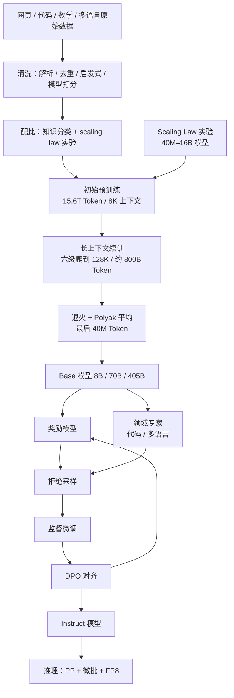
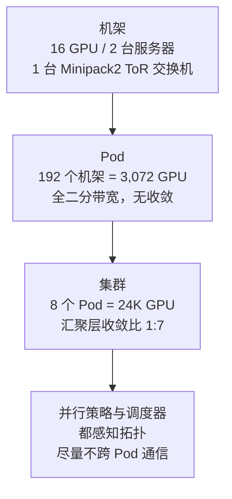
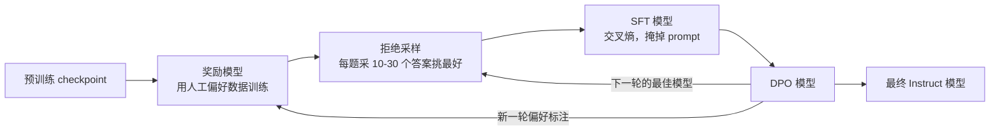
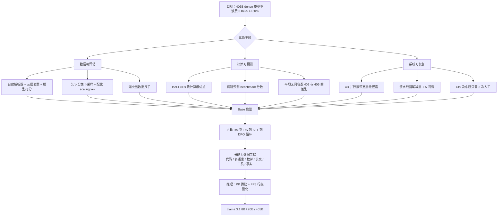

# Llama 3：405B dense 模型，把复杂度从架构挪到了数据和运维

<!-- release-date: 2024-07-23 -->

> 本文依据 Meta 的 **The Llama 3 Herd of Models**，即 arXiv:2407.21783v3、2024-11-23 的修订版，共 92 页。页码均指 PDF 本身的页码（本报告的 PDF 页码与印刷页码一致）。文中会明确区分「报告写了什么」「我们如何解释它」「哪些是外部补充」。

## 阅读前先认几个词

这份报告几乎不发明新词，但它把很多老词用到了很细的地方。先认识几个：

- **Token（词元）**：模型读写文本时的最小单位。一个英文单词、一个汉字、一段标点，都可能被切成一个或多个 Token。
- **Dense（稠密）模型**：每处理一个 Token，模型的全部参数都要参与计算。与之相对的是 MoE（Mixture-of-Experts，混合专家），每个 Token 只激活一小部分参数。
- **FLOPs（浮点运算次数）**：衡量算力消耗的单位。训练一个模型花了多少 FLOPs，大致等于「模型有多大」乘以「看了多少 Token」。
- **Scaling Law（缩放定律）**：在给定算力预算下，模型大小和训练 Token 数应该怎么配比才最划算的经验规律。
- **MFU（Model FLOPs Utilization，模型算力利用率）**：训练时真正用于模型计算的 FLOPs，占硬件理论峰值的比例。它是衡量大规模训练效率最常用的单一指标。
- **SFT（Supervised Finetuning，监督微调）**：用「问题—标准答案」成对数据继续训练模型，教它按期望的方式回答。
- **DPO（Direct Preference Optimization，直接偏好优化）**：一种对齐方法。给定一对「更好的回答」和「更差的回答」，直接调整模型让前者概率上升、后者下降，不需要单独跑一个强化学习循环。
- **Rejection Sampling（拒绝采样，缩写 RS）**：让模型对同一个问题生成很多个答案，再用一个打分模型挑出最好的那个，当作训练数据。

## 先说矛盾：2024 年了，为什么还有人训练 405B 的 dense 模型

2024 年前后，公开的大模型技术路线正在往两个方向走。

一个方向是**让架构变聪明**：用混合专家把参数总量做大、把每个 Token 的计算量压小；用更复杂的注意力压缩 KV Cache；用新的路由、新的残差结构、新的优化器换取效率。同仓的 DeepSeek-V2 技术报告解读、DeepSeek-V3 技术报告解读讲的就是这条路线。

另一个方向是**让流程变可靠**：架构尽量不动，把力气全部花在数据、规模和运维上。

Llama 3 是后者的一个极端样本。它的架构相对 Llama 2 几乎没变——还是标准 dense Transformer，只多了 GQA、跨文档注意力掩码、更大的词表和更大的 RoPE 底数（PDF p. 6–7）。报告自己在结论里写得很直白：他们在预备实验里试过更复杂的架构和训练配方，但**收益不足以抵消它们带来的复杂度**（PDF p. 70）。

于是矛盾就变成：

> 如果架构上不占便宜，那 405B 参数、15.6T Token、$3.8\times10^{25}$ FLOPs 的训练预算，靠什么保证不被浪费？

这份 92 页报告，本质上是对这个问题的一份完整回答。它的重点不在「我们发明了什么」，而在「我们如何让一条已知的路线在这个规模上不出错」。

## 一句话结论

Llama 3 把创新预算几乎全部投给了三件事：**能被量化决策的数据流水线**、**能预测下游分数的 scaling law**、**能在 16K 张 GPU 上撑住 54 天的运维系统**；架构和后训练算法则刻意选择了当时最保守、最容易稳定的方案。

它最值得学的不是某个模块，而是一套判断顺序：

> 先问「这个复杂度会不会让我更难扩大规模」，再问「它能带来多少分」。

## 报告自己给出的三个杠杆

引言把整篇文章的组织方式说清楚了（PDF p. 1–2）：

| 杠杆 | 报告的具体动作 | 关键数字 |
|---|---|---|
| **数据（Data）** | 更严的预训练清洗与配比、更严的后训练质量控制 | 预训练语料约 15T 多语言 Token，Llama 2 是 1.8T |
| **规模（Scale）** | 旗舰模型算力比 Llama 2 最大版本高近 50 倍 | $3.8\times10^{25}$ FLOPs，405B 参数，15.6T 文本 Token |
| **管理复杂度（Managing complexity）** | 选 dense 而不是 MoE；选 SFT + RS + DPO 而不是复杂 RL | —— |

第三条特别值得停一下。报告给出的理由不是「MoE 效果不好」，而是**为了最大化训练稳定性**；不选复杂 RL 的理由也不是「PPO 不行」，而是它们**更不稳定、更难扩大规模**（PDF p. 2）。

这是一种典型的工程判断：在一个自己已经确定要投入巨量算力的项目里，把「失败概率」看得比「理论上限」更重。

## 先把家族关系理清楚

这一步不理清，后面所有数字都会读错。

报告第 2 页的 Table 1 列了整个家族，并明确写着一句关键的话：**本文所有结果都是 Llama 3.1 模型的结果**（PDF p. 2）。

| 模型 | 发布时间 | 多语言 | 长上下文 | 工具调用 |
|---|---|---|---|---|
| Llama 3 8B / 70B（及 Instruct） | 2024 年 4 月 | 否 | 否 | 否 |
| Llama 3.1 8B / 70B / 405B（及 Instruct） | 2024 年 7 月 | 是 | 是 | Instruct 版是 |

论文为了行文方便，全文把 Llama 3.1 统称为「Llama 3」（PDF p. 1）。所以：

- 报告里所有 128K 上下文、多语言、工具调用能力，指的都是 **7 月那一批**；
- 4 月那批 8B/70B 只有 8K 上下文，且当时定位为英文模型（PDF p. 2 脚注 1）。

因此本文的 `release-date` 取 **2024-07-23**——Llama 3.1 家族（含 405B）首次通过官方渠道公开发布的日期，而不是 4 月的 Llama 3 首发日，也不是 arXiv 的任何一次提交日。理由和证据见文末「资料与阅读边界」。

## 全景：一条从网页到部署的流水线

先看整体，再看每一段。

图中 `DPO → RM` 这条回边不是笔误：报告的后训练是**六轮循环**，每轮用上一轮最好的模型去生成新数据、重新训练奖励模型（PDF p. 17，图见 PDF p. 15 的 Figure 7）。这是全文最重要的结构，后面会单独讲。

## 第一部分：预训练数据流水线

报告在数据上写得比绝大多数同类文章细。这一节按它自己的顺序展开。

### 网页数据：一条能被验证的清洗线

**旧问题**：网页数据量大但极脏。传统做法是套一批开源过滤器，然后祈祷。问题是你无法判断某一条规则到底带来了多少收益，也无法判断它误删了什么。

Llama 3 的做法是把每一道工序都做成可评估的（PDF p. 5）：

**1. 自建 HTML 解析器。** 他们没有直接用第三方解析器，而是自己写了一个，针对「去除样板文字的准确率」和「正文召回率」两个目标优化，并用人工评测和主流第三方解析器对比。

两个细节很有信息量：

- **数学内容常常是预渲染的图片**，公式本身写在 `alt` 属性里。所以他们特意保留 `alt` 文本（PDF p. 5）。
- **markdown 标记被全部删掉。** 报告说，对一个主要用网页数据训练的模型来说，保留 markdown 标记是有害的（PDF p. 5）。

第二条值得琢磨。直觉上 markdown 保留了结构信息，应该有用。报告没有解释原因，只说这是实验结论。我们的解释是：网页里的 markdown 残留往往不是作者写的语义结构，而是转换过程的噪声；模型学到的可能是「什么时候冒出一串星号」，而不是「什么时候该强调」。但这只是解释，报告没有给出机制证据。

**2. 三层去重**（PDF p. 5）：

| 层级 | 方法 | 说明 |
|---|---|---|
| URL 级 | 全量去重 | 同一个 URL 只保留最新版本 |
| 文档级 | 全局 MinHash | 去掉近似重复的文档 |
| 行级 | 类 ccNet 的激进去重 | 在每 3000 万文档的桶内，删掉出现超过 6 次的行 |

行级去重那一条有一个诚实的自我批评：他们的人工定性分析发现，这一步不仅删掉了导航菜单、Cookie 提示这类残留样板，**也删掉了一部分高质量的高频文本**；但实测指标显示收益很明显，所以保留（PDF p. 5）。

这种「知道自己在误伤，但按实测结果保留」的记录，比一句「我们做了去重」有用得多。

**3. 启发式过滤**（PDF p. 5），三条具体规则：

- 用重复 n-gram 覆盖率删掉整行重复的内容（比如日志、错误信息）。这类行往往很长且唯一，行级去重抓不到。
- 用脏词计数补充域名黑名单没覆盖到的成人网站。
- 用 Token 分布的 KL 散度，删掉相对训练语料分布含有过多异常 Token 的文档。

第一条和第三条是互补的：行级去重按「出现次数」筛，n-gram 覆盖率按「内部自相似度」筛，KL 散度按「与整体分布的距离」筛。三把尺子量的是三种不同的脏。

**4. 模型打分过滤：用 Llama 2 给 Llama 3 挑数据**（PDF p. 5）。

这是整条流水线里最有意思的一环。它分成两级：

- 快分类器：fasttext，判断一段文本是否像会被 Wikipedia 引用；
- 重分类器：基于 Roberta，**训练标签由 Llama 2 的 chat 模型生成**——他们写清楚质量要求，让 Llama 2 判断文档是否达标，再用 DistilRoberta 出于效率考虑给每篇文档打分。

代码和推理数据走**独立管线**：分类器同样是 DistilRoberta，标注同样来自 Llama 2，但针对「数学推导」「STEM 推理」「代码与自然语言交错」做了提示词调优，并且用了领域专属的 HTML 抽取、定制文本特征和过滤启发式。理由报告写了：代码和数学的 Token 分布与自然语言差别太大（PDF p. 5）。

多语言管线（PDF p. 5–6）：fasttext 语言识别分成 **176 种语言**；每种语言内部各自做文档级和行级去重；再用一个多语言 Llama 2 分类器做质量排序。多语言 Token 的用量是**实验定出来的**，在英文和多语言指标之间取平衡。

**这一段的因果链**：旧问题是「过滤规则无法评估」；新设计是「用上一代模型当标注器，把质量判断变成一个可训练的分类任务」；工作机制是「强模型标注 → 小模型蒸馏 → 全量打分」；收益是可以对 15T 级别的语料做细粒度筛选；代价是**质量的定义被上一代模型的偏好锚定了**，报告没有讨论这种偏好会不会传递。

### 配比怎么定：让小模型替大模型投票

**旧问题**：数据配比是超参数里最贵的一个。你不可能为了试一个配比就跑一次 405B 训练。

Llama 3 用两个工具（PDF p. 6）：

**知识分类器。** 先训练一个分类器给网页数据打「这是哪类知识」的标签，然后**下采样在网络上过度出现的类别**。报告举的例子是艺术与娱乐。

这一步的逻辑很清楚：互联网上的类别分布不等于你希望模型具备的能力分布。不做干预，模型会按互联网的比例分配容量。

**配比的 scaling law 实验。** 对每个候选配比，训练若干小模型，用 scaling law 外推大模型在这个配比下的表现；反复多轮，选出新的候选配比；最后再用一个更大的模型在候选配比上实训并评测关键 benchmark（PDF p. 6）。

**最终配比**（PDF p. 6）：

| 类别 | 占比 |
|---|---:|
| 通用知识 | 约 50% |
| 数学与推理 | 25% |
| 代码 | 17% |
| 多语言 | 8% |

这张表值得记住。数学推理加代码合起来 42%，超过通用知识的一半——这已经不是一个「通用语言模型」的配比，而是一个明确押注推理与编码能力的配比。

要注意报告没说的部分：它没有公开各个来源的具体数据集、去重阈值、质量分数的切分点，也没有公开合成数据在预训练中的占比。我们只能确定方向，不能复现配比。

### 退火数据：把学习率退火当成一把数据尺子

**旧问题**：你手上有一个几十亿 Token 的小众数据集，想知道它值不值得加进预训练。跑一整套 scaling law 实验太贵。

**新设计**（PDF p. 6）：拿一个**训练到 50% 的 Llama 3 8B**，在 400 亿 Token 上把学习率线性退火到 0，其中新数据集占 30% 权重、默认配比占 70%。看指标变化。

这个做法把「数据集价值评估」从一次昂贵的完整实验，变成一次可以批量重复的短程实验。报告明说：用退火评估新数据源比对每个小数据集都做 scaling law 实验更高效（PDF p. 6）。

**同一把尺子也量出了一个规模差异**。他们用 GSM8k 和 MATH 的训练集做退火验证，结果是（PDF p. 6）：

- Llama 3 8B 在 GSM8k 和 MATH 验证集上分别提升 **24.0%** 和 **6.4%**；
- **405B 上的提升可以忽略不计**。

报告对此的解读是：旗舰模型的上下文学习和推理能力已经足够强，不需要特定领域的训练样本才能拿到好成绩（PDF p. 6）。

这个对照很有价值，因为它给了一条可迁移的判断：**小模型上验证有效的数据干预，不一定在大模型上还有效。** 你在 7B 上测出的数据收益，可能只是在补一个大模型本来就不缺的短板。

另外注意一个容易被跳过的细节：**退火数据里不包含任何常用 benchmark 的训练集**，报告说这是为了能真实评估 few-shot 和跨域泛化能力（PDF p. 6）。

### 数据部分的可迁移启发

1. 每一道清洗工序都要能单独评估。做不到评估，就说不清是它在起作用还是别的东西在起作用。
2. 质量分类器可以用上一代模型标注、小模型蒸馏。这是把「人工定义质量」变成「可扩展打分」的最便宜路径。
3. 配比不要靠直觉，用小模型和 scaling law 投票。
4. 短程退火实验是一把便宜的数据尺子，适合评估边角数据源。
5. 互联网的类别分布不是你要的能力分布，需要主动下采样。

## 第二部分：Scaling Law 被真正用来做决策

这一节是全文技术密度最高的部分之一，也是最值得单独学的部分。

### 旧问题：scaling law 只能预测 loss，不能预测你在乎的分数

报告把困难说得很具体（PDF p. 7）：

1. 现有 scaling law 通常只能预测**下一个 Token 的预测损失**，不能预测某个具体 benchmark 上的分数。
2. scaling law 本身很吵。它是用小算力预算的训练跑出来的，外推到大预算时可能不可靠。

问题在于，决策者关心的不是 loss。你要决定「405B 还是 200B」，本质上是要知道哪个选择在 MMLU、ARC、HumanEval 上更好。loss 差 0.01，对应的分数差可能是 1 分，也可能是 8 分。

### 第一步：IsoFLOPs 找出每个算力预算下的最优点

**实验设置**（PDF p. 7）：

| 项目 | 取值 |
|---|---|
| 算力预算范围 | $6\times10^{18}$ 到 $10^{22}$ FLOPs |
| 模型规模范围 | 40M 到 16B 参数 |
| 学习率调度 | cosine，线性 warmup 2,000 步 |
| 峰值学习率 | $2\times10^{-4}$ 到 $4\times10^{-4}$，随模型大小调整 |
| cosine 衰减终点 | 峰值的 0.1 |
| 权重衰减 | 每步为当前学习率的 0.1 倍 |
| Batch size | 每个算力量级固定，范围 250K 到 4M |

做法是：固定算力预算 $C$，训练一组不同大小的模型，画出「模型大小 → 验证损失」的曲线。这条曲线是一个开口向上的抛物线：模型太小，容量不够；模型太大，看的 Token 太少。抛物线的最低点就是这个算力预算下的**计算最优模型**（PDF p. 8，Figure 2）。

用二次多项式拟合每条曲线找最低点，再假设最优 Token 数和算力之间是幂律关系：

$$
N^\star(C) = A\,C^{\alpha}
$$

- $C$：预训练算力预算，单位 FLOPs；
- $N^\star(C)$：这个预算下最优的训练 Token 数；
- $\alpha$、$A$：待拟合的两个常数。

拟合结果是 $(\alpha, A) = (0.53, 0.29)$（PDF p. 8）。

把它外推到 $3.8\times10^{25}$ FLOPs，得到的建议是：**训练一个 402B 参数的模型，看 16.55T Token**（PDF p. 8）。

（一个小的版式细节：Figure 3 图例上写的拟合值是 $\alpha = 0.537$、$A = 0.299$，正文取的是四舍五入后的 0.53 和 0.29。两者一致，只是精度不同。）

### 第二步：两跳把 FLOPs 接到 benchmark 准确率

有了计算最优模型，还需要把它们的表现接到具体分数上。报告用两跳（PDF p. 7–8）：

**第一跳**：把「模型在某个 benchmark 上给出正确答案的归一化负对数似然」和「训练 FLOPs」做**线性**相关。这一步只用算力不超过 $10^{22}$ FLOPs 的 scaling law 模型。

**第二跳**：把这个负对数似然和**准确率**做 **sigmoid** 相关。这一步除了 scaling law 模型，还额外用上了 **Llama 2 系列模型**——它们用的是 Llama 2 的数据配比和分词器，但训练算力更高，正好补上高算力端的样本。

这张图是根据 PDF p. 7–8 的正文与 Figure 4 重画的机制示意，不是实测曲线。

**为什么要拆成两跳？** 因为这两段关系的形状不一样。NLL 随算力大致是平滑单调的，适合线性外推；但准确率有上下界（0 到 1），且在中段变化最快，形状天然是 S 型。硬套一条直线会在两端严重失真。

**收益**：报告说这个两步预测**跨越了四个数量级的外推**，而且相当准确——只是略微低估了旗舰模型的最终表现（PDF p. 8，Figure 4 展示的是 ARC Challenge）。

「略微低估」这个方向本身也是信息：如果一个预测方法要出错，宁可它保守。

### 那个被抹平的选择：402B 还是 405B

scaling law 建议 402B。他们训了 405B。差 3B 参数，为什么？

报告给的理由不是「凑个整」，而是一个更有价值的观察（PDF p. 8）：

> 随着算力预算增大，IsoFLOPs 曲线在最低点附近**越来越平**。

平坦意味着：在最优点附近，把参数调大一点、Token 调少一点，损失几乎不变。所以旗舰模型的表现**对「模型大小 vs 训练 Token」这个取舍的小幅变化是相对鲁棒的**。既然如此，405B 和 402B 实际上没有区别，可以按工程方便来选。

这是一个很实用的判断：**在最优点附近，精确度不重要；重要的是不要偏离太远。** 花大力气把 402 精确算成 402，收益是零。

还有一个方向相反的决策同样重要（PDF p. 2）：8B 和 70B 被**训练得远超计算最优**。理由是计算最优只考虑训练成本，不考虑推理成本。同样的推理预算下，一个训练过量的小模型比一个计算最优的模型更强。而且旗舰模型还会在后训练阶段反过来提升这些小模型的质量。

### 可迁移启发

1. 如果决策要看下游分数，就不要只拟合 loss。分两跳：先接损失，再接指标，且第二跳要用 sigmoid 之类有界的函数族。
2. 高算力端缺样本时，可以借用上一代模型来补——即使它们的数据配比不同。
3. 看拟合曲线在最优点附近的**平坦程度**，它告诉你这个决策需要多精确。
4. 计算最优是训练侧的最优。要部署的模型应该按推理预算重新算账。

## 第三部分：模型架构——刻意的「不创新」

报告在这一节非常简短，因为确实没什么可讲的。这本身就是结论。

### 三个尺寸放在一起

Table 3（PDF p. 7）：

| 配置 | 8B | 70B | 405B |
|---|---:|---:|---:|
| 层数 | 32 | 80 | 126 |
| 模型维度 | 4,096 | 8,192 | 16,384 |
| FFN 维度 | 14,336 | 28,672 | 53,248 |
| 注意力头数 | 32 | 64 | 128 |
| Key/Value 头数 | 8 | 8 | 8 |
| 峰值学习率 | $3\times10^{-4}$ | $1.5\times10^{-4}$ | $8\times10^{-5}$ |
| 激活函数 | SwiGLU | SwiGLU | SwiGLU |
| 词表大小 | 128,000 | 128,000 | 128,000 |
| 位置编码 | RoPE，$\theta=500{,}000$ | 同左 | 同左 |

三个尺寸的 KV 头数都是 8，说明 GQA 的分组数没有随规模变化——405B 的 128 个 Query 头共享 8 组 KV，压缩比是 16:1。

### 相对 Llama 2 的四个改动

**1. GQA（Grouped Query Attention，分组查询注意力），8 个 KV 头**（PDF p. 6）。目的写得很直接：提升推理速度，减小解码时的 KV Cache 体积。

**2. 跨文档注意力掩码。** 预训练时会把多个短文档拼进同一条序列（这叫 packing）。默认情况下，同一条序列里的 Token 可以互相看见，哪怕它们来自完全无关的两篇文档。Llama 3 加了掩码禁止这种跨文档注意力。

报告的观察很有意思：这个改动在**标准预训练阶段影响有限**，但在**超长序列的续训阶段很重要**（PDF p. 6）。

这条因果链值得补一句解释：8K 序列里可能只装了两三篇文档，串味的机会有限；128K 序列里可能装了几十上百篇，如果不隔离，模型会学到大量虚假的跨文档依赖，而这恰恰会破坏长上下文检索能力。

**3. 128K 词表**（PDF p. 7）。构成是 tiktoken 的 10 万个 Token 加上 2.8 万个为非英语语言补充的 Token。收益有具体数字：相比 Llama 2 的分词器，英文样本的压缩率从 **3.17 字符/Token 提升到 3.94 字符/Token**。

压缩率提升意味着**同样的算力预算能读更多文本**。这是一个经常被低估的杠杆——它不改变任何一层网络，却直接放大了有效数据量。报告还说，新增的 2.8 万个非英语 Token 同时改善了压缩率和下游表现，且**对英文分词没有影响**。

**4. RoPE 底数提高到 500,000**（PDF p. 7）。RoPE 用旋转角度编码位置，底数越大，角度随位置变化越慢，能区分的距离范围就越远。报告引用了已有工作，说明这个值在 32,768 长度上有效。

注意这里的诚实：报告只说这个值**在 32K 上被验证过有效**，而 Llama 3 要做到 128K。它没有声称 500,000 对 128K 也是最优的。

### 为什么不用 MoE

报告只给了一句理由：**为了最大化训练稳定性**（PDF p. 2）。

这不是一个技术论证，而是一个风险判断。可以这样理解它的处境：一次 405B 训练要烧掉 $3.8\times10^{25}$ FLOPs 和几个月的 16K 卡集群时间。MoE 的路由塌缩、专家负载不均、loss spike 都是真实存在的风险；而 dense 模型的失败模式已经被充分理解。

这条路线的代价也很明确：**每个 Token 都要跑完全部 405B 参数**，推理成本远高于同等能力的 MoE 模型。报告在推理章节承认，405B 用 BF16 装不进单台 8 卡 H100 机器（PDF p. 51）。

这是一次明确的取舍，不是免费午餐。读的时候要把两边都记住。

## 第四部分：把 16K 张 H100 连起来

这是 Llama 3 报告里信息密度最高、也最难在别处读到的部分。

### 集群

| 项目 | 配置 | 页码 |
|---|---|---|
| GPU | 最多 16K 张 H100，700W TDP，80GB HBM3 | PDF p. 9 |
| 服务器 | Grand Teton 平台，每台 8 GPU + 2 CPU，机内 NVLink | PDF p. 9 |
| 调度 | MAST，Meta 的全局训练调度器 | PDF p. 9 |
| 存储 | Tectonic 分布式文件系统，7,500 台 SSD 服务器，240 PB | PDF p. 9 |
| 存储吞吐 | 持续 2 TB/s，峰值 7 TB/s | PDF p. 9 |
| 单卡 checkpoint 体积 | 1 MB 到 4 GB | PDF p. 9 |
| 网络 | 405B 用 RoCE，小模型用 Infiniband，都是 400 Gbps | PDF p. 9 |

一个容易漏掉的注脚：整个 RoCE 集群有 **24K 张 GPU**，但 Llama 3 预训练只用了其中最多 16K 张（PDF p. 9 脚注 5）。

存储那一段有一个具体的工程矛盾：**checkpoint 写入是突发式的**，会在很短时间内打满整个存储 fabric。他们的目标是既要减少 checkpoint 时 GPU 的暂停时间，又要提高 checkpoint 频率（频率越高，故障后丢失的工作越少）。这两个目标方向相反，是典型的容错设计张力。

### 网络：为什么要人为造出 16 条流

**旧问题**（PDF p. 9）：大模型训练产生的是「肥流」——少数几条持续、巨大的连接。传统的 ECMP（Equal-Cost Multi-Path，等价多路径路由）靠哈希把不同的流分散到不同路径上。但如果只有一条大流，哈希再均匀也只能把它放到一条路径上。结果是一部分链路拥塞，另一部分闲置。

**新设计**，两条：

1. **集合通信库在两张 GPU 之间建 16 条网络流，而不是 1 条。** 每条流的流量变小，可供负载均衡的流变多。
2. **E-ECMP（Enhanced-ECMP）**：对 RoCE 包头里的额外字段做哈希，把这 16 条流有效地铺到不同路径上。

**拥塞控制**（PDF p. 10）：脊层用深缓冲交换机吸收集合通信造成的瞬时拥塞和缓冲；再加上 E-ECMP 降低了拥塞概率。结果是——他们**在 24K GPU 集群上没有使用传统的 DCQCN 拥塞控制**。

这个结论很反直觉，但逻辑是通的：拥塞控制是在拥塞发生后减速；如果能在流量分布层面就避免拥塞，就不需要那一层反馈机制。**先改变流量的形状，再考虑控制流量的速度。**

**网络拓扑**（PDF p. 9）：

这张图根据 PDF p. 9 的文字描述重画，是拓扑示意，不含实测带宽数据。

关键在最后一环：Pod 内部是全二分带宽（任意两组 GPU 之间都跑得满），但 **Pod 之间收敛比是 1:7**——跨 Pod 的可用带宽只有理论值的七分之一。所以模型并行方式和作业调度器都被设计成感知网络拓扑，尽量把通信压在 Pod 内部。

这是一条很硬的现实约束：**网络不是均质的，并行策略必须跟着拓扑走。**

### 4D 并行：维度顺序本身就是设计

Llama 3 用四种并行叠加（PDF p. 10）：

| 并行方式 | 切什么 | 通信特征 |
|---|---|---|
| TP（Tensor Parallelism，张量并行） | 把单个权重张量切成块放到不同设备 | 每层都要通信，频率最高、延迟最敏感 |
| CP（Context Parallelism，上下文并行） | 把输入序列按位置切段 | 注意力时需要交换 K/V |
| PP（Pipeline Parallelism，流水线并行） | 按层把模型纵向切成阶段 | 阶段之间点对点传激活 |
| DP（Data Parallelism，数据并行） | 不同 GPU 处理不同数据，每步同步 | 用 FSDP，可异步预取 |

他们用的是 **FSDP（Fully Sharded Data Parallel，全分片数据并行）**，但做了一个改动：**分片优化器状态和梯度，但模型分片在前向计算后不重新分片**——这样反向传播时就不需要额外的 all-gather（PDF p. 10）。这是一次典型的「用显存换通信」。

**顺序 [TP, CP, PP, DP] 不是随便排的**（PDF p. 12）。规则是：

> 最内层的并行需要最高带宽和最低延迟，所以通常被限制在同一台服务器内；最外层的并行可能跨多跳网络，必须能容忍高延迟。

所以 TP 放在最内（机内 NVLink），DP 放在最外——因为 FSDP 可以异步预取分片权重、异步规约梯度，天然能藏住延迟。

**把物理拓扑的带宽层级，映射成并行维度的嵌套顺序。** 这是这一节最值得带走的一句话。

他们还开发了**显存消耗估算器**和**性能投影工具**，用来在真正开训前探索并行配置、预测整体性能、找出显存缺口（PDF p. 12）。这一步经常被跳过，但在这个规模上，一次配置错误就是几十万 GPU 小时。

**实测结果**，Table 4（PDF p. 10）：

| GPU 数 | TP | CP | PP | DP | 序列长度 | 每 DP 组 batch | 每批 Token | TFLOPs/GPU | BF16 MFU |
|---:|---:|---:|---:|---:|---:|---:|---:|---:|---:|
| 8,192 | 8 | 1 | 16 | 64 | 8,192 | 32 | 16M | 430 | 43% |
| 16,384 | 8 | 1 | 16 | 128 | 8,192 | 16 | 16M | 400 | 41% |
| 16,384 | 8 | 16 | 16 | 8 | 131,072 | 16 | 16M | 380 | 38% |

三行读出三件事：

1. **从 8K 卡扩到 16K 卡，MFU 从 43% 掉到 41%。** 报告解释得很具体：为了保持每批总 Token 数不变，每个 DP 组的 batch 必须减半（32 → 16），小 batch 摊薄了效率（PDF p. 10）。
2. **上长上下文后 MFU 掉到 38%。** 序列从 8,192 拉到 131,072（16 倍），CP 从 1 开到 16，DP 从 128 压到 8。
3. **每批总 Token 数始终保持 16M。** 这是一条贯穿三个阶段的不变量。

### 流水线并行：三个坑和三个补丁

报告直接点名了现有实现的三个问题（PDF p. 10）：

**坑一：batch size 被约束。** 现有实现要求每 GPU 的 batch size 能被流水线阶段数整除。深度优先调度要求 $N = PP$，广度优先调度要求 $N = M$（$M$ 是微批总数，$N$ 是同一阶段连续处理的微批数）。但预训练需要灵活调 batch size。

**坑二：显存不均衡。** 第一个阶段因为要放 embedding 和 warm-up 微批，占用显存更多。

**坑三：计算不均衡。** 最后一层之后还要算输出投影和 loss，让这个阶段成为延迟瓶颈。

**三个补丁**（PDF p. 11）：

1. **把 $N$ 变成可调参数**（图里的例子是 $N=5$）。这样可以：微批数少于阶段数（大规模下 batch 受限时），或者微批数更多以掩盖点对点通信——在 DFS 和 BFS 之间找一个甜点。
2. **第一个和最后一个阶段各少放一层 Transformer**。结果是第一个阶段的第一个模型块只有 embedding，最后一个阶段的最后一个模型块只有输出投影和 loss 计算。显存和计算的不均衡同时被抹平了。
3. **交错式调度**：一个流水线 rank 上放 $V$ 个流水线阶段。整体气泡比例是

$$
\text{bubble ratio} = \frac{PP - 1}{V \times M}
$$

其中 $PP$ 是流水线阶段数，$V$ 是每个 rank 上的阶段数，$M$ 是微批总数。分母越大气泡越小——所以增大 $V$（交错）和增大 $M$（更多微批）都能减少气泡。

另外还有三个具体优化（PDF p. 11）：

- PP 用**异步点对点通信**，报告说这显著加速了训练，尤其是在跨文档掩码引入额外计算不均衡的情况下；
- 打开 `TORCH_NCCL_AVOID_RECORD_STREAMS`，减少异步点对点通信的显存占用；
- 基于详细的显存分配 profiling，**主动释放**不会再用的张量，包括每个流水线阶段的输入输出张量。

这些优化加在一起的结果是一句很有分量的话：

> 他们可以在 8K 序列长度上预训练 Llama 3，**而不使用激活重计算**（PDF p. 11）。

激活重计算（activation checkpointing）是省显存的标准手段，代价是额外 30% 左右的前向计算。能不用就是白赚的吞吐。

### 上下文并行：为什么放弃 ring，改用 all-gather

**旧问题**：序列拉到 128K 时，激活值的显存占用会压垮单卡。上下文并行把序列按位置切段，每个 rank 只管一段。

**负载均衡的小技巧**（PDF p. 11）：他们把输入序列切成 $2 \times CP$ 个块，每个 CP rank 拿两块——第 $i$ 个 rank 拿第 $i$ 块和第 $2 \times CP - 1 - i$ 块。

为什么要这样配对？因为因果注意力是三角形的：靠前的位置只需要看很少的历史，靠后的位置要看很多。如果每个 rank 只拿连续的一段，管末尾的 rank 会累死，管开头的 rank 会闲死。**一头一尾配成一对**，工作量就平了。

**关键选择：all-gather 而不是 ring**（PDF p. 11）。

主流的 CP 实现用环形结构，让通信和计算重叠。Llama 3 反而用了更朴素的方式：**先 all-gather 所有的 K 和 V，再用本地的 Q 分块算注意力输出**。

这意味着 all-gather 的延迟是**暴露在关键路径上的**，没有被计算藏起来。报告给了两条理由：

1. **掩码灵活性**：基于 all-gather 的 CP 注意力更容易支持各种注意力掩码，比如跨文档掩码。
2. **通信量本来就小**：因为用了 GQA，K 和 V 张量比 Q 小得多。而且注意力计算的时间复杂度比 all-gather 高一个数量级——满因果掩码下是 $O(S^2)$ 对 $O(S)$，$S$ 是序列长度。所以 all-gather 的开销可以忽略。

这是一个很好的反例，值得记住：**理论上更优的重叠方案，在具体的复杂度比例下可能是过度设计。** 先算清楚两边的量级，再决定要不要上复杂机制。而且这里有一条隐藏的因果链：正因为架构上选了 GQA（第三部分的改动 1），基础设施才有资格选更简单的 CP 实现。**架构决策和 infra 决策是互相开路的。**

### 数值稳定：FP32 只用在两个地方

报告说他们通过对比不同并行配置下的训练损失，定位并修复了若干影响稳定性的数值问题（PDF p. 12）。最终的做法是：

- 多个微批的反向计算中，**梯度累加用 FP32**；
- FSDP 跨数据并行 worker 的 **reduce-scatter 也用 FP32**；
- 前向中被多次使用的中间张量（比如视觉编码器输出），其反向梯度**也用 FP32 累加**。

这是一个很值得学的定位方法：**用「不同并行配置下 loss 应该一致」当作一个可检验的不变量**。如果换个并行配置 loss 就漂了，那一定是某处数值实现有问题，而不是模型的问题。

### 集合通信：NCCLX

他们的通信库是 NVIDIA NCCL 的一个分支，叫 NCCLX（PDF p. 12）。改进的重点是**高延迟网络**。

原因是 [TP, CP, PP, DP] 的顺序里，最外层的 PP 和 DP 要跨多跳网络，延迟可达**几十微秒**。原生 NCCL 的 all-gather、reduce-scatter 和点对点操作需要数据分块和分段拷贝，带来三个低效：

1. 需要在网络上交换大量小的控制消息；
2. 额外的内存拷贝；
3. 额外的 GPU 周期用于通信。

Llama 3 只解决了其中一部分：调整分块大小和数据传输方式以匹配网络延迟，并让小控制消息以更高优先级通过网络，特别是避免在深缓冲核心交换机里被队头阻塞。报告明说，更彻底的改动留给未来版本（PDF p. 12）。

### 可迁移启发

1. 把物理拓扑的带宽层级，映射成并行维度的嵌套顺序。
2. 先改流量形状，再考虑拥塞控制。人为拆流可能比调速更有效。
3. 流水线并行的三个不均衡（batch 约束、显存、计算）都可以靠「首尾各减一层 + 让微批数可调」缓解。
4. 上复杂重叠机制之前，先算两边的复杂度量级。
5. 用「不同并行配置下 loss 应该一致」当数值 bug 的探测器。

## 第五部分：54 天里的 466 次中断

这一节我认为是全文最有独特价值的部分——因为几乎没有别的报告愿意公开这些数字。

### 故障账本

**统计窗口**：405B 预训练中的一个 **54 天快照期**（PDF p. 13）。

| 指标 | 数值 |
|---|---:|
| 总中断次数 | 466 |
| 计划内中断（固件升级、配置或数据集更新等） | 47 |
| 意外中断 | 419 |
| 意外中断中确认或疑似硬件问题的比例 | 约 78% |
| GPU 相关问题占全部意外中断的比例 | 58.7% |
| **需要人工介入的次数** | **3 次** |
| 有效训练时间 | **高于 90%** |

Table 5 的根因分类（PDF p. 13），前几名：

| 组件 | 类别 | 次数 | 占意外中断 |
|---|---|---:|---:|
| GPU 故障 | GPU | 148 | 30.1% |
| GPU HBM3 显存 | GPU | 72 | 17.2% |
| 软件 bug | 依赖 | 54 | 12.9% |
| 网络交换机 / 线缆 | 网络 | 35 | 8.4% |
| 主机维护 | 计划外维护 | 32 | 7.6% |
| GPU SRAM | GPU | 19 | 4.5% |
| GPU 系统处理器 | GPU | 17 | 4.1% |
| 静默数据损坏 | GPU | 6 | 1.4% |

尾部还有 NIC（7）、NCCL 看门狗超时（7）、GPU 导热界面与传感器（6）、SSD（3）、电源（3）、机箱（2）、IO 扩展板（2）、CPU（2）、系统内存（2）。

### 为什么「自动化处理」比「故障率低」更重要

先把两个数字并排看：

- 意外中断 **419 次**；
- 需要人工介入 **3 次**。

也就是说，**超过 99% 的意外中断被自动化系统吃掉了**。

同样，报告写道他们在支持自动化集群维护（固件与 Linux 内核升级）的同时保持了 90% 以上的有效训练时间，而这类维护本身**每天至少造成一次训练中断**（PDF p. 13）。

**这才是这段的真正结论**：在 16K GPU 的同步训练里，故障是常态，不是异常。报告自己点明了为什么这里格外难——**训练的同步性质让它容错性更差，单张 GPU 故障就可能需要重启整个作业**（PDF p. 13）。

所以设计目标不该是「让故障率降到零」，而应该是：

1. **缩短作业启动时间和 checkpoint 时间**（PDF p. 13）；
2. **让诊断变快**：他们大量使用 PyTorch 内建的 NCCL flight recorder，把集合通信的元数据和调用栈记进一个环形缓冲区，在 NCCLX 看门狗或心跳超时时自动 dump 追踪数据（PDF p. 13）；
3. **让诊断能在线打开**：更耗算力的追踪和元数据收集可以通过在线配置变更选择性启用，**不需要发版或重启作业**（PDF p. 13）。

最后一条特别值得学。生产环境里最贵的调试成本往往不是分析，而是「为了收集信息必须重启一次」。

**两类难抓的故障**（PDF p. 13–14）：

- **NVLink 挂起**。NVLink 上的数据传输通常是 CUDA kernel 发出的 load/store 操作。远端 GPU 或 NVLink 连通性出问题时，往往表现为 CUDA kernel 里的 load/store **卡住但不返回明确错误码**。他们的做法是让 NCCLX 和 PyTorch 紧密协同设计，让 PyTorch 能读到 NCCLX 的内部状态；系统监控通信库状态，检测到这种卡顿就自动超时。报告诚实地说：**NVLink 故障导致的卡顿无法完全避免。**
- **慢速掉队者（straggler）**。硬件问题有时不让节点挂掉，只让它变慢。**一个掉队者能拖慢几千张 GPU**，表现为「功能正常但通信很慢」。他们开发了工具从选定的进程组里排出可疑通信的优先级，通常只要查几个头号嫌疑对象就能定位。

### 两个容易被忽略的物理现实

这两条在别的报告里几乎看不到（PDF p. 14）：

**1. 昼夜吞吐波动 1–2%。** 405B 训练中观察到吞吐随一天中的时间波动 1–2%，原因是**中午温度更高，影响了 GPU 的动态电压频率调节（DVFS）**。

**2. 数据中心级的功率震荡。** 训练中几万张 GPU 可能同时提高或降低功耗——比如所有 GPU 都在等 checkpoint 或集合通信完成时，或者整个训练作业启动、关闭时。这会造成数据中心**几十兆瓦量级的瞬时功耗波动，逼近电网的承受极限**。报告把这列为持续存在的挑战。

第二条尤其值得停一下。它说明在这个规模上，**软件的同步结构会直接变成电网上的物理事件**。「所有 GPU 同时等待」这件事在代码里只是一个 barrier，在物理世界里是几十兆瓦的功率台阶。

### 可迁移启发

1. 大规模同步训练的目标是**平均故障恢复时间**，不是平均故障间隔时间。
2. 可观测性要能在线开关。为了收集信息而重启，本身就是最大的成本。
3. 最难的故障不是崩溃，是「变慢但不报错」。要专门为掉队者建工具。
4. 同步 barrier 在足够大的规模上会有物理后果。

## 第六部分：训练 recipe

405B 的预训练分三段（PDF p. 14–15）。8B 和 70B 用类似的配方。

### 第一段：初始预训练

| 项目 | 取值 |
|---|---|
| 优化器 | AdamW |
| 峰值学习率 | $8\times10^{-5}$ |
| Warmup | 线性，8,000 步 |
| 调度 | cosine 衰减到 $8\times10^{-7}$，跨 1,200,000 步 |

**Batch size 的三级爬升**（PDF p. 14）：

| 阶段 | Batch | 序列长度 | 触发点 |
|---|---|---|---|
| 起始 | 4M Token | 4,096 | —— |
| 第二级 | 8M Token | 8,192 | 训练 252M Token 后 |
| 第三级 | 16M Token | 8,192 | 训练 2.87T Token 后 |

理由报告写了：**训练早期用较小的 batch 提升稳定性，之后增大以提升效率**（PDF p. 14）。

结果是一句很值钱的话：

> 这个训练配方非常稳定：我们**几乎没有观察到 loss spike，也不需要任何干预来纠正训练发散**（PDF p. 14）。

对照来看，很多同规模的 MoE 报告要专门开一整节讲怎么处理 loss spike。这一句话是「管理复杂度」这个杠杆最直接的回报。

**训练中途调数据配比**（PDF p. 14）。这一点常被忽略——数据配比不是开训前定死的：

- 提高非英语数据占比，改善多语言表现；
- 上采样数学数据，改善数学推理；
- 在训练后期加入更新的网页数据，**推进模型的知识截止时间**；
- 下采样后来被识别为低质量的数据子集。

第三条很聪明：知识截止时间不必等于「开训那天」，可以靠后期数据往后推。

### 第二段：长上下文续训

**为什么不从一开始就用长序列？** 报告的理由很朴素：自注意力的计算量随序列长度**平方增长**（PDF p. 14）。全程用 128K 训练，绝大部分算力会浪费在早期根本用不上长程依赖的阶段。

**怎么爬**（PDF p. 14）：

- 分**六个阶段**，从 8K 一路增加到 128K；
- 每一级都训练到模型确实适应了才往上加；
- 这个阶段总共用了大约 **800B Token**。

**「适应了」的判据是两条，缺一不可**：

1. **短上下文评测的表现完全恢复**；
2. 模型在该长度上**完美解决大海捞针（needle in a haystack）任务**。

这两条判据的组合很重要。只看第二条，你可能得到一个能检索但短文本能力退化的模型；只看第一条，你不知道长上下文到底有没有真的学会。**扩展能力时，必须同时盯住新能力的获得和旧能力的保持。**

### 第三段：退火与 Polyak 平均

最后一段（PDF p. 15）：

- 在**最后 40M Token** 上把学习率线性退火到 0，上下文长度保持 128K；
- 同时调整数据配比，上采样质量极高的数据源；
- 最后对退火期间的多个 checkpoint 做 **Polyak 平均**，得到最终的预训练模型。

Polyak 平均就是把训练末期的若干组权重直接取平均。直觉是：模型在损失曲面的一个平坦谷底附近来回震荡，平均掉震荡能落到更中心的位置，通常泛化更好。这是一个几乎零成本的技巧。

（一个需要标注的读数问题：报告写的是「最后 40M Token」（PDF p. 15），而第 6 页评估数据价值时用的退火是「40B Token」。两处数量级差了一千倍。报告没有解释这个差异，我们也不去替它推断——按原文如实记录。）

## 第七部分：后训练

### 全景：六轮循环

报告的后训练结构比很多人想象的简单，但它是**循环的**。

这是根据 PDF p. 15 的 Figure 7 与 p. 15–17 正文重画的机制示意图，不表示时间比例。**总共跑六轮**；每一轮收集新的偏好标注和 SFT 数据，并从最新的模型采样合成数据（PDF p. 17）。

理解这个循环是理解 Llama 3 后训练的关键。它不是「训一次 RM，然后 SFT，然后 DPO，结束」，而是让每一轮的产出变成下一轮的原料。报告在偏好数据一节写了一句很能说明问题的话：随着 Llama 3 每一轮变强，他们**相应地提高提示词的复杂度**，专门针对模型落后的方向（PDF p. 17）。

### 奖励模型的两个小改动

训练目标与 Llama 2 相同，但有两个改动（PDF p. 16）：

**1. 去掉了 margin 项。** 理由是数据规模上去以后，margin 带来的改善在递减。

**2. 引入第三种回答：编辑版。** 标注员在做完偏好排序之后，还会**进一步编辑更好的那个回答**。于是一条偏好样本可能有三个带明确排序的回答：

$$
\text{edited} \succ \text{chosen} \succ \text{rejected}
$$

这一步很值得学。普通的成对偏好只能告诉模型「A 比 B 好」，天花板是标注员见过的最好回答。加一个编辑步骤，等于让标注员**创造一个比两个候选都好的目标**——训练信号的上界被抬高了。

**3. 一个纯效率的实现细节**：训练时把 prompt 和多个回答拼进同一行，回答随机打乱顺序。这是对「每个回答单独一行分别打分」的近似，但消融实验显示它**提升训练效率而不损失准确率**（PDF p. 16）。

### SFT：注意它其实是拒绝采样的下游

SFT 的训练本身很标准：在目标 Token 上算交叉熵，**掩掉 prompt 上的 loss**；最大的模型用学习率 $10^{-5}$、训练 **8.5K 到 9K 步**（PDF p. 16）。报告说这套超参在不同轮次和不同数据配比上都工作良好。

真正的重点在数据来源。报告有一句很坦率的话（PDF p. 16）：

> 我们把这个阶段叫做监督微调（SFT），**尽管很多训练目标其实是模型生成的**。

SFT 数据的三个来源（PDF p. 17）：

1. 人工标注收集的提示词 + 拒绝采样得到的回答；
2. 针对特定能力的合成数据；
3. 少量人工整理的数据。

所以在 Llama 3 里，**SFT 更像是「把拒绝采样挑出来的好答案固化进权重」**，而不是「学习人写的标准答案」。

### 为什么选 DPO 而不是 PPO

**报告的原话**：他们也探索了 PPO 这类 on-policy 算法，但发现对大规模模型来说，**DPO 需要的算力更少，而且表现更好，尤其是在 IFEval 这类指令遵循 benchmark 上**（PDF p. 16）。

超参：学习率 $10^{-5}$，$\beta = 0.1$（PDF p. 16）。

这个结论要小心引用。它是**在 Llama 3 这个具体配置、这批数据、这个规模下的比较结果**，报告没有给出完整的对照实验细节。不能推广成「DPO 普遍优于 PPO」。

另外注意：Llama 3 用的**不是 GRPO 及其变体**。同仓已有 DeepSeek-R1 技术报告解读讲那条路线，这里不做跨路线对比。

### DPO 的两个补丁

这两个补丁很具体，也很实用。

**补丁一：把格式化 Token 从 DPO 损失里掩掉**（PDF p. 16）。

**旧问题**：chosen 和 rejected 两个回答都包含相同的特殊格式 Token（消息头、终止符等）。DPO 的损失是对比式的——它要提高 chosen 的似然、降低 rejected 的似然。对这些**两边都有**的公共 Token，模型收到的是**互相冲突的目标**：同时要提高和降低同一个 Token 的概率。

**症状**：报告观察到的具体坏行为是**尾部重复**，以及**突然生成终止符**。

**修复**：在损失里掩掉这些格式 Token。

**为什么值得记**：这是一个很典型的对比式损失陷阱。只要两个被对比的样本共享大量相同片段，那些片段上的梯度就在互相抵消或制造噪声。任何用对比目标训练的场景都可能踩到。

**补丁二：加一个 NLL 正则项**（PDF p. 16）。

在 chosen 序列上额外加一个负对数似然损失，**缩放系数 0.2**。

**作用**报告说了两条：保持期望的生成格式；防止 chosen 回答的对数概率下降。

第二条需要解释一下：DPO 只约束 chosen 和 rejected 的**相对**似然差。模型完全可以通过「把 rejected 压得更低」来降低损失，而顺带把 chosen 也压低了。绝对概率一起往下掉，输出质量就会退化。加一个绝对的 NLL 项，等于给 chosen 装了一个地板。

**这两个补丁一起说明了一件事**：DPO 的公式很简洁，但直接用在真实数据上会暴露两个结构性问题——公共 Token 的梯度冲突、相对目标不约束绝对水平。两个补丁都不改变算法主体，只是补住漏洞。

### 模型平均

在 RM、SFT、DPO 每个阶段，都把不同数据版本或不同超参跑出来的模型**取平均**（PDF p. 16）。

和预训练末期的 Polyak 平均一样，这是一个极便宜的收益来源。

### 拒绝采样：整条流水线的引擎

**做法**（PDF p. 18）：对人工标注收集的每个提示词，从最新的 chat 模型策略采样 **K 个输出（通常 10 到 30）**，用奖励模型选出最好的一个。这里的「最新策略」通常是上一轮后训练的最佳 checkpoint，或者某个特定能力上的最佳 checkpoint。

后期轮次还引入了**系统提示词来引导拒绝采样的回答风格**，让语气、风格和格式符合期望，而且不同能力可以用不同的系统提示词。

**一个具体的工程优化**（PDF p. 18）：他们用了 PagedAttention 提升拒绝采样吞吐。PagedAttention 通过动态 KV Cache 分配提高显存效率，支持任意输出长度。但它有换出（swap-out）的风险。他们的处理是：**定义一个最大输出长度，只有在显存足够容纳该长度的输出时才发起请求**——用一点调度上的保守换掉换出开销。加上 KV Cache 页在同一 prompt 的所有输出之间共享，**整体吞吐提升超过 2 倍**。

这条值得单独指出来：**拒绝采样的成本主要是推理成本**。在一个要跑六轮、每题采 10–30 个样本的流水线里，推理吞吐直接决定了你能采多少数据。推理优化在这里不是锦上添花，而是数据规模的上限。

### 偏好数据与 SFT 数据

**偏好数据**，Table 6（PDF p. 17）：

| 类别 | 占比 | 平均轮数 | 平均 Token/样本 | prompt Token | 回答 Token |
|---|---:|---:|---:|---:|---:|
| 通用英文 | 81.99% | 4.1 | 1,000.4 | 36.4 | 271.2 |
| 代码 | 6.93% | 3.2 | 1,621.0 | 113.8 | 462.9 |
| 多语言 | 5.19% | 1.8 | 1,299.4 | 77.1 | 420.9 |
| 推理与工具 | 5.89% | 1.6 | 707.7 | 46.6 | 129.9 |
| 合计 | 100% | 3.8 | 1,041.6 | 44.5 | 284.0 |

**采集方式**（PDF p. 17）：每轮部署多个模型做标注，对每个用户提示词从**两个不同模型**各采样一个回答。这些模型可能用不同数据配比和对齐配方训练，从而带来不同的能力侧重和更高的数据多样性。

标注员要把偏好强度分成四档：**显著更好 / 更好 / 略好 / 稍好**。

**一个关键的使用规则**（PDF p. 17）：

- **奖励模型**训练时用当时**全部可用**的偏好数据；
- **DPO** 只用各能力**最新一批**的数据；
- 两者都**只用被标为「显著更好」或「更好」的样本**，丢掉回答相似的样本。

第三条是个很实际的取舍：弱偏好信号噪声大，与其让模型去学一个标注员自己都不确定的差别，不如直接扔掉。

第二条的理由报告也写了：用最近几批、由上一轮最佳模型生成的偏好数据，**训练数据能更好地匹配当前被优化策略的分布**（PDF p. 16）。这是在用数据新鲜度近似 on-policy 性质。

**SFT 数据**，Table 7（PDF p. 18）：

| 类别 | 占比 | 平均轮数 | 平均 Token | 上下文 Token | 最终回答 Token |
|---|---:|---:|---:|---:|---:|
| 通用英文 | 52.66% | 6.3 | 974.0 | 656.7 | 317.1 |
| 代码 | 14.89% | 2.7 | 753.3 | 378.8 | 374.5 |
| 多语言 | 3.01% | 2.7 | 520.5 | 230.8 | 289.7 |
| 考试类 | 8.14% | 2.3 | 297.8 | 124.4 | 173.4 |
| 推理与工具 | 21.19% | 3.1 | 661.6 | 359.8 | 301.9 |
| 长上下文 | 0.11% | 6.7 | 38,135.6 | 37,395.2 | 740.5 |
| 合计 | 100% | 4.7 | 846.1 | 535.7 | 310.4 |

**长上下文那一行是这张表最重要的信息**：它只占 **0.11%** 的样本数，但每个样本平均 38,135.6 个 Token。按 Token 计，它的实际权重远高于 0.11%。看数据配比时**必须区分「按样本计」还是「按 Token 计」**，否则会严重低估长样本的影响。

### 数据清洗：四把筛子

因为大部分训练数据是模型生成的，清洗特别重要（PDF p. 18–19）。

**规则清洗**：早期轮次里他们观察到一些常见的坏模式，比如**过度使用表情符号和感叹号**。对于过度道歉的语气问题，做法是识别出被滥用的短语（比如各种「抱歉」的说法），然后**小心地平衡这类样本的比例**——注意是平衡比例，不是全删。

**四把模型化的筛子**（PDF p. 18–19）：

| 筛子 | 做法 | 关键细节 |
|---|---|---|
| **主题分类** | 把 Llama 3 8B 微调成主题分类器，对全量数据分类 | 同时分粗类（数学推理）和细类（几何与三角） |
| **质量打分** | 两路信号：奖励模型分数 + Llama 打分 | RM 分数取前四分之一算高质量；Llama 打分对通用英文用三分制（准确性、指令遵循、语气呈现），对代码用二分制（bug 识别、用户意图） |
| **难度打分** | Instag + Llama 打分 | Instag 用 Llama 3 70B 给 SFT 提示词做意图标注，**意图越多说明越复杂**；另外让 Llama 3 用三分制评估对话难度 |
| **语义去重** | RoBERTa 聚类 + 贪心选择 | 每个簇内按「质量分 × 难度分」排序，遍历时只保留与已选样本最大余弦相似度低于阈值的 |

质量打分那一行有一个很重要的观察：**RM 分数和 Llama 打分的分歧率很高**（PDF p. 19）。他们的处理不是选一个更信任的，而是**取并集**——被 RM 或 Llama 任一判为高质量的样本都保留。理由是这样在内部测试集上召回最好。

这个决策值得学：两个信号分歧大，通常说明它们在测量不同的东西。此时取交集会过度保守，取并集反而能保住多样性。

语义去重的排序键也很讲究：**质量分 × 难度分**。只按质量排，你会保留一堆简单又标准的样本；乘上难度，等于在每个语义簇里优先保留「又好又难」的那些。

## 第八部分：分能力的数据工程

这一节是报告篇幅最大的部分之一（PDF p. 19–28）。核心模式在各个能力上高度一致，我先把这个模式提炼出来，再讲每个能力的特殊之处。

**通用模式**：

这是根据 PDF p. 19–26 各小节的共同结构提炼的示意，报告本身没有画这张图。

### 代码：先分支出一个代码专家

**目标语言**（PDF p. 19）：Python、Java、JavaScript、C/C++、TypeScript、Rust、PHP、HTML/CSS、SQL、bash/shell。

**代码专家怎么来的**（PDF p. 19）：

1. **从主预训练跑分支出去**；
2. 在一个 **1T Token、其中超过 85% 是代码**的数据混合上继续预训练；
3. 最后几千步做长上下文微调（LCFT），把专家的上下文扩到 **16K**，用的是仓库级代码数据的高质量混合；
4. 再按通用后训练配方对齐，但 SFT 和 DPO 数据主要针对代码。

这个专家的用途有两个：**在后续各轮后训练中采集高质量的代码人工标注**，以及**对编码提示词做拒绝采样**。

「分支出专家再回来帮主模型」这个模式很值得记：你不需要让主模型在训练中途就变强，只需要有一个足够强的领域模型来生产数据。

### 代码合成数据的三条路线

**总量：超过 270 万条合成样本用于 SFT**（PDF p. 19）。

**路线一：执行反馈**（PDF p. 20）。

这里有一个非常重要的发现：

> 8B 和 70B 在更大更强的模型生成的数据上训练会显著变好。但初期实验显示，**用 405B 自己生成的数据训练 405B 是没有帮助的，甚至会降低性能**（PDF p. 20）。

这是自蒸馏的天花板：模型不能靠复述自己的输出变强，因为它学不到自己不知道的东西。**解决办法是引入一个外部真值来源——执行反馈。**

流水线（约 100 万条合成编程对话）：

1. **问题描述生成**：从各种来源采样随机代码片段，让模型据此生成编程问题。这样做是为了覆盖长尾主题。
2. **解法生成**：让 Llama 3 用指定语言解题。两个提示词技巧被明确提到有效——**在提示里加入良好编程的通用规则**，以及**要求模型在注释里解释自己的思路**。
3. **正确性分析**，两层：
   - **静态分析**：所有生成的代码过一遍解析器和 linter，抓语法错误、未初始化变量、未导入的函数、代码风格问题、类型错误；
   - **单元测试生成与执行**：让模型为每个问题和解法生成单元测试，在容器化环境里连同解法一起执行，抓运行时错误和部分语义错误。
4. **错误反馈与迭代自纠**：任一步失败就把原始问题描述、错误解法、以及解析器/linter/测试器的反馈（stdout、stderr、返回码）一起喂回去让模型修改。单元测试失败时，模型**既可以改代码让它通过测试，也可以改测试来适配代码**。只有全部通过检查的对话才进入最终数据集。
5. **微调与迭代改进**：多轮进行，每轮的模型改进后能生成更高质量的下一轮数据。

**关键数字**：约 **20% 的解法最初是错的，但被自纠修好了**（PDF p. 20）。报告认为这说明模型确实从执行反馈中学到了东西。

这个 20% 很有解释力。它说明执行反馈的价值不只是「过滤掉坏数据」，还包括「把坏数据变成好数据」——而且带上修复过程本身就是有价值的训练信号。

**路线二：编程语言翻译**（PDF p. 20）。观察到的问题是主流语言（Python/C++）和小众语言（TypeScript/PHP）之间有性能差距，原因是训练数据量不同。做法是把主流语言的数据翻译成小众语言，用语法解析、编译和执行保证质量。报告说这在 MultiPL-E 上带来了显著提升。

**路线三：反向翻译**（PDF p. 20–21）。针对文档、解释这类**执行反馈不那么有用**的能力，生成约 **120 万条**合成对话：

- **生成**：给代码片段加注释和 docstring，或者让模型解释一段代码；
- **反向翻译**：让模型**只根据文档或解释重新生成代码**；
- **过滤**：以原始代码为参考，让 Llama 3 判断反向翻译回来的代码有多忠实，选自验证分数最高的进 SFT。

反向翻译的思路很漂亮：文档质量没有直接的验证器，但「能不能从文档重建出原代码」是一个可以自动计算的代理指标。**当目标质量无法直接测量时，找一个可以自动验证的逆任务。**

**一个失败又被修好的过滤实验**（PDF p. 22）。他们用「模型当裁判」给拒绝采样的代码数据打分：让早期版本的 Llama 3 按**代码正确性**和**代码风格**两条各给 0/1 分，只保留满分 2 分的样本。

结果是**下游 benchmark 反而退化了**。原因是这个严格过滤**不成比例地删掉了困难提示词对应的样本**——难题的回答更容易在某一条上失分。

修复方式不是放松阈值，而是**针对性地改写那些最困难的代码数据的回答，直到它们能通过裁判标准**。这样数据在质量和难度之间取得了平衡。

这个案例值得反复读：**任何基于质量分的过滤都天然是难度偏置的过滤。** 高难度样本的平均质量分必然更低。只按分数切，你会系统性地删掉最有价值的那部分数据。

### 多语言

**多语言专家**（PDF p. 22）：同样从预训练跑分支出去，在 **90% 是多语言 Token** 的数据混合上继续预训练，再按通用配方后训练。用途是在预训练完全结束之前就采集更高质量的非英语标注。

**目标语言**：德语、法语、意大利语、葡萄牙语、印地语、西班牙语、泰语（PDF p. 22）。

**多语言 SFT 数据的来源分布**（PDF p. 22）：

| 来源 | 占比 |
|---|---:|
| 其他 NLP 任务改写的数据 | 44.2% |
| 翻译过来的推理数据 | 34.6% |
| 拒绝采样数据 | 18.8% |
| 人工标注 | 2.4% |

人工标注只有 2.4%，但报告说这部分主要是语言学家和母语者写的开放式提示词，代表真实用例。

**两个具体细节**：

- 拒绝采样时，早期轮次探索了 **0.2 到 1.0** 的随机温度。高温下多语言提示的回答更有创意，但也**容易出现不必要或不自然的语码转换**（中英混杂那种）。最终轮次用固定的 **0.6** 取平衡（PDF p. 22）。
- 奖励模型选择之前，会先做**多语言专属检查**，确保提示和回答的语言匹配——报告举的例子是：罗马化的印地语提示不应该得到天城文书写的印地语回答（PDF p. 22）。

**对机器翻译数据的态度**（PDF p. 22）：他们**基本避免使用机器翻译数据**来微调，理由列了一串——翻译腔、姓名偏见、性别偏见、文化偏见；而且不希望模型只接触根植于英语文化语境的任务。

**唯一的例外**是把合成的定量推理数据翻译过去，因为数学题的语言简单，翻译后几乎没有质量问题。报告说这在 MGSM 上带来了明显提升（PDF p. 22–23）。

这个例外的判断标准很清晰：**翻译风险与文本的文化负载成正比。** 数学题几乎没有文化负载，所以可以翻；开放式对话不行。

### 数学与推理

报告先列了五个具体困难（PDF p. 23）：

1. **提示词不足**：问题越难，可用的 SFT 提示词越少。
2. **缺少真值思维链**：有效推理需要分步解法，但分步解法的标注很稀缺。
3. **中间步骤可能是错的**：用模型生成的思维链时，中间步骤不一定正确，会导致最终答案错。
4. **要教模型用外部工具**：能用代码解释器交错代码与文本推理，能显著提升解题能力。
5. **训练与推理不一致**：推理时模型要和人或其他模型交互，需要根据反馈改进推理。

**对应的五个方法**（PDF p. 23–24）：

| 困难 | 做法 |
|---|---|
| 提示词不足 | 从预训练数据里找数学语料转成问答格式；建立**数学技能分类体系**，找出模型薄弱的技能，请人针对性地提供提示词 |
| 缺少思维链 | 用 Llama 3 为一批提示词生成分步解法，每题生成数量可变，按**正确答案**过滤；再让 Llama 3 做**自验证**，判断某条分步解法对该题是否有效 |
| 中间步骤错误 | 训练**结果奖励模型和分步奖励模型**来过滤中间步骤错误的数据；对更难的提示词，用 **MCTS（蒙特卡洛树搜索）配合学到的分步奖励模型**生成有效推理链 |
| 工具使用 | 让 Llama 3 用文本推理加 Python 代码的组合解题，**用代码执行作为反馈信号**排除无效推理链 |
| 训练推理不一致 | 用错误的生成结果做**纠错训练**：让 Llama 3 从错误尝试出发产出正确结果，模拟人类反馈 |

注意第三条里的层次：**结果奖励模型**只看最终答案对不对，**分步奖励模型**看每一步对不对。只用前者会放过「答案蒙对了但过程是错的」，而这种数据对训练推理特别有害。

同时也要注意报告的边界：它说了用 MCTS 和分步奖励模型，但**没有公开这些奖励模型的规模、训练数据量、MCTS 的搜索预算或具体超参数**。

### 长上下文：那个 0.1%

**旧问题**（PDF p. 24）：如果 SFT 只用短上下文数据，**预训练阶段辛苦获得的长上下文能力会显著退化**。

**为什么不人工标注长上下文数据**：报告说得很实在——让人去读超长上下文再标注，太枯燥太耗时，基本不现实。所以主要靠合成数据。

**三类合成长上下文数据**（PDF p. 24）：

| 类型 | 生成方式 |
|---|---|
| **问答** | 从预训练混合里精选长文档，切成 8K 的块，让早期版本的 Llama 3 基于随机选中的块生成问答对。**训练时用整篇文档当上下文。** |
| **摘要** | 分层摘要：先用最强的 8K 上下文模型对 8K 块做摘要，再对这些摘要做摘要。训练时给整篇文档，要求保留所有重要细节。还基于文档摘要生成需要全局理解才能回答的问答对。 |
| **长上下文代码推理** | 解析 Python 文件识别 import 语句，找出依赖关系，选出**被至少 5 个其他文件依赖**的关键文件；从仓库里**删掉**这个文件，让模型指出哪些文件依赖它，并生成缺失的代码。 |

第一类的设计很巧妙：**问答对是基于一个块生成的，但训练时给整篇文档。** 这样答案确实存在于上下文中，但模型必须在长文里找到它。这是一个可以自动构造、且难度可控的长上下文检索任务。

这些样本还按序列长度分成 **16K、32K、64K、128K** 四档，方便针对不同输入长度精细调节（PDF p. 24）。

**最关键的数字**（PDF p. 24）：

> 通过仔细的消融，他们发现把 **0.1%** 的合成长上下文数据混进原始短上下文数据，能在长短两类 benchmark 上同时取得最优。

0.1% 少得惊人。这说明：**保住一项能力所需的数据量，可能远小于获得它所需的数据量。** 长上下文能力是预训练阶段用 800B Token 建立的；SFT 阶段只需要 0.1% 的样本提醒模型「这个能力还在」。

**DPO 阶段的对照**（PDF p. 24）：只用短上下文数据做 DPO **没有损害长上下文表现**，前提是 SFT 模型在长上下文任务上已经足够好。报告猜测原因是 **DPO 的优化步数比 SFT 少得多**。

于是他们在长上下文 SFT checkpoint 之上，**保持标准的短上下文 DPO 配方**。这是一个用「训练步数少 = 遗忘风险低」做出的判断。

### 工具调用

**三个核心工具**（PDF p. 24–25）：搜索引擎（Brave Search）、Python 解释器、数学计算引擎（Wolfram Alpha API）。

**实现方式**（PDF p. 25）：核心工具实现为带不同方法的 Python 对象；零样本工具实现为带描述和文档的 Python 函数，模型只需要函数签名和 docstring 就能生成正确调用。函数定义和调用也可以转成 JSON（比如给 Web API 用）。所有工具调用都由 Python 解释器执行，**必须在系统提示词里启用**；核心工具可以逐个开关。

**数据采集的两个反常做法**（PDF p. 25）：

**1. 在消息级别标注，而不是对话级别。** 因为工具对话里往往有多条 assistant 消息（调用工具、对工具输出做推理）。标注员在**同一上下文下的两条 assistant 消息**之间做偏好选择；如果两条都有大问题，就直接编辑其中一条。被选中或编辑后的消息加进上下文，对话继续。

这样收集到的反馈同时覆盖两件事：**模型调用工具的能力**，和**模型对工具输出做推理的能力**。

一个重要限制：**标注员不能排序或编辑工具的输出**。这很合理——工具输出是环境的事实，不是模型的选择。

**2. 工具能力上不做拒绝采样**，因为他们在工具 benchmark 上没有观察到收益（PDF p. 25）。

这条很值得注意：拒绝采样在其他所有能力上都是主力，唯独工具调用上没用。报告没有解释原因。我们的猜测是工具调用的正确性更接近离散的对错，而不是连续的质量分——奖励模型在这上面区分度不够。但这只是推测。

**渐进复杂化的标注协议**（PDF p. 25）：先用之前 checkpoint 的合成数据把基础工具能力 bootstrap 起来，让标注员少改一点；然后随着模型变强，**逐步提高标注协议的复杂度**——从单轮工具使用，到对话中的工具使用，最后到多步工具使用和数据分析。

**工具数据集的构造**（PDF p. 25）：

- **单步工具使用**：few-shot 生成必然需要调用某个核心工具的合成用户提示（比如超出知识截止日期的问题）→ 生成对应的工具调用 → 执行 → 把输出加进上下文 → 让模型基于工具输出生成最终答案。轨迹形式是「系统提示、用户提示、工具调用、工具输出、最终答案」。**约 30% 的数据被过滤掉**，因为工具调用无法执行或有格式问题。
- **多步工具使用**：先让 Llama 3 生成至少需要两次工具调用的用户提示，再 few-shot 生成交错的推理步骤与工具调用，类似 ReAct。
- **文件上传**：标注覆盖 `.txt`、`.docx`、`.pdf`、`.pptx`、`.xlsx`、`.csv`、`.tsv`、`.py`、`.json`、`.jsonl`、`.html`、`.xml`。

**一个容易被忽略但很重要的补丁**（PDF p. 26）：他们特意加入了简单数学和问答数据集的查询，**回答里不调用工具，但系统提示里工具是开着的**。目的是教模型**在简单查询上不要调用工具**。

这是工具调用训练里最容易漏掉的一半。你花大力气教模型「怎么用工具」，很容易得到一个什么都要查一下的模型。**必须专门训练「不用工具」这个动作。**

**零样本工具使用**（PDF p. 26）：

- **单个、嵌套、并行函数调用**：嵌套是把一个函数调用作为另一个函数的参数；并行是返回一组独立的函数调用。生成多样的函数、查询和真值很难，所以他们**从 The Stack 里挖真实函数**——抽取函数调用及其定义，清洗过滤（比如去掉缺 docstring 或不可执行的），再用 Llama 3 生成对应该调用的自然语言查询。
- **多轮函数调用**：用**多个 agent** 分别生成领域、API、用户查询、API 调用和响应，确保覆盖多样的领域和真实的 API。所有 agent 都是被不同提示词驱动的 Llama 3 变体。

从真实代码库反向生成查询，是一个避免合成数据脱离现实的好办法：函数是真的，只有查询是合成的。

### 事实性：知识探针

**原则**（PDF p. 27）：

> 后训练应该让模型**知道自己知道什么**，而不是给它增加知识。

这句话是整个方法的基础。如果你在后训练阶段塞新知识进去，模型学到的其实是「用自信的语气说一件它内部没有支撑的事」——这恰好是幻觉的训练配方。

**知识探针流程**（PDF p. 27），六步：

1. 从预训练数据里抽一个数据片段；
2. 让 Llama 3 基于这个片段（作为上下文）生成一个事实性问题；
3. 让 Llama 3 回答这个问题（采样多次）；
4. **以原始片段为参考**，用 Llama 3 当裁判给回答的正确性打分；
5. 用 Llama 3 当裁判给回答的**信息量**打分；
6. 对那些**在多次生成中持续给出有信息量但错误答案**的问题，用 Llama 3 生成一个拒答。

第六步的条件是这个方法的核心。它不是对所有答错的问题都拒答，而是专门针对「**持续地、自信地答错**」——这正是幻觉的行为特征。偶尔答错可能只是采样噪声；每次都用同样的口吻答错，说明模型内部有一个错误的强信念。

报告还承认了一个前提问题：**预训练数据本身并不总是事实一致或正确的。** 所以他们额外收集了一小批有标注的事实性数据，专门处理那些容易出现事实矛盾或错误陈述的敏感话题（PDF p. 27）。

### 可操控性

**定义**（PDF p. 28）：可操控性是指把模型的行为和输出导向开发者与用户规范的能力。Llama 3 聚焦在**通过系统提示词的自然语言指令**来操控，特别是回答长度、格式、语气和角色/人格。

**数据采集**：让标注员为 Llama 3 设计不同的系统提示词，然后与模型对话，评估模型在整个对话过程中对系统提示词里定义的指令的**一致性**（PDF p. 28）。

报告给了一个很长的真实例子——一个家庭餐单助手的系统提示词，包含家庭成员构成、计划天数、剩菜复用、询问确认、生成购物清单、处理忌口、周末周中差异化等一系列约束（PDF p. 28）。

这个例子本身就是设计文档：它说明「可操控性」测的不是「模型能不能理解一句指令」，而是**能不能在多轮对话里同时维持十几条约束不掉**。

采集到的偏好数据在**奖励建模、拒绝采样、SFT 和 DPO 四个环节都被使用**（PDF p. 28）。

## 第九部分：推理

报告只讲了两件事（PDF p. 51–53）。

### 流水线并行在推理里的性质变了

**约束**（PDF p. 51）：用 BF16 表示参数时，**405B 装不进单台 8 卡 H100 机器**。所以要用 16 张卡、两台机器。机器内部有高带宽 NVLink，用张量并行；跨机器带宽低、延迟高，用流水线并行。

**关键观察**：

> 训练时流水线气泡是主要的效率问题。但**推理时它们不是问题**，因为推理没有需要流水线冲刷的反向传播（PDF p. 51）。

这句话解释了训练和推理在同一个并行策略下的性质差异。训练的流水线必须在反向传播前把所有微批推完，中间必然有气泡；推理是纯前向的流，可以持续喂。

所以推理侧的做法是用**微批（micro-batching）** 提升吞吐。实测设置是 4,096 个输入 Token、256 个输出 Token，在 KV Cache 预填充阶段和解码阶段各测一次（PDF p. 52）。

结果：微批在相同的本地 batch size 下提升了吞吐，因为两个微批可以并发执行；代价是**额外的同步点会增加延迟**。但总体上吞吐—延迟权衡更好（PDF p. 52，Figure 24）。

### FP8：三个补丁，和一种更诚实的评估方式

**范围**（PDF p. 52）：对模型里大部分矩阵乘法用 FP8 量化。具体说是**量化前馈网络层里的大部分参数和激活，这部分占推理计算时间的大约 50%**；**自注意力层的参数不量化**。用动态缩放因子提高精度，并优化 CUDA kernel 减少计算缩放因子的开销。

**三个补丁**（PDF p. 52–53）：

**1. 第一层和最后一个 Transformer 层不量化。** 这是低精度推理里的常见做法——首尾两层对数值误差最敏感。

**2. 把动态缩放因子的上界卡在 1200。**

这个补丁的因果链很完整：**高困惑度的 Token（报告举的例子是日期）会导致很大的激活值** → 大激活值导致 FP8 里出现很高的动态缩放因子 → 高缩放因子导致**不可忽略数量的下溢** → 下溢导致解码出错。

修复就是给缩放因子加一个上限。这是一个典型的「在最危险的数值位置装保险丝」的做法。

**3. 用行级量化，而不是张量级量化。**

区别是缩放因子的粒度：张量级是整个矩阵共用一个缩放因子，行级是每一行各有一个。行级能让缩放因子更贴合每一行的实际数值范围（PDF p. 53，Figure 25）。实测行级更好。

**最有价值的一段：怎么评估量化的伤害**（PDF p. 53）。

报告说了一件很多人不知道的事：

> 标准 benchmark 上的评测**经常显示 FP8 推理和 BF16 推理表现相当，即使没有做上面那些补丁**。但这类 benchmark **并不能充分反映 FP8 量化的影响**。

具体现象是：不给缩放因子加上界时，模型**偶尔会产生损坏的回答，但 benchmark 分数依然很好**。

原因不难理解：benchmark 通常是多选题或短答案的准确率，一个偶发的、局部的输出损坏很可能不改变最终选项。**指标的粒度掩盖了故障的形态。**

他们的替代方案是：用 FP8 和 BF16 各生成 **10 万条回答**，**比较奖励模型分数的分布**（PDF p. 53，Figure 26）。分布比准确率敏感得多——偶发的损坏会在分布的尾部显现出来。

**这条经验的普适性很强**：当你要检测一个「偶发、局部、不改变大方向」的退化时，**看分布，不要看平均值或准确率**。

**效率收益**（PDF p. 53，Figure 27）：相比两机 BF16 推理，FP8 推理在**预填充阶段吞吐提升最多 50%**，在解码阶段有明显更好的吞吐—延迟权衡。

## 第十部分：实验怎么证明（本节刻意从简）

报告的评测部分很长（PDF p. 28–51），覆盖预训练模型标准 benchmark、鲁棒性、对抗 benchmark、污染分析、后训练模型的知识/考试/代码/多语言/数学/长上下文/工具使用 benchmark、人类评测和安全。

**逐个 benchmark 的表格本文刻意不复述**——它们在报告里以表格形式给得很清楚，抄一遍没有增量信息。这里只讲三件读表时必须知道的事。

### 一件方法论的事：置信区间

报告对每个 benchmark 分数都报了 95% 置信区间（PDF p. 29）：

$$
CI(S) = 1.96 \times \sqrt{\frac{S \times (1 - S)}{N}}
$$

其中 $S$ 是观察到的分数（准确率或精确匹配率），$N$ 是 benchmark 的样本量。

报告自己承认这个高斯假设是**不正确的**（分数是有界的），但初步的 bootstrap 实验显示对离散指标来说这是个好近似。

为什么这很重要？看 Table 22 的零样本工具使用（PDF p. 39）：Llama 3 405B 在 Nexus 上是 $58.7 \pm 4.1$，GPT-4o 是 $56.1 \pm 4.2$。两个区间大幅重叠。**没有置信区间的排行榜是在鼓励过度解读。**

### 一件很诚实的事：污染分析

**方法**（PDF p. 33–34）：用 **8-gram 重叠**给样本打分。如果一个数据集 $D$ 中某个样本的 Token 有 $T_D$ 的比例落在预训练语料中至少出现一次的 8-gram 里，就认为这个样本被污染。阈值 $T_D$ **对每个数据集单独选择**，选的是能让三个模型规模上「估计性能增益」最显著的那个值。

**结果**（Table 15，PDF p. 34）读起来很有意思：

| 数据集 | 判定污染比例 | 405B 的估计性能增益 |
|---|---:|---:|
| AGIEval | 98% | 16.3 |
| BIG-Bench Hard | 95% | 41.0 |
| HellaSwag | 85% | 14.3 |
| PiQA | 55% | 8.1 |
| NaturalQuestions | 52% | 0.8 |
| GSM8K | 41% | 1.3 |
| MATH | 1% | -0.2 |
| SQuAD | 0% | 0.0 |

**三种模式同时存在**：

1. **高污染高增益**：PiQA、HellaSwag、BIG-Bench Hard——污染估计和增益估计都高。
2. **高污染零增益**：NaturalQuestions 估计 52% 污染，但对性能几乎没有影响。
3. **低污染零增益**：SQuAD 和 MATH——低阈值下污染判定很高，但没有性能增益，说明污染要么没用，要么需要更大的 $n$ 才能估准。

**最诚实的一段**（PDF p. 34）：对 **MBPP、HumanEval、MMLU 和 MMLU-Pro**，即使用更高的阈值，8-gram 重叠给出的污染分数**高到根本无法得到好的性能增益估计**——所以这几个 benchmark 的污染情况，**这套方法测不出来**。

这几个恰好是最常被引用的 benchmark。报告愿意写下「我们测不准」，比给一个漂亮的数字更有价值。

### 一件组织上的事

结论章里有两条几乎不会出现在技术论文里的做法（PDF p. 70）：

1. **预训练数据由一个独立团队采购和处理**，这个团队被**强激励去防止预训练数据被外部 benchmark 污染**。
2. **人类评测只由不参与模型开发的一小批研究员执行和访问**。

对应地，人类评测那一节也写着：**建模团队无法访问人类评测的提示词**，以防意外污染或在测试集上过拟合（PDF p. 39）。

这是「用组织结构实现技术保证」的例子。任何自动的去污染方法都可以被绕过；把利益冲突从流程里切掉，才是根本的。

### 人类评测的读法

**规模**（PDF p. 39）：约 **7,000 条提示词**，覆盖六项单项能力（英语、推理、编码、印地语、西班牙语、葡萄牙语）和三项多轮能力（英语、推理、编码）。难度分布是**约 10% 简单、30% 中等、60% 困难**。评分用 7 分制，判为「更好」或「好得多」才算一次 win。

**结果**（PDF p. 40）：405B 与 GPT-4（0125 API 版本）**大致持平**；对 GPT-4o 和 Claude 3.5 Sonnet 是**有输有赢**。细分来看：多轮推理和编码上超过 GPT-4；多语言（印地语、西班牙语、葡萄牙语）提示上落后于 GPT-4；英语提示上与 GPT-4o 持平；多语言上与 Claude 3.5 Sonnet 持平，单轮和多轮英语上超过 Claude 3.5 Sonnet，但**编码和推理这类能力上落后于 Claude 3.5 Sonnet**。

**报告自己给的限制**（PDF p. 40）：定性上他们发现人类评测的表现**受语气、回答结构和冗长程度这些微妙因素的强烈影响**——而这些正是他们在后训练里刻意优化的方向。而且人类评测本身会受标注员个人偏见、背景和偏好影响，可能不一致或不可靠。

把这两句连起来读：**他们优化了影响人类偏好的表面因素，然后用人类偏好来评测。** 报告没有回避这个循环，但也没有解决它。读任何人类评测胜率时都要记住这一层。

### 安全（只讲结构和两个数字）

安全章节占了 PDF p. 40–51，本文刻意只做结构性说明。

**结构**：benchmark 构建 → 安全预训练 → 安全微调 → 安全结果 → 网络安全与化生武器 → 红队 → 系统级安全 → 限制。

优化的是两个互相拉扯的指标（PDF p. 42）：**违规率（Violation Rate，VR）** 和 **误拒率（False Refusal Rate）**。

**两个值得记住的数字**：

**1. 逐字记忆率**（Table 24，PDF p. 42）。他们用滚动哈希索引对语料里所有 n-gram 采样提示和真值，测模型逐字生成真值的比例：

| 模型 | 英语 50-gram | 全部 1000-gram |
|---|---:|---:|
| Llama 3 8B | 0.26% | 1.11% |
| Llama 3 70B | 0.60% | 3.56% |
| Llama 3 405B | 1.13% | 3.91% |

对照 Llama 2：7B 是 0.20%，70B 是 0.47%（同方法同尺度）。结论是记忆率低，且与同规模的 Llama 2 大致相当。**但要注意记忆率随模型变大而单调上升**——8B 的 0.26% 到 405B 的 1.13%，差了四倍多。

**2. Llama Guard 的代价**（Table 26，PDF p. 51）。用 Llama Guard 3 做输入输出过滤，各类违规率大幅下降（多个类别降到 -100%），但**误拒率的代价是：输入过滤 +95%，输出过滤 +25%，两者都开 +102%**。

也就是说，**开完整的 Llama Guard 会让误拒率翻倍**。这是一个必须并排看的取舍——只报违规率下降是不完整的。

**报告自己的限制声明**（PDF p. 51）：没有任何测试能保证穷尽识别所有风险；Llama 3 仍可能生成有害内容，尤其是英语之外的语言，以及被熟练的对抗性红队人员做提示工程时。另外脚注也说明：**这些安全 benchmark 是 Meta 内部的，本节的数字不可复现**（PDF p. 44 脚注 13）。

对网络安全和化生武器的**能力提升（uplift）测试**结论是：在攻防安全挑战中，新手和专家使用 405B 相对于**只有开放互联网、没有 LLM** 的对照，提升都不显著；化生武器的定量分析同样显示没有显著提升（PDF p. 47）。

## 第十一部分：多模态（报告自己标为初步）

这部分占了 PDF p. 54–68，但**报告自己明确说这些模型仍在开发中，尚未准备好发布**（PDF p. 3、p. 54）。所以本文只讲设计选择，不展开实验细节。

### 组合式方法的四个理由

Llama 3 的多模态不是联合预训练，而是**组合式（compositional）**：先分别训练编码器，再用适配层接到已经训好的语言模型上（PDF p. 54）。

报告列了四个理由：

1. **可以并行开发**视觉能力和语言能力；
2. **绕开联合预训练的复杂性**——视觉数据的 tokenization、不同模态 Token 的背景困惑度差异、模态之间的争抢；
3. **保证纯文本任务的表现不受影响**；
4. 交叉注意力架构**不需要把全分辨率图像过一遍越来越大的 LLM 主干**（特别是每层的前馈网络），推理更高效。

第三条是这个选择的核心。它把「加多模态」变成了一个**不会回退现有能力**的操作。

### 视觉：交叉注意力

| 组件 | 配置 | 页码 |
|---|---|---|
| 图像编码器 | ViT-H/14，630M 参数，在 25 亿图文对上训练 5 个 epoch | PDF p. 57 |
| 输入分辨率 | 224×224，切成 16×16 个 patch（每个 14×14 像素） | PDF p. 57 |
| 多层特征 | 除最后一层外，还取第 4、8、16、24、31 层的特征 | PDF p. 57 |
| 额外层 | 加 8 个门控自注意力层，总共 40 个 transformer block，参数增至 850M | PDF p. 57 |
| 每 patch 表示维度 | 7,680 | PDF p. 57 |
| 图像适配层 | 交叉注意力层，插在语言模型每第四个自注意力层之后，用 GQA | PDF p. 57 |
| 405B 的交叉注意力参数量 | 约 **100B** | PDF p. 57 |
| 适配层预训练 | 约 60 亿图文对，图像缩到最多 4 个 336×336 的 tile | PDF p. 57 |
| 退火 | 约 5 亿图像，提高每 tile 分辨率 | PDF p. 57 |

**一个反直觉的细节**：用对比式文本对齐目标训练的图像编码器**无法保留细粒度的定位信息**，所以他们做多层特征抽取（不只用最后一层）来缓解（PDF p. 57）。而且**图像编码器的参数在后续训练阶段不冻结**，因为他们发现不冻结能提升表现，尤其是文字识别这类领域。

**405B 的交叉注意力层就有约 100B 参数**——这个数字说明「加个适配层」在这个规模上并不轻量。

**视频适配**（PDF p. 57）：最多接受 64 帧（从整段视频均匀采样），每帧过图像编码器。时序结构靠两个组件建模——**时序聚合器把 32 个连续帧合并成一个**（用 perceiver resampler 实现），以及在每第四个图像交叉注意力层之前加视频交叉注意力层。预训练用 16 帧（聚合成 1 帧），SFT 时增加到 64 帧。视频聚合器和交叉注意力层在 8B 和 70B 上分别是 **0.6B 和 4.6B 参数**。

**视频数据的统计**（PDF p. 56）：平均时长 21 秒，中位数 16 秒，**超过 99% 的视频不到一分钟**；分辨率从 320p 到 4K，超过 70% 短边大于 720 像素；宽高比几乎都在 1:2 到 2:1 之间，中位数是 1:1。

**训练时的三个新挑战**（PDF p. 57）：模型异构性、数据异构性、数值不稳定。模型异构性的意思是**不同 Token 的计算量不同**——图像 Token 要过图像编码器和交叉注意力层，文本 Token 只过语言主干。这会造成流水线并行的调度瓶颈。解决办法是**保证每个流水线阶段包含五层**（四个语言主干的自注意力层加一个交叉注意力层），并**把图像编码器复制到所有流水线阶段**。

### 语音：与视觉相反的接法

这里有一个很值得注意的架构对比（PDF p. 64）：

> 语音模块与视觉模块**有本质区别**。视觉模块通过交叉注意力层把多模态信息喂给语言模型；语音模块则**生成可以直接与文本 Token 无缝拼接的嵌入**。

为什么不一样？报告给的理由是：直接拼接让**语音接口能够利用 Llama 3 语言模型的全部能力**。

| 组件 | 配置 | 页码 |
|---|---|---|
| 语音编码器 | Conformer，1B 参数 | PDF p. 64 |
| 输入 | 80 维梅尔频谱特征 | PDF p. 64 |
| 降采样 | stride-4 堆叠层 + 线性投影，帧长降到 40ms | PDF p. 64 |
| 编码器结构 | 24 个 Conformer 层，隐层 1536，两个 Macron-net 风格 FFN（维度 4096），卷积核 7，旋转注意力 24 头 | PDF p. 64 |
| 语音适配器 | 约 100M 参数：卷积层（核 3、步长 2，帧长降到 80ms）+ 旋转 Transformer 层（隐层 3072、FFN 4096）+ 线性层 | PDF p. 64 |

**另一个关键选择**（PDF p. 70）：他们**不为语音任务微调语言模型本身**，因为这可能导致非语音任务上的能力争抢。报告说在更大模型规模上，即使不做这种微调也能取得很强的表现。

**语音生成**（PDF p. 65）用 Llama 3 8B 的嵌入驱动两个组件：**文本规范化（TN）** 和 **韵律建模（PM）**。TN 是流式 LSTM 序列标注模型，通过交叉注意力接收 Llama 3 嵌入，从而只需要极少的文本 Token 前瞻。PM 是 decoder-only Transformer，6 个注意力头、隐层维度 864，**双交叉注意力机制**——一层接语言学输入，一层接 Llama 嵌入，从而在不需要显式对齐的情况下处理不同速率的输入。它预测三个韵律特征：每个音素的对数时长、对数 F0 均值、音素时长内的对数功率均值。

语音接口支持 **34 种语言**（PDF p. 63 脚注 18）。

## 报告没有告诉我们的事

一篇 92 页的报告依然不是复现说明。以下是明确未公开或无法从本报告核实的：

- **完整的数据配比细节**：各来源的具体数据集、去重阈值、质量分数切分点、合成数据在预训练中的占比。报告只给了四大类的百分比。
- **预训练总耗时与总成本**：报告给了 GPU 数（最多 16K H100）、MFU（38–43%）和总 FLOPs（$3.8\times10^{25}$），但**没有直接给出总 GPU 小时数或美元成本**。
- **54 天以外的故障数据**：Table 5 只是一个快照期，完整训练周期的故障统计没有公开。
- **奖励模型的规模与训练细节**：结果奖励模型、分步奖励模型、MCTS 搜索预算都没有超参数。
- **各能力合成数据的完整生成提示词**，以及每一类过滤器的具体阈值。
- **DPO 与 PPO 对比实验的完整设置**：报告只给了结论，没有给对照的算力、数据和超参数。
- **多语言 7 种目标语言之外的表现**：报告脚注明说 Llama 3 未针对其他语言优化或做安全调优（PDF p. 37 脚注 9）。
- **安全 benchmark 不可复现**：报告自己写明这些是 Meta 内部 benchmark（PDF p. 44 脚注 13）。
- **多模态模型未发布**，因此报告里的视觉/视频/语音结果无法由外部独立验证。
- **MMLU、MMLU-Pro、HumanEval、MBPP 的污染程度**：报告承认 8-gram 方法在这几个上失效（PDF p. 34）。
- **markdown 标记有害的机制**：只有实验结论，没有解释。
- **工具能力上拒绝采样为何无效**：只说没观察到收益，没有分析。
- 「最后 40M Token 退火」与「用 40B Token 评估数据价值」之间的数量级差异，报告没有说明。

## 最值得带走的九条

### 1. 把复杂度花在能被评估的地方

架构复杂度难评估，数据流水线的每一道工序可以单独评估。Llama 3 的核心判断是：在超大规模投入下，**可评估性比理论上限更值钱**。

### 2. 让小实验替大决策投票

配比用 scaling law 实验决定，数据源价值用短程退火实验决定，模型大小用 IsoFLOPs 曲线决定。每一个大决策背后都有一组便宜的小实验。

### 3. 预测下游指标要分两跳，第二跳必须有界

先把算力接到损失（线性），再把损失接到准确率（sigmoid）。准确率有天花板，用线性外推必然在两端崩掉。

### 4. 把物理拓扑映射成并行维度的嵌套顺序

[TP, CP, PP, DP] 不是习惯，是带宽层级的映射。最内层进机内 NVLink，最外层用能异步预取的 FSDP。

### 5. 大规模训练的目标是恢复速度，不是故障率

419 次意外中断只需要 3 次人工介入，这个比值比故障率本身更重要。可观测性要能在线开关，因为「为了收集信息而重启」是最贵的调试成本。

### 6. 对比式损失要检查两个样本的公共部分

DPO 掩掉格式 Token，是因为公共 Token 上的梯度在互相抵消。任何对比目标都可能有这个问题。

### 7. 相对目标要配一个绝对地板

DPO 只约束相对似然差，模型可以靠压低两边来降损失。加一个系数 0.2 的 NLL 项就是给 chosen 装地板。

### 8. 按质量分过滤天然是按难度过滤

难题的回答平均质量分更低。严格过滤会系统性删掉最有价值的数据。Llama 3 的修复方式是改写困难样本，而不是放松阈值。

### 9. 检测偶发退化要看分布，不要看准确率

FP8 量化在标准 benchmark 上看不出问题，但 10 万条回答的奖励分数分布能看出来。指标粒度会掩盖故障形态。

## 一张图重新串起全文

## 关键词回看

- **Dense Transformer**：每个 Token 激活全部参数的标准 Transformer。Llama 3 选它是为了训练稳定性，代价是推理成本高。
- **GQA（分组查询注意力）**：多个 Query 头共享一组 Key/Value。Llama 3 三个尺寸都用 8 组 KV 头。它同时降低了 KV Cache 和上下文并行的通信量。
- **IsoFLOPs 曲线**：固定算力预算下「模型大小 → 验证损失」的抛物线，最低点是该预算的计算最优模型。
- **两跳 scaling law**：FLOPs → 归一化 NLL（线性）→ 准确率（sigmoid），用来在开训前预测下游分数。
- **MFU（模型算力利用率）**：Llama 3 405B 在三个训练阶段是 43% / 41% / 38%。
- **4D 并行**：TP、CP、PP、DP 四种并行叠加，顺序按带宽需求从内到外排列。
- **FSDP**：分片数据并行。Llama 3 分片优化器状态和梯度，但前向后不重新分片模型，用显存换掉一次 all-gather。
- **流水线气泡比例**：$(PP-1)/(V\times M)$，靠交错调度增大 $V$、增加微批数增大 $M$ 来压缩。
- **Polyak 平均**：把训练末期多个 checkpoint 的权重取平均，几乎零成本的泛化收益。
- **拒绝采样（RS）**：每题采 10–30 个答案，用奖励模型挑最好的当训练数据。它是 Llama 3 后训练的数据引擎。
- **编辑版回答**：标注员在偏好排序后进一步改进更好的那个回答，形成 edited ≻ chosen ≻ rejected 三级排序，抬高了训练信号上界。
- **执行反馈**：用解析器、linter、单元测试作为代码合成数据的真值来源，突破自蒸馏的天花板。
- **反向翻译**：从文档重建代码，用「能不能重建」作为文档质量的自动代理指标。
- **知识探针**：识别模型「持续自信答错」的问题并为它们生成拒答，把幻觉当成一种可测量的行为模式。
- **行级 FP8 量化**：每行一个缩放因子，比整张量共用一个更贴合数值分布。

## 最后的判断

**哪些结论有实验支持：**

- 两跳 scaling law 能跨四个数量级准确预测 ARC Challenge 分数，且略微低估最终表现（PDF p. 8）。
- 退火实验能测出数据集价值，且在 8B 和 405B 上给出了明确不同的结论（PDF p. 6）。
- 4D 并行在 8K–16K GPU 上达到 38–43% MFU，三行配置的 MFU 差异有明确的机制解释（PDF p. 10）。
- 混入 0.1% 合成长上下文数据能同时优化长短两类 benchmark，来自消融实验（PDF p. 24）。
- 约 20% 的代码解法在执行反馈下自纠成功（PDF p. 20）。
- PagedAttention 让拒绝采样吞吐提升超过 2 倍（PDF p. 18）。
- FP8 在预填充阶段吞吐提升最多 50%，且用奖励分数分布证明了输出质量影响极小（PDF p. 53）。
- 405B 在人类评测中与 GPT-4（0125）大致持平，对 GPT-4o 和 Claude 3.5 Sonnet 互有胜负（PDF p. 40）。

**哪些是作者的观察或判断，不是被隔离验证的结论：**

- 「dense 比 MoE 更适合这个规模」是一个稳定性判断，报告没有做 MoE 对照实验。
- 「DPO 比 PPO 更好」是在他们的具体配置下得到的，没有公开对照细节。
- markdown 标记有害、行级去重误伤高质量文本但净收益为正——都只有实验结论，没有机制分析。
- 「405B 不需要领域退火数据是因为上下文学习能力强」是报告的解读，不是被验证的因果。
- 工具能力上拒绝采样无效，报告只报告了现象。

**哪些没有公开：** 见上一节的完整清单。最重要的三条是数据配比细节、总训练成本、以及最常用的四个 benchmark 的真实污染程度。

**这份报告在整个技术版图里的位置**：

它是「不加结构」路线写得最完整的一份。如果你把它和同仓的 DeepSeek-V3 技术报告解读并排读，会看到两条对称的路线——一边把创新预算投给架构（MLA、DeepSeekMoE、无辅助损失路由、FP8 训练、DualPipe、MTP），另一边把创新预算投给数据流水线、scaling law 实践和集群运维。两边都在回答同一个问题：**在给定的算力预算下，怎样让每一个 FLOP 都算数。**

两条路线各自的代价也很清楚。架构路线要付出训练不稳定和实现复杂度的代价；数据与运维路线要付出推理成本的代价——405B 的每个 Token 都要跑完全部参数，BF16 下甚至装不进单机。

如果只记一句话：

> 复杂度是一种有限资源。**先决定要把它花在哪一层，再去优化那一层。**

## 资料与阅读边界

- **原始依据**：本地 `papers/Meta/Llama-3.pdf`，正式标题 **The Llama 3 Herd of Models**，作者署名 Llama Team, AI @ Meta，共 92 页，PDF 封面标注 Date: July 23, 2024，页边标注 arXiv:2407.21783v3 [cs.AI] 23 Nov 2024。
- **版本核查**：[arXiv:2407.21783](https://arxiv.org/abs/2407.21783) 的提交历史为 v1（2024-07-31）、v2（2024-08-15）、v3（2024-11-23）。本地 PDF 即 v3，**是当前最新版本**，无需替换。
- **release-date 取值 2024-07-23 的依据**：报告第 2 页 Table 1 明确写明本文所有结果都是 Llama 3.1 模型的结果，且 Llama 3.1 8B/70B/405B 的发布时间为 2024 年 7 月；4 月发布的是不支持多语言与长上下文的 Llama 3 8B/70B。因此本文覆盖的是 **Llama 3.1 家族**，取该家族首次通过官方渠道公开的最早日期。官方证据见 [Introducing Llama 3.1: Our most capable models to date](https://ai.meta.com/blog/meta-llama-3-1/)（Meta 官方博客，2024-07-23）与 [meta-llama/Llama-3.1-405B](https://huggingface.co/meta-llama/Llama-3.1-405B)（官方权重仓库，Model Release Date 标注为 July 23, 2024）。这两条是外部补充证据，用于核实首发日，不是报告内容。
- **报告自述的官方站点**：[llama.meta.com](https://llama.meta.com)（PDF p. 1）。
- **报告提到的开源实现**：FP8 kernel 位于 [FBGEMM gen_ai](https://github.com/pytorch/FBGEMM/tree/main/fbgemm_gpu/experimental/gen_ai)（PDF p. 52 脚注 15）。阅读源码时应以具体 commit 为准；本文没有把源码中未写入报告的细节冒充论文结论。
- **跨篇阅读**：MLA、DeepSeekMoE、无辅助损失负载均衡、FP8 训练、DualPipe、MTP 等机制，见同仓的 DeepSeek-V2 技术报告解读与 DeepSeek-V3 技术报告解读，本文不重讲。Llama 3 使用的是 SFT + 拒绝采样 + DPO，**不是 GRPO 及其变体**，因此本文不与 DeepSeek-R1 技术报告解读做算法对比。
- **本文的三层事实边界**：所有带 `(PDF p. N)` 的内容来自报告原文；标为「我们的解释」「直觉上」「猜测」的段落是本文的推断；两条外部链接（arXiv 版本历史、Meta 官方发布页与 HuggingFace 权重页）用于版本核查与首发日核实，已明确标注。
