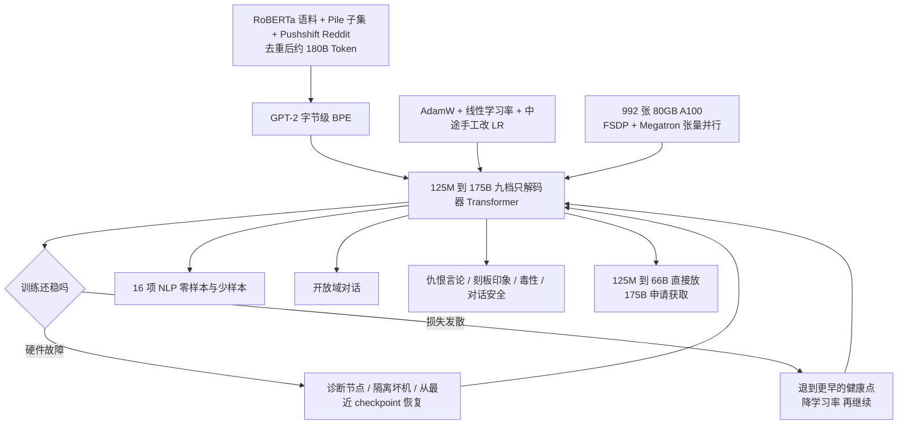
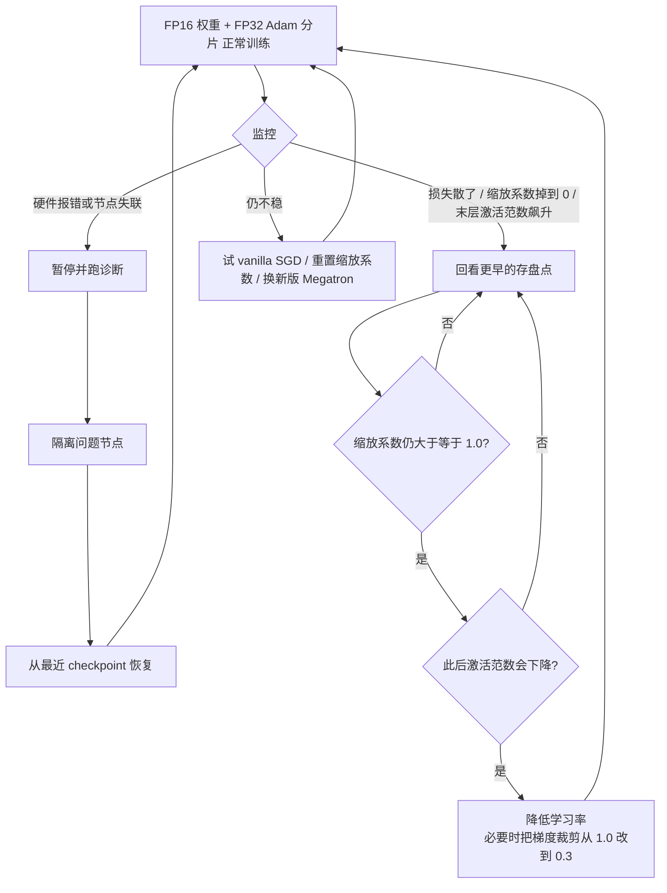

# OPT：公开复现 GPT-3 的训练日志，比再刷一张 175B 分数卡更值钱

<!-- release-date: 2022-05-03 -->

> 本文依据 Meta AI 的 **OPT: Open Pre-trained Transformer Language Models**，即 arXiv:2205.01068v4（2022-06-21），共 30 页。截至核验 arXiv 最新仍是 v4。页码均指这份 PDF。全文把三件事分开标注：**报告明确写了什么**、**我们如何解释或验算它**、**哪些是外部资料补充**。

## 读前先把几个词说成人话

这篇报告几乎不发明新架构名词。它难读的地方不在公式，而在训练现场的工程术语。先把后面会反复出现的词说清楚：

- **Token（词元）**：模型读写文本时的最小单位。OPT 沿用 GPT-2 的字节级 BPE 切分（PDF p. 2）。
- **自回归语言模型**：从左到右一个 Token 接一个 Token 地往下写。OPT 全系列都是只解码器的 Transformer，上下文长度 2048（PDF p. 2）。
- **零样本 / 单样本 / 少样本（zero-shot / one-shot / few-shot）**：评测时在输入里分别塞 0 个、1 个、K 个示例，权重不动。OPT 跟 GPT-3 用同一套提示协议（PDF p. 4）。
- **损失发散（loss divergence）**：训练损失突然炸掉，不再往下走。175B 这种规模上，它很少是「学习率设错了」这么简单，常常和硬件、数值下溢、某层激活一起发作（PDF p. 3）。
- **动态损失缩放（dynamic loss scaling）**：混合精度训练里的一个安全阀。FP16 容易下溢，系统会给损失乘一个缩放系数再反传；这个系数掉到 0，就意味着数值已经不健康了（PDF p. 3）。
- **checkpoint（检查点）**：定期把权重存盘。出事后不是从零再来，而是退回到某个更早、仍然健康的存盘点（PDF p. 3）。

报告自己反复出现的专有名字：

- **OPT（Open Pre-trained Transformers）**：从 125M 到 175B 的一套只解码器预训练模型。目标是对齐 GPT-3 的规格和成绩，并把权重、代码、训练日志一起交出来（PDF p. 1）。
- **OPT-175B**：最大的那颗，96 层、12288 维、96 个注意力头（PDF p. 2 表 1）。
- **metaseq**：他们用来训 175B 的代码库，论文把它写成实现细节的最终真源（PDF p. 1、p. 9）。
- **FSDP（Fully Sharded Data Parallel，完全分片数据并行）**：把参数、梯度和优化器状态切到所有机器上，每张卡只存自己那一份（PDF p. 3）。
- **Megatron-LM 张量并行**：把一层里的大矩阵再切开，让同一层的计算摊到多张 GPU 上（PDF p. 3）。

## 一句话先说清

OPT 不是「又一个 175B 的 GPT-3 仿制品」。

2022 年春天，100B 以上的语言模型已经能做零样本和少样本，但完整权重几乎只掌握在少数付得起账单的实验室手里。能通过付费 API 摸到的，也拿不到权重，研究不了它为什么会偏见、为什么会毒、训练时到底翻过哪些车（PDF p. 1）。

Meta 的回答不是发明新注意力，而是三件更土的事：

1. 按 GPT-3 的规格和超参，尽量原样复现一套 125M 到 175B 的模型（PDF p. 2）；
2. 用当时最新的 A100 和并行策略，把碳足迹压到 GPT-3 的约七分之一（PDF p. 1、p. 9）；
3. 把两个月训练里的硬件故障、损失发散、中途改学习率、从哪一个 checkpoint 重跑，写成可以公开的日志（PDF p. 3、p. 9）。

所以这篇最值得记住的，不是某一张 NLP 分数卡。分数卡上 OPT 大体贴着 GPT-3，少样本还略落后（PDF p. 4）。真正值钱的是这个判断：

> **闭源旗舰最稀缺的不是架构图纸，而是「把它训到 175B 而不中途死掉」的过程记录。把翻车日志公开，别人才第一次有机会研究这种规模上的失败模式，而不只是研究它的生成样品。**

### 一条阅读路线

如果只有半小时读原文，建议按这个顺序：

1. **p. 1 的发布口径**：125M 到 66B 直接放，175B 申请获取；992 张 80GB A100，每卡 147 TFLOP/s，碳足迹约七分之一。
2. **p. 2 表 1**：九档规格。后面所有曲线的横轴都在这张表里。
3. **p. 3 的 2.5 节加图 1、图 2**：硬件故障、损失发散、重启判据、中途改学习率。这是全文的技术核心。
4. **p. 4 图 3 和图 4**：零样本贴着 GPT-3，少样本落后。先看趋势，再决定要不要进附录 A。
5. **p. 6–8 的偏见与毒性表**：CrowS-Pairs 更差，RealToxicityPrompts 更高，不要先看作者的「我们也很重视 Responsible AI」。
6. **p. 9 的发布考量**：日志为什么必须公开，75 吨二氧化碳当量这个数字包不包含停机和消融。

正文第 3、4 节的分任务曲线第一次可以只看归纳。附录 E 的生成样例是失败案例，不是宣传册。

## 主要矛盾：不是怎么把模型做大，而是谁被允许研究它

论文没有从「我们做了一个更大的 Transformer」开场。它先指出一个具体的封闭循环（PDF p. 1）：

- 训一个这种规模的模型要几十万个计算日，没有显著资本几乎复制不了；
- 少数能通过 API 用到的，不给完整权重，研究不了内部机制；
- 于是稳健性、偏见、毒性这些已经被点名的问题，只能由付得起训练账单的实验室自己定义、自己评、自己决定发不发。

脚注 2 点了当时的例外：EleutherAI 的稠密模型到 20B，Salesforce 也有开放模型，Meta 自己先前放过 13B 稠密和 1.1T 稀疏，BigScience 还在做多语言大模型（PDF p. 1）。没有一个例外把「GPT-3 那个 175B 量级、可对照的稠密模型」交到研究社区手里。

于是矛盾就变成：

> 社区要研究 175B 的偏见和毒性，却拿不到 175B 的权重；能训 175B 的实验室，又很少把训练过程里那些无法做消融的中途改动写下来。

OPT 的设计选择全部服务于把这个循环切开。架构尽量跟 Brown 等人 2020 年的 GPT-3 走，是为了「减少训练不稳定性风险」，也是为了让对照实验成立（PDF p. 2）。数据用已经公开的语料，是为了让别人能讨论数据，而不只是讨论 API 输出（PDF p. 2）。把 logbook 和 metaseq 一起放，是因为许多实现细节要么被当成行规不写，要么作者自己也没意识到漏了（PDF p. 9）。

这和同仓 GPT-3 解读里那篇的主要矛盾正好对上：GPT-3 证明「少样本可以替代微调」；OPT 证明「这个结论对应的模型，也可以被社区拿到手里复盘」。两篇报告要解决的不是同一件事。

## 先看全景：一套对齐 GPT-3 的模型，加一本训练事故簿

这张图是按 PDF p. 1–9 的叙事重画的流程示意，不是论文原图。它要表达的是：OPT 的主路径不是新模块，而是「对齐规格 → 在 992 卡上撑完 300B Token → 把翻车过程留下 → 把权重按风险分层公开」。

有一个数字对值得先钉住。语料池大约 **180B Token**，学习率按 **300B Token** 衰减到峰值的 10%（PDF p. 2）。也就是说，最大模型把自己的数据看了大约 1.7 遍。GPT-3 的语料池约 499B，实际只训 300B，连一遍都没看完。两边都写「训 300B Token」，数据重复程度完全不同。这是后面少样本略落后、毒性更高时，一个不能忽略的背景。

## 核心设计一：规格表是对照实验的横轴，不是新架构

论文说得很干脆：模型和超参大体跟随 Brown 等人 2020 年的 GPT-3，改批量主要是为了算得更快；目的是透明，也是降低不稳定性（PDF p. 2）。下面这张表来自 PDF p. 2 表 1。

| 模型 | 层数 | 头数 | $d_{\text{model}}$ | 峰值学习率 | 全局 batch（Token） |
|---|---:|---:|---:|---:|---:|
| 125M | 12 | 12 | 768 | $6.0\times10^{-4}$ | 0.5M |
| 350M | 24 | 16 | 1024 | $3.0\times10^{-4}$ | 0.5M |
| 1.3B | 24 | 32 | 2048 | $2.0\times10^{-4}$ | 1M |
| 2.7B | 32 | 32 | 2560 | $1.6\times10^{-4}$ | 1M |
| 6.7B | 32 | 32 | 4096 | $1.2\times10^{-4}$ | 2M |
| 13B | 40 | 40 | 5120 | $1.0\times10^{-4}$ | 4M |
| 30B | 48 | 56 | 7168 | $1.0\times10^{-4}$ | 4M |
| 66B | 64 | 72 | 9216 | $0.8\times10^{-4}$ | 2M |
| 175B | 96 | 96 | 12288 | $1.2\times10^{-4}$ | 2M |

正文写「八个 Transformer 语言模型」（PDF p. 2），表里却是九行。这是 **我们的观察，不是论文的说明**：他们去掉了 GPT-3 的 760M，另加了 30B 和 66B，结果从八档变成九档，正文的「八」没有改。

### 跟 GPT-3 比，哪些是照抄，哪些故意改了

对照对象是 Brown 等人的表 2.1。下面这张对照是我们按两份 PDF 排的，不是 OPT 原文里的表。

| 项目 | GPT-3 175B | OPT-175B | 报告怎么说 |
|---|---|---|---|
| 层 / 头 / 宽度 | 96 / 96 / 12288 | 96 / 96 / 12288 | 规格对齐（PDF p. 2） |
| 上下文 | 2048 | 2048 | 明确写了序列长度 2048（PDF p. 2） |
| 激活函数 | GPT-2 路线，GELU | **ReLU** | OPT 只写 ReLU，没解释为什么不用 GELU（PDF p. 2） |
| 注意力 | 层间交替密集与局部带状稀疏 | 正文没提稀疏注意力 | 按字面是标准密集解码器 |
| 优化器 | Adam，$\beta=(0.9,0.95)$，权重衰减 0.1 | AdamW，同样的 $\beta$ 和衰减 | 从 Adam 换成了 AdamW（PDF p. 2） |
| 学习率策略 | 余弦衰减 | **线性**衰减到峰值的 10% | 175B 前 2000 步预热；小模型按 375M Token 预热（PDF p. 2） |
| 175B 峰值学习率 | $0.6\times10^{-4}$ | $1.2\times10^{-4}$ | 整整高一倍 |
| 175B 批量 | 3.2M Token，训练中爬升 | 2M Token，**全程恒定** | 批量改动是为了效率（PDF p. 2） |
| 梯度裁剪 | 1.0 | 先 1.0，中途降到 0.3 | 稳定性补丁，见 2.5 节（PDF p. 2–3） |
| Dropout | 论文没把 0.1 写进主文超参表 | 全程 0.1，嵌入不做 Dropout | PDF p. 2 |
| 训练 Token | 300B，语料池约 499B | 按 300B 做衰减，语料池约 180B | 重复程度更高（PDF p. 2） |

13B 这一档值得单独看一眼。GPT-3 写的是 $d_{\text{model}}=5140$，OPT 写 5120。$40\times128=5120$，OPT 这边是自洽的；GPT-3 那一处更像排版笔误。OPT 13B 的 batch 是 4M，GPT-3 是 2M；到了 66B 和 175B，OPT 反而把 batch 收回 2M。论文把这些差异归因于「计算效率」，没有做消融（PDF p. 2）。

1.3B 也不完全一样：GPT-3 是 24 头、每头 128 维，OPT 是 32 头、每头 64 维。论文没有讨论这件事。它只保证「大体跟随」，不保证每一档的头数都逐项对齐。

### 初始化：抄的是 Megatron 脚本，不是 GPT-3 论文里的那段话

权重用均值 0、标准差 0.006 的正态分布；输出层标准差再乘 $1.0/\sqrt{2L}$，$L$ 是层数；偏置全 0（PDF p. 2）。脚注指向 NVIDIA Megatron-LM 仓库里的 `pretrain_gpt3_175B.sh`。

写成公式就是：隐藏层权重

$$
W \sim \mathcal{N}(0,\ 0.006^2)
$$

输出层再缩一次

$$
\sigma_{\text{out}} = \frac{0.006}{\sqrt{2L}}
$$

175B 有 96 层，$\sqrt{2\times96}\approx13.86$，输出层标准差大约是 $4.3\times10^{-4}$。深层网络里，这个缩放是为了不让残差一路把激活放大。论文没推导，只说「跟 Megatron 的设定走」。

梯度还有一个为数值安全准备的预除因子：把按世界大小 $N$ 做的一次除法，拆成两次除以 $\sqrt{N}$，降低所有 rank 上归约梯度时溢出或下溢的风险（PDF p. 2）。992 张卡时 $\sqrt{N}\approx31.5$，这个拆法是混合精度大集群上的典型补丁，不是新算法。

### 可迁移启发

对照实验的第一件事是把横轴钉死。OPT 愿意在激活函数、学习率、批量上跟 GPT-3 不完全一样，但层数、宽度、头数、上下文长度保持可对齐，后面的「平均成绩贴着 GPT-3」才有意义。自己做复现时，**先写一张「故意对齐 / 故意改动 / 没讨论」的表**，比先调一个新模块更重要。

## 核心设计二：数据全是公开语料，但配比没有写成 GPT-3 那种表

语料是三块已经公开的数据拼起来的：RoBERTa 用过的书和新闻、The Pile 的一个子集、Pushshift.io Reddit（PDF p. 2）。主体是英文，CommonCrawl 里仍有少量非英文（PDF p. 2）。切分器用 GPT-2 字节级 BPE。去重是文档级 MinHashLSH，Jaccard 相似度 $\ge 0.95$（PDF p. 2）。最终大约 **180B Token**，附录数据卡写成对应 800 GB（PDF p. 2、p. 20）。

### 三块各装了什么

**RoBERTa 这一支**：BookCorpus、Stories，以及更新到 2021 年 9 月 28 日的 CCNews v2，预处理与当年 RoBERTa 的 CCNews 相同（PDF p. 2）。GPT-3 的 CommonCrawl 截止在 2019 年；OPT 的新闻要新将近两年。这是报告写了的事实，它没有据此声称「更新的新闻带来了更高的知识截止」。

**The Pile 这一支**：留下 CommonCrawl、DM Mathematics、Project Gutenberg、HackerNews、OpenSubtitles、OpenWebText2、USPTO 和 Wikipedia。其他子集被丢掉，判据是：在 1.3B 规模上容易把梯度范数打出尖峰，或者「因其他原因不合适」（PDF p. 3）。所有留下的子集又做了临时的空白字符规范化。

这里有一条很具体的工程经验：**用 1.3B 当金丝雀，决定 175B 敢不敢吃这份数据。** 175B 试一份新数据的代价是一次发散可能要退回几天前的 checkpoint；1.3B 上的梯度尖峰便宜得多。论文没把「不合适」的子集名单写全，只写了留下的那些。

另外一句几乎是对后来所有用 The Pile 的人说的：他们发现 Pile 里重复文档特别多，建议后来者务必再做一遍去重（PDF p. 2）。

**Reddit 这一支**：来自 Baumgartner 等人的 Pushshift 语料，先前 BlenderBot 也用过。对话是树，语言模型要的是文档，于是他们在每个线程里只抽最长的一条评论链，其余路径丢掉，语料量减少约 66%（PDF p. 3）。

这不是中性的预处理。最长链保留的是「这个帖子里最深的那串来回」，往往更吵、更情绪化、也更可能带攻击性。后面 CrowS-Pairs 和毒性指标变差，论文自己把原因指回这里（PDF p. 6–7）。不要把 66% 只读成「压缩比」。

### 报告没写的配比

GPT-3 给过一张采样权重表：CommonCrawl 占池子八成以上，训练时只拿 60% 的权重；Wikipedia 只有 3B Token，却被过了 3.4 遍。OPT **没有**给出各来源的采样权重，只说是 concatenation（拼接）（PDF p. 2）。数据卡把验证集写成「按各数据集在预训练语料中的体量比例，随机留出约 200MB」（PDF p. 20），这暗示训练时大体按体量混合，而不是按质量重加权。

**这是报告没公开的实现细节，不要补。** 后面把 OPT 的毒性、刻板印象和「Reddit 太多」连起来，是论文自己的推测（PDF p. 6–7），有方向，没有各来源的精确比例来做因果证明。

### 可迁移启发

去重阈值、金丝雀模型和「对话树怎么压成文档」，每一项都会进入模型的性格。OPT 把这三件事写进了正文，却把采样权重留给了沉默。自己做预训练数据卡时，**拼接不是配比**；没有权重表，就无法回答「Reddit 到底占了多少」。

## 核心设计三：992 张 A100 把碳足迹压到约七分之一

硬件和并行写在 2.4 节（PDF p. 3）：

- 992 张 80GB A100；
- FSDP 加 Megatron-LM 张量并行；
- 单卡利用率最高 **147 TFLOP/s**；
- Adam 状态用 FP32，因为已经切到所有机器上；权重保持 FP16；
- 用动态损失缩放避免下溢。

引言里把同一套数字又说了一遍，并给出碳足迹结论：靠这套实现，再加上当时最新一代 NVIDIA 硬件，OPT-175B 的开发碳足迹大约是 GPT-3 的七分之一（PDF p. 1）。p. 9 给出被除数和除数：OPT-175B 约 **75 吨** CO2eq，GPT-3 约 **500 吨**（引 Patterson 等人 2021），Gopher 约 380 吨。$75/500=0.15$，约等于七分之一。这个除法成立。

脚注 10 立刻把这个「七分之一」拆开：如果把消融、小模型基线和停机算进去，他们自己估计总成本大约再乘 2（PDF p. 9）。也就是说，**对外宣传的 75 吨是「当前这个 175B 跑完」的账，不是「整个项目活过这两个月」的账。** 乘 2 之后是约 150 吨，仍低于 GPT-3 的 500 吨，但已经不是七分之一。

论文自己强调：这些数字的会计口径并不统一；训练只是 AI 系统碳足迹的一块，实验和日后的推理都还没算；硬件制造本身的隐含碳也几乎没人算（PDF p. 9）。公开 logbook 的一个明确目的，就是让人看见「假设没有硬件故障、没有训练不稳定性」的理论值和「把整个开发周期算进去」的真实值之间的缝（PDF p. 9）。

并行策略上，论文还写了一句很硬的话：当时这是已知唯一能在 NVIDIA GPU 上、**不用流水线并行**、把只解码器 Transformer 训到 $\ge$175B 的开源实现（PDF p. 9）。FSDP 负责跨机切状态，张量并行负责一层之内切矩阵。不用流水线，就少了一类「微批和气泡」的调度复杂度，代价是通信模式不同。报告没有给出并行度切分（张量并行度是几、FSDP 组有多大），这些要到 metaseq 里看。论文把代码库称作「许多实现细节的最终真源」（PDF p. 9）。

### 可迁移启发

报碳足迹时，把「最终那一次训练」和「含停机、含消融、含重跑」分成两行。OPT 已经示范了：只报前一行会得到七分之一，加上后一行就变成大约三分之一。任何大规模训练的成本回顾，缺了第二行都是在报理论值。

## 核心设计四：训练过程本身，就是这篇报告的主贡献

2.5 节只有一页，却是全文信息密度最高的一页（PDF p. 3）。它记录的不是「我们用了 AdamW」，而是「AdamW 在 175B 上会在哪些地方死掉，我们当时怎么救」。

### 硬件故障：两个月，至少 35 次手工重启

训练 OPT-175B 的集群硬件故障很多。合计：至少 35 次手工重启，两个月里轮换了超过 100 台主机（PDF p. 3）。手工重启的流程是：

1. 把训练暂停；
2. 跑一组诊断，找出有问题的节点；
3. 把被标记的节点隔离（cordon off）；
4. 从最近保存的 checkpoint 恢复。

被轮换掉的主机数，明显高于手工重启次数。他们据此估计，还有 **70 次以上**因硬件故障触发的自动重启（PDF p. 3）。

我们来算一下量级，这是解释不是原文：两个月大约 60 天，35 次手工加 70 次自动，大约 100 次中断，平均不到一天就要处理一次。论文没有给出墙钟时间和有效训练时间的比，但「至少」和「超过」这两个词已经说明，175B 的训练日历不是一条平滑的斜线。

### 损失发散：降学习率，退到更早的点，而不是硬扛

损失也会散。散了之后，他们发现有效的办法是：**把学习率降下来，并从更早的 checkpoint 重启**，任务才能恢复（PDF p. 3）。他们观察到三件事常常一起出现：

- 损失发散；
- 动态损失缩放系数掉到 0；
- 最后一层激活的 $L^2$ 范数突然飙升。

于是重启点不是「最近一次存盘」，而是要同时满足：

- 动态损失缩放系数仍处于健康状态（$\ge 1.0$）；
- 从这一点继续，激活范数会往下走，而不是无界增长。

这是一套用监控指标定义的回退策略，不是「损失变大了就 reload」。图 1 是实际走出的学习率，不是开训前写在配置文件里的那条直线（PDF p. 3）。

按 PDF p. 3 的文字重画，是机制示意，不是某一次故障的时间轴。

### 图 1 和图 2 实际长什么样

图 1 的横轴是 iteration，大约从 0 走到 140k（PDF p. 3）。我们从图上读到，而不是从某个表里抄到：

- 起点就是 175B 的峰值 $1.2\times10^{-4}$；
- 前大约 35k–40k 步大体按线性往下；
- 之后出现一串台阶式的急降：40k 附近削一刀，50k 附近再削到大约 $4\times10^{-5}$，60k 附近再到大约 $2\times10^{-5}$；
- 终点大约 $1\times10^{-5}$，接近「衰减到峰值 10%」的计划值，但中间那些台阶是计划外的。

图注写得很直白：降低学习率有助于避开不稳定性（PDF p. 3）。

图 2 是验证集困惑度（PDF p. 3）。从图上读：

- 大约 8k 步时还在 10 附近；
- 平滑降到大约 80k 步、7.5 附近；
- 学习率急降的位置，困惑度曲线也有折点；
- 80k 之后变平，终点大约 7.6，略有回抬。

图注说：中途改学习率，对验证困惑度有清楚的影响（PDF p. 3）。论文没有说「每一次降 LR 都让验证变好」，只说影响是可见的。结合 180B 的语料池和 300B 的计划训练量，后期变平甚至回抬，和「把同一批数据看过一遍半」是相容的。这是我们的解释；论文在 p. 9 引用 Chinchilla 的结论时，也承认许多大模型按数据量看是训练不足的，继续加数据可能还会涨——那是另一方向的判断，和这条验证曲线的后期变平并不互相取消。

### 其他中途试验，有的立刻被打回

同一节还记了三次「飞行中改动」（PDF p. 3）：

1. **切到 vanilla SGD**。优化很快平台期，他们切回 AdamW。
2. **重置动态损失缩放系数**。能救回一部分发散，不是全部。
3. **换新版 Megatron**。降低了激活范数的压力，还提高了吞吐。

梯度裁剪从 1.0 降到 0.3，也是早期为了稳（PDF p. 3）。精确到哪一步改了什么，论文指向单独发布的 logbook。

这些改动有一个共同的方法学困境，论文在 p. 9 自己写了：中途改的东西没法做干净消融，除非把计算预算再翻一倍以上。所以以往的大模型论文干脆不提。OPT 选择把「当时为什么这么改」写下来，即使改动本身无法被严格证明是最优的。

### 可迁移启发

175B 的训练状态机不是「一个学习率公式走到底」，而是「监控指标 → 回退到健康点 → 改一个能立刻起效的旋钮」。可直接搬走的不是 $1.2\times10^{-4}$ 这个数字，而是重启判据的写法：把「健康」定义成可观测的量（缩放系数、末层激活范数），而不是定义成「loss 看起来还行」。在自己的稳定训练栈里，至少要有这两个量的时间序列，否则出事后只能赌最近一次存盘。

## 评测：零样本贴着 GPT-3，少样本落后，对话零样本能打过监督模型

### 协议先对齐，再谈分数

16 项 NLP：HellaSwag、StoryCloze、PIQA、ARC Easy / Challenge、OpenBookQA、WinoGrad、WinoGrande，以及 SuperGLUE（PDF p. 4）。提示和整体设定跟 GPT-3 走。指标统一用准确率，MultiRC 和 ReCoRD 的 F1 故意不算，为了量纲一致。WSC 按 GPT-3 的办法改成选择题，论文提醒这种形式化本身就会改分数（PDF p. 4）。

平均曲线里 **故意拿掉 MultiRC 和 WIC**，因为这两项会系统性偏袒 GPT-3 或 OPT 其中一方（PDF p. 4）。读图 3、图 4 之前先记住这个过滤器，否则会把「平均贴着」读成「每项都贴着」。

### 零样本：趋势对齐，分任务完全不是一回事

图 3 是 14 项零样本平均（PDF p. 4）。从图上读：两条线从大约 $10^8$ 参数、50 分附近，走到大约 $10^{11}$ 参数、70 分附近，OPT 实线大体贴着 GPT-3 虚线。论文的文字归纳是：10 项大致匹配，3 项落后（点名 ARC Challenge 和 MultiRC），3 项随规模表现不可预测（CB、BoolQ、WSC），原因很可能是验证集太小，分别只有 56、277、104 条（PDF p. 4）。

WIC 是个特例。OPT 在所有规模上都高于 GPT-3。但 Brown 等人报过 WIC 准确率 0%——二分类任务上这等于把标签写反就会变成 100%。论文直接说这个数字看起来可疑（PDF p. 4 脚注 5）。

MultiRC 他们用 Davinci API 在自己的评测栈里复现不了 GPT-3 论文的数字，于是怀疑评测方法有差（PDF p. 4）。**对齐 GPT-3 这件事，在协议层已经做不到完全对齐。** 这不是 OPT 单方面的问题，是闭源模型只留 API、不留评测代码的后遗症。

附录 A 图 6 把 16 项拆开（PDF p. 17）。我们从图上读到的、论文也承认的「高度不规则」包括：

- HellaSwag、StoryCloze、PIQA、ARC Easy、Winogrande、ReCoRD：OPT 与 GPT-3 走得很近；
- ARC Challenge：大尺度上 OPT 低于 GPT-3；
- MultiRC：GPT-3 明显高于 OPT；
- WIC：GPT-3 一条贴地的 0 线，OPT 在 50 附近；
- CB、WSC、BoolQ：两边都在验证集噪声里抖动。

同一张图还画了 PaLM、Chinchilla、Gopher、Eleuther、Jurassic。PaLM 在多数任务上更高，论文的推测是预训练数据质量与多样性，不是参数量本身（PDF p. 4）。这是作者观察，没有数据消融。

### 少样本：平均落后，而且落后发生在「示例本该更有用」的地方

图 4 画 0 / 1 / 32 shot（PDF p. 4）。论文的原话是：OPT 的单样本和少样本落后于 GPT-3，但分任务差异很大。从图上读，大尺度上 GPT-3 的 32-shot 把三条线拉开，OPT 的 32-shot 没有同等幅度的上扬。这和 GPT-3 论文自己的核心主张——「更大的模型更会从上下文里学」——正好形成对照：OPT 把规格对齐了，把「随规模拉开 zero/few 差距」这件事对齐得不那么好。

可能的原因论文没做因果分析。我们能列出、但不能写成结论的候选是：语料更小更重复、没有 GPT-3 那种质量重加权、激活函数和学习率不同、评测栈不完全可复现。报告把这些并排放在那里，没有指出哪一个是主因。

附录 A 图 7 是 16 项的 0/1/32 shot 分解（PDF p. 18）。和零样本一样，HellaSwag 一类任务平滑，BoolQ / CB / WSC / MultiRC / WIC 继续乱。WIC 上 GPT-3 依然贴地。谁要是只引用图 4 的平均线，会把这些失败藏掉。

### 对话：无监督 175B，打得过一些监督微调的 2.7B

对话评测跟 BlenderBot 那套走：ConvAI2、Wizard of Wikipedia、Empathetic Dialogues、Blended Skill Talk，外加更晚的 Wizard of Internet（PDF p. 5）。对照是 Reddit 2.7B（无监督）、BlenderBot 1 和 R2C2 BlenderBot（监督）。困惑度全部归一到 GPT-2 词表。OPT-175B 用贪心解码，最多 32 个 Token，提示只有交替的 `Person 1:` / `Person 2:`（PDF p. 5）。

表 2 在 PDF p. 6：

| 模型 | 设定 | C2 PPL | WW | ED | BST | WoI | C2 F1 | WW | ED | BST | WoI |
|---|---|---:|---:|---:|---:|---:|---:|---:|---:|---:|---:|
| Reddit 2.7B | 无监督 | 18.9 | 21.0 | 11.6 | 17.4 | 18.0 | .126 | .133 | .135 | .133 | .124 |
| BlenderBot 1 | 监督 | **10.2** | 12.5 | **9.0** | 11.9 | 14.7 | .183 | .189 | .192 | .178 | .154 |
| R2C2 BlenderBot | 监督 | 10.5 | **12.4** | 9.1 | **11.7** | 14.6 | **.205** | **.198** | **.197** | **.186** | **.160** |
| OPT-175B | 无监督 | 10.8 | 13.3 | 10.3 | 12.1 | **12.0** | .185 | .152 | .149 | .162 | .147 |

OPT-175B 全面超过同样无监督的 Reddit 2.7B；在 ConvAI2 上接近完全监督的 BlenderBot 1。Wizard of Internet 上它拿到最低困惑度 12.0，Unigram F1 仍低于带 Wizard-of-Wikipedia 监督的模型（PDF p. 5–6）。

他们自己也怀疑 ConvAI2 是否漏进了预训练或验证集。查过预训练语料里的第一段 ConvAI2 对话，没找到重叠；从未公开的 ConvAI2 隐藏测试集上是 10.7 PPL、.185 UF1，和验证集一致；在 MultiSessionChat 子集上是 9.7 PPL、.177 UF1。MSC 和 WoI 都发布在他们所用 CommonCrawl 快照之后，泄漏风险低（PDF p. 5）。结论是：OPT-175B 能在多轮对话里维持一致人设。这是报告的判断，证据是跨数据集的稳定性，不是某一项 SOTA。

## 偏见与毒性：数字比「Responsible AI」这一节的标题更直白

第 4 节的对照对象换成了 GPT-3 Davinci，因为这些基准在 GPT-3 论文发表时还没有（PDF p. 5）。论文开场就承认这些基准有缺陷，但仍把它们当作理解危害的第一步（PDF p. 5）。下面按表走，不替他们圆。

### 仇恨言论检测：OPT 更高，原因可能并不光荣

ETHOS 数据，问模型一段英文是不是种族歧视或性别歧视。少样本多分类还多一个 neither（PDF p. 5–6）。表 3（PDF p. 6）：

| 设定 | Davinci | OPT-175B |
|---|---:|---:|
| 零样本 | .628 | **.667** |
| 单样本 | .616 | **.713** |
| 少样本（二分类） | .354 | **.759** |
| 少样本（多分类） | .672 | **.812** |

OPT 全面更高。论文给了两个推测，都不是「我们的对齐更好」（PDF p. 6）：

1. 走 Davinci API 可能已经带上了 GPT-3 原论文里那只 175B 之外的安全控制；
2. 预训练里有大量未审核的社交媒体讨论，模型更熟悉这类文本，所以更会做这种分类。

第二条把「更会识别仇恨言论」和「更会生成仇恨言论」焊在同一块数据上。后面的毒性实验会把焊缝拉开。

### CrowS-Pairs：除了宗教，全部更刻板

九个类别，分数越高越刻板，越低越公平（PDF p. 6）。表 4：

| 类别 | GPT-3 | OPT-175B |
|---|---:|---:|
| 性别 | **62.6** | 65.7 |
| 宗教 | 73.3 | **68.6** |
| 种族 / 肤色 | **64.7** | 68.6 |
| 性取向 | **76.2** | 78.6 |
| 年龄 | **64.4** | 67.8 |
| 国籍 | **61.6** | 62.9 |
| 残疾 | **76.7** | 76.7 |
| 外貌 | **74.6** | 76.2 |
| 社会经济地位 | **73.8** | 76.2 |
| 总体 | **67.2** | 69.5 |

OPT 总体 69.5 对 GPT-3 的 67.2，更差。唯一赢的是宗教。论文把原因指向训练数据：Nangia 等人 2020 年已经测过，Pushshift Reddit 的刻板与歧视文本发生率高于 Wikipedia 一类语料；Reddit 是 OPT 的主来源之一，模型可能学到了更多歧视性共现（PDF p. 6）。

**这不是「基准有噪声所以无所谓」。这是论文自己写的因果方向。** 识别仇恨言论的那点优势，和这里的劣势，用的很可能是同一份 Reddit。

### StereoSet：总体接近，职业和种族上 Davinci 更好

四个类别，再加总体。LMS 是语言建模分，越高越好；SS 是刻板印象分，越低越好；ICAT 把两者合成，越高越好（PDF p. 6–7）。他们按 Token 数而不是字符数归一化，和 Jurassic-1 的报告不同。表 5（PDF p. 7）：

| 类别 | 指标 | Davinci | OPT-175B |
|---|---|---:|---:|
| 职业 | LMS / SS / ICAT | **78.4** / 63.4 / **57.5** | 74.1 / **62.6** / 55.4 |
| 性别 | LMS / SS / ICAT | **75.6** / 66.5 / 50.6 | 74.0 / **63.6** / **53.8** |
| 宗教 | LMS / SS / ICAT | 80.8 / **59.0** / 66.3 | **84.0** / **59.0** / **68.9** |
| 种族 | LMS / SS / ICAT | **77.0** / 57.4 / **65.7** | 74.9 / **56.8** / 64.8 |
| 总体 | LMS / SS / ICAT | **77.6** / 60.8 / **60.8** | 74.8 / **59.9** / 60.0 |

总体 ICAT 几乎打平（60.8 对 60.0）。拆开看：Davinci 语言建模分更高，OPT 刻板印象分更好；职业和种族的合成分仍是 Davinci 高，性别和宗教是 OPT 高。论文说「总体相似」，这句话成立，但相似的是合成分，不是「两边偏见一样」。

### RealToxicityPrompts：三条线里 OPT 最高

跟 PaLM 的设定走：随机 10,000 条提示，每条用 nucleus sampling（$p=0.9$）抽 25 段、每段 20 个 Token，按提示毒性分桶，报续写的平均毒性概率（PDF p. 7）。图 5 的三条线从下到上是 PaLM、Davinci、OPT-175B。OPT 全程在上面。三条线都随提示毒性上升，和 PaLM 报告里的观察一致（PDF p. 7）。

论文没有在正文里给每个桶的精确数字。我们从图上读：提示毒性接近 0 时，OPT 大约 0.13、Davinci 大约 0.12、PaLM 大约 0.08；提示毒性接近 1 时，OPT 大约 0.42、Davinci 大约 0.38、PaLM 大约 0.32。这些是读图，不是表格。方向没有歧义：**OPT-175B 比 Davinci 和 PaLM 都更容易接着写出有毒内容。**

作者再次把原因指回未审核的社交媒体文本：熟悉毒性语言，既提高检测，也提高生成（PDF p. 7）。他们写得很明确：这强熟悉度好不好，取决于下游任务；未来使用 OPT-175B 应该考虑这一点，做额外缓解，或者在不合适的场景里干脆不用。

### 对话安全：和无监督 Reddit 2.7B 一档，明显差于经过安全微调的模型

SaferDialogues 衡量「说错了会不会道歉」；Safety Bench Unit Tests 按 Safe / Realistic / Unsafe / Adversarial 四档衡量回复有多不安全，越低越好（PDF p. 7）。表 6（PDF p. 8）：

| 模型 | PPL | F1 | Safe | Realistic | Unsafe | Adversarial |
|---|---:|---:|---:|---:|---:|---:|
| Reddit 2.7B | 16.2 | .140 | .300 | .261 | .450 | .439 |
| BlenderBot 1 | **12.4** | **.161** | .028 | .150 | .250 | .194 |
| R2C2 BlenderBot | 13.8 | .160 | **.022** | **.133** | .289 | .222 |
| OPT-175B | 14.7 | .141 | .033 | .261 | **.567** | .283 |

OPT-175B 总体和 Reddit 2.7B 一档，Safe 和 Adversarial 略好，**Unsafe 明显更差**（.567 对 Reddit 的 .450、BlenderBot 的 .250）。论文的结论不是「175B 更大所以更安全」，而是：在精心整理过的对话数据上微调过的模型，毒性整体更低；以后若要把 OPT-175B 当对话模型用，应该先做这种微调（PDF p. 8）。

### 不要把这一节读成「开源模型原罪」

报告在限制一节写：他们的首要目标是复现 GPT-3，所以这一版**故意没有**上已有的毒性与偏见缓解方法（PDF p. 8）。这是一个选择，不是技术做不到。数字反映的是「按 GPT-3 的目标、用带 Reddit 的公开数据、不做缓解」的模型，不是「开源」本身。把毒性更高写成开源的必然代价，是在帮一个报告没做的因果推论圆场。

## 发布策略：66B 及以下直接放，175B 申请获取

引言和模型卡把分层写死了（PDF p. 1、p. 24）：

- **125M 到 66B**：直接发布；
- **OPT-175B**：应请求提供完整研究权限；
- 对象：学术研究者；政府、公民社会和学术机构的人员；工业界研究实验室；
- 许可证：非商用。模型卡指向 metaseq 里的 `MODEL_LICENSE.md`（PDF p. 24）。

v4 写的是已经放到 66B。这是这份 PDF 的口径。不要用后来的传播文章改写这一句。

模型卡还写了日期：OPT-175B 于 2022 年 5 月 3 日发布，版本 1.0.0，开发者 Meta AI（PDF p. 24）。预期用途是语言模型与 Responsible AI 研究，预期用户是研究者；**明确不用于生产或真实世界部署**（PDF p. 24）。限制一节的原话是：这项技术用于商业部署仍不成熟（PDF p. 8）。

p. 9 把「为什么要分层」讲成两件事：让研究社区先量化局限，再谈更广泛的商业部署；同时避免人人再训一个 175B，把碳成本再乘一遍。提供 175B 权重的理由也是这两条：做 Responsible AI 研究，以及减少别人重复训练的环境成本（PDF p. 9）。

代码和日志的定位比权重更彻底。logbook 被写成开发周期问责的一部分：它披露的不只是当前这版 OPT-175B 用了多少算力，还有基础设施或训练过程在这个规模上失稳时的人力开销（PDF p. 9）。这些细节以往论文通常省略，因为中途改动没法做消融。metaseq 则被写成「标准实践里没写进论文、或作者自己漏了」的那些细节的落点（PDF p. 9）。

### 可迁移启发

开放不是一个开关。OPT 把「小模型直接放、大模型申请、许可证非商用、日志全放、代码全放」拆成五件事。自己做发布时，也可以按风险分层，但要把每一层的理由写成可检查的句子，而不是一句「我们很负责任」。

## 限制：报告自己划的边界，比分数更有用

第 5 节承认：标准 NLP 上与 GPT-3 大致持平，安全与偏见上也大体可比，但这些评测可能刻画不了全部局限；定性观察是，OPT-175B 踩中了其他 LLM 已经被写下的那些坑（PDF p. 8）。具体有四条。

**指令跟不会。** 陈述句指令或直截了当的问句，模型倾向模拟一段以这句指令开头的对话，而不是执行指令（PDF p. 8）。他们指向 InstructGPT 那类指令学习作为未来工作。这意味着 2022 年春天这个 175B，还不是后来人们默认的「聊天接口」。

**容易重复，会卡死循环。** 采样能降低发生率，但只抽一条生成时，他们凭印象发现重复并没有消失（PDF p. 8）。建议后来者考虑 unlikelihood training 或 best-first decoding。

**会一本正经地胡说。** 和其他 LLM 一样会产生事实错误；在医疗和科学发现这类对准确性敏感的场景里尤其有害。他们相信检索增强会有帮助，这一版没做（PDF p. 8）。

**有毒、刻板，无害提示也会触发；对抗提示很好找。** 缓解方法文献已经一长串。他们选择这一版不上缓解，因为首要目标是复现 GPT-3（PDF p. 8）。

最后一段把数据实践和评测实践各打一枪：当前做法是把能喂的数据尽量喂进去，选择很少；评测本应更流水线、更一致，提示风格和 shot 数会造成无法复现的差异（PDF p. 8）。公开 OPT，是为了让更多人来做这两件事。

这些限制是作者观察加文献引用，不是新实验。价值在于他们没有在「平均成绩贴着 GPT-3」之后把这一页删掉。

## 附录里还有三件正文没展开的事

### 附录 A：分任务曲线，用来打脸平均值

图 6、图 7 已经在评测一节用过（PDF p. 17–18）。附录存在的理由，就是正文那句「分任务差异极大」。平均值是给趋势用的，决策要用分任务图。WIC 的 0%、CB 和 WSC 的抖动、MultiRC 的系统性落后，只出现在这里。

### 附录 B：175B 不是一个人训完的

贡献清单把「训和盯 OPT-175B」写成一份十人名单，把 125M–66B 基线写成另一份三人名单，评测再按 NLP / 对话 / Responsible AI 拆开（PDF p. 19）。这和 p. 9 说的「人力开销」对得上：这个规模的不稳定，需要有人在两个月里值班看曲线、做诊断、决定从哪一个 checkpoint 重跑。logbook 是给后来者看的值班记录，不是附录里的致谢。

### 附录 C 数据卡：800 GB、200 MB 验证、明确写了冒犯性内容

按 Gebru 等人的 Datasheets 模板（PDF p. 19–23）。需要记住的几条：

- 五类来源的并集，目的是在宽语料上预训练，强调人类写的文本（PDF p. 19）；
- 180B Token、800 GB；验证集约 200 MB，按各来源体量比例抽样（PDF p. 20）；
- CommonCrawl 和 Reddit 的子集「如果直接阅读，可能冒犯、侮辱、威胁，或引起焦虑」（PDF p. 21）；
- CC-News 的英文新闻爬取区间是 2016 年 9 月到 2021 年 9 月（PDF p. 21）；
- 预处理包括去掉「Chapter One」「This ebook by Project Gutenberg」这类重复且无信息的文字（PDF p. 22）；
- **数据集目前不向第三方分发**（PDF p. 23）。权重可以申请，训练数据不行。

「不向第三方分发」和「全部用公开数据」可以同时成立：成分公开，并集和去重后的那一份 800 GB 不公开。想严格复现数据，只能按名单自己再走一遍流水线，且去重实现未必能对上。

### 附录 D 模型卡：生产禁用，版本 1.0.0

前面发布策略已经用过。补充两条：问询邮件写的是 `{susanz,roller,namangoyal}@fb.com`；更多细节指向 Meta AI 研究博客和 metaseq（PDF p. 24）。推荐的未来工作就是第 6 节那些：让更多声音来定义风险（PDF p. 25）。

### 附录 E：故意同时展示成功和失败

提示加粗，其余是续写。作者写明这些例子是故意挑来同时展示成功和失败的（PDF p. 26）。

- 图 8：以「performance reviews」为题写诗，能写得俏皮，但他们很难让模型遵守韵脚和节奏（PDF p. 26）。
- 图 9：把模型提示成自由女神像，会进入爱国人设（1886 年以来、欢迎移民），随后滑进「冰淇淋、红白蓝、狗」这种又简单又重复的回答（PDF p. 26）。这和限制一节「卡死循环」是同一类失败。
- 图 10：简单的德、西、法、中翻译，作者 anecdotal 地觉得有有限的成功；OPT 并不是按多语言目标训的（PDF p. 27）。
- 图 11：用「1. Introduction」比用「Abstract」更容易写出有意思的续写；提示灵感来自 ResNet 论文第一句（PDF p. 28）。生成的是一段关于「网络容量」的空转学术散文，结构像论文，内容并不真的在做 ResNet 做过的事。
- 图 12：加法 few-shot 能续对（$2+5=7$，$12+9=21$）；一换成减法，把 $12-9$ 写成 $-3$；乘法把 $12\times9$ 写成 $102$；除法把 $12/3$ 写成 $9$。图注：从加法扩到其他运算就会出错（PDF p. 29）。
- 图 13：Python 生成里，只换一个变量名，输出就会变（PDF p. 30）。

这些样例不是能力展览。它们把限制一节的「不会执行指令、会重复、会算错」变成可以指着看的文本。

## 实验支持、作者观察、没有公开的，分开写

**被实验支持的：**

- 九档规格可以训完，175B 在 992 张 80GB A100 上达到每卡最高 147 TFLOP/s（PDF p. 1、p. 3）；
- 14 项零样本平均随规模贴着 GPT-3（PDF p. 4 图 3）；
- 无监督对话在 ConvAI2 上接近监督 BlenderBot 1，隐藏测试集和 MSC 上没有明显泄漏迹象（PDF p. 5–6）；
- CrowS-Pairs 总体更差、RealToxicityPrompts 更高、对话 Unsafe 更差，这些是表和图上的测量（PDF p. 6–8）；
- 仇恨言论检测 F1 高于 Davinci API（PDF p. 6）。

**只是作者观察或推测的：**

- PaLM 更强主要来自数据质量与多样性（PDF p. 4）；
- 仇恨言论检测优势来自 Reddit 和 Davinci 的安全层（PDF p. 6）；
- CrowS-Pairs 劣势来自 Reddit 的歧视文本发生率（PDF p. 6）；
- 毒性生成更高同样来自社交媒体熟悉度（PDF p. 7）；
- 中途降学习率是避开不稳定性的有效手段——有图 1、图 2 的相关性，没有对照实验（PDF p. 3）；
- 指令会变成「假装在对话」，采样去不掉全部重复（PDF p. 8）。

**报告没有公开、不能补的：**

- 各数据来源的采样权重和精确 Token 占比；
- 张量并行度、FSDP 组大小、主机拓扑；
- 墙钟时间、有效训练时间、自动重启的精确次数（70+ 是估计）；
- 每一次中途改 LR 对应的绝对步数，正文只给图，细节在 logbook；
- 被丢掉的 Pile 子集完整名单；
- 去重之后那份 800 GB 并集的获取方式。

## 论文之后发生了什么

以下不是 OPT 报告的内容，是外部补充，用来把 2022 年 5 月这份材料放回时间线。不要把它们读回「报告写了什么」。

- **套件的首次对外可用日是 2022-05-03，不是 arXiv v1 的 2022-05-02。** 论文模型卡写「OPT-175B was released on May 3, 2022」（PDF p. 24）。Meta 官方博客 [Democratizing access to large-scale language models with OPT-175B](https://ai.meta.com/blog/democratizing-access-to-large-scale-language-models-with-opt-175b/) 标注 May 3, 2022，并给出小模型下载与 175B 申请入口。GitHub `facebookresearch/metaseq` 的 [Initial commit](https://github.com/facebookresearch/metaseq/commit/f2cd36798793604cf51ab8b8a2cb167c964f9667) 在 2022-05-03。arXiv v1 是 2022-05-02 17:49 UTC 的论文投稿，当天公众还拿不到权重和代码。按「官方渠道首次向公众开放使用」取 2022-05-03。v4 只是 2022-06-21 的修订，不回写这个日期。
- **logbook 是独立 PDF，不是本报告的一节。** 论文指向 [OPT175B_Logbook.pdf](https://github.com/facebookresearch/metaseq/blob/main/projects/OPT/chronicles/OPT175B_Logbook.pdf)。仓库里的 [chronicles](https://github.com/facebookresearch/metaseq/tree/main/projects/OPT/chronicles) 还有阶段性更新。那些文档里出现的「约 33 天、1024 张 A100、$4.30\times10^{23}$ FLOPs」等数字，**不是**本 PDF 的数字；本 PDF 写的是 992 张卡和 75 吨。两边不一致时，以本 PDF 为准。
- **66B 的「已经放出」是 v4 才写进引言的。** 2022-05-03 的官方博客仍写 66B「即将放出」。不要把博客当天的清单和 v4 引言混成同一天的事件。
- **Chinchilla 的「训练不足」判断，OPT 自己已经引了**（PDF p. 9，Hoffmann 等人 2022）。后来用更多 Token 训同规格模型会更好，是这条引用的推论，不是后人第一次发现。
- **下一代 Meta 开源基模不在本报告里。** 2023 年的 LLaMA 和 2024 年的 Llama 3 是另一组材料，架构、数据、许可证和发布策略都变了。不能把后来「更干净的数据、更长的训练、更宽松的许可证」写进 OPT 的成绩。

## 最值得带回自己项目的七条

### 1. 复现闭源旗舰，先复现对照轴，再省计算

OPT 把层数、宽度、头数、上下文长度钉在 GPT-3 上，再在批量、学习率、激活函数上做工程改动（PDF p. 2）。对照实验死在「每一档都略有不同」上的项目很多。先写那张「对齐 / 改动 / 未讨论」表。

### 2. 用小模型当数据的金丝雀

Pile 子集进不进 175B，判据是 1.3B 上的梯度范数尖峰（PDF p. 3）。175B 上试一份脏数据，代价是一次发散加一次回退。任何贵的训练，都应该有一个专门用来淘汰数据的便宜模型。

### 3. 对话树压成文档的方式，会进入模型的性格

只留最长评论链、砍掉 66%，不是无损压缩（PDF p. 3）。CrowS-Pairs 和毒性指标随后变差，论文自己把原因指回 Reddit（PDF p. 6–7）。预处理选择要当作安全决策写进数据卡，不要当作仓储细节。

### 4. 重启判据写成可观测的量，不要写成「感觉 loss 还行」

健康点 = 损失缩放系数 $\ge 1.0$，且此后末层激活范数下降（PDF p. 3）。把这两个量记进训练监控，出事后才有可执行的回退，而不是在最近的十个 checkpoint 里抓阄。

### 5. 中途改动写下来，即使做不了消融

降 LR、改裁剪、换 Megatron 版本、试 SGD 再退回，没有一项能在 175B 上做干净消融（PDF p. 3、p. 9）。OPT 仍然把它们写成文字。稳定训练的知识很多存在值班记录里，不存在最终超参表里。

### 6. 碳足迹报两行：最终一次，和含停机的全周期

75 吨对 500 吨得到七分之一；含消融、基线和停机大约再乘 2（PDF p. 9）。只报第一行，是在报没有故障的理论世界。

### 7. 安全数字不要和发布叙事绑在一起美化

仇恨言论检测更高、刻板印象更重、毒性续写更多、Unsafe 对话更差，可以同时为真（PDF p. 6–8）。它们很可能来自同一份未审核社交媒体数据。发布叙事是「让更多人研究危害」，不是「这个模型已经更安全」。

## 关键词回看

- **OPT / OPT-175B**：对齐 GPT-3 规格的开源只解码器模型套件，最大 175B。
- **metaseq**：训练与推理代码库，论文把它当作实现细节的最终真源。
- **FSDP**：完全分片数据并行，参数、梯度和优化器状态切到所有机器。
- **张量并行（tensor parallelism）**：一层之内把大矩阵切开。OPT-175B 用它和 FSDP 搭配，声明不用流水线并行。
- **动态损失缩放**：混合精度里给损失乘的那个系数；掉到 0 是数值不健康的信号。
- **loss divergence（损失发散）**：训练损失炸掉。OPT 的处理是降学习率并退到更早的健康 checkpoint。
- **MinHashLSH**：文档级模糊去重，Jaccard $\ge 0.95$。
- **CrowS-Pairs / StereoSet / RealToxicityPrompts / ETHOS**：分别测刻板偏好、刻板加语言建模、毒性续写、仇恨言论检测。
- **非商用许可证 + 申请获取**：66B 及以下直接放，175B 对研究用途按请求发放，生产部署被模型卡明确排除。

## 最后的判断

如果只能从这篇报告带走一件事，不要带走「OPT-175B 平均成绩接近 GPT-3」。图 3 支持这句话，图 4、表 4、图 5 和表 6 同时支持另一句更重要的话：对齐规格不等于对齐行为，尤其不等于对齐危害。

被实验撑住的核心贡献是工程性的：

- 一套从 125M 到 175B 的、可公开获取的稠密模型（175B 需申请）（PDF p. 1、p. 24）；
- 992 张 80GB A100 上每卡 147 TFLOP/s 的训练实现，以及 75 吨对 500 吨的碳足迹对照（PDF p. 1、p. 3、p. 9）；
- 两个月里至少 35 次手工重启、100 台以上主机轮换、70 次以上自动重启，以及「缩放系数 + 末层激活范数」这套重启判据（PDF p. 3）。

它留下的边界也清楚，而且是自己划的：少样本落后且原因不明，指令不会执行，毒性高于 Davinci 和 PaLM，CrowS-Pairs 除宗教外全面更差，Unsafe 对话比 2.7B 无监督基线还差，缓解方法这一版故意没上，训练数据并集不外发，并行切分和采样权重正文不给（PDF p. 4–9、p. 23）。

所以对这篇报告最准确的读法不是「Meta 开源了一个 GPT-3」，而是：

> **它证明了 175B 稠密模型的训练过程可以被写下来、被公开、被后来者当失败模式研究；分数卡只是为了说明「你们拿到的确实是那个量级的东西」，不是这篇报告存在的理由。**

2022 年之后开源基模的主线很快改道：更多 Token、更干净的数据、更明确的许可证、后来还有指令微调。那些是后话。OPT 自己交出来的，是一本在 992 张 A100 上把 GPT-3 量级模型撑完、并且愿意把撑的过程里所有不体面细节留在纸上的值班记录。

## 资料与阅读边界

- 原始依据：本地 `papers/Meta/OPT.pdf`，即 **OPT: Open Pre-trained Transformer Language Models**，Meta AI，[arXiv:2205.01068](https://arxiv.org/abs/2205.01068) 的 v4，2022-06-21 提交，30 页。已核对 arXiv 投稿历史：v1 为 2022-05-02，v4 为 2022-06-21，v4 是当前最新版；本地 PDF 首页水印为 `arXiv:2205.01068v4 [cs.CL] 21 Jun 2022`，`pdfinfo` 页数为 30，创建时间为 2022-06-22。
- 首发日证据：论文模型卡写明 OPT-175B 于 2022-05-03 发布（PDF p. 24）；[Meta 官方博客](https://ai.meta.com/blog/democratizing-access-to-large-scale-language-models-with-opt-175b/) 标注 May 3, 2022；`facebookresearch/metaseq` 的 [Initial commit](https://github.com/facebookresearch/metaseq/commit/f2cd36798793604cf51ab8b8a2cb167c964f9667) 在 2022-05-03。三者一致。arXiv v1（2022-05-02）是论文投稿，不是权重与代码的开放使用日。
- 论文指向的代码与日志：[metaseq](https://github.com/facebookresearch/metaseq)、[OPT175B_Logbook.pdf](https://github.com/facebookresearch/metaseq/blob/main/projects/OPT/chronicles/OPT175B_Logbook.pdf)。日志中的墙钟时间和 FLOPs 以日志为准，不回写进本解读的「报告写了什么」。
- 对照对象：[GPT-3 论文 arXiv:2005.14165](https://arxiv.org/abs/2005.14165)，本仓库解读见 `reports/OpenAI/GPT-3.md`。OPT 文中的 GPT-3 数字以 OPT 自己的引用和复现为准；架构对照表是我们按两份 PDF 排的。
- 碳足迹对照的外部来源，是论文自己引的 Patterson 等人 2021（[arXiv:2104.10350](https://arxiv.org/abs/2104.10350)）和 Rae 等人的 Gopher（[arXiv:2112.11446](https://arxiv.org/abs/2112.11446)）。
- 初始化脚本的外部落点，是论文脚注 4 给出的 [Megatron-LM `pretrain_gpt3_175B.sh`](https://github.com/NVIDIA/Megatron-LM/blob/main/examples/pretrain_gpt3_175B.sh)。
- 本文中标为「我们的观察」或「从图上读」的几处，论文没有写成表格数字，不应被当成论文结论引用：正文「八个模型」与表 1 的九行（PDF p. 2）；图 1、图 2、图 3、图 4、图 5 的读图近似值（PDF p. 3–4、p. 7）；1.3B 头数与 GPT-3 不完全相同。
