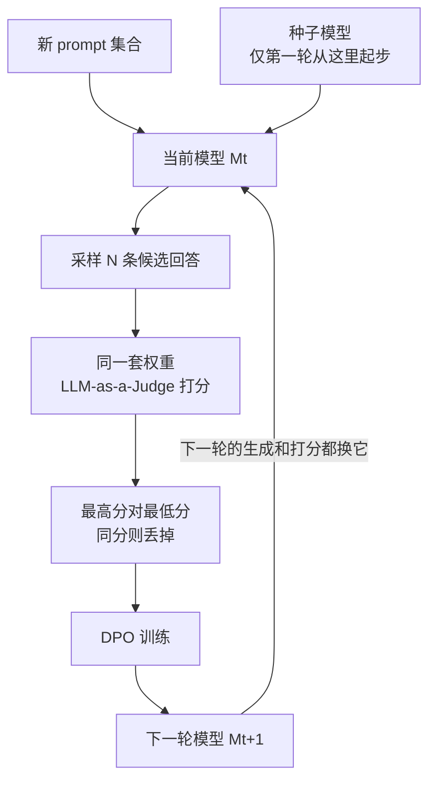

# Self-Rewarding：奖励模型不必冻结，同一套权重既能答题也能给自己打分

<!-- release-date: 2024-01-18 -->

> 本文依据 Meta 与 NYU 发布的 **Self-Rewarding Language Models** ，即 arXiv:2401.10020v3、2025-03-28 的修订版，共 23 页。封面作者为 Weizhe Yuan、Richard Yuanzhe Pang、Kyunghyun Cho、Xian Li、Sainbayar Sukhbaatar、Jing Xu、Jason Weston。v1 于 2024-01-18 首次公开，后被 ICML 2024 接收。页码均指 PDF 本身的页码。本地原件与 arXiv 当前 v3 一致。文中会明确区分「论文写了什么」「本文如何解释它」「哪些是外部资料补充」。

## 读前需要的最少背景

这篇论文只讲一件事：对齐时那个打分的人，能不能就是正在被训的那个模型。

先把五个会反复出现的名字说成人话：

- **指令微调（Instruction Fine-Tuning，IFT）** ：人类写好的「问题 → 回答」种子，用来先把基座教会听话。
- **评估微调（Evaluation Fine-Tuning，EFT）** ：同样是指令跟随数据，但任务变成「看一条回答，写一段理由，再打 0 到 5 分」。它教的是当裁判，不是答题。
- **AI 反馈训练（AI Feedback Training，AIFT）** ：模型自己出题、自己答题、自己打分之后，从分数里抽出的偏好对。下一轮真正拿来做偏好优化的，是这批数据。
- **大模型当裁判（LLM-as-a-Judge）** ：不另训一个打分网络，而是把「请给这条回答打分」写成一条普通指令，让同一个语言模型用生成来完成评价。
- **直接偏好优化（Direct Preference Optimization，DPO）** ：给定「更好的回答」和「更差的回答」，直接改语言模型的概率，不再单独训奖励模型。这篇论文把它套进多轮迭代，称为 **Iterative DPO** 。

本文对 DPO 公式本身不做展开，那是 Rafailov 等人 2023 年的工作。这里只需要记住：有了偏好对，就可以不用 PPO、也不用单独的奖励模型，把「谁比谁好」写进同一套权重。

## 一句话先说清

常规对齐把「答题的模型」和「打分的模型」拆开：人类先标偏好，再训一个奖励模型，然后把它冻住，用它去推语言模型。这条路上有两道墙。第一道是人类标得有多好、有多少，模型就只能跟到那里。第二道是奖励模型一旦冻住，语言模型再怎么涨，打分那一侧也不会跟着涨。（PDF p. 1）

Self-Rewarding 的做法是把这两件事塞回同一套权重：模型既生成回答，又用 LLM-as-a-Judge 给自己的候选打分，再把最高分和最低分配成偏好对，用 Iterative DPO 训出下一轮。论文在 Llama 2 70B 上走了三轮，报告了双轴同时上升：指令跟随在变好，按人类偏好衡量的打分能力也在变好。（PDF p. 1–2）

第三轮模型在 AlpacaEval 2.0 上对 GPT-4 Turbo 的胜率为 20.44%，超过表里的 Claude 2、Gemini Pro 和 GPT-4 0613。（PDF p. 8，Table 1）

把这句话读完，有三件必须立刻收窄的事，否则后面的数字会被读成它不是的东西：

1. 主实验里「自己」并不包括出题。新 prompt 是冻住的 Llama 2-Chat 70B 提前提的，不是正在被训的那一轮模型。（PDF p. 3 脚注 1、p. 6）
2. 打分能力的尺子是 Open Assistant 上留出的人类排序。模型是在更接近人类，不是已经被证明超过人类。摘要里「超人类反馈」是立场，不是这张表证明的事实。（PDF p. 1、p. 10，Table 4）
3. 回答平均长度从 $M_1$ 的 1092 涨到 $M_3$ 的 2552。作者自己写了：长度可能是相对表现的一个因素。（PDF p. 8）

## 旧方案卡在哪

对齐预训练好的大模型，用人类偏好数据能大幅提高指令跟随。标准路径是 **从人类反馈中强化学习（Reinforcement Learning from Human Feedback，RLHF）** ：先用人类偏好训一个奖励模型，再把它冻住，用 PPO 这类强化学习去训语言模型。另一条近路是 DPO：奖励模型干脆不训，人类偏好直接拿去改语言模型。（PDF p. 1）

两条路的瓶颈是同一类东西。偏好数据的规模和质量是上限；走 RLHF 时，冻住的那个奖励模型又是第二道上限。语言模型在 PPO 或 DPO 里可以继续改，打分那一侧不能。（PDF p. 1）

作者的判断是：要避免这道瓶颈，就不该把「会打分」和「会答题」拆成两个模型。预训练和多任务指令跟随已经证明，很多能力可以靠同一套权重一起学、互相转移。把奖励建模也做成一种指令跟随任务，打分和答题就有机会在同一轮训练里互相帮忙。（PDF p. 1–2）

本文把这个判断翻译成一句更硬的话：

> **冻结奖励模型的真正代价，不是多占一张卡，而是切断了「生成变好」和「评价变好」之间的任务迁移。**

这句话是本文的归纳，论文没有用这句原话。但它后面所有设计都在给这句提供机制。

## 系统怎么连起来

先看一轮循环落在哪些位置。下面这张图是机制示意，不是实测时间轴，根据 PDF p. 2 的 Figure 1 重画。

整套方法被作者叫做 **自我对齐（self-alignment）** ，用的反馈是 **AI 反馈（AI Feedback，AIF）** ，不是当轮新标的人类偏好。（PDF p. 2）

它同时要求模型具备两种技能（PDF p. 2）：

1. **指令跟随** ：给定用户请求，生成高质量、有帮助（并且无害）的回答。
2. **自指令创建（Self-Instruction creation）** ：生成并评价新的指令跟随样本，加进自己的训练集。

第二种技能里，「评价」被实现成第一种技能的一个特例：打分就是在跟随一条评价指令。所以奖励模型不再是外挂网络，而是同一套生成机制。（PDF p. 2–3）

作者认为，这样一来奖励模型可以随迭代一起进步，偏离「奖励模型必须冻住」的常规做法，从而提高自我改进的天花板。（PDF p. 2–3）

**代价和边界在名字里就已经埋着。** 主实验并没有让正在训练的模型负责出题；附录里才检查它能不能出题。安全评价完全没有做。所谓天花板提高，目前只在三轮、一个 70B、一套 Open Assistant 种子上被看到。这些后面会逐项落到数字。

**可迁移的部分先记一笔** ：如果你的对齐流水线里有一个冻住的打分器，先问它和策略是不是同一套能力。若打分本身也能写成指令跟随，冻结就不是技术必然，只是一个把任务迁移切掉的选择。

## 三种数据各自干什么

循环能转起来，靠的不是一种数据，是三种数据按顺序接手。

### IFT：先把模型教会答题

给定一批人类写的「指令 prompt、回答」对，从预训练基座做监督微调。这批数据此后都叫 IFT。（PDF p. 3）

实验里 IFT 来自 Open Assistant：只取英文、第一轮对话、人类标注最高档（rank 0），共 3200 条。只用这批数据微调出来的模型，叫做 **SFT Baseline** 。（PDF p. 5）

### EFT：再单独教它当裁判

EFT 的输入是一条评价指令：请按给定标准，给「某条用户问题 + 某条回答」打分。输出是一段思维链理由，再跟一个 0 到 5 的分数。作者把五条标准概括为相关性、覆盖、有用、清晰、专业。（PDF p. 3）

论文写得很清楚：EFT **不是严格必需的** 。只训 IFT，模型理论上已经能当 LLM-as-a-Judge。他们仍然加了 EFT，是因为附录证明它会明显改善打分，并让后面的自奖励环更稳。（PDF p. 3，指向附录 A.3）

EFT 的构造有一步很容易读漏。Open Assistant 给了同一 prompt 下多条带人类排序的回答，但 **并没有现成的思维链理由和 0–5 分** 。作者用 SFT Baseline 去生成这些评价，只留下「模型打出的分数排序与人类排序一致」的样本；又因为分数大量堆在 4 分，丢掉一部分最常见分数，减轻偏斜。最终是 1630 条训练、541 条评价，与 IFT 无重叠。（PDF p. 5）

所以 EFT 不是「人类手写的裁判示范」。它是「基座 SFT 模型写出来的裁判示范，用人排序滤过」。种子里真正来自人类的，是排序，不是理由文本。

评价指令的 prompt 还写了「必要时利用网页搜索」。脚注写明：他们的模型并不能真的搜索。（PDF p. 5，脚注 2）

### AIFT：让模型给自己造偏好对

模型训起来之后，用它改自己的训练集。自指令创建分三步（PDF p. 3）：

1. **生成新 prompt $x_i$** ：少样本提示，从原始 IFT 里抽示范，做法跟随 Self-Instruct 和 Unnatural Instructions。
2. **生成候选回答** ：对每个 $x_i$，从当前模型采样 $N$ 条多样回答。
3. **评价候选** ：用同一个模型的 LLM-as-a-Judge，给每条回答打 $r_i^n\in[0,5]$。

主实验里第 2、3 步由正在训的模型完成；第 1 步其实是预先用一个冻住的模型做好的。附录 A.5 才检查新训出来的模型能不能自己出题：从 IFT 种子构造 30 条带上下文示范的 prompt，人工检查 $M_1$、$M_2$、$M_3$ 全部都能生成新颖指令；但 $M_2$ 和 $M_3$ 常常先写几条指令、再写一个分隔符、然后开始回答这些指令，需要后处理。（PDF p. 3，脚注 1；PDF p. 22）

有了分数之后，构造偏好对 $(x_i, y_i^w, y_i^l)$：在 $N$ 条候选里取最高分当赢、最低分当输，分数相同就丢掉。这批偏好对就是 AIFT，拿去跑 DPO。（PDF p. 3–4）

写成式子，就是在问：这一题里谁最好、谁最差。

$$
y_i^w=\arg\max_n r_i^n,\qquad y_i^l=\arg\min_n r_i^n
$$

$r_i^n$ 是第 $n$ 条候选的分数，$y_i^w$ 是最高分那条，$y_i^l$ 是最低分那条。若 $r_i^w=r_i^l$，这对数据不进入 AIFT。中间那些既不是最好也不是最差的回答，直接丢掉。论文没有讨论「用全部两两对」或「按分差加权」这些替代，只说跟随 Xu 等人 2023 年 Iterative DPO 的取法。（PDF p. 4）

三种数据的分工可以收成一张表：

| 数据 | 谁写的 | 形式 | 这一步在教什么 |
|---|---|---|---|
| IFT | 人类（Open Assistant，3200 条） | 问题 → 回答 | 答题 |
| EFT | 人类排序 + SFT Baseline 写理由和分数（1630 条） | 评价指令 → 理由 + 分数 | 打分格式和打分标准 |
| AIFT | 当前模型自己生成并打分 | 问题 → （赢的回答，输的回答） | 用偏好拉开好坏回答的概率 |

**可迁移的部分** ：自改进环通常至少要三种信号——会做、会评、以及「这一次谁比谁好」。缺「会评」，后面的偏好对数量会塌；缺「谁比谁好」，只把高分样本再做一遍监督，这篇论文里证明不够。

## 裁判 prompt 不是细节，是负载结构

LLM-as-a-Judge 的输入长什么样，直接决定后面所有偏好对的质量。作者用的是 PDF p. 4 的 Figure 2：五点 **累加** 量表。

读原文会发现，五条并不是五个可以任意组合的独立开关，而是按质量从低到高叠上去的门槛：

| 加分 | 原文在要求什么 |
|---|---|
| 第 1 分 | 相关，提供了一些和用户问题有关的信息；即使不完整或夹着无关内容也可以 |
| 第 2 分 | 覆盖了问题的相当一部分，但还没有完全解决或直接作答 |
| 第 3 分 | 有用地回答了问题的基本要素；不管它像不像 AI 助手，哪怕像博客或搜索结果 |
| 第 4 分 | 明确是 AI 助手口吻，直接、全面、结构清楚、有帮助；清晰、简洁或焦点上还可以再改 |
| 第 5 分 | 针对问题量身定做，没有多余信息，体现专家知识，高质量、吸引人、有洞察 |

模型被要求先用最多 100 词说明总分，再按 `Score: <total points>` 这种格式收尾。（PDF p. 4，Figure 2）

他们不是没试过别的写法。附录 Figure 7 是 Li 等人 2024 年 Instruction Backtranslation 里的五点量表：同样是 1 到 5，但写成五个质量档的 **多项选择** 。用只训了 3200 条 IFT 的模型来比，累加写法全面压过多项选择（PDF p. 18，Table 5）：

| 指标 | 多项选择 prompt | 本文的累加 prompt |
|---|---:|---:|
| 成对准确率 | 26.6% | 65.1% |
| 5 分样本为人排第一的比例 | 23.5% | 39.6% |
| 完全匹配人类全序 | 1.1% | 10.1% |
| Spearman 相关 | $-0.18$ | $0.25$ |
| Kendall $\tau$ | $-0.16$ | $0.23$ |

多项选择那一列的相关甚至是负的：按那个 prompt 打出来的分，和人类排序是反着的。

作者给的理由是：多项选择要求模型一次性选档；累加写法允许它把评价拆成「相关性、覆盖、有用……」这些子问题。（PDF p. 18）

**旧问题 → 新设计 → 机制 → 收益 → 代价** 在这里走得很短：裁判任务如果写成「五选一」，70B 的 SFT 模型会把它做成乱选；写成「满足一条加一分」，同一套权重突然变得能用。收益是成对准确率从 26.6% 到 65.1%。代价是这条 prompt 仍然在说「利用网页搜索」，而模型并没有搜索工具——评价标准里有一句模型做不到的话。

**可迁移的部分** ：LLM-as-a-Judge 的 prompt 不是文案，是奖励函数的源代码。换一种措辞，相关可以从 0.25 掉到 $-0.18$。上线之前，至少要在带人类排序的留出集上把几种写法打一遍，不能默认「都是五分制，差不多」。

## 迭代算法：谁在哪一轮上场

整体训练出一串模型 $M_1,\ldots,M_T$。第 $t$ 轮用第 $t-1$ 轮造出来的 AIFT。论文把「用 $M_t$ 造出来的 AI 反馈数据」写成 $\mathrm{AIFT}(M_t)$。（PDF p. 4）

四步模型序列如下（PDF p. 4）：

| 模型 | 从哪初始化 | 这一步吃什么数据 | 训练方式 |
|---|---|---|---|
| $M_0$ | 预训练基座 | 无 | 无微调 |
| $M_1$ | $M_0$ | IFT + EFT 种子 | SFT |
| $M_2$ | $M_1$ | $\mathrm{AIFT}(M_1)$ | DPO |
| $M_3$ | $M_2$ | $\mathrm{AIFT}(M_2)$ | DPO |

这套迭代被作者明确说成：像 Pairwise Cringe Optimization 里的 Iterative DPO（Xu 等人 2023），差别是那篇用的是外部冻住的奖励模型，这篇换成模型自己。（PDF p. 4）

这里有一处表和正文不完全同口径，读 Table 4 时要分开。第 2.4 节写的是「从上一轮初始化，再用当轮 AIFT 做 DPO」。Table 4 的 Training data 列却写成累计血统：例如 $M_3$ 是 IFT+EFT+$\mathrm{AIFT}(M_1)$+$\mathrm{AIFT}(M_2)$。（PDF p. 4、p. 10）

本文的读法是：Table 4 在列「哪些数据影响过这套权重」，不是在说 DPO 那一步把 IFT、EFT 和两轮 AIFT 混在同一个 batch 里。论文没有写 DPO 阶段是否还混监督数据。**这一点论文没写，复现时不能猜。**

DPO 本身，按本文的解释（不是这篇论文推出来的公式）：给定赢的回答和输的回答，提高前者相对后者的对数概率差，并用 $\beta$ 限制新模型离开参考模型（通常是上一轮）有多远。这篇取 $\beta=0.1$。（PDF p. 6）

## 实验设置：种子很小，评测却是双轴

基座是 Llama 2 70B。（PDF p. 5）

### 训练超参

SFT：$5.5\times 10^{-6}$ 余弦衰减到 $1.1\times 10^{-6}$，batch size 16，dropout 0.1，损失只算在目标词元（token）上，不算完整序列。DPO：学习率 $1\times 10^{-6}$ 衰减到 $1\times 10^{-7}$，batch size 16，dropout 0.1，$\beta=0.1$。每 200 步存一个检查点，用 Claude 2 在 253 条验证样本上、按 AlpacaEval 评价 prompt，和上一步的生成做对比，用来早停。（PDF p. 6）

注意：训练过程中挑检查点的裁判是 Claude 2，最终报告的自动评测主要是 GPT-4。论文没有讨论这两个裁判不一致时怎么办。

### 自指令创建的具体数字

新 prompt 用冻住的 Llama 2-Chat 70B，8-shot，跟随 Self-Instruct：6 条示范来自 IFT，2 条来自模型已经生成的数据；解码 $T=0.6$，$p=0.9$。用非分类任务的 prompt 模板，并做 ROUGE-L 相似度检查、关键词过滤、长度过滤。附录 A.5 把同一个出题模型写成 ChatLlama 70B，按上下文就是这个冻住的 Llama 2-Chat 70B。（PDF p. 6、p. 22）

回答和打分才换成本轮 Self-Rewarding 模型。每个 prompt 采 $N=4$ 条候选，$T=0.7$，$p=0.9$。因为打分有方差，评价也用同样的采样解码，打 3 次取平均。（PDF p. 6）

最终进入 DPO 的偏好对是：$\mathrm{AIFT}(M_1)$ 3964 对，用来训 $M_2$；$\mathrm{AIFT}(M_2)$ 6942 对，用来训 $M_3$。（PDF p. 6）

论文没有写：最初生成了多少条 prompt、有多少对因为同分被丢掉、为什么第二轮对的数量几乎翻倍。6942 对是更好的裁判拉开了分差，还是第二轮就是多采了 prompt，读者无法从原文判断。

### 评测为什么必须是两轴

作者从一开始就说，要同时看指令跟随，和作为奖励模型评价回答的能力。（PDF p. 5）

指令跟随这一轴：

- 256 条 IFT 测试 prompt，GPT-4 做头对头；prompt 正反各跑一次，两次评价不一致记平局。来源跟随 Li 等人 2024，评价 prompt 用 AlpacaEval。（PDF p. 5）
- 作者自己做的人类盲评。
- AlpacaEval 2.0 排行榜口径：805 条 prompt，对 GPT-4 Turbo 的胜率，裁判仍是 GPT-4。（PDF p. 5）
- MT-Bench：多轮、多类题目，GPT-4 打 0 到 10 分。
- 另外 9 个 NLP 基准：ARC-Easy / ARC-Challenge、HellaSwag、SIQA、PIQA、GSM8K、MMLU、OBQA、NQ。（PDF p. 5）

奖励建模这一轴，用 Open Assistant 留出的评价集。每条指令平均 2.85 条带人类排序的回答。指标是（PDF p. 5）：

- **成对准确率（pairwise accuracy）** ：任意一对的相对顺序是否与人类一致。
- **完全匹配（exact match）** ：一条指令下的全序是否完全相同。
- Spearman 相关、Kendall $\tau$。
- **5-best %** ：模型打满分 5 的那些回答，有多少恰好是人类排第一的。

这套尺子的上限仍是人类排序。后面所有「奖励模型变强了」，都应读成「更像这批人类」，不是「已经比人准」。

## 第一轴：指令跟随随迭代怎么变

头对头结果在 PDF p. 7 的 Figure 3。图上的数字和正文一致，这里改成表。评测集是 256 条 IFT 测试 prompt，裁判是 GPT-4。

先和 SFT Baseline 比：

| 对比 | Self-Rewarding 胜 | 平局 | SFT Baseline 胜 |
|---|---:|---:|---:|
| $M_1$ vs SFT | 30.5 | 38.7 | 30.9 |
| $M_2$ vs SFT | 49.2 | 36.3 | 14.5 |
| $M_3$ vs SFT | 62.5 | 27.7 | 9.8 |

再看迭代之间（PDF p. 7，Figure 3）：

| 对比 | 左侧胜 | 平局 | 右侧胜 |
|---|---:|---:|---:|
| $M_2$ vs $M_1$ | 55.5 | 32.8 | 11.7 |
| $M_3$ vs $M_2$ | 47.7 | 39.8 | 12.5 |
| $M_3$ vs $M_1$ | 68.8 | 22.7 | 8.6 |

正文把这些数字收成四句话（PDF p. 6–7）：

1. **IFT+EFT 和只做 IFT 几乎打平。** $M_1$ 对 SFT Baseline 是 30.5% 对 30.9%。作者把这当成正结果：多学一种「给回答打分」的技能，没有伤到答题。
2. **$M_2$ 大幅超过 $M_1$ 和 SFT。** 对 $M_1$ 是 55.5% 对 11.7%，对 SFT 是 49.2% 对 14.5%。从 $M_1$ 到 $M_2$ 的跳跃，用的就是 $M_1$ 自己当裁判造出来的 $\mathrm{AIFT}(M_1)$。
3. **$M_3$ 再超过 $M_2$。** 47.7% 对 12.5%；对 SFT 进一步到 62.5% 对 9.8%。
4. 平局一直很多，大约三成到四成。胜率上升，很大一块是把平局和对方的胜场一起吃掉，不是把所有题都变成一边倒。

人类盲评方向一致，但第一轮的故事更难听。作者从 IFT 测试集随机抽 50 条指令，每条产生三对（Baseline vs $M_1$、$M_2$、$M_3$），每对三个标注者（作者自己、盲评），多数票决定。结果在 PDF p. 9 的 Figure 5：

| 对比 | Self-Rewarding 胜 | 平局 | SFT Baseline 胜 |
|---|---:|---:|---:|
| $M_1$ vs SFT | 28.0 | 26.0 | 46.0 |
| $M_2$ vs SFT | 56.0 | 24.0 | 20.0 |
| $M_3$ vs SFT | 66.0 | 16.0 | 18.0 |

GPT-4 觉得 $M_1$ 和 SFT 打平；人类更常选 SFT。真正和自动评测对齐的，是 $M_2$、$M_3$ 对 Baseline 的优势在扩大。样本只有 50 条，标注者就是作者，论文自己也把人类评价写成还需要更多研究。（PDF p. 9、p. 12）

AlpacaEval 2.0 把同一趋势换成对 GPT-4 Turbo 的胜率（PDF p. 8，Table 1）：

| 模型 | 对 GPT-4 Turbo 胜率 |
|---|---:|
| Self-Rewarding $M_1$ | 9.94% |
| Self-Rewarding $M_2$ | 15.38% |
| Self-Rewarding $M_3$ | 20.44% |
| GPT-4 0314 | 22.07% |
| Mistral Medium | 21.86% |
| Claude 2 | 17.19% |
| Gemini Pro | 16.85% |
| GPT-4 0613 | 15.76% |
| GPT-3.5 Turbo 0613 | 14.13% |
| LLaMA2 Chat 70B | 13.87% |
| Vicuna 33B v1.3 | 12.71% |
| Humpback LLaMa2 70B | 10.12% |
| Guanaco 65B | 6.86% |
| davinci-001 | 2.76% |
| Alpaca 7B | 2.59% |

$M_3$ 超过表里许多带专有对齐数据、或从更强模型蒸馏目标的系统。它没有超过 GPT-4 0314 和 Mistral Medium。和同尺寸的官方 LLaMA2 Chat 70B 比，20.44% 对 13.87%。作者强调：那些对手往往有很大的专有对齐数据（例如 Touvron 等人 2023 里超过 100 万条标注），或用更强模型蒸馏；他们自己从一小撮 Open Assistant 种子出发，目标和奖励都来自模型自身。（PDF p. 7–8）

这是排行榜口径上的事实，不是「70B 全面超过 Claude 2」。裁判是 GPT-4，训练里的早停裁判是 Claude 2，生成还在变长。把 20.44% 读成通用能力跨越，论文自己的细粒度分析也不支持。

### 涨的是「把已有知识用好」，不是数学

作者用 GPT-4（`gpt-4-1106-preview`）把 AlpacaEval 测试集按三类切开：主题、复杂度、期望回答长度。主题 20 类的计数见附录 Table 6，复杂度见 Table 7，长度见 Table 8。（PDF p. 7、p. 22）

正文给出三条结论（PDF p. 7）：

1. 多数主题的胜率明显上升，但数学和逻辑推理这类没有改善。作者据此判断：当前训练主要是让模型更好地利用已有知识。
2. 不同复杂度上都在涨，尤其是略难的题（复杂度 5、6、7，满分 10）。
3. 不同期望回答长度上，胜率也在稳步上升。

Figure 4（PDF p. 8）是主题折线图，横轴是缩短后的类名。本文按图读到的形状是：Health、Professional、Literature、Coding、Science 等类上，$M_3$ 明显高于 $M_0$/$M_1$；Mathematics 上 $M_3$ 并不明显高于 $M_1$；Social Interaction、Cooking 等类增益很小。这些是读图，不是表内精确数字。论文正文没有给每类的具体胜率。

读这些切片时，分母必须一起看。Table 7 里复杂度 8 只有 14 条（1.74%），复杂度 9 只有 3 条（0.37%），Figure 11 左图横轴只画到 8。Table 8 里「3 段及以上」只有 1 条（0.13%），右图只画了四个长度档。右尾的曲线不能当稳健证据。（PDF p. 21–22）

MT-Bench 把同一结论换成分数。总分从 $M_1$ 的 6.78 到 $M_3$ 的 7.25（满分 10）。人文、抽取、STEM、角色扮演、写作相对涨得多，数学、代码、推理涨得少。作者预期这是因为 Open Assistant 种子本身就不强调推理。他们还指出：方法只用单轮 prompt，MT-Bench 却是多轮评测，分数仍然在涨。（PDF p. 9–10，Table 2）

附录 Table 10 把八个类摊开（PDF p. 23）：

| | 写作 | 角色扮演 | 推理 | 数学 | 代码 | 抽取 | STEM | 人文 | 总分 |
|---|---:|---:|---:|---:|---:|---:|---:|---:|---:|
| SFT | 8.83 | 8.15 | 5.30 | 3.00 | 3.50 | 6.90 | 9.18 | 9.95 | 6.85 |
| $M_1$ | 9.10 | 7.65 | 4.35 | 3.05 | 4.10 | 7.20 | 8.93 | 9.85 | 6.78 |
| $M_2$ | 9.10 | 8.00 | 4.60 | 3.30 | 4.25 | 7.65 | 9.40 | 9.80 | 7.01 |
| $M_3$ | 9.58 | 8.73 | 4.80 | 3.50 | 4.20 | 7.80 | 9.45 | 9.95 | 7.25 |

有两行容易漏：$M_1$ 的总分比 SFT 还低（6.78 对 6.85），推理从 5.30 掉到 4.35 再慢慢爬回来，始终没有回到 SFT。代码在 $M_2$ 的 4.25 之后，$M_3$ 是 4.20，几乎没再涨。Self-Rewarding 不是每一类、每一轮都单调变好。

### 长度是全文最不能装看不见的伴随现象

IFT、EFT、$\mathrm{AIFT}(M_1)$ 的 t-SNE 见附录 Figure 6（PDF p. 18）。指令和回答两个图都显示：IFT 和 AIFT 叠在一起，EFT 落在另一块区域。作者说这是想要的：新造的答题数据和种子答题数据同分布，评价数据本来就该长得不一样，所以加 EFT 不太影响 IFT 表现。（PDF p. 8、p. 18）

同一段里他们报告了长度：AlpacaEval 上，$M_1$ 平均 1092，$M_2$ 平均 1552，$M_3$ 平均 2552。模型在学着写得更长；作者注明这可能是相对表现的一个因素。（PDF p. 8）

限制一节把这件事升格：长度和预估质量之间存在已知相关，这个问题需要被更深入地理解，包括在他们自己的结果里。（PDF p. 12）

本文的判断是：三轮迭代的胜率上升，和长度几乎翻倍绑在一起。论文没有做「控制长度再比」的实验，所以 **有多少胜率来自写得更好、有多少来自写得更长，原文给不出分解** 。

### NLP 基准：没有崩，也谈不上涨

Table 3 是节选，完整九项在附录 Table 9（PDF p. 9、p. 23）：

| 模型 | ARC-Easy | ARC-Challenge | HellaSwag | SIQA | PIQA | GSM8K | MMLU | OBQA | NQ |
|---|---:|---:|---:|---:|---:|---:|---:|---:|---:|
| Llama 2 | 80.20 | 57.40 | 85.30 | 50.70 | 82.80 | 56.80 | 68.90 | 60.20 | 25.30 |
| SFT Baseline | 76.49 | 55.97 | 85.17 | 51.48 | 82.59 | 50.72 | 69.76 | 57.80 | 34.35 |
| $M_1$ | 78.14 | 57.51 | 84.99 | 53.02 | 82.92 | 60.27 | 69.34 | 57.60 | 35.48 |
| $M_2$ | 74.84 | 54.51 | 84.27 | 51.23 | 81.94 | 59.29 | 69.31 | 57.60 | 33.07 |
| $M_3$ | 72.35 | 53.13 | 83.29 | 49.28 | 80.79 | 57.70 | 69.37 | 58.40 | 31.86 |

作者的措辞是「大致保持」，并引用 InstructGPT 所说的 **对齐税（alignment tax）** ：RLHF 之后某些公开 NLP 数据集上会退步。（PDF p. 10）表上其实能看见退步，尤其是 ARC-Easy / ARC-Challenge、HellaSwag、PIQA。GSM8K 在 $M_1$ 冲到 60.27 之后又往回掉。NQ 从基座的 25.30 被 SFT 拉到 34.35，之后同样下滑。

附录 A.7 给了一个方法学上的诚实说明：ARC-Challenge、HellaSwag、SIQA、PIQA、OBQA 都是文本补全，选项按最高对数概率选。这个目标和他们优化的指令跟随不是一回事，所以这些数字未必反映模型的「真能力」。（PDF p. 23）

**可迁移的部分** ：如果你的自训练环只用对话种子，不要指望数学和补全基准会当副作用一起涨。种子分布写进了增益的形状。

## 第二轴：奖励建模随迭代怎么变

这是这篇论文区别于「再跑一轮 DPO」的主张：打分这件事本身也在变好。证据是 PDF p. 10 的 Table 4，尺子是 Open Assistant 留出的人类排序。

| 模型 | SFT Baseline | $M_1$ | $M_2$ | $M_3$ |
|---|---:|---:|---:|---:|
| 训练数据（表内口径） | IFT | IFT+EFT | IFT+EFT+$\mathrm{AIFT}(M_1)$ | IFT+EFT+$\mathrm{AIFT}(M_1)$+$\mathrm{AIFT}(M_2)$ |
| 成对准确率 | 65.1% | 78.7% | 80.4% | 81.7% |
| 5-best % | 39.6% | 41.5% | 44.3% | 43.2% |
| 完全匹配 | 10.1% | 13.1% | 14.3% | 14.3% |
| Spearman | 0.253 | 0.279 | 0.331 | 0.349 |
| Kendall $\tau$ | 0.233 | 0.253 | 0.315 | 0.324 |

作者分三步读这张表（PDF p. 10–11）：

**第一步：EFT 让 SFT Baseline 变成能用的裁判。** 只做 IFT 的模型已经能评价——指令跟随覆盖面够宽——但专门的评价示范把五项指标全抬起来。成对准确率从 65.1% 到 78.7%，是整张表里最大的单次跳跃。

**第二步：自奖励训练让下一轮的裁判更好。** $M_2$ 是用 $M_1$ 当奖励模型训出来的，但 $M_2$ 自己当裁判时，五项全超过 $M_1$。成对准确率 78.7% → 80.4%。

**第三步：$M_3$ 再把几项往前推。** 成对准确率 80.4% → 81.7%，Spearman 0.331 → 0.349。这一步 **没有增加任何新的 EFT** ，自指令循环里造出来的样本看起来也不像 LLM-as-a-Judge 训练题。作者的假说是：模型的通用指令跟随变好了，当裁判这种指令跟随任务也就变好了。（PDF p. 11）

这里必须把「论文写了什么」和「本文如何解释」分开。

论文证明的是：在同一套人类排序留出集上，后一轮模型的打分更接近人类。论文假设的是：因为答题变好，所以打分变好。论文没有做的交换实验包括：用 $M_1$ 的裁判去给 $M_2$ 的候选打分、和用 $M_2$ 的裁判打同一批候选比，数据质量到底差在哪；也没有报告 AIFT 里赢输分差如何随迭代变化。

表里还有一行不是单调的：5-best % 在 $M_3$ 从 44.3% 回到 43.2%，完全匹配停在 14.3%。奖励建模「随迭代改善」成立的是成对准确率和两个相关系数，不是每一个指标、每一轮。

即便如此，双轴同时上升仍然是这篇最值得记住的实验事实。它让「冻结奖励模型」不再只是工程习惯，而变成一种可被测量的损失：冻住的话，你至少会丢掉 Table 4 里 $M_1$ 到 $M_3$ 那几分打分能力，以及用更好的打分去造下一轮 AIFT 的机会。

作者在引言里把这件事说成：某一轮能为自己提供比上一轮更高质量的偏好数据。（PDF p. 2）这句话的直接证据是 Table 4，不是对 AIFT 本身的人类抽检。

**可迁移的部分** ：如果你在跑 Iterative DPO，除了看指令跟随榜，留一个打分能力的留出集。否则你只知道策略在涨，不知道下一轮的标签器是不是也在涨——而这正是「还要不要冻住奖励模型」这个问题的全部意义。

## 附录里三件会改结论的事

正文把主故事讲完了。附录里有三处如果删掉，结论会变味。其余图表是装饰或补充切片，后面一笔带过。

### 只用 IFT：环能转，但转不动

附录 A.3 从只做 IFT 的 $M_1'$ 再跑同样的自奖励环，得到 $M_2'$、$M_3'$。（PDF p. 18–19）

没有 EFT 时，模型经常不能按格式打分；即便打了，分数也往往堆到 4 分。于是从「同样数量的新 prompt」出发，只能收集到很少的合法 DPO 样本：$\mathrm{AIFT}(M_1')$ 541 对，$\mathrm{AIFT}(M_2')$ 429 对。对照主实验的 3964 和 6942，差了一个数量级。（PDF p. 19）

Figure 8（PDF p. 20）的头对头是：

| 对比 | 左侧胜 | 平局 | 右侧胜 |
|---|---:|---:|---:|
| $M_2'$ vs SFT | 46.5 | 34.8 | 18.8 |
| $M_3'$ vs SFT | 50.4 | 32.8 | 16.8 |
| $M_2$ vs $M_2'$ | 34.8 | 36.7 | 28.5 |
| $M_3$ vs $M_3'$ | 38.7 | 44.5 | 16.8 |

$M_2'$、$M_3'$ 仍然能赢 SFT，但远落后于从 IFT+EFT 起步的 $M_2$、$M_3$。作者的结论：EFT 让同样迭代次数下的表现更好，而且有无 EFT 的差距在后面几轮拉得更大。（PDF p. 19）

机制上这和 Table 4 的第一步对得上。裁判如果不会打出分差，最高分和最低分经常相等，偏好对被丢掉，DPO 没数据。EFT 不是锦上添花，是让自奖励环有足够非零梯度的前提。

主实验第二轮 AIFT 反而更多（6942 > 3964），无 EFT 时第二轮更少（429 < 541）。论文没有解释这个方向差，但它和「分数塌到 4」的观察是同一类现象：裁判的有效动态范围，决定下一轮能吃到多少偏好对。

### 只加正例：一万条满分样本也推不动

附录 A.4 试过另一条自训练：不构造偏好，只把自指令里打到满分 5 的（prompt，回答）加进 SFT，跟随 Self-Instruct、ReST 这类「把高质量样本添回去」的做法。加了 11254 条满分样本，并调了混合权重，对 SFT Baseline 仍是 29% 胜对 30% 胜，没有提升。（PDF p. 22）

作者的原话是：不幸的是，他们没能找到一种配置让这条路有帮助。这不是「没试够超参」的含糊话，而是他们在这篇设定里得到的负结果。

同一批生成管道，走偏好对就从 $M_1$ 打到 $M_3$，走正例 SFT 则原地踏步。ReST 用的是外部冻住奖励来筛选正例；他们换成自己打分之后，只留正例不够，必须留下「谁比谁差」。

**可迁移的部分** ：自训练里「把最好的样本再监督一遍」看起来最干净，也最容易什么都学不到。模型已经会写这些满分回答，SFT 只是在重复它。偏好对强迫它看见自己的坏样本。

### 主题切片说明增益从哪来，也说明从哪不来

附录 A.6 是 Figure 4 / Figure 11 的方法说明：先用 Figure 9 的 prompt 让 GPT-4 从全部 AlpacaEval 指令里归纳最多 20 个类，再用 Figure 10 给每条测试指令打上类、复杂度 1–10、期望长度档。（PDF p. 20–22）

Table 6 里最大的类是 Science / Technology / Engineering（134 条，16.65%），最小的是 Strategy / Problem-Solving / Critical Thinking（2 条，0.24%）。数学 / 逻辑推理有 52 条（6.46%），不是一个可以忽略的小类。（PDF p. 21）

所以「数学没涨」不是因为测试集里没有数学，而是方法在这类上确实没带来像写作、专业咨询那样的胜率。这和 MT-Bench 细表、和 Open Assistant 种子偏对话的事实对得上。

附录 A.7 的 NLP / MT-Bench 细表前面已经用过。还需要补的一句是：补全型基准的目标函数和这条算法优化的东西不是一回事，退步或持平都不该被读成「通用智能没变」。（PDF p. 23）

其余附录一笔带过：Figure 6 的 t-SNE 只用来说明 IFT 与 AIFT 同分布、EFT 不同分布；Figure 7 是被放弃的多项选择 prompt；Figure 9、Figure 10 是聚类用的 GPT-4 prompt，不进入方法本身。

## 和邻近工作差在哪

相关工作这一节只保留理解本文所必需的对照，不当文献综述。（PDF p. 11–12）

**和 RLHF / 普通 DPO。** RLHF 从人类偏好训一个冻住的奖励模型，再 PPO。DPO 连奖励模型都不训，直接吃人类偏好。两条路都被人类数据的规模和质量卡住；RLHF 还被冻住的奖励模型再卡一次。Self-Rewarding 要动的就是「冻住」这件事。（PDF p. 11）

**和 Iterative DPO / Pairwise Cringe Optimization。** 迭代框架几乎是同一类，差别是 Xu 等人 2023 用外部冻住奖励模型，这里用模型自己。（PDF p. 4、p. 11）

**和 Constitutional AI / RLAIF。** Anthropic 的 **宪法 AI（Constitutional AI）** 让 LLM 给反馈、改写回答，再用这些数据训一个 **单独冻住的** 奖励模型，然后 RL。Lee 等人 2023 把这种做法叫做 **从 AI 反馈中强化学习（RL from AI Feedback，RLAIF）** ，并拿现成大模型当 LLM-as-a-Judge 去造训练集，仍然是先训一个冻住的奖励模型再 RL。他们也试过在 PPO 里直接调用那个独立的 Judge，作者报告因为算力贵而不划算。本文的迭代是离线造偏好对，相对便宜。（PDF p. 11）

本站若要对「原则 + AI 反馈、但奖励模型仍然分开冻住」这条线，应去读 Constitutional-AI 篇；不要把那条线和这篇的「同一套权重既答题又打分」混成一件事。DeepSeek-R1 篇走的是另一条极端：能用规则验证的任务，干脆不要神经奖励模型。三条路处理的是同一个问题——奖励从哪来、要不要冻——答案不同。

**和 SPIN。** SPIN 在类似 Iterative DPO 的框架里完全不要奖励模型：人类标注当赢，上一轮生成当输。作者指出两个限制：模型一旦达到人类水平就被卡住；每条 prompt 都必须有人类回答。本文不需要每条新 prompt 带人类回答。（PDF p. 11）

**和 Self-Instruct / Alpagasus / Instruction Backtranslation / ReST。** Self-Instruct 提供了造 prompt 和回答的技术，本文用了类似方法，再用自奖励打分。Alpagasus 用更强的 ChatGPT 当裁判去筛 Alpaca。Instruction Backtranslation 用模型自己当裁判做数据筛选，作者把它看成 Self-Rewarding 在一个专门设定里的实例。ReST 用外部冻住奖励筛高质量正例再迭代加入训练集；本文发现只加正例没有帮助，偏好对才有。（PDF p. 11–12）

**和「专门把模型训成裁判」。** 已有工作会造数据把 LLM 训成裁判；作者认为，把这种训练和通用指令跟随合在同一套权重里，并不常见。（PDF p. 12）

外部再补一条对照，避免和本站另一类「自进化」读混。Weco 的 AIDE2 篇写的是 harness（脚手架代码）的递归自我改进：外层改的是 agent 自己的代码，不是模型权重。Self-Rewarding 改的是同一套权重，对象完全不同。两篇文章都出现「自己改进自己」，改进的东西不是同一个。

## 限制、未公开，以及摘要里那句「超人类」

限制一节作者写得比摘要收得多（PDF p. 12–13）。

他们把结果称为初步，因为还有很多没探：进一步评价，包括安全评价；以及迭代训练的极限。他们只在单一设定里跑了三轮。下一步很清楚：要理解这个效应的「缩放规律」——更多轮、不同能力的模型、不同设定。

长度在涨，长度和预估质量的相关是已知问题，需要被更深地理解。他们也想知道所谓 **奖励作弊（reward-hacking）** 会不会在这个框架里发生、在什么情况下发生。训练奖励是一个语言模型，部分最终评价又是另一个语言模型（GPT-4），即便不是同一个模型，也可能需要比他们提供的更深的分析。人类评价给出了自动结果的印证，但进一步研究会带来更多认识。

安全是单独一段。现有系统里有专门为安全建的奖励模型（他们引 Llama 2）。一个有希望的方向是：在自奖励训练里，专门用 LLM-as-a-Judge 做安全评价。既然打分能力随迭代在涨，安全理论上也可能随迭代涨，后轮能抓住前轮抓不住的更难安全情形。（PDF p. 13）

这是展望，不是实验。全文没有报告任何安全基准、拒答率或红队结果。技能定义里写了 harmless，评测里没有。

再把「超人类」从摘要里请回地面。摘要的第一句是立场：要得到超人类代理，未来的模型需要超人类反馈。（PDF p. 1）实验测量的打分能力，尺子是人类排序。Table 4 证明的是更接近人类，不是超过人类。作者在引言里写的更准确：这个效应在真实场景里很可能饱和，但仍提供了一种可能性——得到比「只从原始人类种子能训出来的」更好的奖励模型。（PDF p. 2）可能性不是结果。

**论文没写、复现时会卡住的缺口：**

- 没有 GPU 数量、墙钟时间、训练成本。
- 没有写是全参微调还是 LoRA，没有上下文长度、并行策略。
- 没有写最初生成了多少 prompt、同分丢弃率、第二轮 AIFT 为什么几乎翻倍。
- 没有写 DPO 阶段是否混 IFT/EFT。
- 没有随机种子、没有第二个基座尺寸、没有第二个种子数据集。
- 没有开源权重、训练代码或 AIFT 数据。
- 没有控制长度的对比实验，没有 reward-hacking 实验，没有安全实验。
- 没有把 $M_1$/$M_2$/$M_3$ 的裁判交叉用在同一批候选上，直接量「数据质量」随迭代怎么变。

这些不是指责。2024 年 1 月这篇技术论文本来就不是基模配方。缺的就应标成缺，不要用后来的 Llama 3 / Llama 4 后训练去补。那是另一份材料，见本站 Llama-3 篇；不要把两边读成同一条 recipe。

## 最值得带回自己项目的几条

1. **先决定奖励模型要不要冻。** 冻住的收益是稳定、可审计、不会和策略一起漂移。代价是切断任务迁移。这篇论文给出的证据是：不冻、并且把打分写成指令跟随，打分能力可以在没有新 EFT 的情况下跟着指令跟随一起涨。你的项目里如果打分任务和答题任务共享同一种「什么叫好回答」的标准，冻结就不是默认选项。

2. **裁判 prompt 要当奖励函数来做消融。** 同样五分制，累加和多项选择可以把成对准确率从 65.1% 打到 26.6%，相关从正打到负。不要从别的论文抄一段 judge prompt 就直接进环。

3. **只加正例通常不够，偏好对才把坏样本留在视野里。** 11254 条满分 SFT 推不动；几千对最高对最低的 DPO 可以。自训练里「过滤掉差的」看起来更干净，差的往往才是梯度来源。

4. **没有评价示范时，自奖励环会先在格式和分数动态范围上死掉。** 不用 EFT，分数堆到 4，合法偏好对从几千掉到几百。如果你不想标 EFT，至少要监测：有多少样本能解析出分数、分数的熵有没有塌、同分丢弃率是多少。

5. **双轴都要测。** 只看 AlpacaEval 胜率，你会得到「迭代有用」。加上 Table 4 这种留出人类排序，你才能说「标签器也在变好」。后一句才支撑「继续迭代有意义」。

6. **种子分布决定增益形状。** Open Assistant 偏帮助性对话，涨的是写作、角色扮演、专业咨询；数学、代码、逻辑推理几乎不涨。不要期望一个对话自奖励环顺便成为推理模型。

7. **把长度当成必须报告的伴随变量。** 1092 → 2552 不是脚注。任何用 LLM 当裁判的偏好环，都可能在奖励「看起来更完整」的长回答。没有控长实验，就不要把胜率全部记在「对齐成功」账上。

8. **「自己」要写清楚是哪一步自己。** 这篇主实验里，回答和打分是自己，出题不是。对外讲 Self-Rewarding 时，把冻结的 Llama 2-Chat 70B 出题这一步说出来，比把名字说得更满更有用。

第 1、3、4、5 条有表或附录实验托着。第 2 条有 Table 5。第 6 条有 Figure 4、Table 2、Table 10。第 7 条是作者承认的观察，没有因果分解。第 8 条是方法描述，不是实验结果。

## 关键词回看

- **Self-Rewarding Language Models** ：同一套语言模型既生成回答，又用 LLM-as-a-Judge 给自己打分，再用这些分数构造偏好对做迭代训练。
- **自我对齐 / AI 反馈（AIF）** ：用模型给自己的反馈，而不是当轮新标的人类偏好，来做对齐。
- **IFT / EFT / AIFT** ：答题种子、裁判种子、自造偏好对。三种数据教三件不同的事。
- **LLM-as-a-Judge** ：把评价写成指令跟随任务。这篇用的是累加五点量表，不是单独的奖励网络。
- **Iterative DPO** ：每轮用上一轮模型造的偏好对做 DPO，得到下一轮模型。Xu 等人 2023 用冻住外部奖励；这里换成自己。
- **成对准确率 / 5-best / exact match** ：用留出人类排序衡量「这个 LLM 当裁判有多像人」的三种口径。
- **对齐税（alignment tax）** ：对齐之后某些公开 NLP 基准退步。InstructGPT 先用这个词，这篇在 ARC 等补全任务上再次看到类似形状。
- **Self-Instruct** ：少样本让模型造新指令。这篇用冻住的 Llama 2-Chat 70B 做这一步。

## 最后的判断

这篇论文的贡献不是又一个对齐损失，而是把一个被默认冻住的部件重新打开：奖励模型可以是语言模型的一种技能，因此可以和指令跟随一起被迭代改进。

被实验支持的有四件。

第一，从 $M_1$ 到 $M_3$，指令跟随在 GPT-4 头对头、AlpacaEval 2.0、MT-Bench 和作者盲评上整体上升。第二，同一串模型在 Open Assistant 留出集上的打分更接近人类，而且后两轮没有新的 EFT。第三，EFT 和偏好对都是负载结构：去掉 EFT，合法偏好对塌一个数量级；改成只加满分正例，头对头不涨。第四，裁判 prompt 的写法能把相关从正打到负。

是观察、还不能当因果的，有三件。打分变好是因为通用指令跟随迁移——这是假说。胜率有多少来自变长——作者承认相关，没有分解。后轮能抓住更难的安全问题——限制一节的展望，零实验。

摘要里「超人类反馈」目前仍是立场。尺子是人类，结果是更像人类。三轮、一个 70B、一套对话种子、没有安全、没有控长、没有开源，这就是 2024 年 1 月这篇能被负责任读到的边界。

如果只记一句话，可以记：

> **奖励模型冻住的那天，生成和评价之间的任务迁移就被切断了。把打分写成一种指令跟随，同一套权重才有机会两轴一起涨；至于它会不会涨过人类，这篇论文还没有资格回答。**

## 资料与阅读边界

- 原始依据：本地 `papers/Meta/Self-Rewarding-LM.pdf`，即 arXiv:2401.10020v3，2025-03-28 修订，23 页。封面标题 Self-Rewarding Language Models，作者单位为 Meta 与 NYU。
- arXiv 页面：<https://arxiv.org/abs/2401.10020>。提交历史为 v1（2024-01-18）至 v3（2025-03-28）。本文 `release-date` 取 v1 首次公开日，不用 v3 日期，也不用 ICML 2024 会议日期。
- 论文身份核验以本地 PDF 与 arXiv 摘要页为准。ICML 2024 接收信息来自任务给定的已核验身份，本文未再检索会议程序页。
- 跨篇对照（纯文本，不在本文展开）：Constitutional-AI 篇讲的是 AI 反馈仍训一个分开冻住的奖励模型；DeepSeek-R1 篇讲的是能规则验证时可以不要神经奖励模型；AIDE2 篇讲的是 harness 代码的自进化，不是权重；SEAL 篇讲的是生成自编辑指令再写入权重，奖励来自更新后会不会做题。后训练配方更完整的 Meta 基模报告见 Llama-3 篇，那是另一份材料，不能用来补这篇 2024 年 1 月没写的实现细节。
- 外部补充仅用于身份与跨篇指针。正文中的数字、表和图全部回查自本地 PDF，不引用二手博客或后续复现。
