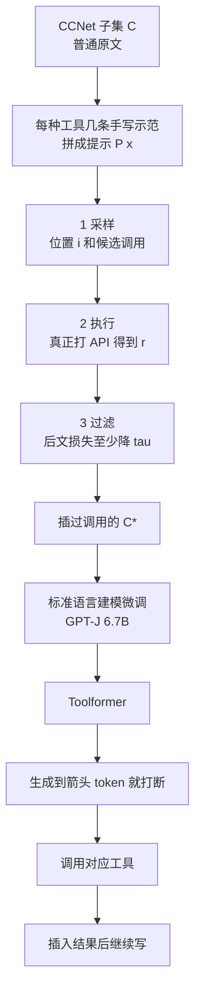

# Toolformer：少量表演加「会不会帮续写」的过滤，让语言模型自己把 API 写进文本

<!-- release-date: 2023-02-09 -->

> 本文依据 Meta AI Research 发布的 **Toolformer: Language Models Can Teach Themselves to Use Tools**，即 arXiv:2302.04761**v1**、2023-02-09 提交、共 17 页的 A4 预印本。封面作者为 Timo Schick、Jane Dwivedi-Yu、Roberto Dessì†（Universitat Pompeu Fabra）、Roberta Raileanu、Maria Lomeli、Luke Zettlemoyer、Nicola Cancedda、Thomas Scialom，归属 Meta AI Research。页边水印为 `arXiv:2302.04761v1 [cs.CL] 9 Feb 2023`。pdfinfo 的 Title/Author 为空，标题与作者以封面为准。页码均指这份 PDF。截至 2026-09-11 核验，[arXiv:2302.04761](https://arxiv.org/abs/2302.04761) 最新仍是 v1：提交于 2023-02-09 16:49:57 UTC，本地原件 17 页、CreationDate 2023-02-10，与 v1 一致。全文把三件事分开写：**论文明确写了什么**（带页码）、**本文如何解释它**、**外部资料补充**。
>
> 这是一份 **2023 年的技术论文**，讲的是在 GPT-J 6.7B 上用自监督方式插入 API 调用，不是新架构，也不是后来的函数调用、ReAct agent 或浏览产品。同仓 [WebGPT](/reports/OpenAI/WebGPT) 是 2021 年的文本浏览器加人类示范与偏好；Toolformer 是 2023 年的自监督 API 插入。数字、动作空间和训练信号都不要混读。
>
> **`release-date` 取 2023-02-09。** 这篇文章覆盖的是 Toolformer 这套「少量表演 + 自监督过滤 + 在语言模型数据里插入 API」方法。已核查的官方渠道里最早的公开事件是 arXiv v1。Meta 研究页 [Toolformer](https://ai.meta.com/research/publications/toolformer-language-models-can-teach-themselves-to-use-tools/) 标的是 February 22, 2024，晚于 arXiv，不采用。NeurIPS 2023 录用与会议更晚。这是研究原型，没有对外提供 Toolformer 权重。

## 读前把几个词说成人话

这篇几乎不改 Transformer 的结构。它改的是**训练数据里允不允许出现工具调用**，以及**哪一次调用算有用**。后面会反复出现这些名字：

- **API 调用（API call）**：一段可以插进正文的特殊文本，形如 `[QA("谁是出版方？") → Massachusetts Medical Society]`。模型把它当普通 token 来预测。
- **工具（tool）**：输入和输出都能写成文本的外部程序。本篇用了五种：事实问答、维基搜索、计算器、翻译、日历。
- **少样本提示（in-context prompt）**：每种工具只手写几条「在这段话的什么位置、该问什么」的示范。模型靠这些示范去给海量原文打候选调用，不靠百万条轨迹。
- **自监督过滤**：候选调用真正执行之后，看它能不能降低后文的语言建模损失。降得够多才留下。人只写示范，不逐条标「这次该不该调」。
- **零样本下游评测**：下游题只给自然语言指令，不给「这道题该用计算器」的题内示范。这是本篇刻意选的更难设置。
- **GPT-J 6.7B**：EleutherAI 的开源自回归模型，是本篇的基座。对照是 OPT 66B 和 GPT-3 175B（原文 `davinci`，未经指令微调）。

不要把它读成一篇新骨干网络报告，也不要读成「会浏览网页的 GPT」。

## 一句话先说清

2023 年初，语言模型已经能靠提示做很多新任务，但算术、查事实、看日期、处理低资源语言，仍然明显弱于更小的专用系统。已有接工具的办法卡在两头：要么像对话系统那样要大量人工标注，要么把工具绑死在某一道题的少样本提示上。

Toolformer 的回答是：

> **不发明新结构。把 API 调用写成可以插进任意正文的文本片段；每种工具只给几条示范，让同一个语言模型自己采样候选调用；真正执行之后，只留下那些能降低后续 token 损失的调用；再在这份插过调用的语言模型数据上做标准微调。模型因此自己决定调哪个 API、何时调、传什么参数、结果怎么写进后文。**

这条主张必须落到具体评测上，不能读成「6.7B 全面超过 GPT-3」或「模型已经会链式、交互式地用工具」：

- **数学**：ASDiv / SVAMP / MAWPS 上 Toolformer 为 40.4 / 29.4 / 44.0，GPT-3 175B 为 14.0 / 10.0 / 19.8；97.9% 的题选择了计算器（PDF p. 6，Table 4）。
- **LAMA 事实补全**：SQuAD / Google-RE / T-REx 上为 33.8 / 11.5 / 53.5，超过同尺寸基线和 GPT-3 的 26.8 / 7.0 / 39.8；98.1% 的题选择了问答工具（PDF p. 6，Table 3）。
- **开放问答**：WebQuestions / Natural Questions / TriviaQA 上超过同尺寸基线，但低于 GPT-3 的 29.0 / 22.6 / 65.9；99.3% 的题走维基搜索，而且评测时关掉了问答工具（PDF p. 7，Table 5）。
- **语言建模**：关掉 API 之后，WikiText 和 CCNet 上的困惑度与只在同一份 CCNet 上微调的 GPT-J 相同（PDF p. 8，Table 8）。

所以这篇最值得记住的，不是又一个会搜维基的小模型，而是一次监督信号改写：

> **「这次该不该调工具」不必由人逐条标。只要工具的输入输出是文本，就可以把它嵌进续写；模型自己的下一步预测损失，就是过滤器。**

## 一条阅读路线

原文 17 页，正文大约到第 11 页，其后是参考文献和附录 A–D。如果只读原文，建议按这个顺序：

1. **p. 1 摘要 + Figure 1**：先看清调用是嵌在续写里的，不是另开一个 agent 循环。
2. **p. 2 Figure 2 + p. 3 的采样 / 过滤公式**：这是方法的全部引擎。
3. **p. 5 Table 1、Table 2**：五种工具长什么样，过滤阈值怎么砍条数。
4. **p. 6–8 的 Table 3–8**：数学和 LAMA 是赢 GPT-3 的主场；问答和多语言是没赢或没稳赢的场。
5. **p. 9 Figure 4 + Table 9**：能力大约在 775M 才浮出来；评测时的 $k=10$ 会显著增加调用率。
6. **p. 10 Table 10 + p. 11 第 7 节**：过滤器大致对，但会留下噪声；不能链式、不能交互、对措辞敏感。
7. **附录 A、B、D**：启发式预筛选、25k 上限、8 张 A100，以及 DATESET 怎么造出来。

第 6 节相关工作第一遍可以只记一句：WebGPT、LaMDA 这类要大量人标；PAL、ReAct 这类要把工具用法写进题内示范；TALM 目标相近，但只在下游任务微调上试过（PDF p. 10–11）。

## 先看全景：先采样，再执行，只留下能帮续写的调用

这是根据 PDF p. 2 Figure 2、p. 3–4 的方法段重画的**机制示意图**，不是论文原图，也不含实测时间。箭头表示数据怎么变成模型，以及推理时怎么插入结果。

这条流水线要记住的不是名词堆叠，而是因果顺序：

**工具调用如果只靠人标，扩不到很多工具、也扩不到「模型自己觉得有用」的位置 → 必须让模型在普通原文上采样；采样一定很吵 → 必须真正执行 API，再用后文损失过滤；过滤后的文本必须仍是原来那批原文 → 微调才不会把模型训成只会做某一道下游题。**

## 主要矛盾：语言模型卡在「不会算、不会查」，不卡在「不会写流畅句子」

论文没有从「我们做了一个 tool agent」开场，而是先钉死 2022–2023 年大模型卡在哪（PDF p. 1）。

大模型在零样本、少样本和涌现能力上已经很强，但有一批固有缺陷，继续放大参数也只能部分缓解：拿不到最近事件、容易编造事实、低资源语言弱、算不准、不知道现在几点。这些事，计算器、搜索、日历、翻译系统本来就会。

已有接工具的路有两条，论文都觉得不够（PDF p. 1–2）：

1. **大量人工标注**，例如对话系统里教模型何时搜索（Komeili 等人、Thoppilan 等人的 LaMDA）。贵，而且人觉得有用的位置，未必是模型觉得有用的位置。
2. **绑死在具体任务上**，例如程序辅助语言模型 PAL、工具增强语言模型 TALM。用是能用，但换一道题、换一个工具，就要重新写示范或重新微调。

于是它给自己立了两条必须同时满足的要求（PDF p. 2）：

- 学工具必须是**自监督**的，不能靠大规模人标。
- 模型不能丢掉通用性，必须自己决定何时、用哪个、怎么用。工具使用不能绑死在某一类下游题上。

**本文的读法。** 这两条合在一起，其实是在拒绝当时最容易想到的两种工程捷径：一是雇人标「这里该搜」；二是把工具用法写进评测提示。它要的是：同一份预训练风格的数据，插上工具之后，模型仍然是语言模型。

## 核心设计一：API 调用就是一段可以插进正文的文本

### 旧问题

如果工具接口是隐式的——内部检索器、单独的控制器、另一套动作头——示范很难采，也很难和「预测下一个词」用同一个损失。作者选择把约束收得很窄：每个 API 的输入和输出都必须能写成文本（PDF p. 2）。这样调用可以无缝插进任意一段话。

### 新设计：一次调用是一个元组，线性化之后当普通 token

一次 API 调用写成 $c=(a_c,i_c)$：$a_c$ 是工具名，$i_c$ 是传进去的参数。得到返回 $r$ 之后，两种线性化是（PDF p. 2）：

$$
\begin{aligned}
e(c)&=\texttt{<API> }a_c(i_c)\texttt{ </API>}\\
e(c,r)&=\texttt{<API> }a_c(i_c)\rightarrow r\texttt{ </API>}
\end{aligned}
$$

脚注 1 立刻把实现说死了：词表里并没有真正的 `<API>`。实际用的是已有 token 序列 `[`、`]` 和 `->`。这样**不必改词表**（PDF p. 2）。正文为了好读，仍然写成 `<API>`、`</API>` 和 `→`。

Figure 1 的四条续写把这件事说成人话（PDF p. 1）：

| 原文片段 | 模型插入的调用 |
|---|---|
| NEJM 是谁的注册商标 | `QA("Who is the publisher of The New England Journal of Medicine?") → Massachusetts Medical Society` |
| 1400 人里 400 人过关，占比多少 | `Calculator(400 / 1400) → 0.29` |
| 西班牙语 `tortuga` 是什么意思 | `MT("tortuga") → turtle` |
| 加州 Brown Act 是什么法 | `WikiSearch("Brown Act")` 返回一段维基摘要 |

这不是装饰。它规定了后面所有数据长什么样：调用出现在要被预测的事实**前面**，返回值先写出来，原文再重复或改写一遍。模型学的是「先去问，再接着写」，不是「写完再补工具」。

**可迁移的部分。** 想让语言模型用工具，先问接口能不能退化成一段可插入的文本。能的话，工具学习就可以复用语言建模目标，不必先上强化学习。代价是：不能填表、不能点按钮、不能看像素；后面第 7 节会把「不能交互、不能链式」写成方法本身的边界。

## 核心设计二：采样、执行、按后文损失过滤

这是全文真正的算法。Figure 2 用 Pittsburgh / Steel City 把三步画完（PDF p. 2）。

### 1. 采样：提示告诉格式，概率告诉位置

对每种工具写一个提示 $P(x)$，鼓励模型给原文 $x=x_1,\ldots,x_n$ 打上调用。问答工具的提示见图 3：先说明「问题应该帮助你把这段话写完」，再给两条乔·拜登、可口可乐的示范，最后接上待标注的 $x$（PDF p. 3）。全部提示在附录 A.2（PDF p. 15–17）。

位置不是随便抽的。对每个位置 $i$，先算「这里开始一次调用」的概率（PDF p. 3）：

$$
p_i=p_M(\texttt{<API>}\mid P(x),x_{1:i-1})
$$

给定采样阈值 $\tau_s$，留下 $I=\{i\mid p_i>\tau_s\}$；超过 $k$ 个位置就只留概率最高的 $k$ 个。每个位置再最多采 $m$ 条完整调用，前缀是 $[P(x),x_{1:i-1},\texttt{<API>}]$，以 `</API>` 为结束符。生成不出结束符的样本丢掉（PDF p. 3）。

默认 $\tau_s=0.05$、$k=5$、$m=5$。计算器和翻译因为启发式预筛选后候选本来就少，改成 $\tau_s=0$、$k=20$、$m=10$（PDF p. 15）。

### 2. 执行：怎么调完全取决于工具

采样只产生文本。真正打 API 得到唯一一段返回 $r_i$：可以是另一个神经网络、一段 Python、一次检索（PDF p. 3）。没有返回，后面的过滤就没有「带结果」这一项。

### 3. 过滤：有用，等于让后文更好写

设调用插在位置 $i$，返回是 $r_i$。对后续 token 做加权交叉熵（PDF p. 3）：

$$
L_i(z)=-\sum_{j=i}^{n}w_{j-i}\cdot\log p_M(x_j\mid z,x_{1:j-1})
$$

比较两个实例：

$$
\begin{aligned}
L_i^{+}&=L_i\bigl(e(c_i,r_i)\bigr)\\
L_i^{-}&=\min\bigl(L_i(\varepsilon),\,L_i(e(c_i,\varepsilon))\bigr)
\end{aligned}
$$

$\varepsilon$ 是空序列。$L_i^{+}$ 是「把调用和结果当作前缀」时后文的损失；$L_i^{-}$ 是「完全不调用」和「调用了但没有返回」两者里更好的那个。只留下（PDF p. 3）：

$$
L_i^{-}-L_i^{+}\ge\tau_f
$$

人话是三句：

1. 光看到工具语法不够，必须看到返回值才算数。
2. 返回值必须让后文比「不调用」更好写，而且好出至少 $\tau_f$。
3. 过滤时把 $e(c_i,r_i)$ **放在整段话前面当前缀**，而不是插进 $i$。因为这时模型还没见过文中的 API 调用，硬插会打断语流、伤害困惑度（PDF p. 3 脚注 3）。

权重让调用靠近真正用到信息的位置。正文的式子是（PDF p. 5）：

$$
w_t=\frac{\tilde w_t}{\sum_{s\in\mathbb N}\tilde w_s},\qquad \tilde w_t=\max(0,1-0.2\cdot t)
$$

也就是只给随后大约 5 个 token 递减的权重，再往后是 0。作者要的是：API 不要离它解释的那个词太远。

默认 $\tau_f=1.0$；计算器和翻译改成 $0.5$，否则剩下的例子太少（PDF p. 15）。Table 2 把三个阈值下的条数写死了（PDF p. 5）：

| API | $\tau_f=0.5$ | $\tau_f=1.0$ | $\tau_f=2.0$ |
|---|---:|---:|---:|
| Question Answering | 51,987 | 18,526 | 5,135 |
| Wikipedia Search | 207,241 | 60,974 | 13,944 |
| Calculator | 3,680 | 994 | 138 |
| Calendar | 61,811 | 20,587 | 3,007 |
| Machine Translation | 3,156 | 1,034 | 229 |

附录 A 的默认值和这张表对得上：问答 / 维基 / 日历走 $\tau_f=1.0$，计算器 / 翻译走 $0.5$。正文没有另写一句「主实验用的就是这两列」，这是本文按附录默认值做的对齐，不是论文在第 4 节重述过的句子。

### 微调：插回原文，目标仍是语言建模

过滤之后，把不同工具剩下的调用合并，插回原来的位置，得到 $x^{*}=x_{1:i-1},e(c_i,r_i),x_{i:n}$（PDF p. 3–4）。除了插入的调用，$C^{*}$ 和 $C$ 是同一批文本。因此微调看到的内容分布，理论上仍是原来的语言建模分布；调用只出现在模型自己觉得有助于预测后文的位置和参数上。

标准语言建模目标。没有奖励模型，没有 PPO，没有人类比较。

**可迁移的部分。** 「模型自己觉得有没有用」可以操作化成一步：执行工具，看后文损失降了多少。这个过滤器比人标便宜，也更贴模型的真正弱点。代价同样清楚：它优化的是**续写**，不是「这道下游题的准确率」；过滤器通过的调用，不一定在人看来问对了问题。Table 10 后文会给出反例。

## 核心设计三：五种工具，共用同一套插入格式

第 3 节把约束又说了一遍：输入输出是文本，并且能找到几条示范（PDF p. 4）。五种工具的例子在 Table 1（PDF p. 5）。

### 问答：Atlas，检索增强的事实问答器

Atlas（Izacard 等人，2022）在 Natural Questions 上微调过。造 $C^{*}$ 时用 Atlas-large，推理时换更大的 Atlas-xxl，以便标注阶段扛得住百万级调用（PDF p. 4、15）。它回答的是短事实问题，例如「哥伦布骑士会在哪成立？」→ `New Haven, Connecticut`。

### 计算器：四则运算，结果留两位小数

只支持 `+`、`-`、`*`、`/`，非法式子不返回（PDF p. 4、15）。Table 1 的例子是 `27 + 4 * 2 → 35`。实现是一段简单 Python。

为了不在整份 CCNet 上盲目采样，附录给了启发式（PDF p. 15）：

1. 100 个 token 的窗口里至少三个数，且其中一个是另外两个做四则的结果；或
2. 出现 `=`、`equals`、`equal to`、`total of`、`average of` 再接一个数；或
3. 只是「至少三个数」——这一类只随机留 1%。

即便如此，有用的计算器调用仍然极少。这就是 Table 2 里计算器那一行比维基搜索少两个数量级的原因。

### 维基搜索：BM25，返回短摘要，不替模型抽取

检索器是 BM25，索引 KILT 的维基转储（PDF p. 4）。和问答工具的差别写得很明确：搜索给的信息更全，但模型必须自己从返回的片段里抽出要用的部分。Table 1 里搜 `Fishing Reel Types`，返回的是一段关于纺车轮的短文，不是一个实体名。

### 翻译：NLLB 600M，源语言自动检，目标永远是英语

NLLB 覆盖 200 种语言，含低资源语言。源语言用 fastText 分类器检测（PDF p. 4）。造数据时先丢掉纯英文段落，只留「英文 + 非英文块 + 英文」、中间 10 个 token、fastText 置信度大于 0.8 的位置；还要丢掉「翻译输入出现在调用之后、却没出现在调用之前」的样本，因为推理时模型不能偷看后文（PDF p. 15）。

### 日历：无输入，只返回「今天是星期几、几月几日、哪一年」

Table 1 的例子是 `Today is Monday, January 30, 2023.`（PDF p. 5）。造数据时假设「文档创建日」就是日历该返回的日期，从 URL 里抽；抽不到就丢掉，大约只剩 18% 的文档（PDF p. 15）。

**本文的读法。** 五种工具不是一个 agent 平台，而是五类「语言模型自己做不好、外部系统做得很稳」的缺口。问答给短答案，搜索给长摘要，计算器给精确数字，翻译给英文，日历给当前日期。格式统一，所以后面可以合并进同一份 $C^{*}$。统一的代价是：交互式翻页、把一个工具的输出喂给下一个工具，从一开始就没有数据。

## 数据与训练：同一份 CCNet，每一种 API 最多 25k 条

实验设置写在第 4.1 节和附录 B（PDF p. 4–5、17）。

- 语言模型数据 $C$ 是 CCNet 的一个子集，具体多少文档、多少 token，**正文没写**。
- 基座 $M$ 是 GPT-J 6.7B。
- 为了省标注算力，部分 API 先用上面那些启发式切子集。
- 过滤之后如果一条文本里所有调用都被扔掉，这条也丢掉。作者承认这会改训练分布，但假设剩下的足够接近原文；这个假设用第 4.3 节的困惑度来撑（PDF p. 5 脚注 4）。
- 微调：batch 128，学习率 $1\times 10^{-5}$，前 10% 线性 warmup（PDF p. 5）。
- 附录 B：每种 API 最多用 25k 条；最大长度 1,024；DeepSpeed ZeRO-3；8 张 NVIDIA A100 40GB，BF16；最多 2k step，每 500 step 在 1,000 条 CCNet 开发集上看困惑度，取最好的检查点（PDF p. 17）。

25k 上限和 Table 2 必须一起读。维基搜索在 $\tau_f=1.0$ 时有 60,974 条，会被裁到 25k；计算器即使 $\tau_f=0.5$ 也只有 3,680 条，不用裁。论文没有给出裁完之后五类的精确配比。

对照模型四档（PDF p. 5）：

| 名称 | 是什么 |
|---|---|
| GPT-J | 原版，不微调 |
| GPT-J + CC | 在**没有** API 的 $C$ 上微调 |
| Toolformer | 在插过 API 的 $C^{*}$ 上微调 |
| Toolformer (disabled) | 同一个 Toolformer，解码时把 `<API>` 的概率手工置 0 |

另外对比 OPT 66B 和 GPT-3 175B，大约是 GPT-J 的 10 倍和 25 倍。GPT-3 用的是原始 `davinci`，没有指令微调（PDF p. 5 脚注 6）。

**可迁移的部分。** `Toolformer (disabled)` 这一档不是摆设。它把「看过工具返回值之后，模型自己变强了多少」和「推理时真正去调工具」拆开。后面数学和 LAMA 都证明：两截都有贡献，但主升来自真的去调。

## 推理：写到箭头就停，最多调一次，还把 API 起始 token 的门槛放宽

微调之后的解码，表面上是普通贪心。真正改了两处（PDF p. 4、5–6）：

1. 生成到 `→` 就打断，调对应 API，把返回值和 `</API>` 插回去，再继续写。
2. 只要 `<API>` 落在前 $k$ 个最高概率 token 里，就允许开一次调用。$k=1$ 是普通贪心；主评测用 $k=10$。同时**每条输入最多一次调用**，防止模型陷入只调 API、不写正文的循环。

这两处会直接改变「模型有多爱用工具」。第 5 节用表把影响量化，读主表之前必须先知道有这个开关。

下游一律是**带提示的零样本**：用自然语言下达任务，**不给题内工具示范**。作者明确说，这比 PAL、TALM 那种「先看这道题该怎么用工具」更难；他们要看的，正是用户没有事先指定工具时，模型会不会自己用（PDF p. 5）。各任务的提示模板在附录 C（PDF p. 17）。

## 评测一：LAMA 上超过 GPT-3，因为几乎总是去问 Atlas

LAMA 的 SQuAD、Google-RE、T-REx 三个子集：把一句缺事实的话补完（PDF p. 6）。原基准是给掩码模型用的，所以只保留掩码在句末的例子，才能从左到右生成。评价指标比精确匹配松：正确答案出现在前五个词里即可。因为 LAMA 来自维基，评测时**禁止维基搜索**，避免开卷（PDF p. 6）。

Table 3（PDF p. 6）：

| 模型 | SQuAD | Google-RE | T-REx |
|---|---:|---:|---:|
| GPT-J | 17.8 | 4.9 | 31.9 |
| GPT-J + CC | 19.2 | 5.6 | 33.2 |
| Toolformer (disabled) | 22.1 | 6.3 | 34.9 |
| Toolformer | 33.8 | 11.5 | 53.5 |
| OPT (66B) | 21.6 | 2.9 | 30.1 |
| GPT-3 (175B) | 26.8 | 7.0 | 39.8 |

相对 GPT-J 族里最好的「推理时不用工具」数字（即 disabled），三个子集分别高 11.7、5.2、18.6 点。98.1% 的例子选择问答工具，0.7% 用了别的工具，1.2% 不用工具（PDF p. 6）。

**不要把 33.8 读成开卷抄维基。** 维基搜索被关掉了。模型做的是：把待补全的陈述改写成一个问题，去问 Atlas。disabled 已经比 GPT-J 高一截，说明微调时看过许多「问题 → 答案」对，本身就能补一点事实；但主升仍来自推理时真的去问。

## 评测二：数学是对 GPT-3 最整齐的一场

ASDiv、SVAMP、MAWPS。零样本下输出是一个数，所以评测看的是模型给出的第一个数；如果生成了 `5+3=8` 这种等式，则取等号后的第一个数（PDF p. 6）。

Table 4（PDF p. 6）：

| 模型 | ASDiv | SVAMP | MAWPS |
|---|---:|---:|---:|
| GPT-J | 7.5 | 5.2 | 9.9 |
| GPT-J + CC | 9.6 | 5.0 | 9.3 |
| Toolformer (disabled) | 14.8 | 6.3 | 15.0 |
| Toolformer | 40.4 | 29.4 | 44.0 |
| OPT (66B) | 6.0 | 4.9 | 7.9 |
| GPT-3 (175B) | 14.0 | 10.0 | 19.8 |

两层事实要分开说。第一层：即使关掉 API，Toolformer 也已经强于 GPT-J，作者的解释是微调数据里有大量「算式 → 结果」，模型自己的算术被带着涨了一点（PDF p. 6）。第二层：允许调用之后，三个任务都**超过翻倍**，并且超过 OPT 和 GPT-3。97.9% 的例子选择了计算器。

**可迁移的部分。** 当工具几乎是确定性的（四则运算），自监督过滤非常干净：算对了，后文那个数字的损失会掉；算错了或问错了，就过不了 $\tau_f$。这和开放搜索那种「返回一段可能有关、也可能无关的文本」不是同一类信噪比。

同仓 [Llama-2](/reports/Meta/Llama-2) 后来在自己的报告里用计算器做了对照，ASDiv / SVAMP / MAWPS 报到 67.1 / 69.2 / 82.4，并引用了本篇的 40.4 / 29.4 / 44.0。那是 Llama 2 报告的数字，不是 Toolformer 的数字；设定是否完全对齐，Llama 2 报告自己也没再核对。

## 评测三：开放问答赢了同尺寸，但没赢 GPT-3

Web Questions、Natural Questions、TriviaQA。评价指标：正确答案出现在前 20 个词里（PDF p. 6–7）。这里有一个关键护栏：**评测时关掉问答工具**。否则 Atlas 本身就在 NQ 上微调过，任务会变简单（PDF p. 6–7）。

Table 5（PDF p. 7）：

| 模型 | WebQS | NQ | TriviaQA |
|---|---:|---:|---:|
| GPT-J | 18.5 | 12.8 | 43.9 |
| GPT-J + CC | 18.4 | 12.2 | 45.6 |
| Toolformer (disabled) | 18.9 | 12.6 | 46.7 |
| Toolformer | 26.3 | 17.7 | 48.8 |
| OPT (66B) | 18.6 | 11.4 | 45.7 |
| GPT-3 (175B) | 29.0 | 22.6 | 65.9 |

99.3% 的例子走维基搜索。disabled 几乎不动，说明这三套问答上，收益几乎全部来自推理时检索，而不是「看过检索片段之后自己更会答」。

作者把输给 GPT-3 的原因写得很具体，不是一句「模型不够大」（PDF p. 7）：

1. 搜索引擎太简单，经常返回明显不匹配的结果；
2. 模型不能交互：不能改写查询，也不能往下翻下一条。

这正好撞上第 7 节的两条限制。和同仓 WebGPT 的差别在这里已经能说清：WebGPT 的动作空间里有搜索、点链接、滚动、页内查找、摘引用；Toolformer 的维基工具是一次 BM25、一段摘要、结束。

## 评测四：多语言问答证明翻译工具有用，但不证明微调无害

MLQA：英文段落 + 阿 / 德 / 西 / 印地 / 越 / 简中问题，要求英文作答。指标是前 10 个词里是否包含正确答案（PDF p. 7）。

Table 6（PDF p. 7）：

| 模型 | Es | De | Hi | Vi | Zh | Ar |
|---|---:|---:|---:|---:|---:|---:|
| GPT-J | 15.2 | 16.5 | 1.3 | 8.2 | 18.2 | 8.2 |
| GPT-J + CC | 15.7 | 14.9 | 0.5 | 8.3 | 13.7 | 4.6 |
| Toolformer (disabled) | 19.8 | 11.9 | 1.2 | 10.1 | 15.0 | 3.1 |
| Toolformer | 20.6 | 13.5 | 1.4 | 10.6 | 16.8 | 3.7 |
| OPT (66B) | 0.3 | 0.1 | 1.1 | 0.2 | 0.7 | 0.1 |
| GPT-3 (175B) | 3.4 | 1.1 | 0.1 | 1.7 | 17.7 | 0.1 |
| GPT-J（全英文） | 24.3 | 27.0 | 23.9 | 23.3 | 23.1 | 23.6 |
| GPT-3（全英文） | 24.7 | 27.2 | 26.1 | 24.9 | 23.6 | 24.0 |

调用翻译之后，六个语言相对 disabled 都涨了一点。工具使用率 63.8%–94.9%，唯独印地语只有 7.3%（PDF p. 7）。但 Toolformer **并不稳定超过原版 GPT-J**：德语、中文、阿拉伯语都低于 16.5 / 18.2 / 8.2。作者把锅主要甩给「在 CCNet 上继续预训练造成分布偏移」，不是翻译工具本身没用。

OPT 和 GPT-3 在这张表上极差，作者的观察是：尽管被要求用英语答，它们经常不答英语。GPT-J 相对没这个问题，可能因为它的预训练含更多多语言数据，包括 EuroParl（PDF p. 7）。全英文对照里 GPT-3 重新领先，支持「MLQA 上 GPT-3 的问题是多语言，不是阅读理解」这个假说。

**正确的读法。** 这张表证明翻译 API 在 Toolformer 内部是正的；它不证明「插 API 的微调对多语言无副作用」。CCNet 微调本身就会伤一部分语言，工具再补回来，也不一定补过原版 GPT-J。

## 评测五：日历只在 DATESET 上被真正用到

TEMPLAMA 是随时间变化的维基数据填空，例如「Cristiano Ronaldo plays for ___」，年份从 2010 到 2020。DATESET 是作者新造的日期题，附录 D 用模板展开，一共 9,400 条，先随机 500 个「今天」，再在前后四年里抽过去 / 未来日期填进去（PDF p. 8、17，Table 11）。例子：「30 天前是星期几？」不知道今天的日期就答不上。

Table 7（PDF p. 8）：

| 模型 | TEMPLAMA | DATESET |
|---|---:|---:|
| GPT-J | 13.7 | 3.9 |
| GPT-J + CC | 12.9 | 2.9 |
| Toolformer (disabled) | 12.7 | 5.9 |
| Toolformer | 16.3 | 27.3 |
| OPT (66B) | 14.5 | 1.3 |
| GPT-3 (175B) | 15.5 | 0.8 |

表面上两个任务都是 Toolformer 最高。拆开工具使用率之后，故事完全不同（PDF p. 8）：

- TEMPLAMA 上日历只用了 0.2%。涨分主要来自维基搜索和问答。实体往往太稀有，光知道今天的日期也帮不上。
- 作者认为「先问日历拿到今天，再拿这个日期去问问答工具」才是正道，但训练数据里每次调用是独立采样的，而且评测还限制最多一次调用，这条链学不会。
- DATESET 上日历用了 54.8%，涨分可以归到日历。

**可迁移的部分。** 独立采样加「每次最多一调」，会把需要两次工具的任务直接排除在可学习集合之外。日历 API 本身没问题，是数据生成图的形状禁止了组合。

## 语言建模：插 API 没有把原来的续写能力用坏

WikiText，以及训练没用过的 10,000 篇随机 CCNet。Table 8 只报了关掉 API 时的困惑度（PDF p. 8）：

| 模型 | WikiText | CCNet |
|---|---:|---:|
| GPT-J | 9.9 | 10.6 |
| GPT-J + CC | 10.3 | 10.5 |
| Toolformer (disabled) | 10.3 | 10.5 |

在 CCNet 上微调，会让另一份 CCNet 略好、WikiText 略差，作者猜测是 GPT-J 原文更像 WikiText。关键句是：在 $C^{*}$ 上训练，相对于在 $C$ 上训练，**关掉 API 之后困惑度不上升**。带 API 的困惑度他们没报，因为每个位置都要边际化所有可能的调用，算不动（PDF p. 8 脚注 8）。

这就是引言里「用同一份预训练数据，以免丢掉通用性」的实证对应。它证明的是「作为语言模型没有变差」，不是「作为对话助手没有变差」——本篇没有对话评测。

## 缩放：大约 775M 才开始会用工具

第 4.4 节把同一套方法套到 GPT-2 的 124M、355M、775M、1.6B，再加上 GPT-J 6.7B。缩放实验只用三种工具：问答、计算器、维基搜索（PDF p. 8）。

Figure 4 是三张平均分随参数量变化的曲线，纵轴没有把每个点写成表（PDF p. 9）。能从正文和图上确定的是：

- 大约 775M 起，带 API 才明显超过不带 API；更小的模型两条线贴在一起。
- 例外是维基搜索为主的问答：作者猜这个 API 比较好用，小模型也能沾一点。
- 模型变大，不用工具也会变强，但用工具的能力同时在涨；到最大的 GPT-J，带与不带 API 的缺口仍然很大。
- GPT-3 是三条水平虚线，作为「大很多、但不会这套工具」的参照。LAMA 和数学上，最大的 Toolformer 超过这条虚线；问答上没有超过。这与 Table 3–5 一致，不要从图上读未写出的精确百分比。

**本文的读法。** 「自学用工具」不是提示格式的免费午餐，它要一定的模型容量去理解「这里该问什么」。775M 是这条曲线上的观察，不是一条已被证明的普遍定律；而且缩放实验少了翻译和日历。

## 分析：评测分数有一部分来自把 API 起始 token 的门槛放宽

Table 9 扫 $k$（PDF p. 9）：

| $k$ | T-REx 全体 | 调用子集 | 不调用子集 | 调用率 | WebQS 全体 | 调用子集 | 不调用子集 | 调用率 |
|---:|---:|---:|---:|---:|---:|---:|---:|---:|
| 0 | 34.9 | — | 34.9 | 0.0 | 18.9 | — | 18.9 | 0.0 |
| 1 | 47.8 | 53.0 | 44.3 | 40.3 | 19.3 | 17.1 | 19.9 | 8.5 |
| 3 | 52.9 | 58.0 | 29.0 | 82.8 | 26.3 | 26.5 | 6.6 | 99.3 |
| 10 | 53.5 | 54.0 | 22.5 | 98.1 | 26.3 | 26.4 | — | 100.0 |

$k=0$ 就是 disabled。主文 Table 3 / Table 5 的 53.5 和 26.3，对应 $k=10$。

几件必须一起读的事：

- T-REx 上普通贪心（$k=1$）已经从 34.9 到 47.8，再放到 $k=10$ 只再涨到 53.5。这场的主升，贪心就拿得到。
- WebQS 上 $k=1$ 几乎不调（8.5%），分数几乎不动；要 $k=3$ 才把调用率拉到 99.3%，分数才到 26.3。这场的主升，**依赖放宽门槛**。
- $k=1$ 时模型有一点校准：它选择调用的那些题，正是不用工具会答得很差的题。T-REx 不调用子集 44.3 高于全体不用工具的 34.9；WebQS 不调用 19.9 高于 18.9。$k$ 变大之后校准消失，不调用子集变得更差，因为剩下的都是硬例，或者已经没有不调用的例子。

**不要把主表里的「自主决定调用」读成纯贪心。** 作者为了让模型更愿意用它学过的 API，在解码时给 `<API>` 开了前十名的后门。这是评测协议的一部分，不是训练目标里的一项。

Table 10 按 $L_i^{-}-L_i^{+}$ 从高到低排了十条真实 CCNet 标注（PDF p. 10）。高分对应直观有用的调用：弗洛登纪念窗的维基检索 5.49、尼罗河长度问答 2.08、金星温度计算器 1.59。低分或负分对应噪声：搜 `Fast train success` 返回一首歌的排行榜 0.92、把 85 和 23% 错误地做成 $85/23$ 得到 $-0.02$、把「上次我和谁在一起」问成 QA 得到 $-1.23$。作者的态度是：过滤器大体可用；少量噪声反而有好处，逼模型微调时不要盲目相信每一次返回。

## 它在 2023 年 2 月的邻居，以及不要和 WebGPT 读串

第 6 节给自己画的位置是（PDF p. 10–11）：

- **预训练里加额外文本**：CTRL 的元数据、HTML、维基标记、REALM / RETRO / Atlas 那种检索增强。这些工作在预训练时**总是**把额外信息喂进去，不管有没有用。Toolformer 要自己决定要不要问。
- **工具使用的两条老路**：大量人标（BlenderBot 式搜索对话、WebGPT 的浏览、LaMDA 的计算器与翻译），或针对单任务的少样本提示（PAL 的 Python、ReAct、互联网增强问答）。
- **最像的是 TALM**：自监督目标相近，教过计算器和搜索，但只在「为下游任务微调」的设置里试过。

同仓 [WebGPT](/reports/OpenAI/WebGPT) 被本篇参考文献点名为「带浏览器的问答 + 人类反馈」（PDF p. 13）。切面不同，数字不要横搬：

| | WebGPT（2021） | Toolformer（本篇） |
|---|---|---|
| 基座 | GPT-3 760M / 13B / 175B | GPT-J 6.7B |
| 监督 | 约 6,000 条人类浏览示范 + 约 21,500 对偏好 | 每种工具几条示范，其余自监督 |
| 动作 | 搜索、点击、滚动、页内查找、摘引用、结束 | 一次文本 API，每题最多一次 |
| 主结果 | 行为克隆 + 奖励模型上的拒绝采样 | 插 API 的语言建模微调 |
| 主场 | ELI5 长问答 | 数学、LAMA、短问答、日期 |

不要把 WebGPT 的 56% / 69% 写进本篇，也不要把 Toolformer 的 40.4 ASDiv 读成浏览长问答成绩。

## 报告没有告诉我们的事

17 页也不是复现手册。下面这些要么完全没写，要么只给了方向：

- **$C$ 到底有多大。** 只说是 CCNet 子集；计算器那一句「处理超过一百万篇文档只得到几千条有用调用」是第 7 节的量级描述，不是 $C$ 的精确规模（PDF p. 11）。
- **主实验最终采用的 $\tau_f$ 没有在第 4 节重申。** Table 2 给了三列，附录 A 给了默认值；25k 裁剪之后五类各留多少，没有表。
- **每种工具的示范条数没有汇总表。** 必须自己数附录 A.2 的 Input/Output 对：问答 2 条、计算器 5 条、维基 3 条、翻译 3 条、日历 5 条（PDF p. 15–17）。
- **带 API 的困惑度。** 脚注 8 写明算不动。
- **Figure 4 各尺寸的精确平均分。** 只有图和「约 775M 起才有用」这句话。
- **人工评测、对话、安全性、延迟、API 费用。** 指标全是宽松的自动匹配。
- **权重、标注数据、$C^{*}$。** 没有发布。
- **链式工具、交互式翻页、按 API 成本做决策。** 第 7 节列为做不到的事，不是做了一半的事。
- **v1 与 NeurIPS 相机就绪稿的逐句差异。** 本地按 v1 写。

不要用后来的函数调用、ChatGPT 插件、GPT-4 tools 或 ReAct agent 去填这些空白。那些属于论文之后。

## 论文自己划的边界

第 7 节写了五条，都不是「将来再加一点工程就行」的口吻（PDF p. 11）：

1. **不能链式。** 各工具的调用独立采样，微调数据里没有「用 A 的输出当 B 的输入」。
2. **不能交互。** 尤其是搜索可能返回上百条，模型不能往下翻，也不能改写查询。作者点名这正是 WebGPT 那种浏览环境能做、自己做不到的事。
3. **对输入措辞敏感。** 同一件事换一种问法，可能就不调 API。作者认为这和零样本 / 少样本对提示敏感是同一类现象。
4. **样本效率很低。** 计算器是极端例子：百万级文档，只滤出几千条有用调用。作者提到的后路是迭代式自举（像 TALM、Schick 的自训练），本篇没做。
5. **决定调不调时，不考虑工具自己的计算成本。**

这些边界解释了 TEMPLAMA 为什么用不上日历、开放问答为什么赢不了 GPT-3、主评测为什么必须限制「每题一次调用」。不是评测没做完，是方法的数据图里没有这些轨迹。

## 论文之后发生了什么

以下不是 2302.04761v1 的内容，用来把 2023 年 2 月这份材料放回时间线。

- **官方首发日按 arXiv v1 取 2023-02-09。** 证据见文首。未找到更早的 Meta 官方博客。Meta 研究页日期 2024-02-22，按手册不回写。
- **NeurIPS 2023 接收为 Oral。** 会议 2023-12-10 至 16 日于新奥尔良；ACM / proceedings 页码 68539–68551。相机就绪作者名单多了 Eric Hambro，机构写作 FAIR, Meta。本地解读仍以 arXiv v1 封面八人为准，没有逐页对照会议版。
- **没有官方权重。** 社区后来有非官方实现，创建时间不当首发日，也不能当成 Meta 发布了模型。
- **同仓后作不要倒灌。** [Llama-2](/reports/Meta/Llama-2) 用计算器做了另一组数学数字；[Llama-3](/reports/Meta/Llama-3) 的工具使用走 few-shot 交错推理，接近 ReAct。那些是各自报告的设定。同仓 [WebGPT](/reports/OpenAI/WebGPT) 是更早的人类反馈浏览，不是本篇的后作。索引里排在本篇附近的 ReTool、ToolACE、WebSailor 都是 2024–2025 年的另一条线：有的上强化学习，有的做函数调用数据合成，有的做高不确定性 web agent，动作空间和损失都不同。

## 最值得带回自己项目的八条

### 1. 先把工具收成可插入的文本，再谈「模型会不会用」

输入输出都能写成 token，调用才能进语言建模目标。动作空间一旦包含点击、滚动、填表，示范和过滤都要另做一套环境。本篇证明的是前一种；后一种是 WebGPT 的题目。

### 2. 人只写格式，不写「这里该不该调」

每种工具几条示范，负责的是语法和意图，不是覆盖所有下游题。规模来自模型自己在原文上采样。想省标注时，先问：示范是在教接口，还是在教任务。

### 3. 过滤器要对着模型自己的后续损失，而不是对着人的审美

$L_i^{-}-L_i^{+}$ 问的是：这次返回值有没有让模型更容易写出后文。人觉得漂亮的检索，模型未必用得上；人觉得莫名其妙的计算，模型可能正需要。Table 10 说明这个过滤器大体对，也会放行噪声。

### 4. 过滤时用前缀、训练时用插入，是因为模型还没见过这种句法

尚未微调的模型受不了在句子中间突然冒出 `[QA(...)]`。先把调用放到前面当条件，用损失判断有没有用；确认有用之后，再插回原位去教「该在这里发射调用」。两步不能并成一步。

### 5. 必须留一档「学过工具、推理时不许用」

`Toolformer (disabled)` 把「看过答案对」和「会去问」拆开。数学上两截都在；开放问答上几乎只有后一截。没有这档，所有涨分都会被讲成工具调用。

### 6. 评测协议会改变「自主」的含义

零样本、不给题内示范，是在测泛化。$k=10$ 和每题一次调用，是在测一种被轻轻推了一把的自主。报 WebQS 的 26.3 时，要把 $k$ 一起报；只说「模型自己决定调用」会过满。

### 7. 独立采样加一次调用上限，学不会组合

TEMPLAMA 需要「日期 + 事实」两跳，本篇的数据图里没有两跳。如果产品形态是多工具 agent，过滤器仍然能用，但候选必须改成轨迹，而不是单次插入。

### 8. 确定性工具和检索工具的信噪比不是一个量级

计算器几乎总是对或错，过滤很干净，6.7B 可以超过 175B。BM25 摘要经常不匹配，又不能改写查询，于是开放问答赢不了 GPT-3。接工具之前，先问返回值有多干净；脏返回值会把自监督过滤器变成「降低困惑度的噪声注入」。

## 关键词回看

- **API 调用 / $e(c)$、$e(c,r)$**：用已有 token `[` `]` `->` 写成的可插入文本，不必改词表。
- **自监督过滤 / $L_i^{-}-L_i^{+}\ge\tau_f$**：真正执行后，只有降低后文损失至少 $\tau_f$ 的调用才留下。
- **$\tau_s$、$k$、$m$**：谁有资格被采样、每个文本留几个位置、每个位置采几条。
- **五种工具**：Atlas 问答、BM25 维基搜索、四则计算器、NLLB 翻译、无参数日历。
- **$C^{*}$**：同一份 CCNet 原文，插上过滤后的调用；每种 API 微调最多 25k 条。
- **Toolformer (disabled)**：同一检查点，推理时禁止 `<API>`。用来拆开「看过工具输出」和「真的调用」。
- **$k=10$ 解码**：`<API>` 只要进入前十名就允许调用；主表数字用的是这一档，每题最多一次。
- **40.4 / 29.4 / 44.0**：ASDiv / SVAMP / MAWPS；97.9% 走计算器。
- **33.8 / 11.5 / 53.5**：LAMA 三个子集；98.1% 走问答；评测禁止维基搜索。
- **775M**：Figure 4 上「带工具开始明显有用」的观察规模。

## 最后的判断

Toolformer 最强的叙事不是「我们训练了一个会用工具的 GPT-J」，而是：

> **它证明：只要工具的输入输出是文本，就可以把「何时调用」写成普通语言建模问题。少量表演负责格式，自监督损失负责筛选，同一份预训练风格的数据负责保住通用性。6.7B 的 GPT-J 因此在算术和部分事实补全上超过不会这套工具的 175B GPT-3，同时关掉工具后困惑度不升。**

证据支持这条叙事，也只支持到这条叙事所在的评测协议里：

- 方法是采样 → 执行 → 按 $L_i^{-}-L_i^{+}$ 过滤 → 标准微调，没有新结构（PDF p. 2–4）；
- 数学三套基准 40.4 / 29.4 / 44.0，超过 GPT-3，97.9% 使用计算器（PDF p. 6）；
- LAMA 三子集 33.8 / 11.5 / 53.5，超过 GPT-3，98.1% 使用问答（PDF p. 6）；
- 开放问答超过同尺寸、低于 GPT-3，且评测关掉了 Atlas（PDF p. 7）；
- disabled 与 GPT-J + CC 的困惑度相同（PDF p. 8）；
- 约 775M 以下，工具几乎帮不上忙（PDF p. 8–9）。

它自己划的边界同样硬：

- 主表的问答分数依赖 $k=10$，不是纯贪心（PDF p. 9，Table 9）；
- 不能链式、不能交互、对措辞敏感、计算器样本极稀（PDF p. 11）；
- 多语言上 CCNet 微调会伤一部分语言，翻译 API 补不齐（PDF p. 7）；
- TEMPLAMA 的日历使用率只有 0.2%，涨分不能记在日历上（PDF p. 8）；
- 没有发布模型，没有人评，没有成本感知的调用决策。

如果只记一句话：

> **40.4 不是「小模型全面超过 GPT-3」。它是：在零样本数学应用题上，6.7B 的 GPT-J 被插过自监督 API 调用之后，97.9% 的题去问四则计算器，ASDiv 从 disabled 的 14.8 涨到 40.4。开放问答同一套方法只把 WebQuestions 从 18.9 涨到 26.3，仍然低于 175B。过滤器认的是续写损失，不是下游准确率。**

## 资料与阅读边界

- 原始依据：本地 `papers/Meta/Toolformer.pdf`，即 arXiv:2302.04761v1，页边日期 9 Feb 2023，共 17 页 A4。封面正式标题为 *Toolformer: Language Models Can Teach Themselves to Use Tools*。作者为 Timo Schick、Jane Dwivedi-Yu、Roberto Dessì†、Roberta Raileanu、Maria Lomeli、Luke Zettlemoyer、Nicola Cancedda、Thomas Scialom。归属 Meta AI Research，Dessì 另标 Universitat Pompeu Fabra。
- 版本核验：[arXiv 论文页](https://arxiv.org/abs/2302.04761) 与 [arXiv API](https://export.arxiv.org/api/query?id_list=2302.04761)。提交历史只有 **[v1] 2023-02-09 16:49:57 UTC**。截至 2026-09-11 最新版本仍是 v1，与本地原件一致，不需要替换 PDF。解读以 v1 为准。 arXiv 标注的 202 KB 是源包大小，不是这份 17 页 PDF。
- 一个摘要不一致：arXiv HTML / API 摘要写的是 “two different search engines”，PDF 摘要写的是 “a search engine”。正文第 3 节列出的是五种工具，搜索只有维基 BM25 一种。本文以 PDF 为准。
- **`release-date` 取 2023-02-09**。理由：对象不是对外可用的模型，按流程取该技术首次官方公开日。已核查渠道里最早的是 arXiv v1。**为什么不是其他候选日**：① [Meta 研究页](https://ai.meta.com/research/publications/toolformer-language-models-can-teach-themselves-to-use-tools/) 标 February 22, 2024，晚于 arXiv，且作者名单已按 NeurIPS 相机就绪稿加入 Eric Hambro。② NeurIPS 2023 会期 2023-12-10 至 16 日，proceedings 条目见 [NIPS '23 Article 2997](https://dl.acm.org/doi/10.5555/3666122.3669119)，更晚，不回写。③ Hugging Face Papers 的页面日期不能当首发日。
- 正式发表：NeurIPS 2023 Oral。本文**没有**逐页比对会议 PDF 与 arXiv v1；会议版作者多 Eric Hambro，页数也从 17 页预印本变成 proceedings 的 13 页（68539–68551）。本地这份是预印本。
- 基座模型：GPT-J 6.7B 出自 Wang 与 Komatsuzaki 2021 年的开源发布，不是 Meta 预训练的。OPT 66B、GPT-3 175B 只作为对照，预训练配方不属于本 PDF。
- 方法前作，只在相关工作里作为对照，不把它们的数字写成这篇的实现：Nakano 等人的 WebGPT、Thoppilan 等人的 LaMDA、Gao 等人的 PAL、Yao 等人的 ReAct、Parisi 等人的 TALM、Izacard 等人的 Atlas、Costa-jussà 等人的 NLLB。
- 邻居与后作不要倒灌：本站 **WebGPT** 篇是 2021 年浏览长问答上的 BC + 拒绝采样；本篇是 2023 年自监督 API 插入。本站 **Llama-2** 篇引用过本篇数学数字，那是 Llama 2 报告的对照，不是本篇实验。索引同组的 ReTool、ToolACE、WebSailor 是更晚的工具学习路线，动作空间和损失都不同。
