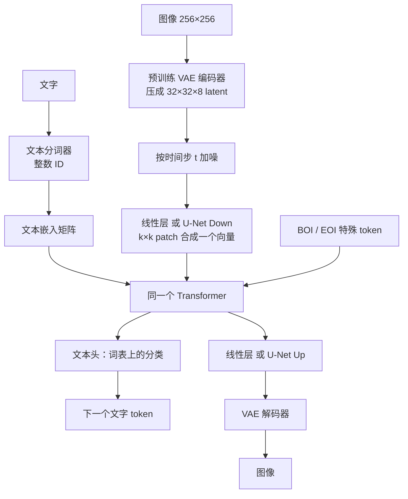
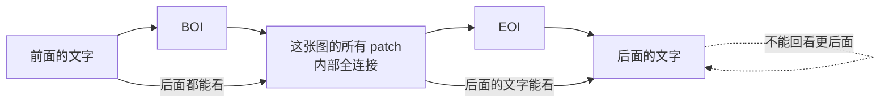
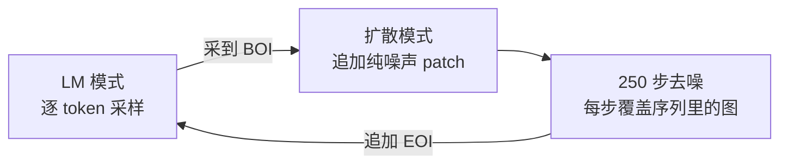

# Transfusion：同一个 Transformer，既预测下一个词，又给图像去噪

<!-- release-date: 2024-08-20 -->

> 本文依据 ICLR 2025 camera-ready：**Transfusion: Predict the Next Token and Diffuse Images with One Multi-Modal Model**，共 24 页。首页印有 `Published as a conference paper at ICLR 2025`，作者单位写法是「Work done at Meta」（另有一位作者署 University of Southern California）。
>
> 同一工作的预印本是 arXiv:2408.11039v1（2024-08-20 提交，23 页）。本地件已经是正式会议版，**全文页码一律用本 ICLR PDF 自身页码**，不要拿 23 页预印本的页码来对。ICLR 版每页多了一行会议页眉，分页与预印本不同。
>
> 文中始终分开三层：**报告写了什么**、**我们如何解释**、**哪些是外部补充**。数字紧跟页码；只在图里出现的数会标明读自哪张图。

## 读这篇之前，先分清两种生成动作

语言模型和文生图模型看起来都在「生成」，动作其实完全不像。

- **Next-token prediction（预测下一个词元）**：把文字切成一串离散符号（token），模型每次只从词表里挑下一个。它是串行的、离散的。训练目标叫语言模型损失（LM loss），本质是分类。
- **Diffusion（扩散）**：从一张纯噪声出发，反复预测并减去噪声，整张图一起改。它是并行的、连续的。训练目标是回归：预测加进去的那份高斯噪声。
- **VAE（变分自编码器）与 latent（潜变量）**：直接在像素上扩散太贵。先把图压成更小的连续张量，再在压缩后的空间里扩散。压缩后的张量叫 latent。
- **Patch（图像块）**：把 latent 切成小方块，摊成一条序列，才能送进 Transformer。
- **Causal attention（因果注意力）与 bidirectional attention（双向注意力）**：前者规定每个位置只能看它左边；后者允许一块区域内互相都看。
- **CFG（Classifier-Free Guidance，无分类器引导）**：推理时把「有提示词的预测」和「没提示词的预测」做对比外推，让图更贴文字，代价是每步算两遍。

本模块里已经有一条把图像**量化成离散 token**、再用语言模型画图的路线，见 [Janus-Pro](../DeepSeek/Janus-Pro.md)。Transfusion 走的是相反选择：图像保持连续，用扩散来画。两边不是谁的续作，而是同一个矛盾的两种解法。后面会对照，但不按 Janus 的章节来讲这篇。

## 先说矛盾：离散文字和连续图像，为什么难塞进同一个模型

写一句话和画一张图，对模型来说是两种物理上不同的计算。

写字时，模型必须遵守时间顺序。看见「一只」，才能预测「猫」。如果训练时让它偷看后面的字，推理时一个一个往外吐就会对不上。所以文字用因果注意力、用分类损失。

画画时，左上角的天空和右下角的草地必须同时知道彼此。先画完左边再画右边，构图会对不齐。扩散模型因此对整张图做双向注意力，用回归损失去预测噪声。

把这两件事塞进**同一个 Transformer、同一份权重、同一条序列**，至少会撞上四堵墙：

| 维度 | 文字要什么 | 图像要什么 |
|---|---|---|
| 数据形态 | 词表里的整数 ID | 连续向量 |
| 预测方式 | 一次一个离散符号 | 整块一起改、改很多轮 |
| 注意力 | 因果：只看前面 | 双向：同一张图里互相都看 |
| 损失函数 | 交叉熵 | 均方误差 |

2024 年前后，公开做法大致有三条，报告在引言里都点了名（PDF p. 1）：

1. **把扩散模型当工具**：语言模型负责理解提示词，真正画图外包给另一个预训练好的扩散模型。两个网络、两套权重，谈不上「一个模型」。
2. **把图像量化成离散 token**：用 VQ-VAE 一类的码本，把每块图像变成一个整数编号，然后整条序列都按语言模型来训。架构变简单了，但量化会丢掉信息。
3. **Transfusion 要证明的第三条**：不要量化，也不要外挂。同一个 Transformer 对文字做 next-token，对图像做扩散。

报告把第二条称为 Chameleon 路线（PDF p. 1、p. 6）。Chameleon 和 Janus 系列同属「离散视觉 token + 自回归」家族；本篇的对照实验跑的是 Chameleon 配方，不是 Janus。不要把后面的数字理解成「对 Janus 的胜负」。

## 一句话结论

Transfusion 不是一个新的骨干网络，而是一份**从零预训练的配方**：在同一条混合序列上，文字走语言模型损失，图像走扩散损失；注意力对文字保持因果、对同一张图内部放开双向；图像进出主干时用轻量的模态特定层，必要时还能把一张图压到 16 个 patch。

把这条配方放大到 7B 参数、2T 多模态 token 之后，报告给出的成绩是：文生图进入当时开源扩散模型的同一档，文字达到 Llama 1 7B 的水平（PDF p. 2、p. 10）。它真正想证明的不是「扩散比自回归更强」，而是：

> **离散和连续不必先统一成同一种符号。只要损失、掩码和进出接口按模态分开，同一份 Transformer 权重可以同时把两件事做好。**

## 报告地图：24 页里各写了什么

这份 PDF 24 页。正文到第 10 页结束，参考文献占第 11–16 页，附录和第 21–24 页的样例图占剩下篇幅。先摊开，后面就知道哪里能深挖、哪里只能到此为止。

| 报告章节 | PDF 页 | 讲了什么 |
|---|---|---|
| 摘要 + §1 引言 | p. 1–2 | 配方定位；与量化路线、外挂扩散的对比；头条数字 |
| Figure 1 | p. 2 | 一条序列里文字自回归、图像并行扩散 |
| §2.1 语言模型 | p. 2 | next-token 与 LM 损失，式 (1) |
| Figure 2 | p. 3 | 7B / 2T 模型的八张生成样例（展示，不是证据） |
| §2.2 扩散 | p. 2–4 | 前向加噪、反向去噪、余弦调度、CFG，式 (2)(3) |
| Figure 3 / Figure 4 | p. 4 | VAE + 线性或 U-Net 编解码；混合注意力掩码 |
| §2.3 潜空间 | p. 4 | 连续 VAE 对离散 VQ-VAE |
| §3 方法 | p. 4–5 | 数据表示、架构、掩码、损失、推理切换 |
| §4.1 实验设置 | p. 5–7 | 评测、Chameleon 基线、数据、优化、推理超参 |
| Figure 5 + Table 1 | p. 7 | 与 Chameleon 的受控 scaling |
| §4.2 + Table 2 | p. 7–8 | 为什么量化路线连纯文本都更差 |
| §4.3 + Table 3–5 | p. 8–9 | 掩码、patch 大小、线性对 U-Net |
| §4.4 + Table 6 | p. 9–10 | 7B / 2T 对文献里专用模型的文生图对照 |
| §4.5 + Figure 6 | p. 9–10 | 8k 样本微调后的图像编辑（定性） |
| §5 结论 | p. 10 | 一句收束，几乎不谈限制 |
| 参考文献 | p. 11–16 | — |
| Table 7 / Table 8 | p. 17 | 评测套件；五档模型配置 |
| 附录 A 相关工作 | p. 17 | Flamingo / LLaVA / Fuyu / Chameleon 等 |
| 附录 B.1 | p. 17–19 | 设置的完整版；Table 9、Table 10 |
| 附录 B.2 + Table 11 | p. 19–20 | 图在前、文在后时要限制噪声 |
| 附录 C | p. 20 | VAE / VQ-VAE 损失 |
| 附录 D / E + Figure 7–10 | p. 20–24 | 生成与编辑的更多样例 |

两件事先说清：

1. **这是训练配方论文，不是产品发布。** 报告从头到尾没有开放权重、没有推理服务、没有 GPU 数。`release-date` 因此取这项技术首次官方公开的日期，见文末。
2. **「压到 16 个 patch」和「7B / 2T 旗舰」不是同一个模型。** 16 patch 出现在 0.76B 的消融里（PDF p. 9）；旗舰 7B 用的是 2×2 latent patch，一张图 256 个位置（PDF p. 9–10）。后文会分开写。

## 全景：一条序列，两种损失，一份权重

先看整体，再拆零件。下图按 Figure 1 和 Figure 3 重画（PDF p. 2、p. 4），属于**机制示意**，不含实测数据。

读这张图时抓住四件事：

1. **主干是一份。** 绝大多数参数在那个 Transformer 里，文字和图像都过它（PDF p. 5）。
2. **进出接口是两套。** 文字用嵌入矩阵；图像用线性层或 U-Net 的下/上采样块。这两套参数不共享（PDF p. 5）。
3. **VAE 是预训练好的，不参与这场对比的变量。** Transfusion 用连续 VAE，Chameleon 用带量化层的 VQ-VAE；报告强调两者的数据、算力和编解码器结构相同，唯一差别是量化层和码本损失（PDF p. 6、p. 20）。
4. **特殊 token 负责切换模态。** `BOI` 表示图像开始，`EOI` 表示图像结束（PDF p. 2、p. 4）。推理时采到 `BOI` 就从「写字模式」切到「去噪模式」。

一个具体例子。序列可以是：

`A cute cat . <BOI> [图的若干 patch] <EOI> What color is its nose ?`

前半段要模型接着写字，中间那段要模型给整张图去噪，后半段又回到写字——此时文字可以看见前面那张图（PDF p. 2）。

## 对照路线：为什么报告死盯着「把图像变成词」

### 旧问题

把图像量化成离散 token，表面上把矛盾取消了：图也变成整数 ID，损失也变成交叉熵，注意力也可以全部用因果。DALL-E、Parti、Chameleon、后来的 Janus 都走这条路。

代价写在引言里：量化是信息瓶颈，会丢掉信息（PDF p. 1）。码本只有固定数量的候选向量——Chameleon 这条对照线用 16384 个词类型（PDF p. 6）——原图里对不进码本的细节，在编码那一刻就没了。

### 报告自己做的对照，而不是我们事后找的

报告没有拿别人已经训好的 Chameleon 来比。它按 Chameleon 的配方自己训了一族受控基线：同一套数据、同一档参数、同一份算力；VAE 与 VQ-VAE 除量化层外保持一致（PDF p. 6）。这样比的是「连续扩散对离散 token」这件事本身，而不是「Meta 的数据和别人的数据」。

Chameleon 相对 Llama 架构还多了几处为了稳住训练的改动：query-key 归一化、post-normalization、denominator loss，以及把学习率降到 $1 \times 10^{-4}$（PDF p. 6）。报告在脚注里写：去掉这些改动，Chameleon 会遇到优化不稳定（PDF p. 6 脚注 3）。所以这条基线并不「干净」——它既换了图像表示，又换了训练稳定性补丁。后文 Table 2 会把这两件事拆开。

### 和 Janus 路线的关系（外部对照，不是报告原文）

[Janus-Pro](../DeepSeek/Janus-Pro.md) 把理解和生成的视觉编码器拆开，但生成侧仍然是 VQ tokenizer + 自回归。它解决的是「看图和画图共用一只眼睛」；Transfusion 解决的是「离散预测和连续扩散共用一个主干」。两个问题正交。HunyuanImage 3.0 后来在一个预训练 LLM 上**沿用了 Transfusion 的混合损失**，见 [HunyuanImage 3.0](../Tencent/HunyuanImage-3.0.md)；那是 2025 年的后续，本报告不可能讨论它。

## 核心设计一：混合注意力掩码

### 旧问题

因果掩码是语言模型能并行训练的前提：位置 $i$ 看不到 $i$ 之后的 token，于是一次前向就能得到每个位置的损失，并且和推理时一个一个生成时看见的东西一致。

图像不吃这套。如果一张图的 patch 也强制从左到右、从上到下只能看前面，右下角的信息永远流不到左上角。报告后来说，线性编码若改用纯因果注意力，FID 会从双向的 20.3 恶化到 61.3（PDF p. 8，Table 3）。

### 新设计

Transfusion 的规则只有两句（PDF p. 5）：

- 整条序列默认还是因果注意力：后面的元素不能看后面才出现的元素；
- 同一张图内部的 patch 互相都可以看。

于是：每个图像 patch 能看见同一张图的全部其他 patch，但只能看见序列里出现在这张图之前的文字，以及其他更早出现的图。图后面的文字可以看见这张图，因为它们在序列上更靠后。

Figure 4 把这张掩码画成矩阵：文字区域是下三角，图像那一块是实心方块（PDF p. 4）。

这张图是机制示意，不是 Figure 4 的逐格复制。

### 工作机制

可以把它想成两种交通规则贴在同一条路上。车道线（文字）仍然是单向的；停车场（一张图）内部可以任意掉头。车一旦开出停车场，就不能再开回去改已经写出去的字。

训练时整条序列一次前向算完。文字位置拿因果上下文预测下一个词；图像位置拿同一张图的全部 patch（外加前面的文字）预测噪声。

### 收益

Table 3 在 0.76B、2×2 patch 上把因果和双向做了对照（PDF p. 8）：

| 编解码 | 注意力 | C4 PPL↓ | CIDEr↑ | FID↓ | CLIP↑ |
|---|---|---:|---:|---:|---:|
| 线性 | 因果 | 10.4 | 12.7 | 61.3 | 23.0 |
| 线性 | 双向 | 10.4 | 16.0 | 20.3 | 24.0 |
| U-Net | 因果 | 10.3 | 23.3 | 16.8 | 25.3 |
| U-Net | 双向 | 10.3 | 25.4 | 16.7 | 25.4 |

线性编码时，双向注意力把 FID 从 61.3 拉到 20.3，这是全表最剧烈的一跳。纯文本几乎不动。说明这张掩码主要在救图像，而不是在给语言模型开后门。

U-Net 行的差距小得多。报告给的原因：U-Net 块自己内部已经有双向注意力，不依赖 Transformer 的掩码（PDF p. 8）。即便如此，CIDEr 仍从 23.3 升到 25.4，双向仍有用。

### 代价与边界

混合掩码让图像区域变成一块「非因果」的洞。下面这句是我们的推断，不是报告原文：标准因果注意力算子的快路径通常假设整条序列都是下三角掩码，这块洞会让现成快路径不能直接套用。报告完全没有写注意力算子怎么实现、这块洞对吞吐有多大影响。这是复现时的系统题，不是论文里的现成答案。

另外，掩码按「一张图」切块，不按「所有图像」切块。序列里如果出现第二张图，它只能看第一张图，不能和第一张图双向互通（PDF p. 5）。预训练数据里图文对是一对一对出现的，这个限制当时不明显；要做多图交错编辑，这条规则就需要再想。

### 可迁移启发

> **不要为了架构好看而强迫两种模态用同一种注意力。先问每种模态在生成时必须看见谁，再把掩码写成这些可见性的并集。**

文字的可见性是前缀；图像的可见性是同一张画布。并起来就是这张混合掩码。后面 HunyuanImage 3.0 的广义因果注意力是同一条规则的后裔，那是外部事实，本报告只给了 Figure 4 这一版。

## 核心设计二：模态特定编解码，以及「一张图 16 个 patch」

### 旧问题

VAE 已经把 256×256 像素压成 32×32×8 的 latent，相当于每个 8×8 像素块变成一个 8 维向量（PDF p. 18）。如果每个 latent 像素都占 Transformer 的一个位置，一张图就是 1024 个 token。上下文窗口 4096 时，四张图就会把窗口占满。

服务成本大致跟序列长度走。图像占得越长，能装的文字越少，扩散每一步也越贵。

### 新设计

在 VAE 和 Transformer 之间再加一层「patch 聚合」：把 $k \times k$ 个相邻 latent 像素收成一个 Transformer 向量，反向再展开。报告试了两种实现（PDF p. 5、Figure 3）：

1. **线性层**：就是一个矩阵乘法，参数量可以忽略（所有配置下额外参数都不到 0.5%）（PDF p. 6）。
2. **U-Net 的 Down / Up 块**：带卷积和块内注意力，额外参数合计 0.27B。对 7B 主干只多 3.8%，和对嵌入矩阵的参数量几乎一样；对 0.16B 主干则是 +106.1%，等于再加一个同等大小的网络（PDF p. 6、p. 19）。

$k$ 取 1、2、4、8 时，一张 256×256 的图在序列里分别占 1024、256、64、16 个位置（PDF p. 9、p. 18 脚注 7）。16 就是摘要里那句 “compress each image to just 16 patches” 的来源（PDF p. 1）。

压缩倍数和「每张图看到的算力」是一笔账。训练时文字/图像的 token 比例固定为 1:1，所以 $k$ 越大，同样的 0.5T token 预算里能塞进更多张图，但每张图分到的 Transformer 计算更少（PDF p. 18 脚注 7）。

### 工作机制

数据流按 Figure 3（PDF p. 4）：

1. 预训练 VAE 把像素编成 latent；
2. 按扩散时间步 $t$ 加噪，得到 $x_t$；
3. 线性层或 U-Net Down 把 $k \times k$ 的窗口收成 Transformer 输入；
4. Transformer 出隐状态；
5. 线性层或 U-Net Up 把隐状态还原成 latent 分辨率；
6. 在 latent 上算扩散损失；推理时再交给 VAE 解码器变回像素。

U-Net 块干的事情和主干不同。主干在看「这些 patch 和前面的文字是什么关系」；U-Net 在看「这 $k \times k$ 个相邻 latent 像素自己内部的局部结构」。把局部归纳偏下放在小网络里，主干就不必用自注意力去学 3×3 邻域这种事。

### 收益

先看 patch 大小。Table 9 是 0.76B 上的完整对照（PDF p. 19；Table 4 是它的 U-Net 子集，PDF p. 9）：

| 编解码 | latent / patch | 像素 / patch | 每图 patch 数 | C4 PPL↓ | CIDEr↑ | FID↓ | CLIP↑ |
|---|---|---|---:|---:|---:|---:|---:|
| 无（1×1） | 1×1 | 8×8 | 1024 | 10.3 | 12.0 | 21.0 | 24.0 |
| 线性 | 2×2 | 16×16 | 256 | 10.4 | 16.0 | 20.3 | 24.0 |
| 线性 | 4×4 | 32×32 | 64 | 10.9 | 14.3 | 25.6 | 22.6 |
| 线性 | 8×8 | 64×64 | 16 | 11.7 | 11.3 | 43.5 | 18.9 |
| U-Net | 2×2 | 16×16 | 256 | 10.3 | 25.4 | 16.7 | 25.4 |
| U-Net | 4×4 | 32×32 | 64 | 10.7 | 29.9 | 16.0 | 25.7 |
| U-Net | 8×8 | 64×64 | 16 | 11.4 | 29.5 | 16.1 | 25.2 |

两件事同时成立：

- **线性层压不动。** 从 256 patch 压到 16，FID 从 20.3 掉到 43.5，CLIP 从 24.0 掉到 18.9。少位置省了算力，图也糊了。
- **U-Net 压得动。** 16 patch 的 FID 是 16.1，和 64 patch 的 16.0 几乎一样，CIDEr 还从无聚合的 12.0 升到 29.5。报告的解释：同样 token 预算下看了更多张图、见了更多扩散噪声（PDF p. 8）。

16 对 1024 是 64 倍序列压缩。报告据此说，服务成本有可能降到原来的 1/64（PDF p. 2）。这是按序列长度做的上界估计，不是测出来的端到端延迟。

再看「U-Net 的好处到底是归纳偏置，还是只是多了参数」。报告把主干放大、U-Net 参数几乎保持不变。7B 时 U-Net 只占 +3.8%（PDF p. 9）。Table 5 / Table 10（PDF p. 9、p. 19）：

| 主干 | 编解码 | 额外参数 | CIDEr↑ | FID↓ |
|---|---|---:|---:|---:|
| 0.37B | 线性 | 0.4% | 11.1 | 21.5 |
| 0.37B | U-Net | 71.3% | 21.1 | 18.1 |
| 1.4B | 线性 | 0.4% | 19.1 | 19.4 |
| 1.4B | U-Net | 19.3% | 28.1 | 16.6 |
| 7B | 线性 | 0.3% | 27.2 | 18.6 |
| 7B | U-Net | 3.8% | 33.7 | 16.0 |

相对收益随主干变大而缩小，但没有消失。1.4B + U-Net（合计约 1.67B）的 CIDEr 是 28.1，已经超过线性 7B 的 27.2；0.37B + U-Net 的 FID 是 18.1，也优于线性 7B 的 18.6（PDF p. 9）。报告的判断：U-Net 确实有超出「多加参数」的归纳偏置。

注意 Table 5 的 FID 用的是 5k 图，Table 1 的 FID 用的是 30k 图（PDF p. 6 脚注 2）。两张表的 FID 不能直接横比。

### 代价与边界

压缩不是免费的。U-Net 8×8（16 patch）的 C4 PPL 从 10.3 升到 11.4，Llama 准确率从 51.9 降到 49.2（PDF p. 9）。报告的猜测：patch 越少，模型越要把参数花在「怎么读图」上，留给文字的容量就少了（PDF p. 8）。

旗舰 7B / 2T 并没有用 16 patch，而是用 U-Net 2×2、每图 256 patch（PDF p. 9）。摘要把 16 patch 写成能力，实验上它只在 0.76B、0.5T 的消融里被验证。不要把「7B 模型一张图只占 16 个位置」写进自己的笔记。

U-Net 的结构细节（通道数、层数、是否带时间步条件）报告没写，只给了两个引用：Nichol & Dhariwal 2021、Saharia et al. 2022（PDF p. 5）。复现时这一块需要自己补。

### 可迁移启发

> **能用一个小的、带正确归纳偏置的模态前端把序列压短，就不要让主干去看原始分辨率。**

线性层几乎不花钱，但也几乎不帮忙。真正让 16 patch 成立的是 U-Net 那种「懂二维邻域」的前端。换到别的连续模态（频谱、点云、动作轨迹），值得先问：有没有一个便宜的、模态自己的局部结构模块，能在进 Transformer 之前把长度降下来？

## 核心设计三：$\mathcal L_{\mathrm{LM}} + \lambda \cdot \mathcal L_{\mathrm{DDPM}}$

### 旧问题

同一个网络的输出，要同时喂给一个分类头和一个回归头。损失的量纲不同、尺度不同、对参数的拉力也不同。随便加在一起，其中一个会把另一个淹死。

### 新设计

文字位置用标准 next-token 交叉熵，图像位置用 DDPM 的噪声预测均方误差，再乘一个平衡系数 $\lambda$（PDF p. 5，式 4）：

$$
\mathcal L_{\mathrm{Transfusion}} = \mathcal L_{\mathrm{LM}} + \lambda \cdot \mathcal L_{\mathrm{DDPM}}
$$

$\lambda = 5$，来自初步实验；报告明确把继续调 $\lambda$ 留给未来工作（PDF p. 6、p. 19）。

### 工作机制

先把两个损失各自说成人话。

语言模型损失（PDF p. 2，式 1）是「每个词位置上，正确那个词的对数概率，取负再平均」：

$$
\mathcal L_{\mathrm{LM}} = \mathbb{E}_{y}\left[-\frac{1}{n}\sum_{i=1}^{n} \log P_{\theta}(y_i \mid y_{<i})\right]
$$

扩散这一侧分两步。前向过程按时间步 $t$ 把原图 $x_0$ 加成带噪版本 $x_t$（PDF p. 3，式 2）：

$$
x_t = \sqrt{\bar\alpha_t}\, x_0 + \sqrt{1-\bar\alpha_t}\,\epsilon,\qquad \epsilon \sim \mathcal N(0,I)
$$

$\bar\alpha_t$ 由噪声调度决定。本报告用余弦调度，大致是 $\sqrt{\bar\alpha_t} \approx \cos(\frac{t}{T}\cdot\frac{\pi}{2})$，并带一些调整（PDF p. 3）。$T = 1000$（PDF p. 6）。

模型不直接预测 $x_0$，而是预测这份噪声 $\epsilon$。损失是均方误差（PDF p. 3，式 3）：

$$
\mathcal L_{\mathrm{DDPM}} = \mathbb{E}_{x_0,t,\epsilon}\left[\big\|\epsilon - \epsilon_{\theta}(x_t, t, c)\big\|^2\right]
$$

$c$ 是上下文，比如这张图前面的 caption。加噪发生在 patch 化之前、对整张 latent 图进行；损失按图像计，不按 patch 计（PDF p. 5）。同一个 $t$ 加在整张图上，所以一张图的所有 patch 共享同一个噪声水平。

训练时每个 step 两种模态、两个损失都在（PDF p. 1）。不是今天训文字、明天训图像。

报告把这套写法看成一个更宽的模板：离散分布损失加连续分布损失，优化同一份参数。用流匹配替换扩散被明确列为未来工作（PDF p. 5）。本报告的实验全部是 DDPM，不是流匹配。

### 收益

后面的 scaling 显示，这个简单加权没有把文字冲垮。0.76B 上，相对纯 Llama 2 配方，加入图像扩散之后 C4 PPL 只从 10.1 升到 10.4，Llama 准确率从 53.7 降到 52.7（PDF p. 8，Table 2）。报告称之为「非零但很小的文字代价」（PDF p. 8）。

### 代价与边界

$\lambda = 5$ 没有消融表。不知道 1、5、10 会差多少，也不知道损失是否按 token 数或按图像数再归一化。报告只说「简单地加起来」（PDF p. 5）。

还有一个训练和推理不一致的点。扩散训练时输入的是带噪图 $x_t$，因此**图后面的文字在训练时看见的是噪图**（PDF p. 5 脚注 1）。推理时图已经去噪完成，后面的问句看见的是干净图。附录 B.2 专门处理了这个问题。

### 可迁移启发

> **异质目标不必先翻译成同一种损失。先让每个模态用自己最成熟的目标，再用一个标量去平衡；这个标量值得单独做实验，不要埋进「其余超参」。**

$\lambda$ 在这篇里被写成「初步实验得到 5」，这本身就是一个可迁移的反面教材：最关键的配比，恰恰没有被当成一等公民来消融。

## 核心设计四：推理时在两种解码模式之间切换

### 旧问题

训练可以在一条序列上同时算两种损失。推理必须选出一个具体样本。文字要一个 token 一个 token 采；图像要在噪声上迭代几百步。两套标准做法不能直接并成一次 `generate()`。

### 新设计

解码算法按当前模式切换（PDF p. 5）：

1. 默认是 **LM 模式**：按语言模型的分布逐 token 采样（评测时用贪心解码）（PDF p. 6）。
2. 一旦采到 `BOI`，切到 **扩散模式**：在序列里追加 $n$ 个纯噪声 patch（$n$ 由目标分辨率决定），然后走 $T$ 步去噪。
3. 每一步 $t$，模型根据当前 $x_t$ 预测噪声，按调度减去相应的量，得到 $x_{t-1}$，**用 $x_{t-1}$ 覆盖序列里的 $x_t$**。模型始终只看最新这一帧带噪图，不看更早的时间步。
4. 去噪结束，追加 `EOI`，切回 LM 模式。

训练用 1000 步，推理用 250 步（PDF p. 6）。这是扩散模型的常规做法，不是本报告的发明。

### 工作机制

CFG 在扩散模式里使用。受控对照实验跟 Chameleon 一样取系数 5；报告说这个值对 Transfusion 不是最优，消融改成 3；旗舰实验按基准分别调（PDF p. 6–7）。CFG 的代价是每步算两遍：一遍有上下文 $c$，一遍无条件（PDF p. 4）。

### 收益

这套切换让「任意文字和图像的混合物」在推理时都能生成（PDF p. 5）。理论上可以写一段话、画一张图、再继续写、再画第二张。预训练主要覆盖的是图文对，不是任意交错；任意混合物是解码算法提供的能力，不是数据里充分训练过的分布。

### 代价与边界

扩散 250 步意味着生成一张图要跑 250 次完整前向（CFG 打开则接近 500 次）。自回归画图是「一个 patch 一次前向」，次数等于 patch 数（256 或 16）；扩散是「整张图一次前向，但要重复数百次」。两种生成的延迟结构完全不同，报告没有给任何一侧的实测延迟或显存。

覆盖式更新（overwrite $x_t$）意味着扩散轨迹不进 KV cache 的历史。这省显存，但也让模型无法回看「刚才第 800 步长什么样」。报告没讨论这是否限制了生成质量。

### 可迁移启发

> **训练时两种损失可以同时存在；推理时必须有一个显式的模态开关。** 把开关做成特殊 token（`BOI` / `EOI`）的好处是：开关本身也是语言模型可以学习的符号，不需要外部控制器先决定「下一张是图还是字」。

## 数据、VAE 和训练 recipe

报告把几乎所有实验的设置写在 §4.1，完整版在附录 B.1。没有 GPU 数、没有并行策略、没有训练墙钟时间。下面只记写出来的部分。

### 五档模型

配置跟 Llama 的标准设定走（PDF p. 17，Table 8）：

| 参数量 | 层数 | 嵌入维 | 注意力头 |
|---|---:|---:|---:|
| 0.16B | 16 | 768 | 12 |
| 0.37B | 24 | 1024 | 16 |
| 0.76B | 24 | 1536 | 24 |
| 1.4B | 24 | 2048 | 16 |
| 7B | 32 | 4096 | 32 |

全部随机初始化，从零训（PDF p. 18）。用的是 Llama 2 的分词器和语料，不是从 Llama 2 权重继续训。这一点和 HunyuanImage 3.0 那种「拿一个已经会说话的 MoE 教它画画」不同。

### 两档数据预算

**受控实验（几乎全部 scaling 和消融）**（PDF p. 6）：

- 共 0.5T token（patch 也按 token 计），文字:图像 = 1:1；
- 文字：Llama 2 语料，总量 2T，这里只用其中一部分；
- 图像：3.80 亿张授权的 Shutterstock 图文对；中心裁剪并缩到 256×256；
- 图和 caption 的顺序随机，**80% caption 在前**（PDF p. 6）。

**旗舰实验 §4.4**（PDF p. 6、p. 9）：

- 共 2T token：1T 文字 + 约 35 亿图文对（按每图 256 patch 计）；
- 另加 2.20 亿张公开图文对，预先滤掉含人的图；
- 上采样 8000 万张含人的 Shutterstock，用来把人像分布拉回来；
- 再加入 Conceptual 12M（CC12M）；
- 每个 epoch 合计 6.92 亿图文对，大约 5 个 epoch；
- 训练日程最后 1% 上调高美学图像的权重。

公开那 2.20 亿张图的具体来源，除 CC12M 被点名外，报告没写。不要补成 LAION 或其他名字。

### 优化

AdamW，$\beta_1=0.9$，$\beta_2=0.95$，$\epsilon=10^{-8}$；学习率 $3 \times 10^{-4}$，4000 step 热身，余弦降到 $1.5 \times 10^{-5}$（PDF p. 6）。weight decay 0.1，梯度裁剪 1.0（PDF p. 18–19）。

受控实验：序列 4096，batch 2M token，25 万 step，合计 0.5T（PDF p. 6）。

旗舰：batch 4M token，50 万 step，合计 2T（PDF p. 6）。

Chameleon 基线的学习率是 $1 \times 10^{-4}$，这是稳定性补丁的一部分，不是同一套优化器超参（PDF p. 6）。

### VAE

86M 参数，CNN 编解码器，latent 维 8，256×256 → 32×32×8，训 100 万 step（PDF p. 6、p. 18）。损失按 Esser et al. 2021（PDF p. 20）：

$$
\mathcal L_{\mathrm{VAE}} = \mathcal L_1 + \mathcal L_{\mathrm{LPIPS}} + 0.5\,\mathcal L_{\mathrm{GAN}} + 0.2\,\mathcal L_{\mathrm{ID}} + 0.000001\,\mathcal L_{\mathrm{KL}}
$$

对抗损失从第 5 万 step 才加入，先让重建过关（PDF p. 20）。VQ-VAE 把 $\mathcal L_{\mathrm{KL}}$ 换成码本 commitment 损失，$\beta = 0.25$，权重 1.0；码本 16384（PDF p. 6、p. 20）。除此之外，两边的数据、算力、结构相同。

### 图在前时的噪声上限

80% 样本是 caption 在前、图在后，图可以干净地条件在文字上。剩下 20% 是图在前、caption 在后，用来练看图说话；可是扩散目标会把这张图加噪，于是 caption 在训练时看着一张脏图（PDF p. 19）。

附录 B.2 把这 20% 的噪声时间步上限设为 $t = 500$（调度的一半）。Table 11（PDF p. 20）：

| 模型 | 限制噪声 | CIDEr↑ | FID↓ | Llama Acc↑ |
|---|---|---:|---:|---:|
| 0.76B U-Net | 否 | 25.4 | 16.7 | 51.9 |
| 0.76B U-Net | 是 | 29.4 | 16.5 | 52.1 |
| 7B U-Net | 否 | 33.7 | 16.0 | 61.1 |
| 7B U-Net | 是 | 35.2 | 15.7 | 60.9 |

CIDEr 明显上涨，其他指标变化不到 1%，报告因此把超过 1% 的格子加粗（PDF p. 20）。看图说话依赖「图还认得出来」；扩散又必须看过很脏的图。把「图作为条件」时的噪声打一个上限，是在两件事之间折中。

受控对照和主消融默认没有开这个限制。Table 3–5 里的 CIDEr 应被理解为偏低的版本。

## Scaling：同一算力下，连续扩散全面压过量化路线

§4.2 是全文的主实验。Transfusion 这一侧为了公平，只用线性 2×2 编解码加双向注意力，不把 U-Net 的额外参数算进便宜里（PDF p. 7）。FLOPs 用 $6ND$ 做代理，$N$ 是参数量，$D$ 是 token 数（PDF p. 7）。

Figure 5 是六张 log-log 图：C4 / Wikipedia 的困惑度、Llama 2 评测套件准确率、MS-COCO 的 CIDEr / FID / CLIP，横轴都是 FLOPs（PDF p. 7）。报告的读图结论：每张图上 Transfusion 的趋势线都更好；线几乎平行，但有稳定的间距。

Table 1 给出 7B、0.5T 这一档的绝对数字，以及 **Parity FLOP Ratio**：Transfusion 要达到 Chameleon 7B 同一分数，需要的相对 FLOPs（PDF p. 7）。

| 指标 | Transfusion 7B | Chameleon 7B | 持平所需相对 FLOPs |
|---|---:|---:|---:|
| C4 PPL↓ | 7.72 | 8.41 | 0.489 |
| Wiki PPL↓ | 4.28 | 4.69 | 0.526 |
| Llama Acc↑ | 61.5 | 59.1 | 0.600 |
| CIDEr↑ | 27.2 | 18.0 | 0.218 |
| FID↓ | 16.8 | 29.6 | 0.029 |
| CLIP↑ | 25.5 | 24.3 | 0.319 |

把这些比例读成人话（PDF p. 2、p. 7）：

- 文生图的 FID，Transfusion 用约 1/34 的算力追上 Chameleon 7B（$1/0.029 \approx 34$）；绝对 FID 大约低一半（29.6 对 16.8，报告写成 approximately 2× lower）；
- CLIP 和 FID 合在一起，报告说「不到三分之一算力就超过 Chameleon」——CLIP 的 0.319 确实在 1/3 附近，FID 则远超这个倍数；
- 看图说话（CIDEr）在 21.8% 的 FLOPs 上持平；
- 连纯文本也更省：困惑度持平大约只要 Chameleon 的 50%–60% FLOPs。

最后一条是报告自己也觉得意外的（PDF p. 7）：两边对文字用的是同一种语言模型目标，按理不该差。Table 2 把从 Llama 2 配方走到两条多模态配方的过程拆开，模型都是 0.76B（PDF p. 8）：

| 配方 | batch | C4 PPL↓ | Wiki PPL↓ | Llama Acc↑ |
|---|---|---:|---:|---:|
| Llama 2 | 1M 文字 | 10.1 | 5.8 | 53.7 |
| Transfusion：加扩散 | +1M 图像 patch | 10.4 | 6.0 | 52.7 |
| Chameleon：只加稳定性补丁 | 1M 文字 | 11.0 | 6.3 | 51.9 |
| Chameleon：再对图像 token 算 LM 损失 | +1M 图像 token | 11.8 | 6.8 | 48.9 |

读这张表时，三步是分开的：

1. 加扩散、加图像，文字只掉一点（53.7 → 52.7）。
2. Chameleon 那些为了稳住训练的架构补丁，**即使还没加图像**，已经把准确率打到 51.9。
3. 再把量化图像 token 推进词表、和文字抢输出分布，又掉到 48.9。

报告给了两个假说，都没做判决实验（PDF p. 8）：量化图像 token 和文字在同一个 softmax 里竞争；或者扩散画图更省参数，于是更多容量留给文字。能确定的只有现象：量化路线的文字损失，大于「连续图像 + 扩散」的文字损失。

Llama 2 评测套件是 HellaSwag、PIQA、SIQA、WinoGrande、ARC-e / ARC-c、BoolQ 的 0-shot 平均准确率（PDF p. 17 脚注 4）。

## 放大到 7B / 2T：和专用模型比，而不是和自己的基线比

§4.4 换了一套更偏向画图的选择：U-Net 编解码、2×2 patch、2T token、数据混合见上一节（PDF p. 9）。参数量写成 7.3B，即 7B 主干加 0.27B U-Net（PDF p. 10）。

Table 6 是和文献数字的对照，不是受控实验（PDF p. 10）。除 Chameleon 外，其余模型都只会一种模态。带 `*` 的是冻住的文本编码器参数。

| 模型 | 参数 | 文字 token | 图像数 | Llama Acc↑ | COCO FID↓ | GenEval↑ |
|---|---|---|---|---:|---:|---:|
| Llama 1 7B | 7.1B | 1.4T | — | 66.1 | — | — |
| Llama 2 7B | 7.1B | 2.0T | — | 66.3 | — | — |
| Chameleon | 7.1B | 6.0T | 50 亿 | 67.1 | 26.74 | 0.39 |
| DALL-E 2 | 4.2B + 1B* | — | 26 亿 | — | 10.39 | 0.52 |
| SDXL | 2.6B + 0.8B* | — | 16 亿 | — | — | 0.55 |
| DeepFloyd | 5.5B + 4.7B* | — | 75 亿 | — | 6.66 | 0.61 |
| SD 3 | 8B + 4.7B* | — | 20 亿 | — | — | 0.68 |
| Transfusion | 7.3B | 1.0T | 35 亿 | 66.1 | 6.78 | 0.63 |

报告的主张（PDF p. 9–10）：

- 画图：和 DeepFloyd 同一档（FID 6.78 对 6.66，GenEval 0.63 对 0.61），超过 SDXL（0.55）和 DALL-E 2（0.52）；
- 落后于 SD 3 的 0.68。报告指出 SD 3 用了反向翻译的合成 caption，小规模上这一项能把 GenEval 从 0.433 抬到 0.498（+6.5 个绝对百分点）；Transfusion 为了简单只用自然语言数据；
- 文字：Llama Acc 66.1，与 Llama 1 7B 相同，略低于 Llama 2 7B 的 66.3。文字数据是 Llama 2 语料的 1T，不是 Llama 2 的 2T。

Parti 的 FID 7.23 带一个「每条提示采 16 张再重排」的标记，和单次采样不是同一口径（PDF p. 10 表注）。

这张表证明的是「一个模型可以同时进入两张榜」，不是「在相同数据、相同算力下击败 SD 3」。Chameleon 官方模型用了 6T 文字和 50 亿张图，文字更多、FID 却是 26.74——和 §4.2 受控实验的方向一致，但不能和 0.5T 那一行混用。

Figure 2、Figure 7–9 是这个 7B 模型的生成样例（PDF p. 3、p. 21–23）。能写黑板上的 “Transfusion”、能画玻璃球入水、能画「皇家浣熊国王」那种组合概念。它们是展示。报告没有说抽样协议，也没有失败案例。

## 图像编辑：预训练没见过的模态组合

预训练覆盖三种配对：文→文、图→文、文→图。没有图→图（PDF p. 9–10）。

报告用 8000 条公开的图像编辑三元组（输入图、编辑指令、输出图）微调 7B 旗舰，思路来自 LIMA：少量示范，看模型会不会泛化（PDF p. 10）。评测是在 EmuEdit 测试集上人工看随机例子，Figure 6 和 Figure 10 给出「去掉盘子上的纸杯蛋糕」「右边番茄改成青橄榄」「写成 Zebra」「改成卡通风」等（PDF p. 10、p. 24）。

报告自己的措辞很克制：尽管实验有局限，结果暗示 Transfusion 能适应预训练没见过的模态组合（PDF p. 10）。没有 CIDEr、没有 FID、没有编辑成功率。这是存在性观察，不是可复现的编辑 SOTA。

## 限制、没写的事、不要读过的结论

### 报告几乎不谈限制

结论只有三句：桥接离散序列建模和连续媒体生成；用两个目标训一个联合模型；扩展性好、参数共享代价很小、能生成任一模态（PDF p. 10）。没有「本文的失败模式」小节。限制要靠实验设置自己读出来。

### 被证据支持的

- 在数据、参数、算力受控时，连续扩散路线在六项指标上全面优于量化+LM 路线（Figure 5、Table 1）。
- 图内双向注意力对线性编解码是刚需（Table 3）。
- U-Net 前端让大 patch、短序列变得可行，且好处不能完全归因于额外参数（Table 4、Table 5、Table 9、Table 10）。
- 7B / 2T 的 GenEval 0.63、COCO FID 6.78、Llama Acc 66.1，足以说明「一个模型可以同时接近专用扩散模型和同规模 Llama」（Table 6）。
- 量化图像 token 对纯文本的伤害，大于扩散图像对纯文本的伤害（Table 2）。

### 不要读过的

- **没有证明扩散统一模型永远优于离散 token 统一模型。** 对照的是他们复现的 Chameleon 配方，含稳定性补丁和学习率差异。Janus-Pro 后来在 GenEval 上报到 0.80，和本报告的 0.63 不在同一实验里，不能拿来给本报告做结案陈词。
- **没有证明 16 patch 已经够 7B 旗舰使用。** 那是 0.76B 消融。
- **没有证明编辑能力是预训练涌现的。** 那是 8k 样本微调后的定性观察。
- **没有和 SD 3 公平对比。** 数据、合成 caption、文本编码器是否冻结，全都不同。

### 报告没有公开的

- GPU 型号与数量、并行策略、精度、MFU、训练时长、成本；
- Shutterstock 之外那 2.20 亿张公开图的来源、去重、过滤细则；高美学子集如何定义、最后 1% 上采样多少倍；
- $\lambda$ 的选取曲线；U-Net 块的通道、层数、是否注入时间步；
- 混合掩码的算子实现和吞吐代价；
- 旗舰模型在 GenEval 上的分项（只有总分 0.63）；
- 图像编辑的任何定量指标；
- 权重、代码、解码脚本；
- 音频、视频——引言把它们列为连续模态的例子（PDF p. 1），实验全部是图。

附录 A 提到用扩散做离散文本生成这条反向路还没追上自回归 LM（PDF p. 17）。本报告不走那条路。

## 可以带回自己项目的几条

### 先保住每种模态已经验证过的目标函数

统一模型最常见的诱惑是「先把数据变成同一种符号，架构就简单了」。Transfusion 的反建议是：符号可以不同，损失可以不同，只要序列、掩码和主干是一份。Table 1 和 Table 2 说明，为了架构统一去量化，付出的不只是画质，还有文字本身。

### 掩码按「生成时必须看见谁」来写

文字看见前缀，图像看见整张画布。不要为了能用现成的因果核，把图像也砍成单向。如果现成核因此不能用，那是系统问题，不是改需求去迁就内核的理由——当然，报告也没告诉你系统问题怎么解。

### 模态前端的归纳偏置，比「多几个亿参数」更关键

线性层几乎免费，但 16 patch 时会崩。U-Net 在 7B 上只多 3.8% 参数，却让小模型的 FID 超过大得多的线性模型。加模态时优先问「这个模态的局部结构是什么」，再决定前端，而不是先把原始分辨率全部丢给自注意力。

### 压缩序列之前，先看训练预算里「样本数」和「每样本算力」的交换

token 比例锁死的时候，patch 越大，同一预算里图越多、每张图越便宜。U-Net 吃得下这个交换，线性层吃不下。做任何「缩短序列」的改动，都要同时盯两个数：单位成本，和每个样本还能不能被学明白。

### 训练时的脏条件和推理时的干净条件，要单独处理

扩散训练必然加噪。如果同一张图还要当后面文字的条件，噪声上限就是一个独立旋钮。Table 11 只动这一个旋钮，CIDEr 就能从 25.4 到 29.4。多目标系统里，「这个输入在另一条损失里被破坏了」是一类很常见、又很容易漏掉的干扰。

### 从零训和从预训练 LLM 接着训，是两份不同的配方

本报告证明的是：Llama 结构、从零初始化、50% 图 50% 文，能同时学会两件事。它没有证明「把一个已经训好的 LLM 接上扩散头」该怎么做——那是 HunyuanImage 3.0 后来才写的外部故事。不要把这篇的 $\lambda=5$、80% caption 在前、随机初始化直接搬到「已有基座 + 新模态」的项目上。

## 关键词怎么串回整个系统

读完之后，这些词应该已经连成一条链，而不是一张名词表：

- **Next-token / LM loss**：文字的生成动作和分类损失；
- **Diffusion / DDPM / $\epsilon$-prediction**：图像的生成动作和回归损失；
- **$\lambda$**：两种损失之间那个没有被好好消融的标量；
- **BOI / EOI**：序列上的模态开关，也是推理时的模式开关；
- **混合注意力**：因果作为默认，图内双向作为例外；
- **VAE / VQ-VAE**：连续潜空间对离散码本，本报告认为量化才是信息瓶颈；
- **线性层对 U-Net Down/Up**：要不要给图像一个懂二维的前端；
- **16 patch / 64×**：序列压缩的上限，以及它只在 U-Net 前端下成立；
- **Parity FLOP Ratio**：达到同一分数所需的相对算力，用来读 Figure 5 的间距；
- **CFG / 250 步**：推理侧把扩散标准做法原样接进来，论文没有另发明解码器。

如果只留一句：

> **统一的是主干和序列，不是符号、损失和注意力。**

## 资料与阅读边界

**本文依据**：ICLR 2025 camera-ready，24 页，标题 *Transfusion: Predict the Next Token and Diffuse Images with One Multi-Modal Model*。会议论文页：[ICLR 2025 Abstract](https://proceedings.iclr.cc/paper_files/paper/2025/hash/12678c3948153f4bc391f51e2082bd6e-Abstract-Conference.html)；PDF：[ICLR 2025 Paper](https://proceedings.iclr.cc/paper_files/paper/2025/file/12678c3948153f4bc391f51e2082bd6e-Paper-Conference.pdf)。

**预印本**：arXiv:2408.11039v1，2024-08-20 提交，23 页，[abs](https://arxiv.org/abs/2408.11039)。作者单位在预印本里把 Arun Babu 写成 Waymo、部分人标注 “Work done while at Meta”；ICLR 版统一写成 “Work done at Meta”。分页不同，**不要混用页码**。

**`release-date` 取 2024-08-20。** 这篇是训练配方，模型权重从未作为产品、API 或官方仓库开放使用。按流程：对象从未对外可用、文章只讲公开技术时，改用该技术首次官方公开日。候选里最早的官方公开事件是 arXiv v1 于 2024-08-20 提交；Meta 研究页标注 September 05, 2024（[ai.meta.com 论文页](https://ai.meta.com/research/publications/transfusion-predict-the-next-token-and-diffuse-images-with-one-multi-modal-model/)），更晚。Hugging Face Papers 的页面日期不是首发日。

**外部补充，已标明、未冒充报告内容：**

- 与 [Janus-Pro](../DeepSeek/Janus-Pro.md) 的「离散视觉 token 对连续扩散」对照；Janus-Pro 表里引用的 Transfusion GenEval 0.63 与本报告 Table 6 一致，但那张表不是本报告的实验；
- [HunyuanImage 3.0](../Tencent/HunyuanImage-3.0.md) 后来沿用 Transfusion 的混合离散-连续损失，并把起点改成预训练 LLM——那是另一篇文章的内容；
- 社区有非官方 PyTorch 复现（把扩散换成了流匹配）。它不是 Meta 发布的权重或官方代码，不能用来补这篇没写的实现细节。

**同方向不要读串的：** 本篇的基线是报告自己复现的 Chameleon 配方；不要把 Table 1 的 FID 16.8（0.5T、线性、CFG=5、30k 图）和 Table 5 的 FID 16.0（U-Net、CFG=3、5k 图）或 Table 6 的 FID 6.78（2T 旗舰）当成同一个模型的三次测量。
