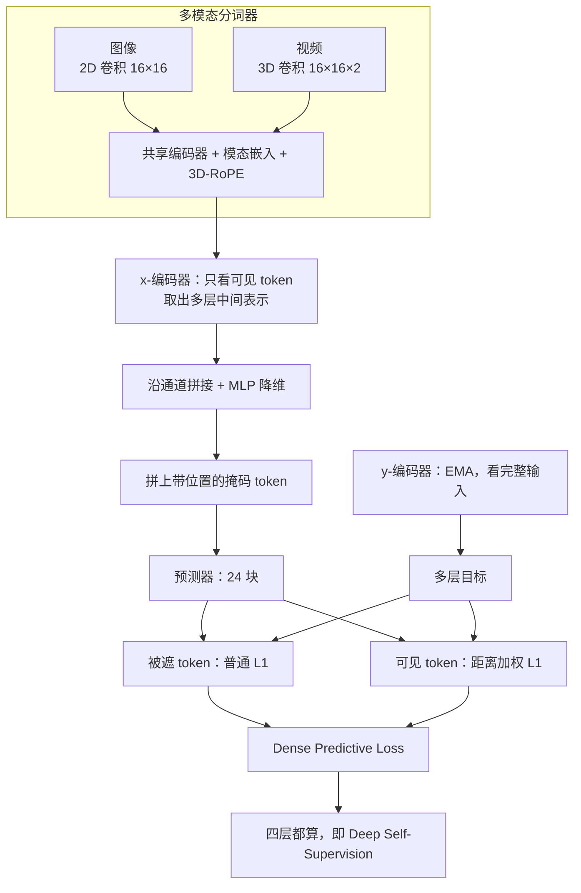
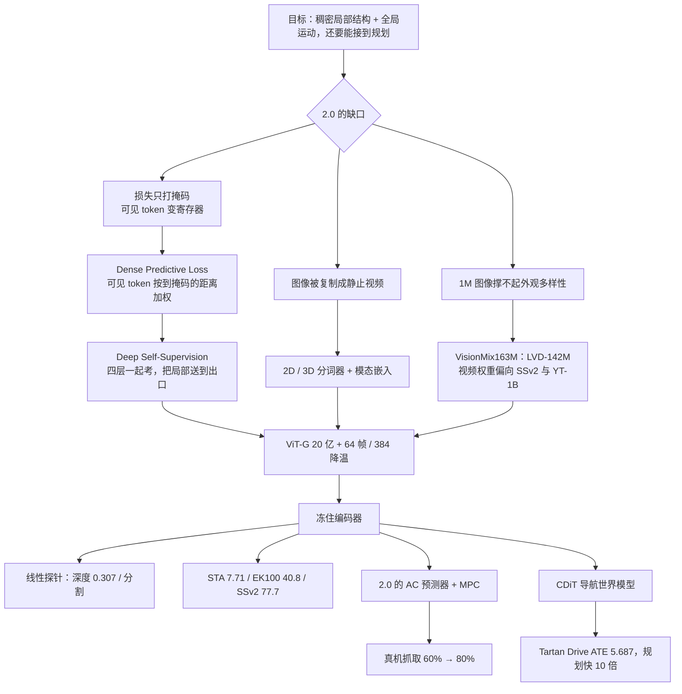

# V-JEPA 2.1：稠密特征糊掉，不是模型太小，是看得见的块从来没被考过

<!-- release-date: 2026-03-16 -->

> 本文依据 FAIR at Meta 的 **V-JEPA 2.1: Unlocking Dense Features in Video Self-Supervised Learning**，即 arXiv:2603.14482v2（2026-03-17 修订）。本地原件 37 页，约 37MB，封面印 Date: March 18, 2026。页码一律指这份本地 PDF 自身的页码。动笔前已核 arXiv 官方页：提交历史为 v1（2026-03-15）→ v2（2026-03-17）→ v3（2026-06-11）。v3 与 v2 文件大小同为 37,571 KB，摘要主数字与本地 v2 一致。按任务不换件，本文仍以本地 v2 为准。HTML 实验页页脚出现的 August 24, 2026 是渲染日期，不是修订版。
>
> 文中会明确区分三层：**报告写了什么**、**我们如何解释或推算**、**哪些是外部资料补充**。外部补充一律标出来源并给链接。
>
> 关于 `release-date`：取 2026-03-16。这一天官方 CDN 上的 ViT-G 权重文件已可下载，仓库 README 也把这一天标成 V-JEPA 2.1 发布日。论文封面印的 March 18 晚于公开使用日，不取。证据链见文末。不要把 V-JEPA 2 的 2025-06-11 当成 2.1 的日期。
>
> 同系列前作是 [V-JEPA 2](/reports/Meta/V-JEPA-2)。本篇相对 2.0 补的是**稠密特征**，不是另起一套世界模型。另有视觉—语言方向的 VL-JEPA，本篇不引用它的参数量或问答数字。

## 先把「2.1 相对 2.0 改了什么」钉死

站内已经有 [V-JEPA 2](/reports/Meta/V-JEPA-2) 的解读。那一篇的世界模型不是像素生成器，而是一套表征空间里的预测器：先把画面压成向量，再在向量里想象「如果我这样做，世界会变成什么样」。

V-JEPA 2.1 没有推翻这条路。它发现的是另一块缺口：

> V-JEPA 2 的全局运动理解已经够用，但把每个图块的特征拿出来做 PCA，得到的是一张噪点图。深度、分割、跟踪、抓杯子时沿相机深度轴伸过去，都要靠这些**稠密**的局部坐标。2.0 把它们弄糊了。（PDF p.1–4，图 1、图 3）

对照可以先记这一张。这是**我们的归纳**，用来防止把 2.1 读成「又一个新世界模型」：

| | V-JEPA 2（前作） | V-JEPA 2.1（本篇） |
|---|---|---|
| 还在不在表征里预测 | 在。损失只加在被遮住的 token 上 | 在。损失同时加在可见和被遮 token 上 |
| 编码器最大到哪 | ViT-g，约 10 亿 | ViT-G，约 20 亿；另蒸馏 ViT-B / ViT-L |
| 图像怎么进网络 | 复制成 16 帧「静止视频」，共用 3D 卷积 | 图像走 $16\times 16$ 的 2D 卷积，视频走 $16\times 16\times 2$ 的 3D 卷积 |
| 预训练图像数据 | ImageNet 100 万张 | LVD-142M，拼进 VisionMix163M |
| 本篇真正要补的能力 | 理解 / 预期 / 规划 | **稠密空间结构**，同时保住全局场景理解 |
| 规划还用不用 AC + MPC | 用 | 仍用 2.0 的公开代码和同一套任务配置；换的是冻住的编码器 |

本篇真正要记住的新名字只有四个：**Dense Predictive Loss**、**Deep Self-Supervision**、**Multi-Modal Tokenizer**、**VisionMix163M**。世界模型那一套（动作条件预测器、CEM、图像目标）是从 2.0 接过来的，不是 2.1 新发明的。

## 六个词，先各用一句话说清

- **稠密特征（dense features）**：不是整张图一个向量，而是每个空间图块、每个时空管都有自己的向量。深度、分割、跟踪、下一步抓哪里，用的都是这张特征图。
- **上下文 token / 可见 token（context tokens）**：掩码之后还看得见的那些块。2.0 的损失根本不考它们。
- **寄存器 token（register tokens）**：一组不对应图像位置、专门用来攒全局信息的向量。本篇的假说是：可见 token 因为从来没被考过，会偷偷干这件事（PDF p.4）。
- **稠密预测损失（Dense Predictive Loss）**：被遮住的块继续当考题，看得见的块也进损失，而且离掩码越近权重越大。
- **深层自监督（Deep Self-Supervision）**：不只在编码器最后一层做 JEPA，中间几层也一起做。
- **多模态分词器（Multi-Modal Tokenizers）**：图像和视频不再共用一个 3D 卷积。图像用 2D，视频用 3D，再加一个可学习的模态嵌入，告诉网络现在走的是哪条路。

## 一句话先说清

V-JEPA 2.1 不是把 V-JEPA 2 换成更大 ViT 那么简单，也不是另起一套世界模型。

它真正做的事情是：承认 2.0 的掩码去噪会把可见 token 逼成全局聚合器，于是把考题从「只补被遮住的那一块」改成「整张图、整段视频的每个位置都要站住」，再靠中间层监督把局部信息送到最后一层。数据从 100 万张图扩到 1.42 亿，模型从 3 亿扩到 20 亿，只是让这条改过的目标继续涨。

如果只记一句话，可以记：

> **要让每个图块还站在自己的位置上，看得见的区域也必须进损失；否则模型会把它们当成寄存器，稠密特征就会糊掉。**

## 报告地图：37 页里各写了什么

正文到第 24 页结束。参考文献占第 25–32 页。附录占第 33–37 页。

| 页 | 写了什么 |
|---|---|
| p.1–3 | 摘要、封面 PCA、总览柱状图、四件套主张 |
| p.4–5 | 2.0 稠密特征为什么糊；上下文损失 $L_{\mathrm{ctx}}$；架构图 |
| p.6–9 | 消融全景、加权方案、深层自监督、VisionMix163M、分词器、ViT-G 与降温、蒸馏 |
| p.9–12 | Ego4D 短时物体交互预期、EK100 动作预期 |
| p.12–14 | 真机抓取、Tartan Drive 导航 |
| p.15–18 | 深度、分割、视频物体分割、分类 |
| p.19–22 | 视频问答、图像 / 视频 PCA 定性 |
| p.23–24 | 相关工作、结论与三条未来方向 |
| p.33–34 | 附录 A–B：预训练超参、蒸馏协议 |
| p.34–36 | 附录 C：各下游评测协议 |
| p.37 | 附录 D：多层探针与降温分辨率 |

## 先看全景：四件套叠在同一条 JEPA 上

根据 PDF 图 4（p.5）和图 5（p.6）重画。这是机制示意，不是实测时间线。

报告把贡献按四件套来写（PDF p.2–3）。阅读时可以按这个顺序：先弄清 2.0 的损失为什么会毁掉局部结构，再看加权上下文损失怎么把可见 token 按回原位，再看深层监督为什么能把分类分数捞回来，最后才是数据和模型放大。

## 核心矛盾：全局已经够用，局部却站不住

先不谈任何新名词。

要在厨房里预判「下一秒会抓哪个杯子」、要在没标定的单目相机下沿深度轴伸过去夹杯沿、要用线性层从特征图读出深度，模型至少得知道**每一个图块对应画面上的哪一块**。DINO 这条线把这件事做得很干净，但它主要是图像模型，并不直接从视频里学时间动态（PDF p.2）。

V-JEPA 2 走的是另一条岔路：在表征空间里做掩码去噪，运动理解和动作预期都强。封面图却把缺口画得很直白（PDF p.1，图 1）：同一张街景、同一只猫、同一段跳水，2.0 的 PCA 是彩噪，2.1 的 PCA 才按物体连成块。

报告用线性探针把这张噪点图写成数字（PDF p.4，表 1）：

| 任务 | V-JEPA 2（消融里的 ViT-L 起点） |
|---|---|
| ADE20K 语义分割 | 22.2 mIoU |
| NYUv2 深度 | 0.682 RMSE |

主结果表里，冻住的 V-JEPA 2 ViT-g 也只有 24.4 mIoU、0.642 RMSE（PDF p.15，表 8）。两套数字协议不同，不要合成一个「2.0 深度」。能下的结论一样：**局部信息不好抽。**

报告的假说只有一句（PDF p.4）：

> 损失只加在被遮住的 token 上，模型就没有动力在可见 token 里编码局部信息。它可以把这些位置拿去攒全局上下文，好去补那些被遮住的块——很像寄存器 token。

这是 2.1 全部设计的起点。后面四件套都是在回答：怎样既逼可见 token 站住，又不把 2.0 已经会的全局运动弄丢。

## 核心设计一：Dense Predictive Loss——看得见的块也要当考题

### 旧问题：只考被遮住的块，可见 token 会抄近道

2.0 的目标可以写成（PDF p.4，式 1）：

$$
L_{\mathrm{predict}}=\frac{1}{|M|}\sum_{i\in M}\bigl\|P_\phi\bigl(E_\theta(x),\Delta_y\bigr)_i-\operatorname{sg}\bigl(E_{\bar\theta}(y)_i\bigr)\bigr\|_1
$$

$M$ 是被遮住的位置。$E_\theta$ 只看见剩下的块；$P_\phi$ 拿这些上下文，加上一组只带位置、不含图像内容的掩码 token $\Delta_y$，去贴近 EMA 编码器 $E_{\bar\theta}$ 给出的目标。停止梯度防止表征塌成常数。

人话版：**看得见的部分负责提供上下文，看不见的部分负责当考题。** 考题的标准答案是「完整视频被压成的意思」，不是原图像。这一点和 2.0 相同。

问题出在：预测器其实会给**每一个**输入位置都吐一个向量，包括那些看得见的上下文。损失却不看它们。于是可见 token 没有「你必须还像这个位置」的压力，可以放心变成全局寄存器。

### 新设计：给可见 token 也加一项，而且离掩码越近越重

2.1 把同一形式的 $L_1$ 套到可见集合 $C$ 上（PDF p.5，式 2）：

$$
L_{\mathrm{context}}=\frac{1}{|C|}\sum_{i\in C}\lambda_i\bigl\|P_\phi\bigl(E_\theta(x),\Delta_y\bigr)_i-\operatorname{sg}\bigl(E_{\bar\theta}(y)_i\bigr)\bigr\|_1
$$

总损失是 $L_{\mathrm{dense}}=L_{\mathrm{predict}}+L_{\mathrm{ctx}}$（PDF p.7）。$\lambda_i$ 不是随便设成 1。报告写得很清楚：如果天真地对所有可见 token 加同样的损失，系统会找到抄近道的办法，比如直接复制上下文特征，全局语义任务就会垮（PDF p.7）。

表 2 把这条权衡写死了（PDF p.7）：

| $\lambda$ | 方案 | warmup | ADE20K mIoU | SSv2 Acc. |
|---|---|---|---:|---:|
| 0（即 2.0） | 常数 | 否 | 22.2 | 72.8 |
| 0.05 | 常数 | 否 | 26.4 | 71.0 |
| 0.2 | 常数 | 否 | 29.6 | 62.5 |
| 0.5 | 常数 | 否 | 27.5 | 53.8 |
| 1.0 | 常数 | 否 | 24.6 | 51.1 |
| 0.2 | 常数 | 是 | 30.5 | 60.5 |
| 0.5 | 常数 | 是 | 32.2 | 61.5 |
| 0.5 | 按距离加权 | 是 | 33.8 | 62.5 |

读这张表时注意三件事：

1. $\lambda$ 加大，分割先升后降，动作识别几乎单调掉。$\lambda=1$ 时 SSv2 掉到 51.1，说明可见 token 的监督不能无节制。
2. 第 50–100 个 epoch 再把 $\lambda$ 热起来，能稳住一部分分类（PDF p.7）。
3. 最终方案不是「所有可见位置一视同仁」，而是按到最近掩码块的距离加权（PDF p.7，式 3）：

$$
\lambda_i=\frac{\lambda}{\sqrt{d_{\min}(i,M)}}
$$

$d_{\min}$ 是这个上下文 token 到最近掩码 token 的块距离。离缺口近的位置权重大，逼模型在「看见」和「看不见」的交界处把局部连续性接上。附录里视频用 $\lambda=0.5$，图像用 $\lambda=0.7$（PDF p.33）。

正文写加权方案把 ADE20K 从 22.2 推到 33.9、NYUv2 从 0.682 降到 0.473（PDF p.5、p.7）；表 1 同一行是 33.8 和 0.474（PDF p.7）。两处差 0.1 / 0.001，后文引用按所在页。

图 3 是这项损失最直观的证据（PDF p.4）：两只狗的头、车轮，在 2.0 的 PCA 里是碎斑；加上 $L_{\mathrm{ctx}}$ 之后，同类部件被映到同一组主成分。封面图 1 把同一对照拉到街景、猫、跳水视频上（PDF p.1）。这些是定性图，不是定量实验。

### 收益、代价、可迁移启发

收益是局部结构出现了。代价立刻写在表 1 第一跳：SSv2 从 72.8 掉到 62.5，ImageNet 从 82.2 掉到 72.6（PDF p.7）。**稠密和全局在这一步是打架的。** 如果停在这里，2.1 只是用分割换动作识别，不算解。可迁移的一点是：当你发现表征「全局很强、局部很糊」时，先问损失有没有漏掉可见位置，而不是先加参数。漏掉的位置会变成寄存器，这不是实现细节，是目标函数允许的合法解。

## 核心设计二：Deep Self-Supervision——局部信息必须有一条往最后一层走的路

### 旧问题：只在出口监督，中间层会把局部滤掉

上下文损失把局部结构逼出来了，但分类掉了。一个合理的解释是：局部信号如果只在浅层出现，到最后一层又被冲成全局摘要，下游用最后一层做分类会受伤，用最后一层做分割也不够。

### 新设计：中间三层加输出层，四层一起当考题

具体做法（PDF p.7–8）：

1. 从 x-编码器取出三个中间块的输出，再加上最后一层。
2. 沿通道拼起来，用一个轻量 MLP 融合并降维。
3. 预测器看到的是这份融合后的序列，并且吐出对应四层的预测。
4. $L_{\mathrm{predict}}$ 和 $L_{\mathrm{ctx}}$ 在这四层上都算。

ViT-G 的四层索引写在附录里：$[12,24,36,48]$（PDF p.33）。由此可以读出 ViT-G 是 48 层。报告没有另给宽度和头数。

这一步在表 1 里几乎把分类捞回原处，同时分割继续涨（PDF p.7）：

| | IN1K | SSv2 | NYU RMSE ↓ | ADE20K |
|---|---:|---:|---:|---:|
| + Context Loss | 72.6 | 62.5 | 0.474 | 33.8 |
| + Multi-level Pred. | 80.8 | 72.1 | 0.463 | 38.6 |

正文写 SSv2 回到 72.0、IN1K 回到 80.8（PDF p.8）；表 1 是 72.1。仍按所在页。

更关键的证据在附录 D.1（PDF p.37，表 12）。他们拿从头训的 ViT-L 问：下游探针到底要不要拼多层？

| Deep Self-Supervision | ADE20K 最后一层 | ADE20K 四层 | NYU 最后一层 | NYU 四层 | Diving-48 最后一层 | Diving-48 四层 |
|---|---:|---:|---:|---:|---:|---:|
| 无 | 34.9 | 39.1 | 0.513 | 0.463 | 85.8 | 86.9 |
| 有 | 42 | 43.9 | 0.381 | 0.370 | 87.2 | 88.1 |

没有深层监督时，分割必须拼四层才够用（34.9 → 39.1）。有了之后，最后一层自己就已经接近四层。报告的解释是：局部信息被训练信号一路送到了出口，下游不必再回扣中间层（PDF p.8、p.37）。主结果里的深度和分割，也明确只用冻住编码器的最后一层（PDF p.15）。

### 收益、代价、可迁移启发

收益是稠密和全局不再互相拆台。代价是预训练时预测器变重：2.0 的预训练预测器是 12 块，2.1 改成 24 块、隐维仍是 384（PDF p.33）。蒸馏阶段又退回 12 块，而且不再做深层监督（PDF p.9、p.34）——说明多层预测是训练期的脚手架，不是推理期必须带着的结构。可迁移的一点是：**如果你在出口加了一项很「局部」的损失，分类却掉了，优先考虑把同一项损失沿深度再铺几层，而不是把局部损失关掉。**

## 核心设计三：图像和视频不要再假装是同一种输入

### 旧问题：把图像复制成 16 帧，既贵又歪

2.0 用同一个 3D 卷积吃图像和视频。图像被沿时间复制成 16 帧「静止视频」（PDF p.8）。报告说这有两处不好：计算变贵；表征上等于告诉模型「图像就是一段完全不动的视频」。

### 新设计：两条补丁嵌入，一个共享编码器

2.1 的分词器是（PDF p.8–9）：

- 视频：$16\times 16\times 2$ 的 3D 卷积（空间 16、时间管 2）
- 图像：$16\times 16$ 的 2D 卷积
- 编码器和预测器入口都加一个可学习的模态 token，标明当前走的是图还是视频

图像不再被复制。模态嵌入的作用，报告写成：帮网络把「图像里更强的静态外观」和「视频里的运动」拆开（PDF p.8）。

表 1 里这一跳很小：ADE20K 40.8 → 41.4，分类持平（PDF p.7、p.9）。它不是刷分件，是把图和视频按各自的物理形态喂进去。后面 Ego4D 的探针会同时吃 384 的视频和 1080 的最后一帧，正是因为两条分词器可以独立工作（PDF p.10）。

### 可迁移启发

联合训图像和视频时，不要图省事把静帧当成「时间维为 1 的视频」。时间复制会把计算预算和归纳偏置绑错。花一个 2D 卷积加一个模态嵌入，比事后用数据增强去「假装有运动」干净。

## 核心设计四：数据换血，再把模型从 3 亿拉到 20 亿

### 数据：ImageNet 1M 换成 LVD-142M，视频权重偏向运动和杂源

VisionMix163M 把 2.0 的 VideoMix22M 做了两处替换（PDF p.8，表 3）：

| 来源 | 样本数 | 类型 | 时长 | 2.0 权重 | 2.1 权重 |
|---|---:|---|---:|---:|---:|
| SSv2 | 16.8 万 | 第一人称视频 | 168 小时 | 0.056 | 0.170 |
| Kinetics | 73.3 万 | 第三人称动作 | 614 小时 | 0.188 | 0.010 |
| HowTo100M | 110 万 | 教程视频 | 13.4 万小时 | 0.318 | 0.100 |
| ImageNet | 100 万 | 图像 | — | 0.250 | 0 |
| YT-1B | 1900 万 | 通用 YouTube | 160 万小时 | 0.188 | 0.720 |
| LVD-142M | 1.42 亿 | 筛选过的图像 | — | （表中空白） | （表中空白） |

表里 LVD-142M 的权重格子是空的。报告另写：图像和视频不在同一个 batch 里混，而是分到不同 worker，迭代后再把梯度加起来；经验上全局 batch 取 128 段 16 帧视频加 2304 张图（PDF p.8）。所以图像占比不是表 3 那一列权重能直接读出来的。视频四项权重 $0.170+0.010+0.100+0.720=1$，这是视频内部的采样比。

用意也很直白：1.42 亿张图已经覆盖大量静态外观，视频就可以少看 Kinetics、多看 SSv2 和更杂的 YT-1B（PDF p.8）。这一跳在表 1 上是全面小涨：SSv2 72.1 → 72.6，IN1K 80.8 → 81.6，ADE20K 38.6 → 40.8，NYU 0.463 → 0.418（PDF p.7–8）。

### 模型：ViT-L 3 亿 → ViT-G 20 亿，再加高分辨率降温

报告放出的家族是 ViT-g / ViT-G（1B / 2B），以及蒸馏得到的 ViT-B / ViT-L（80M / 300M）（PDF p.3、p.9）。表 1 把「从 ViT-L 扩到 ViT-G」写成单独一跳：SSv2 72.6 → 76.1，IN1K 81.6 → 84.8，ADE20K 41.4 → 47.1，NYU 0.415 → 0.365（PDF p.7、p.9）。

降温阶段 1.2 万步（PDF p.6、p.33）：

| | 主阶段 13.5 万步 | 降温 1.2 万步 |
|---|---|---|
| 视频 | 16 帧、256、4 fps | 64 帧、384、4 fps |
| 图像 | 256 | 512 |
| 学习率 | 1.2 万步从 $1\times 10^{-4}$ 升到 $5.25\times 10^{-4}$，然后恒定 | 从 $6\times 10^{-4}$ 降到 $1\times 10^{-6}$ |
| EMA / 权重衰减 | 0.99925 / 0.04 | 同左 |
| 预测器 | 24 块、隐维 384 | 同左 |

消融数字来自主阶段；最终下游数字用完整 warmup–constant–cooldown（PDF p.6）。降温对深度特别明显：0.365 → 0.307 RMSE（PDF p.9）。最终 ViT-G 是 SSv2 77.7、IN1K 85.5、ADE20K 47.9、NYUv2 0.307（PDF p.9，表 1）。

附录 D.2 把降温分辨率单独拆开（PDF p.37，表 13）。ViT-G 在 256 上已经是 SSv2 77.1、EK100 38.8、NYU 0.313；拉到 384 之后变成 77.7、40.8、0.307。DAVIS / YouTube-VOS 几乎持平。**高分辨率不是所有稠密任务的开关，但对预期和深度更关键。**

### 蒸馏：20 亿是为了把能力压回 3 亿

蒸馏不是普通 KD。协议改了四件事（PDF p.9、p.34）：

1. EMA 教师换成冻住的 ViT-G 教师。
2. 学生自己另挂一份 EMA，不算进损失，只当最终导出模型。
3. 损失只打教师最后一层，不再做深层自监督。
4. 预测器改回 12 块，输出维对齐教师；不继承预训练预测器权重。

两阶段教师也拆开：低分辨率主阶段用降温前的 ViT-G，高分辨率降温用降温后的 ViT-G。学生第二阶段从第一阶段的 EMA 学生初始化。报告说这比「始终蒸最终高分辨率教师」或单阶段更好（PDF p.34）。

正文 3.10 给了几条数字，但交叉引用印成 `Table ??`，附录里也没有对应的完整蒸馏表（PDF p.20）。能用的只有这段文字：

- 从头训的 ViT-L：SSv2 74.2，ADE20K 42.0
- 从 ViT-G 蒸出来的 ViT-L：SSv2 76.5（ViT-G 是 77.7），ADE20K 46.7
- KITTI 2.490，对照 ViT-G 的 2.461
- DAVIS 68.7；同一段写成「接近 67.0」，但主表 ViT-G 的 DAVIS 是 69.0（PDF p.15、p.20）。这两处对不上，本文不擅自改成一个数。
- ViT-B 和从头训的 ViT-L 有竞争力；没有逐项数字。

### 可迁移启发

配方顺序本身就是一条因果链：先改目标（可见 token 进损失），再用深度监督把全局捞回来，然后才配得起更杂的数据和更大的模型。把顺序反过来——先把 ViT-L 换成 ViT-G，损失仍只打掩码——报告没有做这个对照，也就不能说「放大自然会出稠密特征」。封面图比较的是 2.0 的 ViT-g 和 2.1 的 ViT-G（PDF p.1），规模和配方是缠在一起的。能分开看的，是表 1 里 ViT-L 上前几跳已经把 ADE20K 从 22.2 推到 41.4。

## 短时预期：稠密特征最先兑现的地方

Ego4D 短时物体交互预期（STA）要同时给出四件事（PDF p.9–10，图 6）：下一秒会交互的物体框、物体名词、动词、还有距离接触还有多少秒。评测口径是 Top-5 AP / mAP，框的 IoU 要大于 0.5；最严的 mAP All 还要求名词、动词都对，接触时间误差在 0.25 秒内。因为未来本来就不唯一，指标最多不惩罚四个高分假阳性（PDF p.10、p.35）。

输入在正文和附录不完全一样。正文写：384 分辨率、8 帧、跨度 0.5 秒的视频，外加最后一帧 1080 的图（PDF p.10）。附录 C.4 写最终最好配置是 16 帧、384、2 fps（PDF p.35）。两处对不上，本文并列保留，不合成一个输入长度。

用法是冻住 2.1 编码器：视频走 3D 分词器，最后一帧走 2D 分词器，各自加模态嵌入。视频侧训四层注意力探针，再用帧引导的时间池化把 3D token 对齐到最后一帧的 2D 网格，和图像特征相加，送进与 StillFast 相同的 Faster R-CNN 头（PDF p.10、p.35）。

表 4 的获胜分是 mAP All（PDF p.11）：

| 模型 | AP 框 | AP 框+动词 | AP 框+$\delta$ | mAP All |
|---|---:|---:|---:|---:|
| STAformer | 38.3 | 16.6 | 12.27 | 5.67 |
| DINOv3 ViT-7B | 50.2 | 23.8 | 14.2 | 5.68 |
| V-JEPA 2 ViT-g | 45.7 | 22.2 | 16.7 | 6.02 |
| V-JEPA 2.1 ViT-g | 47.3 | 23.6 | 18.1 | 6.75 |
| V-JEPA 2.1 ViT-G | 50.7 | 25.8 | 20.2 | 7.71 |

7.71 相对 STAformer 的 5.67，报告写成大约 +35%（PDF p.11）。相对 2.0 的 6.02 是另一条轴。报告自己把增益主要记在「下一动作」和「接触时间」上，而不是只靠框：ViT-G 的框 AP 50.7 已经略高于 DINOv3 ViT-7B 的 50.2，但 mAP All 的差距更大（7.71 对 5.68）。**稠密定位加上视频预测，才是这条任务的完整考题。** DINO 会框，却弱在 $\delta$。

## 动作预期：1B 时没有超过 2.0，2B 才把 40.8 写下

EK100 仍是 100 小时、45 个厨房、3568 种「动词 + 名词」，默认在动作开始前 1 秒预测，指标是按类平均的 recall-at-5（PDF p.12）。探针协议跟 2.0 相同：上下文进编码器，预测器用掩码 token 去预报 1 秒后那一帧，两边拼起来，三个 query 分别分类动作 / 动词 / 名词，focal loss（PDF p.12）。上下文是 32 帧、8 fps、384（PDF p.12、p.36）。

表 5（PDF p.12）：

| 方法 | 参数量 | 动词 | 名词 | 动作 |
|---|---:|---:|---:|---:|
| PlausiVL | 80 亿 | 55.6 | 54.2 | 27.6 |
| V-JEPA 2 ViT-g | 10 亿 | 63.6 | 57.1 | 39.7 |
| V-JEPA 2.1 ViT-g | 10 亿 | 63.6 | 56.2 | 38.4 |
| V-JEPA 2.1 ViT-G | 20 亿 | 64.3 | 59.9 | 40.8 |

必须读细：同是 1B，2.1 的动作 recall 是 38.4，**低于** 2.0 的 39.7。报告自己写「同尺寸上可比，2B 才拉开」（PDF p.12）。摘要里的 40.8 是 ViT-G 的数，对应相对 2.0 的 +2.8%（PDF p.12）。不要把 2.0 的 39.7 写成 2.1 的新结果。

## 真机：深度理解把抓取从 60% 推到 80%，夹爪规划仍会失败

2.1 没有重写规划器。它冻住新编码器，用 2.0 的公开代码训一个同样 24 层、约 3 亿参数的帧因果动作条件预测器，数据是 Droid 原始集，损失仍是教师强制加两步 rollout，部署仍是实验室里的 Franka + 平行夹爪、图像目标、MPC（PDF p.12–13）。任务配置文件与 2.0 相同。本篇没有重报 Droid 时长；2.0 原件里的「不到 62 小时」不是本篇的新数字。

表 6 是闭环节目，每个技能 10 次，单卡 A100、CEM（PDF p.13）：

| 方法 | 样本 | 迭代 | 地平线 | 每步耗时 | 到达 | 抓取 | 抓放 |
|---|---:|---:|---:|---|---:|---:|---:|
| V-JEPA 2 | 800 | 10 | 1 | 3 秒 | 100% | 60% | 80% |
| V-JEPA 2.1 | 800 | 10 | 1 | 3 秒 | 100% | 70% | 80% |
| V-JEPA 2.1 | 300 | 15 | 8 | 14 秒 | 100% | 80% | 80% |

正文把同一套超参下的抓取写成 +10%（60 → 70）；把地平线拉到 8、样本降到 300 之后再 +10%，合计到 80%。摘要和表注写的「相对 V-JEPA-2-AC +20%」指的是这条 60 → 80 的抓取成功率，不是抓放（抓放两边都是 80%）（PDF p.1、p.13）。图 8 给出原因：2.1 更好编码深度，抓杯子时要沿相机深度轴运动（PDF p.13）。2.0 在更长地平线上反而会掉；2.1 才吃得下稍长的 rollout（PDF p.13）。

失败模式也写得很干净：抓取和抓放的失败来自夹爪动作规划——夹早了、或在搬运途中略张开导致掉落——不是空间理解错了（PDF p.13）。到达始终 100%。**稠密特征解决的是「伸到哪」，不是「手指何时闭合」。**

这组 60% / 80% 是本篇自己的 10 次杯子实验，不要和 2.0 原件里跨两个实验室、杯子平均 65% 的那张表混成一次评测。

## 导航：表征够用之后，规划可以从 128 步降噪变成 8 步

短时导航沿用 NWM 的设定：最近观测 + 一张目标图，预测 2 秒轨迹（PDF p.14）。他们在 2.1 表征上训 Conditional Diffusion Transformer。直接在 2.1 的高维嵌入里做扩散不好训，因为维数至少是 SD-VAE 的 80 倍，噪声随手一加就会离开数据流形（PDF p.14）。两个改动：预测干净表征而不是噪声；采样用 DDIM 而不是更随机的 DDPM。

规划仍是 CEM：$N=480$ 条 2 秒候选、4 fps，在 3 自由度（平移 + 偏航）里搜，用世界模型仿真后挑离目标嵌入最近的那条。2.1 只需 8 步降噪；SD-VAE 那条至少 128 步（PDF p.14）。

表 7（PDF p.14）：

| 模型 | 规划耗时 | Tartan Drive ATE | Tartan Drive RTE | 平均 ATE |
|---|---:|---:|---:|---:|
| NWM | 103.2 秒 | 5.831 | 1.219 | 3.032 |
| V-JEPA 2.1 ViT-g | 10.6 秒 | 5.758 | 1.200 | 2.975 |
| V-JEPA 2.1 ViT-G | 10.6 秒 | 5.687 | 1.187 | 2.990 |

摘要里的 5.687 是 Tartan Drive 上 ViT-G 的 ATE（PDF p.1、p.14）。平均 ATE 上 ViT-g 的 2.975 略好于 ViT-G 的 2.990，Tartan Drive 则是 ViT-G 更好。报告写「10 倍规划速度、不牺牲性能」（PDF p.14）。这是开环验证集数字，不是真车闭环。

## 稠密理解：深度在 20 亿以内新高，分割仍落后最好的图像编码器

表 8 是线性探针（PDF p.15）。深度和分割都只用最后一层、图像 2D 分词器；3D-RoPE 按分辨率插值（PDF p.15）。

| 方法 | 参数 | NYUv2 ↓ | KITTI ↓ | ADE20K | Cityscapes | VOC | DAVIS | YT-VOS |
|---|---:|---:|---:|---:|---:|---:|---:|---:|
| DINOv3 | 70 亿 | 0.309 | 2.346 | 55.9 | 81.1 | 86.6 | 71.1 | 74.1 |
| DINOv3 ViT-H+ | 8 亿 | 0.352 | 2.635 | 54.8 | 79.5 | 85.8 | 71.1 | 74.0 |
| InternVideo2-1B | 10 亿 | 0.471 | 4.739 | 28.4 | 35.6 | 65.2 | 50.6 | 51.2 |
| V-JEPA 2 ViT-g | 10 亿 | 0.642 | 4.650 | 24.4 | 45.9 | 63.9 | 52.5 | 53.7 |
| V-JEPA 2.1 ViT-g | 10 亿 | 0.350 | 2.601 | 47.8 | 71.8 | 84.7 | 68.1 | 72.3 |
| V-JEPA 2.1 ViT-G | 20 亿 | 0.307 | 2.461 | 47.9 | 73.5 | 85.0 | 69.0 | 72.7 |

NYUv2 0.307 低于 DINOv3 7B 的 0.309，是线性探针单目深度在这张表上的最好成绩；报告也写它在 20 亿以下最好（PDF p.15）。相对 2.0 的 0.642，图 2 标了 +52%（PDF p.2）。图 10 把原因画出来：2.0 有大几何、没边界；2.1 的深度图更利落（PDF p.16）。图 12 对比 DINOv3 ViT-H+：2.1 把红绿灯轮廓留下来，DINOv3 会把床上的绿物体和电视判得过近（PDF p.15）。

分割相对 2.0 的跳是 +23.4 ADE20K、+27.6 Cityscapes、+20.7 VOC（PDF p.16）。但 ADE20K 47.9、Cityscapes 73.5 仍低于 DINOv3。报告的假说是 VisionMix 里高度拥挤、多尺度的场景偏少（PDF p.16）。这是作者观察，不是消融。

视频物体分割用无参数的标签传播：第一帧的 mask 按余弦相似度往后续帧传（PDF p.17）。DAVIS 69.0、YouTube-VOS 72.7，全表第二，只低于 DINOv3（PDF p.17）。超参在 DAVIS 训练集上搜完（15 帧上下文、半径 12 的圆邻域、top-5、温度 0.2），再套到所有验证集（PDF p.17）。

## 全局理解：SSv2 的 77.7 是保住运动，不是用稠密把运动换走

表 9 用四层注意力探针（PDF p.18–19）。默认分辨率 256，2.0 ViT-g 和 2.1 用 384。SSv2 是 $16\times 2\times 3$，K400 是 $16\times 8\times 3$，Diving-48 是 $32\times 4\times 3$；Diving-48 额外看四层（PDF p.18、p.36）。

| 方法 | 参数 | SSv2 | Diving-48 | K400 | IN1K |
|---|---:|---:|---:|---:|---:|
| DINOv3 7B | 70 亿 | 70.1 | — | 87.8 | 88.4 |
| InternVideo2s2-1B（同协议） | 10 亿 | 69.7 | 86.4 | 89.4 | 85.8 |
| V-JEPA 2 ViT-g | 10 亿 | 77.3 | 90.2 | 87.3 | 85.1 |
| V-JEPA 2.1 ViT-g | 10 亿 | 76.9 | 89.0 | 87.0 | 84.8 |
| V-JEPA 2.1 ViT-G | 20 亿 | 77.7 | 89.2 | 87.7 | 85.5 |

77.7 被写成 SSv2 新高，对照包括 InternVideo2 全微调的 77.5、2.0 的 77.3、同协议 InternVideo2 的 69.7（PDF p.19）。同尺寸 ViT-g 上，2.1 的 76.9 **略低于** 2.0 的 77.3。外观任务够用：K400 87.7、IN1K 85.5，仍低于最好的图像 / 视频对照。从 ViT-g 到 ViT-G 平均 +0.6（PDF p.19）。

**2.0 的 77.3 是对照，不是本篇新结果。** 本篇要证明的是：把可见 token 拉进损失之后，运动理解可以被深层监督和放大捞回来，而不是永远停在表 1 第二行的 62.5。

## 视频问答：同一套过滤数据上略好，短视频运动基准反而弱

2.1 跟 2.0 一样，把冻住的视频编码器接到 Llama 3.1 8B 上做 VidLLM（PDF p.19）。数据是 PerceptionLM 的公开子集，经过域过滤、图文错位过滤，再用 Qwen3VL 当质量判官，丢掉 18%，得到约 7250 万样本；只过滤、不改写（PDF p.20）。对齐仍走 2.0 的三阶段，再加第四阶段把上下文扩到 64 帧（2.0 是 32 帧）。实验主要用视频通路，便于和 2.0 比。PerceptionTest 训练集上再做一段后训练，会提高所有下游（PDF p.20）。

表 10 里要看三行，不要串（PDF p.19）：

| | 数据 | 平均 | PerceptionTest | MVP | TempCompass | TemporalBench | TOMATO | TVBench | MVBench |
|---|---|---:|---:|---:|---:|---:|---:|---:|---:|
| 2.0 原件（8850 万） | 原论文 | 59.5 | 84.0* | 44.5 | 76.9 | 36.7 | 40.3 | 60.6 | 73.5 |
| 2.0 复现（本篇过滤集） | 7250 万 | 57.8 | 80.1 | 40.9 | 74.1 | 32.3 | 41.4 | 62.6 | 73.3 |
| 2.1 ViT-G | 同一过滤集 | 57.9 | 83.1 | 43.2 | 74 | 28.5 | 38 | 62.8 | 75.4 |

PerceptionTest 的测试服务器已经关掉，本篇报的是验证集；带 * 的是旧测试集分数（PDF p.19）。2.1 相对「同一数据上的 2.0」在 PerceptionTest、MVP、MVBench、TVBench 更好，在 TemporalBench 和 TOMATO 更差——报告说这两项更依赖短视频里的运动事件（PDF p.20）。相对 2.0 原件的 84.0 / 76.9，2.1 并没有在同一数据体量上重跑，不能写成超越。引言里的 83.1 才是 2.1 自己的数（PDF p.3）。

## 报告承认的限制，以及它没单独开一节「限制」

本篇没有 2.0 那种集中写相机几何、长地平线、语言目标的限制节。边界散落在结果和未来工作里。

**同尺寸不一定赢 2.0。** ViT-g 上 SSv2 76.9 对 77.3，EK100 38.4 对 39.7。稠密配方在 1B 时会付一点全局代价，要到 2B 才把动作预期做成 40.8。

**分割和跟踪仍落后最好的图像 SSL。** ADE20K、Cityscapes、DAVIS、YouTube-VOS 都低于 DINOv3。作者把分割差距归因于预训练里拥挤场景不够（PDF p.16），没有用数据消融证明。

**规划侧，空间对了，夹爪仍会失手。** 抓放没有比 2.0 更高；失败是开合时机。更长地平线只对 2.1 的抓取有用，对抓放没有写成增益。

**导航是开环、短时、3 自由度。** 高维嵌入上的扩散要改预测目标、改采样器才稳。报告没有声称这是通用导航世界模型。

**问答不是这条工作的主场。** 数据更少、短视频运动基准下降、PerceptionTest 只能报验证集。不要拿 2.0 原件的 84.0 来给 2.1 站台。

**没写的实现，本文也不补。** 预训练用了多少卡、墙钟多久、电力多少，报告没给。VisionMix 里 LVD-142M 的采样权重表里是空的。蒸馏主表交叉引用是 `Table ??`。STA 的帧数正文和附录不一致。官方代码仓存在，按本模块约定，**不拿源码现状补写论文没写的训练细节**。

未来工作只列了三条（PDF p.24）：模型再往 7B 走、数据再放大、以及在稠密表征上做世界模型（点名 DINO-Foresight 和 Back to the Features）。本篇自己把世界模型实验写成「表征更好之后，2.0 那套 AC / 导航配方跟着涨」，并没有给出新的规划算法。

## 最值得带回自己项目的启发

### 1. 损失没打到的位置，会变成寄存器

2.0 不是不会编码局部，是目标函数允许可见 token 去干全局聚合。任何掩码、稀疏、检索系统都可以问同一句：没进损失的那些槽位，是不是在偷偷当记忆体？

### 2. 局部监督和全局性能打架时，先铺到中间层，再考虑关损失

表 1 的第二跳几乎是全文最值钱的一行：深层自监督把 SSv2 从 62.5 捞回 72.1，分割还继续涨。局部损失让出口变「碎」，往往是因为梯度没走到底。

### 3. 靠近缺口的位置，权重要大于远离缺口的位置

$\lambda_i=1/\sqrt{d_{\min}}$ 不是装饰。均匀 $\lambda=1$ 会把 SSv2 打到 51.1。需要局部连续性时，把监督集中在可见 / 不可见的边界上，比「所有位置一视同仁」更稳。

### 4. 图像和视频的补丁嵌入应该分开

时间复制是假的联合训练。2.1 用 2D / 3D 两条 tokenizer 加一个模态 token，分类不涨、分割微涨，却让后头的 STA 可以同时吃低分辨率视频和高分辨率静帧。

### 5. 配方先改对，放大才有意义

ViT-L 上前几跳已经把 ADE20K 从 22.2 拉到 41.4。20 亿和 1.42 亿张图是在这条已改过的目标上继续涨，不是稠密特征的充分条件。

### 6. 表征变稠密之后，规划器可以更少采样、更长地平线

抓取从 1 步 800 样本的 70%，到 8 步 300 样本的 80%；导航从 128 步降噪到 8 步。稠密特征的工程兑现，常常是搜索空间变好用，而不只是探针分数。

### 7. 线性探针读到的是「最后一层好不好抽」，不是「网络里有没有」

没有深层监督时，必须拼四层才够分割。有了之后，最后一层就够。比较不同 SSL 的稠密能力，要把「用哪几层」写进协议。

## 用一张图重新串起全文

## 关键词回看

- **JEPA**：两边都先嵌入，再在嵌入空间里预测，而不是预测像素。2.1 没有改这条定义。
- **上下文 token**：掩码后仍可见的块。2.0 不监督它们；2.1 认为这就是稠密特征糊掉的原因。
- **Dense Predictive Loss**：$L_{\mathrm{predict}}+L_{\mathrm{ctx}}$，可见位置用 $1/\sqrt{d_{\min}}$ 加权。
- **Deep Self-Supervision**：中间层和最后一层一起做 JEPA，让局部信号走到出口。
- **Multi-Modal Tokenizer**：图像 2D、视频 3D，外加模态嵌入。
- **VisionMix163M**：LVD-142M 图像 + 重加权视频，图和视频分 worker 再合梯度。
- **Cool-down**：主阶段看 16 帧 / 256，最后 1.2 万步拉到 64 帧 / 384 和图像 512。
- **STA**：短时物体交互预期，要框、名词、动词和接触时间。
- **V-JEPA 2-AC**：2.0 的动作条件预测器；2.1 换编码器、不换这套规划配方。
- **CDiT**：条件扩散 Transformer，本篇用来在 2.1 表征里做短时导航。

## 最后的判断

V-JEPA 2.1 最强的叙事不是「视频编码器又刷高了 SSv2」，而是：**它把 2.0 没讲清楚的稠密失败，归因成一个可以改的目标函数缺陷——可见 token 从来没被考过。**

四件套的因果链是完整的。上下文损失让 PCA 从彩噪变成按物体上色，分割立刻涨、分类立刻掉；深层监督把分类捞回来，并且让最后一层自己就够用；分词器去掉「静帧假装视频」的偏置；数据和 ViT-G 把这条已改过的目标推到 NYUv2 0.307、Ego4D 7.71、EK100 40.8、SSv2 77.7、真机抓取相对 2.0 的 60% 到 80%。导航把规划时间从 103 秒降到 10.6 秒，说明稠密表征不只是探针友好，搜索也更便宜。

它也留下不该被柱状图盖住的边界。同尺寸 1B 上，2.1 并没有全面超过 2.0 的运动和预期；分割和跟踪仍落后 DINOv3；抓放没有涨，失败在夹爪；问答在短视频运动基准上更弱；蒸馏表在 PDF 里是坏掉的交叉引用。未来工作自己把「稠密世界模型」写成还没做的事。

如果只记一句话，可以记：

> **掩码去噪如果只考缺的那一块，看得见的块就会去当寄存器；把它们按距离加权拉回损失，再让中间层一起监督，稠密特征才会在最后一层上站稳。**

## 资料与阅读边界

- 原始依据：本地 `papers/Meta/V-JEPA-2.1.pdf`，arXiv:2603.14482v2，37 页。封面 Date: March 18, 2026。arXiv 提交历史：v1 2026-03-15 17:02:40 UTC（37,028 KB），v2 2026-03-17 14:12:31 UTC（37,571 KB），v3 2026-06-11 10:07:56 UTC（37,571 KB）。本文按任务不换到 v3；抽查 v3 HTML 摘要主数字与本地 v2 一致。
- 官方代码（论文给出）：[github.com/facebookresearch/vjepa2](https://github.com/facebookresearch/vjepa2)。阅读源码时应以具体 commit 为准；本文没有把源码中未写入报告的细节冒充论文结论。
- 官方权重（外部补充，文件时间用于首发日）：`https://dl.fbaipublicfiles.com/vjepa2/vjepa2_1_vitG_384.pt` 等，不经过 Hugging Face。社区后来有把 2.1 权重上传到 Hub 的请求（[facebookresearch/vjepa2#137](https://github.com/facebookresearch/vjepa2/issues/137)），**2.1 发布当日不在 HF 上**。
- 同系列前作：[V-JEPA 2](/reports/Meta/V-JEPA-2)，arXiv:2506.09985。本文只在对照处引用 2.0 原件里的 77.3 / 39.7 等数字，不把它们写成 2.1 的新结果。
- 同系列另有 VL-JEPA（视觉—语言 JEPA）。本篇不引用它的参数量或问答数字。

### `release-date` 证据链

按本模块约定：记录该模型首次通过任一官方渠道向公众开放使用的日期；权重仓库的 `createdAt` 不能当首发日，要用文件提交时间。2.1 的权重不在 Hugging Face，改看官方 CDN 的 `Last-Modified`。

| 事件 | 日期 | 说明 |
|---|---|---|
| arXiv v1 | 2026-03-15 | [arxiv.org/abs/2603.14482](https://arxiv.org/abs/2603.14482)，17:02:40 UTC。这是论文公开，不是权重可下载日 |
| 官方 CDN 权重文件 | 2026-03-16 | `vjepa2_1_vitG_384.pt` 的 HTTP `Last-Modified: Mon, 16 Mar 2026 09:16:33 GMT` |
| GitHub 初始提交 | 2026-03-16 | PR #130 的 `310f913`，作者时间 2026-03-16T10:06:41Z，提交说明为 V-JEPA 2.1 Initial commit |
| 仓库 README 发布行 | 2026-03-16 | `🆕 **[2026-03-16]:** V-JEPA 2.1 is released` |
| CHANGELOG `[0.0.2] - 2025-03-16` | 印成 2025 | 与 README 的 2026-03-16 年份不一致，按笔误处理，不取 2025 |
| GitHub PR 合入 main | 2026-03-17 | [#130](https://github.com/facebookresearch/vjepa2/pull/130) 创建 12:55:13Z，合入 13:00:15Z（`45d025f`） |
| arXiv v2 | 2026-03-17 | 本地 PDF 对应这一版，14:12:31 UTC |
| 论文封面 Date | 2026-03-18 | 晚于权重与代码公开使用日，不取 |
| 未找到 Meta 2.1 专题博客 | — | 2.0 的 [ai.meta.com/blog/v-jepa-2-world-model-benchmarks](https://ai.meta.com/blog/v-jepa-2-world-model-benchmarks) 是 2025-06-11，不能当 2.1 首发日 |
| arXiv v3 | 2026-06-11 | 修订版；HTML 页脚 August 24, 2026 是渲染日期 |

取最早官方公开使用日 **2026-03-16**。这一天权重已在 Meta 官方 CDN 上可下载，仓库 README 也把同一天标成发布。arXiv v1 早一天，但当时公众还不能按官方渠道加载 2.1 权重。
