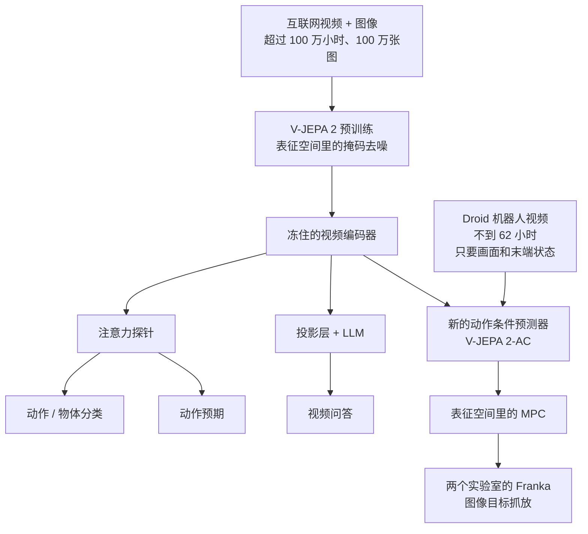
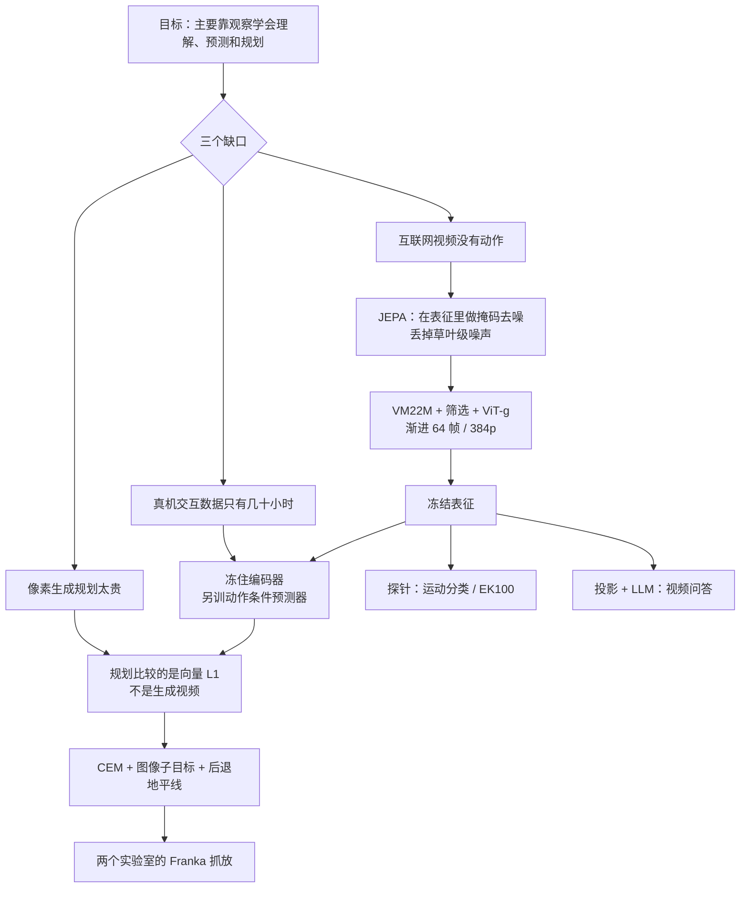

# V-JEPA 2：世界模型不必画出下一帧，规划只要在表征里比远近

<!-- release-date: 2025-06-11 -->

> 本文依据 FAIR at Meta 的 **V-JEPA 2: Self-Supervised Video Models Enable Understanding, Prediction and Planning**，即 arXiv:2506.09985v1（2025-06-11 提交）。本地原件 48 页，约 20MB，封面印 Date: June 13, 2025。页码一律指这份本地 PDF 自身的页码。动笔前已核 arXiv 官方页：提交历史只有 v1，因此未换件。HTML 实验页页脚出现的 August 24, 2026 是渲染日期，不是修订版。
>
> 文中会明确区分三层：**报告写了什么**、**我们如何解释或推算**、**哪些是外部资料补充**。外部补充一律标出来源并给链接。
>
> 关于 `release-date`：取 2025-06-11。这一天官方博客、代码仓和 Hugging Face 权重同时向公众开放使用；论文封面印的 June 13 晚于公开日，不取。证据链见文末。
>
> 同系列后来还有 V-JEPA 2.1 与 VL-JEPA，本站尚未解读。本文只写 V-JEPA 2 原件，不引用后续工作的数字。

## 先把「世界模型」在这篇里的意思钉死

站内已经有三篇世界模型方向的解读，它们各自卡在不同缺口上：

- [Genie](/reports/Google/Genie)：互联网视频没有动作标签，所以它从相邻帧的差异里挤出一套只有 8 个码的「按键」，再按帧生成画面。
- [Cosmos](/reports/NVIDIA/Cosmos)：机器人不能靠摔跤学习，所以它先用视频学一个通用世界副本，再接到具体身体上。预测对象仍是像素。
- [Dreamer 4](/reports/Google/Dreamer-4)：世界模型必须又快又准，智能体才能只在想象里学会挖钻石。它预测的是 tokenizer 压出来的连续表示，策略在这个仿真器里做强化学习。

三篇有一个共同点：**下游要的是一段能看的未来**。Genie 和 Cosmos 生成画面；Dreamer 4 虽然不直接画 RGB，仍要在视觉 token 空间里把下一帧「补」出来，才能当仿真器。

V-JEPA 2 走的是另一条岔路。报告自己把分界写得很硬（PDF p.2）：

> 像素生成目标会强调不可预测的细节，比如草地里每一片草、树上每一片叶子在哪。JEPA 只学可预测的部分，比如一个运动物体的轨迹。

所以这篇里的「世界模型」不是像素生成器。它是一套**表征空间里的预测器**：先把画面压成向量，再在向量里想象「如果我这样做，世界会变成什么样」，最后用想象出来的向量和目标图的向量比远近，选出下一步动作。

| | Genie | Cosmos | Dreamer 4 | V-JEPA 2（本篇） |
|---|---|---|---|---|
| 训练时主要看什么 | 纯视频 | 视频 + 文本扰动，后接真实动作 | 带动作的游戏/视频录像 | 无动作互联网视频，再加少量机器人轨迹 |
| 预测对象 | 离散视觉 token，再还原成像素 | 像素（扩散） | tokenizer 的连续表示 | 编码器学到的连续表征 |
| 控制信号 | 从视频里挤出的潜动作 | 文字、相机位姿或动作向量 | 鼠标和键盘 | 末端执行器的 7 维增量 |
| 怎么用 | 人按「键」生成下一帧 | 生成世界视频；规划被写成未来应用 | 在想象轨迹上做强化学习 | 在表征里做模型预测控制（MPC） |
| 要不要画出下一帧 | 要 | 要 | 要（视觉 token） | 控制时不要；附录的解码器只用来给人看 |

这张对照表是**我们的归纳**，用来防止把四个「世界模型」读成同一个东西。报告自己拿来对比的像素生成世界模型，是 Cosmos 那条线（PDF p.11、p.15、p.22）。

## 六个词，先各用一句话说清

- **自监督（self-supervised learning）**：训练信号从数据自己来，不靠人标「这是杯子」「下一步该抓」。本篇预训练用的是视频里被遮住的那一块。
- **联合嵌入预测架构（Joint-Embedding Predictive Architecture，JEPA）**：Yann LeCun 2022 年提出的一类目标。两边都先把输入压成向量（联合嵌入），再让一边去预测另一边的向量，而不是预测原始像素。
- **编码器 / 预测器（encoder / predictor）**：编码器把画面变成表征；预测器在表征里补全被遮住的部分，或（后训练之后）根据动作想象下一帧的表征。
- **表征空间 / 潜空间（representation space / latent space）**：画面被压进去的那组向量。规划时比较的是向量和向量，不是像素和像素。
- **动作条件世界模型（action-conditioned world model）**：预测时把「我准备做什么」也喂进去。本篇管这个后训练出来的模型叫 **V-JEPA 2-AC**。
- **模型预测控制（Model Predictive Control，MPC）**：每一步先在模型里试许多候选动作，挑看起来最接近目标的那一个执行，看到新画面后再重来。本篇用交叉熵方法（Cross-Entropy Method，CEM）做这个搜索。

本篇真正要记住的新名字只有两个：**V-JEPA 2**（无动作预训练出来的视频编码器）和 **V-JEPA 2-AC**（冻住编码器、另训一个吃动作的预测器）。其余都是现成部件。

## 一句话先说清

V-JEPA 2 不是一个更会画视频的模型，也不是把 V-JEPA 换成更大 ViT 那么简单。

它真正做的事情是两段叠在一起：

1. 在超过 100 万小时、没有动作标签的互联网视频上，用掩码去噪把「可预测的物理」学进表征；
2. 冻住这个编码器，用不到 62 小时 Droid 机器人视频另训一个动作条件预测器，然后在两个实验室的 Franka 臂上，用图像目标做零样本抓放规划——这些实验室没有采过数据，也没有任务奖励。

规模上，预训练编码器最大到 **ViT-g、约 10 亿参数**（PDF p.3、p.35）；动作条件预测器另有约 **3 亿参数**（PDF p.10）。报告没有把两者加总称为「13 亿参数模型」。

如果只记一句话，可以记：

> **规划需要的不是一张更漂亮的下一帧，而是一个对动作敏感、又丢掉不可预测噪声的表征。**

## 报告地图：48 页里各写了什么

正文到第 23 页结束。参考文献占第 24–32 页。附录占第 33–48 页。

| 页 | 写了什么 |
|---|---|
| p.1–3 | 摘要、总览图、四项贡献（理解 / 问答 / 预期 / 规划） |
| p.4–8 | 预训练：掩码去噪、3D-RoPE、四条缩放杠杆、VideoMix22M、渐进分辨率 |
| p.8–11 | V-JEPA 2-AC：教师强制 +  rollout 损失、块因果注意力、能量最小化规划 |
| p.11–15 | 零样本机器人：Octo / Cosmos 对照、到达 / 抓取 / 抓放、相机与长程限制 |
| p.15–18 | 冻结探针分类、EK100 动作预期 |
| p.19–21 | 对齐 LLM 后的视频问答 |
| p.21–23 | 相关工作、结论与三条未来方向 |
| p.33–36 | 附录 A：预训练超参、YT1B 检索筛选、架构表、数据与时长消融 |
| p.37–41 | 附录 B：AC 超参、任务定义、表征解码可视化、相机位置敏感 |
| p.42–44 | 附录 C–D：分类与预期探针细节、更长预期时间 |
| p.45–48 | 附录 E：MLLM 两套对齐配方 |

## 先看全景：两段训练，三种用法

根据 PDF 图 1（p.2）和图 2（p.4）重画。这是机制示意，不是实测时间线。

报告把贡献按「理解、预测、规划」三条能力来写（PDF p.3）。阅读时可以按这个顺序：先弄清 JEPA 在预测什么，再看预训练怎么放大，再看那 62 小时怎样把表征变成控制器，最后回头用探针和问答检查这个表征里到底装了什么。

## 核心矛盾：能看的数据最多，能动手的数据最少

先不谈任何新名词。

要让机器人在没见过的桌子上把杯子放到盘子里，模型至少得会三件事：看懂现在的画面、想象某个动作之后世界会怎样、从想象里挑一个动作执行。传统做法是直接在「状态 + 动作」序列上训世界模型，常常还要环境给奖励（PDF p.2）。这条路的数据只能从你自己控制的机器人上录，又贵又慢。

互联网上有海量视频。那些视频记录了「发生了什么」，但几乎没有「当时按了什么」。

于是领域被卡在一个尴尬位置上：**数据最多的地方，恰恰没有动作；有动作的地方，数据少到撑不起一个通才。**

近年有一批工作尝试用互联网视频加交互数据去训**动作条件视频生成模型**，再拿生成结果做控制。报告点名这条线的问题：它们更常被拿去评画面是否逼真，而很少真正用来规划——一个很实际的原因是，**靠生成视频来规划太贵了**（PDF p.2）。后文 Cosmos 对照把这个代价写成了具体数字：在一块 RTX 4090 上，每规划一步动作要 4 分钟；一整条抓放轨迹超过 1 小时（PDF p.13、p.15）。

V-JEPA 2 押的注是：

> **先用没有动作的视频，把「可预测的世界」压进表征；再用很少的机器人数据，让这个表征开始听懂动作。规划比较的是向量，不是像素。**

## 核心设计一：JEPA 到底在预测什么

### 旧问题：预测像素会逼模型去背噪声

如果训练目标是「把被遮住的那一块像素画回来」，模型必须同时学两件事：杯子大概会往哪走，以及背景窗帘上每一条褶皱怎么摆。后一件对控制几乎没有用，却占掉大量容量。

### 新设计：在学到的向量里做掩码去噪

V-JEPA 的目标是：从一段被随机丢掉图块的视频 $x$，去预测完整视频 $y$ 的**表征**，而不是 $y$ 的像素（PDF p.4，图 2 左）。

系统有两个网络。编码器 $E_\theta$ 把能看见的图块压成向量。预测器 $P_\phi$ 拿到这些向量，再拼上一组可学习的掩码 token $\Delta_y$——掩码 token 只告诉模型「缺的那一块在哪」，本身不含图像内容。预测器的输出去贴近另一份目标表征。目标来自编码器的指数滑动平均（EMA）版本 $E_{\bar\theta}$，并且对目标做停止梯度，避免表征塌缩成常数（PDF p.4）。损失只加在被遮住的那些位置上，用 $L_1$：

$$
\min_{\theta,\phi,\Delta_y}\ \bigl\| P_\phi\bigl(\Delta_y,\ E_\theta(x)\bigr) - \operatorname{sg}\bigl(E_{\bar\theta}(y)\bigr) \bigr\|_1
$$

人话版只有一句：**看得见的部分负责提供上下文，看不见的部分负责当考题，考题的标准答案是「完整视频被压成的意思」，不是原图像。**

掩码策略沿用 V-JEPA 的多块遮挡（multiblock masking）（PDF p.5）。视频先被切成 $2\times 16\times 16$ 的管状图块（时间 $\times$ 高 $\times$ 宽），再送进 Vision Transformer（PDF p.5）。

### 位置编码从绝对正弦改成 3D-RoPE

初代 V-JEPA 用绝对 sincos 位置编码。本篇把特征维大约三等分，分别给时间、高度、宽度做一维旋转位置编码（RoPE），得到 3D-RoPE。报告说这件事对稳住最大模型有帮助（PDF p.4–5）。

### 收益、代价、可迁移启发

收益写在后文的探针和规划里：表征更偏向运动和可预测结构，规划时不必生成视频。代价也很明确：表征里没有的东西，后面的世界模型也变不出来——所以报告把第 5–7 节的探针和问答，写成对「这个潜空间到底装了什么」的检查（PDF p.15）。可迁移的一点是：当你真正要的是控制和预测，而不是一张能交差的视频时，把监督信号从像素挪到表征，等于主动丢掉不可预测噪声。

## 核心设计二：四条杠杆把 V-JEPA 放大成 V-JEPA 2

初代配方停在约 3 亿参数、200 万视频、9 万步、16 帧短片段（PDF p.5）。本篇加了四件事，并用冻结编码器上的六项分类平均准确率来选配方：Something-Something v2、Diving-48、Jester、Kinetics、COIN、ImageNet（PDF p.5）。图 3 用 ViT-L/16 做基线，平均准确率从 84.2 走到 88.2，累计 +4.0（PDF p.5）：

| 杠杆 | 从什么到什么 | 平均准确率变化（PDF p.5） |
|---|---|---|
| 数据 | 200 万 → 2200 万视频（VM22M） | +1.0，到 85.2 |
| 模型 | 3 亿（ViT-L）→ 10 亿（ViT-g） | 再 +1.5，到 86.7 |
| 训练更长 | 9 万 → 25.2 万迭代 | 再 +0.8，到 87.5 |
| 更高分辨率 / 更长片段 | 256→384，16→64 帧 | 再到 88.2 |

第 2.4 节写模型放大是 +1.5（PDF p.7）；图 5 左写 3 亿到 10 亿是 +1.7（PDF p.8）。两处口径略有差别，后文引用时按所在页。

### 数据：公开来源拼成 VideoMix22M，并对 YT1B 做检索筛选

报告强调用公开数据，方便别人复现（PDF p.6）。表 1 的构成如下（PDF p.6）：

| 来源 | 样本数 | 类型 | 总时长 | 是否筛选 | 采样权重 |
|---|---:|---|---:|---|---:|
| Something-Something v2 | 16.8 万 | 第一人称视频 | 168 小时 | 否 | 0.056 |
| Kinetics 400/600/700 | 73.3 万 | 第三人称动作 | 614 小时 | 否 | 0.188 |
| HowTo100M | 110 万 | 教程视频 | 13.4 万小时 | 否 | 0.318 |
| YT-Temporal-1B | 1900 万 | 通用 YouTube | 160 万小时 | 是 | 0.188 |
| ImageNet | 100 万 | 图像 | — | 否 | 0.250 |

图像被沿时间复制成 16 帧「静止视频」，才能和视频一起训（PDF p.6）。正文另写未筛选的 YT1B 约 140 万视频小时（PDF p.6）；与表 1 的 160 万小时不是同一个口径，不要混成一个数。

YT1B 几乎没筛选，噪声（卡通、剪贴画）会拖后腿。他们把视频切成镜头，用 DINOv2 ViT-L 取中间帧嵌入，聚成 150 万簇，再按 Kinetics、SSv2、COIN、Epic-Kitchens 的训练集做簇检索，只保留至少被一个目标样本命中的簇：约 21 万簇、1.15 亿镜头（PDF p.6、p.33–34）。验证集视频不进未筛选池（PDF p.6）。在 ViT-L、9 万步的短配方上，筛选后的 YT1B 比未筛选平均 +1.4；VM22M 相对初代 VideoMix2M 平均 +1（PDF p.6–7）。

有一个反直觉的尺度效应：ViT-L 短训时，纯筛选 YT1B 在 COIN、K400 上甚至好过混合数据；到 ViT-g 和长训，VM22M（混合 + 筛选 YT1B）才全面更好。未筛选数据在长训里会在约 600 个 epoch 之后开始掉点（PDF p.35–36）。**小模型吃精选数据更香，大模型才吃得下更杂的混合。**

### 训练日程：warmup-constant-decay，方便从中途分叉降温

学习率先线性升温 1.2 万步，再恒定，最后降温 1.2 万步（PDF p.7、p.33）。报告说这和半余弦差不多，但可以从恒定阶段的不同检查点分别开降温，试长训更便宜（PDF p.7）。教师 EMA 和权重衰减改成常数，不再像初代那样爬坡（PDF p.7）。全局 batch 3072；主阶段 16 帧、256 分辨率、4 fps；升温后学习率到 $5.25\times 10^{-4}$（PDF p.33）。

### 渐进分辨率：贵的 64 帧 384p 只出现在最后降温

直接在 $64\times 384\times 384$ 上从头训 ViT-g，报告估计大约要 60 GPU 年（PDF p.7）。他们改成：前 24 万步只看 16 帧、256 分辨率（1.2 万升温 + 22.8 万恒定），最后 1.2 万步再把时长和分辨率拉上去（PDF p.7）。图 5 中给出相对从头全分辨率，最多约 8.4 倍 GPU 时间下降（PDF p.8）。

降温时把片段从 16 帧拉到 64 帧，即使评估仍只用 16 帧，平均也 +0.7（PDF p.8）。评估也改用更长片段时，单 clip 协议下 16 帧到 64 帧平均 +9.7（PDF p.36）。128 和 256 帧在这组理解任务上没有再涨（PDF p.8）。64 帧、4 fps 大约是 16 秒，和结论里「本篇关注大约 16 秒以内的预测」对得上（PDF p.23）。

### 编码器家族：预测器在预训练里很小

附录表 12（PDF p.35）：

| 模型 | 参数量 | 宽度 | 深度 | 头数 | MLP |
|---|---:|---:|---:|---:|---:|
| 编码器 ViT-L | 3 亿 | 1024 | 24 | 16 | 4096 |
| 编码器 ViT-H | 6 亿 | 1280 | 32 | 16 | 5120 |
| 编码器 ViT-g | 10 亿 | 1408 | 40 | 22 | 6144 |
| 预训练预测器 ViT-s | 2200 万 | 384 | 12 | 12 | 1536 |

所有编码器共用同一个小预测器。后文 V-JEPA 2-AC 的 3 亿参数预测器是**另训的新网络**，不要和这个 2200 万的预训练预测器当成同一个东西。

## 核心设计三：冻住编码器，用不到 62 小时听懂动作

预训练之后的 V-JEPA 2 可以补视频里缺的块，但补的时候并不知道「是谁的动作造成了这个变化」（PDF p.8）。要把表征变成控制器，必须让预测器看见动作。

### 旧问题：交互数据太少，不能把编码器推倒重来

如果在 62 小时机器人视频上端到端重训 10 亿参数编码器，互联网视频里学到的运动先验很容易被冲掉。报告的选择是：编码器冻住，只在它上面长一个新的、按帧因果的动作条件预测器（PDF p.8–9，图 2 右）。

### 数据：只要画面和末端状态，不要任务标签

数据来自 Droid：桌面 Franka Panda、7 自由度、两指夹爪，片段通常 3–4 秒（PDF p.9）。这里的「无标签」非常具体：不用奖励、不用这条演示在做什么任务、也不用成功/失败；只用原始视频和每一帧的末端执行器状态——3 维位置、3 维欧拉角、1 维夹爪（PDF p.9）。动作 $a_k$ 定义为相邻帧末端状态的差，同样是 7 维（PDF p.9）。

采样 4 秒、256 分辨率、4 fps，得到 16 帧。短于 4 秒的视频丢掉，剩下不到 62 小时（PDF p.9）。脚注写明：他们用了 Droid 里约 2.3 万条轨迹，成功和失败都算（PDF p.11）。只训左外侧相机；左右一起训、又不把相机位置当条件，会变差（PDF p.37）。

### 损失：一步教师强制，加上两步 rollout

每一帧被冻住的 ViT-g 独立编码成 $16\times 16\times 1408$ 的特征图 $z_k$（PDF p.9）。动作、末端状态和特征图按时间交错送进预测器。教师强制让每一步用**真实**的过去去预测下一步，时间长度 $T=15$（PDF p.9）：

$$
L_{\mathrm{tf}}(\phi)=\frac{1}{T}\sum_{k=1}^{T}\bigl\| \hat z_{k+1}-z_{k+1}\bigr\|_1
$$

只做教师强制，推理时把自己的预测再喂回去会一步步漂。于是再加一项两步 rollout 损失：从 $(s_1,z_1)$ 出发，沿真实动作滚到 $T=2$，只通过一个循环步反传（PDF p.9–10）：

$$
L_{\mathrm{rollout}}(\phi)=\bigl\| P_\phi(a_{1:T},s_1,z_1)-z_{T+1}\bigr\|_1
$$

总损失是两项相加（PDF p.9）。图 6 用 $T=4$ 示意：左边每一步都看真实帧，右边有的输入已经是自己刚预测出来的表征（PDF p.10）。

### 预测器：3 亿参数、块因果注意力

架构是约 3 亿参数 Transformer：24 层、16 头、隐维 1024、GELU（PDF p.10）。动作、末端状态、展平特征图各走一套可学习仿射，映到预测器隐维；输出再映回编码器的嵌入维。视频图块用 3D-RoPE；动作和位姿 token 只加时间旋转（PDF p.10）。

块因果（block-causal）的意思是：同一时刻的图块可以互相看，也可以看当前和过去的动作、末端状态以及其他图块；不能看未来（PDF p.4、p.10）。这和语言模型的因果注意力同构，只是「一个 token」变成了「某一帧里的一整块空间特征 + 这一步的动作」。

优化器用 AdamW，学习率从 $7.5\times 10^{-5}$ 升到 $4.25\times 10^{-4}$（4500 步），恒定 85500 步，再降到 0（4500 步）；权重衰减 0.04；batch 256（PDF p.37）。

### 收益、代价、可迁移启发

收益是：互联网视频负责「世界通常怎么动」，62 小时只负责「这个手臂的动作如何改表征」。代价是：编码器在后训练里不再更新，Droid 里没见过的物体和相机几何，只能靠预训练表征里已经有的不变性去扛——后文相机敏感就是这笔账。可迁移的一点是：**稀缺的交互数据不要拿去重写视觉前端，拿去训一个听得懂动作的预测头。** 失败轨迹也留下了，因为世界模型要学的是「做了这个动作会怎样」，不是「专家会怎样」。

## 核心设计四：规划是在表征里做视觉伺服，不是生成视频

### 能量：想象 $T$ 步之后，离目标图有多远

给一张目标图 $x_g$。当前帧和目标图分别编码成 $z_k$、$z_g$。在地平线 $T$ 上找一串动作，让预测器想象出来的未来表征尽量靠近 $z_g$（PDF p.10，式 5）：

$$
E(\hat a_{1:T};z_k,s_k,z_g)=\bigl\| P(\hat a_{1:T};s_k,z_k)-z_g\bigr\|_1
$$

人话：把目标图也压进同一个潜空间，规划就是找一串动作，让「模型脑子里的未来」在这个空间里走近目标。优化用 CEM：每一步的动作坐标从高斯里采样，用最优的一批更新高斯的均值和方差，迭代若干轮，交出均值轨迹（PDF p.11，图 7）。只执行第一个动作，看到新画面再重规划，也就是后退地平线控制（PDF p.11）。

实验里地平线取 1，800 个样本，10 轮精炼，每轮留前 10（PDF p.37）。动作被限制在原点附近半径 0.075 的 $L_1$ 球里，单步末端最大位移约 13 厘米，因为更大的动作对模型偏出分布（PDF p.12）。任务相对「贪心」，短地平线够用；更长地平线也能做，但更耗时（PDF p.37）。

### 部署：两个没在 Droid 里出现过的实验室

零样本部署在两个实验室的 Franka Emika Panda + RobotiQ 夹爪上，视觉是未标定、低分辨率、单目 RGB（PDF p.12）。两台机器人用同一套权重和推理代码，底层是操作空间控制。V-JEPA 2-AC 和 Cosmos 用阻塞控制（上一条执行完再发下一条）；Octo 试了阻塞和非阻塞，取更好的那个（PDF p.12）。

对照有两个（PDF p.11）：

- **Octo**（行为克隆的视觉–语言–动作模型）：从 Open-X 上超过 100 万条轨迹的预训练权重出发，在**整个** Droid 上用事后目标重标注做行为克隆。
- **Cosmos**（像素生成世界模型）：从在 2000 万小时视频上训好的无动作 Cosmos（潜空间扩散、70 亿、连续 tokenizer）出发，用官方动作条件微调代码在 Droid 上微调；报告还降了学习率、去掉视频条件 dropout、把噪声乘了 $e^{2}$（PDF p.11）。

报告写：就他们所知，这是第一次把 Cosmos 拿来做机器人控制的公开尝试（PDF p.12）。

### 到达：单调靠近，4 厘米以内

单目标到达：根据一张目标图把末端移到空间中的某个位置，同时检查模型有没有从单目图里读出深度和动作效果（PDF p.12）。图 8 三条轨迹都在 4 厘米以内，误差单调下降（PDF p.12）。报告把它看成一种视觉伺服，但训练数据是无标签真实视频，不是经典视觉伺服那种标定几何（PDF p.12）。

图 9 画了 $\Delta y$ 到达任务的能量面：真值动作在 $(\Delta x,\Delta y)=(0,-0.1)$，能量最低点大约在 $(0,-0.05)$。形状相对平滑、局部凸，便于搜索；也说明模型能从画面里大致推出动作效果，不需要精密传感（PDF p.13）。最低点并不精确落在真值上，后文相机会解释为什么动作常常「方向对、步长偏」。

### 抓取和抓放：子目标把长任务切短

抓取、持物到达只给一张目标图。抓放额外给两张子目标：物体被抓住、物体靠近目标位置，再加上最终放置图。时间分配是 4 步、10 步、4 步，到点自动切换（PDF p.13–14）。图 10 是两条实验室、多种摆放和杂乱桌面的闭环执行；高亮帧是切子目标的时刻（PDF p.14）。

表 2：每个设定 10 次试验，改变物体位置和起始姿态（PDF p.14）：

| 方法 | 实验室 | 到达 | 抓杯 | 抓盒 | 持杯到达 | 持盒到达 | 杯抓放 | 盒抓放 |
|---|---|---:|---:|---:|---:|---:|---:|---:|
| Octo | Lab 1 | 100% | 20% | 0% | 20% | 70% | 20% | 10% |
| Octo | Lab 2 | 100% | 10% | 0% | 10% | 70% | 10% | 10% |
| Octo | 平均 | 100% | 15% | 0% | 15% | 70% | 15% | 10% |
| V-JEPA 2-AC | Lab 1 | 100% | 70% | 30% | 90% | 80% | 80% | 80% |
| V-JEPA 2-AC | Lab 2 | 100% | 60% | 20% | 60% | 70% | 80% | 50% |
| V-JEPA 2-AC | 平均 | 100% | 65% | 25% | 75% | 75% | 80% | 65% |

到达大家都会。差距出在和物体交互。杯子常常要伸进杯口再夹沿，动作稍偏就滑掉；盒子可抓姿态更多，但夹爪张开宽度要够（PDF p.13）。V-JEPA 2-AC 在所有技能上最高，但抓盒仍然只有平均 25%——报告没有把这件事写成已经解决。

表 3 只在 Lab 2 上比 Cosmos，同一块 RTX 4090、同一套 CEM（PDF p.15）：

| 方法 | 样本数 | 迭代 | 地平线 | 每步耗时 | 到达 | 抓杯 | 抓盒 | 杯抓放 | 盒抓放 |
|---|---:|---:|---:|---|---:|---:|---:|---:|---:|
| Cosmos | 80 | 10 | 1 | 4 分钟 | 80% | 0% | 20% | 0% | 0% |
| V-JEPA 2-AC | 800 | 10 | 1 | 16 秒 | 100% | 60% | 20% | 80% | 50% |

Cosmos 样本少 10 倍仍然慢 15 倍，整条抓放超过 1 小时（PDF p.15）。V-JEPA 2-AC 多采样仍只要 16 秒一步。这就是「不要生成像素」在工程上的兑现：搜索发生在已经算好的表征里，每一步是一次 Transformer 前向，不是一次视频扩散。

报告自己设想的加速手段包括：更多算力、减少样本和精炼轮数、先在世界模型的想象里训一个前馈策略来初始化规划、以及——只对 V-JEPA 2-AC 可行——基于梯度的规划（PDF p.13–14）。这些是展望，不是已做实验。

### 解码器只给人看，不参与控制

附录 B.3 另训了一个 ViT-L 前馈帧解码器，把表征映回 $256\times 256\times 3$ 像素，损失是像素 $L_2$。它只在 Droid 上训，推理时套到 V-JEPA 2-AC 的 rollout 上，用来检查模型在「想」什么（PDF p.37–39）。图 15 里可以看到：背景糊，是因为解码器容量低；手臂在动、架子不动；夹爪闭合时杯子跟着走，张开时杯子留在原地。最后一帧杯子位置略低于真值，是误差累积（PDF p.39）。

**不要把这些重建图理解成 V-JEPA 2 会生成视频。** 控制回路从来没有这个解码器。它是一个事后的探针。

## 表征里到底装了什么：运动强，外观够用

规划世界模型的上限，就是表征里有什么（PDF p.15）。所以报告用冻结编码器 + 四层注意力探针，把六项分类拆成运动理解和外观理解（PDF p.15–16）。注意力探针前三层自注意力，最后一层用可学习 query 做交叉注意力（PDF p.15、p.41）。

表 4 主结果。除 ViT-g384 外，预训练都是 64 帧、256 分辨率；评估协议尽量对齐。ViT-g384 六项都用 384，SSv2 额外用 64 帧（PDF p.16）：

| 方法 | 参数量 | 平均 | SSv2 | Diving-48 | Jester | K400 | COIN | IN1K |
|---|---:|---:|---:|---:|---:|---:|---:|---:|
| DINOv2 | 11 亿 | 81.1 | 50.7 | 82.5 | 93.4 | 83.6 | 90.7 | 86.1 |
| PEcore G | 19 亿 | 82.3 | 55.4 | 76.9 | 90.0 | 88.5 | 95.3 | 87.6 |
| SigLIP2 | 12 亿 | 81.1 | 49.9 | 75.3 | 91.0 | 87.3 | 95.1 | 88.0 |
| V-JEPA ViT-H（初代） | 6 亿 | 85.2 | 74.3 | 87.9 | 97.7 | 84.5 | 87.1 | 80.0 |
| InternVideo2s2-1B | 10 亿 | 87.0 | 69.7 | 86.4 | 97.0 | 89.4 | 93.8 | 85.8 |
| V-JEPA 2 ViT-L | 3 亿 | 86.0 | 73.7 | 89.0 | 97.6 | 85.1 | 86.8 | 83.5 |
| V-JEPA 2 ViT-H | 6 亿 | 86.4 | 74.0 | 89.8 | 97.7 | 85.3 | 87.9 | 83.8 |
| V-JEPA 2 ViT-g | 10 亿 | 87.5 | 75.3 | 90.1 | 97.7 | 86.6 | 90.7 | 84.6 |
| V-JEPA 2 ViT-g384 | 10 亿 | 88.2 | 77.3 | 90.2 | 97.8 | 87.3 | 91.1 | 85.1 |

读这张表时要带着报告自己的警告：各编码器预训练数据不同（DINOv2 用 LVD-142M，PEcore G 用 MetaCLIP），这是系统级对比，不是公平消融（PDF p.16）。能下的结论是：在同一套冻结探针协议下，V-JEPA 2 的运动理解明显更强——SSv2 上 ViT-g 的 75.3 对 InternVideo 的 69.7、PEcore G 的 55.4；外观任务够用，ImageNet 84.6，比初代 V-JEPA 高 4.6，但仍低于 SigLIP2 的 88.0（PDF p.16–17）。摘要里的 77.3 是 ViT-g384 在 SSv2 上的数字（PDF p.1、p.16）。

探针本身不是免费的。四层探针比单层交叉注意力平均高 1.4（ViT-L）和 1.0（ViT-g）；Jester 是例外，单层已经饱和（PDF p.42–43）。Diving-48 和 Jester 还从编码器多层取 token：ViT-g 从 1 层改到 4 层，Diving-48 从 82.9 到 86.7（PDF p.43）。这些数字说明：**「冻结表征 + 探针」测到的，既有编码器的能力，也有探针容量。**

## 动作预期：EK100 上的 39.7，主要靠编码器

Epic-Kitchens-100 是 100 小时第一人称厨房视频，45 个厨房，3568 种「动词 + 名词」动作，97 类动词、300 类名词。任务是：在动作开始前 1 秒，根据前面的上下文，预测接下来的动词、名词和二者组合。因为未来并不唯一，指标是按类平均的 recall-at-5（PDF p.17）。

探针接在冻结的编码器**和**预测器上：上下文进编码器；预测器再拿掩码 token 去预测 1 秒后那一帧的表征；两边的 token 拼起来，最后三个 query 分别分类动作、动词、名词，用 focal loss（PDF p.17）。训练时预期时间在 0.25–1.75 秒之间随机抽，验证固定 1 秒（PDF p.43–44）。

表 5（PDF p.17）：

| 方法 | 参数量 | 动词 | 名词 | 动作 |
|---|---:|---:|---:|---:|
| InAViT | 1.6 亿 | 51.9 | 52.0 | 25.8 |
| Video-LLaMA | 70 亿 | 52.9 | 52.0 | 26.0 |
| PlausiVL | 80 亿 | 55.6 | 54.2 | 27.6 |
| V-JEPA 2 ViT-L | 3 亿 | 57.8 | 53.8 | 32.7 |
| V-JEPA 2 ViT-H | 6 亿 | 59.2 | 54.6 | 36.5 |
| V-JEPA 2 ViT-g | 10 亿 | 61.2 | 55.7 | 38.0 |
| V-JEPA 2 ViT-g384 | 10 亿 | 63.6 | 57.1 | 39.7 |

ViT-L 的 32.7 已经超过 80 亿参数的 PlausiVL；ViT-g384 相对 PlausiVL 的 27.6 是 +12.1，相对提升 44%（PDF p.18）。随模型变大近似线性。

一个容易读过头的消融在表 20（PDF p.44）：只给编码器 39.1，只给预测器 20.2，两个都给 39.7。预测器只贡献约 +0.6。报告自己的判断是：EK100 **主要需要语义理解，而不是预报能力**（PDF p.43）。摘要把 39.7 写成「预测」能力，和这个消融放在一起看更准确：预训练确实让表征更适合预期任务，但真正预报未来的那个预测器，在这个基准上不是主力。

限制也写得很干净（PDF p.18）：没有完全做对 EK100；预期时间拉到 2、4、10 秒，recall 明显下降（PDF p.44–45，图 18）；场景限于厨房、闭集词表，不知道换环境会怎样；动作来自固定类别，无法泛化到训练集没有的动作名。图 11 的失败例子里，模型会提出「关门」「放下香料包」这类说得通的动作，但把「茶包」认错（PDF p.18）。

## 视频问答：没有语言监督的视频编码器，对齐之后仍能打

常规视频 MLLM 用的是 CLIP、SigLIP、Perception Encoder 这类**看过图文对**的图像编码器，按帧独立编码（PDF p.19）。报告写：就他们所知，这是第一次用**完全没有语言监督**预训练的视频编码器，去训视频问答 MLLM（PDF p.19）。对齐走 LLaVA 式早期融合：视觉 token 经投影层进 LLM（PDF p.19）。

数据是 8850 万图文 / 视频–文本对，和 PerceptionLM 同类（PDF p.19）。实验分两档。

### 受控对照：同一套 LLM、同一份 1800 万数据

LLM 固定为 Qwen2-7B-Instruct，编码器冻结，1800 万样本（PDF p.20）。表 6（PDF p.20）：

| 方法 | 编码器 / LLM | 平均 | PerceptionTest | MVP 成对准确率 | TempCompass | TemporalBench | TVBench | TOMATO | MVBench |
|---|---|---:|---:|---:|---:|---:|---:|---:|---:|
| DINOv2 ViT-g518 | 11 亿 / 70 亿 | 45.7 | 67.1 | 22.4 | 62.3 | 26.8 | 47.6 | 32.0 | 61.8 |
| SigLIP2 ViT-g384 | 11 亿 / 70 亿 | 48.1 | 72.4 | 26.2 | 66.8 | 25.7 | 48.7 | 33.2 | 64.0 |
| PE ViT-G/14 448 | 19 亿 / 70 亿 | 49.1 | 72.3 | 26.7 | 67.0 | 27.5 | 51.6 | 34.0 | 64.7 |
| V-JEPA 2 ViT-g512 | 10 亿 / 70 亿 | 52.3 | 72.0 | 31.1 | 69.2 | 33.3 | 55.9 | 37.0 | 67.7 |

V-JEPA 2 在平均和几乎所有时间向基准上更高；PerceptionTest 上略低于 SigLIP2 / PE（72.0 对 72.4 / 72.3）（PDF p.20）。差距主要出现在 MVP、TemporalBench、TVBench——这些基准更针对时间理解（PDF p.20）。报告据此反驳「没有语言监督的视觉编码器对齐不上 LLM」这种常见看法（PDF p.3、p.20）。

端到端解开编码器时，从 ViT-L256 到 ViT-g512，平均从 51.7 到 54.4；分辨率从 256 到 512 在 PerceptionTest、TemporalBench、TVBench 上分别再 +2.2、+4.0、+3.3（PDF p.20，表 7）。图 19：冻结编码器、增加帧数，V-JEPA 2 的下游平均近似线性上升，DINOv2 持平或下降（PDF p.47）。视频编码器吃得下更长上下文，图像编码器按帧拼接吃不下。

受控配方基于 LLaVA-NeXT，128 张 H100，有效 batch 256；视觉 token 用注意力池化压 4–16 倍（PDF p.46–47）。图像不用「重复成 k 帧」，而用改过的 Dynamic S² 切块，保住原分辨率（PDF p.46）。

### 放大数据：8850 万样本，8B 档多项最高

第二档跟 PerceptionLM 8B 同一套 Lingua 代码，骨干换成 Llama 3.1 8B Instruct，编码器是 ViT-g384，MLP 投影、**不做池化**，每帧 288 个视觉 token（PDF p.21、p.47）。三阶段：图文对齐 → 图像问答混合 → 视频问答。Stage 2 / 3 用 512 张 H100。正文写全局 batch 分别为 2048 和 1024（PDF p.47）；附录表 22 把 Stage 2 和 Stage 3 都印成 2048（PDF p.48）。两处不一致，本文不擅自改成一个数。Stage 3 在 2.8 万步里早停到 2.2 万步（PDF p.48）。评测 32 帧（PDF p.48）。

表 8。PerceptionTest 是测试集加 SFT，其余零样本（PDF p.21）：

| 方法 | 编码器 / LLM | 平均 | PerceptionTest | MVP | TempCompass | TemporalBench | TOMATO | TVBench | MVBench |
|---|---|---:|---:|---:|---:|---:|---:|---:|---:|
| InternVL-2.5 | 3 亿 / 70 亿 | 52.1 | 68.9 | 39.9 | 68.3 | 24.3 | 29.4 | 61.6 | 72.6 |
| Qwen2VL | 6.75 亿 / 70 亿 | 47.0 | 66.9 | 29.2 | 67.9 | 20.4 | 31.5 | 46.0 | 67.0 |
| Qwen2.5VL | 10 亿 / 70 亿 | 49.7 | 70.5 | 36.7 | 71.7 | 24.5 | 24.6 | 50.5 | 69.6 |
| PerceptionLM 8B | 10 亿 / 80 亿 | 56.7 | 82.7 | 39.7 | 72.7 | 28.3 | 33.2 | 63.5 | 77.1 |
| V-JEPA 2 ViT-g384 + Llama 3.1 8B | 10 亿 / 80 亿 | 59.5 | 84.0 | 44.5 | 76.9 | 36.7 | 40.3 | 60.6 | 73.5 |

相对 PerceptionLM 8B：PerceptionTest +1.3，MVP +4.8，TempCompass +4.2，TemporalBench +8.4，TOMATO +7.1。TVBench 和 MVBench 没有超过 PerceptionLM（60.6 对 63.5，73.5 对 77.1），但仍高于 Qwen / InternVL 对照（PDF p.21）。摘要里的 84.0 和 76.9 就是这一行（PDF p.1）。

这些问答数字测的是「表征能否对齐语言」，不是「AC 规划器能否听懂自然语言目标」。后文把两件事分开。

## 报告承认的限制，不要读成已经通用的机器人大脑

### 规划侧

**相机位置。** 模型要在没有标定的情况下，从单目图反推末端笛卡尔动作的坐标轴。机器人基座经常不在画面里，这个问题本身不适定（PDF p.14）。他们手工试了若干机位，固定一个之后所有实验共用（PDF p.14、p.40）。附录 B.4 绕桌子扫角度：推断动作相对真值的误差主要是旋转，旋转误差几乎随相机角度线性变；平均绝对误差约 1.6 厘米（真值位移约 5 厘米），$W^\star$ 条件数约 1.5，接近带尺度的旋转（PDF p.40–41）。图 8 里误差单调下降但不是每步最大下降，就是这个旋转偏差（PDF p.41）。报告写了一条事后校正办法——让机器人随机动、对推断动作和真值动作做最小二乘、推理时乘回旋转矩阵——并强调**本文实验没有做这个标定**（PDF p.41）。

**长地平线。** 两件事同时爆：表征空间的自回归会累积误差；动作轨迹数目随地平线指数增长（PDF p.14–15）。当前抓放靠人工切的图像子目标才跑得动；没有子目标的抓放，被明确列为做不到的非贪心任务（PDF p.15）。结论把「不靠子目标做更长任务」留给分层、多时间尺度的 JEPA（PDF p.23）。

**目标只能是图。** 野外更自然的是语言目标。报告把第 7 节的语言对齐写成一个可能的起点，不是已经接上规划器的功能（PDF p.15、p.23）。

### 理解与预期侧

运动理解强、外观不是全面第一；探针容量和多层特征会改变读数；EK100 是闭集厨房；1 秒预期尚可，更长明显变差。

### 规模

本篇只放到约 10 亿参数。第 2 节显示这一段还在涨，但「怎样把预训练配方继续稳到 200 亿」被写成未做（PDF p.23）。预训练的 GPU 总数、墙钟时间和电力，报告没给；只给了「64 帧 384p 从头训约 60 GPU 年」和渐进训练相对节省（PDF p.7–8）。

### 没写的实现，本文也不补

报告没有公开：规划所用 CEM 的全部工程细节与随机种子；两个实验室的相机内参和完整控制器参数；8850 万对齐数据的完整清单与过滤规则；预训练用了多少卡、跑了多久。官方代码仓存在，但按本模块约定，**不拿源码现状补写论文没写的训练细节**。

## 最值得带回自己项目的启发

### 1. 先决定预测对象，再决定能不能拿来规划

Cosmos 对照把「生成视频」和「用世界模型搜索动作」之间的计算差写成了 4 分钟对 16 秒。如果下游是控制而不是做片，监督信号应落在对动作敏感的表征上，而不是像素似然上。

### 2. 把「看」和「听懂动作」拆开训

海量无动作视频负责表征；少量带本体感觉的轨迹负责动作条件预测器。稀缺数据不要拿去重写视觉前端。失败轨迹对世界模型是合法样本。

### 3. 贵的分辨率只出现在最后一段

24 万步看短、低分辨率，最后 1.2 万步再拉到 64 帧、384p，换来约 8.4 倍 GPU 时间下降，且评估时仍吃得到长片段的好处。任何「早期用便宜代理任务、末期再对齐真实分辨率」的配方都是同一思路。

### 4. 筛选在小模型上更划算，混杂数据要等容量够

ViT-L 上纯筛选 YT1B 可以赢过混合；ViT-g 长训才需要 VM22M。未筛选数据会在长训后期拖后腿。不要默认「数据越多越好」而不看模型吃不吃得下噪声。

### 5. 规划目标可以是一张图在表征里的位置

不必先有语言指令，也不必有奖励。子目标把长任务切成短地平线，是这篇能在真机上动起来的关键工程，不是算法上已经解决了长程规划。

### 6. 没有语言监督的视频编码器，对齐 LLM 仍然成立

前提是对齐数据够、分辨率和帧数够。时间向基准上的收益，比外观问答更明显。这不能外推成「可以替代所有图文对比编码器」，只能外推成：视频自监督表征不是语言对齐的天敌。

### 7. 探针读数包含探针自己

四层对一层、多层特征对最后一层，都会改变「冻结评估」的分数。拿这类数字做系统对比时，把探针写进协议，不要只报一个 top-1。

## 用一张图重新串起全文

## 关键词回看

- **JEPA**：两边都先嵌入，再在嵌入空间里预测，而不是预测像素。
- **掩码去噪**：丢掉一部分时空块，让预测器在表征里把它们补回来。
- **EMA 编码器**：目标表征来自参数的滑动平均，配合停止梯度，防止塌缩。
- **3D-RoPE**：把特征维拆成时间 / 高 / 宽三段做旋转位置编码。
- **VideoMix22M**：SSv2、Kinetics、HowTo100M、筛选后的 YT1B、ImageNet 的加权混合。
- **渐进分辨率**：主训练用短、低分辨率，降温阶段再拉时长和空间分辨率。
- **V-JEPA 2-AC**：冻住 V-JEPA 2 编码器之后，用 Droid 轨迹训出来的动作条件预测器。
- **教师强制 / rollout 损失**：前者每步看真实过去；后者把自己的预测再喂回去，减轻误差累积。
- **块因果注意力**：同一帧内部可以互看，不能看未来帧。
- **MPC / CEM**：在动作空间里采样、选优、更新分布，只执行第一步再重规划。
- **图像目标 / 子目标**：用目标图的表征当能量函数的锚；长任务靠人工切的中间图。
- **注意力探针**：冻住编码器，用小型 Transformer 读出类别。
- **早期融合 MLLM**：视觉 token 经 MLP 进 LLM，不把视频先离散成语言 token。

## 最后的判断

V-JEPA 2 最强的叙事不是「视频编码器又刷高了 SSv2」，而是：**它把世界模型从「会不会画下一帧」改写成了「表征里有没有对动作敏感、对噪声不敏感的坐标」。**

四条预训练杠杆证明，JEPA 这种不画像素的目标，在数据、模型、时长、分辨率上仍然能涨。62 小时 Droid、成功失败都要、不要任务奖励，足够把冻住的表征接上一个动作条件预测器。真机规划的数字支持「潜空间 MPC 可以在没采过数据的实验室里做短程抓放」，也清楚暴露了边界：相机几何要人挑，长任务要图像子目标，语言目标还没接上，抓盒子仍然经常失败。

和 Cosmos 的对照是这篇里最值得记住的实验，不是因为它赢了某个分数，而是因为它把两类世界模型的计算形态差写死了：同一种 CEM、同一块 4090，生成视频每步 4 分钟，比表征每步 16 秒。若你的下游是规划，这个差比「画面更不像真」更致命。

它也留下不该被宣传盖住的缺口。EK100 的 39.7 主要来自编码器语义，不是预测器在预报未来。问答 SOTA 是 8B 档、8850 万对齐数据上的系统结果，且 TVBench / MVBench 没有超过 PerceptionLM。10 亿参数只是缩放曲线上的一段，不是终点。

如果只记一句话，可以记：

> **先用最大的无动作数据把可预测结构压进表征，再用最小的交互数据让表征听懂动作；规划比较的是向量之间的距离，不是下一帧好不好看。**

## 资料与阅读边界

- 原始依据：本地 `papers/Meta/V-JEPA-2.pdf`，arXiv:2506.09985v1，48 页。封面 Date: June 13, 2025；arXiv 提交历史只有 v1（2025-06-11 17:57:09 UTC）。
- 官方代码（论文给出）：[github.com/facebookresearch/vjepa2](https://github.com/facebookresearch/vjepa2)。阅读源码时应以具体 commit 为准；本文没有把源码中未写入报告的细节冒充论文结论。
- 官方博客（外部补充，不替代 PDF）：[Introducing the V-JEPA 2 world model and new benchmarks for physical reasoning](https://ai.meta.com/blog/v-jepa-2-world-model-benchmarks)（2025-06-11）。博客另发布 IntPhys 2、CausalVQA 等基准，**不是本 PDF 的实验结果**，本文不把那些分数写进正文。博客称 V-JEPA 2 为 12 亿参数，与 PDF 里「编码器最大约 10 亿、AC 预测器约 3 亿」不是同一个加法，本文以 PDF 为准。
- 官方项目页（外部补充）：[ai.meta.com/vjepa](https://ai.meta.com/vjepa)。
- Hugging Face 权重（外部补充，文件提交时间用于首发日，不用 `createdAt`）：[facebook/vjepa2-vitg-fpc64-256](https://huggingface.co/facebook/vjepa2-vitg-fpc64-256)，初始 commit `f353acd` 含 `original/model.pth`，日期 2025-06-11。
- 同系列后作 V-JEPA 2.1、VL-JEPA 存在，本站尚未解读。本文不引用它们的数字。

### `release-date` 证据链

按本模块约定：记录该模型首次通过任一官方渠道向公众开放使用的日期；权重仓库的 `createdAt` 不能当首发日，要用文件提交时间。

| 事件 | 日期 | 说明 |
|---|---|---|
| arXiv v1 | 2025-06-11 | [arxiv.org/abs/2506.09985](https://arxiv.org/abs/2506.09985)，17:57:09 UTC |
| Meta 官方博客 | 2025-06-11 | 标明 June 11, 2025，并给出 GitHub / Hugging Face 下载入口 |
| Meta 研究页 | 2025-06-11 | [出版物页](https://ai.meta.com/research/publications/v-jepa-2-self-supervised-video-models-enable-understanding-prediction-and-planning/) 同样标 June 11, 2025 |
| GitHub 初始提交 | 2025-06-11 | `facebookresearch/vjepa2` 的 Initial commit `11b731c` |
| Hugging Face 权重文件 | 2025-06-11 | `facebook/vjepa2-vith-fpc64-256` 的 Initial commit `7518874`、`facebook/vjepa2-vitg-fpc64-256` 的 Initial commit `f353acd` 均含模型文件 |
| 论文封面 Date | 2025-06-13 | 晚于公开使用日，不取 |
| 仓库 README 后来写的 `[2025-06-25]` | 2025-06-25 | 这是后续改 README 时加上的「发布」行，不能覆盖 6 月 11 日已经可下载的事实 |

取最早官方公开使用日 **2025-06-11**。
