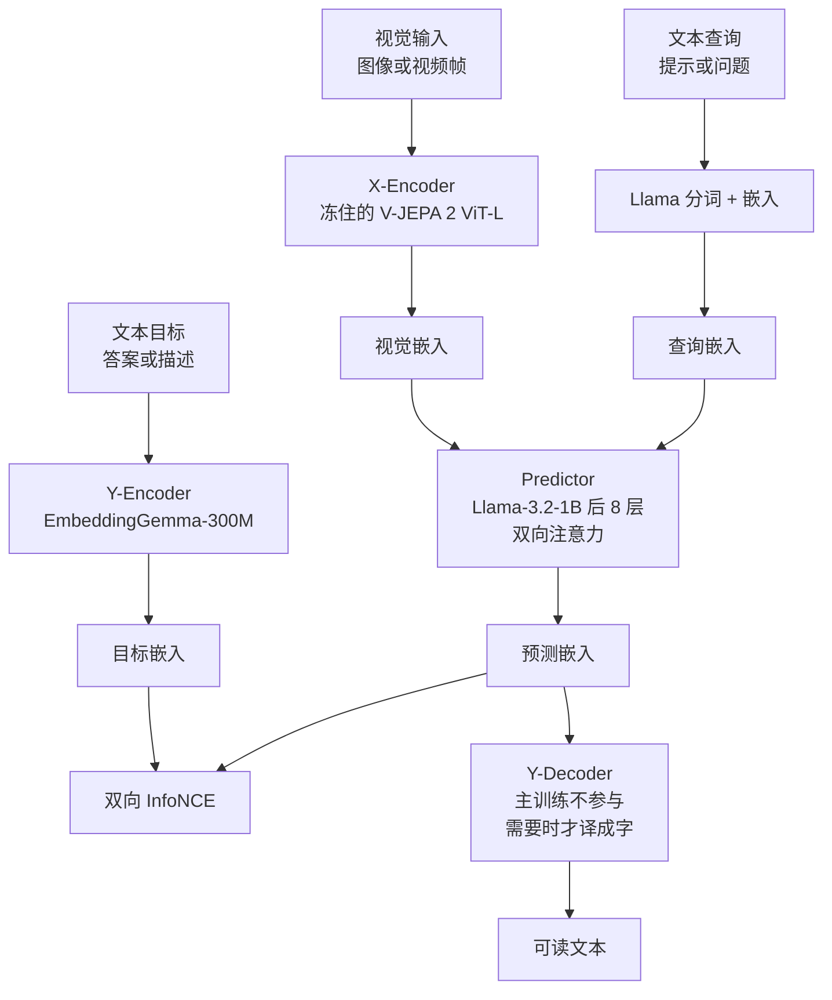
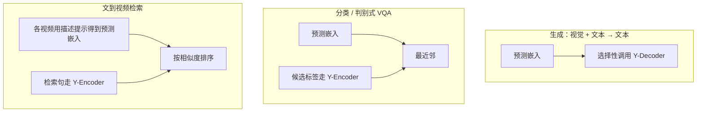
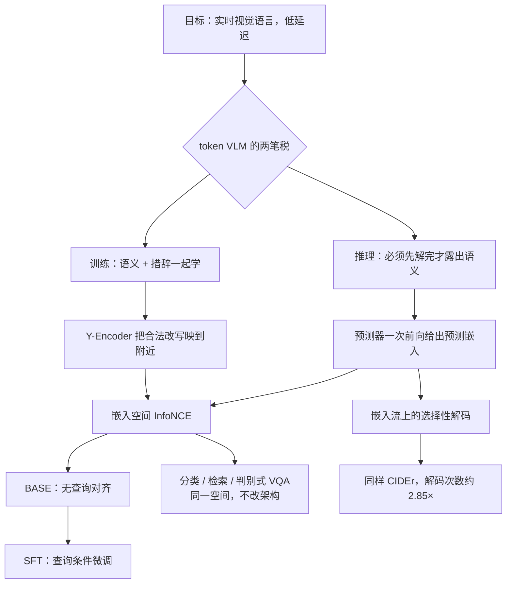

# VL-JEPA：视觉语言模型不必逐词生成，语义只要在嵌入里对齐

<!-- release-date: 2025-12-11 -->

> 本文依据 FAIR at Meta、HKUST、Sorbonne Université、NYU 的 **VL-JEPA: Joint Embedding Predictive Architecture for Vision-language**，即 arXiv:2512.10942v2（2026-02-02 修订）。本地原件 15 页、约 1.2MB。页码一律指这份本地 PDF 自身的页码。动笔前已核 [arXiv 官方页](https://arxiv.org/abs/2512.10942)：提交历史为 v1（2025-12-11）与 v2（2026-02-02），没有比 v2 更新的修订，因此未换件。
>
> 文中会明确区分三层：**报告写了什么**、**我们如何解释或推算**、**哪些是外部资料补充**。外部补充一律标出来源并给链接。
>
> 关于 `release-date`：取 2025-12-11，即 arXiv v1 首次公开日。截至核验，Meta 没有官方博客、没有 `facebookresearch` 代码仓；Hugging Face 上作者门控仓只有 README、没有权重文件。对象从未对外可用，因此改用该技术首次官方公开日。证据链见文末。
>
> 同系列的视频编码器见 [V-JEPA 2](/reports/Meta/V-JEPA-2)。本篇是视觉—语言 JEPA：预测的是**目标文本的连续嵌入**，不是像素，也不是视频稠密特征。本文不引用 V-JEPA 2.1 的数字。

## 六个词，先各用一句话说清

- **视觉语言模型（Vision Language Model，VLM）**：同时看图（或视频）和文字、再产出文字的模型。经典做法是自回归逐 token 生成。
- **联合嵌入预测架构（Joint-Embedding Predictive Architecture，JEPA）**：两边都先把输入压成向量，再让一边去预测另一边的向量，而不是预测原始像素或原始 token。站内 [V-JEPA 2](/reports/Meta/V-JEPA-2) 把它用在视频表征；本篇把它接到视觉—语言。
- **X-Encoder / Y-Encoder**：X 端把画面压成视觉嵌入；Y 端把目标文本压成语义嵌入。训练时预测器去贴 Y 端，而不是去贴原始句子。
- **Predictor（预测器）**：吃视觉嵌入和文本查询，输出「答案应该长什么样」的连续向量。
- **选择性解码（selective decoding）**：嵌入流一直在更新；只有语义明显变化时，才把向量译成字。
- **判别式 VQA**：不把答案一个字一个字写出来，而是把候选答案编成向量，挑离预测嵌入最近的那一个。

本篇真正要记住的新名字只有两个：**VL-JEPABASE**（无查询预训练，用来做零样本分类和检索）和 **VL-JEPASFT**（查询条件监督微调，用来做 VQA，同时保住分类/检索）。其余都是现成部件。

## 一句话先说清

VL-JEPA 不是一个更会写句子的 VLM，也不是把 V-JEPA 2 后面接一个 LLM 那么简单。

它真正做的事情是：把视觉—语言监督从「下一个 token 是什么」改成「目标句子在嵌入空间里的位置」。训练时不必背措辞和文风；推理时不必先把整句解完才知道意思。同一套嵌入还能做开集分类、文到视频检索和判别式 VQA，不用改架构。

如果只记一句话，可以记：

> **VLM 的两个贵，一是表层语言，二是必须先解完才露出语义；JEPA 把监督搬进嵌入，两件事一起卸掉。**

## 报告地图：15 页里各写了什么

正文到第 10 页结束。参考文献占第 11–15 页。没有附录。

| 页 | 写了什么 |
|---|---|
| p.1 | 摘要、图 1 总览、引言：token VLM 的两个贵 |
| p.2 | JEPA 改法、受控对照预告、选择性解码、两阶段、四项贡献 |
| p.3 | 方法：四组件、InfoNCE、为什么目标分布更简单 |
| p.4 | 多任务用法、选择性解码机制、实现与两阶段训练 |
| p.5 | 表 1 分类 / 检索，实验入口 |
| p.6 | 表 2 VQA、表 3 WorldPrediction、表 4–5 动作预期 |
| p.7 | 图 3 嵌入预测 vs token 预测的受控对照 |
| p.8 | 图 4 选择性解码、表 6 Y-Encoder |
| p.9 | 表 7 消融、相关工作里的 JEPA |
| p.10 | CLIP vs VLM vs VL-JEPA、结论与限制 |

## 先看全景：四个组件，两种用法

根据 PDF 图 1（p.1）和图 2（p.3）重画。这是机制示意，不是实测时间线。

训练样本是三元组 $\langle X_V, X_Q, Y \rangle$（PDF p.2）。损失写在嵌入空间，不写在 token 空间（PDF p.2）。VL-JEPA 优化的是预测嵌入和目标嵌入的距离，而不是生成文本和目标文本的距离：

$$
\mathcal{L}_{\text{VL-JEPA}}=D(\hat S_Y,S_Y),\qquad
\mathcal{L}_{\text{VLM}}=D(\hat Y,Y)
$$

Y-Decoder 在主训练阶段不参与（PDF p.3）。推理时，只有真正需要可读文字，才把它请出来。

同一套嵌入，三种下游（PDF 图 2 右，p.3）：

## 核心矛盾：token 空间同时收了两笔不该收的税

先不谈任何新名词。

可穿戴设备和机器人要看世界、回答问题、跟踪正在发生的动作，并且延迟要低（PDF p.1）。今天的默认答案是大型 token 生成式 VLM：视觉 $X_V$ 加查询 $X_Q$，自回归吐出文本 $Y$（PDF p.1）。这条路直，但报告说它不够，原因正好两笔。

### 第一笔：训练时必须连措辞一起学

同一幅画面、同一个问题，正确回答可以有很多种写法。「灯关了」和「房间会变暗」意思一样，用词几乎不重叠。在 one-hot token 空间里，两条序列几乎正交；模型却要把每一种表层写法都当成不同的目标去拟合（PDF p.1–3）。

报告把这件事说得很硬：VLM 同时在学**任务相关语义**和**任务无关的表层语言**——选词、文风、同义改写（PDF p.1）。后一件对「答对没有」几乎没有贡献，却占掉容量。

### 第二笔：推理时必须先把句子写完，语义才出现

流式视频要的是稀疏、按需的输出：新事件发生了，再吐一句描述（PDF p.1）。自回归解码必须把 token 一个一个解完，才能露出 $Y$ 的意思。语义不能随着画面连续更新，只能等整句结束。报告认为这会引入不必要的延迟，也妨碍实时改写语义（PDF p.1）。

现有流式 VLM 往往另做一套记忆机制，或去优化 KV Cache，因为自回归语言模型一直跑很贵（PDF p.4）。那是在 token 生成这条路上打补丁。

### JEPA 怎么改

VL-JEPA 把「在数据空间生成 token」改成「在潜空间预测语义」（PDF p.1–2）。X-Encoder 把画面变成 $S_V$，Y-Encoder 把目标文本变成 $S_Y$，预测器学 $(S_V,X_Q)\mapsto S_Y$（PDF p.2）。非生成，所以不必重建 $Y$ 的每个表层细节；非自回归，所以滑动窗口里一次前向就能吐出连续的语义嵌入流（PDF p.2）。

灯开关那个例子在这里变得具体（PDF p.3）：查询是「如果我把这个开关往下扳，会发生什么」。两种合法答案在 token 空间互不重叠，因此是两个几乎正交的高密度区域；Y-Encoder 若把它们映到附近的点，理想情况是一个紧凑的单峰分布。学习任务从「在稀疏 token 空间里拟合多块互不相通的峰值」，变成「在连续嵌入里对准一个意思」。

这不是修辞。后文 §4.5 用同一视觉编码器、同一数据、同一 batch，把「预测嵌入」和「预测 token」直接对打。

## 核心设计一：四个组件，监督只打在嵌入上

### 各负责什么

报告把 VL-JEPA 拆成四块（PDF p.3）：

| 组件 | 映射 | 这篇里的实例 | 训练时动不动 |
|---|---|---|---|
| X-Encoder | $X_V\mapsto S_V$ | 冻住的 V-JEPA 2 ViT-L，304M（PDF p.4） | 默认冻住 |
| Predictor | $\langle S_V,X_Q\rangle\mapsto\hat S_Y$ | Llama-3.2-1B 的后 8 层，490M 可训练参数（PDF p.4） | 主训练对象 |
| Y-Encoder | $Y\mapsto S_Y$ | EmbeddingGemma-300M 初始化（PDF p.3–4） | 与预测器联合训 |
| Y-Decoder | $\hat S_Y\mapsto\hat Y$ | 轻量文本解码器 | **主训练不参与**（PDF p.3） |

X-Encoder 的输出相当于经典 VLM 里的视觉 token：高带宽画面被压成一串连续向量（PDF p.3）。查询经 Llama 分词和嵌入后，与视觉嵌入一起送进预测器（PDF p.3）。预测器关掉因果掩码，让视觉和查询互相看，不是「查询只能看前面的视觉」（PDF p.4）。输出做平均池化（去掉 `[PAD]`），再投影到与 Y-Encoder 共享的 1536 维空间（PDF p.4）。

Y-Encoder 的职责是把目标文本里任务无关的信息抽掉（PDF p.3）。Y 端学习率乘 $0.05$，因为训练一开始预测质量还不好，Y 端跑太快会把目标空间带跑（PDF p.4）。最大上下文 512，为了吃得下细描述（PDF p.4）。

### 损失：InfoNCE 同时做对齐和防塌缩

JEPA 通常要同时优化两件事：嵌入空间里的预测误差，以及防止表征塌成常数的正则（PDF p.3）。任何实现这两件事的损失都能套到 VL-JEPA 上；也可以换成 Y-Encoder 的指数滑动平均，或干脆冻住 Y-Encoder（PDF p.3）。这篇选用 InfoNCE，理由是它在视觉—语言领域更成熟（PDF p.3）。VICReg、SIGReg 被点名，但留给以后（PDF p.3）。

InfoNCE 可以拆成两项（PDF p.3，转述 Wang & Isola 2020）：对齐项把归一化后的预测和目标拉近；均匀项把一个 batch 里的嵌入推开，避免塌缩。预测器和 Y-Encoder 用**双向** InfoNCE 一起训，让两边互相学（PDF p.3）。

### 收益、代价、可迁移启发

收益写在后文：同样数据下样本效率更高，可训练参数大约少一半，而且分类、检索、判别式 VQA 共用一个空间。代价也很明确。第一，Y-Decoder 的结构、训练数据和训练阶段，正文没有写；我们只知道主训练不用它，推理「需要时」才调用（PDF p.1、p.3）。第二，判别式用法预设候选集合，开集生成仍然要靠那个未详细公开的解码器。第三，InfoNCE 依赖负样本；报告自己说更不依赖负样本的正则可以换，但没做（PDF p.3）。

可迁移的一点是：当你真正要的是「意思对不对」而不是「这句话怎么措辞」时，把监督从 token 挪到嵌入，等于主动丢掉表层语言噪声。这和 [V-JEPA 2](/reports/Meta/V-JEPA-2) 丢掉草叶级像素噪声是同一条原则，只是噪声从视觉细节换成了语言表层。

## 核心设计二：一种架构覆盖 CLIP 和 VLM 各自会的事

相关工作把现有视觉—语言模型分成两族（PDF p.9–10）：

| | CLIP 族（JEA） | 生成式 VLM | VL-JEPA |
|---|---|---|---|
| 监督 | $\mathcal{L}_{\text{CLIP}}=D(S_V,S_Y)$，图和文独立编码再对齐 | $\mathcal{L}_{\text{VLM}}=D(\hat Y,Y)$，下一个 token | $\mathcal{L}_{\text{VL-JEPA}}=D(\hat S_Y,S_Y)$，条件预测文本嵌入 |
| 生成 | 不会（表 8，PDF p.10） | 会 | 会（靠读出解码器） |
| 检索 | 会 | 不会（表 8，PDF p.10） | 会 |

CLIP 是非预测的联合嵌入：**两边独立编码，再拉近**。VLM 是数据空间里的条件生成。VL-JEPA 是**条件潜空间预测**：查询进预测器，目标走 Y-Encoder，预测器输出要贴目标嵌入（PDF p.3、p.9–10）。所以它能吃网页级带噪图文对，也能在需要时把嵌入读成字，还能在流式场景里先监控语义、后决定要不要解码（PDF p.10）。

三种具体用法（PDF p.3–4）：

1. **生成**（描述、开放式问答）：查询是提示或问题，预测器给出 $\hat S_Y$，再解码成字。
2. **开集分类 / 判别式 VQA**：候选标签走 Y-Encoder，和 $\hat S_Y$ 比距离，取最近。
3. **文到视频检索**：每条候选视频用一条描述提示得到 $\hat S_Y$，再和检索句的 Y-Encoder 向量比相似度。

## 核心设计三：选择性解码是嵌入流的副产品，不是另做的控制器

实时视频有一对矛盾：新帧来了语义必须更新，但算力和延迟又很紧（PDF p.4）。VL-JEPA 每次前向直接给出答案嵌入，于是天然得到一条可监控的 $\hat S_Y$ 流。报告的做法很朴素：先对嵌入做平滑（例如平均池化），再在局部窗口方差超过阈值时才解码（PDF p.4）。语义监控一直开，解码按需开。

§4.6 把这件事做成可测的 Pareto 曲线，数字放到实验里。这里先记住机制：token VLM 要另做「何时解码」的记忆或启发式；VL-JEPA 的「何时解码」就是嵌入自己变没变。

## 实现：冻住视觉，只训预测器和 Y 端

除非另说，视觉骨干是冻住的 V-JEPA 2 ViT-L（PDF p.4）。视频在 $256^2$ 上均匀抽帧；图像则复制自身去凑视频输入形状（PDF p.4）。预测器的分词器和 token 嵌入也来自 Llama-3.2-1B，查询最长 512，短查询补 `[PAD]`（PDF p.4）。

整模在表 1 里记为 **1.6B**（PDF p.5）。不要把它读成「1.6B 全部可训练」：可训练的大头是 490M 的预测器；X-Encoder 默认冻住。受控对照那一节另外用 0.5B 预测器对 1B LLM，那是另一套实验，不要和 1.6B 主模型混加。

## 两阶段训练：先对齐，再让查询进来

### 第一阶段：无查询预训练 → VL-JEPABASE

目标是用大规模描述数据把视觉—语言对齐做稳（PDF p.4）。图文用 Datacomp 和 YFCC-100M；视频—文本用 Action100M，即在 HowTo100M 视频上生成的动作描述和视频描述（PDF p.4）。细节指向 Action100M 那篇，本 PDF 不展开。

日程是先图后视频（PDF p.4）：

| 阶段 | 输入 | 迭代 | 有效 batch | 报告给出的结果 |
|---|---|---|---|---|
| 只图 | 每输入 1 帧 | 100k | 24k | 见过 20 亿样本；ImageNet 零样本 61.6%（不做 prompt ensembling） |
| 视频 | 8 帧 | 60k | — | 接着训 |
| 视频 | 32 帧 | 10k | — | 收尾 |

学习率恒为 $5\times 10^{-5}$，方便拉长训练（PDF p.4）。整段预训练 4 周，24 节点、每节点 8 张 H200（PDF p.4）。得到 VL-JEPABASE，用来测零样本分类和检索。

表 1 把 BASE 的 samples seen 写成 33 亿，SFT 写成 36 亿（PDF p.5）。正文讨论 BASE 数据量时写的是 36 亿（PDF p.5）。两处不一致，本文以表 1 为准，并把 36 亿理解为「SFT 之后的累计」，不自行抹平。

### 第二阶段：有查询的 SFT → VL-JEPASFT

这一阶段要补上 VQA，同时保住已经学到的对齐（PDF p.4）。数据来自 PerceptionLM 的混合：2500 万 VQA、280 万描述、180 万分类，再加下采样的预训练数据，防止灾难遗忘（PDF p.4）。

83k 步，batch 3072，约 2.5 天、24 节点，余弦退火（PDF p.4）。因为混进了大量人工标注，报告不再强调这一档的零样本（PDF p.4）。表 1 也把 SFT 的 Zero-shot 标成 ✗（PDF p.5）。

## 实验一：分类和检索，运动向明显更强

评测走 CLIP 式协议（PDF p.5）。对照是通才基础模型 CLIP、SigLIP2、Perception Encoder（PE-Core）；另外列出各数据集上的专家模型，只作参考，不是同一口径的公平赛（PDF p.5）。

表 1 的均值（PDF p.5）：

| 模型 | 视觉骨干 | 参数 | 见过样本 | 零样本 | 8 项分类平均 | 8 项检索 R@1 平均 |
|---|---|---:|---:|---|---:|---:|
| CLIP | ViT-L | 389M | 128 亿 | ✓ | 30.7 | 35.3 |
| SigLIP2 | ViT-g | 1.9B | 400 亿 | ✓ | 39.8 | 47.5 |
| PE-Core | ViT-G | 2.3B | 860 亿 | ✓ | 44.7 | 58.1 |
| **VL-JEPABASE** | ViT-L | **1.6B** | **33 亿** | ✓ | **52.5** | **63.7** |
| VL-JEPASFT | ViT-L | 1.6B | 36 亿 | ✗ | 75.4 | 63.8 |

零样本设定下，BASE 的分类平均 52.5 对 PE-Core-G 的 44.7，检索平均 63.7 对 58.1（PDF p.5）。参数更小，见过的图文对也少一个数量级。

分数据集能看出这优势从哪来。运动向基准上 BASE 拉开很多；外观向基准上它反而落后，报告把原因写给数据量：BASE 见过的视觉—语言对比 PE-Core-G 的 860 亿少得多（PDF p.5）。

分类 Top-1（PDF 表 1，p.5）：

| | SSv2 | EK100 | EgoExo4D | K-400 | COIN 步骤 | COIN 任务 | CrossTask 步骤 | CrossTask 任务 |
|---|---:|---:|---:|---:|---:|---:|---:|---:|
| PE-Core-G | 9.0 | 6.4 | 13.6 | **76.4** | 29.0 | **86.0** | 40.3 | **97.2** |
| VL-JEPABASE | **19.3** | **21.8** | **33.2** | 64.8 | **47.4** | 79.4 | **64.5** | 89.6 |
| VL-JEPASFT | 73.2 | 44.6 | 68.1 | 84.8 | 66.4 | 90.3 | 79.8 | 96.2 |
| 含专家的既往 SoTA | 77.5 | 56.4 | 47.8 | 92.1 | 67.3 | 95.3 | 64.5 | 96.0 |

检索 R@1（PDF 表 1，p.5）：

| | MSR-VTT | ActivityNet | DiDeMo | MSVD | YouCook2 | PVD-Bench | Dream-1k | VDC-1k |
|---|---:|---:|---:|---:|---:|---:|---:|---:|
| PE-Core-G | **51.6** | 49.1 | 44.5 | **58.7** | 26.0 | 77.0 | 89.2 | 68.5 |
| VL-JEPABASE | 40.0 | **64.9** | **50.0** | 49.0 | **40.4** | **83.1** | **93.3** | **88.8** |
| VL-JEPASFT | 46.2 | 62.4 | 52.3 | 52.3 | 37.8 | 82.6 | 89.3 | 87.7 |
| 含专家的既往 SoTA | 62.8 | 74.1 | 74.2 | 61.4 | 28.9 | 77.0 | 89.2 | 68.5 |

SFT 因为见过域内数据，分类从 52.5 跳到 75.4（PDF p.5）。作为单个通才，它在若干数据集上逼近甚至超过专家：EgoExo4D 68.1 对专家 47.8，CrossTask 步骤 79.8 对 64.5，YouCook2 / PVD / Dream-1k / VDC-1k 也高于表里的既往 SoTA（PDF p.5）。Kinetics-400、COIN 任务识别这类外观向基准，SFT 仍然没有接到专家的 92.1 / 95.3。

这些数字支持的是「运动语义进了嵌入」，不是「1.6B 已经全面超过 23 亿参数、860 亿样本的 PE-Core-G」。外观向的落后，报告自己承认了（PDF p.5）。

## 实验二：判别式 VQA，和经典 VLM 相当，但不是同一件事

VL-JEPASFT 的 VQA 推理是：Y-Encoder 编码候选答案，选离预测嵌入最近的那个（PDF p.5）。四个基准都偏视觉感知，而不是知识和推理：GQA（组合视觉推理，testdev-balanced）、TallyQA（计数，simple/complex 加权平均）、POPE 与 POPEv2（物体幻觉；POPE 取 MS-COCO 上 random / popular / adversarial 的平均）（PDF p.5–6）。

表 2 里和本模型有关的几行（PDF p.6）。低于 VL-JEPA 的分数在原表中标红；SmolVLM 是作者自己评的，其余基线来自文献，口径不完全同一套。

| 模型 | 参数量级 | GQA | TallyQA | POPE | POPEv2 |
|---|---|---:|---:|---:|---:|
| InstructBLIP（Vicuna-13B） | 13B 级 | 49.5 | 68.0 | 79.0 | — |
| Qwen-VL-7B | 7B | 59.3 | — | — | — |
| LLaVA-1.5（Vicuna-7B） | 7B | 62.0 | — | 85.9 | — |
| LLaVA-1.5（Vicuna-13B） | 13B | — | 72.3 | — | 72.7 |
| PaliGemma | 3B | — | 76.8 | — | — |
| SmolVLM | 2B | — | 64.7 | 87.5 | 88.8 |
| Qwen2-VL | 2B | — | — | — | 91.3 |
| **VL-JEPASFT** | **1.6B** | **61.5** | **69.9** | **85.7** | **86.3** |

报告的表述是：尽管只有 1.6B，仍与 InstructBLIP、Qwen-VL 等经典 VLM 家族相当，并且用统一架构同时做 VQA、分类和检索（PDF p.1、p.6）。读的时候要卡住「判别式」三个字。这里测的是「在给定候选里把嵌入对上」，不是开放生成、也不是带工具的 Agent。GQA 上 61.5 低于 InternVL-Chat Vicuna-13B 的 66.6，也略低于 LLaVA-1.5-7B 的 62.0；TallyQA 上 69.9 低于 PaliGemma 3B 的 76.8。摘要说「相当」，表 2 并不是全面领先。

## 实验三：世界状态变化和动作预期

### WorldPrediction-WM：看两张图，找出中间发生了什么动作

WorldPrediction 的 world modeling 任务给模型两张图——开始状态和结束状态——再从四段候选视频里选出解释这次转变的动作（PDF p.6）。适配 VL-JEPA 的方式是：把起止图复制拼接，抽出状态嵌入；每段候选动作编成动作嵌入；选离状态最近的那个（PDF p.6）。这是逆动力学，不是生成下一段视频。

表 3（PDF p.6）：VL-JEPABASE 63.9%，VL-JEPASFT **65.7%**，报告称为新 SoTA。对照里，InternVL2.5-38B 为 50.3，Qwen2.5-VL-72B 为 57.0；用 Qwen2.5-VL-72B 描述再交给文本 LLM 的苏格拉底式设定下，Llama-4-400B 为 53.6，GPT-4o 为 52.0，Claude-3.5 为 53.3，Gemini-2 为 55.6。1.6B 的嵌入模型在这个「状态差 ↔ 动作」任务上高于这些更大的生成式系统。

这个结果很强，口径也窄：四选一、两张状态图、候选是视频片段。它支持「嵌入空间对世界状态变化敏感」，不支持「VL-JEPA 已经是更强的通用 VLM」。

### 动作预期：同一 ViT-L 上超过 V-JEPA 2

微调后的 VL-JEPASFT 在 EPIC-KITCHENS-100 动作预期和 COIN 下一步预测上评（PDF p.6）。给定一段上下文视频，预测指定预期时间之后会发生的动作。

表 4，EK-100 Recall@5（PDF p.6）：

| 模型 | 视觉编码器 | $t=1$s | $t=2$s | $t=4$s | $t=10$s |
|---|---|---:|---:|---:|---:|
| V-JEPA 2 | ViT-g-384px | **39.7** | **28.6** | 19.3 | 8.2 |
| V-JEPA 2 | ViT-L-256px | 32.7 | 23.4 | 15.9 | 7.1 |
| VL-JEPA | ViT-L-256px | 34.2 | 26.0 | **19.4** | **11.7** |

正文把 1 秒档写成 34.18，相对同编码器的 V-JEPA 2 高 1.48（PDF p.6）。更大的 V-JEPA 2 ViT-g-384 在 1 秒仍最高；VL-JEPA 的优势出现在更长预期（4 秒、10 秒）。这些 V-JEPA 2 数字是**本 PDF 表 4 给出的对照**，不是从 V-JEPA 2 解读文搬来的。

表 5，COIN 下一步：VL-JEPA 56.2，超过 VideoLLM-online 8B 的 49.1、VideoLLM-MoD 8B 的 49.7、ProVideLLM 的 53.6（PDF p.6）。报告的归纳是：它可以微调去处理语义不确定的预测（PDF p.7）。

## 实验四：嵌入预测对 token 预测，这是全文最干净的对照

§4.5 把「目标空间」单独拆出来打（PDF p.7）。两边共用：

- 冻住的 Perception Encoder ViT-L-14，$336^2$，不做切块，每视频 16 帧
- 同一预训练数据混合、同一迭代、有效 batch 128、同一学习率日程

唯一差别：VL-JEPA 用 0.5B 预测器去预测目标嵌入（引用 Duquenne 等 2023）；VLM 基线用 PerceptionLM 的标准配方，把冻住视觉编码器和纯文本 Llama-3.2-1B 对齐，做交叉熵 next-token（PDF p.7）。VL-JEPA 的预测器取 Llama-3.2-1B 的第 8–16 层。

从 50 万到 1500 万样本定期打点。描述用 YouCook2、MSR-VTT、PVD-Bench 的平均 CIDEr；分类用 CrossTask 步骤 / 任务和 EgoExo4D 的平均 Top-5。VL-JEPA 按余弦距离挑候选，VLM 按困惑度挑类别（PDF p.7）。

图 3 左的数字（PDF p.7）：

| 见过样本 | VL-JEPA CIDEr / Top-5 | VLM CIDEr / Top-5 |
|---|---|---|
| 50 万 | 1.23 / 14.9% | 1.35 / 14.0% |
| 500 万 | 14.7 / 35.3% | （曲线明显更平，原文未给此点精确值） |
| 1500 万 | **14.8 / 41.0%** | **7.1 / 27.2%** |

起步接近；随后 VL-JEPA 爬得更陡，缺口一直保持到 1500 万。这就是摘要里「同样视觉编码器和数据，更强，可训练参数少 50%」的出处（PDF p.1、p.7）：1B 的 16 层 LLM 对 0.5B 的 8 层预测器。

图 3 右还拆了推理时间（PDF p.7，读自该图）：预载 64 帧、同一提示重复解码 100 次，取平均。VLM 的 Encoder+LLM 约 330ms。VL-JEPA 把路径拆开：查询嵌入 16ms，Encoder+Predictor 126ms，文本解码 203ms。真的要生成文字时，两边延迟相当；差别是提示处理、视频编码和文本生成解耦了，检索可以只用前半段，解码按需（PDF p.7）。

这套对照换了视觉骨干（PE 而不是主模型的 V-JEPA 2），目标嵌入也引用了 SONAR 那条线，不要把它的 CIDEr 直接当成 1.6B 主模型的描述分数。它证明的是目标空间本身，不是某一套骨干的绝对实力。

## 实验五：选择性解码，同样 CIDEr 少解 2.85 倍

任务：在长视频上恢复一串时间标注，同时尽量少做文本解码——解码是推理成本的大头（PDF p.7）。EgoExo4D 验证集程序性活动域：218 条视频，平均约 6 分钟，大约每条 143 个原子动作标注（PDF p.7–8）。每个真值标注对齐到时间上最近的一次解码，再算 CIDEr（PDF p.7）。

基线是均匀采样：固定间隔解码，不管内容。标准流式 VLM 基本只能走这条。VL-JEPA 用预测嵌入做自适应切段：带时间连通约束的层次聚类，用方差（Ward 距离）衡量段内单语义性；每段解一次，取中点，既可以用该点嵌入，也可以用段内平均池化（PDF p.8）。

扫描平均解码频率从 2.0Hz 到 0.01Hz（间隔 0.5 秒到 100 秒）。整条曲线上，自适应选择 Pareto 优于均匀采样（PDF 图 4 右，p.8）。关键工作点：选择性解码 0.35Hz（约 2.85 秒一次）对齐均匀解码 1Hz 的 CIDEr，解码次数约降 **2.85×**（PDF p.8）。平均池化对两种策略都有稳定增益（PDF p.8）。

2.85× 量的是**解码次数**，不是端到端墙钟。图 3 已经显示，一旦调用解码器，单次仍要约 203ms。省的是「没必要的那些次」。

## 实验六：Y-Encoder 对硬负文本更稳，SFT 会吐回去一点

§4.7 用纯文本硬负基准看 Y-Encoder：SugarCrepe++ 和 VISLA。每条是三元组——同一图像的两个近义描述 $p_1,p_2$，再加一个改了属性 / 关系 / 物体的负描述 $n$。检查 $\mathrm{sim}(p_1,p_2)$ 是否同时高于 $\mathrm{sim}(p_1,n)$ 和 $\mathrm{sim}(p_2,n)$（PDF p.8）。

表 6（PDF p.8）：

| 模型 | 总参数 | 文本编码器 | SugarCrepe++ 平均 | VISLA 平均 |
|---|---:|---:|---:|---:|
| CLIP ViT-L | 389M | 85M | 44.5 | 34.5 |
| SigLIP2 ViT-g | 1.9B | 708M | 56.5 | 40.4 |
| PE-Core ViT-G | 2.3B | 537M | 58.6 | 38.3 |
| **VL-JEPABASE** | 1.6B | 300M | **63.9** | **42.9** |
| VL-JEPASFT | 1.6B | 300M | 58.4 | 39.5 |

BASE 的 Y 端对硬负更稳。SFT 之后两项都下降。报告只把这一点写成观察：BASE 的 Y-Encoder 对文本硬负更有韧性（PDF p.8）。一个合理的读法——这是我们的解释，不是原文——是 SFT 混入大量人工问答之后，嵌入空间被拉去拟合那些标注，对「近义改写 vs 细微替换」的几何变钝了。

## 消融：预训练最值钱，InfoNCE 几乎不能换

所有消融都在 SFT 数据上训 10k 步、batch 512（500 万样本）、恒定学习率，因此绝对分数远低于完整 SFT，只能看组内差值（PDF p.9）。指标是 8 个分类平均、8 个检索 R@1、以及 CLEVR + GQA + TallyQA simple/complex 的 VQA 平均——注意这里的 VQA 集合和表 2 不完全相同。

表 7 里值得记住的几组（PDF p.9）：

**（a）预训练。** 去掉第一阶段图文/视频描述预训练：分类 49.0→27.3（−21.7），检索 47.5→30.2（−17.3），VQA 46.1→42.5（−3.6）。对齐阶段不是可选项。

**（b）Y 端学习率乘数。** 甜点在 0.05 到 0.10。乘 1.0 让 Y 端跑太快，三项都掉；乘 0（冻住）分类掉到 20.0（−7.3）。

**（c）损失。** 在冻住文本编码器、不加投影头的设定下，InfoNCE 分类 23.3 / 检索 30.3；余弦、L1、L2 的分类分别掉到 16.5、14.8、13.5，检索掉得更狠。余弦在 VQA 上略高于 InfoNCE（46.6 对 44.3），但只有 InfoNCE 自带防塌缩，才能和未冻结的 Y-Encoder 一起用（PDF p.9）。

**（d）预测器。** 层数更多通常更好，尤其 VQA。改回因果注意力：查询拼在视觉后面，视觉再也看不到查询，VQA −1.9。去掉 Llama-3 初始化：分类/检索略升，VQA −1.9。Llama 初始化帮的是语言条件任务，不是对齐本身。

**（e）换 Y-Encoder。** EmbeddingGemma-300M 不是唯一能用的。更大、且视觉对齐过的 PE 文本编码器，在这个短训设定里分类/检索高很多：PEcore-G 分类 +14.4、检索 +7.9，VQA 变化很小。主模型仍用 EmbeddingGemma，是实现选择，不是消融最优。

完整 SFT 那一行印在表 7 表头：分类 75.4、检索 63.8、VQA 74.2（PDF p.9）。74.2 是消融用的四项平均，不要和表 2 的四个公开基准逐项对读。

## 报告承认的限制，不要读成已经可替换 VLM

结论写得很清楚：现阶段的目标不是提出 VLM 的通用替代，因为那还需要对推理、工具使用、Agent 行为做更广的评测——这些正是当前 token 生成式 VLM 更强的地方（PDF p.10）。缩放参数和数据量看起来有好处，但没有充分探索，留给以后（PDF p.10）。

把正文里散落的边界收在一起：

- **外观向仍弱。** Kinetics-400、COIN / CrossTask 的任务识别，BASE 明显低于见过更多图文对的 PE-Core-G（PDF p.5）。
- **SFT 不再是零样本。** 表 1 明确标 ✗（PDF p.5）。75.4 的分类平均含域内数据。
- **VQA 是判别式。** 候选集合先在；开放生成依赖 Y-Decoder，而 Y-Decoder 的结构、训练数据和训练阶段正文没有写（PDF p.3–6）。
- **受控对照 ≠ 主模型。** §4.5 换了 PE 骨干和另一套目标嵌入，CIDEr 不能直接当 1.6B 主模型的描述成绩（PDF p.7）。
- **选择性解码省的是次数。** 2.85× 不是端到端延迟（PDF p.7–8）。
- **防塌缩只做了 InfoNCE。** VICReg / SIGReg、Y 端 EMA、冻住 Y 端都点名未做（PDF p.3）。
- **没有官方可运行实现。** 这是外部核验，见文末；不要把社区复现当成论文发布。

## 最值得带回自己项目的几条

### 1. 先问监督信号里有多少是表层噪声

「灯关了」和「房间变暗」不该是两个正交目标。只要下游验收的是语义而不是文风，把损失放到嵌入里，比在 token 上做交叉熵更对症。

### 2. 语义流和读出流可以拆开

VL-JEPA 把 Encoder+Predictor 和 Decoder 解耦（PDF p.7）。检索、分类、是否该说话，都可以只看嵌入；解码器按事件付费。流式系统里，「一直在看」和「一直在说」不必绑死。

### 3. 何时解码可以问表征自己变没变

层次聚类 + 段内方差，比固定间隔更接近「新事件才开口」（PDF p.8）。任何滑动窗口监控都可以先问：有没有一个比原始输出更稳的空间，用来检测变化？

### 4. 一种嵌入空间同时接分类、检索和判别问答

CLIP 会检索不会生成，VLM 会生成不会检索（PDF 表 8，p.10）。条件预测文本嵌入，把两族接口接到同一点。代价是开放生成变成后接读出，不是原生能力。

### 5. 对照实验要把「目标空间」单独拆出来

§4.5 冻住视觉、锁住数据、只换损失。这类对照比「我们的 1.6B 超过某 7B」更有迁移价值：它回答的是设计问题，不是排行榜问题。

### 6. 预训练的对齐不能省

消融里去掉描述预训练，分类 −21.7、检索 −17.3（PDF p.9）。SFT 补的是查询条件和 VQA，补不回没对齐的几何。

## 用一张图重新串起全文

## 关键词回看

- **JEPA**：两边先嵌入，再在嵌入里预测，不预测像素或 token。
- **X-Encoder**：冻住的 V-JEPA 2 ViT-L，把画面压成视觉嵌入。
- **Predictor**：Llama-3.2-1B 后 8 层，双向注意力，输出目标嵌入。
- **Y-Encoder**：把目标文本压成语义向量；主模型用 EmbeddingGemma-300M。
- **Y-Decoder**：主训练不参与，需要可读文字时才把嵌入译成字；实现细节未公开。
- **InfoNCE**：对齐 + 均匀，双向训练预测器和 Y 端。
- **简化目标分布**：多种合法措辞在嵌入里靠近，不必拟合多块正交峰值。
- **选择性解码**：按嵌入变化决定何时译成字，而不是按固定间隔。
- **判别式 VQA**：候选走 Y-Encoder，和预测嵌入比距离。
- **VL-JEPABASE / VL-JEPASFT**：无查询预训练档，与查询条件微调档。

## 最后的判断

VL-JEPA 最强的叙事不是「1.6B 打过 Qwen-VL」，而是：**它把视觉语言模型的监督从「这句话的下一个词」改写成了「这句话在嵌入里的位置」。**

两笔税因此可以分开付。表层语言交给 Y-Encoder 去抹平；语义是否变化，直接看 $\hat S_Y$ 流，不必等自回归解完。§4.5 的受控对照支持「换目标空间本身就更省、更强」；表 1 支持「运动向语义进了这个空间」；图 4 支持「同一质量可以少解近三倍」。WorldPrediction 的 65.7% 则说明，状态差和动作概念可以在同一嵌入里比近。

它也把边界留得很清楚。外观向仍弱，SFT 不再零样本，VQA 是判别式，Y-Decoder 几乎没写，推理、工具和 Agent 明确不在这轮宣称里。官方权重和代码截至核验也还不能用。正因为这些限制被看见，这篇 15 页短文才适合当设计材料：不是新的通用 VLM，而是一次把 JEPA 接到视觉—语言之后、真正把「预测嵌入而不是 token」测清楚的实验。

如果只记一句话，可以记：

> **先在嵌入里对齐意思，字只在需要时再译出来；VLM 不必为了语义，把措辞和自回归一起买下来。**

## 资料与阅读边界

- 原始依据：本地 `papers/Meta/VL-JEPA.pdf`，arXiv:2512.10942v2，15 页。页边印 `arXiv:2512.10942v2 [cs.CV] 2 Feb 2026`。
- arXiv 官方页：[arxiv.org/abs/2512.10942](https://arxiv.org/abs/2512.10942)。v1 于 2025-12-11 18:59:22 UTC 提交（1902 KB）；v2 于 2026-02-02 12:38:20 UTC 修订（1906 KB）。没有 v3。
- 同系列视频编码器（不要把两边数字混加）：[V-JEPA 2](/reports/Meta/V-JEPA-2)。本 PDF 表 4 对 EK-100 的 V-JEPA 2 对照以本 PDF 为准。
- 相关工作里点到的潜空间语言模型，站内另有 [Coconut](/reports/Meta/Coconut)。那是语言推理，不是本篇的视觉—语言预测。
- 预训练视频—文本数据的细节指向 Action100M（Chen 等，arXiv:2601.10592，2026），不是本 PDF 的实验正文。
- Hugging Face 论文页（外部补充）：[huggingface.co/papers/2512.10942](https://huggingface.co/papers/2512.10942)。社区在问权重会不会放。
- 作者门控仓（外部补充，**没有权重文件**）：[delong-chen/VL-JEPA](https://huggingface.co/delong-chen/VL-JEPA)、[delong-chen/VL-JEPA-SFT](https://huggingface.co/delong-chen/VL-JEPA-SFT)。API 显示 `usedStorage: 0`，siblings 只有 `.gitattributes` 和 `README.md`，许可为 FAIR 非商研究许可。这不是可下载的官方权重。
- 未发现 `facebookresearch` 下的 VL-JEPA 官方代码仓，也未发现 Meta 官方博客。社区教育向复现（如把 PaliGemma 改成 JEPA）不是论文实现，本文不引用它们的数字或结构。

### `release-date` 证据链

按本模块约定：记录该模型首次通过任一官方渠道向公众开放使用的日期；若对象从未对外可用、文章只讲公开技术，才改用该技术首次官方公开日。Hugging Face 仓库的 `createdAt` 不能当首发日。

| 事件 | 日期 | 说明 |
|---|---|---|
| arXiv v1 | 2025-12-11 | [arxiv.org/abs/2512.10942](https://arxiv.org/abs/2512.10942)，18:59:22 UTC。技术首次官方公开 |
| Hugging Face 作者仓创建 | 2025-12-17 | `createdAt` 分别为 10:30:56 与 10:32:04 UTC；仓是空的门控页，没有模型文件，且本来就不能用 `createdAt` |
| arXiv v2 | 2026-02-02 | 论文修订，不是首次公开，也不伴随权重/代码开放 |
| Meta 官方博客 / facebookresearch 代码 | — | 核验时未找到 |
| 可下载官方权重 | — | 核验时不存在 |

取技术首次官方公开日 **2025-12-11**。
