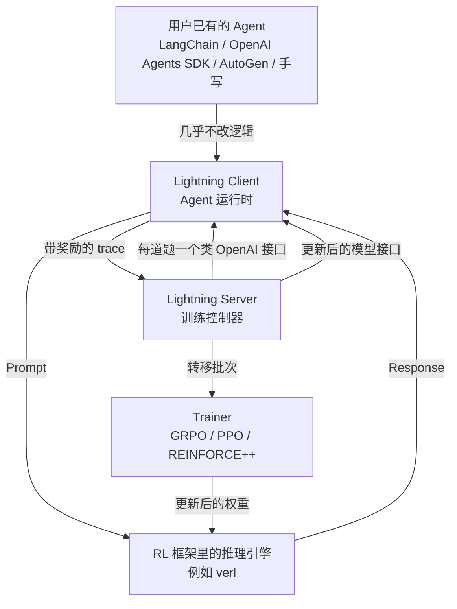
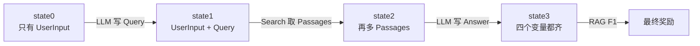

# Agent Lightning：训练器不必看懂 Agent，把每次调用拆成 MDP 转移就够了

<!-- release-date: 2025-08-05 -->

> 本文依据 Microsoft Research 发布的 **Agent Lightning: Train ANY AI Agents with Reinforcement Learning**，即 arXiv:2508.03680v1、2025-08-05 首次公开、共 20 页的预印本。八位作者全部署名 Microsoft Research，Xufang Luo、Yuge Zhang、Zhiyuan He 三位并列第一作者，其余作者为 Zilong Wang、Siyun Zhao、Dongsheng Li、Luna K. Qiu、Yuqing Yang（PDF p. 1）。按主要归属方，本站把它放在 Microsoft 目录下。下文括号中的 `PDF p. N` 均指这份 20 页原件的文件页码。
>
> **版本说明**：截至 2026-09-10 核验，arXiv 上只有 v1 一个版本（提交于 2025-08-05 17:50:13 UTC），与本地原件一致，无需替换。**2026-08 另有一篇后作** *Agent Lightning v1.0: Towards Harnessed Agentic RL*（arXiv:2608.17528）。那是重写后的系统论文，**不是本篇**。仓库 README 与产品页上的「约 3500 行」、SWE-bench Verified 从 41.8% 到 56.4% 等数字属于 v1.0，文中只作为外部补充出现，不得当作本 PDF 的结果。本站索引里那句「span 流入 LightningStore」也是后来产品里的说法——**这份 2025 原论文全文没有出现 LightningStore 或 span 这两个词。**
>
> 这是一篇**方法 + 系统**论文，没有模型架构和预训练 recipe 可讲。它讲的是**怎样让一个已经写好的 Agent，几乎不用改代码，就能接到强化学习训练器上。** 全文把三件事分开写：**论文明确写了什么**（带页码）、**本文如何解释它**（凡属推算、换算或从图上读数都会写明）、**外部资料补充**（会给出链接并标注）。

## 读之前需要的最少背景

这篇论文假设你已经知道「用强化学习（Reinforcement Learning，RL）训练大模型」大概长什么样。不熟的话，先记住下面这些。

**一轮 RL 后训练循环。** 拿一批任务，让当前模型自己去干活，这个「让模型自己跑一批」的动作叫 **rollout（轨迹生成）**。跑出来的每一次完整执行叫一条 **trajectory（轨迹）**。用一个 **reward（奖励）** 判断这次干得好不好，再用带奖励的轨迹更新模型参数。本篇实验侧用的算法是 **GRPO（Group Relative Policy Optimization，组相对策略优化）**：对同一道题采样一组回答，用组内的相对好坏当优势。出处见本站 [DeepSeekMath 解读](/reports/DeepSeek/DeepSeekMath)。

**Agent 在这里不是一个函数。** 它是一段会多次调用大模型、会调工具、会按运行时状态改流程的程序。一次执行里可能有好几次大模型调用，每次的提示词都不一样；中间还夹着检索、SQL 执行、计算器这类不是模型吐出来的内容。论文给 Agent 的工作定义很宽：凡是执行过程中包含一次或多次大模型调用的软件系统，都算（PDF p. 3）。

**转移（transition）与掩码（mask）。** 强化学习把「某一步看到了什么、做了什么、得到了什么」写成一条转移。训练一条长序列时，通常还要一张 **loss mask（损失掩码）**：标 1 的 token 参与算梯度，标 0 的只当上下文、不学。旧的多轮做法是把一整段 Agent 轨迹拼成一条超长序列，再用掩码把工具输出、别人说的话盖掉——论文认为这条路走不通，后面会专门讲为什么。

**两个容易混的「解耦」。** [AReaL](/reports/AntGroup/AReaL) 解耦的是**生成 GPU 与训练 GPU**：同一套模型，两组卡各干各的。[Polar](/reports/NVIDIA/Polar) 也把 harness 当黑盒，但观测点放在模型 API 这一层。本篇解耦的是 **Agent 运行时与 RL 训练器**：Agent 继续用自己的框架跑，训练器只通过一个统一的数据接口吃转移。即将写的 SkyRL-Agent 是多轮异步调度层，和这三件事都不是同一个切面。

## 一句话先说清

这篇论文要解决的矛盾可以这样说：

> **今天能干活的 Agent 是用 LangChain、OpenAI Agents SDK、AutoGen 写出来的软件，不是 RL 框架里的 `env.step()`。可是现有的 LLM RL 工具要么让你把 Agent 在训练器里重写一遍，要么把整段轨迹拼成一条超长序列再靠掩码假装它还是单轮。**

论文对这个矛盾的描述很直接（PDF p. 2）。现有 RL 方法主要是为静态、单次调用的任务准备的，比如偏好对齐或数学推理。Agent 比这个设定复杂，也比这个设定多样：复杂在一次执行里会有多次大模型调用、还会跟外部工具和环境交互；多样在不同应用要设计完全不同的 Agent。这两件事叠在一起，就很难把 RL 规模化地接到真实 Agent 上。

它的回答建立在一个建模选择上：**不要去解析 Agent 的整张执行图，只把每次大模型调用看成马尔可夫决策过程（Markov Decision Process，MDP）里的一步。** 状态是当前执行快照，动作是这一次调用吐出的整段文本，奖励挂在这次调用上（PDF p. 2、6–7）。这样一来，训练器看到的不再是「LangChain 怎么编排」，而是一串标准的 `(输入, 输出, 奖励)` 转移。

围绕这个选择，论文列了三条贡献（PDF p. 2–3）：

1. **执行与训练完全解耦。** 号称是第一个做到这一点的框架，几乎零改动接到任意实现方式的 Agent 上。
2. **统一数据接口 + 层次 RL。** 把任意 Agent 的轨迹拆成转移；LightningRL 先做信用分配，再交给现成的单轮 RL 算法。
3. **训练–Agent 分离架构（Training-Agent Disaggregation）。** Lightning Server 管训练并露出一个类 OpenAI 的模型接口，Lightning Client 当 Agent 运行时，顺手把可观测性框架接进数据采集。

实验给的不是一张分数表，而是三条奖励曲线：LangChain 上的 text-to-SQL、OpenAI Agents SDK 上的 RAG、AutoGen 上的数学工具调用。论文的结论是「持续、稳定的提升」（PDF p. 2、11）。正文没有写出任何测试集准确率的精确数字，曲线上的读数后面单独标。

## 全景：一次执行怎样变成一批训练转移

先把论文 Figure 1、Figure 4 和附录 Figure 8 的信息落到一张图上（PDF p. 2、9、20）。

这是根据 PDF p. 2 的 Figure 1、p. 9 的 Figure 4 与 p. 20 的 Figure 8 重画的**机制示意图**，箭头表示请求与数据的流向，不表示实测时长。Figure 8 把内层循环画得更细：每个任务批次里，Client 向 Server 拉资源和模型接口，再把任务交给 Agent；Agent 的每一次大模型调用都打到推理引擎上，整段跑完才把带奖励的 trace 交回去；Server 凑够一批转移再交给训练器做权重更新。

论文把这件事拆成两层，不要混：

| 层 | 它解决什么 | 对应章节 |
|---|---|---|
| **数据层** | 任意 Agent 的一次执行，如何变成训练器能吃的转移 | 3.1 统一数据接口，3.2 MDP，3.3 LightningRL |
| **系统层** | 训练器怎样既不管 Agent 逻辑，又把更新后的模型送到 Agent 手里 | 3.4 训练–Agent 分离，Lightning Server / Client |

数据层是这篇论文真正的设计判断。系统层是把这个判断做成一个能跑的服务。下面按这个顺序讲。

## 旧方案为什么不行：把整段轨迹拼起来再 mask

### 病症：训练器必须看懂 Agent 怎么跑

要把 RL 接到多轮 Agent 上，论文看到的主流做法是两步（PDF p. 13–14）：

1. 把一次执行里所有轮次**拼接**成一条超长序列；
2. 给这条序列设计一套**掩码**，让工具输出、环境反馈、非当前策略吐出的 token 不参与更新。

RAGEN、Trinity-RFT、rLLM、Search-R1 都被它归进这一类（PDF p. 13）。另一条路更硬：verl、OpenRLHF、TRL、ROLL、AReaL 这些大规模 RL 系统本身是为单轮准备的，它们对 Agent 的扩展通常要求开发者**在训练系统里把 Agent 重写一遍**（PDF p. 14）。论文给的原因是：训练侧必须知道执行逻辑，才能决定拼接顺序和掩码打在哪。

这两条路的共同前提是：**训练器要理解 Agent。**

### 诊断：拼接加掩码会同时在四个地方出错

论文在第 5.1 节把反对意见写得很完整（PDF p. 13–14），和第 3.3.2 节的三条优点（PDF p. 9）是同一件事的正反面。按因果链拆开是这样四条。

**第一，它只能覆盖简单、顺序的工作流。** 真实 Agent 的编排经常既不固定也不确定：大模型可能决定下一步调哪个工具、要不要改写查询、要不要直接作答（PDF p. 4）。多 Agent、动态分支、协议交换（例如 MCP）都不像「用户–助手–用户–助手」那样可以预先排好拼接顺序。论文的判断是：拼接法只适合窄的一类顺序 Agent，碰到更复杂的模式就会卡住（PDF p. 14）。

**第二，上下文会积成一条训练器吃不下的序列。** 多轮对话、工具输出、协议报文、多 Agent 通信都会往序列上堆。堆到超过模型输入上限，或者把训练服务的算力和显存打满（PDF p. 14）。这不是「再加一点长度」能糊弄过去的问题——Agent 越能干，轨迹越长，拼接越先爆。

**第三，掩码会破坏大模型自己的位置假设。** 论文点名的是旋转位置编码（Rotary Positional Embeddings，RoPE）：它默认 token 在位置上是连续的（PDF p. 9）。掩码把一段序列里的若干位置挖掉再拿去训练，等于让模型在「位置连续」的假设上算梯度，而真正要学的那些 token 中间其实插着被盖掉的工具输出。后果不止是实现脏：掩码还要同时打在输入、loss 和注意力上，往往和应用绑定、不能泛化，并且让训练过程和 Agent 执行逻辑紧耦合（PDF p. 14）。论文还说，掩码一复杂，校验、调试和 kernel 设计都会变难，效率也会掉（PDF p. 9）。

**第四，它把信用分配锁死在「整段序列共用一个奖励」上。** 拼接之后，你很难再对其中某一次调用单独给奖励、单独选择要不要更新。层次 RL、只优化多 Agent 系统里的某几个角色，都会变得别扭。论文后面把「按转移而不是按拼接后的整段」组织数据，说成是给更精细的信用分配留接口（PDF p. 14）。

用一个类比（本文构造，不是论文原文）：你要给一个团队做复盘，却先把所有人的发言、会议纪要、投影仪故障日志粘成一篇文章，再人工把不属于「主讲人」的段落涂黑。涂错一处，梯度就学错对象；文档越长，涂黑的成本越高。正确的做法是：每次发言单独成页，发言人、当时看到的材料、这一次的对错，各记各的。

### 改法：根本不拼接

Agent Lightning 的选择不是把掩码做对，而是**不再需要掩码**。一次 Agent 执行被拆成若干次大模型调用，每次调用自己带着当时的输入上下文、自己的输出、自己的奖励，作为一条独立的训练样本（PDF p. 8–9）。长轨迹变成一批短转移，可以用梯度累积这类常规手段更新，而不必先拼成一条超长序列（PDF p. 9）。

**代价与边界**要马上说清。不拼接意味着训练器看不到「这一步在整段对话里的绝对位置」——位置信息如果还重要，必须被写进这一次调用的输入里，例如由 Agent 自己做摘要、或用模板把历史装配进当前提示词。论文把这一点写成优点（灵活构造观测，PDF p. 9），但它同时也是一种责任转移：上下文怎么压缩、怎么选，现在是 Agent 运行时的事，不是训练器的事。

**可迁移的部分**：凡是「下游系统结构很复杂，上游优化器却只认识一种扁平序列」的场景，都值得先问一句——我是不是在用掩码模拟一种我其实没有的接口？如果能把一次调用、一次请求、一次工具往返做成自然的样本边界，掩码往往是在补一个不该存在的缝。

## 统一数据接口：一次执行里真正要记的只有调用

### 先把执行看成一张图，再承认这张图不必解析完

论文先借用编译器和 TensorFlow 的老说法：软件执行可以表示成有向无环图（DAG），每个节点是一次组件调用，边是依赖或控制流（PDF p. 4）。Agent 的组件只有两类（PDF p. 3–4）：

- **大模型**（更一般地，基础模型）：无状态的「输入提示词 → 输出回复」。一个 Agent 可以挂多个模型，各有各的接口地址和参数 $\theta_i$。
- **工具**：查库、执行代码、调 API。可有状态，也可无状态；近年来常走 MCP 这类协议。

编排（谁先谁后、何时分支）由用户按任务定制，而且常常是动态的（PDF p. 4）。按理说，要从杂乱的执行痕迹里把这张 DAG 完整解析出来，才能做学习。论文说他们发现这件事**对训练并不必要**（PDF p. 4）。做 RL 只需要认出当前状态，以及推动状态变化的那些关键调用。

脚注还专门区分了两个词（PDF p. 4）：**execution** 指一次 Agent 跑完收集到的全部数据；**trajectory / episode** 强调从中抽出、真正拿去训练的那部分。后面凡是「轨迹」，都是抽过的，不是原始日志。

### 状态是快照，调用是改快照的动作

状态被定义成 Agent 执行的一份快照：程序计数器、变量、调用栈、资源上下文，抽象成一组随时间演化的变量（PDF p. 5，式 1）。同一道题 $x$ 可以跑多次，第 $k$ 次、第 $t$ 步的状态写成

$$
\operatorname{state}_t(x,k)=\bigl\{\operatorname{variable}_i^{x,k,t}\bigr\}_{i=1}^{V}
$$

不是所有变量都值得记。循环计数器加一、中间字符串拼接，论文认为对优化不重要。真正要盯的是被组件读写、带着关键语义的那些量，它称作 **Semantic Variable（语义变量）**，出处是微软自己的服务系统 Parrot（PDF p. 5）。

语义变量的变化来自**组件调用**。第 $k$ 次执行由 $N$ 次调用组成（PDF p. 5，式 2–3）：

$$
\operatorname{call}_i^{x,k}=(\operatorname{meta}_i^{x,k},\ \operatorname{input}_i^{x,k},\ \operatorname{output}_i^{x,k})
$$

其中输出就是组件 $C_i$ 吃掉输入之后吐出的结果，$C_i$ 可以是某个大模型，也可以是某个工具。`meta` 里记下名字、类型、版本、接口地址，以及采样策略、温度这类运行时参数。输入和输出都是某个时刻的语义变量（PDF p. 5，式 4）。

一次调用不必看见状态里的全部东西。论文在 RAG 例子里写得很清楚：状态里有四个语义变量，但第一次写检索词时，大模型只能看见用户问题；搜索工具只吃生成出来的那条查询（PDF p. 5）。

### 奖励可以挂在中途，也可以只挂在最后

每次调用可以附一个标量奖励 $r_i$（PDF p. 5，式 5）。中途奖励例如工具调没调成功、子任务完没完成；最终奖励 $r_N$ 评估整件事有没有做成。论文承认现实里经常只有最终奖励，那只是这个通式的特例：前面的 $r_1,\ldots,r_{N-1}$ 缺席，学习完全靠最后那一个数（PDF p. 5）。

这一点后面会碰到两次：LightningRL 当前的实现就是把最终回报抄给每一步；系统层的 AIR 则想从监控信号里自动挖中途奖励。两条都还没在实验里被单独证明。

### 一个 RAG 例子把接口走完

Figure 2 用一个检索增强生成（Retrieval-Augmented Generation，RAG）Agent 把上面这些符号变成可以看见的东西（PDF p. 6）。组件是一个策略大模型加一个搜索工具。执行顺序是：

1. 用户给出问题 $x$（语义变量 `UserInput`）；
2. 大模型根据问题写出检索词 `Query`；
3. 搜索工具根据检索词取回 `Passages`；
4. 大模型根据问题和段落写出 `Answer`；
5. 用 RAG F1 之类的函数给最终答案打分。

左边是状态怎么被一步步填满：绿色格子是已经有值的语义变量，灰色格子是这一步还没赋值的。右边是收集到的调用序列，格式是 `(组件, 输入, 输出, 奖励)`。再经过一次抽取，**只有大模型的那两次调用**进入 RL 轨迹，搜索工具那一次被留在执行日志里、不拿去更新策略（PDF p. 6–7，式 6–7）。

这是根据 PDF p. 6 的 Figure 2 重画的**机制示意图**。训练器最终吃到的是两条转移：`(UserInput → Query)` 和 `(UserInput + Passages → Answer)`。搜索工具改了状态，但不进入策略梯度。

论文强调，统一数据接口连非大模型组件造成的状态变化也记下来了，所以它理论上还能做提示词优化、只更新多 Agent 系统里的某几个角色——尽管这篇论文的实验只做大模型微调（PDF p. 6）。

**这一步真正买到的东西**是：训练器不必知道检索词是怎么拼出来的、段落是哪个库返回的、提示词模板长什么样。它只看见当前这次调用的输入和输出。论文自己的原话是，这种抽取「省掉了对高度动态的 Agent 运行痕迹做繁琐且非平凡的解析，从而让对任意 AI Agent 做 RL 成为可能」（PDF p. 7）。

**可迁移的部分**：日志很全不等于训练样本很全。观测系统尽可以按 DAG 记，优化器只应订阅「会改变被优化对象行为」的那些边。Agent Lightning 把这个订阅面收成「策略大模型的每次调用」。

## 把 Agent 写成 MDP：一次调用就是一步动作

### 单模型时，它其实是 POMDP

论文先处理最简单的情况：要优化的只有一个大模型。它把这个模型当成策略，决策过程写成部分可观察马尔可夫决策过程（Partially Observable Markov Decision Process，POMDP）（PDF p. 6–7）。元组写的是 $\mathcal{M}=(\mathcal{S},\mathcal{O},\mathcal{A},\mathcal{P},\mathcal{R})$，紧接着的条目里转移动力学却写成了 $\mathcal{T}(s'|s,a)$（PDF p. 7）。**$\mathcal{P}$ 和 $\mathcal{T}$ 这个记号对不上，论文没有解释。** 五个要素按正文条目来读即可：

| 符号 | 含义 | 在 Agent 里对应什么 |
|---|---|---|
| $\mathcal{S}$ | 状态空间 | 执行快照 $\operatorname{state}_t$ |
| $\mathcal{O}$ | 观测空间 | 策略大模型这一次真正看见的输入 $\operatorname{input}_t$ |
| $\mathcal{A}$ | 动作空间 | **一次调用吐出的整段 token 序列**，不是单个 token |
| $\mathcal{T}$ | 转移 | 通常未知；工具、环境、其他 Agent 都可能改状态 |
| $\mathcal{R}$ | 奖励 | 标量 $r_t=\mathcal{R}(s_t,a_t)$ |

这里有一个和单轮 LLM RL 不同的地方，值得盯住：**动作的粒度是「一次调用」，不是「一个 token」。** 模型内部仍然逐 token 生成，但 MDP 把 $(y_{t,1},\ldots,y_{t,N_t})$ 整包看成一个 $a_t$（PDF p. 7）。走完 $a_t$ 之后，Agent 进入新的 $\operatorname{state}_{t+1}$。回报是逐步奖励之和

$$
R=\sum_{t=1}^{T} r_t
$$

策略的目标是最大化这个回报（PDF p. 7）。

从完整执行里抽出 RL 需要的东西，只保留策略模型的输入、输出和奖励（PDF p. 7，式 6–7）：

$$
\operatorname{execution}^{RL}(x,k)=\bigl\{(\operatorname{input}_t^{x,k},\ \operatorname{output}_t^{x,k},\ r_t^{x,k})\bigr\}_{t=1}^{T}
$$

$$
\operatorname{output}_t^{x,k}=\pi_\theta(\operatorname{input}_t^{x,k})
$$

大模型调用本身是无状态的。输入里可以塞角色指令、对话历史、检索段落、模板渲染后的结构化提示词——这些「输入是怎么来的」对训练器不可见（PDF p. 7）。这就是解耦在算法侧的落点。

### 单模型多角色，和多模型，不是一回事

同一套公式可以直接用在「一个模型、多个角色」上。RAG 例子里，第一次调用让模型专心写检索词，第二次让它专心根据段落作答，于是一个模型在一次执行里扮演了两个 Agent（PDF p. 7）。要只优化其中某几个角色，做法是：组转移的时候把其他角色的转移拿掉。论文说这比在拼接序列上改掩码直观得多（PDF p. 7）。后面 text-to-SQL 实验真的做了这件事：三个角色只训两个。

多个**不同参数**的大模型要一起训，论文只给了方向，没有实验（PDF p. 7）。朴素做法是每个模型单独当一个 MDP、分开优化，但会忽略策略之间的依赖。更原则的做法是多智能体强化学习（Multi-Agent Reinforcement Learning，MARL）或博弈论。这两句话停在相关工作式的展望上，本篇没有实现。

## LightningRL：层次只做一件事，把回合回报派到每次调用上

### 单轮 RL 本来在优化什么

第 3.3.1 节先把单轮 LLM RL 写成一个被简化过的 token 级损失（PDF p. 8，式 8）。给定题目 $x$，模型一次生成整段回复 $\operatorname{output}=(y_1,\ldots,y_N)$，整段结束之后给一个标量奖励。损失是

$$
\mathcal{L}(\theta)=-\mathbb{E}_{x\sim\mathcal{X},\ \operatorname{output}\sim\pi_\theta(\cdot|x)}\Biggl[\sum_{j=1}^{N}\log\pi_\theta(y_j\mid x,y_{<j})\cdot A_j\Biggr]
$$

$A_j$ 是 token 级优势。脚注写明：重要性比、裁剪、KL 项在这个式子里被省略了，最终算法里会按需加回来（PDF p. 8）。不同算法的差别主要在 $A_j$ 怎么估：PPO 学一个 critic；GRPO 用同一道题一组回复的均值和标准差做归一化；REINFORCE++ 用整个训练批次的平均奖励当基线（PDF p. 8）。

单轮设定里，「一次调用」和「一个回合」是同一件事。Agent 设定里不是。

### 层次在哪一层

LightningRL 要填的缝是：MDP 把一次调用当成一步动作，现成的 LLM RL 却在一次调用内部按 token 优化（PDF p. 8）。它的做法是两步（PDF p. 8–9）：

1. **回合级。** 信用分配模块把整段 episode 的回报 $R$ 分到每一步动作上；
2. **动作级。** 现成的单轮算法再把这一步的奖励分到该次调用内部的每个 token 上。

当前实现把第一步做成了最简单的那种：**每一步动作的价值都等于最终回报 $R$，大家拿同一份**（PDF p. 9）。第二步原样交给 GRPO、PPO 或 REINFORCE++。以 GRPO 为例：同一道题 $x$ 跑多次，每次执行拆成若干动作，然后按题目分组、用式 8 算组内统计量（PDF p. 9）。

Figure 3 把三种数据组织画在一起（PDF p. 8）：

| | 单轮 GRPO | 以往的多轮 GRPO | LightningRL |
|---|---|---|---|
| 一条样本是什么 | 一次生成的整段回复 | 拼好、打过掩码的整段轨迹 | 一次调用对应的一条转移 |
| 组内比的是什么 | 同一道题的多段回复 | 同一道题的多条轨迹 | 同一道题拆出来的多条转移 |
| 非模型 token 怎么办 | 不存在 | 灰色虚线框，靠掩码盖掉 | 根本不进入样本 |

这张图是机制示意，不是实验对比。论文没有用同一任务把「拼接 + 掩码」和 LightningRL 跑成一张消融表。

### 它真正买到的三件事

论文自己归纳了三条（PDF p. 9）：

**第一，单轮算法可以原样用，尤其是不训练 value model 的那一类。** 这是工程上最值钱的一句。Agent 侧的复杂度被挡在转移接口之外，训练侧继续跑已经打磨过的 GRPO / PPO / REINFORCE++。

**第二，策略的观测可以按调用灵活构造。** 当前输入可以是大模型写的历史摘要、模板拼出来的结构化提示词、或标明「你现在是检查者」的角色指令。拼接加掩码做不到这种模块化的上下文（PDF p. 9）。

**第三，实现更稳、也更容易扩。** 不再破坏 RoPE 的位置连续性，不再为掩码写特殊 kernel，长轨迹自然变成一批短转移（PDF p. 9）。

### 信用分配目前几乎还是空的

第 3.3.2 节末尾有一段「更精细的信用分配」（PDF p. 9）。模块被设计成可以换成启发式或学习出来的模型；未来可以给每一步动作单独估一个高层 value。但论文马上说：实验表明，这种「每步都抄最终回报」的简单策略在多个场景和数据集上已经有效。

这句话要读成两个方向。正向：接口是留了的，后面可以换更好的分配器而不必改数据采集。负向：**本篇并没有证明层次 RL 比「整段共用一个奖励」更强**，因为它实现的就是整段共用一个奖励，只是发放的单位从「一条拼好的序列」换成了「若干条转移」。

这里有一个论文没讨论、但从图 3 的分组方式能推出来的问题（本文的推算，不是论文结论）。如果一条成功的三步轨迹会贡献三条同样高奖励的转移，一条失败的一步轨迹只贡献一条低奖励转移，那么按题目把转移放进同一个 GRPO 组时，**更长的轨迹在组里占的样本数更多。** 这和 DAPO 里「一个 token 的权重不该取决于它所在回答有多长」是同一类归一化问题。本篇没有写组内是按转移平均还是先按轨迹平均，也没有报告平均每条轨迹拆出多少步。

**可迁移的部分**：层次 RL 的名字容易让人期待两套策略。这里的层次其实是**奖励发放的层次**——先决定「这一次调用该不该被鼓励」，再决定「这次调用里哪些 token 该被鼓励」。把这两个问题分开，比一上来设计高层策略更容易落地。当前实现只做了分离，还没做分配。

## 系统：训练–Agent 分离，而不是生成–训练分离

### 为什么必须拆成 Server 和 Client

第 3.4 节把 LLM 的 RL 系统拆成 trainer 和 rollout 两块（PDF p. 10）。单轮数学题的 rollout 只是「给定提示词，生成回复」。Agent 的 rollout 则是完整执行：多次大模型生成，加上用传统语言写的工具和业务逻辑。

训练–Agent 分离架构（Training-Agent Disaggregation）要拆开的，正是这两类计算（PDF p. 10）：

- **重、但形态单一**：大模型生成，由 RL 框架管，对 Agent 露出一个类 OpenAI 的 API；
- **轻、但花样多**：应用逻辑和工具，不必和 GPU 资源放在一起，可以独立部署。

论文把这个互不干涉总结成两句口号（PDF p. 10）：训练框架对 Agent 无感（agent-agnostic），Agent 对训练器无感（trainer-agnostic）。训练侧举例点名的是 VeRL / verl（PDF p. 10、14），参考文献指向 HybridFlow，见本站 [HybridFlow 解读](/reports/ByteDance/HybridFlow)。

落到组件上就是两个东西（PDF p. 10，Figure 4）：

| 组件 | 职责 |
|---|---|
| **Lightning Server** | 和 RL 框架一起初始化；管任务编排、数据、与 Client 通信；按库存方式把任务分给就绪的 Client；为**每个任务**发一个唯一的类 OpenAI 接口 |
| **Lightning Client** | 把 Agent 包起来跑；采集 trace 和奖励；回报给 Server；充当 Agent 运行时 |

用户先把任务数据集传给 Server。Server 把数据切成批次，用事件驱动的方式在「生成」和「训练」两个阶段之间切换（PDF p. 10）。Client 拿到任务和对应的模型接口之后，在运行时里执行 Agent，把 trace 收回来。Server 处理完再交给训练框架更新参数。

附录 Figure 8 把这条回路画成了时序图（PDF p. 20）：外层是每个任务批次，内层是每次大模型调用。Agent 的 Prompt 直接打到 RL 框架的推理引擎，Response 原路返回；整段执行结束之后，带奖励的 trace 才经由 Client 回到 Server，再变成轨迹批次去更新权重。

**和 AReaL 的差别要在这里钉死。** AReaL 拆的是同一套模型的生成卡和训练卡，为的是不让最长的那条回复拖住整个集群。本篇拆的是「GPU 上的模型」和「CPU 上的 Agent 程序」。Server 仍然用事件在生成阶段和训练阶段之间切换，看起来是同步的库存分发，并不是 AReaL 那种生成侧不停、训练侧凑够就更新、必要时打断生成的异步。论文在未来工作里才提到，可以把 trainer、rollout（推理引擎）和 Agent 工作流再拆一层，以缓解 rollout 瓶颈（PDF p. 15）。也就是说，**本篇完成的是 Agent 与训练器的解耦，没有完成生成与训练的解耦。**

### 运行时：并行、无改动采集、容错、中途奖励

Lightning Client 被写成 Agent 的运行时管理器，干四件事：编排执行、抓数据、处理错误、和 Server 通信（PDF p. 10）。

**数据并行。** 现代 RL 需要大批次来喂满算力、压低 rollout 延迟。Client 做两级并行：节点内一个 Client 起多个 worker，每个 worker 跑一个 Agent 实例；节点间多个 Client 跑在不同机器上（PDF p. 10）。

**不改 Agent 代码的数据采集。** 两种埋点（PDF p. 10–11）。第一种基于 OpenTelemetry 和 AgentOps，自动给 Agent 打上执行痕迹、大模型调用和环境交互。第二种是嵌在类 OpenAI 接口里的基本 tracing，给那些不兼容 OpenTelemetry 的框架用。论文把第二种说成轻量、可扩展。

**容错。** RL 训练比推理更容易出错：探索会把 Agent 带进崩溃、网络中断、非法输出、工具调用挂死（PDF p. 11）。Client 要抓住 Agent 自己没处理好的失败，保证它们不把整次训练打停。失败任务可以重试或改派，并留下详细日志。

**Automatic Intermediate Rewarding（AIR，自动中途奖励）。** 稀疏、滞后的最终奖励不好学。人工标中途奖励又贵。AIR 的想法是把系统监控信号（例如工具调用的返回状态）转成中途奖励（PDF p. 2、11）。论文说开发者可以很容易地定制。**三个实验都没有报告启用了 AIR**，text-to-SQL 和数学题的奖励都是最终答案对不对，RAG 是格式分加 F1。所以 AIR 在本篇里是机制描述，不是实验结果。

**环境和奖励服务。** 轻量的环境和奖励函数可以和 Agent 实例放在同一个 worker 里；手机模拟器、昂贵的奖励计算则抽成共享服务，目前用简单的池化，未来可以做成 serverless（PDF p. 11）。

### 「几乎零改动」实际要改什么

论文在摘要、引言和贡献列表里反复写 almost ZERO code modifications（PDF p. 1–3）。附录 A 给了一个现成 Agent 的接入例子（PDF p. 19）。Agent 本身的目录还是 `agent.py`、`environments/game_server.py`、`data/train.jsonl`。新增的是一个 `train.py`：

- 自己起环境；
- 写一个 `agent_run(resource, task)`，里面用 `resource.model_api` 当模型地址去调原来的 `agent_function`，再按标准答案算奖励；
- 用 `Client` 连上 Server，上传数据，调用 `client.train(agent_run, nworkers=-1)`。

脚注说开源 API 可能还会改，以 GitHub 为准（PDF p. 19）。

所以「几乎零改动」的准确含义是：**不要在 verl 里面重写 Agent 循环。** 你仍然要写一层薄封装，把模型地址换成 Server 发来的接口，并把奖励交回去。Agent 的业务逻辑、工具、编排可以保持原样。这和后文 Polar 那种「harness 一行不改、只把模型 URL 指到代理」不是同一粒度——Polar 对本系统的定性是「降低了集成成本，没有消除它」，见 [Polar 解读](/reports/NVIDIA/Polar)（那是 Polar 的原话，不是本 PDF 的原话）。

**可迁移的部分**：给已有系统加训练能力时，先找那个「所有实现都必须经过」的窄接口。本篇找的是模型 API；观测数据走旁路（sidecar / OpenTelemetry），不要从业务代码里往外掏。封装层越薄，越能把「训练一个和线上一致的 Agent」这句话当真。

## 实验：三个框架、同一个 3B 模型、三条上升的奖励曲线

论文用三个任务证明框架能接到不同的 Agent 实现上。基座全部是 Llama-3.2-3B-Instruct（PDF p. 12–13）。设置总结在 Table 1（PDF p. 11）：

| 任务 | 框架 | 数据集 | 工具 | Agent 数 | 实际训练的 Agent 数 |
|---|---|---|---|---:|---:|
| Text-to-SQL | LangChain | Spider | SQL 执行器 | 3 | 2 |
| 开放域问答 | OpenAI Agents SDK | MuSiQue | 维基检索 | 1 | 1 |
| 数学问答 | AutoGen | Calc-X | 计算器 | 1 | 1 |

**全文没有超参表。** 学习率、组大小 $G$、批次、温度、GPU 数量、墙钟时间、随机种子数，一个都没写。也没有把 LightningRL 和「拼接 + 掩码」放在同一张表里比。正文对三条曲线的共同评价是「稳定、持续的提升」（PDF p. 11–13）。下面的数字凡是从坐标轴读出的，都会标明。

### Text-to-SQL：三个角色只训两个

任务：给自然语言问题和数据库，生成 SQL、执行、再根据结果回答问题。数据是 Spider：一万多道题、200 个库、138 个领域，测试时库是没见过的（PDF p. 11–12）。

工作流是一个多 Agent 系统（PDF p. 12）：

1. **SQL writer** 写查询，交给执行器；执行器成功就返回数据，失败就返回报错；
2. **checking agent** 判断这条 SQL 和取回的信息够不够、对不对，决定是改写还是直接回答；
3. **re-writing agent** 需要改写时根据检查者的反馈改 SQL；不需要改写时，它还负责根据检索结果回答问题。

三个角色是**同一个 LLM、三套提示词**。训练时只更新 SQL writing 和 re-writing，检查者不动，而且前两个是同时优化的（PDF p. 12）。这是「选择性优化」在实验里唯一的一次落地。

奖励是**最终答案对不对**，不是 SQL 是否完全匹配；测试集也按答案准确率评（PDF p. 12）。也就是说，一条能查出正确事实、但写法不标准的 SQL，仍然可能拿正奖励。论文没有讨论这个选择会不会让模型学到「凑答案」而不是「写对 SQL」。

Figure 5（PDF p. 12）是训练奖励和测试奖励两条曲线。本文按图读出的近似值：

- 训练曲线横轴大约到 400 步，从约 0.1 抖着爬到 0.6–0.7；
- 测试曲线横轴大约到 384 步，从约 0.35 爬到 0.55 一带，中段约 280 步处有一次接近 0.60 的尖峰，随后回到约 0.55。

论文正文没有给这些数。训练曲线噪声很大，测试曲线相对平滑，中段有一次回落。没有误差棒，没有对照曲线。

### RAG：整份维基上的多跳问答

任务：先写检索词，再根据取回的文档决定是改写查询还是作答。数据是 MuSiQue，一个强调组合推理的多跳问答基准；检索库是**整份维基百科，约 2100 万篇文档**，检索器用 BGE 向量加余弦相似度（PDF p. 12）。论文自己也说，多跳问题加大检索源，对 Agent 很有挑战。

实现用 OpenAI Agents SDK，工作流比 SQL 那条简单，而且**不用多 Agent**：一条指令包下所有要做的事（PDF p. 12）。查询是自由文本，不是 SQL，检索和推理都更开放。

训练奖励是格式分和正确性分的加权和（PDF p. 13）：

$$
R=0.9\times R_{\text{correctness}}+0.1\times R_{\text{format}}
$$

格式分要求模型用 `<think>`、`<query>`、`<answer>` 这类标签把内容包起来，包对了得 1。正确性分是预测答案和标准答案之间的词级 F1。

Figure 6（PDF p. 13）本文按图读出的近似值：

- 训练曲线横轴大约到 192 步，从约 0.12 爬到 0.35–0.40，抖动同样剧烈；
- 测试曲线横轴大约到 200 步，起点接近 0.02，前 40 步跳到约 0.19，之后在 0.20–0.22 附近平台。

起点接近 0，说明 3B 模型在「整份维基 + 多跳」这个设定上几乎做不成。后半段测试奖励不再涨，论文仍然称之为稳定提升。有没有过拟合、检索质量有没有一起变好，正文都没有分析。

### 数学工具调用：让模型自己决定何时按计算器

任务：自然语言数学题，Agent 要决定何时调用计算器算中间值，再给出最终答案。数据是 Calc-X，由 GSM8K、Ape210K 这类数学集改造而来，强调把外部工具嵌进推理流程（PDF p. 13）。实现用 AutoGen，单模型既要写工具调用、又要读工具输出、还要形成最终答案。

奖励同样是最终答案对不对，测试集按答案准确率评（PDF p. 13）。

Figure 7（PDF p. 14）本文按图读出的近似值：

- 训练曲线横轴大约到 450 步，从约 0.15 爬到 0.65–0.75；
- 测试曲线横轴大约到 448 步，从约 0.45 爬到约 0.75，大约 192 步之后进入平台，一直维持在 0.75–0.78。

这是三条测试曲线里最像「收敛」的一条。论文的评语是：在需要精确外部调用和推理同时成立的工具增强设定里，它有效（PDF p. 13）。

### 这三条曲线证明了什么，没证明什么

**被曲线支持的：**

- 同一个 3B 指令模型和同一套框架，可以接到三种不同的 Agent 实现上，并且奖励在训练过程中上升；
- 多 Agent 系统里可以只挑一部分角色更新；
- 工具调用（SQL 执行器、维基检索、计算器）可以留在 Agent 侧，不必搬进训练器。

**不被支持的：**

- **没有基线对比。** 看不到拼接加掩码、看不到只做 SFT、看不到不训练检查者之外再训检查者会怎样。
- **没有跨模型、跨规模。** 全部是 Llama-3.2-3B-Instruct。
- **没有真实软件工程或长程任务。** 没有仓库级编码、没有电脑使用、没有手机模拟器——尽管系统节把手机模拟器写成了环境和奖励服务的动机（PDF p. 11）。
- **AIR、更精细的信用分配、MARL，全部没有进入这三张图。**
- **「持续稳定」是作者对曲线形状的定性描述。** SQL 的测试曲线有尖峰和回落，RAG 的测试曲线后半段基本走平。

## 相关工作里它和谁划清界限

第 5.1 节分了四类（PDF p. 13–15）。对阅读最有用的是前两类，后面两类用来说明「本篇不是又一个任务论文」。

**多轮 LLM RL。** RAGEN、Trinity-RFT、rLLM、Search-R1 走拼接加掩码。Agent Lightning 用 MDP + 统一接口 + 信用分配模块改成按转移组织，并再次列出前面已经讲过的四条好处（PDF p. 14）。

**大规模 LLM RL 系统。** verl、OpenRLHF、TRL、ROLL、AReaL 被写成主要面向单轮；它们对 Agent 的扩展（包括 SkyRL-v0 和 verl 的 agent loop 文档）通常要求在训练系统内部重建 Agent（PDF p. 14）。迁移成本高，还要求开发者熟悉 Ray 这类分布式框架；Agent 依赖的 MCP 服务、外部工具和 API 一旦塞进训练框架，维护会更重（PDF p. 14–15）。本篇的差异被概括成：完全解耦，训练引擎里不用写数据采集逻辑，Agent 侧几乎不用改代码，并且在建模上理论上能接多种 RL 训练框架（PDF p. 15）。

**算法向的多轮 RL。** ArCHer、WebShop 这类工作多用小于 1B 的策略模型或参数高效微调，论文认为难以复用到大模型上（PDF p. 15）。

**应用向的 RL。** Search-R1、R1-Searcher、DeepSWE、ReTool、SimpleTIR 绑定检索或编码等具体工作流，目标和本篇的「任意 Agent」不是同一件事（PDF p. 15）。

第 5.2 节的未来工作有四条（PDF p. 15），可以帮助判断本篇停在哪里：更多优化方法（提示词优化、Component of Interest）；更好的 RL 算法（长程信用分配、探索、off-policy）；把 trainer / 推理引擎 / Agent 再拆一层；以及更高效的服务（点名 Parrot 和 Minference）。**这些都还没有做。**

## 它怎么支撑 Agent 的后训练，以及和邻近系统怎么分工

这一节需要特别克制，因为论文对此的着墨就是「把任意 Agent 接到 RL 上」，没有说自己被用在哪一个已发布的基座模型上。

**论文明确写了的：**

- 训练对象是 Agent 里的策略大模型，实验用的是现成的 Llama-3.2-3B-Instruct，不是从基座从头训（PDF p. 12–13）；
- 训练框架举例是 verl（PDF p. 10）；
- 优化算法兼容现成的单轮方法，实验曲线看起来像在跑带组内归一化的那一类（PDF p. 8–9），但正文没有点名三条曲线用的到底是 GRPO、PPO 还是 REINFORCE++；
- 数据来自 Agent 真实执行，而不是事先写好的逐步标注（PDF p. 1）。

**本篇没有写、需要放到外部补充里的：** 后来的 v1.0 报告说，最初这套「经大模型接口把任意 Agent 接到 RL」的做法，被 verl Uni-Agent、AReaL 2.0、slime、Polar 等框架吸收。那是 2026-08 后作摘要里的陈述，不是本 PDF 的内容。

和本站已经写过、以及即将写的几篇对照，切面不同：

| 系统 | 它解耦的是什么 | 训练器看见什么 |
|---|---|---|
| 本篇 Agent Lightning（2025） | **Agent 运行时 ↔ RL 训练器** | 每次 LLM 调用的 `(输入, 输出, 奖励)` 转移 |
| [AReaL](/reports/AntGroup/AReaL) | **生成 GPU ↔ 训练 GPU** | 仍然是模型自己采的 token，只是不再等最长的那条 |
| [Polar](/reports/NVIDIA/Polar) | **harness ↔ 训练样本重建**；代理夹在 harness 和推理服务器之间 | 代理捕获的 token 级请求 / 响应，harness 当黑盒 |
| [SkyRL-Agent](/reports/Berkeley/SkyRL-Agent) | 多轮长程 Agent 的**异步流水线调度** | 调度层看到的多轮执行，不是本篇这个数据接口 |

Polar 后来说，Agent Lightning 用标准化追踪和大模型调用捕获降低了负担，但仍然要求 Agent 遵守规定的接口（见 Polar 解读对 PDF p. 2 的转述）。对照附录 A，这个评价和本篇自己展示的封装方式是吻合的：你要把模型地址换成它发的接口，并交回奖励。Polar 把观测点又往下挪了一层，放到「所有 harness 都必须去调模型」的 API 边界上。两条路的家族关系很近，完成度不同。

## 和 v1.0 的边界，必须单独切开

2026-08 的后作 *Agent Lightning v1.0: Towards Harnessed Agentic RL*（arXiv:2608.17528）是另一篇文章。下面这些数字和名词**不属于本 PDF**，只用来防止读错：

| 项目 | 2025 本篇 | 2026 v1.0（外部补充） |
|---|---|---|
| 架构口头禅 | Training-Agent Disaggregation；Lightning Server / Client | harnessed agentic RL；Trainer + API Gateway + Rollout Controller |
| 数据采集 | OpenTelemetry / AgentOps，或嵌在类 OpenAI 接口里的 tracing | 代理捕获请求–响应；产品文档里的 span、LightningStore |
| 代码体量 | 本篇没写行数 | 约 3500 行 |
| 实验模型 | Llama-3.2-3B-Instruct | 编码 Agent 实验用 Qwen3.5-9B |
| 主结果形态 | 三条奖励曲线，正文无精确测试分数 | SWE-bench Verified 41.8% → 56.4%（6K 训练样本） |
| 「零改动」 | almost ZERO，附录仍要写 `train.py` 封装 | 经 v1.0 代理，号称 ZERO changes |

LightningStore 和 span 进入公开仓库，是更晚的产品改动：GitHub changelog 把 Lightning Store、以 span 形式向 store 发对象、LLM Proxy 写在 v0.2.0（2025-10-22）里。那已经不是本篇的系统图。本篇的数据路径是：Agent 执行 → Client 采集 trace → Server 整理成转移 → RL 框架更新。

官方仓库在 v1.0 之后把旧代码放到了 `v0.x` 分支。读本篇时不要对着今天 `main` 上的 3500 行实现去对页码。

## 关键词回看

- **Training-Agent Disaggregation（训练–Agent 分离）**：把重而单一的大模型生成留在 RL 框架里，把轻而多样的 Agent 逻辑留在 Client 侧，中间用类 OpenAI 接口和带奖励的 trace 相连。
- **统一数据接口**：一次执行记成调用序列 `(meta, input, output, reward)`，再抽出策略模型的转移。训练器不解析编排 DAG。
- **Semantic Variable（语义变量）**：状态里真正被组件读写、带关键语义的那些变量；循环计数器这类东西故意不进入优化。
- **动作 = 一次 LLM 调用**：POMDP 里的 $a_t$ 是整段回复，不是单个 token。token 级优化被交给底层的单轮 RL。
- **LightningRL**：先把回合回报派到每次调用，再在调用内部跑现成的 GRPO / PPO / REINFORCE++。当前实现是每一步都抄最终的 $R$。
- **信用分配模块**：层次里预留的那一层。现在几乎是恒等映射，接口上可以换成启发式或高层 value。
- **拼接 + 掩码**：把多轮轨迹粘成一条长序列，再用 mask 盖住非策略 token。论文认为它耦合执行逻辑、破坏 RoPE、撑爆长度、也妨碍选择更新哪些角色。
- **AIR（Automatic Intermediate Rewarding，自动中途奖励）**：从工具返回状态这类监控信号里挖中途奖励。本篇有机制、无实验。
- **almost ZERO code modifications**：不要在训练器里重写 Agent；仍要换模型地址、交奖励、写一层薄封装。
- **Lightning Server / Lightning Client**：本篇的两个系统组件。不是后来的 LightningStore。

## 最后的判断

这篇论文的价值不在又发明了一种优势估计。LightningRL 当前的实现，就是把最终奖励广播到每一次调用上，然后调用已经存在的单轮 RL。任何一项单独拿出来都不像新算法。

它真正提供的是三样东西。

**第一，一个样本边界。** 把「一次 LLM 调用」而不是「一次拼好的多轮序列」当成训练样本。这个边界让掩码、RoPE 连续性、超长上下文、多角色选择更新，同时从必须解决的问题变成可以不做的问题。

**第二，一个解耦切面。** 切在 Agent 运行时和 RL 训练器之间，而不是切在生成卡和训练卡之间，也还没有切到 Polar 后来那种「harness 下方的模型 API 代理」。2025 年能把切面选在这里，是因为它面对的主要矛盾是：Agent 已经用各种框架写好了，训练工具却只认识自己的环境接口。

**第三，一次诚实度一般的验证。** 三个框架、一个 3B 模型、三条上升的奖励曲线，足以说明「接得上、跑得动」。不足以说明比拼接加掩码更好，不足以说明能上真实的软件工程任务，也不足以支撑「任意」这个词里那种工业强度。

它的边界同样清楚：信用分配几乎还是空的，AIR 没有进入实验，多模型 MARL 只写了方向，超参和硬件成本缺席，正文甚至没有把测试集准确率写成数字。后作 v1.0 用编码 Agent 和 SWE-bench 去补的，正是这一层规模和可复现性——但那是另一篇文章。

如果只记一句话，可以记：

> **不要让训练器去理解 Agent 的工作流。让 Agent 继续当 Agent，训练器只吃每次模型调用的转移。拼接和掩码是在用一个扁平序列，假装你已经有了这个接口。**

## 资料与阅读边界

- 原始依据：本地 `papers/Microsoft/Agent-Lightning.pdf`，即 arXiv:2508.03680v1，2025-08-05 提交，20 页。
- arXiv 页面：<https://arxiv.org/abs/2508.03680>。提交历史只有 v1（2025-08-05 17:50:13 UTC），截至 2026-09-10 核验没有更新版本。
- 官方代码仓库：<https://github.com/microsoft/agent-lightning>。changelog 把首个发行版 v0.1.0 写成 2025-08-04；GitHub 的 `v0.1` tag 标注为 2025-08-01。本文 `release-date` 取 arXiv v1 的 2025-08-05，与封面侧栏日期一致。这些仓库日期不回写卡片。
- 项目页：<https://www.microsoft.com/en-us/research/project/agent-lightning/>。微软亚洲研究院介绍文：<https://www.microsoft.com/en-us/research/articles/agent-lightning/>（页面标注 2025-08-21）。项目页里的 sidecar、把 trace 转成 $(s_t,a_t,r_t,s_{t+1})$ 等表述，比 PDF 更偏产品，**不能替代正文**。
- 训练框架：论文写 VeRL / verl，参考文献指向 HybridFlow（arXiv:2409.19256），见 [HybridFlow](/reports/ByteDance/HybridFlow)。
- GRPO 的基础机制见 [DeepSeekMath](/reports/DeepSeek/DeepSeekMath)；结果奖励把基座训成推理模型见 [DeepSeek-R1](/reports/DeepSeek/DeepSeek-R1)。本篇只把它们当作可插上的单轮算法，没有重推公式。

**外部补充，不得与本 PDF 混用：**

- 后作 *Agent Lightning v1.0: Towards Harnessed Agentic RL*，arXiv:2608.17528，2026-08-18 提交。约 3500 行、SWE-bench Verified 41.8% → 56.4%、harnessed agentic RL、以及「原做法被 verl Uni-Agent / AReaL 2.0 / slime / Polar 吸收」这些陈述，都只出现在后作里。
- GitHub changelog 的 v0.2.0（2025-10-22）才写入 Lightning Store、span、LLM Proxy。本站索引行里的「span 流入 LightningStore」对应的是这条后续产品线，不是 2025-08 这篇论文。
- 官方仓库当前 `main` 已切到 v1.0，旧实现见 `v0.x` 分支。对页码、组件名、API 时以本 PDF 和附录 A 为准，不要用今天的 README 反推 2025 年的架构。
- [Polar](/reports/NVIDIA/Polar) 对本系统「仍要求遵守规定接口」的定性，依据的是 Polar 自己的 PDF，不是本篇。
- 曲线读数（Spider 测试约 0.35 → 0.55、MuSiQue 测试约 0.02 → 0.22、Calc-X 测试约 0.45 → 0.76）是本文放大原图后的近似值，论文正文没有列出它们。

**本篇读不出、因此没有写的：**

- 三条实验曲线各自用的具体算法（GRPO / PPO / REINFORCE++）和全部超参；
- AIR 有没有在任一实验中打开；
- 最终配置里信用分配是否仍是「每步都等于 $R$」以外的任何变体；
- 训练用了多少 GPU、跑了多久、每条轨迹平均拆成多少次调用；
- LightningStore、span、v1.0 代理，这些名字在本 PDF 里不存在。
