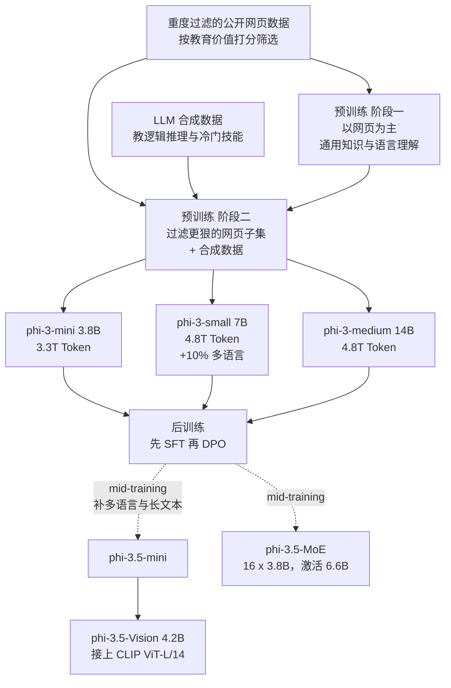
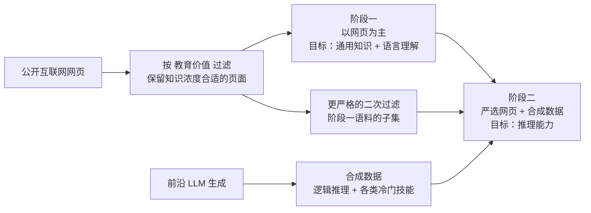
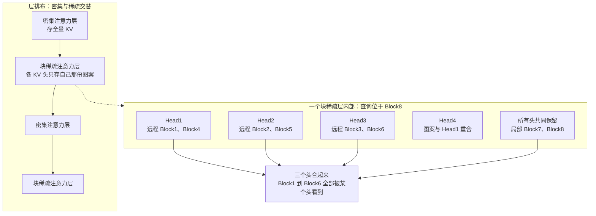
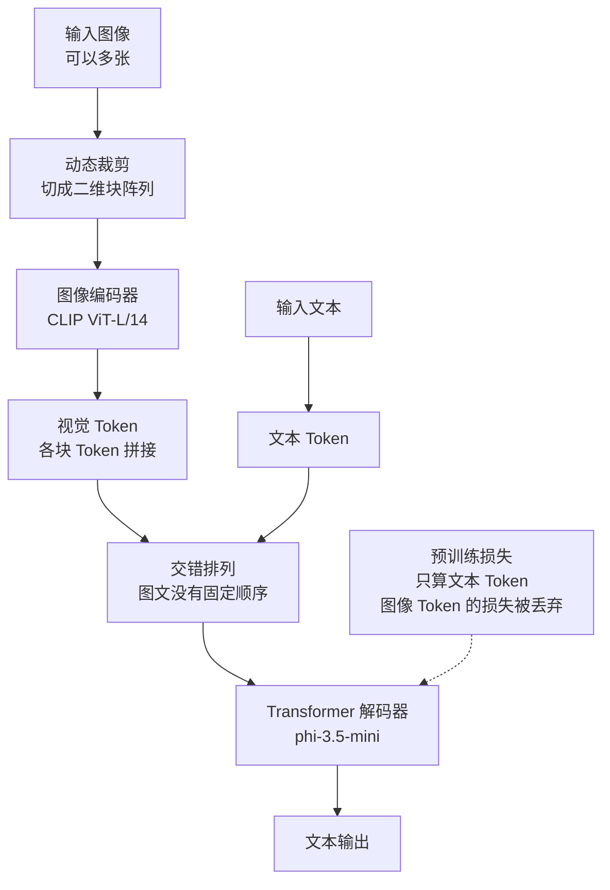

# Phi-3：把「小模型能有多强」的答案，从参数量挪到数据质量

<!-- release-date: 2024-04-23 -->

> **依据版本**：本地 `papers/Microsoft/Phi-3.pdf` 是 **arXiv:2404.14219v4**，PDF 页边栏印着 `arXiv:2404.14219v4 [cs.CL] 30 Aug 2024`，共 24 页。经 arXiv API 与摘要页核对，v4（2024-08-30 提交）就是官方最新版，本地件无需替换。
>
> **版本很关键**，因为这篇报告改过四次，每一版覆盖的成员都不一样（以下为逐版核对 arXiv 摘要页所得）：
>
> | 版本 | 提交日 | 页数 | 摘要覆盖的成员 |
> |---|---|---|---|
> | v1 | 2024-04-22 | 12 | phi-3-mini，外加 phi-3-small / phi-3-medium 的初步规模化结果 |
> | v2 | 2024-04-23 | 12 | 与 v1 摘要完全相同 |
> | v3 | 2024-05-23 | 19 | 加入 phi-3-vision（4.2B，基于 phi-3-mini） |
> | **v4** | **2024-08-30** | **24** | **phi-3-vision 被换成 phi-3.5-mini、phi-3.5-MoE、phi-3.5-Vision** |
>
> **还有一处更值得注意的改动**：v1 到 v3 的摘要都写着 "The innovation lies **entirely** in our dataset for training"（创新完全在于我们的训练数据集），而 **v4 把这句话整个删掉了**，换成了中性的 "Our training dataset is a scaled-up version of the one used for phi-2"。报告没有说明为什么删；**我们的读法是**：v4 里的 phi-3-small 用了块稀疏注意力、phi-3.5-MoE 换掉了整个前馈层，「创新完全在数据」这句话对这个成员阵容已经不成立了。无论删除的真实原因是什么，本文都以 v4 的措辞为准，不替报告维持那个更强的旧主张。
>
> 所以本文讲的是「六个模型的合订本」；如果你在别处读到的旧版数字对不上，多半是版本不同。
>
> 全文页码均指 PDF 自身页码。文中会明确区分「报告写了什么」「我们从中读出什么」「哪些是外部补充」。

## 读前先认识几个词

这份报告不难，但有几个词会反复出现，先用人话过一遍：

- **Token（词元）**：模型处理文本的最小单位。一个英文单词、一个汉字或一个标点，都可能是一个或多个 Token。「训练了 3.3T Token」的意思是模型一共读过 3.3 万亿个这样的小块。
- **SLM（Small Language Model，小语言模型）**：相对于动辄几百亿上千亿参数的大模型，参数量在几十亿量级、能塞进手机或单张消费级显卡的模型。
- **Scaling law（规模定律）**：一组经验规律，描述模型参数量、数据量、算力增加时，模型误差怎样可预测地下降。
- **KV Cache（Key-Value Cache，键值缓存）**：生成文本时，把已经读过的内容的中间结果留在显存里，不必每生成一个新 Token 就把全部历史重算一遍。它随上下文长度增长，是长上下文的主要显存开销。
- **SFT（Supervised Fine-Tuning，监督微调）**：用「问题 + 标准答案」的成对数据继续训练，把一个只会续写的基座模型变成会听指令的助手。
- **DPO（Direct Preference Optimization，直接偏好优化）**：用「同一个问题的好回答 / 坏回答」成对数据训练，直接把模型推向被偏好的那一边，不需要单独训练一个奖励模型。
- **RAI（Responsible AI，负责任的 AI）**：微软内部对安全、公平、不造谣等一整套要求的统称。报告里的安全评测都挂在这个词下面。

## 一句话先说清

Phi-3 的主张只有一句：**同样的参数预算下，换掉训练数据比换掉架构更有效。**

具体地说，phi-3-mini 只有 38 亿参数、读了 3.3T Token，MMLU 拿到 68.8，MT-bench 拿到 8.38（PDF p. 1、p. 6）。作为对照，Mixtral 8x7B 总参数 45B（PDF p. 3），MMLU 70.5、平均分 66.8（PDF p. 6）。也就是说，一个能装进手机的模型，在这套评测里逼近了一个比它大十倍的模型。

而它为此做的架构改动几乎为零：phi-3-mini 刻意做成和 Llama-2 一样的块结构、一样的分词器（PDF p. 2）。作者的原话是他们「遵循 Textbooks Are All You Need 开启的这条路线」，靠高质量数据「偏离标准规模定律」（PDF p. 3）。

**但这句主张只对 phi-3-mini 成立，对整个家族不成立。** 同一份报告里的 phi-3-small 换了分词器、换了激活函数、加了块稀疏注意力（PDF p. 2），phi-3.5-MoE 更是把前馈层整个换成了混合专家（PDF p. 2）。读这份报告时，请把「数据比架构重要」当成一条**在 3.8B 这个尺寸上被验证过的**主张，而不是全家族的通则——摘要里那句更强的「创新完全在于数据」，在 v4 里已经被作者自己拿掉了。

所以这份报告值得读的地方，不是某个新算子，而是一个方法论上的赌注：

> **规模定律默认数据源是固定的。一旦你能用前沿大模型去筛选和生成数据，这个默认前提就不再成立，小模型的上限也要重新算。**

报告第一段就把这层意思写明了：规模定律「假设一个固定的数据源」，而这个假设「已经被前沿 LLM 自身的存在显著打破」（PDF p. 1）。

## 全景：这份报告一共讲了六个模型

先把家族摆清楚，后面所有数字才有位置放。



**这张图是机制示意，不是实测流程图。** 依据是 PDF p. 3（两阶段预训练）、p. 5（后训练）、p. 6（mid-training 补多语言与长文本）、p. 10（Vision 组成）。两条虚线特意画成虚的：报告只说「我们开发了 phi-3.5-mini 与 phi-3.5-MoE，它们在 mid-training 阶段引入了更多多语言和长文本数据」（PDF p. 6），**没有说这是从 phi-3-mini 的哪个 checkpoint 续训、还是重新训了一遍**。这是一处真实的空白，不要脑补。

六个成员的规格如下，全部来自 PDF p. 1–3、p. 10：

| 模型 | 参数 | 训练 Token | 层 / 头 / 隐藏维 | 分词器与词表 | 默认上下文 | 特别之处 |
|---|---|---|---|---|---|---|
| phi-3-mini | 3.8B | 3.3T | 32 / 32 / 3072 | Llama-2 同款，32064 | 4K（LongRoPE 版 128K） | 刻意与 Llama-2 同构 |
| phi-3-small | 7B | 4.8T | 32 / 32 / 4096 | tiktoken，100352 | 8K | GEGLU、muP、GQA、块稀疏注意力 |
| phi-3-medium | 14B | 4.8T | 40 / 40 / 5120 | 同 mini | 4K | 架构与 mini 相同，只放大 |
| phi-3.5-mini | 3.8B | 报告未写 | 报告未写 | 同 mini | 128K | mid-training 补多语言与长文本 |
| phi-3.5-MoE | 16 x 3.8B，总 42B，激活 6.6B | 报告未写 | 报告未写 | 同 mini，32064 | 128K | top-2 路由，SparseMixer 训路由 |
| phi-3.5-Vision | 4.2B | 预训练 0.5T | 复用 phi-3.5-mini | 同 mini | 报告未写 | CLIP ViT-L/14 + 动态裁剪 |

表里「报告未写」那几格不是我偷懒，是原件确实没给。这一点后面还会专门谈。

## 它想推翻的默认规则：规模定律假设数据是固定的

### 旧问题：compute optimal 只回答了「算力怎么分」

过去几年谈「怎么练模型最划算」，主流答案是 **compute optimal（算力最优）**：给定固定的训练算力预算，参数量和数据量该按什么比例配。这条路线的代表工作把结论压成了一个简单的经验比例。

还有一条路线叫 **over-train（过训练）**：明知不是算力最优，也要给小模型多喂数据，因为部署时省下的推理成本比训练时多花的更值钱。

报告明确说自己两条都不走：不同于以往在算力最优或过训练区间下训练语言模型的工作，他们主要关注的是**给定规模下的数据质量**（PDF p. 3）。

问题在哪？这两条路线都把训练数据当成一个给定的、不可改变的池子——你只能决定读多少，不能决定读什么。而报告开头指出，这个前提已经过时：前沿 LLM 本身让我们能「用全新的方式与数据互动」（PDF p. 1）。

### 新设计：data optimal regime

报告把自己的做法叫做 **data optimal regime（数据最优区间）**，意思是：不再问「这个算力预算该配多少数据」，而是问「**这个参数预算下，哪些数据值得占位置**」。

它给的例子很直白：某天英超某场比赛的比分，对前沿大模型来说可能是有用的训练数据，但对 mini 这个尺寸「我们需要移除这类信息，为推理留出更多模型容量」（PDF p. 3）。

这句话背后是一个容量分配的直觉：3.8B 参数是一个很小的柜子。你可以拿它装事实，也可以拿它装推理模式，但装不下全部。既然装不下，就该主动挑。

作者自己也在脚注里限制了这个词的分量：和「算力最优」一样，「最优」是个**期望性的说法**，他们并不主张真的找到了某个规模下可证明最优的数据配比（PDF p. 3 脚注 3）。这个自我限制很诚实，我们读的时候也该照做。

### 图 3 证明了什么，又没证明什么

报告用 Figure 3（PDF p. 4）来支撑这条主张。它画的是 $\log(\text{MMLU 错误率})$ 对 $\log(\text{模型规模})$ 的关系，两条拟合直线：

- 一条穿过 phi-1.5、phi-2、phi-3-mini、phi-3-small 四个点；
- 一条穿过 Llama-2 的 7B、13B、34B、70B 四个点。

图注特别注明 Llama-2 这四个模型「是在**同一份固定数据**上训练的」（PDF p. 4）。phi 那条线明显更陡、位置更低。

如果把这类关系写成常见的幂律形式：

$$
\log(\text{error}) \approx a - b \log(N)
$$

其中 $N$ 是参数量，$b$ 是斜率。图 3 想说的就是：phi 这条线的 $b$ 更大，同样加参数，错误率掉得更快。

**但这张图有一个必须点破的读法边界。** Llama-2 那条线是干净的：四个尺寸共享数据配方，所以斜率只反映参数规模的作用。phi 那条线不是——phi-1.5、phi-2、phi-3-mini、phi-3-small 四代之间，**数据在变、数据量在变、架构也在变**（phi-3-small 换了分词器、换了激活函数、加了块稀疏注意力，见 PDF p. 2）。所以那条「phi 拟合线」把「模型变大」和「数据变好」两件事混在了同一个斜率里。

报告自己没有说这条线是纯粹的规模定律——它的图注措辞是「接近数据最优区间的规模定律」，脚注也做了限制。但读者很容易把它当成「phi 家族有更好的 scaling 指数」来引用。**这是一张示意性证据，不是受控实验。** 报告全文没有任何消融实验，能把「数据变化」的贡献和「架构变化」的贡献分开。

## 数据配方：两阶段预训练

报告对数据只给了轮廓，但轮廓本身有信息量。



**机制示意图，依据 PDF p. 3 的 Training Methodology 段落。** 报告原文写的是：预训练分成两个「不相交且顺序执行」的阶段；阶段一主要是网页，教通用知识和语言理解；阶段二把「过滤得更狠的网页数据（阶段一所用语料的一个子集）」和一些合成数据混起来，教模型逻辑推理和各种冷门技能（PDF p. 3）。

值得注意的三点：

1. **两阶段是顺序而非混合。** 报告用了 disjoint and sequential 两个词。这意味着推理向的数据集中在训练后期，而不是从头均匀铺开。
2. **阶段二的网页是阶段一的子集。** 同一批数据被读了两次，第二次是精选后的重复。这与「数据不够就提高利用率」的思路一致。
3. **过滤标准是「教育价值」。** 报告的说法是按 educational level 过滤（PDF p. 3）。这是 phi 系列一贯的做法，但**报告没有公开这个分类器怎么训练、阈值怎么定、过滤后剩下多少比例**。

phi-3-medium 的数据描述更具体一点：它用「和 phi-3-mini 相同的数据，训练轮数略多」，一共 4.8T Token（PDF p. 3）。3.3T 到 4.8T，大约多了 45% 的 Token 量，但底层数据池基本没变——这是重复读，不是新增来源。phi-3-small 则「额外用了 10% 的多语言数据」（PDF p. 2）。

## 架构：三个尺寸各自的取舍

### phi-3-mini：故意长得像 Llama-2

phi-3-mini 是标准的 Transformer 解码器，默认上下文 4K，隐藏维 3072、32 个注意力头、32 层，用 bfloat16 训练（PDF p. 2）。

真正值得说的是它的一个**产品决定而非技术决定**：报告直言「为了最好地服务开源社区，phi-3-mini 建立在与 Llama-2 相似的块结构上，并使用同一个分词器」，因此「所有为 Llama-2 系列开发的包都可以直接适配 phi-3-mini」（PDF p. 2）。

这是一条很实用的迁移经验：**当你的创新在数据侧时，架构上的每一处「小改进」都是在给使用者制造迁移成本，而这些成本换不来对应的收益。** 主动放弃架构自由度，换取整个生态的即插即用，这笔账在小模型上尤其划算——小模型的核心卖点就是好部署。

词表大小是 32064，脚注解释了为什么不是 Llama-2 原生的 32000：他们去掉了 BoS token，又为聊天模板加了一些额外 Token（PDF p. 2 脚注 1）。聊天模板本身也写在正文里（PDF p. 2）：

```text
<|user|>/n Question <|end|>/n <|assistant|>
```

（原文这里印的是 `/n` 而不是 `\n`，应为排版笔误。实际使用请以官方模型卡为准。）

长上下文版本叫 phi-3-mini-128K，用 LongRoPE 把 4K 扩到 128K（PDF p. 2）。报告没有解释 LongRoPE 的机制，只给了引用。

### phi-3-medium：同一套配方放大到 14B，然后撞到了墙

phi-3-medium 是这份报告里最诚实的一段。它用**和 mini 完全相同的分词器与架构**，只是放大到 40 层、40 头、嵌入维 5120，数据也相同（PDF p. 3）。

结果呢？报告自己写：「我们观察到，一些基准从 7B 到 14B 的提升，比从 3.8B 到 7B 小得多，这或许说明我们的数据配比要成为 14B 模型的数据最优还需要更多工作」（PDF p. 3）。

**这句话比任何一个高分都重要。** 它说明 data optimal regime 不是一个通用配方，而是一个**跟参数预算绑定的配方**。柜子变大了，你原来精心挑选的东西就不再是最优装法——为 3.8B 剪掉的那些「英超比分」，对 14B 可能本来是有价值的。

可迁移的启发：如果你用「为小模型精选数据」的思路做出了一个好用的小模型，**不要默认同一份数据放大后还是最优的**。数据配方需要随规模重新调，就像学习率需要随规模重新调一样。

### phi-3-small：全家唯一一处真正的架构创新

phi-3-small 是六个成员里唯一在架构上认真动手的。它一次改了四处（PDF p. 2）：

1. **换分词器**：改用 tiktoken，词表 100352，理由是多语言分词更好。默认上下文也从 4K 变成 8192。
2. **换激活函数**：改用 GEGLU。
3. **用 muP 调超参**：Maximal Update Parametrization（最大更新参数化），先在一个小的代理模型上调超参，再把超参迁移到目标 7B 模型上。报告说这帮助「确保更好的性能和训练稳定性」。
4. **块稀疏注意力（blocksparse attention）**：外加 GQA（Grouped-Query Attention，分组查询注意力），4 个 query 头共享 1 个 key 头。

第 3 点值得多说一句。muP 解决的旧问题是：超参在小模型上调好了，换到大模型上往往失效，只能在大模型上重调，而每次重调都很贵。muP 的做法是重新参数化初始化与学习率的规模依赖，使得**最优超参在不同宽度下大致不变**，于是可以在小模型上调、迁移到大模型上用。对小团队来说这是一条实打实可复用的技巧。

### 块稀疏注意力：机制、收益，和报告没说清的部分

**旧问题**：注意力要求每个 Token 都回看全部历史。上下文越长，计算量和 KV Cache 越大。稀疏注意力是常见解法，但朴素的稀疏会漏信息——被跳过的位置就是真的没人看了。

**新设计**：phi-3-small 让**每个注意力头用不同的稀疏图案**。报告的表述是：「对每个注意力头，块稀疏注意力在 KV cache 上强制不同的稀疏模式。这确保了在给定的稀疏度选择下，所有 Token 都在某些头上被注意到」（PDF p. 2）。

Figure 1（PDF p. 3）给了一个玩具例子：2 个局部块、纵向步长 3、4 个头、8 个块，查询位于第 8 块。我逐格核对了原图，实际图案是：

| 头 | 保留的块 |
|---|---|
| Head1 | Block1、Block4（远程）+ Block7、Block8（局部） |
| Head2 | Block2、Block5 + Block7、Block8 |
| Head3 | Block3、Block6 + Block7、Block8 |
| Head4 | Block1、Block4 + Block7、Block8（与 Head1 相同） |

读法是这样的：每个头都保留**最近的 2 个块**（图中蓝色），因为眼前的上下文谁都不能丢；再按步长 3 挑一串**远程块**（图中橙色），第 $h$ 个头挑的是编号除以 3 余 $h$ 的那些块。三个头就把 Block1 到 Block6 全覆盖了，第四个头绕回去和第一个头重合。灰色是被跳过的块。

**这里是一处需要自己算的地方——报告没给任何公式，也没给任何 KV Cache 缩减的具体数字。** 按图 1 的设定推算：查询位于第 $B$ 块时，一个头需要保留的块数大约是

$$
n_{\text{local}} + \left\lceil \frac{B - n_{\text{local}}}{s} \right\rceil
$$

其中 $n_{\text{local}}$ 是局部块数，$s$ 是纵向步长。$B$ 很大时，保留比例趋近 $1/s$。在图 1 的玩具设定里（$B=8$、$n_{\text{local}}=2$、$s=3$），每个头保留 4 块、跳过 4 块，正好一半。上式与表格都是**我按图 1 推的，不是报告的结论**。

把图案和层排布放在一起看，整件事是这样的：



**机制示意图，依据 PDF p. 2 的架构描述与 p. 3 的 Figure 1。图中不含任何实测时间或吞吐数据。**

收益：显存里不必为每个 KV 头存满整条历史，只存它那份图案覆盖的块。加上 GQA 让 4 个 query 共享 1 个 key，两层节省叠在一起。

**代价与边界，有三层：**

第一，稀疏只用在一半的层上。报告写「我们交替使用密集注意力层和块稀疏注意力层，以在保持长上下文检索性能的同时优化 KV cache 节省」（PDF p. 2）。也就是说密集层仍然存全量 KV，整体节省要打个对折。这是一个很典型的工程折中：**全稀疏省得多但检索会掉，交替排布是买保险。**

第二，稀疏的收益必须靠算子实现才能兑现。报告说他们为训练写了基于 FlashAttention 的 Triton kernel，为推理写了 prefill 阶段的 kernel，并扩展了 vLLM 的 paged attention kernel 来做 decode（PDF p. 2）。附录 C 还专门致谢了 UC Berkeley 和清华的几位研究者在 vLLM kernel 上的帮助（PDF p. 24）。**这是全篇唯一一处 infra 内容**，而且只是一句话带过。

第三，**报告没说清 GQA 与稀疏图案怎么对齐**。要让 KV Cache 真的变小，稀疏图案必须定义在 KV 头这一级（同组的 4 个 query 头共享同一份被保留的块），否则组内不同头需要不同块，KV 还是得存全。报告只说「对每个注意力头」，没有交代这一层。这是一个实现者会立刻卡住的空白。

### phi-3.5-MoE：把 FFN 换成 16 个专家

**MoE（Mixture-of-Experts，混合专家）** 的思路是：把网络里最占参数的前馈层（FFN）复制成多份「专家」，每个 Token 只让路由器挑其中少数几个专家干活。这样总参数可以很大，但每个 Token 的实际计算量不变。

phi-3.5-MoE 的配置（PDF p. 2）：把 MoE 层作为前馈模块，在 16 个专家里做 **top-2 路由**，每个专家是一个独立的 GLU 网络；结果是「16 x 3.8B 的模型拥有 6.6B 激活参数和 42B 总参数」。分词器仍与 mini、medium 相同，词表 32064（PDF p. 3）。

这里两个数字容易让人算不明白，值得拆开（**以下算术是我的解释，不是报告原文**）：

- 为什么 $16 \times 3.8\text{B} = 60.8\text{B}$，但总参数只有 42B？因为**只有 FFN 被复制了 16 份**，注意力层、嵌入层、输出层是共享的。所以总量远小于「16 个完整 3.8B 模型」。
- 为什么激活了 2 个专家，激活参数是 6.6B 而不是 $2 \times 3.8 = 7.6\text{B}$？同理，共享部分只算一次，两个被选中的专家各贡献自己那份 FFN。

路由器的训练用了 **SparseMixer**（PDF p. 3）。路由这一步天然是离散的——选哪两个专家是个硬决策，梯度传不回去。SparseMixer 属于解决这个问题的一类方法（在离散选择与反向传播之间搭桥）。报告只给了引用和名字，**没有解释它怎么工作，也没有对比换成别的路由训练方式会差多少**。

## 长上下文与多语言：mid-training 挂上去的两件能力

### 做法

phi-3.5-mini 和 phi-3.5-MoE 是为了补两个短板而做的：多语言和长上下文。手段是在 **mid-training（中期训练）** 阶段加入更多多语言和长文本数据，并配合「long-rope 方法和一种混合上下文窗口（mixed context window）的做法」，把上下文上限从 4K 扩到 128K，「而不损害 4K 上下文任务的表现」（PDF p. 6）。

报告对这两项技术的描述就到此为止了：**mixed context window 具体怎么混、long-rope 的参数怎么设、mid-training 用了多少 Token，全部没写。**

### 多语言：确实补上了，但基线本来很低

Figure 4（PDF p. 7）画了 11 种语言上的 MMLU 5-shot 对比：Arabic、Chinese、Dutch、French、German、Italian、Russian、Spanish、Ukrainian、Vietnamese、English。三条柱子分别是 phi-3-mini、phi-3.5-mini、phi-3.5-MoE。

正文给的确切数字只有平均分：phi-3.5-mini 的多语言 MMLU 均分是 55.4，phi-3-mini 是 47.3，phi-3.5-MoE 是 69.9（PDF p. 7）。这三个数与 Table 3 的 Ml MMLU 行完全一致（PDF p. 9），交叉核对通过。

读图能看出的形状（**以下是读柱状图得到的定性判断，不是报告给的数字**）：提升最大的是阿拉伯语、俄语、乌克兰语、越南语、中文这几种——它们在 phi-3-mini 上本来只有三十几到四十几分，几乎是「不太会」的水平。而法语、意大利语、西班牙语这些和英语同族、在英文语料里也大量出现的语言，phi-3-mini 本来就有五十多分，提升幅度小得多。英语则基本持平。

这个形状本身是有意义的：**mid-training 补数据，补的是模型原本几乎空白的地方，不是把已经会的再推高一截。**

### 长上下文：128K 是能力上限，不是可用区间

这是全篇我认为最有价值的一段自我披露。

**RepoQA**（跨语言的代码库检索问答，Table 1，PDF p. 7）上，phi-3.5-MoE 均分 85、phi-3.5-Mini 均分 77，都高过 Llama-3.1-8B-Instruct 的 71、Mixtral-8x7B 的 68 和 Mixtral-8x22B 的 67.8。这个结果不错。

**RULER**（按上下文长度分档的长文本检索评测，Table 2，PDF p. 8）就露底了：

| 模型 | 4k | 8k | 16k | 32k | 64k | 128k | 均值 |
|---|---|---|---|---|---|---|---|
| Llama-3.1-8B-Instruct | 95.5 | 93.8 | 91.6 | 87.4 | 84.7 | **77.0** | 88.3 |
| Phi-3.5-MoE | 94.8 | 93.0 | 93.2 | 91.6 | 85.7 | **64.2** | 87.1 |
| Phi-3.5-Mini | 94.3 | 91.1 | 90.7 | 87.1 | 78.0 | **63.6** | 84.1 |
| Mixtral-8x22B-Instruct-v0.1 | 95.6 | 94.9 | 93.4 | 90.9 | 84.7 | **31.7** | 81.9 |
| Mixtral-8x7B-Instruct-v0.1 | 94.9 | 92.1 | 92.5 | 85.9 | 72.4 | **44.5** | 80.4 |

（数据来自 PDF p. 8 的 Table 2。）

从 64k 到 128k，phi-3.5-MoE 掉了 21.5 分，phi-3.5-Mini 掉了 14.4 分。报告没有回避：「我们在 RULER 任务上测试 128K 上下文窗口时观察到显著的性能下降。我们怀疑这是因为 mid-training 中缺少高质量的长上下文数据，这个问题我们计划在下一版模型发布时解决」（PDF p. 7）。

两点判断：

1. **这是一句作者的怀疑（we suspect），不是被消融实验证明的结论。** 报告没有做「加长上下文数据 / 不加」的对照。
2. 这段自曝其实在重申全文的主线论点，只是换了个方向：**Phi-3 靠数据质量赢，也因为数据质量输。** 长上下文能力掉下来，作者的第一反应不是怪 LongRoPE、不是怪架构，而是怪数据。这在叙事上是自洽的。

顺带一个读表的坑：Mixtral-8x22B 在表里标注的上下文是 64k，却仍被填进了 128k 那一列并拿到 31.7 分。**这是在模型窗口之外的测试，不是同条件比较**，读的时候别把它当成「MoE 结构在长上下文上更差」的证据。

## 后训练：只有 SFT 和 DPO 两步

报告用了整整一段（PDF p. 5）讲后训练，内容如下：

- **SFT**：使用「高度精选的高质量数据，覆盖数学、代码、推理、对话、模型身份认知和安全等多个领域」。数据配比「从纯英文样本开始」。
- **DPO**：数据覆盖聊天格式、推理和 RAI。用法很明确：「我们用 DPO 把模型从不希望的行为上引开，做法是把那些输出当作被拒绝的回答」。
- 目标不只是提分，还包括「把一个语言模型变成用户可以高效且安全地交互的 AI 助手」。

`model identity`（模型身份认知）这一项值得单独点一下——它指的是让模型知道自己是谁、由谁训练、能力边界在哪。把它和数学、代码并列写进 SFT 数据域，说明在他们眼里这是一项需要专门教的能力，而不是自然涌现的。

**这段有多少没写：** 没有 SFT 样本量、没有 DPO 样本量、没有轮次、没有学习率、没有任何超参、没有拒绝采样或数据合成流程的描述、没有 RLHF/PPO 这类在线方法（报告全文只提 SFT 与 DPO）。

> **外部补充（不是报告内容）**：官方 Hugging Face 模型卡 [microsoft/Phi-3.5-MoE-instruct](https://huggingface.co/microsoft/Phi-3.5-MoE-instruct) 在介绍段里写该模型经历了「supervised fine-tuning、proximal policy optimization 和 direct preference optimization」，比报告多出了 PPO 一步。这条信息只在模型卡上，报告里没有，两者口径不一致。

## 手机上的那 1.8 GB

报告花了一小段讲端侧部署（PDF p. 3）：phi-3-mini 可以量化到 4 bit，只占约 **1.8GB** 内存；他们把量化后的模型部署在搭载 A16 Bionic 芯片的 **iPhone 14** 上，**原生、完全离线**运行，达到**每秒 12 个以上 Token**。

Figure 2（PDF p. 4）给出了三张手机截图作为证据。我把图放大核对过：应用里的模型名是 `Phi-3-mini-4k-instruct-q4`，两次生成的实测数据分别标着 `11.80 ses, 14.75 t/s` 和 `10.66 ses, 12.47 t/s`。所以正文的「12 t/s 以上」是这两次实测中较低的那个数量级，说法是保守的。

简单算一笔账：3.8B 参数按 4 bit 存是 $3.8 \times 10^9 \times 0.5\ \text{Byte} \approx 1.9\ \text{GB}$，与报告的约 1.8GB 基本吻合。这也说明**能不能进手机，第一约束是权重体积，而权重体积由参数量和量化位宽两件事决定**——这正是「3.8B」这个数字被挑出来的原因。

报告**没有**给：量化方法（是哪种 4 bit 方案）、量化后的精度损失、内存峰值（1.8GB 是权重，KV Cache 与运行时开销另计）、长上下文下的速度、电池与发热数据。三张截图都是短回答场景。

## 评测：哪些结论站得住

### 评测协议本身写得比较克制

报告对评测方法交代了几件事（PDF p. 5）：

- 所有数字都用**同一条流水线**产出，以保证可比；
- 因为评测选择略有差异，「这些数字可能与其他已发表的数字不同」；
- 用 few-shot 提示，**温度设为 0**；
- 提示词与 shot 数来自微软内部的评测工具，且「我们没有为 phi-3 模型对流水线做任何优化」。

最后一句还带了一个很坦白的脚注：他们发现「在 Question 前面加 `##` 可以让 phi-3-mini 在很多基准上有明显提升，但我们没有做这样的修改」（PDF p. 5 脚注 4）。

**这是一条值得学的做法**：主动披露一个自己知道但没用的提分技巧，等于给读者标出了「这批数字里没有提示词调优的水分」。附录 A（PDF p. 22）还把一个 2-shot 提示的完整样例贴了出来，包括一道解方程题 $(-\tfrac{1}{3})(-4-3x)=\tfrac{1}{2}$，选项是 $-\tfrac{5}{6}$、$\tfrac{7}{6}$、$\tfrac{5}{3}$、$\tfrac{1}{6}$，标准答案 A。（我按题验算：$\tfrac{4}{3}+x=\tfrac{1}{2}$，得 $x=-\tfrac{5}{6}$，与标注一致。）

**边界在于：** 这条「同一条流水线」的承诺只写在第 3 节，覆盖的是 PDF p. 6 那张大表。p. 9 的 Table 3 是另一张表，标题只写「代表性基准上的模型质量」，没有重复这个承诺。跨表比较要小心，下面会具体说。

### 主表读出来的几件事（PDF p. 6）

先看几个关键行：

| 基准 | phi-3-mini 3.8b | phi-3-small 7b | phi-3-medium 14b | Mixtral 8x7b | GPT-3.5 |
|---|---|---|---|---|---|
| MMLU (5-shot) | 68.8 | 75.7 | 78.0 | 70.5 | 71.4 |
| GSM-8K (8-shot, CoT) | 82.5 | 89.6 | 91.0 | 64.7 | 78.1 |
| MATH (0-shot, CoT) | 41.3 | 34.6 | 53.1 | 11.1 | 45.3 |
| TriviaQA (5-shot) | 64.0 | 58.1 | 73.9 | 82.2 | 85.8 |
| HumanEval (0-shot) | 58.5 | 61.0 | 62.2 | 37.8 | 62.2 |
| Average | 69.7 | 73.6 | 76.7 | 66.8 | 72.8 |
| MT Bench | 8.38 | 8.70 | 8.91 | – | 8.35 |

**站得住的结论：** 在数学、代码、常识推理这类「靠模式而非靠记忆」的任务上，phi-3-mini 确实以 3.8B 的体量压过 45B 总参数的 Mixtral 8x7B，甚至在 GSM-8K 上高出 17.8 分。MT-bench 上 8.38 也超过 GPT-3.5 的 8.35。这就是这份报告最硬的证据。

**必须一起看的反例：** TriviaQA 上 phi-3-mini 只有 64.0，而 Mixtral 82.2、GPT-3.5 85.8。报告自己在第 6 节点破了原因：「模型根本没有容量存太多事实知识，这一点可以从 TriviaQA 上的低分看出来」（PDF p. 9）。

这两组数字放在一起，才是 data optimal regime 的完整图像：**它不是让小模型变强，而是让小模型在一部分能力上变强、在另一部分能力上主动放弃。** 报告给的补救方案是外挂搜索引擎，并用 Figure 6（PDF p. 11）展示了一个例子——问冬奥会举办地，不带搜索时答错，接上 HuggingFace Chat-UI 默认搜索后不但答对，回答还更具体。这是一个单例演示，**不是量化评测**。

### 表内的非单调：3.8B 有时打得过 7B

主表里有三处「更小的模型分更高」，报告没有讨论（全部见 PDF p. 6）：

- **MATH**：mini 41.3，small 34.6，medium 53.1。7B 比 3.8B 低了 6.7 分。
- **TriviaQA**：mini 64.0，small 58.1，medium 73.9。同样是中间塌陷。
- **CommonSenseQA**：mini 80.2，small 80.0，基本持平但方向朝下。

报告只在 p. 3 说了「一些基准从 7B 到 14B 的提升比从 3.8B 到 7B 小得多」，**没有提到有些基准从 3.8B 到 7B 是负增长**。

我的读法是：**mini 与 small 之间根本不是一次干净的规模对照实验。** small 换了分词器（tiktoken，词表 100352 vs 32064）、换了激活函数（GEGLU）、加了块稀疏注意力、多了 10% 多语言数据（PDF p. 2）。这四项任何一项都可能吃掉一部分英文数学与事实能力——尤其是多语言数据挤占了容量，与「小模型容量有限、必须取舍」的主线论点完全吻合。而 medium 与 mini 是同架构同分词器（PDF p. 3），medium 的分数就全面高于 mini。

所以这张表真正说明的是：**在这套方法里，架构变动的代价是可见的，而报告没有为这些代价做归因。**

### 一处我们自己复算出的算术不一致

主表的 `Average` 行是同列 20 个基准（MMLU 到 MBPP，不含其下的 GPQA 与 MT Bench）的均值。我按 PDF p. 6 的数字逐列复算，得到：

| 列 | 复算均值 | 表内印的 | 差 |
|---|---|---|---|
| phi-3-mini | 69.715 | 69.7 | +0.02 |
| phi-3-small | 73.685 | 73.6 | +0.09 |
| **phi-3-medium** | **77.190** | **76.7** | **+0.49** |
| Mistral 7b | 58.920 | 58.9 | +0.02 |
| Gemma 7b | 59.325 | 59.3 | +0.03 |
| Llama-3-In 8b | 67.340 | 67.3 | +0.04 |
| Mixtral 8x7b | 66.880 | 66.8 | +0.08 |
| **GPT-3.5** | **73.776** | **72.8** | **+0.98** |

六列都能在「截断到一位小数」的口径下对上（差值都小于 0.1），**但 phi-3-medium 差 0.49、GPT-3.5 差 0.98，两个都对不上任何合理的取整方式**。

Table 1 的 RepoQA 均值也有类似情况（PDF p. 7）：Phi-3.5-MoE 的五项是 89 / 74 / 81 / 88 / 95，均值 85.4，表内印 85；Llama-3.1-8B 的五项是 80 / 65 / 73 / 76 / 63，均值 71.4，表内印 71。同表其他行（90.6、67.8）都保留了小数位。

**这些复算是我做的，不是报告的说法。** 我没有把握说清原因——可能是某几格数字在版本迭代中更新过而均值没重算，也可能是取整脚本不一致。但结论是明确的：**引用这两张表时，请引用具体基准的分数，不要引用 `Average` 那一格。**

### 跨表比较：phi-3.5-mini 相对 phi-3-mini 有隐性退步

这是全文我认为最需要读者自己动手的一处。

Table 3（PDF p. 9）给出 phi-3.5-mini 和 phi-3.5-MoE 与 GPT-4o-mini、Gemini-1.5 Flash、Llama-3.1-8B、Mistral 系列的对比。报告的结论是：phi-3.5-mini「达到了与 Mistral-Nemo-12B 和 Llama-3.1-8B 这类大得多的模型可比的表现」，phi-3.5-MoE「显著优于其他开源模型」，并「在各类语言基准上达到 GPT-4o-mini 平均表现的 90% 以上」（PDF p. 7）。

但如果把 Table 3 里 phi-3.5-mini 的分数和 p. 6 主表里 phi-3-mini 的分数按**相同 shot 数**并排放，会看到另一面：

| 基准（shot 数相同） | phi-3-mini（p. 6） | phi-3.5-mini（p. 9） | 变化 |
|---|---|---|---|
| MMLU (5-shot) | 68.8 | 69 | +0.2 |
| HellaSwag (5-shot) | 76.7 | 69.4 | **−7.3** |
| OpenBookQA (10-shot) | 83.2 | 79.2 | **−4.0** |
| PIQA (5-shot) | 84.2 | 81 | **−3.2** |
| WinoGrande (5-shot) | 70.8 | 68.5 | **−2.3** |
| Social IQA (5-shot) | 76.6 | 74.7 | −1.9 |
| ARC Challenge (10-shot) | 84.9 | 84.6 | −0.3 |
| TruthfulQA (10-shot, MC2) | 65.0 | 64 | −1.0 |
| GSM8K (8-shot, CoT) | 82.5 | 86.2 | **+3.7** |
| MATH (0-shot, CoT) | 41.3 | 48.5 | **+7.2** |
| HumanEval (0-shot) | 58.5 | 61.5 | +3.0 |
| MBPP (3-shot) | 70.0 | 68.6 | −1.4 |

**这张对照表是我拼的，报告里不存在，必须带三条限制来读：**

1. **两张表不保证同流水线。** p. 5 的「同一条流水线」承诺只覆盖 p. 6 那张表；Table 3 的标题没有重复这句话。
2. 我只挑了两张表里 shot 数完全一致的行。BigBench Hard 和 GPQA 在两表里 shot 数不同（p. 6 是 3-shot / 2-shot，p. 9 是 0-shot），已排除。
3. 报告从未把这两组数字放在一起比过，也从未声称 phi-3.5-mini 在英文任务上全面强于 phi-3-mini。

在这三条限制下，形状仍然很清楚：**常识与世界知识类任务（HellaSwag、OpenBookQA、PIQA、WinoGrande、Social IQA）普遍下滑，数学与代码类任务上升。** 这和 mid-training「加入更多多语言和长文本数据」的做法完全对得上——多语言 MMLU 从 47.3 涨到 55.4 的同时，英文常识分数付出了代价。

**报告没有提这件事。** 它把 phi-3.5 系列作为增强版介绍，只展示多语言与长上下文的收益。我认为这不是造假——这两张表本来就分处不同章节、面向不同对照组——但读者如果只看报告的叙述，会得到「phi-3.5-mini 全面优于 phi-3-mini」的印象，而数字不支持这个印象。

这也再一次印证主线论点，只是方向相反：**在 3.8B 的容量里，你加进去的每一样东西，都要从别的地方拿走。**

## 安全：红队 + 内部 RAI 基准

报告的安全部分（第 5 节，PDF p. 8–10）做了四件事：后训练安全对齐、红队、自动化测试、跨数十个 RAI 危害类别的评测。

### 红队的量化结果

Figure 5（PDF p. 8）对比了 phi-3-mini 在安全对齐前后的有害回答比例，横轴是 8 个危害领域：`current_events`、`cyber`、`fairness_bias`、`hate_speech`、`model_identity`、`political_misinfo`、`sexual`、`violence`。

**每一栏都是对齐后低于对齐前**，其中仇恨言论、暴力、性内容降幅最大，`current_events` 和 `political_misinfo` 降幅最小（读图判断，具体数值报告未以文字给出，这里不引用我从柱子上估的数）。

图注有一句非常重要的限定：「注意本图中的有害回答百分比是**被抬高的数字**，因为红队是用对抗方式、通过多轮对话诱导 phi-3-mini 产生有害回答的」（PDF p. 8）。**这是绝对值不可比、只有相对降幅可读的意思**，引用时不能拿这些百分比去和别家模型的安全评测横比。

### 内部 RAI 基准

Table 4（PDF p. 10）是微软内部的多轮对话 RAI 基准，用 GPT-4 模拟五类多轮对话并评分。评分口径写在 p. 9：

- **Ungroundedness（无据程度）**：0（完全有据）到 4（完全无据），衡量回答中的信息是否基于给定提示；
- 其他类别按危害严重度 0（无害）到 7（极端有害）打分；
- **DR-x（defect rate，缺陷率）**：严重度大于等于 $x$ 的样本占比。

全表数值越低越好。几个值得看的数（PDF p. 10）：

| 指标 | phi-3-mini | phi-3-small | phi-3-medium | phi-3.5-MoE | phi-2 | Mistral 7b | Llama-3-In 8b |
|---|---|---|---|---|---|---|---|
| Ungroundedness | 0.603 | 0.299 | 0.213 | 0.228 | 1.481 | 0.935 | 0.328 |
| Third Party Harm (DR-1) | 0.240 | 0.253 | 0.251 | 0.105 | 0.240 | 0.562 | 0.373 |
| Jailbreak (DR-1) | 0.123 | 0.107 | 0.111 | 0.106 | 0.150 | 0.156 | 0.130 |

**Ungroundedness 这一行呈现出明显的规模效应**：phi-2 (2.7B) 1.481 → phi-3-mini (3.8B) 0.603 → phi-3-small (7B) 0.299 → phi-3-medium (14B) 0.213。模型越大越不容易脱离给定材料乱说。这与「小模型容量有限」的主线是同一件事的另一面：**幻觉与容量相关，不是纯粹靠对齐能补平的。**

报告说 phi-3-small、phi-3-medium 和 phi-3.5-MoE 的安全对齐「经历了相同的红队流程、使用了相同的数据集，并加入了略多一些的样本」（PDF p. 8）。也就是说，安全配方在成员之间是复用的，没有针对不同尺寸重新设计。

## Phi-3.5-Vision：把视觉接到 mini 上

### 架构



**机制示意图，依据 PDF p. 10 的 Architecture 与 Pre-training 两段。**

要点（全部来自 PDF p. 10）：

- 组成是两块：图像编码器 **CLIP ViT-L/14**，以及解码器 **phi-3.5-mini**；
- 视觉 Token 抽出来后与文本 Token **交错排列**，图文之间没有固定先后；
- 为了处理高分辨率和各种长宽比，用**动态裁剪**把图像切成二维块阵列，各块的 Token 拼起来代表整张图；
- 多图输入就把各图的 Token 直接拼接。

**动态裁剪解决的旧问题**是：ViT 类编码器通常只吃固定分辨率的方图。真实图片（截图、文档、图表）往往又长又窄或者很大，直接缩放会把文字糊掉。切块之后，每一块都是编码器的原生分辨率，细节得以保留，代价是 Token 数随图像面积增长。

### 数据

预训练数据（PDF p. 10）混合了：交错的图文文档、来自 FLD-5B 的图文对、**对 PDF 做 OCR 得到的合成数据**、图表 / 表格理解数据集、纯文本数据。总量 **0.5T Token**（含视觉与文本）。最大图像分辨率上限设为 **1344×1344**，理由是「大多数训练图像都小于这个分辨率」。

一个关键的训练细节：预训练阶段「next-token 预测目标只施加在文本 Token 上，图像 Token 相关的损失在这一阶段被丢弃」（PDF p. 10）。也就是说这一阶段学的是「看着图把话说对」，不是「重建图像」。

后训练同样是 SFT + DPO（PDF p. 12）：多模态 SFT 数据约 **33B Token**，覆盖自然图理解、图表 / 表格 / 图示理解与推理、PPT 理解、多图对比、视频摘要和模型安全。DPO 主要用文本数据加一份规模较小的多模态数据。两个阶段都**同时训多模态任务和纯文本任务**，目的是「在获得多模态推理能力的同时尽量保住语言能力」。

这是一条通用经验：**给一个语言模型加新模态时，把原模态的数据一起混进去训，是防止语言能力退化的标准做法。**

### 评测：注意那些「我们改了」的细节

单图基准 9 项（Table 5，PDF p. 14），Phi-3.5-Vision 4.2B 的成绩：MMMU 43.0、ScienceQA 91.3、MathVista 43.9、Inter-GPS 36.3、MMBench 81.9、POPE 86.1、AI2D 78.1、ChartQA 81.8、TextVQA 72.0。对照组里 GPT-4O 在 MMMU 上 61.8、MMBench 88.4，仍明显领先；但 Phi-3.5-Vision 在 ScienceQA（91.3 vs 88.5）、ChartQA（81.8 vs 64.0）上反超了 GPT-4O。

多图与视频基准（Table 6，PDF p. 15）：BLINK 57.0、VideoMME 50.8。BLINK 上它高过 Llava-interleave-Qwen-7b（53.1）、InternVL2-4b（45.9）、InternVL2-8b（45.4）、Gemini 1.5 Flash（45.8）和 GPT4O-mini（51.9）；VideoMME 上则明显落后于 Gemini 1.5 Flash（62.3）和 GPT-4O（68.4）。

**评测协议里有三处主动披露的改动，必须一起读（PDF p. 12–13）：**

1. **不做提示词工程**。他们采用 Llava-1.5 的评测设置，提示里只要求「从给定选项中选一个字母」或「用一个词或短语回答」，不使用多选专用 Token，也不对图像做任何缩放或预处理。报告承认「因为这些评测参数，我们报告的数字可能与所考虑基线的已发表数字不同」（PDF p. 13）。
2. **BLINK 换了答案抽取方式**。原始 BLINK 用 ChatGPT 做最终答案选择，他们改成让被测模型直接从选项里选。理由是「这样可以确保错误或成功完全来自被测模型」（PDF p. 13）。这个理由站得住，但意味着**与已发表的 BLINK 数字不可直接比较**。
3. **VideoMME 固定 16 帧**。他们按均匀时间覆盖抽 16 帧，而不是像原始 VideoMME 那样让每个模型用它能接受的最大帧数。理由是 16 帧是 Azure OpenAI 模型单个提示能容纳的图像数上限，固定帧数才能保证所有模型收到完全相同的输入（PDF p. 13）。**代价是：能吃更多帧的模型被人为限制了**，这张表衡量的是「同样 16 帧下谁理解得好」，不是「谁的视频理解能力上限高」。

另外，MM1-3B-Chat 和 MM1-7B-Chat 两列不是他们跑的——「因为模型不公开，我们直接复制粘贴了它们发表的数字」（PDF p. 12，Table 5 的表注也重复了这一点）。**同一张表里混着两种来源。**

### 视觉安全与弱点

Table 7（PDF p. 15）对比了做安全后训练与不做的差距，三个基准（内部私有、RTVLM、VLGuard，均为 0–10 分、越高越好）：

| 基准 | Phi-3.5-Vision | 去掉安全后训练 | Llava-1.6 Vicuna | Qwen-VL-Chat | GPT4-V |
|---|---|---|---|---|---|
| Internal (private) | 8.16 | 7.06 | 5.44 | 7.27 | 8.55 |
| RTVLM (public) | 5.44 | 3.56 | 3.86 | 4.78 | 6.81 |
| VLGuard (public) | 9.10 | 4.66 | 5.62 | 8.33 | 8.90 |

VLGuard 上从 4.66 提到 9.10，接近翻倍，是安全后训练最显著的一处收益。

Figure 8（PDF p. 16）把 VLGuard 和内部基准按类别拆开。图注的措辞是安全后训练能提升「几乎所有类别」的表现——这个「几乎」是准确的：读图可见 VLGuard 的 `safeimg-safetxt` 类别基本持平，内部基准的 `privacy` 类别在安全后训练后**略有下降**。**图注没有掩饰这一点，值得肯定。**

第 7.4 节的弱点自述（PDF p. 14）也写得比大多数报告具体：

- 需要**高层推理**的问题表现有限；
- 偶尔生成**无据输出**，因此在金融这类敏感领域可能不可靠；
- 安全上，模型「偶尔无法拒答有害或敏感询问」，具体例子包括**破解某些类型的验证码**、以及**描述含有虚假信息的诈骗图片**；
- 而且他们把原因讲清楚了：这部分源于常规指令微调过程中习得的能力（比如 OCR），可以视为「有用性与无害性之间的权衡」。

**这段自述的价值在于它指出了一个结构性矛盾：** 让模型看懂图里的文字（OCR）是核心能力，而看懂图里的文字正是它能帮人破验证码、能复述诈骗图内容的原因。这不是对齐没做好，是能力本身自带的两面。任何做多模态产品的人都会撞上同一堵墙。

## 原件内部的前后不一致

逐页核对时抓到几处，都不影响主要结论，但引用时要知道：

1. **Phi-3.5-Vision 的参数量有两个说法。** 正文说「4.2B parameters」（PDF p. 10），Table 6 表头也写 4.2b（PDF p. 15），但 Table 7 表头写的是 `3.8b+0.3b`（PDF p. 15），加起来是 4.1B。两处差 0.1B。
2. **Figure 8 的图例把模型名写错了。** 左右两张子图的图例都写 `Phi-3-Vision` 和 `Phi-3-Vision w/o safety`，而同一张图的图注和上下文全部写的是 **Phi-3.5-Vision**（PDF p. 16）。原因可以追溯：v3（2024-05-23）讲的模型就叫 **phi-3-vision**，v4 才改名成 phi-3.5-Vision。**正文和图注改了，图片本身没重画。** 这也提醒我们：v4 的视觉部分很可能有相当篇幅是 v3 内容的延用。
3. **`Average` 与均值对不上两处**（PDF p. 6：phi-3-medium 与 GPT-3.5 列；PDF p. 7：RepoQA 的 Phi-3.5-MoE 与 Llama-3.1-8B 行）。详见前面的复算表。
4. **摘要的数字是取整后的**。摘要说 mini「MMLU 69%」、small/medium「75%、78%」（PDF p. 1），主表实际是 68.8 / 75.7 / 78.0（PDF p. 6）。不算错，但引用时应引主表。
5. **括号没闭合的排版笔误**：p. 3 的「trained on the same data for slightly more epochs (4.8T tokens total as for phi-3-small.」缺一个右括号。
6. **同一个文献键被用于两个不同模型**。`[LLLL23]` 在参考文献里是 *Improved baselines with visual instruction tuning*，即 **LLaVA-1.5** 那篇（PDF p. 15）；但 p. 12 用它标注「Llava-1.6 Vicuna 7B」，p. 13 与 p. 14 又用它标注「Llava-1.5」。同一个键在不同位置指代不同模型。
7. **主表里 GPT-3.5 的 BigBench-Hard 是 68.32**，全表唯一一个两位小数（PDF p. 6）。纯粹是格式不齐。

## 报告没有写的东西

这一节和前面同等重要。24 页里**完全没有出现**以下内容：

**训练系统与成本**：没有 GPU 型号与数量、没有训练时长、没有集群规模、没有 FLOPs 估算、没有并行策略、没有训练框架。全篇唯一的 infra 内容是 phi-3-small 的三行 kernel 说明（PDF p. 2）。

**训练超参**：没有优化器、学习率、学习率调度、batch size、warmup、权重衰减、初始化。phi-3-small 提到用 muP 迁移超参，但没给迁移出来的值。

**数据细节**：没有各来源占比、没有过滤分类器的训练方式与阈值、没有去重方法、没有污染（contamination）检查、没有合成数据的生成提示词与教师模型、没有数据截止日期、没有语种分布。

**消融实验**：一个都没有。数据质量与架构变化各自贡献多少、两阶段拆成一阶段会怎样、块稀疏的稀疏度怎么选、SparseMixer 对比其他路由训练方式、mid-training 加多少长文本数据够用——全部没有对照。

**成员的训练规格**：phi-3.5-mini、phi-3.5-MoE、phi-3.5-Vision 的层数、头数、训练 Token 数、mid-training 数据量，报告都没给（Vision 只给了预训练 0.5T 与 SFT 33B）。

**部署细节**：4 bit 量化的具体方法、量化损失、长上下文下的端侧速度与内存。

**其他**：许可证、模型权重地址、评测代码、phi-3.5-MoE 是从零训的还是从 dense 模型 upcycle 来的。

> **外部补充（不是报告内容，仅供对照）**：官方 Hugging Face 模型卡填补了一部分空白。[Phi-3.5-mini-instruct](https://huggingface.co/microsoft/Phi-3.5-mini-instruct) 卡写：512 张 H100-80G、训练 10 天、3.4T Token、2024 年 6–8 月训练。[Phi-3.5-MoE-instruct](https://huggingface.co/microsoft/Phi-3.5-MoE-instruct) 卡写：512 张 H100-80G、训练 23 天、4.9T Token（含 10% 多语言）、2024 年 4–8 月训练。[Phi-3.5-vision-instruct](https://huggingface.co/microsoft/Phi-3.5-vision-instruct) 卡写：256 张 A100-80G、训练 6 天、500B Token。**这些数字都不在报告里，请不要当成报告结论引用。** 另外 Vision 的模型卡把架构描述成「image encoder、connector、projector 和 Phi-3 Mini 语言模型」，比报告多出了 connector 与 projector 两层，语言模型也写成 Phi-3 Mini 而非 phi-3.5-mini，与报告 p. 10 的说法不完全一致。

## 可迁移启发

### 1. 先问「这个参数预算下什么值得占位置」，再问「要多少数据」

data optimal regime 的实质，是把数据筛选变成一个**容量分配问题**。这个思路不依赖大规模——你在训一个领域小模型时，同样该问：哪些语料是在浪费我本来就不多的参数？「英超比分」的例子（PDF p. 3）可以直接套用到任何垂直场景。

### 2. 创新在数据侧时，架构上要主动求同

phi-3-mini 刻意与 Llama-2 同构、同分词器（PDF p. 2），换来的是整个生态的即插即用。**你的差异化在哪里，就在哪里花预算；不在的地方，兼容性比新颖性值钱。**

### 3. 数据配方随规模失效，要重新调

phi-3-medium 用同样的数据放大到 14B，收益明显衰减，报告自己承认配方需要重做（PDF p. 3）。**别把「小模型上验证过的数据配方」当成规模无关的资产。**

### 4. 稀疏化要留退路

phi-3-small 交替使用密集层和块稀疏层，而不是全稀疏（PDF p. 2）。这是一种便宜的保险：**在不确定稀疏是否会伤到某类能力时，让一半的层保持全量视野。** 同样的思路可以用在任何做近似的场景。

### 5. 主动披露你没用的提分技巧

「加 `##` 能明显提分但我们没加」（PDF p. 5 脚注 4）这一句，比多报三个基准更能建立可信度。**评测报告的可信度来自你说了什么没做，而不是你做了什么。**

### 6. 改了评测协议就把改动写清楚

BLINK 去掉 ChatGPT 抽取器、VideoMME 固定 16 帧（PDF p. 13），都是会让数字不可与已发表结果直接比较的改动，报告把改动和理由都写了。**这是最低标准，不是加分项**，但做到的报告并不多。

### 7. 加新模态时，把旧模态数据混着训

Vision 的 SFT 和 DPO 都同时训多模态与纯文本任务（PDF p. 12），目的就是保住语言能力。这是一条便宜且通用的做法。

### 8. 承认能力与安全同源

「OCR 能力让它能帮人读验证码」（PDF p. 14）是一个诚实且有普遍性的观察。**做产品时要预设：你最想要的那个能力，往往就是最难约束的那个能力。**

## 关键词回看

- **data optimal regime（数据最优区间）**：不按算力预算配数据量，而按参数预算挑数据内容，为推理让出模型容量。
- **两阶段预训练**：阶段一以网页为主教通用知识，阶段二用更严过滤的网页子集加合成数据教推理，顺序执行、互不相交。
- **LongRoPE**：把上下文从 4K 扩到 128K 的位置编码方法，报告只给引用未展开。
- **mixed context window（混合上下文窗口）**：与 LongRoPE 配合、使扩长不损害 4K 任务的做法，报告只提名字。
- **blocksparse attention（块稀疏注意力）**：每个头保留最近若干个局部块，再按固定步长挑远程块；不同头图案不同，合起来覆盖全部历史。
- **GQA（Grouped-Query Attention，分组查询注意力）**：多个 query 头共享一个 key/value 头，直接缩小 KV Cache。phi-3-small 是 4 比 1。
- **muP（Maximal Update Parametrization，最大更新参数化）**：让最优超参在不同模型宽度下保持稳定，从而能在小代理模型上调、迁移到大模型用。
- **GEGLU**：门控线性单元的一种变体，phi-3-small 用它替换了 mini 的激活函数。
- **MoE 的 top-2 路由**：16 个专家中每个 Token 只激活 2 个，于是 42B 总参数只跑出 6.6B 的激活量。
- **SparseMixer**：训练 MoE 路由器的方法，用于绕过离散选择不可导的问题；报告只给名字与引用。
- **DPO（Direct Preference Optimization）**：用成对偏好数据直接优化模型，Phi-3 用它把不希望的行为标成「被拒绝」样本。
- **Ungroundedness（无据程度）**：0–4 分，衡量回答是否基于给定提示；分数越低越好，且随模型规模明显改善。
- **DR-x（defect rate）**：危害严重度大于等于 $x$ 的样本占比。
- **动态裁剪（dynamic cropping）**：把高分辨率图切成二维块阵列分别编码，保住细节，代价是视觉 Token 数上升。

## 最后的判断

Phi-3 报告最强的部分，是它把一个方法论主张做成了一条可检验的产品线：**同样的参数预算下，数据质量能换来多少能力，以及换不来什么。**

有对照实验支持的结论：几乎没有。报告全篇没有消融。

有并列对比支持的结论：phi-3-mini 在同一条评测流水线下，于数学、代码、常识推理上明显超过体量大十倍的 Mixtral 8x7B，在 MT-bench 上略超 GPT-3.5（PDF p. 6）。这是真数字，且评测协议交代得比较克制。

只是作者观察、没有实验背书的：128K 上下文掉分是因为「缺少高质量长上下文数据」（PDF p. 7，原文用词是 we suspect）；14B 收益衰减是因为「数据配比还需要为 14B 重做」（PDF p. 3）。两条都合理，都没被验证。

完全没有公开的：训练算力、超参、数据配比与过滤实现、消融、phi-3.5 系列的全部训练规格。**这份报告可以让你理解一条路线，但不足以让你复现任何一个模型。**

而它自己承认的边界，恰恰是这条路线的代价：事实知识不足（TriviaQA 64.0 对 GPT-3.5 85.8）、以英语为主、128K 名义窗口在 128K 上真的会掉分。加上我们复算出的跨表退步——phi-3.5-mini 在英文常识任务上低于 phi-3-mini——图像就完整了。

如果只带走一句话：

> **小模型的能力不是「更强」或「更弱」，而是「被分配到哪里」。挑数据就是在分配容量，加一样东西必然要减一样东西——这件事在 3.8B 上藏不住，所以 Phi-3 值得读。**

## 资料与阅读边界

- **原始依据**：本地 `papers/Microsoft/Phi-3.pdf`，即 *Phi-3 Technical Report: A Highly Capable Language Model Locally on Your Phone*，[arXiv:2404.14219](https://arxiv.org/abs/2404.14219) 的 **v4**（2024-08-30 提交，24 页）。经 arXiv API 与逐版摘要页核对，v4 为官方最新版；提交历史为 v1（2024-04-22，12 页）、v2（2024-04-23，12 页，摘要与 v1 相同）、v3（2024-05-23，19 页，加入 phi-3-vision）、v4（2024-08-30，24 页，phi-3-vision 换成 phi-3.5 三成员，并删去 "The innovation lies entirely in our dataset for training" 一句）。各版摘要来自 [v1](https://arxiv.org/abs/2404.14219v1)、[v2](https://arxiv.org/abs/2404.14219v2)、[v3](https://arxiv.org/abs/2404.14219v3) 的 arXiv 摘要页。全文页码指 PDF 自身页码。
- **首发日依据**：`release-date` 取 **2024-04-23**，来自微软官方 Azure 博客 [Introducing Phi-3: Redefining what's possible with SLMs](https://azure.microsoft.com/en-us/blog/introducing-phi-3-redefining-whats-possible-with-slms/)，原文写 "Starting today, Phi-3-mini, a 3.8B language model is available on Microsoft Azure AI Studio, Hugging Face, and Ollama."。这是 Phi-3 家族最早一次官方公开可用事件。后续 phi-3-small / medium / vision 在 2024-05-21 的 Build 大会上开放，phi-3.5 三个成员在 2024-08-20 开放；按「一篇覆盖家族的文章取该家族首发日」的口径，这两个日期都不作为本文的 `release-date`。
- **被排除的候选日**：Hugging Face 上 `microsoft/Phi-3-mini-4k-instruct` 的首批**文件提交**时间是 2024-04-22 16:21 UTC，早于博客一天。不采用它，因为同一组织的权重仓明显存在「先建仓上传、发布日才解禁」的模式：`microsoft/Phi-3-small-8k-instruct` 文件在 2024-05-02 就已提交，而该模型直到 2024-05-21 才公开（README 也是当天才更新）；phi-3.5 三仓文件在 2024-08-17 提交、模型卡在 2024-08-20 才补上。因此这里的文件提交时间是**上架准备时间**，不是公开可用时间。arXiv v1 的 2024-04-22 同样不采用——论文页只在没有更直接官方记时时才作备选。
- **外部补充（均非报告内容，已在正文中逐处标注）**：官方模型卡 [Phi-3.5-mini-instruct](https://huggingface.co/microsoft/Phi-3.5-mini-instruct)、[Phi-3.5-MoE-instruct](https://huggingface.co/microsoft/Phi-3.5-MoE-instruct)、[Phi-3.5-vision-instruct](https://huggingface.co/microsoft/Phi-3.5-vision-instruct) 提供了报告未给的训练算力、时长与 Token 数，并在 MoE 的后训练里多写了一步 PPO。
- **本文中属于「我们的推算」而非报告结论的部分**，均已在正文就地标注，包括：块稀疏保留块数的公式与图 1 的逐格读法、MoE 参数量的拆解、主表与 RepoQA 表的 `Average` 复算、phi-3-mini 与 phi-3.5-mini 的跨表 shot 对齐比较、Figure 4 与 Figure 5 的读图定性描述。
- 报告全文没有提供权重地址、许可证与评测代码；`papers/` 下的 PDF 是本文唯一的一手依据。
