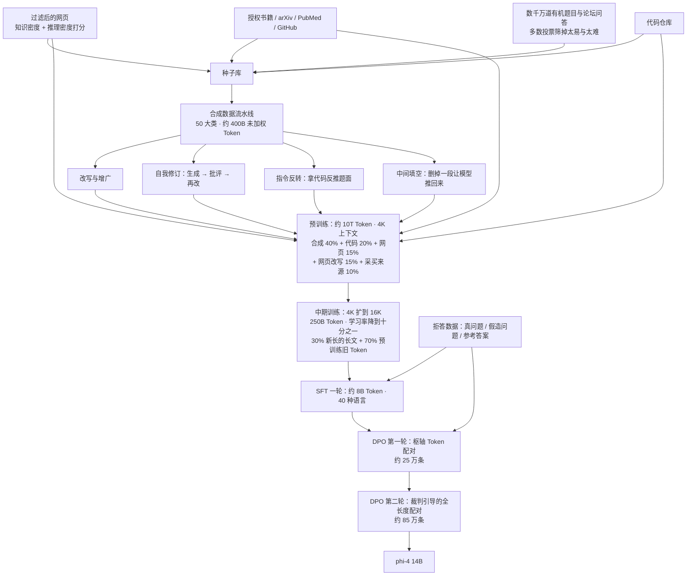
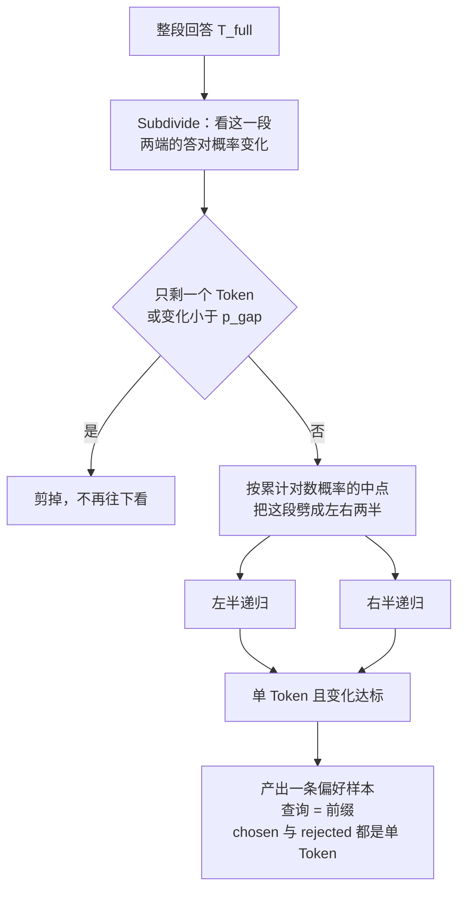
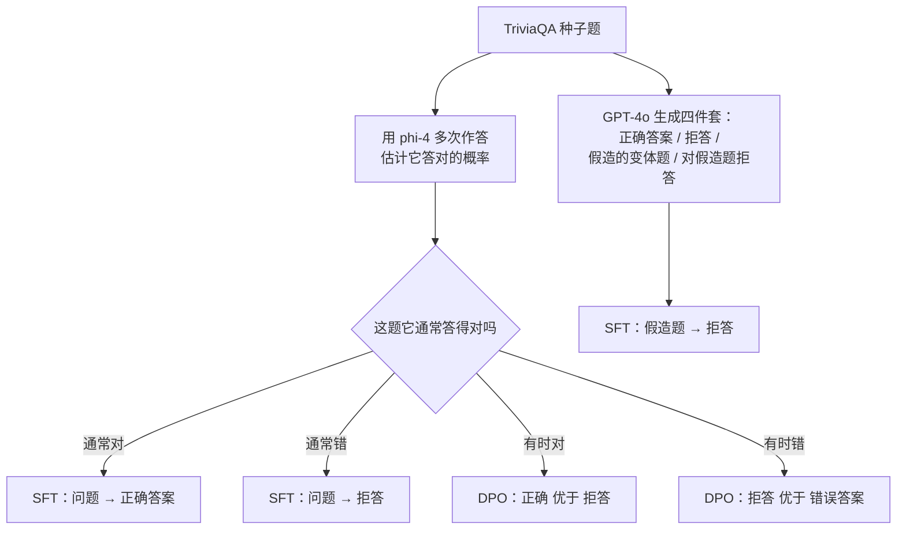

# Phi-4：合成数据可以反复读，但它不带新知识

<!-- release-date: 2024-12-12 -->

> **本文依据**：本地 `papers/Microsoft/Phi-4.pdf`，即 *Phi-4 Technical Report*，[arXiv:2412.08905v1](https://arxiv.org/abs/2412.08905)，2024-12-12 提交，共 36 页，作者署名 Microsoft Research。经 arXiv API 与摘要页逐版核对，**v1 就是官方唯一版本**，没有修订版，本地件即最新版。
>
> 正文页码指 PDF 自身页码，且与纸面印刷页码逐页一致（已抽查 p. 3、p. 13、p. 17、p. 29 的页脚）。全文区分三个层次：**报告写了什么**、**我们怎么解释它**、**哪些是外部补充**，三者不混着说。
>
> **这一篇接在已收录的 Phi-3 后面读。** data optimal regime、两阶段预训练、phi-3-medium 放大后收益衰减、TriviaQA 暴露的容量墙——这些前作讲过的东西本文不重讲，只讲 Phi-4 这一代**换了什么、以及换完之后哪里露了底**。

## 读前先认识几个词

这份报告不堆缩写，但有几个词会反复出现，先用人话过一遍：

- **Token（词元）**：模型读写文本的最小小块。
- **有机数据（organic data）**：报告在脚注里给了定义——「人类生成的、或非合成的数据」（PDF p. 2 脚注 2）。中文一般叫自然数据，本文跟着报告叫有机数据。
- **合成数据（synthetic data）**：由另一个语言模型生成或改写出来的训练样本。
- **epoch（轮次）**：一批数据被完整读一遍叫 1 个 epoch。读 13.8 遍就是 13.8 epoch。
- **中期训练（midtraining）**：预训练之后、指令微调之前的一段继续训练，用来改上下文长度或补某类能力。
- **SFT（Supervised Fine-Tuning，监督微调）**：用「问题 + 标准答案」继续训，把续写模型变成会答话的助手。
- **DPO（Direct Preference Optimization，直接偏好优化）**：用「同一个问题的更好回答 / 更差回答」成对数据训练，不需要单独训一个奖励模型。
- **枢轴 Token（pivotal token）**：本报告提出的概念，指一条回答里**单独改变它就能显著改变答对概率**的那一个 Token。
- **去污染（decontamination）**：把训练语料里和评测集重合的部分删掉，防止模型「背过考题」。
- **RAI（Responsible AI，负责任的 AI）**：微软内部对安全、公平、不造谣那一整套要求的统称。

## 一句话先说清

Phi-4 的主张不是「我们又把数据筛得更狠了」，而是一次**换来源**：

> **预训练里最大的那块饼是合成数据，占 40%；加上网页改写，合成来源一共占 55%。有机网页数据退到 15%。**（PDF p. 10 的 Table 5）

而支撑这个换法的，是一个反直觉的实验结论：**同样多的训练 Token，把同一批合成数据读 12 遍，比换成更多新鲜网页数据效果更好，而且没有看到过拟合**（PDF p. 8、p. 9 的 Figure 2）。

这件事一旦成立，「数据不够」就不再是硬约束了——合成数据可以无限复制。于是问题从「读多少」变成了**每一类数据负责什么**：

- 合成数据负责**推理模式**，因为它是按 LLM 一次 Token 一次 Token 生成出来的，天然就是模型能学着走的线性路径（PDF p. 4）；
- 有机网页负责**事实知识**，因为纯合成模型在 TriviaQA 上比 phi-3-medium 低 14.8 分，而且幻觉更多（PDF p. 8、p. 9 的 Table 3）；
- 两件事不能互相替代。

**这就是全篇的主要矛盾**：一个可以无限复读、但几乎不带新知识的来源，和一个带知识、但边际收益已经见顶的来源，怎么分工。

第二件值得记住的事在后训练。Phi-4 提出 **枢轴 Token 搜索（Pivotal Token Search，PTS）**，用来修 DPO 的一个结构性错误：**把一整条回答当成一个偏好样本，等于把功劳和过错平摊到每一个 Token 上**，而真正决定成败的可能只有一个词（PDF p. 14）。

第三件事最反常规：他们**明知会让 SimpleQA 的分数变差，还是把模型改成了不会就拒答**。报告原话是「我们相信最终结果是更好的行为，尽管 simple-evals 给 SimpleQA 的分数实际上给基础模型打了比最终模型更高的分」（PDF p. 16 的 Figure 6 图注）。

## 全景：phi-4 是怎么连起来的

**机制示意图，依据 PDF p. 5–6（合成手法）、p. 6–7（有机数据筛选）、p. 7（预训练与中期训练）、p. 10（Table 5 配比）、p. 11（中期训练细节）、p. 12（后训练三段）、p. 23–24（拒答数据构造）。** 图里不含任何实测时间或吞吐数据。

规格放在一起看：

| 项目 | phi-4 | 出处 |
|---|---|---|
| 参数 | 14B，稠密解码器 Transformer | PDF p. 1、p. 7 |
| 架构 | 「基本沿用 phi-3-medium」 | PDF p. 7 |
| 分词器 | 换成 tiktoken，补齐后词表 100,352 | PDF p. 7 |
| 注意力 | 4K 上全注意力，**不再用 phi-3-medium 的 2K 滑窗** | PDF p. 7 |
| 上下文 | 预训练 4096，中期训练扩到 16K | PDF p. 7 |
| 预训练量 | 约 10T Token | PDF p. 7 |
| 学习率 | 线性 warmup 加衰减，峰值 0.0003 | PDF p. 7 |
| 权重衰减 | 恒定 0.1 | PDF p. 7 |
| 全局 batch | 5760（**单位没写**） | PDF p. 7 |
| 中期训练量 | 250B Token，峰值学习率降为十分之一，RoPE 基频 250K | PDF p. 11 |
| 数据截止 | 报告没写；官方模型卡写「2024 年 6 月及更早的公开数据」 | 外部补充 |

**报告全文没有给出层数、隐藏维度、注意力头数、FFN 维度，也没有给优化器名字、GPU 数量、训练时长和并行策略。** 这不是我漏看——第 3 节（PDF p. 7）关于架构只有那两句话。后面「报告没有写的东西」一节会集中列。

## 主线一：一次几乎干净的对照实验

Phi-4 相对 phi-3-medium 是**同尺寸、同骨架**的换代。这让 Table 2 变成整份报告里最接近受控对比的一张表——它直接告诉你「把数据配方从网页主导换成合成主导，值多少分」。

Table 2（PDF p. 8）给的是相对 phi-3-medium 的**预训练后**差值：

| 4K 版 phi-4 相对 phi-3-medium | MMLU | MMLU-pro | GSM8k | HumanEval | ARCC | MBPP | MATH | TQA |
|---|---:|---:|---:|---:|---:|---:|---:|---:|
| 差值 | +3.0 | **+10.3** | +2.2 | +7.8 | +1.1 | +6.8 | **+8.9** | **−0.7** |
| 16K 版差值 | +2.7 | +8.9 | +1.2 | +9.0 | +0.9 | +9.6 | +8.4 | **−1.5** |

**读法：八列里七列涨，唯一一列跌的是 TriviaQA——纯知识检索基准。** 而且 16K 版把 TQA 的跌幅从 −0.7 扩大到 −1.5。

这一行就是整份报告的论点：**换数据配方买到的是推理，赔上的还是知识。** 它和 Phi-3 那篇的结论接得上——小模型的容量是个固定柜子，装推理就装不下事实。区别在于 Phi-3 是「为 3.8B 挑数据」，Phi-4 是「为 14B 造数据」。

**但这张表有三个混杂因素，报告一个都没排除（以下是我们的读法）：**

1. **分词器同时换了。** phi-3-medium 用 Llama-2 同款词表 32064，phi-4 换成 tiktoken 词表 100352（PDF p. 7）。词表一变，TriviaQA 这类靠实体名和拼写命中的基准本来就会动。
2. **去污染强度也变了。** phi-4 明确说「相比之前的 Phi 模型改进了去污染流程」（PDF p. 3），附录 B 列出的去污染基准有 20 个（PDF p. 27）。**训练数据被删得更多，TriviaQA 掉分就不全是「合成数据不带知识」的锅。**
3. **训练 Token 量也变了。** phi-3-medium 是 4.8T，phi-4 约 10T（本文数字取自 Phi-4 报告 p. 7；4.8T 见 Phi-3 那篇）。

所以 Table 2 支持的是**方向**（推理大涨、知识没涨），不支持把 −0.7 精确归因给「合成数据不带知识」。真正干净的那条证据来自下一节的纯合成消融。

## 主线二：合成数据能反复读，新鲜网页反而不如它

### 旧问题：网页数据的边际收益见顶了

Phi-3 时代是两阶段：阶段一吃大量过滤网页，阶段二吃合成加超精滤网页。到了 Phi-4，作者说随着合成数据的规模和复杂度上来，「**非合成 Token 的边际收益在 phi-3 那批模型尺寸上已经变薄**」（PDF p. 8）。

他们给出的两条观察很直白（PDF p. 8）：

- 网页数据集在重推理基准上收益很小；**把预算优先给合成数据的更多轮次，比补充新鲜网页 Token 更好**。
- 只用合成数据训的模型，在知识密集型基准上明显更差，而且**幻觉增加**。

### 报告先回答了一个更基本的问题：合成数据到底好在哪

第 2.1 节（PDF p. 4）没有急着讲怎么做，而是论证「为什么合成数据不是有机数据的便宜替身」。它给了两条理由，第二条尤其容易被忽略。

**理由一：结构与渐进学习。** 报告的核心观察是——在有机语料里，「当前 Token 和下一个 Token 之间可能隔着好几步推理」，模型却要用 next-token prediction 一步学会；而**合成数据里每个 Token 本来就是由前面的 Token 预测出来的**，所以推理链条天然是可学的线性形式（PDF p. 4）。报告管这叫「喂到嘴里的勺子」（spoonfeeding）。

它给的例子很具体：**人类写的数学解答可能一上来就报出最终答案**。那个答案对人来说是「非线性编辑」的产物（先算完再写结论），对模型来说却是「第一个 Token 就要吐出最终结果」——**这根本学不动**。合成解答不会有这种路障。

**理由二：与推理时的上下文对齐。** 这条更实用。报告说：合成数据的格式通常更接近你希望模型在推理时产出的格式，**所以预训练所见和推理所见是同一个分布**（PDF p. 4）。它举的例子是**网络论坛**：论坛的行文风格和 LLM 对话差别很大，**如果一个事实只出现在论坛语料里，预训练后的模型会认为它在自己产出的对话里几乎不可能出现**——于是那个事实虽然「学过」，却在推理时调不出来。把论坛里的事实改写成 LLM 的语言风格，它在推理时才可用。

**这一条值得单独记住，因为它解释了一件反直觉的事**：为什么「模型训练数据里明明有某个知识，问它却说不出」。报告给出的机制不是遗忘，而是**分布不匹配**——知识存在，但它所在的那种文本样式，在模型自己会生成的那种上下文里概率极低。**「改写」这种半合成形态之所以有用（Table 3 里 TQA 从 −14.8 收窄到 −7.7），这一节就是它的理论解释。** 报告没有把这两处明着连起来，但它们是同一件事。

### 新设计：把「复读合成数据」当成一种正当的资源用法

Figure 2（PDF p. 9）是第一条观察的证据。我逐格看过原图，它的设定是这样的：

- 四条曲线，两个模型规模（7B 与 14B）× 两个合成数据轮次（4 epoch、12 epoch）；
- **所有 run 的总训练 Token 数相同**，合成数据的**唯一 Token 数也固定**（是全量合成的一个子样本），所以 4 epoch 的那条线必须拿更多新鲜网页 Token 去填满剩下的预算；
- 纵轴是 5-shot MMLU，范围 0.64–0.76；横轴是 checkpoint 序号，约 400k 到 550k 以上；
- 读图结果：**12 epoch 的 14B 线一路爬到约 0.76，是四条线里最高的；同规模的 4 epoch 线停在约 0.74；7B 档同样是 12 epoch（约 0.738）高于 4 epoch（约 0.715）。**

**以上是读折线图得到的定性判断，报告没有把这些点写成文字数字。** 但结论方向明确：图注写「尽管对合成数据做了很多轮，我们没有看到过拟合行为，实际上 12 epoch 的模型比那些看过更多唯一网页 Token 的模型表现更好」（PDF p. 9）。

**为什么这件事值得单独拎出来？** 因为主流直觉是「重复数据会过拟合、会模型坍缩」，所以各家都在拼命找新数据。Phi-4 给的是一个相反的工程结论：**如果数据本身是按模型可学习的方式构造的，它的可复用次数远高于自然文本。** 报告没有解释*为什么*不会过拟合，也没给出「复读多少次开始坏」的拐点——**这是一处真实的空白**。

### 纯合成消融：知识那一栏塌了

Table 3（PDF p. 9）是第二条观察。他们专门训了一个 13B 模型（**明确标注「仅用于消融」**），完全不用网页数据，看了超过 20 遍每个数据源，相对 phi-3-medium 的差值：

| 数据构成 | MMLU | MMLU-pro | GSM8k | HumanEval | ARCC | MBPP | MATH | TQA |
|---|---:|---:|---:|---:|---:|---:|---:|---:|
| 纯合成 | +0.8 | +4.0 | +2.2 | +12.1 | 0.0 | +5.0 | +4.9 | **−14.8** |
| 合成 + 网页改写 | +0.3 | +4.1 | +1.8 | +13.3 | +3.0 | +7.6 | +8.1 | **−7.7** |

**TriviaQA 掉 14.8 分，是全表唯一一个数量级不同的负值。** 而 HumanEval 涨 12.1。这就是那条矛盾的裸数据：合成数据能把「怎么做」教得很好，把「是什么」教得很差。

值得注意的是第二行：把「网页改写」算作合成的一部分单列出来，TQA 的缺口从 −14.8 收窄到 −7.7，MATH 从 +4.9 涨到 +8.1。**说明「改写」这种半合成的形态确实在往数据里带回一点知识**，但它补不满。

报告对网页改写有专门定义：**它是合成数据的一个子类别，规模很大，内容是对网页数据的直接改写**（PDF p. 9 脚注 5）。

### 配比怎么定：在 7B 上试，搬到 14B 上用

Table 4（PDF p. 10）是手挑的几个配比变体，**所有数字相对最终配比**，另外 25% 预算（采买来源与代码）冻结不动：

| 变体 | MMLU | MATH | GSM8k | HumanEval | ARCC | MBPP | TQA | MMLU-pro | 均值 |
|---|---:|---:|---:|---:|---:|---:|---:|---:|---:|
| Uniform（三者均分） | −3.3 | −5.4 | −5.8 | −1.2 | +0.6 | −2.0 | **+3.3** | −3.6 | −2.2 |
| S（合成为主） | +3.3 | +4.0 | +2.1 | −6.1 | +1.9 | +0.4 | −3.0 | +3.7 | **+0.8** |
| S + WR | +0.6 | +1.2 | +1.5 | −1.2 | +1.6 | +1.6 | −3.7 | +1.2 | +0.4 |
| S + W | −0.6 | −0.7 | −0.7 | −4.3 | +0.3 | −2.0 | **+6.9** | +0.9 | 0.0 |

三个读法：

1. **均分是最差的（−2.2）**，因为合成数据质量更高，均分等于把它稀释了（PDF p. 10）。
2. **纯合成为主的两个变体（S、S+WR）均值其实比最终配比更好**（+0.8、+0.4 对 0.0）。报告承认这点，然后说他们**故意没选最优的那个**，理由是「为了平衡模型各项能力，决定并入采买来源和知识密集的过滤网页数据」（PDF p. 10）。这是一次**为了知识能力牺牲平均分的主动取舍**，不是找不到更好的配比。
3. **HumanEval 在四个变体里全是负的**（−1.2 到 −6.1）。因为代码在那冻结的 25% 里，动另外三类的比例只会挤占它——这提醒我们：**这张表的 HumanEval 列不能读成「合成数据伤代码」。**

**我按前八列逐行复算了「均值」这一列（以下是我们的算术）**：Uniform 得 −2.175、S 得 +0.7875、S+WR 得 +0.35、S+W 得 −0.025，**四格全部与表内 −2.2、+0.8、+0.4、0.0 在两位小数口径下吻合**。这张表的均值列是可信的。

报告还补了一句关键的：**「我们注意到，选定配比与合成重的那几个 run 之间的差距，在模型走后训练阶段之后基本闭合了」**（PDF p. 10）。这句话的分量在后面——它意味着预训练配比的这点优势差异，被后训练抹平了；那么当初为知识做的取舍是否还划算，报告没有回答。

**他们怎么省实验？** 报告说用 1T Token 的短程 run 做消融，依据是「短训与长训结果的高秩相关」，以及「7B 与 14B 在不同配比上的表现也高度秩相关」，所以**在 7B 上做实验、把结论搬到 phi-4**（PDF p. 9）。这是一条小团队可直接复用的做法，但它有边界条件：**「只要配比之间的距离足够大」**（原文 given a large enough distance between the data mixtures）。差异很小时搬不动。

### 最终配比，以及一处对不上的账

Table 5（PDF p. 10）：

| 来源 | 占比 | 唯一 Token 数 | 轮次 | 我按 10T 反算的轮次 |
|---|---:|---:|---:|---:|
| 网页 | 15% | 1.3T | 1.2 | 1.5T ÷ 1.3T = 1.15 |
| 网页改写 | 15% | 290B | 5.2 | 1.5T ÷ 0.29T = 5.17 |
| 合成 | 40% | 290B | **13.8** | 4T ÷ 0.29T = 13.79 |
| 代码 | 20% | 820B | 2.4 | 2T ÷ 0.82T = 2.44 |
| 采买来源 | 10% | 580B | 1.7 | 1T ÷ 0.58T = 1.72 |

**最后一列是我算的，不是报告内容。** 五格全部对得上（误差都在四舍五入内），说明这张表是自洽的，也说明「约 10T」这个总数是真实参与计算的。**合成数据读 13.8 遍**这个惊人的数字，就是在这里被交叉验证的。

**但有一处对不上：** 第 2.2 节说 50 大类合成数据「累计约 400B 未加权 Token」（PDF p. 5）。而 Table 5 里合成 290B + 网页改写 290B = **580B 唯一 Token**，网页改写按脚注又确实属于合成数据。**580B 大于 400B。** 报告没有解释这个差额。可能的解释有好几个（400B 只指某一批、或某个口径下的净值、或两处取整口径不同），**但报告没写是哪一个，所以这里只能记作一处未解的口径不一致，不要拿去引用。**

### 合成数据是怎么造出来的

报告给了四条原则（PDF p. 4–5）：**多样性**（覆盖每个领域的子话题与技能）、**细腻与复杂**（要边缘情况和进阶例子，不能只有基础）、**准确性**（代码要能跑、证明要成立）、**思维链**（系统性分步推理）。这四条本身不新，新的是它们下面挂的具体手法。

**种子从哪来**（PDF p. 5）——三类：

1. **网页与代码种子**：两阶段过滤，先挑教育价值高的页面，再把页面切成段落、按「事实含量」和「推理含量」分别打分。
2. **题库**：先收大量题目，再用**多数投票筛难度**——为每题生成多个独立答案，「所有答案都一致的题丢掉（太简单），答案完全不一致的题也丢掉（太难或有歧义）」。**投票得到的多数答案直接替代原始标注，用于后面的拒绝采样。**
3. **从多样来源抽问答对**：让模型从书籍、论文、代码里**检测推理链或逻辑推进**，把关键步骤改写成问题和答案。报告说「实验显示，如果做得对，训练这些改写出来的内容，比训练原始内容有效得多」（PDF p. 5）。**这句话没有配任何数字或表。**

**造的四类手法**（PDF p. 5–6）：

- **改写与增广**：把段落里有用的内容大部分重写成练习、讨论或结构化推理任务。
- **自我修订**：初稿经反馈循环迭代——模型批评自己的输出再改，评分量规聚焦推理与事实准确性。附录 D.1.2 给了完整实例（PDF p. 31–32）：一道表观遗传学的阅读题，Revision 0 被批评 agent 打「外部知识：1 分、选项迷惑性：2 分」，于是 Revision 1 加入 HPA 轴和皮质醇，再被打「难度：1 分」，Revision 2 又加糖皮质激素响应元件。**批评者给的是分数，不是感想**，这是这套流水线能自动跑起来的关键。
- **指令反转**：拿现成代码反向生成题面，把指令放在代码前面；**只保留原始代码与重新生成代码高度一致的那些**（PDF p. 6）。
- **中间填空**：从自由文本里挖掉「中间」一段，用剩下的当上下文、被挖掉的当答案；难点在于要挑那种**能靠推理还原**的片段。附录 D.2 给了一个从代码片段造的例子（PDF p. 33），模型补出来的答案被判「3 分，部分正确」，并给了提示。
- **可验证就验证**：合成代码用执行循环和测试来验（PDF p. 6）。

### 有机数据的角色被重新定义：它现在是知识底座和种子库

这一节是 Phi-4 与 Phi-3 最实质的差别。Phi-3 时代网页数据是主料；Phi-4 里它退成两个用途——**直接喂知识**，以及**当合成的种子**。

报告对后一个用途有一句很硬的话（PDF p. 6）：

> 「我们发现干净且正确的自然数据对**给合成数据播种**是绝对关键的：小错误会导致衍生合成文档出现严重的质量退化。」

配套的做法（PDF p. 6–7）：

- **定向采买**：arXiv、PubMed Central、GitHub，以及明确授权的书，目标是「在全面性、时效性和干净程度上超过外部可得语料的通常标准」。
- **小分类器筛网页堆**：用**约 100 万条 LLM 生成的标注**去训**小的非 LLM 分类器**（PDF p. 6）。理由不是省钱这么简单——报告说这招「会在 STEM 关键词上过采样」，所以**另建了一条专门放大高质量非 STEM 内容（艺术、历史、旅行、文化、娱乐）的流水线**，话题分类器同样是蒸馏 LLM 标注得来的。
- **多语言**：用基于 fastText 的语种识别把文档分到 **176 种语言**，再用同一套质量分类器过滤；分类器本身是在**多语言 LLM 标注**上训的（PDF p. 7）。
- **自建 HTML 抽取器**：专门保护「容易被朴素解析器破坏的脆弱内容」——TeX/MathML 公式、代码块、表格、论坛帖子结构；靠 HTML 标签名、CSS 类、内容长度、树深度等信号区分样板文字、广告、公式和语法高亮残留（PDF p. 7）。
- **损坏检测**：按 n-gram 统计与压缩率找离群值，清除损坏文本与二进制文件（PDF p. 7）。
- **题库规模**：数千万道高质量有机题目与解答（PDF p. 6）。

**这里有一条被报告用一句话带过、但价值极高的消融**（PDF p. 6）：

> 「我们的消融研究显示，**有机问题比合成问题显著更有效**。我们用若干方式合成增广有机题库以获得更大数据量。虽然这些改写后的问题确实提升了模型能力，但增益没有那么大。」

**注意它和前面 Table 3 的关系**：合成数据整体有用，但**在「出题」这件事上，真实人类写的问题仍然打不过**。报告没有给出这条结论的数字。也就是说，全篇最重要的一条数据侧结论之一，是**只以文字形式存在、没有配表**的。

### 对自己的项目有什么用

- **「重复自有质量的数据」优于「追求数据新鲜度」**——这是可以直接搬走的。任何做垂直小模型的人，手上真正的高质样本量都很小。Phi-4 的证据说明：**先别急着找新数据，先把已有的一批按可学习的形式重多几遍。** 但边界要记住：报告没说拐点在哪，也没说这套结论对**知识密集型**任务是否成立（从 Table 3 看，恰恰是知识不成立）。
- **给每类数据写一句「它负责什么」，再据此定配比。** 报告把网页数据的角色明确改成「知识与抗幻觉」，于是即使平均分会变差也保留 15% + 10%（PDF p. 10）。**配比不是搜索出来的唯一最优，是带着价值判断的取舍。** 这一点比任何超参都值得学。
- **多数投票筛难度**（丢掉全对和全错的题）是一条几乎零成本的题库清洗法，任何做评测集或 SFT 题库的人都能立刻用。
- **用小分类器 + 百万级 LLM 标注筛大数据**，而不是用 LLM 逐条打分——这是规模上的现实选择，而且报告诚实说了它的副作用（STEM 过采样）以及怎么补救。

## 主线三：宣称超过老师，就得先把「不是背答案」证明掉

摘要里的重头主张是：**过去的 Phi 系列在很大程度上蒸馏老师模型（GPT-4）的能力，而 phi-4 在 STEM 问答上显著超过了老师**（PDF p. 1）。

数字在 Table 1（PDF p. 2）：

| 基准 | phi-4 14B | GPT-4o | 差 |
|---|---:|---:|---:|
| GPQA（研究生级 STEM） | **56.1** | 50.6 | +5.5 |
| MATH（数学竞赛） | **80.4** | 74.6 | +5.8 |

这是全表里 phi-4 拿到「加粗（表内最高）」的**仅有的两项**——13 行里它只在这两行是全场第一（PDF p. 2）。**所以「超过 GPT-4o」这个说法的准确边界是：在两道 STEM 问答题上超过，而不是整体超过。** 报告自己的措辞也确实限定在 STEM 问答能力上（PDF p. 1）。

一个 14B 模型在研究生级科学问答上打赢旗舰闭源模型，这个主张足够反常，**所以这份报告把大量篇幅花在「怎么证明这不是背出来的」上**。这套证据链值得完整看一遍。

### 第一道防线：考一张还没出的卷子

他们用了 **2024 年 11 月的 AMC-10 与 AMC-12**（PDF p. 3）：

- 比赛发生在**所有训练数据收集完成之后**；
- **全部超参定完之后才测**；
- 这四项考试共 **78 道题**（4 套各 25 题，10A/12A 与 10B/12B 之间有重叠），题目在 2024-11-06 或之后才公开（PDF p. 29）；
- **所有被对比的外部模型都在这个日期之前发布**（PDF p. 29）。

Figure 1（PDF p. 3）的结果，我逐根柱子核对过（纵轴是四套题平均分，满分 150）：

| 模型 | 归类 | 平均分 |
|---|---|---:|
| Llama-3.3 70B Instruct | 大模型 | 66.4 |
| Claude 3.5 Sonnet | 大模型 | 74.8 |
| Qwen 2.5 14b-Instruct | 小模型 | 77.4 |
| GPT-4o | 大模型 | 77.9 |
| GPT-4o-mini | 小模型 | 78.2 |
| Qwen 2.5 72b-Instruct | 大模型 | 78.7 |
| Gemini Flash 1.5 | 小模型 | 81.6 |
| Gemini Pro 1.5 | 大模型 | 89.8 |
| **phi-4** | 小模型 | **91.8** |

**三条读图注意事项（以下是我们的读法）：**

1. **纵轴从 60 起，不是从 0 起。** 91.8 对 66.4 的柱子高度差，远小于它们实际分数差所代表的倍数。
2. 颜色编码是**大模型 / 小模型**，不是「我们的 / 别人的」；phi-4 被归在小模型一类，名字加粗标出。
3. 图注说误差棒是估计值的 2σ，但报告没给标准差数值。

**评分口径写在附录 C（PDF p. 29–30）**：每题 10 次独立生成、温度 0.5；计分按真实 AMC 规则——**答对 6 分、空白 1.5 分、答错 0 分**；因为「所有被测模型（包括我们自己的）都经常不遵守『把最终答案框起来』的指令」，改用 GPT-4o（温度 1）从解答里抽取最终选项。

**这是一处诚实的披露**：他们承认了输出格式不可靠，并且用「把本来正确但没按格式收尾的解答判为正确」来稳定评测（PDF p. 30）。

### 一处必须点破的方法论细节

附录 C 的脚注 8（PDF p. 29）大意是：**「完整披露：我们在该数据集上评测了最后三个候选模型，三个的平均分都超过 89。我们基于其他因素选定了最终模型——在测出它的分数之前，但在看到另外两个候选的分数之后。」**

这段话值得慢慢读。它说明：

- **他们是在看到两个候选的 AMC 分数之后做的选型**，所以正文那句「AMC 完全独立于我们的最终模型」（PDF p. 29）需要打折；
- 但他们**没有看被选中那一个的分数**，所以这也不是一次纯粹的事后挑考卷；
- 三个候选都 >89，所以**最终这个 91.8 不是从一堆差结果里挑出来的最好那个**——但也不能排除它落在「已知都挺好」的候选里被再次确认。

**报告主动写出了这条限制，这是加分项。** 我们的结论应当是：**AMC 结果证明 phi-4 在没见过的竞赛数学上确实强（三个候选都过 89），但它不是一次完全盲测。** 正文与自家脚注之间存在张力。

### 第二道防线：把去污染做成一个算法

附录 B（PDF p. 27–29）给了完整流程，这是 Phi 系列第一次把去污染写到算法级别：

- 对 **20 个基准**做去污染：ARC-Easy、MBPP、phibench、CommonsenseQA、WinoGrande、mcphi、MedQA、MATH、AGIEval、PIQA、OpenBookQA、HellaSwag、GPQA、mt-bench、MMLUPro、GSM8k、HumanEval、arena hard、ARC-Challenge、MMLU（PDF p. 27）；
- **两步混合 n-gram**（Algorithm 1，PDF p. 28）：先查 13-gram，命中且不在「白名单 13-gram」里就判污染；再查 7-gram，算重叠比例，超过 `info_7gram_threshold` 但没到 `contaminated_7gram_threshold` 判「部分污染」，超过后者判污染；
- **白名单的作用**：他们专门维护了一批「在 Wiki 和训练集里都常见的 13-gram」不去删，因为那是通用套话，例如 `a true true b false false c true false d false true` 这类选择题选项串（PDF p. 27）。

**这一处很值得注意**：朴素的 n-gram 去污染会把「所有模型都会说的那句话」误判成污染，反而伤到正常语料。**把常见公共片段显式建成白名单，是一个便宜但必要的修正。**

**报告没给的东西**：两个阈值的**具体数值**、白名单的规模、以及去污染删掉了多少比例的训练数据。

p. 29 给了一个真实判例：一道划船手平均体重的题，训练侧来自 `orca-math-word-problems-200k`，测试侧是 AGIEval，13-gram 命中片段是 `one of the crew who weighs 53 kg is replaced by a new`，7-gram 重叠比例 **0.39473684210526316**，判定 `contaminated: True`。

**由此可以反推（我们的推断，报告未写）：污染阈值 `contaminated_7gram_threshold` 不高于 0.3947。** 这是全文唯一能钉住阈值位置的信息。

### 第三道防线：自己出一套没人见过的题

第 5 节（PDF p. 16–17）先列了学术基准的四类局限：数据污染、技能面窄、生成式评测的 LLM 裁判偏见（可能更看重风格流畅而非推理正确）、选择题测的是「聪明的瞎猜」。

对策是内部基准 **PhiBench**，三条设计目标：

1. **原创性**：所有题由团队自己写，确保不在预训练数据里；
2. **技能多样性**：代码不只写孤立函数，还包括**找错、补全未写完的代码、解释代码片段**；数学包括**指出证明里的错误、生成相关题目**，而不只是解方程；
3. **生成题的严格评分**：精心写「裁判笔记」（judge notes），明确怎么评，「我们观察到评分结果的一致性显著提升、主观偏好带来的不利影响明显减少」（PDF p. 17）。

PhiBench 在 Table 1 里 phi-4 得 56.2，低于 GPT-4o 的 72.4、Qwen-2.5-72b 的 64.6、GPT-4o-mini 的 58.7、Llama-3.3-70b 的 57.1，只高于 phi-3 的 43.9 和 Qwen-2.5-14b 的 49.8（PDF p. 2）。

**这是一处被报告自己的数据打脸的地方**：phi-4 在**它自己团队为 phi-4 设计、且宣称能防污染的原创基准**上，明显输给 GPT-4o（56.2 对 72.4，差 16.2 分），也输给 GPT-4o-mini。而它「超过老师」的证据来自 GPQA 和 MATH 这两个公开基准。**报告没有讨论这个反差。**

**我们的读法**：这两组基准测的东西不同——GPQA/MATH 是「有标准答案的推理题」，PhiBench 覆盖面更广（含解释、纠错、开放生成）。**phi-4 超过的是老师「做对题」的那部分能力，没超过的是老师「当助手」的那部分能力。** 这与后文 IFEval、ArenaHard 的短板完全一致。

### 一处找不到出处的强主张

引言里写：「它在许多广泛使用的推理相关基准上的表现**达到或超过 Llama-3.1-405B**」（PDF p. 2）。

**全文再没有出现过 405B。** Table 1 里最大的 Llama 是 Llama-3.3-70B-Instruct（PDF p. 2）。也就是说，这句被放进正文主干的对比，**在这份报告里没有任何一张表支持**。它可能来自未公开的内部评测，但报告没写。引用时不要把它当成有证据的结论。

### 「12 个基准里赢 9 个」的口径

第 6 节说：「phi-4 在 **12 个基准中的 9 个**上超过最接近的同级当代模型 Qwen-2.5-14B-Instruct」（PDF p. 18）。

Table 1 有 13 行，看着对不上。**我逐行核了一遍（以下是我们的复算）**：把内部基准 PhiBench 排除，剩下正好 12 个公开基准，phi-4 赢 9 个——MMLU、GPQA、MATH、HumanEval、MGSM、MMLUPro、HumanEval+、ArenaHard、LiveBench；输 3 个——SimpleQA（3.0 对 5.4）、DROP（75.5 对 85.5）、IFEval（63.0 对 78.7）。**这 3 个正是报告自己点名的三个短板**（PDF p. 18）。

**9 对 12 完全吻合，前提是「12」不含内部 PhiBench。** 报告没写这个排除，所以引用这句话时要补上口径。

### 对自己的项目有什么用

- **宣称超过更强的模型时，你的证据成本是指数上升的。** Phi-4 给的答案是三件套：**没见过的考卷 + 算法级去污染 + 自出原创题**。任何要做「我们的模型比 baseline 强」结论的团队，这套结构可以直接抄——尤其是「自出原创题」这条，成本最低、说服力最高。
- **给评测口径留一条「我们本来可以挑分但没挑」的披露。** 脚注 8 那条（看过两个候选的分、没看第三个）比多报三个基准更能建立可信度。这和 Phi-3 报告里「加 `##` 能提分但我们没加」是同一族做法。
- **13-gram 白名单**这一招可以直接搬：任何做去重或去污染的人都会撞上「公共套话被误杀」，显式白名单比调阈值干净。
- **警惕「表里没有的那个对手」。** 一句「达到或超过 X」如果全文找不到 X 的任何一行数字，它就不是结论而是修辞。

## 主线四：DPO 把功劳记错了地方

这是 Phi-4 技术上最有迁移价值的一块。要理解它，得先看清 DPO 在长解答上到底做了什么。

### 旧问题：一条回答的功劳，被平摊到了每个字上

标准 DPO 拿一整条「好回答」和一整条「坏回答」作配对，训练时提高好回答里**每个 Token** 的对数概率、降低坏回答里每个 Token 的。

报告指出两个后果（PDF p. 14）：

1. **信号被稀释**。一条数学解答里，绝大多数 Token 是「按部就班的推导」，成败其实取决于极少数几个关键选择。把这些一起加权，「会给梯度带来噪声，稀释掉来自枢轴 Token 的信号」。
2. **更糟的是会奖励错的东西**。报告举的例子是那个让解答失去稳健性的 Token `(a`：它自身的概率只有 0.12，**所以一旦整条回答被当作正样本，它反而会收到一个很强的正向学习信号**（PDF p. 14）。

第 2 点值得停一下。为什么低概率 Token 会收到强正信号？因为 DPO 的偏好损失要求 chosen 序列的对数概率之和**增大**，而一个模型本来只给 0.12 概率的 Token，把它推高带来的边际变化最大。**于是「整条回答是好的」这个前提，会让其中那个恰好被采样到、其实不该鼓励的低概率 Token 一起被强化。**

3. 报告还给了第三条更根本的直觉（PDF p. 14）：**「当两段文本显著不同时，比较它们各自的下一个 Token 对数概率（DPO 做的事）并不是很有意义。更合理的做法是让信号来自两段文本开始分叉之后的那批 Token。」**

### 新设计：枢轴 Token

先给定义。设一条回答被逐 Token 生成为 $t_1, t_2, \dots$，对任意前缀，考虑**从这个前缀继续采样、最终答对的概率**。它要算的是「走到这一步，这题还有多少机会做对」：

$$
p_i=\Pr\big[\text{a continuation of } t_1,\dots,t_i \text{ is judged correct}\big]
$$

报告的说法是：对每个已生成的 Token，看这个条件概率**相对于前一个位置的增量**；**那些增量绝对值够大的 Token 叫枢轴 Token**——它们对解法的走向有「不成比例的影响」（PDF p. 14）。把「这一步值多少」写成判据：

$$
\left|p_i-p_{i-1}\right|\ge p_{\text{gap}}
$$

其中 $p_i-p_{i-1}$ 就是「吐出第 $i$ 个 Token 之后，答对概率跳了多少」，$p_{\text{gap}}$ 是一个阈值。**报告没有给它的取值。**

### Figure 3：一个值得逐格看的例子

Figure 3（PDF p. 13）是 GPT-4o 在温度 1 下解一道 MATH 题（三次方程韦达定理那类），**初始答对概率 0.31**。每个 Token 按「从它之后继续独立补全 529 次能答对的比例」上色，红为 0、蓝为 1。我核对原图读到的是：

- 前半段整体偏红（成功概率一直在 0.3 附近徘徊），后半段几乎全蓝；
- 有两个 Token 被方框标出（变化量 ≥ 0.2）：
  - `negative`：**0.42 → 0.93**（模型给这个 Token 本身的概率是 0.31）；
  - `(a`：**0.95 → 0.71**（模型给它的概率是 0.12）；
- 图注还补了一句：**同样的前缀下，贪心解码会选 `product`（概率 0.66）和 `t`（概率 0.88）**；
- 另外，**概率 ≤ 0.1 的 Token 被画了下划线**，图注明说这是为了说明「**枢轴 Token 与低概率 Token 是两回事**」。

**这张图的全部信息量就在最后这一句上。** 把两个 Token 摆在一起看：

| Token | 模型给它的概率 | 它让答对概率变成 | 该不该鼓励 |
|---|---:|---:|---|
| `negative` | 0.31（低于贪心的 `product` 0.66） | 0.42 → 0.93，大涨 | **该** |
| `(a` | 0.12（很低） | 0.95 → 0.71，下跌 | **不该** |

**所以「低概率」不能当筛选标准。** 报告专门用下划线标出概率 ≤ 0.1 的 Token，正是为了让你看到：那些低概率 Token 和两个方框**几乎不重合**。这直接否定了「用模型自己的困惑度找关键步」这类做法——而后者是当时学界的一条现成路线（见下面的 Related Work）。

### 怎么高效地找到它们：二分，而不是逐 Token 扫

朴素做法要对每个位置都估一次 $p_i$，而每次估计要采几百条补全。Figure 4（PDF p. 13）给的算法把这件事变成**二分搜索**：

**机制示意图，依据 PDF p. 13 的 Figure 4 伪代码。** 伪代码里有三个容易被忽略但很重要的细节：

1. **切分点不是按 Token 个数取中点，而是「按累计对数概率的中点」**（Figure 4 的行内注释）。也就是说，二分是按**信息量**折半，不是按长度折半。
2. **基准情形有两条**：段长 ≤ 1，**或者**这一段两端概率变化已经小于阈值——后者让整段平稳的区域一次就被跳过。
3. 图注提醒：**估计 $p(\text{success}\mid\cdot)$ 本身要采样语言模型并调用判定器，「高效实现里应该做记忆化」**——因为递归会反复估同一个前缀。

报告对算法的正确性给了一个很克制的说法（PDF p. 14）：**「PTS 的二分算法不保证找到所有枢轴 Token，但它找到的都是枢轴 Token；当成功概率沿解答近似单调时，它能找全。」**

**这句话值得逐字读**：它把「无假阳性」和「可能假阴性」分得很清楚，并且给出了假阴性消失的充分条件（近似单调）。**这是一个非常干净的算法边界声明**，比大多数报告写「我们使用 X 方法」要诚实得多。

### 工程约束：只在中难度题上做

$p(\text{success})$ 怎么估？采样补全，然后交给一个**判定器**（oracle）检查——「代码可以用一套完整测试套件；数学题可以把答案与标准答案比对」（PDF p. 14 脚注 6）。

**这就决定了 PTS 只能用在有客观对错的领域。** 报告明确说用在「数学、各类问答、编程」这类有标准答案的任务上（PDF p. 14）。

**为了样本效率，他们只挑 $0.2\le p(\text{success})\le 0.8$ 的题**，理由是「太简单或太难的题上枢轴 Token 很稀有」（PDF p. 14）。

**这一条是整节里最实用的一句。** 它等价于说：**关键 Token 只出现在模型「半会不会」的区间**。做数据筛选、做主动学习、做 RL 采样时，这个区间的题才是有信息量的。

生成的配对方式（PDF p. 14）：以 $Q+t_1,\dots,t_{i-1}$ 为查询，取**单个**能抬高概率的 Token 作 accepted、**单个**能压低概率的 Token 作 rejected。脚注 7 补了一句省事的实现：**这两个 Token 直接从 PTS 估概率时已经采出来的 rollout 里挑**，不用额外生成。

### 三条真实配对长什么样

Figure 5（PDF p. 15）给了三个例子，实际配对的 Token 用下划线标出：

| 领域 | 上下文 | Good（下划线 Token） | Bad（下划线 Token） |
|---|---|---|---|
| 数学 | 「先通分，通过……」 | `cross`-multiplying（交叉相乘） | `multiplying` both sides by（两边同乘） |
| 物理 | 「Given ……」 | `the` vibrational frequency | `that` the potential interactions |
| 代码 | `if num == other * 2 or (` | `other` % 3 | `num` * 2 |

**注意物理那条**：配对只是 `the` 对 `that` 一个词。报告说，数学那条「展示了枢轴 Token 往往**不是真正的错误**，而是把模型带上一条不那么有利的路——两边分别乘分母与直接交叉相乘同样合法，但对这个模型来说后者更鲁棒」（PDF p. 14）。

**这是 PTS 最深的一层意思**：它优化的不是「对错」，而是**在自己这个模型上哪条路更稳**。这类知识没法从外部标注得到，只能靠在自己的模型上做 rollout 测出来。

### 它和同期工作的差别，报告自己怎么摆

Related Work 段（PDF p. 16）对比了两类：

- **对比式估计路线**（`LLX+24`，Critical Tokens Matter）：先训一个模型去给「导致失败的 Token」打分，再用分数去加权 DPO 里的 rejected 回答。报告的批评是：**PTS 直接估 $p(\text{success})$，绕开了「学出来的代理指标」带来的麻烦**；而且对方「报告了把方法用到 accepted 回答上的困难，而我们的方法同时生成正负两类偏好数据」。
- **自动过程监督**（`WLS+24`、`LLL+24`）：用搜索和 rollout 生成数据来训**过程奖励模型**。报告的位置：**「PTS 可以看作一种自动过程监督方法，但它产出的是可以直接喂给 DPO 的 Token 级偏好数据」**——即不需要再训一个 PRM。

**「不引入额外模型，直接产 DPO 数据」是这套方法真正的卖点。** 一个 PRM 要训、要服务、还容易被 hack；PTS 把「哪一步关键」这件事**在数据构造阶段一次性消化掉**，训练时用的还是标准 DPO。

### 消融证据：支持什么，不支持什么

Table 9（PDF p. 17）是后训练全程的分数演化。四列分别是 SFT 之后、DPO 第一轮（枢轴 Token）、**只做**第二轮（裁判引导）、以及两轮都做的最终模型：

| 基准 | SFT | DPO 第一轮 | 只做第二轮 | phi-4（两轮） |
|---|---:|---:|---:|---:|
| MMLU | 82.8 | **84.8** | 84.2 | **84.8** |
| GPQA | 47.3 | 53.6 | 52.4 | **56.1** |
| MATH | 77.1 | **80.5** | 77.6 | 80.4 |
| HumanEval | 79.5 | 81.6 | 81.5 | **82.6** |
| MGSM | 80.8 | 80.8 | **81.5** | 80.6 |
| SimpleQA | **3.7** | 2.9 | 2.9 | 3.0 |
| DROP | 82.8 | **86.1** | 71.8 | 75.5 |
| MMLUPro | 61.9 | 70.0 | 67.2 | **70.4** |
| HumanEval+ | 77.9 | 81.9 | 81.4 | **82.8** |
| ArenaHard | 56.7 | 66.5 | 69.8 | **75.4** |
| IFEval | **66.2** | 63.0 | 63.0 | 63.0 |
| PhiBench（内部） | 48.2 | 54.5 | 53.0 | **56.2** |

**先说一个交叉验证：这张表最后一列与 Table 1 的 phi-4 列逐项完全一致（12 行全对得上；LiveBench 未出现在 Table 9）。** 两表口径统一，这点值得肯定——Phi-3 那篇里我们复算 `Average` 时对不上的情况，这里没有发生。

**报告的两条归因结论，我按差值核了一遍（以下是我们的复算）**，基线都是 SFT 那一列：

- 「枢轴 Token DPO 在重推理任务上最有用（GPQA、MATH）」→ GPQA：第一轮 +6.3，第二轮 +5.1；MATH：第一轮 **+3.4**，第二轮 **+0.5**。**成立。**
- 「裁判引导 DPO 对那个本身就用了 GPT-4 裁判的基准特别有用（ArenaHard）」→ 第一轮 +9.8，第二轮 **+13.1**。**成立**，而且报告自己点破了这里的评价循环风险。
- 「两种方法互补」→ GPQA：单独 53.6 / 52.4，合起来 **56.1**；ArenaHard：66.5 / 69.8，合起来 **75.4**；MMLUPro：70.0 / 67.2，合起来 70.4。**大体成立。**

**但表里有两个反例，报告没讨论：**

1. **DROP 是反互补的**：只做第一轮能到 **86.1**，加上第二轮反而掉到 **75.5**，比 SFT 之前的 82.8 还低。也就是说**裁判引导 DPO 把 DROP 打掉了 10.6 分**，而两轮合用的成绩比单用第一轮差 10.6 分。DROP 恰好是 Table 1 里 phi-4 输给 Qwen-2.5-14B 的三项之一。
2. **IFEval 是全表唯一一个「SFT 就是最好成绩」的行**：SFT 66.2，两轮 DPO 都把它压到 63.0。**指令跟随能力是后训练自己弄坏的。**

第 2 点尤其值得注意，因为第 6 节把 IFEval 的短板归因于「**这一代合成数据生成没有把严格指令跟随当作重点**」（PDF p. 18），第 8 节又说它「对具体格式要求遵循得不够好」（PDF p. 20）。**但 Table 9 显示模型在 SFT 之后本来有 66.2，是两轮 DPO 各扣掉 3.2 分。** 归因不完整——报告没有把这两处放在一起看。

**我们的读法**：裁判引导 DPO 用 GPT-4o 按「准确性 / 风格 / 细节」三项 1–5 分打分（PDF p. 12），**评分量规里根本没有「是否遵守格式约束」这一项**。于是被裁判偏好的回答，天然偏向「写得漂亮详细」而不是「严格按格式」。**这就是 Table 9 里 IFEval 与 DROP 同时下滑的可能机制。** 报告没这么说，这是我们的推断。

### 对自己的项目有什么用

- **这条最值得搬：任何用整条轨迹做偏好训练的场景，先问「这条轨迹里到底是哪一步决定了成败」。** 代码 Agent、数学解题、长文写作都一样。全序列加权会把偶然的正确选择和偶然的错误选择一样强化。
- **$p(\text{success})$ 需要一个判定器，所以这套办法只在有客观对错的领域免费可用。** 没有 oracle 的领域（开放写作、对话质量），你只能退回到学一个裁判——那就回到了 PTS 想绕开的东西。
- **只做模型半会不会的题**（0.2–0.8 区间）这一条不需要 oracle 也成立，可以直接用在数据筛选、评测集构造、RL 采样上。
- **按信息量折半，而不是按长度折半。** 「以累计对数概率中点切分」是一个很聪明的通用技巧：在需要二分搜索一个序列上的突变点时，让切分点落在信息密度上。
- **报告一个方法的边界，就说清楚「无假阳性、可能假阴性、什么条件下不漏」。** 这比声称「有效」有用得多。

## 主线五：宁可不说，也不要编——并且明知基准分会掉

### 旧问题：预训练的目标和诚实是冲突的

附录 A.1 开头把矛盾摆得很直白（PDF p. 23）：

> 「我们预训练的目标是**把尽可能多的信息塞进模型**，也就是教它更多的东西，而不是教它认识自己的局限。」

后果是：不加干预时，phi-4 几乎从不承认自己不知道。报告举的例子是问「谁是排名第 297 位的网球选手？」，模型会像个即兴喜剧演员一样「Yes, and…」编出一个表面合理的答案（PDF p. 23）。

### 新设计：预训练负责装知识，后训练负责划边界

分工是：**先让模型大量作答、估出它每类题的答对概率，然后把「超出它能力的那一档问题」标出来，专门教它拒答**（PDF p. 23）。

**机制示意图，依据 PDF p. 23–24。** 三个细节值得单独看：

1. **假造变体题（bogus question）的设计要求极严。** 提示词（PDF p. 24）要求它「**听起来像真的但不可能有答案**」：不能明显是假的、荒谬的或虚构的；所有国名必须是真实国家；不能出现「致敬原题」的命名。举例是把「Amelia Earhart 什么时候飞越大西洋」改成「Edgar Greenwood 什么时候飞越大西洋」。**这是为了让模型学会拒绝的是「看起来该知道但不知道」，而不是「一眼假」。**
2. **拒答样本本身也是生成的**，提示词让 GPT-4o「想象自己是一个不知道答案、又不想瞎猜的 LLM」来写这段拒答（PDF p. 25）。
3. **DPO 数据只取回答的前 5 个 Token**（PDF p. 24）。**这一条和第 4.3 节的精神是同一件事**：偏好信号应该集中在决定性的开头，而不是摊在整段回答上。

### 收益：一张故意做坏自己分数的图

Figure 6（PDF p. 16）是 SimpleQA 上后训练全程的三档分布。我逐格核对了这张堆叠柱图（每档三格相加均为 100%）：

| 阶段 | 答对 | 未尝试 | 答错 |
|---|---:|---:|---:|
| 基础模型 | **6.8%** | 3.2% | 90.0% |
| SFT 后 | 3.7% | 57.5% | 38.7% |
| DPO 第一轮后 | 2.9% | 79.8% | 17.4% |
| 最终模型 | **3.0%** | **81.1%** | **15.8%** |

**幻觉率从 90.0% 降到 15.8%，代价是答对率从 6.8% 掉到 3.0%。**

报告接着给了一段很少见的坦白（PDF p. 16 的 Figure 6 图注）：

> 「我们相信最终结果是**更好的行为**，尽管 simple-evals 给 SimpleQA 的分数（那个 F1 分）**实际上给基础模型打了比最终模型更高的分**。」

### 这段算术值得自己走一遍

附录 A.1（PDF p. 24）给了一个简化例子：一个总是作答、6% 对 94% 错的模型，后训练后变成「3% 对、3% 错、94% 拒答」，**按 F1 反而从 6% 降到 5.6%**。

**报告没给 F1 的公式，下面这个口径是我按它的两个数字反推的**：把精确率定义在「作答过的题」上、召回定义在「全部题」上，取调和平均：

$$
P=\frac{\text{correct}}{\text{attempted}},\qquad
R=\frac{\text{correct}}{\text{total}},\qquad
F_1=\frac{2PR}{P+R}
$$

代入：第一档 $P=R=0.06$，得 $F_1=6.0\%$；第二档 $P=3/6=0.5$、$R=0.03$，得 $F_1=2\times0.5\times0.03/0.53=5.66\%\approx 5.6\%$。**与报告的数字吻合**，所以这个反推应当是对的。

**直觉**：模型越「挑题做」，它做对的题里蒙对的比例就越高（精确率涨），但它覆盖的题变少（召回跌）。**F1 在低准确率区间会被召回拖住**，于是「变诚实」在分数上表现为「变笨」。

**这里还有一处需要点破（我们的观察）**：Table 1 和 Table 9 里 phi-4 的 SimpleQA 列是 **3.0**，Figure 6 最终档的**答对率**也是 **3.0%**；SFT 列 3.7 对 Figure 6 的 3.7%，DPO 第一轮 2.9 对 2.9%。**三档完全吻合，说明表格里那一列记的是「答对率」，而不是第 6 节所说的「F1 分」**（PDF p. 18 明写用的是 SimpleQA 的 F1-score）。

**这不是什么大问题，但引用时要清楚：报告表内的 SimpleQA 数字与它自己声明的指标名称口径不一致。** 而且这反而让报告的主张更弱一点——如果表里是答对率，那「F1 冤枉了我们」这个论证用的就不是表里那个数。

### 与 QwQ 的对照：同一件事的另一面

报告在 1.1 节末尾把长思维链模型单独拎出来比（PDF p. 3）：QwQ-32B-Preview 在 Figure 1 的 AMC 设定下平均 **124.5 分**，明显高于 phi-4 的 91.8；但它在这道题上**多用 4 倍 Token、参数多一倍以上**，因此「**推理成本高一个数量级**」，结论是「这些模型与 phi-4 在成本或延迟上不是同一档」（PDF p. 3）。

**这是一次很干净的口径重设**：报告没有说 phi-4 比 O1 或 QwQ 强，而是说：**我们不在同一个成本档位上，所以不该这么比**。这是当时（2024 年 12 月）测试时计算路线刚起来时，小模型阵营最诚实的一种回应方式。

### 对自己的项目有什么用

- **「预训练塞知识、后训练划边界」这个分工是可以直接照搬的两段式。** 关键不是「加一条拒答数据」，而是**先测出模型自己的能力边界在哪一档题上，再针对那一档造数据**。
- **「假造一道看起来真实的题」是这套方法里最巧的一块。** 没有它，模型只会拒绝「明显不知道」的题，仍然会在「看似该知道」的题上编。这个技巧不依赖任何规模。
- **主动接受一个基准分下降，并把它写进报告。** 这是全篇最有说服力的一处做法——它同时证明了「我们没有在刷分」和「我们知道自己在优化什么」。
- **别把「模型回答得更多」当能力。** 基础模型 90% 的题都答错但几乎都作答，最终模型 81% 不作答——**作答率本身是一个需要被监控的产品指标**。

## 架构与长上下文：几乎没动，而且从 128K 退回了 16K

### 报告写的架构，一共两句话

第 3 节（PDF p. 7）关于架构的全部内容：

- 14B 参数的解码器 Transformer，默认上下文 4096，中期训练扩到 16K；
- **架构基本沿用 phi-3-medium**，两处改动：**换成 tiktoken 分词器（为更好的多语言支持），补齐后词表 100,352（含未使用 Token）**；**在 4K 上做全注意力，而不是 phi-3-medium 用的 2K 滑窗**。

**摘要里那句「对 phi-3 架构做了极小改动」（PDF p. 1）在这里得到了兑现。** 与 Phi-3 那代里 phi-3-small 一次改四处（换分词器、GEGLU、muP、块稀疏注意力）的做法完全不同——**这一代把创新预算全押在数据和后训练上**。

**顺带一处跨报告信息**：「phi-3-medium 用了 2K 滑窗」这件事，**Phi-3 技术报告里没写**（那边只说 medium 与 mini 架构相同）。这是 Phi-4 报告第一次透露的。也就是说 phi-4 在 4K 上做全注意力，**同时是简化（去掉稀疏）和加重（全注意力算 4K 而不是 2K）**。报告没有讨论这个取舍的代价。

### 中期训练：把上下文从 4K 拉到 16K

做法（PDF p. 10–11）：

- **先做消融**：比较「天然就是长文的语料」与「把短样本拼接填充成长序列的合成长文」，**观察到前者在长上下文任务上更好**；
- 于是把高质量非合成数据（学术、书、代码）里 **超过 8K 的样本单独筛出来**，并对 **16K 及以上**的子集**上调权重**；同时新造满足 >4K 长度要求的合成数据；
- 最终中期训练配比：**30% 新造的长上下文数据 + 70% 从预训练阶段召回的 Token**；
- **RoPE 基频提高到 250K**（沿用 Llama-3 的做法，引 `AI23b`）；
- **峰值学习率降到预训练的十分之一**，共训 **250B Token**。

**「天然长文优于拼接长文」这条消融，报告只给了结论没给数字。** 但它是一条很省事的经验：想让模型真的会用长上下文，**得让它见过结构上就长的东西**（论文、书、长文档），而不是把不相关的短文档塞进同一个窗口。

### 长上下文评测：故意不用 needle-in-a-haystack

报告在这里写了一句方法论声明（PDF p. 11）：

> 「虽然像大海捞针和 RULER 这样的合成长上下文基准因其简单和可控而更受偏爱，**我们的重点是一系列反映真实应用的多样任务**，例如在整份文档上做推理。」

**这句话直接接得上 Phi-3 那篇的教训。** 我们在 Phi-3 里核对过：phi-3.5 系列在 RULER 上从 64k 到 128k 掉了 14–21 分，而报告当时把它归因于「mid-training 缺少高质量长上下文数据」（用的是 we suspect）。Phi-4 这一代换了评测套件——**不再用那种能暴露「名义窗口不等于可用窗口」的合成检索基准**。

HELMET 结果（Table 6，PDF p. 11，每格是 5 次运行的平均）：

| 模型 | 最大长度 | Recall | RAG | ICL | Re-rank | QA | Summ |
|---|---:|---:|---:|---:|---:|---:|---:|
| phi-4 | 8K | 100.0 | 58.1 | 68.0 | 65.3 | 26.7 | 38.3 |
| Qwen-2.5-14B | 8K | 100.0 | 62.2 | 67.8 | 58.2 | 24.7 | 37.2 |
| Llama-3.3-70B | 8K | 92.0 | 65.3 | 69.4 | 64.4 | 30.0 | 37.8 |
| GPT-4o-mini | 8K | 99.2 | 65.8 | 74.4 | 69.4 | 31.3 | 38.5 |
| GPT-4o | 8K | 100.0 | 66.9 | 83.0 | 75.1 | 37.3 | 43.0 |
| **phi-4** | 16K | 99.0 | 57.1 | **77.0** | 54.4 | 36.0 | 40.5 |
| Qwen-2.5-14B | 16K | 100.0 | 59.1 | 67.6 | 50.3 | 29.7 | 42.3 |
| Llama-3.3-70B | 16K | 92.0 | 62.2 | 70.0 | 63.3 | 36.7 | 41.9 |
| GPT-4o-mini | 16K | 100.0 | 63.6 | 78.4 | 63.9 | 36.0 | 45.2 |
| GPT-4o | 16K | 100.0 | 66.7 | 85.6 | 73.8 | 43.7 | 46.3 |

六个任务的口径报告都写了（PDF p. 11）：Recall 是从随机生成的长 JSON 里按键取值（SubEM）；RAG 基于打乱的维基百科文档答 NaturalQuestions、HotpotQA、PopQA（SubEM）；Re-rank 用 MSMARCO 重排前十（nDCG@10）；ICL 是多样本上下文学习（F1）；QA 读长文档答题（GPT-4o 打分）；Summ 摘要长法律文书（GPT-4o 打分）。

**三个读法（其中第三点是我们的观察）：**

1. **phi-4 在 RAG 这一列上全面落后**：8K 时 58.1，比同尺寸的 Qwen-2.5-14B（62.2）低 4.1，比 GPT-4o 低 8.8。这与「合成数据不带知识」的主线完全一致——**RAG 恰恰是「在给定材料里找事实」**。
2. **Re-rank 从 8K 到 16K 明显下滑**（phi-4 65.3 → 54.4，Qwen 58.2 → 50.3，而 GPT-4o 75.1 → 73.8 基本没动）。**除了 GPT-4o，其他模型都掉。** 报告没有解释这一点。
3. **表里 phi-4 的 8K 那一行是什么模型，报告没说。** 最自然的读法是「中期训练之前的 4K 预训练 checkpoint，在 8K 上测」，但报告既没写「中期训练前」，也没解释为什么一个原生 4K 的模型能在 8K 上拿到 Recall 100.0。**这是一处身份不明的行**，跨行比较时要小心。

### 一处报告没解释的退步

**Phi-3.5-mini 与 Phi-3.5-MoE 的上下文是 128K**（见 Phi-3 那篇的规格表），**phi-4 作为后继旗舰只做到 16K**。

**Phi-4 报告从头到尾没有解释这个收缩。** 它没有说 128K 是错的，也没有说为什么只做 16K。

**我们的读法（不是报告结论）**：这与 Phi-3 那篇核对过的 RULER 数据完全说得通——当时 phi-3.5 系列在 64k 到 128k 之间掉 14–21 分，报告自己怀疑是长文数据不够。**换句话说，128K 在 Phi-3 那一代是「名义窗口」而不是「可用窗口」。** Phi-4 把窗口收缩到 16K、并且改用 HELMET 这类真实任务评测，看起来是**把能力面收窄到一个自己守得住的区间**，而不是继续挂一个会掉分的数字。

**这只是解释，不是证据。** 报告里没有任何一句话支持这个归因。

### 对自己的项目有什么用

- **窗口长度是一个承诺，不是一个规格。** 挂 128K 但 128K 上掉分，和挂 16K 但 16K 可用，后者对产品更负责——前提是你要像这里一样**说清楚自己守到哪一档**。
- **「先做天然长文与拼接长文的消融，再决定怎么造长文数据」**，是一个非常便宜但决定方向的实验。任何要扩上下文的团队都应该先跑这个。
- **换分词器不是免费的。** phi-4 为了多语言把 Llama-2 词表换成 tiktoken，代价是 Table 2 里 TriviaQA 那 −0.7 至少有一部分说不清是数据的锅还是词表的锅。**改一个影响所有 Token 级统计的东西，就要为之后的归因买单。**

## 后训练全景：一轮 SFT 加两轮 DPO

流程（PDF p. 12）：**SFT 一轮 → 枢轴 Token DPO 一轮 → 全长度偏好 DPO 一轮**。

聊天模板用标准 chatml。报告在第 4 节把两轮对话的完整模板原样印了出来（PDF p. 12），结构是「角色名 + 分隔符 + 内容 + 结束符」的三段重复，system、user、assistant 三种角色各占一段，最后以 assistant 段开头收尾等待续写。**本文不重贴这段模板**：它含有一批尖括号加下划线的特殊标记，在网页渲染里容易被当成标签吞掉；要看逐字版本请翻原件第 12 页。

### SFT：8B Token、40 种语言、学习率 1e-6

第 4.1 节（PDF p. 12）给的信息量比 Phi-3 那代大得多，但也就三句：

- 学习率 $10^{-6}$；
- 数据覆盖**数学、编程、推理、对话、模型身份认知、安全**，外加 **40 种语言**的多语言数据；
- 总量**约 8B Token**，全部按 chatml 格式整理。

**「模型身份认知」这一项和 Phi-3 一样被单列**（见 Phi-3 那篇的后训练一节）——在微软这条产品线上，「让模型知道自己是谁、边界在哪」被当成一项要专门教的能力，而不是自然涌现的副产品。

**没写的**：SFT 数据各领域占比、轮数、batch、是否做拒绝采样、40 种语言具体是哪 40 种。

### DPO 第一轮：枢轴 Token 配对的数据量

Table 7（PDF p. 12）给了第一轮的数据构成，**单位是样本条数**：

| 数据集 | 条数 |
|---|---:|
| generic multiple-choice Q&A | 132,859 |
| math data | 76,552 |
| cpp、go、java、js、rust data | 21,806 |
| python data | 16,080 |
| unknown + safety data | 3,000 |

**合计 250,297 条。** 数学加各类代码共 114,438 条，正是 PTS 需要判定器的那部分。

**这里有一处报告没解释的东西**：`unknown + safety data` 里的 **unknown** 是什么类别？全文没有定义，Table 8 里也出现了同名条目。

### DPO 第二轮：裁判引导，约 85 万对

第 4.2 节（PDF p. 12）的做法：

- 提示来自**公开指令微调数据集**，也包含安全与 RAI 相关提示；
- 对每个提示，用 **GPT-4o、GPT-4t 和 phi-4 自己**分别生成回答；
- 把这些回答配成多种组合，**用 GPT-4o 当裁判**给每一对判正负；
- 裁判对每个回答按**准确性、风格、细节**三项各打分，**取准确性更高、或三项平均分更高的那个作正样本**；
- 约 **85 万对**。

Table 8（PDF p. 12）给的数据构成：

| 数据集 | 条数 |
|---|---:|
| any vs any accuracy | 532,000 |
| any vs any overall | 266,000 |
| unknown + safety data | 43,842 |

**合计 841,842，与正文的「约 850k」吻合。** 这是原件里少数几个能自己复算对上的地方之一。

**「any vs any」这个命名报告完全没解释。** 从两行的后缀看，`accuracy` 与 `overall` 应当是**两种不同的裁判判据**（分别只看准确性、看三项平均），而 `any vs any` 大概指「任意模型对任意模型」的交叉配对。**但这是我们按名字猜的，报告没写。**

裁判提示词全文在附录 A.2（PDF p. 26–27）。它要求裁判输出一个 JSON，字段包括 `faults`（逐条列出每个助手回复的问题，并判断是**理解不足、逻辑错误、事实错误还是风格问题**）、`faults_discussion`、以及 `accuracy`、`style`、`detail` 三项 1–5 分。里面有一条很实用的指令：

> 「如果问题没有指定解释的详细程度，**不要因为回答太详细或太简略而扣分**。」（PDF p. 27）

**这条正是针对「LLM 裁判偏爱长答案」这个已知偏见写的**，和第 5 节批评基准「优先风格、流畅、表面质量」是同一个关切（PDF p. 17）。**但它没有覆盖格式遵循——这就回到 Table 9 里 IFEval 从 66.2 掉到 63.0 那件事。**

**一个贯穿全篇的循环值得点破**：phi-4 的第二轮 DPO 用 GPT-4o 当裁判，而 phi-4 又在自己出卷的 PhiBench 上比 GPT-4o 低 16.2 分。**它一边蒸馏老师的品味，一边宣称在推理题上超过了老师。** 报告没有把这两句放在一起讨论。

## 安全：Table 10 要逐行读，不能只看结论

第 7 节的做法（PDF p. 18–19）：后训练安全对齐 + 红队 + 自动化测试，覆盖数十个 RAI 危害类别。偏好数据用了 `BJN+22`、`JLD+23` 两个公开数据集，**改动灵感来自 `BSA+24`**（Safety-tuned Llamas），再加多份内部生成数据集。

RAI 基准（PDF p. 19）用 **GPT-4o 模拟五类多轮对话**并评分：**Grounding 打 0（无据）到 5（完全有据）**；其余类别按危害严重度 **0（无害）到 7（严重有害）**，缺陷率 DR-x 是严重度 ≥ x 的样本占比。

Table 10（PDF p. 19）逐行看（**越低越好，只有 Grounding 越高越好**）：

| 指标 | phi-3 3B | phi-3 7B | phi-3 14B | Mistral 7B v0.1 | Mistral 7B v0.2 | Llama-3 8B | Gemma 7B | **phi-4** |
|---|---:|---:|---:|---:|---:|---:|---:|---:|
| Grounding | 4.469 | 4.701 | **4.787** | 4.065 | 4.692 | 4.672 | 4.32 | 4.619 |
| 3P 内容危害 DR1 | 0.26 | 0.253 | 0.251 | 0.562 | 0.399 | 0.373 | 0.383 | **0.121** |
| 有害内容续写 DR3 | 0.007 | 0.003 | 0.01 | 0.026 | 0.018 | 0.013 | 0.013 | **0.036** |
| 有害内容摘要 DR3 | 0.105 | 0.11 | 0.112 | 0.223 | 0.16 | 0.082 | 0.103 | **0.102** |
| 越狱 DR1 | 0.117 | 0.107 | 0.111 | 0.156 | 0.153 | 0.13 | 0.114 | **0.073** |

**这张表必须逐行读，因为结论不是单调的（以下是我们的读法，报告只说「phi-4 值已加粗以便阅读」，没有逐行解读）：**

1. **两项全表最好**：3P 内容危害（0.121，比上一代 14B 的 0.251 低一半以上）和越狱（0.073，全表最低）。
2. **一项全表最差**：**有害内容续写 DR3 = 0.036，是八个模型里最高的**，其余都在 0.003–0.026 之间；同尺寸的 phi-3 14B 是 0.01，**phi-4 是它的 3.6 倍**。
3. **一项被前代同尺寸模型压住**：**Grounding 4.619 < phi-3 14B 的 4.787**。这是「回答是否基于给定提示」的指标——**phi-4 在有据性上不如它的直接前代。**

**第 2、3 条报告完全没有讨论。** 而它们恰好落在本文的主线上：

- **Grounding 退步**与 Table 2 里 TriviaQA 唯一负值、HELMET 里 RAG 列全面落后是同一件事的三个侧面——**这一代牺牲的正是「基于给定材料把事实说准」的能力**。顺带一提，Phi-3 那篇核对过 Ungroundedness 有明显的规模效应（2.7B 的 1.481 一路降到 14B 的 0.213），所以 phi-4 在 14B 上退步更不寻常。
- **有害内容续写变差**则可能与数据构成有关：报告说安全对齐用的是「有用性与无害性之间的权衡」那套（Phi-3 那篇讨论过），而 phi-4 的合成数据几乎全压在推理与问答上。**报告没有给任何归因，这里只能记成一个未解释的观测。**

**注意这张表的口径**：Grounding 满分是 5（PDF p. 19），而 Phi-3 那篇的内部基准里 Ungroundedness 是 0–4 分（Phi-3 报告口径）。**两代不是同一个量表，不能横向比数值。** 上面第 3 条只在 Table 10 内部比较，成立。

### 红队：一次两周的对抗演练

第 7.2 节（PDF p. 19）：微软 AI 红队（AIRT）做了**两周**红队，模拟普通用户与对抗用户在单轮和多轮场景下的诱导。结果三条：

- phi-4 的行为**与 phi-3 家族相似**，但发现了若干风险行为，**通过追加几轮安全后训练处理掉了**；
- 对抗场景测了越狱、提示编码、多轮攻击等一类技术，**phi-4 表现出较强防御**；
- **AIRT 用 GCG 算法在 phi-3-medium 上生成的对抗后缀，迁移不到 phi-4 上。**

**第三条是这份安全章节里最有信息量的一句。** GCG 后缀是针对某个模型优化出来的对抗字符串，**不迁移**说明 phi-4 的决策边界与 phi-3-medium 已经明显不同——这与「架构几乎没改」形成有趣对照：**权重和数据全换了，所以针对上一代做的攻击作废。** 但这也意味着**攻击者会重新针对 phi-4 优化**，报告最后一句「仍需进一步红队以识别更广场景与危害类别的风险」正是这个意思。

## 弱点自述：第 8 节写了五条

第 8 节（PDF p. 20）的自述比较具体，逐条列：

1. **事实性幻觉是尺寸带来的根本限制。** 报告给了一个很实用的例子：如果 X 是一个**听起来像真人名字**的字符串，模型有时会把「X 是谁」答成一段编造的传记。补救办法是外挂搜索引擎，**但报告明说「事实性幻觉无法被完全消除」**。
2. **严格遵循详细指令偏弱**，尤其是**特定表格格式、预设的项目符号结构、精确匹配风格约束**这类要求。原因归到训练侧重：**合成数据偏向问答与推理，没把指令跟随当重点**。
3. **推理任务上也会犯低级错**：问「9.9 和 9.11 哪个小」，模型可能答「9.9 比 9.11 小」。
4. **对简单问题也爱写长篇大论**，因为数据里有大量思维链样本，**报告自己说这「可能让交互变得乏味」**。
5. **它是为单轮问答调优的**——「虽然 phi-4 能当聊天机器人用，但它被微调去最大化单轮查询上的表现」（PDF p. 20）。

最后还有一条通用声明：在偏见复现与放大、不当内容生成、安全问题上有挑战，**精心策展的训练数据 + 针对性后训练 + 红队改进「在所有维度上缓解了这些问题，但没有完全解决」**。

**第 5 条是这份报告最有产品价值的一句自白。** 它解释了为什么 ArenaHard 只有 75.4、IFEval 只有 63.0——**这两个基准都在测多轮、格式约束下的对话表现，而模型是按单轮问答优化的。** 报告没有把这句话和这两个分数连起来说，但读者应当连起来看。

## 附录 D 里那几条流水线，值得单独看一眼

正文只给了手法名字，附录 D（PDF p. 30–36）才给出实际长什么样。**这部分是整份报告里最接近「可复现」的内容**，值得单独过一遍。

**D.1.1 给段落打标签**（PDF p. 30）。他们让模型给从科学文献里抽出的片段标注元数据，实例是：`Information Type: Empirical Result Discussion`、`Complexity Level: B`、`Factual Obscurity: C`、`Chain of Reasoning: True`，外加两条按**假设 → 结论 → 说明**结构写的推理步骤和依赖行号。报告说：**原始内容之后会按这些元数据来筛，元数据和内容一起当作各类合成流水线的种子。**

**这里的设计要点是「事实晦涩度」和「推理链存在性」被拆成两个独立标签。** 这正好对应本文主线二里那两个分工——**要知识就挑事实晦涩的，要推理就挑有推理链的**。报告没明说这层对应，但标签本身已经把分工写进了数据结构里。

**D.1.2 自我修订**（PDF p. 31–32）：见前文，批评 agent 给的是**分维度分数**（外部知识 1 分、选项迷惑性 2 分），并给具体建议（引入表观遗传漂移、素质-压力模型）。

**D.1.3 从片段造多轮对话**（PDF p. 32）：三步——初始轮（可附带一个参与者画像来定语气）、后续轮（由多个 agent 交替生成，一边摘要前文一边注入与之前消息一致的新场景）、**每一轮之后自我修订**，「为的是最大化讨论的复杂度与细腻度」。

**D.2 中间填空**（PDF p. 32–33）：从公开代码片段挖掉中间一段，让模型推回来，并**用拒绝采样补出带思维链的解**。实例里模型猜的代码块被判「3 分，部分正确」，理由是它「抓住了总体逻辑但漏了 `elif c == 2 and not cused` 这个具体条件」。**注意：连错误答案都带着精确的错因说明，这才是这套流水线能自动跑的原因。**

**D.3 Agent 数据**（PDF p. 34）：轨迹来自 **AgentKit**（引 `WFM+24`，一篇 COLM 论文），在多种环境上跑出高质量轨迹，**再把 AgentKit  guided 的原始推理重写成一批自包含的陈述或想法，用来概括 AgentKit 推理的要点**。报告说**训练这些 AgentKit 数据改善了内部基准上的规划、推理、工具使用、数学与纠错**。

p. 35–36 给了一个汉诺塔的实例，phi-4 的思维链结构是「### 当前与环境分析 → ### 对过去表现的反思（识别出的错误 / 正确的移动）→ ### 相关考量（当前目标 / 战略一致性）→ ### 补充想法」，**先列三根柱子的状态，再复盘「反复试图从 B 移到 C 失败，原因是想把大圆盘放到小圆盘上」**。

**这条流水线值得注意的地方在于它做了一次「压缩重写」**：不是把 AgentKit 的原始长轨迹直接喂进去，而是**把外部编排器的推理痕迹翻译成模型自己能吸收的自包含陈述**。报告没说为什么不直接喂原始轨迹，也没给「直接喂 vs 重写后喂」的对照。

## 需要自己算、以及原件内部对不上的地方

逐页核对时抓到这些。**都不影响主要结论，但引用时要知道。**

**能对上、值得肯定的：**

1. **Table 5 的轮次列全部可复算**（按 10T 总量）：五格误差都在四舍五入内。见前文表格最后一列。
2. **Table 4 的均值列全部可复算**：−2.175、+0.7875、+0.35、−0.025，与表内 −2.2、+0.8、+0.4、0.0 吻合。
3. **Table 9 最后一列与 Table 1 的 phi-4 列逐项一致**（12 行全对，LiveBench 未进 Table 9）。
4. **Table 8 三行相加 841,842，与正文「约 850k 对」吻合。**
5. **Figure 6 每档三格相加都是 100%**（6.8+3.2+90.0、3.7+57.5+38.7、2.9+79.8+17.4、3.0+81.1+15.8）。
6. **附录 A.1 的 F1 例子（6% → 5.6%）在我反推的口径下精确复现。**

**对不上或有歧义的：**

1. **400B 与 580B。** 第 2.2 节说 50 大类合成数据累计约 400B 未加权 Token（PDF p. 5），但 Table 5 里合成 290B + 网页改写 290B = 580B 唯一 Token，而网页改写按脚注 5 属于合成数据。**报告未解释。**
2. **Table 4 的「25%」与 Table 5 的「30%」。** Table 4 图注说冻结的「其他数据源」占 25%（PDF p. 10），但 Table 5 里代码 20% + 采买 10% = 30%。**两处口径差 5 个百分点。** 可能消融时的配比与最终配比不同，报告没说。
3. **Figure 1 图注说「100 次运行」，附录 C 说「每题 10 次独立生成」。** 前者在 PDF p. 3，后者在 p. 30。**两者相差 10 倍，报告没有解释「运行」与「生成」是不是同一件事。**
4. **SimpleQA 列的指标名。** 第 6 节称用的是 SimpleQA 的 F1 分（PDF p. 18），但 Table 1、Table 9 的数值与 Figure 6 的**答对率**逐档相同（3.0、3.7、2.9）。**表内数字看起来是答对率而非 F1。**
5. **正文断言与脚注 8 的张力。** 附录 C 正文说 AMC 数据集「与我们的最终模型完全独立」，同页脚注 8 承认选型时已经看过另外两个候选的 AMC 分数（PDF p. 29）。
6. **「12 个基准」的实际数是 13 行。** 见前文的复算——排除内部 PhiBench 才成立，报告没写这个排除（PDF p. 18）。
7. **Table 2 与 Table 3 的列顺序不同**（Table 3 是 MMLU、MMLU pro、GSM8k、Human-Eval、ARCC、MBPP、MATH、TQA；Table 4 把 MATH 提到第二列、TQA 挪到 MMLU pro 前面）。**跨表读数字时要重新对齐表头，别按位置记。**
8. **`GPT-4t`、`any vs any`、`unknown + safety data`、`mcphi` 四个标签全文出现但从未定义。**（`mcphi` 出现在附录 B 的去污染清单里，PDF p. 27。）

## 报告没有写的东西

这一节和前面同等重要。**36 页里完全没有出现以下内容：**

**训练系统与成本**：没有 GPU/NPU 型号与数量、没有训练时长、没有集群规模、没有 FLOPs 估算、没有并行策略（数据/张量/流水/专家并行一概未提）、没有训练框架。**全篇没有任何 infra 内容**——这比 Phi-3 还少（那边至少写了块稀疏注意力的三行 kernel 说明）。

**架构规格**：没有层数、隐藏维度、注意力头数、FFN 维度、是否用 GQA/MQA、参数在嵌入/注意力/FFN 之间的分布。第 3 节关于架构只有两句话（PDF p. 7）。**「14B」是一个总数，不是一份规格。**

**训练超参**：给了峰值学习率 0.0003、权重衰减 0.1、batch 5760、SFT 学习率 1e-6、中期训练学习率降十倍——但**没有给优化器名字**（Adam 还是 AdamW 都没写）、没有 warmup 步数与衰减曲线形状、没有 batch 的单位、没有梯度裁剪、没有精度（bf16 还是 fp8，Phi-3 报告至少写了 bfloat16）。

**数据细节**：50 大类合成数据的**清单**、各类的 Token 量、生成用的教师模型是哪一个（只说 GPT-4 系与 GPT-4o）、合成流水线的提示词（只给了**拒答数据**和**裁判**两组提示词，合成生成提示词没给）、教育价值分类器的训练方式与阈值、去污染两个阈值的数值、去污染删掉了多少比例的数据、数据截止日期（报告未写，见下方外部补充）。

**消融**：比 Phi-3 强很多（Figure 2、Table 3、Table 4、Table 9、中期训练的天然长文对比，都是真消融），**但仍然缺**：把「数据变化」与「分词器变化」分开的实验（Table 2 的混杂）、合成轮次的收益拐点（只比了 4 与 12，没测 16、24）、$p_{\text{gap}}$ 的取值影响、0.2–0.8 采样过滤区间的敏感性、SFT 数据各领域的贡献、以及**为什么纯合成会伤知识的机制解释**（只有观察）。

**评测**：PhiBench 不公开、题目与判分细则都不给；**没有任何多语言能力的评测数字**——报告写了 176 种语言的识别、40 种语言的 SFT 数据，但**一个多语言基准都没测**（Phi-3 那代至少给了 11 种语言的 MMLU）；LiveBench 只在 Table 1 出现、正文从未讨论；没有成本/延迟/吞吐数据（除了那句「QwQ 成本高一个数量级」的定性说法）。

**部署**：没有量化方案、没有推理框架、没有服务配置、没有任何端侧内容。**Phi-3 报告里那台跑着 1.8GB 模型的 iPhone 14，在这一代完全消失了。** 这与模型尺寸从 3.8B 涨到 14B 直接相关——**14B 已经不是「装进手机」的档位**。

**其他**：许可证、权重地址、评测代码（报告本身都没给；见下方外部补充）。

> **外部补充（不是报告内容，仅供对照）**：官方 Hugging Face 模型卡 [microsoft/phi-4](https://huggingface.co/microsoft/phi-4) 填补了三处空白——**许可证是 MIT**；**训练数据截止「2024 年 6 月及更早的公开数据」**；**训练 Token 数写作 9.8T**（与报告的「约 10T」一致，但更精确）。模型卡还写明架构是「14B 稠密解码器 Transformer、16K 上下文」。**这些都不在报告里，不要当成论文结论引用。**

## 可迁移启发：把五条串回一个系统

前面每节各有一条「对自己的项目有什么用」，这里只串真正跨节的五条。

**1. 数据的价值不在新旧，在分工。** phi-4 最值得搬走的是那个提问方式：**「这个来源负责教什么？」** 合成数据负责推理模式（可复读 13.8 遍）、有机网页负责事实（不可替代）、采买来源负责长尾知识、代码负责可验证性。**先写分工表，再谈配比。** 配比数字会过期，分工表不会。

**2. 偏好学习要做信用分配，不要整条平摊。** PTS 的具体算法需要判定器、搬不走，但**先定位决定性的那一步、只对那一步构造偏好**，在任何轨迹级训练里都成立。同理，**拒答的 DPO 数据只取前 5 个 Token**（PDF p. 24）——同一个原则的另一种实现，而且**便宜得多**。

**3. 只在模型「半会不会」的区间做数据。** $0.2\le p(\text{success})\le 0.8$ 这一条不需要 oracle、不需要昂贵基础设施，**是所有做法里迁移成本最低的一条**。筛训练题、筛评测题、筛 RL 提示，都适用。

**4. 反常主张要用「时间 + 空间 + 自出卷」三重证据兜住。** 没见过的新考卷（AMC）、算法级去污染（13-gram 加白名单）、自出原创题（PhiBench）。**并且要像脚注 8 那样，把自己没做到的部分写出来。**

**5. 产品目标和基准分冲突时，选产品——然后把冲突公开。** SimpleQA 从 6.8% 主动降到 3.0% 换 81.1% 的拒答率，是整份报告最有教育意义的一个决定。**它给读者的不是「该刷哪个指标」，而是「指标是手段」这件事本身。**

## 关键词回看

- **有机数据 / 合成数据**：报告用 organic 指人类生成的非合成数据（PDF p. 2 脚注 2）。phi-4 的合成占 40%，加网页改写共 55%。
- **网页改写（web rewrites）**：合成数据的一个大子类，内容是对过滤网页的直接改写（PDF p. 9 脚注 5）。
- **epoch 换新鲜度**：同样的 Token 预算下，合成数据读 12 遍优于读 4 遍加更多唯一网页 Token（PDF p. 9 的 Figure 2）。
- **多数投票筛难度**：为每题生成多个独立答案，全对的题（太易）和全错的题（太难或有歧义）都丢掉。
- **指令反转**：拿已有代码反推题面，只保留重生成代码与原代码高度一致的样本。
- **中间填空**：挖掉文本或代码的中间段，用剩余部分作上下文、被挖部分作答案。
- **自我修订**：生成 → 按量规打分批评 → 再改的迭代循环，批评者输出的是分数。
- **枢轴 Token（pivotal token）**：单独它就能让答对概率跳变超过 $p_{\text{gap}}$ 的那个 Token。
- **Pivotal Token Search（PTS）**：用二分搜索找枢轴 Token 的算法，按累计对数概率中点切分，需要判定器。
- **判定器（oracle）**：判对错的机制——代码用测试套件，数学比对标准答案。
- **0.2–0.8 过滤**：只对答对概率落在这个区间的题做 PTS。
- **裁判引导 DPO**：用 GPT-4o 按准确性、风格、细节三项打分，取高分方作正样本，约 85 万对。
- **拒答训练（refusal to hallucinate）**：预训练塞知识、后训练划边界，配 bogus question 一起教。
- **去污染**：混合 13-gram 与 7-gram 两步判定，加一份「常见 13-gram 白名单」防误杀。
- **PhiBench**：团队自出、确保不在预训练数据里的内部基准，覆盖解释、纠错、生成题目等技能。
- **中期训练**：phi-4 用它把上下文从 4K 扩到 16K，250B Token，RoPE 基频 250K，学习率降十倍。
- **天然长文 vs 拼接长文**：前者的长上下文效果更好，因此 phi-4 按 >8K、>16K 筛样本并上调权重。
- **HELMET**：报告选用的长上下文评测套件，含 Recall、RAG、ICL、Re-rank、QA、Summ 六类真实任务。
- **DR-x（defect rate）**：危害严重度 ≥ x 的样本占比；Grounding 则是 0–5 分、越高越好。
- **GCG 后缀不迁移**：在 phi-3-medium 上优化的对抗后缀，对 phi-4 失效。

## 最后的判断

Phi-4 这份报告最强的地方，是它**把「数据质量」这句口号拆成了可检验的工程命题**：合成数据能复读多少次（Figure 2）、纯用合成会丢什么（Table 3）、配比怎么定（Table 4、5）、后训练每一步各买到什么（Table 9）。**Phi-3 那代一个消融都没有，这一代给了五个。** 这是这份报告相对前作最实质的进步——不是数字更好看，而是**主张变得可检验了**。

**被实验支持的结论**：合成轮次优于新鲜网页 Token（Figure 2）；纯合成伤知识（Table 3 的 TQA −14.8）；均分配比最差（Table 4）；两类 DPO 在 GPQA、MATH、ArenaHard 上各有分工且大体互补（Table 9）；拒答训练能把幻觉率从 90.0% 压到 15.8%（Figure 6）；phi-4 在 GPQA 与 MATH 上超过 GPT-4o（Table 1）。

**只是作者观察、没有数字背书的**：有机问题显著优于合成问题（只有一句话）；从文本里抽推理链改写比训原文有效得多（只有一句话）；天然长文优于拼接长文（只给结论）；AgentKit 数据改善规划与纠错（只给结论）；「128K 那一档我们没做」——报告根本没提这件事，是读者从 16K 反推出来的。

**明确有争议或没解释的**：IFEval 与 DROP 在 Table 9 里被第二轮 DPO 打下去，报告没讨论；Grounding 低于同尺寸前代、有害内容续写全表最差，报告没讨论；「达到或超过 Llama-3.1-405B」在报告里没有任何一行数字；400B 与 580B 的差额；SimpleQA 列的指标名与数值口径不一致。

**完全没有公开的**：全部架构规格、优化器、算力与时长、任何 infra、50 大类合成数据的清单与提示词、去污染阈值、PhiBench 内容、多语言评测。

**一句话收束这份报告到底在赌什么：**

> **Phi-4 赌的是「推理模式可以被大量制造并反复吸收，而知识不行」。** 它用五个消融把前一半证明得相当扎实，也用 Table 2、Table 3、HELMET 的 RAG 列、Table 10 的 Grounding 行，把后一半的代价一层层露了出来。**这份报告值得精读的不是它赢了多少基准，而是它清楚地标出了这条路线在哪里开始付账。**

## 资料与阅读边界

- **原始依据**：本地 `papers/Microsoft/Phi-4.pdf`，即 *Phi-4 Technical Report*，[arXiv:2412.08905v1](https://arxiv.org/abs/2412.08905)，v1，2024-12-12 提交（提交人 Harkirat Behl），36 页。经 arXiv API 与摘要页核对，**v1 是官方唯一版本**，无修订版，本地 PDF 即最新。共 36 页。
- **首发日依据**：`release-date` 取 **2024-12-12**。一手证据是微软官方 Azure AI Foundry 博客 [Introducing Phi-4: Microsoft's Newest Small Language Model Specializing in Complex Reasoning](https://techcommunity.microsoft.com/blog/azure-ai-foundry-blog/introducing-phi-4-microsoft%E2%80%99s-newest-small-language-model-specializing-in-comple/4357090)（作者署名 ecekamar，即 Ece Kamar），正文写「**Phi-4 is available on Azure AI Foundry and on Hugging Face**」——这是官方记录中最早的「模型对外可用」事件。该页 JSON-LD 的 `datePublished` 显示为 `12/13/2024, 12:59:44 AM`，是**按浏览者时区渲染的本地时间**，与 arXiv v1 的 2024-12-12T03:37:41Z 及多家索引记录的 2024-12-12 属同一天的不同时区表示；**取 2024-12-12**。
- **被排除的候选日**：Hugging Face 仓库 `microsoft/phi-4` 的 `createdAt` 是 **2024-12-11T11:47:29Z**，且首条提交即为「initial files upload」。**这正是手册点名的坑**——权重仓提前建好并上传、发布日才解禁。该时间早于论文公开（12-12 03:37 UTC）与官方博客，**属上架准备时间，不采用**。
- **外部补充（均非报告内容，已在正文就地标注）**：官方模型卡 [microsoft/phi-4](https://huggingface.co/microsoft/phi-4) 给出 MIT 许可证、9.8T 训练 Token、数据截止「2024 年 6 月及更早的公开数据」，这三项都不在报告里。
- **本文中属于「我们的推算或我们的读法」而非报告结论的部分**，均已在正文就地标注，主要包括：Table 5 轮次列与 Table 4 均值列的复算、Table 7 与 Table 8 的求和、F1 公式的反推、Table 1 与 Table 9 的交叉核对、「12 个基准」排除 PhiBench 的口径复原、Figure 1 与 Figure 2 与 Figure 3 与 Figure 6 的逐格读图、Table 10 的逐行评点、IFEval 与 DROP 下滑与裁判量规的关联推测、128K 收缩回 16K 的归因推测、`contaminated_7gram_threshold` 不高于 0.3947 的反推。
- **同系列前作**：Phi-3（库内已收录，依据 arXiv:2404.14219v4）。本文引用的 phi-3-medium 训练 Token 数、phi-3.5 系列 128K 上下文、RULER 在 128K 上的掉分、Ungroundedness 的规模效应，均出自那一篇，本文不重讲。
- **下一篇的入口**：**Phi-4-Reasoning**（arXiv:2504.21318）是 phi-4 之后的 reasoning 专线报告，与本文的 PTS 属于同一问题的两条不同解法。
