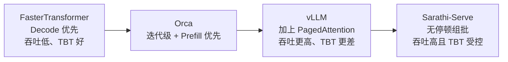
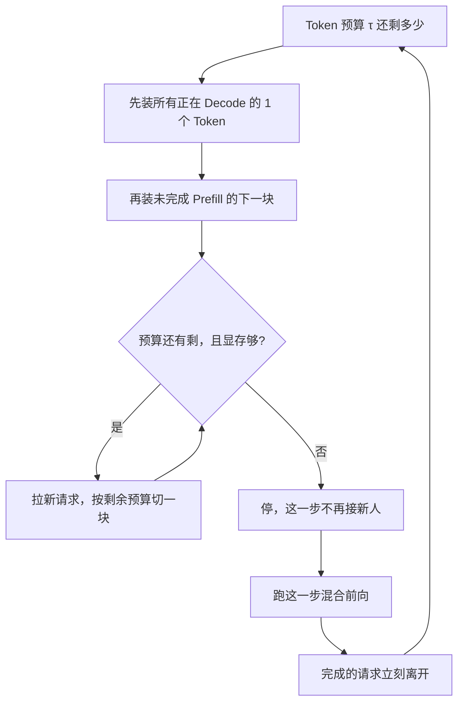

# Sarathi-Serve：把 Prefill 切开，正在吐字的 Decode 才不用停

<!-- release-date: 2024-03-04 -->

> 本文依据 Microsoft Research India 的 **Taming Throughput-Latency Tradeoff in LLM Inference with Sarathi-Serve**，即 arXiv:2403.02310v3（2024-06-17），共 18 页。OSDI 2024。截至核验 arXiv 最新是 v3。页码均指这份 PDF。全文把三件事分开标注：**报告明确写了什么**、**我们如何解释或验算它**、**哪些是外部资料补充**。
>
> 封面水印为 `arXiv:2403.02310v3 [cs.LG] 17 Jun 2024`。作者是 Amey Agrawal（Georgia Tech，文中注明部分工作在 MSR India 实习期间完成）、Nitin Kedia、Ashish Panwar、Jayashree Mohan、Nipun Kwatra、Bhargav S. Gulavani、Alexey Tumanov、Ramachandran Ramjee。单位是 Microsoft Research India 与 Georgia Institute of Technology。按主要归属，目录放在 Microsoft。正式发表于 OSDI 2024（Santa Clara），USENIX 版页码 117–134，ISBN 978-1-939133-40-3。本地 PDF 是 arXiv v3，页码从 1 编到 18，**不是** 117–134。
>
> 动笔前核过 arXiv 提交历史：v1（2024-03-04，412 KB）、v2（2024-06-12，1,714 KB）、v3（2024-06-17，1,714 KB）。本地件与官方最新版一致，未做替换。v1 摘要把 Falcon-180B 的收益写成相对 Orca 与 vLLM「最多 6.9×」，v3 改成带流水线并行时「最多 5.6×」，并补上 Yi-34B 相对 vLLM「最多 3.7×」。本文一律用 v3。
>
> `release-date` 取 **2024-03-04**。这是一篇系统论文，对象从未作为产品对外可用，按「Sarathi-Serve / 代码首次官方公开日与 arXiv v1 中较早者」取值。arXiv v1 于 2024-03-04 18:47:08 UTC 公开。GitHub [`microsoft/sarathi-serve`](https://github.com/microsoft/sarathi-serve) 的 `created_at` 是 2023-11-02，但当天只有 Microsoft 开源模板；真正代码出现在 2023-11-04 的 `Initial commit (#1)`。仓库里 2024-05-08 还有一次标题为「Prepare for open-source release (#5)」的提交，说明代码面向公众可用不早于这一天，晚于 arXiv v1。v3 修订日与 OSDI 开会日都不用于回写。

## 读前先认识几个词

这篇论文的门槛不在公式，在于它同时用了 GPU 算子和在线服务两套词汇。先把最常出现的说清楚。其中前四个是通用背景，不全是报告自己定义的。

- **Token（词元）**：模型读写文本的最小单位。一个英文单词、一个汉字、一个标点，都可能被切成一个或多个 Token。
- **Prefill（预填充）**：一次请求的第一段。把整段提示词一次性喂进去，算出所有位置的中间结果，并吐出第一个输出 Token。
- **Decode（解码）**：第一段之后的自回归生成。每一步只吃上一个刚生成的 Token，再吐出下一个，直到结束符。
- **KV Cache（键值缓存）**：每个已经处理过的 Token 留下的 Key 和 Value 向量。Decode 每一步都要回看全部历史，所以这些向量被留在显存里，不必每步重算。分页怎么管它，是另一篇的事，见 [PagedAttention](/reports/Berkeley/PagedAttention)。
- **TBT（Time Between Tokens，相邻 Token 间隔）**：同一条请求里，相邻两个输出 Token 之间的时间。报告用这个词衡量「字吐得顺不顺」。它和知识库里的 ITL 是同一件事；工程上有的工具把 ITL 当成均值，看报告前先确认口径。
- **TTFT（Time To First Token，首 Token 延迟）**：请求到达，到第一个输出 Token 出现。报告取中位数。
- **Capacity（服务容量）**：在给定延迟目标下，系统能持续扛住的最大到达率，单位是每秒查询数。报告用它当吞吐指标。
- **Token budget（Token 预算）**：每一步最多允许进入计算的 Token 总数。它是这篇调度器唯一的核心旋钮。
- **Generation stall（生成停顿）**：正在 Decode 的请求，被新来的整段 Prefill 堵住，输出流突然停住。这是本文要消灭的现象。
- **Pipeline bubble（流水线气泡）**：流水线并行里，后一级在等前一级。GPU 空转的那段时间就是气泡。

如果你只想记一句话：

> **Prefill 吃算力、Decode 吃带宽。整段 Prefill 插进正在吐字的批次，字就会停。把 Prefill 切成小块，每步先保证 Decode 继续走，再用剩下的预算捎一块 Prefill，吞吐和尾延迟才能同时要。**

## 一句话先说清

Sarathi-Serve 的主张只有一句：**不要把「读完提示词」当成一次不可打断的计算，把它切成块，让正在生成的请求每一步都能继续吐字。**

它不是新的注意力算法，也不是新的显存分配器。它是一个调度器。报告把它拆成两招（PDF p. 2–3）：

- **Chunked-prefills（分块预填充）**：把一条长 Prefill 沿序列维切成计算量接近的块，分多步算完。
- **Stall-free batching（无停顿组批）**：每一步先装进所有正在 Decode 的 Token，再续算未完成的 Prefill 块，最后才用剩余预算接新请求。

两招合在一起，每步的计算量被一个 Token 预算卡住，于是单步耗时几乎不再取决于提示词有多长（PDF p. 3）。大批次因此用得起来，尾延迟却不会跟着爆。均匀的批次还会把流水线并行里的气泡压下去。

它明确不解决的问题也要先说清：KV Cache 怎么分页、怎么共享，报告直接建在 vLLM 之上（PDF p. 9–10）。那些事先已经由 [PagedAttention](/reports/Berkeley/PagedAttention) 讲过，本文不重写。

## 报告地图：18 页里各写了什么

先摊开篇幅。这是一篇调度论文，没有模型配方，也没有训练。密度最高的是第 3 节的矛盾和第 4 节的两招。

| 报告章节 | PDF 页 | 讲了什么 | 密度 |
|---|---|---|---|
| 标题、摘要、图 1 | p. 1 | 2.6× / 3.7× / 5.6×；生成停顿与尾延迟 | 高 |
| §1 引言 + 图 2 | p. 2 | Prefill 优先 vs Decode 优先；Sarathi-Serve 的位置 | 高 |
| 贡献清单 + §2.1–2.2 | p. 3 | 硬件配置预告；Transformer 与两阶段推理 | 中 |
| 算法 1–2 + §2.3–2.5 | p. 4 | 请求级 / 迭代级调度；TTFT、TBT、Capacity | 高 |
| 图 3–4 + §3.1 | p. 5 | Prefill 算力饱和、Decode 几乎线性吃批；线性层占大头 | 高 |
| 图 5–7 + §3.2 | p. 6 | 算术强度；生成停顿的时间线 | 高 |
| 图 8 + §3.3–§4.1 起 | p. 7 | 三类流水线气泡；分块预填充的动机 | 高 |
| 图 9 + §4.1–4.2 | p. 8 | 整段混批最多 28.3×；无停顿组批 | 高 |
| 算法 3 + §4.3–4.4 | p. 9 | 先 Decode 再续 Prefill 再接新请求；Token 预算；实现 | 高 |
| 表 1–3 + §5 起 | p. 10 | 模型、数据集、SLO；评测问题 | 高 |
| 图 10–11 + §5.1–5.2 起 | p. 11 | 容量对照；Token 预算 512 / 2048 / 1536 | 高 |
| 图 12–13 + §5.2–5.3 | p. 12 | 拧预算就能走吞吐–延迟曲线；跨节点 TP 不行 | 高 |
| 图 14 + 表 4 + §5.4 + §6 | p. 13 | 切块开销；两招必须一起用；与 PD 分离的关系 | 高 |
| §6 后半 + §7 | p. 14 | 正交工作；结论再报 2.6× 与 5.6× | 中 |
| 参考文献 + 附录 A | p. 15–18 | 引用；产物说明，代码是 vLLM 的研究分支 | 低 |

## 先看矛盾：GPU 同时被两件相反的事占用

一次请求被切成两段，分界线是第一个输出 Token（PDF p. 3）。

Prefill 把整段提示词并行算完。提示词常见是几百到几千 Token（PDF p. 3），矩阵乘的行数够大，Tensor Core 吃得饱。Decode 每一步只进 1 个 Token，却要把整份权重从显存搬一遍。算术强度极低，GPU 大部分时间在等数据。

报告用 Mistral-7B、单张 A100、提示词长度 1024 把这件事画出来（PDF p. 5、图 3）。纵轴刻度都不一样：Prefill 的吞吐已经到每秒数千 Token，Decode 即使批到 64 也还在每秒几百。更关键的是形状：

- Prefill：批从 1 加到 8，柱子几乎不再长。单条请求已经打满算力。
- Decode：批从 1 加到 64，柱子近似按比例往上走。批越大，搬权重的成本摊得越薄。

**Takeaway-1** 把这句写成原则：批处理极大提升 Decode 吞吐，对 Prefill 几乎没帮助（PDF p. 5）。

时间花在哪？图 4 把一次前向拆成线性层、注意力、其他（PDF p. 5）。两边都是线性层占大头。注意力随序列长度平方涨，但即便序列已经很长，线性层仍贡献总时间的 80% 以上（PDF p. 5）。所以报告后文的算术强度分析，对准的是线性层，不是注意力。

图 4 还给出一个非常好用的换算（PDF p. 5）：Decode 批次里，**1 个 Decode Token 的线性层成本，差不多等于 128 个 Prefill Token**。意思是：Decode 正在等内存的时候，GPU 的计算单元几乎闲着。顺手塞进一小块 Prefill，并不会把这一步的时间拉长多少。

我们把这个观察翻译成人话：旧系统把 Prefill 和 Decode 当成「同一类前向」，只是 Token 数不同。报告证明它们不是同一类——一个已经算力饱和，一个还在访存墙左边。后面所有调度设计，都从这个不对称出发。

## 第二层矛盾：批得越大，字吐得越卡

Decode 要大批，才能摊薄权重读取。可是线上请求是陆续到达的。新请求进来的第一件事是 Prefill。于是大批次必然意味着：有的请求在吐字，有的请求在读提示词，两件事挤在同一张 GPU 上。

报告把现有调度器分成两类（PDF p. 2、图 2）。图 2 是示意，不是实测坐标，图注自己写了这一点。

这是根据论文图 2 重画的**机制示意**（PDF p. 2），点的相对位置按原文「吞吐向上、TBT 向右变差」来排，不是实验数据。

**Decode 优先**的代表是 FasterTransformer 这类请求级批处理（PDF p. 2、p. 4、算法 1）：凑一批，先把这批的 Prefill 全部算完，再 Decode，直到这批里最后一条请求结束，才接新请求。正在吐字的人不会被新人打断，所以 TBT 好。代价是：有人先结束了，批次变瘦，GPU 继续用小批空转，吞吐上不去。vLLM 那篇论文已经测过，迭代级调度加分页，吞吐能比 FasterTransformer 高一个数量级（PDF p. 7 转引）。

**Prefill 优先**的代表是 Orca 和报告评测时的 vLLM（PDF p. 2、p. 4、算法 2）：调度粒度改成一步前向。每一步结束，做完的请求立刻离开，显存一有空就急着把新请求的整段 Prefill 塞进来。后续 Decode 的批次更满，吞吐上去了。代价是：一条几千 Token 的 Prefill 可能跑好几秒，这段时间里所有正在 Decode 的请求都必须停。

报告给这个现象起名叫 **generation stall（生成停顿）**（PDF p. 2）。图 1a 是 Yi-34B、两张 A100、128 条来自 arxiv-summarisation 的请求（PDF p. 1）。vLLM 的「已生成 Token 数」曲线在大约 200 秒附近出现一段平台，持续数秒；Sarathi-Serve 同一段是平滑上升。图 1b 把负载从 0.55 加到 1.0 QPS：纵轴最高刻度是 1.25 秒，vLLM 在 1.0 QPS 的柱子顶到这个刻度附近，Sarathi-Serve 的柱子几乎不动。这两个柱高是读自图 1b，正文没有写出精确秒数。

这就是标题里的取舍：旧系统要么保 TBT 丢吞吐，要么保吞吐丢 TBT。Sarathi-Serve 要的是图 2 左上角那颗星。

有一个容易读错的地方，必须按报告原文钉死（PDF p. 6）：**报告评测时的 vLLM，一步里要么全是 Prefill，要么全是 Decode，不做混合批次。** Orca 可以混合，但混合的是「整段 Prefill + Decode」，长提示词照样把这一步撑到数秒。今天的 vLLM 已经不是这个实现，后文「论文之后」会分开写。这里只讲 2024 年这篇 PDF 里的对照系统。

## 算术强度：Decode 的空闲算力，刚好是 Prefill 的缝

报告把一次线性层的时间写成（PDF p. 5）：

$$
T = \max(T_{\mathrm{math}}, T_{\mathrm{mem}})
$$

$T_{\mathrm{math}}$ 是算的时间，$T_{\mathrm{mem}}$ 是从显存搬权重的时间。谁大，谁就是墙。两者相等时，算力和带宽同时用满。算术强度就是「每从显存搬 1 字节，能做多少次浮点运算」。设备有一个 FLOPS-to-bandwidth 比值；强度对上这个比值，就是甜点。

图 5 画的是 LLaMA2-70B 线性层、四张 A100（PDF p. 6）。横轴是批次里的 Token 数：

- Decode 落在左下角红色区：访存受限，MFU（Model FLOPs Utilization，模型浮点利用率）低。
- Prefill 落在右上角蓝色区：算力受限，MBU（Model Bandwidth Utilization，模型带宽利用率）低。
- 中间有一条绿色带，报告标成「Balanced - Sarathi-Serve」。

图 6 把同一件事换成时间（PDF p. 6）。Token 少的时候，时间几乎不涨——反正都在等权重搬完。Token 跨过一道门槛之后，时间才随 Token 数线性上升。脚注 2 说：理论上 A100 大约 200 个 Token 就该进入算力受限；更高的张量并行度下，因为固定开销，实测大约要 500–600 个 Token（PDF p. 6）。

**Takeaway-2**（PDF p. 6）：Decode 批次停在访存受限区，计算单元没吃饱。这意味着可以在几乎不增加延迟的前提下，往这个批次里再塞 Token。

我们补一句解释，不是报告原话：这就是「切开 Prefill」在物理上成立的原因。切出来的块只要落在那条绿色带附近，它吃的是 Decode 本来就浪费的算力，不是 Decode 正在等的带宽。块太大，会冲进蓝色区，这一步又变成「等计算」，TBT 重新恶化。Token 预算要拧的，就是这块的大小。

## 生成停顿的时间线：四种调度到底差在哪

图 7 用 A、B、C、D 四条请求把四种策略画在同一条时间轴上（PDF p. 6）。开始时 A、B 已经在 Decode。走了一步，C、D 到达。下标 $d$ 是 Decode，$p$ 是整段 Prefill，$p1$/$p2$ 是切出来的块。

```mermaid
flowchart TB
    subgraph vllm [vLLM：Prefill 优先]
        V1["A_d B_d"] --> V2["C 整段 Prefill"] --> V3["D 整段 Prefill"] --> V4["A_d B_d C_d D_d"]
    end
    subgraph orca [Orca：混合，但仍是整段]
        O1["A_d B_d"] --> O2["C_p D_p 加上 A_d B_d"] --> O3["A_d B_d C_d D_d"]
    end
    subgraph ft [FasterTransformer：Decode 优先]
        F1["A_d B_d 反复"] --> F2["A 结束"] --> F3["B 结束"] --> F4["才开始 C_p D_p"]
    end
    subgraph ss [Sarathi-Serve：无停顿]
        S1["A_d B_d"] --> S2["A_d B_d + C 的第 1 块"] --> S3["A_d B_d + C 的第 2 块"] --> S4["B_d C_d + D 的第 1 块"]
    end
```

这是根据论文图 7 重画的**机制示意**（PDF p. 6），不是实测时间。原文用色块长度表示停顿，这里用箭头顺序表达同一件事。

四条路的失败和成功都很具体（PDF p. 6–7）：

| 系统 | 这一步装什么 | A、B 的字会不会停 | C、D 的首字会不会被拖 | 吞吐 |
|---|---|---|---|---|
| vLLM | 先把能塞的 Prefill 全部跑完，再恢复 Decode | 会。停顿长度等于整段 Prefill | 首字快 | 高，但 TBT 爆 |
| Orca | 整段 Prefill 和 Decode 混在一步 | 仍会。一步耗时仍由最长 Prefill 决定 | 首字快 | 高，TBT 同样爆 |
| FasterTransformer | 先把 A、B Decode 到结束 | 不会 | 会。C、D 要等 A、B 全部结束 | 低 |
| Sarathi-Serve | Decode 加上 C 的一小块 | 不会停，只是每步稍慢一点 | 首字被切成多步，TTFT 略差 | 高，且 TBT 受控 |

**Takeaway-3**（PDF p. 7）：Prefill 和 Decode 交错，本身就是吞吐与延迟的取舍。当时的先进系统选了 Prefill 优先，用 TBT 换吞吐。

Orca 论文建议用更小的批来压延迟尖刺（PDF p. 7）。报告立刻反驳：§2.2 已经说明，减小 Decode 批会直接打吞吐。所以旧系统是被逼着在两条轴上做单选题。

## Chunked-prefills：切多大，才既打满算力又不堵住 Decode

动机已经清楚了。做法是把一条长 Prefill 切成多块，分多步算（PDF p. 7–8）。报告给了两个支撑这个切法的事实：

1. Prefill 并不需要整段提示词才能打满 GPU。图 4 里，序列长度到大约 512，Prefill 吞吐就开始饱和（PDF p. 8）。
2. 真实提示词往往比 512 长得多。表 2 里，openchat_sharegpt4 的提示词中位数是 1730，arxiv_summarization 是 7059（PDF p. 8、p. 10）。

所以存在一个窗口：块大到还能打满算力，又小到不会把 Decode 的 TBT 拉爆。Sarathi-Serve 要做的，就是让每一步的 Token 数落在这个窗口里。

只切块还不够。如果把「未切开的整段 Prefill」直接和 Decode 混在一步——这就是 Orca 的混合批——TBT 仍然会炸。图 9 把这件事量化了（PDF p. 8）。每组三根柱：Decode-only、Decode + Chunked Prefill、Decode + Full Prefill，数字是相对 Decode-only 的倍数。

Mistral-7B、单张 A100、Token 预算 256（PDF p. 8、图 9a）：

| 上下文 | 批大小 | 切块混批 | 整段混批 |
|---|---:|---:|---:|
| 1024 | 1 | 1.8× | 5.7× |
| 1024 | 64 | 1.2× | 2.8× |
| 4096 | 1 | 2.0× | 20.3× |
| 4096 | 64 | 1.2× | 5.1× |

LLaMA2-70B、四张 A100、Token 预算 512（PDF p. 8、图 9b）：

| 上下文 | 批大小 | 切块混批 | 整段混批 |
|---|---:|---:|---:|
| 1024 | 1 | 3.6× | 7.1× |
| 4096 | 1 | 3.7× | **28.3×** |
| 4096 | 64 | 1.9× | 10.6× |

28.3× 是正文点名的那个数字（PDF p. 8）：朴素混合批可以把 TBT 相对纯 Decode 拉高到 28.3 倍。切块之后，同样设置大约 3.7 倍。Decode 批越大、上下文越长，切块相对整段的优势越明显——因为 Decode 自己已经更接近算力墙，能吸收的额外 Prefill 更少，整段混进去就越亏。

切块不是免费的。注意力对每个块都要读这个提示词里**已经算完的所有前块**的 KV（PDF p. 9）。一条 Prefill 切成 $N$ 块，第 1 块的 KV 会被再读 $N-1$ 次，第 2 块 $N-2$ 次，以此类推。计算量没变，HBM 读变多了。报告的判断是：即便块很小，Prefill 注意力仍是算力受限，所以这份额外读取通常不是主因；真正看得到的开销，更多来自内核启动一类的固定成本（PDF p. 9）。§5.4 会给出端到端数字。

## Stall-free：每一步的装批顺序，比「要不要切」更重要

分块解决的是「一块有多大」。无停顿组批解决的是「这一步先装谁」（PDF p. 8–9、算法 3）。顺序是写死的：

1. 先把所有正在 Decode 的请求各装 1 个 Token（算法 3 第 6–8 行）。
2. 再装任何**还没 Prefill 完**的请求的下一块（第 9–12 行）。
3. 只有这两类都装完、预算还有剩，才从等待队列拉新请求，并且新请求也按剩余预算切块（第 13–20 行）。
4. 跑混合批次，踢掉已结束的，Token 计数清零，进入下一步。

这是根据论文算法 3 重画的**机制示意**（PDF p. 9），不含实测时间。

这个顺序的含义，比「混合批」三个字要硬得多。它保证：

- 已经在吐字的请求，每一步都会被调度。新来的长提示词不能把它们挤停。
- 一条 Prefill 一旦开切，会优先于更新的请求被续完。不会在半路被另一条新 Prefill 插队，造成一堆半成品同时占着 KV。
- 每一步的 Token 总数被 $\tau$ 卡住，单步耗时有上限，而且几乎不再取决于提示词全长（PDF p. 3）。

对照图 7 的例子（PDF p. 8–9）：C 到达之后，它的 Prefill 被切成两块，分别和 A、B 的 Decode 走两步。A 在第二块期间结束。D 要等 C 的 Prefill 告一段落、预算有空，才开始自己的第一块。谁都没有被整段卡住。

报告把前作 SARATHI 的做法叫 decode-maximal batching：一步里放一块 Prefill，剩下的坑用 Decode 填满。Sarathi-Serve 把同一套切块，嵌进在线服务的迭代级调度，并且把「先 Decode、再续 Prefill、最后接新请求」写成明确的准入顺序。v1 摘要还写「inspired by the techniques we originally proposed for optimizing throughput in Sarathi」；v3 摘要删了这句，但参考文献仍列着 2023 年那篇 [SARATHI](https://arxiv.org/abs/2308.16369)（PDF p. 16、文献 [29]）。前作测的是离线吞吐（LLaMA-13B / A6000 上 Decode 吞吐最多 10×、端到端最多 1.33×），本篇改测带 SLO 的在线容量。两篇不要混成一篇。

可迁移的那一点：**混合批的收益来自「Decode 的空闲算力」，混合批的危害来自「Prefill 没有上限」。** 所以真正要锁的不是「可不可以混」，而是「混进去的 Prefill 谁说了算」。Token 预算就是那条锁。

## Token 预算：把 TBT SLO 拧成每步能塞多少 Token

$\tau$ 不是魔法数字。§4.3 把它写成两股力的平衡（PDF p. 9）：

- 往小拧：每步 Prefill Token 少，TBT 更好，更不容易进算力受限区。
- 往大拧：切得份数少，固定开销和重复读 KV 都更轻，Prefill 效率更高，TTFT 更好。

还有两个报告点名的暗坑。

**Tile quantization（分块量化效应）**（PDF p. 9）。GPU 做矩阵乘时按固定 tile 切，thread block 的算术量相同。矩阵维度不能被 tile 整除时，有的 block 在做无效计算。报告给的例子：块大小 257 相对 256，有时能让 Prefill 时间增加 32%。所以预算不能只按 SLO 算，还要对齐硬件的 tile。

**流水线并行**（PDF p. 9）。块越大，步与步之间的耗时差越大，气泡越多。块太小，算术强度又掉下去，固定开销占比上升。跨节点部署时，这个旋钮同时管 TBT 和气泡。

报告的操作建议是一次性 profile 不同 Token 数的批次，把 $\tau$ 设成「不超过 TBT SLO 的最大 Token 数」（PDF p. 9）。他们实际用 [Vidur](https://arxiv.org/abs/2405.05465) 这个 LLM 推理模拟器，在具体模型、并行度和硬件上搜这个值（PDF p. 9）。评测里的取值写在 §5.1（PDF p. 11）：

| 场景 | Token 预算 |
|---|---:|
| 严格 SLO，除 LLaMA2-70B 宽松档以外的默认 | 512 |
| 宽松 SLO，多数模型 | 2048 |
| LLaMA2-70B 宽松 SLO | 1536，专门用来压气泡 |

严格档把提示词切得更碎，系统效率略降，换更低的尾延迟；宽松档加大预算，Prefill 更高效（PDF p. 11）。报告自己说，按负载动态改预算会更好，留给未来工作（PDF p. 11）。

对我们自己的系统，这条旋钮的用法很直接：先定 P99 TBT 能接受多少毫秒，再 profile「纯 Decode + $k$ 个 Prefill Token」的耗时曲线，把 $k$ 停在 SLO 以下、且尽量落在 tile 对齐的点上。不要从别的模型抄 512 或 2048。

## 流水线气泡：步与步不均匀，跨节点就空转

张量并行（TP）把每一层切到多张卡，靠 NVLink 做两次 all-reduce。节点内部可以，跨节点延迟会高到难以接受（PDF p. 2、p. 4）。流水线并行（PP）按层切开，微批在级间点对点传递，通信少，适合普通以太网。代价是气泡：后一级必须等前一级的微批算完。

训练里的气泡，大家熟悉：前向和反向之间的空档，用微批去填。推理只有前向，按理说微批就该把气泡填平。Orca 论文甚至认为迭代级调度能消除流水线气泡（PDF p. 7，指向 Orca 的图 8）。报告说实验不是这样（PDF p. 7、§5.3）。

原因是 LLM 每一步的计算量根本不稳定。图 8 画的是两级流水线、四条请求（PDF p. 7）。Orca 的时间线上，GPU0 跑完一段很长的 Prefill，GPU1 才能开始；下一段又突然变成短 Decode，前一级已经做完，后一级还在消化刚才那块。Sarathi-Serve 把每步都切成相近的计算量，两级的色块几乎齐头并进，气泡缩成窄缝。

报告点名三类气泡（PDF p. 7）：

1. **PB1**：相邻两步的 Prefill Token 数不同。
2. **PB2**：一步是 Prefill、下一步是 Decode，两边耗时差一截。
3. **PB3**：同是 Decode，注意力成本随 KV 变长而变，步与步仍不均匀。

量化例子针对 Falcon-180B（PDF p. 7）：一条 4k 提示词的 Prefill 大约 1150 ms，批大小 32 的纯 Decode 大约 200 ms，交错一次就会留下大约 950 ms 的气泡。提示词越长、批次越大，Prefill 越长、越频繁，气泡越严重。

**Takeaway-4**（PDF p. 7）：LLM 一步的计算量随 Prefill / Decode 组成剧烈变化。这个方差在流水线并行里会变成实打实的吞吐损失。

均匀批次因此有两层意义。单机上，它把 TBT 的尖刺削平。跨节点上，它让微批耗时接近，PP 才用得起来。§5.3 会证明：没有切块，PP 在严格 SLO 下几乎没有容量；有了切块，跨以太网部署 Falcon-180B 才可行。

## 实现边界：建在 vLLM 之上，不重做分页

§4.4 很短，但边界清楚（PDF p. 9–10）：

- 代码从开源 vLLM 长出来。
- 分页的分块 Prefill 用 FlashAttention v2 和 FlashInfer 两套内核做成。评测全部走 FlashAttention，因为它支持的模型更广。
- 额外加了多种调度策略、分块 Prefill、流水线并行和一套遥测。
- TP 和 PP 的通信都走 NCCL。
- 仓库是 [`https://github.com/microsoft/sarathi-serve`](https://github.com/microsoft/sarathi-serve)。

附录 A 把话说得更直（PDF p. 18）：这是 vLLM 的研究分支，**没有和当时的开源 vLLM 做完整功能对等**，只留了最快迭代研究所需的部分。封面有 USENIX 的 Available / Functional / Reproduced 三枚产物徽章。

所以这篇论文的新东西停在调度层。块表、物理块、写时复制，都是底座，不是贡献。读本文时不要倒回去讲分页；读 [PagedAttention](/reports/Berkeley/PagedAttention) 时也不要把切块 Prefill 算进 2023 年那篇的内容——那篇明确没有讨论它。

## 评测：先把每个倍数的分母写清楚

摘要里的 2.6×、3.7×、5.6× 被引用最多。它们都有非常具体的分母。先把实验台摆出来。

**模型与硬件**（PDF p. 10、表 1）：

| 模型 | 注意力 | GPU | 总显存（每卡） |
|---|---|---|---|
| Mistral-7B | GQA + 滑窗 | 1×A100 | 80 GB（80） |
| Yi-34B | GQA | 2×A100，TP2 | 160 GB（80） |
| LLaMA2-70B | GQA | 8×A40，TP4-PP2 | 384 GB（48） |
| Falcon-180B | GQA | 2 节点 × 4×A100，TP4-PP2 | 640 GB（80） |

除 LLaMA2-70B 外，机器是 Azure NC96ads v4：4 张 80 GB A100，卡间 pairwise NVLink，机间 100 Gbps 以太网。LLaMA2-70B 用 8 张 pairwise 连接的 48 GB A40（PDF p. 10）。

**负载**（PDF p. 10、表 2）。长度来自两个公开数据集，到达时间用泊松过程合成：

| 数据集 | 提示词中位数 / P90 | 输出中位数 / P90 | 报告怎么看它 |
|---|---|---|---|
| openchat_sharegpt4 | 1730 / 5696 | 415 / 834 | 多轮对话，提示词方差大 |
| arxiv_summarization | 7059 / 12985 | 208 / 371 | 长文档摘要，接近 Copilot 一类工作负载 |

过滤规则：openchat 丢掉总长超过 8192 的请求，arxiv 丢掉超过 16384 的（PDF p. 10）。

**指标**（PDF p. 4、p. 10）：TTFT 取中位数，因为一条请求只产生一次；TBT 取 P99，因为每个输出 Token 都产生一个间隔。容量是「还能满足延迟目标的最大 QPS」。可持续的判定还包括：中位数调度延迟不超过 2 秒，避免排队把数字撑爆（PDF p. 10）。

**SLO 怎么定**（PDF p. 10、表 3）。报告跟 Splitwise 一样，按「这条模型在这套硬件上、4k Prefill、批 32、没有 Prefill 干扰时，一步 Decode 要多久」来标定：严格档是它的 5 倍，宽松档是 25 倍。绝对值是：

| 模型 | 宽松 P99 TBT | 严格 P99 TBT |
|---|---:|---:|
| Mistral-7B | 0.5 s | 0.1 s |
| Yi-34B | 1 s | 0.2 s |
| LLaMA2-70B | 5 s | 1 s |
| Falcon-180B | 5 s | 1 s |

严格档对应聊天这类交互；宽松档对应「整段输出要在可预期时间内结束，但不苛求每个字的间隔」（PDF p. 10）。

对照系统是 Orca 和当时的 vLLM。Orca 没有 PagedAttention，一步里会把多条提示词整段拼在一起，激活显存更大，能同时跑的批更小（PDF p. 11）。

### 容量：摘要三个数，从图里还能读出对照对象

图 10、图 11 的柱上倍数，正文解释为相对 Orca；相对 vLLM 的数字写在段落里（PDF p. 11）。

Yi-34B、openchat、严格 SLO：相对 Orca 最多 4.0×，相对 vLLM 3.7×（PDF p. 11）。这就是摘要「最多 3.7×」（PDF p. 1）的出处。

Mistral-7B 摘要写相对 vLLM 2.6×（PDF p. 1、p. 3、p. 14）。图 10a 在 openchat 严格档标了 2.78×，那是相对 Orca 的柱上标签。两个数不要混。

带流水线的大模型（PDF p. 11、图 11a，openchat）：

| 模型 | 相对 Orca（图上标签） | 正文补充 |
|---|---|---|
| LLaMA2-70B 严格 | 5.54× | 最多 6.3× vs Orca、4.3× vs vLLM |
| LLaMA2-70B 宽松 | 6.31× | 同上，宽松档的 6.3× |
| Falcon-180B 严格 | 4.69× | — |
| Falcon-180B 宽松 | 5.62× | 摘要「最多 5.6×」 |

arxiv 这组提示词更长（中位数 7059 vs 1730），所有系统的绝对容量都更低，倍数也普遍更小（PDF p. 11、图 10b / 11b）。更长的 Prefill 让 Orca 和 vLLM 更容易撞上 TBT SLO。

报告还观察到：多数场景里，Orca 和 vLLM 在还没走到自己的吞吐上限之前，就已经违反 P99 TBT（PDF p. 11）。所以放宽 SLO，它们的容量会明显上升。Sarathi-Serve 不是靠放宽 SLO，而是靠把预算从 512 拧到 2048，在同一套 SLO 语言里换档。

### 拧预算，就能走那条吞吐–延迟曲线

图 12 把 P99 TBT SLO 当成横轴，容量当成纵轴（PDF p. 12）。负载是 openchat。vLLM 试了最大批 32 / 64 / 128 三档，这是 Orca 论文建议的「用批大小换延迟」的做法。三条 vLLM 曲线几乎贴在一起：生成停顿在严格 SLO 下把容量封死了。分页让更大的批在显存上装得下，但 Prefill 优先的调度用不了这个批。

Sarathi-Serve 走另一条路：最大批固定 128，只改预算。512 对应严格档，2048 对应宽松档。正文给出两个锚点（PDF p. 12）：

- Mistral-7B、严格 SLO 100 ms、预算 512：相对 vLLM **3.5×** 容量。
- Yi-34B、宽松 SLO 1 s、预算 2048：相对 vLLM **1.65×**。
- 图注另写：Yi-34B 在严格 SLO 下，无停顿组批给出 **3.5×** 容量。

我们读图 12 的形状：vLLM 的曲线平，Sarathi-Serve 的曲线随 SLO 放松往上走。意思是，旧系统几乎没有「用一点延迟换一点吞吐」的中间档；新系统的中间档就是 Token 预算。

### 跨节点：纯 TP 的 TBT 已经不可用，PP 要靠切块才活

Falcon-180B，两台 4×A100，100 Gbps 以太网（PDF p. 12）。三种部署：vLLM 的 8 路 TP；vLLM 加上报告实现的 PP（节点内 TP4、节点间 PP2）；Sarathi-Serve 同样的 TP4-PP2。

图 13a：纯 Decode 批次的中位 TBT。跨节点 TP 比「节点内 TP + 节点间 PP」高大约 2×，因为 all-reduce 要穿以太网（PDF p. 12）。图 13b：即便宽松 SLO，vLLM 的纯 TP 容量仍然低，延迟本身就不达标。vLLM 的混合并行在宽松档还能扛负载，一进严格档就因为气泡掉下去。Sarathi-Serve 用切块把微批耗时抹平，相对 vLLM 的混合并行：宽松档容量 1.48×，严格档 3.6×（PDF p. 12）。图注把严格档写成：相对 vLLM 纯 TP 4.3×，相对其混合并行 3.6×（PDF p. 12）。

一句话：分页解决「显存里能不能装大批」；切块解决「大批在跨节点时会不会把延迟和气泡一起炸掉」。两件事叠在同一条服务链上，缺一不可，但不是同一篇论文的贡献。

## 消融：两招拆开都是偏科，合在一起才同时压 TTFT 和 TBT

图 14 只问切块对 Prefill 自己有多贵（PDF p. 13）。Yi-34B、TP2，纵轴是相对「一次算完整段」的开销。块 512 时，最长大约 25%；块 2048 时，开销几乎看不见。提示词从 2k 到 8k，趋势一致：块越小越贵。这 25% 是 TTFT 变差的物理来源——切成 $k$ 步，每步还略慢于「$1/k$ 段一次算完」。

表 4 把两招拆开跑（PDF p. 13）。Yi-34B、两张 A100、预算 1024、128 条请求，单位秒：

| 调度 | openchat P50 TTFT | openchat P99 TBT | arxiv P50 TTFT | arxiv P99 TBT |
|---|---:|---:|---:|---:|
| 只做混合批，不切块 | 0.53 | 0.68 | 3.78 | 1.38 |
| 只切块，不和 Decode 混 | 1.04 | 0.17 | 5.38 | 0.20 |
| 两招一起 | 0.76 | 0.14 | 3.90 | 0.17 |

因果链写在正文里（PDF p. 13）：

- 只切不混：Decode 不再被整段 Prefill 堵住，TBT 好；但 Prefill 块自己效率略差，又没有 Decode 帮忙填满步，TTFT 变差。
- 只混不切：Prefill 可以和 Decode 共享一步，TTFT 好；长 Prefill 仍会制造生成停顿，TBT 差。
- 一起用：TTFT 介于两者之间，TBT 是三档里最好的。

对自己的项目，这张表比摘要倍数更有用。它说明「chunked prefill」四个字不够——必须同时规定混合顺序和预算。只开切块、仍按 Prefill 优先调度，得到的是表 4 第二行，首字会变慢。只混合、不切块，得到的是第一行，字会停。

## 论文怎么看 PD 分离，以及它明确没比的东西

§6 把 Splitwise、DistServe、TetriInfer 单列成第三类：把 Prefill 和 Decode 拆到不同副本（PDF p. 2 脚注 1、p. 13）。报告承认这条路能**彻底消掉**两阶段互相干扰，并且 Prefill 可以按最高效率整段算，TTFT 往往更好（PDF p. 13）。它立刻列出代价：

- Prefill 结束要把这份 KV 迁到 Decode 副本；没有高带宽互连时，迁移本身就难。
- Prefill 副本的显存用不满——KV 主要堆在 Decode 侧。
- 切块 Prefill 比整段 Prefill 慢一截，这是换 TBT 稳定付出的 TTFT。

定量对比被明确写成未来工作（PDF p. 13）。所以本文不得把后来 Mooncake、DistServe 的数字读进这篇 PDF。

同一节还提到：公平性调度、FastServe 的抢占、APIServe 把切块 Prefill 拿去给多轮 API 做提前重算，都和本调度正交，可以叠加（PDF p. 13）。FlashAttention、通信重叠、MQA/GQA、量化、MoE，报告一律标成正交（PDF p. 13–14）。GQA 只作为实验模型的既成事实出现：LLaMA2-70B 的 KV 比 LLaMA-65B 小 8 倍（PDF p. 4），这让更大的 Decode 批在显存上装得下，但不是本篇的方法。

## 论文说了什么、没说什么

### 被实验支撑的结论

- 生成停顿是 Prefill 优先调度的结构性产物，不是负载偶发（PDF p. 1、p. 6–7）。
- 切块 + 无停顿组批，能在给定 P99 TBT 下提高容量。摘要三个数的分母分别是：Mistral-7B / 单 A100 / vs vLLM / 2.6×；Yi-34B / 两张 A100 / vs vLLM / 最多 3.7×；Falcon-180B / PP / 最多 5.6×（PDF p. 1、p. 11–12）。
- 朴素混合批最多把 TBT 相对纯 Decode 拉到 28.3×；切块后同一设置大约 3.7×（PDF p. 8）。
- 两招拆开都偏科，合在一起才同时压 TTFT 和 TBT（PDF p. 13、表 4）。
- 切块开销在预算 512 时最多约 25%，2048 时几乎可忽略（PDF p. 13）。
- 跨节点纯 TP 的 Decode TBT 大约是节点内 TP + 节点间 PP 的 2 倍；没有切块，PP 在严格 SLO 下用不满（PDF p. 12）。

### 只是作者观察、没有单独成表的

- 线性层即便在长序列下仍占 80% 以上时间（PDF p. 5）。这是图 4 的读图结论，没有在更多模型上铺开。
- 「1 个 Decode Token 的线性层 ≈ 128 个 Prefill Token」（PDF p. 5）。这是 Mistral-7B / 单 A100 的观察。
- 理论上 200 Token 进入算力受限、高 TP 下实测 500–600（PDF p. 6 脚注 2）。

### 报告自己承认的限制

- 动态按负载改 Token 预算，留给未来（PDF p. 11）。
- 与 PD 分离的定量对比，留给未来（PDF p. 13）。
- 产物是研究原型，功能不与当时的开源 vLLM 对等（PDF p. 18）。
- 到达过程是泊松合成的，数据集本身没有真实时间戳（PDF p. 10）。

### 论文根本没有涉及的东西

下面这些不要从今天的推理引擎倒推回去：

- KV 分页、前缀缓存、写时复制的新设计。底座沿用 vLLM。
- 投机解码、量化、MoE 路由与专家并行。
- 优先级、抢占、公平性的完整策略。只规定了装批顺序。
- Prefill 与 Decode 拆机部署的实现。只在相关工作里讨论。
- 内核内部怎么把分页注意力和切块 Prefill 融在一起。只说用了 FlashAttention v2 与 FlashInfer。
- 能耗、美元成本。容量是唯一的吞吐指标。

## 论文之后：切块进了 vLLM，PD 分离走了另一条路

**以下全部是外部资料补充，不是这篇 PDF 的内容。**

报告评测的 vLLM 一步里不同时混 Prefill 和 Decode（PDF p. 6）。大约一年之后，开源 vLLM 把切块 Prefill 做成可选项。官方文档 [v0.4.2 的 Performance and Tuning](https://docs.vllm.ai/en/v0.4.2/models/performance.html)（页面标注 2024-05-05）写明：默认调度仍是 Prefill 优先、不混批；打开 `enable_chunked_prefill` 之后，策略改成先 Decode，再用剩余的 `max_num_batched_tokens` 装 Prefill。当时默认预算是 512。这与算法 3 的顺序一致。配套说明见 vLLM 文档 PR [#4580](https://github.com/vllm-project/vllm/pull/4580)（2024-05-04 合并）。

再往后，V1 引擎把切块 Prefill 改成默认开启。本站知识库「连续批处理」已经按这个现状写过，这里不重写。需要记住的只有代际差：**论文里的 vLLM 是对照基线，今天的 vLLM 已经吸收了论文的调度。** 用 2026 年的 vLLM 去复现图 10，会得到完全不同的对照。

另一条路是 PD 分离。报告点名的 DistServe、Splitwise 后来和 Mooncake 一起，把「彻底拆开」做成大规模服务的主流形态。知识库「PD 分离」把切块 Prefill 定位成「把矛盾摊平，没有消除」：TBT 稳了，TTFT 略差，两阶段仍抢同一组 GPU。这与报告自己的表述一致（PDF p. 13），只是后来的系统把「未来工作」做成了产品。两条路可以并存：小集群、短提示词、没有高速互连时，切块混部更简单；大集群、长提示词、需要独立扩缩容时，拆机更干净。

前作 SARATHI（[arXiv:2308.16369](https://arxiv.org/abs/2308.16369)，2023-08-31）不要和本篇混用数字。那篇的 10× 是 A6000 上 LLaMA-13B 的 Decode 吞吐，1.33× 是端到端吞吐，没有在线 SLO，也没有 stall-free 这个名字。

## 和本站其他文章接起来

- 分页回答「KV 放得下多少请求」，本篇回答「放得下之后，新 Prefill 会不会把正在吐的字卡住」。先读 [PagedAttention](/reports/Berkeley/PagedAttention)，再读本文，战场不会重叠。
- 连续批处理、TBT/ITL 口径、Token 预算怎么调，知识库「连续批处理」「推理服务指标」已经按今天的引擎写过。本篇只负责 2024 年这份 PDF 当时证明了什么。
- 想彻底拿掉 Prefill 与 Decode 的互相踩踏，而不是把干扰切碎，走知识库「PD 分离」。报告自己把定量对比留给未来，后来的系统补了这一章。
- 开源解读模块里的 vLLM 讲的是**现在的代码**。本模块不引用仓库快照。两边数字对不上是设计如此。

## 能带走的六条

### 1. 先把两个阶段当成两种机器

报告最值得学的不是「切块」这个名词，是它先证明 Prefill 和 Decode 不是同一种负载（PDF p. 5–6）。一个算力饱和，一个访存受限。调度如果还拿「一步前向」一视同仁，就必然在吞吐和 TBT 里单选。

### 2. 干扰的粒度，决定尾延迟的粒度

整段 Prefill 是秒级干扰，切成 512 Token 的块是几十毫秒级干扰。用户感觉到的「卡一下」，对应的是 P99 TBT，不是平均吞吐。表 4 里只混不切的 P99 TBT 仍有 0.68–1.38 秒，只切不混则掉到 0.17–0.20 秒（PDF p. 13）。

### 3. 混合批要锁顺序，不能只锁开关

「能不能混」是开关，「先装谁」才是策略。算法 3 把 Decode、未完成 Prefill、新 Prefill 写成全序（PDF p. 9）。今天 vLLM 打开切块之后的调度顺序，就是这条全序的后代。自己写调度器时，先把这三行写成测试，再谈启发式。

### 4. 预算是 SLO 的编译结果，不是超参清单里的魔法数

512 和 2048 只是这份评测的取值（PDF p. 11）。真正的规则是：profile 单步耗时，停在 TBT SLO 以下，并对齐 tile（257 vs 256 可以差 32%，PDF p. 9）。换模型、换 TP 度、换卡，这个数必须重测。

### 5. 均匀比更快更重要——一旦你用了流水线

Falcon-180B 上 1150 ms 的 Prefill 和 200 ms 的 Decode 交错，一次就空出 950 ms（PDF p. 7）。切块在单机上是为了 TBT，在 PP 上是为了让微批可比。跨以太网还硬上纯 TP，图 13a 说 TBT 直接翻倍（PDF p. 12）。

### 6. 局部变慢换全局受控，要说清交换条件

切块让 Prefill 最多慢约 25%（PDF p. 13），TTFT 因此略差。换来的是 P99 TBT 受控、容量在严格 SLO 下翻倍。业务如果是「长提示词、短输出、只考核首字」，报告自己的逻辑指向相反方向：加大预算，甚至不要切。PD 分离则是把这个交换彻底取消，改用迁移 KV 来付账。

## 关键词回看

- **Prefill / Decode**：读提示词 vs 逐 Token 生成。前者算力受限，后者访存受限（PDF p. 3、p. 5）。
- **TBT**：相邻输出 Token 的间隔。报告的主延迟指标，评测取 P99（PDF p. 4、p. 10）。
- **TTFT**：到第一个输出 Token 的时间。报告取中位数（PDF p. 4、p. 10）。
- **Capacity**：满足延迟目标时的最大 QPS。中位调度延迟还要小于 2 秒（PDF p. 4、p. 10）。
- **Generation stall**：整段 Prefill 插入导致 Decode 停顿（PDF p. 2）。
- **Chunked-prefills**：沿序列维把 Prefill 切成计算量接近的块（PDF p. 2、p. 8）。
- **Stall-free batching**：先 Decode，再未完成 Prefill，最后新 Prefill，且每步 Token 数不超过预算（PDF p. 8–9）。
- **Token budget**：每步允许的最大 Token 数，由 TBT SLO、切块开销、tile、PP 气泡共同决定（PDF p. 9）。
- **Tile quantization**：矩阵维度对不齐 GPU tile 时的额外计算。257 vs 256 可差 32%（PDF p. 9）。
- **Pipeline bubble**：PP 中因微批耗时不均造成的空转。报告列了三种（PDF p. 7）。
- **Prefill-prioritizing / Decode-prioritizing**：急着算新 Prefill vs 先把正在 Decode 的跑完（PDF p. 2）。

## 最后的判断

这篇论文的价值不在发明「混合批」——Orca 已经混合过。它的价值在于看清了混合批失败的那一个假设：**Prefill 必须一次算完。** 只要这个假设还在，Prefill 优先就会制造秒级停顿，Decode 优先就会浪费批大小，Orca 式混合则会把最长那条 Prefill 的耗时写进每一个正在吐字的人的 TBT。

打破假设的代价被算清楚了。切块最多给 Prefill 加上约 25% 的开销；无停顿顺序会让新请求的首字多等几步；Token 预算要按模型和硬件 profile，还得躲开 257 这种 tile 陷阱。换来的是一条可拧的吞吐–延迟曲线，以及跨以太网的 PP 重新变得能用。

它留下的边界同样清楚。它没有证明切块混部优于 PD 分离，只证明优于 2024 年的 Orca 和当时的 vLLM。它没有给出动态预算。它把分页当底座，不讨论前缀缓存和投机解码。摘要倍数全部绑在具体模型、硬件、SLO 和数据集上，离开这些分母就不能当通用加速比用。

如果只带走一句：

> **Decode 的空闲算力是缝，不是垃圾桶。往缝里塞 Prefill 可以，但塞进去的每一块都必须有上限，而且正在吐字的人要先于新人被服务。**

## 参考资料与边界

- 原始依据：本地 `papers/Microsoft/Sarathi-Serve.pdf`，即 [arXiv:2403.02310v3](https://arxiv.org/abs/2403.02310)，2024-06-17 修订，18 页。arXiv 至今最新是 v3。
- 正式发表：OSDI 2024，Santa Clara，USENIX 版页码 117–134，[会议页](https://www.usenix.org/conference/osdi24/presentation/agrawal)。本地 PDF 是 arXiv 版，页码 1–18。
- `release-date` 取 **2024-03-04**：arXiv v1 公开日。GitHub 模板仓库建于 2023-11-02，开源准备提交在 2024-05-08，均不早于或不构成更早的官方技术公开。v3 与开会日不回写。
- 前作（不要把数字读进本篇）：[SARATHI: Efficient LLM Inference by Piggybacking Decodes with Chunked Prefills](https://arxiv.org/abs/2308.16369)，arXiv:2308.16369，2023-08-31。
- 代码：[microsoft/sarathi-serve](https://github.com/microsoft/sarathi-serve)。README 写明这是 vLLM 的研究原型。
- 外部补充（vLLM 采纳切块 Prefill）：[v0.4.2 文档](https://docs.vllm.ai/en/v0.4.2/models/performance.html)，2024-05-05；文档 PR [#4580](https://github.com/vllm-project/vllm/pull/4580)。
- 本文没有引用任何 vLLM 源码。仓库里的源码快照属于开源解读模块，与本模块的「公开材料里写明的设计」是两回事，不混写。
