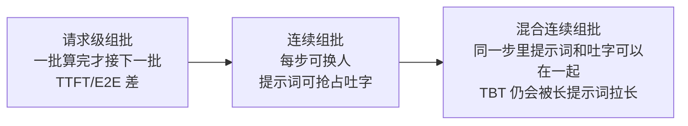
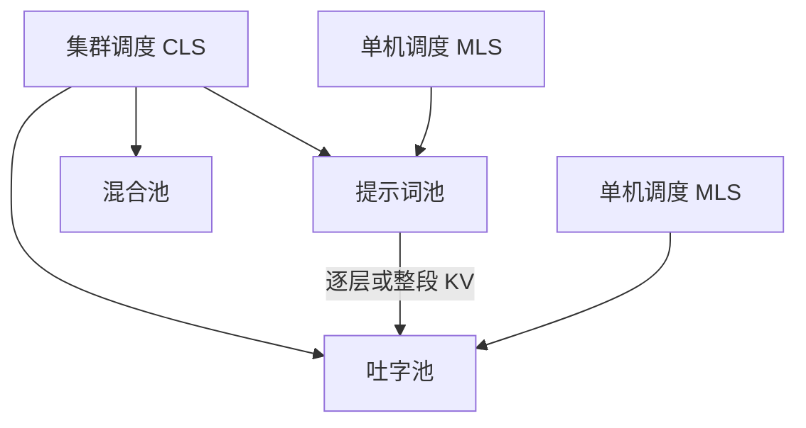

# Splitwise：把算提示词的 GPU 和吐字的 GPU 拆开

<!-- release-date: 2023-11-30 -->

> 本文依据 **Splitwise: Efficient Generative LLM Inference Using Phase Splitting**，即 arXiv:2311.18677v2（2024-05-20），共 15 页。封面不印会议名。第一作者 Pratyush Patel，编号实验室 **1 = University of Washington**（脚注写部分工作在 Microsoft 实习期间完成）；编号实验室 **2 = Microsoft**。按目录归属放在 Microsoft。页码均指这份 PDF。全文把三件事分开标注：**报告明确写了什么**、**我们如何解释或验算它**、**哪些是外部资料补充**。
>
> 封面水印为 `arXiv:2311.18677v2 [cs.AR] 20 May 2024`。作者是 Pratyush Patel、Esha Choukse、Chaojie Zhang、Aashaka Shah、Íñigo Goiri、Saeed Maleki、Ricardo Bianchini。
>
> `release-date` 取 **2023-11-30**。这是一篇公开技术论文，对象从未作为模型产品对外可用，按该技术首次官方公开日（arXiv v1）取值。本地件是 v2。v2 修订日不用于回写。

本站另有 [Sarathi-Serve](/reports/Microsoft/Sarathi-Serve) 讲同机混批与切块 Prefill，[Mooncake](/reports/Moonshot/Mooncake) 讲 KV 中心的分离调度。本文只讲 Splitwise 这篇 PDF 自己怎么把两个阶段拆到不同机器上，不重写那两篇。

## 读前先认识几个词

- **Prompt computation（提示词计算，报告也叫 prompt phase）**：一次请求的第一段。整段提示词并行过一遍模型，吐出第一个输出 Token，并写出这份请求的 KV 缓存。
- **Token generation（词元生成，报告也叫 token phase）**：之后每一步只吃上一个刚生成的 Token，再吐下一个。计算并行度低，更吃显存带宽和容量。
- **TTFT / TBT / E2E**：Time to First Token 是等到第一个输出词的时间；Time Between Tokens 是相邻两个输出词的间隔；End-to-end 是用户看见的整段查询时间（PDF p. 2，表 II）。
- **Mixed continuous batching（混合连续批处理）**：每一步前向都可以同时装进还在算提示词的请求和正在吐字的请求（PDF p. 2，图 2c）。报告后文默认用这一档，除非另说。
- **KV-cache transfer（键值缓存搬运）**：提示词机算完后，要把已经写出的 KV 送到吐字机。这是拆机之后的主开销（PDF p. 6）。
- **CLS / MLS**：Cluster-level scheduler 管机器池和路由；Machine-level scheduler 管单机排队与组批（PDF p. 5）。

如果你只想记一句话：

> **提示词吃算力，吐字吃带宽。把两段拆到不同机器上，才能各自选硬件、各自拧功耗，而不被同机混批拖着走。**

## 一句话先说清

Splitwise 的主张只有一句：**不要让「读提示词」和「吐字」抢同一台机器。**

它不是新注意力算法，也不是新的显存分页器。它是一套部署与调度：提示词池、吐字池、必要时再加一个混合池；请求状态用机群背面的 InfiniBand 搬走（PDF p. 1–2）。拆开之后，才能给两段配不同代 GPU、不同功耗帽，再按吞吐、成本和供电去搜集群配比。

摘要给出的对照是：相对当时的集群设计，最多 **1.4×** 吞吐、成本低 **20%**；或者在相同供电与成本预算下最多 **2.35×** 吞吐（PDF p. 1）。结论段另写了一组：**1.76×** 吞吐、功率低 **15%**、成本相同；或相同成本与功率下 **2.35×** 吞吐（PDF p. 12）。两处不完全同一组实验口径，正文里分开引用，不捏成一句。

## 报告地图：15 页里各写了什么

密度最高的是第 III 节的七条洞察和第 IV 节的拆机与供货。没有模型配方，也没有训练。

| 报告章节 | PDF 页 | 讲了什么 | 密度 |
|---|---|---|---|
| 标题、摘要、表 I | p. 1 | A100/H100 规格；1.4× / 20% / 2.35× | 高 |
| §I 贡献清单 | p. 2 | 拆机动机；表 II 四个指标 | 高 |
| §II 背景、图 1–2 | p. 2–3 | 两阶段；三种组批；张量并行 8 卡 | 中 |
| §III 刻画起、图 3、表 III | p. 3 | Azure 轨迹；Llama2-70B / BLOOM-176B | 高 |
| 图 4–7 | p. 4 | 活跃 Token、延迟、吞吐、显存 | 高 |
| 图 8–9、表 IV、§IV 起 | p. 5 | 功耗；跨代 GPU；三池架构 | 高 |
| 图 10–11、调度与搬运 | p. 6 | CLS/MLS；逐层 KV 搬运 | 高 |
| 图 12、表 V、供货 | p. 7–8 | 四种机型组合；搜配比 | 高 |
| §V 方法、表 VI | p. 8–9 | vLLM 原型；模拟器；SLO | 高 |
| §VI-A、图 14–15 | p. 9 | 搬运开销实测 | 高 |
| 图 16–18 | p. 10 | 等功率集群；摘要柱 | 高 |
| 图 17、19、20 | p. 10–11 | 组批 CDF；等吞吐；换负载 | 高 |
| §VI-E、§VII–IX | p. 11–12 | 批作业；讨论；相关工作；结论 | 中 |
| 参考文献 + 附录 | p. 13–15 | 引用；产物清单 | 低 |

## 先看矛盾：算力涨得快，显存几乎没涨

表 I 把 DGX-A100 和 DGX-H100 摆在一起（PDF p. 1）：

| | A100 | H100 | 比值 |
|---|---:|---:|---:|
| TFLOPs | 19.5 | 66.9 | 3.43× |
| HBM 容量 | 80GB | 80GB | 1.00× |
| HBM 带宽 | 2039GBps | 3352GBps | 1.64× |
| 功耗 | 400W | 700W | 1.75× |
| NVLink | 50Gbps | 100Gbps | 2.00× |
| InfiniBand | 200GBps | 400GBps | 2.00× |
| 单机成本 | $17.6/hr | $38/hr | 2.16× |

算力涨了 3.43 倍，功耗涨了 1.75 倍，带宽只涨约 1.6 倍，容量没涨。提示词阶段要最新卡的 FLOPS；吐字阶段即使做了当时最好的组批，计算单元仍然吃不饱（PDF p. 1）。两段挤在同一台机器上，端到端延迟还会因为「这一步到底混进了多长的提示词」而乱跳，服务只能多备卡才能守住交互式 SLO。云厂商同时还撞上供电墙。

我们怎么读这张表：下一代 GPU 并不是「所有阶段都更快一截」。它把提示词需要的东西加得最猛，把吐字需要的东西加得最少。后面所有「异质集群」都从这个不对称出发。

## 一次请求为什么天生是两段

图 1 用「Is tomato a fruit?」画出时间线（PDF p. 2）。提示词一次并行算完，得到第一个 Token，并把注意力层的上下文写入 KV 缓存。之后每一步只拿上一个 Token 加上整份 KV。所以提示词偏算力，吐字偏带宽和容量。

报告还补了一个自己用的指标：**TBT**。已有工作常看 E2E、TTFT 和吞吐；他们加上相邻 Token 间隔，用来盯流式吐字顺不顺（PDF p. 2，表 II）。批处理任务更在乎吞吐；对话类 API 更在乎 TTFT 和 TBT。

组批有三档（PDF p. 2，图 2）：

这是根据图 2 重画的**机制示意**，不是实测坐标。请求级组批会让后来的人空等整段生成；连续组批里，提示词优先，可以抢占吐字，TTFT 好了，TBT 尾部变差；混合组批把两段放进同一步，减轻但不消灭对 TBT 的冲击，因为跟提示词排在一起的吐字这一步会变慢（PDF p. 2）。后文默认混合组批。

并行：文中一律用 **8 卡张量并行**，卡间走 NVLink 这类高带宽（PDF p. 3）。集群里每台一般 8 张旗舰 GPU，卡与卡之间还有 Mellanox InfiniBand 数据面；云上每对 GPU 的 InfiniBand 带宽写的是 25 到 50GBps（PDF p. 3）。

## 生产轨迹：编码和对话根本不是同一种活

刻画用的是 Azure 两条 LLM 服务在 **2023-11-11** 的生产轨迹，场景是编码补全和对话。子集开源在 Azure Public Dataset（PDF p. 3）。刻画用的片段长 **20 分钟**，字段是到达时间、输入 Token 数、输出 Token 数。看不见提示词文本。评测时按长度造输入、强制生成对应长度的输出。文本内容不影响他们盯的那些性能指标。刻画时**请求之间不复用 KV**，用来模拟带安全保证的云服务（PDF p. 3）。

模型是当时开源里参数最多的两档（PDF p. 3，表 III）：

| 模型 | 层数 | Hidden size | Heads |
|---|---:|---:|---:|
| Llama2-70B | 80 | 8192 | 32 |
| BLOOM-176B | 70 | 14336 | 112 |

默认在一台 8×H100 上用 vLLM 跑。除非另说。

图 3 的分布（PDF p. 3）：

- 编码：提示词中位数 **1500** Token（用户正在写的代码会整段塞进来）；输出中位数 **13** Token（只补接下来几个词）。
- 对话：提示词中位数 **1020** Token，分布更宽；输出近似双峰，中位数 **129** Token。

**Insight I**：不同服务的提示词/输出分布可以差很远（PDF p. 3）。

## 七条洞察：同机混批为什么浪费

### 活跃 Token 很少

混合连续组批、把轨迹缩放到每秒 2 个请求以塞进单机。图 4：对话有 **60–70%** 的时间批次里只有 **20** 个或更少的活跃 Token。编码输出更短，吐字阶段超过 **20%** 的时间只有 1 个 Token。两条模型趋势接近（PDF p. 4）。计数规则：提示词阶段按提示词长度算活跃 Token；吐字阶段一条请求只算 1 个（假设 beam search 为 1）。

**Insight II**：混合连续组批大部分时间只批到很少的活跃 Token（PDF p. 4）。

### 延迟：TTFT 随提示词线性涨，TBT 对批不敏感，E2E 却耗在吐字

图 5a：TTFT 几乎随提示词长度线性上升，因为提示词阶段 GPU 利用率高、算力受限（PDF p. 4）。图 5b：硬把不同请求的输出 Token 批在一起，批到 **64** 时 TBT 也只有约 **2×**。图 5c 是生产轨迹、不组批：E2E 的大部分时间仍在吐字阶段——编码那种「提示词很长、输出很短」也一样。BLOOM-176B 上，**1500** 个输入 Token 的提示词阶段，耗时相当于只有 **6** 个输出 Token 的吐字阶段（PDF p. 4）。

**Insight III**：对大多数请求，E2E 的大头在吐字（PDF p. 4）。

### 吞吐：提示词不能无限批，吐字要尽量批

图 6a：提示词吞吐在 **2048** 个提示词 Token 之后下降；按轨迹中位数，这对应批次小于 2。图 6b：吐字吞吐随批增大，直到批 **64** 显存耗尽（PDF p. 4）。

**Insight IV**：提示词批要有上限才保性能；吐字批越大越好，没有那一侧的坏处（PDF p. 4）。

### 显存：提示词撞算力，吐字撞容量

图 7：提示词阶段算力先顶住；吐字阶段每条请求都要读到目前为止的整份 KV，容量先顶住（PDF p. 4–5）。

**Insight V**：提示词组批是算力受限，吐字组批是容量受限（PDF p. 5）。

### 功耗：吐字浪费供电预算

图 8：提示词功耗随批增大，靠近 TDP；吐字功耗几乎不随 Token 数变，因为访存受限（PDF p. 5）。图 9：给 GPU 加功耗帽。提示词延迟对功耗帽很敏感；吐字从 **700W** 帽到 **350W**（降一半以上）几乎不增加延迟（PDF p. 5）。

**Insight VI**：提示词吃得满供电预算，吐字吃不满（PDF p. 5）。

### 换代卡：吐字不必坐最新的计算卡

表 IV 是 Llama-70B、不组批、P50（PDF p. 5）：

| | 编码 A100 | 编码 H100 | 比值 | 对话 A100 | 对话 H100 | 比值 |
|---|---:|---:|---:|---:|---:|---:|
| TTFT | 185 ms | 95 ms | 0.51× | 155 ms | 84 ms | 0.54× |
| TBT | 52 ms | 31 ms | 0.70× | 40 ms | 28 ms | 0.70× |
| E2E | 856 ms | 493 ms | 0.58× | 4957 ms | 3387 ms | 0.68× |
| 成本 | $0.42 | $0.52 | 1.24× | $2.4 | $3.6 | 1.5× |
| 能量 | 1.37 Whr | 1.37 Whr | 1× | 7.9 Whr | 9.4 Whr | 1.2× |

TTFT 掉得比 TBT 狠。编码几乎全是提示词，换 A100 对 E2E 更伤。整体看，A100 的推理成本和能耗不差于、甚至好于 H100（PDF p. 5）。

**Insight VII**：吐字可以跑在计算能力更弱的硬件上，Perf/W 和 Perf/$ 更好（PDF p. 5）。

## 设计：两池加一个可伸缩的混合池

图 10（PDF p. 6）是总图。三池都预装同一份模型：

这是根据图 10 重画的**机制示意**。新请求被同时分到一对提示词机和吐字机。提示词机算完第一词并写出 KV，再把 KV 送给吐字机，吐字机用连续组批跑到结束。混合池按负载胀缩，里面用混合连续组批。低负载优先延迟；高负载要避免两池切碎导致吞吐掉下去（PDF p. 5）。

切换池本身没有可感知的延迟。身份还记着：混合池里的机器排空「另一类」任务后回到原池。负载和最初假设差太远，才做粗粒度的提示词池 ↔ 吐字池重分配，而且不频繁，通常要在混合池里待相当一段时间才会动（PDF p. 6）。

### 集群调度

路由用 **Join the Shortest Queue（JSQ）**。队列长度按**待处理 Token 数**，不是请求条数。机器定期上报显存和队列变化，**不是每一步前向都报**（PDF p. 6）。一对机器一起定，是为了让 KV 搬运和提示词计算重叠。

队列超过阈值，先找混合池；混合池也满，就去对面那一池（吐字机临时跑提示词，或反过来），并把那台机搬进混合池。混合池排空后再搬回去。例如队列太长时，可以把一台提示词机搬去跑吐字；吐字跑完再回提示词池（PDF p. 6）。

### 单机调度

- **提示词机**：FCFS。总提示词 Token 限制在 **2048**，因为图 6a 过了这点吞吐下降。这是可配值，换模型或硬件可以改（PDF p. 6）。
- **吐字机**：FCFS，能批多少批多少，直到显存快满才排队（PDF p. 6）。
- **混合机**：为了 TTFT，新到的提示词立刻优先；没容量就抢占吐字。为避免饿死，吐字优先级随等待变老，并限制每条请求被抢占的次数（PDF p. 6）。

## KV 怎么搬：逐层异步，而不是算完再寄

朴素做法（图 11a）：提示词整段结束、第一词出来之后，再整份寄 KV，寄完吐字机才能吐第二个词。这份延迟直接打进最大 TBT 和 E2E。开销正比于提示词 Token 数，即使 InfiniBand 很快，长提示词也可能占掉可观的一截 TBT（PDF p. 6–7）。

优化（图 11b）：每一层算完，就把这一层的 KV **异步**寄走，提示词机继续算下一层。还可以让吐字机更早开工，提示词机更早释放 KV 显存。层间要细粒度同步，短提示词上可能干扰计算、拉长 TTFT。短提示词 KV 本来就小，没必要用逐层来藏延迟。批次 Token 数在计算开始时已知，于是：**短提示词走整段串行搬运，长提示词走逐层**（PDF p. 7）。阈值在评测里写成 H100 上小于 **512** 用串行（PDF p. 9）。

实现叠在 vLLM 上，开源在 vLLM 的 PR（PDF p. 8，参考文献 [1]）。通信库是 **MSCCL++**。提示词机用 zero-copy 单边 **put**，吐字机不必发 recv；各层 put 发完后用同一条 InfiniBand 连接上的信号量同步。一个批次里不同请求可能去不同吐字机，所以每条请求一个信号量。按 vLLM 的块来寄，同一信号量下尽量合并连续块（PDF p. 8）。

硬件是 Azure 上两台 DGX-A100 虚拟机和两台 DGX-H100 虚拟机，规格同表 I。H100 对的 InfiniBand 写的是带宽翻倍（文中作 400 Gbps）（PDF p. 8）。原版 vLLM 只有带吐字抢占的连续组批，TBT 会差很多，他们另外实现了图 2c 那种混合连续组批，当作非 Splitwise 基线也会用的那一档。

## 四种供货，外加一台事件驱动模拟器

四种名字：第一字母是提示词机，第二字母是吐字机（PDF p. 7，表 V，相对 DGX-A100 归一化）：

| | 提示词机 | 提示词成本 | 提示词功率 | 吐字机 | 吐字成本 | 吐字功率 | 互联带宽 |
|---|---|---:|---:|---|---:|---:|---:|
| Splitwise-AA | DGX-A100 | 1× | 1× | DGX-A100 | 1× | 1× | 1× |
| Splitwise-HH | DGX-H100 | 2.35× | 1.75× | DGX-H100 | 2.5× | 1.75× | 2× |
| Splitwise-HHcap | DGX-H100 | 2.35× | 1.75× | DGX-H100 | 2.5× | 1.23× | 2× |
| Splitwise-HA | DGX-H100 | 2.35× | 1.75× | DGX-A100 | 1× | 1× | 1× |

表里 HH 的吐字成本写成 **2.5×**、提示词成本 **2.35×**，原文如此，本文不改。HHcap 把吐字机帽到额定功率的 **70%**，每卡帽掉 **50%**，依据是图 9 和 Insight VII（PDF p. 7）。

搜配比用事件驱动集群模拟器（开源 SplitwiseSim，PDF p. 8）。输入包括：目标设计、能估计不同输入/输出/批下 TTFT 和 TBT 的性能模型、从目标分布截出的短轨迹、SLO、约束（例如吞吐）、优化目标（例如最小成本）。图 12 示例：编码负载、Splitwise-HH、峰值吞吐目标 **70 RPS**，成本最优是 **27** 台提示词机 + **3** 台吐字机（PDF p. 7）。

优化目标三个：吞吐、成本、功率。他们只算**供电功率（provisioned power）**，不算动态功耗（PDF p. 8）。对 CSP，同样吞吐下成本略高但省电省机位，有时划得来；对终端用户，同样吞吐下更高账单通常不可接受。

准确率：无损搬 KV，不额外随机，同一套参数和状态，所以不改精度（PDF p. 8）。可靠性：提示词机或吐字机挂了就整请求重来，和当时的服务系统一样；也可以把提示词算完的 KV 打进内存库以免重算，甚至在吐字过程中定期打点——安全高效的故障恢复不在本文范围（PDF p. 8）。CLS 在超大集群上可能成为瓶颈，分区/复制调度是正交工作。

## 评测口径

SLO 相对「DGX-A100、无争用」的减速倍数，**九个都要满足**（PDF p. 9，表 VI）：

| | P50 | P90 | P99 |
|---|---:|---:|---:|
| TTFT | 2× | 3× | 6× |
| TBT | 1.25× | 1.5× | 5× |
| E2E | 1.25× | 1.5× | 5× |

TTFT 松一些，因为对 E2E 影响更小。到达过程用泊松，调每秒请求数来加压。基线是 Baseline-A100 和 Baseline-H100，全部机器混合连续组批，和 Splitwise 混合池同一套（PDF p. 9）。

性能模型：A100/H100 上按批、输入、输出、所需并行度做分段线性拟合。80:20 训练/测试，MAPE 小于 **3%**。端到端还用生产负载、超过 **5 万** 次迭代对过模拟器（PDF p. 9）。机间通信开销来自第 VI-A 节对 InfiniBand 搬运的实测。

## 搬运开销：用户几乎看不见

图 14：相对提示词计算，搬运开销小于 **7%**。串行搬运随提示词线性涨。逐层优化后，未重叠的搬运时间大约 A100 **8 ms**、H100 **5 ms**。H100 实验带宽约是 A100 的两倍（文中 200 vs 400 Gbps），搬运大约快一倍（PDF p. 9）。

图 15：编码轨迹、两机 Splitwise、不组批，对照单机不组批。串行搬运在长提示词上可占到 E2E 的 **3%**；Splitwise 只占 **0.8%**。用户能感到的只有**第二个 Token** 的延迟：Splitwise 给第二词加 **16.5%**，串行搬运是 **64%**（PDF p. 9）。报告的判断：面向用户也几乎不可感知。

## 等功率：同样的电，拆开才能多接请求

等功率目标取 **40** 台 DGX-H100 的功率；同样功率下能放 **70** 台 DGX-A100。记成 40P/T 和 70P/T（PDF p. 9）。

编码轨迹下 Splitwise-AA 是 **55** 台提示词 + **15** 台吐字（文中记成 (55P, 15P)）。相对 Baseline-H100，它和 Baseline-A100 一样多备了 75% 的机器。编码的 Splitwise-HH 是 **(35P, 5T)**，对话则是 **(25P, 15T)**——编码提示词重，对话吐字重，池子配比跟着分布走（PDF p. 10）。

图 16（等功率、吞吐优化，红虚线是 SLO）：

- 编码：HH、HHcap、AA 都优于 Baseline-H100。负载升高后，基线因为把长提示词混进吐字，TBT 爆。AA 吞吐更高，但 TTFT 一直更高。HA 用 H100 保 TTFT、用 A100 跑吐字，把缝补上。高负载时混合池开始吃满硬件：HA 的 P50 TBT 在 **90 RPS** 之后，H100 进混合池，TBT 被压下去（PDF p. 10）。
- 对话：HHcap 在延迟各面上都更好，因为吐字阶段比编码长得多，吐字机更划算（PDF p. 10）。

图 17 是对话、等功率吞吐优化集群里「花了多少时间在多少活跃 Token 上」（PDF p. 10）：

- 低负载 **70 RPS**：40 台 Baseline-H100 有 **70%** 时间在跑 **≤15** 个 Token，其余时间在跟超长提示词混批，TBT/E2E 受损。35 台 Splitwise-HH 提示词机大多空闲，一旦干活批次大得多；15 台吐字机组批也更好。
- 高负载 **130 RPS**：混合池用得更多，提示词机和吐字机的批大小开始长得像。

图 18a 摘要（对话、等功率吞吐优化，相对 Baseline-A100）（PDF p. 10）：

- Splitwise-AA：**2.15×** 吞吐，功率和成本相同。
- Splitwise-HA：**1.18×** 吞吐，成本低 **10%**，功率相同。

## 等成本、等吞吐：用户和 CSP 要的点不一样

图 18b 等成本（PDF p. 10）：Splitwise-AA 给出同一成本下最好的吞吐，比 Baseline-H100 高 **1.4×**，功率多 **25%**，机位数 **2×**。报告说这是多数**不在乎电和机位、只想要更高吞吐、又更容易买到旧卡**的客户会感兴趣的点。CSP 侧没有同样清楚的单一赢家。

图 19a 等吞吐、最小功率（PDF p. 10）：Splitwise-HHcap 达到与 Baseline-H100 相同的吞吐，功率低 **25%**，成本和机位相同。报告说这对 CSP 是明确的赢。

图 19b 等吞吐、最小成本（PDF p. 10–11）：同质设计（AA、HH）在 19a 和 19b 之间没有变化，因为提示词机和吐字机成本、功率相同。异质的 HA 和 HHcap 会搜到略不同的点。Splitwise-AA 相对 Baseline-H100，同样吞吐成本低 **25%**。

把摘要的「1.4× 吞吐、成本低 20%」和这里的「等成本 1.4×、功率 +25%、空间 2×」以及「等吞吐成本 −25%」并排放：它们是不同约束下的最优点，不要当成同一张表的三个格子。

## 换轨迹、换模型：混合池能救同质，救不齐异质

图 20：等功率吞吐优化集群，故意拿去跑「不是为它供货」的负载（PDF p. 11）。

- 给编码供的货跑对话：基线几乎不受影响。带混合池的 AA 和 HH 能变形，吞吐和延迟都没有损失。HA 和 HHcap 两池机型不同，相对「专门为对话供的货」吞吐回退 **7%**。所有 Splitwise 设计仍明显好于任一基线。
- 给 BLOOM-176B 供的货跑 Llama-70B：参数更少，同样集群能撑更高吞吐。高负载下所有 Splitwise 都超过两条基线；HH 和 HHcap 延迟一直最好。

批作业（PDF p. 11）：不必守那么紧的延迟 SLO，可以加压换吐字吞吐。等功率吞吐优化集群压上去之后，Baseline-A100 和 Splitwise-AA 的吞吐/成本最好，都是 **0.89 RPS/$**。高负载下 Splitwise 退化成「机器数相同的基线」，因为所有机器都进了混合池做混合组批。HH 和 Baseline-H100 同理，都是 **0.75 RPS/$**。

## 讨论里自己划的边界

- **新模型**：只要还是自回归两阶段，包括 MoE，方法论都适用；为一个模型供的货也能高效服务另一个（PDF p. 11）。
- **别的硬件**：T4 一类显存不够。提示词要高算力、高带宽、容量要求相对低；吐字要中等算力、高容量和高带宽。AMD MI-250、带 HBM 的 Intel Sapphire Rapids 可能适合当吐字机，他们没有这些硬件上的优化实现，留给未来（PDF p. 11–12）。
- **互联**：同质机之间 InfiniBand 常见；HA 这种 H100↔A100 的 InfiniBand 不一定现成。备选是经 CPU 的 HPC 云 InfiniBand，或 RoCE。报告估计带宽再低 **10×**，优化过的搬运仍可能划算；还可以在网上传之前压缩 KV（PDF p. 12）。
- **异质碎片**：HA 把机房切成不同代 GPU，CSP 自己会有运维代价（PDF p. 12）。
- **多轮对话**：今天的 Chat API 往往每次把完整上下文再送一遍。若将来服务有容量把上下文缓在 GPU 上、避免重算，提示词阶段的显存画像会变，还可能要把 KV **搬回**提示词机，等下一轮（PDF p. 12）。

相关工作一节把异构调度、数据流系统、以及当时的 LLM 服务（组批、调度、显存、CPU 侧推理）扫过一遍。报告强调那些工作仍把两阶段放在同一台机器上；Splitwise 是专门的两阶段拆机（PDF p. 12）。引用里出现 SARATHI（arXiv:2308.16369），那是同机切块 Prefill，不是这篇的贡献。

附录：产物包括 Azure 轨迹、vLLM 上的 KV 搬运原型、SplitwiseSim。功能核验因为硬件有限，只测了轨迹和模拟器。许可证 MIT / CC-BY。Zenodo DOI `10.5281/zenodo.11003049`（PDF p. 14–15）。

## 可迁移启发

1. **先画两阶段的资源画像，再决定要不要拆。** 同机混批能藏一部分浪费，但只要算力与带宽的代际增速继续劈叉，拆开才有资格谈「给吐字买旧卡、给提示词买新卡」。
2. **拆机的主开销是 KV，不是调度器名词。** 逐层 put、短序列走串行、长序列走重叠，把第二词的额外延迟从 64% 打到 16.5%。没有这条，拆机只是把排队换成网络。
3. **第三池是为了别被自己的切分卡死。** 低负载两池分工；高负载混合池把碎片收回去。批作业压满时系统会退化回「台数相同的混批基线」，这不是失败，是边界。
4. **供货目标要写清是给用户还是给 CSP。** 同样 1.4× 吞吐，等成本和等功率不是同一张图。摘要、结论、第 VI 节的柱状图口径不同，引用时带着约束。
5. **功耗帽是吐字侧几乎免费的杠杆。** 提示词一帽就慢，吐字帽一半几乎不动。HHcap 是这条洞察的集群版。

## 限制与未公开

- 集群规模数字大量来自模拟器，真机原型主要验证搬运，不是 40/70 台集群。
- 表 I 的 InfiniBand 写成 GBps，后文实验写成 Gbps，原文单位不统一。
- 表 V 里 HH 提示词成本 2.35×、吐字成本 2.5×，未解释差额。
- 编码 AA 配比正文写成 (55P, 15P)，同一句又说 15 台给吐字池，第二处 P 像笔误。
- 摘要 1.4×@−20% 成本、结论 1.76×@−15% 功率，与第 VI 节各摘要图不是同一组约束，报告没有一张表把三处对齐。
- 故障恢复、CLS 超大规模、跨代 InfiniBand 现货、KV 压缩，都点到为止。
- 轨迹不可见文本、刻画不跨请求复用 KV，和后来生产里的前缀缓存不是同一假设。

## 关键词回看

Prompt phase / Token phase；TTFT、TBT、E2E；混合连续组批；JSQ；三池；逐层 KV put；Splitwise-AA/HH/HA/HHcap；等功率 / 等成本 / 等吞吐；Azure 编码与对话轨迹。

## 参考资料

- 原件：`papers/Microsoft/Splitwise.pdf`（arXiv:2311.18677v2，15 页）
- 轨迹：[Azure LLM Inference Trace 2023](https://github.com/Azure/AzurePublicDataset)
- 模拟器：[splitwise-sim](https://github.com/Mutinifni/splitwise-sim)
- vLLM 原型 PR：参考文献 [1]
- 通信库：[MSCCL++](https://github.com/microsoft/mscclpp)
