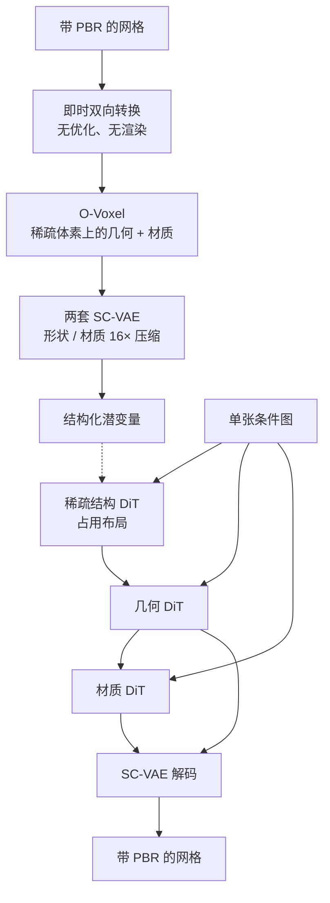

# TRELLIS.2：丢掉等值面场，用 O-Voxel 同时装进几何和外观

<!-- release-date: 2025-12-16 -->

> 本文依据 Microsoft Research 等机构的 **Native and Compact Structured Latents for 3D Generation**，即 arXiv:2512.14692v1（2025-12-16，24 页）。动笔前核过 arXiv 官方提交历史：目前只有 v1，本地件封面水印为 `arXiv:2512.14692v1 [cs.CV] 16 Dec 2025`，md5 与官方 v1 一致，**未做替换**。
>
> 全文页码指 PDF 自身页码。本 PDF 从第 13 页起进入附录，页脚重新从 `1` 印起，因此「印刷页码」会和文件页码错位。引用一律用文件页码，例如附录开头是 `(PDF p. 13)`，不是附录页脚上的 `1`。
>
> `release-date` 取 **2025-12-16**。依据是模型与权重在这一天首次经官方渠道向公众开放：arXiv v1 提交于 2025-12-16 18:58:28 UTC；GitHub [`microsoft/TRELLIS.2`](https://github.com/microsoft/TRELLIS.2) 的 `Init Release` 提交时间为 2025-12-16 19:00:42 UTC；Hugging Face 模型卡 [`microsoft/TRELLIS.2-4B`](https://huggingface.co/microsoft/TRELLIS.2-4B) 标注 Published Dec 16, 2025。仓库建库日和权重文件提交日都更早，按本模块口径不当作首发日：GitHub `created_at` 是 2025-11-26（机器人空仓库），Hugging Face `createdAt` 是 2025-12-01，权重 `.safetensors` 也在 2025-12-01 随 `Upload folder using huggingface_hub` 写入——这是典型的预置后解禁，与 Gemma 系列同一类坑。官方项目页 [https://microsoft.github.io/TRELLIS.2/](https://microsoft.github.io/TRELLIS.2/) 与 Hugging Face Space 演示同日上线。
>
> 文中始终区分三件事：**报告写了什么**、**本文如何解释**、**哪些是外部补充**。凡是本文自己推出来的、从图里读出来的、或者从项目页 / 模型卡补进来的，都会当场说明。
>
> 边界说明：本篇必须独立可读，不依赖尚未发布的 TRELLIS 第一篇。文中出现的 TRELLIS / SLAT 只作为本 PDF 自己点名的对照基线。同方向已发布、同样做高分辨率带 PBR 的物体级 3D 的是 Seed3D 2.0；那一篇仍走「等值面场抽网格，再另训一套 PBR」。本篇的问题定义不同：先换掉等值面场本身。不要把 Seed3D 或 FlexiCubes 原文的实验数字读成本报告的结果。

## 3D 生成卡在表示，不卡在「再画得像一点」

先把矛盾说清楚，再上名词。

一张图变成一个 3D 物体，看起来「像」并不难。难的是：叶子、衣服这种**开口的薄片**还在不在；齿轮咬合、驾驶舱内部这种**封闭内腔**还在不在；T 型交接、自相交这种**非流形**会不会被预处理直接削掉；换一盏灯之后，金属和玻璃是不是还像金属和玻璃。

近年的大型 3D 生成模型大多把形状写成**等值面场（iso-surface field）**。人话是：在空间里学一个标量函数，再取「函数等于某个值」的那一层当表面。最常见的是 **有向距离场（Signed Distance Function，SDF）**：空间中一点到表面的距离，外面为正、里面为负、表面上为 0。**FlexiCubes** 是同一家族里更灵活的抽网格方法，本 PDF 把它和 SDF 并列，当作等值面场的代表（PDF p. 2，引用 [53]）。

等值面场有一个隐藏前提：**空间必须分得出里和外**。开口的布料没有里外；非流形的交接处里外不自洽；完全包在壳体里面的零件，洪水填充一类预处理很容易把它填死或丢掉。报告把这三件事写成等值面场的固有限制：开放面、非流形、封闭内腔（PDF p. 2）。

更麻烦的是第二刀。多数工作只生成形状，把外观当成后处理：先出白模，再靠多视图贴图、烘焙、对齐把颜色糊回去。几何和材质在真实资产里是绑在一起的，级联会把光照烤进颜色，也会在内外表面对不齐。报告点名自己的前作 **TRELLIS** 已经用结构化 3D 潜变量（SLAT）同时建几何和外观，但 SLAT 的输入是多视图 2D 图像特征，监督也几乎全是渲染损失，复杂结构和材质仍然吃亏（PDF p. 2，引用 [65]）。

所以这篇要换的不是「同一个场，再压得更紧」，而是表示本身：

> **不要先把网格变成一个必须分清里外的场，再在场上生成。直接在稀疏体素上同时记下几何和外观，让网格和网络之间的来回不经过优化、也不经过渲染。**

这套稀疏体素叫 **O-Voxel（omni-voxel，全能体素）**。名字里的 omni，报告自己解释为两件事同时成立：几何和外观一体；并且撑得住两者各自的复杂度（PDF p. 2）。

## 读之前只需要这几个概念

下面这些词正文都会用到。这一节是**读前背景**，不全是报告自己定义的。

**网格（mesh）**：一堆顶点连成三角面。游戏引擎、建模软件吃的就是它。没有厚度，只是一层壳。

**体素（voxel）**：把空间切成规则小立方体。**稀疏体素**只保留和物体相交的那些格子，空格子不存、不算。O-Voxel 就建立在这种稀疏格子上。

**等值面场**：用连续函数的某一层来表示表面。SDF 是其中一种。抽网格时通常还要做符号填充、优化，才能得到水密表面。

**对偶轮廓（Dual Contouring，DC）**：一种从带交点信息的格子里抽网格的算法。每个被占的格子放一个顶点，顶点位置按「最贴合那些切割平面」来求；相邻格子再连成面。O-Voxel 的几何灵感来自它，但**不用场、不看正负号**（PDF p. 3）。

**Hermite 数据**：一条格子棱被表面切开时，记下交点坐标和该处法向。O-Voxel 用这两样东西摆对偶顶点。

**PBR（Physically Based Rendering，基于物理的渲染）**：不把「看起来的颜色」写成一张图，而是拆成物理量。本报告每个活跃体素存六通道：基础色 $c$、金属度 $m$、粗糙度 $r$、不透明度 $\alpha$（PDF p. 4，式 3）。有了这套量，换灯光时引擎可以重算，而不是播放一张烤死的照片。

**变分自编码器（VAE）与潜变量（latent）**：直接在高分辨率体素上做生成太贵。先用 VAE 压成短得多的潜变量，生成模型在压缩空间里跑，再用解码器还原。压缩比一高，边角和薄壁就容易糊。这是后文 SC-VAE 要打的仗。

**流匹配（flow matching）与扩散 Transformer（DiT）**：从噪声走到数据的生成模型。本报告的三个生成器都是 DiT，训练目标是流匹配（PDF p. 6）。人话是：给当前被噪声污染的样本，预测「该往数据走多快、朝哪走」。

**无分类器引导（Classifier-Free Guidance，CFG）**：训练时随机丢掉条件，推理时同一步跑「带条件」和「不带条件」再外推，让输出更听图。报告写了 drop rate 0.1（PDF p. 6），没有写推理时的引导系数。

## 一句话先说清

TRELLIS.2 是一套从单图出发的原生 3D 资产生成系统。它真正改的是表示，而不是把同一条「场 → 网格 → 贴图」流水线加宽：

- **表示**：O-Voxel 用稀疏体素同时编码几何和 PBR，并且用灵活对偶网格处理任意拓扑。
- **压缩**：用 **稀疏压缩 VAE（Sparse Compression VAE，SC-VAE）** 做 16 倍空间下采样，把 $1024^3$ 的带纹理资产压到约 9.6K 个潜变量 token（PDF p. 2、p. 8）。
- **生成**：三个约 1.3B 的流匹配 DiT 依次生成稀疏占用、几何潜变量、材质潜变量，合计约 4B 参数（PDF p. 6）。
- **推理**：引言给出的 H100 墙钟时间是 $512^3$ 约 3 秒、$1024^3$ 约 17 秒、$1536^3$ 约 60 秒（PDF p. 2）。$1536^3$ 并不是训练分辨率，而是测试时用级联把分辨率抬上去（PDF p. 8–9）。

人评里，约 40 名参与者在 100 张 AI 生成图上做偏好选择：整体质量 66.5%，只看法线的形状质量 69.0%（PDF p. 8）。这不是「CLIP 微弱领先」那种幅度。

## 报告地图：24 页里各写了什么

先摊开篇幅。这份报告正文 12 页、附录 12 页，密度在表示设计和重建表上，生成侧几乎没有消融。

| 报告章节 | PDF 页 | 讲了什么 | 密度 |
|---|---|---|---|
| 标题、摘要、Figure 1 | p. 1 | O-Voxel；16× 压缩；H100 分阶段耗时；token–保真曲线 | 高 |
| §1 引言 | p. 2 | 等值面场的三条限制；SLAT 的 2D 特征缺陷；3 / 17 / 60 秒 | 高 |
| §2 相关工作 | p. 2–3 | 场、非结构化、结构化潜变量；多视图贴图级联 | 中 |
| Figure 2–3 + §3.1 起 | p. 3 | 总览；O-Voxel 定义；灵活对偶网格 | 高 |
| QEF + 材质六通道 + §3.2 起 | p. 4 | 式 2–3；网格 ↔ O-Voxel；SC-VAE 登场 | 高 |
| Figure 4 + SC-VAE 结构与训练 | p. 5 | 残差自编码；早剪枝上采样；两阶段损失；双 VAE | 高 |
| §3.3 生成 + §4 实验设置 | p. 6 | 三阶段 DiT；数据与超参；H100 / A100 口径 | 高 |
| Figure 5–6 + 生成评测起 | p. 7 | 定性样例；和 Hunyuan3D 2.1 等对照 | 中 |
| Table 1–3 + Figure 7–8 | p. 8 | 重建表；人评；消融；测试时缩放 | 高 |
| 级联推理 + §5 结论 | p. 9 | $1536^3$ 怎么来的；贡献收束 | 中 |
| 参考文献 | p. 9–12 | 81 条 | — |
| 附录 A 算法与网络 | p. 13–15 | 转换伪代码；SC-VAE 约 800M；DiT 规格；式 8–9 | 高 |
| 附录 B FlexGEMM | p. 15–16 | Triton 稀疏卷积；最高约 2 倍加速 | 中 |
| 附录 C 数据 | p. 16 | Table 6：形状 976736 / 材质 737962 | 高 |
| 附录 D 评测协议 | p. 17–19 | MD / CD / F-score 定义；人评界面 | 中 |
| 附录 E 更多结果 | p. 19–24 | 重建与生成补充图 | 低 |
| 附录 F 限制 | p. 20 | 体素分辨率、小洞、没有部件语义 | 高 |

有几件必须在读正文前知道的事，因为它们决定这篇解读能走多深：

- **4B 指三个流匹配 DiT 的合计**，每个约 1.3B（PDF p. 6）。SC-VAE 另有约 800M，其中编码器 354M、解码器 474M（PDF p. 13）。不要把 VAE 算进那句「4B」。
- **$1536^3$ 是测试时级联，不是训练分辨率。** 几何和材质生成器从 $512^3$ 训到 $1024^3$（PDF p. 6）。更高分辨率靠把已生成的 O-Voxel 再当成稀疏结构先验（PDF p. 8–9）。
- **墙钟时间有两套口径。** 引言的 3 / 17 / 60 秒写的是 NVIDIA H100（PDF p. 2）；Table 1 的解码秒数写的是 A100（PDF p. 8）。第 6 页又说「全部 runtime 在 A100 上报告」。这是报告内部的口径冲突。本文把 3 / 17 / 60 秒按引言的 H100 引用，把 Table 1 解码时间按表注的 A100 引用，不把两套数加在一起。
- **生成侧几乎没有消融。** Table 3 只打 SC-VAE，而且是在 $256^3$ 的策展 Sketchfab 子集上（PDF p. 8）。没有「关掉对偶网格 / 关掉材质 VAE / 关掉级联」的对照。
- **项目页上的约 9.6K token 与 PDF 一致**，不是外部替换数。项目页另给的「小于 10 秒 CPU / 小于 100 毫秒 CUDA」转换时间，PDF 只写「数秒 / 数十毫秒」（PDF p. 2），本文以后者为准。

## 全景：网格 ↔ O-Voxel ↔ 潜变量，生成走三段

按 Figure 2 和 §3.3 重画。这张图只表示模块怎么连，不含耗时。

三个要点：

**第一，重建和生成共用 O-Voxel，但不共用同一条前向。** 训练数据是网格经确定性算法变成 O-Voxel，再经 SC-VAE 变成潜变量。推理时三个 DiT 直接在潜变量里生成，解码回 O-Voxel，再瞬时抽网格。没有多视图烘焙，也没有把高斯和网格焊在一起的后处理（PDF p. 3）。

**第二，形状和材质被拆成两个 VAE、两个生成器，但表示仍是同一套稀疏格子。** 材质 VAE 在上采样时吃形状 VAE 的细分结构；材质 DiT 把几何潜变量沿通道拼进去（PDF p. 5、p. 13）。这样第三段可以单独拿来给已有网格贴 PBR（PDF p. 7）。

**第三，稀疏结构是第一段，不是细节。** 先决定哪些体素是活的，再在活体素里填几何，最后填材质。TRELLIS 第一篇已经是这个两段骨架；本篇把第三段材质也放进原生 3D 潜空间（PDF p. 6）。

## 核心设计一：O-Voxel，让表面自己报告「我穿过了哪条棱」

### 旧问题：等值面场要先发明一个里外

把三角网格变成 SDF，通常要：判断每个格子在里还是在外、做洪水填充、再迭代优化。开口的叶子没有「里」；自相交的机械件没有一致的符号；驾驶舱座椅这种被外壳包住的结构，填充算法很容易当成实心。报告把这类预处理直接写成「先前工作里昂贵且不必要的步骤」（PDF p. 4）。

非结构化的网格、点云、高斯倒是不需要里外，但它们没有规则邻域，神经网络不好压、也不好在上面做高倍率空间下采样（PDF p. 2）。

### 新设计：灵活对偶网格，用相交标志代替正负号

O-Voxel 把一件资产写成规则 $N\times N\times N$ 格子上的一组活跃体素（PDF p. 3，式 1）：

$$
f = \bigl\{\bigl(f^{\mathrm{shape}}_i,\; f^{\mathrm{mat}}_i,\; p_i\bigr)\bigr\}_{i=1}^{L}
$$

$p_i$ 是第 $i$ 个活跃体素的整数坐标，空格子不存。每个活跃体素同时带几何特征和材质特征。

几何这一半叫 **灵活对偶网格（Flexible Dual Grid）**。对偶的意思是：原始格子的每一个被占单元放一个顶点，原始格子的每一条被表面切开的棱对应一张四边形，把相邻单元里的对偶顶点连起来（PDF p. 3，Figure 3）。

和 Dual Contouring 的差别就在「怎么决定这张四边形在不在」。经典 DC 看棱两端符号是否相反——那仍然是场。O-Voxel **直接拿输入网格和格子棱做相交测试**：这条棱被三角面切开，就激活对应的对偶面，并记下 Hermite 数据（交点 + 法向）。没有符号，也就没有水密、流形这些前提（PDF p. 3–4）。

每个活跃体素的几何特征有三样（PDF p. 4）：

| 量 | 含义 | 作用 |
|---|---|---|
| 对偶顶点 $v_i\in\mathbb{R}^3_{[0,1]}$ | 格子内部的一个点 | 局部表面落在哪 |
| 棱相交标志 $\delta_i\in\{0,1\}^3$ | 沿 $X/Y/Z$ 三条预定义棱是否被切开 | 邻居之间要不要连四边形 |
| 剖分权重 $\gamma_i>0$ | 四边形怎么切成两个三角形 | 让表面更贴局部特征 |

另外 9 条棱的标志存在邻居体素里，不必每个格子存满 12 条（PDF p. 4，脚注 1）。剖分权重的拓扑规则跟随 FlexiCubes 的灵活剖分（PDF p. 4，引用 [53]）——**这是借了它切三角形的办法，不是把表示改回等值面场。** 不要把 FlexiCubes 原文的误差表写进本报告。

### 工作机制：QEF 一次解出顶点，开面靠额外的边项

对偶顶点不是随便放的。给定一组 Hermite 数据 $\{q_i,n_i\}$，报告用闭式的二次误差函数（QEF）求解（PDF p. 4，式 2）：

$$
\min_{v\in\mathrm{voxel}} e(v)=\sum_i d_{\Pi,i}^2+\lambda_{\mathrm{bound}}\sum_j d_{L,j}^2+\lambda_{\mathrm{reg}}\,d_{\hat q}^2
$$

三项分开看：

1. **平面项** $d_{\Pi,i}^2=(n_i\cdot(v-q_i))^2$：顶点应该落在每张切割平面上。这是 Dual Contouring 原有的项，负责贴合局部表面、保住锐边。
2. **边界项** $d_{L,j}^2$：顶点到网格开边界的距离。开口的布边、叶片边缘没有「另一侧的符号」，这项专门把顶点拽到开口处。
3. **正则项** $d_{\hat q}^2=\|v-\bar q\|^2$：顶点不要离所有交点的均值太远，避免 QEF 在退化配置下飞掉。

网格 → O-Voxel 的路径是确定性的：找相交棱 → 标活跃体素 → 解析求 Hermite 数据 → 解 QEF。O-Voxel → 网格则反过来：按相交标志把对偶顶点连成四边形，再用 $\gamma$ 剖成三角（PDF p. 4，Figure 3）。附录把两段写成 Algorithm 1 和 2，其中剖分权重在转换时被设成 0.5，真正的学习调整留给 VAE 的渲染损失（PDF p. 13）。

报告给了三个直接好处（PDF p. 4）：

1. **即时双向转换**，无 SDF 求值、无洪水填充、无迭代优化。引言的数字是：单 CPU 上网格变 O-Voxel 数秒，从 O-Voxel 抽回表面和材质数十毫秒（PDF p. 2）。
2. **任意拓扑**，含自相交和全封闭内腔。
3. **锐特征**，对偶顶点按设计贴局部几何；顶点位置和剖分权重还可以被网络用渲染损失再调。

### 材质：六个数存在体素中心附近，而不是先烘焙一张 UV

外观不是另贴一张图，而是每个活跃体素一份与几何对齐的体积属性（PDF p. 4，式 3）：

$$
f^{\mathrm{mat}}_i=(c_i,m_i,r_i,\alpha_i)
$$

$c_i$ 是三通道基础色，加上金属度、粗糙度、不透明度，一共六通道。不透明度让半透明成为表示的一部分，报告明确说这是先前方法没有的能力（PDF p. 2）。

两个方向都是采样，不是优化：

- **纹理 → O-Voxel**：把体素中心投影到相交三角形上，按 UV 和合适的 mipmap 采样，再用点面距离做加权平均（PDF p. 4；细节在 PDF p. 13–14 的 Algorithm 3）。
- **O-Voxel → 纹理**：查询点（网格顶点，或 texel 对应的表面点）对邻近体素做三线性插值。抽出来的网格可以直接渲染，不再做视图相关后处理（PDF p. 4，Algorithm 4）。

### 收益、代价、边界

收益是表示层面的：开口、非流形、内腔不必先被「修成水密 SDF」；PBR 和几何住在同一套稀疏索引里，后面的生成器不用再做一次多视图对齐。Figure 1 左栏把一台航空发动机剖开，第二行能看见被外壳包住的内部结构（PDF p. 1）。这是等值面场最容易丢的那种东西。

代价也清楚，而且报告自己写在附录 F（PDF p. 20）：

- 表达力被体素分辨率卡住。小于一个格子的细节会混叠。
- 两张靠得很近的平行表面如果刺穿同一个体素，QEF 会把顶点放在两张面中间，材质也会被平均成糊的。
- 稀疏解码不能保证严格封闭、流形，结果里会出现小洞，多数要靠补洞后处理。
- O-Voxel 不编码部件分割或图结构的拓扑。门、抽屉、装配关系不在这套表示里。

### 可迁移启发

> **当旧表示的失败不是「精度不够」，而是「前提不成立」时，不要在旧表示上打补丁。把「里外符号」这种全局假设，换成「这条棱有没有被表面切开」这种局部可观测事件。**

这和把「必须先分词成规整网格」换成「直接对事件序列建模」是同一类动作：先问数据自己报告了什么，再问网络要学什么。开边界那一项也值得带走——特殊拓扑往往不是靠把主损失加大，而是靠一项只在那种拓扑上才有意义的几何约束。

## 核心设计二：SC-VAE，16 倍压下去之后还要能还原内腔

### 旧问题：结构化潜变量准，但 token 太多；非结构化潜变量少，但糊

报告把近年 3D 潜变量分成两派（PDF p. 3）：

- **非结构化**（Perceiver 风格的无序向量，如 Shape2VecSet / Dora）：压得狠，重建保真上不去。
- **结构化**（TRELLIS 的 SLAT、SparseFlex 一类）：几何准，但 token 数随稀疏占用涨，压缩比低。有人用更巧的注意力去省计算，而不是把潜变量本身变短。

O-Voxel 已经是结构化的稀疏格子。若 VAE 只能做 4 倍、8 倍下采样，后面的 DiT 仍然吃不消 $1024^3$、$1536^3$。报告给自己定的目标是：从原生 3D 而不是多视图 2D 学潜空间，并且空间压缩率要高到能撑高分辨率生成（PDF p. 2）。

### 新设计：全稀疏卷积的压缩 VAE，残差走「空间 ↔ 通道」而不是平均池化

SC-VAE 是 U 形、全稀疏卷积，不用 Transformer 当编解码器（PDF p. 5，Figure 4）。编码器逐级下采样稀疏体素特征，解码器对称还原。相对 TRELLIS / SparseFlex 的 Transformer VAE，稀疏卷积的好处是高分辨率下算得动，并且对分辨率更不敏感——附录说超过 $512^3$ 的输入可以直接套已经训好的 SC-VAE，不必再微调（PDF p. 15）。

真正让 16 倍压得住的，是从图像侧 DC-AE 借来、改到稀疏格子上的 **稀疏残差自编码（Sparse Residual Autoencoding）**（PDF p. 5，引用 [1]）。

2 倍下采样时，一个粗格子要看八个孩子。报告不是把八个孩子平均掉，而是先把它们 **堆到通道维**：

$$
F^{\mathrm{raw}}_{\mathrm{coarse}}=\mathrm{stack}(F_{\mathrm{child}_1},\ldots,F_{\mathrm{child}_8})\in\mathbb{R}^{8C}
$$

再按组做平均，得到粗分辨率上的残差估计（PDF p. 5，式 4）。缺席的孩子因稀疏性贡献零向量。上采样走对称的通道拆回空间（式 5）。

人话：平均池化是「八个邻居合成一个模糊的代表」；这里是「八个邻居先改排成更长的通道，信息还在，只是换了轴」。高压缩比下，优化要走的捷径被这条无参数捷径堵上。Table 3 后面会显示：拿掉它，16 倍时 Mesh Distance 涨 69%，32 倍时涨 526%（PDF p. 8）。

另外两个工程选择：

**早剪枝上采样。** 每次上采样前，模块先预测一个 $\hat\rho\in\{0,1\}^8$，标明八个孩子谁是活的，死的跳过（PDF p. 5，引用 XCube [51]）。稀疏格子的空腔不应该被解码器重新填实。

**ConvNeXt 式残差块。** 稀疏卷积在高稀疏度下有效算力和参数效率都差。报告把标准的两层卷积改成「一层稀疏卷积 + 一层宽的逐点 MLP」，MLP 扮演 Transformer FFN 的角色（PDF p. 5）。消融里这项几乎不改耗时，但质量掉一截。

编码器的通道节奏写在 Table 4（PDF p. 15）：从 `Linear(6, 64)` 起步，经过 2× / 4× / 8× / 16× 四级，最后 `Linear(1024, 32×2)` 出 32 维潜变量的均值和方差。解码器对称。整网约 800M。

输入是 6 维：和材质六通道、以及「对偶顶点 3 维 + 三条相交标志」都能对上。报告没有逐项写死这 6 维的打包方式，**上面这句对应是本文的读法，不是 PDF 的定义。**

形状和材质是两套 SC-VAE。材质那一套在上采样时以形状 VAE 的细分结构为条件，专门为「给定形状再生材质」服务（PDF p. 5）。

### 工作机制：先在低分辨率把格子回归准，再加切片式渲染损失

训练分两段（PDF p. 5，式 6–7）。

第一段用低分辨率、直接在 O-Voxel 上回归：对偶顶点走 MSE，相交标志和剪枝掩码走 BCE，材质走 L1，外加 KL。目的是先把「格子上的数」学稳。

第二段把分辨率拉高，加上基于渲染的感知损失：随机相机，而且近裁剪面很浅，故意把相机推进表面里面，逼模型看见内腔（PDF p. 5）。附录把渲染损失写成（PDF p. 14，式 8）：

$$
d_p(a,b)=\|a-b\|_1+0.2\,d_{\mathrm{SSIM}}+0.2\,d_{\mathrm{LPIPS}}
$$

形状渲染监督掩码、深度和法线；材质渲染监督基础色和金属–粗糙–不透明。深度项权重大（系数 10），因为内腔主要写在深度里。

SC-VAE 用 Trellis-500K 那套数据，滤掉没有 PBR 的资产，来源是 Objaverse-XL、ABO、HSSD；16 张 H100，batch 128（PDF p. 6）。附录 Table 6 给出更细的规模：形状 SC-VAE 473349 个资产，材质约 35 万（表中 354966，正文约 350000）（PDF p. 16）。

### 收益、代价、没写的东西

Table 1 是这篇最硬的定量证据（PDF p. 8，A100 解码时间）。只看 Toys4K、$1024^3$ 这一档：

| 方法 | token 数 | 空间下采样 | 解码（秒） | 全表面 MD↓ | 法线 PSNR↑ |
|---|---:|---:|---:|---:|---:|
| Dora | 4.1K | — | 43.0 | 360.8 | 27.32 |
| TRELLIS | 9.6K | 4× | 0.108 | 85.07 | 30.29 |
| Direct3D-S2 | 17K | 8× | 13.0 | 73.17 | 27.38 |
| SparseFlex | 225K | 4× | 3.21 | 0.3132 | 37.34 |
| **Ours** | **9.6K** | **16×** | **0.301** | **0.0042** | **43.11** |

和 SparseFlex 比：token 少一个数量级，全表面 Mesh Distance 低约两个数量级，解码快一个数量级。和自家前作 TRELLIS 比：token 数同为 9.6K，但 TRELLIS 只有 4 倍压缩、全表面 MD 是 85.07——内腔几乎没建起来。外表面 Chamfer 的差距没有这么夸张（TRELLIS 2.755 vs Ours 0.566），说明 TRELLIS 主要死在「看不见的里面」，而这正是 O-Voxel 要救的那一类拓扑。

材质重建没有可比基线。报告只报自己：PBR 属性图 38.89 dB / 0.033 LPIPS，着色图 38.69 dB / 0.026（PDF p. 6）。

Table 3 的消融都在 $256^3$（PDF p. 8）。残差自编码和优化残差块各自有贡献；残差自编码在更高压缩比下贡献陡增。**这不能外推成「$1024^3$ 生成也全靠这两项」**——生成器没有进入这张表。

没写的东西：两套 VAE 是否共享下采样块、KL 系数、$\lambda_v$ 等损失权重、第一段和第二段各自训了多少步。附录给了网络表，没给优化器时间表。

### 可迁移启发

> **高倍率压缩时，先不要学「怎么平均」，而要学「怎么改排」。把细格子的信息搬到通道维当残差，比从零预测粗格子更不容易塌。**

图像里的 DC-AE、视频里的因果 VAE，都在做同一件事。3D 稀疏格子的额外教训是：上采样必须会剪枝，否则空腔会被「补全」成实心，内腔表示当场死亡。

## 核心设计三：三个 vanilla DiT，在紧的潜空间里分段走

### 旧问题：潜变量一长，生成器就得长出各种补丁

TRELLIS 第一篇的稀疏 DiT 带卷积 packing 和 skip connection，部分原因是 SLAT 的空间压缩只有 4 倍，token 多、结构不规则（PDF p. 6，引用 [65]）。多视图贴图那条主流流水线则把外观丢给 2D 扩散，再烘焙回来，视角间容易鬼影（PDF p. 3、p. 8）。

### 新设计：占用 → 几何 → 材质，三段都在原生 3D 潜空间

生成器完全跟 TRELLIS 的骨架，但换了潜变量之后可以退回「原味」DiT（PDF p. 6）：

1. **稀疏结构**：预测稀疏体素占用，决定哪些格子是活的。
2. **几何**：在活格子里生成几何潜变量。
3. **材质**：以图像和几何潜变量为条件，生成材质潜变量。

前两段基本沿用 [65]；第三段是新的，而且条件是原生 3D 几何而不是烘焙网格。报告强调：这样几何和材质在任意拓扑下仍然空间对齐（PDF p. 6）。

每个 DiT 约 1.3B：宽度 1536，30 块，12 头，MLP 8192（PDF p. 6）。Table 5 写得更具体（PDF p. 15）：

- 输入投影：`Linear(32(+32), 1536)`。括号里的 +32 是材质段把形状潜变量沿通道拼接。
- 主干 ×30：AdaLN-single、SelfAttn（12×128）、LayerNorm、CrossAttn（12×128）、AdaLN-single、FFN(1536, 8192)。
- 输出：LayerNorm + `Linear(1536, 32)`。

条件分三种接法（PDF p. 13）：时间步用 AdaLN-single，比逐块 AdaLN 省参数；图像用交叉注意力，图像特征来自 DINOv3-L（PDF p. 6）；形状条件直接拼通道。位置用 RoPE，注意力用 QK-Norm（RMSNorm），为的是跨分辨率泛化（PDF p. 6、p. 14）。

训练目标是整流流。正向把数据 $x_0$ 直线插值到噪声 $\varepsilon$（PDF p. 15）：

$$
x(t)=(1-t)\,x_0+t\,\varepsilon,\qquad t\in[0,1]
$$

网络 $v_\theta$ 去拟合这条直线的速度 $\varepsilon-x_0$，CFM 损失为（PDF p. 15，式 9）：

$$
\mathcal{L}_{\mathrm{CFM}}(\theta)=\mathbb{E}_{t,x_0,\varepsilon}\bigl\|v_\theta\bigl(x(t),t\bigr)-(\varepsilon-x_0)\bigr\|_2^2
$$

时间步采样用 $\mathrm{logitNorm}(1,1)$，和 TRELLIS 第一篇相同。注意这里 $t=0$ 是数据、$t=1$ 是噪声，和有些「$t=0$ 为噪声」的写法相反；反向生成是从噪声沿 $-v$ 走回数据。**这是对整流流惯例的解释，报告自己没有拿两种 $t$ 的约定做对比。**

### 工作机制：先在 $512^3$ 上把占用学会，再把空间和图像一起加分辨率

课程很短，但关键（PDF p. 6）：

1. 稀疏结构生成先用 $512\times 512$ 条件图，学粗占用。
2. 几何和材质生成器从 $512^3$ 输出（潜空间 $32^3$，因为 16 倍压缩）逐步加到 $1024^3$ 输出（潜空间 $64^3$），条件图加到 1024。

$512/16=32$、$1024/16=64$，这两档和 VAE 的压缩比是锁死的。$1536^3$ 对应潜空间 $96^3$，不在这段课程里。

优化器是 AdamW，学习率 $1\times 10^{-4}$，权重衰减 0.01，CFG drop 0.1；每个 DiT 32 张 H100，batch 256（PDF p. 6）。图像条件来自 Blender 渲染的 16 个视角，随机 FoV 和光照（PDF p. 6）。附录把 FoV 范围写成 $10^\circ$–$70^\circ$，光照随机摆灯，为的是把固有 PBR 和场景光照拆开（PDF p. 16）。

生成器的训练集比 VAE 更大：在 Trellis-500K 滤完的集合上再加 TexVerse，合计约 80 万资产（PDF p. 6）。Table 6 的「All training set」是形状 976736、材质 737962（PDF p. 16）。最后还按 Sketchfab 缩略图估审美分，低于 4.5 的丢掉。**审美分模型、阈值怎么校准，报告没写。**

### 测试时的两种「再跑一遍」

16 倍压缩把 token 压到足够少，报告把省下来的预算用在推理期级联（PDF p. 8–9，Figure 8）：

**抬分辨率。** 先得到 $1024^3$ 的 O-Voxel，再 max-pool 成 $96^3$ 的稀疏结构，然后让几何生成器再跑一次，得到 $1536^3$。这就是引言那条约 60 秒（约 35 秒形状 + 约 25 秒材质）的来源（PDF p. 1–2）。它不是「训过 $1536^3$ 的模型」，是「用 $1024^3$ 的结果当更密的占用先验」。

**抬计算、分辨率不变。** 把已经生成的 $512^3$ O-Voxel 下采样成 $64^3$ 稀疏结构，再生成 $1024^3$。报告说这能修正第一段占用的局部错误，换更干净的高分辨率布局。Figure 8 右侧标注 $1024^3$ 为 20 秒、级联为 20 秒 + 3 秒（PDF p. 8）。**这 20 秒不要和引言 H100 的约 17 秒混成同一个测量。** 图上没有写 GPU 型号，本文只把它当作「级联会多花一次短推理」的示意。

### 收益、代价、边界

引言把整条图生 3D 的 H100 时间写成（PDF p. 2；Figure 1 底栏把形状 / 材质拆开）：

| 分辨率 | 合计 | 形状 + 材质（读自 Figure 1） |
|---|---|---|
| $512^3$ | 约 3 秒 | 约 2 秒 + 约 1 秒 |
| $1024^3$ | 约 17 秒 | 约 10 秒 + 约 7 秒 |
| $1536^3$ | 约 60 秒 | 约 35 秒 + 约 25 秒 |

项目页用同一组数，并写明是 H100、合计 = 形状 + 材质。**这是外部页面与 PDF 一致的部分。**

生成质量的定量在 Table 2（PDF p. 8）。100 张 Gemini 2.5 Flash Image（文中也称 NanoBanana）出的提示图，训练集未见（PDF p. 6、p. 18）：

| 方法 | CLIP | CLIP-N | ULIP-2 | Uni3D | 整体偏好 | 形状偏好 |
|---|---:|---:|---:|---:|---:|---:|
| TRELLIS | 0.876 | 0.748 | 0.470 | 0.414 | 6.40% | 2.82% |
| Hunyuan3D 2.1 | 0.869 | 0.753 | 0.474 | 0.427 | 13.3% | 7.51% |
| **Ours** | **0.894** | **0.758** | **0.477** | **0.436** | **66.5%** | **69.0%** |

CLIP 只高了一点，人评却是压倒性的。附录 Table 7 给出原始票数：整体 135 / 202，形状 147 / 213，另有少量「不确定」（PDF p. 19）。约 40 名参与者，转台视频可暂停、可放大，位置随机（PDF p. 18–19）。Hi3DGen、Direct3D-S2 没有整体质量票，因为它们不出 PBR（Figure 6 也标了 No PBR）（PDF p. 7–8）。

第三段还能独立当「给指定网格贴 PBR」。对照是 Hunyuan3D-Paint 和 TEXGen。报告的定性判断：多视图融合有鬼影，UV 方法有接缝；O-Voxel 在 3D 里推理外观，连内表面也能上纹理（PDF p. 8，Figure 7）。**这一段没有表，只有图。**

代价：

- 三段串行，第一段占用错了，后面两段没有机制推倒重来；级联只是「用更高分辨率的结果回写占用」，不是独立的纠错网络。
- 没有采样步数、CFG 系数、是否蒸馏。3 / 17 / 60 秒是端到端墙钟，拆不开「DiT 采样多少步」。
- 图像编码器 DINOv3-L 的贡献没有消融。
- 文生 3D 不在本篇范围内。前作 TRELLIS 有文本条件，本 PDF 的实验全是图生 3D。

### 可迁移启发

> **压缩比一旦高到生成器可以退回 vanilla 架构，就不要再为旧的长序列保留补丁。把复杂度从「网络形状」挪回「表示有多短」。**

级联的用法同样可搬：用便宜分辨率先得到一个占用先验，再把它当成更高分辨率的稀疏结构，而不是从噪声直接生成超分辨率。前提是 VAE 真的分辨率无关；否则第二段会在一个没见过的格子尺度上胡编。

## 数据：先按 PBR 工作流滤，再按缩略图打审美分

数据管线大体沿用 TRELLIS，但丢掉 3D-FUTURE——因为没有 PBR（PDF p. 16）。剩下的资产给 SC-VAE；材质 VAE 还要用 Blender 脚本解析，只留标准金属–粗糙工作流，大约 35 万（PDF p. 16）。

生成器再加 TexVerse，并用 Sketchfab 缩略图估审美分，低于 4.5 的剔除（PDF p. 16）。Table 6 把来源摊开：

| 来源 | 形状可用 | 材质可用 |
|---|---:|---:|
| TexVerse | 503387 | 382996 |
| ObjaverseXL（sketchfab） | 168307 | 141623 |
| ObjaverseXL（github） | 293887 | 202188 |
| ABO | 4485 | 4485 |
| HSSD | 6670 | 6670 |
| SC-VAE 训练集 | 473349 | 354966 |
| 全部训练集 | 976736 | 737962 |
| Toys4k（评测） | 3229 | 2282 |

Toys4k 整集是 3229 / 2282，真正拿来做重建的是滤成三张 PBR 贴图齐全的 473 个实例；另一测试集是近两年 Sketchfab Staff Picks、金属–粗糙工作流、90 个资产（PDF p. 17）。两边都声明训练未见。

条件图的增强只有两条写死：FoV $10^\circ$–$70^\circ$，灯随机摆。没有物体数清洗前后的保留率，也没有类别分布。

### 可迁移启发

> **多模态训练集不要按「有这个文件」一刀切。几何 VAE 和材质 VAE 的可训练子集可以差出十几万；生成器再在上面加审美过滤。过滤规则跟着任务变，而不是跟资产主键变。**

用平台缩略图估审美分则是一把钝刀：便宜、可扩展，但缩略图的构图和打光会泄漏进「3D 资产好不好」的标签。报告没有讨论这种偏差。

## FlexGEMM：稀疏卷积的算力要自己补一刀

SC-VAE 全是稀疏卷积。报告不用现成的 Spconv / Torchsparse / fvdb / WarpConvNet 当唯一后端，而是用 Triton 写了 **FlexGEMM**：Masked Implicit GEMM，把 im2col 和矩阵乘融进一个 kernel，再用 Gray 码排序活体素、跳过空邻居、Split-K 提高并行（PDF p. 15–16）。宣称相对常用库最高约 2 倍训练加速，Figure 9 分 FP16 / FP32 两组柱状图（PDF p. 16）。

正文实验设置还写了「优化过的 Triton Submanifold 卷积」（PDF p. 6）。FlexGEMM 和这一句的关系，报告没有画成一张依赖图。**本文不把附录 B 理解成「所有 Table 1 的秒数都是 FlexGEMM 测的」**——Table 1 只说 A100。

可迁移的点很窄、但硬：稀疏 3D 网络的瓶颈经常不在理论 FLOPs，而在「空邻居让 warp 发散」。把活体素按邻域模式重排，是比换一个更宽的 MLP 更先该做的事。

## 实验怎么证明，以及证明到哪为止

重建和生成要分开看。

**重建**证明的是 O-Voxel + SC-VAE。Table 1 在两个测试集、全表面 / 外表面 / 法线三组指标上全面领先，而且 token 明显更少（PDF p. 8）。Sketchfab Featured 比 Toys4K 难：Ours $1024^3$ 的法线 PSNR 从 43.11 掉到 35.26，但相对 SparseFlex 的 32.12 仍高。Figure 12 的误差图是定性补充，报告自己点名头盔锁子甲和器皿锐饰（PDF p. 19、p. 22）。

**生成**证明的是「这套潜空间上训出来的 4B 流匹配」。定性 Figure 5–6、13–14 覆盖薄结构、开口、半透明、内腔（PDF p. 7、p. 23–24）。定量几乎全是对齐分数 + 人评。CLIP / ULIP-2 / Uni3D 的领先幅度很小，人评很大——**报告把人评写成「视觉真实感、几何细节、提示对齐」的综合偏好，并没有声称自动指标已经拉开同样的差距。**

没有的证据：

- 没有几何生成器或材质生成器的消融。
- 没有和 Seed3D 2.0 的对比。那是另一篇已发布报告，不在本 PDF 的基线名单里。
- 没有文生 3D、没有部件、没有关节。附录 F 把部件级结构列为未来工作（PDF p. 20）。
- 没有端到端训练成本（GPU·小时）、没有采样步数。

论文正文写「模型、代码和数据都将公开」（PDF p. 2，将来时）。**论文之后实际发生的事（外部补充）**：GitHub 在 2025-12-16 放出推理代码和 4B 权重，2026-01-10 的提交信息为 `Release Training Code`；Hugging Face 权重仓库 MIT 许可。这些不能回写进「报告当年承诺了什么」，只能说明承诺后来兑现了。

## 限制：体素格子解决不了比格子更小的事

附录 F 列了三条，都不是客套（PDF p. 20）：

1. **分辨率上限。** 小于体素的几何会混叠；同一格子里的两张近表面会被 QEF 折中，材质被平均。这是体素方法的共性，O-Voxel 没有魔法。
2. **小洞。** 稀疏解码很难保证高分辨率占用完美封闭。报告认为多数能用补洞修掉。Hugging Face 模型卡把同一现象写成已知限制，并提到打印等需要水密的场景要走后处理——**这是模型卡补充，不是 PDF 正文。**
3. **没有高层结构。** 不编码部件分割，也没有图拓扑。Seed3D 2.0 后来用另一套感知–生成流水线补部件和关节；本篇没有走那条路，也不应被读成「3D 生成已经能进仿真」。

模型卡还写了另一条 PDF 没有的限制：TRELLIS.2-4B 是未做人类偏好对齐的基座，输出风格随训练分布漂。**同样标成外部补充。**

## 把自己项目能拿走的，串回整个系统

如果只记一个设计原则，就是开篇那句：先换掉必须分清里外的场，再谈生成器有多大。

拆开之后，有三条不依赖 4B 或 H100 的做法：

1. **局部可观测事件优于全局假设。** 棱上有没有交点，比格子里外符号更容易从原始网格读出来。开边界单独加一项 QEF，而不是指望主损失自己学会开口。
2. **压缩时改排，不要先平均。** 稀疏残差自编码把 8 个孩子搬到通道维；拿掉它，高倍率下重建崩掉。任何「邻域聚合」都可以先问：信息是被丢掉了，还是只是换了轴。
3. **表示足够短，网络就可以变回原味。** 16 倍压缩让 DiT 丢掉 packing 和 skip。级联超分、给定形状贴材质，都是这条短潜变量上长出来的产品能力，不是另起的模型家族。

依赖特定规模的部分也说清楚：三个 1.3B DiT、32 张 H100、近百万资产、自研 Triton 稀疏卷积。没有这些，O-Voxel 作为表示仍然成立——报告把转换写成单 CPU 上数秒的确定性算法。表示和生成器，本来就不是同一层的投入。

## 关键词回看

- **等值面场 / SDF / FlexiCubes**：用函数零层当表面。前提是分得清里外；开口、非流形、封闭内腔会先在预处理里死掉。
- **O-Voxel**：稀疏体素上同时存几何和 PBR。几何是灵活对偶网格，材质是六通道体积属性。
- **Hermite 数据与 QEF**：交点 + 法向；二次误差把对偶顶点摆到最贴合那些切割平面的位置，外加开边界项和正则项。
- **SC-VAE**：16 倍空间压缩的稀疏卷积 VAE。残差走空间–通道改排；上采样会剪枝。
- **结构化潜变量（SLat）**：压缩后的短序列，仍挂在稀疏格子上。相对 TRELLIS 第一篇的 SLAT，这里从原生 3D 学，而不是从多视图 2D 特征学。
- **流匹配 DiT**：三段——占用、几何、材质。合计约 4B。$1536^3$ 靠测试时级联。
- **PBR 六通道**：基础色、金属度、粗糙度、不透明度。不透明度让半透明留在表示里，而不是事后抠图。

## 参考资料

- 论文：Jianfeng Xiang 等，*Native and Compact Structured Latents for 3D Generation*，arXiv:2512.14692v1，2025-12-16。
- 项目页：[https://microsoft.github.io/TRELLIS.2/](https://microsoft.github.io/TRELLIS.2/)（外部；转换时间的「小于 10 秒 / 小于 100 毫秒」以项目页为准，本文正文采用 PDF 的「数秒 / 数十毫秒」）。
- 权重：[https://huggingface.co/microsoft/TRELLIS.2-4B](https://huggingface.co/microsoft/TRELLIS.2-4B)（外部；MIT；模型卡 Published 2025-12-16）。
- 代码：[https://github.com/microsoft/TRELLIS.2](https://github.com/microsoft/TRELLIS.2)（外部；`Init Release` 提交时间 2025-12-16）。
- 前作 TRELLIS / SLAT：Xiang 等，CVPR 2025，本 PDF 引用 [65]。本篇不展开第一篇的实验数字。
- 同方向已发布解读：Seed3D 2.0（等值面场 + 另训 PBR + 仿真套件），问题定义不同，数字不可横比。
