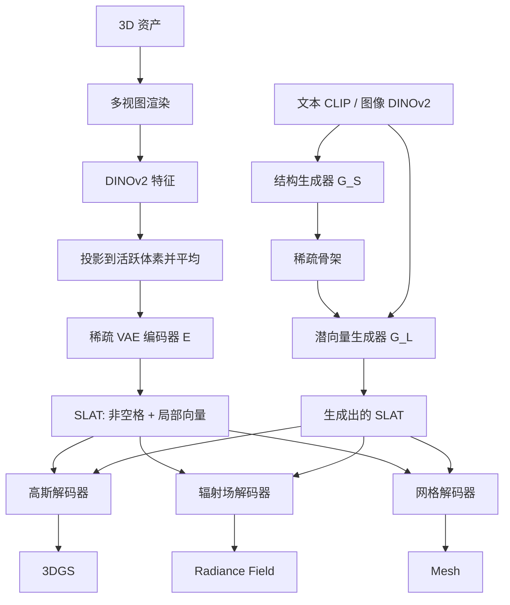

# TRELLIS：一套结构化潜变量，解码成 NeRF / 3DGS / mesh

<!-- release-date: 2024-12-02 -->

> 本文依据 Microsoft Research 主导的 **Structured 3D Latents for Scalable and Versatile 3D Generation**，即 arXiv:2412.01506v3（2025-05-30 修订，26 页），CVPR 2025 Highlight。封面水印为 `arXiv:2412.01506v3 [cs.CV] 30 May 2025`。动笔前核过 arXiv 提交历史：v1（2024-12-02 13:58:38 UTC）、v2（2025-04-17）、v3（2025-05-30）；本地件与官方最新版一致，**未做替换**。第一作者单位是清华大学，通讯作者 Jiaolong Yang 在 Microsoft Research；其余作者来自 Microsoft Research 与中国科学技术大学，部分标注为实习期间完成。按主要归属，目录放在 Microsoft。
>
> 全文页码指 PDF 自身页码。本篇从第 1 页起页脚就印着 `1`，PDF 页码与印刷页码一致，引用时可以直接对照。
>
> `release-date` 取 **2024-12-02**。这是模型权重首次出现在官方 Hugging Face 仓库的日期：[`microsoft/TRELLIS-image-large`](https://huggingface.co/microsoft/TRELLIS-image-large) 的权重提交 `2476b8d`（「Upload folder using huggingface_hub」）时间为 2024-12-02T13:14:19Z，不用仓库 `createdAt`。同日 arXiv v1 公开。GitHub [`Microsoft/TRELLIS`](https://github.com/Microsoft/TRELLIS) 在 2024-12-02 16:54 UTC 的 README 仍写「Code and models will be released by December 10th」；正式推理代码提交 `334d3b2` 的作者时间是 2024-12-04、committer 时间是 2024-12-05。训练代码与文生 3D 权重更晚（官方 README 写 2025-03-25）。按「权重 / 论文 / 代码里最早的官方可用日」，取 2024-12-02。
>
> 文中始终区分三件事：**报告写了什么**、**本文如何解释**、**哪些是外部补充**。凡是从图里读出来的、从官方仓库补进来的、或者对照同方向已发布报告得出的，都会当场说明。
>
> 边界说明：本篇只覆盖这份 CVPR 2025 论文里的物体级 TRELLIS（SLAT + 两阶段校正流）。后续的 TRELLIS.2 / O-Voxel **不是本报告内容**，文末只点一句并标明出处。同方向已发布的 Hunyuan3D 2.0、Seed3D 2.0 可以对照「一套表示能否解出多种 3D 格式」，**不要把那两篇的人评数字读成本报告的实验**。

## 3D 生成一直在换「纸张」，很少有人先问「要不要换」

先把矛盾摊开，再上名词。

图像生成几乎已经形成共识：像素太大，先压进一个统一的潜空间（latent space），再在这个压缩空间里做生成，最后解码回图。Stable Diffusion 那一套就是这个意思。3D 没有这份共识。报告一开篇就点出：3D 数据本身就有网格（mesh）、点云、辐射场（Radiance Fields / NeRF）、三维高斯（3D Gaussians）等多种格式，每种都为特定下游量身定做，换一种任务就别扭（PDF p. 2）。

这不是口味问题，是能力被格式绑死：

- 走网格或隐式场的方法，几何还能说得过去，细外观经常撑不住；报告的原话是它们「在精细外观建模上不如那些带体积渲染能力的表示」（PDF p. 2）。
- 走辐射场或三维高斯的方法，渲染出来好看，但「很难抽出说得过去的几何」（PDF p. 2）。
- 更麻烦的是：有的表示是规整网格，有的是一袋子无序图元。网络骨架很难共用。报告认为，这件事阻碍了 3D 生成形成像 2D 那样「在统一潜空间里学习」的标准范式（PDF p. 2）。

所以过去几年的 3D 生成，看起来像在追新表示：今年网格，明年高斯，后年又换一种隐式场。每换一次，编码器、生成器、损失函数几乎重做一遍。报告给这条路起了一个不太客气的名字：领域在「不停追求并适应新的表示」（PDF p. 2）。

TRELLIS 要做的，不是再发明第四种表示去赢前三种，而是造一个对最终格式无所谓的潜空间：先把物体写成一套带空间位置的局部潜变量，再按下游需要，分别解码成辐射场、三维高斯或网格（PDF p. 1–2）。这套潜变量叫 **SLAT**（Structured LATent，结构化潜变量）。建立在它上面的生成模型家族，论文里称为 TRELLIS（PDF p. 2）。

## 读之前只需要这几个词

下面这些词正文都会用到。这一节是读前背景，不全是报告自己定义的。

**网格（mesh）**：一堆顶点连成三角面。游戏引擎、建模软件、3D 打印原生吃的就是它。

**辐射场（Radiance Field）**：给空间里一点和一个视线方向，返回颜色和密度。沿视线积分就能渲染出图。NeRF 是这一族最出名的成员。报告解码出来的是一种局部体积辐射场，不是经典的单网络 NeRF。

**三维高斯（3D Gaussian Splatting，3DGS）**：把物体写成一堆带位置、颜色、尺度、不透明度和旋转的小椭球，投影到屏幕上 splatting 出图像。渲染快，外观细，抽干净网格却不容易。

**体素（voxel）**：把包围盒切成规则小立方体。被物体表面穿过的那些，报告叫 **active voxels**（活跃体素 / 非空格）。

**潜变量（latent）**：原数据的压缩表示。生成模型通常不在网格或高斯上直接扩散，而在这个更小的空间里生成，再解码回去。

**变分自编码器（Variational Auto-Encoder，VAE）**：一边把数据压成潜变量，一边从潜变量重建回去，并对潜变量加一点「看起来像标准正态分布」的约束。

**DINOv2**：一个大规模自监督视觉编码器。给它一张图，它吐出每个位置的特征向量。报告用它从多视图渲染图里抽局部外观，而不是自己从零训练一个 3D 编码器（PDF p. 2–3）。

**校正流 / 整流流（rectified flow）**：一种生成模型。它在数据和噪声之间拉一条近似直线，让网络学这条直线上的速度场，而不是像经典扩散那样学「这一步该减多少噪声」。

**无分类器引导（Classifier-Free Guidance，CFG）**：推理时同一步跑两次网络，一次带条件、一次不带，再按系数外推，让输出更听文本或图像。代价是每步算力翻倍。

**FlexiCubes**：一种可微的等值面抽网格算法。每个格子预测一组可变形参数和有向距离，再抽出三角网格（PDF p. 5，引用 [74]）。

## 一句话先说清

TRELLIS 的主张只有一句：**先把 3D 物体写成「稀疏骨架 + 每格一个向量」，这一套潜变量可以按需解码成辐射场、三维高斯或网格。**

它不是「一个网络同时喷出三种格式」，而是：

- 用稀疏的活跃体素钉住粗几何；
- 用钉在这些体素上的局部向量保存细外观和细形状；
- 三个解码器共享同一套潜变量，只换输出头；
- 生成时分两段：先生成哪些格子非空，再给非空格子填向量。

规模上，报告把生成模型训到最多约 20 亿参数，数据约 50 万个物体（PDF p. 1、p. 6）。文生、图生都做；局部增删替换不需要微调（PDF p. 2）。整份报告可以读成一件事：把「3D 用什么表示」从生成器里拆出去，留给解码器。

## 报告地图：26 页里各写了什么

先摊开篇幅。这份报告正文短、附录长，公式和超参大量在附录。

| 报告章节 | PDF 页 | 讲了什么 | 密度 |
|---|---|---|---|
| 标题、摘要、Figure 1 | p. 1 | SLAT；最多 2B、500K；约 10 秒；文/图条件与编辑 | 高 |
| §1 引言 | p. 2 | 表示绑死的矛盾；稀疏结构 + 视觉基座两条策略 | 高 |
| §2 相关工作 + §3 起 + §3.1 | p. 3 | 原生 3D / 2D 蒸馏 / 校正流；式 1；默认 $N=64$、$L\approx 20$K | 高 |
| Figure 2–3 + §3.2 前半 | p. 4 | 总览图；DINOv2 聚合；稀疏 VAE；式 2–3 | 高 |
| §3.2 网格 + §3.3–3.4 | p. 5 | 式 4–5；两阶段生成；无微调编辑 | 高 |
| Figure 4 + §4 实现 + Table 1 | p. 6 | 500K / 三档参数 / 64×A100；重建对照 | 高 |
| Figure 5–6 + Table 2 + §4.2 | p. 7 | Toys4k 定量；人评饼图 | 高 |
| Table 3–5 + Figure 7 + §4.3–4.4 | p. 8 | SLAT 尺寸、流 vs 扩散、模型规模；变体与局部编辑 | 高 |
| §5 结论 + 参考文献起 | p. 9 | 无新机制 | 低 |
| 参考文献续 | p. 10–13 | 112 条 | — |
| 附录 A.1 + Table 6 | p. 14 | 各网络层数、维度、参数量 | 高 |
| 附录 A.2 训练细节 | p. 15 | 高斯 / 辐射场 / 网格损失，式 6–12 | 高 |
| Table 7 + 附录 B 数据 | p. 16 | 时间步分布；四个源数据集与美学过滤 | 高 |
| Figure 8–9 + Table 8 + 评测协议起 | p. 17 | 过滤后 500777；Toys4k 3229 | 高 |
| 附录 C.1 指标定义 + Figure 10 | p. 18 | CD / F-score / FD / CLIP 怎么算 | 中 |
| Table 9 + Figure 11 + 附录 D–E | p. 19 | 104 人、2701 次选择；限制与未来工作 | 高 |
| Figure 12–20 | p. 20–26 | 更多生成、对照、编辑、场景拼装 | 低 |

读正文前先知道这几件事，后面才不会把「报告写了」和「仓库后来补了」混在一起：

- **论文正文把三档模型写成 342M / 1.1B / 2B**（PDF p. 6）。附录 Table 6 把文生、图生拆开：2B 那档是文生 XL（$G_S$ 975M + $G_L$ 1073M）；图生只给了 Large（556M + 600M）（PDF p. 14）。本文把「最多约 2B」当作论文主张，把图生 Large 的拆分当作附录事实，不拿 GitHub 卡片上的 1.2B 覆盖正文。
- **XL 的图像条件定量是空的。** Table 2 里 Ours XL 的 Image-to-3D 全是「–」（PDF p. 7）。图生主结果是 Large。
- **人评只给偏好比例，不给 Elo 或分项打分。** 104 名参与者、2701 次选择（PDF p. 19）。
- **没有端到端推理延迟表。** 「约 10 秒」只出现在 Figure 1 图注（PDF p. 1），没有硬件、没有分阶段耗时。
- **限制写在附录 E，不在正文结论。** 两条：两阶段不如端到端省；图生不把光照拆开，高光会烤进资产（PDF p. 19）。PBR 被明确留作未来工作。

## 全景：先编码成 SLAT，再分两段生成

按 Figure 2（PDF p. 4）重画。这张图只表示模块怎么连，不含耗时或精度。

三个要点：

**第一，编码和生成是两条路。** 上半截用真实 3D 资产学「怎么把物体写成 SLAT、怎么从 SLAT 解回去」；下半截用校正流从文本或图像直接生成 SLAT。训练时生成器吃的是编码器压出来的潜变量，不是原始网格。

**第二，生成故意拆成两段。** $G_S$ 只决定哪些体素非空；$G_L$ 只在这些非空格上填向量。报告的理由很具体：3D 大部分格子是空的，直接在密集体上生成又贵又没必要（PDF p. 5）。

**第三，三种输出格式不抢同一套解码器。** 编码器先跟高斯解码器一起端到端训练；辐射场和网格的解码器后训，而且把已经学好的编码器冻住（PDF p. 5）。所以「一套潜变量出三种格式」是被实验验证过的性质，不是三种头联合训练的副产品。

## 核心设计一：SLAT，把「在哪」和「长什么样」拆开

### 旧问题：潜空间要么丢位置，要么装不下外观

如果潜变量是一串没有坐标的 token，生成器很好写——它就是在写序列。代价是模型不再知道第 $k$ 个向量对应物体的哪一块，局部编辑和多格式解码都变难。如果潜变量是密集体素或三平面，位置还在，但空格子浪费算力，分辨率一高就胀。

报告要的是第三种：潜变量必须同时抓住粗结构和细外观，并且解码时还能换格式（PDF p. 2）。

### 新设计：只在表面附近的格子上放向量

对一个 3D 资产 $\mathcal{O}$，SLAT 写成一组带坐标的局部潜变量（PDF p. 3，式 1）：

$$
z=\{(z_i,p_i)\}_{i=1}^{L},\qquad z_i\in\mathbb{R}^{C},\quad p_i\in\{0,1,\ldots,N-1\}^{3}
$$

人话版：

- $p_i$：第 $i$ 个活跃体素在 $N^3$ 网格里的格子坐标，这个格子要和物体表面相交；
- $z_i$：钉在这格上的 $C$ 维向量，负责更细的形状和外观；
- $L$：非空格数量；因为 3D 很空，$L\ll N^3$。

默认 $N=64$，平均 $L=20$K（PDF p. 3）。$64^3=262144$，两万个非空格大约只占满格的 8%。这是**用报告数字做的比例换算**，原文只写了 $L\ll N^3$。

可以把它想成一份「只在墙所在位置做标记的建筑图」：图上不画空房间里的空气，只在墙穿过的格子写下一段描述。骨架告诉你屋子的轮廓，每格上的向量告诉你这面墙是木头、玻璃还是锈铁。

### 工作机制

活跃体素给出粗几何，局部向量补细节。因为每个 $z_i$ 带着明确的 $p_i$，后面的解码器可以只在这格附近恢复高斯、辐射小体积或网格顶点，而不必在整个 $64^3$ 上密集计算（PDF p. 3–4）。

分辨率能开到 64，靠的就是稀疏：空格子不进序列。报告把这件事同时当成质量手段和编辑接口——局部改一块，就是改对应的 $(z_i,p_i)$，别的格子可以不动（PDF p. 2、p. 5）。

### 收益、代价、边界

Table 3 用重建 PSNR / LPIPS 选 SLAT 尺寸。$32^3$ 上把通道从 16 加到 64，PSNR 只从 31.64 走到 31.85，几乎平台；改成 $64^3$、通道 8，PSNR 到 32.74、LPIPS 到 0.0250（PDF p. 8）。报告因此「质量优先于效率」，把 $64^3$、8 通道定为默认（PDF p. 8）。

代价也很清楚：平均 20K 个 token 仍然长。生成器第二段必须再做一次 $2^3$ 打包，否则 Transformer 吃不消（PDF p. 5）。另外，$N=64$ 钉死了骨架分辨率；网格要更高分辨率，只能在解码器里上采样到 $256^3$，而不是在 SLAT 里直接存 $256^3$（PDF p. 5）。

### 可迁移启发

表示设计里，「位置」和「内容」不必捆成同一种张量。能显式存储的稀疏坐标就显式存；把容量留给真正有信号的位置。这对任何「数据大部分是空的」的生成问题都成立，不一定是 3D。

## 核心设计二：不训 3D 编码器，把多视图 DINOv2 焊到格子上

### 旧问题：为 3D 单独做编码器，又贵又容易过拟合

一种常见做法是：先给每个物体拟合一套专用表示（高斯、图元、隐式场），再对这套拟合结果做压缩。报告点名 3DTopia-XL 这类「潜图元」路线，说预拟合「既贵又有损」（PDF p. 3）。另一条路是从 3D 数据自己学编码器，但 3D 资产的数量比自然图像少几个数量级，编码器很难获得 2D 视觉基座那种细节能力。

### 新设计：渲染很多张图，用现成的视觉基座填格子

编码分两步（PDF p. 3–4）。

**第一步，视觉特征聚合。** 把资产 $\mathcal{O}$ 先写成体素化特征 $f=\{(f_i,p_i)\}_{i=1}^{L}$。做法是：在球面上随机采样相机，渲染多视图，用预训练 DINOv2 抽特征图；再把每个活跃体素投影到这些特征图上，把投中位置的特征取平均，当作 $f_i$。$f$ 的分辨率与 SLAT 相同，默认也是 $64^3$（PDF p. 3）。

这一步没有新网络。它吃的是 DINOv2 已经学过的「这块看起来像什么」。报告给的理由是：DINOv2 被证明有 3D 意识、也能表示细节，于是可以绕开专用 3D 编码器，也去掉预拟合（PDF p. 2）。

**第二步，稀疏 VAE。** 编码器 $\mathcal{E}$ 把 $f$ 压成 $z$，解码器 $\mathcal{D}$ 再把 $z$ 解成某一种 3D 表示。重建损失在解码结果和真值之间算，并对 $z_i$ 加 KL 惩罚，让它接近正态分布（PDF p. 4，做法跟随 [73]）。

编码器和解码器共用同一套 Transformer 骨架，见图 3a（PDF p. 4）：把非空格上的特征串成变长序列，按体素坐标加正弦位置编码，再做 3D 移位窗口注意力（shifted window attention）。窗口注意力只让邻近格子互相看，既符合「潜变量是局部的」这个假设，也比全注意力便宜（PDF p. 4）。

附录把窗口写死：把 $64^3$ 切成 $8^3$ 的窗口，相邻层窗口平移 $(4,4,4)$，保证重叠均匀；层间在「不移位窗口」和「移位窗口」之间交替（PDF p. 14）。变长窗口里的注意力靠 FlashAttention / xformers 这类实现扛住（PDF p. 14）。

### 工作机制

一个格子最终拿到的 $f_i$，是「它在很多张渲染图上对应的 2D 特征」的平均。正面、侧面、顶面看到的信息被焊进同一个 3D 位置。VAE 再把这些仍然偏 2D 的特征，整理成后面三个解码器都能用的 $z_i$。

训练时高斯解码器与编码器一起端到端学；辐射场、网格解码器后训，编码器冻住（PDF p. 5）。报告认为：尽管潜变量是跟高斯一起学的，它仍然能忠实重建另外两种格式，这件事本身说明 SLAT 可扩展（PDF p. 5，指向 Table 1）。

### 收益、代价、边界

Table 1 把 SLAT 和三种大规模学来的潜表示比重建（PDF p. 6）：

| 方法 | 外观 PSNR↑ | 外观 LPIPS↓ | CD↓ | F-score↑ | PSNR-N↑ | LPIPS-N↓ |
|---|---:|---:|---:|---:|---:|---:|
| LN3Diff | 26.44 | 0.076 | 0.0299 | 0.9649 | 27.10 | 0.094 |
| 3DTopia-XL | 25.34† | 0.074† | 0.0128 | 0.9939 | 31.87 | 0.080 |
| CLAY | – | – | 0.0124 | 0.9976 | 35.35 | 0.035 |
| **Ours** | **32.74 / 32.19‡** | **0.025 / 0.029‡** | **0.0083** | **0.9999** | **36.11** | **0.024** |

† 用 albedo 评；‡ 斜线后是辐射场。评测集是过滤后 Toys4k 里随机 500 个实例（PDF p. 17）。几何上，SLAT 甚至超过了只做形状编码的 CLAY（PDF p. 7）。

代价：这套编码**依赖渲染**。每个物体要能被从周围看一圈；开放曲面、半透明、复杂遮挡会不会把平均特征弄脏，报告没有单独消融。DINOv2 选哪一档、渲染多少张用于聚合，正文只说「稠密多视图」「球面上随机相机」（PDF p. 3）；150 张这个数字出现在训练数据渲染设定里（PDF p. 6），**报告没有写死编码阶段是否也是 150 张**。

另一个边界：编码器是跟高斯一起学的。冻住它再训网格头，能工作，但不保证网格头看到的 $z$ 对几何是最优的。报告用 Table 1 证明「够用」，没有证明「对每种格式都最优」。

### 可迁移启发

数据少的模态，不一定要自己从零训编码器。如果存在一个已经很强、并且「碰巧」对你的模态有感觉的基座（这里是 2D 视觉对 3D 的意识），先把问题投影到那个基座的输入空间，再在投影结果上做一层轻量对齐。TRELLIS 的对齐层就是「投影到体素 + 稀疏 VAE」，不是再训一个巨大的 3D ViT。

## 核心设计三：三个解码器，只换输出，不换潜空间

### 旧问题：生成器一旦绑死某种图元，下游就没得选

只出高斯，游戏引擎还要再抽网格；只出网格，要一张能转圈看的高光图又得另训纹理模型。报告把「灵活选择输出格式」写成以往模型没提供的能力（PDF p. 1–2）。

### 新设计：同一套 $(z_i,p_i)$，三套输出头

三个解码器 $\mathcal{D}_{\mathrm{GS}}$、$\mathcal{D}_{\mathrm{RF}}$、$\mathcal{D}_{\mathrm{M}}$ 共用 Transformer 骨架，只改最后一层，并用各自的重建损失训练（PDF p. 4）。

**高斯。** 每个 $z_i$ 解出 $K$ 个高斯，带位置偏移、颜色、尺度、不透明度、旋转（PDF p. 4，式 2）。为了保住局部性，最终位置被锁在本格附近：

$$
x_i^k = p_i + \tanh(o_i^k)
$$

$\tanh$ 把偏移压进 $(-1,1)$，高斯不能跑去别的格子冒充别的部件。附录写 $K=32$，并跟 Mip-Splatting 一样给尺度设下限 $9\times 10^{-4}$、屏幕空间滤波方差 0.1（PDF p. 15）。因为高斯是网络预测的，原版 3DGS 那套「密度控制」（该分裂就分裂、该删就删）用不上，于是另加体积正则和透明度正则，防止高斯变得过大或全透明（PDF p. 15，式 6–7）：

$$
\mathcal{L}_{\mathrm{GS}}=\mathcal{L}_{\mathrm{recon}}+\mathcal{L}_{\mathrm{vol}}+\mathcal{L}_{\alpha}
$$

其中 $\mathcal{L}_{\mathrm{recon}}=L_1+0.2(1-\mathrm{SSIM})+0.2\,\mathrm{LPIPS}$，$\mathcal{L}_{\mathrm{vol}}$ 是所有高斯尺度之和，$\mathcal{L}_{\alpha}$ 惩罚 $1-\alpha$ 的平方（PDF p. 15）。

**辐射场。** 每个 $z_i$ 解出一组 CP 分解向量，表示该格内 $8^3$ 的局部辐射体积，跟随 Strivec（PDF p. 4，式 3）：

$$
v_i^x,v_i^y,v_i^z\in\mathbb{R}^{16\times 8},\qquad v_i^c\in\mathbb{R}^{16\times 4}
$$

附录把组装方式写清楚：秩 $R=16$，局部体积最后一维 4 通道是颜色加密度；按活跃体素的位置拼起来，得到 $512^3$ 的辐射场。他们还写了一个 CUDA 可微渲染器，把排序、沿光线行进、辐射积分和 CP 重建融进同一个 kernel（PDF p. 15，式 8）。训练目标就是上面的 $\mathcal{L}_{\mathrm{recon}}$。

**网格。** 每个 $z_i$ 先解出 $4^3$ 的细格子参数，再经两段卷积上采样把空间尺寸从 $64^3$ 拉到 $256^3$（PDF p. 5，式 4）。每个细格预测 FlexiCubes 的可变形参数 $w_i^j\in\mathbb{R}^{45}$ 和 8 个顶点的有向距离 $d_i^j\in\mathbb{R}^8$。从 0 等值面抽网格，用渲染深度 / 法线图的 $L_1$ 做重建（PDF p. 5）。

附录把 $w$ 拆开：插值权重、劈分权重、顶点形变；另外还预测顶点颜色和法线。非活跃格子的有向距离被设成 1.0，其余属性为 0，然后在密集体上做可微抽面。损失是几何 + 0.1×颜色 + 正则，正则里包含同一顶点被多个体素预测时的一致性、FlexiCubes 自带的形变正则、以及让 $d$ 贴近顶点到抽出来的表面的距离（PDF p. 15，式 9–12）。渲染器用 Nvdiffrast（PDF p. 15）。

### 工作机制

三个头读的是同一句话，只是用不同语法把它说出来。高斯头说「这格附近撒 32 个椭球」；辐射场头说「这格内用 16 秩 CP 分解填一个 $8^3$ 小体积」；网格头说「把这格细分成 $4^3$，用 FlexiCubes 抽三角面」。因为 $z_i$ 已经同时含几何和外观，网格头甚至能顺便预测顶点色，而不必再等一个独立的上色模型——报告在附录写「虽然主要关注形状，我们也预测颜色和法线」（PDF p. 15）。

### 收益、代价、边界

收益就是 Table 1：同一套潜变量，外观用高斯评、几何用网格评，两项都高于专门为某一种表示学的潜空间（PDF p. 6–7）。定性上，Figure 4 把高斯外观和网格几何并排展示：收音机的网罩、玩具枪的划痕走外观，推土机中空驾驶室、锋利边缘走几何（PDF p. 6–7）。

代价：

- 高斯被锁在本格，$\tanh$ 偏移跨不出格子。细长结构如果被骨架切碎，高斯无法靠「跑到邻格」来修补，只能指望 $G_S$ 把骨架生成对。
- 辐射场拼到 $512^3$，网格抽到 $256^3$，两者分辨率策略不同。报告没有讨论「同一套 SLAT 解出的网格和高斯在轮廓上是否逐像素一致」。
- 网格这条线仍然走等值面。开放曲面、非流形，附录 E 没写，但等值面方法的经典短板还在。报告把 PBR 和更干净的材质留到未来（PDF p. 19），所以这里的「顶点色」不是生产级材质。

### 可迁移启发

「一个潜空间服务多种下游」往往不是把所有头和编码器绑在一起联合训练，而是：**先用最好训、信号最密的那种重建任务把潜空间撑开，再冻住它，给别的下游接头。** TRELLIS 选高斯当这个先锋任务，因为「保真度和效率都高」（PDF p. 5）。若你的系统也有多种导出格式，先问哪一种重建损失最稳、梯度最密，而不是一开始就三头并行。

## 核心设计四：两阶段校正流，先长骨架再填肉

### 旧问题：稀疏结构不是密集张量，生成器没法直接套

SLAT 是变长的 $\{(z_i,p_i)\}$。标准 DiT / 校正流吃的是规整网格或固定长度 token。如果把 20K 个非空格直接当序列做全注意力，长度已经不便宜；如果在 $64^3$ 密集体上生成，绝大多数位置是「这里什么都没有」，预算浪费在空格子上。

### 新设计：先生成占用，再生成非空格上的向量

整条生成是两段校正流 Transformer，一段管结构 $G_S$，一段管局部向量 $G_L$（PDF p. 5，Figure 2）。

校正流的前向是数据和噪声之间的线性插值（PDF p. 5）：

$$
x(t)=(1-t)x_0+t\epsilon
$$

这里 $x_0$ 是数据，$\epsilon$ 是噪声，$t$ 从 0 走到 1。这和某些把 $x_0$ 当噪声的写法相反，读公式时不要串。反向是一个速度场 $v(x,t)=\nabla_t x$，网络 $v_\theta$ 用条件流匹配（Conditional Flow Matching，CFM）去拟合（PDF p. 5，式 5）：

$$
\mathcal{L}_{\mathrm{CFM}}(\theta)=\mathbb{E}_{t,x_0,\epsilon}\bigl\|v_\theta(x,t)-(\epsilon-x_0)\bigr\|_2^2
$$

目标速度就是「噪声减数据」。网络学会之后，从噪声沿这个速度走回去，就到数据。

**第一段，稀疏结构。** 先把活跃体素写成密集二值网格 $O\in\{0,1\}^{N\times N\times N}$，有物体为 1，否则为 0。直接生成这个 $64^3$ 二值体仍然贵，于是再套一个 3D 卷积 VAE，压成低分辨率连续特征 $S\in\mathbb{R}^{D\times D\times D\times C_S}$（PDF p. 5）。附录把压缩比写死：$64^3\to 16^3$，通道在 64 / 32 / 16 三档分辨率上分别是 32 / 128 / 512，潜通道 8；上采样用 pixel shuffle，GroupNorm 换成 LayerNorm，没有自注意力（PDF p. 14）。因为 $O$ 只表示粗几何，这份压缩「几乎无损」（PDF p. 5）。

$G_S$ 是一个普通 Transformer：把 $S$ 摊平，加位置编码，用 adaLN 和门控注入时间步，用交叉注意力注入条件。文本条件走预训练 CLIP，图像条件走 DINOv2（PDF p. 5）。去噪后的 $S$ 经结构解码器变回离散占用，再转成 $\{p_i\}$。

结构 VAE 的训练被写成二分类。正负格极不平衡，所以用 Dice loss，而不是普通交叉熵（PDF p. 15）。

**第二段，局部向量。** 已知 $\{p_i\}$，生成 $\{z_i\}$。这里不把 20K 个向量直接序列化，而是先用稀疏卷积把 $2^3$ 邻域打包成更短的序列，再进 Transformer，最后卷积上采样回去，并与下采样块做 skip connection（PDF p. 5，Figure 3c）。打包方式跟随 DiT 的 patchify，只是补丁落在稀疏结构上（PDF p. 5）。

$G_S$ 和 $G_L$ 分开用式 5 训练。推理时先跑结构，再跑向量，再任选一个解码器导出（PDF p. 5）。

时间步采样没有照搬 SD3 的 $\mathrm{logitNorm}(0,1)$，而是改成 $\mathrm{logitNorm}(1,1)$。Table 7 显示，结构段 Toys4k 上 CLIP 从 26.03 升到 26.37，$\mathrm{FD}_{\mathrm{dinov2}}$ 从 287.33 降到 269.56；向量段 CLIP 持平 26.61，$\mathrm{FD}_{\mathrm{dinov2}}$ 从 242.36 降到 240.20（PDF p. 16）。

训练不稳时，查询和键的范数会爆。报告说这和 SD3 遇到的问题类似，于是在注意力前对 Q、K 做 RMSNorm（PDF p. 14）。

### 工作机制

两段的分工可以读成：

1. $G_S$ 回答「物体占了哪些格子」——这是拓扑和粗轮廓；
2. $G_L$ 在已经占用的格子上回答「每一格长什么样」——这是划痕、材质、局部起伏。

条件从交叉注意力进两段，所以同一句「红色玩具枪」既影响骨架（该有弹匣、该有握把），也影响局部向量（透明弹匣、表面划痕）。CFG 训练时以 0.1 的概率丢掉条件；推理时引导强度 3、采样 50 步（PDF p. 6）。

### 收益、代价、边界

Table 4 在每一段上单独把校正流换成 DiT 风格的扩散，另一段保持 XL。无论换哪一段，校正流都更好（PDF p. 8）：

| 改哪一段 | 方法 | 训练集 CLIP↑ | 训练集 $\mathrm{FD}_{\mathrm{dinov2}}$↓ | Toys4k CLIP↑ | Toys4k $\mathrm{FD}_{\mathrm{dinov2}}$↓ |
|---|---|---:|---:|---:|---:|
| Stage 1 | Diffusion | 25.09 | 132.71 | 25.86 | 295.90 |
| Stage 1 | Rectified flow | **25.40** | **113.42** | **26.37** | **269.56** |
| Stage 2 | Diffusion | 25.58 | 100.88 | 26.45 | 244.08 |
| Stage 2 | Rectified flow | **25.65** | **95.97** | **26.61** | **240.20** |

Table 5 再看规模。B / L / XL 在 Toys4k 上 CLIP 为 26.47 / 26.60 / 26.70，$\mathrm{FD}_{\mathrm{dinov2}}$ 为 265.26 / 238.60 / 237.48（PDF p. 8）。从 B 到 L 跳得大，从 L 到 XL 已经很平。结合 Table 2：图生主模型是 L，文生 XL 只比 L 好一点（PDF p. 7–8）。

附录 Table 6 把网络配齐（PDF p. 14）。文生三档的生成器参数是：

| 档 | $G_S$（文） | $G_L$（文） | 合计（与正文三档对应） |
|---|---:|---:|---:|
| Basic | 157M（12 层 / 768 维） | 185M | 342M |
| Large | 543M（24 层 / 1024 维） | 588M | 1.131B，正文写作 1.1B |
| X-Large | 975M（28 层 / 1280 维） | 1073M | 2.048B，正文写作 2B |

图生 Large：$G_S$ 556M、$G_L$ 600M。VAE 一侧：结构编码器 59.3M、结构解码器 73.7M；SLAT 编码器 85.8M；三个 SLAT 解码器 85.4M / 85.4M / 90.9M（PDF p. 14）。这些参数量是附录给出的，正文只写了三档总数。

代价在附录 E 写得很直：两阶段「可能不如端到端、一次生成完整 3D 资产来得高效」（PDF p. 19）。结构错了，第二段不能回头改占用——它只能在已有格子上填向量。这也是局部编辑必须两段都改的原因。

另一个边界：图像条件和文本条件不是对称的。论文推荐的定性展示大量走「先用 GPT-4o / DALL-E 3 出图，再图生 3D」（PDF p. 1、p. 6）。Table 2 里图生 CLIP 是 85.77，文生只有 26.70，两个分数的定义不同（图–图 vs 图–文），**不能直接比大小**；但人评里图生偏好 94.5%、文生 67.1%，差距是同口径的（PDF p. 7、p. 19）。

### 可迁移启发

稀疏数据上的生成，不必一上来就做「变长无序集合的扩散」。先把离散占用变成低分辨率连续特征，让标准 Transformer 能吃；真正的变长只留在第二段，并且用局部打包把长度压回去。QK-RMSNorm、时间步分布从 $\mathrm{logitNorm}(0,1)$ 改到 $(1,1)$，都是「同一套流匹配，换数据分布就要重调采样」的例子——超参不能从图像 SD3 原样搬运。

## 核心设计五：编辑几乎是白送的，因为局部性本来就在

### 旧问题：生成器把整个物体揉成一团潜向量，改一处等于重画

如果潜空间没有位置，想「把屋顶换成尖顶、墙不动」，通常要微调、要 inversion，或者只能重新采样碰运气。报告把「无需微调的局部增删替换」列为以往模型没提供的能力（PDF p. 2）。

### 新设计：两种不训练的操作

**细节变体。** 骨架 $\{p_i\}$ 保持不变，只改第二段的文本条件，重新生成 $\{z_i\}$。粗轮廓还在，表面和局部几何可以换成「稻草」「生锈」「未来感塑料」「低面数锐边」（PDF p. 5、p. 8，Figure 7a）。

**区域编辑。** 利用 SLAT 的局部性，只改包围盒里的体素和向量，外面不动。他们把图像修复方法 Repaint 接到两阶段流上：给定要改的包围盒，采样时在该区域内生成新内容，并条件于未改区域以及文本或图像提示。第一段在盒内长新骨架，第二段补一致的细节（PDF p. 5）。Figure 7b 展示了从输入机甲上拆掉手臂、加上武器、把腿换成履带（PDF p. 8）；Figure 1 的小岛则是「屋子改成树 → 加河」（PDF p. 1）。

### 工作机制

Repaint 的核心是：扩散 / 流的每一步，把「不该改的区域」用已知数据（再加噪声）写回去，只让未知区域跟网络走。接到 TRELLIS 上，就要在两段都做这个动作——否则第一段把盒外的占用也改了，第二段再忠实也救不回来。

报告称这些策略是 tuning-free，没有为编辑另训网络（PDF p. 5）。

### 收益、代价、边界

定性结果看起来干净：加河、换屋顶、给机甲加武器，盒外结构大体保持（PDF p. 8、p. 25）。没有定量编辑指标：没有掩膜 IoU，没有「未编辑区域的 PSNR」，也没有失败案例统计。包围盒是怎么来的、边缘如何羽化、条件多强，正文只写到「给定包围盒」（PDF p. 5）。

这是「表示带来的能力」，不是「另做一个编辑模型」。它能做的上限，就是骨架分辨率 $64^3$ 能表达的局部。比格子更细的修改，只能靠第二段的向量，动不了占用。

### 可迁移启发

想做局部控制，先问潜变量有没有坐标。有坐标，修复式采样往往够用；没坐标，再考虑 inversion 或另训控制器。TRELLIS 把编辑写成 SLAT 的推论，而不是产品功能列表里的一项外挂。

## 数据与训练：50 万不是爬到的，是滤出来的

### 旧问题：公开 3D 集合很大，但能拿来训生成器的不多

Objaverse-XL 号称超过 1000 万物体，来源包括 GitHub、Thingiverse、Sketchfab 等。报告说它很噪：缺部件、低分辨率贴图、简化几何都有（PDF p. 16）。现成的 3D 标题要么对不齐，要么不够细，直接拿来做文生 3D 会卡住（PDF p. 16）。

### 新设计：四个来源 + 美学分过滤 + GPT-4o 多级标题

训练集约 500K，来自四个公开数据集：Objaverse (XL)、ABO、3D-FUTURE、HSSD（PDF p. 6）。附录 B 把来源拆开（PDF p. 16）：

- Objaverse-XL 只收 Sketchfab（也就是 Objaverse v1）和 GitHub，不收全部 1000 万；
- ABO 约 8K 亚马逊艺术家模型，偏家具和室内；
- 3D-FUTURE 约 16.5K 工业设计家具；
- HSSD 约 14K，室内场景资产；
- Toys4k 约 4K、105 类，**不进训练集**，专门当测试。

清洗：每个物体从均匀分布的 4 个视角渲染，用开源美学评分模型给图打分，再对 4 张图取平均。Objaverse-XL 阈值 5.5，其余 4.5。低于阈值的通常是几乎没贴图或几何过简的物体（PDF p. 16）。Table 8 给出过滤后的精确个数（PDF p. 17）：

| 来源 | 美学阈值 | 过滤后数量 |
|---|---:|---:|
| ObjaverseXL（Sketchfab） | 5.5 | 168307 |
| ObjaverseXL（GitHub） | 5.5 | 311843 |
| ABO | 4.5 | 4485 |
| 3D-FUTURE | 4.5 | 9472 |
| HSSD | 4.5 | 6670 |
| **训练合计** | – | **500777** |
| Toys4k（评测） | 4.5 | 3229 |

标题：先用 GPT-4o 对渲染图写一份很细的 `<raw captions>`，再压成不超过 40 词的 `<detailed captions>`，最后再总结成长度递减的多个版本做增强。Figure 10 把完整提示词摊开，要求「避免想象、逐步来、不要描述背景」（PDF p. 17–18）。图像条件则用不同视场角做增强（PDF p. 6）。VAE 训练的渲染是 150 张、球面半径 2、视场 40°、Blender、平滑面积光；图生模型另渲一套视场 10°–70° 的图（PDF p. 6、p. 17）。

优化：AdamW，学习率 $1\times 10^{-4}$，CFG 丢弃率 0.1。XL 用 64 张 40G A100，400K 步，batch 256（PDF p. 6）。推理 CFG=3、50 步。

报告强调全程 fitting-free：训练物体不需要先做一轮 3D 拟合（PDF p. 2）。

### 收益、代价、边界

500777 这个数被滤得很干净：GitHub 子集从 5,238,768 张样本的美学分布里切 5.5，只留 311843（PDF p. 17，Figure 8）。质量上去了，多样性是否被切偏，报告没有做「不过滤 vs 过滤」的生成消融。家具、玩具、游戏风资产会偏多，这和项目页后来写的「擅长艺术风、写实真实物体有限」对得上——那句话在项目页，不在 PDF，算外部补充。

标题完全依赖 GPT-4o。报告没有评估标题准确率，也没有人工抽检表。Figure 10 的提示词反复写「avoid hallucination」，这只能说明作者意识到风险，不能说明风险已被测过。

算力只给了 XL 的卡数和步数。Basic / Large 训了多久、图生 Large 是否共用这 64 卡，没写。单次生成「约 10 秒」没有测试平台（PDF p. 1）。

### 可迁移启发

3D 生成的数据瓶颈经常不在「有没有 1000 万」，而在「这 1000 万里有多少张能当生成监督」。用一个便宜的 2D 美学模型做四视图过滤，是把 2D 已有的质量判别器借到 3D 上。阈值在不同源上不同（5.5 vs 4.5），说明「同一把尺子量所有来源」并不成立。

多级标题（详细 → 40 词 → 越来越短）是在为 CFG 和短提示推理做数据增强。若你的条件编码器在训练时只见过长文，推理时用户只会写五个词，分布就断了。

## 实验证明了什么

评测主场是 Toys4k，报告明确说它不在本方法以及对照方法的训练集里（PDF p. 6）。定量用 CLIP（条件一致性）以及 Inception / DINOv2 / PointNet++ 上的 Fréchet 距离和核距离（PDF p. 8）。外观渲染 4 个水平视角；几何从多视图深度反投影后用最远点采样取 4000 点算 $\mathrm{FD}_{\mathrm{point}}$（PDF p. 18）。

对照方法覆盖两条路线：2D 辅助的 InstantMesh、LGM；原生 3D 的 Shap-E、3DTopia-XL、LN3Diff、GaussianCube。CLAY 的生成模型当时拿不到，所以生成阶段不比（PDF p. 7）。

Table 2 的主数字（PDF p. 7；KD 已乘 100）：

| 方法 | 文生 CLIP↑ | 文生 $\mathrm{FD}_{\mathrm{dinov2}}$↓ | 文生 $\mathrm{FD}_{\mathrm{point}}$↓ | 图生 CLIP↑ | 图生 $\mathrm{FD}_{\mathrm{dinov2}}$↓ | 图生 $\mathrm{FD}_{\mathrm{point}}$↓ |
|---|---:|---:|---:|---:|---:|---:|
| Shap-E | 25.04 | 497.17 | 6.58 | 82.11 | 465.74 | 8.20 |
| LGM | 24.83 | 507.47 | 24.73 | 83.97 | 322.71 | 15.90 |
| InstantMesh | 25.56 | 478.92 | 10.79 | 84.43 | 264.36 | 9.63 |
| 3DTopia-XL | 22.48† | 756.37† | 13.72 | 78.45† | 437.37† | 18.21 |
| LN3Diff | 18.69 | 976.40 | 19.40 | 82.74 | 357.93 | 7.86 |
| GaussianCube | 24.91 | 460.07 | 29.95 | – | – | – |
| **Ours L** | **26.60** | **238.60** | **5.24** | **85.77** | **67.21** | **2.03** |
| **Ours XL** | **26.70** | **237.48** | **5.21** | – | – | – |

† 用 PBR 网格的着色图评。报告的定性判断：2D 辅助方法有多视图不一致带来的结构扭曲；其它原生 3D 方法受潜空间重建保真度限制，外观和几何都偏平；GaussianCube 和 LGM 抽不出说得过去的几何，这是 3D 高斯表示的固有问题（PDF p. 8）。

人评：68 条 AI 生成文本、67 张图，每种方法各生成一次、不做挑选。104 人，每人随机 50 题，选项顺序打乱，可投「不确定」。合计 2701 次选择（PDF p. 8、p. 19）。Table 9（PDF p. 19）：

| 方法 | 文生选择次数 | 文生占比 | 图生选择次数 | 图生占比 |
|---|---:|---:|---:|---:|
| 不确定 | 56 | 4.2% | 6 | 0.4% |
| Shap-E | 42 | 3.1% | 6 | 0.4% |
| LGM | 70 | 5.2% | 22 | 1.6% |
| InstantMesh | 123 | 9.1% | 30 | 2.2% |
| 3DTopia-XL | 5 | 0.4% | 5 | 0.4% |
| LN3Diff | 9 | 0.7% | 6 | 0.4% |
| GaussianCube | 139 | 10.3% | – | – |
| **Ours** | **905** | **67.1%** | **1277** | **94.5%** |
| 合计 | 1349 | 100% | 1352 | 100% |

图生几乎一边倒；文生仍有约三分之一的票分给别人或不确定。GaussianCube 拿下文生第二，但几何定量最差（$\mathrm{FD}_{\mathrm{point}}$ 29.95）。人评问的是「哪一个和提示最像、整体质量最好」，不是「哪一个网格能进引擎」（PDF p. 19）。把 67.1% 读成「几何也赢了」，是过度解释。

附录还和商业模型 Rodin Gen-1 做了图生对照，只用默认设置、DALL-E 3 出的图。报告的说法是：TRELLIS 只在开源数据上训、没有商业专用设计，复杂案例上几何结构更细（PDF p. 19、p. 24）。这是定性观察，没有表。

附录 D.4 用生成出来的资产拼了铁匠铺和街景（PDF p. 19、p. 26）。这是「物体摆进场景」，不是场景生成模型。不要把它读成世界模型。

同方向对照（外部，不是本报告实验）：Hunyuan3D 2.0 把形状压成没有坐标的一维 token，纹理再走多视图 2D；Seed3D 2.0 仍然先网格后 PBR。TRELLIS 把空间坐标留在潜变量里，所以同一套 $z$ 能解出高斯、辐射场和网格。三条路都承认「一种 3D 格式不够用」，拆法不同。

## 限制、没写的，以及还不该当成已经解决的事

附录 E 只承认两条（PDF p. 19）：

1. **两阶段可能更慢。** 没有和端到端方案比墙钟时间。Figure 1 的「约 10 秒」不能当作已经很快的证据，只能当作作者自己的量级描述。
2. **图生不分离光照。** 参考图里的阴影和高光会烤进资产。作者认为可以在训练时做更强的光照增强，并让模型预测 PBR 材质，但「留给未来」（PDF p. 19）。

此外报告没写、本文也不补的缺口：

- 没有安全、许可、偏见评测。项目页有一段材料免责声明和「目前更擅长艺术风」的观察，那是**外部补充**，不是 PDF 结论。
- 没有开放曲面、透明物体、人像、场景级的专项测试。正文只在定性里提了一句能处理半透明杯子（PDF p. 7）。
- 没有把三种解码结果互相对齐的指标。
- 没有推理时选哪种格式的自动策略——格式选择是用户的事。
- 训练代码、数据工具和文生权重的发布时间晚于论文，见文首。本文不根据后来的仓库行为回写论文。

## 可迁移启发汇总

1. **先问表示有没有坐标。** 有坐标，局部编辑、稀疏计算、多解码器才能从结构上成立，而不必每个都做新任务。
2. **空的部分不要进网络。** $L\ll N^3$ 不只是省显存，它决定了生成器必须拆成「占用 + 内容」两段。
3. **用最稳的重建任务撑开潜空间，再冻住接其它头。** 高斯在这里扮演这个角色。
4. **数据少的模态，优先借用相邻模态的基座。** DINOv2 的多视图平均，比从 50 万物体训一个 3D 编码器更现实。
5. **流匹配的时间步分布是数据相关的超参。** 从图像 SD3 抄 $\mathrm{logitNorm}(0,1)$ 会亏；Table 7 是直接证据。
6. **QK 范数爆炸不是图像生成私有的病。** 3D Transformer 同样用 RMSNorm 压 QK。
7. **人评和几何指标会打架。** GaussianCube 人评第二、点云 FD 最差。产品如果要进引擎，不要只看偏好饼图。
8. **过滤比堆数量更关键。** 500777 是从远大于这个数的公开集合里按美学分切出来的。

## 关键词回看

- **SLAT**：稀疏活跃体素 + 每格一个局部向量；默认 $64^3$、平均 20K 非空格、8 通道。
- **活跃体素 $p_i$**：与表面相交的格子，负责粗结构。
- **局部潜变量 $z_i$**：钉在 $p_i$ 上的向量，负责细形状和外观。
- **DINOv2 聚合**：多视图特征投影到体素后取平均，充当 3D 编码器的输入。
- **稀疏 VAE**：只在非空格上做 Transformer，3D 移位窗口注意力。
- **$\mathcal{D}_{\mathrm{GS}}/\mathcal{D}_{\mathrm{RF}}/\mathcal{D}_{\mathrm{M}}$**：三套解码器，共享潜空间，分别出高斯、辐射场、网格。
- **$G_S / G_L$**：两阶段校正流，先占用后向量。
- **CFM**：拟合「噪声减数据」这条直线速度。
- **Repaint 式区域编辑**：两阶段采样时把盒外写回已知区域。
- **fitting-free**：训练物体不先做 per-asset 的 3D 拟合。

## 最后的判断

TRELLIS 被实验撑住的核心不是「20 亿参数的 3D 模型」，而是：**把 3D 生成从『追新表示』里拔出来，改成『一个带坐标的潜空间 + 按需解码』。** Table 1 证明这套潜变量能同时服务外观和几何；Table 2 和 104 人的偏好证明生成质量在 Toys4k 设定下明显好于当时的开源对照；Table 3–5 和 Table 7 证明 $64^3$、校正流、把模型从 B 扩到 L，各自都有贡献。

它没有证明的也一样清楚。两阶段有没有比端到更快，不知道；烤进资产的光照怎么去掉，论文只给方向；文生仍明显弱于「先出图再图生」这条实用路径；人评问的是好看和像，不是能打印、能进引擎、能换灯光。

如果只记一句话：

> **3D 生成不必每换一种下游格式就换一套生成器。先把『在哪』写成稀疏骨架，把『是什么』写成钉在骨架上的向量；格式是解码器的事。**

## 资料与阅读边界

- 原始依据：本地 `papers/Microsoft/TRELLIS.pdf`，arXiv:2412.01506v3，26 页，CVPR 2025 Highlight。
- 官方项目页：[https://microsoft.github.io/TRELLIS/](https://microsoft.github.io/TRELLIS/)（页上写明这是 TRELLIS 项目唯一官方网页）。
- 官方代码：[https://github.com/Microsoft/TRELLIS](https://github.com/Microsoft/TRELLIS)。
- 官方权重：[microsoft/TRELLIS-image-large](https://huggingface.co/microsoft/TRELLIS-image-large) 以及同组织下的 `TRELLIS-text-base` / `TRELLIS-text-large` / `TRELLIS-text-xlarge`。阅读权重配置时应以具体 commit 为准；本文没有把 `pipeline.json` 里与论文不一致的采样步数、CFG 系数冒充论文结论。
- 论文引用的校正流：[Flow Matching for Generative Modeling](https://arxiv.org/abs/2210.02747)（Lipman 等，ICLR 2023）。公式以本 PDF 式 5 为准。
- 同方向已发布解读：`reports/Tencent/Hunyuan3D-2.0.md`、`reports/ByteDance/Seed3D-2.0.md`。只对照表示选择，不借用它们的人评数字。

论文之后、不属于本报告的一句：同一团队后来发布了 TRELLIS.2（O-Voxel，另见 arXiv:2512.14692 与 [microsoft/TRELLIS.2](https://github.com/microsoft/TRELLIS.2)），用来处理更任意的拓扑和 PBR；**那不是本 PDF 的内容，本文不展开。**
