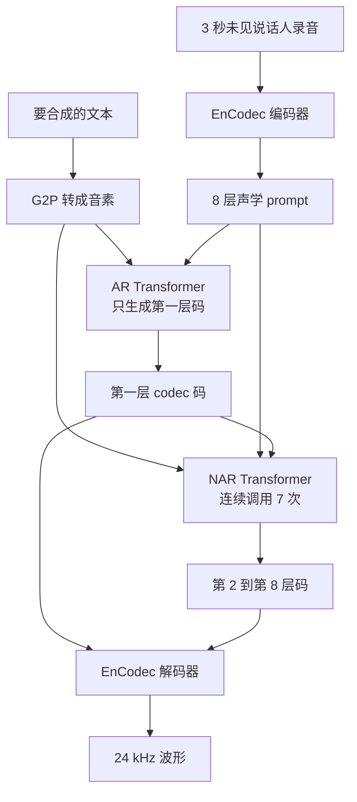

# VALL-E：TTS 不再回归连续频谱，而是对离散 codec 码做语言建模

<!-- release-date: 2023-01-05 -->

> 本文依据 Microsoft 的 **Neural Codec Language Models are Zero-Shot Text to Speech Synthesizers**，即 arXiv:2301.02111v1（2023-01-05，16 页）。封面水印为 `arXiv:2301.02111v1 [cs.CL] 5 Jan 2023`。动笔前核过 [arXiv 摘要页](https://arxiv.org/abs/2301.02111)：目前只有 v1，提交时间 2023-01-05 15:37:15 UTC，注释写着 Working in progress。本地 PDF 16 页、约 1.39 MB，与官方 v1 一致，**未做替换**。
>
> 2025 年这篇工作另有 IEEE TASLP 期刊版（IEEE Transactions on Audio, Speech and Language Processing, Vol. 33, pp. 705–718，DOI [10.1109/TASLPRO.2025.3530270](https://doi.org/10.1109/TASLPRO.2025.3530270)，线上发表日 2025-01-15）。期刊摘要把训练数据写成 **50 k 小时**，并改用 Libriheavy（LibriLight 的带标签版本）。预印本写的是 **60K 小时 LibriLight**。本文只依据 16 页预印 v1；期刊版若数字、数据名或设定不同，**一律不混用**。
>
> 页码均指这份 16 页 PDF 自身页码。本篇从第 1 页起页脚就印着 `1`，PDF 页码与印刷页码一致。
>
> `release-date` 取 **2023-01-05**。这是一篇方法论文，官方权重当时基本未放，对象从未作为产品、API 或可下载检查点对外可用，因此按「这项技术首次官方公开日」取值。核过三条官方渠道：arXiv v1 于 2023-01-05 15:37:15 UTC 公开；[Microsoft Research 论文页](https://www.microsoft.com/en-us/research/publication/neural-codec-language-models-are-zero-shot-text-to-speech-synthesizers/) 标注 January 2023，链到同一份 arXiv，没有找到更早的 Microsoft Research 博客专文；GitHub [`microsoft/unilm`](https://github.com/microsoft/unilm) 的 News 写「January, 2023: VALL-E」，子目录 [`unilm/valle`](https://github.com/microsoft/unilm/tree/master/valle) 只有 README，指向预印和 demo，没有权重。Hugging Face 仓库的 `createdAt` 不采用。
>
> 文中始终区分三件事：**报告写了什么**、**本文如何解释**、**哪些是外部补充**。凡是从官方仓库现状、期刊版摘要或后续工作补进来的，都会当场说明。
>
> 边界说明：本篇只覆盖这份 16 页预印里的 **VALL-E**。VALL-E X、VALL-E 2 是后续工作，文末只点名，**不把它们的主表数字写进本文实验**。社区复现仓库不是本 PDF 的实现，也不当成本文的实验来源。

## 读前先认识几个词

后面会反复出现这些名字。前几个是通用背景，不全是报告自己定义的。

- **TTS（Text-to-Speech，文本转语音）**：输入文字，输出听得见的语音。
- **零样本 TTS（zero-shot TTS）**：测试时的说话人训练时没见过。系统只拿到一段很短的登记录音（enrolled recording），就要用这个人的声音读出新句子，不再微调。
- **梅尔频谱（mel spectrogram）**：把波形做成「时间 × 频率」的二维图，频率轴按人耳更敏感的梅尔刻度排。传统级联 TTS 先预测这张图，再另训一个声码器（vocoder）还原波形。
- **神经音频 codec（neural audio codec）**：把波形压成离散整数码、再解回波形的神经网络。本报告用的是现成的 **EnCodec**（PDF p. 5，引用 Défossez 等 2022）。
- **残差向量量化（Residual Vector Quantization，RVQ）**：第一本码书先近似当前向量，后面每一本只量化「还没拟合到的残差」。所以第一层码最粗、最关键，后面各层补越来越细的声学细节（PDF p. 4，Figure 2）。
- **音素（phoneme）**：语音的最小对比单位，大致对应「这个音怎么念」，不是书面字母本身。文本要先经字素到音素（Grapheme-to-Phoneme，G2P）才能当内容条件。
- **自回归 / 非自回归（AR / NAR）**：AR 一次吐一个时间步，只能看左边；NAR 一次吐整段，位置之间可以互相看见。
- **上下文学习（in-context learning）**：不改参数，只靠提示词（prompt）让模型完成新任务。报告把「3 秒未见说话人录音」当成 TTS 版的 prompt（PDF p. 7）。
- **CMOS / SMOS**：人评。CMOS 是成对比较的自然度分，从 $-3$ 到 $3$；SMOS 是 1 到 5 的说话人相似度。论文写的是 comparative / similarity mean **option** score；这是 MOS（平均意见分）这一族，option 多半是 opinion 的笔误，本文沿用论文缩写，不另造指标名。

## 一句话先说清

VALL-E 的主张只有一句：**不要再把 TTS 当成「回归一张连续频谱」，先用现成神经音频 codec 把语音变成离散码，再把 TTS 写成条件语言建模。**

它不是新的声码器，也不是新的说话人编码器。它做了三件连在一起的事（PDF p. 1–2）：

- 用 off-the-shelf 的 EnCodec，把 24 kHz 波形变成 8 层离散码；
- 用一个自回归 Transformer 生成第一层码，再用一个非自回归 Transformer 连续调用七次，补上其余七层；
- 训练数据放到 60K 小时英语（LibriLight，约 7000 个说话人），推理时只给 3 秒未见说话人录音当声学 prompt。

因此，这篇最值得记住的不是「又一个克隆音色的模型」，而是一次问题改写：

> **连续回归逼你用干净录音棚数据；离散码让 TTS 能吃进带噪声的大规模数据，并像 GPT 那样靠 prompt 做零样本，而不必为每个说话人微调。**

这也是全文最重要的 insight。

## 报告地图：16 页里各写了什么

先摊开篇幅。正文到第 12 页，后面 4 页是参考文献。

| 报告章节 | PDF 页 | 讲了什么 | 密度 |
|---|---|---|---|
| 标题、摘要、Figure 1 | p. 1 | 离散码 LM；60K 小时；3 秒 prompt；demo 链接 | 高 |
| §1 引言、Table 1 | p. 2 | 旧流水线的矛盾；LibriLight + ASR 伪标签；与级联 TTS 对照 | 高 |
| 贡献列表、§2 相关工作 | p. 3 | 零样本 TTS 两路线；AudioLM 是语音到语音，VALL-E 是 TTS | 中 |
| Figure 2、§3 量化背景 | p. 4 | 为什么不用 μ-law / HuBERT 码；RVQ 第一层最重要 | 高 |
| EnCodec 设定、§4.1–4.2 起 | p. 5 | 8×1024、6K bitrates、75 Hz；式 1；AR 管第一层 | 高 |
| Figure 3、式 2–3、§4.2.1 | p. 6 | 层次化 AR+NAR；AR 训练并不显式切 3 秒 clip | 高 |
| §4.2.2–4.3 | p. 7 | NAR 的 8 套嵌入与 AdaLN；采样解码；两种推理设定 | 高 |
| §5.1 设定、§5.2 起 | p. 8 | 数据、模型宽度、16×V100、YourTTS、客观与人评口径 | 高 |
| Table 2–3、NAR 消融起 | p. 9 | LibriSpeech 主表；40 人 SMOS/CMOS | 高 |
| Table 4–6 | p. 10 | NAR/AR 消融；VCTK 客观相似度 | 高 |
| Table 7、Figure 4 | p. 11 | VCTK 人评；同输入两次采样的波形差异 | 高 |
| §5.4 定性、§6 限制与影响 | p. 12 | 多样性、混响、情绪；幻觉；英语口音覆盖；滥用风险 | 高 |
| 参考文献 | p. 13–16 | EnCodec、LibriLight、YourTTS、AudioLM 等出处 | 低 |

## 旧矛盾：TTS 为什么长期卡在「干净数据 + 连续回归」

先把矛盾摊开，再上 VALL-E 这个名字。

报告一开篇写的现状是：级联 TTS 通常是「声学模型 + 声码器」，中间表示是梅尔频谱（PDF p. 2）。单说话人、多说话人都能出高质量声音，但有一个硬前提：**录音棚级的干净数据**。从网上爬来的大规模语音「无法满足这个要求，总是导致性能下降」（PDF p. 2）。

因为训练数据相对小，现有系统泛化差。零样本场景里，说话人相似度和自然度会「急剧下降」（PDF p. 2）。已有补救分成两路（PDF p. 3）：

- **说话人自适应（speaker adaptation）**：见到目标说话人后再微调，哪怕只有几条；
- **说话人编码（speaker encoding）**：另训一个说话人编码器，常从说话人验证任务迁过来，再把嵌入喂给 TTS。

两条路都要额外微调、复杂的预设计特征，或很重的结构工程（PDF p. 2）。报告的判断是：与其继续给这个问题设计专用网络，不如学文本侧从 16GB 文本到约 1TB 的那条缩放故事，**尽可能用又大又杂的数据把模型训出来**（PDF p. 2）。

可是「把数据做大」在连续频谱回归里并不好使。梅尔谱是连续值，逐步重建，对噪声和不准的转写很敏感；传统系统因此被锁在几十小时单说话人、或几百小时多说话人的量级。Table 1 把对照写死了：当时级联系统训练数据 $\le 600$ 小时，VALL-E 是 60K 小时（PDF p. 2）。

所以真正要改的不是再做一个更精巧的说话人编码器，而是换中间表示，让 TTS 能像语言模型那样吃规模、靠 prompt 工作。

## 全景：整条流水线怎么连

旧流水线是：音素 → 梅尔频谱 → 波形。VALL-E 换成：音素 → 离散 codec 码 → 波形（PDF p. 1，Figure 1）。

这张图是机制示意，依据 PDF p. 1 的 Figure 1 与 p. 6 的 Figure 3，不是实测延迟图。

推理时两路条件各管一件事（PDF p. 2、p. 5）：

- **音素 prompt**：约束「这句话念什么」；
- **声学 prompt**：约束「用谁的声音、像哪种录音环境」。

语言模型先估计对应的声学码矩阵，再交给 EnCodec 的卷积解码器还原波形。因为中间对象是离散码，推理可以用不同采样策略，同输入能出多样化波形（PDF p. 2）。这和逐步回归梅尔谱、几乎没有随机性的旧系统正好相反（PDF p. 11）。

Table 1 的四行对照可以记成（PDF p. 2）：

| | 当时的级联系统 | VALL-E |
|---|---|---|
| 中间表示 | 梅尔频谱 | 音频 codec 码 |
| 目标函数 | 连续信号回归 | 语言建模 |
| 训练数据 | $\le 600$ 小时 | 60K 小时 |
| 上下文学习 | 无 | 有 |

「有上下文学习」在论文表格里是对勾。它的操作定义是：不微调、不另训说话人编码器，只靠 prompt 给未见说话人合成（PDF p. 7）。

## 核心设计一：现成 EnCodec 把语音变成离散码

### 旧问题：波形太长，语义码又丢掉说话人

原始音频常存成 16-bit 整数。若直接对每个采样点做分类，一步要输出 $2^{16}=65536$ 个概率；采样率过万，序列还会极长（PDF p. 4）。所以必须量化。

报告把常见路子挨个排除（PDF p. 4）：

- **μ-law**：每步压到 256 档，WaveNet 能重建，但序列长度没减，推理仍慢。
- **HuBERT / vq-wav2vec 这类自监督码**：能重建内容、比 WaveNet 快，但说话人身份被丢掉，重建质量低。
- **在频谱上做 VQ**：还要再训声码器。

神经音频 codec 本来是给网络传输压音频的。它能把波形编成离散声学码，并对训练时没见过的说话人做高质量重建。报告认为这些量化码里已经有足够的说话人和录音条件信息（PDF p. 4）。相对其它量化，它列了三条好处（PDF p. 4）：

1. 比 HuBERT 码更能保住说话人身份和声学信息；
2. 现成 codec 解码器就能把离散码变回波形，不必像频谱 VQ 那样再训声码器；
3. 时间步被大幅抽薄，避开 μ-law 的长度问题。

定位上，报告说自己沿用 AudioLM 的做法：用神经 codec 表示语音。差别也写明了：AudioLM 是语音到语音，VALL-E 是 TTS，所以能用音素**显式控制内容**（PDF p. 3–4）。AudioLM 还同时用了自监督语义码；VALL-E 的内容条件是音素，不是 HuBERT / w2v-BERT 码（PDF p. 9）。

### 新设计：8 层 RVQ，10 秒变成 $750\times 8$ 的整数矩阵

他们采用预训练的 EnCodec 当 tokenizer，不再为 TTS 重训 codec（PDF p. 5）。EnCodec 是卷积编码器–解码器，输入输出都是 24 kHz，可调码率。编码器对 24 kHz 波形产出 **75 Hz** 的嵌入，相当于采样率降到 $1/320$（PDF p. 5）。

每个嵌入再走 RVQ。本报告选的是 **8 个层级量化器，每个码书 1024 项**，对应 EnCodec 在 24 kHz 上的 **6K bitrates** 配置（PDF p. 5，Figure 2）。于是 10 秒波形变成 $750\times 8$ 的整数矩阵：

$$
750=\frac{24000\times 10}{320}
$$

8 是量化器个数。码率可以改：若用 12K bitrates，需要 16 个量化器，10 秒就是 $750\times 16$（PDF p. 5）。他们实际用的是 8 层这档。解码时，8 层离散码经 EnCodec 卷积解码器变成实值嵌入，再重建 24 kHz 波形（PDF p. 5）。

Figure 2 的要点只有一句：因为用了 RVQ，**第一层量化器对重建最重要，后面各层影响递减**（PDF p. 4）。这不是装饰，它直接决定下一节为什么 AR 只建模第一层。

### 问题怎么形式化

数据集 $\mathcal{D}=\{x_i,y_i\}$，$y$ 是音频，$x=\{x_0,\ldots,x_L\}$ 是对应音素转写。EnCodec 把每条音频编成 $C^{T\times 8}$（PDF p. 5）。行向量 $c_{t,:}$ 是第 $t$ 帧的 8 个码，列向量 $c_{:,j}$ 是第 $j$ 本码书的整段序列，$j\in\{1,\ldots,8\}$。解码器满足 $\mathrm{Decode}(C)\approx\hat{y}$。

零样本 TTS 被写成：在音素序列 $x$ 和声学 prompt 矩阵 $\tilde{C}^{T'\times 8}$ 的条件下，最大化 $p(C\mid x,\tilde{C})$（PDF p. 5）。$\tilde{C}$ 来自同一套 codec 对登记录音的编码。训练时希望模型从音素里抽内容、从声学 prompt 里抽说话人；推理时给音素和 3 秒未见说话人录音，先出码矩阵，再解码成波形（PDF p. 5）。

### 收益、代价、边界

收益是双重的。第一，TTS 的监督目标从连续回归变成离散分类，可以套 GPT 式的 prompt 与采样。第二，codec 解码器现成，VALL-E 自己不必再训声码器。

代价也清楚。离散化有信息损失：Table 2 里 GroundTruth 的 WER 是 2.2，这是用 HuBERT-Large ASR 去听原始录音的结果，不是零（PDF p. 9）。报告没有单独列出「只经 EnCodec 编解码、不经 VALL-E」的 WER/SPK，所以主表里的 5.9 / 3.8 不能全部算在语言模型头上，里面叠了 codec 失真、ASR 伪标签和 LM 生成误差。

边界：EnCodec 在本报告里是冻结的 off-the-shelf tokenizer。论文没写用的是哪一版检查点、有没有在 LibriLight 上继续适配。12K bitrates、16 层只是举例，没有对比实验。

### 可迁移启发

如果你的生成对象有「现成、可重建、且对未见说话人/未见音色仍稳」的离散 tokenizer，优先借用，而不是从频谱回归重做一套。层次化残差码还有一个建模含义：**不要对 8 层码一视同仁**。第一层承担身份和节奏，其余层是细节，后面的 AR/NAR 分工就是顺着这条残差阶梯来的。

## 核心设计二：AR 管第一层，NAR 管其余七层

### 旧问题：语速因人而异，8 层码又不能全部自回归

RVQ 让码带层次：靠前的量化器恢复说话人身份这类声学属性，靠后的量化器学精细细节；每一层拟合的是前面各层的残差（PDF p. 5）。若 8 层都自回归，序列长度会乘 8，延迟按时间步线性涨。若 8 层都非自回归，长度（也就是语速）必须另找预测器——而未见说话人的语速可以差很多，长度预测不好做（PDF p. 6）。

### 新设计：两个条件语言模型，按层级分工

对第一层码 $c_{:,1}$，训一个**仅解码器的自回归 LM**，条件是音素 $x$ 和第一层声学 prompt $\tilde{C}_{:,1}$（PDF p. 5，式 1）：

$$
p(c_{:,1}\mid x,\tilde{C}_{:,1};\theta_{\mathrm{AR}})
=\prod_{t=0}^{T}p(c_{t,1}\mid c_{<t,1},\tilde{c}_{:,1},x;\theta_{\mathrm{AR}})
$$

VALL-E 是 decoder-only：$\tilde{c}_{:,1}$ 和 $c_{:,1}$ 拼成一整段，训练时不插入特殊分隔符去区分它们。推理时前缀 $\tilde{c}_{:,1}$ 给定，只预测后面的 $c_{:,1}$（PDF p. 5）。

对第 2 到第 8 层 $c_{:,j\in[2,8]}$，训一个**非自回归 LM**。NAR 在同一层内部不是逐步生成，说话人约束改由完整声学 prompt 矩阵 $\tilde{C}$ 提供。它还看到音素 $x$ 以及已经预测出的更粗码本 $C_{:,<j}$（PDF p. 5–6，式 2）：

$$
p(C_{:,2:8}\mid x,\tilde{C};\theta_{\mathrm{NAR}})
=\prod_{j=2}^{8}p(c_{:,j}\mid C_{:,<j},x,\tilde{C};\theta_{\mathrm{NAR}})
$$

合起来就是式 3（PDF p. 6）。印刷里 AR 那一项的音素写成了大写 $X$，与前后的 $x$ 不一致，含义仍是音素序列：

$$
p(C\mid x,\tilde{C};\theta)
=p(c_{:,1}\mid\tilde{C}_{:,1},x;\theta_{\mathrm{AR}})
\prod_{j=2}^{8}p(c_{:,j}\mid c_{:,<j},x,\tilde{C};\theta_{\mathrm{NAR}})
$$

Figure 3 的图注写得很具体：实践中 NAR 解码器要被调用七次，分别生成七个量化器的码（PDF p. 6）。

报告把这对组合写成质量与速度的折中（PDF p. 6）：

- AR 负责长度。生成语速应与登记录音一致；说话人语速差异大，长度预测器不好训。AR 可以自己决定何时停，长度是生成出来的，不是先估一个整数再填。
- 第一层长度一旦定了，后面各层的输出槽位数就固定。NAR 把逐步的 $O(T)$ 变成一次填满的 $O(1)$。注意：这是**每一层内部**相对时间步的复杂度；七层之间仍要串行，因为第 $j$ 层要看 $C_{:,<j}$。

### AR 具体怎么训

AR 含音素嵌入 $W_x$、声学嵌入 $W_a$、Transformer 解码器和预测层。输入是 $x$ 与 $c_{:,1}$ 的拼接，两段后面各自跟一个特殊 `<EOS>`。正弦位置编码对 prompt 和输入 token **分开**算。因果注意力里，每个 $c_{t,1}$ 能看到 $(x,c_{\le t,1})$（PDF p. 6，Figure 3 左侧）。目标是最大化第一本码书下一个 token 的概率。输出投影与 $W_a$ 共享参数（PDF p. 6）。

有一个很容易漏掉的设定：**AR 训练并不显式切一段 3 秒录音当 prompt**。它就是普通因果语言建模。任意前缀 $c_{<t,1}$ 都当作后半段 $c_{\ge t,1}$ 的 prompt（PDF p. 6）。3 秒这个长度是推理协议，不是训练时硬切出来的字段。

推理时要把登记录音的音素和待合成文本的音素拼在一起，登记录音的第一层声学码当 AR 前缀（PDF p. 6–7）。

### NAR 具体怎么训

第一层由 AR 给出之后，NAR 生成其余七层。结构与 AR 相近，但有 **8 套独立的声学嵌入**。每一步随机抽一个训练阶段 $i\in[2,8]$，只最大化第 $i$ 本码书的 token（PDF p. 7）。第 1 到 $i-1$ 层的码先查表再相加，作为当前输入：

$$
e_{c_{t,j}}=W_a^{j}[c_{t,j}],
\qquad
e_{c_t}=\sum_{j=1}^{i-1}e_{c_{t,j}}
$$

方括号表示按索引取嵌入（PDF p. 7，式 4–5）。音素同样当 prompt。为了克隆音色，登记语音先被编成 $\tilde{C}^{T'\times 8}$，**八本码书的嵌入全部相加**作为声学 prompt：

$$
e_{\tilde{c}_t}=\sum_{j=1}^{8}e_{\tilde{c}_{t,j}}
$$

预测第 $i$ 本码书时，Transformer 输入是 $(e_x,e_{\tilde{c}},e_{c_{:,<i}})$。位置编码仍对 prompt 和声学序列分开算。当前阶段 $i$ 通过自适应层归一化注入（PDF p. 7）：

$$
\mathrm{AdaLN}(h,i)=a_i\,\mathrm{LayerNorm}(h)+b_i
$$

$h$ 是中间激活，$a_i,b_i$ 由阶段嵌入线性投影得到。与 AR 不同，NAR 的自注意力允许每个 token 看见全部输入。声学嵌入与输出预测层也共享：第 $j$ 个预测层的权重等于第 $j+1$ 套声学嵌入（PDF p. 7）。

### 收益、代价、边界

收益是：长度（语速、停顿、句长）交给最重要的那一层 AR；细节交给可以并行填格的 NAR。消融里这件事被拆得很干净，见后文 Table 4–5。

代价在第 6 节写得很直白。音素到第一层声学码是 AR，「存在紊乱的注意力对齐，也没有约束去解决」；于是合成里会出现词不清晰、漏词、重复（PDF p. 12）。他们还观察到 beam search 可能让 LM 进入无限循环，所以 AR 推理改用采样（PDF p. 7）。NAR 不能修正 AR 已经定错的长度。两段模型也意味着两套权重、两次训练。

论文自己列的结构方向是：用一个更大的统一模型同时预测各层码，或改成全 NAR 以加快推理（PDF p. 12）。这是展望，不是本 PDF 的实验。

### 可迁移启发

层次化离散表示不要平均用力。把**必须逐步决定的量**（这里是时长和粗声学）留给 AR，把**槽位已定、只需补残差**的量留给 NAR。AdaLN 用一个离散「阶段 id」切换同一套 NAR 权重，比七个独立网络省，也比把层号只当普通 token 更硬。输出层与下一层嵌入共享，是把「我预测的符号」和「下一层看到的符号」钉在同一套几何里。

## 核心设计三：3 秒 prompt 怎么进模型

### 旧问题：未见说话人要么微调，要么崩

报告给 TTS 的上下文学习下了一个操作定义：不微调也能给未见说话人合成高质量语音，才算有这个能力。现有系统要么还要微调，要么在未见说话人上明显变差（PDF p. 7）。对语言模型来说，零样本要靠 prompt；他们据此设计了音素 prompt 和声学 prompt，AR 与 NAR 都用（PDF p. 7）。

### 推理协议

文本先转音素，登记录音先转声学矩阵。AR 用采样解码——除了避开无限循环，采样还能显著增加输出多样性。NAR 用贪心，每步取最高概率。最后 EnCodec 解码器吃全部八层码出波形（PDF p. 7）。

声学 prompt 和待合成内容可以语义相关，也可以不相关，于是有两种设定（PDF p. 7）：

**VALL-E（主设定，跨句克隆）**：给一句新文本、一段登记语音及其转写。把登记语音的音素**前置**到待合成句的音素前面，作为音素 prompt；把登记语音的**第一层**声学码 $\tilde{c}_{:,1}$ 当作 AR 前缀。模型为新文本生成声学码，并克隆这个声音。

**VALL-E-continual（续写）**：用整句转写和该句**前 3 秒**当音素 / 声学 prompt，让模型把后半句写完。流程同主设定，只是登记段和生成段语义连续。

主实验的跨句设定更接近「拿 A 句的声音读 B 句」；continual 更接近续读，第一层前 3 秒甚至直接来自真值，所以 WER 会更好看，但不能当成同等难度的零样本克隆。

AR 侧还有一条训练–推理不对称：训练时任何前缀都是 prompt，推理时才把 3 秒登记录音的第一层码接到前面（PDF p. 6–7）。NAR 训练则真的会从同一句里随机切 3 秒当声学 prompt（PDF p. 8）。所以「3 秒」对 NAR 是训练分布里的长度，对 AR 主要是推理时选的前缀长度。

### 消融：内容看音素，音色看声学码

Table 4 把 NAR 的输入改成真值第一层码，只改 prompt，避免和 AR 误差缠在一起（PDF p. 9–10）：

| NAR 设定 | WER | SPK |
|---|---:|---:|
| 无 prompt | 19.6 | 0.518 |
| 只有音素 prompt | 3.0 | 0.541 |
| 音素 + 声学码 双 prompt | 2.8 | 0.732 |

无 prompt 时，即便第一层是真值，WER 仍到 19.6：NAR 并不能单靠粗码猜内容。加上音素，WER 从 19.6 掉到 3.0，报告的读法是「音素 prompt 主要贡献内容」（PDF p. 9）。再加声学 prompt，SPK 从 0.541 升到 0.732，说话人信息主要从声学码来。

Table 5 固定 NAR 为双 prompt，只拆 AR 的声学 prompt（PDF p. 10）：

| AR 设定 | WER | SPK |
|---|---:|---:|
| VALL-E | 5.9 | 0.585 |
| 去掉声学 prompt | 5.9 | 0.236 |

WER 不动，SPK 从 0.585 掉到 0.236。报告的原话：即便 NAR 已经能看见 prompt，AR 的 prompt 对说话人身份仍然「极其关键」（PDF p. 10）。第一层 AR 不只是在定长度，它已经在写音色。

Table 2 主表里同一套 VALL-E 的 SPK 是 0.580，Table 5 写成 0.585。这是论文内部的小数不一致，不是两组实验；引用时按所在表走。

### 可迁移启发

零样本克隆在这里被拆成两个可独立消融的条件：内容条件（音素）和身份条件（codec 前缀 / 矩阵）。若你的系统「内容对了但音色不对」，先查身份条件有没有进**最粗、最早被生成的那一层**，而不是只在后处理头上拼一个说话人向量。VALL-E 的证据是：身份信息必须进 AR 前缀，NAR 看见还不够。

## 数据与训练：60K 小时从哪来

### 数据不是录音棚，是有声书 + ASR 伪标签

训练集是 **LibriLight**：60K 小时无标注英语有声书，说话人约 7000（PDF p. 2、p. 8）。原始数据只有音频。他们在 960 小时带标签的 LibriSpeech 上，按 Kaldi recipe 训一个混合 DNN-HMM ASR，再把无标注语音解码成最佳音素对齐路径，帧移 30 ms（PDF p. 8）。EnCodec 再为这 60K 小时生成声学码矩阵（PDF p. 8）。

和当时常用的 LibriTTS 等比：这份数据更吵、转写更不准，但说话人和韵律更多样。作者认为靠规模可以对噪声稳健并泛化（PDF p. 2）。现有 TTS「总是用几十小时单说话人或几百小时多说话人」，比 VALL-E 小两个数量级以上（PDF p. 2）。贡献列表里有一句更强的话：在说话人维上做一个泛化的 TTS，靠的是海量半监督数据，说明「简单放大半监督数据」在 TTS 里被低估了（PDF p. 3）。

这句是作者的解释，不是消融。本 PDF **没有** 600 小时 vs 60K 小时的对照表。能硬说的只有：他们用了比 Table 1 里「当时系统」大两个数量级的半监督数据，并在未见说话人集合上超过 YourTTS。

### 模型与优化

AR 与 NAR 共用同一套 Transformer 宽度（PDF p. 8）：

| 项 | 值 |
|---|---|
| 层数 | 12 |
| 注意力头 | 16 |
| 嵌入维 | 1024 |
| 前馈维 | 4096 |
| Dropout | 0.1 |

总参数量论文没写。LibriLight 波形平均 60 秒；训练时随机裁成 10 到 20 秒，对应的音素对齐当音素 prompt，并去掉强制对齐音素序列里的连续重复（PDF p. 8）。NAR 的声学 prompt 从同一句里再随机切 3 秒（PDF p. 8）。

硬件：16 张 NVIDIA TESLA V100 32GB，每卡 batch 为 6k 个声学 token，共 800k step。AdamW，前 32k step warmup 到峰值学习率 $5\times 10^{-4}$，再线性衰减（PDF p. 8）。墙钟时间、总 FLOPs、是否用混合精度，都没写。

### 基线与度量

零样本 TTS 基线是 YourTTS，训练数据是 VCTK + LibriTTS + TTS-Portuguese 的合并集，用官方发布的检查点（PDF p. 8）。

客观指标两条（PDF p. 8）：

- **说话人相似度 SPK**：WavLM-TDNN，VoxSRC 2021/2022 榜上前列；Vox1-O / E / H 的平均 EER 分别为 0.383、0.480、0.986。分数在 $[-1,1]$，越大越像。比较的是 prompt（解压后的登记语音）和合成语音。
- **WER**：用合成音频跑 ASR，相对原始转写算词错误率，用来看漏词、多词、替换。ASR 是在 LibriSpeech 960h 上微调的 HuBERT-Large，CTC，不加语言模型融合。

人评：12 名母语者做 CMOS，6 名做 SMOS（PDF p. 8）。SMOS 从 1 到 5，步进 0.5；CMOS 从 $-3$ 到 $3$，步进 1。CMOS 看自然度，SMOS 看像不像原说话人。

### 可迁移启发

TTS 要吃互联网级数据，先把目标换成对噪声不那么脆弱的离散码，再用 ASR 伪标签补文本侧。伪标签的形式很关键：他们要的是音素对齐，不是词级转写，因为模型的内容条件就是音素。去掉连续重复，是在处理强制对齐常见的「同一音素占很多帧」。这些是可复用的数据工程，不依赖 16 张 V100。

反过来，60K 小时本身不可直接当「越多越好」的证明。没有数据量消融，就不能把主表优势单因子归因到规模。

## 实验证明了什么

评测说话人与 LibriLight **没有重叠**（PDF p. 2、p. 8）。主场是 LibriSpeech 和 VCTK。

### LibriSpeech：跨句克隆的主表

跟 AudioLM 的切法：取 LibriSpeech test-clean 中 4 到 10 秒的样本，共 2.2 小时（PDF p. 8）。VALL-E 为每条合成随机另选同一说话人的一句，裁 3 秒当登记语音；每组实验跑三次取平均。VALL-E-continual 则用真值前 3 秒（PDF p. 8）。

Table 2 客观结果（PDF p. 9）：

| 系统 | WER | SPK |
|---|---:|---:|
| GroundTruth | 2.2 | 0.754 |
| GSLM（语音到语音） | 12.4 | 0.126 |
| AudioLM*（语音到语音） | 6.0 | — |
| YourTTS | 7.7 | 0.337 |
| VALL-E | 5.9 | 0.580 |
| VALL-E-continual | 3.8 | 0.508 |

读这张表时有几条边界必须一起记住：

- YourTTS 和 VALL-E 是 TTS，输入音素；GSLM、AudioLM 是语音到语音，输入潜码。不是同一任务（PDF p. 9 表注）。
- AudioLM 的 WER 来自他们论文里的 Conformer Transducer，且未开源，作者无法用 WavLM-TDNN 补 SPK（PDF p. 9）。和本表其它 WER **口径不同**。
- GSLM 用 HuBERT 码，经 Tacotron2 + WaveGlow 重建；HuBERT 丢掉说话人，SPK 只有 0.126，是作者用开源实现复测的（PDF p. 9）。
- continual 的 WER 更低，因为前 3 秒第一层码来自真值（PDF p. 9）。它证明「AR 续写比跨句更稳」，不证明跨句克隆已经达到 3.8。
- 跨句 VALL-E 相对 YourTTS：WER 7.7→5.9，SPK 0.337→0.580。报告说生成语音对给定文本和登记录音都更忠实（PDF p. 9）。相对真值仍有缺口：WER 5.9 vs 2.2，SPK 0.580 vs 0.754。

人评抽 test-clean 每个说话人一句，40 条，各配 3 秒登记录音（PDF p. 9，Table 3）：

| 系统 | SMOS | CMOS（相对 VALL-E） |
|---|---:|---:|
| YourTTS | $3.45\pm 0.09$ | $-0.12$ |
| VALL-E | $4.38\pm 0.10$ | $0.00$ |
| GroundTruth | $4.5\pm 0.10$ | $+0.17$ |

摘要里的「LibriSpeech 上 +0.12 CMOS、+0.93 SMOS」（PDF p. 2）就是这张表：CMOS 相对 YourTTS 为 $+0.12$；SMOS $4.38-3.45=0.93$。SMOS 上 VALL-E 已经贴近真值 4.5；自然度上真值仍高 0.17，报告没有说在 LibriSpeech 上达到人类录音。

### VCTK：口音更难，基线还见过其中 97 人

VCTK 108 个说话人，VALL-E 一个都没在训练里见过。YourTTS 训练时见过其中 97 人，所以客观实验同时报「全体」和「11 个 YourTTS 也没见过的人」（PDF p. 10）。每人随机取 3s / 5s / 10s 三档 prompt，文本来自另一句。

Table 6 的 SPK（PDF p. 10；表题写 108 人，正文有一处写成「全体 107 人」，此处按表）：

| 设定 | 3s | 5s | 10s |
|---|---:|---:|---:|
| 全体：YourTTS* | 0.357 | 0.377 | 0.394 |
| 全体：VALL-E | 0.382 | 0.423 | 0.484 |
| 全体：GroundTruth | 0.546 | 0.591 | 0.620 |
| 11 人未见：YourTTS | 0.331 | 0.337 | 0.344 |
| 11 人未见：VALL-E | 0.389 | 0.380 | 0.414 |
| 11 人未见：GroundTruth | 0.528 | 0.556 | 0.586 |

即便 YourTTS 见过 97 人，VALL-E 的 SPK 仍更高；公平的 11 人集合上缺口更大，尤其只有 3 秒时（PDF p. 10）。prompt 变长，VALL-E 的相似度继续升，符合「上下文里说话人证据越多越好」。11 人那一行 5s（0.380）略低于 3s（0.389），报告没有单独解释，不要把它读成「5 秒反而有害」的定律。

人评 60 个说话人、每人一句、3 秒登记录音；其中 11 人 YourTTS 未见，49 人 YourTTS 见过，VALL-E 60 人全未见（PDF p. 10，Table 7）：

| 系统 | SMOS | CMOS（相对 VALL-E） |
|---|---:|---:|
| YourTTS* | $3.70\pm 0.09$ | $-0.23$ |
| VALL-E | $3.81\pm 0.09$ | $0.00$ |
| GroundTruth | $4.29\pm 0.09$ | $-0.04$ |

摘要的 VCTK 数字：+0.11 SMOS（$3.81-3.70$）、+0.23 CMOS（PDF p. 2）。相对真值的 CMOS 是 $+0.04$（表里 GroundTruth 为 $-0.04$）。报告写：这表明与人类录音没有统计显著差别（PDF p. 10）。SMOS 上真值仍是 4.29 vs 3.81，音色还没贴到录音。

作者对两个测试集的差异给了两条解释，都是观察不是新表（PDF p. 10–11）：

- VCTK 上相对真值的 CMOS 更好，主要因为句子更短，且部分真值本身也有噪声环境；
- 相似度上 VCTK 更难，因为它含多种口音，而训练数据和 LibriSpeech 测试都不是多种口音。

### 这些表支撑什么、不支撑什么

被实验撑住的：在 LibriSpeech test-clean 与 VCTK 的零样本协议下，VALL-E 的自然度和说话人相似度超过当时他们选的 SOTA 基线 YourTTS；跨句 SPK 明显依赖 AR 的声学前缀；NAR 的内容主要靠音素 prompt。

没有被撑住的：情感、混响「能保持」——那是定性，见下一节；「规模本身被低估」——没有数据量消融；「和人类录音一样自然」——只在 VCTK 的 CMOS 上这样写，LibriSpeech 的 CMOS 仍落后真值 0.17，两套 SMOS 都落后真值。

## 情感、环境、多样性：论文写了观察，不是主表

§5.4 是定性分析，数字几乎都在 demo 页上，不在表里（PDF p. 11–12）。

**多样性。** 旧 TTS 从文本到波形近乎一一映射，因为逐步重建梅尔谱，没有随机性。VALL-E 对离散码做采样，同输入可出不同波形（PDF p. 11）。Figure 4 对同一句、同一登记录音跑两次（PDF p. 11）：

- LibriSpeech 例：两段长度和短语时长不同，第一段语速更快；
- VCTK 例：重音不同，第二次把 「must」 说得更重，振幅更大。

报告认为这对 ASR 伪数据有用：识别需要不同说话人和声学环境，旧 TTS 给不了（PDF p. 12）。这是应用设想，本 PDF 没有「用 VALL-E 伪数据训 ASR、WER 下降多少」的表。

**声学环境。** 若 prompt 有混响，VALL-E 也会合成带混响的语音，而基线仍出干净语音（PDF p. 12）。解释是：VALL-E 的大规模数据里声学条件比基线多，于是学到的是「跟 prompt 一致」，不是「永远输出干净环境」。证据在 demo，不是 CMOS/SMOS。

**情绪。** 传统情绪 TTS 要在带情绪标签的监督数据上训（PDF p. 12）。他们从 EmoV-DB 选 prompt（五种情绪），发现 VALL-E 能在零样本下保持 prompt 的情绪，且没有在情绪 TTS 数据上微调（PDF p. 12）。同样，没有准确率表、没有人评分，只有 demo。

Figure 1 还提到语音编辑、以及和 GPT-3 一类模型搭配做内容创作（PDF p. 1）。**本 PDF 的实验没有做这两项。** 它们是作者认为这条流水线「直接使能」的应用，不是已测结论。

## 限制、没开源的部分，以及安全风险

第 6 节自己列了四块（PDF p. 12–13）。

**合成稳健性。** 有的词会不清晰、漏掉或重复。原因归于音素到声学的 AR：注意力对齐紊乱，又没有约束。作者指出这在原版 Transformer TTS 里也出现过，后来靠 NAR 或改注意力缓解；他们把同样的思路列为未来工作（PDF p. 12）。主表 WER 5.9 vs 真值 2.2，就是这条限制的定量影子。

**数据覆盖。** 60K 小时仍盖不住所有声音，尤其口音。VCTK 比 LibriSpeech 差，被他们读成口音覆盖不足。LibriLight 是有声书，多数是朗读风格，说话风格多样性不够。未来要继续放数据，覆盖韵律、风格和说话人相似度（PDF p. 12）。作者相信「按我们的方法把模型和数据一起放大，零样本 TTS 几乎可以被解决」（PDF p. 12）。这是信念，不是本 PDF 的证明。

**模型结构。** 现在用两个模型分别预测不同量化器；他们觉得可以用一个大的统一模型，或改全 NAR 加速（PDF p. 12）。

**更广泛影响 / 滥用。** 因为能保持说话人身份，模型可能被滥用于欺骗声纹识别、或假冒特定说话人（PDF p. 12–13）。缓解设想是：做检测模型，判别一段音频是否由 VALL-E 合成；并在后续开发中落实 Microsoft AI Principles（脚注：`https://www.microsoft.com/ai/responsible-ai`，PDF p. 13）。检测模型本身没有做，没有假阳性/假阴性数字。

此外报告没写、本文也不补的缺口：

- **官方权重与训练代码未放。** 论文抬头指向 [`microsoft/unilm`](https://github.com/microsoft/unilm)；`unilm/valle` 至今基本是「预印 + demo 链接」的 README，没有模型文件。这是仓库现状，属于外部补充，用来解释为什么不能把社区复现当成这份 PDF 的实现。
- 总参数量、墙钟时间、采样的 top-$k$ / nucleus 阈值、G2P 具体系统、EnCodec 检查点版本，都没写。
- 情感与混响没有定量主表。
- 只有英语。
- 没有做「检测合成语音」的实验，尽管风险章节写了这条出路。

## 可迁移启发汇总

1. **先换表示，再谈缩放。** 连续频谱回归把 TTS 锁在干净小数据上；换成可重建的离散 codec 码，半监督有声书才进得去目标函数。
2. **残差量化的第一层配 AR，其余层配 NAR。** 时长和身份这类全局量，放在信息量最大、必须逐步决定的那一层；细节在槽位固定后并行填。
3. **零样本身份是 prompt，不是说话人编码器。** 3 秒录音进第一层前缀（AR）和八层嵌入和（NAR）。消融显示 AR 前缀去不掉。
4. **内容条件和身份条件要能分开拆。** Table 4–5 就是一份模板：固定真值粗码，只改 prompt，看 WER 和 SPK 分别动哪一根。
5. **采样既是多样性来源，也是稳定性补丁。** 他们不用 beam search，是因为会循环；顺带得到可多采样的伪数据。多样性是解码选择的产物，不是另训一个多样性损失。
6. **半监督 TTS 的文本侧可以是 ASR 音素对齐。** 不必等人标 60K 小时。代价是转写噪声会进模型，稳健性要靠规模和离散目标一起扛——这一点本报告论证得还不完整。
7. **能克隆身份，就要在同一篇文章里写滥用。** 报告至少点名了声纹欺骗和假冒，并提出检测器。没有检测数字不等于没有风险。

## 关键词回看

- **VALL-E**：把 TTS 写成「音素 + 声学 prompt → 离散 codec 码」的条件语言模型。
- **EnCodec**：本报告的 off-the-shelf tokenizer；24 kHz 进、75 Hz 嵌入、8×1024 的 RVQ、6K bitrates（PDF p. 5）。
- **RVQ**：第一层码最粗也最重要，后面各层量化残差（PDF p. 4）。
- **AR 模型**：12 层 decoder-only，只生成第一层码，决定长度和大量音色信息。
- **NAR 模型**：同一宽度，随机抽第 $i\in[2,8]$ 层来训，推理时连调七次；AdaLN 注入层号。
- **音素 prompt / 声学 prompt**：分别管内容和说话人。
- **VALL-E vs VALL-E-continual**：跨句克隆 vs 用真值前 3 秒续写。
- **LibriLight 60K 小时**：无标注英语有声书，约 7000 说话人，音素来自 LibriSpeech 960h 上的混合 ASR（PDF p. 8）。
- **YourTTS**：本报告的零样本 TTS 基线。
- **CMOS / SMOS / WER / SPK**：人评自然度、人评相似度、ASR 词错误率、WavLM-TDNN 相似度。

## 最后的判断

VALL-E 被实验撑住的核心，不是「3 秒已经完美复刻任何人」，而是：**把 TTS 的中间对象换成现成 codec 的离散码之后，零样本克隆可以改走 prompt，而不必再为每个说话人微调或设计很重的说话人编码器。** Table 2–3、Table 6–7 证明在 LibriSpeech 与 VCTK 的协议下，它超过 YourTTS；Table 4–5 证明音素管内容、声学码管身份，而且身份必须进 AR 第一层。

它没有证明的同样清楚。情感和混响只有 demo 级观察；「放大半监督数据被低估」没有数据量消融；英语朗读风格盖不住 VCTK 口音；AR 仍会漏词、重复、无限循环，所以推理才改成采样。官方权重未放，检测器只停留在原则。

如果只记一句话：

> **TTS 不必回归梅尔谱。先借一层会重建的离散 codec，让第一层码自回归地决定「多长、像谁」，其余层非自回归地补细节；3 秒录音当作 prompt，而不是当作微调数据。**

## 资料与阅读边界

- 原始依据：本地 `papers/Microsoft/VALL-E.pdf`，arXiv:2301.02111v1，16 页，2023-01-05。
- 官方论文页：[Microsoft Research 出版物页](https://www.microsoft.com/en-us/research/publication/neural-codec-language-models-are-zero-shot-text-to-speech-synthesizers/)。
- 论文指向的代码组织：[https://github.com/microsoft/unilm](https://github.com/microsoft/unilm)；VALL-E 子页 [unilm/valle](https://github.com/microsoft/unilm/tree/master/valle) 在核验时仍只有 README。
- Demo：论文写 [https://aka.ms/valle](https://aka.ms/valle)。这是 PDF 里的官方试听入口；页面是否仍可打开属于事后状态，不回写论文结论。
- 本报告引用的 codec：[EnCodec, Défossez 等，arXiv:2210.13438](https://arxiv.org/abs/2210.13438)。公式、层数和码率以本 PDF p. 5 为准，不把 EnCodec 论文里的其它配置写进 VALL-E 实验。
- 训练数据：[LibriLight](https://arxiv.org/abs/1912.07875)（Kahn 等，ICASSP 2020）。期刊版改用 Libriheavy、写成 50 k 小时，那是另一份文本。
- 安全原则脚注：[Microsoft AI Principles](https://www.microsoft.com/ai/responsible-ai)（PDF p. 13）。

论文之后、不属于本报告的一句：同一家族后来有跨语的 **VALL-E X**，以及声称零样本 TTS 达到 human parity 的 **VALL-E 2**。官方项目页后来收在 [VALL-E Family](https://www.microsoft.com/en-us/research/project/vall-e-x/)。**那些不是本 PDF 的内容，本文不展开，也不借用它们的主表。** 社区针对 VALL-E / VALL-E X 的非官方复现，同样不是这份预印的实现。
