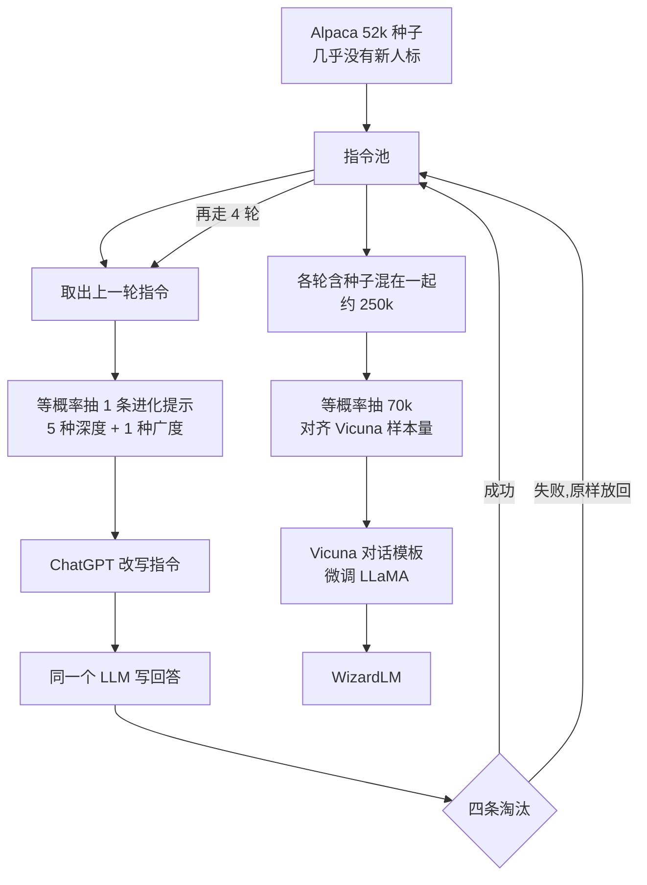

# WizardLM：人写不出足够难的指令，就让模型把简单题一步步改复杂

<!-- release-date: 2023-04-24 -->

> 本文依据 Microsoft 与北京大学的 **WizardLM: Empowering Large Pre-Trained Language Models to Follow Complex Instructions**，即 arXiv:2304.12244 **v3**（页边栏 `27 May 2025`），ICLR 2024 相机就绪稿，共 22 页。v1 于 2023-04-24 首次公开，标题当时没有 Pre-Trained 一词。解读以本地这份 v3 PDF 为准；页码均指 PDF 自身页码。
>
> 全文把三件事分开标注：**论文写了什么**、**我们如何解释它**、**哪些是外部资料补充**。后作 WizardCoder / WizardMath、仓库里后来的 13B-V1.2 / 70B 产品分数，一律不写进「论文结果」。

## 读前先把几个词说成人话

这篇论文几乎不改模型结构。它改的是拿来微调的**题**。后面会反复出现这些名字：

- **指令微调（instruction fine-tuning）**：基座模型只会续写。再用「按人话完成任务」的成对数据继续训练，它才开始像助手。
- **开放域指令**：真实用户会提出的、形式不固定、任务种类也不固定的要求。和「把这一批 NLP 数据集统一改写成同一类题」相对。
- **Self-Instruct**：从少量人手写的种子出发，让模型自己再造出大量新指令。Alpaca 走的就是这条路。
- **Evol-Instruct**：不要从种子平行地再造一批同类题，而是把已经有的指令改写得更难，或改写成同领域更冷门的新题，多轮之后再混在一起微调。
- **深度进化（in-depth evolving）**：同一道题往难里改：加约束、问得更深、把抽象概念换成具体对象、要求更多推理步、把输入改成代码或表格。
- **广度进化（in-breadth evolving）**：不改原题，另写一道同领域、更长尾、难度相近的新题，用来补话题覆盖。
- **淘汰进化（elimination evolving）**：进化经常失败。四条规则把没信息增益、模型答不出、空回答、以及把提示词标签抄进新题的样本丢掉。

WizardLM 本身不是新架构。它是把 Evol-Instruct 造出的指令，拿去微调 **LLaMA** 得到的检查点。同仓的 LLaMA 解读讲这个 13B / 65B 基座怎么训出来；本篇只讲在它上面做指令微调。

## 一句话先说清

开放域指令微调有效，但人标又贵又写不出足够难的题。ShareGPT 这类真实对话也偏简单、偏中等（PDF p. 1–2，Figure 5a）。

WizardLM 的回答是：

> **先拿一批现成指令当种子，让更强的 LLM 每次只把题改难一点点，或改写成同领域更冷门的新题；失败的丢掉，成功的放回池子再进化。把各轮难度混在一起微调 LLaMA，得到 WizardLM。**

主实验用 Alpaca 的 52k 当种子，进化 4 轮得到 250k，再等概率抽 70k 微调 LLaMA 13B，用来和 Vicuna 的 70k 对齐样本量（PDF p. 2–3、p. 7）。自动评测和人工评测都显示它超过 Alpaca、Vicuna 这类开源基线；对 ChatGPT 的对照以 PDF 为准：**没有写成全面超过**。人评里 WizardLM 对 ChatGPT 是 64 胜、88 负、66 平（PDF p. 8，Figure 4b）。

所以这篇最值得记住的，不是又一个 13B 聊天模型，而是一次改数据生产流程的动作：

> **指令复杂度是可以当课程来设计的。人很难稳定地写出高难度开放域指令，模型可以按很小的步长把现有指令改难，再把简单到困难的样本一起交给学生。**

## 两条矛盾，决定了后面每一处设计

### 矛盾一：开放域有效，但人标又贵又偏简单

早期指令微调走闭域：把问答、摘要、情感分类等公开 NLP 任务收成统一的 text-to-text 格式。论文点名 T5、FLAN、ExT5、T0、KnowDA，再到 ZeroPrompt、FLAN-T5 把任务数推到上千（PDF p. 1、p. 3）。

闭域有两个硬伤。同一份 NLP 数据集往往只共享少数几条指令，多样性不够；每条指令通常只对应一个任务。真实用户的要求常常是多任务、形式也不固定（PDF p. 1）。

开放域改变了这件事。OpenAI 雇人写指令和对应回答，把 GPT-3 训成 InstructGPT，并引出 ChatGPT（PDF p. 1、p. 3）。论文把这条路写成「能把 LLM 的潜力真正放开」。

但人标立刻碰到两堵墙：

1. 贵、慢。
2. 难度分布偏向简单和中等，难的偏少。论文把 ShareGPT 的难度统计指向 Figure 5a；并认为标注员容易疲劳，无法持续产出足够比例的高难度指令（PDF p. 1–2）。

于是关键不再是「要不要做开放域」，而是：**有没有一种便宜的办法，专门把更难的开放域指令量产出来。**

### 矛盾二：已有的自动造题，控制不了难度

Alpaca 用 Self-Instruct，从大约 175 条人手写种子扩到约 50k / 52k 指令（PDF p. 2–3）。Vicuna 用 ShareGPT 上约 70k 真实用户对话（PDF p. 3、p. 6）。两条都是开放域，但一个几乎不控制难度，一个继承了人类自己的难度偏斜。

论文给自己的定位很具体：和 InstructGPT、Vicuna 不同，它用 AI 生成数据做指令微调；和 Alpaca 的 Self-Instruct 不同，Evol-Instruct **能控制生成指令的难度和复杂度**（PDF p. 3）。

这不是「再造一批指令」这么简单。如果新题只是旧题的同难度变体，模型会在简单任务上更熟，复杂任务上仍然不会。后面的深度进化、广度进化和「各轮混在一起再抽样」，都是在回答这件事。

## 一条阅读路线

原文 22 页，正文大约到第 9 页，第 10–13 页是参考文献，第 14–22 页是附录。如果只读原文，建议按这个顺序：

1. **第 1–2 页的矛盾 + Figure 1**：从 `1+1=?` 看五种深度操作和一种广度突变，比先读提示词模板更清楚。
2. **第 3 页相关工作**：闭域为什么不够，Alpaca / Vicuna / InstructGPT 各自站在哪。
3. **第 4–6 页 §3**：进化定义、深度 / 广度提示、四条淘汰、混数据微调。
4. **第 7 页 Table 1**：13B 对 Alpaca / Vicuna / ChatGPT。先看数学、代码和 GPT-4 评测，再看 TruthfulQA 这一处并没有赢 Vicuna。
5. **第 8 页 Figure 4b**：人评的 218 条两两计数。ChatGPT 对照只看这张图，不要看网上还在流传的旧摘要。
6. **第 9 页 Table 2 + Figure 5**：种子、数据量、进化模型、基座尺寸；以及「越进化越难、微调分数跟着涨」。
7. **附录 E / I / H / L**：难度怎么打分、和人对得上吗、WizardEval 的 29 个技能、不同 epoch 检查点。

## 先看全景：种子、进化、过滤、微调

下面这张图是机制示意，不是实测时间轴。依据是 PDF p. 2 Figure 1、p. 4 Figure 2，以及 §3.2–3.3、§4.2。

主实验的骨架可以压成四句话（PDF p. 2–3、p. 6–7）：

1. 种子选 Alpaca 52k，保证训练指令几乎没有直接的人标。
2. 每条指令每轮只随机走六种进化里的一种，用 Azure 上的 `gpt-3.5-turbo` 改写并写回答。
3. 失败的进化原样放回池子，指望下一轮还能改成功。
4. 把初始数据与各轮进化数据合并、打乱，再抽 70k 做微调，用来证明收益不是「数据变多了」这一个原因。

论文把整次数据构造的 API 调用写成 $52\text{k}\times 4\times 3=624\text{k}$ 次（PDF p. 7）。它没有拆开这个 $\times 3$ 分别对应哪三次请求。我们的读法是：至少包含「进化指令」和「生成回答」；第三条很可能是淘汰时用 ChatGPT 做「有没有信息增益」的判断。这是推断，原文没写死。

## 相关工作：闭域任务集，解决不了真实用户那句话

§2 把前作分成两堆，位置很清楚（PDF p. 3）。

**闭域指令微调。** 目标是跨任务泛化：在一大堆公开 NLP 数据集上微调，换一组 NLP 任务再评。从 T5 的统一 text-to-text，到 FLAN / ExT5 / T0 / KnowDA 大约一百个任务，再到 ZeroPrompt / FLAN-T5 的上千任务。结论一致：多样的 NLP 任务指令能提高新任务表现。但论文立刻收窄：这些指令往往只对应单个 NLP 任务，输入形式也简单，训出来的模型在真实用户场景里容易失败。

**开放域指令微调。** 论文把自己放进这一支。OpenAI 的路线是雇人写多样指令和正确回答，把 GPT-3 变成 InstructGPT，再走到 ChatGPT。Orca 被点名：它不只学表层回答，还想抓住复杂推理过程的信号。这些工作当时没有开源，于是 Alpaca 和 Vicuna 基于开源的 LLaMA 接着做。Alpaca 从大约 175 条人手写种子生成约 50k 指令；Vicuna 用真实用户分享的对话。

论文只用两句话划开自己（PDF p. 3）：

- 和 InstructGPT、Vicuna 不同：它用 AI 生成数据，而不是人写或用户分享的指令。
- 和 Alpaca 的 Self-Instruct 不同：Evol-Instruct 能控制难度和复杂度。

§4.5 后来用 Super-Natural Instructions（SNI）做了一组对照，把这句相关工作里的判断变成了数字。随机抽 70k SNI 去训 LLaMA-13B，九项均分只有 37.73，AlpacaEval 13.67、MT-Bench 2.86、HumanEval 4.20；MMLU 反而是 54.90，略高于 WizardLM-13b 的 52.92（PDF p. 8–9，Table 2）。闭域任务集更像考试复习资料：多选题和学科知识能涨，开放域对话、代码和 GPT-4 评测会垮。这句话是我们的归纳，论文只给了这张表。

## 核心设计一：深度进化——每次只改难一点点

### 旧问题

如果直接要求模型「写一道特别难的题」，它会跳到人类也很难理解、或根本无解的指令上。论文明确说：难度必须逐渐增加，否则指令集会被极端复杂的样本填满，伤害泛化（PDF p. 4–5）。

人标的另一面是：即使愿意写难题，也很难维持强度。于是开放域数据里难样本永远不够。

### 新设计

深度进化不另起炉灶。它把已有指令改写成「让 ChatGPT、GPT-4 这类系统稍微更难处理一点」的版本，同时要求改写后的题对人类仍然合理、可理解、可回答（PDF p. 4）。

五种操作是（PDF p. 2、p. 4）：

| 操作 | 人话 | Figure 1 上 `1+1=?` 变成了什么 |
|---|---|---|
| 加约束（add constraints） | 多加一个限制条件 | 「什么情况下 1+1 不等于 2？」 |
| 加深（deepening） | 把原来的问题问得更深、更广 | 「如何在哥德巴赫猜想里证明 1+1=2？」 |
| 具体化（concretizing） | 用更具体的概念替换笼统概念 | 「你有一个苹果，别人又给你一根香蕉，你有几个水果？」 |
| 增加推理步（increase reasoning steps） | 如果原题几步就能想完，就显式要求多步推理 | 「若 $x^3+2x+3=7$，$x$ 是多少？」 |
| 复杂化输入（complicate input） | 把输入变成公式、代码、表格、XML 这类结构 | `1/(\sqrt{2}+4^2)=?`，以及带 `random.randint` 的 Python 代码 |

前四种可以零样本完成；复杂化输入必须给 in-context 示范，因为要往题里塞进具体的 XML / SQL / Python / HTML / Shell / JSON（PDF p. 5，附录 D）。

步长被写进提示词，不是口头建议：改写后的题最多只比原题多 10 到 20 个词，并且尽量不要写啰嗦（PDF p. 5，Example 3.1）。提示词还禁止把 `#Given Prompt#`、`#Rewritten Prompt#` 这类标签抄进新题里——后面淘汰规则第 4 条就是在抓没遵守的样本。

### 工作机制

记初始数据集为

$$
D^{(0)}=\bigl(I_k^{(0)},R_k^{(0)}\bigr)_{1\le k\le N}
$$

$I_k^{(0)}$ 是第 $k$ 条指令，$R_k^{(0)}$ 是对应回答，$N$ 是条数。每一轮把当前的 $I^{(t)}$ 用 Evol-Instruct 提示升级成 $I^{(t+1)}$，再让同一个 LLM 为新指令生成 $R^{(t+1)}$，得到 $D^{(t+1)}$。迭代 $M$ 轮后，手里有 $[D^{(1)},\ldots,D^{(M)}]$（PDF p. 4）。

开放域指令里，指令和输入没有清晰分界，论文按整段来进化，不拆字段（PDF p. 4）。

主实验里 $M=4$。每条指令每轮从六条提示（五种深度 + 一种广度）里等概率抽一条（PDF p. 7）。也就是说，深度不是一条固定课程「先加约束再加深」，而是随机走其中一步。同一条种子四轮之后，可能变成「加过约束的代码题」，也可能中途被广度进化带去另一个话题。

回答生成的提示就是指令本身，解析 ChatGPT-3.5 返回的正文当作回答。采样温度 1，最大 2048 token，frequency penalty 0，top-p 0.9（PDF p. 6–7）。

### 收益

Figure 5a 用 ChatGPT 按 1 到 10 给指令打难度。Alpaca 种子约 3.00，ShareGPT 约 4.63，进化后的 C1 到 C4 分别约 5.48、6.35、6.84、7.08（PDF p. 9；附录 Table 3 给出同一组数）。难度在涨，而且不是一轮就顶到 10。

Figure 5b 用每一轮大约 52k 数据分别微调，九项自动评测均分从 C0 的 41.25 走到 C4 的 57.61（PDF p. 9）。论文的读法是：训练指令越复杂，微调后的模型越好。

### 代价和边界

- **进化器本身要足够强。** 用 LLaMA-2-70B-Chat 替换 ChatGPT 做进化，得到的 WizardLM-13b 均分 56.27，低于 ChatGPT 进化的 58.96，但仍高于 Alpaca-13b 的 43.44 和 Vicuna-13b 的 54.60（PDF p. 8–9，Table 2）。论文据此说 Evol-Instruct 不绑定 ChatGPT，开源强模型也能当替身。数字同时说明：替身更弱，造出来的数据也更弱。
- **难度分不进入训练循环。** 附录 I 写明，ChatGPT 的难度分析只用于事后看分布，不指导数据生成或模型训练（PDF p. 20）。课程是「随机走一步 + 限制 10–20 词」，不是「先打分再按分采样」。
- **没有「只用最难的 C4」对照。** Figure 5b 是每轮 52k 单独微调；主模型是各轮混合后再抽 70k。混合是否优于「同等数量的最难题」，原文没做。
- **五种深度操作没有单独消融。** 我们不知道加约束和复杂化输入谁更值钱。

### 可迁移启发

如果要自动造难题，先规定步长，再规定「对人类仍然可答」。一步跳到极端难度，得到的不是更好的训练数据，而是一批学生模型学了也用不上的病态题。10 到 20 个词是这篇的具体超参，可迁移的是「每次只加一点可验证的复杂度」。

## 核心设计二：广度进化——难题若还挤在同一话题上，覆盖仍不够

### 旧问题

只做深度，会把 `1+1=?` 改成哥德巴赫，仍然还在算术附近打转。Alpaca、ShareGPT 这类开放域数据规模本来就不大，话题和技能覆盖不够（PDF p. 5）。难，但窄，仍然不是开放域。

### 新设计

广度进化不改写原题，而是「从给定提示得到启发，创建一道全新的提示」：同领域，但更罕见（more rare / long-tailed）；长度和难度与原题相近；对人类仍然合理可答（PDF p. 5，Example 3.3）。论文把它叫做 mutation。

Figure 1 右侧那条红线就是这个动作：`1+1=?` 可以跳到「真空中的光速是多少」，再从光速跳到「空气 / 水 / 玻璃里的光速表」，或跳到光合作用里叶绿素的作用（PDF p. 2）。深度是把同一道题拧紧；广度是换一道还没被覆盖的题。

提示词同样禁止把 `given prompt` / `created prompt` 抄进新题（PDF p. 5–6）。

### 收益怎么检验

附录 J 把指令用 BERT 编成 768 维，t-SNE 降到 2 维，再 k-means 切成 20 个簇。Figure 7 上 C1 到 C4 的点比 ShareGPT 和 Alpaca 更散，论文据此说话题多样性更好（PDF p. 9、p. 20–21）。

这是定性可视化，不是多样性的定量指标。正文有一处交叉引用错误：§4.5 写「Appendix F 的 Figure 6 展示聚类」，实际聚类图是附录 J 的 Figure 7；Appendix F 是判断两条指令是否相等的提示（PDF p. 9、p. 19、p. 21）。读的时候按图号走，不要按那句文字走。

### 代价和边界

「同领域但更长尾」只写在提示词里。论文没有验证新题是否真的落在未覆盖技能上，也没有报告广度进化的成功率。六种提示等概率，意味着大约六分之一的进化预算分给广度，其余五分之四分给深度。这个配比没有消融。

### 可迁移启发

难度和覆盖是两笔账。只把现有题改难，技能集合不会变大；只做同难度的新话题，模型仍不会处理复杂约束。这篇把两笔账写成两种提示，而不是希望同一种「请写得更好」同时完成两件事。

## 核心设计三：四条淘汰——进化失败是默认情况

论文把这件事写得很干脆：进化指令由 LLM 生成，有时会失败，所以要有 Instruction Eliminator（PDF p. 2、p. 4）。失败的指令原样放回池子，指望下一轮换一种提示还能改成功（PDF p. 4）。

四条失败判定（PDF p. 6）：

1. **相对原题没有信息增益。** 用 ChatGPT 判断。正文写「详见 Appendix G」，但 Appendix G 是「这是不是数学题」的 True / False 提示；真正用来判断两条指令是否相等的是 Appendix F：约束是否相同、询问的深度和广度是否相同，只许回答 Equal 或 Not Equal（PDF p. 6、p. 19）。这是原文交叉引用错误，按提示词内容应看 Appendix F。
2. **LLM 很难生成回答。** 经验规则：回答里出现 `sorry`，并且比较短（少于 80 个词），往往表示模型答不出。
3. **回答只剩标点和停用词。**
4. **新指令明显抄了进化提示里的词**，例如 `given prompt`、`rewritten prompt`、`#Rewritten Prompt#`。

第 2 条是启发式，不是语义理解。它会误杀「礼貌地表示能力边界」的合法回答，也会放过又长又空的失败进化。第 1 条把「有没有进化成功」交给同一个 ChatGPT，等于让出题老师自己批改有没有把题改掉。

论文没有报告每条规则杀掉了多少样本。从 52k 种子出发四轮之后得到 250k（PDF p. 3、p. 7），说明大部分进化被留下了；但 250k 相对「每轮全成功应接近 52k 的若干倍」少了多少，原文没给失败率。

**可迁移启发：** 自动改写必须配对自动质检，而且质检规则要抓「提示词泄漏」这种机械失败——模型很爱把脚手架标签抄进产出。`sorry` + 短文本是便宜的过滤器，不是通用的质量模型。

## 核心设计四：各轮混在一起微调，再抽成和基线一样多

进化结束后，论文不是只用最后一轮最难的数据。它把初始指令和各轮进化指令合并、随机打乱，作为微调数据。目的是让不同难度均匀出现，微调更平滑（PDF p. 6）。

为了证明收益来自 Evol-Instruct 而不是「合并之后数据变多」，它再从合并集里等概率抽与 Vicuna 相同的 70k（PDF p. 6–7）。主模型 WizardLM-13b 就是这个 70k 上训出来的。

微调配方（PDF p. 6–7）：

- 基座：预训练 LLaMA 13B。
- 对话模板用 Vicuna 的格式，并在示例里把助手写成 WizardLM：`A chat between a curious user and an artificial intelligence assistant. ... USER: Who are you? ASSISTANT: I am WizardLM .......`
- Adam，初始学习率 $2\times 10^{-5}$，最大 2048 token，每 GPU batch size 4。
- 8 张 V100，DeepSpeed ZeRO-3，3 个 epoch，约 140 小时。
- 推理：WizardLM 和基线都用 greedy search，最大生成长度 2048。

它没有写是否全参数微调、有没有 LoRA、有没有 dropout，也没有 RLHF 或偏好优化。WizardLM 在这篇论文里就是 **SFT 检查点**。

后文 Table 2 的 WizardLM-13b（250K）均分 60.30，高于 70k 主模型的 58.96（PDF p. 9）。更大的进化数据还能再涨一点。主实验抽 70k，是为了和 Vicuna 公平，不是因为 250k 没有用。

**这里有一处必须分开看的混淆。** 进化器和回答生成器都是 ChatGPT。WizardLM 学的是「ChatGPT 为更难的题写下的回答」，不只是「更难的题面」。论文把 Alpaca 基线也改成了 ChatGPT 写回答（见下一节），所以和 Alpaca 的对比更接近「Self-Instruct 的题」对「Evol-Instruct 的题」。和 Vicuna 的对比则同时换了题面来源和回答来源：ShareGPT 里的助手侧并不保证是 ChatGPT。这是我们的读法，原文没有做「同一批题、只换回答模型」的消融。

## 实验怎么比：先把基线改到能比的位置

评测对象是 WizardLM、Alpaca、Vicuna 和 ChatGPT，自动评测加人工评测（PDF p. 6）。

四类基线（PDF p. 6）：

1. **ChatGPT**：OpenAI 的对话产品，建立在 GPT-3.5 / GPT-4 上。表里写作 ChatGPT-3.5。
2. **Alpaca-13b**：原版只有 52k，且回答来自 text-davinci-003。论文用 Alpaca 自己的 Self-Instruct 再造 18k 补到 70k，把回答换成 ChatGPT，并用 Alpaca 官方代码从 LLaMA 13B 重训。这是为了样本量、回答模型和训练代码都尽量对齐。
3. **Vicuna-13b**：LLaMA 上微调 70k ShareGPT。使用 FastChat 的 13B-v1.1。
4. **同为 Llama 13B 训出来的开源模型**：Baize、CAMEL、Tulu。

测试集是论文自己做的 **WizardEval**：218 条真实人类指令，来自 GitHub、ShareGPT、Twitter、Reddit、Discord 等，覆盖 29 个技能，例如代码生成、数学、推理、复杂格式、写作、广泛学科（PDF p. 8、p. 19）。附录 H 说 Vicuna 测试集只有 80 条、9 个技能；Figure 4a 上 WizardEval 的难度更均匀，Vicuna 和 Alpaca / Self-Instruct 明显偏向低难度（PDF p. 8、p. 20）。

自动评测九项（PDF p. 7）：

- HuggingFace OpenLLM：MMLU、ARC、HellaSwag、TruthfulQA，评测代码来自 Gao 等人的框架。
- 代码：HumanEval，164 题，报 pass@1。
- 数学：GSM8k，1319 条小学数学，4-shot，报 pass@1。
- GPT-4 评测：AlpacaEval、MT-Bench，以及用 GPT-4 在 WizardEval 上打分。表里 ChatGPT-3.5 的 WizardEval 被标成 100.0，其余是相对值。论文没有把这个 100 分制的换算公式写全。

## 自动评测：13B 明显超过开源同级，没有超过 ChatGPT

Table 1 的数字全部来自 PDF p. 7。均分是九项的平均；MT-Bench 是 10 分制，WizardEval 以 ChatGPT 为 100。

| 模型 | 均分 | MMLU | ARC | HellaSwag | TruthfulQA | HumanEval | GSM8k | AlpacaEval | MT-Bench | WizardEval |
|---|---:|---:|---:|---:|---:|---:|---:|---:|---:|---:|
| ChatGPT-3.5 | 76.15 | 70.0 | 85.2 | 85.5 | 47.0 | 48.1 | 80.8 | 89.37 | 7.94 | 100.0 |
| Alpaca-13b | 43.44 | 46.63 | 51.20 | 76.31 | 41.62 | 9.2 | 8.35 | 33.25 | 4.78 | 76.6 |
| Vicuna-13b | 54.60 | 50.84 | 51.71 | 79.94 | **52.68** | 12.5 | 24.34 | 70.43 | 6.21 | 86.9 |
| Baize-13b | 51.46 | 49.72 | 56.91 | 79.29 | 47.88 | 14.6 | 8.95 | 66.96 | 5.75 | 81.3 |
| CAMEL-13b | 51.29 | 49.74 | 55.63 | 79.25 | 47.42 | 17.7 | 7.13 | 64.84 | 5.78 | 82.1 |
| Tulu-13b | 52.46 | **53.19** | 53.92 | 80.66 | 43.84 | 21.3 | 36.50 | 45.34 | 5.76 | 79.8 |
| WizardLM-13b | **58.96** | 52.92 | **57.25** | **80.88** | 50.55 | **24.0** | **37.15** | **75.31** | **6.35** | **89.1** |

论文自己的结论是：同尺寸开源模型里，WizardLM 在多数基准上有明显优势，尤其是数学、代码和 GPT-4 评测（PDF p. 7）。这张表支持这句话，也同时支持三句更窄的话：

1. **对 Alpaca、Vicuna 的领先，主要来自 HumanEval、GSM8k、AlpacaEval。** HumanEval 从 Vicuna 的 12.5 到 24.0，GSM8k 从 24.34 到 37.15，AlpacaEval 从 70.43 到 75.31。
2. **不是九项全赢。** TruthfulQA 上 Vicuna-13b 的 52.68 高于 WizardLM 的 50.55；MMLU 上 Tulu-13b 的 53.19 略高于 52.92。
3. **ChatGPT-3.5 仍大幅领先。** 均分 76.15 对 58.96；HumanEval 48.1 对 24.0；GSM8k 80.8 对 37.15；ARC 85.2 对 57.25。不要把「超过 Alpaca / Vicuna」读成「超过 ChatGPT」。

Figure 3 是这九项的雷达图，视觉结论与表一致（PDF p. 7）。ChatGPT 几乎包住所有开源 13B；WizardLM 是开源里最靠外的那条，但离 ChatGPT 仍有一圈。

## 人工评测：对 Alpaca / Vicuna 赢，对 ChatGPT 仍输

人评只在 WizardEval 的 218 条上进行（PDF p. 8）。

协议：招募 10 名受过良好教育的标注员；每人看到 Alpaca-13b、Vicuna-13b、WizardLM、ChatGPT 四条回答，随机打乱来源。先按五个维度判断谁更好，再把四条回答从 1 排到 5（1 最好），允许并列。五个维度的定义在附录 K（PDF p. 8、p. 21）：

1. **Relevance**：是否正确理解上下文和问题的语义。
2. **Knowledgeable**：能否准确使用多样、具体的知识来解题。
3. **Reasoning**：推理过程或推理思路是否成立。
4. **Calculation**：数学、生物、化学、物理公式计算是否准确。
5. **Accuracy**：给定指令下是否做对。

排位写成 1 到 5、对象却是四条回答，原文如此。胜率按两两之间的胜、负、平次数估计。Kappa 全部大于 0.6（PDF p. 8）。

Figure 4b 读出的计数是（PDF p. 8；绿 = WizardLM 胜，黄 = 负，蓝 = 平）：

| 对照 | WizardLM 胜 | 负 | 平 | 合计 |
|---|---:|---:|---:|---:|
| Alpaca-13b | 116 | 50 | 52 | 218 |
| Vicuna-13b | 90 | 70 | 58 | 218 |
| ChatGPT | 64 | 88 | 66 | 218 |

把计数换成比例是我们的换算，不是原文另给的百分比：对 Alpaca 约 53.2% 胜 / 22.9% 负 / 23.9% 平；对 Vicuna 约 41.3% / 32.1% / 26.6%；对 ChatGPT 约 29.4% / 40.4% / 30.3%。

这张图是 v3 里 ChatGPT 对照的全部定量证据。WizardLM 对两个开源基线净胜，对 ChatGPT 净负。论文结论写的是「显著优于 Alpaca 和 Vicuna，说明 Evol-Instruct 有效」（PDF p. 8），没有写「人评超过 ChatGPT」。

v1 / v2 摘要里那句「高复杂度子集上 WizardLM 比 ChatGPT 更受偏好」「29 个技能里 17 个达到 ChatGPT 的 90% 以上」，**不在 v3 PDF 的摘要和正文里**。arXiv 条目页和微软研究页目前仍挂着旧摘要，那是外部页面未与相机就绪稿对齐，不能当 v3 的实验结果。

## 消融：种子、数据量、进化器、基座，四个旋钮

Table 2 把主模型放到第一行，然后换条件（PDF p. 8–9）。

| 模型 | 均分 | MMLU | ARC | HellaSwag | TruthfulQA | HumanEval | GSM8k | AlpacaEval | MT-Bench | WizardEval |
|---|---:|---:|---:|---:|---:|---:|---:|---:|---:|---:|
| WizardLM-13b | 58.96 | 52.92 | 57.25 | 80.88 | 50.55 | 24.0 | 37.15 | 75.31 | 6.35 | 89.1 |
| WizardLM-13b（ShareGPT 种子） | 61.87 | 50.92 | 60.24 | 81.39 | 54.56 | 25.0 | 31.46 | 86.32 | 6.76 | 99.3 |
| WizardLM-13b（250K） | 60.30 | 53.78 | 58.53 | 81.39 | 52.26 | 25.6 | 37.46 | 78.10 | 6.51 | 90.3 |
| WizardLM-13b（LLaMA-2-70B-Chat 进化） | 56.27 | 51.09 | 57.34 | 79.12 | 48.76 | 19.5 | 33.83 | 70.47 | 6.18 | 84.5 |
| LLaMA-13b（SNI） | 37.73 | 54.90 | 54.95 | 80.40 | 38.69 | 4.20 | 5.79 | 13.67 | 2.86 | 58.4 |
| Alpaca-7b（Mistral） | 52.87 | 56.34 | 55.38 | 79.49 | 43.92 | 19.2 | 32.05 | 54.26 | 5.47 | 80.5 |
| WizardLM-7b（Mistral） | 65.81 | 60.70 | 57.47 | 82.08 | 51.79 | 37.80 | 59.49 | 80.70 | 7.10 | 91.3 |
| WizardLM-65b | 69.40 | 62.09 | 65.83 | 85.48 | 52.19 | 36.5 | 66.39 | 87.50 | 7.12 | 97.5 |
| WizardLM-70b | 71.33 | 63.32 | 64.52 | 83.21 | 54.60 | 42.1 | 70.61 | 89.32 | 7.46 | 99.7 |

论文自己的四点归纳（PDF p. 8–9）：

1. **ShareGPT 是比 Alpaca 更好的进化种子**，除了 GSM8k。
2. **更大的进化数据能提高模型能力**（70k → 250k）。
3. **Evol-Instruct 不依赖 ChatGPT**，LLaMA-2 这类开源强模型可以当替身。
4. **进化数据也优于 Super-Natural Instructions**；方法可以迁到 LLaMA-1 65B、Llama-2 70B、Mistral-7B。

ShareGPT 种子为什么数学更差，论文做了额外检查：各随机抽 2000 条，用 ChatGPT 判断是不是数学题（提示见附录 G）。ShareGPT 只有 4.3% 数学，Alpaca 有 11.8%（PDF p. 8）。种子里没有的技能，进化也变不出来——广度进化是「同领域更长尾」，不是从算术种子长出从未见过的数学教材。这是 Evol-Instruct 的能力边界，也被这篇诚实地写出来了。

读 Table 2 时还有三件不要读过头的事：

- WizardLM-70b 的 AlpacaEval 89.32、WizardEval 99.7，已经贴近 ChatGPT-3.5 的 89.37 和 100.0；但 GSM8k 70.61 对 80.8，HumanEval 42.1 对 48.1，ARC 64.52 对 85.2，均分仍是 71.33 对 76.15。更大基座加上 Evol-Instruct，在 GPT-4 对话评测上能逼近，在学科和代码上仍有洞。
- Mistral-7B 上 WizardLM-7b 对 Alpaca-7b 的跳跃很大：均分 65.81 对 52.87，HumanEval 37.80 对 19.2，GSM8k 59.49 对 32.05。这说明方法不绑死 LLaMA 家族。它不能说明 7B 已经超过表里的 13B LLaMA 学生——基座换了，绝对分数不能跨家族横比。
- 65B 来自 LLaMA-1，70B 来自 Llama-2，两行也不是「同一配方放大」。

附录 L 补充了 2.5 / 2.75 / 3.0 三个 epoch 的检查点（PDF p. 21–22，Table 4）。正文为了和前作对齐，只报最终 3 epoch。13B 上 ShareGPT 种子几乎在各基准都更好（GSM8k 除外）；65B / 70B 之间，70B 在所报基准上全面更高。作者把个别基准的非单调波动归因于训练波动。

## 附录里还值得带走的数字

**难度打分是否可信。** 附录 I 抽 600 条指令，ChatGPT、GPT-4 和 5 名人类一起打 1–10 分（PDF p. 20，Table 3）：

| 评分者 | ShareGPT | Alpaca | C1 | C2 | C3 | C4 |
|---|---:|---:|---:|---:|---:|---:|
| GPT-3.5 | 4.63 | 3.00 | 5.48 | 6.35 | 6.84 | 7.08 |
| GPT-4 | 4.31 | 2.69 | 4.68 | 4.90 | 5.37 | 5.54 |
| Human | 4.55 | 3.15 | 5.51 | 5.86 | 6.49 | 6.82 |

趋势一致：Alpaca 最易，ShareGPT 居中，C1 到 C4 逐步变难。GPT-4 的绝对分系统性偏低，但不能倒过来读成「其实没变难」。另外 300 对两两比较里，人类之间 Kappa 0.68，ChatGPT 对人类多数票 Kappa 0.66（PDF p. 20）。

**WizardEval 的技能分布。** Figure 6 是 218 条在约 29 个技能上的直方图，左侧较高的是数学、代码生成、写作、网页生成、推理、复杂格式等；Vicuna 测试集更小、更偏易（PDF p. 19–20）。论文没有在正文给出 29 个技能的完整名单，只在 §4.4 和附录 H 举了几类。

**提示词原文。** 附录 A–D 补齐加深、具体化、增加推理步、复杂化输入的完整模板；E / F / G 分别是难度分、指令是否相等、是否数学题。要复现进化器，应以这些模板为准，而不是只看 §3 的节选。

## 报告没有告诉我们的事

22 页不是复现手册。下面这些要么完全没写，要么只给了方向：

- **淘汰率。** 有四条规则，没有每条杀掉多少、每轮成功率是多少。
- **六种进化的单独贡献。** 没有「去掉广度」或「只用加约束」的对照。
- **混合各轮 vs 只用最难的 C4。** 平滑性是作者的理由，不是消融结论。
- **$\times 3$ 的 624k 次调用具体是哪三次。**
- **全参数还是 LoRA、精度、学习率日程、是否有 epoch 内打乱之外的采样策略。**
- **WizardEval 自动分怎样从 GPT-4 判决变成以 ChatGPT=100 的标量。**
- **安全、毒性、偏见。** 完全没有。
- **偏好优化。** 没有奖励模型，没有 PPO / DPO。ChatGPT 的回答被直接当成监督标签。
- **进化器与学生之间的教师泄漏。** 题和答案都来自 ChatGPT，除了和「同样用 ChatGPT 写回答的重训 Alpaca」对比，很难把「更难题面」和「更像 ChatGPT 的答案风格」完全拆开。

不要用后来 GitHub 上的 WizardLM-13B-V1.2、WizardCoder、WizardMath 去填这些空白。那些属于后作。

## 论文之后发生了什么

以下不是 2304.12244v3 的内容，用来把 2023 年 4 月这份材料放回时间线。

- **官方首发日按 arXiv v1 取 2023-04-24。** [arXiv:2304.12244](https://arxiv.org/abs/2304.12244) 的提交历史是 v1 2023-04-24、v2 2023-06-10、v3 2025-05-27。微软研究页 [WizardLM: Empowering Large Language Models to Follow Complex Instructions](https://www.microsoft.com/en-us/research/publication/wizardlm-empowering-large-language-models-to-follow-complex-instructions/) 标注 April 2023，并指向同一篇 arXiv。论文当时同步公开代码入口 `https://github.com/nlpxucan/WizardLM`。这是 Evol-Instruct + WizardLM 首次向公众开放的事件，也是本文 `release-date` 的依据。v3 是 ICLR 2024 相机就绪稿，不回写首发日。
- **v1 / v2 和 v3 不是同一张成绩单。** v1 标题没有 Pre-Trained；摘要主张高复杂度子集上人评优于 ChatGPT。v2 仍以 7B 为主实验叙述。v3 主模型改成 13B，并补了 65B / 70B / Mistral、OpenLLM、MT-Bench、AlpacaEval。解读必须跟 v3 PDF，不能把旧摘要里的 ChatGPT 句子写回实验结果。一个容易踩的坑：截至 2026-09-10，[arXiv 条目页](https://arxiv.org/abs/2304.12244) 和微软研究页仍显示旧摘要，与 PDF v3 第一页不一致。
- **公开脚本是演示，不是论文流水线的完整复制。** [nlpxucan/WizardLM 的 Evol_Instruct](https://github.com/nlpxucan/WizardLM/tree/main/Evol_Instruct) 只随机抽五种提示（四种深度 + 广度），没有「复杂化输入」，也没有四条淘汰，进化和回答各调一次 ChatGPT。仓库 README 后来还说明：权重相对更容易先开放，数据要经过更严的法务审核，研究者无权自行公开发布。
- **70k / 196k 数据集卡片是后作分发，不是正文里的 250k 原件。** Hugging Face 上的 [WizardLM_evol_instruct_70k](https://huggingface.co/datasets/WizardLMTeam/WizardLM_evol_instruct_70k) 是 70k 行的 instruction / output，体量与论文抽样一致，但卡片本身不能证明它等于 Table 1 那个随机 70k 子集。[WizardLM_evol_instruct_V2_196k](https://huggingface.co/datasets/WizardLMTeam/WizardLM_evol_instruct_V2_196k) 写明含 143k 条 Alpaca 与 ShareGPT 的混合进化数据，需再与原始 ShareGPT 合并才到约 196k，并且这是「最新优化版」训练数据。196k 不是论文 Table 1 的训练集约数。
- **WizardCoder、WizardMath、后来的产品检查点不要写进本文成绩。** 同一 GitHub 组织后来发了代码向的 WizardCoder（ICLR 2024 另一篇）和数学向的 WizardMath。仓库 README 里 WizardLM-13B-V1.2（Llama 2 13B）MT-Bench 7.06、WizardLM-70B-V1.0 MT-Bench 7.78 / GSM8k 77.6 / HumanEval 50.6，与 v3 Table 2 的 WizardLM-13b（6.35）和 WizardLM-70b（7.46 / 70.61 / 42.1）对不上，说明是后续训练或不同检查点。那些分数属于后作，不是本 PDF 的 Table 1 / Table 2。

## 最值得带回自己项目的七条

### 1. 先问指令分布缺的是难度还是覆盖

人标和用户日志都会自然偏向简单、中等。缺难度时，改写现有题比再雇人「请写难题」更稳；缺覆盖时，同领域长尾突变比把同一题继续拧紧更有用。两种进化对应两笔账，不要用一种提示同时做两件事。

### 2. 复杂度要有步长，不要一次跳到极端

「让 ChatGPT 稍微更难一点」加上最多 10–20 个词，是这篇真正可复用的超参思想。极端复杂会伤害泛化，论文把这句写在深度进化的动机里，不是写在局限性附录里。

### 3. 自动改写必须配对机械质检

提示词泄漏、`sorry` 短回答、空标点，是生成式数据管线里最便宜也最常见的失败。四条规则并不优雅，但没有它们，进化循环会把自己的脚手架喂给学生。

### 4. 种子里没有的技能，进化也变不出来

ShareGPT 种子数学只有 4.3%，进化后的 13B 在 GSM8k 上明显弱于 Alpaca 种子。广度进化是「同领域更罕见」，不是从任意种子长出任意学科。选种子等于选技能先验。

### 5. 和基线比的时候，先把样本量、回答模型和训练代码对齐

论文重训 Alpaca：52k 扩到 70k、Davinci 回答换成 ChatGPT、用官方代码走 LLaMA 13B。少做其中一步，「Evol-Instruct 优于 Self-Instruct」就会和「数据更多 / 老师更强 / 实现不同」缠在一起。

### 6. 闭域任务集涨的是考试分，不是开放域助手

SNI 70k 把 MMLU 训到 54.90，同时把 AlpacaEval 和 HumanEval 打到接近不可用。若产品目标是真实用户指令，用 NLP 任务集堆指令数量会走错方向。这篇用一张表把相关工作里的立场变成了证据。

### 7. 教师模型和课程设计是两件东西

用更弱的 LLaMA-2-70B-Chat 当进化器，方法仍成立，只是学生更弱；用更强的 ChatGPT 当进化器，学生更强。课程（深度 / 广度 / 淘汰 / 混合）可以迁到别的老师上，但老师的上限会写进数据里。不要把 Evol-Instruct 理解成「可以不需要强模型」。

## 关键词回看

- **开放域指令**：形式和任务都不固定的真实用户要求，对标闭域 NLP 任务集。
- **Self-Instruct**：从少量人手写种子让模型平行地再造指令。Alpaca 的数据路线。
- **Evol-Instruct**：对已有指令做多轮改写或同领域突变，并过滤失败，再混合微调。
- **深度进化**：加约束、加深、具体化、增加推理步、复杂化输入。控制的是难度。
- **广度进化**：同领域、更长尾、难度相近的全新指令。控制的是覆盖。
- **淘汰进化**：无信息增益、`sorry` 短回答、纯标点、提示词泄漏。
- **WizardLM**：用 Evol-Instruct 数据微调 LLaMA（以及后来消融里的 Llama-2 / Mistral）得到的指令模型。
- **WizardEval**：218 条、29 技能、难度更均匀的自建人评测试集。
- **C0–C4**：种子以及四轮进化各自约 52k 的数据切片；难度和九项均分都随轮次上升。

## 最后的判断

WizardLM 最强的叙事不是「我们做了一个更强的 13B 聊天模型」，而是：**它把指令复杂度当成可以进化的课程，而不是当成人类标注预算的副产品。**

证据支持这条课程在 2023–2024 年的开源 13B 设定里是成立的：

- 同一 70k 体量、同样改用 ChatGPT 写回答之后，Evol-Instruct 在数学、代码和 GPT-4 评测上明显高于 Self-Instruct 的 Alpaca，也高于 ShareGPT 的 Vicuna（PDF p. 7–8）；
- 人评 218 条上，对 Alpaca 116 胜 50 负，对 Vicuna 90 胜 70 负（PDF p. 8）；
- 难度从 Alpaca 的约 3 分走到 C4 的约 7 分，单独用各轮数据微调的九项均分从 41.25 走到 57.61（PDF p. 9）；
- 换 ShareGPT 种子、换 250k、换 Mistral / Llama-2 基座，方向仍然成立（PDF p. 8–9）。

它自己划的边界同样清楚：

- 人评和自动评都没有超过 ChatGPT-3.5；13B 对 ChatGPT 是 64 胜 88 负 66 平（PDF p. 8）；
- TruthfulQA 没有赢 Vicuna，MMLU 没有赢 Tulu（PDF p. 7）；
- 种子缺数学，进化补不回来（PDF p. 8）；
- 没有安全评测，没有偏好优化，没有六种操作的单独消融；
- GPT-4 自动评测和 218 条人评的可扩展性、代表性，作者自己写进了 Limitations（PDF p. 9）。

和同仓的 LLaMA 对照着读，分工就清楚了。LLaMA 回答的是：公开数据上把小模型多看 Token，得到一张能下载的基座。WizardLM 回答的是：这张基座要听复杂指令，缺的不是再改三处注意力，而是一套能把简单题稳定改难、并把各档难度混着喂进去的数据课程。2023 年之后大量「用强模型给学生造 SFT 数据」的工作，走的就是这条路；这条路的上限，从一开始就写在教师模型和种子分布里。

如果只记一句话：

> **人很难写出足够难的开放域指令。让模型每次只改难一点点，失败就丢掉，各轮混在一起微调——这比把同一批简单题再造一万遍更接近真实用户会问出的那句话。**

## 资料与阅读边界

- **原始依据**：本地 `papers/Microsoft/WizardLM.pdf`，正式标题 **WizardLM: Empowering Large Pre-Trained Language Models to Follow Complex Instructions**，ICLR 2024。封面作者为 Can Xu、Qingfeng Sun、Kai Zheng（并列第一，Microsoft）、Xiubo Geng、Pu Zhao、Chongyang Tao、Qingwei Lin、Daxin Jiang（通讯，Microsoft）；Jiazhan Feng（北京大学，微软实习）。共 22 页。页边水印为 `arXiv:2304.12244v3 [cs.CL] 27 May 2025`。
- **版本核查**：[arXiv:2304.12244](https://arxiv.org/abs/2304.12244) 提交历史为 **[v1]** 2023-04-24 16:31 UTC（2,161 KB）、**[v2]** 2023-06-10 13:18 UTC（2,577 KB）、**[v3]** 2025-05-27 06:49 UTC（2,707 KB）。截至 2026-09-10，v3 即最新。本地 PDF 页数、页边日期与 v3 一致，无需替换。会议页：[OpenReview ICLR 2024](https://openreview.net/forum?id=CfXh93NDgH)。
- **release-date 取值 2023-04-24 的依据**：本文覆盖的是 Evol-Instruct 与第一篇 WizardLM 论文所对应的那一代方法与模型，取该工作首次通过官方渠道向公众开放的日期。证据是 arXiv v1 提交日 2023-04-24，以及论文自述的公开代码入口。微软研究页标注 April 2023，与之同月。v3 相机就绪日、ICLR 开会日、后来的权重发布都不回写。
- **论文自述的代码入口**：`https://github.com/nlpxucan/WizardLM`（PDF 未在正文重复给出，v1 摘要与后续公开材料指向该仓库）。Alpaca 重训代码指向 `https://github.com/tatsu-lab/stanford_alpaca`（PDF p. 3 脚注 3）；Vicuna 权重来自 FastChat（PDF p. 6 脚注 4）；进化 API 为 Azure OpenAI 的 `gpt-3.5-turbo`（PDF p. 3、p. 7 脚注）。
- **跨篇阅读**：LLaMA 13B / 65B 基座的预训练配方，见同仓的 LLaMA 解读；本文不把 1T Token、RoPE、SwiGLU 写进 WizardLM 的「论文写了什么」。InstructGPT 在本篇只按 PDF 相关工作的表述处理：雇人写开放域指令，把 GPT-3 训成 InstructGPT。本库的 InstructGPT / LIMA 解读尚未发布，不引用那些文章里的细节。
- **外部补充（均非 v3 正文结论，已在「论文之后」标明）**：[GitHub nlpxucan/WizardLM](https://github.com/nlpxucan/WizardLM)、[WizardLM_evol_instruct_70k](https://huggingface.co/datasets/WizardLMTeam/WizardLM_evol_instruct_70k)、[WizardLM_evol_instruct_V2_196k](https://huggingface.co/datasets/WizardLMTeam/WizardLM_evol_instruct_V2_196k)、[微软研究页](https://www.microsoft.com/en-us/research/publication/wizardlm-empowering-large-language-models-to-follow-complex-instructions/)。WizardCoder、WizardMath 及仓库 README 中 V1.2 / 70B-V1.0 的产品分数，不得写进本文 Table 1 / Table 2。
- **本文中属于「我们的换算 / 读法」而非论文原话的部分**：Figure 4b 计数换成百分比；624k 次 API 中 $\times 3$ 的含义；Alpaca 对比主要隔离题面、Vicuna 对比同时换了回答来源；SNI 对照被读成「闭域涨考试分、开放域助手垮掉」；以及指出 Appendix G / F、Figure 6 / 7 的交叉引用错误。
