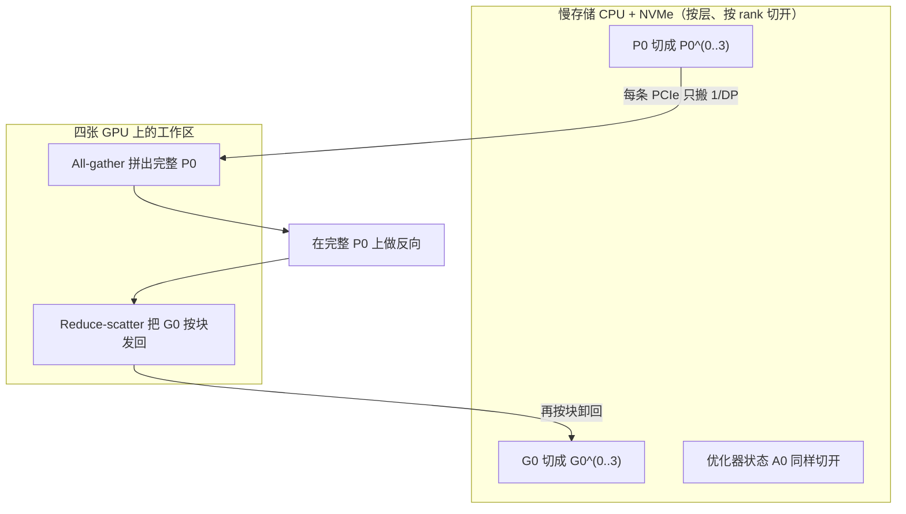
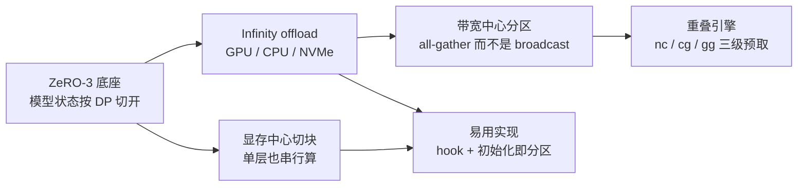
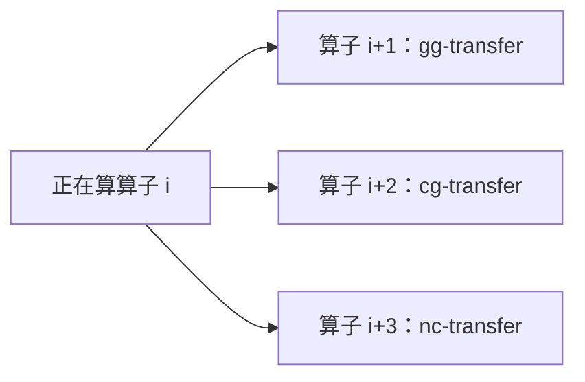

# ZeRO-Infinity：万亿参数不必先塞进聚合 GPU 显存

<!-- release-date: 2021-04-16 -->

> 本文依据 Microsoft 的 **ZeRO-Infinity: Breaking the GPU Memory Wall for Extreme Scale Deep Learning**，即 arXiv:2104.07857v1（2021-04-16），共 14 页。截至核验 arXiv 只有 v1。页码均指这份 PDF。全文把三件事分开标注：**报告明确写了什么**、**我们如何解释或验算它**、**哪些是外部资料补充**。
>
> 封面水印为 `arXiv:2104.07857v1 [cs.DC] 16 Apr 2021`。作者是 Samyam Rajbhandari、Olatunji Ruwase、Jeff Rasley、Shaden Smith、Yuxiong He，单位 Microsoft。本地 PDF 14 页，与官方最新一致，未做替换。
>
> 同一工作后来作为 SC '21 论文发表（ACM `10.1145/3458817.3476205`，会议论文集页码 1–14）。本文一律用 arXiv v1 的页码，不用会议页码回写。
>
> 首发日取 **2021-04-16**。这是一篇系统论文，对象从未作为产品对外可用，按该技术首次官方公开日取值，即 arXiv v1。SC 开会日与官方博客日都不用于回写。

## 读前先认识几个词

这篇论文的门槛不在公式，而在它同时用了「训练显存账单」和「异构存储带宽」两套词汇。先把后文会反复出现的说清楚。其中前几个是通用背景，不全是报告自己定义的。

- **Token（词元）**：模型读写文本的最小单位。
- **数据并行（data parallelism，DP）**：每张卡放一份完整模型，各吃不同微批，反向后把梯度平均。卡变多，吞吐可以涨，但单卡显存不降。
- **模型并行（model parallelism，MP）**：本文把这个词收窄成 **张量切分（tensor-slicing）**，即把一层里的大矩阵沿某个维切开，分到多张 GPU 上一起算。它 **不包括** 流水线并行（PDF p. 2 脚注 3）。
- **流水线并行（pipeline parallelism，PP）**：把模型按层切成几段，不同 GPU 各管一段，微批像流水一样往下传。
- **3D 并行（3D parallelism）**：把数据并行、张量切分和流水线并行叠在一起。报告把它写成 2021 年训万亿参数的通行做法（PDF p. 1）。
- **模型状态（model states）**：参数、梯度和优化器状态。混合精度 Adam 下，它们按参数个数成比例涨，和批大小几乎无关。
- **残差状态（residual states）**：主要是激活。随批大小和序列长度涨。
- **工作显存（working memory）**：即便把模型和激活都卸走，GPU 上仍要留下「正在算的那一层」的空间。报告拆成模型状态工作显存（MSWM）和激活工作显存（AWM）（PDF p. 4）。
- **激活检查点（activation checkpointing）**：前向时只隔一段存一份激活，反向时再重算中间结果。用算力换显存。
- **算术强度（arithmetic intensity，AIT）**：搬 1 份数据能做多少计算。强度高，带宽要求就低。
- **NVMe**：挂在 PCIe 上的高速固态盘。容量远大于 CPU 内存，带宽远小于 GPU 显存。
- **All-gather / Broadcast / Reduce-scatter**：三种集合通信。Broadcast 是「一个拥有者发给所有人」；All-gather 是「每人出一块，拼成完整一份」；Reduce-scatter 是「先把各卡梯度合成，再按块发回各卡」。

报告自己反复出现的几个专有设定：

- **ZeRO（Zero Redundancy Optimizer）**：沿数据并行轴把模型状态切开，不再每卡复制一份。本文是这个家族的延伸，底座是 **ZeRO-3**（PDF p. 3、p. 6）。
- **ZeRO-Offload**：把优化器状态和梯度卸到 CPU，但参数仍复制在 GPU 上。报告把它写成当时异构训练的 SOTA，也是本文要越过的旧方案（PDF p. 3）。
- **Infinity offload engine（无限卸载引擎）**：同时调度 GPU、CPU、NVMe 三层存储，以及 GPU 和 CPU 两端的计算（PDF p. 2、p. 6）。
- **Memory-centric tiling（以显存为中心的切块）**：一层大到单卡都塞不进时，把算子切成小块串行执行，不必上张量切分（PDF p. 2、p. 6）。
- **Bandwidth-centric partitioning（以带宽为中心的分区）**：每个参数都切到所有数据并行进程上，用 all-gather 而不是 broadcast，让所有 PCIe 一起干活（PDF p. 2、p. 8）。

如果你只想记一句话：

> **旧方案把「模型能不能训」等同于「聚合 GPU 显存够不够」。ZeRO-Infinity 把 CPU 和 NVMe 也算进训练内存，再用切法把慢带宽变成「所有设备一起搬」，所以看起来不够的带宽，叠起来就够用。**

## 一句话先说清

ZeRO-Infinity 的主张只有一句：**训练极大模型，不必先把全部模型状态塞进聚合 GPU 显存，也不必为了装得下而改模型代码。**

它不是新的注意力，也不是新的优化器。它是一套异构训练系统，叠在 ZeRO-3 上，做了五件事（PDF p. 2）：

1. **Infinity offload engine**：按容量把切好的模型状态放在 GPU、CPU 或 NVMe 上；
2. **Memory-centric tiling**：单层也塞不进 GPU 时，切成小块串行算；
3. **Bandwidth-centric partitioning**：让所有 PCIe 并行搬运，而不是挤在一条链路上；
4. **Overlap-centric design**：把 NVMe→CPU、CPU→GPU、GPU 之间的通信和计算叠在一起；
5. **Ease-inspired implementation**：用 PyTorch 的 hook 和构造函数包装，自动搬数据、自动在初始化时分区。

摘要把规模钉得很硬（PDF p. 1）：

- 在 32 台 NVIDIA V100 DGX-2（512 GPU）上能训 **32 万亿** 参数，比当时的 3D 并行大约 **50 倍**；
- 单台 DGX-2 就能微调万亿参数；
- 512 张 V100 上维持超过 **25 petaflops**，约 **40% peak**，并且是超线性扩展。

实现开源在 DeepSpeed（<https://www.deepspeed.ai/>），这是论文自己写的（PDF p. 1 脚注 1）。

它明确不解决的问题也要先说清：报告没有训练数据、学习率、token 数，也没有下游精度表。评测量的是「装得下多大」和「每张卡每秒多少 TFlops」，不是「这个万亿模型有多聪明」。

### 一条阅读路线

如果只有半小时读原文，建议按这个顺序：

1. **p. 1 图 1**：32 节点 32T，相对 3D 并行约 50 倍。先看规模，再看方法。
2. **p. 4 图 2**：左边是显存账单，右边是 DGX-2 集群实际有多少内存和带宽。矛盾的两端都在这里。
3. **p. 5 图 3、p. 6–7 第 4–5 节**：为什么 NVMe 看起来太慢，却仍能保持效率。
4. **p. 6 图 4**：一个反向步里，参数怎么从慢存储拼起来、梯度怎么卸回去。
5. **p. 8 第 6.1–6.2 节**：broadcast 换成 all-gather，再加上三级预取。这是「慢带宽够用」的机制。
6. **p. 10 表 1、图 5**：512 卡上的吞吐、超线性、单节点微调。
7. **p. 11 图 6、表 2**：各招分别买到多大模型；切块让隐藏维从 8K 走到 64K。

第 7 节的 hook 与外部参数，知道「为什么用户不用改模型」即可。附录只是图 6 各柱的模型配置。

## 报告地图：14 页里各写了什么

先摊开篇幅。这是一篇系统论文，没有模型配方。密度最高的是第 3–4 节的两张账单，和第 5–6 节的五件套。

| 报告章节 | PDF 页 | 讲了什么 | 密度 |
|---|---|---|---|
| 标题、摘要、图 1 | p. 1 | 1000x vs 5x；800 张 V100 才能装下万亿；32T / 50x / 25 petaflops | 高 |
| §1 后半 + 贡献清单 | p. 2 | GPT-3 微调要 8 台 DGX-2；三个问题；五件套 | 高 |
| §2 背景 | p. 2–3 | 3D 并行的三个限制；ZeRO-1/2/3；ZeRO-Offload；激活检查点 | 高 |
| §3 + 图 2 | p. 3–4 | 每参数 20 字节；模型状态、激活、工作显存 | 高 |
| §4 + 图 3 | p. 4–5 | AIT 与效率公式；三类状态分别要多少带宽 | 高 |
| §5 + 图 4 | p. 6–7 | 设计总览：卸载、切块、分区、重叠、易用 | 高 |
| §6 | p. 7–8 | all-gather 分区、三级预取、DeepNVMe | 高 |
| §7 | p. 9 | hook 自动搬数据；初始化时分区；外部参数 | 中 |
| §8 + 表 1 + 图 5 | p. 9–10 | 硬件与基线；32T / 20T 吞吐；超线性；单节点 1T | 高 |
| 图 6 + 表 2–3 + §8.5–§9 | p. 11–12 | 消融；对未来硬件的带宽表；结论 | 高 |
| 参考文献 | p. 12–13 | ZeRO、ZeRO-Offload、GPipe、Megatron-LM 等 | 低 |
| 附录 A 表 4–8 | p. 14 | 图 6 各实验的层数、隐藏维、批大小 | 中 |

## 先看矛盾：模型涨了 1000 倍，单卡显存只涨了 5 倍

报告没有从「我们做了一个异构引擎」开场。它先把 2018 到 2021 年的账摊开（PDF p. 1）：

- 最大稠密模型从 ELMo 的约 1 亿参数，涨到 GPT-3 的超过 1000 亿，大约 **1000 倍**；
- 同一段时间，单卡显存从 16 GB 到 80 GB，大约 **5 倍**。

所以这些年真正托住模型变大的，不是显卡容量，而是系统：张量切分、流水线、ZeRO，让模型去挤 **多张卡加起来的 GPU 显存**（PDF p. 1）。

这条路在 2021 年已经快走到头。报告把当时的 SOTA 写成 **3D 并行**：数据并行 + 张量切分 + 流水线（PDF p. 1）。DeepSpeed 的 3D 实现可以在 **800 张 V100** 上把万亿参数塞进聚合 GPU 显存（PDF p. 1）。换最新的 80 GB A100，装下一个万亿模型仍要 **320 张卡**；再往 100 万亿走，即便假设未来几年单卡再涨 5 倍，也还要超过 **6 千张卡**（PDF p. 1）。

这就是标题里的墙：**墙不在「有没有更快的 GPU」，而在「只肯用 GPU 显存来装模型」。**

墙还有第二面，面向没有超算的人。预训练可能要百万 GPU 小时；微调便宜得多，一台有几张 GPU 的节点就算力就够。可是 3D 并行微调 GPT-3，光是「装得下」就要超过 **8 台 DGX-2（128 GPU）**，尽管 **1 台 DGX-2（16 GPU）** 的算力已经够把微调做完（PDF p. 2）。多数实验室买得起算力，买不起把模型塞进显存所需的卡数。

第三面是易用性。3D 并行要改模型代码：把单卡算子换成切分版，再把网络切成负载均衡的流水线段。依赖图复杂的模型很难切成均衡流水线（PDF p. 1–2）。

于是报告问三个问题（PDF p. 2）：

1. 下一个 1000 倍，从 GPT-3 的 1750 亿走到几十、上百万亿，靠什么装？
2. 今天的大模型，怎样让没有几百张卡的人也能微调？
3. 能不能去掉改模型和叠多种并行这件事？

ZeRO-Infinity 的回答不是「再买一批 GPU」，而是换一条内存边界：训练内存 = GPU + CPU + NVMe。图 1 把这条新边界画成柱子（PDF p. 1）：

| DGX-2 节点数 | GPU 数 | 3D 并行（读自图 1） | ZeRO-Infinity |
|---:|---:|---:|---|
| 1 | 16 | 0.02T | 1T（实测） |
| 8 | 128 | 0.16T | 8T（实测） |
| 16 | 256 | 0.32T | 16T（实测） |
| 32 | 512 | 0.64T | **32T（实测）** |
| 64 | 1024 | 1.28T | 64T（投影） |
| 128 | 2048 | 2.56T | 128T（投影） |

32T / 0.64T = 50。这就是摘要里「相对 3D 并行约 50 倍」的出处。浅色柱是投影，不是跑出来的；正文后文会把「装得下」和「吞吐多少」分开写。

## 显存账单：每参数 20 字节，万亿先要几十 TB

要判断「卸到 CPU/NVMe 有没有用」，得先知道训练到底要多少内存。报告把分析钉在 Transformer + 混合精度 Adam 上，因为当时超过十亿参数的 SOTA 几乎都是这个配方（PDF p. 3）。

### 模型状态：和批大小无关的那一笔

混合精度里，前反向用 FP16，参数更新用 FP32。报告把每参数记成 **20 字节**（PDF p. 3）：

- FP16 参数 2 字节 + FP16 梯度 2 字节；
- 优化器状态里再放 FP32 的动量、方差、参数和梯度，各 4 字节。

一个 Transformer 块里，参数几乎都来自四层线性：$(hd, 3hd)$、$(hd, hd)$、$(hd, 4hd)$、$(4hd, hd)$。于是参数量可以近似写成（PDF p. 3，式 1–2）：

$$
N \approx 12 \times n_l \times hd^{2}
$$

$$
\text{model-state bytes} \approx 240 \times n_l \times hd^{2}
$$

$n_l$ 是层数，$hd$ 是隐藏维度。20 字节乘上 $12 n_l hd^{2}$，就是 240。

我们补一句解释，不是报告原话：后来不少材料把同一套 Adam 写成 16 字节，差在「要不要单独留一份 FP32 梯度」。本文一律用这份 PDF 的 20 字节，不拿别的论文改账。

图 2a 把这张账单写成表（PDF p. 4）。序列长度固定 1024，激活检查点按「每个 Transformer 块存一份」、节点内批大小 32 来估：

| 参数量 | 层数 | 隐藏维 | 注意力头 | 模型状态（TB） | 激活（TB/节点） | 检查点（TB/节点） | 模型工作显存（GB） | 激活工作显存（GB） |
|---:|---:|---:|---:|---:|---:|---:|---:|---:|
| 0.10T | 80 | 10K | 128 | 1.83 | 2.03 | 0.05 | 1.95 | 1.63 |
| 0.50T | 100 | 20K | 160 | 9.16 | 3.91 | 0.12 | 6.25 | 2.50 |
| 1.01T | 128 | 25K | 256 | 18.31 | 7.13 | 0.20 | 9.77 | 3.56 |
| 10.05T | 195 | 64K | 512 | 182.81 | 24.38 | 0.76 | 64.00 | 8.00 |
| 101.47T | 315 | 160K | 1024 | 1845.70 | 88.59 | 3.08 | 400.00 | 18.00 |

对照图 2b 的集群容量（PDF p. 4）：

| 节点 | GPU | GPU 内存（TB） | CPU（TB） | NVMe（TB） | GPU–GPU 带宽（GB/s） | 每 GPU：GPU / CPU / NVMe 带宽（GB/s） |
|---:|---:|---:|---:|---:|---|---|
| 1（1 GPU） | 1 | 0.032 | 1.5 | 28.0 | N/A | 600–900 / 12.0 / 12.0 |
| 1（整机） | 16 | 0.5 | 1.5 | 28.0 | 150–300 | 600–900 / 3.0 / 1.6 |
| 4 | 64 | 2.0 | 6.0 | 112.0 | 60–100 | 600–900 / 3.0 / 1.6 |
| 16 | 256 | 8.0 | 24.0 | 448.0 | 60–100 | 600–900 / 3.0 / 1.6 |
| 64 | 1024 | 32.0 | 96.0 | 1792.0 | 60–100 | 600–900 / 3.0 / 1.6 |
| 96 | 1536 | 48.0 | 144.0 | 2688.0 | 60–100 | 600–900 / 3.0 / 1.6 |

图注写明：右边三列带宽是「所有 GPU 同时从该层存储读」时的 **每 GPU** 带宽（PDF p. 4）。

两张表对在一起，结论很硬（PDF p. 3–4）：

- 1000 亿参数的模型状态，大约要 **64 张 GPU** 才装得下；
- 万亿参数的模型状态，要超过 **512 张 GPU**；
- 10 万亿已经超出 1536 张 GPU 的聚合显存。

我们补一句换算：1 万亿 × 20 字节 = 20 TB；V100 每张 32 GB，512 张只有 16.4 TB，所以正文写「超过 512」而不是「等于 512」。摘要里 3D 并行要用 **800 张 V100** 才能「为了训练而装下」万亿模型（PDF p. 1），比「只装模型状态」更宽，因为训练还要激活和工作显存。两个数字不是同一笔账。

### 激活：检查点能砍几个数量级，万亿之后仍会爆

激活随 $bsz$、$seq$、$hd$、$n_l$ 涨。完整激活大到常常先把 GPU 撑爆。检查点用大约 **0.33 倍** 额外重算，换掉大部分激活（PDF p. 3）。Turing-NLG 17.2B 和 GPT-3 175B 都用了这一招（PDF p. 3）。

检查点体积估成（PDF p. 3，式 3）：

$$
2 \times bsz \times seq \times hd \times n_l / c_i
$$

$c_i$ 是两个检查点之间隔了多少个 Transformer 块。图 2a 假设 $c_i = 1$、节点内 $bsz = 32$、$seq = 1024$（PDF p. 4）。检查点比完整激活小几个数量级，但万亿之后仍然装不进 GPU。

### 工作显存：卸光了，GPU 上还要留「正在算的那一层」

**MSWM** 是把模型状态都卸走之后，前反向仍要留在 GPU 上的最小空间，大约等于最大那个算子的参数加梯度（PDF p. 4）。Transformer 里最大的线性层是 $hd \to 4hd$，字节数（PDF p. 4，式 4）：

$$
4 \times hd \times 4hd
$$

前面的 4 是 FP16 参数加 FP16 梯度各 2 字节。1000 亿以上，这一项会到数 GB 的 **连续** 显存。碎片化之后，总量够也可能申请失败。3D 并行靠张量切分把这一层拆到多卡；本文要用切块来避免这件事（PDF p. 4）。

**AWM** 是反向重算时，两个检查点之间那一段激活（PDF p. 4，式 5）：

$$
bsz \times seq \times c_i \times (16 \times hd + 2 \times attn\_heads \times seq)
$$

10 万亿以上，即便 $c_i = 1$，AWM 也会很大。它由许多激活组成，不像 MSWM 只要两块连续大缓冲；只要总量能进 GPU，通常不会因为碎片化先炸（PDF p. 4）。

对自己的项目，这张账单的用处是：先问「你要砍的是模型状态、激活，还是单层工作显存」。三笔账不是同一把刀能切的。后文的卸载砍模型状态和检查点，切块砍 MSWM，检查点砍完整激活。搞错对象，加多少卡都没用。本站已有的 [Ultra-Scale Playbook](/reports/HuggingFace/Ultra-Scale-Playbook) 把同一笔四项占用写成操作手册；那是 2025 年的教学材料，数字不要和本篇混用。

## 带宽账单：看起来不够，为什么还够用

把状态卸到 CPU 或 NVMe，下一个问题立刻出现：它们比 GPU 显存慢一到两个数量级，会不会把训练拖死？报告用一个 **不重叠** 的效率公式先把墙标出来（PDF p. 4，式 6）：

$$
\text{efficiency} = \frac{\mathrm{AIT} \times bw}{\mathrm{AIT} \times bw + peak_{tp}}
$$

$peak_{tp}$ 是没有通信瓶颈时能打到的算力，$bw$ 是搬数据的带宽，$\mathrm{AIT}$ 是算术强度。强度越高，同样带宽下效率越高。

### 三类状态，三种强度

每步计算量由线性层主导。前向大约 $2 \times bsz \times seq \times N$，反向大约再乘 2，检查点还要再做一次前向，所以一步总共大约（PDF p. 5，式 7–8）：

$$
8 \times bsz \times seq \times N
$$

搬多少数据，三类状态不一样（PDF p. 5）：

| 对象 | 一步里至少搬几次 | AIT | 含义 |
|---|---|---|---|
| 参数 + 梯度 | 前向一次、反向一次、重算再一次、梯度写回一次，共 $4N$ 个元素 | $seq \times bsz$（式 9） | 只跟批和序列有关 |
| 优化器状态 | 读一次、写一次，约 $2 \times 16N$ 字节 | $seq \times bsz / 4$（式 10） | 强度是参数的 1/4 |
| 激活检查点 | 前向存、反向取 | $24 \times hd \times c_i$（式 11） | 只跟隐藏维和检查点间隔有关 |

### 把公式画成「要多少 GB/s」

报告在 DGX-2 SuperPOD 上量了一个 **可达到峰值**：$hd$ 从 8K 到 64K，单卡 62–78 TFlops，分析时取平均 **70 TFlops/GPU**。脚注写明：这不是芯片标称峰值，而是关掉非 GPU 通信之后能打到的数（PDF p. 5）。序列长度取 1024，批每卡 1 到 16（PDF p. 5）。

图 3 加上正文，给出三条门槛（PDF p. 5–6）：

- **参数和梯度**：超过约 **70 GB/s**，即便最小批也能到 50% 效率；这个带宽上，数据移动理论上可以和计算完全重叠，冲到 100%。
- **优化器状态**：到 50% 效率大约要 **4 倍** 于参数的带宽。而且优化器在前反向结束之后才更新，**叠不上计算**。每卡批 2 要做到 90% 效率，大约要 **1.5 TB/s**，比单卡 GPU 显存带宽还高。
- **激活检查点**：开启检查点之后，**2 GB/s** 就能让 $hd=2K$ 维持 50% 以上；$hd$ 超过 8K，门槛降到 **1 GB/s** 以下。

把这三条门槛对回图 2b：单卡走 PCIe 读 CPU/NVMe 大约 **12 GB/s**，整机 16 卡并行时每卡只剩 CPU **3.0 GB/s**、NVMe **1.6 GB/s**（PDF p. 4、p. 7 脚注 6）。参数那条 70 GB/s 的门槛，单条 PCIe 根本够不到；优化器那条 1.5 TB/s，单机更是笑话。

这就是旧异构方案的死法。ZeRO-Offload 必须先把参数沿 **一条** PCIe 搬到「拥有者」GPU，再 broadcast。带宽不够，就只能靠加大每卡批来抬高 AIT。代价是：激活会爆、全局批在上百上千卡时大会伤害收敛（PDF p. 7）。

报告后文的全部效率设计，都是在回答：

> **单条链路不够，并不等于聚合带宽不够。把数据切开，让所有 PCIe 一起搬，再把三级搬运和计算重叠，慢存储就可以当训练内存用。**

## 全景：五件套怎样接成一次训练步

先看一次反向步里数据怎么走。图 4 画的是两层模型、四个数据并行 rank，正在做第 0 层的反向（PDF p. 6）。下标是层，上标是 rank：例如 $P_0^{(2)}$ 是第 0 层参数里、GPU 2 拥有的那一块。

这是根据论文图 4 重画的 **机制示意**（PDF p. 6），不是实测时间线。图注自己写的顺序是：分区参数从慢存储搬到 GPU，再收集成完整一层；算出梯度后聚合、重新分区，再卸回慢存储。

五件套分别卡在这条流水线的不同位置：

这是根据第 5 节贡献清单重画的 **机制示意**（PDF p. 2、p. 6），不是一张实测架构图。下面按「旧问题 → 新设计 → 机制 → 收益 → 代价」把每一件走完。

## 核心设计一：Infinity offload engine，三层存储当成一块内存

**旧问题。** ZeRO-3 已经把优化器状态、梯度和参数都沿 DP 切开，每层参数由一个数据并行进程拥有，用的时候 broadcast，用完就丢掉（PDF p. 3）。它吃的仍是 **聚合 GPU 显存**。ZeRO-Offload 再进一步，把梯度和优化器状态放到 CPU，但 **参数仍复制在每张 GPU 上**，模型规模被单卡能放下的参数量卡住（PDF p. 3）。NVMe 那一侧，当时的相关工作是广告系统把稀疏参数卸到 SSD，不是给稠密大模型用的通用训练系统（PDF p. 3）。

**新设计。** Infinity offload engine 可以按容量，把 **已经切开的全部模型状态** 放在 GPU、CPU 或 NVMe 上，或者按需组合（PDF p. 6）。图 2 对过之后：100 万亿参数的模型状态，能装进 96 节点 DGX-2 集群的聚合 NVMe（1536 GPU，2688 TB）（PDF p. 4、p. 6）。激活检查点另走 CPU：10 万亿的检查点约 **0.76 TB**，单机 CPU **1.5 TB** 装得下；100 万亿的约 **3 TB**，报告写成「下一代 CPU 内存够得着」（PDF p. 6）。

**机制。** 引擎有两块（PDF p. 8）：

1. **DeepNVMe**：C++ 的 NVMe 读写库。支持批量异步读写，以及显式 flush。异步才能和 GPU–GPU / GPU–CPU 通信或计算重叠。报告写它能打到近峰值的顺序读写，手段是并行 I/O（单线程内和多线程间）、调度、避免拷贝、内存钉扎。
2. **Pinned memory 管理层**：NVMe/CPU 和 GPU 之间要走得快，张量必须落在 pinned 缓冲上。Pinned 内存是稀缺系统资源，一个进程订太多会拖垮整机。这一层只用 **几十 GB** 的 pinned 缓冲，循环装下 **几十 TB** 的模型状态。复用同一块缓冲，还能减轻 CPU/GPU 碎片。它直接把 pinned 数据交给 PyTorch 张量，原地算完再写回 NVMe，不再二次拷贝。

优化器更新有一个额外约束：状态在 NVMe 上时，必须按 CPU 内存能放下的块，一块一块搬上来更新再写回去。这一步被 NVMe–CPU 带宽卡住。所以引擎还要：尽量打满 **每节点** 的峰值 NVMe 带宽；让 NVMe→CPU 读、CPU→NVMe 写、以及 CPU 上的优化器计算三者重叠（PDF p. 7）。

**收益。** 模型状态的天花板从「集群有多少 GPU 显存」换成「集群有多少 NVMe」。图 1 的 1T/节点、32T/32 节点，都踩在这上面（PDF p. 1、p. 6）。优化器还可以用上聚合 CPU 算力，这是后文超线性扩展的原因之一（PDF p. 10）。

**代价和边界。** 卸载不会让带宽消失，只是把问题变成「聚合带宽够不够、重叠得够不够」。单机、小批时仍可能被 PCIe 卡住，所以必须配上后文的分区和预取。激活卸到 NVMe 在这篇里是「未来实现」，当时没做（PDF p. 10）。碎片化如果不管，总量够也会 OOM——这正是 pinned 缓冲要复用的原因（PDF p. 7）。

**可迁移启发。** 异构内存要当训练内存用，不能只写「offload=True」。至少要同时规定：异步 I/O、钉扎缓冲的配额、读写与计算的重叠、以及「整模型从来不以完整形态出现在单一设备上」。缺任何一项，NVMe 都会从内存退化成外置硬盘。

## 核心设计二：Bandwidth-centric partitioning，让所有 PCIe 一起搬

**旧问题。** ZeRO 和 ZeRO-Offload 里，每一层的参数由 **一个** 数据并行进程整份拥有，需要时 broadcast（PDF p. 8）。数据若在 GPU 上，broadcast 和 all-gather 的通信量一样，无所谓。数据若在 CPU/NVMe 上，broadcast 之前必须先沿 **一条** PCIe 把整份参数搬到拥有者 GPU。其余 GPU 的 PCIe 在旁观。DGX-2 上即便 16 路数据并行，CPU/NVMe 到 GPU 的有效带宽仍停在 PCIe Gen3 的大约 **12 GB/s**（PDF p. 8）。

**新设计。** 把 **单个参数** 切到所有数据并行进程上，需要时改用 all-gather（PDF p. 8）。

**机制。** 每个 rank 只通过自己的 PCIe 搬 $1/dp$ 的参数，所有链路同时工作。有效带宽随 $dp$ 线性涨，直到碰到节点内聚合 PCIe 或聚合 NVMe 的上限。

报告给的具体数字（PDF p. 8，并回指图 2b）：

- broadcast：16 路 DP 仍然约 12 GB/s；
- all-gather：有效带宽大约到 **48 / 25 GB/s**（每 GPU **3.0 / 1.6 GB/s**），分别受节点内聚合 PCIe 和聚合 NVMe 限制；
- 再加节点，继续线性涨。64 台 DGX-2 上，报告写 ZeRO-Infinity 能用到超过 **3 TB/s** 的 CPU 内存带宽、超过 **1.5 TB/s** 的 NVMe 带宽。

我们的验算，不是报告另给的公式：图 2b 里 16 卡并行时每 GPU 的 CPU/NVMe 带宽是 3.0 / 1.6 GB/s，乘 16 张卡得 48 / 25.6 GB/s，与正文 48 / 25 一致；再乘 64 节点，约 3.07 TB/s 和 1.64 TB/s，与「超过 3 TB/s / 1.5 TB/s」一致。

回头看第 4 节的门槛：参数要 70 GB/s，优化器要 1.5 TB/s。64 节点上两条都已经跨过。报告因此说，大规模时异构带宽可以「几乎无限」，不再是效率瓶颈（PDF p. 8）。

**收益。** 这是「慢存储看起来不够、叠起来够用」的第一根支柱。没有这一刀，Infinity offload 只是把数据藏到更慢的地方；有了这一刀，每加一台机器，搬数据的马路也变宽。

**代价和边界。** GPU-only 训练下，这一刀几乎不改变通信量，收益不明显（PDF p. 8）。真正换来的是异构场景的并行 PCIe。单 GPU、单节点时聚合度不够，带宽仍可能是瓶颈，必须靠下一节的重叠（PDF p. 8）。

**可迁移启发。** 设计卸载时，先问「拥有者是一个进程，还是所有进程各持一块」。前者省调度，后者才能把主机侧带宽变成随卡数扩展的资源。通信原语从 broadcast 换成 all-gather，往往不是为了少传字节，而是为了让更多物理链路同时亮起来。

## 核心设计三：Overlap-centric design，三级搬运叠在计算上

**旧问题。** 即便聚合带宽够，NVMe 上的参数也不能一步跳到每张 GPU。它要走三步（PDF p. 8）：

1. **nc-transfer**：NVMe → CPU；
2. **cg-transfer**：CPU → GPU；
3. **gg-transfer**：GPU 上 all-gather，拼成完整参数。

若串行做，总时间是三段之和。每一段单独看带宽都够，加起来仍会把效率打穿。小批时，即便只是 GPU–GPU 的 all-gather，图 3 也显示冲击很大（PDF p. 8）。

**新设计。** 重叠引擎同时叠四件事：GPU 计算、GPU–GPU 通信、CPU–GPU 拷贝、NVMe–CPU 读写（PDF p. 8）。它分两块：动态预取器，以及反向时的通信/卸载重叠。

**机制。** 预取器在运行中追踪前反向，给每一步算子序列建一张内部地图。执行第 $i$ 个算子时，它可以同时（PDF p. 8）：

- 对第 $i+3$ 个算子做 nc-transfer；
- 对第 $i+2$ 个做 cg-transfer；
- 对第 $i+1$ 个做 gg-transfer。

前反向若跨步变化，地图可以更新，动态工作流也能预取（PDF p. 8）。

反向对称地往后看：算第 $i$ 个算子时，重叠第 $i+1$ 个的梯度 reduce-scatter，同时把第 $i+2$ 个已经切好的梯度卸到 CPU 或 NVMe（PDF p. 8）。

这是根据第 6.2 节文字重画的 **机制示意**（PDF p. 8），箭头表示「与算子 $i$ 同时发生」，不是数据依赖。

**收益。** 小卡数、小每卡批时，仍能藏住很大一部分数据移动（PDF p. 8）。图 6d 在 8B 模型、64 GPU 上把预取和重叠关掉对比：小批时加速明显，大批时差距缩小（PDF p. 11）。意思是：AIT 已经够高时，重叠是锦上添花；AIT 不够时，重叠是能不能用的前提。

**代价和边界。** 重叠不是消除通信量，是把等待藏进计算。计算本身若已经很短（极小批、极小隐藏维），就没有地方可藏。动态预取依赖「算子顺序可追踪」；完全不规则的控制流会让地图失效，报告只说可以更新地图，没有给出失败率。

**可迁移启发。** 异构搬运一旦超过两级（存储→主机→设备→集合通信），「每段都很快」仍可能总和很慢。正确的调度单位不是「一次 all-gather」，而是「第 $i$ 层在算时，第 $i+1$、$i+2$、$i+3$ 层分别走在哪一段管路上」。

## 核心设计四：Memory-centric tiling，单层塞不进也不上张量切分

**旧问题。** 卸走模型状态之后，GPU 仍要放下「当前这个算子」的参数和梯度。图 2a 里 10T、隐藏维 64K 的模型状态工作显存已经是 **64 GB**，而且还要连续（PDF p. 4）。3D 并行的办法是张量切分：把这一层拆到多张卡上一起算。这就回到「必须改模型、必须有足够的卡做 MP」这条老路（PDF p. 4、p. 6）。

**新设计。** 把一个大线性算子写成数学等价的一串小线性算子，每块是原矩阵的一个 tile，**在同一张 GPU 上串行执行**（PDF p. 6）。

**机制。** 和 ZeRO-3 的「用时取、用完丢」配在一起：每次只 fetch 一个 tile 的参数和梯度，算完就 release。工作显存按 tile 数成比例下降。报告因此写：可以支持任意大的算子，不必靠模型并行把它们塞进 GPU（PDF p. 6）。

消融把碎片化做成受控条件：先把 GPU 内存切成 2 GB 的连续块，大于 2 GB 的申请一律失败。单层 Transformer、16 张 GPU 上（PDF p. 11、p. 14 表 5）：

| 切块因子 | 能训的最大隐藏维 | 对应单层参数量（表 5） |
|---:|---:|---:|
| 1（不切） | 8K | 900M |
| 2 | 16K | 3B |
| 4 | 32K | 13B |
| 16 | 64K | 50B |

数字读自图 6b 的柱高与附录表 5（PDF p. 11、p. 14）。不切块停在 8K；切块因子 16 可以把隐藏维推到 64K。

**收益。** 单层工作显存不再倒逼你上张量切分。这是「不改模型代码也能训到万亿」的物理前提之一：层可以很大，但 GPU 上同一时刻只看到一小块（PDF p. 6–7）。

**代价和边界。** 切块把本来可以一次做完的大 GEMM 拆成多次小 GEMM，算子本身的效率可能下降；报告没有单独给出切块的 TFlops 惩罚，只证明「能装下」。图 5 里 32 节点、5T/10T/20T 的实验仍然开了 `mp = 4 或 8`（PDF p. 10 表 1）。所以「可以不用模型并行」是能力声明；极大规模要吞吐时，作者自己仍叠了张量切分。单节点 10B–1T 那组才是 `mp = 1`（PDF p. 10）。

**可迁移启发。** 「一层都放不进 GPU」常常被当成必须上张量并行的信号。切块给出另一条路：时间换空间，用 ZeRO-3 的生命周期把大算子变成一串小算子。选型时把「为了装得下」和「为了更快」分开——前者可以用切块，后者仍可能要 MP。

## 核心设计五：Ease-inspired implementation，初始化时就切开

**旧问题。** 3D 并行要改算子、切流水线。即便有了卸载和切块，若用户仍须手写 all-gather / 分区，易用性承诺就空了。还有一个更硬的问题：传统数据并行是「先在每张卡上把模型完整建出来，再同步」。5000 亿参数的半精度模型占 1 TB；8 卡节点若先复制再分区，初始化就要 8 TB，超过单机 GPU 或 CPU（PDF p. 9）。

**新设计。** 做成和普通 PyTorch 数据并行类似的用法，两件自动化（PDF p. 7、p. 9）：

1. **训练中自动搬数据。** 递归向子模块注入 hook：前向/反向开始前 all-gather（必要时先阻塞等到参数到齐），结束后再分区，并可卸到 CPU/NVMe。预取引擎就接在这些 hook 上，用来减少等待（PDF p. 9）。
2. **初始化时自动分区。** 用一个 Python context 装饰 `torch.nn.Module.__init__`，每个子模块的参数一创建完立刻沿 DP 切开并卸载。完整模型从不在单个进程上实例化。上面那个 5000 亿的例子，初始化只需要 **1 TB 聚合 CPU**，与 DP 路数无关（PDF p. 9）。

**外部参数。** 理想情况是：一个子模块的参数只在自己的前反向里被碰到。真实模型会越界。GPT 一类把 embedding 权重在网络两端共享；Megatron-LM 的线性层会把 bias 从 `forward` 返回给父模块（PDF p. 9）。报告把这类张量叫 **external parameters**。处理分三层：

- 提供手动注册 API；
- 把模块存参数的哈希表换成子类，读到被分区的参数就阻塞 all-gather，并登记为外部参数；
- 检查每个子模块 `forward` 的返回值，发现被分区的参数就收集并登记。

登记之后，外部参数和普通参数一样进入预取（PDF p. 9）。

**收益。** 数据科学家不必把模型改成张量切分版，也不必手写流水线段。报告把「单节点微调到万亿、且不用模型并行、不用改代码」写成易用性的实证（PDF p. 2、p. 10）。

**代价和边界。** 自动化依赖「模型是 PyTorch 模块树、参数走 `nn.Parameter`」。完全自定义的张量管理、或在 hook 看不见的地方偷用权重，仍会漏。外部参数的拦截是启发式；报告没有说覆盖了所有越界模式。另外，Ease 不等于「大规模吞吐实验完全不用 MP」——表 1 已经写明 5T 以上仍开了 `mp`。

**可迁移启发。** 分布式系统的易用性，往往死在两处：初始化时的峰值内存，以及跨模块共享的那几个张量。先切后建、再对「越界访问」做拦截，比要求用户遵守生命周期文档更有效。

## 激活这条支线：检查点卸到 CPU，带宽几乎不是事

模型状态走 NVMe，激活走另一条路。报告把激活检查点卸到 CPU，而不是 NVMe（PDF p. 6）。原因在第 4 节已经算过：检查点的 AIT 高，**2 GB/s** 量级就够。DGX-2 上各 GPU 经 PCIe 并行读写 CPU，大约 **3 GB/s**，对 $hd \ge 8K$ 可以保住 80% 以上效率（PDF p. 7）。更小的隐藏维，就减少检查点频率，并把 CPU 往返和 GPU 上的前反向重叠（PDF p. 7）。

图 6e 给出实测开销：小隐藏维最多把吞吐拉低约 **1.2 倍**；$hd$ 到 32K 和 64K，影响几乎看不见（PDF p. 11）。附录表 8 写明这组实验：32 或 64 GPU，优化器在 CPU 或 NVMe，每卡批 4（PDF p. 14）。

边界同样写在正文里：20T 那次吞吐下降，**不是** NVMe 带宽不够——10T 和 20T 都在用 NVMe 卸载——而是每卡批太小（表 1 里 20T 只有 1.25），因为 CPU 内存装不下更大的激活检查点（PDF p. 10）。改进方向是加大 CPU，或把检查点也卸到 NVMe；后者标明是未来实现（PDF p. 10）。

对自己的项目：激活和参数不要绑在同一层存储上。参数要容量，激活要的是「搬得勤但每次不多」。报告把前者给 NVMe、后者给 CPU，是按 AIT 分工，不是随便找空位。

## 实验怎样证明：装得下、跑得动、小集群用得上

### 设置

硬件：最多 **512 张 V100 SXM3 32 GB**（32 台 DGX-2），节点间 **800 Gbps**（PDF p. 9）。

基线：不用模型并行时用 PyTorch DDP；用模型并行时用 Megatron-LM。每个实验再拿当时相关的 SOTA 比：3D 并行、ZeRO 或 ZeRO-Offload（PDF p. 9）。本库尚未发布这几篇的解读，这里只使用 **本 PDF 写到的对照**，不补那些论文里的表。

模型：GPT 类 Transformer，$seq = 1024$，靠改隐藏维和层数得到不同参数量（PDF p. 9）。主实验配置见表 1（PDF p. 10）：

| 节点 | 参数量 | 隐藏维 | 层数 | 每 GPU 批 | mp | FP16 参数 | 优化器状态 |
|---:|---|---|---|---:|---:|---|---|
| 1 | 10B | 4K | 50 | 8 | 1 | GPU | GPU |
| 1 | 50B / 100B | 8K | 62 / 125 | 26 / 24 | 1 | CPU | NVMe |
| 1 | 0.5T / 1T | 18K / 25K | 124 / 128 | 8 / 7 | 1 | NVMe | NVMe |
| 32 | 0.5T / 1T | 18K / 25K | 124 / 128 | 7 / 5 | 4 | GPU | GPU |
| 32 | 5T / 10T / 20T | 48K / 64K / 88K | 174 / 200 / 205 | 3 / 2 / 1.25 | 4 / 4 / 8 | NVMe | NVMe |

读这张表时有三件容易漏掉的事：

- 单节点 1T 是 `mp = 1` + 参数和优化器都在 NVMe，这才是「不改模型、不上张量切分」的那组。
- 32 节点上的 0.5T / 1T **没有** 走 NVMe，FP16 参数和优化器都在 GPU，并且 `mp = 4`。它们用来证明：模型还装得进聚合 GPU 时，ZeRO-Infinity 的吞吐可以和 3D 并行打平。
- 5T 以上才重新打开 NVMe，并且仍保留了 `mp`。

报告没有写数据集、学习率、训练步数或验证损失。这些实验证明的是系统吞吐，不是语言模型质量。

### 规模：32T 装得下，20T 给出了吞吐

正文写：ZeRO-Infinity 能训超过 **32 万亿** 参数，3D 并行大约 **6500 亿**，约 50 倍（PDF p. 10）。6500 亿和 图 1 在 32 节点上的 0.64T 是同一量级。

图 5a 在 512 GPU 上给出每卡 TFlops（PDF p. 10，数字读自柱上标注）：

| 模型 | 3D 并行 | ZeRO-Infinity |
|---|---:|---:|
| 0.5T | 47 | 46 |
| 1T | OOM | 49 |
| 5T | OOM | 44 |
| 10T | OOM | 43 |
| 20T | OOM | 34 |

0.5T 上两者几乎打平，说明卸到异构存储并不是一开始就牺牲效率。3D 并行再往上 OOM；ZeRO-Infinity 继续跑到 20T，最高标到 **49 TFlops/GPU**。10T 仍有 43；20T 掉到 34，原因上面已经说了：每卡批 1.25，被 CPU 上的检查点卡住，不是 NVMe 带宽（PDF p. 10）。

摘要的「超过 25 petaflops、约 40% peak」（PDF p. 1）和这张图对得上。我们的验算：49 TFlops/GPU × 512 ≈ 25.1 petaflops。若把 V100 Tensor Core 标称峰值按 125 TFlops 计，49/125 ≈ 39%，和「40% peak」一致。报告没有在正文写出 125 这个分母；这是我们为了读懂「40%」做的换算。

32T 出现在图 1 和 §8.2 的「能训多大」，没有出现在图 5a 的吞吐柱里。不要把 32T 读成「也跑到了 49 TFlops/GPU」。

### 超线性：卡变多，慢存储的马路也变宽

图 5b 是 1T 模型从 64 GPU（4 节点）到 512 GPU（32 节点）的弱扩展：每节点批固定，总批随节点数涨（PDF p. 10）。曲线高于理想线性。原因写在正文：聚合 PCIe / NVMe 带宽随节点线性增加，加速参数和优化器的卸载；多出来的节点还贡献 CPU 算力做参数更新（PDF p. 10）。4 节点时已经超过 **2.8 petaflops（44 TFlops/GPU）**，说明聚合 NVMe 在中等规模就够用（PDF p. 10）。

这和普通数据并行的「卡越多越不线性」刚好相反。我们的读法：普通 DP 加卡只加计算、不加每卡显存，通信还会变重；ZeRO-Infinity 加卡同时加了「搬 NVMe 的车道」和「跑优化器的 CPU」。超线性是弱扩展加上异构带宽聚合的产物，不是算法魔法。

### 单节点：一台 DGX-2 微调到万亿

图 5c 是 16 GPU、无模型并行（PDF p. 10，数字读自柱上标注）：

| 模型 | 3D 并行 | ZeRO-Offload | ZeRO-Infinity |
|---|---:|---:|---:|
| 10B | 48 | 35 | 45 |
| 50B | OOM | OOM | 44 |
| 100B | OOM | OOM | 41 |
| 0.5T | OOM | OOM | 33 |
| 1T | OOM | OOM | 27 |

100B 及以下，ZeRO-Infinity 超过 **40 TFlops/GPU**，报告把它写成「一台 DGX-2 就能微调 GPT-3 这类模型」（PDF p. 10）。3D 并行在这台机器上过不了 20B。ZeRO-Offload 在 10B 上能跑，但更慢，再往上 OOM——这和背景节「参数仍复制在 GPU 上」的分析一致（PDF p. 3）。

1T 掉到 27 TFlops/GPU。报告仍把它列为「可及」，没有把它写成和 100B 同等效率。可及和高效是两档。

### 各招分别买到多大模型

单台 DGX-2、16 GPU，图 6a 加上表 2、表 4（PDF p. 11、p. 14）：

| 策略 | 优化器+梯度放哪 / 是否分区 | 参数放哪 / 是否分区 | 最大模型 |
|---|---|---|---:|
| 数据并行 | GPU / 否 | GPU / 否 | 1.4B |
| ZeRO-2 | GPU / 是 | GPU / 否 | 10B |
| ZeRO-Offload | CPU+GPU / 是 | GPU / 否 | 13B |
| 3D 并行 | GPU / 是 | GPU / 是 | 20B |
| ZeRO-3 | GPU / 是 | GPU / 是 | 20B |
| ZeRO-Inf-CPU | CPU+GPU / 是 | CPU+GPU / 是 | 70B |
| ZeRO-Inf-NVMe | NVMe+CPU+GPU / 是 | NVMe+CPU+GPU / 是 | 1000B |

正文把 CPU 卸载写成「几乎到 100B」，图 6a 和表 4 的实测配置是 70B（PDF p. 11）。相对纯数据并行的 1.4B，NVMe 这一跳是大约 **700 倍**（PDF p. 11）。真正的数量级跳跃不在 ZeRO-2 或 ZeRO-3，而在「参数也离开 GPU」。

### 和 ZeRO-Offload 比的不只是容量，还有反向时间

图 6c 用 8B 模型的反向时间，比的是「梯度卸到 CPU」时两条 PCIe 策略（PDF p. 11、表 6）。ZeRO-Infinity 吃的是 **聚合** PCIe，ZeRO-Offload 吃的是单条。64 GPU 上前者大约快 **2 倍**（PDF p. 11）。这是带宽中心分区在中等规模上的直接证据，不必等到 512 卡。

## 对未来硬件：显存不再是墙，墙变成算力和卡间带宽

第 9 节把结论写成一次换墙（PDF p. 11–12）：不必再把训练塞进又快又贵又小的 HBM；用多设备上又慢又便宜又大的 CPU/NVMe，把聚合带宽堆到够用即可。

表 3 假设仍是 512 台加速器，把可达到算力分别乘 10 倍、100 倍（PDF p. 11）：

| | V100 | 10× | 100× |
|---|---:|---:|---:|
| 设备数 | 512 | 512 | 512 |
| 每设备可达到峰值（pflops） | 0.07 | 0.70 | 7.00 |
| 每设备对慢存储的带宽需求（GB/s） | 3.0 | 30.0 | 300.0 |
| 慢存储聚合带宽（TB/s） | 1.5 | 15.0 | 150.0 |
| GPU–GPU 带宽（GB/s） | 70.0 | 700.0 | 7000.0 |

10× 时，每卡对慢存储只要 30 GB/s。报告说这在当时已经做得到：用 NVLink 把加速器连到慢存储；2018 年的 Summit 超级计算机上，V100 到 CPU 内存已经是每卡 **40 GB/s**（PDF p. 12）。

100× 时，慢存储要 300 GB/s，卡间要 7000 GB/s。报告的判断是：有了 ZeRO-Infinity，**设备显存不再限制模型规模或训练效率**；要在合理时间内训完几十、上百万亿，缺的是算力和卡间带宽，不是 HBM 容量（PDF p. 12）。

这是作者的外推，不是一张实测表。512 卡、100× 峰值对应的 7 pflops/设备，远超 2021 年能买到的芯片。它要表达的是方向：下一代机器应该把预算从「更大的 HBM」挪一部分到「更快的卡间互连」。

## 论文说了什么、没说什么

### 被实验支撑的结论

- 在 32 台 V100 DGX-2（512 GPU）上可以训到 **32T**，相对同硬件上的 3D 并行大约 50 倍（PDF p. 1、p. 10）。
- 512 GPU 上 0.5T 的每卡吞吐与 3D 并行几乎打平（46 vs 47 TFlops）；3D 再往上 OOM，本文继续到 20T、最高 49 TFlops/GPU（PDF p. 10）。
- 1T 模型从 64 卡到 512 卡弱扩展超过线性；4 节点已超过 2.8 petaflops（PDF p. 10）。
- 单台 DGX-2、无模型并行，可跑到 1T；100B 及以下超过 40 TFlops/GPU；3D 并行在同机过不了 20B（PDF p. 10）。
- 单机最大模型：DP 1.4B → ZeRO-Offload 13B → Inf-CPU 70B → Inf-NVMe 1T，相对 DP 约 700 倍（PDF p. 11）。
- 切块因子 16 把可训隐藏维从 8K 推到 64K（PDF p. 11）。
- 聚合 PCIe 让 8B 模型在 64 GPU 上的反向相对 ZeRO-Offload 大约快 2 倍（PDF p. 11）。
- 预取和重叠在小批时必要，大批时收益下降（PDF p. 11）。
- 检查点卸到 CPU：小隐藏维最多约 1.2× 开销，32K/64K 时几乎可忽略（PDF p. 11）。

### 只是作者分析、没有单独当成「训出来的模型质量」的

- 每参数 20 字节、式 1–11、图 3 的带宽门槛：这是分析模型，假设不重叠、一次只看一类状态的带宽（PDF p. 5 脚注 5）。
- 「100 万亿的模型状态能进 96 节点 NVMe」「100 万亿检查点等下一代 CPU」：容量推算，不是一次 100T 训练（PDF p. 6）。
- 图 1 在 64 / 128 节点上的 64T / 128T：图例标明是投影（PDF p. 1）。
- 表 3 的 10× / 100× 硬件：对未来集群的带宽外推（PDF p. 11–12）。

### 报告自己承认的限制

- 20T 吞吐下降来自每卡批过小，根因是 CPU 装激活检查点；卸检查点到 NVMe 是未来实现（PDF p. 10）。
- 单条 PCIe 约 10–12 GB/s，不够支撑「先搬到拥有者再 broadcast」的旧异构方案（PDF p. 7）。
- 优化器更新与计算重叠不了，必须靠聚合带宽硬堆（PDF p. 6、p. 7）。
- 外部参数不能只靠模块边界推断，需要拦截或手工注册（PDF p. 9）。

### 论文根本没有涉及的东西

下面这些不要从今天的训练框架倒推回去：

- 任何下游精度、困惑度、零样本分数。没有训一个「真正的」万亿语言模型。
- 数据配比、学习率、token 预算、训练步数。
- 与流水线气泡、张量并行通信量的系统对比。3D 并行只作为「装得下 / 装不下」和 0.5T 吞吐的对照。
- MoE、长序列、多模态。分析钉在稠密 Transformer、$seq=1024$。
- 把激活检查点卸到 NVMe 的实现与数字。
- DeepNVMe 的源码级接口、队列深度、与 `io_uring` / `libaio` 的关系。只给了优化手段的名字。
- 能耗、美元成本、故障恢复。

## 论文之后：引擎还在，战场从「装得下」挪到了「通信藏得住」

**以下全部是外部资料补充，不是这篇 PDF 的内容。**

同一工作在 2021 年 11 月作为 SC '21 论文发表（[ACM 10.1145/3458817.3476205](https://dl.acm.org/doi/10.1145/3458817.3476205)）。arXiv 截至核验仍只有 v1，所以会议版若有改动，本文没有吃进去。

微软研究院在 arXiv 三天后发了介绍博客（[2021-04-19](https://www.microsoft.com/en-us/research/blog/zero-infinity-and-deepspeed-unlocking-unprecedented-model-scale-for-deep-learning-training/)）。博客把 32T 写成「超过 30T」，并额外声称「单张 GPU 也能跑万亿」。PDF 的单机实测是 16 卡 DGX-2（图 5c、图 6a），不要用博客的 30T 或「单卡万亿」替换正文数字。

DeepSpeed 仍然把 ZeRO-Infinity 实现为 **ZeRO-3 + infinity offload engine**。官方教程 [Zero Redundancy Optimizer](https://www.deepspeed.ai/tutorials/zero/) 写明：`offload_param` / `offload_optimizer` 的 `device` 可取 `cpu` 或 `nvme`；初始化用 `deepspeed.zero.Init`；切块用 `deepspeed.zero.TiledLinear`。配置项是论文之后的工程接口，不能回写成 2021 年 PDF 里的 API。DeepNVMe 后来也拆成了单独教程（[DeepNVMe](https://www.deepspeed.ai/tutorials/)）。同一套卸载思路在 2022 年被改去推理，做成 [ZeRO-Inference](https://www.deepspeed.ai/2022/09/09/zero-inference.html)：权重常驻 CPU/NVMe，按层流进 GPU。

PyTorch 的 FSDP 是后来更常用的 ZeRO-3 同类物。2025 年的 [Ultra-Scale Playbook](/reports/HuggingFace/Ultra-Scale-Playbook) 把 ZeRO-1/2/3 写成五维并行里的一维，并给了一条经验红线：纯 ZeRO-3 的通信重叠大约只在 DP 不超过 512 时成立。那本书 **没有** 讲 NVMe 版 Infinity。读法上可以对照：Playbook 回答「HBM 够的时候五维怎么排」；本篇回答「HBM 不够的时候主机侧存储怎样加入训练」。两边的 ZeRO-3 通信量、预取，是同一家族的不同年代表述，不要把 Playbook 的热力图读进 2021 年的 512 张 V100。

今天的预训练集群更多是在 HBM 变大之后，用张量 / 流水线 / 数据并行把万亿级 MoE 塞进聚合 GPU 显存。CPU/NVMe 卸载仍然是「卡少、要微调大模型」时的路，只是战场从「32T 稠密 GPT」换成了单机或小集群上的大模型微调。这个判断是我们看后续生态的观察，不是 PDF 的预言应验表。

## 和本站其他文章接起来

- 想把 ZeRO-1/2/3 放进「五维并行怎么排」的操作手册，读 [Ultra-Scale Playbook](/reports/HuggingFace/Ultra-Scale-Playbook)。它讲的是 2025 年的选型，不是 2021 年这份卸载论文。
- 本库尚未发布 ZeRO 原文、Megatron-LM、GPipe、GShard 的解读。本文对它们的转述以本 PDF 写到的程度为准，不补那些原件里的表。
- 开源解读模块如果以后写 DeepSpeed，讲的是 **当时仓库里的代码**。本模块只依据这份 PDF。两边数字对不上是设计如此。

## 能带走的六条

### 1. 先问「墙在哪一层存储」，再决定切什么

报告最值得学的不是 NVMe 这个词，是它先把账分成模型状态、激活、单层工作显存（PDF p. 3–4）。3D 并行砍的是「每张卡要复制的那份」，上限仍是聚合 GPU。ZeRO-Infinity 把上限换成聚合 NVMe。加卡之前先写清：你要砍的是哪一笔。

### 2. 慢带宽够不够，看的是聚合，不是单条 PCIe

12 GB/s 的单条 PCIe 撑不起参数卸载（PDF p. 7）。同一份数据切到所有 rank 上，16 卡就能把有效带宽抬到约 48 / 25 GB/s，64 节点超过 3 TB/s 和 1.5 TB/s（PDF p. 8）。设计卸载时，拥有者是「一个进程」还是「所有进程各一块」，决定了主机带宽能不能随卡数扩展。

### 3. 三类状态三种 AIT，存储层级按强度分工

参数/梯度要约 70 GB/s，优化器要约 1.5 TB/s 且叠不上计算，检查点只要 1–2 GB/s（PDF p. 5–6）。所以参数可以去 NVMe，检查点去 CPU，优化器必须靠「所有 CPU/GPU 一起更新」堆聚合带宽。把三样东西塞进同一层存储，是在浪费最稀缺的那条路。

### 4. 重叠的调度单位是「第 i 层在算时，后面三层各走在哪段管路上」

NVMe→CPU→GPU→all-gather 是三级。预取器在算 $i$ 时同时发 $i+3$ 的 nc、$i+2$ 的 cg、$i+1$ 的 gg（PDF p. 8）。只重叠 all-gather、不管前两级，异构训练仍会串成三段延迟之和。

### 5. 「一层都放不进」不一定等于必须张量并行

切块把大 GEMM 变成一串小 GEMM，工作显存随 tile 数下降（PDF p. 6）。隐藏维 8K→64K 是装得下的证据（PDF p. 11）。为了吞吐，作者在 5T 以上仍开了 `mp`（PDF p. 10）。把「为了装得下」和「为了更快」写成两个旋钮。

### 6. 初始化峰值和训练峰值是两堵墙

5000 亿半精度是 1 TB；先复制再分区，8 卡节点初始化就要 8 TB（PDF p. 9）。训练期的 ZeRO-3 救不了构造函数。真正能用的系统，必须在 `__init__` 里就把参数切开。跨模块共享的 embedding / bias，再单独做拦截，否则 hook 看不见它们。

## 关键词回看

- **GPU 显存墙**：模型 1000×、单卡 5×；3D 并行把万亿塞进聚合 GPU，仍要几百张卡（PDF p. 1）。
- **模型状态 / 残差状态 / 工作显存**：参数+梯度+优化器；激活；当前算子仍须留在 GPU 上的那一块（PDF p. 3–4）。
- **20 字节/参数**：这份 PDF 的混合精度 Adam 账本（PDF p. 3）。
- **AIT**：搬 1 份数据能做多少计算。参数是 $seq \times bsz$，优化器是它的 1/4，检查点跟 $hd$ 走（PDF p. 5）。
- **ZeRO-3**：沿 DP 切开全部模型状态，用时收集、用完丢掉。本文的底座（PDF p. 3）。
- **ZeRO-Offload**：梯度+优化器去 CPU，参数仍复制在 GPU。容量停在单卡能放下的参数（PDF p. 3）。
- **Infinity offload engine**：DeepNVMe + pinned 缓冲管理，把切开的状态放到 GPU/CPU/NVMe（PDF p. 6、p. 8）。
- **Bandwidth-centric partitioning**：参数切到所有 rank，all-gather 替换 broadcast，PCIe 全开（PDF p. 8）。
- **Overlap-centric / nc-cg-gg**：NVMe→CPU→GPU→all-gather 三级预取（PDF p. 8）。
- **Memory-centric tiling**：大算子切成串行小 tile，降低 MSWM（PDF p. 6）。
- **External parameters**：被别的模块用到的参数；靠哈希表拦截和激活检查自动登记（PDF p. 9）。
- **超线性弱扩展**：加节点同时加聚合 PCIe/NVMe 带宽和 CPU 优化器算力（PDF p. 10）。

## 资料与阅读边界

### 本文依据的版本

- 本地原件：`papers/Microsoft/ZeRO-Infinity.pdf`，14 页，页边 `arXiv:2104.07857v1 [cs.DC] 16 Apr 2021`。`pdfinfo` 给出 14 页、CreationDate 2021-04-19，与 v1 一致。
- 官方页：[arXiv:2104.07857](https://arxiv.org/abs/2104.07857)。v1 于 2021-04-16 02:22:12 UTC 提交。截至撰写时仍只有 v1，与本地页数一致。
- 会议：SC '21，ACM [10.1145/3458817.3476205](https://dl.acm.org/doi/10.1145/3458817.3476205)。本文页码不采用会议版。
- 首发日取 **2021-04-16**，即 arXiv v1。对象从未作为产品对外可用。

### 报告明确写了、本文覆盖了的部分

摘要与图 1；§1 三个问题与贡献清单；§2 的 3D 并行、ZeRO-1/2/3、ZeRO-Offload、激活检查点、混合精度 Adam；§3 显存账单与图 2；§4 带宽账单、式 6–11 与图 3；§5 五件套与图 4；§6 分区、重叠、DeepNVMe；§7 hook、外部参数、初始化分区；§8 方法、表 1、图 5–6、表 2；§9 表 3 与对未来硬件的讨论；附录表 4–8。

### 外部资料补充（不是 PDF 原文）

- DeepSpeed 项目页 <https://www.deepspeed.ai/>：论文脚注给出的开源入口。
- 微软研究院介绍博客（[2021-04-19](https://www.microsoft.com/en-us/research/blog/zero-infinity-and-deepspeed-unlocking-unprecedented-model-scale-for-deep-learning-training/)）。数字以 PDF 为准，不采用博客的「30T」「单卡万亿」。
- DeepSpeed 现行教程：[ZeRO](https://www.deepspeed.ai/tutorials/zero/)、[ZeRO-Offload](https://www.deepspeed.ai/tutorials/zero-offload/)、[ZeRO-Inference](https://www.deepspeed.ai/2022/09/09/zero-inference.html)。接口是论文之后的工程状态。
- [Ultra-Scale Playbook](/reports/HuggingFace/Ultra-Scale-Playbook)：2025 年对 ZeRO-1/2/3 与五维并行的教学材料，不含本篇的 NVMe Infinity 数字。

### 原文没有公开、本文也不补的缺口

- 32T 那一次运行的每卡 TFlops、步时、是否稳定跑完多个 iteration；
- 切块相对完整 GEMM 的算子效率损失；
- DeepNVMe 的队列深度、线程模型、与具体 NVMe 型号的带宽表；
- 外部参数自动登记的漏检率；
- 任何语言模型的损失曲线或下游分数；
- 激活检查点卸到 NVMe 的实现；
- 与 Megatron-LM / GPipe 原论文评测表的逐项对比——那些原件本库尚未发布，本文不读它们来补数字。
