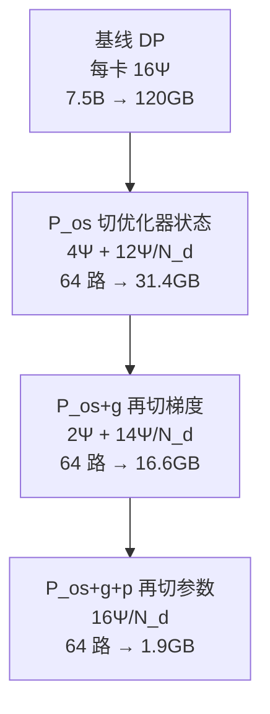
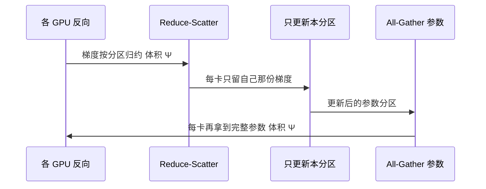

# ZeRO：沿数据并行轴消掉冗余副本，模型才能随卡数涨

<!-- release-date: 2019-10-04 -->

> 本文依据 Microsoft 的 **ZeRO: Memory Optimizations Toward Training Trillion Parameter Models**，即 arXiv:1910.02054 **v3**（2020-05-13），共 24 页。封面水印为 `arXiv:1910.02054v3 [cs.LG] 13 May 2020`。页码均指这份 PDF。全文把三件事分开标注：**报告明确写了什么**、**我们如何解释或验算它**、**哪些是外部资料补充**。
>
> 作者是 Samyam Rajbhandari、Jeff Rasley（封面脚注 *Equal Contributors*）、Olatunji Ruwase、Yuxiong He，邮箱 `{samyamr, jerasley, olruwase, yuxhe}@microsoft.com`。目录按主要归属放在 Microsoft。
>
> 动笔前核过 [arXiv:1910.02054](https://arxiv.org/abs/1910.02054)：v1（2019-10-04，110 KB，**withdrawn**）、v2（2019-10-07，110 KB，17 页）、v3（2020-05-13，632 KB，24 页）。本地 PDF 24 页、约 761 KB，创建时间为 2020-05-14，与官方最新 v3 一致，未做替换。**数字一律用 v3**。v1 已被管理员撤下，原因是提交者当时无权同意许可证；v1 与 v2 的封面标题是 *Memory Optimization Towards Training A Trillion Parameter Models*（单数 Optimization、Towards、带 A）。v3 改成现在的标题。v1/v2 摘要只实现了 stage-1（当时叫 **ZeRO-OS**），v3 才写成 **ZeRO-100B**（$P_{\mathrm{os}+g}$ 加 ZeRO-R），并补上 Turing-NLG 与 DeepSpeed。差异见文末「版本差异」。
>
> 同一工作后来作为 SC '20 论文发表（IEEE `10.1109/SC41405.2020.00024`，会议录页码 1–16；ACM `10.5555/3433701.3433727`）。本文一律用 arXiv v3 的 1–24 页码，不用会议页码回写。
>
> `release-date` 取 **2019-10-04**。这是一篇系统论文，对象从未作为产品对外可用，按该技术首次官方公开日取值，即 arXiv 首次提交。v3 修订日、SC 开会日和 2020-02 的 DeepSpeed 博客都不回写。
>
> DeepSpeed 开源是论文自己写的，地址是 <https://github.com/microsoft/deepspeed>（PDF p. 5 脚注 2）。后作 [ZeRO-Infinity](/reports/Microsoft/ZeRO-Infinity) 把参数卸到 CPU/NVMe、写出 32T，**那些数字不属于本篇**。本篇测到的上限是 170B，万亿只出现在显存与通信分析里。

## 读前先认识几个词

这篇论文的门槛不在新公式，在于它同时用了「一张卡上到底堆了什么」和「数据并行本来在通信什么」两套词。先说人话。其中前几个是通用背景，不全是报告自己定义的。

- **Token（词元）**：模型读写文本的最小单位。
- **数据并行（data parallelism，DP）**：每张卡放一份完整模型，各吃不同的一小批数据，反向之后把梯度平均。卡变多，吞吐可以涨，但单卡显存不降。
- **模型并行（model parallelism，MP）**：把一份模型拆到多张卡上。本文主要指当时 Megatron-LM 那种 **沿层内矩阵切开** 的做法，也就是后来常说的张量并行。报告把它和流水线分开写。
- **流水线并行（pipeline parallelism，PP）**：按层切。前面几层在这张卡，后面几层在那张卡，微批顺着管子往后传。GPipe 走这条路。
- **混合精度（mixed precision）**：前反向用 FP16，好打 Tensor Core；参数更新用 FP32，避免 Adam 的动量和方差在半精度下漂掉。
- **Adam**：当时训大模型最常用的自适应优化器。每个参数除了自己，还要另存一份动量和一份方差。
- **All-Reduce / Reduce-Scatter / All-Gather / Broadcast**：四种集合通信。All-Reduce 是「每张卡都有一份同样形状的张量，加总后再让每张卡都拿到总和」；工业实现常拆成 Reduce-Scatter（先按块归约到不同卡）再 All-Gather（再把各块拼回去）。Broadcast 是「一个拥有者发给所有人」。
- **激活检查点（activation checkpointing / recomputation）**：前向只隔一段存一份激活，反向再把中间结果重算一遍。用大约 33% 的额外计算换掉大部分激活显存（PDF p. 8）。

报告自己反复出现的专有设定：

- **模型状态（model states）**：参数、梯度、优化器状态。按参数个数成比例涨，和批大小几乎无关。
- **残差状态（residual states）**：激活、临时缓冲、碎片化后用不上的显存。报告后文的 ZeRO-R 对付的就是这一笔。
- **$\Psi$**：参数个数。**$K$**：优化器状态相对参数的字节倍数；混合精度 Adam 取 $K=12$（PDF p. 8）。**$N_d$**：数据并行度，也就是有多少份数据并行进程。**$N_m$**：模型并行度。
- **$P_{\mathrm{os}}$ / $P_{\mathrm{os}+g}$ / $P_{\mathrm{os}+g+p}$**：三级切分，分别切优化器状态、再切梯度、再切参数。名称以 PDF 为准。
- **ZeRO-DP**：沿数据并行轴分区模型状态的那一套。
- **ZeRO-R**：对付残差状态的三招：$P_a$（分区激活检查点）、$C_B$（常量大小缓冲）、$M_D$（碎片整理）。$P_{a+\mathrm{cpu}}$ 是再把分区后的检查点卸到 CPU。
- **ZeRO-100B**：这篇里真正实现并拿去评测的子集：$P_{\mathrm{os}+g}$ 加上 ZeRO-R。 **不是** 三级全开（PDF p. 4–5、p. 16）。
- **Turing-NLG**：用这套系统训出来的 17B 语言模型。论文写「world's largest」，口径钉在 2020-05-12（PDF p. 19）。

如果你只想记一句话：

> **数据并行每卡复制一份完整模型状态，单卡装不下大模型；模型并行能切开，但跨节点又慢又难用。ZeRO 的主张是：别换切法，沿数据并行轴把那份冗余副本消掉。通信量仍然接近原来的数据并行，模型规模就可以随卡数涨。**

## 一句话先说清

ZeRO 不是新的注意力，也不是新的优化器。它是一套训练显存系统：把「每张卡必须复制一份完整模型状态」这件事拆开，按阶段切优化器状态、梯度、参数，再把激活复制、临时缓冲和碎片化清掉。

摘要把规模钉得很硬（PDF p. 1）：

- 分析上，今天的硬件有潜力做到超过 **1 Trillion** 参数；
- 实现上，**超过 100B** 参数、**400 GPU**、超线性加速、吞吐 **15 Petaflops**；
- 相对当时 SOTA：**8x** 模型规模、**10x** 可达到性能；
- 不用模型并行可训到 **13B**（大于 Megatron GPT 8.3B 与 T5 11B）；
- 用这套系统做出了当时口径下「world's largest」的语言模型（**17B**，即 Turing-NLG）。

它明确不解决的问题也要先说清。报告没有训练数据配方、没有学习率、没有下游任务表。Turing-NLG 只给了一个 Webtext-103 困惑度。评测量的是「装得下多大」和「每张卡每秒多少 TFlops」，不是「这个模型有多聪明」。

三级切分也不要一次性吞下去。这篇里真正跑实验的，是 **$P_{\mathrm{os}+g}$ 加 ZeRO-R**，作者把它叫做 **ZeRO-100B**（PDF p. 4–5、p. 16）。切参数的第三级（$P_{\mathrm{os}+g+p}$）写在分析和计划里，正文说计划 2020 年 5 月底随 DeepSpeed 发布（PDF p. 5）。**不要把后作 Infinity 已经跑过的万亿实现，读成这篇已经测过。**

### 一条阅读路线

如果只有半小时读原文，建议按这个顺序：

1. **p. 3 图 1**：7.5B、64 路 DP，从 120GB 砍到 31.4 / 16.6 / 1.9GB。先看显存，再看方法。
2. **p. 7–8 第 3 节**：混合精度 Adam 每参数 16 字节；1.5B 的权重只有 3GB，却在 32GB 卡上装不下。
3. **p. 10–11 第 5 节 + 表 1**：三级各砍什么；1024 卡、全开三级，1T 只需 15.6GB/卡。
4. **p. 13–14 第 7 节**：前两级通信量和 DP 一样；第三级变成 1.5 倍。
5. **p. 4 图 2、p. 5 图 3**：100B / 15 Petaflops / 超线性。这是实现，不是分析。
6. **p. 16 图 4–8**：不用 MP 的 13B、Turing-NLG、消融。
7. **p. 5、p. 16**：哪些 stage 真正实现了。看到「end of May 2020」就停，不要往后作找数字。

## 报告地图：24 页里各写了什么

先摊开篇幅。这是一篇系统论文，没有模型配方。密度最高的是第 3 节的账单、第 5–7 节的切法与通信、第 10 节的实验。

| 报告章节 | PDF 页 | 讲了什么 | 密度 |
|---|---|---|---|
| 标题、摘要 | p. 1 | 1T 潜力；100B / 400 GPU / 15 Petaflops；8x / 10x；13B；17B | 高 |
| §1 引言前半 | p. 1–2 | DP 在 32GB 上装不下 >1.4B；Megatron 跨节点 40B 只有 5 TFlops | 高 |
| 图 1 + 三级定义 | p. 2–3 | $P_{\mathrm{os}}$ / $P_{\mathrm{os}+g}$ / $P_{\mathrm{os}+g+p}$；7.5B 的 120 → 1.9GB | 高 |
| 图 2–3 + 实现边界 | p. 4–5 | 170B；38 TFlops/GPU；超线性；ZeRO-100B；DeepSpeed；stage 3 计划 | 高 |
| §2 相关工作 | p. 6–7 | DP / MP / PP；GPipe、PipeDream；CPU offload；Adafactor | 中 |
| §3 显存账单 | p. 7–8 | 每参数 16 字节；激活、缓冲、碎片化 | 高 |
| §4 洞察 | p. 8–9 | 为什么沿 DP 切；激活在 MP 下是复制的 | 高 |
| §5 + 表 1 | p. 10–11 | 三级切分的机制与显存公式 | 高 |
| §6 ZeRO-R | p. 12 | $P_a$、$C_B$、$M_D$ | 高 |
| 表 2 + §7 | p. 13–14 | $P_{\mathrm{os}}$ 实测规模；通信体积 2Ψ vs 3Ψ | 高 |
| §8–9 | p. 14–16 | $P_a$ 通信 <10%；1T 分析；BERT-Large 对比；算力缺口 | 高 |
| 图 4–8 + §10.1–10.3 | p. 16–17 | 硬件、基线、100B 吞吐、超线性 | 高 |
| 表 3 + §10.4–10.6 | p. 18–19 | 13B 无 MP；C1–C5 消融；Turing-NLG 10.21 | 高 |
| §11、致谢、参考文献 | p. 19–22 | 结论；Turing-NLG 博客；GPipe、Megatron | 低 |
| AE 表 5–10 | p. 23–24 | 各图的层数、隐藏维、批大小；基线卡数更少 | 高 |

附录表 7–10 的「Figure 4/5/6/7」和正文图号对不上。按内容对齐：表 7 是正文图 6（最大模型）、表 8 是正文图 7（缓存）、表 9 是正文图 8（吞吐）、表 10 是正文图 4（纯 DP 的 13B）。本文引用实验配置时以表 5–10 的内容为准，不以附录里写错的图号为准。

## 先看矛盾：加卡装不下模型，切开又跨不出节点

2018 到 2019 年，语言模型从 BERT-large 的 0.3B 走到 GPT-2 的 1.5B、Megatron-LM 的 8.3B、T5 的 11B（PDF p. 1）。再往几十亿、上万亿走，单卡先装不下。加卡也救不了——如果每张卡仍要放一份完整模型，卡再多，单卡账单不变。

**数据并行** 把同一份模型复制到每张卡，各吃不同样本，反向把梯度平均（PDF p. 6）。计算粒度大、通信体积相对可控，所以好用、好扩展。代价是显存零节省。报告开篇就写死：当时这一代 **32GB GPU** 上，基本数据并行在超过 **1.4B** 参数时就会 OOM（PDF p. 1）。PyTorch Distributed Data Parallel 也卡在这个规模（PDF p. 5）。

**模型并行** 能切开。当时文献里最大的两个模型，T5 11B 靠 Mesh-TensorFlow，Megatron-LM 8.3B 靠层内切分（PDF p. 2）。切法是把每一层的计算和参数「竖着」分到多张卡，层与层之间要密集通信。节点内部走 NVSwitch，还能撑；一跨节点，带宽掉下来，效率就崩。报告自己测过：用 Megatron-LM 把 **40B** 铺到两台 DGX-2 上，每张 V100 大约 **5 TFlops**，不到硬件峰值的 **5%**（PDF p. 2）。

流水线和 CPU 卸载也在菜单上，但都要拿别的东西换。GPipe 按层横切，用微批填气泡，batch 得跟着流水线段数涨，还不好处理 tied-weights 和 BatchNorm（PDF p. 6）。PipeDream 靠多份过期参数藏气泡，既费显存，又和标准训练不等价（PDF p. 6）。把模型状态卸到 CPU，PCI-E 太慢，有工作报告训练时间的一半花在 GPU–CPU–GPU 搬运上（PDF p. 6）。

所以矛盾不是「没有切法」，而是：

> **想要数据并行那种好用、通信可控，就得每卡复制一份，1.4B 以上装不下；想要模型并行那种能切开，跨节点就又慢又要改模型。当时没有第三条路，能同时保住显存、通信和易用性。**

ZeRO 的回答不是再发明一种切维度，而是回头看数据并行里那份副本：它真的需要每时每刻都在每张卡上吗？

## 显存账单：1.5B 的权重只有 3GB，训练却要 24GB

要判断「切哪一段最划算」，得先知道训练到底要多少内存。报告用一个具体例子把读者按在账单上：1.5B 的 GPT-2，FP16 权重大约 **3GB**，却没法在一张 32GB GPU 上用 TensorFlow 或 PyTorch 训起来（PDF p. 7）。多出来的不是玄学，是模型状态。

### 混合精度 Adam：每参数 16 字节

Adam 要给每个参数存两份优化器状态：梯度的动量，以及方差（PDF p. 7）。混合精度下更贵（PDF p. 7–8）：

- 前反向用 FP16 的参数和梯度，各 **2Ψ** 字节；
- 更新时还要一份 FP32 参数，外加 FP32 的动量和方差，各 **4Ψ** 字节。

优化器状态相对参数的倍数记作 $K$。混合精度 Adam 的 $K=12$。加在一起（PDF p. 8）：

$$
2\Psi + 2\Psi + K\Psi = 16\Psi
$$

1.5B 参数至少要 **24GB**，已经远大于那 3GB 的 FP16 权重（PDF p. 8）。我们补一句换算，不是报告原话：1.4B × 16 字节 ≈ 22.4GB，再加激活和缓冲，32GB 卡上数据并行 OOM，和开篇的 1.4B 对得上。

图 1 的例子把这张账单画成柱子（PDF p. 3）。7.5B、64 路 DP、$K=12$：

$$
(2+2+K)\Psi = 16 \times 7.5 \times 10^9 = 120\ \mathrm{GB}
$$

每张卡都是 120GB。32GB 的 V100 连模型状态都塞不进去，更不要说激活。

**后作 [ZeRO-Infinity](/reports/Microsoft/ZeRO-Infinity) 把同一套 Adam 写成每参数 20 字节**，多出来的是单独留的 FP32 梯度。那是 2021 年那篇的账。**本篇一律用这份 PDF 的 16 字节**，不拿后作改账。

### 残差状态：模型状态切完，激活和碎片还会爆

模型状态按参数个数涨。剩下的激活、临时缓冲和碎片化，报告统称残差状态（PDF p. 7–8）。

激活随层数、隐藏维、序列长度、批大小涨。脚注给出 GPT-2 类结构的近似（PDF p. 8）：

$$
12 \times \textit{hidden} \times \textit{batch} \times \textit{seq} \times \textit{layers}
$$

1.5B、序列 1K、批 32，大约 **60GB**。激活检查点按平方根量级往下砍，再付 **33%** 重算，这笔能降到大约 **8GB**（PDF p. 8）。对 100B 的 GPT-like、同样批 32，即使开了检查点仍大约 **60GB**（PDF p. 8）。检查点帮了大忙，但不是终点。

临时缓冲来自通信和范数计算：为了让 All-Reduce 走大消息、打满带宽，实现常把全部梯度拍扁进一块缓冲。梯度本身是 FP16，这块融合缓冲却可能是 FP32。1.5B 模型的一块 FP32 扁平缓冲要 **6GB**；3B 模型的 32-bit 融合缓冲要 **12GB**（PDF p. 8、p. 12）。缓冲随模型线性涨，大模型上会变成新的显存税。

碎片化更隐蔽。分配请求要的是 **连续** 空位。短命张量（重算出来的激活、激活梯度）和长命张量（检查点、参数梯度）交错，空闲总量够，也可能申请失败。报告观察到极端情况下 **超过 30%** 的显存还在，仍然 OOM（PDF p. 8）。

这就是后文必须分两套优化的原因。ZeRO-DP 砍模型状态；ZeRO-R 砍残差。只砍一边，另一边会在百亿之后重新变成墙。

## 核心设计一：沿数据并行轴分区，而不是再复制一份

ZeRO-DP 的三句洞察写在第 4.1 节（PDF p. 9）：

1. 数据并行的计算粒度比模型并行粗，通信体积也更小，所以跨节点更好扩展；模型并行一过节点边界，粒度变细、通信变重，效率先崩。
2. 数据并行的显存差，恰恰差在「每张卡都复制一份模型状态」；模型并行能切开，所以显存好。
3. 训练并不需要所有状态一直在场。某一层的参数，只在这一层的前向和反向里用得到。

于是它做了一件看起来很朴素的事：**不要复制模型状态，按数据并行进程切开；再用动态通信日程，在真正用到的那一刻把缺的那一块拼回来。** 目标是：显存按 $N_d$ 降，通信体积仍接近普通 DP。

这是根据论文图 1 重画的 **机制示意**（PDF p. 3），数字来自图注的 7.5B、$N_d=64$、$K=12$，不是另一组实测。

### $P_{\mathrm{os}}$：只让每张卡更新自己的那一份参数

把优化器状态均分成 $N_d$ 份。第 $i$ 个数据并行进程只存、只更新第 $i$ 份对应的动量、方差和 FP32 参数。前反向仍用完整的 FP16 参数和梯度；一步结束之后，各进程 all-gather 更新后的参数，让每张卡再拿到完整一份（PDF p. 10）。

显存从 $4\Psi + K\Psi$ 变成 $4\Psi + K\Psi / N_d$（PDF p. 10）。$N_d$ 很大时，优化器那 12Ψ 几乎被摊光，剩下大约 4Ψ，也就是 FP16 参数加 FP16 梯度，大约 **4 倍**（PDF p. 2、p. 10）。7.5B、64 路：120GB → **31.4GB**。

我们补一句解释，不是报告原话：混合精度 Adam 的大头本来就在优化器。先切这一笔，通信日程几乎不用改，是最便宜的第一刀。v2 只实现了这一级，当时叫 ZeRO-OS。

### $P_{\mathrm{os}+g}$：梯度在归约完成的那张卡上就地释放

既然每张卡只更新自己的参数分区，它也就只需要那一份归约后的梯度。反向时，某一层的梯度一算完，只 reduce 到「负责更新这些参数」的那张卡上，然后立刻释放（PDF p. 10）。效果上这是一次 Reduce-Scatter：不同参数的梯度被归约到不同进程。

实现上用分桶：把属于同一分区的梯度装进一只桶，整桶一起 reduce，好和计算重叠。NVIDIA AMP 用分桶做 All-Reduce；这里在分区边界上做的是 reduce，不是 all-reduce（PDF p. 10）。

梯度占用从 2Ψ 变成 $2\Psi / N_d$。和优化器一起切完之后，账单变成 $2\Psi + 14\Psi / N_d \approx 2\Psi$，大约 **8 倍**（PDF p. 2、p. 10–11）。7.5B、64 路：**16.6GB**。

这一级是 ZeRO-100B 真正实现的「模型状态」部分。后文所有 100B / 170B / 超线性实验，切的都是它，不是第三级。

### $P_{\mathrm{os}+g+p}$：参数也按分区持有，用时再广播

第三级把 FP16 参数也切开。每张卡只常驻自己那一份。前反向要用到别人的分区时，由拥有者 broadcast 过来；用完就丢掉（PDF p. 11）。看起来会多很多通信，第 7 节证明总量只变成基线 DP 的 **1.5 倍**，显存却按 $N_d$ 线性降：

$$
\frac{16\Psi}{N_d}
$$

7.5B、64 路：**1.9GB**（PDF p. 3、p. 11）。含义被作者写得很满：只要设备数够用来分摊模型状态，数据并行就能装任意大的模型（PDF p. 11）。

这一级在本篇 **没有进入评测实现**。它出现在图 1、表 1、通信分析和 1T 推演里。正文的发布计划把它和「end of May 2020」写在一起（PDF p. 5）。

### 表 1：哪些组合能塞进 32GB V100

表 1 按 DP 度列出 7.5B / 128B / 1T 在三级下的单卡模型状态（PDF p. 11）。黑体是「能塞进 32GB V100 集群」的组合。这里按正文数字抄一张可读的表；单位是 GB/卡。

| $N_d$ | 7.5B $P_{\mathrm{os}}$ | 7.5B $P_{\mathrm{os}+g}$ | 7.5B 全开 | 128B $P_{\mathrm{os}}$ | 128B $P_{\mathrm{os}+g}$ | 128B 全开 | 1T $P_{\mathrm{os}}$ | 1T $P_{\mathrm{os}+g}$ | 1T 全开 |
|---:|---:|---:|---:|---:|---:|---:|---:|---:|---:|
| 1 | 120 | 120 | 120 | 2048 | 2048 | 2048 | 16000 | 16000 | 16000 |
| 4 | 52.5 | 41.3 | 30 | 896 | 704 | 512 | 7000 | 5500 | 4000 |
| 16 | 35.6 | 21.6 | 7.5 | 608 | 368 | 128 | 4750 | 2875 | 1000 |
| 64 | 31.4 | 16.6 | 1.88 | 536 | 284 | 32 | 4187 | 2218 | 250 |
| 256 | 30.4 | 15.4 | 0.47 | 518 | 263 | 8 | 4046 | 2054 | 62.5 |
| 1024 | 30.1 | 15.1 | 0.12 | 513 | 257 | 2 | 4011 | 2013 | 15.6 |

不加 ZeRO，无论 DP 度是多少，账单都等于第一行（PDF p. 11）。$N_d=64$ 时，三级分别能撑到大约 7.5B、14B、128B；$N_d=1024$ 且三级全开，1T 只需 **15.6GB/卡**（PDF p. 11）。1T × 16 字节 = 16TB，1024 卡均分就是 16GB，落在 32GB GPU 的合理范围内（PDF p. 3）。

表 2 把分析和实测对照起来（PDF p. 13）。右边「Measured」只跑了 $P_{\mathrm{os}}$（表头仍写着 v2 时期的名字 ZeRO-OS）：64 卡 6.2B、128 卡 12.5B、256 卡 25B、512 卡 50B、1024 卡 100B，和左边理论 7.6B / 15.2B / 30.4B / 60.8B / 121.6B 同一量级。缺口来自残差状态——理论列只算模型状态。左边全开三级的 1T / 2T 是分析上界，不是这张表的实测。

对自己的项目，表 1 的用处是：先问「你现在卡在优化器、梯度，还是参数本身」。只切优化器，通信几乎不涨，但 7.5B 在 64 卡上仍要 31GB，已经贴着 32GB 的天花板。要上百亿且还想留激活，必须至少切到梯度。要随卡数线性涨到万亿，才需要第三级。

## 核心设计二：通信量仍然接近原来的数据并行

切完之后，第一个怀疑一定是：显存省下来，是不是通信爆炸了？第 7 节专门回答（PDF p. 13–14）。

先定基线。普通 DP 在反向结束时 All-Reduce 梯度。大模型下这次通信是带宽受限的。工业 All-Reduce 拆成 Reduce-Scatter 加 All-Gather，每一步搬 Ψ 个元素，一步训练总共 **2Ψ**（PDF p. 13）。

$P_{\mathrm{os}+g}$ 把 All-Reduce 拆开重排，总量不变（PDF p. 14）：

这是根据第 7.2.1 节重画的 **机制示意**（PDF p. 14），不是时序实测。Reduce-Scatter Ψ，加上更新后的 All-Gather Ψ，仍是 **2Ψ**。所以前两级相对 DP **不增加通信体积**，却能换到最多 8 倍显存（PDF p. 13）。

第三级多出来的，是「参数不再常驻」之后，前向和反向各要再拼一次完整权重（PDF p. 14）：

- 前向：算到某一分区之前，拥有者把权重 broadcast 出去，用完丢掉，体积 Ψ；
- 反向：再按相反顺序 all-gather 一次，又是 Ψ；
- 梯度仍是 Reduce-Scatter，再加 Ψ。

合计 **3Ψ**，相对基线 **1.5 倍**（PDF p. 2、p. 14）。作者把这件事写成「把本来一步里的参数 all-gather，摊到整个前向里，用完即丢」。洞察仍是同一句：不是所有状态都要一直在。

注意一个容易读混的地方。v2 的 ZeRO-OS 只切优化器，实现里仍要在更新后 all-gather 参数，正文曾写「相对基线 DP 1.5 倍通信」。v3 把「通信量与 DP 相同」明确写在 $P_{\mathrm{os}}$ 与 $P_{\mathrm{os}+g}$ 上，把 1.5 倍留给第三级。本文以 v3 为准。

对自己的项目：如果集群已经能把 DP 的 2Ψ 藏在计算后面，前两级几乎是「白捡」的显存。第三级多出的那 50%，要用预取和重叠去藏；本篇只给了体积分析，没有给出第三级的实测重叠效率。后作和 2025 年的教学材料会谈 DP=512 那条红线，那不是本 PDF 的结论。

## 核心设计三：ZeRO-R，把模型并行复制的激活和碎片化清掉

模型状态按 $N_d$ 降下去之后，激活、缓冲和碎片会变成第二堵墙。ZeRO-R 是三招，不是三级切分的第四级（PDF p. 3、p. 12）。

### $P_a$：模型并行把权重切开了，激活却还在每张卡上复制

层内模型并行常按列切开线性层。两张卡各算一半输出，每张卡却都需要 **完整输入激活**（PDF p. 9）。于是权重切开了，激活仍是副本。

$P_a$ 的做法：某一层前向算完，立刻把输入激活按模型并行进程切开存起来；反向要用时，再 all-gather 拼回完整一份，而且一次只物化一层（PDF p. 12）。它和激活检查点一起用：存的是分区后的检查点，不是复制后的检查点。

100B、批 32、序列 1024、MP=16，每个 Transformer 层存一份检查点，大约 **33GB/卡**；加上 $P_a$ 降到大约 **2GB/卡**（PDF p. 12）。再开 $P_{a+\mathrm{cpu}}$，这笔可以卸到 CPU，激活开销接近零（PDF p. 12）。

通信上，报告对着 Megatron-LM 的 Transformer 块算了一笔账（PDF p. 14–15）。Megatron 在开检查点时，每个 block 前向两次 All-Reduce、重算两次、反向两次，消息大小是 $\textit{batch} \times \textit{seq} \times \textit{hidden}$；All-Reduce 体积按 2 倍消息算，论文把每个 block 的总量写成 $12 \times \textit{seq} \times \textit{hidden}$。$P_a$ 在每个检查点前多一次 All-Gather，体积按消息大小算，是 $\textit{seq} \times \textit{hidden}$。相对原来的模型并行通信，增量不到 **10%**（PDF p. 15）。

这笔不到 10% 的 MP 通信，有时能换回一个数量级的 DP 通信。$P_a$ 把激活按 $N_m$ 切开，批就可以按比例加大；DP 通信体积与批大小成反比。DGX-2 上 $N_m$ 可以到 16，批最大加 16 倍，DP 通信可以掉一个数量级（PDF p. 15）。$P_{a+\mathrm{cpu}}$ 再加倍 CPU 搬运（相对 $P_a$ 的 2 倍来回），只在「批仍然太小、DP 通信才是主瓶颈、CPU 搬运还便宜得过」时才值得开（PDF p. 15）。大模型算得动这件事，靠的是算术强度：GPT-2 及以上，每步计算相对检查点体积的比已经 $\ge 10\mathrm{K}$，还随隐藏维线性涨，所以低带宽搬运也藏得住（PDF p. 9）。

### $C_B$：融合缓冲不许再随模型涨

大 All-Reduce 要大消息才打得满带宽，Apex 和 Megatron 会把全部参数融进一块缓冲。这块缓冲随模型线性涨，3B 的 32-bit 融合缓冲就要 12GB（PDF p. 12）。ZeRO-R 改成 **常量大小** 的融合缓冲：不随模型涨，但保持足够大，效率还在（PDF p. 9、p. 12）。

### $M_D$：短命和长命张量不要交错着分配

碎片化来自寿命交错（PDF p. 9、p. 12）。前向里，检查点长命、被丢掉的中间激活短命；反向里，参数梯度长命、激活梯度短命。ZeRO 预分配两块连续缓冲，检查点和梯度一产生就拷进去。效果有两个：连续空位够用，OOM 变少；分配器少花时间找空洞，效率也上去（PDF p. 13）。

消融里 C1 到 C5 就是这三招和 $P_{\mathrm{os}+g}$ 的组合（PDF p. 18 表 3）：

| 配置 | ZeRO-DP | ZeRO-R |
|---|---|---|
| C1 | $P_{\mathrm{os}}$ | $C_B+M_D$ |
| C2 | $P_{\mathrm{os}}$ | $C_B+M_D+P_a$ |
| C3 | $P_{\mathrm{os}+g}$ | $C_B+M_D$ |
| C4 | $P_{\mathrm{os}+g}$ | $C_B+M_D+P_a$ |
| C5 | $P_{\mathrm{os}+g}$ | $C_B+M_D+P_{a+\mathrm{cpu}}$ |

对自己的项目：ZeRO-R 提醒的是「切完权重不等于训练能跑」。MP 切权重常常在激活上制造新副本；融合缓冲和碎片化会在你以为还剩 30% 显存的时候把你打成 OOM。先量寿命，再决定预分配，比再加一张卡便宜。

## 还要不要模型并行

既然数据并行的显存墙被拆了，还要 MP 吗？报告的回答是：为了「装得下」这件事，MP 变得不那么必要；ZeRO-DP 至少同样有效，模型切不整齐时甚至更好，扩展效率也相当或更好（PDF p. 3–4）。数据并行几乎不用改模型；当时的 Megatron-LM 只覆盖有限算子，模型和系统两边都要动手（PDF p. 4）。

仍值得叠 MP 的两个场景（PDF p. 4）：

1. 和 ZeRO-R 一起用，靠 $N_m$ 再砍激活，给非常大的模型留空间；
2. 纯 DP 会把全局批推过临界批，伤害收敛时，用 MP 换回可接受的全局批。临界批的讨论超出本文，引用的是 McCandlish 等人 2018 年的工作（PDF p. 4 脚注 1）。

两者叠加，单卡理论显存最多降 $N_d \times N_m$ 倍。报告给的万亿拼法是：1024 GPU、节点内 16 路 MP、跨节点 64 路 DP，用一个不太夸张的批跑（PDF p. 4）。这是分析拼法，不是第 10 节的实测。

## 实现边界：这篇跑的是 ZeRO-100B，不是三级全开

完整 ZeRO 在分析上能把万亿塞进大约 1K 张 V100。作者立刻补了一句：就算塞得下，当时的算力也训不完，时间会超过一年（PDF p. 4）。所以这篇实现的目标收窄成：比当时 SOTA 大约 **10 倍参数**（约 100B），并且仍在当时硬件的可训时间内。

这个子集叫 **ZeRO-100B**：$P_{\mathrm{os}+g}$ 加整套 ZeRO-R（PDF p. 4–5、p. 16）。接口是任意 `torch.nn.Module` 的包装，用户不必改模型；可以和任意形式的 MP 叠，包括 Megatron-LM（PDF p. 17）。

正文还写了发布计划（PDF p. 5）：

- 开源库是 DeepSpeed，<https://github.com/microsoft/deepspeed>；
- 「本文描述的全部实现」计划 2020 年 5 月底发布；
- 再往后，靠启用 stage 3 的参数分区去支撑 1T。

读到这里必须停住。**stage 3 在本篇是计划，不是第 10 节的实验。** 后作 Infinity 把 ZeRO-3 当底座再往 CPU/NVMe 卸，测到 32T，那是 2021 年的另一篇文章。

## 实验怎样证明：100B、400 卡、15 Petaflops、超线性

### 评测设置

硬件：400 张 V100，25 台 DGX-2，节点间 **800 Gbps**（PDF p. 17）。

基线：无 MP 时用 PyTorch DDP；有 MP 时用 NVIDIA 2019 年 9 月的开源 Megatron-LM。当时 Megatron 公开结果是 16B、32 台 DGX-2、512 张 32GB V100（PDF p. 17）。模型都是 GPT-2 类 Transformer，靠改层数和隐藏维得到不同参数量（PDF p. 17）。

附录表 5 把图 2 的配置写全了（PDF p. 23）。有一个必须一起读的公平性说明：部分基线跑在 384 或 256 卡上，不是 400，因为总卡数必须能被 MP 整除，而他们一共只有 400 张卡。170B 的基线甚至是 256 卡、MP=256，此时 DP=1，基线 **没有** 数据并行通信。更少的卡、更少的 DP 通信，对基线更有利。论文比较的是 **每 GPU 吞吐**，不是集群总吞吐（PDF p. 24）。

表 4 和表 5 有一处对不上：表 4 把图 2 的 40B–60B 写成隐藏维 4096，表 5 写成 6144。我们以更细的表 5 为准。

### 图 2：170B 仍能跑，跨节点纯 MP 不能

ZeRO-100B 在 400 卡上能高效跑到 **170B**，超过 8 倍于当时能高效跑的 Megatron（PDF p. 17）。图 2 的横轴是 1.5B 到 170B（PDF p. 4）：

- ZeRO 一侧，MP 始终停在节点内；
- 基线一侧，大于 40B 就必须跨节点做 MP。

正文给出的硬数字（PDF p. 5、p. 17）：

- 8B 到 100B，平均维持 **15 Petaflops**，超过峰值的 **30%**；
- 100B、400 张 V100，每卡超过 **38 TFlops**，集群超过 **15 Petaflops**；
- 相对同一规模的 SOTA，最多大约 **10 倍** 加速。

我们读图补充，不是正文逐点写出的数：基线在 1.5B / 8B 还停在节点内时，每卡大约二十多 TFlops；一过 40B 掉到大约 5 TFlops 附近，和引言的跨节点 40B 测量一致。ZeRO 从 1.5B 到 100B 大致停在 30–40 TFlops；100B 之后往下掉，作者归因于显存不够、批加不上去（PDF p. 17）。100B 那根加速比柱子是图上最高的，大约顶到 10x 的右轴刻度。

节点内 NVSwitch 大约 **300GB/s** 每链路，跨节点 InfiniBand EDR 大约 **12.5GB/s** 每链路（PDF p. 17）。跨节点 MP 崩的是带宽，不是算法突然失灵。ZeRO 把「为了装得下而把 MP 拉出节点」这件事取消了，所以大模型仍能停在节点内 MP 上。

表 5 还显示：同样 8B，ZeRO 用 MP=4、每卡批 64，基线要用 MP=8、每卡批 8；到 100B，ZeRO 仍是 MP=16、每卡批 32，基线已经 MP=128、每卡批 2（PDF p. 23）。显存效率直接变成更大的微批，再变成更高的算术强度。

### 图 3：64 到 400 卡，加速比超过线性

60B 从 64 卡加到 400 卡，总吞吐的增长快于卡数，作者称为超线性（PDF p. 5、p. 17）。原因不是通信变少，而是 $P_{\mathrm{os}+g}$ 让 DP 度上升时每卡模型状态下降，于是每卡批可以加大，算术强度上升（PDF p. 18）。

表 6 把这件事写死了（PDF p. 23）。同一个 60B（75 层、隐藏维 8192、MP=16）：

| GPU | 每卡批 | 全局批 |
|---:|---:|---:|
| 64 | 16 | 64 |
| 128 | 48 | 384 |
| 256 | 48 | 768 |
| 400 | 64 | 1600 |

我们读图补充：64 卡时每卡大约 26 TFlops，400 卡时每卡大约 38 TFlops，总吞吐从大约 1.7 Petaflops 走到大约 15 Petaflops。线性外推（按 64 卡的每卡吞吐）会明显低于绿线。脚注 5 承认批太大伤收敛，但作者认为即便到 1K GPU，这些大模型仍处于「批还不够大、不影响收敛」的区间（PDF p. 18）。

这是 ZeRO-DP 特有的扩展形状：加卡不只加算力，还加「每卡能装下的批」。普通 DP 加卡时每卡显存不变，做不到这件事。

### 图 4：不用模型并行，13B 大于 T5 11B

图 4 把 MP 关掉，128 卡纯数据并行（PDF p. 16、p. 18）。ZeRO-100B 能训到 **13B**，平均每卡超过 **40 TFlops**；没有 ZeRO 时，纯 DP 最大大约 **1.4B**，每卡不到 **20 TFlops**。13B 已经大于当时文献里最大的 T5 11B，也大于 Megatron GPT 8.3B，而且科学家不必改模型、不必上 PP（PDF p. 1、p. 5、p. 18）。

没有 MP 的通信税，这些模型还可以跑在没有 NVLINK / NVSwitch 的低端节点上——那是 MP 要效率时必须有的东西（PDF p. 18）。

表 10 给出 128 卡、MP=1 的配置（PDF p. 24）。ZeRO 从 1.5B（34 层、隐藏维 1920、每卡批 24）走到 13B（62 层、隐藏维 4096、每卡批 2）；基线最大两项是 1.16B 和 1.38B。图 4 上 13B 的绿点已经掉到大约 20 TFlops，因为每卡批只剩 2；论文仍把它算进「可训」。虚线标的是集群 **4.5 Petaflops**。

### 图 6–8：各招分别买到什么

固定批 16、MP=16 时，最大可训模型随配置涨（PDF p. 18，图 6）：

- C1 → C2：40B → 60B，来自 $P_a$ 把激活按 MP=16 砍掉 16 倍；
- 再跳到 C4 的 140B，来自 $P_{\mathrm{os}+g}$ 把模型状态再减半；
- C5 到 150B，只来自把分区检查点卸到 CPU。

图 7 看 PyTorch 迭代中的最大缓存占用（PDF p. 18）。40B 从 C1 到 C2 明显下降；C2 和 C3 谁更省，取决于模型状态和激活谁更大。C4 到 C5，40B 几乎不再降，100B 会再降一截——100B 的激活更大，卸到 CPU 才看得见。图 8 里，170B 没有 C5 根本跑不起来（PDF p. 19）。

吞吐大体随显存下降而上升，因为批可以加大（PDF p. 19，图 8）。例外是 60B 的 C4 → C5：显存更省，但 CPU 来回搬激活，多数情况下更慢。只有模型大到不开 C5 就 OOM、或不开 C5 批会极小时，才值得开。训练时 $P_{a+\mathrm{cpu}}$ 只在划算的时候打开（PDF p. 19）。我们读图补充：60B 的 C1–C3 带叉，跑不起来；C4 大约 36 TFlops，C5 略低。170B 只有 C5 有柱子，大约 20 TFlops 出头。

## Turing-NLG：17B，当时口径下的 world's largest

截至 2020-05-12，Turing-NLG 以超过 17B 参数被称为世界上最大的模型，Webtext-103 困惑度 **10.21**，端到端用 ZeRO-100B 训练（PDF p. 19）。图 5 把 30 万步的验证困惑度画在 Megatron-LM 8.3B 旁边（PDF p. 16）。这条 17B 跑到每卡 **41.4 TFlops**（PDF p. 19）。

报告到此为止。它没有写 17B 的层数、隐藏维、训练数据、学习率，也没有 GLUE、摘要、问答表。那些如果出现，只可能来自外部博客，不能冒充本 PDF。

**外部补充，不是这篇 PDF。** Microsoft 同期博客 [Turing-NLG: A 17-billion-parameter language model](https://www.microsoft.com/en-us/research/blog/turing-nlg-a-17-billion-parameter-language-model-by-microsoft/) 把结构写成 78 层、隐藏维 4256、28 头，用 Megatron-LM 的张量切分度 4，DeepSpeed + ZeRO 把节点内并行从 16 降到 4，256 张 GPU、全局批 512。博客用的基准名是 WikiText-103 和 LAMBADA。本 PDF 写的是 Webtext-103、10.21。两个名字不要擅自合并成同一个数。本站 [Megatron-LM](/reports/NVIDIA/Megatron-LM) 是这篇对照的 8.3B 来源，只用到本 PDF 写到的程度。

## 万亿那一跳：装得下，不等于训得完

第 9 节把「1T」说成系统视角上最根本的那一关：先能在现有硬件上装下，并且扩展效率还在（PDF p. 15）。当时公开模型还在 100 亿量级；再走三个数量级，路上会有别的坑，作者不声称自己都知道。

相对 Megatron，可高效跑的规模从单台 DGX-2 上大约 16–20B，变成不必把细粒度 MP 拉出节点（PDF p. 15）。表 1 全开三级、1024 卡纯 DP，分析上能装下超过 1T；叠 16 路节点内 MP 加 64 路跨节点 DP，同样 1024 卡，表 2 分析列给出 1T（PDF p. 15–16）。句子是「不再不可能」，不是「我们已经训完了一个万亿模型」。

算力缺口单独写（PDF p. 16）。BERT-Large 在 1024 卡 DGX-2H 上大约 67 分钟。1T 相对 3.3 亿的 BERT-Large，单样本计算大约 **3000 倍**。即便假设序列长度和样本数不变，同样硬件、同样效率要 **140 天**；实践里样本和序列往往还要加，会超过一年。要在合理时间里训完 1T，需要 exa-flop 系统。作者的希望是：等算力到了，ZeRO 能把系统这一侧准备好。

我们补一句边界，不是报告原话：本篇的 1T 是「模型状态按 16 字节、1024 卡、三级全开」的除法。它不管激活、不管工作显存、不管 CPU/NVMe，也不管后来 Infinity 用异构存储装下的 32T。那些是后作的矛盾。

## 和当时其它切法的位置

第 2 节把 ZeRO 放进 2019–2020 年的地图里（PDF p. 6–7）。

相对 [GPipe](/reports/Google/GPipe)：GPipe 横切模型、微批填气泡，参数和激活都能分区，但 batch 要跟着流水线段数涨，tied-weights 和 BatchNorm 不好做。ZeRO 声称显存不差于 PP，却没有 PP 那套功能、性能和收敛限制（PDF p. 6）。本篇评测没有直接和 GPipe 对打，这是相关工作里的定位，不是实验结论。

相对 [Megatron-LM](/reports/NVIDIA/Megatron-LM)：它是本篇有 MP 时的基线和对照。8.3B、节点内切分、跨节点效率下降，都按本 PDF 转述。Megatron 自己的 WikiText / LAMBADA 分数、LayerNorm 消融，不搬进本文。本批还有一篇尚未解读的 Megatron-LM-2（张量 + 流水 + 数据并行），1T / 502 petaFLOP/s 属于那一篇，本文不引用。

相对 CPU offload：ZeRO 的主路径把模型状态留在 GPU 上切，不走 PCI-E；只有 ZeRO-R 在少见情况下把激活检查点卸到 CPU（PDF p. 6）。Adafactor 一类「粗粒度统计换显存」会改优化器、可能动收敛；ZeRO 不改优化算法（PDF p. 7）。

GShard 被本批列为同期禁止当「本站已有专文」的条目。本 PDF 的参考文献里没有 GShard，本文也不去那篇 PDF 补数字。

## 论文说了什么、没说什么

### 被实验支撑的结论

- 32GB GPU 上，基本数据并行装不下超过 1.4B（PDF p. 1、p. 5、p. 18）。
- ZeRO-100B（$P_{\mathrm{os}+g}$ + ZeRO-R）在 400 卡上能高效跑到 170B，8B–100B 平均约 15 Petaflops、超过 30% 峰值；100B 每卡超过 38 TFlops（PDF p. 5、p. 16–17）。
- 相对跨节点 Megatron，大模型最多约 10 倍每卡吞吐；100B 是图 2 上加速比最高的点（PDF p. 1、p. 17）。
- 60B 从 64 卡到 400 卡超线性，机制是 DP 度上升 → 每卡显存下降 → 每卡批加大（PDF p. 5、p. 17–18，表 6）。
- 不用 MP 或 PP，128 卡可训到 13B，平均超过 40 TFlops/卡（PDF p. 18，图 4）。
- C1–C5 消融：激活分区把 40B 推到 60B，$P_{\mathrm{os}+g}$ 推到 140B，CPU 卸检查点推到 150B；170B 必须开 $P_{a+\mathrm{cpu}}$（PDF p. 18–19）。
- Turing-NLG 17B 用 ZeRO-100B 端到端训练，Webtext-103 困惑度 10.21，每卡 41.4 TFlops（PDF p. 19）。

### 只是分析、没有在本篇跑通的

- $P_{\mathrm{os}+g+p}$ 按 $N_d$ 线性降显存、通信 1.5 倍（PDF p. 2、p. 11、p. 14）。表 1 的 1T / 15.6GB 是除法，不是实测。
- 1024 卡纯 DP 或 16 路 MP × 64 路 DP 装下 1T（PDF p. 3–4、p. 15–16）。
- 1T 端到端要 140 天到超过一年，需要 exa-flop（PDF p. 16）。
- stage 3 计划 2020 年 5 月底发布（PDF p. 5）。

### 报告自己承认的限制

- 完整三级能装万亿，但当时算力训不完，所以实现收在约 100B（PDF p. 4）。
- 100B 以上吞吐略降，因为批加不上去；作者指望再加卡、靠超线性补回来（PDF p. 17）。
- 批太大伤收敛，细节超出本文（PDF p. 4 脚注 1、p. 18 脚注 5）。
- 部分基线卡数更少、170B 基线甚至没有 DP 通信，对基线更有利（PDF p. 24）。

### 论文根本没有涉及的东西

下面这些不要从今天的 DeepSpeed、FSDP 或后作倒推回去：

- 训练语料、token 数、学习率、权重衰减、词表。Turing-NLG 只有一个困惑度。
- 下游任务分数、人类评测、摘要或问答。
- ZeRO-3 的实测吞吐、预取重叠效率、DP=512 红线。
- 把优化器或参数卸到 CPU / NVMe，Memory-centric tiling，32T，25 petaflops。那是 [ZeRO-Infinity](/reports/Microsoft/ZeRO-Infinity)。
- 流水线并行的实现与气泡调度。相关工作里定位了 GPipe，评测没有 PP。
- GShard、Megatron-LM-2 的 3D 并行数字。

## 论文之后：stage 3 后来落地了，战场从「切副本」挪到「慢存储」

**以下全部是外部资料补充，不是这篇 PDF 的内容。**

v3 提交于 2020-05-13，正文仍把 stage 3 写成计划。Microsoft 在 2020-02-10 已经发过博客 [ZeRO & DeepSpeed](https://www.microsoft.com/en-us/research/blog/zero-deepspeed-new-system-optimizations-enable-training-models-with-over-100-billion-parameters/)，并开源 DeepSpeed。那篇博客的「三到五倍吞吐」「当时只实现 stage one」是博客自己的口径，不要和 v3 的 10x / ZeRO-100B 混用。

同一工作在 SC '20 正式发表（2020-11），会议录 16 页。本站页码继续用 arXiv v3 的 24 页。

后作沿同一条轴往外长。ZeRO-Offload 把优化器状态和梯度卸到 CPU，参数仍复制在 GPU 上。再往后的 [ZeRO-Infinity](/reports/Microsoft/ZeRO-Infinity)（arXiv:2104.07857，2021-04-16）把 ZeRO-3 当底座，把 CPU 和 NVMe 算进训练内存，写出 32 台 DGX-2 上 32T、超过 25 petaflops。**32T、25 petaflops、NVMe、tiling 全部属于那一篇。** 本篇的 CPU 只出现在激活检查点卸载里，模型状态仍在 GPU 上分区。

工程上，DeepSpeed 后来把三级叫做 ZeRO-1/2/3，PyTorch FSDP 是和 ZeRO-3 同类的实现。2025 年的 [Ultra-Scale Playbook](/reports/HuggingFace/Ultra-Scale-Playbook) 把 ZeRO-1/2/3 写成五维并行里的一维，并给了「纯 ZeRO-3 的通信重叠大约只在 DP 不超过 512 时成立」这条经验红线。那是 2025 年的操作手册，不是 2020 年这份 PDF 的测量。

读法上的分工：

- 本篇回答「数据并行的冗余副本能不能消掉，消掉之后通信还剩多少」；
- Infinity 回答「GPU 显存不够时，主机侧存储怎样加入训练」；
- Playbook 回答「HBM 够的时候五维怎么排」。

三边的 ZeRO-3 通信量（3Ψ）是同一家族的不同年代表述。不要把 2021 或 2025 的规模数字读进 2020 年 5 月的 v3。

## 能带走的六条

### 1. 先画账单，再决定切哪一刀

报告最值得学的不是 $P_{\mathrm{os}+g+p}$ 这个符号，是第 3 节先把 16Ψ 摊开（PDF p. 7–8）。1.5B 的权重 3GB，训练账单 24GB，差在优化器、梯度和 FP32 副本。搞错对象，加多少卡都没用：数据并行砍不了单卡模型状态，模型并行砍权重时可能在激活上制造新副本，检查点砍激活砍不了 Adam。

### 2. 冗余往往来自「一直持有」，不是来自「用得到」

参数只在某一层的前反向里需要。前两级利用这一点，把 All-Reduce 重排成 Reduce-Scatter 加 All-Gather，体积仍是 2Ψ（PDF p. 14）。第三级把「用时再拼、用完即丢」再推一步，才多出 50% 通信。系统设计里，先问「这份状态的寿命是一步、一层，还是整个训练」，再决定复制还是分区。

### 3. 通信体积不变，不等于实现已经结束

$P_{\mathrm{os}+g}$ 和 DP 同为 2Ψ，但要把 reduce 做在分区边界上、要分桶、要和反向重叠（PDF p. 10）。论文把「体积相同」和「墙钟时间相同」分成两件事。自己实现时，先核对体积，再 profile 重叠；只核对体积会低估分桶和同步的坑。

### 4. 超线性不是魔法，是「加卡之后每卡更能装」

60B 的超线性来自表 6：64 卡每卡批 16，400 卡每卡批 64（PDF p. 23）。普通数据并行加卡时每卡显存不变，做不到。如果一种并行策略在加卡时让每卡工作集下降，就应该主动把省下来的显存换成批，而不是让 GPU 半空着线性扩展。

### 5. 易用性本身是规模手段

13B 不用 MP、不用改 `nn.Module`（PDF p. 18）。Megatron 当时要改模型、要分布式算子，还只能覆盖有限结构（PDF p. 4）。把「科学家愿不愿意用」写成和 TFlops 并列的指标，不是客套。很多实验室卡在 1.4B，不是因为算力不够，是因为切模型的工程税先到期。

### 6. 分析上的万亿，和测过的 170B，中间隔着算力而不是隔着显存公式

表 1 的 15.6GB/卡是 16TB / 1024。第 9 节立刻说：同样 1024 卡，1T 相对 BERT-Large 大约 3000 倍计算，140 天起（PDF p. 16）。系统论文如果只报「装得下」，读者会以为下一步是刷榜；这篇把「训不完」写进了同一章。后来 Infinity 解决的是另一堵墙（聚合 GPU 显存），不是这篇已经承诺过的吞吐。

## 关键词回看

- **模型状态 / 残差状态**：参数 + 梯度 + 优化器 vs 激活 + 缓冲 + 碎片（PDF p. 2、p. 7）。
- **$K=12$、16Ψ**：混合精度 Adam 的优化器倍数和每参数字节数（PDF p. 8）。后作 Infinity 的 20 字节不要读进来。
- **$P_{\mathrm{os}}$ / $P_{\mathrm{os}+g}$ / $P_{\mathrm{os}+g+p}$**：切优化器、再切梯度、再切参数；分别最多约 4x、8x、$N_d$ 倍（PDF p. 2、p. 10–11）。
- **ZeRO-DP / ZeRO-R / ZeRO-100B**：沿 DP 分区模型状态；收拾残差；本篇实现的子集（PDF p. 3–5）。
- **$P_a$ / $P_{a+\mathrm{cpu}}$ / $C_B$ / $M_D$**：分区激活检查点、再卸 CPU、常量缓冲、碎片整理（PDF p. 12）。
- **2Ψ vs 3Ψ**：前两级通信等于 DP；第三级 1.5 倍（PDF p. 13–14）。
- **超线性**：DP 度上升 → 每卡模型状态下降 → 每卡批加大 → 每卡 TFlops 上升（PDF p. 5、p. 17–18）。
- **Turing-NLG**：17B，2020-05-12 口径下的 world's largest，Webtext-103 困惑度 10.21（PDF p. 19）。

## 最后的判断

这篇论文的价值不在发明「把模型切开」——Megatron 和 GPipe 已经切开过。它的价值在于看清了数据并行失败的那一个假设：**每张卡必须一直持有完整的参数、梯度和优化器状态。** 只要这个假设还在，加卡就只能加批，不能加模型；1.4B 就是 32GB 卡上的墙。模型并行能拆墙，却把细粒度通信拖出节点，40B 掉到 5% 峰值。

打破假设的代价被算清楚了。前两级通信体积仍是 2Ψ，换最多 8 倍模型状态显存；第三级再按卡数线性降，多付 50% 通信。残差状态另走三招：激活上的副本、随模型涨的缓冲、寿命交错造成的碎片。实现收在 $P_{\mathrm{os}+g}$ 加 ZeRO-R，400 卡上给出 100B、15 Petaflops、超线性，以及一个不用改模型就能训的 13B。Turing-NLG 17B 证明这套系统能端到端训出当时最大的语言模型，但论文几乎没写它怎么聪明。

它留下的边界同样清楚。stage 3 没有在这篇里跑实验。1T 是显存除法加算力警告，不是训练记录。没有数据、没有下游表。CPU 只碰激活检查点。若有人把 32T 或 NVMe 说成「ZeRO 原文已经做到」，那是在读 2021 年的后作。

如果只带走一句：

> **大模型不一定要换一种并行范式。先问每张卡上那份副本是不是真的必须一直在；沿数据并行轴把它切开，通信量还可以停在原来的数据并行附近，模型才能随卡数涨。**

## 参考资料与边界

- 原始依据：本地 `papers/Microsoft/ZeRO.pdf`，即 [arXiv:1910.02054v3](https://arxiv.org/abs/1910.02054)，2020-05-13 修订，24 页。封面水印 `arXiv:1910.02054v3 [cs.LG] 13 May 2020`。arXiv 至今最新是 v3。
- 正式发表：SC '20，IEEE [`10.1109/SC41405.2020.00024`](https://doi.org/10.1109/SC41405.2020.00024)，会议录页码 1–16。本地 PDF 是 arXiv 版，页码 1–24。
- `release-date` 取 **2019-10-04**：arXiv v1 公开日。对象从未作为产品对外可用。v3 修订日、SC 开会日、2020-02 DeepSpeed 博客都不回写。
- v1（2019-10-04，110 KB）已撤回：arXiv 管理员移除，提交者当时无权同意许可证。摘要仍可读，标题是 *Memory Optimization Towards Training A Trillion Parameter Models*，只实现 stage-1（ZeRO-OS）。v2（2019-10-07，17 页）摘要与 v1 同类，无 Turing-NLG、无 DeepSpeed 之名、无比 SOTA 的 8x/10x。本文数字一律用 v3。
- 论文自己写的开源库：[DeepSpeed](https://github.com/microsoft/deepspeed)（PDF p. 5 脚注 2）。
- 本站可链、不要搬表：后作 [ZeRO-Infinity](/reports/Microsoft/ZeRO-Infinity)（32T / NVMe 属于那篇）；对照 [Megatron-LM](/reports/NVIDIA/Megatron-LM)（只用本 PDF 写到的 8.3B）；流水线对照 [GPipe](/reports/Google/GPipe)；2025 年教学 [Ultra-Scale Playbook](/reports/HuggingFace/Ultra-Scale-Playbook)。
- 本批同期、本文不当「本站已有专文」：`NVIDIA/Megatron-LM-2`、`Google/GShard`。本 PDF 未引用 GShard；Megatron 的后作数字不读进来。
- 外部博客（补充，不冒充 PDF）：[Turing-NLG](https://www.microsoft.com/en-us/research/blog/turing-nlg-a-17-billion-parameter-language-model-by-microsoft/)、[ZeRO & DeepSpeed](https://www.microsoft.com/en-us/research/blog/zero-deepspeed-new-system-optimizations-enable-training-models-with-over-100-billion-parameters/)。

## 版本差异：v1/v2 相对 v3 改了什么

v1 已撤回，PDF 无法下载，只留下摘要和管理员注释。v2 全文 17 页，可以对照。和 v3 相比，必须分开的有：

| 项目 | v1 / v2 | v3（本文） |
|---|---|---|
| 标题 | Memory Optimization Towards Training **A** Trillion Parameter Models | Memory **Optimizations Toward** Training Trillion Parameter Models |
| 篇幅 | v2 为 17 页、约 110 KB 量级 | 24 页、632 KB |
| 实现 | 只实现 stage-1，名叫 **ZeRO-OS**（$P_{\mathrm{os}}$ + 常量缓冲） | **ZeRO-100B** = $P_{\mathrm{os}+g}$ + ZeRO-R |
| 规模口径 | 4x 显存、80–100B；无 8x/10x | 8x 模型、10x 性能；170B；15 Petaflops / 400 GPU |
| 易用口径 | 纯 DP 相对 1.5B 大约 4 倍 | 不用 MP 到 **13B**；对照 T5 11B 与 Megatron 8.3B |
| Turing-NLG | 无 | 17B，Webtext-103 10.21，41.4 TFlops/GPU |
| 开源 | v2 写「将分享 ZeRO-OS 代码」 | 明确 DeepSpeed，计划 2020-05 底发布含 stage 3 |
| 通信表述 | ZeRO-OS 实现写过相对 DP 1.5 倍 | 前两级与 DP 相同，1.5 倍留给第三级 |
| 残差状态 | 未单独命名为 ZeRO-R | $P_a$、$C_B$、$M_D$ 成套 |

v3 不是对 v2 的小修订，而是把实现从「切优化器」推进到「切优化器加梯度，再收拾激活和碎片」，并用 400 卡实验和 Turing-NLG 换掉了 v2 的 80–100B 演示口径。本文不混用 v2 表 5 里 8B 的 15.2 PFlops 总吞吐等旧数字。
