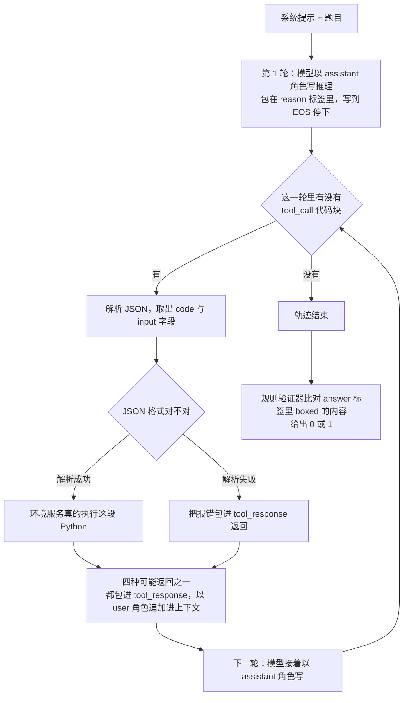
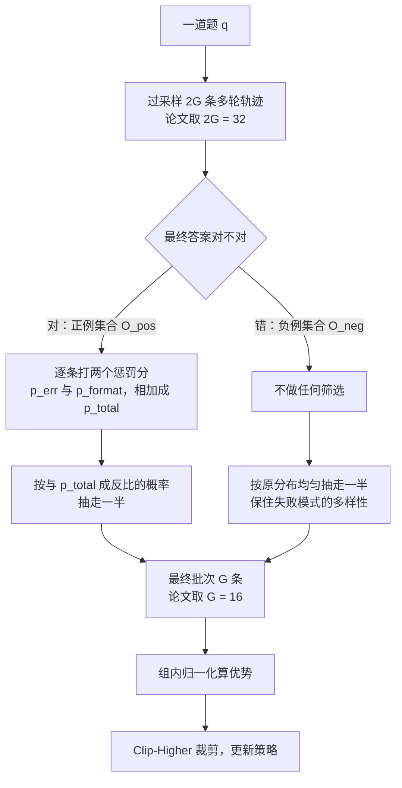
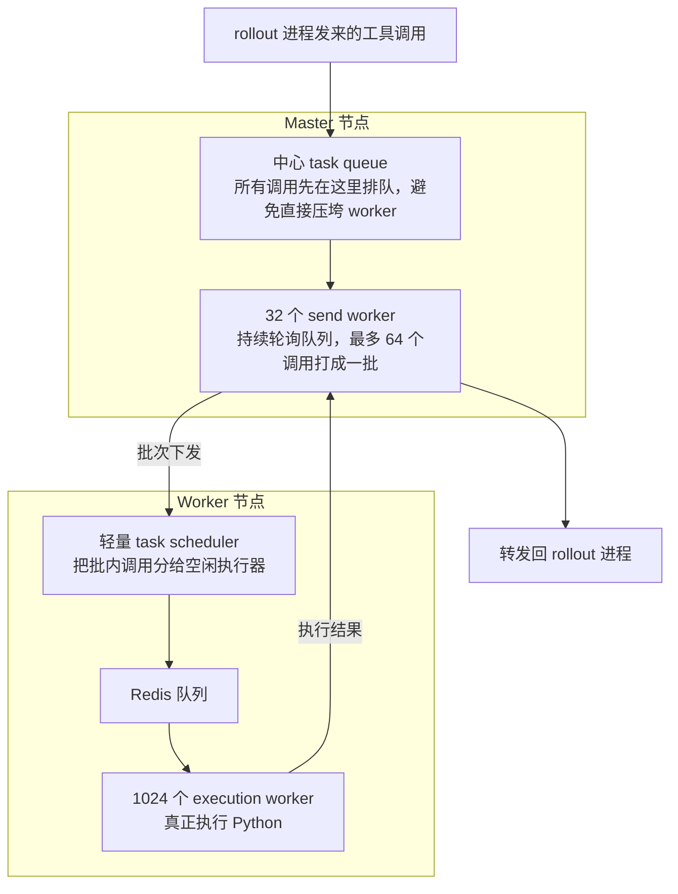
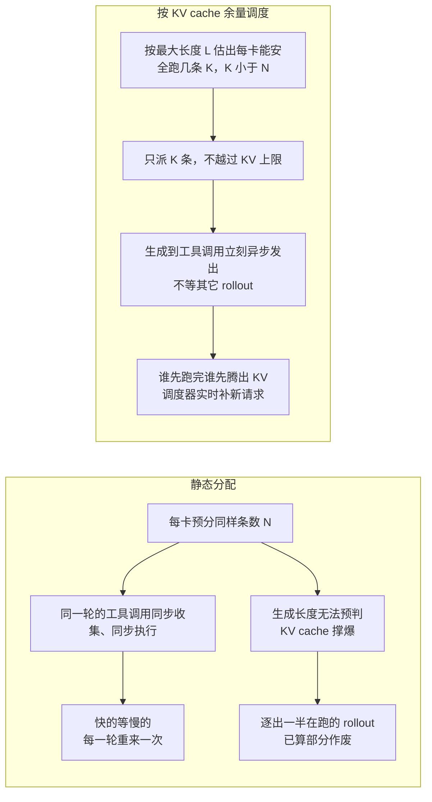
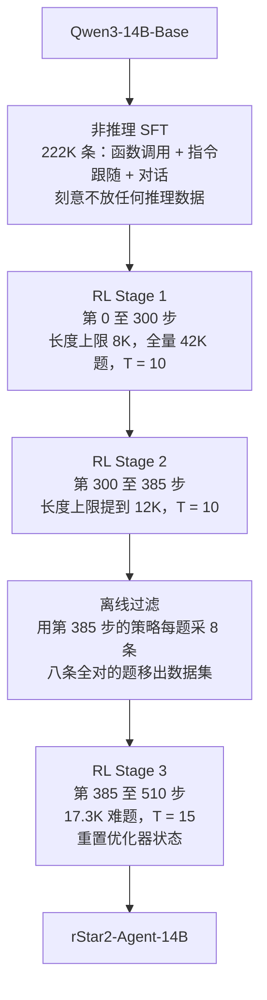

# rStar2-Agent：奖励一个字不改，只挑成功轨迹里干净的那一半

<!-- release-date: 2025-08-28 -->

> 本文依据 Microsoft Research 发布的 **rStar2-Agent: Agentic Reasoning Technical Report**，即 arXiv:2508.20722v1、封面戳记 2025-08-28、共 22 页的预印本。十五位作者全部署名 Microsoft Research，前四位 Ning Shang、Yifei Liu、Yi Zhu、Li Lyna Zhang 并列第一作者，Li Lyna Zhang 与 Mao Yang 为项目负责人（PDF p. 1）。按主要归属方，本站把它放在 Microsoft 目录下。下文括号中的 `PDF p. N` 均指这份 22 页原件的文件页码（本文件的印刷页码与 PDF 页码一一对应）。
>
> **版本说明**：截至 2026-09-06 核验，arXiv 上只有 v1 一个版本，提交时间 2025-08-28 12:45:25 UTC，与本地原件完全一致，无需替换原件。论文页没有会议收录说明，主题分类只有 cs.CL。
>
> 这是一篇**方法 + 系统**的技术报告，不是基座模型报告，所以没有模型架构和预训练 recipe 可讲；它的骨架是别人的（Qwen3-14B-Base），讲的是**怎么把这个骨架用带工具的强化学习练成会解数学题的推理模型**。全文会把三件事分开写：**论文明确写了什么**（带页码）、**本文如何解释它**（凡属推算、换算或从图上读数都会写明）、**外部资料补充**（会给出链接并标注）。

## 读之前需要的最少背景

这篇论文假设你已经知道「用强化学习后训练大模型」大概长什么样。如果不熟，先记住下面这些。

**一轮 RL 后训练循环。** 拿一批题目，让当前模型自己写答案，这个「让模型自己生成一批答案」的动作叫 **rollout（轨迹生成）**，生成出来的每条「题目 + 回答」序列叫一条 **trajectory（轨迹）**。用一个 **reward（奖励）** 判断每条回答好不好——数学题就比对最终答案。最后用这批带奖励的轨迹更新模型参数，再拿新参数生成下一批。

**要认识的词：**

- **思维链（Chain of Thought，CoT）**：模型在给出最终答案前写出来的一串中间推理文字。写得很长的叫 long-CoT。
- **策略（policy）**：正在被训练的那个模型本身，写成 $\pi_\theta$。
- **优势（advantage）**：衡量「这一条轨迹比同组其它轨迹好多少」的数值。它决定了这条轨迹里的每个 token 是被鼓励还是被压制。
- **组内归一化（group normalization）**：同一道题采样一组回答，用组内均值和标准差把奖励换算成优势。这是 GRPO 的核心动作，本站 DeepSeek-R1 篇里有完整推导。
- **工具调用（tool call）**：模型在生成过程中吐出一段结构化文本，外部系统解析它、真的去执行、再把执行结果塞回模型的上下文，让模型接着往下写。
- **agentic RL（智能体强化学习）**：rollout 过程中夹着真实的工具调用与环境返回，因此一条轨迹是「模型写一段 → 环境回一段 → 模型再写一段」的多轮交替，而不是一口气生成到底。
- **avg pass@1**：同一道题采样多次，每次独立判对错，取平均正确率。本篇用的是 avg@16，即采样 16 次取平均（PDF p. 14）。

**再记住三个这篇论文特有的缩写**，正文会反复用：

- **GRPO（Group Relative Policy Optimization，组相对策略优化）**：不训练价值网络，用同一道题的一组采样互相比较来估计优势。
- **RoC（Resample on Correct，答对之后再筛一遍）**：本文的核心算法改动。
- **GRPO-RoC**：把 RoC 装进 GRPO 得到的最终算法。

## 一句话先说清

把 Python 解释器接进模型的推理回路，好处很直接：模型不再只能靠自己检查自己，它可以真的算一遍。

但解释器同时带来一个不显眼的污染源。**模型写的代码经常是错的**，环境返回一堆报错和 traceback，模型于是花大量 token 去修代码而不是推进推理。更麻烦的是，只看最终答案的奖励**看不见这件事**：一条中间调错了五次工具、最后蒙对答案的轨迹，和一条一次调通的轨迹，拿到的奖励一模一样，都是 1。

于是模型学到的是「工具出错没关系」。论文实测：naive GRPO 训练下，**被判为正确的轨迹里，含错误的工具调用比例在 Qwen2.5-32B 上稳定在 15% 左右，Qwen3-14B 上 10% 左右**（PDF p. 7、Figure 4）。

面对这个问题，常规解法是改奖励函数：给中间步骤打分，或者给工具调用错误扣分。论文明确拒绝了这两条路，理由是复杂、需要人工调参、而且容易被 reward hacking（PDF p. 7）。

它选了第三条路：

> **奖励函数一个字不改，改的是「哪些轨迹有资格进入这个批次」。**

具体做法是先多采一倍轨迹，然后**正例和负例用两套完全不同的降采样规则**：答错的那一半原样均匀抽，保住失败模式的多样性；答对的那一半按「工具调用错误率 + 格式违规」打分，优先留下干净的。这就是 RoC。

配上一套能扛住 45K 次并发工具调用的环境服务、一个按 KV cache 余量派活的 rollout 调度器，以及一套刻意压短长度的三阶段训练配方，最终结果是：

| 指标 | 数值 | 条件 |
|---|---|---|
| 模型规模 | 14B | 基座是 Qwen3-14B-Base（PDF p. 11） |
| RL 步数 | 510 步 | 分三个阶段（PDF p. 13） |
| 训练算力 | 64 张 MI300X，一周 | AMD GPU（PDF p. 13、14） |
| AIME24 avg pass@1 | 80.6 | 评测时**带 Python 工具**，最多 30 轮、30K token、采样 16 次（PDF p. 14） |
| AIME25 avg pass@1 | 69.8 | 同上（PDF p. 14） |
| 平均回答长度 | 9339.7 / 10943.4 token | AIME24 / AIME25（PDF p. 15，Table 4） |

对照组里 DeepSeek-R1（671B）的 AIME24 是 79.8（PDF p. 14，Table 3）。这就是「14B 追平 671B」这句话的来源。**但它成立的范围有严格边界，后面「实验」一节会专门拆开讲，请不要只带走这一个数字。**

## 第一层问题：为什么要给推理模型接一个解释器

### 「想得更久」有一个天花板

近两年推理模型的主线是 test-time scaling：让模型在给出答案前写更长的思维链。论文开篇承认这条路有效，但也指出它的根本限制：长 CoT 在**容易出现细微中间错误、或者需要换个思路**的难题上会卡住，因为模型只能依赖内部的自我反思，而自我反思常常检测不出自己的错误，或者在初始思路本身就有问题时无法自我纠正（PDF p. 3）。

这里的关键词是「内部」。一个模型自己写出来的检查，和被检查的内容出自同一套参数、同一次前向。它不是独立证据。

### 接一个解释器等于接了一个外部裁判

论文的答案是把目标从 thinking longer 换成 **think smarter**：让模型学会**主动调用工具去推理、验证、并根据反馈调整**（PDF p. 3）。选的工具是 Python 代码与解释器，配 Numpy（数值计算）、Scipy（科学分析）、SymPy（符号数学）三个库（PDF p. 4）。

为什么是 Python 而不是别的？论文给的判据很实在：一个有价值的环境必须**可部署**，而且**能提供准确、可验证的信号**（PDF p. 3）。Python 解释器两条都满足——它不会讨好模型，代码错了就报错，算错了就给出另一个数。

这一点值得单独记住：

> **给 agent 选工具时，第一个问题不是「这个工具功能强不强」，而是「它给回来的反馈能不能被独立信任」。** 一个会顺着模型说话的工具，接进来只会放大原有的偏差。

### 但工具带来了四个全新问题

论文和本文都会反复回到这四条，先摆在这里：

| 新问题 | 它具体长什么样 | 论文用什么应对 |
|---|---|---|
| **环境延迟** | 一个训练步能触发数万次代码执行，GPU 得干等 | 独立的环境服务 + 异步派发（PDF p. 9–10） |
| **失败与重试** | 模型写的代码会报错、会超时、会起不受控的线程 | 隔离执行；**不做基础设施层重试**，把报错原样喂回模型，由模型自己决定改不改（PDF p. 5） |
| **轨迹长度暴涨** | 多轮交替 + 修 bug，回答越写越长 | 非推理 SFT 压住起点 + 短长度上限 + RoC 反向压缩（PDF p. 12–13、16） |
| **奖励看不见中间过程** | 只有 0/1 最终奖励，中间调错工具不扣分 | GRPO-RoC 的正例筛选（PDF p. 7–8） |

第四条是这篇论文真正的原创点，前三条是让它能跑起来的前提。

## 它长什么样：一条带工具的轨迹

先看清一条轨迹的物理形态，后面的算法才有落点。

这是**机制示意图**，根据 PDF p. 4 的 Figure 2 与 p. 5 的正文重画，不含任何实测时间信息。

### 环境的四种回应

一次代码执行只可能得到四种结果之一（PDF p. 5）：

1. **有标准输出的成功执行**：返回程序的输出；
2. **无标准输出的成功执行**：返回 IPython 风格显示的结果（也就是最后一个表达式的值）；
3. **执行错误**：返回错误信息与 traceback 日志；
4. **超时**：代码语法合法但没在时限内跑完，论文举的例子是无限循环这类高复杂度或逻辑错误。

四种回应统统包进 `tool_response` 标签喂回模型（PDF p. 5）。

**第三、四种是这篇论文的全部麻烦所在。** 注意一个设计选择：论文**没有**在基础设施层做「工具调用失败自动重试」。报错就是一种正常返回，直接给模型看，模型自己决定要不要改代码再跑一次。PDF p. 18 的 Figure 11 就是这个流程的实例——模型第一次调 SymPy 撞上 `GeneratorsNeeded` 异常，随后在推理里分析原因、换了一种不依赖多项式除法的写法、重新执行成功，最后验证并给出答案 117。

这个选择的代价是：**修 bug 的 token 全部落在轨迹里，由模型的上下文和训练算力买单**。收益是不会出现「基础设施悄悄重试三次，模型永远学不会自己写对代码」的错配。可迁移的判断是：**当「从失败中恢复」本身是你想训练的能力时，就不要在模型看不见的层次上把失败吞掉。**

论文没有写超时的具体秒数、也没有写单次执行的内存上限。**外部补充**：官方仓库把执行器抽成一个叫 Code Judge 的独立服务，README 的排障条目提到有 `MAX_EXECUTION_TIME` 与 `MAX_WORKERS` 两个可调参数（<https://github.com/microsoft/rStar>、<https://github.com/0xWJ/code-judge>），但训练时用的具体取值没有公开。

同样没写的还有：**解释器状态跨轮是否保留**。从 PDF p. 4 的 Figure 2 与 p. 18 的 Figure 11 看，模型每一轮都重新 `import` 并重新定义函数，这与「每次调用起一个独立进程」一致；但论文没有明确说过这件事，这里只能停在观察。

### 工具接口为什么用 JSON 函数调用，而不是 markdown 代码块

模型表达一次工具调用的方式是往外吐一个 `tool_call` 标签，里面是一个 JSON 对象，含 `name` 与 `arguments` 两个字段；工具名固定为 `execute_python_code_with_standard_io`，参数是 `code` 与 `input` 两个字符串（PDF p. 5，Figure 3）。

论文明确对比了另一种常见做法：用 markdown 风格的语法，比如三反引号 python 加三反引号 output，或者 `<code>` / `<interpreter>` 这类自造标签。它给出的理由是（PDF p. 5）：

- 这是一个标准化的、类 API 的接口，**消除了解析歧义**；
- 它清楚地把「推理」和「执行」分开；
- 它更容易扩展到别的工具，也**与业界通用的函数调用协议对齐**，便于接入与未来扩展。

这一段的判断和本站 DeepSeek-V4 篇里「工具协议同时是模型要学习的语言」是同一个道理，只是结论方向不同：V4 选了带特殊 token 的 XML 来减少转义失败，rStar2 选了 JSON 来对齐通用函数调用生态。**两者共同的部分才是可迁移的**——工具协议不是表面格式，它决定了解析器的错误率，而解析器的错误率会直接变成奖励噪声。

顺带一个容易漏掉的约束：论文允许一条轨迹里出现**多个** `reason` 块，但只允许出现**一个** `answer` 块，最终数值必须包在 `\boxed{}` 里以便抽取（PDF p. 6）。这条约束后面会变成 RoC 里的一个打分项。

## 核心设计一：GRPO-RoC

### 先看它继承的底座

论文用的 GRPO 目标（PDF p. 6，式 1）本质上是这样一件事：对每道题 $q$ 采一组 $G$ 条轨迹，逐 token 算新旧策略的重要性比，乘上该条轨迹的优势，做裁剪，再求平均。

$$
r_{i,t}(\theta)=\frac{\pi_\theta(o_{i,t}\mid q,o_{i,<t})}{\pi_{\theta_{\text{old}}}(o_{i,t}\mid q,o_{i,<t})}
$$

$$
A_{i,t}=\frac{r_i-\operatorname{mean}(\{r_1,\dots,r_G\})}{\operatorname{std}(\{r_1,\dots,r_G\})}
$$

- $q$ 是题目，$o_i$ 是第 $i$ 条轨迹，$o_{i,t}$ 是它的第 $t$ 个 token；
- $r_{i,t}$ 是重要性比，衡量新策略比旧策略多偏爱这个 token 多少；
- $r_i$ 是整条轨迹拿到的奖励，$A_{i,t}$ 是优势，同一条轨迹里所有 token 共用一个值（PDF p. 6，式 2）。

奖励只有两种取值（PDF p. 6，式 3）：从 `answer` 标签里的 `\boxed{}` 抽出最终答案，用规则化的 `math_verify` 与标准答案比对，对了给 1，不对给 0。

在这个底座上，论文做了三处删改（PDF p. 6）：

| 改动 | 内容 | 论文给的理由 |
|---|---|---|
| 删掉 KL 惩罚项 | 式 1 末尾那一项 $-\beta D_{KL}$ 整项去掉 | KL 会把在线策略绑在参考策略附近，反而限制新的、带工具的推理模式被发现 |
| Clip-Higher | 把裁剪上界 $\varepsilon_{\text{high}}$ 从 0.2 提到 0.28 | 让模型更好地探索高熵、低概率的 token，这些少数派 token 可能正是关键的分叉 token |
| 删掉熵损失项 | 不再显式鼓励熵 | 它可能造成熵不受控地增长，最终导致训练崩溃 |

**这三条都不是本篇的原创，论文自己写的是「我们采纳了来自近期工作的若干关键改动」。** 其中 Clip-Higher 明确引了 DAPO（PDF p. 6 引 Yu et al., 2025），删 KL 与删熵损失项则归在那句总述之下、没有逐条给引用。本站 DAPO 篇里有前两处改动的完整因果链，包括「裁剪天花板是乘出来的、所以对低概率 token 特别苛刻」这条推导，这里不重复。

值得注意的是**第三条与 DAPO 不同**：DAPO 关心的是熵坍缩（熵掉到 0），所以要托住熵；rStar2 关心的是反方向的失控（熵不受控地涨），所以把显式的熵损失项拿掉。两篇论文在同一个量上做了方向相反的处理，因为它们的失效模式不同。这提醒一件事：**熵不是越高越好也不是越低越好，它的健康区间取决于你的任务和采样温度**——rStar2 的 rollout 温度是 1.0（PDF p. 14），比很多工作更高。

### 病症：正确答案里藏着一堆坏工具调用

现在进入这篇论文自己的问题。

论文的诊断分两层（PDF p. 6–7）：

**第一层，环境噪声本身。** 普通推理只要求模型「想对」，用工具还额外要求它「写得出能跑的代码」。代码写错时，环境返回的错误信息**与推理任务本身无关**。这种噪声反馈会误导模型，让它把宝贵的 token 花在修工具错误上而不是推进推理——论文的原话是这类干扰显著阻碍解题，而在纯 CoT 推理里根本不会发生。

**第二层，只看结果的奖励罚不到它。** 正因为奖励只看最终答案，一条中间工具调用出错、但最后答案正确的轨迹**照样拿到正奖励**，等于在告诉模型「这种错误是可以接受的」。

Figure 4（PDF p. 7）是这条推理的实测证据，而且它统计的对象定义得很精确：**在被判为正确的轨迹里，含错误的工具调用占全部工具调用的比例**。两个基座的曲线形状一致：

- **Qwen3-14B-Base**（左图）：naive GRPO 的曲线从约 15% 起步，在第 40 步附近冲到约 19% 的峰值，随后下滑，从第 150 步起就在 **10% 附近走平**，一直到曲线末端约第 300 步都没再降。
- **Qwen2.5-32B-Instruct**（右图）：naive GRPO 从约 30% 快速掉到第 50 步的约 10%，然后**反弹**回第 120 步附近的约 25% 峰值，此后长期在 **15%–20% 之间震荡**，一直到第 700 多步。

（曲线数值是本文放大原图后读出的近似值；论文正文只给了「约 15%（Qwen2.5-32B）」和「10%（Qwen3-14B）」这两个平台值，PDF p. 7。）

右图那个「先掉再涨」的形状特别值得看：模型一开始确实在学着少犯错，学到某个程度**发现不必再学了**——因为奖励不在乎。这就是奖励信号缺一块所导致的行为，不是能力上限。

论文由此得出的结论是：模型倾向于产出**冗长、低质量、含工具调用错误**的轨迹，严重限制了 agentic RL 的效果并抬高训练成本（PDF p. 7）。

### 论文为什么不去改奖励函数

摆在面前有两条常规解法，论文都点名了并且都拒绝（PDF p. 7）：

1. **引入步骤级奖励**（step-level reward）：给中间步骤单独打分；
2. **保留结果奖励但加惩罚项**：比如对工具调用错误直接扣分。

拒绝理由有两条：

- **复杂度**。这些方案需要仔细的人工调参，甚至需要额外构建奖励模型。
- **容易被 reward hacking**。论文特别点出一个时间维度上的风险：**训练早期模型的推理能力还在发育**，此时步骤级奖励或工具错误惩罚会**妨碍有效探索**。

第二条理由是这一段里最有价值的。它说的是：一个惩罚项的合理性依赖于「模型已经有能力避免这种错误」这个前提，而在训练早期这个前提不成立。**把一个还不会写代码的模型因为写错代码而扣分，等于在教它少用工具。**

论文的替代方案因此被表述成一个原则：**answer-only outcome reward（只看最终答案的结果奖励）**，用最小化的奖励设计避免 reward hacking，把低质量中间行为交给采样策略处理（PDF p. 7、13）。

### RoC 的机制：正负两侧用两套规则

这是**机制示意图**，根据 PDF p. 7–8 的 2.2.3 节与式 4–7 重画，不含实测数据。

用一句话说清 RoC 在做什么：**正例是「怎么做对的示范」，所以要挑最好的；负例是「哪些坑会踩」的地图，所以要保持多样。**

论文自己的表述分两条（PDF p. 8）：

- **负例：保多样性。** 对零奖励的轨迹**不做任何过滤**，按原有分布抽出 $\lfloor |O_{\text{neg}}|/2 \rfloor$ 条。这样模型能接触到广泛的失败模式，学会避开各种错误。
- **正例：过滤环境噪声、提升质量。** 对最终奖励为 1 的轨迹抽一半，优先留下高质量的。

### 两个惩罚分怎么算

每条正例轨迹按两类中间问题打分。

**第一个是工具调用错误率**（PDF p. 8，式 4）。数一下这条轨迹里的工具调用总数和其中出错的数量：

$$
p_{\text{err}}=
\begin{cases}
0.5, & \text{完全没有工具调用}\\[6pt]
\dfrac{\text{出错的工具调用数}}{\text{全部工具调用数}}, & \text{其它情况}
\end{cases}
$$

**注意那个 0.5 不是笔误，是一个刻意的偏置。** 论文写明这样设是为了**鼓励使用工具**（PDF p. 8）。它的实际效果是：一条完全不调工具的纯 CoT 正确轨迹，拿到的惩罚是 0.5；而一条调了工具、错误率低于 50% 的轨迹，惩罚比它更低、更容易被选中。换句话说，**RoC 在正例筛选里悄悄塞了一个「必须学会用工具」的先验**。这条本文认为是全篇最容易被读漏的设计。

**第二个是格式违规**（PDF p. 8，式 5）。前面说过一条轨迹只允许有一个 `answer` 块：

$$
p_{\text{format}}=
\begin{cases}
1, & \text{一个 answer 标签都没有}\\[6pt]
\min\left(1,\ \dfrac{\text{answer 标签数}-1}{\text{轮数}}\right), & \text{其它情况}
\end{cases}
$$

论文的解释是：多轮代码环境下的 rollout 很容易产生多余格式，比如 `answer` 块之后又冒出冗余的 `reason` 块；标签数多于一个往往意味着重复生成，所以按超出的个数按比例罚（PDF p. 8）。

**这里有一个论文没有讲清的地方**：若一条轨迹连一个 `answer` 标签都没有，它就不该通过 `\boxed{}` 抽取而拿到奖励 1，也就不会出现在正例集合里；式 5 的第一分支在正例上似乎是不可达的。除非抽取逻辑在没有标签时会回退到全文找 `\boxed{}`——论文没有说明抽取实现。这是本文核对后留下的疑问，不是论文的结论。

两个分数直接相加：

$$
p_{\text{total}}=p_{\text{err}}+p_{\text{format}}
$$

然后**以与 $p_{\text{total}}$ 成反比的概率**抽出一半正例，因此惩罚低的轨迹更容易被选中（PDF p. 8）。

注意这是**概率性偏好**，不是硬性截断：一条脏轨迹并非绝对进不来，只是概率更低。这一点很重要——如果做成硬过滤，模型就再也见不到「工具出错但被自己修好了」这种轨迹，而那恰恰是论文在 5.4 节想要的行为。

### 最终目标函数

把 RoC 挂进 GRPO 就是式 6（PDF p. 8）。为了不让下标压垮阅读，先定义单个 token 的裁剪项：

$$
\ell_{i,t}=\min\Big(\hat r_{i,t}(\theta)\hat A_{i,t},\ \operatorname{clip}\big(\hat r_{i,t}(\theta),\,1-\varepsilon_{\text{low}},\,1+\varepsilon_{\text{high}}\big)\hat A_{i,t}\Big)
$$

其中带帽子的 $\hat o_i$ 表示「经 RoC 选出来的那 $G$ 条」，$\hat r_{i,t}$ 与 $\hat A_{i,t}$ 是它们对应的重要性比与优势。目标是：

$$
J_{\text{GRPO-RoC}}(\theta)=\mathbb E\left[\frac{1}{\sum_{i=1}^{G}|\hat o_i|}\sum_{i=1}^{G}\sum_{t=1}^{|\hat o_i|}\ell_{i,t}\right]
\quad\text{s.t.}\quad
\{\hat o_i\}_{i=1}^{G}\subset\{o_i\}_{i=1}^{2G}\ \text{经 RoC 采得}
$$

$\varepsilon_{\text{low}}=0.2$、$\varepsilon_{\text{high}}=0.28$（PDF p. 8）。

对着 GRPO 的式 1 看，一共三处不同：

1. 采样池从 $G$ 变成 $2G$，再由 RoC 选回 $G$；
2. 归一化分母从「先句内平均再句间平均」变成**全批次所有 token 一起平均**（对照式 1 的 $\frac{1}{G}\sum_i\frac{1}{|o_i|}$ 与式 6 的 $\frac{1}{\sum_i|\hat o_i|}$）——这就是 DAPO 的 token 级损失，论文没有单独讨论，只体现在公式里；
3. KL 项没有了。

**第二点值得单拎出来说**：论文正文只在 2.2.1 节点名了删 KL、Clip-Higher、删熵损失三处，**没有提 token 级损失**，但式 1 与式 6 的分母确实不同。这是本文逐式对照后发现的，论文没有解释，读者若只读正文会漏掉。

### 收益、代价与边界

**收益**（PDF p. 8、16，Figure 4 与 Figure 9）：

- 正确轨迹中的工具调用错误率持续下降。Qwen3-14B-Base 上 GRPO-RoC 一路降到第 200 步的约 5%，并在**第 385 步附近出现一次陡降**，此后稳定在约 1% 直到第 510 步（本文按图读数）。**论文没有解释这次陡降**；从时间点看它与 RL Stage-3 的开始重合，本文认为最可能的原因是 Stage 3 换了数据集并重置了优化器状态，但这只是推测。
- 在同一基座上跑 300 步的消融里，GRPO-RoC 在 AIME24 与 AIME25 上全程高于 GRPO with Tool。第 300 步时 AIME24 约 70 对约 63、AIME25 约 60 对约 53（本文按 Figure 9 读数，PDF p. 16）。
- **平均回答长度显著更短。** 同一张图的 c 子图里，第 300 步时 GRPO with Tool 接近 12K token，GRPO-RoC 约 6.5K token（本文按图读数）。这是一个双赢：更准且更省。

**代价**：

- **采样成本翻倍。** 每道题采 32 条却只用 16 条，另外 16 条的生成算力（含它们触发的全部工具调用）直接丢弃。论文没有给这部分开销的量化数字，也没有讨论「同样的算力全部用于 $G=32$ 的普通 GRPO」这个对照。**这是本文认为消融里最缺的一格。**
- **正负比例被保留，因此它不解决零梯度问题。** 由于正负两侧各取一半，批次里的正负比例（在取整误差内）与过采样时相同，组内归一化的统计量大致不变；RoC 改的只是「正例里是哪几条」。所以一道全对或全错的题在 RoC 之后**仍然全对或全错**，优势仍然恒为 0——这与 DAPO 的动态采样解决的是完全不同的问题。论文没有说明取整时余数归到哪一侧。
- **依赖「错误可以被自动数出来」。** $p_{\text{err}}$ 能算，是因为 Python 解释器会明确报错。换到没有明确失败信号的环境（网页浏览、自然语言 API、人类反馈），这个分数根本算不出来。

**可迁移的部分**，本文认为有两条：

1. **正例和负例不必用同一套筛选规则。** 它们在学习里承担的功能不同：正例是示范，负例是边界。示范要精，边界要广。这条模式在对比学习的正负样本、检索模型的困难负例、SFT 数据清洗里都成立。
2. **当奖励看不见某个东西时，除了改奖励，还可以改数据的进入门槛。** 改奖励会改变优化目标，风险是引入新的 hacking 面；改采样只改变训练分布，目标函数保持不变。**后者的失败模式通常更温和、更容易回退。**

## 核心设计二：把工具环境做成能扛 45K 并发的服务

### 为什么不能就地跑 Python

最朴素的做法是在训练进程里直接执行模型生成的代码。论文列了两条否定理由（PDF p. 9）：

- **效率**：大规模多轮 rollout 里，一个训练批次可以触发数千次代码执行请求。全部本地跑不仅打满 CPU，还让 GPU 干等。
- **安全**：LLM 生成的代码不可预测，可能有 bug、起不受控的线程、或者发出难以 kill 的外部库调用，对主训练进程构成严重风险。

第二条常被低估。它的后果不是「跑得慢」，而是**训练任务本身可能被一段模型随手写出来的死循环拖垮**。

### 环境服务的两层结构

这是**机制示意图**，根据 PDF p. 9 的 Figure 5b 与 p. 10 的 3.1 节正文重画。

具体数字（PDF p. 10）：服务分布在 64 张 AMD MI300X 训练集群的 CPU 核上；master 节点有一个中心 `task queue` 加 **32 个 send worker**；其余 worker 节点各跑一个轻量 `task scheduler` 和一个 **1024 个 execution worker** 的池子。send worker 轮询队列，把最多 **64 个**工具调用打成一批；一批凑满或者超过固定超时就下发，**并且 send worker 会等这批的执行结果回来才发下一批**。

最后半句是一个显式的背压（backpressure）设计：**上游的发送速率被下游的完成速度限住**，所以队列不会无限膨胀。论文没有用「背压」这个词，这是本文的归纳。

### 实测吞吐与一处笔误

Figure 6（PDF p. 9）画的是训练前 120 步里，每步的工具调用次数与平均执行延迟。本文按图读数：

- **工具调用次数**：第 0 步约 33000 次，第 12 步附近掉到约 14000 次的谷底，随后一路爬升，第 108 步附近达到约 46000 次峰值，第 120 步约 41000 次。
- **平均延迟**：第 3 步约 0.14 秒，第 8 步之后就升到 0.26–0.31 秒的带内震荡，此后没有再明显上行。

论文正文的表述是：每个训练步可以产生**多达 45K 次工具调用**，在这个规模下服务同时做到高吞吐与低延迟，**0.3 秒每次调用**，其中已经包含调度时间与执行时间（PDF p. 10）。摘要里则写成「约 45K 次并发工具调用，执行反馈平均只要 0.3 秒」（PDF p. 1）。

**这里有一处笔误值得记下**：PDF p. 10 那句话里的括号写的是 `high throughput (45 calls per step)`，少了一个 K；同一段的上一句和图注写的都是 45K。搜论文原文或引用这个数字时要留意这个不一致。

延迟曲线开头那个 0.14 秒的低点也值得注意：那正是调用次数只有 1.4 万的时候。**延迟随负载从 0.14 秒升到 0.3 秒后就稳住了**，这说明系统在 4 万级并发下仍未饱和——这是比「0.3 秒」这个绝对值更有说服力的证据。

一个粗略的量级换算（**本文推算**）：批次是 512 道题，每题过采样 32 条，即每步 $512\times32=16384$ 条 rollout；按每步 4 万余次工具调用算，平均**每条轨迹约 2.7 次工具调用**。这个数远小于训练时允许的最大轮数 $T=10$（PDF p. 14），说明模型并没有在每一轮都调工具——它确实学会了「在该调的时候调」。论文没有报告每条轨迹的平均工具调用次数，这个换算只作量级参考。

### 顺手把答案验证也搬出去

一个容易被忽略的细节：论文发现基于规则的奖励系统（比如 Math-Verifier）在复杂或边界情况的答案上**偶尔会跑很久**；把它放在训练循环里会阻塞 rollout 进度、造成 GPU 空转。所以他们把答案正确性验证也 offload 到环境服务，让这些 CPU 密集的计算异步跑，不拖住训练（PDF p. 10）。

这条很值得记住：**「验证器」在系统里的身份和「工具」是一样的——它也是一段可能超时的 CPU 代码。** 很多 RL 框架把 reward 计算当成一个轻量的纯函数放在主循环里，遇到符号计算类验证器就会踩坑。

### 与异步 RL 基础设施的边界

这里必须把话说清楚，因为容易误读。

**rStar2 这套东西和本站 AReaL 篇、Laminar 篇讲的不是同一个问题。**

- AReaL 与 Laminar 处理的是**训练与生成之间的时间解耦**：让 rollout 用较旧版本的参数继续生成，训练侧用带陈旧度的数据更新，并为此付出算法代价（陈旧度控制、解耦的目标函数等）。
- rStar2 处理的是**同一个训练步之内的负载均衡与外部执行**。全文检索下来，论文里的 asynchronous 只出现在两处语境：工具调用异步派发、答案验证异步执行（PDF p. 10、11）。**它从头到尾没有提到数据陈旧度、off-policy 修正或生成训练解耦**，它的 rollout 仍然全部来自同一个策略版本。

所以两者是**并列关系**，不能拿 AReaL/Laminar 的结论去解释这篇，也不能反过来说 rStar2「实现了异步 RL」。需要对照时的一句话是：rStar2 消除的是 GPU 在**一个步内**等工具、等长尾的空转；AReaL 与 Laminar 消除的是 GPU 在**步与步之间**等训练、等权重同步的空转。两条路可以叠加，论文没有做这个叠加。

## 核心设计三：按 KV cache 余量派活的 rollout 调度器

### 静态分配的三种浪费

论文早期实现直接建在 VERL v0.2 上，用最直白的静态分批推理：把 rollout 请求平均预分给各 GPU，每张卡拿 $N$ 条（PDF p. 10–11）。在 agentic RL 里这会出三种问题：

**第一，轮级的长度不均衡会反复发生。** 每条 rollout 的轮数不同，每一轮的 token 数也不同。静态同步调度下，快的必须在**每一轮**都等最慢的那条；工具调用又通常按轮收集、按轮执行，同步延迟叠加上来（PDF p. 11）。这与单轮 RL 的长尾问题不是一回事——单轮只等一次，多轮**每轮都等一次**。

**第二，KV cache 会溢出，而溢出的代价特别重。** 推理引擎无法预判每条 rollout 会生成多少 token，默认会把分到的请求全部并行发出。当某张 GPU 的 KV cache 超出容量，SGLang 会**逐出（evict）一半正在进行中的 rollout**，哪怕它们已经算了一大半；被逐出的必须等剩下的跑完再重算，造成大量浪费（PDF p. 11）。

**第三，前两条叠加，导致 GPU 级别的严重负载不均和大量空闲**（PDF p. 11）。

第二条是这一节里最有教育意义的：**「显存不够就逐出」这种看似温和的降级策略，在 RL rollout 里等于把已完成的计算直接作废。** 它不会报错，只会让 wall-clock 悄悄变长。

### 动态调度怎么做

这是**机制示意图**，根据 PDF p. 10 的 Figure 7 与 p. 11 的正文重画，不含实测时间。

论文的表述是（PDF p. 11）：调度器**按每张 GPU 当前可用的 KV cache 容量**分配请求，而不是静态平分。给定最大 rollout 长度 $L$，估出每张卡在不超 KV 上限的前提下能安全承载的最大 rollout 数 $K$（$K<N$）。每张卡独立执行自己那份；多轮过程中工具调用一生成就异步派出去，消除等别人的空转；一旦某张卡跑完并腾出 KV 空间，调度器实时补上新请求。

Figure 7 里标注的 $K_1$、$K_2$、$J_1$ 就是推理引擎 0 与 1 上根据当前可用 KV 算出来的 rollout 数（PDF p. 10，图注）。

### 它没有解决什么，以及一个重要的复现缺口

**论文没有给这个调度器的任何量化收益。** 没有加速比、没有 GPU 利用率数字、没有开关它的对照实验。全篇关于它的证据只有 Figure 7 这张示意图和一句「显著提升了 GPU 利用率与整体 rollout 效率」（PDF p. 11）。所以**这一节的结论强度明显低于 GRPO-RoC**，读的时候要区分开。

**外部补充**：官方仓库的说明写得很坦白——发布出来的训练框架已经从 VERL v0.2 迁移到 VERL v0.5 以保持社区兼容，而**原始框架里包含的 rollout 请求负载均衡调度器等高级特性并没有一起迁移过来**；同时这份发布版框架**尚未用来完整训练过一个模型**，作者只验证了前 50 个训练步与原框架差异很小（<https://github.com/microsoft/rStar>，README 的 Important Note 一节）。

也就是说：论文里最吃工程的那一块，恰恰是复现时拿不到的那一块。这条对判断「这篇工作可复现到什么程度」很关键。

## 训练配方：三段短长度 RL，外加一个「刻意不教推理」的 SFT

这是**机制示意图**，根据 PDF p. 11–14 的第 4 节与 5.1 节重画。步数区间是本文按论文给出的「Stage 1 共 300 步」「Stage 2 的最后一步是 385」「Stage 3 再跑 125 步」「合计 510 步」推算出来的（PDF p. 13）。

### 为什么冷启动阶段刻意不放推理数据

这是全篇最反直觉的一个选择。

大多数同类工作会先做一轮**推理密集的 SFT** 来给策略暖启动。Table 3 的「RL 前有推理 SFT」那一列很直观：除了 o3-mini 那行标成「—」（口径不明）之外，只有 DeepSeek-R1-Zero 和 rStar2-Agent-14B 两行是 ✗，其余全部打勾（PDF p. 14）。rStar2 反过来：SFT 阶段**只教**通用指令跟随、JSON 格式和基本的代码工具用法，**不教推理**（PDF p. 11）。

论文给的理由有两条（PDF p. 3）：

1. **避免 SFT 过拟合**；
2. **让初始的平均回答保持短**，这样 RL 既能更有效地培养推理能力，又能充分利用基座模型预训练时就带着的能力。

第二条是关键。因为**回答长度是 agentic RL 里最贵的一个量**：它同时决定 rollout 时间、KV cache 占用和工具调用次数。如果 SFT 就把模型教成动辄写一万 token，整个 RL 阶段都要为这个起点买单。

### SFT 到底喂了什么

三组数据，合计约 222K 条（**本文求和**，论文只分组给了数量，PDF p. 11）：

| 组别 | 数量 | 来源与处理 |
|---|---:|---|
| 函数调用 | 165K | 其中 117K 来自 ToolACE-11K、APIGen-MT-5K、Glaive-function-calling-v2-101k 三个公开集；另外 48K 是 Magicoder 数据集**改写成 JSON 函数调用格式**，专门用来增强代码工具能力 |
| 指令跟随 | 30K | 来自 Tulu3 后训练数据集，**回答用 o4-mini 重写过**以提升质量 |
| 对话 | 27K | 来自 LLaMA-Nemotron 后训练数据集，**每段对话的提示用 o4-mini 重写过** |

训练超参（PDF p. 14）：3 个 epoch，学习率 $5\times10^{-6}$，4% 的 warm-up 步数，cosine 衰减，批次 128。

**两个细节值得注意：**

1. **48K Magicoder 被改写成了 JSON 函数调用格式。** 这不是「多加一批代码数据」，而是把代码数据强行套进 RL 阶段要用的那个接口。**冷启动教的是接口，不是知识。**
2. **三组里有两组的文本经过 o4-mini 重写。** 也就是说，这个「非推理 SFT」的数据里含有来自前沿闭源模型的成分。论文没有把它当成一个卖点，也没有讨论它带来的许可或分布影响，但读者应该知道它存在。

Table 1（PDF p. 11）是这个选择的代价与收益，读起来很有冲击力：

| 模型 | MATH-500 | AIME24 | AIME25 | BFCL v3 | IFEval | Arena-Hard |
|---|---:|---:|---:|---:|---:|---:|
| Qwen3-14B-Base | 62.0 | — | — | — | — | — |
| Qwen3-14B（官方对齐版） | 96.8 | 79.3 | 70.4 | 61.5 | 84.8 | 86.3 |
| 本文的非推理 SFT | 57.4 | 3.33 | 0 | 63.1 | 83.7 | 86.8 |

**SFT 之后 AIME25 是 0 分。** MATH-500 甚至比基座还低了 4.6 分。工具使用（BFCL v3 63.1）、指令跟随（83.7）、对话（86.8）三项则达到甚至超过官方对齐版。

论文对这张表的概括是：非推理 SFT 主要提升了基座模型的工具使用、指令跟随和对话能力，同时**保持了与基座相当的数学表现**（PDF p. 12）。

**本文要在这里加一句限定**：「保持相当」这个说法对 MATH-500 大致成立（62.0 → 57.4，掉了 4.6 分），但 AIME 那两列的对照是空的——论文没有报告 Qwen3-14B-Base 在 AIME 上的分数，所以**从这张表里读不出 SFT 有没有损伤竞赛级数学能力**。3.33 与 0 这两个数只能说明「SFT 后的模型基本不会做 AIME」，不能说明「基座会做而 SFT 把它弄没了」。

不过后面的结果本身就是最强的回答：这个 AIME25 得 0 分的起点，510 步 RL 之后到了 69.8（PDF p. 15）。论文对此的原话是 GRPO-RoC 把性能**从接近零推到 80.6% 与 69.8%**（PDF p. 15）。

> **可迁移的判断**：如果你的后训练主力是 RL 而不是 SFT，那么 SFT 阶段的目标应该是**把接口、格式、工具协议这些「不需要 RL 来学的东西」一次教会**，而不是提前把答案风格也定死。SFT 教格式，RL 教本事。

### RL 数据：为什么又是「答案必须是整数」

数据收集只有两条规则（PDF p. 12）：题目必须高质量且有挑战性、答案必须被正确标注；以及**答案必须是整数**。

第二条的理由和 DAPO 完全一样，但论文给了一个更具体的例子：验证不同代数表达式是否等价「众所周知地困难」，比如 `Prime` 和 `math_verify` 这类基于规则的验证器**认不出 $(a+b)(b+c)(c+a)$ 和 $(a+c)(c+b)(b+a)$ 是同一个解**，会把正确的 rollout 误判为错误（PDF p. 12）。

**误判为错，比误判为对更致命**——它等于随机地惩罚正确行为。

三个数据来源与清洗过程（PDF p. 12）：

| 来源 | 数量 | 处理 |
|---|---:|---|
| DAPO 训练集中的纯整数答案题 | 17K | 直接纳入 |
| AoPS 论坛，经 OpenMathReasoning 整理 | 93K | 重度清洗 |
| Project Euler | 937 | 去掉答案数值过大的题 |
| **清洗后最终数据集** | **42K** | 高质量问答对 |

清洗细节值得看，因为它展示了「什么叫不可验证的答案」：论文剔除的包括**无法验证的答案**（例如 `The limit does not exist`）、**过于复杂的格式**（例如 `Perimeter=54cm, Area=180cm²`）和**错误答案**。具体做法是用 Qwen3-32B 对每题生成 16 个回答，**只保留那些整数答案至少两次与原标注一致的题**。Project Euler 那边剔除的是答案数值极大的题（论文举的例子是 `6.5e27330467`），因为会让验证器超时（PDF p. 12）。

三个来源加起来是 110,937 题，最终留下 42K，**淘汰率约 62%**（本文换算）。这个比例本身就是一条信息：**大部分公开数学题不满足「规则可验证」这个前提。**

> **可迁移的判断**：这是本站 DAPO 篇里那条经验的第二次独立验证——**在设计 RL 之前先设计验证器**。两篇不同机构、不同时间的工作，为了同一个原因做了同一件事（把答案约束成整数）。当两个团队独立踩到同一个坑并给出同一种绕法时，这条经验的可信度比任何单篇的消融表都高。

### 三个阶段各自在解决什么

超参先摆出来（PDF p. 12、14）：学习率恒定 $1\times10^{-6}$，AdamW，前 20 个 rollout step 线性 warm-up；批次 512 道题，每题过采样 $2G=32$ 条，RoC 选出 16 条；rollout 温度 1.0；最大轮数 $T$ 在前两阶段是 10、最后一阶段是 15。

**Stage 1：8K 长度上限，全量 42K 题，300 步**（PDF p. 12）

短上限之所以可行，正是因为非推理 SFT 让模型的初始回答只有约 1K token。配合 GRPO-RoC，回答长度在整个早期 RL 里都保持温和。

Figure 8c（PDF p. 14）显示 Stage 1 的平均回答长度从约 1K 起步、逐步上升、最后**稳定在约 4K**。这期间**裁剪比例**（clipping ratio，定义为超出 8K 上限的 rollout 占比）多次短暂突破 10%。

论文在这里做了一个很反直觉的判断：**高裁剪比例常被当成「上限设小了」的信号，但他们坚持不放宽 8K**。理由是这会促使模型更好地利用 GRPO-RoC 来更有效地推理，而观察到的结果是它**很快就自我调整**——裁剪比例在随后的步数里下降，评测分数上升，回答变得简洁（PDF p. 12）。

**这段的一般化价值很高**：一个「资源触顶」的指标，既可能意味着资源不够，也可能意味着策略没学会节约。**区分这两种解释的办法是看它随时间的走向**，而不是看它当前的绝对值。

**Stage 2：上限提到 12K，第 300 至 385 步**（PDF p. 13）

触发条件写得很明确：Stage 1 结束时裁剪比例稳定在 10% 左右，**训练奖励和评测分数双双走平**。这说明模型已经推理得更有效，8K 变成了瓶颈。提到 12K 后平均回答长度从 4K 涨到 6K，AIME24 与 AIME25 都有一致提升。

**Stage 3：换成难题，第 385 至 510 步**（PDF p. 13）

触发条件是：Stage 2 结束时，**一个批次里超过 70% 的题因为达到满分通过率而被剔除**，说明很多题对模型已经太简单了。

论文在这里做了一个和别人不同的选择：**不用训练中动态排除已解题的做法，而是采用离线过滤策略**。具体是用最新策略在原始 42K 题上每题生成 8 条 rollout，**移除 8 条全对的题**，留下 **17.3K 道更难的题**；在这个新数据集上训练时**重置优化器状态**并用最新策略更新参考模型。

结果是回答长度从 6K 涨到 8K，性能进一步提升。再跑 125 步后**性能开始饱和甚至下滑，所以停在 125 步**。三个阶段合计 510 步，在 64 张 MI300X 上一周内跑完（PDF p. 13）。

这一段有三处需要标注：

1. **「超过 70% 被剔除」暗示训练中本来就在做全对组的剔除**，否则不存在「被剔除」这回事；但同一段又说「不像先前工作那样在训练中动态排除已解题」。这两句字面上有张力。本文的读法是：在线剔除一直开着（这正是采样浪费的来源），Stage 3 加的是**一次性的离线数据集裁剪**，用来消除这份浪费。**论文没有说明 Stage 3 里在线剔除是否继续开启。** 这是本文核对后留下的疑问。
   - **外部补充**：官方仓库的训练配置里确实有一项 `augmentation.down_sampling_config.reject_equal_reward=True`，注释写的是「对奖励全部相同的组启用拒绝采样」（<https://github.com/microsoft/rStar>）。这支持「在线剔除一直开着」的读法，但它属于发布出来的迁移版框架，不能直接当作论文原文的证据。
2. **「用最新策略（来自 Stage 2 的 final 385 steps）」这句表述本身有歧义**（PDF p. 13）。结合上下文和总步数 300 + 85 + 125 = 510，本文按「第 385 步这个 checkpoint」理解。
3. **「更新参考模型」和 2.2.1 节「删掉 KL 惩罚项」之间存在张力**：既然目标函数里已经没有 KL 项，参考模型在损失里就不起作用。论文没有解释这个参考模型还被用在哪里。这也是本文核对后留下的疑问。

### 长度上限只到 12K，这在同行里是个异类

Table 2（PDF p. 12）把各家的训练配方摆在一起：

| 方法 | 有推理 SFT | RL 阶段数 | 总步数 | 最大训练长度 | 数据难度过滤 |
|---|:-:|:-:|---:|---|---|
| DeepSeek-R1-Zero | ✗ | — | >9K | — | — |
| DeepSeek-R1 | ✓ | — | — | — | — |
| DAPO | ✗ | 1 | >5K | 20K | ✗ |
| ReTool | ✓ | 1 | 400 | 16K | — |
| MiniMax | ✓ | 4 | >4K | 40K→48K→56K→80K | 全阶段 |
| MiMo | ✓ | 3 | 175K | 32K→38K→48K | 全阶段 |
| Magistral | ✓ | 3 | — | 16K→24K→32K | 全阶段 |
| **rStar2-Agent** | **✗** | **3** | **510** | **8K→12K→12K** | **仅第 3 阶段** |

三个对比维度里 rStar2 都在极端位置：**没有推理 SFT、步数最少、长度上限最短**。论文的说法是，别人普遍至少全程用 16K，而他们从更短起步、逐阶段放大到 12K，这个高效率正是由 GRPO-RoC 支撑的——它让模型在更短的回答长度下也能表现良好（PDF p. 12）。

（表里 MiMo 的「175K 总步数」量级明显异常，与其它行不在一个数量级；论文没有解释这个数字的口径，这里照原表转录。）

**这张表的读法要小心**：它是各家公开配方的横向罗列，**不是控制变量实验**。步数少不代表方法更好，因为基座、数据、评测口径全都不同。它能支持的结论只有一条——rStar2 的配方在「训练预算」这个维度上确实处在另一个区间。

## 失败记录：两个被明确否掉的做法

4.3.1 节（PDF p. 13）是这篇论文里最有价值的部分之一，因为它记录了**没成功**的尝试。论文自己也加了限定：分享这些是为了提供实践洞察，**不是暗示这些方法本身对构建强推理模型无效**。

### 超长过滤在这里失效，而且和 DAPO 结论正面冲突

**背景**：RL 训练要给生成设长度上限，超出的直接截断。DAPO 指出，简单地因为写超了就给负分会让模型困惑，因为一段推理本身正确的回答可能只是太长；DAPO 因此提出 **overlong filtering（超长过滤）**——把被截断的 rollout 整个丢掉、完全不赋奖励，这个策略被后续多项工作采纳。

**rStar2 的实验结果是：超长过滤没有任何收益，反而让超长 rollout 的比例上升**（PDF p. 13）。

**论文给的可能解释**：很多超长回答里含有重复模式；**没有负反馈，模型就收不到纠正信号**，于是继续产出过长的输出。

**所以他们的做法是**：不采用超长过滤，**保留被截断的 rollout 并给它们负奖励**。这些 rollout 反而成了有用的学习信号，引导模型减少重复、调整行为；当裁剪比例出现尖峰时，模型会在随后几步很快调整，把比例拉回合理水平（PDF p. 13）。

**这两篇的结论怎么调和？** 本文的判断是：它们的实验条件差得足够远，所以不构成互相证伪，但也不能互相引用。至少三处不同：

1. **长度上限差三倍**。DAPO 的硬上限是 20,480 token，缓冲带 4,096；rStar2 的上限是 8K/12K。上限越紧，被截断的样本里「推理正确只是写超了」的比例就越低、「陷入重复循环」的比例就越高。**同一个操作作用在不同分布上，结果不同并不矛盾。**
2. **DAPO 并不是只做过滤，还配了 Soft Overlong Punishment**（在硬上限前铺一段缓冲带，惩罚从 0 线性滑到 $-1$）。rStar2 只对照了「整个丢掉」这一种做法，**没有对照软性惩罚**。
3. **任务形态不同**。DAPO 是纯 CoT，rStar2 是多轮带工具；后者的「超长」里混着工具返回的文本和重复的修 bug 循环，成因本来就不一样。

DAPO 篇里也留过一个未解问题：DAPO 最终配置中超长过滤到底还开不开，论文没有明说。放在一起看，**这条技术在两篇论文里都处于「说不清楚」的状态**，把它当成默认最佳实践是危险的。

### n-gram 重复检测会误伤有效推理

第二个失败尝试是给中间行为做更细粒度的打分：**降低含重复模式的正确 rollout 被选中的概率**，作为 RoC 的一部分。方法用的是 Phi-4-Reasoning 里的 n-gram 重复检测（PDF p. 13）。

结果是**同时损害了平均回答长度和推理分数**。

论文的诊断非常具体：仔细分析被过滤掉的「重复」rollout 后发现，**很难精确区分不良重复与合理的推理行为**。它举的例子是——模型可能生成两次很相似的工具调用、只换了输入，用来验证结果。这种行为反映的是**周密的推理**，是我们想要的，但简单的 n-gram 启发式经常把它误判成重复（PDF p. 13）。

**这个例子值得单独记住。** 它是一个非常干净的反例，说明**表层的文本相似度不等于语义上的冗余**。同样的陷阱会出现在：日志去重（同一个查询换了参数）、缓存键设计、SFT 数据去重、以及任何用 n-gram 或编辑距离做质量过滤的地方。

### 论文自己总结的教训

两次失败之后，论文给出一条更一般的判断（PDF p. 13）：

> LLM 的 RL 本质上是自我探索的，中间行为高度多样且不可预测。**过于复杂的、基于规则的奖励或打分方案会引入偏差、惩罚有用的行为，并且无法跨推理模式泛化。**

所以他们采用**最小奖励设计**：只看最终答案的正确性；其它低质量中间行为（环境噪声、格式问题）交给 resample-on-correct 的采样策略处理，**而不是直接惩罚**。这样能减少偏差、保留探索，并保证训练全程的稳健学习。

这就把全文的主线闭合了：**奖励管目标，采样管数据。想纠正一个行为时，先问它该由哪一层来管。**

## 实验：条件先摆出来，再看数字

### 这一节必须先读的实验条件

**所有主结果的评测配置**（PDF p. 14）：

| 项目 | 取值 |
|---|---|
| 数学基准与 GPQA-Diamond | 每条回答最多 30K token，温度 0.6，使用 Figure 3 的提示模板，**最多 $T=30$ 轮**，每题采样 16 次，报 avg pass@1 |
| BFCL v3 / IFEval / Arena-Hard | 各基准自带的默认提示模板，温度 0 |
| 去污染 | 训练数据中与这些基准有 **8-gram 重叠**的题全部移除 |

**下面这几条是读所有数字时必须同时记住的：**

1. **rStar2-Agent-14B 在评测时是带 Python 工具跑的**，最多 30 轮交互（PDF p. 14）。**Table 3 没有 Tools 这一列，只有 Table 6 有**（PDF p. 14、16），论文也没有说明 Table 3 里那些对照模型评测时用不用工具。按 DeepSeek-R1、QWQ-32B、Qwen3-14B 等模型各自的公开定位，它们通常按纯 CoT 评测——**这是本文的判断，不是论文的陈述**。若判断成立，那张表比较的就是「带解释器的 14B」对「不带解释器的更大模型」。
2. **评测的 $T=30$ 远大于训练时的 $T=10$/$T=15$**，评测的 30K 长度上限也远大于训练时的 12K。也就是说，**上线时给的预算比训练时宽松得多**。论文没有报告在训练同款预算下的分数。
3. **对照模型的分数出处论文没有说明**——没有写它们是作者自己复跑的，还是引自各自的报告。跨来源的评测数字本来就不一定同口径。
4. **这是一个数学专用模型**。RL 数据是 42K 道整数答案的数学题，其它领域的表现属于泛化观察。

### 主结果

Table 3（PDF p. 14）：

| 模型 | RL 前有推理 SFT | MATH-500 | AIME24 | AIME25 | HMMT Feb.25 |
|---|:-:|---:|---:|---:|---:|
| OpenAI o3-mini（medium） | — | 98.0 | 79.6 | **77.0** | **53.0** |
| DeepSeek-R1（671B） | ✓ | 97.3 | 79.8 | 70.0 | 44.4 |
| Claude-Opus-4.0（Think） | ✓ | **98.2** | 76.0 | 69.2 | — |
| Kimi k1.5 | ✓ | 96.2 | 77.5 | — | — |
| Magistral Medium | ✓ | 94.3 | 73.6 | 64.9 | — |
| QWQ-32B | ✓ | 98.0 | 79.5 | 65.8 | 47.5 |
| Magistral Small（24B） | ✓ | 95.9 | 70.7 | 62.8 | 35.7 |
| Qwen3-14B | ✓ | 96.8 | 79.3 | 70.4 | 48.9 |
| DeepSeek-R1-Zero（671B） | ✗ | 95.9 | 71.0 | 53.3 | 46.0 |
| **rStar2-Agent-14B** | **✗** | **97.8** | **80.6** | 69.8 | 52.7 |

论文强调的是：AIME24 上 80.6% 分别高出 o3-mini（medium）1.0%、DeepSeek-R1 0.8%、Claude Opus 4.0（thinking）3.6%（PDF p. 4、14–15）。

封面的 Figure 1（PDF p. 1）把这个结论画成了一张对照曲线：横轴是 RL 训练步数，rStar2-Agent-14B 的绿线在约 510 步处到达 80.6 就停了；DeepSeek-R1-Zero（671B）的紫色虚线一路延伸到约 9000 步才到 71.0（本文按图读数，两个端点的数值是论文标在图上的）。Table 2 里 DeepSeek-R1-Zero 的总步数写的是「>9K」（PDF p. 12），与这条曲线一致。

**这张图的横轴口径需要留意**：两条曲线的「一步」不是同一件事——rStar2 一步是 512 道题、每题过采样 32 条多轮带工具的 rollout，DeepSeek-R1-Zero 的一步是什么规模，论文没有说明。**跨系统比步数，本来就要先对齐一步是什么**，这一点在本站 DAPO 篇里也遇到过同样的问题。

### 「14B 追平 671B」到底成立在什么范围内

**这张表值得逐列看，因为它比论文摘要传达的更微妙。**

**成立的部分：**

- AIME24 的 80.6 确实是这张表的最高分；
- HMMT Feb.25 的 52.7 高于除 o3-mini 之外的所有有分数的模型，包括 DeepSeek-R1 的 44.4，差距有 8.3 分（Claude-Opus-4.0、Kimi k1.5、Magistral Medium 三行的 HMMT 是空的）；
- 参数量差约 48 倍（14B 对 671B），训练是 510 步 RL，一周 64 卡。

**必须同时说的部分：**

- **AIME25 上它不是第一，甚至不是第二**。o3-mini（medium）77.0、Qwen3-14B 70.4、DeepSeek-R1 70.0，都在 rStar2-Agent-14B 的 69.8 之上。
- **和同一个基座家族的官方对齐版比，优势并不大**。Qwen3-14B（同为 14B）在 AIME24 是 79.3、AIME25 是 70.4——**AIME25 反而更高**。rStar2-Agent-14B 赢在 MATH-500（97.8 对 96.8）、AIME24（+1.3）和 HMMT（+3.8）。这个对比比「超过 671B」更有信息量，因为规模相同；但论文正文没有展开讨论。
- **o3-mini（medium）在 AIME25 与 HMMT 上都更高**（77.0 与 53.0）。
- **最重要的一条**：rStar2-Agent-14B 是**带解释器**跑出这些分数的，对照模型不是。一个可以真的算一遍的模型和一个只能心算的模型比数学竞赛题，本身就不是同一个任务。论文在方法层面完全没有掩饰这一点（整篇都在讲工具），但 Table 3 的呈现方式容易让人忽略。

**所以最稳妥的表述是**：在最多 30 轮 Python 交互、30K 输出预算、avg@16 的评测条件下，一个 14B 的数学专用模型可以在 AIME24 与 HMMT 上超过纯 CoT 的 671B DeepSeek-R1，在 AIME25 上与之基本持平。**而不是**「14B 全面追平 671B」。

### 更短的回答

Table 4（PDF p. 15）：

| 模型 | AIME24 平均回答长度 | AIME25 平均回答长度 |
|---|---:|---:|
| DeepSeek-R1-Zero（671B） | 14246.8 | 17132.9 |
| QWQ-32B | 11868.4 | 15865.4 |
| Qwen3-14B | 14747.6 | 17521.9 |
| **rStar2-Agent-14B** | **9339.7** | **10943.4** |

对 Qwen3-14B 而言，AIME24 短 36.7%、AIME25 短 37.5%（**本文换算**）。论文的解读是：这表明通过强化更高质量的正例轨迹，模型**学会了更聪明地使用代码工具来更高效地推理**（PDF p. 15）。

**这里有一个论文没有交代的口径问题**：多轮轨迹里的「回答长度」到底包不包含环境返回的 `tool_response` 文本？如果不包含，那么 rStar2 的数字少算了一部分实际占用的上下文，与纯 CoT 模型的对比就不完全公平；如果包含，那这个对比更有说服力。**论文没有说明**，这一点会实质影响对「更短」的解读。

### 跨域泛化，包括一个下降

Table 5（PDF p. 15），灰色括号里是**非推理 SFT 之后、RL 之前**的分数：

| 模型 | GPQA-Diamond （科学推理） | BFCL v3 （智能体工具使用） | IFEval （strict prompt） | Arena-Hard |
|---|---:|---:|---:|---:|
| DeepSeek-V3 | 59.1 | 57.6 | **86.1** | 85.5 |
| **rStar2-Agent-14B** | **60.9**（42.1） | **60.8**（63.1） | 83.4（83.7） | **86.6**（86.8） |

论文的说法是：尽管没有在科学数据上训练，GPQA-Diamond 从 42.1% 升到 60.9%，超过 DeepSeek-V3 1.8%，说明**从数学里学到的推理模式能有效迁移到通用科学推理**；而在非推理的工具使用与对齐任务上，模型**没有提升，但保持了与非推理 SFT 基线相当的水平**（PDF p. 15）。

**论文这段自述是诚实的，但括号里的三个数值得读一遍**：

- BFCL v3：63.1 → **60.8**，掉了 2.3 分；
- IFEval：83.7 → **83.4**，掉了 0.3 分；
- Arena-Hard：86.8 → **86.6**，掉了 0.2 分。

三项都是**小幅下降**，论文用「maintains performance comparable to」来概括。这个概括没错，但值得注意的方向性：**数学 RL 之后，纯函数调用能力反而略有退化**。这有点反直觉——训练全程都在调工具，BFCL 却掉了。本文的解释是：训练里的工具调用只有一个函数（`execute_python_code_with_standard_io`），而 BFCL v3 考的是多样化的 API 调用与多轮函数选择，两者形态并不重合。**论文没有讨论这个下降。**

另外 GPQA-Diamond 那个 1.8 分的领先要放对参照：DeepSeek-V3 是非推理模型，而当代推理模型在 GPQA-Diamond 上的分数远高于 60。**这条比较证明的是「数学 RL 有跨域外溢」，不是「它是强科学推理模型」。**

### 分阶段增益

论文按阶段拆了增量（PDF p. 15）：

| 阶段 | AIME24 | AIME25 |
|---|---:|---:|
| 非推理 SFT 之后（起点） | 3.3 | 0 |
| Stage 1 结束（8K，300 步） | 72.1 | 64.2 |
| Stage 2 结束（12K） | 77.0 | 64.8 |
| Stage 3 结束（难题，510 步） | 80.6 | 69.8 |

**Stage 1 一步就吃掉了绝大部分增益。** 以非推理 SFT 的分数为起点算总增益，Stage 1 拿走了 AIME24 的 $(72.1-3.3)/(80.6-3.3)=89\%$、AIME25 的 $64.2/69.8=92\%$（**本文换算**）。后两个阶段加起来只贡献 8.5 分与 5.6 分。

论文对 Stage 1 的表述是：**仅用 8K 回答长度的简洁 RL 训练就已经带来实质增益**，并且超过纯 CoT 的 DAPO 基线 +21.7% 与 +21.3%（PDF p. 15）。

**这里有一个容易混淆的地方**：论文用了**两个不同的 DAPO 基线**。

- 正文那句 +21.7%/+21.3% 反推出来的基线是 **50.4 / 42.9**（本文换算：72.1−21.7、64.2−21.3），对应 Table 6 里的 **DAPO-Qwen-14B w/Forking tokens** 那一行；
- 而 Figure 8a 与 8b 里那条标着 DAPO 的灰色水平虚线，位置约在 45 与 38（本文按图读数），对应 Table 6 里的 **DAPO-Qwen-14B** 那一行的 45.2 与 38.1。

两者都不是 DAPO 原论文的分数（DAPO 原论文报的是 Qwen2.5-32B 上的 50）。Table 6 明确标注这两行都引自 Wang et al., 2025，即那篇「Beyond the 80/20 rule」的高熵少数派 token 论文（PDF p. 16）。**换句话说，这里的「DAPO 基线」是第三方把 DAPO 配方跑在 Qwen3-14B-Base 上的结果，不是 DAPO 论文自己的实验。** 引用时不要混。

### GRPO-RoC 的消融

对照设置（PDF p. 16）：基线叫 **GRPO with Tool**，即去掉 RoC 的原味 agentic RL——每题生成 $G=16$ 条带工具的多轮 rollout，**全部**用于更新策略；其它超参不变，训练 300 步。另有一条 DAPO（无工具）的水平参照线，用的是先前工作报告的 2000 步后的分数。

Figure 9 的读数（PDF p. 16，本文按图读数）：

| 第 300 步 | GRPO with Tool | GRPO-RoC |
|---|---:|---:|
| AIME24 | 约 63 | 约 70 |
| AIME25 | 约 53 | 约 60 |
| 平均回答长度 | 接近 12K token | 约 6.5K token |

论文的结论有两层（PDF p. 16）：

1. **GRPO with Tool 显著超过 DAPO**，这说明**引入工具本身就有收益**；
2. 在此之上，**GRPO-RoC 在准确率和长度上双双更好**，因为原味 agentic RL 忽略了环境噪声、产出冗长低质的 rollout，而 GRPO-RoC 直接针对这个问题、优先选择有效的高质量正例。

**这是全文最干净的一个消融**：单一变量（开不开 RoC）、同一基座、同样步数、同样超参。它是本文认为最可信的一条证据。

**但它也有边界**：

- 只跑了 300 步，即只覆盖 Stage 1；
- 只有一个基座（从曲线量级看是 Qwen3-14B-Base，论文没有在图注里明说）；
- 没有报告随机种子数或多次运行；
- **没有对照「同样算力全部用于 $G=32$ 的 GRPO with Tool」**。RoC 采 32 条用 16 条，基线采 16 条用 16 条，二者的采样算力不同。所以严格说，这张图证明的是「在同样的更新条数下 RoC 更好」，不是「在同样的总算力下 RoC 更好」。

### 跨基座对照

Table 6（PDF p. 16）：

| 模型 | RL 前推理 SFT | 用工具 | MATH-500 | AIME24 | AIME25 | RL 步数 |
|---|:-:|:-:|---:|---:|---:|---:|
| **Qwen2.5-32B 系** | | | | | | |
| DeepSeek-R1-Zero-Qwen-32B | ✗ | ✗ | 91.6 | 47.0 | — | — |
| Open-Reasoner-Zero-32B | ✗ | ✗ | 92.2 | 48.1 | 36.0 | >1000 |
| DAPO-Qwen-32B | ✗ | ✗ | 90.3 | 50.0 | 32.1 | >5000 |
| VAPO-Qwen-32B | ✗ | ✗ | — | 60.4 | — | >5000 |
| ZTRL-32B | ✗ | ✓ | 87.8 | 56.7 | 33.3 | 600 |
| ReTool-32B | ✓ | ✓ | 93.4 | 67.0 | 49.3 | 400 |
| **rStar2-Agent-Qwen2.5-32B** | ✗ | ✓ | **94.8** | **69.4** | **57.3** | 700 |
| **Qwen3-14B-Base 系** | | | | | | |
| DAPO-Qwen-14B | ✗ | ✗ | 92.2 | 45.2 | 38.1 | 2000 |
| DAPO-Qwen-14B w/Forking tokens | ✗ | ✗ | 93.6 | 50.4 | 42.9 | 2000 |
| **rStar2-Agent-14B** | ✗ | ✓ | **97.8** | **80.6** | **69.8** | **510** |

论文提炼了两条（PDF p. 16）：

1. **在两个模型规模上，带代码工具的 agentic RL 都一致优于纯 CoT 方法，而且训练步数更少。**
2. **对比其它 agentic RL 方法也有优势**：ReTool 在 RL 之前做了推理专用 SFT，rStar2-Agent 只用非推理 SFT，即便如此在 AIME24 与 AIME25 上分别高 2.4% 与 8.0%。论文补充说 Qwen2.5-32B 上只跑了 Stage 1 和 2（因算力限制），预计继续跑 Stage 3 还会更好。

**这张表比 Table 3 更有说服力**，因为它有 Tools 这一列，读者能看见哪些模型带工具、哪些不带。它支持的是一个更窄但更结实的结论：**在同一基座上，把工具接进 RL 比不接强，而 RoC 又比不加 RoC 强。**

不过 Qwen2.5-32B 那一段仍有一处不整齐：Figure 4b 里 GRPO-RoC 的绿色曲线在第 350 步左右就结束了，而 Table 6 说这个模型跑了 700 步（对应 Stage 1 + Stage 2）；同图 naive GRPO 的曲线画到了第 700 多步。论文没有解释这个横轴差异。（本文按图核对。）

## RL 的天花板：论文最诚实的一段

5.3 节末尾（PDF p. 16–17）有一段本文认为价值极高的内容，因为它写的是失败。

**现象**：Stage 3 里策略在第 510 步达到峰值准确率之后，**继续做 RL 训练会导致策略和奖励信号双双崩溃**（collapse）。

**他们试过的补救**（PDF p. 16–17）：

1. 把采样温度提到 1.2（引 Polaris 的做法）；
2. 进一步放宽最大回答长度；
3. 扩大工具交互次数，把 $T$ 从 10 提到 20；
4. 用更高的 `clip_high` 比例；
5. 重置优化器状态。

**结果是全部失败。** 论文写道：据他们所知，**这种失效模式此前没有被公开报道过**（PDF p. 17）。

**他们的假设**：根因在于模型容量——他们当前的 RL 实现**无法可靠地把推理能力扩展到预训练时已获得的范围之外**（引 Yue et al., 2025b，即那篇「RL 到底有没有真的把能力推出基座边界」的论文）。论文接着说：如果真是这样，那么**用最少的 RL 算力高效地摸到基座模型的推理天花板就变得至关重要**，而他们的方法成功地做到了这一点。

**这段应该怎么读？**

它同时是一个诚实的负面结果，和一个把限制转成卖点的论证。两者都成立，但要分开：

- **实证部分**：510 步后崩溃，五种常规补救无效。这是可信的一手观察。
- **解释部分**：「根因是模型容量」只是一个**假设**（论文用的是 hypothesize），没有实验支持。它引用的 Yue et al. 是一个学术争论中的一方观点，不是定论。
- **推论部分**：「所以高效摸到天花板很重要」是一个价值判断，它成立与否取决于上面那个假设是否成立。

**本文认为这段最有用的地方不在结论，在方法**：作者把五种失败的补救逐条列了出来。**一个负面结果清单的可复用价值，往往高于一条正面结论**——下一个人可以直接跳过这五条。

## 高熵 token 分析：agentic RL 多出来的一类行为

5.4 节（PDF p. 17–19）做了一个轻量但有意思的分析：随机抽 64 条轨迹，把每条里熵最高的 20% token 标绿（PDF p. 17）。低熵 token 表示模型高置信、预测稳定；高熵 token 反映不确定，往往触发进一步的探索与自我反思。

结果是两类模式：

**第一类：分叉 token（forking tokens）。** 这类在纯 CoT 的 RL 工作里已被广泛观察到。它们引入不确定性，触发模型自我反思（例如 `But before`、`double-check`）和验证中间步骤（例如 `rerun`、`re-evaluate`），提高纠错和找到正确解法的可能。论文的判断是：**agentic RL 配上代码工具，保住了这些关键的分叉 token**（PDF p. 19）。

**第二类：面向工具返回的反思 token（reflection tokens on tool call responses）。这是 agentic RL 独有的。** 收到代码环境的反馈之后，模型会生成一串高熵的反思 token，用来**分析和解读代码执行结果**（PDF p. 19）。两个例子：

- Figure 10（PDF p. 17）：模型算一道 3×3 网格染色题得到 24，然后**主动怀疑自己的程序逻辑是否真的编码了题目的两个条件**，逐条复核邻接关系和角落配对，甚至考虑「题目说的四条边上的角落对，和我检查的四对是不是同一回事」，重跑一次确认，最后才给出 `\boxed{24}`。
- Figure 11（PDF p. 18）：模型第一次调 SymPy 撞上 `GeneratorsNeeded` 异常，随后在推理里分析异常原因、换用直接代入求余数的写法、执行成功拿到 117，再手工验算一遍加法确认。

论文的概括是：这种行为**模仿了人类面对环境反馈时的推理方式，展现出比传统长 CoT 更高级的认知能力**（PDF p. 19）。

**还有一个反直觉的观察**：代码工具调用的 token 本身（Python 代码和代码注释）**通常是低熵的**。论文给的可能解释是预训练阶段已经在海量 Python 语料上训练过；至于这个现象能否推广到非代码工具，**论文明说这是留给未来工作的开放问题**（PDF p. 19）。

**本文要在这里加一层限定**：这一节是**定性观察**，不是因果证明。论文**没有**统计反思 token 的出现频率随训练如何变化，**没有**做「开/不开 RoC 时反思 token 有多少差别」的对照，两张图也是**代表性样例而非随机抽样的展示**。所以正确的读法是「训练后的输出里出现了这类行为」，而不是「GRPO-RoC 教会了模型反思」。

不过那个低熵观察本身有独立价值，因为它指向一个可检验的猜想：**模型对某类内容的熵，反映的是预训练见过多少这类内容**。如果成立，它意味着换成模型没见过的工具协议时，工具调用 token 本身会变成高熵，从而**占掉本该用于推理的探索预算**。这是本文的推测，不是论文的结论。

## 论文没有告诉我们的事

汇总一遍读完之后仍然空着的格子：

**算力与成本**

- 只给了「64 张 MI300X、一周、510 步」（PDF p. 13），**没有**给 GPU 小时、成本、各阶段耗时拆分；
- **没有**给 rollout / 训练 / 工具执行三部分的时间占比；
- **没有**给 RoC 的过采样开销量化（多采一倍轨迹在总时间里占多少）；
- 环境服务用了多少 CPU 核、多少 worker 节点、批次超时是多少，全部未写。

**算法与实现**

- 单次代码执行的超时秒数、内存上限未写；
- 解释器状态是否跨轮保留未写；
- RoC 取整时余数归到哪一侧未写；
- Stage 3 里在线的全对组剔除是否继续开启未写；
- 删掉 KL 之后「更新参考模型」这个动作的用途未写；
- token 级损失分母的改动只出现在公式里，正文没有讨论。

**实验**

- Table 3 里对照模型的分数是自测还是引用，未写；
- Table 4 的「回答长度」是否包含工具返回文本，未写；
- 负载均衡调度器**没有任何量化收益**，也没有开关对照；
- GRPO-RoC 的消融**没有等算力对照**（$G=32$ 的 GRPO with Tool）；
- 没有报告随机种子数或多次运行的方差；
- BFCL v3 从 63.1 降到 60.8 这个下降没有被讨论。

**发布**

- 论文只说 code and training recipes 公开（PDF p. 1、19），**没有承诺公开权重**。
- **外部补充**：截至 2026-09-06 核验，Hugging Face 上没有 Microsoft 官方组织下的 rStar2-Agent 权重仓库，能搜到的 `rstar2-reproduce/rStar2-Agent-14B` 是社区复现，不是官方发布。官方仓库 README 也只提供基座模型 Qwen3-14B-Base 的下载指引和 `/path/to/your/model` 占位符。

## 与相邻几篇的边界怎么划

这一段专门用来防止串味。

**与 DeepSeek-R1 篇**：R1 证明的是「只用结果奖励就能长出推理能力」，rStar2 完全接受这个前提，它把 R1 的结果奖励原样搬过来（0/1、规则验证），只是在**外面加了一个真实环境**。R1 的核心问题是「奖励够不够教出推理」，rStar2 的核心问题是「环境把轨迹弄脏了怎么办」。GRPO 的基础机制、为什么不训练价值网络、组内归一化怎么算，都在 R1 篇里，本篇不重复。

**与 DAPO 篇**：这是**最容易混的一对**，必须逐条分清。

| 维度 | DAPO | rStar2-Agent |
|---|---|---|
| 任务形态 | 纯 CoT，单轮生成 | 多轮，夹真实工具调用 |
| 删 KL | ✓（长 CoT 本来就该大幅偏离初始分布） | ✓（理由相近；论文没有对这一条单独给引用） |
| Clip-Higher | ✓ 提出，0.2 / 0.28 | ✓ 沿用，同样 0.2 / 0.28 |
| token 级损失 | ✓ 提出并专章论证 | ✓ 在式 6 里用了，正文没提 |
| 熵 | 怕坍缩，要托住 | 怕失控，删掉显式熵损失项 |
| 批次筛选的目的 | 剔除**全对/全错组**，消灭零梯度 | 在**正例内部**挑干净的，去环境噪声 |
| 筛选后正负比例 | 被改变（强制既非全对也非全错） | 基本保持（两侧各取一半） |
| 超长处理 | 提出超长过滤 + 软性超长惩罚 | **明确报告超长过滤无效**，改为保留截断样本并给负奖励 |
| 长度上限 | 20,480（含 4,096 缓冲） | 8K → 12K |
| 答案整数化 | ✓ | ✓（独立地做了同一件事） |

**两者不是替代关系，而是叠加关系**：rStar2 建在 DAPO 的三项改动之上，加了自己的第四项。唯一真正冲突的是超长过滤，而那处冲突的实验条件差异已在前面拆过。

**与 Kimi k1.5 篇**：k1.5 的主张是「不搭外部搜索树，把搜索压进上下文，用长上下文 + RL 让模型自己做规划与回溯」。rStar2 走的是另一条：**把外部执行器接进来，让上下文里出现真实的外部证据**。两者都在扩展模型的「行动空间」，但一个是往内压（更长的思考），一个是往外接（真实的执行）。有意思的是 rStar2 的长度上限只有 8K–12K，比 k1.5 那条线短得多——**它用外部证据换掉了一部分内部搜索的长度**。这是本文的对比，两篇论文都没有互相引用这个角度。

**与 AReaL 篇、Laminar 篇**：前面已经专门写了一节。一句话：**rStar2 的 rollout 调度器解决的是一个训练步之内的 GPU 空转与 KV cache 溢出，AReaL 与 Laminar 解决的是步与步之间的生成/训练解耦与数据陈旧度。rStar2 全文没有提陈旧度、off-policy 修正或异步训练，它的数据仍然是同策略的。** 两条路并列，可叠加，论文没做。

**与 DeepSeek-V4 篇**：V4 的 DSec 沙箱和 rStar2 的环境服务解决的是同一类需求（agent 训练要跑代码），但量级和形态不同：DSec 是四种执行底座的弹性平台，rStar2 是一个单工具、单语言的高吞吐执行池。可以对照读它们对「工具协议怎么表达」的不同选择（V4 选带特殊 token 的 XML，rStar2 选 JSON 函数调用）。

## 可迁移启发

### 1. 想纠正一个行为时，先问它该由哪一层管

这是全文的主线。工具调用出错是个坏行为，可以在**奖励层**罚它，也可以在**采样层**少给它机会。论文选了后者，理由是前者会引入偏差、需要人工调参、且在能力发育期会抑制探索。

一般化的表述是：**奖励层改的是「什么是好」，采样层改的是「模型见到什么」。前者的错误会被优化过程放大，后者的错误通常只是浪费数据。** 拿不准时，先动采样层。

### 2. 正例和负例的筛选规则不必对称

正例是示范，要精；负例是边界地图，要广。这条在 SFT 数据清洗、对比学习负采样、RLHF 偏好对构造里都能直接用。

### 3. 「触顶」指标要看走向，不要看绝对值

Stage 1 的裁剪比例多次突破 10%，论文坚持不放宽 8K，理由是要看它会不会自我调整——结果它确实降了下来。同样的判断适用于任何「超时率」「OOM 率」「限流命中率」：**先看它随训练/迭代的趋势，再决定是加资源还是让策略学会省。**

### 4. 别在模型看不见的层次上吞掉失败

工具报错原样喂回模型，不做基础设施重试。代价是修 bug 的 token 要花钱，收益是模型真的学会了从错误里恢复（Figure 11 就是证据）。**当「从失败中恢复」本身是训练目标时，静默重试就是在删掉训练信号。**

### 5. 验证器也是一段可能超时的代码

把答案正确性验证 offload 到环境服务异步跑（PDF p. 10），因为符号验证器偶尔会跑很久并阻塞整个 rollout。很多 RL 框架把 reward 当轻量纯函数放主循环，这是个隐蔽的吞吐杀手。

### 6. 分布式调度的单位应该是「资源余量」，不是「任务条数」

按 KV cache 余量派活，而不是平均分条数。同一个原则适用于任何生成长度不可预判的服务：**按「还剩多少容量」而不是「已经分了多少任务」来调度**，并且要知道自己框架的降级策略是什么——SGLang 的「逐出一半」在别的场景是保护，在 RL rollout 里是把已完成的计算作废。

### 7. 表层文本相似度不等于语义冗余

n-gram 重复检测误伤了「换个输入再验证一遍」这种有价值的行为。任何用 n-gram、编辑距离、哈希做质量过滤的地方，都要先问一句：**我要滤掉的那个坏模式，和某个好模式在表层上长得像吗？**

### 8. 一份负面结果清单值钱

五种没救回崩溃的补救、两个被否掉的技术，比很多正面结论更省别人的时间。

## 关键词回看

- **agentic RL（智能体强化学习）**：rollout 里夹着真实的工具调用与环境返回，一条轨迹由「模型写 → 环境回 → 模型写」交替构成。
- **GRPO-RoC**：GRPO 加上 Resample-on-Correct，本篇的核心算法。
- **RoC（Resample on Correct）**：过采样 $2G$ 条轨迹，负例均匀抽一半、正例按质量分反比抽一半，凑成 $G$ 条用于更新。
- **answer-only outcome reward（只看最终答案的结果奖励）**：奖励只由最终答案对错决定，中间行为不进奖励函数。
- **$p_{\text{err}}$ / $p_{\text{format}}$**：正例质量的两个惩罚分，分别衡量工具调用错误率与 `answer` 标签的格式违规；无工具调用时 $p_{\text{err}}$ 取 0.5，用来鼓励用工具。
- **环境噪声（environment noise）**：工具返回的、与推理任务本身无关的信息，主要是报错与 traceback。
- **Clip-Higher**：把裁剪上界从 0.2 提到 0.28，只抬上界不动下界；出处见 DAPO 篇。
- **非推理 SFT（non-reasoning SFT）**：冷启动只教指令跟随、JSON 格式和基本工具用法，不教推理，用来压住初始回答长度。
- **裁剪比例（clipping ratio）**：超出最大回答长度、被截断的 rollout 占比。
- **离线难度过滤**：训练前用当前策略跑一遍，把「全对」的题永久移出数据集；区别于训练中每步动态排除。
- **环境服务（environment service）**：与训练进程隔离的代码执行集群，master 侧排队与打批、worker 侧调度与执行，实测每步支撑 45K 级调用、平均 0.3 秒返回。
- **负载均衡 rollout 调度器**：按每张 GPU 当前可用的 KV cache 余量派发 rollout，而不是静态平分条数，同时把工具调用异步发出去。
- **分叉 token（forking tokens）**：高熵、触发换思路或自我检查的 token，纯 CoT RL 里已被观察到。
- **面向工具返回的反思 token**：agentic RL 独有的一类高熵 token，用来解读代码执行结果。
- **avg pass@1 / avg@16**：同题采样 16 次、逐次判对错取平均。
- **BFCL v3**：Berkeley 函数调用排行榜，用来评测智能体工具使用能力。

## 最后的判断

这篇论文的算法改动小到几乎不像一篇论文：**多采一倍，然后正例按干净程度挑一半。** 它的目标函数只是在 GRPO 上换了采样池，奖励设计是最朴素的 0/1，连那三处 RL 技巧也都是别人的。

但它选中的问题是真的：**当你把一个会报错的外部环境接进 RL 回路，只看结果的奖励就漏掉了一整类坏行为，而这类坏行为会同时抬高成本和降低质量。** Figure 4 那条在 10% 和 15% 上走平的曲线，是这个问题最直接的证据——模型不是学不会少犯错，是学到某个程度**发现不必再学了**。

它的解法在方法论上的价值高于在算法上的价值：**奖励管目标，采样管数据。** 当一个行为无法安全地写进奖励函数时（因为会引入偏差、会被 hack、会在能力发育期误伤探索），可以退一步，只改变模型见到什么。这个操作的失败模式更温和，也更容易回退。

它的边界同样清楚，而且大多数是论文自己写出来的：

- **数据是单一领域**（42K 道整数答案数学题），跨域结果是泛化观察，其中 BFCL 还小幅下降了；
- **消融只有一格是干净的**（RoC 开/关，300 步，单基座），infra 那两项**完全没有量化收益**；
- **「14B 超过 671B」成立在带解释器、30 轮交互、30K 预算、avg@16 的条件下**，换到纯 CoT 或同规模对照（Qwen3-14B）时优势明显收窄，AIME25 上甚至没有优势；
- **510 步之后训练会崩溃，五种常规补救全部无效**，作者的解释只是一个假设；
- **最吃工程的负载均衡调度器没有随代码发布**，发布版框架也没有完整训练过一个模型。

把这些放在一起，这篇工作最准确的定位是：**它证明了在算力受限的条件下，把一个可信赖的外部执行器接进 RL 回路、并且认真处理它带来的脏数据，可以用极小的训练预算把一个中等规模基座推到它自己的推理天花板。** 它没有证明、也没有声称能把天花板本身抬高——恰恰相反，论文的最后一段实验说的正是那个天花板存在，而且他们撞上了。

如果只记一句话，可以记：

> **接进来的工具不只带来能力，也带来噪声。当奖励看不见这份噪声时，不要急着往奖励里加项——先看看能不能只改「谁有资格被学习」。**

## 资料与阅读边界

- 原始依据：本地 `papers/Microsoft/rStar2-Agent.pdf`，即 arXiv:2508.20722v1，封面戳记 2025-08-28，共 22 页，Microsoft Research。全篇无附录，p. 19–22 为参考文献。
- arXiv 页面：<https://arxiv.org/abs/2508.20722>。截至 2026-09-06 核验，提交历史只有 v1 一条，时间为 2025-08-28 12:45:25 UTC；论文页无会议收录说明，与本地原件一致，**不需要替换原件**。
- 官方代码仓库：<https://github.com/microsoft/rStar>。rStar2-Agent 相关内容由 commit `Upload rstar2-agent related work` 首次进入仓库，时间为 2025-08-29 02:03:20 UTC（该仓库更早的提交属于 rStar-Math 与 rStar-mutualreasoning 两项先前工作）。
- **`release-date` 取 2025-08-28 的依据**：这是一项方法与系统工作，论文本身与官方仓库都**没有对外发布具名模型权重**（论文只说 code and training recipes 公开，PDF p. 1；官方 README 只给基座 Qwen3-14B-Base 的下载指引）。按流程规则改用「该技术首次官方公开日」，取论文首次公开与配套代码首次公开中**更早的官方事件**：arXiv v1 提交于 2025-08-28，GitHub 首个 rStar2-Agent commit 在 2025-08-29，**arXiv 更早，故取 2025-08-28**。
- 代码环境依赖：<https://github.com/0xWJ/code-judge>（官方仓库把它作为工具调用服务引入）；RL 框架 verl <https://github.com/volcengine/verl>；推理引擎 SGLang <https://github.com/sgl-project/sglang>。论文写明基础设施建在 VERL v0.2 与 SGLang 之上（PDF p. 9）。
- 基座模型：<https://huggingface.co/Qwen/Qwen3-14B-Base>（PDF p. 11）。
- **外部补充**：官方仓库 README 的 Important Note 一节写明，发布版训练框架已迁移到 VERL v0.5，**原框架里的 rollout 负载均衡调度器等特性没有一起迁移**，且这份发布版**尚未用来完整训练过一个模型**，只验证了前 50 步与原框架差异很小。这条直接影响对可复现性的判断，但不是论文原文的内容。
- **外部补充**：官方仓库的训练配置含 `augmentation.down_sampling_config.reject_equal_reward=True`（对奖励全相同的组做拒绝采样）与 `down_sample_to_n=16`。前者支持「训练中一直在剔除全对/全错组」这一读法，后者与论文的 $G=16$ 一致。这属于代码侧证据，不能与论文正文混用。
- **外部补充**：截至 2026-09-06 核验，Hugging Face 上不存在 Microsoft 官方组织下的 rStar2-Agent 权重仓库；能检索到的 `rstar2-reproduce/rStar2-Agent-14B` 及其若干量化衍生仓库均为社区复现，**不作为官方首发证据**。
- 跨篇参考：GRPO 与结果奖励的基础机制见 **DeepSeek-R1 篇**；删 KL、Clip-Higher、token 级损失、超长处理与答案整数化见 **DAPO 篇**（本篇与它在超长过滤上结论相反，原因见正文）；把搜索压进上下文的另一条路线见 **Kimi k1.5 篇**；异步 RL 的生成/训练解耦与数据陈旧度见 **AReaL 篇** 与 **Laminar 篇**，与本篇的调度器是并列关系而非同一问题；Agent 沙箱与工具协议的另一种取舍见 **DeepSeek-V4 篇**。
- 本文对图上曲线的读数（Figure 4、6、8、9）均已在正文中逐处标注为「本文按图读数」。论文正文没有给出这些曲线的具体数值。
