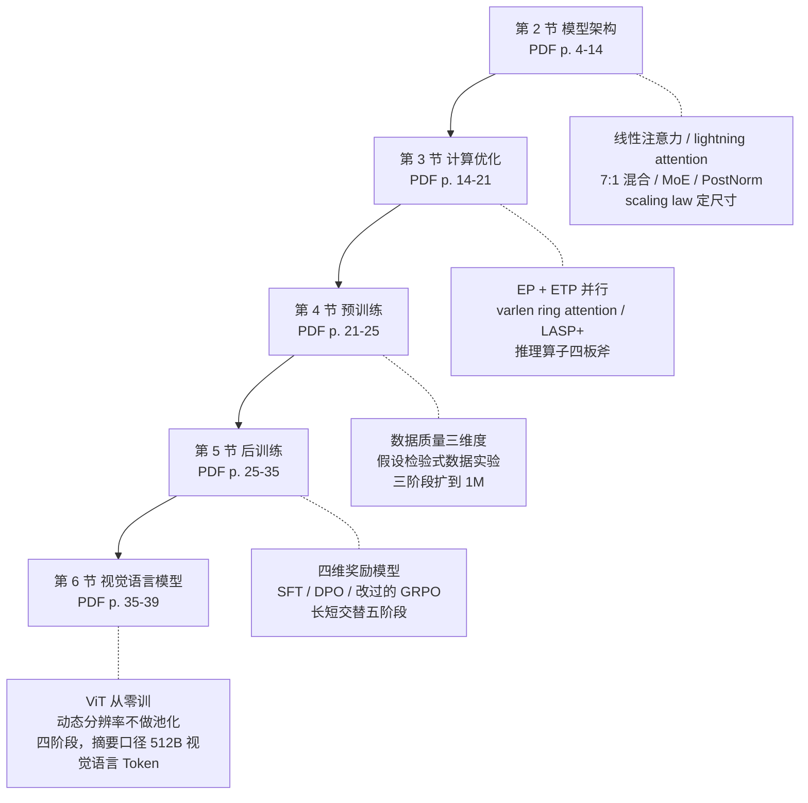
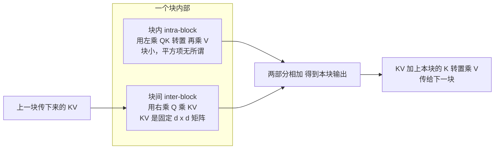
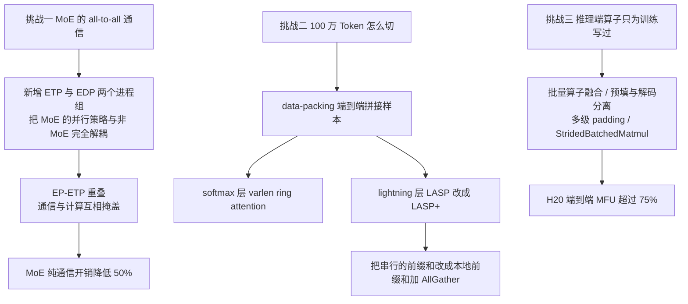

# MiniMax-01：线性注意力第一次跑到 4560 亿参数，代价是把训练与推理框架整个重写

<!-- release-date: 2025-01-15 -->

> 本文依据 MiniMax 发布的 **MiniMax-01: Scaling Foundation Models with Lightning Attention**，即 arXiv:2501.08313v1、2025-01-14 提交、共 68 页的版本（正文 p. 1–40，参考文献 p. 41–48，附录 p. 49–68，其中 p. 49 是 89 位署名贡献者名单）。截至 2026-09-06 核验，arXiv 上仍然只有 v1，官方仓库 `MiniMax-AI/MiniMax-01` 里的 `MiniMax-01.pdf` 与 MiniMax CDN 上的 `_Arxiv_MiniMax_01_Report.pdf` 指向同一篇，本地原件无需更换。下文括号里的 `PDF p. N` 指这份 68 页原文的文件页码。
>
> 全文会把三件事分开标注：**报告明确写了什么**、**我们如何解释或验算它**、**哪些是外部资料补充**。凡是标着「我们的验算」「我们的推断」的段落，都不是报告的结论。

## 阅读前先认识几个词

这份报告的名词密度不算高，但架构、算子和分布式三层的词混在一起，先用人话过一遍会省很多力气。

先是四个最底层的：

- **Token（词元）**：模型读写文本的最小单位。一个汉字、一个英文单词或一个标点，都可能被切成一个或多个 Token。
- **注意力（attention）**：模型判断「当前这个 Token 该重点参考前文哪些位置」的机制。今天绝大多数模型用的那一版叫 softmax 注意力。
- **KV Cache（Key-Value Cache，键值缓存）**：自回归生成时，把已经读过的每个 Token 的 Key 和 Value 存下来，生成下一个 Token 时不必从头重算。它的大小随上下文长度线性增长。
- **MoE（Mixture of Experts，混合专家）**：把一层里的前馈网络换成很多个「专家」，每个 Token 只让其中少数几个干活。总参数很大，但每个 Token 的实际计算量很小。

再是四个这份报告绕不开的：

- **线性注意力（linear attention）**：去掉 softmax 之后，靠矩阵乘法结合律把注意力的计算量从「随长度平方增长」变成「随长度线性增长」的一类方法。
- **Lightning Attention（闪电注意力）**：线性注意力的一种 I/O 感知高效实现，来自 MiniMax 团队成员此前的工作。它解决的是**工程问题**，不是数学问题。
- **Transnormer block**：承载 lightning attention 的层类型，出自 TransNormer（The devil in linear transformer，EMNLP 2022）。
- **NIAH（Needle-In-A-Haystack，大海捞针）**：把一句话藏进一篇很长的文章里，看模型能不能原样找回来。它是长上下文的最基础体检项。

最后两个只在评测里出现，但很关键：

- **prefill 与 decode**：prefill 是把输入的整段上下文一次读进去；decode 是一个 Token 一个 Token 往外写。两段的瓶颈完全不同。
- **MFU（Model Flops Utilization，模型算力利用率）**：实际有效浮点运算量占硬件峰值的比例，用来衡量一套实现有没有把卡喂饱。

## 先讲矛盾：一个九年没人用的好主意

### 大家都知道注意力的平方项是问题

报告开篇给的现状很朴素：当时主流模型的上下文窗口在 32K 到 256K 之间，而实际需求经常超过这个范围——把一本专业书当上下文、辅助一整个编程项目、用几百个示例做上下文学习，都不够用。（PDF p. 2）

过去两年上下文窗口能变长，靠的是两件事：更强的 GPU，和更好的 I/O 感知 softmax 注意力实现（报告在这里引用了 FlashAttention 和 ring attention）。但报告紧接着说，再往下扩已经很难，因为 Transformer 的**二次计算复杂度**让算力需求涨得比硬件能力快得多。（PDF p. 2）

这一段没有新东西。真正有意思的是下一句。

### 明明有一堆替代方案，却没有一个进了生产

报告列了一长串学界方案：稀疏注意力、线性注意力、长卷积、状态空间模型（Mamba 系列）、线性 RNN。然后给了一句判断：

> 尽管理论上很有希望，这些创新在**商业规模的模型上采用极为有限**。（PDF p. 2）

到底卡在哪？报告在第 2.2 节给了一个非常具体、也非常工程的答案：

> 在处理因果语言建模任务时，右乘的效果被削弱，必须计算 cumsum（前缀和）。这个限制阻碍了高效并行计算的实现，这大概能解释为什么这个机制在九年前就被 Brébisson 等人提出，却没有任何当前领先的开源大模型——包括 LLaMA3、Qwen2.5、DeepSeek-V3、Mistral——采用它。（PDF p. 6）

这句话值得停一下。它说的不是「线性注意力效果不好」，而是**理论上的线性优势在因果设定下兑现不了**：为了保证「第 t 个 Token 只能看见前 t 个」，你必须一步步地累加，而累加是串行的，GPU 上跑不快。于是纸面复杂度是线性的，实测速度打不过优化到极致的 softmax 注意力。

这是第一道矛盾：**便宜的方法跑不快**。

### 第二道矛盾：纯线性注意力记不住东西

报告在做 scaling 实验时观察到第二件事，说得同样直白：

> 我们观察到 lightning attention 表现出**有限的检索能力**。（PDF p. 8）

以及后面在下游任务上的结论：

> 线性注意力展现出与 Transformer 相似的语言建模能力，但在检索任务上有欠缺，**这让它不适合用于大语言模型**。（PDF p. 10）

也就是说：即使把速度问题解决了，纯线性注意力也过不了 NIAH 这一关；而检索能力是上下文学习的基础，没有它，长上下文就是摆设。

这是第二道矛盾：**跑得快的方法记不住**。

### 这份报告要证明的事

把两道矛盾并排放，MiniMax-01 的任务就清楚了：

> **它要同时证明「线性注意力在真实硬件上能快」和「用它搭的模型能记住东西」，而且必须在商业规模上证明，不是在 1B 玩具模型上证明。**

报告自己列的第二条贡献就是这句话：「我们展示了线性注意力的**第一次成功大规模落地**。线性注意力此前被研究过，但从未在这个规模上部署。」（PDF p. 3）

## 一句话先说清

MiniMax-01 做的事情可以压成一条链：

1. 用 **lightning attention** 的分块技巧绕开 cumsum，让线性注意力在 GPU 上真的跑出恒定速度（PDF p. 7、10）；
2. 用 **每 7 层线性 + 1 层 softmax** 的混合结构补回检索能力——而且实验显示混合结构在检索上**反超**纯 softmax（PDF p. 2、10）；
3. 用 **scaling law 实验**（70M 到 7B，三种注意力各跑一遍）证明这个选择不是拍脑袋（PDF p. 8–9）；
4. 因为现有框架全是为 softmax 注意力写的，把训练与推理框架**整个重写**：EP/ETP 并行、varlen ring attention、LASP+、四套推理算子优化（PDF p. 2、14）；
5. 得到 456B 总参数、每 Token 激活 45.9B、32 个专家、80 层的 MiniMax-Text-01，训练时上下文 1M，推理可外推到 4M（PDF p. 1、4、24）；
6. 再接一个 303M 的 ViT 与两层 MLP，用 512B 视觉语言 Token 继续训练，得到 MiniMax-VL-01（PDF p. 1、36）。

如果只记一句，可以记：

> **架构选型只占这份报告的四分之一，剩下四分之三是「为了让这个选型能落地，必须重写多少东西」。**

这也是它和多数「我们提出了一个新注意力」的论文最不一样的地方。

## 全景：报告的四段叙事

这是根据报告目录结构重画的导航图，不是报告里的图。虚线框是每一节的主要内容。

先把最终模型的规格摆出来（全部来自 PDF p. 4，除了标注为验算的两行）：

| 项目 | 取值 | 出处 |
|---|---|---|
| 总参数 / 每 Token 激活 | 456B / 45.9B | PDF p. 1、4 |
| 层数 | 80 | PDF p. 4 |
| 结构 | 每 7 个 lightning attention 层后跟 1 个 softmax attention 层 | PDF p. 2、4 |
| softmax 层数 / lightning 层数 | 10 / 70（我们按 80÷8 算出） | 由 PDF p. 4 推得 |
| 注意力头数 / head dim | 64 / 128 | PDF p. 4 |
| softmax 层的 GQA group size | 8（即 8 个 KV 头） | PDF p. 4 |
| RoPE | 只用在一半的注意力头维度上，base 频率 10,000 | PDF p. 4 |
| Hidden size | 6144 | PDF p. 4 |
| 专家数 / 路由 | 32 / top-2 | PDF p. 4 |
| 每个专家的 FFN 隐藏维度 | 9216 | PDF p. 4 |
| 归一化 | PostNorm，用 DeepNorm 稳定 | PDF p. 4、13 |
| 词表 | 200K，byte-level BPE | PDF p. 22 |
| 训练上下文 / 推理外推 | 1M / 4M | PDF p. 1、24 |

## 第一段：架构不是被设计出来的，是被实验筛出来的

这一节是全篇密度最高的部分。报告的写法很值得学：它不是先给结论再补实验，而是**先列备选、再逐个淘汰、最后剩下的那个就是答案**。

### 线性注意力：把括号挪一个位置

先看标准注意力（PDF p. 12，式 10）：

$$
O=\operatorname{Softmax}\left(\frac{QK^{\top}}{\sqrt{d}}\right)V
$$

$Q,K,V$ 都是 $n\times d$ 的矩阵，$n$ 是序列长度，$d$ 是特征维度。中间的 $QK^{\top}$ 是一个 $n\times n$ 的方阵，**平方项就长在这里**。

TransNormer 的 NormAttention 把 softmax 换成一个归一化算子（PDF p. 6，式 2）：

$$
O=\operatorname{Norm}\left(\left(QK^{\top}\right)V\right)
$$

去掉 softmax 之后，矩阵乘法的结合律就能用了（PDF p. 6，式 3）：

$$
O=\operatorname{Norm}\left(Q\left(K^{\top}V\right)\right)
$$

两个式子算出来一样，代价完全不同。报告的 Figure 5 画的就是这件事：左边标着 softmax 注意力的 $O(N^2d)$，右边标着线性注意力的 $O(Nd^2)$。（PDF p. 6）

| 括号位置 | 中间结果形状 | 计算量 |
|---|---|---|
| 先算 $QK^{\top}$ | $n\times n$ | 约 $n^2 d$ |
| 先算 $K^{\top}V$ | $d\times d$ | 约 $n d^2$ |

报告顺手给了两个更实在的结论（PDF p. 6）：线性形式让**训练复杂度**变成 $O(nd^2)$；而在推理时，因为可以递推地更新 $K^{\top}V$ 这一项，**每步的复杂度是常数** $O(d^2)$，与已经生成多长完全无关。作为对照，softmax 注意力在推理时是 $O(nd^2)$。

这句话是整篇报告在显存上的全部底气：线性注意力层不需要 KV Cache，它只需要带一个固定大小的状态矩阵。

### Lightning Attention：把串行的累加拆成两种乘法

上面说的都是理论。真正的问题在因果设定下。

因果注意力的左乘形式是（PDF p. 7，式 4）：

$$
O=\left[\left(QK^{\top}\right)\odot M\right]V
$$

其中掩码 $M_{ts}=1$ 当 $t\ge s$，否则为 0。$\odot$ 是逐元素相乘。

它的右乘等价形式是一个递推（PDF p. 7，式 5）。先定义一个中间量 $kv_t$，它是一个 $d\times d$ 的累积矩阵：

$$
kv_0=0,\qquad kv_t=kv_{t-1}+k_t v_t^{\top}
$$

然后每个位置的输出是：

$$
o_t^{\top}=q_t^{\top}kv_t
$$

报告紧接着点破了问题所在：

> 值得注意的是，虽然式 5 表现出线性计算复杂度，它本质上是**不可并行**的。（PDF p. 7）

这就是前面说的 cumsum 瓶颈。Lightning attention 的解法是**分块（tiling）**：把 $Q,K,V$ 沿序列维切成若干块，然后：

- **块内**用左乘：块很小，块长的平方不可怕，直接按传统注意力算；
- **块间**用右乘：只需要把前面所有块累积出来的那个 $d\times d$ 矩阵传下去。

写成两块的形式就是（PDF p. 7，式 7）：

$$
O_1=Q_1 KV_0+\left[\left(Q_1K_1^{\top}\right)\odot M\right]V_1
$$

其中 $KV_0=kv_0$。到第二块时，只需要先把第一块的贡献汇总成一个矩阵（PDF p. 7，式 9）：

$$
KV_1=KV_0+K_1^{\top}V_1
$$

然后第二块照抄同样的形式。递归地这样切下去，整体复杂度就落到（PDF p. 7）：

$$
O\left(nd^2+nBd\right)
$$

$B$ 是块大小。两项都只带一个 $n$，所以是线性的。

这是根据 PDF p. 7 式 7、式 9 与 p. 8 的 Algorithm 1 重画的机制示意图，不是报告里的图。它画的是计算依赖关系，不是实测时间轴。

报告在 p. 8 给了完整的 Algorithm 1 伪代码，关键的三行是「从 HBM 载入一块 $Q_t,K_t,V_t$ 到片上 SRAM」「在片上算 $O_{\text{intra}}$ 与 $O_{\text{inter}}$」「在片上更新 $KV$」。这是标准的 I/O 感知写法：**尽量让中间结果留在快的存储里，只把最终结果写回慢的存储。**

报告也很坦率地说明了边界：lightning attention 最早是由「我们的团队成员」提出的（引用 Qin et al. 2024c），这里重述只是为了完整性；而且**为了推导易读，刻意省略了归一化、SiLU 激活和门控机制**。（PDF p. 7）所以上面这些式子是骨架，不是可以直接照着实现的完整定义。

不过报告的 Figure 3 把被省略的部分画出来了：lightning attention 块里有 Q、K、V 三路各过一个 SiLU，另有一路 G 过 Sigmoid 做门控，再经 RMSNorm 和一个线性层输出。（PDF p. 4）想复现的话，这张图比正文的公式信息更多。

**可迁移启发：** 分块这一招的价值不在于降低了理论复杂度（它没降），而在于**把串行依赖的粒度从「一个 Token」放大到「一个块」**。任何有前缀依赖的算子都可以试这一招：块内允许冗余计算换并行，块间只传一个小结果。

### Table 1 的三个公式值得逐项读

报告为 scaling law 实验列了参数量与 FLOPs 的对照（PDF p. 8，Table 1）。$l$ 是层数，$d$ 是模型维度，$h$ 是注意力头数，$b$ 是 batch size，$n$ 是序列长度：

| 架构 | 参数量 | FLOPs |
|---|---|---|
| Softmax Attention | $12ld^2$ | $72bnld^2\left(1+\frac{n}{6d}+\frac{5}{18d}\right)$ |
| Lightning Attention | $12ld^2+2ld^2/h$ | $72bnld^2\left(1+\frac{1}{2h}+\frac{5}{18d}\right)$ |
| Hybrid-lightning | $12ld^2+7ld^2/4h$ | $72bnld^2\left(1+\frac{n}{48d}+\frac{7}{16h}+\frac{5}{18d}\right)$ |

**下面是我们的验算，报告没有做这个对照。** 把三行放在一起看，混合架构的两个附加项恰好是另外两行的固定比例：

$$
\frac{n}{48d}=\frac{1}{8}\cdot\frac{n}{6d},\qquad
\frac{7}{16h}=\frac{7}{8}\cdot\frac{1}{2h}
$$

也就是说，混合架构保留了 $1/8$ 的 softmax 平方项和 $7/8$ 的线性项。这和「每 8 层里有 1 层 softmax」严丝合缝。参数量那一列同样对得上：$7ld^2/4h$ 正好是 $2ld^2/h$ 的 $7/8$。

这个验算的意义是：**7:1 这个比例不是修辞，它直接写在成本函数里。** 混合架构没有消灭平方项，它把平方项打了个八折。

再往下算一步（**同样是我们的验算，且只是量级示意**）：softmax 那一行的平方项在 $n=6d$ 时开始和主项等量齐观；混合那一行要到 $n=48d$。把最终模型的 hidden size $d=6144$ 代进去，两个门槛分别在约 3.7 万和约 29.5 万 Token。**但必须说清楚**：Table 1 是为 scaling law 用的稠密模型列的，最终模型还有 MoE 和 GQA，这两个数字只能当量级参考，不能当精确预测。

### 用 scaling law 判卷，而不是用一两个 benchmark

这是这份报告方法论上最扎实的一段。

实验设置（PDF p. 8–9）：三种注意力（softmax 配 FlashAttention-2、纯 lightning、hybrid-lightning）各训一套 70M / 160M / 410M / 1B / 3B / 7B 的模型，每个最多训 300B Token，上下文长度 8192，全局 batch 固定 4M Token，Adam 优化器，学习率 3e-4，权重衰减 0.1，因为算力受限统一用固定学习率调度。

拟合结果（PDF p. 9，Table 2）：

| 架构 | $L(C)$ | $N_{opt}(C)$ | $D_{opt}(C)$ |
|---|---|---|---|
| Softmax Attention | $3.7087C^{-0.0798}$ | $(1.82\times10^{8})C^{0.7118}$ | $(2.56\times10^{10})C^{0.5102}$ |
| Lightning Attention | $3.5391C^{-0.0768}$ | $(2.74\times10^{8})C^{0.6470}$ | $(4.43\times10^{10})C^{0.4684}$ |
| Hybrid-lightning | $3.4797C^{-0.0763}$ | $(2.57\times10^{8})C^{0.6670}$ | $(3.70\times10^{10})C^{0.4707}$ |

报告给的读法是：**同样的算力预算下，带 lightning attention 的模型倾向于用更多参数和更多 Token，却达到更低的损失。**（PDF p. 9）

这里有一个容易读错的地方，值得单独说清楚（**这一段是我们的解释**）。三行里 softmax 的指数 $-0.0798$ 绝对值最大，意思是它随算力下降得**最陡**；但它的系数 $3.7087$ 也最大。在实验覆盖的算力区间里，系数占了上风，所以混合架构的曲线在下面。指数更陡意味着如果把预算一直外推下去，softmax 迟早会追上来——报告没有讨论这个交叉点在哪，也没有说这套拟合能外推多远。**把这三行当成「在这个算力区间内混合更好」的证据是稳妥的，当成「混合永远更好」就超纲了。**

### 但 NIAH 崩了

下游任务的结果画在 Figure 7 里，四张子图分别是 410M、1B、3B、7B（PDF p. 10）。结论只有一句话：

> lightning attention 在大多数下游任务上表现相当，**NIAH 除外**。（PDF p. 10）

在四张子图里，纯 lightning attention（紫色柱）在 PIQA、HellaSwag、WinoGrande、ARC、OpenBookQA 这些常识推理任务上和 softmax 几乎贴在一起，唯独 NIAH 那根柱子明显矮一大截。而混合架构（红色柱）的 NIAH，按图上直接标注的数值，在 410M / 1B / 3B / 7B 上分别是 84.2 / 95.7 / 98.0 / 97.7。（PDF p. 10）其中 1B 的 95.7 与 3B 的 98.0 和 Table 3、Table 4 里的数字完全一致，可以互相对上。

这是一个很干净的实验设计：**同一批模型、同一批数据、只换注意力，然后让 NIAH 把差异逼出来。** 常识推理测不出这个差别，因为那些任务本来就不需要精确回看原文。

**可迁移启发：** 选评测指标时要先想清楚「我改的这个东西会在哪里露馅」。如果只看平均分，纯线性注意力看起来完全可用；是 NIAH 这个**针对性**指标把它否掉的。

### 混合结构的意外结果：它比纯 softmax 还强

Figure 7 里更值得注意的是另一件事：混合架构在 NIAH 上不只是追平 softmax，而是**超过**了它。报告自己也承认这一点反直觉：

> 我们的混合模型不仅追平、而且在检索和外推任务上**超过了** softmax 注意力。这个结果有点反直觉。（PDF p. 12）

报告给了一个基于「循环状态容量」的解释，推导分两步。

**第一步：softmax 注意力也可以写成一个循环形式。**（PDF p. 12，式 11）先定义一个逐步累积的归一化因子：

$$
s_t^{0}=0,\qquad s_t^{j}=s_t^{j-1}+\exp\left(\frac{q_t k_j^{\top}}{\sqrt{d}}\right)
$$

然后输出就是一个不断做加权平均的过程：

$$
o_t^{j}=\frac{s_t^{j-1}}{s_t^{j}}\,o_t^{j-1}+\left(1-\frac{s_t^{j-1}}{s_t^{j}}\right)v_j,\qquad o_t=o_t^{t}
$$

关键在于：对每一个 $t$，这个循环都要**从 $j=1$ 重新走一遍**。报告给了一个很好的说法，叫「Going Through a Book」——每写一个字，就把整本书从头翻一遍。（PDF p. 12）正因为每次都重新翻，它才不会记错。

**第二步：比较两者的「状态容量」。** 报告把 RNN 的容量定义为循环状态的大小。按式 11 的写法，softmax 注意力的状态是 $O(d)$；而 lightning attention 的状态（式 12 里的 $kv$ 矩阵）是 $O(d^2/h)$。因为 $d>h$，所以线性注意力的容量**更大**。（PDF p. 12）

于是报告的结论是：混合模型既有少数层可以「翻书」，又有多数层带着一个更大的固定状态，所以检索和外推都更好。

**这里必须给一个判断（我们的看法，不是报告的）：这个解释是自洽的，但它不是被独立验证的机制。** 它有两处需要保留：

1. 把 softmax 的容量算成 $O(d)$，是只数了式 11 里那个递推变量的大小。softmax 真正的「记忆」是整份 KV Cache，那是随长度增长的。所以这不是一个同口径的比较，它比较的是「重算式记忆」和「压缩式记忆」的瞬时状态。
2. 「容量更大所以检索更好」隐含假设了容量是瓶颈。报告没有做「只改状态维度、其余不变」的对照实验来验证这一点。

真正过硬的证据是 Figure 7、Table 3 和 Table 4 那些实测数字；容量论证是报告为这些数字提供的一个**故事**，两者不应混为一谈。

不过报告在 2.4 节留下了一条支持性的线索：他们在小模型上试出的规律是「**增大线性注意力的记忆尺寸能显著提升模型性能**」。（PDF p. 13）这和容量论证方向一致，虽然报告同样没有给出这条对照的数据。

### 和别的线性方案、和滑窗注意力比一遍

报告没有停在「混合比纯线性好」。它还做了两组横向对照。

**第一组：换别的线性注意力做混合。**（PDF p. 11，Table 3）把 cosformer2 和 HGRN2 也按同样的「每 8 层换 1 层 softmax」做成混合模型，1B 参数，同样设置：

| 混合线性架构 | TGS（Token/GPU/秒） | CSR 平均 | NIAH | SCROLLS |
|---|---:|---:|---:|---:|
| Hybrid-cosformer2 | 23.3K | 46.64 | 43.6 | 10.9 |
| Hybrid-hgrn2 | 29.5K | 49.87 | 91.8 | 10.8 |
| Hybrid-lightning | 33.4K | 49.55 | 95.7 | 13.3 |

读法：常识推理（CSR）三家差不多，hgrn2 甚至略高一点点；**拉开差距的是 NIAH、SCROLLS 和训练速度**。hybrid-lightning 的 TGS 比 cosformer2 高 43%。

**第二组：和滑动窗口注意力比。**（PDF p. 11，Table 4）滑窗注意力（SWA）只看附近固定长度的一段，只要窗口固定，复杂度也是线性的，而且它建立在 softmax 之上，是个很强的基线。报告试了 256 / 512 / 1024 三种窗口，在 1B 和 3B 两个规模上比：

| 规模 | 架构 | 窗口 | TGS | CSR 平均 | NIAH | SCROLLS |
|---|---|---:|---:|---:|---:|---:|
| 1B | Hybrid-window | 256 | 35.6K | 48.61 | 46.8 | 10.6 |
| 1B | Hybrid-window | 512 | 35.1K | 47.70 | 25.7 | 11.9 |
| 1B | Hybrid-window | 1024 | 33.6K | 48.02 | 53.9 | 10.6 |
| 1B | Hybrid-lightning | — | 33.4K | 49.55 | 95.7 | 13.3 |
| 3B | Hybrid-window | 256 | 16.1K | 54.31 | 40.9 | 14.2 |
| 3B | Hybrid-window | 512 | 15.8K | 53.97 | 57.9 | 14.2 |
| 3B | Hybrid-window | 1024 | 15.4K | 53.44 | 41.6 | 13.3 |
| 3B | Hybrid-lightning | — | 15.1K | 55.16 | 98.0 | 14.7 |

差距最刺眼的还是 NIAH：滑窗方案在 25.7 到 57.9 之间乱跳，混合线性稳在 95 以上。报告也说了它为什么只试到 1024：更大的窗口训练速度更慢，为了在同等速度下比较，就不再考虑了。（PDF p. 11）

**这里有一个值得注意的细节（我们的观察）**：hybrid-window 的 NIAH 分数随窗口大小**非单调**（1B 上是 46.8 → 25.7 → 53.9）。这说明这几个数字的噪声不小，报告没有给多种子重复或误差带。所以「混合线性远好于混合滑窗」这个结论是可信的（差距 40 分以上），但「窗口 512 比 256 差」这种细节读不出来。

### 速度：唯一跑赢 FlashAttention-2 的线性模型

Figure 8 测的是 3B 模型的端到端训练速度，单位是 TGS（每 GPU 每秒处理的 Token 数），序列长度从 1024 一路加到 65536，直到单节点 H800 爆显存。对照组还包括 HGRN2 和 Mamba2。（PDF p. 10）

报告给的结论是两句：lightning attention 的训练速度**与序列长度无关**，保持恒定；而且它是**唯一跑赢 FlashAttention-2 的线性模型**。（PDF p. 10）从图上看，softmax 的曲线在 4096 之后开始明显下滑，到 65536 时掉到最低；lightning 和 hybrid-lightning 基本是两条水平线。

**口径提醒：** 这是训练速度，不是推理速度；是单节点，不是集群；是 3B，不是 456B。报告没有给出 456B 模型的训练 TGS。

### MoE 那一侧：token-drop 与 global router

架构的另一半是 MoE。报告的 MoE 公式是标准形式（PDF p. 5，式 1）：

$$
h_t=\sum_{i=1}^{E}\operatorname{Softmax}_i\left(\operatorname{TopK}\left(x_t\cdot W_g\right)\right)\cdot\operatorname{FFN}_i(x_t)
$$

$E$ 是专家总数，$W_g$ 是门控权重，$\operatorname{TopK}$ 保留分数最高的 $k$ 个专家、其余置为 $-\infty$。

MoE 的训练有两条路：**token-drop**（给每个专家设一个容量上限，超了就把多出来的 Token 丢掉）和 **dropless**（不丢，代价是负载不均时要等）。报告明说选了 token-drop，理由是训练效率。（PDF p. 5）

先给 MoE 本身的证据。Figure 4 是一组等算力（isoflop）对照：一个 7B 稠密模型 对 一个总参数 24B、激活 2B 的 MoE 模型，两者都训 1T Token，在 HellaSwag、WinoGrande、Natural Questions、PIQA、TriviaQA 上比。结论是同等算力预算下 MoE 明显更好。（PDF p. 5）

然后是问题：规模一大，就出现**路由塌缩**（routing collapse）——Token 过度集中到少数专家。（PDF p. 5）

标准解法是 GShard 式的辅助损失（PDF p. 5）：

$$
L_{\text{aux}}=\alpha_{\text{aux}}\cdot\frac{1}{E}\sum_{i=1}^{E}f_i\cdot m_i
$$

$f_i$ 是分配给第 $i$ 个专家的 Token 比例，$m_i$ 是该专家的平均路由概率。两者相乘再求和，等于在惩罚「又常被选中、路由分又高」的专家。

MiniMax-01 在此之上加了一个叫 **global router** 的东西，报告的因果链很清楚（PDF p. 5–6）：

1. 显存限制了训练时的 micro batch size；
2. batch 一小，单个专家并行（EP）组内的 Token 分布波动就大；
3. 不同 EP 组之间的分布还不一样，于是可能出现「A 组的专家过载、B 组的专家闲着」；
4. 解法是在跨 EP 组分发 Token 之前，**多加一次 allgather 通信，把每个专家待处理的 Token 数同步一遍**；
5. 收益是在同样的容量约束下降低整体的 Token 丢弃率，从而稳住训练。

**可迁移启发（我们的总结）：** 这是一个典型的「局部信息不够就多花一次通信」的取舍。辅助损失是**软**约束，只能在梯度上施压；global router 是**硬**协调，直接在调度层面拉平。两者不冲突，报告是叠加使用的。如果你的 MoE 掉 Token 掉得厉害，先看是「路由本身偏」还是「组之间看不见彼此」，两者的修法完全不同。

### PostNorm + DeepNorm：为什么这里深比宽重要

报告在 2.3 节做了两组 MoE 规模上的消融（PDF p. 12–13）。

**第一组，混合注意力 对 纯 softmax。** 基线是一个总参数 28B、激活 5B 的 softmax MoE；改造版是把每 8 层里的前 7 层换成 lightning attention。两者都训 1T Token。

**第二组，PreNorm 对 PostNorm。** 模型是总参数 60B、激活 9.3B、48 层，训 500B Token。PostNorm 用 DeepNorm 稳定训练。

结果（PDF p. 13，Table 5）：

| 架构 | BBH | DROP | MMLU | CMMLU | MATH | GSM8k | ARC-C | WG |
|---|---:|---:|---:|---:|---:|---:|---:|---:|
| Softmax | 28.2 | 27.4 | 49.3 | 47.3 | 4.6 | 18.8 | 46.4 | 65.6 |
| Hybrid-lightning | 32.2 | 29.0 | 49.5 | 46.0 | 6.8 | 18.5 | 47.4 | 67.5 |
| Pre Layer Norm. | 29.9 | 26.8 | 43.9 | 41.8 | 4.8 | 12.2 | 43.5 | 65.5 |
| Post Layer Norm. | 32.6 | 27.6 | 50.2 | 49.2 | 5.7 | 16.8 | 46.2 | 65.4 |

混合注意力在 8 项里赢了 6 项（CMMLU 和 GSM8k 略输）。PostNorm 在 8 项里赢了 6 项，MMLU 和 CMMLU 的差距分别是 6.3 和 7.4 分，很大。

为什么这份报告要专门去动归一化位置？它的理由是这样一条链（PDF p. 12–13）：

1. PreNorm 让梯度可以从输出经残差连接**直接**回到输入，在一定程度上绕过子层，因此它**降低了模型的有效深度**；
2. PostNorm 保留有效深度，但容易梯度消失或爆炸，所以主流模型都用 PreNorm；
3. 在常规 Transformer 里，宽和深的性能差别常常可以忽略，所以大家优先选训练稳定；
4. **但在混合架构里，有效深度很重要**——报告在 2.4 节说得更明确：「混合架构对层深特别敏感，更深的模型持续优于更浅的模型；值得注意的是，**浅模型需要显著更多的 softmax 注意力层**才能达到相当的性能。」（PDF p. 13）

第 4 点是这一段的关键。**它把「深度」和「softmax 层数」变成了一对可以互相换的资源**：想少放几层昂贵的 softmax，就得把模型做深。既然深度这么值钱，就值得为它承担 PostNorm 的训练风险，再用 DeepNorm 把风险压回去。

具体的 DeepNorm 系数写在训练一节：$\alpha=(2N)^{0.25}$，$\beta=(8N)^{-0.25}$，$N$ 是层数。（PDF p. 24）

**可迁移启发：** 「大家都用 PreNorm」是一个在标准架构下总结出来的经验。**换了架构，经验的前提可能就不成立了。** 这份报告的做法值得学：不是直接推翻惯例，而是先说清惯例成立的条件（宽深差别可忽略），再说明自己的场景为什么不满足这个条件。

### 定尺寸：从「单机能不能跑 100 万 Token」倒推参数量

大多数报告讲模型尺寸是从算力预算出发。这份报告是从**部署约束**出发的，而且说得非常具体。

引言里的原话是：「我们根据一个实际约束确定模型总参数：**在一台最多 8 张 GPU、640GB 显存的机器上，用 8-bit 量化处理超过 100 万 Token 的能力**。」（PDF p. 2）第 2.4 节把它写成了一条硬上限：总参数约束在 500B 以内，确保 1M 序列在 $8\times80\text{G}$ 单节点上用 8-bit 量化能跑。（PDF p. 13）

然后才是优化问题（PDF p. 13，式 13）：

$$
\min_{P_{\text{all}},P_{\text{act}}}L\left(P_{\text{all}},P_{\text{act}},T\right)\quad\text{s.t.}\quad C_{\text{compute}}\left(P_{\text{all}},P_{\text{act}},T\right)<C\ \text{且}\ P_{\text{all}}<500B
$$

在正式定尺寸之前，报告先在小模型上把五个比例调出了合适区间（PDF p. 13）：

1. softmax 与线性注意力的混合比例；
2. 模型的深宽比；
3. 线性注意力记忆尺寸与 hidden size 的比例；
4. 激活 FFN 与注意力的比例；
5. softmax 注意力中使用 RoPE 的维度比例。

三条结论（PDF p. 13）：更深更好；线性注意力记忆尺寸越大性能越好；**RoPE 只用在一半的 softmax 注意力维度上，就能实现长度外推而不损失性能**。第三条直接解释了 p. 4 那句「RoPE 应用于一半的注意力头维度」。

最后是尺寸预测。报告先按常规 scaling law 训了一批激活参数 44M 到 1.2B、各 500B Token、分别用 16 / 32 / 64 个专家的模型，然后发现外推到 9.3B 时预测不准了，于是自己拟了一个带专家数条件的形式（PDF p. 14，式 14）：

$$
L\left(P_{\text{act}},T\mid E\right)=d+aP_{\text{act}}^{\alpha}+bT^{\beta}+c\left(P_{\text{act}}T\right)^{\gamma}
$$

其中 $a,b,c,d,\alpha,\beta,\gamma$ 都是关于专家数 $E$ 的待拟合参数。最终选出 45.9B 激活 / 456B 总参数。（PDF p. 14）

**这里必须说清一件事（我们的判断）：报告没有公开这套拟合的系数值、拟合误差、以及它在 456B 上的预测与实际训练损失的对比。** 所以式 14 只能读作「他们承认标准 scaling law 在这里失效了，并换了一个更灵活的函数族」，不能读作「这个公式被验证是对的」。

### 现在把整个架构在显存上算一遍

**下面全部是我们的验算，报告没有列这张表。** 它的作用是把前面所有分散的数字连成一句能记住的话。

按 PDF p. 4 的配置：80 层，其中 softmax 层 10 层、lightning 层 70 层；64 个头，head dim 128；softmax 层用 GQA，8 个 KV 头。

**softmax 层的 KV Cache（随长度增长）：** 每层每个 Token 要存 K 和 V 各 8 个头 $\times$ 128 维，合计 $8\times128\times2=2048$ 个数。10 层就是 20480 个数。100 万 Token 就是 $2.05\times10^{10}$ 个数。

**lightning 层的状态（不随长度增长）：** 每层每个头带一个 $128\times128$ 的矩阵，64 个头是 $1.05\times10^{6}$ 个数。70 层合计约 $7.34\times10^{7}$ 个数——**而且不管上下文是 1 万还是 400 万，都是这个数。**

按 Figure 2 图注里写的 W8A16（权重 8-bit、激活 16-bit）口径估算（PDF p. 3）：

| 方案 | 权重 | 1M Token 的 KV / 状态 | 合计 | 640GB 装得下吗 |
|---|---:|---:|---:|---|
| 全部 80 层用 softmax | 约 456GB | 约 328GB | 约 784GB | 装不下 |
| 实际的 10 softmax + 70 lightning | 约 456GB | 约 41GB + 0.15GB | 约 497GB | 装得下，还剩约 140GB |

这张表就是引言里那句「8 张 GPU、640GB、8-bit、超过 100 万 Token」的全部含义。

**但这里要分清报告说了什么、我们推了什么。** 报告明确把显存约束绑在**总参数**上：引言说总参数是按这个约束定的，2.4 节把它写成 $P_{\text{all}}<500B$ 的硬上限（PDF p. 2、p. 13）。至于 **7:1 这个具体比例，报告归因于小规模对比实验**——它是 2.4 节列出的五个待调变量里的第一个，和深宽比、线性注意力记忆大小、FFN 与注意力的比例、RoPE 维度占比一起调（PDF p. 13）。

上面这张表是我们的推算，它能支持的结论只有一条：**在 640GB 这个盒子里，绝大多数层必须是不随长度增长的那一种，否则光 KV 就把机器占满了。** 至于为什么恰好是 7:1 而不是 3:1 或 15:1，**报告没有给比例的消融曲线**，质量侧的证据（Figure 7、Table 3、Table 4）只证明这个比例不会把检索能力弄坏，不能证明它是质量最优或显存最优的那一点。

需要保留的不确定性：上面的估算忽略了激活值、推理时的临时缓冲、框架开销和显存碎片，也假设 KV 按 16-bit 存。真实占用只会更高。所以这是量级验证，不是容量规划。

## 第二段：为了让这套架构跑起来，框架被重写了

报告第 3 节开头就把话说死了：

> 现有的分布式训练与推理框架主要是为 softmax 注意力优化的。然而我们的新架构，整合了 lightning attention、softmax attention 和 MoE，**需要对训练和推理框架进行彻底重新设计**。（PDF p. 2）

以及：

> 业界现有的开源框架目前缺乏足够成熟的技术支持来充分应对这些挑战。因此我们**独立、全面地重新发明了**我们的分布式训练与推理框架。（PDF p. 14）

集群规模写在同一页：**一个动态变化的 GPU 集群，H800 数量在 1500 到 2500 之间。**（PDF p. 14）报告没有给总训练时长、总 GPU 小时数或成本。

报告把挑战归成三条（PDF p. 14）：MoE 的 all-to-all 通信开销、1M 上下文在多卡间的切分、以及推理时 lightning attention 面对真实批量输入的适配。下面逐条看。

这是根据 PDF p. 14–21 的文字重画的对应关系图，不是报告里的图。它画的是「问题到解法」的归属，不是执行顺序。

### 挑战一：MoE 的 all-to-all，卡在一个具体的两难上

MoE 的 all-to-all 是老问题，标准做法是把 Token 分组，让一组的通信和另一组的计算重叠（PDF p. 14，Figure 9）。但报告说，为了保证通信结果正确，**每个 ProcessGroup 内的通信算子必须顺序执行**，于是不同组之间的 a2a 没法重叠，中间出现空转。（PDF p. 15）

真正的两难在下一段（PDF p. 15）：

- 如果用张量并行（TP）切分专家参数，**计算强度会低到影响效率**；
- 如果不用 TP，参数量太大，就得开更大的流水线并行（PP）；
- 而 **PP 并不减少存储激活所需的显存**，这对长上下文训练特别要命——显存涨了，但计算效率和训练速度并没有等比例的好处。

解法是引入两个新的进程组（PDF p. 15）：

- **ETP（Expert Tensor Parallel）**：专门管专家权重的切分；
- **EDP（Expert Data Parallel）**：专门管相同专家的数据并行。

于是系统要同时满足两个约束（PDF p. 15，式 15、式 16）：

$$
\text{world size}=\text{size}_{PP}\times\text{size}_{DP}\times\text{size}_{CP}\times\text{size}_{TP}
$$

$$
\text{world size}=\text{size}_{PP}\times\text{size}_{EDP}\times\text{size}_{ETP}\times\text{size}_{EP}
$$

第一条是模型主体的切法：流水线并行 PP、数据并行 DP、上下文并行 CP、张量并行 TP。第二条是专家部分的切法：PP 不变，另外三个换成专家数据并行 EDP、专家张量并行 ETP、专家并行 EP。

同一批 GPU，用两种不同的方式切。报告的说法是这**把 MoE 部分的并行策略与非 MoE 部分完全解耦了**，ZeRO 也能独立配置。（PDF p. 15）

在此之上再做 EP-ETP 重叠（PDF p. 15–16，Figure 10）。报告给了三条经验：计算时间越长，能掩盖的通信越多；分组太少会重叠不足；分组太多会让调度复杂度上升、有变成 CPU-bound 的风险。

收益是一句话：**MoE 部分的纯通信开销比优化前降低了 50%。**（PDF p. 16）

**可迁移启发（我们的总结）：** 这一段真正的设计动作不是某个算法，而是**把「专家的并行方式」从「模型其余部分的并行方式」里拆出来，变成一组独立的旋钮**。一旦解耦，原来那个「要么计算强度太低、要么显存爆」的两难就不再是二选一，而是一个可以连续调的比例。遇到「怎么调都有一头顶住」的情况时，先看是不是两件事被绑在了同一个参数上。

### 挑战二：100 万 Token 怎么在卡之间切

先是一个数据格式问题。真实训练样本长短不一，传统做法是 padding 补齐，但在 1M 这个尺度上补齐的浪费大得离谱。报告的做法叫 **data-packing**：把不同样本沿序列维**首尾相接**拼成一条长序列。（PDF p. 16）

data-packing 省了算力，但给两种注意力都带来了新麻烦。

**softmax 层：varlen ring attention。** ring attention 本来能把序列切到多卡上，但报告说现有实现都没有针对 data-packing 格式优化（PDF p. 16–17）：FlashAttention 提供了 varlen（变长）接口却没有对应的 ring attention 实现；TransformerEngine 有 ring attention，但它把每条序列切成 $2\times\text{size}_{CP}$ 段，于是**每条序列的长度必须是 $2\times\text{size}_{CP}$ 的整数倍**——在样本分布未知、CP 很大时，这会重新引入大量 padding。

MiniMax 的解法是不对样本分布做任何假设：把 ring attention 直接作用在 data-packing 之后的**整条**序列上，靠区分每条子序列在环内计算中对应的注意力掩码偏移来保证正确性。具体改动是把原来的因果计算换成 varlen 因果计算、非因果计算换成 varlen 非因果计算（PDF p. 17，Figure 11）。

**lightning 层：LASP 改成 LASP+。** LASP（Linear Attention Sequence Parallelism）借用 CP 通信组来扩展长序列，但它要求所有 CP rank 通过 send-recv 依次交换中间的 $KV$ 块结果。这就在 rank 之间制造了**顺序依赖**，计算被迫串行。（PDF p. 17）

LASP+ 的改法只有三步（PDF p. 17–19）：

1. **本地前缀和**：每个 CP rank 先独立算出自己那段的局部前缀和 $KV_L$；
2. **AllGather 全局同步**：一次 AllGather 把所有节点的局部结果同步给所有人；
3. **前缀和计算**：每个节点按自己的计算顺序，挑出需要的那些 $KV_L$ 组合成全局前缀和 $KV_G$。

这是经典的并行前缀和（scan）思路：**用一次全体通信换掉一条链式依赖。** 报告给的效果是计算速度可以达到原 LASP 的 $1/N_{pcn}$，$N_{pcn}$ 是并行计算节点数；AllGather 带来的额外开销很小。（PDF p. 19）代价报告也明说了：总通信量和临时显存都增加了，但收益远大于开销。（PDF p. 19）

LASP+ 之上再加 varlen 支持，做法是先把每条输入 padding 到块大小的整数倍（**块大小固定为 256**），再顺序拼接，这样一个 kernel 就能并行处理多个 batch。（PDF p. 19）

**可迁移启发：** 这两条改动其实是同一个道理的两个版本——**先想清楚你的依赖是「必须按顺序」还是「只是被写成了顺序」**。前缀和看起来必须顺序，但它是结合律成立的运算，所以能用 scan 并行化。ring attention 看起来必须整段对齐，但对齐只是实现选择，不是算法要求。

### 挑战三：推理端的 lightning attention 根本没为线上写过

报告说得很实在：lightning attention 最初的实现是**研究导向**的，还不适合实际应用，尤其是推理；而部署一个训练好的模型，长期成本主要由推理效率决定。（PDF p. 19）四项优化如下。

**1. 批量算子融合。**（PDF p. 20）在 prefill 阶段把处理 $Q,K,V$ 的一系列操作融成一个 kernel：序列维 padding、切块、调整内部布局、计算衰减值。在 decode 阶段把 $KV$ 的计算和前缀 $KV$ 缓存的更新融成一个 kernel。效果是**在解码阶段和短文本输入场景下把端到端延迟降低 10%**，而且在 H20 上的收益比 H800 明显得多。

顺带一提：这里出现了「计算衰减值」和「前缀 KV 缓存」两个词。前者说明 lightning attention 里确实有衰减机制（Figure 12 的图注也提到「用衰减初始化对角矩阵」，PDF p. 18），后者说明线性注意力层的那个固定状态也是可以做前缀缓存的。报告没有展开衰减的确切形式。

**2. 预填与解码分离执行。**（PDF p. 20）问题是：lightning attention 的实现围绕「块内 vs 块间」展开，但解码阶段每步的 Token 长度恒为 1。长度为 1 的 kernel 是**访存瓶颈**，只需要少量 SM。于是把长度为 1 和长度大于 1 的输入分成两个 kernel，用两条 CUDA stream 并行调度。

报告给的例子很具体：batch size 为 20、全都带前缀 KV 缓存，其中一两条输入长度是 50、其余长度是 1，这样处理后**延迟从 100 毫秒降到 50 毫秒**，约等于只处理那几条长输入的时间。

**3. 多级 padding。**（PDF p. 20）原来的块大小固定 256，和训练一致。但上了前缀缓存以后，一个 batch 里的 Token 长度通常远低于 256，于是每次矩阵乘法都在算大量填充出来的零。解法是加上 32、64、128 三档，按当前输入长度动态挑 padding 开销最小的那一档。

**4. StridedBatchedMatmul 扩展。**（PDF p. 21）用 cuBLAS 的 `cublasGemmStridedBatchedEx` 管理批量矩阵乘；因为块大小是 256，对应的 GEMM 是 256$\times$256，可以用 warpgroup 级的 WGMMA 指令；再配合 TMA（Tensor Memory Accelerator）做异步访存，把部分前后处理挪到 CUDA Core 上异步执行。

**总收益**（PDF p. 21）：H20 上端到端推理的 MFU **超过 75%**。

报告接着给了一个数字，需要小心读：

> 具体来说，在我们的 MiniMax-Text-01 和 MiniMax-VL-01 推理中，考虑 MoE 结构内注意力操作与 FFN 操作的延迟比，在序列长度 1,024,000 时 **softmax attention 占延迟的 95%**，而 lightning attention 的实现在同等条件下**贡献的延迟不到 12%**。（PDF p. 21）

**这句话的口径必须标出来（我们的判断）：** 95% 和 12% 加起来超过 100%，所以这不可能是同一个模型里两类层各自的占比。最合理的读法是两个假设情形的对照——如果这些层都用 softmax，注意力会吃掉 95% 的延迟；换成 lightning attention 后，这部分掉到 12% 以下。但**报告的措辞没有明确说清是哪一种比较**，也没有给测量的硬件、batch、并发或首 Token 延迟。所以这个数字只能当作「在极长序列上注意力占比被大幅压下来」的定性证据，不适合拿去做任何换算。

### 这一段的代价与边界

- 报告没有给 456B 模型自己的训练吞吐、MFU 或总 GPU 小时数。给出的只有集群规模区间（1500–2500 张 H800）和一句「MoE 通信开销降 50%」。
- 「MFU 超过 75%」是 **H20 上的推理** MFU，不是训练 MFU，也不是 H800 上的。H20 的算力峰值远低于 H800，MFU 高不代表绝对吞吐高。
- 所有这些优化都是**自研框架**里的，报告没有开源框架代码，也没有给出与 vLLM、TensorRT-LLM 等公开方案的对照。
- Figure 2 的 prefill 延迟曲线是唯一一条端到端对比，它的口径后面单独讲。

## 第三段：预训练

### 数据质量：三个维度和一个打分模型

报告把语料质量拆成三个动作（PDF p. 22）。

**动作一，质量增强。** 规则清洗和去重之外，关键一步是**用上一代自研模型当质量打分器**——具体是一个激活 5B、总参数 60B 的 MoE 模型。一开始评估了很多个维度（连贯性、简洁性、教育价值、有用性、知识丰富度、类别相关性），分析后发现这些指标之间高度相关，最终收敛到三个：**知识深度、实用有用性、类别分布**，其余作为次级验证指标。

这一步的方法论比结论有意思：**先铺开多维度打分，再用相关性分析把维度砍掉。** 很多团队会一直维护那六个维度，结果是打分成本高、维度之间还互相抵消。

**动作二，格式优化。**（PDF p. 22）报告给了一个反直觉的判断：网页和书籍清洗后可以直接当高质量教材用，不需要额外格式化；对话和问答数据虽然人类喜欢 Markdown 之类的排版，但**过重的格式化会引入固定模式，反而降低数据的多样性和质量**。折中方案是用一套「嵌套文档格式」配多种模板。

**动作三，配比研究。**（PDF p. 22）结论同样反直觉：知识深度和有用性得分高的内容整体上表现更好，但**完全剔除低分内容会损害下游任务表现**。所以做法是先从全语料的均匀分布起步，再调采样权重偏向高质量内容，同时保证各类别都有足够的代表性。

**可迁移启发：** 后两条都在说同一件事——**质量筛选的目标不是「留下最好的」，而是「在提升平均质量的同时不把分布削尖」。** 只留高分数据、只留规范格式，得到的是一个在训练集上很漂亮、在真实输入上很脆的模型。

分词器：byte-level BPE，特意上采样多语言内容以提升相应的压缩效率，词表 200K。（PDF p. 22）

### 数据实验：把配方选择做成一次统计假设检验

这一节（PDF p. 23）在同类报告里少见，值得单独讲。

大多数报告谈数据消融就是「我们训了几个小模型，A 比 B 好」。这份报告把它**形式化成了假设检验**：

- **形式化。** 测试新语料 $D$ 时，备择假设是 $H_1:\mu_{T_D}>\mu_{T_{\text{baseline}}}$，$\mu$ 是加权平均性能指标，$T$ 是评测值在测试样本上的分布。
- **评测指标。** 用一批多选题，但在提问时**丢掉选项编号**，只看各个补全的似然。指标是逐样本的对数归一化准确率 $\log \text{acc}_{\text{norm2}}$，其中每个选项的概率先除以它的字节数再做 softmax。**按字节归一化是为了排除分词器的影响，同时缓解对长选项的歧视。**
- **指标的判别力。** 用 $\Delta_{\text{obvious}}/\sigma_{\text{seed}}$ 来量化，即「模型之间的明显差异」比上「不同随机种子造成的标准差」。
- **实验规模怎么定。** 做功效分析，在保证 **95% 置信水平和 80% 检验功效**的前提下决定最小测试样本量，并让最小可检测效应（MDE）与训练方差处在同一量级。
- **最终落点。** 训练一个激活 1B、总参数 8B 的 MoE，用 40B Token，其中 20B 是网页文档、20B 是待检验的假设数据。

**这套东西真正解决的问题是（我们的解读）：小规模消融的信噪比很低。** 换个随机种子，分数可能就动一两个点；如果不先量化种子噪声，你根本不知道「A 比 B 高 0.8 分」意味着什么。先量化 $\sigma_{\text{seed}}$，再反推需要多大的测试集，是把「看起来好像更好」变成「统计上可判定」的唯一办法。

**这是全篇最容易被直接搬走的一条方法论。** 它不需要大集群，只需要在做任何数据消融之前，先花一点算力测一遍种子方差。

### 重复几遍才算多

报告先指出前人做法的问题：有研究说高质量文档可以重复训练最多 50 遍（用 MinHash 相似度衡量重复），但报告认为**那套实验范式不足以评估重复的影响，因为数据效率在训练过程中并不恒定**。（PDF p. 23）

它的做法是一个「重复感知」的实验框架（PDF p. 23）：先做全局去重，然后**把文档下采样到与最终训练计划相同的重复频率**，再在消融预算内训练——而不是像以前那样直接照搬最终训练阶段的数据分布。

结论（PDF p. 23–24）：**低质量数据训超过 2 个 epoch 后性能明显下降，高质量数据可以有效训练到 4 个 epoch。** 报告还说，这个框架得到的方案与用多得多的算力跑出来的结果**吻合得更好**。

**这条的可迁移价值：** 消融实验的目的不是「在小预算下选出最好的」，而是「在小预算下选出**在大预算下也最好的**」。这两件事不一样。要让它们一致，消融环境必须在关键维度上（这里是重复频率）与最终训练对齐，而不是简单地按比例缩小。

### 训练配置与三段学习率

（以下全部来自 PDF p. 24）

- 初始化用 Xavier；DeepNorm 的系数 $\alpha=(2N)^{0.25}$、$\beta=(8N)^{-0.25}$，$N$ 是层数。
- 优化器 AdamW，$\beta_1=0.9$、$\beta_2=0.95$、权重衰减 0.1。
- 训练序列长度 8192。
- **Batch size 分四档往上抬**：初始 16M，到 69B Token 时升到 32M，790B Token 时升到 64M，4.7T Token 时升到 128M，之后保持不变。
- 抬 batch 的判据不是拍脑袋，而是**临界 batch size（critical batch size）**：先在小模型（激活参数 50M 到 600M）上拟出「训练损失 对 临界 batch size」的幂律关系（Figure 13），**当损失降到对应值时就把 batch 翻倍**。图上标出的四个点是：loss 2.22 对应 16M、loss 1.98 对应 32M、loss 1.77 对应 64M、loss 1.58 对应 128M。
- 学习率：500 步线性 warm-up 到峰值 $2\times10^{-4}$，然后**恒定跑 7.2T Token**；训练后段发现梯度范数异常，归因为学习率过高，于是**调到 $1.3\times10^{-4}$ 再跑剩下的 3.2T Token**；快速衰减阶段训练 1T Token，学习率指数衰减到 $3\times10^{-5}$。
- MoE 辅助损失系数设为 0.01。

**关于总 Token 数（我们的算术）：** 报告全文没有给一个「预训练共 X T Token」的总数。按上面三段相加是 7.2T + 3.2T + 1T ≈ 11.4T。但报告的措辞（「剩下的 3.2T」）没有明说这 3.2T 是否包含在某个更大的总数里，所以这个数字只能当作一个读法，不能当作报告结论。

**临界 batch size 这条特别值得记。** 大多数训练把 batch size 当成一个提前定好的超参；这里它是**损失的函数**。逻辑是：损失高时梯度噪声大，小 batch 就够用；损失低时信号变弱，需要更大的 batch 才能压住噪声。把它做成自动触发的规则，比人工排一张时间表可靠。

### 长上下文扩展：三个阶段，两次 RoPE 变频

报告说因为架构本身有很好的长度外推能力，模型虽然只训到 1M，却能在 NIAH 上处理 4M 序列（Figure 14 是一张全绿的压力测试图，横轴从 128K 一路到 4M）。（PDF p. 24–25）

三阶段配方（PDF p. 25，Table 6）：

| 训练长度 | RoPE base 频率 | Token 数 | 短样本占比（<32K） | 中样本占比（32K–128K） | 长样本占比（>128K） |
|---:|---:|---:|---:|---:|---:|
| 128K | 5M | 300B | 30% | 70% | 0% |
| 512K | 10M | 32B | 35% | 35% | 30% |
| 1M | 10M | 26B | 30% | 30% | 40% |

三点值得注意：

1. **Token 数是断崖式下降的**：300B → 32B → 26B。第一阶段吃掉了 84% 的长上下文预算。这说明真正把能力建起来的是 128K 那一阶段，后面两阶段更像是把窗口「撑开」。
2. **RoPE base 频率从 10,000（预训练，PDF p. 4）跳到 5M，再跳到 10M**，然后在整个后训练阶段固定在 10M（PDF p. 28）。
3. **短样本一直保留 30% 以上。** 报告明说目的是「保持关键领域的分布特征，让短上下文的评测表现保持稳定」。（PDF p. 24）扩长窗口最常见的翻车方式就是短任务退化，这条配比就是在防它。

另外两个稳定性手段（PDF p. 24）：在每个阶段的**最后 20%** 训练周期里混入 10% 的高质量长上下文问答数据；在阶段过渡时对各数据源的权重做**线性插值**，让分布平滑演化而不是突变。

### 一个诚实的观察：NIAH 太早就满分了

报告说 NIAH 不足以监控训练过程，因为它的分数**在最初的 128K 训练步内就达到峰值**。（PDF p. 24）于是他们换用难度随训练递增的任务来评估中间检查点，并观察到分数持续上升。

**这条观察很实在。** 一个指标一旦饱和，它就不再提供信息，继续盯着它看只会给人「已经做完了」的错觉。这和后面评测一节的判断是一致的：MiniMax-01 在 RULER、LongBench-v2、MTOB 上的成绩才是真正的长上下文证据，NIAH 只是入场券。

## 第四段：后训练

### 奖励模型的四个维度

报告把奖励拆成四条（PDF p. 26）：

- **正确性（Correctness）**：数学和推理任务用早期版本的 MiniMax-Text-01 基于答案一致性给二元奖励；编程解答在安全沙箱里跑测试用例，用通过率打分。
- **真实性（Truthfulness）**：一条验证流水线——系统性采样回答、把陈述拆解并聚类、众包验证、再用先进语言模型自动比对，最后给出真实性分数。
- **有用性（Helpfulness）**：确定性方法（自动化的规则约束检查）加概率性方法（人工评估连贯性、深度、上下文相关性、风格恰当性），最后加权合成。
- **无害性（Harmlessness）**：基于 Constitutional AI 的原则建立评价标准，用经过人工标注校准的提示词做标准化安全评估。

**真实性那条流水线值得单独看。** 它不是让一个模型直接判「对不对」，而是**先把回答拆成一条条可独立核实的陈述**，再逐条验证。这个拆解动作让人工标注变得可行，也让分数可解释。

### SFT、离线 RL、在线 RL

**SFT。**（PDF p. 26）用一批领域专家模型（这些专家自己是通过反复的 SFT 和 RL 循环训出来的）做拒绝采样：同一个提示词在不同温度下采样多个回答，按奖励层级挑出最好的那条当示范；再用 n-gram 和语义相似度过滤保证多样性。

**离线 RL。**（PDF p. 27）用 DPO，理由是简单、而且长上下文场景的数据好构造。这里有一个小但有价值的实验：他们比较了「SFT 训练过的提示词」和「没训过但同源的提示词」，结果**性能差异可忽略**，于是选了训练过的那批。

**在线 RL。**（PDF p. 27）先说结论：在线学习的样本效率和跨域泛化都优于离线，所以用它来提升数学推理。做法上强调提示词多样性，并优先选**通过率适中**的提示词以最大化信息增益。

这里还有一个具体观察：在线 RL 阶段**用的是 SFT 没训练过的提示词**，因为复用前一阶段的提示词会导致模型饱和，表现是**回答的困惑度下降**。（PDF p. 27）

**这个诊断信号很好用（我们的解读）：** 困惑度掉下来说明模型对这些提示词已经「背熟了」，采样出来的一组回答彼此雷同，组内差异消失，优势信号就趋近于零——这条数据白白付了一次昂贵的采样。用困惑度当饱和探针，比用准确率更早、更灵敏。

### 在线 GRPO 的三处改动

报告说它用的是一个**改过的 GRPO**，列了三条创新（PDF p. 27）：

**一、重要性采样权重裁剪。** 常规 PPO/GRPO 用的是单边裁剪，在处理「策略比值很大而优势为负」的 Token 时有时会造成梯度不稳定。他们加了额外的裁剪，**在损失函数里直接放弃这种情况**，从而控制重要性采样的幅度、抑制噪声传播。

**二、KL 散度优化。** 出于同样的梯度不稳定问题，他们重新推了 KL 项，结果是：

$$
\mathbb{D}_{KL}(\theta)=\mathbb{E}_t\left[\operatorname{SG}\left(\pi_\theta(a_t\mid s_t)-\pi_{\text{ref}}(a_t\mid s_t)\right)\log\pi_\theta(a_t\mid s_t)\right]
$$

$\operatorname{SG}(\cdot)$ 是 stop-gradient，意思是括号里的量只当数值用、不回传梯度。报告说这个形式在保持策略一致性的同时降低了梯度方差。

**三、平衡的优势估计。** 保证正例和负例的奖励贡献均衡，在分布倾斜时特别有效，做法是调节不同样本组之间奖励的绝对幅度。

**这三条与 M1 的关系值得点一句。** 半年后的 MiniMax-M1 提出了 CISPO，思路是把裁剪从更新项挪到重要性采样权重上，从而**不让任何 Token 的梯度归零**；而 MiniMax-01 这里的第一条恰恰相反——它是**主动丢弃**特定情况的 Token。同一个团队在半年内对同一个位置给出了两个方向相反的答案，中间的原因写在 M1 报告里，详见本站的 [MiniMax-M1 解读](/reports/MiniMax/MiniMax-M1)。本文不替它展开。

**必须说明的缺口：** 这三条改动**一条公式化的完整目标函数都没有给**（除了 KL 那一项），也没有任何消融实验。和第 2 节那种「三种架构各训六个规模」的严谨程度相比，第 5 节的 RL 部分明显是概述性质的。

### 长短交替的五阶段

这是后训练部分设计感最强的一段。为了让模型既能处理超长上下文、又不在常规长度上退化，报告安排了五个阶段（PDF p. 28–29）：

| 阶段 | 做什么 | 序列长度 | Epoch | Batch Size | 最大 LR | 最小 LR | LR 衰减 |
|---|---|---:|---:|---:|---:|---:|---|
| I | 短上下文 SFT | 8192 | 2 | 128 | 1e-5 | 1e-6 | Cosine |
| II | 长上下文 SFT | 1032192 | 2 | 80 | 3e-6 | 3e-6 | Constant |
| III | 短上下文 DPO | 8192 | 1 | 64 | 5e-7 | 5e-8 | Cosine |
| IV | 长上下文 DPO | 1032192 | 1 | 64 | 5e-7 | 5e-7 | Constant |
| V | 短上下文在线 RL | 8192 | 1 | 512 | 1e-6 | 1e-7 | Cosine |

几点值得注意：

- **序列长度在短和长之间来回切了四次**，不是一路加长。报告给阶段 I 的说法是「建立处理标准长度查询与回答的基础能力，这构成了实际应用的大多数」，并且**在这一阶段移除所有超过 8192 的长上下文提示词**；阶段 III 的说法是「回到 8192，确保常规上下文尺寸的表现最优，同时保住此前获得的能力」。（PDF p. 28）
- 阶段 II 的长上下文数据里有 **50% 是长上下文提示词**，另一半是各种长度混合。（PDF p. 28）
- **两个长上下文阶段都用恒定学习率**（最大等于最小），两个短上下文阶段用余弦衰减。报告没有解释这个差别。**我们的推断**是：长上下文阶段的 Token 数少、步数少，用衰减调度容易还没走完就结束，恒定学习率更好控制。这只是解释，不是报告结论。
- 1032192 = 1024 $\times$ 1008，报告没有解释这个具体数字的由来。它比 1M（1048576）略小，**我们的推断**是给系统提示词和特殊 Token 留了余量。

**可迁移启发：** 「长短交替」这个模式的价值在于**每次把窗口拉长之后，都用一段短上下文训练把常规能力校回来**。如果只在最后做一次长上下文训练，短任务的退化会一路累积到终点才被发现。

## MiniMax-VL-01：视觉部分怎么接上去

报告第 6 节完整讲了视觉语言模型。这一部分不能因为「主线是注意力」就跳过——它恰好是长上下文架构带来的一个具体红利。

### 数据

三类（PDF p. 35–36）：

- **图文对（caption）**：用来预训练视觉编码器，共 **6.94 亿**对独立图文对；其中 **1.8 亿**张图另外获取了精修的描述。训练时以 $p=0.5$ 的概率随机采用原始描述或精修描述。
- **描述（description）**：从 Common Crawl 等开放来源收集 **1 亿**张图，每张配一段细粒度描述，描述先由 caption 模型合成、再经人工精修，**平均每张约 300 个文本 Token**。
- **指令（instruction）**：合成的视觉问答对，覆盖文本提取、目标定位、几何题求解等任务。

指令数据的多样性是被量化过的（PDF p. 36）：从中均匀抽 100 万条图文指令对，用另一个视觉语言模型给每条打一个能力标签，得到约 **5 万个**唯一标签，其中出现超过 10 次的有 **2817 个**，再把这些标签归成 **14 个大类**（Figure 17）。

**这个做法值得学：** 「我们的数据很多样」是一句无法证伪的话。**先自动打标签、再统计标签分布**，就把它变成了一张可以看、可以审的图。

### 架构：ViT-MLP-LLM，但拒绝做池化

三个部件（PDF p. 36）：一个 **3.03 亿**参数的 ViT 做视觉编码，一个随机初始化的**两层 MLP** 做投影，以及 MiniMax-Text-01 当底座。

分辨率策略是这里最有意思的一步：按预定义的网格配置列表把输入图缩放到 336$\times$336 到 2016$\times$2016 之间的某个尺寸，同时始终保留一张 336$\times$336 的**缩略图**；缩放后的图切成互不重叠的 336$\times$336 小块，小块和缩略图**各自独立编码，再把特征拼接起来**。（PDF p. 36）

然后是关键的一句：

> 与依赖池化或其他下采样技术来压缩特征表示的传统做法不同，我们的模型**利用其处理长序列的强大能力**，在训练中直接使用原始的高维特征。（PDF p. 36）

**这句话把架构和多模态连起来了（我们的解读）：** 大多数视觉语言模型必须压缩视觉 Token，因为视觉 Token 太多会撑爆上下文和显存。MiniMax-VL-01 不压，因为它的上下文本来就便宜。**架构上省下来的钱，被直接花在了「不做有损压缩」上。** 这是全篇最能说明「架构选择会一路影响到产品形态」的一个例子。

### 视觉编码器是从零训的

（PDF p. 37）用 ViT-L/14 作为基础结构，**从零开始训**。训练方式沿用 CoCa 的做法：在图文对比学习之外再加一个解码器和图文交叉注意力，用对比损失加交叉熵损失联合优化。

数据规模与分辨率：先在 224$\times$224 上训 **370 亿**图文对，再在 336$\times$336 上微调 **12 亿**对；两种分辨率下描述都截断到 76 个 Token。最终在 336$\times$336 下，ImageNet-1K 零样本分类准确率 **80.55%**。

### 四阶段训练

（PDF p. 37–38）

| 阶段 | 目标 | 更新哪些参数 | 数据量 |
|---|---|---|---|
| I 模态对齐 | 让模型能给图配出恰当的描述 | 图像适配器 + 视觉编码器 | 800 亿 Token（取自描述数据） |
| II 视觉理解增强 | 标准指令微调，对齐人类指令 | 全部参数 | 4200 亿多模态 Token，与文本后训练数据按 20:1 混合 |
| III 用户体验增强 | 真实场景与困难输入 | — | 448 亿多模态 Token，训 1 个 epoch |
| IV 偏好增强 | DPO | — | 4 万条图文对 |

**这里有一处口径对不上，值得标出来（我们的核对）：** 摘要说 MiniMax-VL-01 是「通过 5120 亿视觉语言 Token 的继续训练」构建的（PDF p. 1），但三个阶段的多模态 Token 数相加是 800 亿 + 4200 亿 + 448 亿 = 5448 亿，比摘要多了约 330 亿。报告没有解释这个差额。可能的读法是摘要只算了某一部分，也可能阶段 II 的 4200 亿里包含了与文本按 20:1 混合后的某种口径。**在报告给出说明之前，引用时应以「摘要说 512B、分阶段合计约 545B」的方式并列，不要挑一个当定论。**

几个细节：

- 阶段 I 有一条反直觉的经验：**提高图像分辨率并不能提升下游任务准确率**，所以全部固定在 336$\times$336 以降低算力成本。（PDF p. 37）注意这和第 6.2.1 节的动态分辨率不冲突——动态分辨率是最终模型的推理与后续训练策略，阶段 I 只是对齐阶段。
- 阶段 II 的 20:1 是**多模态数据比文本数据**，目的是在获得多模态能力的同时保住语言建模能力。（PDF p. 37）
- 阶段 IV 的负样本构造方式很有意思：除了调温度采样，还包括「在特定场景下通过**弱化图像**制造回答变体」，以及「用 MiniMax-Text-01 **故意往高质量回答里注入幻觉或错误**」来生成对比样本。（PDF p. 38）
- 报告还说，DPO 用在能力很强的基座上容易过拟合，所以采用**早停**，不训满一个 epoch。（PDF p. 38）

### 成绩与短板

（PDF p. 39，Table 13）挑几行：

| 任务 | GPT-4o (11-20) | Gemini-2.0-Flash (exp) | Qwen2-VL-72B | MiniMax-VL-01 |
|---|---:|---:|---:|---:|
| MMMU (val+dev) | 63.5 | 70.6 | 64.5 | 68.5 |
| MMMU-Pro (full) | 54.5 | 57.0 | 43.2 | 52.7 |
| ChartQA (relaxed) | 88.1 | 88.3 | 91.2 | 91.7 |
| DocVQA | 91.1 | 92.9 | 97.1 | 96.4 |
| OCRBench | 806 | 846 | 856 | 865 |
| AI2D | 83.1 | 85.1 | 84.4 | 83.3 |
| MathVista (testmini) | 62.1 | 73.1 | 69.6 | 68.6 |
| OlympiadBench (full) | 25.2 | 46.1 | 21.9 | 24.2 |
| M-LongDoc (acc) | 41.4 | 31.4 | 11.6 | 32.5 |
| MEGA-Bench (macro) | 49.4 | 53.9 | 46.8 | 47.4 |
| 内部基准 | 62.3 | 72.1 | 40.6 | 56.6 |

报告自己给的判断（PDF p. 38–39）：常规下游任务与 GPT-4o 相当，视觉问答尤其突出；但**高阶数学推理（OlympiadBench）仍然吃力**；长文档理解上超过多数对手、但不如 GPT-4o-11-20，而且在 MMLongBench-Doc 的单页子集（准确率 47.3%）和跨页子集（准确率 28.4%）之间有明显落差；MEGA-Bench 上在规划和度量评估这类复杂任务上有困难。

内部基准是 90 个图像任务、524 条中英标注样本（以中文为主），与训练集在各阶段都严格去重。（PDF p. 39）

**一个需要标出的口径（我们的观察）：** OlympiadBench 上 MiniMax-VL-01 是 24.2，Gemini-2.0-Flash 是 46.1，差了将近一倍；而在 M-LongDoc 上 MiniMax-VL-01 是 32.5，Gemini-2.0-Flash 是 31.4。**这两行放在一起，正好说明这个模型的能力形状：它的优势在「看得长」，不在「想得深」。** 这和文本侧的结论完全一致。

## 评测怎么读

### 短任务：不是第一，是「够用」

（PDF p. 30，Table 8，采用贪心解码和零样本思维链）

| 任务 | GPT-4o (11-20) | Claude-3.5-Sonnet (10-22) | Qwen2.5-72B | DeepSeek-V3 | Llama-3.1-405B | MiniMax-Text-01 |
|---|---:|---:|---:|---:|---:|---:|
| MMLU | 85.7 | 88.3 | 86.1 | 88.5 | 88.6 | 88.5 |
| MMLU-Pro | 74.4 | 78.0 | 71.1 | 75.9 | 73.3 | 75.7 |
| SimpleQA | 39.0 | 28.1 | 10.3 | 24.9 | 23.2 | 23.7 |
| C-SimpleQA | 64.6 | 56.8 | 52.2 | 64.8 | 54.7 | 67.4 |
| IFEval (avg) | 84.1 | 90.1 | 87.2 | 87.3 | 86.4 | 89.1 |
| Arena-Hard | 92.4 | 87.6 | 81.2 | 91.4 | 63.5 | 89.1 |
| GPQA (diamond) | 46.0 | 65.0 | 49.0 | 59.1 | 50.7 | 54.4 |
| GSM8k | 95.6 | 96.9 | 95.8 | 96.7 | 96.7 | 94.8 |
| MATH | 76.6 | 74.1 | 81.8 | 84.6 | 73.8 | 77.4 |
| MBPP+ | 76.2 | 75.1 | 77.0 | 78.8 | 73.0 | 71.7 |
| HumanEval | 90.2 | 93.7 | 86.6 | 92.1 | 89.0 | 86.9 |

这张表的正确读法是：**在没有一项碾压的同时，也没有一项塌方。** 报告自己的说法是 MMLU、IFEval、Arena-Hard 都进前三，C-SimpleQA 全场第一。（PDF p. 29）

短板也清楚：MBPP+ 的 71.7 和 HumanEval 的 86.9 都是表中偏低的，报告在结论一节把它列为已知限制，原因是「预训练阶段的代码数据集目前仍然有限」。（PDF p. 40）

**这张表在整篇报告里的作用，其实是一个「没有副作用」的证明。** 换掉 7/8 的注意力层是一个非常激进的改动；如果它在常规任务上有系统性损伤，这张表会立刻露出来。它没有，这才让后面的长上下文成绩站得住。

### RULER：128k 之后才是主场

（PDF p. 32，Table 9）

| 模型 | 4k | 8k | 16k | 32k | 64k | 128k | 256k | 512k | 1M |
|---|---:|---:|---:|---:|---:|---:|---:|---:|---:|
| GPT-4o (11-20) | 0.970 | 0.921 | 0.890 | 0.888 | 0.884 | — | — | — | — |
| Claude-3.5-Sonnet (10-22) | 0.965 | 0.960 | 0.957 | 0.950 | 0.952 | 0.938 | — | — | — |
| Gemini-1.5-Pro (002) | 0.962 | 0.960 | 0.960 | 0.958 | 0.938 | 0.917 | 0.916 | 0.861 | 0.850 |
| Gemini-2.0-Flash (exp) | 0.960 | 0.960 | 0.951 | 0.957 | 0.937 | 0.860 | 0.797 | 0.709 | — |
| MiniMax-Text-01 | 0.963 | 0.961 | 0.953 | 0.954 | 0.943 | 0.947 | 0.945 | 0.928 | 0.910 |

报告的读法是：64k 以内与领先模型相当、差异很小；**从 128k 开始建立明显优势**；在 1M 这样的超长场景里保持领先。（PDF p. 31）

这张表最值得看的不是绝对值，而是**衰减曲线的形状**。Gemini-2.0-Flash 从 128k 的 0.860 掉到 512k 的 0.709，掉了 15 个点；MiniMax-Text-01 从 128k 的 0.947 掉到 1M 的 0.910，掉了不到 4 个点，而 1M 的窗口是 128k 的 8 倍。

**这是全篇最能支撑架构叙事的一组数字（我们的判断）：** 短窗口上大家打平，说明混合注意力没有牺牲基础能力；长窗口上曲线更平，说明那 10 层 softmax 加 70 层 lightning 的组合确实在长距离上工作。

### LongBench-v2：唯一超过人类基线的

（PDF p. 32，Table 10）人类基线 overall 是 53.7。

| 模型 | overall（w/ CoT） | overall（w/o CoT） |
|---|---:|---:|
| GPT-4o (11-20) | 51.4 | 50.1 |
| Claude-3.5-Sonnet (10-22) | 46.7 | 41.0 |
| DeepSeek-V3 | — | 48.7 |
| Qwen2.5-72B-Inst. | 43.5 | 42.1 |
| MiniMax-Text-01 | **56.5** | 52.9 |

w/ CoT 设置下 56.5 是表中最高，也高于人类的 53.7。分难度看，easy 66.1、hard 50.5；分长度看，short 61.7、medium 56.7、long 47.2。（PDF p. 32）

**口径提醒（我们的观察）：** 表里 DeepSeek-V3 的 w/ CoT 一栏是空的，短、中、长的分项也多处缺失，报告在脚注里说其他模型的成绩取自 LongBench-v2 官方榜单（PDF p. 31）。所以这不是一次统一 harness 下的复现，跨模型比较要留一点余量。

### MTOB：最干净的「从上下文学习」证据

MTOB（Machine Translation from One Book）要求模型在英语和 Kalamang 之间互译。Kalamang 是一门开放数据极少的语言，模型必须**只从上下文里给出的语法书片段和 375 个翻译示例**学会它。半本书约 81K Token，整本书约 133K Token。（PDF p. 32）

（PDF p. 33，Table 11，eng → kalam 方向的 ChrF 指标）

| 模型 | 无上下文 | 半本书 | 整本书 | Δ 半本书 | Δ 整本书 |
|---|---:|---:|---:|---:|---:|
| GPT-4o (11-20) | 9.90 | 54.30 | — | 44.40 | — |
| Claude-3.5-Sonnet (10-22) | 20.22 | 53.62 | 55.65 | 33.39 | 35.42 |
| Gemini-1.5-Pro (002) | 16.79 | 53.68 | 57.90 | 36.89 | 41.11 |
| Gemini-2.0-Flash (exp) | 12.20 | 49.50 | 53.30 | 37.30 | 41.10 |
| Qwen-Long | 16.55 | 48.48 | 45.94 | 31.92 | 29.39 |
| MiniMax-Text-01 | 6.0 | 51.74 | 51.60 | **45.7** | **45.6** |

报告的解释很坦率：他们检查过预训练数据，只有极少量 Kalamang 相关内容，所以**无上下文的成绩全场最低（6.0）**；其他模型很可能在预训练或后训练里见过相关数据。但**两个 Δ 指标都是全场最高**。（PDF p. 32）

**为什么 Δ 比绝对分更值得看（我们的解读）：** 绝对分混杂了「模型本来就会」和「模型从上下文里学会了」两件事。Δ 把前者减掉，剩下的才是真正的上下文学习能力。MiniMax-Text-01 起点最低、终点相当、增量最大——**这是全篇论证「长上下文真的被用起来了」最干净的一组数字**，比 NIAH 有说服力得多。

一个附带的观察：MiniMax-Text-01 的「整本书」成绩（51.60）比「半本书」（51.74）略低，Qwen-Long 也是这样（48.48 → 45.94），而 Claude 和 Gemini 是继续涨的。报告没有讨论这一点。**我们的推断**是从 81K 涨到 133K 时，多出来的内容对翻译帮助有限，反而稀释了注意力，但这只是猜测，报告没给证据。

### 内部基准：长上下文 93.8，指令跟随 46.3

（PDF p. 34，Table 12，题目主要来自 Hailuo AI 的真实用户交互，以中文为主）

| 模型 | 通用助手 | 困难能力 | 创意写作 | 知识问答 | 指令跟随 | 编码 | 安全 | 长上下文 |
|---|---:|---:|---:|---:|---:|---:|---:|---:|
| GPT-4o (11-20) | 70.9 | 73.5 | 70.3 | 69.2 | 50.4 | 94.0 | 85.4 | 86.2 |
| Claude-3.5-Sonnet (10-22) | 66.8 | 68.3 | 54.3 | 52.0 | 61.5 | 94.4 | 92.9 | 47.1 |
| Gemini-2.0-Flash (exp) | 70.1 | 61.8 | 70.0 | 75.1 | 39.9 | 86.5 | 66.2 | 81.9 |
| DeepSeek-V3 | 66.8 | 68.7 | 64.6 | 77.0 | 51.8 | 94.0 | 74.9 | 77.8 |
| MiniMax-Text-01 | **73.9** | 64.8 | **81.3** | **78.6** | 46.3 | 90.2 | 90.9 | **93.8** |

这张表比学术基准更能说明模型的能力形状：通用助手、创意写作、知识问答、长上下文四项第一，长上下文 93.8 领先第二名 7.6 分；但**指令跟随只有 46.3，是表中偏低的一档**。

报告对这一点的解释是（PDF p. 34）：困难能力和指令跟随这两个集合是他们专门收集模型失败案例构建的，主流模型都表现不好；MiniMax-Text-01 的短板「主要源于特定指令类型的训练数据不足」。

**这是一个很实在的自我暴露（我们的判断）。** 大多数报告的内部基准是拿来展示优势的；这里有一项明显落后还照登，并给了原因。同时也要注意口径：这套题主要来自自家产品的用户交互，且以中文和中国文化语境为主（PDF p. 33），对手模型在这个分布上天然吃亏。

### 搜索：一条容易被忽略的产品数据

（PDF p. 34–35）报告说他们在 Hailuo AI 里接了搜索工具，覆盖大约 **30% 到 40%** 的用户查询，主要是精度要求高、领域特定、时效性强的请求。调用方式是**直接通过特殊 Token 触发**，刻意避开多步规划或思维链，以免打断对话的自然流动。

关键的一条设计是：**搜索决策边界要与模型的知识边界对齐**——把模型已经掌握的样本（比如一般性的中文知识问答）从搜索语料里剔除。

效果：人工评估下，端到端评测从 **58% 提升到 71.5%**。报告同时说，因为不确定其他助手是否也接了类似工具，所以不做跨模型比较。（PDF p. 35）

**可迁移启发：** 「什么时候该查」和「查得准不准」是两个独立问题。这里的做法是把前者做成一个和模型能力挂钩的数据构造问题——**模型已经会的就别教它去查**，否则会稀释它自己的知识、还平白增加延迟。

### Figure 2 的 prefill 延迟：口径要看清

Figure 2 是这份报告唯一一条端到端的性能对比曲线（PDF p. 3）。它画的是不同模型的 **prefill 延迟**随上下文长度的变化，横轴从 8k 到 1M。

图注写得很详细，也正因为详细，几个限制必须一起读（PDF p. 3）：

1. **测试环境不同。** MiniMax-Text-01 和 Llama3-70B 在 H800 上测，张量并行设为 8，用**自研推理框架**加 8-bit 权重量化（W8A16）；其他模型（GPT-4o、Claude-3.5-Sonnet、Qwen2.5-72B、DeepSeek-V3）**是通过各自的官方 API 测的**。API 延迟里混着排队、网络和服务端的批处理策略，和本地推理不是一回事。
2. **数据是拟合出来的。** 图注明说在各模型支持的最大长度内取足够多的均匀分布采样点，**剔除离群点后用二次函数拟合**。所以曲线是拟合结果，不是原始测量点。
3. **这是 prefill，不是 decode。** 它回答的是「把一百万 Token 喂进去有多贵」，不回答「往外写一百万 Token 有多贵」。后者的对比要看 [MiniMax-M1](/reports/MiniMax/MiniMax-M1) 那篇的 Figure 1（右）。
4. **对比的是不同模型，不是同一模型的两种注意力。** 参数量、量化方式、服务栈都不同，曲线差异里混了多种因素。

**诚实的读法是：这张图支持「MiniMax-Text-01 的 prefill 延迟随长度增长得更慢」，不支持任何精确的倍数换算。**

## 报告自己承认的限制

这一节直接来自 PDF p. 40 的结论部分，报告列了三条：

1. **长上下文评测。** 当前长上下文检索的评测数据集主要针对人工或简化场景设计，在文档分析这类实际应用中，长文本推理能力的评估仍然有限。他们计划在更真实的设定下加强长上下文检索，并在更多任务上扩展长上下文推理评测。
2. **模型架构。** 模型目前仍保留 **1/8 的原始 softmax 注意力**。他们正在研究能够**完全消除 softmax 注意力**的更高效架构，认为这有可能实现无计算开销的无限上下文窗口。
3. **复杂编程任务。** 高阶编程任务的表现有待提升，因为预训练阶段的代码数据集目前仍然有限。他们在持续改进训练数据选择和继续训练流程。

第 2 条是这三条里最有分量的：**报告把那 1/8 的 softmax 层明确定位成一个「还没消掉的妥协」，而不是一个设计终点。** 后面「材料之后发生了什么」一节会看到，这个方向后来走出了一个意料之外的结果。

## 报告没写的东西

除了上面三条自认限制，还有一批缺口是报告自己没提的。分开列，是因为它们性质不同——上面三条是作者的判断，下面这些是信息缺失。

**架构层面：**

- 7:1 这个混合比例本身**没有消融曲线**。报告说混合比例是在小模型上调过的五个变量之一（PDF p. 13），但没有给 4:1、7:1、15:1 的对照数据。
- lightning attention 的衰减机制只在图注和「计算衰减值」这类零散表述里露过面（PDF p. 18、20），**确切形式（是否分头、是否可学习、各层是否不同）一个字都没写**。
- Table 1 里 lightning attention 多出来的 $2ld^2/h$ 参数量来自哪个模块，没有说明。
- global router 的 allgather 具体加在流水线哪一步、带来多少额外通信，没有量化。
- 专家容量因子（token-drop 的那个上限）取值没给。

**训练与效率层面：**

- 预训练**总 Token 数**没有一个明确数字。
- 456B 模型自己的**训练吞吐、MFU、总 GPU 小时数、训练成本**全部没有。给的只有集群规模区间。
- 式 14 那套新拟合公式的**系数、拟合误差、以及它对 456B 的预测与实测对比**都没有。
- Table 2 的三条 scaling law 曲线**在什么算力下交叉**没有讨论。
- 长上下文三阶段各自的训练步数、学习率没有给。

**后训练层面：**

- 改过的 GRPO 的**完整目标函数**（除 KL 项外）、裁剪阈值、组大小、rollout 条数都没有。
- 三条 RL 改动**一条消融都没有做**。
- SFT 的数据量、DPO 的偏好对数量没有给（VL 侧给了 4 万对，文本侧没给）。
- 奖励模型的规模、训练方式没有给。

**评测层面：**

- MR-NIAH 是自建评测（PDF p. 30），**没有开源**，也没有给出具体的题目分布，Figure 15 只有曲线没有数值表。
- 安全性有内部基准分数（Table 12 的 90.9），但**没有独立的安全评测章节**，也没有红队测试结果或对外部安全基准的成绩。
- 没有多语言评测（除了中文的 C-SimpleQA 和内部基准）。

另外还有一处已在前文标出的口径问题：VL 侧四阶段的多模态 Token 数相加约 5448 亿，与摘要里的 5120 亿对不上（PDF p. 1、37–38）。

**必须说清的是：这些缺口不都是隐瞒。** 这是一份 40 页正文的技术报告，它把最重的篇幅（第 2 节和第 3 节，PDF p. 4–21，共 18 页）给了架构选型和系统实现，这两块的严谨程度在同期报告里属于上乘。代价是后训练和评测部分相对简略。**读完这份报告，你能理解并大致复现它的架构决策过程，但复现不了它的对齐流程。**

## 材料之后发生了什么

按本模块的规矩，这一节只讲**这份报告发布之后**、有官方证据支持的事实，用来给读者一个时间坐标，不回填进正文。

- **2025 年 6 月 16 日，MiniMax-M1 发布。** 它以 MiniMax-Text-01 为底座继续训练，把同一套 7:1 混合注意力带进了大规模推理模型，并提出了 CISPO 强化学习算法。M1 报告里那些「混合架构在 RL 里制造的新麻烦」（训推概率不一致、AdamW 的 epsilon、扩窗时的梯度爆炸），可以看作本篇架构选择在下游付出的代价清单。详见本站的 [MiniMax-M1 解读](/reports/MiniMax/MiniMax-M1)。
- **2025 年 10 月 29 日，MiniMax 官方发文解释 M2 为什么回到了全注意力。** 这篇官方博客的标题就是 [Why Did M2 End Up as a Full Attention Model?](https://www.minimax.io/news/why-did-m2-end-up-as-a-full-attention-model)。它承认在 MiniMax-Text-01 的研发中，混合注意力模型在 MMLU、BBH、MATH、LongBench 这类标准基准上看起来能和全注意力打平，**但规模再放大之后，在复杂多跳推理任务上出现了明显缺口**；博客还提到 M1 在 RL 训练中遇到的严重精度问题，让他们重新审视了 lightning attention 的数值收敛。

**为什么要把第二条写进来（我们的判断）：** 本篇正文里那些「混合超过纯 softmax」的结论，实验规模是 410M 到 7B、上下文 8192（PDF p. 8–11），最大的一次 MoE 消融是 28B 总参数（PDF p. 12）。官方后来的说法正好指向同一个位置——**这套证据在它的实验规模内是成立的，往上外推则不一定。** 这不是本篇报告造假，而是一个被后续实践修正的边界。读 2025 年 1 月这份材料时，把这条边界记在旁边就够了；不需要、也不应该拿它回过头去改写报告写了什么。

## 最值得带回自己项目的七条

### 1. 先问清楚「便宜的方案为什么没人用」

线性注意力的复杂度优势写在纸上九年，没进任何主流模型。报告没有绕开这件事，而是直接把原因定位到 cumsum 的串行性上（PDF p. 6），然后针对这个具体原因去修。

**任何「理论上更好但没人用」的技术，都值得先花时间找出没人用的确切原因。** 那个原因通常才是真正要解决的问题；如果只是重新论证一遍理论优势，你会重复别人踩过的坑。

### 2. 混合优于二选一，而且比例可以从成本函数里读出来

7 层线性 + 1 层 softmax 不是折中，是分工：多数层负责便宜地传递信息，少数层负责精确回看。更值得记的是 Table 1 那三行公式——**混合的成本恰好是两种纯方案的加权和，权重就是层数比例**（PDF p. 8）。这意味着你可以先写出成本函数，再反过来定比例，而不是试出来。

### 3. 用 scaling law 判卷，不用单个 benchmark 判卷

三种注意力各训 70M 到 7B 六个规模，拟合出各自的 $L(C)$、$N_{opt}(C)$、$D_{opt}(C)$（PDF p. 9）。这比「我们在 1B 上试了一下，A 比 B 高 1.2 分」可靠得多，因为它回答的是「随着规模变大，差距会拉开还是收窄」。

代价是贵。如果预算不够，至少要做第 4 条。

### 4. 做消融之前，先量化你的噪声

数据实验那一节（PDF p. 23）把随机种子造成的标准差 $\sigma_{\text{seed}}$ 当成分母，先算出最小可检测效应，再决定测试集要多大。**这是全篇最便宜、也最容易被跳过的一条方法论。** 不做这一步，你所有的消融结论都建立在「这 0.8 分是真的」这个未经检验的假设上。

### 5. 让消融环境在关键维度上对齐最终训练，而不是等比例缩小

重复训练那一节（PDF p. 23）的做法是：先全局去重，再把文档下采样到**与最终训练计划相同的重复频率**，而不是直接照搬最终配比。因为数据效率在训练过程中并不恒定，等比例缩小会得到错误的结论。

推广一下：**消融要复制的是「最终训练的条件」，不是「最终训练的规模」。**

### 6. 把「什么时候扩容」做成由指标触发的规则

batch size 不是按时间表抬的，是按损失抬的——先拟出损失与临界 batch size 的幂律，损失一到就翻倍（PDF p. 24）。这条规则可以直接搬到任何资源扩容决策上：**先找一个能预示「当前配置已经不划算了」的指标，再把扩容绑在它身上。**

### 7. 换了架构，就要把整套配套假设重新体检一遍

这份报告体检了三样东西，每一样都推翻了一个默认选项：

- 归一化位置：PreNorm 是惯例，但混合架构对深度敏感，于是换成 PostNorm 加 DeepNorm（PDF p. 12–13）；
- 序列并行：ring attention 和 LASP 都是现成的，但都不适配 data-packing 和混合结构，于是改成 varlen 版本和 LASP+（PDF p. 16–19）；
- 推理算子：训练用的 lightning attention kernel 在 decode 阶段完全不合适，于是拆成两个 kernel 分流（PDF p. 20）。

**换架构从来不只是换一个 forward 函数。** 它会把一整套隐含的假设——归一化、并行策略、算子形状、评测指标的有效性——一起换掉。

## 关键词回看

- **线性注意力（linear attention）**：去掉 softmax、用矩阵结合律把 $QK^{\top}$ 的平方项换成 $K^{\top}V$ 的常数项。（PDF p. 6）
- **Lightning Attention**：线性注意力的 I/O 感知实现，用分块把串行的 cumsum 拆成「块内左乘 + 块间右乘」，复杂度 $O(nd^2+nBd)$。（PDF p. 7）
- **Transnormer block**：承载 lightning attention 的层，出自 TransNormer。（PDF p. 2、4）
- **混合注意力（hybrid attention）**：每 7 个 lightning 层后跟 1 个 softmax 层，80 层里有 10 层 softmax。（PDF p. 4）
- **循环状态容量**：报告用来解释「混合为什么能超过纯 softmax」的概念——softmax 是 $O(d)$，lightning 是 $O(d^2/h)$。这是报告的解释，不是独立验证的机制。（PDF p. 12）
- **Global router**：在跨 EP 组分发 Token 前多加一次 allgather，同步各专家的待处理 Token 数，降低丢弃率。（PDF p. 5–6）
- **Token-drop**：给每个专家设容量上限，超出的 Token 直接丢弃，换训练效率。（PDF p. 5）
- **ETP / EDP**：把专家的张量并行和数据并行从模型其余部分的并行策略里拆出来，成为独立可调的进程组。（PDF p. 15）
- **Data-packing**：把不同长度的样本首尾相接拼成一条长序列，避免 padding 浪费。（PDF p. 16）
- **Varlen ring attention**：让 ring attention 直接作用在 data-packing 后的整条序列上，靠掩码偏移区分子序列。（PDF p. 17）
- **LASP+**：把 LASP 的链式 send-recv 换成「本地前缀和 + 一次 AllGather + 全局前缀和」，去掉 rank 间的顺序依赖。（PDF p. 17–19）
- **MFU（Model Flops Utilization）**：实际有效浮点运算量占硬件峰值的比例；报告给的是 H20 上端到端推理超过 75%。（PDF p. 21）
- **临界 batch size**：损失降到某个值时才把 batch 翻倍的判据，由小模型上的幂律拟合给出。（PDF p. 24）
- **MR-NIAH**：自建的多轮对话版大海捞针，用历史对话当草堆，最后一轮要求模型复述某一次历史回答。（PDF p. 30）
- **MTOB**：只靠上下文里的语法书和 375 个示例学会一门低资源语言，用增量 Δ 衡量上下文学习能力。（PDF p. 32）

## 最后的判断

MiniMax-01 的价值，不在于它在哪张榜单上第一。在短任务上它基本处于「和第一梯队打平、个别项偏弱」的位置。

它真正的贡献是**把一条被搁置九年的路线，第一次完整地推到了商业规模，并且把「为什么可以这么做」和「为此要付多少工程代价」都写了下来**。

被实验支持的结论：

- 在 70M 到 7B 的规模区间内，混合 lightning 架构的 scaling 曲线优于纯 softmax 和纯线性（PDF p. 9）；
- 纯线性注意力在 NIAH 上确实不行，混合结构不仅补回来、还超过了纯 softmax（PDF p. 10–11）；
- 混合线性显著优于同等速度下的混合滑窗注意力，差距主要在 NIAH（PDF p. 11）；
- 在 MoE 规模（28B/5B）上，把每 8 层的前 7 层换成 lightning attention 提升了多数基准（PDF p. 13）；
- PostNorm 配 DeepNorm 在这个架构上明显优于 PreNorm（PDF p. 13）；
- RULER 上从 128k 起建立优势，1M 时仍有 0.910（PDF p. 32）；
- LongBench-v2 的 w/ CoT 成绩 56.5 高于人类基线 53.7（PDF p. 32）；
- MTOB 的两个 Δ 指标全场最高，且无上下文成绩最低，这是最干净的上下文学习证据（PDF p. 33）。

只是作者观察、没有对照实验的：

- 7:1 这个具体比例是好的；
- 「容量更大所以检索更好」这个机制解释；
- 改过的 GRPO 那三条改动各自的贡献；
- 长短交替的五阶段优于其他排法。

完全没有公开的：

- lightning attention 的衰减机制细节、456B 模型的训练成本与吞吐、大部分 RL 超参、MR-NIAH 评测集，以及独立的安全评测。

如果只记一句话，可以记：

> **换掉注意力的数学形式，只是账单的第一行。真正的账单写在后面：并行策略要重写，算子要重写，归一化位置要重选，评测指标要重挑，连「什么时候扩 batch」都要重新推。愿不愿意付完整张账单，才是这类改动能不能落地的分水岭。**

## 资料与阅读边界

- 原始依据：本地 `papers/MiniMax/MiniMax-01.pdf`，即 [arXiv:2501.08313](https://arxiv.org/abs/2501.08313) 的 v1 版本，2025-01-14 提交，共 68 页。截至 2026-09-06 核验，arXiv 上没有 v2 或更新的修订版；官方仓库与 MiniMax CDN 上的 PDF 指向同一篇。
- 官方发布说明：[MiniMax-01 is Now Open-Source: Scaling Lightning Attention for the AI Agent Era](https://www.minimax.io/news/minimax-01-series-2)，页面标注日期 2025.1.15，同时宣布开源两个模型的完整权重、提供 API（每百万输入 Token 0.2 美元、每百万输出 Token 1.1 美元）并在 MiniMax Chat 上线。同日的 [Hugging Face 官方博客](https://huggingface.co/blog/MiniMax-AI/minimax01) 标注为 Published January 15, 2025。本文的 `release-date` 取这一天。
- 官方仓库：[MiniMax-AI/MiniMax-01](https://github.com/MiniMax-AI/MiniMax-01)，含同一份技术报告 PDF。
- 后续代际的官方证据：[MiniMax-M1 论文页](https://arxiv.org/abs/2506.13585)（2025-06-16），以及 [Why Did M2 End Up as a Full Attention Model?](https://www.minimax.io/news/why-did-m2-end-up-as-a-full-attention-model)（2025-10-29）。这两条只用于「材料之后发生了什么」一节，不用于回填正文。
- 站内相关解读：同一套混合注意力在强化学习阶段的代价与 CISPO 算法，见 [MiniMax-M1](/reports/MiniMax/MiniMax-M1)；I/O 感知注意力实现的源头见 [FlashAttention](/reports/Stanford/FlashAttention)；另一条降低 KV Cache 的路线（把 KV 压成低秩潜向量）见 [DeepSeek-V2](/reports/DeepSeek/DeepSeek-V2)；稀疏注意力这条路线见 [NSA](/reports/DeepSeek/NSA) 与 [DeepSeek-V3.2](/reports/DeepSeek/DeepSeek-V3.2)；KV Cache 的分页管理见 [PagedAttention](/reports/Berkeley/PagedAttention)。
- 本文中标注为「我们的验算」「我们的推断」「我们的解读」「我们的观察」的内容，都不是报告结论。具体包括：Table 1 三行公式之间 $1/8$ 与 $7/8$ 的比例关系、$n=6d$ 与 $n=48d$ 的门槛估算、80 层里 10 层 softmax 的推算、KV Cache 与 lightning 状态的显存对照表、预训练总 Token 数约 11.4T 的加法、VL 四阶段 Token 数合计约 5448 亿与摘要 5120 亿的差额核对、对容量论证的保留意见、对长上下文阶段用恒定学习率的猜测、对 1032192 这个数字的猜测、对 MTOB「整本书不如半本书」的猜测，以及对 p. 21 那句 95% / 12% 口径的判断。
