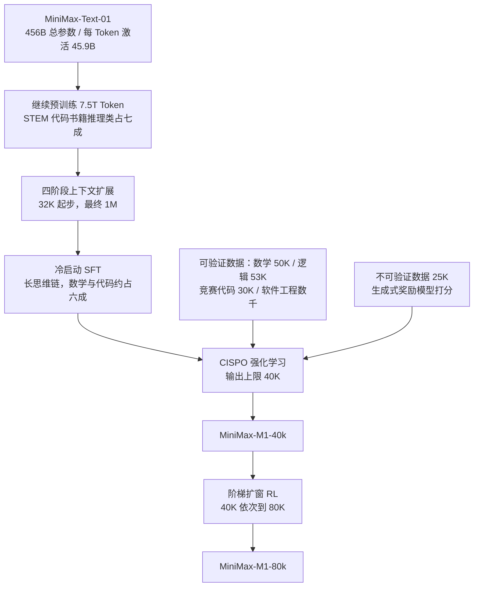
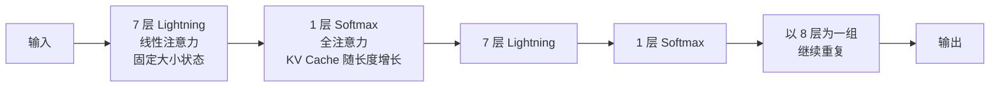
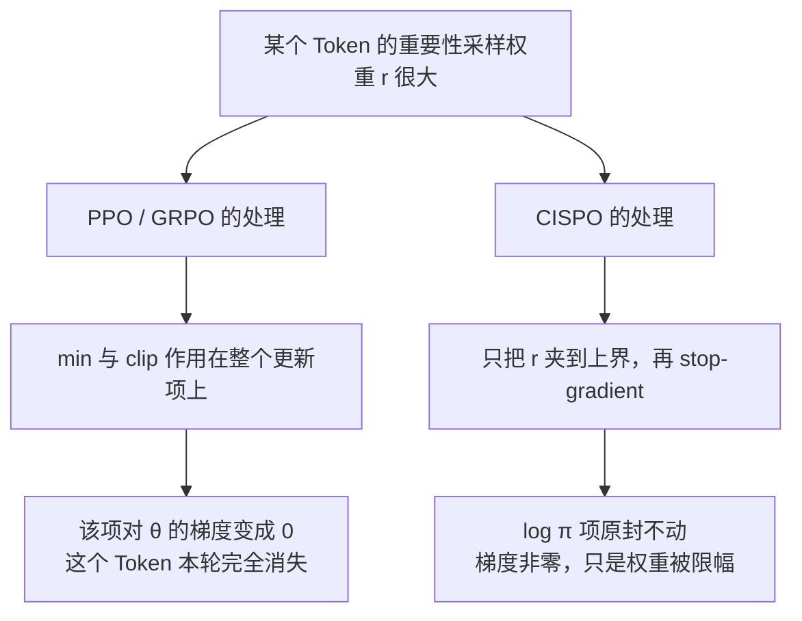
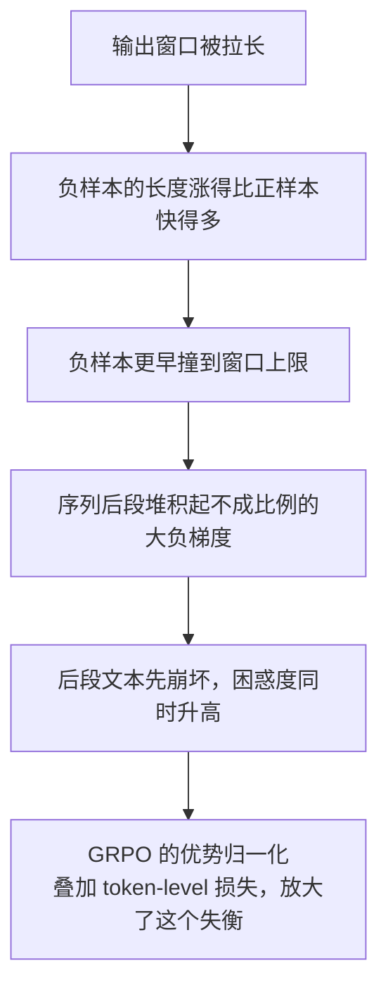
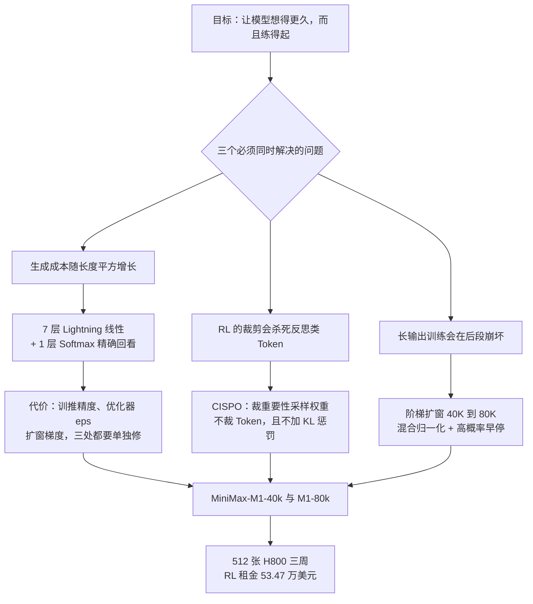

# MiniMax-M1：把“想得更久”的成本从平方压回线性，强化学习才付得起

<!-- release-date: 2025-06-16 -->

> 本文依据 MiniMax 发布的 **MiniMax-M1: Scaling Test-Time Compute Efficiently with Lightning Attention**，即 arXiv:2506.13585v1、2025-06-16 提交、共 22 页的版本（正文 p. 1–15，参考文献 p. 15–21，贡献者名单 p. 22）。截至 2026-09-05 核验，arXiv 上仍然只有 v1，官方仓库 `MiniMax-AI/MiniMax-M1` 里的 `MiniMax_M1_tech_report.pdf` 指向的也是同一篇，本地原件无需更换。下文括号里的 `PDF p. N` 指这份 22 页原文的文件页码。文中会把“报告明确写了什么”“我们如何理解它”和“外部资料补充”三层分开标注。

## 阅读前先认识五个词

这篇报告的名词密度不高，但有五个概念会反复出现。先用人话过一遍：

- **Token（词元）**：模型读写文本的最小单位。一个汉字、一个英文单词或一个标点，都可能被切成一个或多个 Token。
- **测试时计算（test-time compute）**：模型在回答问题时花掉的算力。让模型先写一长串推理过程再给答案，就是在增加测试时计算。
- **注意力（attention）**：模型判断“当前这个 Token 该重点参考前文哪些位置”的机制。标准做法叫 softmax 注意力。
- **KV Cache（Key-Value Cache，键值缓存）**：自回归生成时把已经读过的内容留下中间结果，生成下一个 Token 时不必从头重算。
- **Rollout（轨迹生成）**：强化学习里，模型按当前策略实际生成一整条回答的过程。有了这条回答才能给它打分、算梯度。

这篇报告最重要的两个自造名词是：

- **Lightning Attention（闪电注意力）**：一种线性注意力的高效实现。它不是 MiniMax-M1 提出的，M1 只是第一次把它用到大规模推理模型上。
- **CISPO（Clipped IS-weight Policy Optimization，裁剪重要性采样权重的策略优化）**：M1 提出的强化学习算法。它不裁剪 Token 的更新，而是裁剪重要性采样权重。

## 先讲矛盾：让模型“想得更久”，为什么会自己把自己拖死

### 第一笔账：想得越长，每多想一步就越贵

大推理模型（Large Reasoning Model，LRM）这条路线的核心假设很朴素：给模型更多推理长度，它就能解决更难的问题。报告开篇也是这么说的，o1、DeepSeek-R1 都是这个思路的产物。（PDF p. 2）

问题出在标准 Transformer 的注意力上。生成第 $t$ 个 Token 时，softmax 注意力要让它和前面所有 $t-1$ 个位置比一次。所以生成一条长度为 $L$ 的回答，注意力部分的总比较次数大约是：

$$
\sum_{t=1}^{L} t \;\approx\; \frac{L^2}{2}
$$

这就是报告说的“softmax 注意力固有的二次计算复杂度”。（PDF p. 2）

把它翻译成体感：让模型从写 1 万 Token 涨到写 10 万 Token，工作量不是涨 10 倍，而是接近 100 倍。**测试时计算这条 scaling 轴，被注意力的平方项按住了。**

### 第二笔账：在强化学习里，这笔账要付几千遍

推理模型的能力不是写出来的，是练出来的。报告的核心训练阶段是强化学习：模型对每道题采样一组回答，打分，更新，再采样。

报告有一句话点破了关键：在强化学习训练里，**rollout 的计算量和延迟往往才是主要瓶颈**。（PDF p. 7）

这句话值得停一下。很多人直觉上以为 RL 的成本在反向传播，其实不是。要练出“想得更久”，模型必须在训练中真的一次次生成两万、四万、八万 Token 的长回答。生成是自回归的，一个 Token 接一个 Token，没法并行。于是那条平方曲线不是在上线后才付一次，而是在训练里付几千步。

从 Figure 4 可以看到这个规模：AIME 上的平均生成长度从约 1.25 万 Token 一路涨到约 2.2 万 Token，训练跑了 4000 多步。（PDF p. 15）

所以 M1 的问题不是“怎么让推理更快”，而是：

> **如果不先把生成长度的成本曲线掰弯，长思考的强化学习根本练不起。**

### 为什么以前没人在大推理模型上换掉 softmax

线性注意力、稀疏注意力、状态空间模型（SSM）、线性 RNN 这些替代方案，学术界已经研究很多年。报告在引言里列了一长串引用，然后给出一句很关键的判断：这些方法**在大规模推理模型上还没有被充分验证**，几乎所有有竞争力的大推理模型仍然用传统注意力。唯一的例外是腾讯的 Hunyuan-T1（用 Mamba 架构），但它没有开源，公开细节也很少。（PDF p. 2）

M1 想填的正是这个空。它的贡献不是发明线性注意力，而是**第一个把线性注意力路线的大模型，真的推到了大规模推理模型的水平并开源出来**。

## 一句话先说清

MiniMax-M1 做的事情可以压成一条链：

1. 用 **7 层线性注意力 + 1 层 softmax 注意力** 的混合结构，把生成成本从接近平方压回接近线性；
2. 因此原生支持 100 万 Token 输入和 8 万 Token 输出，而且强化学习的 rollout 变得付得起；
3. 但这个不常见的架构在 RL 里制造了三个新麻烦（训推概率不一致、优化器超参敏感、扩窗时后段崩坏），报告逐个给了具体解法；
4. 再用自研的 **CISPO** 算法解决“反思类 Token 被裁掉”的问题，让长思维链真的能被训出来；
5. 最终 512 张 H800、三周、53.47 万美元租金完成完整 RL 训练。（PDF p. 1、3、5）

如果只记一句，可以记：

> **想清楚你的瓶颈到底在哪一段。M1 判断瓶颈在 rollout 的生成成本，于是把改造的第一刀砍在注意力上，而不是砍在算力采购上。**

## 全景：从 MiniMax-Text-01 到 M1-80k

这是根据报告第 2、4、5 节重画的流程示意图，不是实测时间轴。（PDF p. 4、9–12）

有两点值得先说清楚：

- **M1 不是从零训练的模型。** 它的底座是 MiniMax 上一代的 MiniMax-Text-01，M1 只做继续预训练、SFT 和强化学习。所以报告里没有基座架构的完整描述，很多细节要回到 MiniMax-01 那篇论文。
- **M1-40k 不是一个独立训练的小模型。** 报告明确说 40K 版本是 80K 训练过程中的一个中间阶段。（PDF p. 1）所以它们不是两个规模档位，而是同一条训练曲线上的两个存档点。

## 核心资产一：7 比 1 的混合注意力

### 旧问题：softmax 注意力有两个东西同时随长度长

生成一条长回答时，softmax 注意力让你付两笔钱：

- **算力**：每个新 Token 都要和全部历史比一次，累计约 $L^2/2$；
- **显存**：所有历史 Token 的 Key 和 Value 都要留在 KV Cache 里，占用随 $L$ 线性增长。

第二笔在长上下文服务里尤其致命，因为线上要同时保存很多并发请求的历史。降低 KV Cache 有很多种做法，比如 DeepSeek 的多头潜在注意力（MLA）走的是“把 KV 压成一条低秩潜向量”的路，细节见本站的 DeepSeek-V2 篇；DeepSeek 的稀疏注意力（DSA）走的是“只精读挑出来的少数位置”的路，细节见 DeepSeek-V3.2 篇。

M1 走的是**第三条路**：换掉注意力的数学形式本身。

### 线性注意力的基本想法：把括号换个位置

> 以下是**我们的解释与外部背景**，不是 M1 报告原文。M1 报告没有写出线性注意力的公式，只给了引用。

标准注意力大致是：

$$
O=\operatorname{softmax}\!\left(QK^{\top}\right)V
$$

这里 $Q,K,V$ 都是 $L\times d$ 的矩阵，$L$ 是序列长度，$d$ 是每个头的维度。中间的 $QK^{\top}$ 是一个 $L\times L$ 的大方阵——**平方项就长在这里**。

线性注意力的做法是去掉 softmax，换成一个逐行的特征映射 $\phi(\cdot)$：

$$
O=\left(\phi(Q)\,\phi(K)^{\top}\right)V
$$

去掉 softmax 之后，矩阵乘法的结合律就能用了。于是可以改成：

$$
O=\phi(Q)\left(\phi(K)^{\top}V\right)
$$

两个式子结果一样，代价完全不同：

| 括号位置 | 中间结果形状 | 计算量 |
|---|---|---|
| 先算 $\phi(Q)\phi(K)^{\top}$ | $L\times L$ | 约 $L^2 d$ |
| 先算 $\phi(K)^{\top}V$ | $d\times d$ | 约 $L d^2$ |

当 $L=100{,}000$、$d=128$ 时，前者的中间矩阵有一百亿个元素，后者只有一万六千个。**平方项被换成了和长度无关的常数项。**

对自回归生成来说，还有一个更直观的等价形式。带衰减的线性注意力可以写成一个递推：

$$
S_t=\lambda\,S_{t-1}+k_t v_t^{\top},
\qquad
o_t=q_t^{\top}S_t
$$

$S_t$ 是一个 $d\times d$ 的状态矩阵，$\lambda$ 是衰减系数。注意 $S_t$ 的大小**不随 $t$ 增长**：无论已经生成了一千个还是一百万个 Token，这一层要带的状态都是同一个 $d\times d$ 矩阵。这就是线性注意力最实在的好处——它把“越来越长的 KV Cache”换成了“固定大小的状态”。

这个递推式是示意形式，用来建立直觉。M1 报告没有给出 Lightning Attention 的确切定义，衰减的确切形式（是否分头、是否可学习）需要回到它引用的 Lightning Attention-2（arXiv:2401.04658）和 TransNormer（The devil in linear transformer，EMNLP 2022）核对。

不过，**报告确实间接确认了衰减的存在**：它在讲长上下文扩展时提到，“对于 lightning attention，靠前和靠后的层有不同的衰减率，这让靠前的层更关注局部信息”。（PDF p. 4）这句话是报告原文，后面会再用到。

### Lightning Attention 解决的是实现问题，不是数学问题

> 外部背景，来自 Lightning Attention-2 论文摘要（arXiv:2401.04658）。

线性注意力的理论优势早就写在纸上了，但在因果（causal，只能看前文）设定下，那个递推里的累加操作在 GPU 上很难高效实现，实测速度经常打不过优化良好的 softmax 注意力。Lightning Attention-2 的做法是分块（tiling）：块内用传统注意力算法，块间用线性注意力的核技巧，前向和反向都分块，并用 Triton 写成 I/O 感知的算子。它的目标是让线性注意力**在真实硬件上**也保持与序列长度无关的速度。

M1 报告对 Lightning Attention 的描述只有一句：它是“一个线性注意力变体的 I/O 感知实现”。（PDF p. 2）所以本篇不会把 Lightning Attention 的内部实现讲成 M1 的贡献。

### M1 的实际结构：每 7 个线性层后面跟 1 个 softmax 层

报告给出的结构描述也只有一句，但信息量很大。译成中文大意是：

> 在它的注意力设计中，每七个使用 lightning attention 的 transnormer block 之后，跟一个使用 softmax attention 的 transformer block。（PDF p. 2）

加上模型规模：456B 总参数，每 Token 激活 45.9B，32 个专家。（PDF p. 2）

这是根据 PDF p. 2 的文字描述重画的结构示意图，不是报告里的图。

#### 外部补充：权重仓库里的确切配置

> 以下来自 HuggingFace 权重仓库 `MiniMaxAI/MiniMax-M1-80k` 的 `config.json`，**不是报告原文**。它可以把上面那句话变成确切数字。

| 配置项 | 取值 |
|---|---|
| 层数 | 80 |
| `attn_type_list` 中 softmax 层的数量 | 10（位于第 8、16、24……80 层） |
| Hidden size | 6144 |
| 注意力头数 / head dim | 64 / 128 |
| KV 头数（softmax 层） | 8 |
| 专家数 / 每 Token 激活专家数 | 32 / 2 |
| 词表 | 200064 |

也就是说：80 层里只有 10 层会产生随长度增长的 KV Cache，另外 70 层各自只带一个固定大小的状态。**这才是“原生 100 万 Token”在显存上说得通的原因。**

#### 为什么不干脆全用线性

报告没有解释。它只给了结构，没有给混合比例的消融实验，也没有说 7 比 1 是怎么选出来的。这一点必须诚实标出来。

我们能给的只是一个合理推测（**这是我们的推断，不是报告结论**）：纯线性注意力的固定大小状态本质上是有损压缩，精确检索一个远处的具体事实是它的弱项；保留少量全注意力层，等于给模型留了一条可以逐字回看全文的通道。M1 在长上下文检索基准 OpenAI-MRCR 上的成绩（后面会讲）间接支持这个方向，但报告没有做“全线性 vs 混合”的对照实验，所以这只是解释，不是证据。

### 收益：那条 FLOPs 曲线到底是什么口径

报告的效率证据集中在 Figure 1（右）和两句正文。

正文的说法是：相比 DeepSeek R1，M1 在生成长度 64K 时消耗**不到 50%** 的 FLOPs，在 100K 时约为 **25%**。（PDF p. 2）

Figure 1（右）画的是三条曲线，纵轴单位是 $\times 10^{16}$ FLOPs，横轴是生成长度 0 到 128K。从图上读数（**这是我们的读图估计，报告没有给出数值表**）：

| 生成长度 | DeepSeek R1 | Qwen3-235B-A22B | MiniMax-M1 |
|---:|---:|---:|---:|
| 64K | 约 2.05 | 约 1.3 | 约 0.7 |
| 128K | 约 7.0 | 约 4.5 | 约 1.7 |

曲线形状比数值更重要：R1 和 Qwen3 明显上翘（平方项在起作用），M1 接近一条直线。

**这里的测量口径必须写清楚，否则很容易被读成别的意思：**

1. **这是理论 FLOPs，不是实测延迟或吞吐。** 图注原文就是 “Theoretical inference FLOPs scaling with generation length”。（PDF p. 1）报告全篇没有给出 M1 的实测 tokens/s、首 Token 延迟、显存占用或硬件配置。
2. **横轴是生成长度，不是输入长度。** 这条曲线回答的是“边想边写越来越长时成本怎么涨”，不是“喂进 100 万 Token 的 prefill 有多贵”。
3. **对比的是三个不同的模型，不是同一个模型的两种注意力。** M1 每 Token 激活 45.9B 参数（PDF p. 2）；作为对照，DeepSeek-R1 的激活参数是 37B、Qwen3-235B-A22B 是 22B（**这两个数字是外部常识，不在 M1 报告里**）。所以曲线差异里同时混了架构差异和激活参数差异。图上也能看到这个后果：在大约 24K 以下的短生成区间，M1（红线）反而在 Qwen3（橙线）**上方**，要到更长的生成长度才反超。
4. **没有 batch、并发数或硬件信息。** 所以这张图不能直接换算成部署成本。

诚实的读法是：**这张图证明的是复杂度阶数不同，不是端到端性能不同。**

### 代价与边界

- 报告没有做架构消融。没有“同一份数据、同一套训练、只换注意力”的对照，所以无法从本报告量化混合注意力单独贡献了多少。
- 报告没有给实测速度。理论 FLOPs 低不等于真实吞吐高，尤其线性注意力的算子实现本身就是难点（这正是 Lightning Attention-2 那篇论文要解决的事）。
- 报告没有讨论线性注意力的已知弱项，比如精确复制、大海捞针类任务上的表现边界。它用 MRCR 和 LongBench-v2 的成绩间接说明长上下文可用，但没有分析失败模式。
- 混合结构让训练变得更难。下一节整节都在讲这个代价。

### 可迁移启发

- **先定位瓶颈段，再决定改哪一层。** M1 的判断是“RL 的瓶颈在 rollout 生成”，所以它改注意力而不是改并行策略。如果你的瓶颈是 prefill，同样的改动收益会小很多。
- **成本曲线的阶数比常数更重要。** 短序列上线性注意力可能还更慢；只有当长度足够大，阶数优势才兑现。做技术选型时要先问“我的实际工作点在曲线的哪一段”。
- **混合是一种被低估的答案。** 不必在“全 softmax”和“全线性”之间二选一。让少数层负责精确回看、多数层负责便宜地传递信息，是一个通用的分工模式。

## 混合结构不是免费的：它在 RL 里制造了三个新麻烦

这是全篇工程价值最高的一节。报告很坦率地说，作为第一批在这种架构上做大规模 RL 的人，他们遇到了独有的问题，RL 过程会不稳定甚至直接失败。（PDF p. 5、7）

### 麻烦一：训练时的概率和推理时的概率对不上

强化学习对数值精度极其敏感。RL 的更新依赖重要性采样权重

$$
r_{i,t}(\theta)=\frac{\pi_\theta(o_{i,t}\mid q,o_{i,<t})}{\pi_{\theta_{\text{old}}}(o_{i,t}\mid q,o_{i,<t})}
$$

分母来自 rollout 时的推理引擎，分子来自训练时的前向。理论上，同一个模型、同一段文本，这两个概率应该完全相等。

M1 训练时发现两者有显著偏差，直接导致 reward 涨不上去。逐层分析后定位到根因：**输出层 LM head 上出现了高幅值激活**，这是误差的主要来源。解法是把 LM 输出头的精度提到 FP32。（PDF p. 7）

Figure 3 给出了修复前后的散点对比：修正前训练概率与推理概率的 Pearson 相关系数是 **0.987319**，修正后是 **0.997135**。正文把它概括成从约 0.9x 提到 0.99x。（PDF p. 8）

有两个细节值得注意：

- 报告特别说，**这个问题在更小的、使用 softmax 注意力的稠密模型上没有出现**。（PDF p. 7）也就是说，它是规模、架构和精度共同作用的结果，不是一个通用 bug。
- 报告说这个相关性指标在整个训练过程中保持稳定，从而让 reward 能持续上涨。（PDF p. 8）换句话说，他们把它变成了一个**常驻监控指标**，而不是修完就不管了。

这条经验的可迁移价值很高：**训练和推理是两套程序，不要默认它们数值等价。** RL 的 off-policy 修正建立在“两边算的是同一个分布”这个假设上；假设一破，整个梯度方向就带了系统性偏差。把 train/infer 概率相关性画出来，是一个便宜且有效的健康检查。

### 麻烦二：AdamW 的 epsilon 差了七个数量级

报告观察到，MiniMax-M1 训练中的梯度幅值跨度极大，从 $10^{-18}$ 到 $10^{-5}$，而且**大部分梯度小于 $10^{-14}$**；相邻迭代之间的梯度相关性还很弱。（PDF p. 8）

在这个分布下，VeRL 框架的默认配置 `betas = (0.9, 0.999)`、`eps = 1e-8` 会直接导致不收敛。（PDF p. 8）

原因不难理解（**这是我们的解释**）：AdamW 的更新大致是

$$
\Delta\theta \propto \frac{m}{\sqrt{v}+\epsilon}
$$

当梯度普遍小于 $10^{-14}$ 时，$\sqrt{v}$ 会远小于 $10^{-8}$。这时分母几乎完全由 $\epsilon$ 决定，自适应缩放失效，更新退化成一个被 $\epsilon$ 死死压住的常数比例。**这个超参不再是防除零的小保险，而变成了主导项。**

M1 的设置是 $\beta_1=0.9$、$\beta_2=0.95$、`eps=1e-15`。（PDF p. 8）$\beta_2$ 调小也和“相邻迭代梯度相关性弱”对应：二阶动量的历史窗口不该太长。

可迁移启发：**默认超参是针对某个梯度尺度调出来的。** 换了架构、换了损失、换了精度，先把梯度幅值的直方图打出来看一眼，比直接照抄框架默认值可靠得多。

### 麻烦三：长上下文扩展时的梯度爆炸

这个问题出现在继续预训练阶段。报告说，对于收敛复杂度更高的混合 lightning 架构，**过于激进地扩展训练长度会引发突然的梯度爆炸**。（PDF p. 4）

报告给出的归因很具体：靠前那些层的参数优化跟不上靠后层的变化；而对于 lightning attention，**靠前的层和靠后的层有不同的衰减率，这让靠前的层更关注局部信息**。（PDF p. 4）

把这条因果链摊开（后半段是**我们的理解**）：不同层的衰减率不同 → 靠前的层天然只看短程、靠后的层才承担长程 → 一次把训练长度拉很长，等于突然要求靠后的层处理一种它没见过的输入统计，而靠前的层提供的表示还没跟上 → 层间失配放大成梯度爆炸。

解法很朴素：**分四个阶段平滑扩展上下文长度，从 32K 起步，最终扩到 1M。**（PDF p. 4）报告没有公开这四个阶段各自的长度和 Token 数。

值得对照的一点是：长度课程（先短后长）在长上下文训练里几乎是标配，但 M1 给出的归因和常见说法不同。常见说法是“位置编码需要适应”，M1 给的是“不同层的衰减率导致的层间失配”。这是架构特有的问题，也说明**换了注意力，训练不稳定的形状也会跟着变。**

## 核心资产二：CISPO，不裁 Token，改裁重要性采样权重

### 旧问题：clip 会把“分叉词”永久踢出梯度

先把背景补齐。PPO 的目标函数是（PDF p. 5，式 1）：

$$
\mathcal{J}_{\text{PPO}}(\theta)=\mathbb{E}\left[\frac{1}{|o_i|}\sum_{t=1}^{|o_i|}\min\Big(r_{i,t}(\theta)\hat A_{i,t},\ \operatorname{clip}\big(r_{i,t}(\theta),1-\epsilon,1+\epsilon\big)\hat A_{i,t}\Big)-\beta D_{KL}(\pi_\theta\Vert\pi_{\text{ref}})\right]
$$

GRPO 去掉了价值模型，用同一道题的一组回答互相当基线（PDF p. 5，式 2）：

$$
\hat A_{i,t}=\frac{R_i-\operatorname{mean}\big(\{R_j\}_{j=1}^{G}\big)}{\operatorname{std}\big(\{R_j\}_{j=1}^{G}\big)}
$$

GRPO 的完整机制见本站的 DeepSeek-R1 篇，这里不重讲。M1 沿用了它的组相对优势，改动只发生在 clip 那一步。

M1 在混合架构上做 zero-RL（直接从基座开始 RL，不先 SFT）实验时发现，GRPO 反而损害训练效果，长思维链行为练不出来。做了一系列对照消融后，他们把主因锁定在 PPO/GRPO 那个 clip 操作上。（PDF p. 5）

具体的因果链是这样的（这一段全部是报告原文的内容，PDF p. 5）：

1. 和反思行为相关的 Token，比如 `However`、`Recheck`、`Wait`、`Aha`，在推理路径里常常充当**分叉点**；
2. 这些词在基座模型里很罕见，被赋予很低的概率；
3. 策略更新时，它们的 $r_{i,t}$ 容易变得很大（报告只陈述这个现象；**直觉上**是因为重要性采样权重的分母 $\pi_{\theta_{\text{old}}}$ 本来就很小，分子稍微一涨比值就爆）；
4. 于是它们在**第一次 on-policy 更新之后就被 clip 掉**，无法参与后续的 off-policy 梯度更新；
5. 而这些低概率 Token 恰恰对稳定熵、支撑可扩展 RL 很关键。（PDF p. 6）

用一个比喻建立直觉（**比喻只帮助理解，不是论文证据**）：一个学生偶尔会突然说“等一下，我算错了”。这句话出现频率很低，但它是这个学生学会自我纠错的种子。而 clip 的规则恰好是：凡是相对以前变化太大的行为，一律不给学分。结果就是最该被鼓励的那个新习惯，第一次冒头就被静音了。

### 为什么这个问题在 M1 上格外严重

报告提到两个放大因素：

- 这个现象**在他们的混合架构模型上特别明显**。（PDF p. 5）报告没有解释为什么架构会放大它。
- 他们的设置是**每个生成批次做 16 轮 off-policy 更新**。（PDF p. 6）轮数越多，“第一轮就被裁掉、后面 15 轮都缺席”的损失就越大。

DAPO 的做法是把上裁剪边界调高（clip-higher）。报告说，在他们这个 16 轮 off-policy 的设置下，这个办法**效果不够好**。（PDF p. 6）

### 新设计：把 clip 从更新项挪到权重上

CISPO 的推导只有两步。

第一步，回到带分布修正的 REINFORCE 目标（PDF p. 6，式 3）：

$$
\mathcal{J}_{\text{REINFORCE}}(\theta)=\mathbb{E}\left[\frac{1}{|o_i|}\sum_{t=1}^{|o_i|}\operatorname{sg}\big(r_{i,t}(\theta)\big)\,\hat A_{i,t}\,\log\pi_\theta\big(o_{i,t}\mid q,o_{i,<t}\big)\right]
$$

这里 $\operatorname{sg}(\cdot)$ 是 stop-gradient，意思是“这一项只当数值用，不回传梯度”。

第二步，把 clip 施加在这个权重上，而不是施加在整个更新项上（PDF p. 6，式 4、式 5）：

$$
\mathcal{J}_{\text{CISPO}}(\theta)=\mathbb{E}\left[\frac{1}{\sum_{i=1}^{G}|o_i|}\sum_{i=1}^{G}\sum_{t=1}^{|o_i|}\operatorname{sg}\big(\hat r_{i,t}(\theta)\big)\,\hat A_{i,t}\,\log\pi_\theta\big(o_{i,t}\mid q,o_{i,<t}\big)\right]
$$

$$
\hat r_{i,t}(\theta)=\operatorname{clip}\Big(r_{i,t}(\theta),\,1-\epsilon^{IS}_{low},\,1+\epsilon^{IS}_{high}\Big)
$$

CISPO 就是 Clipped IS-weight Policy Optimization 的缩写。（PDF p. 6）

### 为什么换个位置就完全不同

这是全文最需要讲清楚的一步。

这是根据 PDF p. 5–6 式 1、式 4、式 5 重画的机制对比图，不是报告里的图。

关键在于**梯度是从哪一项来的**：

- PPO/GRPO 里，$r_{i,t}(\theta)$ 本身带梯度。一旦被 clip 到常数区间，这一项对 $\theta$ 的导数就是 0，整个 Token 的贡献消失；
- CISPO 里，权重被 $\operatorname{sg}$ 包住，本来就不带梯度。梯度全部来自 $\log\pi_\theta$ 这一项，它永远存在。裁剪只是在**调节这个 Token 的学习权重上限**，不是把它开除。

报告把这个性质说得很直白：这个做法**保留了所有 Token 的梯度贡献，在长回答里尤其重要**。（PDF p. 7）代价是，由于权重被裁剪，式 4 的梯度是**略有偏的**。（PDF p. 7）

报告还给了一个漂亮的边界说明：如果完全不裁剪权重，CISPO 就退化成标准的策略梯度目标。（PDF p. 6）所以它不是一个全新框架，而是在策略梯度和 PPO 之间插了一档。

### 几个实现细节

- 实验中**没有对权重设下界**：把 $\epsilon^{IS}_{low}$ 设成一个很大的值使下界失效，只调 $\epsilon^{IS}_{high}$。（PDF p. 6–7）报告没有公开 $\epsilon^{IS}_{high}$ 的具体取值。
- 沿用了 DAPO 的动态采样和长度惩罚。（PDF p. 7）
- **没有 KL 惩罚项**。（PDF p. 7）
- 归一化是 token-level 的：分母是这一组所有回答的总 Token 数 $\sum_i |o_i|$，不是逐条回答先平均再求平均。

### 统一形式：把不同的裁剪策略放进同一个式子

报告顺手给了一个更一般的形式，在 CISPO 目标里插入一个 Token 级 mask（PDF p. 7，式 6、式 7）：

$$
\mathcal{J}_{\text{unify}}(\theta)=\mathbb{E}\left[\frac{1}{\sum_{i=1}^{G}|o_i|}\sum_{i=1}^{G}\sum_{t=1}^{|o_i|}\operatorname{sg}\big(\hat r_{i,t}(\theta)\big)\,\hat A_{i,t}\,\log\pi_\theta\big(o_{i,t}\mid q,o_{i,<t}\big)\,M_{i,t}\right]
$$

$$
M_{i,t}=
\begin{cases}
0, & \hat A_{i,t}>0,\ r_{i,t}(\theta)>1+\epsilon_{\text{high}},\\
0, & \hat A_{i,t}<0,\ r_{i,t}(\theta)<1-\epsilon_{\text{low}},\\
1, & \text{otherwise}.
\end{cases}
$$

报告指出，这个 mask 等价于 PPO 信任域隐含定义的那个 mask。（PDF p. 7）

值得读懂这个式子在说什么：PPO 的 clip 之所以让梯度消失，本质上就是在**优势为正且权重过大**、或者**优势为负且权重过小**的时候，把这个 Token 的梯度直接置零。写成 mask 之后，“裁多少”和“扔不扔”被拆成了两个独立旋钮。CISPO 是 $M\equiv 1$ 的特例。

这是一个很好的表达方式练习：**把几个看起来不同的算法写进同一个式子，差异就退化成超参数。** 这既方便消融，也让人更容易看清每个设计到底改了什么。

### 收益：Figure 2 的口径要看清楚

报告用一个受控实验验证 CISPO：在 Qwen2.5-32B-base 上，用 DAPO 论文的数学推理数据集做 zero-RL，分别跑 GRPO、DAPO、CISPO，在 AIME 2024 上看 avg@32。（PDF p. 7）

从 Figure 2 读数（**读图估计**，PDF p. 6）：

| 算法 | 约 500 步 | 约 960 步 | 约 1470 步（终点） |
|---|---:|---:|---:|
| GRPO | 约 20.5 | 约 22.5 | 约 23.5 |
| DAPO | 约 24 | 约 34.5 | 约 34 |
| CISPO | 约 34.5 | 约 41 | 约 38.3 |

图上那个 “2x speedup” 箭头，指的就是：CISPO 在约 500 步达到的分数，DAPO 要到约 960 步才达到。报告的表述是“用 50% 的训练步数达到与 DAPO 相当的性能”。（PDF p. 6–7）

**这个结论的适用范围必须说清楚：**

1. **实验对象是 Qwen2.5-32B-base，不是 M1 自己。** 报告没有在 M1 的混合架构上给出 CISPO 与 GRPO/DAPO 的对照曲线，尽管“GRPO 在混合架构上练不出长思维链”正是 CISPO 的起因。
2. **只有一个基准（AIME 2024）、一条曲线。** 没有多种子重复，没有误差带。
3. **曲线波动很大。** CISPO 在约 1030 步冲到约 44.5，终点却回落到约 38.3。用峰值和用终点得到的结论不一样。
4. **“2x 加速”指的是训练步数，不是 wall-clock 时间。** 不同算法每步的成本未必相同（比如动态采样会改变每步实际生成量）。

所以稳妥的读法是：**在这个特定设置下，CISPO 的样本效率明显好于 DAPO 和 GRPO。** 这足以支持它被采用，但不足以支撑“CISPO 普遍优于 DAPO”这种断言。

### 代价与可迁移启发

代价：

- 梯度有偏，报告自己承认（PDF p. 7）；
- 没有 KL 惩罚项，意味着约束策略不跑偏这件事完全交给了权重裁剪和优势归一化；
- 只调上界、不设下界，相当于对“概率下跌很多”的 Token 不做限制，报告没有分析这带来什么风险。

可迁移启发：

- **想稳住训练，先想清楚你是要限幅还是要丢弃。** 限幅是“这条样本影响力不超过某个值”，丢弃是“这条样本本轮不存在”。两者在数学上完全不同，但很多实现把它们混为一谈。
- **stop-gradient 的位置就是设计。** 把一个量包进 $\operatorname{sg}$，等于宣布“它只是个系数，不是被优化的对象”。很多算法差异其实就是 $\operatorname{sg}$ 画在哪。
- **最该被学习的行为往往最罕见。** 任何按“变化幅度”做过滤的机制，都天然歧视稀有事件。设计正则或裁剪时，先问一句：我会不会正好把想要的东西滤掉？

## 从 40K 到 80K：把“想得更久”真的练出来

第一轮 RL 的输出长度上限是 40K。报告接着把它扩到 80K，得到 MiniMax-M1-80k。（PDF p. 11）

### 先换数据，再拉长度

扩窗之前先用已经练好的 40K 模型筛数据（PDF p. 12）：

- 评估在现有数据集上的通过率，**去掉已经很容易解出的样本**；
- 调整分布，向更难的数学和代码题倾斜；
- **下采样合成推理数据**——因为观察到它会让长上下文 RL 不稳定，这类数据生成的输出常常变得重复和同质化。

最后一条很有意思。合成数据在造 RL 题目时非常好用（M1 自己的 53K 逻辑数据就全是合成的），但报告发现它在**长输出**场景下会把模型带向重复模式。这是一个具体、有代价的观察，比泛泛的“合成数据有风险”有用得多。

### 阶梯扩窗，以及两个转段判据

长度不是一步拉到 80K，而是走 **40K → 48K → 56K → 64K → 72K → 80K** 六档。（PDF p. 12）

什么时候进下一档？报告给了两个经验指标：

1. 生成序列上的**困惑度已经收敛**；
2. 输出长度的 **99 分位是否正在逼近当前窗口上限**。

第二个指标特别值得记：它不是在问“平均输出多长”，而是在问“最长的那一小撮样本是不是已经顶到天花板了”。**如果 99 分位还远离上限，说明模型还没有用满当前预算，扩窗没意义；如果已经贴上去了，说明窗口正在成为约束，该放宽了。**

这是一个可以直接搬走的做法：**扩容的时机应该由分布的尾部决定，不是由均值决定。**

### 后段崩坏：一条完整的因果链

扩窗过程中出现了一个具体故障：每个长度档训练到后期，模型会出现 pattern collapse——**生成序列的后半段退化成不连贯或乱码文本**，同时困惑度上升。（PDF p. 12）

报告给出的根因分析很漂亮：

这是根据 PDF p. 12 的文字描述重画的因果链示意图。

把它讲透（中间的机制解释是**我们的补充理解**）：一条答错的长回答，往往是模型陷入了绕圈或重复，所以它会一直写到撞上限；一条答对的回答通常写完就停了。于是在序列的靠后位置上，样本几乎全是负优势的。token-level 损失又让每个 Token 权重相同，长的负样本自然贡献了更多负梯度项。模型学到的结论就变成了：**靠后的位置不管写什么都是错的。** 于是它先在那里崩掉。

三个修复（PDF p. 12）：

1. **检测重复模式并早停**，防止重复回答吃光上下文窗口；
2. **把 sample-level 损失和 token-level 归一化结合起来**，缓解正负样本失衡；
3. **同时调小梯度裁剪阈值和 $\epsilon^{IS}_{high}$**。

第二条值得单独看一眼。纯 token-level 归一化让长回答自动拥有更大话语权，纯 sample-level 归一化让每条回答权重相同。在正负样本长度系统性不同的场景里，前者会把偏差直接放大。报告的做法是两者结合，但没有公开具体的结合方式和系数。

### 早停规则：用概率而不是字符串来抓重复

第 3 节里还有一条独立但相关的规则。报告说，复杂提示会诱发病态的超长重复回答，这些回答的大梯度威胁模型稳定性。目标是**提前掐断生成循环，而不是事后惩罚已经写出来的重复文本**。（PDF p. 8）

简单的字符串匹配对付不了变化多端的重复模式，所以他们用了一个基于 Token 概率的启发式规则：一旦模型进入重复循环，每个 Token 的概率都会飙升。于是规则是：

> **如果连续 3000 个 Token 的概率都高于 0.99，就停止生成。**（PDF p. 8）

报告说这既避免了不稳定，也通过消除这些长尾病例提升了生成吞吐。

这个设计很值得学：**用模型自己的置信度当作行为异常的探针，比在输出文本上做模式匹配鲁棒得多。** 它不依赖具体的重复形式，也不需要维护规则表。

## RL 数据：四类可验证 + 一类不可验证

报告把 RL 环境分成两大类：规则可验证的，和需要奖励模型判断的。（PDF p. 8）

### 可验证的四类

| 类型 | 规模 | 关键做法 | 奖励 |
|---|---|---|---|
| 数学 | 约 50K | 去重、与 SFT 数据严格隔离、n-gram + embedding 去污染、多选改开放题、过滤证明题与判断题 | 规则判正确 + 格式奖励 |
| 逻辑 | 约 53K | SynLogic 框架合成，41 个任务（密码、数独等），每个任务配生成器和验证器 | 规则判正确 + 格式奖励 |
| 竞赛编程 | 30K | 从 online judge 采集；缺测试用例的题用 MiniMax-Text-01 生成测试套件 | 规则判正确 + 格式奖励 |
| 软件工程 | 数千 | 基于真实 GitHub issue 和 PR 构建容器化沙箱，可真正执行代码 | 测试通过为正；编译错误、运行失败、测试回归为零或负 |

（PDF p. 9–10）

**贯穿这四类的是同一个套路：难度窗口。**

- 数学：用一个强推理模型算 pass@10，只保留通过率**严格介于 0 和 0.9 之间**的题；
- 逻辑：上界是当前强推理模型的 pass@10 大于零（太难的不要），下界是 MiniMax-Text-01 通过率介于 0 和 0.5 之间的最低难度参数（太简单的不要）；训练后期再调高难度；
- 竞赛编程：同样用采样通过率筛掉过难和过易的题。

（PDF p. 9）

为什么必须这样做（**这是我们的解释**）：GRPO 系算法的优势来自组内相对比较。如果一道题全组都对，或者全组都错，组内标准差趋近于零，优势信号也就消失了，这条数据白跑一次昂贵的 rollout。**难度窗口本质上是在保证每条训练数据都能产生非零梯度。**

另外两个细节值得记：

- **RL 数据与 SFT 数据严格隔离**。报告给的理由是：SFT 阶段的泄漏会进入 RL 阶段，阻碍探索并削弱训练效果。（PDF p. 9）这比一般的“防过拟合”说法更具体——它说的是探索质量，不是测试集干净度。
- **奖励必须判得准，题型就得先改造。** 报告过滤掉含多个子问题的样本、证明题，以及判断题（因为判断题容易被随机猜中）；多选题则统一改写成开放式问答。（PDF p. 9）随机猜也能拿奖励的题目，会给策略优化注入噪声。

### 不可验证的一类：25K 样本与生成式奖励模型

这部分共 25K 复杂样本，又分两小类（PDF p. 10）：

**有标准答案但规则判不了的**（主要是 STEM 和事实类，答案客观但表达方式多样）：用生成式奖励模型（Generative Reward Model，GenRM）当验证器，采用五级评分。为了确认 GenRM 靠谱，他们建了一个人工标注的奖励模型基准，并用另一个指标交叉验证——比较 GenRM 选出的 Best-of-N 与 pass@N 之间的差距。

这个验证方法值得单独指出：**用 BoN 与 pass@N 的差距来衡量评分器，比只看评分准确率更贴近它的实际用途。** pass@N 是“N 条里存在正确答案”的上界，BoN 是“评分器真的把正确答案挑出来了”。两者的差就是评分器的损耗。

**没有标准答案的**（指令遵循、创意写作等）：为每个 query 配一个参考答案，训练时做成对比较，输出 -1 / 0 / 1 三档，表示比参考答案差、相当、好。带约束的指令遵循任务同时用规则奖励判断约束是否满足，用模型奖励判断质量。为了降低偏见，训练数据还用了多人盲评一致性、位置互换一致性等方法，并用瑞士轮（Swiss Round）打分挑出最合适的参考答案。（PDF p. 10–11）

### 长度偏见：把它当成必须在线监控的东西

这是报告里对奖励模型最有价值的一段。（PDF p. 11）

问题：GenRM **偏好更长的输出**，哪怕更简洁的答案实际更好。这会误导策略优化，鼓励模型说废话，并诱发 reward hacking。

他们先试了三种标准的离线办法：

1. 训练数据涵盖多种长度、来源和质量档次；
2. 加入对抗样本暴露弱点；
3. 改进模型架构。

结果是：**纯离线的评估和预防经常无法阻止 RL 训练中真的出现长度偏见。**（PDF p. 11）

于是核心策略改成在线：训练中持续监控长度偏见，设置专门指标检测“策略是否在不提升任务成功率和推理深度的前提下、单纯拉长输出以最大化奖励”；一旦检测到这种行为，**立刻触发 GenRM 重新校准**。配套还用了奖励整形、数值裁剪和归一化，让奖励信号对长度这类表面特征不敏感。

这一段的启发很通用：

> **奖励模型的偏差不是一个可以在上线前一次性修完的问题，而是一个必须常驻监控的运行时问题。** 因为策略会主动去找评分器的漏洞，而它找漏洞的能力会随训练变强。

M1 的做法本质上是把评分器和策略当成一对博弈方，用监控闭环代替一次性修复。报告没有公开那些检测指标的具体定义和校准流程。

### 课程：先可验证，再逐步混入通用任务

单一策略既要擅长推理密集任务、又要擅长通用任务，是个矛盾。M1 的做法是精心安排的课程和动态加权：**先只用规则奖励的推理密集任务，再逐步混入通用领域任务。**（PDF p. 11）

报告说这样能让模型学会按语境选择推理方式——可验证问题用严格的分步推导，通用问题用更灵活的生成，同时避免专项技能被灾难性遗忘。报告没有给出混合比例的具体曲线，也没有给出这个课程与“一开始就混合”的对照实验。

## 训练前的两步：继续预训练与 SFT

### 继续预训练：7.5T Token

（PDF p. 4）

数据侧的动作：

- 改进网页和 PDF 的解析机制，加强启发式清洗规则，保证数学和代码数据的高召回；
- 优先从网页、论坛、教科书中抽取**自然的问答对**，并且**严格避免使用合成数据**；
- 对问答数据做语义去重；
- 把 STEM、代码、书籍和推理相关数据的比例提高到 **70%**。

训练侧的动作：

- **调小 MoE 辅助损失的系数**，并调整并行策略以支持更大的训练 micro batch size，从而减轻辅助损失对模型性能的负面影响；
- 学习率先以 **8e-5** 恒定跑 2.5T Token，再在 5T Token 上衰减到 **8e-6**。

有两点值得单独说：

**“严格避免合成数据”是一个反主流的选择。** 在 2025 年前后，用强模型合成高质量语料几乎是标配。报告没有给出这个决定的实验依据，只说要保证多样性和唯一性。结合后面“合成推理数据会让长上下文 RL 不稳定”的观察（PDF p. 12），可以看出 MiniMax 对合成数据的整体态度偏保守，但报告没有把这两件事联系起来论证。

**调小 MoE 辅助损失系数这条，和 DeepSeek 的思路方向一致。** 辅助损失是为了防止专家路由塌缩，但它本身会与语言建模目标竞争。DeepSeek-V3 的做法是干脆改用无辅助损失的偏置控制器，细节见本站的 DeepSeek-V3 篇；M1 的做法更保守——不换机制，只调小系数，并靠更大的 micro batch 让负载统计更稳。报告没有给出调整前后的对照数据。

### SFT：冷启动，只做一件事

SFT 的目标非常克制：用高质量样本注入带反思的长思维链行为，为下一阶段的 RL 提供一个更高效、更稳定的起点。（PDF p. 4）

数据覆盖数学、代码、STEM、写作、问答和多轮对话，**数学和代码约占 60%**。报告没有公开 SFT 的数据量、训练步数或超参。

## 成本账：53.47 万美元买到的是哪一段

报告在摘要、引言、第 3 节和结论里反复强调同一组数字：**512 张 H800，三周，完整 RL 训练，租金约 53.47 万美元（约 0.53M 美元）。**（PDF p. 1、3、5、15）

把它换算一下（**这是我们的算术，报告没有给这个中间量**）：

$$
512\ \text{GPU} \times 21\ \text{days} \times 24\ \text{h} = 258{,}048\ \text{GPU-hours}
$$

$$
\frac{534{,}700}{258{,}048}\approx 2.07\ \text{USD per GPU-hour}
$$

也就是约 25.8 万 GPU 小时，折合每 GPU 小时约 2.07 美元。这个单价对 H800 租赁市场是合理的，说明这个成本数字是按公开租赁价折算的，而不是自建集群的摊销成本。

**这个数字的口径边界必须说清楚：**

- 它**只覆盖 RL 阶段**。7.5T Token 的继续预训练、SFT，以及底座 MiniMax-Text-01 本身的训练成本都不在内。
- 它是**租金折算**，不含数据构建、沙箱基础设施、奖励模型训练和失败的实验。
- 报告没有给出 GPU 小时数或单价，上面的换算是我们从 512、三周和 53.47 万美元反推的。

所以正确的说法是“M1 的强化学习阶段花了约 53.47 万美元租金”，不是“M1 总共只花了 53 万美元”。这和 DeepSeek-R1 报告里 29.4 万美元的口径问题是同一类，细节见本站的 DeepSeek-R1 篇。

即便如此，这个数字仍然很有意义：**它说明一旦架构把 rollout 成本压下来，长思考 RL 的边际成本可以低到一个中型团队负担得起的量级。** 这才是这条数字真正的信息价值。

## 评测：哪些结论有证据，哪些要打问号

### 评测设置先看清

所有任务用温度 1.0、top-p 0.95 采样。AIME 采样 32 次取平均通过率，GPQA-Diamond 同样 32 次，LiveCodeBench 和 FullStackBench 取 16 次平均。（PDF p. 12）

几个关键 harness：

- **SWE-bench Verified**：用 Agentless scaffold，但改成两阶段定位（先粗粒度定位文件，再细粒度定位到具体文件和代码元素），**不使用任何基于 embedding 的检索**。（PDF p. 13）
- **TAU-bench**：用 GPT-4.1 当用户模型，一个通用系统提示，不加任何自定义工具，最多 40 轮交互。（PDF p. 14）
- **LongBench-v2**：503 道多选题，上下文从 8k 词到 2M 词。（PDF p. 13）
- **MultiChallenge**：由 GPT-4o 判分。（PDF p. 14）
- **HLE**：不使用外部工具；表中带 `*` 的成绩是在纯文本子集上测的。（PDF p. 13）

这些设置不是脚注，它们直接决定分数。同一个模型换一套 scaffold，SWE-bench 成绩可以差十几个点。

### 主表怎么读

Table 2 的关键行摘录如下（PDF p. 13）：

| 任务 | DeepSeek-R1 | DeepSeek-R1-0528 | Qwen3-235B-A22B | M1-40k | M1-80k |
|---|---:|---:|---:|---:|---:|
| AIME 2024 | 79.8 | 91.4 | 85.7 | 83.3 | 86.0 |
| AIME 2025 | 70.0 | 87.5 | 81.5 | 74.6 | 76.9 |
| LiveCodeBench | 55.9 | 73.1 | 65.9 | 62.3 | 65.0 |
| FullStackBench | 70.1 | 69.4 | 62.9 | 67.6 | 68.3 |
| GPQA Diamond | 71.5 | 81.0 | 71.1 | 69.2 | 70.0 |
| SWE-bench Verified | 49.2 | 57.6 | 34.4 | 55.6 | 56.0 |
| OpenAI-MRCR (128k) | 35.8 | 51.5 | 27.7 | 76.1 | 73.4 |
| LongBench-v2 | 58.3 | 52.1 | 50.1 | 61.0 | 61.5 |
| TAU-bench (airline) | — | 53.5 | 34.7 | 60.0 | 62.0 |
| TAU-bench (retail) | — | 63.9 | 58.6 | 67.8 | 63.5 |
| SimpleQA | 30.1 | 27.8 | 11.0 | 17.9 | 18.5 |

对比闭源模型的几个参照点（同表）：OpenAI-o3 的 SWE-bench Verified 69.1、MRCR(128k) 56.5；Gemini 2.5 Pro 的 MRCR(128k) 76.8、MRCR(1M) 58.8；Claude 4 Opus 的 SWE-bench Verified 72.5。M1-80k 的 MRCR(1M) 是 56.2，M1-40k 是 58.6。

这张表可以读出四条互相独立的结论：

**第一，数学和竞赛编程不是 M1 的强项。** 它明显落后 DeepSeek-R1-0528，部分项目也落后 Qwen3-235B。报告自己写得很直白：相比最新的 R1-0528，M1 在数学和编程竞赛上落后。（PDF p. 3）

**第二，长上下文是最硬的证据。** MRCR(128k) 上 M1-40k 的 76.1 与 M1-80k 的 73.4，都远高于所有开源模型（次高是 R1-0528 的 51.5），也高于 o3 的 56.5 和 Claude 4 Opus 的 48.9，只略低于 Gemini 2.5 Pro 的 76.8。这一项是直接检验“能不能在长文里找到并区分相似内容”的，和 M1 的架构主张最直接对应。**这是全篇最能支撑架构叙事的一个结果。**

**第三，软件工程和工具使用的收益来自 RL 环境，不只是架构。** SWE-bench Verified 上 M1 的 55.6/56.0 大幅超过 Qwen3-235B 的 34.4，接近 R1-0528 的 57.6。报告把它归因于执行式的软件工程 RL 环境。（PDF p. 14）TAU-bench 上 M1-40k 超过了 Gemini 2.5 Pro。

**第四，事实性是明显短板。** SimpleQA 上 M1 的 17.9/18.5 低于 DeepSeek-R1 的 30.1，报告自己也承认这一点。（PDF p. 14）报告没有分析原因。一个常见解释是事实性主要取决于预训练语料的覆盖，架构和推理长度帮不上忙，但这只是**我们的推断**，本报告没有给出证据。

### 一个反直觉的现象：更长不总是更好

Table 2 里，M1-80k 并非全面优于 M1-40k：

- MRCR(128k)：40k 是 76.1，80k 是 73.4；
- MRCR(1M)：40k 是 58.6，80k 是 56.2；
- TAU-bench retail：40k 是 67.8，80k 是 63.5；
- MultiChallenge：两者都是 44.7。

报告的表述是“MiniMax-M1-80k 在大多数基准上持续优于 MiniMax-M1-40k”（PDF p. 14），这在字面上成立，但**长上下文和部分工具使用任务上是反过来的**，报告没有讨论这几处回退。

一个合理的推测（**这是我们的推断，报告未提供解释**）：80K 阶段的 RL 数据被刻意向困难数学和代码题倾斜（PDF p. 12），长上下文检索类能力在那个阶段没有被继续优化，甚至可能被挤占。这提醒我们：**扩大思考预算是有机会成本的，它不是一个只增不减的开关。**

### 三处需要标出的口径问题

**一、Figure 4 的终点和正文对不上。** 正文说 AIME 2024 的准确率“从 68% 大幅提升到 80%”（PDF p. 14），但 Figure 4 左图的曲线从约 68.3 起步，终点落在约 85–86（PDF p. 15），与 Table 2 里 M1-80k 的 86.0 一致。报告没有解释这个差异。可能是正文写的是某个中间阶段，也可能只是笔误，但**不能两个数字都当成同一件事的结论**。

**二、Figure 1（左）的 TAU-bench 是两个子集的平均。** 图上 M1 的 TAU-bench 标注是 62.8，而 Table 2 给的是 airline 62.0 和 retail 63.5，平均正好约 62.75。（PDF p. 1、13）图上的 MRCR (4-needle) 73.4 对应的是 Table 2 里的 OpenAI-MRCR (128k)。看图时要知道这两个换算，否则会以为存在第三组数字。

**三、HLE 的对比不是同一口径。** 表里所有开源模型和 M1 自己的 HLE 成绩都带 `*`——DeepSeek-R1 是 8.6、R1-0528 是 17.7、Qwen3-235B 是 7.6、M1-40k 是 7.2、M1-80k 是 8.4，星号表示这些是在**纯文本子集**上测的；而 o3 的 20.3、Gemini 2.5 Pro 的 21.6、Claude 4 Opus 的 10.7、Seed-Thinking-v1.5 的 8.2 没有星号。（PDF p. 13）跨星号比较要谨慎。

### RL scaling 的证据

Figure 4 给了三条训练曲线（AIME 2024、AIME 2025、LiveCodeBench v5），每条都同时画准确率和生成长度。（PDF p. 15）三条曲线上，准确率和生成长度确实同步上升，AIME 和 LiveCodeBench 的平均生成长度都超过 2 万 Token。（PDF p. 14）

这个证据支持“更长的推理带来更好的性能”这个相关性，但它**不是因果实验**：报告没有做“固定训练步数、只改生成长度上限”的对照。生成变长和分数变高都是同一段训练的产物。

## 报告没有告诉我们的事

这是一篇 15 页正文的技术报告，比同期同类报告短得多。它公开的部分很扎实，但缺口也很明确：

**架构层面：**

- Lightning Attention 的确切定义、衰减机制、头数与状态维度，一个公式都没有；
- 7 比 1 这个混合比例的来源、消融和替代方案；
- MoE 的路由方式和辅助损失的具体形式，报告只说了“调小系数”；每 Token 激活几个专家也没写（权重仓库的 config 显示是 top-2，但那是外部信息）；
- 层数、hidden size、注意力头数等基本配置（本篇的这些数字全部来自权重仓库的 `config.json`，不是报告）。

**效率层面：**

- 任何实测数据：吞吐、延迟、显存占用、硬件与并发设置；
- Figure 1（右）那三条理论曲线的计算方法与假设；
- 训练侧的并行策略、通信优化、算子实现——这部分基本全部交给了 MiniMax-01 那篇论文。

**算法与训练层面：**

- $\epsilon^{IS}_{high}$、组大小 $G$、RL 的学习率、batch size、每步 rollout 条数；
- CISPO 在 M1 自己架构上的对照实验（现有的对照只在 Qwen2.5-32B-base 上做过）；
- 四阶段上下文扩展各阶段的长度和 Token 数；
- 通用任务课程的混合比例曲线，以及它与“一开始就混合”的对照；
- GenRM 长度偏见的检测指标定义和校准流程；
- sample-level 与 token-level 归一化的结合方式。

**评测与其他：**

- 完全没有安全性评测章节；
- 没有“报告自己承认的限制”这一节。M1 报告的结论部分只谈前景，不谈边界，这一点和 DeepSeek 系列报告有明显差别；
- 没有多语言、多模态相关内容。

**必须说清的一点是：这些缺口不都是隐瞒。** M1 是在 MiniMax-Text-01 之上做的继续训练，架构和 infra 细节本来就写在 MiniMax-01 那篇论文里。但对只读这一篇的读者来说，结果就是**这份报告能让你理解 M1 的训练故事，不足以让你复现 M1 的架构**。

## 最值得带回自己项目的六条

### 1. 先证明瓶颈在哪一段，再决定动哪一刀

M1 的全部架构选择都建立在一个判断上：RL 训练的瓶颈是 rollout 的生成成本。（PDF p. 7）这个判断成立，换注意力才是高回报的动作。如果瓶颈在数据、在奖励质量、在 prefill，同样的改动收益会小得多。

### 2. 混合优于二选一

7 层线性 + 1 层 softmax，不是妥协，而是让不同层承担不同职责。少数层负责精确回看，多数层负责便宜地传递信息。这个模式可以推广到很多“精确但贵”与“粗糙但便宜”并存的场景。

### 3. 换了架构，就要重新体检一遍数值

训推概率相关性、梯度幅值分布、优化器 epsilon——这三条在稠密 softmax 模型上都是不用管的默认项，换到混合架构上全部失效。（PDF p. 7–8）**换架构不只是换 forward，它会把一整套隐含的数值假设一起换掉。**

### 4. 限幅和丢弃是两件事

CISPO 的全部创新就是把 clip 从更新项挪到重要性采样权重上，让梯度不再归零。（PDF p. 6）任何时候你写下一个裁剪、过滤或阈值，都值得问一句：我是在**降低这个样本的权重**，还是在**让它彻底消失**？

### 5. 扩容时机看尾部，不看均值

用输出长度的 99 分位是否逼近窗口上限来决定何时扩窗。（PDF p. 12）这个判据比“平均长度到了多少”精确得多，可以直接搬到任何资源扩容的决策里。

### 6. 评分器的偏差要在线治，不能只在线下治

离线的数据多样化、对抗样本和架构改进，都挡不住 RL 训练中真的出现长度偏见。（PDF p. 11）策略会主动去找评分器的漏洞，而且找漏洞的能力随训练变强。**把奖励模型当成需要持续校准的运行时组件，而不是一个训练好就冻结的模块。**

## 用一张图重新串起全文

## 关键词回看

- **Lightning Attention**：线性注意力的 I/O 感知高效实现。M1 使用它，但没有在报告里定义它。
- **Transnormer block**：M1 用来承载 lightning attention 的层类型，出自 The devil in linear transformer。
- **混合注意力（hybrid attention）**：每 7 个线性注意力层后面跟 1 个 softmax 注意力层。（PDF p. 2）
- **测试时计算（test-time compute）**：模型回答时花掉的算力，被当作独立于参数量和数据量的新 scaling 轴。
- **重要性采样权重（IS weight）**：新旧策略在同一个 Token 上的概率之比，用来修正 off-policy 更新。
- **CISPO**：裁剪重要性采样权重、而不是裁剪 Token 更新的策略优化算法。（PDF p. 6）
- **stop-gradient**：把某个量标成“只当数值、不回传梯度”，CISPO 的关键就在这个标记的位置。
- **阶梯扩窗（staged window expansion）**：输出长度从 40K 分六档逐步扩到 80K。（PDF p. 12）
- **Pattern collapse**：扩窗训练后期，生成序列后半段退化成乱码的现象。（PDF p. 12）
- **GenRM（生成式奖励模型）**：先推理再给判断的奖励模型，用于规则判不了的任务。
- **长度偏见（length bias）**：奖励模型系统性偏好更长输出，会诱发 reward hacking。（PDF p. 11）
- **难度窗口**：只保留通过率既不为 0 也不接近 1 的训练样本，保证组内比较能产生非零梯度。

## 最后的判断

MiniMax-M1 的价值不在于它拿了多少第一。事实上它在数学和竞赛编程上明显落后于同期最强的开源模型。

它真正的贡献是**把一条一直停留在论文里的路线，第一次跑到了大规模推理模型的水平并开源出来**。在这之前，线性注意力在大推理模型上有没有用，是一个只能猜的问题；M1 之后，至少有了一个可以被检验的公开样本。

被实验支持的结论：

- 混合注意力模型可以在长上下文理解上明显领先同期开源模型（MRCR、LongBench-v2）；
- 执行式的软件工程 RL 环境能显著提升 SWE-bench 成绩；
- 在 Qwen2.5-32B-base 这个设置下，CISPO 的样本效率优于 DAPO 和 GRPO；
- 长思考的 RL 训练在这套方案下可以用 53 万美元量级的 RL 租金完成。

只是作者观察、没有对照实验的：

- 7 比 1 这个混合比例是好的；
- 严格避免合成数据对预训练更好；
- 课程式地先可验证再通用，优于一开始就混合。

完全没有公开的：

- Lightning Attention 的机制细节、MoE 配置、实测效率数据、大部分 RL 超参，以及任何安全性评测。

如果只记一句话，可以记：

> **不要把“想得更久”当成一个可以随手打开的推理开关。它是一条要用架构、算法、数值和课程一起买单的 scaling 轴；哪一环没付钱，它就在哪一环崩给你看。**

## 资料与阅读边界

- 原始依据：本地 `papers/MiniMax/MiniMax-M1.pdf`，即 arXiv:2506.13585v1，2025-06-16 提交，共 22 页。截至 2026-09-05 核验，arXiv 上没有 v2 或更新的修订版。
- 官方发布说明：[MiniMax-M1, the World's First Open-Source, Large-Scale, Hybrid-Attention Reasoning Model](https://www.minimax.io/news/minimaxm1)，页面标注日期 06.16.2025，同时宣布在 MiniMax APP 与 Web 免费开放、提供 API，并在 Hugging Face 与 GitHub 放出权重。本文的 `release-date` 取这一天。
- 官方仓库：[MiniMax-AI/MiniMax-M1](https://github.com/MiniMax-AI/MiniMax-M1)，Apache-2.0 许可，含 `MiniMax_M1_tech_report.pdf`。
- 权重仓库：[MiniMaxAI/MiniMax-M1-80k](https://huggingface.co/MiniMaxAI/MiniMax-M1-80k)。本文“外部补充：权重仓库里的确切配置”一节的层数、隐藏维度、专家数等数字全部来自该仓库的 `config.json`，**不是报告原文**；读取时应以具体 commit 为准。
- 线性注意力实现背景：[Lightning Attention-2: A Free Lunch for Handling Unlimited Sequence Lengths in Large Language Models](https://arxiv.org/abs/2401.04658)（arXiv:2401.04658）。本文关于分块实现的描述来自这篇论文，不是 M1 报告的内容。
- 基座模型与架构细节：[MiniMax-01: Scaling Foundation Models with Lightning Attention](https://arxiv.org/abs/2501.08313)（arXiv:2501.08313）。M1 的 456B 总参数、45.9B 激活、32 专家与 1M 上下文都继承自这一代，M1 报告本身没有重述架构细节。
- 报告引用的其他关键论文编号（均已按 PDF 参考文献页核对）：TransNormer 为 The devil in linear transformer，EMNLP 2022（PDF p. 19）；GRPO 出自 DeepSeekMath，arXiv:2402.03300（PDF p. 20）；DAPO 为 arXiv:2503.14476（PDF p. 21）；SynLogic 为 arXiv:2505.19641（PDF p. 17）。
- 本文中标注为“我们的解释”“我们的推断”“读图估计”的内容，都不是报告结论。线性注意力的两个公式、AdamW epsilon 失效的机制分析、后段崩坏的中间推理、GPU 小时换算，以及对 M1-80k 在长上下文上不如 M1-40k 的猜测，均属此类。
