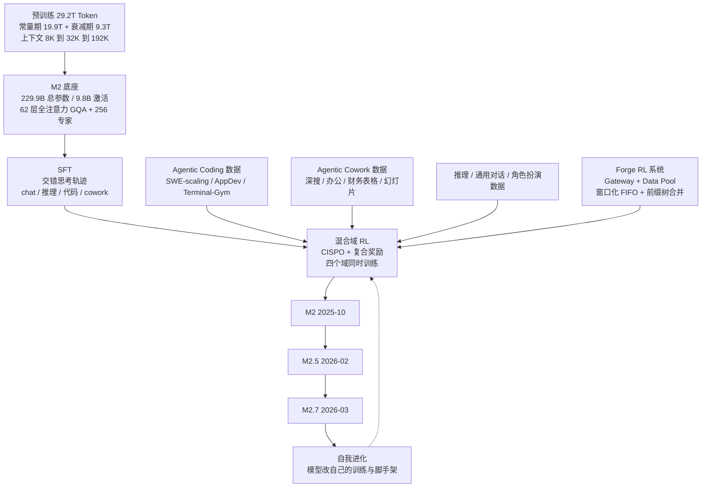
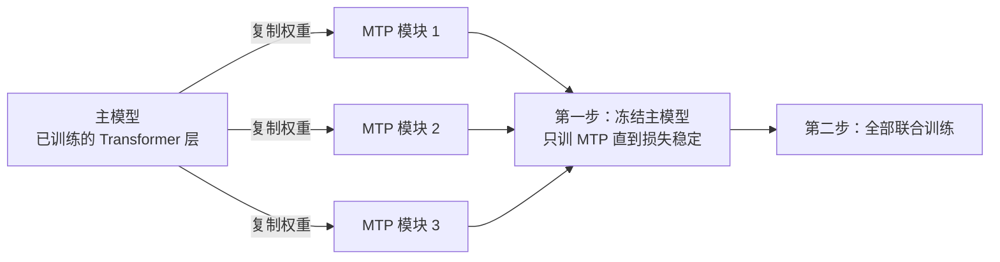
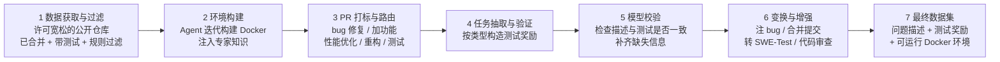
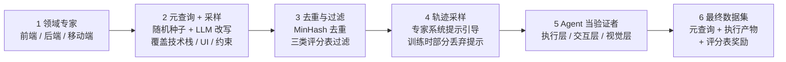
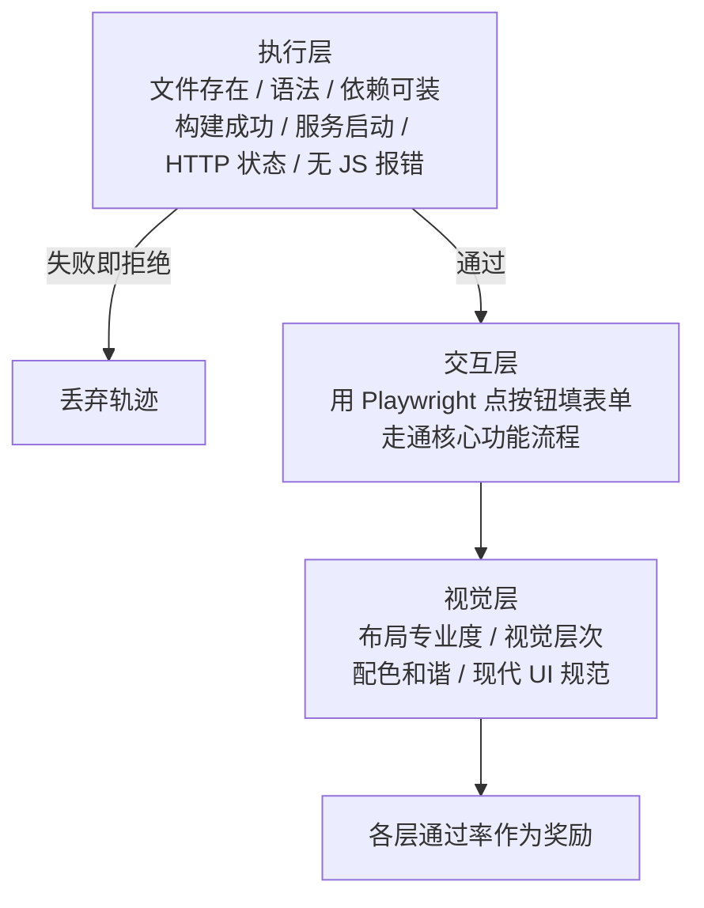
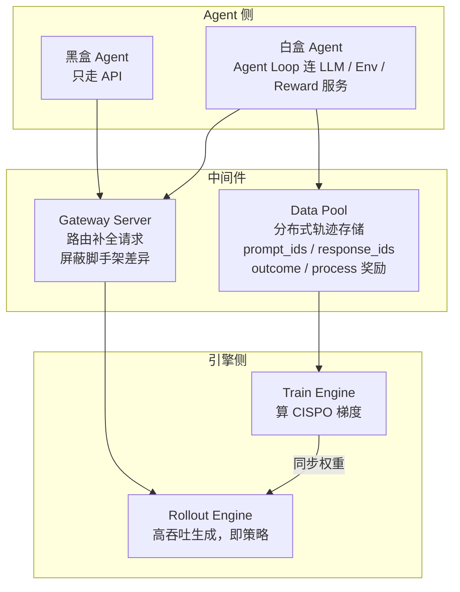
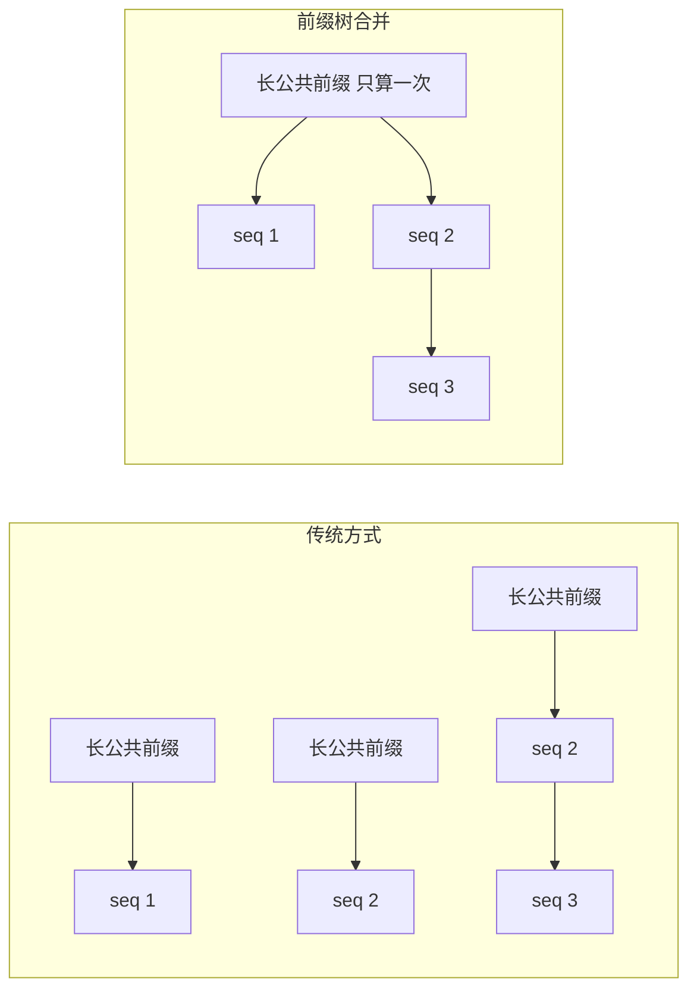
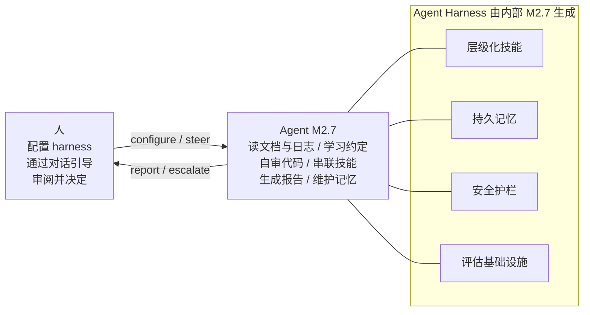
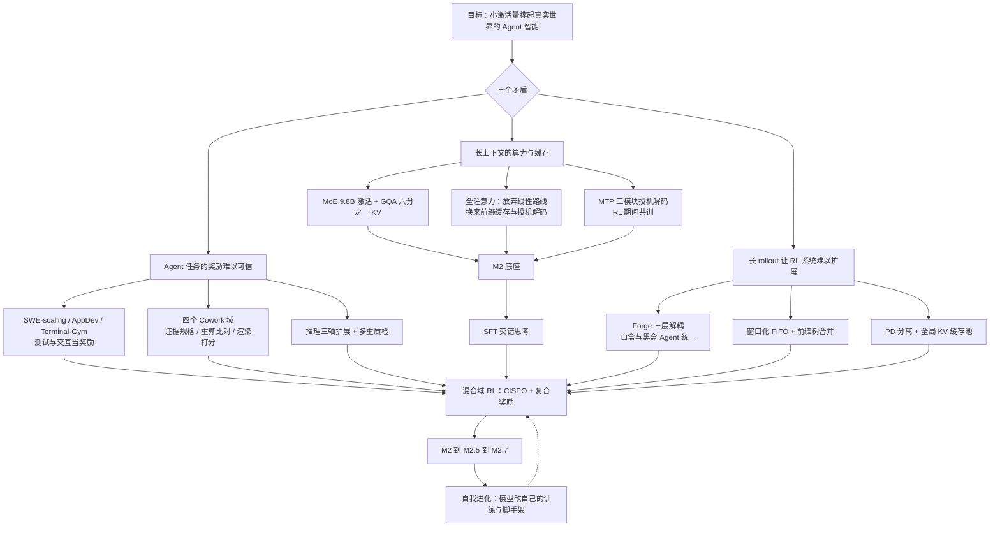

# MiniMax-M2：注意力掉头回全注意力，把赌注全押在 Agent 数据、RL 系统和自我进化上

<!-- release-date: 2025-10-27 -->

> 本文依据 MiniMax 发布的 **The MiniMax-M2 Series: Mini Activations Unleashing Max Real-World Intelligence**，即 arXiv:2605.26494v2、2026-07-30 修订、共 35 页的版本（正文 p.1–31，参考文献 p.31–34，贡献者名单 p.35）。截至 2026-09-07 核验，arXiv 上只有 v1（2026-05-26 提交）和 v2（2026-07-30 修订）两个版本，本地原件就是 v2，无需更换。页码均指 PDF 本身的页码。全文把三件事分开标注：**报告明确写了什么**、**我们如何解释或验算它**、**哪些是外部资料补充**。凡标着「我们的验算」「我们的推断」「读图估计」的内容，都不是报告的结论。
>
> 这份报告写的是一个模型家族：M2 是底座，M2.5 与 M2.7 是同一底座上继续后训练得到的后续 checkpoint。开头的首发日取的是 M2 本身第一次对公众开放的日子；M2.5 与 M2.7 的日期放在正文的时间线里。

## 阅读前先认识几个词

这篇报告的重心不在架构而在训练系统，所以名词密度最高的地方是强化学习和 Agent 那几章。先用人话过一遍会反复出现的几个词：

- **Token（词元）**：模型读写文本的最小单位。一个汉字、一个英文单词或一个标点，都可能被切成一个或多个 Token。
- **混合专家（Mixture-of-Experts，MoE）**：把前馈层拆成很多个「专家」，每个 Token 只经过其中少数几个。于是模型可以有很多参数，但每个 Token 真正用到的很少。报告标题里的「mini activations」说的就是后一件事。
- **分组查询注意力（Grouped-Query Attention，GQA）**：多个查询头共用一组 Key 和 Value，用来减小推理时的缓存。它仍然是标准的全注意力，只是省了 KV 的份数。
- **多 Token 预测（Multi-Token Prediction，MTP）**：在主模型旁边加一个小模块，让它顺便预测再往后一两个 Token。训练时多一个信号，推理时可以当草稿。
- **投机解码（speculative decoding）**：先用便宜的草稿模块猜几个 Token，再让主模型一次验证。猜对了就省下几次前向，猜错了退回重来，输出分布和逐个生成完全一样。
- **策略、rollout 与轨迹**：强化学习里把模型叫「策略」；让它在环境里实际跑一遍任务叫 rollout；跑出来的整段记录叫轨迹。
- **脚手架（scaffold）与 harness**：模型外面那层负责管上下文、调工具、决定何时再调一次模型的程序。同一个模型换一套脚手架，成绩可以差很多。
- **交错思考（interleaved thinking）**：模型在「想一段、调一次工具、看结果、再想一段」之间反复切换，而且前几轮想的内容一直留在上下文里。

## 先讲矛盾：Agent 时代的两个难题，和 MiniMax 自己的一次回头

报告开篇把问题说得很清楚。大模型的用法正在从单轮对话转向长程 Agent 工作流：写并交付代码、逛开放网页、操作各种工具、产出结构化的办公文件，一次任务可能跨越几百步推理与动作。这带来两件互相拧着的难事：（PDF p.2）

1. Agent 任务的上下文天然极长，训练和推理的效率与成本都会被拖垮，尤其是在高可用的生产部署里；
2. 这些任务本身又极难、极高风险，比如生产级软件工程和知识密集型办公自动化。

第一件事逼你省算力，第二件事逼你堆能力。MiniMax 给出的答案是一句口号：**mini activations can unleash maximum real-world intelligence**，小激活量也能撑起最强的真实世界智能。（PDF p.1–2）

但这篇报告真正值得对着读的地方，在于 MiniMax 对第一个难题的回答方式**和自己上一代完全相反**。

MiniMax-01 和 MiniMax-M1 走的是「换掉注意力的数学形式」这条路：每 8 层里 7 层用线性复杂度的 lightning attention，只留 1 层 softmax 注意力，把长上下文的平方项砍掉了八分之七（这两代的机制与验算见本仓库的 MiniMax-01 篇与 MiniMax-M1 篇）。到了 M2，报告用一句话把这条路收起来了：

> M2 在所有层都采用全注意力，与 MiniMax-Text-01 里 lightning attention 与全注意力交错的混合设计分道扬镳。（PDF p.4）

理由不是「线性注意力不好」，而是三件更现实的事：质量损失量不准、基础设施跟不上、以及他们自己做了几千亿到上万亿 Token 的混合 SWA 实验，结果在长上下文上都输给了全注意力。（PDF p.4–5）这一节我们会完整展开。

于是 M2 的省算力方案退回了最保守的组合：**MoE 把每 Token 激活压到 9.8B，GQA 把 KV 缓存压到六分之一，MTP 让推理一次多出几个 Token**。真正的创新预算，全部花在了后训练：怎么造 Agent 数据、怎么建一个能吞下几小时长 rollout 的 RL 系统、以及怎么让模型开始改自己的训练流程。

## 一句话先说清

MiniMax-M2 是一个 229.9B 总参数、每 Token 只激活 9.8B 的 MoE 模型，62 层、全注意力、原生 192K 上下文，在 29.2T Token 上预训练。（PDF p.2–3）但报告花在这个底座上的篇幅只有五页；其余二十多页讲的是三件事，它们从 M2 一路演化到 M2.5、M2.7：（PDF p.1–2）

- **Agent 驱动的数据流水线**：编程、办公协作、推理、通用对话每一类任务都配上可执行的环境，奖励尽量来自「跑一遍验证」而不是「让一个模型打分」。报告认为，把每条被接受的轨迹的奖励质量和可信度提上去，是释放底座潜力最要紧的事；
- **Forge**：一个把训练、推理和 Agent 三者彻底解耦的 RL 系统，既能接内部可见的白盒 Agent，也能接只走 API 的黑盒 Agent，配上窗口化 FIFO 调度、前缀树合并和与线上部署共用的推理内核；
- **自我进化的早期形态**：M2.7 已经在自家基础设施上自己排查失败的训练任务、改自己的脚手架，并且在 ML 工程任务上跑多轮自我改进。

如果只记一句话：

> **M2 系列的主张是，当 Agent 能力主要由后训练决定时，底座架构可以退回最稳妥的全注意力 MoE；省算力靠小激活量，涨能力靠可验证的环境与奖励，扩规模靠 RL 系统的解耦。**

## 全景：一张图和一条时间线

这张图是我们按报告第 2 到第 7 节的叙事重画的机制示意，不是报告里的原图。报告本身没有画整体流程图；它的 Figure 4 画的是 Forge 系统，Figure 8 画的是自我进化的工作流，后文各自重画。

三个 checkpoint 的时间线，报告只给了顺序（M2 → M2.5 → M2.7），没有给日期。以下日期全部是**外部补充**，来源列在文末：

| 事件 | 日期 | 来源 |
|---|---|---|
| M2 通过 API、MiniMax Agent 与开放权重同时开放 | 2025-10-27 | MiniMax 官方新闻页与平台 release notes |
| M2.1 发布 | 2025-12-22 | 平台 release notes；**报告全文没有提到 M2.1** |
| M2.5 发布 | 2026-02（第三方报道为 2 月 12 日） | 平台 release notes |
| M2.7 发布 | 2026-03-18 | 平台 release notes |
| 报告 v1 上传 arXiv | 2026-05-26 | arXiv |
| 报告 v2 修订 | 2026-07-30 | arXiv |

注意一个阅读边界：报告是在 M2 发布七个月之后才写的，评测章节比较的是 M2.7，架构和预训练章节讲的是 M2。报告的结论一节说 M2 的这个 9.8B/229.9B 底座「与三个组件一起从 M2 演化到 M2.5 再到 M2.7」（PDF p.30），我们据此理解三个 checkpoint 共用同一底座；报告没有单独说明 M2.5 或 M2.7 是否动过预训练。

## 第一部分：底座架构——退回最保守的组合

### 配置一览

| 配置 | M2 | 页码 |
|---|---:|---|
| 总参数 / 每 Token 激活参数 | 229.9B / 9.8B | PDF p.2–3 |
| 层数 | 62 | PDF p.2–3 |
| 隐藏维度 | 3,072 | PDF p.3 |
| 词表大小 | 200,064 | PDF p.3 |
| 预训练 Token 数 | 29.2T | PDF p.3 |
| 最大上下文 | 192K | PDF p.3 |
| 注意力 | 全注意力，48 个查询头，8 个 KV 头 | PDF p.3 |
| 位置编码 | RoPE，全模型使用 | PDF p.3 |
| 每层专家数 / 每 Token 激活专家数 | 256 / 8 | PDF p.3 |
| 路由 | sigmoid 门控 + 可学习的专家偏置 | PDF p.3 |
| MTP | 预训练 1 个模块，继续预训练时扩到 3 个 | PDF p.3、5 |

几个我们的验算，报告没有直接写：激活参数占总参数约 4.3%；每 Token 用 256 个专家里的 8 个，是 1/32；48 个查询头共用 8 个 KV 头，意味着每个 KV 头服务 6 个查询头，KV 缓存是同规模多头注意力的 1/6。

**外部补充**：Hugging Face 上 `MiniMaxAI/MiniMax-M2` 的 `config.json` 与报告一致（62 层、3072 隐藏维、48/8 头、256 专家 top-8、词表 200064），并补充了几个报告没写的数：每头维度 128，专家内部维度 1536，`max_position_embeddings` 为 196,608（正好 192×1024），`rope_theta` 为 5,000,000，`rotary_dim` 为 64（即 RoPE 只旋转每头 128 维中的 64 维），`attn_type_list` 62 个位置全是 1。最后这一项是权重文件在告诉你「每一层都是同一种注意力」。这些数字以具体 commit 为准，不是报告结论。

### MoE 的三处改动：为什么是这三处

M2 的 MoE 层在标准做法上改了三件事，分别对准表达力、路由动态和负载均衡。（PDF p.3）

**第一，细粒度专家。** 用更多、更小的专家替代少数大专家。报告给的理由是两条：路由的组合多样性变大；专家在设备间的利用率方差变小。（PDF p.3）

Table 1 是这个决定的消融，做在一个很小的代理规模上：2B 激活、17.8B 总参数、500B Token。基线是 32 个专家选 2 个；细粒度版本是 128 个专家选 8 个。注意总参数与激活参数都没变，也就是说每个专家缩到了四分之一，同时激活的专家数翻了四倍，每 Token 的前馈计算量不变。（PDF p.4）

| 基准 | 基线 32 选 2 | 细粒度 128 选 8 |
|---|---:|---:|
| MATH（4-shot） | 19.6 | 24.1 |
| MMLU（5-shot） | 39.8 | 40.2 |
| ARC-Challenge（25-shot） | 27.4 | 27.8 |
| KorBench（3-shot） | 14.1 | 14.8 |
| HumanEval（0-shot） | 29.7 | 32.5 |

数据来自 Table 1（PDF p.4）。MATH 和 HumanEval 涨得最明显，知识类基准几乎不动。我们的解释：细粒度带来的是「组合」能力，同样的参数可以拼出更多种专家组合，这对需要多种技能协同的推理和代码更有用；而知识类任务更依赖总参数量，这一项没变，所以没涨。这是我们的推断，报告没有分析为什么涨在这两项上。

顺便算一下组合数（我们的验算）：32 选 2 只有 496 种组合，128 选 8 约有 $1.4\times 10^{12}$ 种。报告说的「combinatorial diversity」就是这个数量级的差别。

**第二，sigmoid 门控。** 标准做法是 softmax 后取 top-$k$。softmax 有一个隐含约束：所有专家的分数加起来是 1，一个专家分高，其他专家必然分低。报告把它叫零和约束。换成 sigmoid 后，每个专家拿到一个独立的 0 到 1 之间的分数，多个专家可以同时高置信被激活，训练时路由变化更平滑。（PDF p.3）

**第三，专家偏置。** 在门控分数上给每个专家加一个可学习的偏移量，与模型参数一起优化，用来隐式地调节专家使用率，从而把辅助负载均衡损失「大幅调小」。（PDF p.3–4）报告在这里引用的是 DeepSeek 的辅助损失无关负载均衡。注意两个措辞：一是「大幅调小」而不是「去掉」，说明辅助损失还在；二是偏置「与模型参数一起优化」，而报告没有给出偏置的更新规则、辅助损失的权重，也没有给这一项的消融。

### 注意力：为什么掉头回全注意力

这是整篇报告最有对照价值的一节，因为它是上一代路线的作者自己写的反例。报告给了三个理由。（PDF p.4–5）

**理由一：质量损失量不准。** 报告说，在开发 MiniMax-Text-01 时，混合注意力模型在 MMLU、BBH、MATH、LongBench 这些标准基准上看起来和全注意力打平，但规模一大，复杂多跳推理上的短板就露出来了。他们为此开发了代理指标，可是代理指标与真实下游表现的相关性很脆弱，换个规模、换个任务分布可能就不成立。更麻烦的是，要做出统计上显著的评测，所需算力随任务复杂度快速上涨；不同架构又与数据分布、训练配方以不可预测的方式互相作用。（PDF p.4）

这段话的分量在于：**它不是说线性注意力被证明更差，而是说「证明它不更差」这件事本身贵到做不起，而且做出来也不一定可信。** 对一个要发布生产模型的团队，这就足以做决定了。

**理由二：基础设施差距。** 线性与稀疏注意力的基础设施仍然不如全注意力成熟。报告点了四个具体的坑：很多线性架构连训练时都是访存瓶颈；推理时对低精度存储敏感；没有原生的前缀缓存支持；与投机解码的整合方式不清楚。（PDF p.4）

后三条都是 Agent 服务的命门。Agent 对话有大量共享前缀（同一个系统提示、同一个工具说明），前缀缓存省下的是真金白银；投机解码是 M2 靠 MTP 拿吞吐的手段。一个注意力机制如果和这两件事合不上，在生产里就没有位置。

**理由三：混合 SWA 实验的结果。** 报告说他们「大量探索」了混合滑动窗口注意力（Sliding Window Attention，SWA）的变体，在多种配置下继续预训练了几千亿到上万亿 Token：不同的 SWA 与全注意力比例、不同的 RoPE 设置、层内混合与层间混合、分析归纳头与检索头的注意力模式、加 sink token。（PDF p.4）

预训练阶段的结论是：所有变体在检索、多跳推理和上下文学习任务上都退步了。Table 2 是 M2 架构规模上的对照：（PDF p.5）

| 基准 | 全注意力 | 混合 SWA |
|---|---:|---:|
| HELMET ICL | 75.8 | 72.7 |
| MMLU | 85.5 | 85.6 |
| MATH | 60.3 | 60.3 |
| RULER 128K CWE | 90.0 | 72.0 |
| RULER 128K MQ | 99.0 | 93.0 |
| RULER 32K CWE | 99.0 | 99.0 |
| RULER 32K MQ | 99.0 | 99.0 |
| MTOB K-e Bleurt | 60.0 | 45.0 |
| MTOB e-k ChrF | 44.8 | 27.2 |

这张表的形状很说明问题。MMLU 和 MATH 完全没差，32K 的 RULER 也完全没差；差距只在 128K 的检索和 MTOB 上出现，而且很大。**外部背景**：RULER 是一套合成的长上下文测试，CWE 是从长文里找出最常见的词，MQ 是多个查询同时做「大海捞针」；MTOB 是「用一本语法书学一门新语言」的测试，K-e 与 e-k 分别是两个翻译方向，Bleurt 与 ChrF 是翻译质量指标。它们考的都是「远处的信息必须原样看到」，正是滑动窗口做不到的事。

SFT 之后差距在长上下文上更明显：超过 32K 的基准（Agent 任务和复杂长上下文评测）上 SWA 变体显著更差；32K 以内则结果混杂、绝对值差距小，SWA 在一些指令跟随和短程 Agent 任务上甚至更好，而全注意力在知识密集型评测上保持优势。Table 3 是 SFT 后的对照：（PDF p.5–6）

| 基准 | 全注意力 | 混合 SWA |
|---|---:|---:|
| AIME 2025 | 86.7 | 86.7 |
| ARC-AGI-1 | 38.9 | 39.6 |
| GPQA-Diamond | 75.3 | 72.7 |
| MMLU-Pro | 80.5 | 80.1 |
| IFBench | 23.1 | 27.2 |
| SWE-verified | 54.7 | 50.2 |
| Terminal-Bench | 26.7 | 23.8 |
| BrowseComp-zh | 32.8 | 28.7 |
| GAIA-103 | 53.4 | 51.5 |
| XBench-ds | 58.0 | 63.0 |
| τ2-Bench retail | 62.3 | 67.5 |
| τ2-Bench telecom | 32.5 | 21.0 |

数据来自 Table 3（PDF p.6）。报告对这两张表的总结是：混合 SWA 的注意力覆盖范围限制对长上下文能力有决定性影响，对短上下文场景影响很小。（PDF p.5）

这里必须标清一个边界。**Table 2 和 Table 3 比较的是全注意力与混合 SWA，不是全注意力与 lightning attention。** 关于线性注意力的判断，报告只给了 Text-01 时期的定性经验和基础设施论据，没有在 M2 规模上给出对照数字。所以「掉头回全注意力」这个决定，在数据上被证明的部分是「SWA 混合不行」，在线性注意力上是经验判断。这一点报告写得诚实，读者也应该记准。

最后一段「展望」同样值得记：随着上下文继续变长、GPU 算力增长放缓，次二次方复杂度的注意力会越来越重要；他们正在投入更好的长上下文数据、评测方法和基础设施，为这个转变做准备。（PDF p.5）换句话说，回全注意力是一个「现在」的决定，不是「永远」的决定。MiniMax 后来单独发表的 MiniMax-Sparse-Attention 走的正是这个方向，本文不展开。

### 这个决定可以迁移的部分

- 在选架构之前，先问自己**能不能量得准**。如果你的评测在小规模上分不出差别，而你也付不起大规模对照的成本，那么选择更成熟的那一边不是保守，是理性；
- 推理侧的三个问题（低精度存储、前缀缓存、投机解码）是任何新注意力机制的入场券，做研究可以先不管，做生产必须先答；
- 如果一定要省长上下文的成本，SWA 混合只在 32K 以内是免费午餐，超过之后要付检索能力的代价。

### MTP：既是训练信号，也是推理草稿

MTP 让模型除了预测下一个 Token，还联合预测再往后的 $K$ 个 Token。它带来两件事：训练时多一份监督信号；推理时可以做投机解码。（PDF p.5）

M2 分两步用它：

**预训练阶段**用一个 MTP 模块（$K=1$），结构跟随 DeepSeek-V3，MTP 损失权重初始为 0.3，在衰减阶段退火到 0.1。报告说 Table 1 显示 MTP 在各项基准上一致提升、推理型任务提升最大；按表上的数字，MATH 从 19.6 到 21.3、KorBench 从 14.1 到 15.0 涨得最明显，MMLU 则从 39.8 到 39.7 基本持平。（PDF p.4–5）

**继续预训练的衰减阶段**把 MTP 模块从 1 个扩到 3 个（$K=3$），以支持多步投机解码。关键是怎么初始化新模块：不用随机初始化，而是从主模型复制权重。（PDF p.5）

这是我们根据 Figure 2（PDF p.7）和第 2.3 节文字重画的机制示意。Figure 2 本身画的是模块内部结构：每个 MTP 模块有自己的 RMSNorm、线性投影和一个 Transformer 块，嵌入层和输出头与主模型共享，模块之间用「Copy & Initialize」箭头相连。

报告给了两个复制初始化的理由：复制初始化的模块收敛明显更快，随机初始化则一开始损失很高，会暂时拖累主模型；复制也让主模型的表示在过渡期受的扰动最小。扩容后先冻结主模型、只训 MTP 模块一小段时间，等其损失稳定再切换到联合训练。他们也试过全程冻结主模型，发现 MTP 模块在这种只训 MTP 的日程下最终质量更差。（PDF p.5–6）

推理时三个 MTP 模块产生草稿 Token，主模型在一次前向里验证，输出质量与逐个自回归解码完全相同，只是吞吐提高了。（PDF p.6）报告没有给出接受率或加速倍数。

这个设计后面还有一段延伸：进入 RL 之后，MTP 模块与策略一起用 top-$K$ KL 散度损失持续共训，防止策略漂移后草稿接受率掉下来。（PDF p.22–23）这个细节放在 Forge 一节讲。

**可迁移的部分**：任何要往训练中途加新模块的场景，「从已有权重复制、先冻结主干、再联合训」都是低风险起步法。它把「新模块的高损失」这个扰动源隔离在主干之外。

## 第二部分：预训练数据——报告只给了轮廓

预训练数据这一节很短，只有一页。（PDF p.6–7）它写了这些：

- 来源包括网页、学术文献、书籍、程序代码和结构化问答；
- 用基于模型的奖励打分与辅助分类器从多个维度评估文档质量；采用平衡采样，上调高质量内容的权重，同时保留足够的类别多样性；
- 代码、数学和 STEM 内容相对自然分布被显著上采样，其余是通用网页、书籍与领域数据；
- 预训练的**常量阶段**训练 19.9T Token；随后的**衰减阶段**总预算 9.3T Token，两者相加就是 29.2T；
- 初始预训练之后，上下文分多步从 8K 扩到 32K、最终到 192K；衰减阶段的 9.3T 预算同时包含短文本衰减数据和长上下文数据，后者主要来自高质量代码拼接、天然长篇的 PDF 文档、以及按主题相关性打包的文档；衰减阶段还混入高质量数据来巩固能力。（PDF p.6–7）

报告没有写的：各来源的占比、去重与污染检查的方法、质量分类器的训练方式、合成数据是否使用及比例、学习率与 batch 的日程、优化器、训练用了多少 GPU 和多长时间。和本仓库已收录的其他基模报告相比，这是公开程度最低的一节。

## 第三部分：后训练数据——报告真正的主角

从第 4 节起报告进入正题，一共九页，讲的是怎样为每一类任务造出「有环境、可验证」的训练数据。（PDF p.7–16）先把贯穿所有流水线的共同原则说清楚，再逐个看。

### 共同原则：可执行的工作区，和与产物对齐的奖励

摘要里有一句话是这整章的总纲：每条轨迹都「扎根在一个可执行的工作区里，配一个与产物形态对齐的奖励」。（PDF p.1）第 4.2 节把它展开成四条设计：（PDF p.12）

1. 任务实例化在真实的、可运行的工作区上；
2. 轨迹从一组轮换的强教师模型蒸馏而来，而且脚手架被刻意扰动；
3. 接受与否由一个和产物形态对齐的验证信号决定，而不是由一个通用的裁判模型决定；
4. 对结果无法机器验证的子任务，采多个候选，沿「推理与动作轨迹」「最终产物」两条轴做成对比较，再过一道基于评分表的严格过滤。

第一条贡献里还有一句判断：把每条被接受轨迹的**奖励质量和可信度**提上去，无论靠可执行的验证信号还是靠裁判模型的证据核查，是「释放底座潜力最要紧的事」。（PDF p.2）

这句话是理解整章的钥匙。报告不是在比谁的数据多，而是在比谁的奖励更难被骗。

### Agentic Coding：三条流水线

编程数据分三个域：软件工程（SWE，改已有仓库）、应用开发（AppDev，从零建应用）、终端交互。（PDF p.7）

#### SWE-scaling：从 GitHub PR 到可验证任务

旧问题是三个耦合的难题：任务要多样、要能客观验证、要能扩到大规模训练所需的量。GitHub 是天然的结构化来源：一个规范的 PR 自带描述、代码改动和测试用例。但原始 PR 很脏，不能直接用。（PDF p.7）

这是根据 Figure 3 上半部分（PDF p.8）重画的流程图。几个关键环节：

**环境构建的难点在非 Python 语言。** 报告观察到，非 Python 场景下依赖异构、版本冲突多，环境合成的可靠性明显下降。解决办法是一个带专家知识的 Agent 执行回路：让 Agent 根据执行反馈迭代生成和修正构建脚本。要处理的三个维度是：编译型语言（Java、Go、Rust、C++）的构建系统编排；不同语言各不相同的构建与测试接口；仓库级的结构差异。（PDF p.8）

**按 PR 类型定义奖励**，因为不同类型的任务需要不同的正确性判据：（PDF p.8–9）

| PR 类型 | 奖励怎么算 |
|---|---|
| bug 修复 | 抽取 F2P（修前失败、修后通过）和 P2P（修前修后都通过）两类测试；金标补丁必须通过它们；模型修完后同时跑两类，P2P 用来保证没引入新 bug |
| 加功能 | F2P/P2P 逻辑常常不适用，因为测试依赖新增代码；改为抽取新增的测试点，要求金标补丁通过 |
| 性能优化 | 没有修 bug 的过程，抽取能验证优化前后性能差异稳定且显著的 P2P 测试 |

**模型校验**这一步对应原始 PR 「弱结构」的问题：测试可能没有完整说明问题，任务因此含糊。报告用一个模型检查问题描述与测试用例的一致性，必要时补齐信息，产出自包含、可执行的任务规格。（PDF p.9）

**变换与增强**从一个 PR 生成多个变体：（PDF p.9）

- 注入额外 bug 提高难度；
- 合并相邻提交或 PR，构造多步修复任务，做法类似 SWE-Smith；
- 把 bug 修复 PR 反转成 SWE-Test 任务：不是修 bug，而是写一个「打补丁前失败、打补丁后通过」的测试，直接练测试编写能力，而且仍然完全可验证；
- 代码审查任务：Agent 做静态分析、检查改动、指出缺陷，不需要可运行环境，一致性由另一个 LLM 核验，报告称之为「近似可验证」。

最终数据集的每个实例包含问题描述、基于测试的可验证奖励、可运行的 Docker 环境；覆盖十多种编程语言。（PDF p.9）报告没有给出数据集的规模。

#### AppDev：专家在环，Agent 当验证者

从零建应用与改仓库有三点不同：任务不能从已有代码库里抽；质量信号需要运行时验证，静态分析不够；评价标准同时包含功能正确和主观的设计质量。（PDF p.9）

这是根据 Figure 3 下半部分（PDF p.8）重画的流程图。

**元查询**是专家写的模板，编码生产级技术模式：框架生态（报告举例 React + Zustand + Tailwind）、架构约束、真实用例。专家维护分类种子池，覆盖 UI 组件库、CSS 框架、构建工具、SaaS 集成和常见应用场景。元查询与随机种子组合，再用高温度 LLM 生成扩展成具体任务。（PDF p.10）

**质量控制**分两道：MinHash 去重；LLM 按三类评分表打分，低于阈值拒绝。三类分别是技术栈合理性（兼容性、选型、组合有效性）、功能可行性（技术可达、描述具体、UI/UX 逻辑）、需求清晰度（有效性、场景真实性、表达连贯、完整性）。（PDF p.10）

**提示蒸馏**是这条线上最值得记的技巧。专家把最佳实践写进系统提示：报告举例说早期模型有「滥用模板化渐变背景」的坏习惯，提示里就写明设计规范；还要求先写规格再实现、复杂任务维护 TODO 列表、通过测试自我验证。采样时模型拿到完整的加强版提示；**训练时则有选择地丢掉其中一部分**。这种不对称让模型把专家编码的最佳实践内化成默认行为，减少推理时对显式提示的依赖。（PDF p.10）

**Agent-as-a-Verifier（AaaV）** 把生成的应用部署到沙箱里，通过工具交互来验证。三层递进，每一项都给二元通过/失败判定并附证据：（PDF p.10–11）

这是根据第 4.1.2 节文字重画的机制示意。执行层是硬门槛，失败立即拒绝；交互层用 Playwright 真的去点按钮、填表单、走完核心流程；视觉层评主观质量。报告强调，它与常规的 LLM-as-a-Judge 的区别在于验证者不是看静态代码或截图打分，而是多轮与运行中的应用交互，对照专家评分表给观察到的行为打分。（PDF p.11）

#### Terminal-Gym：从 Stack Overflow 合成终端任务

Terminal-Bench 这类评测要求 Agent 在完整的终端环境里完成真实、复杂的任务，对系统操作、调试和命令行能力要求更高。Terminal-Gym 是为此建的自动合成流水线。（PDF p.11）

**种子**来自完整的 Stack Overflow 数据集。按时间重建完整帖子后做规则过滤：丢掉没有采纳答案的、低分的、过长的；按标签只留终端操作、系统配置、调试、脚本和相关软件工程流程；每个帖子标注问题质量、任务类型适用性、可验证性、类别、复杂度、环境需求和执行特征；只保留可脚本化、终端兼容、可验证、与 Linux/Docker 相关、难度适中的帖子；最后在每个线程里选一个高质量答案，形成问答对。（PDF p.11）

**查询合成**把问答对改写成结构化任务描述：具体化执行环境、所需工具、输入输出格式、成功标准；按可测性、完整性、清晰度分四档，只留前两档。（PDF p.11）

**三阶段合成**：（PDF p.12）

1. 环境与测试生成：Agent 为每个任务写 Dockerfile 和测试脚本，执行测试，失败则把结构化诊断反馈给 Agent 迭代修复，直到通过或达到重试上限；
2. 查询演化与统一测试：原始任务描述常含明显提示、文件路径或预期输出。用受控的演化过程系统性地抽象或移除这些提示，同时保持语义一致；所有变体用同一套 LLM 生成的测试评估，逼测试去验证任务的底层逻辑而不是描述风格；
3. 难度校准：优先采样提示更少、零样本通过率更低的变体；参考求解器的历史通过率和环境合成时的修复迭代次数都作为难度信号。

报告还提到两个正在发展的方向：Terminal-Gym 正演化成「零干预」的 Anything2Docker 系统；面向代码安全的 CVE-Factory 在扩展到自主网络安全研究。（PDF p.12）两者都只有一句话，没有细节。

### Agentic Cowork：四个办公域共用一套模板

编程之外，真实部署还要求 Agent 在异构的专业环境里工作：逛开放网页找一手来源、读财务表格、写幻灯片、产出用户真正消费的办公文件。报告把它组织成四个域，全部沿用前面说的共同模板。（PDF p.12）

#### 深度搜索：把问题改难，把证据钉死

任务合成用「引导与改写」策略：从一个种子问题出发，反复改写并遮蔽它依赖的实体，直到任务难到能区分强弱 Agent。这给了难度的连续控制：简单变体练基本检索，困难变体逼多步浏览和跨源印证。（PDF p.12–13）

为了防止模型学会「编一个听起来合理的答案」，每个合成任务都配一份**显式的证据规格**，只有当答案扎根在实际检索到的证据上、而不是从模型记忆里背出来时，轨迹才被接受。对没有唯一短答案的报告式问题，用评分表裁判按事实准确、透明度、不确定性处理和风险披露打分。教师模型轮换，脚手架跨次扰动，让策略不依赖某一种工具布局。（PDF p.13）

#### 知识工作者办公任务：锚在 GDPval 上，再分层合成

这个域覆盖报告、幻灯片、备忘录、结构化文档等端到端的专业交付物。语料锚定在 GDPval 这个办公任务基准上，再用一条模仿真实职业组织方式的合成流水线扩展。（PDF p.13）

- **种子筛选**：从基准里挑出 harness 能支持的规范任务，作为可执行的锚；
- **分层合成**：从公开职业数据库的大类出发，细分出带文化与地域多样性的子类；每个子类生成具体任务与详细描述；每个任务再配一个真实的支撑文档工作区、多个不同具体程度的查询版本，以及一份结构化的交付物规格，让合成、执行和验收共用同一种产物形态；
- **多轴评分表验收**：正向行为、负向行为、关键错误、地域适当性、推理深度；再过一道类型化的清理，去掉编造数据、引用或实体的轨迹。（PDF p.13）

#### 财务分析与表格操作：先执行工具，再反推任务

两个任务族：基于真实财务工具的检索、计算与推理；真实工作簿上的表格操作。（PDF p.13）

**证据驱动合成**用于第一族，方法来自他们的前作 DIVE。它把常规的自上而下出题顺序反过来：先执行真实的财务工具收集扎实的执行轨迹，再反推出严格蕴含于这些轨迹的任务。于是每个任务从构造上就是可执行、可验证的，参考答案完全由工具真实返回的结果决定。（PDF p.13–14）

**工作簿漫步合成**用于第二族：Agent 对一个种子工作簿执行一组原子表格操作，路过的中间状态回收成新种子；每条轨迹上反向合成任务，从轨迹得到答案、从答案得到问题；最后一道多样化处理沿措辞和难度两个轴展开。（PDF p.14）

覆盖范围包括通用与竞赛级表格操作（工作簿结构理解、公式应用、跨表操作）、财务建模（PE、VC、M&A 场景）、从半结构化文档重建结构化工作簿。（PDF p.14）

**验收优先用确定性的值级匹配**：执行学生产出的文件，用外部引擎重算公式，逐格与真值工作簿比对。形式可以合理变化的交付物（从半结构化文档重建的工作簿、开放式财务推理）退回到评分表或 Agent 裁判。每个任务在多种脚手架下采样，让策略对工具接口的变化鲁棒。（PDF p.14）

#### 幻灯片生成与编辑：最后一层是把结果渲染成图来看

两条并行流：把制作幻灯片当开放生成问题，从多领域源文档派生不同粒度、长度和语域的查询；把编辑当局部干预问题，以真实幻灯片为种子，沿编辑粒度（元素、页面、文档）、意图（内容、样式、结构）和复杂度生成指令。教师模型轮换，优先选视觉质量好的教师。（PDF p.14）

验收叠加多种信号：执行成功、Agent 判定的功能正确、基础版式美学的规则检查、以及一个**把交付物渲染成图片再评判的视觉打分器**。为防止策略过拟合单一渲染工具包，还混入其他幻灯片库生成的轨迹。（PDF p.14）

### 一张表看清「每个域用什么当奖励」

把上面的内容压成一张表，是理解这一章的最短路径。这是我们的整理，页码指向各域的原文：

| 域 | 任务来源 | 奖励或验收信号 | 页码 |
|---|---|---|---|
| SWE | GitHub PR | 按 PR 类型抽的测试用例，在 Docker 里跑 | p.7–9 |
| AppDev | 专家元查询 + LLM 扩展 | AaaV 三层：执行、交互、视觉 | p.9–11 |
| 终端 | Stack Overflow | Agent 生成的测试脚本，统一测试套件 | p.11–12 |
| 深度搜索 | 种子问题改写遮蔽 | 证据规格；报告式问题用评分表 | p.12–13 |
| 办公任务 | GDPval + 职业数据库分层合成 | 多轴评分表 + 反编造清理 | p.13 |
| 财务与表格 | 工具轨迹反推；工作簿漫步 | 外部引擎重算后逐格比对；退回评分表 | p.13–14 |
| 幻灯片 | 源文档派生；真实幻灯片编辑 | 执行 + Agent 判功能 + 版式规则 + 渲染打分 | p.14 |
| 推理 | 现有题源 + 针对短板合成 | 验证器 + 多模型交叉核对 + 评分表 | p.14–15 |
| 通用对话与写作 | 精选查询，长思维链 | 规则检查 + 模型评估 | p.15–16 |
| 角色扮演 | 专家模型自博弈 | Role-Play Bench 惩罚失败模式 + 产品真实反馈 | p.16 |

规律很清楚：**能跑就跑，跑不了就渲染，渲染不了才用裁判模型，而且裁判也要给证据。** 这条排序本身就是可迁移的设计原则。

### 推理数据：三条轴上做规模

推理数据的目标是深度、结构化的思考：证明定理、推导科学结论、设计算法、构造论证。报告沿三条轴扩规模，并配一条质量保证流水线。（PDF p.14–15）

- **查询侧**：扩展独特问题的集合，尤其是覆盖不足的难度段；从现有来源精选，再针对错误分析发现的技能缺口定向合成；
- **响应侧**：每个问题生成多条正确解法。报告观察到域外能力随每题响应数增加而持续提升，收益主要体现在域外泛化上，说明多样的解法教的是可迁移的推理策略而不是答案记忆；他们按难度段刻画饱和特征，把额外采样集中在解法多样性仍低的地方；
- **训练侧**：在固定算力下研究「扩查询」与「扩响应」的最优配比，前者增覆盖与广度，后者深化对解法空间的掌握；配比按训练阶段、按当前能力瓶颈动态分配。（PDF p.15）

质量保证在每个环节都有：查询侧结合直接标注与多次 rollout 响应的交叉比较，识别含糊或病态的问题；验证器做系统性的边界案例分析；答案通过多模型的表现差异交叉核对，分歧处标记潜在标注错误；响应用结构化评分表沿定义好的质量维度打分。（PDF p.15）

报告没有给出推理数据的规模、各轴的具体配比，也没有给「响应数与域外泛化」这条观察的数字。

### 通用对话、写作与角色扮演

通用轨道覆盖写作、通用问答、多轮对话，语料主要是带长思维链的高质量样本，目的是灌入推理能力、保住通用能力、并给后续 RL 一个稳定的冷启动。（PDF p.15）写作强调风格，并接入一个文件系统让模型读写结构化文档；通用问答重在从多个候选里选出偏好对齐的；多轮对话重在复杂交互下的指令与评分表跟随。数据同时包含带工具和不带工具的样本。（PDF p.15–16）

角色扮演单独成一条轨道，因为它是主要的真实部署模式之一，而通用对话轨道不覆盖它。报告把角色扮演形式化为「世界 × 故事」联合空间上、以用户偏好为条件的长程条件生成；核心是跨多轮保持物理、叙事和风格的一致。基于「失配可以客观检测、对齐是主观的」这一洞察，他们建了 Role-Play Bench，通过惩罚具体失败模式（出戏、逻辑错误）给多轮自博弈轨迹打分，离线指标与线上参与度强相关。数据来自风格多样的专家模型大规模自博弈；防模式坍缩用四轴分散采样、Best-of-N 过滤、以及 LLM 裁判的周期性片段级重写；策略用来自真实产品交互的隐式与显式反馈做 RLHF，原始信号经因果推断与分层去偏处理，并用熵监控抑制奖励作弊。（PDF p.16）

这一段的形式化引用的是 MiniMax 自己在 X 上发布的一篇关于 MiniMax-M2-her 的说明（PDF p.33 参考文献），不是论文；本文没有跟进那条链接，相关细节以报告这一段为准。

## 第四部分：SFT——交错思考从这里种下

SFT 的目标只有一个：让 M2 学会**交错思考**，给 RL 一个好的起点。常规的长思维链数据把推理限制在一个连续的块里；M2 的 SFT 数据把思考片段与中间的动作和观察交错起来，让模型在同一条轨迹里推理、行动、修正。数据靠大规模拒绝采样（对照各域的奖励信号）加多阶段清洗产出，覆盖 chat、推理、代码、cowork 四个域，既有单轮推理也有多轮 Agent 交互。（PDF p.16）

报告没有给 SFT 数据量、训练轮数或任何超参数。

## 第五部分：RL 算法——把环境边界画在生成接口上

### 建模：模型之外的一切都是环境

M2 的 Agent RL 建模有一个很干净的抽象：LLM 是策略，**模型生成过程之外的一切**都是环境，包括上下文管理、记忆访问和 Agent 状态转移。（PDF p.16）

形式化成马尔可夫决策过程 $M=(S,A,T,R,\gamma)$。第 $t$ 步，Agent 观察状态 $s_t$，它就是当前上下文窗口的内容：任务指令、对话历史、工具输出、以及 Agent 循环中产生的所有产物。动作 $a_t$ 是**一次 LLM 补全**，里面可以同时含自然语言推理、工具调用请求、显式的上下文管理操作、与子 Agent 的通信。环境执行请求的操作，返回观察 $o_t$，下一状态由一个任意的转移函数决定：（PDF p.16–17）

$$
s_{t+1}=f_{\text{trans}}(s_t,a_t,o_t)
$$

$f_{\text{trans}}$ 可以改变累积的上下文，也可以改变 Agent 循环的内部状态。轨迹 $\tau=(s_0,a_0,s_1,a_1,\dots,s_T,a_T)$ 构成一个完整回合，策略 $\pi_\theta(a_t\mid s_t)$ 由 LLM 权重参数化。（PDF p.17）

关键的设计原则是**边界画在模型的生成接口上**：所有处理、变换或响应模型输出的组件都算环境动态。具体有两类：工具环境（代码解释器、搜索引擎、API）；Agent harness（LLM 调用之间的控制流，包括上下文管理、分支逻辑、子 Agent 委派、与外部模块的交互）。（PDF p.17）

### 训练目标：以 $(s_t,a_t)$ 对为原子

这个建模的直接后果是：策略不需要显式地推理或控制环境与状态转移。训练以单个 $(s_t,a_t)$ 对为原子单位，每一对是策略梯度的一个训练样本。于是策略与状态演化的机制解耦——模型不需要知道 $s_t$ 是简单追加消息得来的、还是激进截断上下文得来的、还是整段历史重写得来的。同时，信用分配、优势估计和奖励传播仍在回合层面对整条轨迹进行，每一对的贡献放在整体任务结果的语境里评估。（PDF p.17）

这两句话是 Forge 能同时支持白盒与黑盒 Agent 的理论根基，后面会回头看。

### CISPO：沿用 M1 的算法，把下界钉在 0

M2 沿用 M1 提出的 CISPO（Clipped Importance Sampling Policy Optimization，裁剪重要性采样权重的策略优化）。目标函数是：（PDF p.17，式 2）

$$
J_{\text{CISPO}}(\theta)=\mathbb{E}_{(q,a)\sim\mathcal D,\ \{o_i\}_{i=1}^{G}\sim\pi_{\theta_{\text{old}}}(\cdot\mid q)}
\left[\frac{1}{\sum_{i=1}^{G}|o_i|}\sum_{i=1}^{G}\sum_{t=1}^{|o_i|}
\operatorname{sg}\!\big(\hat r_{i,t}(\theta)\big)\,\hat A_{i,t}\,\log\pi_\theta(o_{i,t}\mid q,o_{i,<t})\right]
$$

符号：$G$ 是每个提示的 rollout 条数；$|o_i|$ 是第 $i$ 条轨迹的 Token 长度；$\operatorname{sg}(\cdot)$ 是停止梯度算子，不让梯度流过重要性权重；$\hat A_{i,t}$ 是优势。外层的归一化是按整组的总 Token 数，也就是 Token 级平均。

重要性采样比率做**非对称裁剪**：（PDF p.17，式 3）

$$
\hat r_{i,t}(\theta)=\operatorname{clip}\!\left(\frac{\pi_\theta(o_{i,t}\mid q,o_{i,<t})}{\pi_{\theta_{\text{old}}}(o_{i,t}\mid q,o_{i,<t})},\ 0,\ 1+\epsilon^{\text{IS}}_{\text{high}}\right)
$$

上界 $1+\epsilon^{\text{IS}}_{\text{high}}$ 防止过大的策略更新；**下界为 0**，允许对那些在当前策略下已经变得不太可能的动作做激进的降权。裁剪后的比率被停止梯度包住，于是重要性权重只调节梯度的幅度，不引入二阶项，得到一个稳定的一阶更新规则。（PDF p.17–18）

跟 M1 对着看有两处值得注意（M1 的写法见本仓库 MiniMax-M1 篇）：

- M1 的式子里写的是双边裁剪 $[1-\epsilon^{\text{IS}}_{\text{low}},\,1+\epsilon^{\text{IS}}_{\text{high}}]$，只是实验中把下界设到失效；M2 直接把下界写成 0，也就是把「不设下界」写进了定义；
- M1 的优势是 GRPO 式的组内相对优势；M2 换成了下面这种带轨迹级基线的 reward-to-go。

CISPO 的核心机制——为什么把 clip 从更新项挪到权重上能保住稀有的反思 Token——M1 篇已经讲透，本文不重复。式 2 里没有 KL 项，与 M1 一致；报告没有说明是否另有 KL 或熵正则。$\epsilon^{\text{IS}}_{\text{high}}$、$G$ 的取值报告都没有给。

### 优势：reward-to-go 减轨迹基线

优势用 reward-to-go 加轨迹级基线：（PDF p.18，式 4）

$$
\hat A_{i,t}=\sum_{p=t}^{T} r_p - B_i
$$

$r_p$ 是第 $p$ 步的复合奖励，$B_i$ 是在轨迹 $i$ 上计算的基线，用于减方差。报告没有定义 $B_i$ 具体怎么算。

### 奖励：三个分量，一个是「跑得快」

标准的结果奖励在 Agent 轨迹上不够用，因为一条轨迹可能长达 192K Token、包含上千个中间动作，只在结尾给一个分数，信用分配太粗。M2 设计了三分量的复合奖励。（PDF p.18）

**过程奖励**：稠密的中间奖励，针对具体行为模式——惩罚语言混杂和工具调用格式错误，奖励结构良好的中间推理步骤。它在每个 $(s_t,a_t)$ 对上给细粒度信号。（PDF p.18）

**任务完成时间奖励**：传统 RL 只优化正确性，忽略执行效率。对 Agent 任务，功能等价的轨迹可能因为工具是串行还是并行执行、有没有子 Agent 调用开销，而在墙钟时间上差别巨大。M2 把相对完成时间写成显式奖励：（PDF p.18，式 5）

$$
r_t^{\text{speed}}=h\!\left(\frac{T_{\text{completion}}}{T_{\text{baseline}}}\right)
$$

$h(\cdot)$ 是单调递减的整形函数，$T_{\text{completion}}$ 是这次 rollout 的墙钟时间，$T_{\text{baseline}}$ 是参考时间。目的是激励策略发现并利用并行机会。（PDF p.18）$h$ 的形式和 $T_{\text{baseline}}$ 怎么定，报告没有给。

**Reward-to-go**：为减少长程任务的梯度方差，用带折扣的 reward-to-go：（PDF p.18，式 6）

$$
G_t=\sum_{\tau=t}^{T}\gamma^{\tau-t}r_\tau
$$

配合轨迹级基线，把梯度信号集中在「后果尚未被计入」的动作上。（PDF p.18）注意式 4 写的是不带折扣的和，式 6 带折扣因子 $\gamma$，两处写法有出入，报告没有说明最终用的是哪一个、$\gamma$ 取多少。

**复合奖励**：（PDF p.18，式 7）

$$
r_t=\alpha\cdot r_t^{\text{process}}+\beta\cdot r_t^{\text{speed}}+r_t^{\text{perf}}
$$

$\alpha,\beta$ 平衡稠密行为反馈、效率激励与主任务表现信号。取值报告没有给，也没有任何一个分量的消融。

我们的判断：时间奖励是这套设计里最有个性、也最需要小心的一项。它直接把「并行调工具」写进了目标，但也给了策略一个与正确性无关的可优化方向；报告没有讨论它与任务表现之间的权衡，也没有说明是否观察到为了快而牺牲质量的行为。

### 混合域 RL：四个域同时训，三条轴按阶段调

通用 Agent 训练的核心矛盾是：只在 Agent 任务上做 RL，会灾难性遗忘基础推理和通用知识；分阶段按域顺序训，又会负迁移，后训的域侵蚀先训的域。（PDF p.18–19）

M2 的做法是**混合域 RL**：训练分多个阶段，每个阶段内的数据同时来自推理、代码、Agent、通用四个域，让每一步的策略梯度都由多样的任务分布共同决定，防止优化器过拟合任何单一域的奖励地形。（PDF p.19）

跨阶段系统性地调三条轴：（PDF p.19）

| 轴 | 早期阶段 | 后期阶段 |
|---|---|---|
| 域配比 | 侧重推理与通用，巩固基础 | 逐步提高 Agent 与代码的比例 |
| 上下文长度 | 短程决策 | 按域各自扩展到长程轨迹 |
| 难度分布 | 宽的混合，打牢基础 | 集中在困难场景，推前沿 |

报告说这个策略的收益是复合的：同时改善基础推理、各目标域的任务质量和端到端用户体验，因为实际部署的 Agent 遇到的是横跨四个域的混合请求。（PDF p.19）阶段数、各阶段的具体配比和长度报告没有给。

**对着读**：本仓库 DeepSeek-V4 篇里，DeepSeek 对同一个矛盾选了相反的解法——先分域训专家，再用在线策略蒸馏合回一个模型。M2 选的是「一锅炖但按阶段调火」。两者都没有给出与另一种做法的对照实验，所以目前只能记住这是两条都被大厂采用的路线，不能下结论哪条更好。

## 第六部分：Forge——一个为长 rollout 设计的 RL 系统

### 不可能三角

报告把大规模 Agent RL 的系统需求归结为三个互相拉扯的目标：（PDF p.19）

- **系统吞吐**：单位时间处理的 Token 数，受 rollout 延迟、训练迭代时间、数据处理开销和 I/O 带宽制约；
- **训练稳定**：把策略梯度更新的方差限制住，报告写成 $\mathbb E[\operatorname{Var}(\nabla_\theta J)]<\delta$；
- **Agent 灵活性**：支持任意 Agent 架构 $\mathcal A\in\Omega_{\text{agent}}$，从单轮脚手架到带动态上下文管理的多 Agent 系统，而不需要为每种 Agent 改训练框架。

优化目标写成「有效 Agent 训练产出」：（PDF p.19，式 8）

$$
\max_\theta J(\theta)=\text{Throughput}(\mathcal A)\times\text{SampleEfficiency}(\mathcal A)
\quad\text{s.t.}\quad \forall\mathcal A\in\Omega_{\text{agent}},\ \mathbb E[\operatorname{Var}(\nabla_\theta J)]<\delta,\ \mathbb E[\|J^{(T)}-J^*\|]<\epsilon
$$

这个式子更像一句宣言而不是一个可以直接优化的目标；它的作用是把「吞吐 × 样本效率」摆在正中间，把稳定和灵活性当约束。

三对具体的张力：（PDF p.20）

- 吞吐 vs 稳定：Agent rollout 的耗时从几秒到几小时不等，追吞吐就会打乱数据分布；
- 灵活 vs 效率：支持任意 Agent 架构，与「Agent 状态和训练逻辑紧耦合才能高效处理数据」冲突；
- 稳定信用分配 vs 吞吐最优调度：长程轨迹（最长 192K Token）的信用分配，与偏向短任务、易任务的调度冲突。

### 三层解耦

这是根据 Figure 4（PDF p.20）重画的系统图。报告说这个架构直接把前面的 RL 建模落到了系统上：策略与环境的边界画在生成接口，对应到系统里就是「训练/推理侧」与「Agent 侧」的边界。（PDF p.20）

三个模块的职责：（PDF p.20–21）

- **Agent 侧**封装任意 Agent 实现并编排它与外部环境的交互。它是纯粹的轨迹生产者，完全不知道训练和推理的机制；它驱动 MDP 里定义的环境动态——调工具、管上下文、访问记忆——并记录 $(s_t,a_t,o_t)$ 三元组供下游训练；
- **中间件**有两个组件。Gateway Server 提供标准化的通信接口，把 Agent 与 LLM 引擎之间的补全请求路由起来，抹平脚手架的异构性；Data Pool 是分布式轨迹存储，异步收集 rollout 数据，把生成与训练完全解耦，各自独立扩展；
- **训练与推理侧**：Rollout Engine 负责高吞吐生成，就是响应 Gateway 请求的策略 $\pi_\theta$；Train Engine 从 Data Pool 消费处理好的轨迹序列，计算 CISPO 策略梯度，把更新后的权重同步回 Rollout Engine。

### 白盒与黑盒 Agent：同一个 Gateway，两种可见度

MDP 建模把上下文管理、工具执行和记忆访问都定义成环境动态，但 Agent 实现这些动态的方式有两种，差别在于框架能看到多少内部状态。（PDF p.21）

**白盒 Agent** 把上下文管理逻辑暴露给训练框架：状态转移 $s_{t+1}=f_{\text{CM}}(\operatorname{concat}(s_t,a_t,o_t))$ 在框架内部实现，训练流水线能直接观察上下文变换操作，构造出忠实反映「上下文管理导致的分布」的训练序列，保证策略是在真实的推理时状态分布上优化的。它特别适合上下文管理策略明确的 Agent，比如滑动窗口截断、周期性摘要。（PDF p.21）

**黑盒 Agent** 被当作不透明的轨迹生产者：它把补全请求发给 Gateway，不暴露内部的上下文管理、记忆压缩或多 Agent 协调逻辑。框架只收集外部可见的 $(s_t,a_t,o_t)$ 三元组，其中 $s_t$ 就是每次补全请求时呈现给 LLM 的上下文。这种非侵入的范式支持任意内部架构——深度思考循环、激进的上下文重写、层级化多 Agent 系统——不需要改 Agent 一行代码。（PDF p.21）

两者在 Gateway 抽象下统一：白盒 Agent 只是多了一步「把上下文管理操作注册到框架里，供训练时重建」；黑盒 Agent 完全依赖观察到的请求流。报告称这个设计已在数百种不同的 Agent 脚手架和数千种工具调用格式上验证过。（PDF p.21）

这里能成立，正是因为第五部分说的「训练以 $(s_t,a_t)$ 对为原子」。既然策略梯度只需要「模型当时看到了什么、说了什么」，那么一个只走 API 的黑盒 Agent 留下的请求日志已经足够构成训练样本。**RL 建模的抽象选择，直接决定了系统能兼容多宽的 Agent 生态。**

### 窗口化 FIFO：在严格顺序与贪心之间开一扇窗

Agent rollout 的完成时间方差极大：简单 API 调用几秒，复杂推理链几小时。这在吞吐和分布一致性之间制造了根本张力。严格 FIFO 保持数据分布，但被慢样本堵住队头；完全贪心（谁先完成先用谁）吞吐最高，但分布严重漂移——早期批次被短的、简单的任务占满，困难任务挤到后面，导致梯度振荡和优化不稳定。（PDF p.21）

窗口化 FIFO 在两者之间插值。给定生成队列 $Q=[T_0,T_1,\dots,T_{N-1}]$ 和当前队头索引 $i$，训练调度器只能在滑动窗口 $[T_i,T_{i+W-1}]$ 内取已完成的轨迹，$W$ 是窗口大小。窗口内贪心，任何完成的轨迹可以立即取走，缓解队头阻塞；跨窗口边界严格有序，窗口外的轨迹无论是否完成都被挡住，窗口只在队头任务被消费后才前移。（PDF p.21–22）

$W$ 是一个可调旋钮：越小越接近严格 FIFO（分布最一致），越大越接近贪心（吞吐最高）。实践中 $W=0.3N$ 在保持接近 FIFO 的分布性质的同时，显著减少了集群空闲。（PDF p.22）「显著减少」没有数字。

Figure 5（PDF p.22）给了一个小例子，我们把它转成文字。生成批次 8 条、窗口 4 条，初始 0 到 7 号全部由模型版本 0 生成。图的下半部分展示了一个后续时刻：0 到 10 号里除了 7 号都已经训练完，7 号仍在生成，窗口锚定在它身上，窗口里现在是 7、11、12、13，剩余窗口容量 1。图上标了两个数：最大乱序容忍度 $3=4-1$，最大离策略滞后 $10=8+3-1$。

后一个数报告没有用文字解释，以下是我们按图的推断：一条轨迹最多能被多少条后来的轨迹「插队」——同批次里它前面的 7 条，加上窗口允许的 3 条乱序，正好是 10。也就是说，最坏情况下 7 号被消费时，策略已经在 10 条其他样本上更新过了。这就是 $W$ 控制的「离策略程度」上限。

### 前缀树合并：共享前缀只算一次

多轮 Agent 轨迹里，顺序追加消息和上下文管理操作会让同一 rollout 组内的训练样本有大量共享前缀。传统训练把每个样本独立处理，重复计算公共前缀，在长上下文 Agent 场景里浪费尤其严重。（PDF p.22）

这是根据 Figure 6（PDF p.23）重画的机制示意。共享前缀的多个补全合并成一棵前缀树：前向传播里前缀只算一次，然后计算分叉进各自的响应段；前向结束后用存下的元数据把树拆开，逐样本独立算损失。（PDF p.22）

报告强调这在数学上与独立样本训练**完全等价**：因果注意力在共享前缀上的计算，不管算一次还是算 $k$ 次，得到的激活相同，所以零近似误差。实践中最高达到 40 倍的训练加速，内存也相应下降，从而允许更长的序列和更大的 batch。（PDF p.22）

我们的提醒：40 倍是「最高」，实际倍数取决于一个组里有多少条样本共享多长的前缀。一个 rollout 组 $G$ 条轨迹、前缀远长于响应时，收益接近 $G$ 倍；前缀短或组小则收益有限。报告没有给典型值。

### 推理加速：三件事

RL rollout 的生成吞吐由三项优化撑起：（PDF p.22–23）

- **基于 MTP 的投机解码**：MTP 模块通过 top-$K$ KL 散度损失与 RL 策略持续共训，保证在非平稳的 RL 优化过程中草稿接受率一直高，防止策略演化导致投机解码退化。这一条把第一部分的 MTP 与 RL 系统接上了：没有共训，草稿模块会越来越猜不中新策略；
- **异构的 prefill 与 decode 分离**：把 prefill 和 decode 拆成独立调度的实例，消除 MoE 架构下混合调度的相互干扰，两阶段各用适合自己计算特征的并行策略，同时最大化全局吞吐和最小化尾延迟；
- **全局 L3 KV 缓存池**：分布式文件系统支撑的全局 KV 缓存，通过组级 rollout 调度最大化前缀缓存命中率；一个代价感知的请求路由器在排队延迟与缓存迁移代价之间动态平衡，既保证缓存局部性又不压垮单个实例，避免 Agent RL 多轮交互里的重复 prefill。

回头看第一部分注意力那一节列出的基础设施差距——前缀缓存、投机解码——这三项正是全注意力换来的东西。**架构决定和系统决定在这里合上了。**

报告没有给这三项的任何吞吐或延迟数字。

## 第七部分：交错思考——把推理状态留在上下文里

### 三种协议

Agent 要在自然语言推理与外部工具调用之间交替。关键设计问题是：思维链应该怎样与工具调用回合互动，前面的推理状态要不要跨回合保留。M2 把交错思考当作一等的 Agent 建模原则：模型在一条轨迹里交替进行显式思考与工具执行，并把完整的推理状态带到后面的回合。（PDF p.23）

形式化地，模型交替产生推理 Token $r_t$ 与动作 Token $a_t$：（PDF p.24，式 9）

$$
\tau=(r_1,a_1,o_1,\ r_2,a_2,o_2,\ \dots,\ r_T,a_T,o_T)
$$

$o_t$ 是执行 $a_t$ 后返回的观察。每段推理 $r_t$ 都以完整历史 $(r_1,a_1,o_1,\dots,r_{t-1},a_{t-1},o_{t-1})$ 为条件，因此模型可以在选下一个动作之前修订计划、更新假设、吸收新证据。（PDF p.24）

报告用 Figure 7（PDF p.25）对比了三种协议，我们转成一张表：

| 协议 | 消息序列的形状 | 问题 |
|---|---|---|
| 不思考 | 工具调用、工具响应交替，最后才有一段思考和内容 | 中途没有推理 |
| 前置思考 | 一开始想一大段，然后连续调工具，最后再总结 | 不能根据中间观察调整 |
| 交错思考 | 思考、内容、工具调用、工具响应反复交替，每一轮都有思考 | 上下文更长 |

报告点名的两个对照是：前置推理（所有推理 Token 先于所有动作产生，无法适应中间观察）；无状态的逐回合推理（生成 $r_t$ 前把 $r_{<t}$ 从上下文里剥掉，无法在先前分析上继续构建）。（PDF p.24）

### 推理状态持久化

让交错思考成立的关键架构决定是：第 $t$ 回合的**完整模型输出**，包括所有思考块，都追加进消息历史，作为第 $t+1$ 回合的上下文。记 $\mathcal H_t$ 为第 $t$ 回合的对话历史：（PDF p.24，式 10）

$$
\mathcal H_{t+1}=\mathcal H_t\oplus[\text{assistant}(r_t,a_t)]\oplus[\text{tool}(o_t)]
$$

如果丢掉推理状态，历史退化成 $\mathcal H_{t+1}^{(\text{drop})}=\mathcal H_t\oplus[\text{assistant}(a_t)]\oplus[\text{tool}(o_t)]$，模型每一回合都要重新推导上下文、约束和部分结论，导致累积的状态漂移和更差的自我纠正。（PDF p.24）

报告把每一回合概括成计划、行动、反思三步：回顾累积的推理与观察，制定或修正策略；执行一个基于计划的工具调用；把观察与预期对照，更新世界模型，决定修订计划还是继续。它带来通过反思纠错、复用假设与中间结论的样本效率、以及可解释的推理痕迹。（PDF p.24）

### 消融：有，但只有方向

报告做了推理状态持久化的消融：在每次调用模型之前剥掉先前回合的思考块。结果是在各 Agent 基准上都有一致的收益，在深度搜索和软件工程这类需要长多步推理的任务上收益尤其大。（PDF p.24）没有表、没有数字。

**外部补充**：MiniMax-M2 的 GitHub README 与这一节完全对应，它要求调用方把历史内容按原格式回传，「不要移除 `<think>...</think>` 部分，否则模型性能会受负面影响」。这说明推理状态持久化不只是训练协议，也是部署协议——你的 Agent 框架如果把思考块清掉，就等于把模型放回了它没有被训练过的那种分布。

**对着读**：本仓库 DeepSeek-V4 篇里，DeepSeek 对同一个问题的处理是「工具链场景保留全部思考、普通对话在新用户消息到来时丢弃」。M2 报告只讲了工具链场景，没有说普通多轮对话怎么处理。

## 第八部分：自我进化——从「模型帮忙查 bug」到「模型改自己的脚手架」

报告把这一节定位成一种转变的开端，而不是突变：M2 系列的 Agent 能力逐步增长，从日常调试和写报告，走到 M2.7 主动驱动自己的迭代开发。（PDF p.24）

### 模型迭代系统

这是根据 Figure 8A（PDF p.26）重画的机制示意。原则是「人掌舵，模型建造」：研究员配置目标、通过对话引导、审阅输出决定下一步。Agent 在一个「Agent Harness」里工作，报告说这个工作区**完全由内部的 M2.7 模型生成、零人工代码**，配备层级化技能（用于动作链）、持久记忆、安全护栏和评估基础设施。（PDF p.24）

### 双回路工作流

Figure 8B（PDF p.26）画的是 RL 团队的实际用法，五步：实验规划（人）、实验开发与运行（AI 自主）、分析与报告（AI 自主）、评审与讨论（人加 AI）、实验迭代回路。两条回路：Agent 在评审之间可以「自动继续」做有边界的分析；重大迭代决定由人的评审触发。（PDF p.25–26）

报告给的数字是：M2.7 进入自主执行阶段后，剖析正在跑的任务、读日志、诊断指标异常，通过自动调试代码和调整配置直接干预训练回路，**吸收了每天 30% 到 50% 的迭代工作量**。（PDF p.25）「工作量」怎么度量，报告没有说。

### 递归的脚手架升级

系统最终能做「递归的脚手架升级」：让 M2.7 优化一个内部编程脚手架，它执行了完全自主的 100 轮迭代——分析失败、改代码、评估改动。这个探索引入了循环检测之类的机制，找到了更好的参数组合，在内部评测上带来 30% 的性能提升；报告的结论是模型能改进「塑造它后续迭代的基础设施」。（PDF p.25）

这一节的阅读边界要标得很清楚：所有数字都来自内部评测，没有公开的任务定义、基线或评分方式；「零人工代码」的 harness 与「100 轮自主迭代」都是描述，不是可复现的实验设置。报告在第 8.3 节用 MLE Bench Lite 给了一个相对可核对的案例，放到评测部分讲。

## 评测：哪些结论有证据，哪些要打问号

### 设置

M2.7 与四个闭源前沿模型比较：Claude Opus 4.6、Claude Sonnet 4.6、GPT 5.4、Gemini 3.1 Pro，每个都用其最强推理配置（Claude 开扩展思考，GPT 与 Gemini 用高推理强度）。M2.7 与 M2.5 开思考并用交错思考协议。除非另有说明，生成用温度 1.0、top-p 0.95；Agent 基准上所有模型共用同一套脚手架和工具环境。M2.5 作为系列内的参照一并报告。（PDF p.25–26）

评测配置里有几条会直接影响你怎么读数字：（PDF p.27）

- SWE-bench Pro、SWE-bench Multilingual、Multi-SWE-bench、NL2Repo 在内部基础设施上用 Claude Code 作统一脚手架（覆盖默认系统提示），**GPT 5.4 例外，用它自己的 Codex 脚手架**；4 次取平均；
- Terminal-Bench 2.0：8 vCPU / 16 GB 沙箱，2 小时墙钟超时，Terminus-2 XML 脚手架，verified 2.0 数据集；4 次；**未重新评测的基线分数引自官方报告**；
- MLE Bench Lite：22 个竞赛，每个在单张 A30 沙箱里跑 24 小时，用内部自我进化脚手架（Bash + WebSearch）；逐任务取最好的验证 checkpoint、报告测试集奖牌率；最终数字是 3 次独立 24 小时试验的均值；
- VIBE-Pro 用 Claude Code 当验证者，端到端容器化部署，3 次；HyperTask、MM Claw、MEWC v2、Finance Modeling Pro 用专家评分表，3 次；
- BrowseComp、Wide Search、RISE 共用 WebExplorer Agent 框架，轻微修改系统提示与工具描述；**当 Token 用量超过最大上下文的 30% 时，丢弃所有助手回复与工具返回**以维持搜索；RISE 另开 Playwright 浏览器工具；
- GDPval-AA 是 Artificial Analysis 在 OpenAI 公开的 GDPval 数据集上的重评；AIME 2026、GPQA-Diamond、SciCode、IFBench、AA-LCR、HLE、MMLU-Pro 按 Artificial Analysis Index v4.0 协议，无工具、单样本。

### 主表

Table 4（PDF p.28）全表如下。粗体是报告标出的每行最高分；「–」表示该模型在此脚手架下没有分数或基准当时未发布。

| 块 | 基准 | M2.7 | M2.5 | Opus 4.6 | Sonnet 4.6 | GPT 5.4 | Gemini 3.1 Pro |
|---|---|---:|---:|---:|---:|---:|---:|
| 编程 Agent | SWE-bench Pro | 56.2 | 55.4 | 57.3 | 57.2 | **57.7** | 54.2 |
| | SWE-bench Multilingual | 76.5 | 74.1 | **77.8** | 75.9 | 70.5 | – |
| | Multi-SWE-bench | **52.7** | 51.3 | 50.3 | 51.0 | 49.0 | – |
| | NL2Repo（内部） | 39.8 | 26.6 | 43.7 | 43.3 | **46.8** | 35.9 |
| | Terminal-Bench 2.0 | 57.0 | 51.7 | 65.4 | 59.1 | **75.1** | 68.5 |
| | MLE Bench Lite | 66.6 | 51.5 | **75.7** | 72.7 | 71.2 | 66.6 |
| 应用开发 | VIBE-Pro（内部） | 55.6 | 54.2 | 55.6 | **56.1** | – | 41.0 |
| | HyperTask（内部） | 67.6 | 59.4 | **75.7** | 74.1 | – | 50.9 |
| 搜索 | BrowseComp | 77.8 | 76.3 | 84.0 | 74.7 | 82.7 | **85.9** |
| | Wide Search | 75.2 | 70.3 | **79.4** | 75.8 | 77.9 | – |
| | RISE（内部） | 64.3 | 50.2 | **68.5** | 58.8 | 63.3 | – |
| 办公与工具 | GDPval-AA | 50.0 | 35.0 | 55.0 | 57.0 | **58.0** | 41.0 |
| | Toolathlon | 46.3 | 38.3 | 47.2 | 44.8 | **54.6** | 48.8 |
| | MM Claw（内部） | 62.7 | 57.6 | **75.4** | 64.2 | 73.6 | 61.8 |
| | MEWC v2（内部） | 63.3 | 49.8 | 62.0 | **77.2** | 76.5 | 42.2 |
| | Finance Modeling Pro（内部） | 57.0 | 33.8 | 69.0 | 66.2 | **75.3** | 35.6 |
| 推理与知识 | AIME 2026 | 94.2 | 87.2 | 92.5 | 92.7 | **97.0** | 88.7 |
| | GPQA-Diamond | 89.8 | 85.2 | 89.6 | 87.5 | 92.0 | **94.1** |
| | SciCode | 47.0 | 43.0 | 51.9 | 46.8 | 56.6 | **58.9** |
| | IFBench | 76.0 | 72.0 | 53.1 | 56.6 | 73.9 | **77.1** |
| | AA-LCR | 72.0 | 65.0 | 70.7 | 70.7 | **74.0** | 72.7 |
| | HLE | 28.0 | 19.0 | 36.7 | 30.0 | 41.6 | **44.7** |
| | MMLU-Pro | 81.8 | 85.2 | 89.1 | 87.3 | 87.5 | **91.2** |

「内部」标记是我们加的，依据是第 8.1 节对各基准的说明（PDF p.26–27）。23 行里有 7 行是 MiniMax 自建的基准。

### 怎么读这张表

**M2.7 拿到最高分的只有一行**：Multi-SWE-bench 的 52.7。（PDF p.27–28）其他行它大多处于「与前沿差几分」的位置。报告的措辞「approaches the performance of the strongest closed-weight frontier systems」（接近最强闭源前沿系统）（PDF p.3）是准确的，「frontier-tier」（前沿档）则要看你怎么定义档。

**差距最大的行值得单独记**：Terminal-Bench 2.0 上 57.0 对 GPT 5.4 的 75.1；HLE 上 28.0 对 Gemini 的 44.7；Finance Modeling Pro 上 57.0 对 75.3；MM Claw 上 62.7 对 75.4；SciCode 上 47.0 对 58.9。这些差距在 10 到 18 分之间，不是噪声。

**一处系列内的退步报告没有解释**：MMLU-Pro 上 M2.7 是 81.8，M2.5 是 85.2，掉了 3.4 分。（PDF p.28）正文只说「M2.7 reaches 81.8 on MMLU-Pro」，没有提它比上一版低。考虑到 M2.7 的后训练大幅加重了 Agent 与办公任务，这可能是混合域 RL 没有完全挡住的知识侵蚀；这是我们的推断，报告没有讨论。

**报告自己强调的亮点**是与数据流水线直接对应的那几行：NL2Repo 从 26.6 跳到 39.8，归因于新的全栈仓库数据；MLE Bench Lite 从 51.5 到 66.6，与 Gemini 3.1 Pro 打平；RISE 从 50.2 到 64.3，是搜索块里系列内涨幅最大的；办公块里 MEWC v2 涨 13.5、Finance Modeling Pro 涨 23.2、GDPval-AA 涨 15.0，是所有能力块里系列内空间最大的；IFBench 的 76.0 被归因于多域 RL 与评分表过滤。（PDF p.27–28）

**评测配置里的三处要小心**：GPT 5.4 在编程基准上用自己的 Codex 脚手架，与其他模型不同源；Terminal-Bench 的部分基线分数引自官方报告而非重跑；搜索基准里「超过 30% 上下文就清空历史」是一个所有模型共用、但会影响长搜索任务上限的策略。它们不构成质疑，但意味着这张表不是一个严格受控的对照实验。

### 系列内的进步：十一项都在涨

Figure 9（PDF p.29）画了 M2、M2.5、M2.7 三个 checkpoint 在 11 个基准上的进步，限于三者都在同一脚手架下评测过的基准。以下数字全部读自这张图；AIME 用的是 AIME 2025，因为它是三个 checkpoint 都报告过的唯一版本；M2 的 BrowseComp 分数是 Hugging Face 上的官方分数。（PDF p.29）

| 基准 | M2 | M2.5 | M2.7 | 总涨幅 |
|---|---:|---:|---:|---:|
| SWE-bench Multilingual | 56.5 | 74.1 | 76.5 | +20.0 |
| Multi-SWE-bench | 36.2 | 51.3 | 52.7 | +16.5 |
| MLE-Bench Lite | 40 | 51.5 | 66.6 | +26.6 |
| VIBE-Pro | 42.4 | 54.2 | 55.6 | +13.2 |
| BrowseComp | 44 | 76.3 | 77.8 | +33.8 |
| Wide Search | 62.3 | 70.3 | 75.2 | +12.9 |
| Toolathlon | 18.8 | 38.3 | 46.3 | +27.5 |
| GDPval-AA | 34 | 35 | 50 | +16.0 |
| AIME 2025 | 78 | 86.3 | 94 | +16.0 |
| GPQA-Diamond | 78 | 85.2 | 89.8 | +11.8 |
| AA-LCR | 61 | 65 | 72 | +11.0 |

「总涨幅」一列里，报告正文明确给了 8 项的数字（BrowseComp +33.8、Wide Search +12.9、Toolathlon +27.5、GDPval-AA +16.0、MLE Bench Lite +26.6、AIME 2025 +16.0、GPQA-Diamond +11.8、AA-LCR +11.0）；SWE-bench Multilingual、Multi-SWE-bench、VIBE-Pro 三项是我们按图上首尾两根柱子相减得到的。（PDF p.29）报告的两个观察：每一项都在三个 checkpoint 上单调上升，涨幅从 +11（AA-LCR、GPQA-Diamond）到 +33.8（BrowseComp）；涨幅的大小跟随第 4 节的数据投入——M2.5 与 M2.7 新增任务族的领域（深度搜索、工具使用、自主 ML 工程）跳得最陡，M2 原本就强的编程基准涨得平缓，推理基准走一条更稳的曲线。（PDF p.29）

这张图有一个读法上的要点：**从 M2 到 M2.5 的跳跃普遍大于从 M2.5 到 M2.7**，BrowseComp 尤其明显（+32.3 对 +1.5）。而报告的三个贡献里，自我进化是 M2.7 才有的。所以这张图证明的是「数据流水线 + Forge」这两条轴的效果；自我进化对基准分数的贡献，从这张图上分不出来。报告正文把三条轴并列说成「每次发布都稳定进步」（PDF p.29），这是它的解释，不是图上能直接读出来的结论。

### MLE Bench Lite 案例：自我进化最接近可核对的一次

报告把 MLE Bench Lite 当作自我进化能力的最直接证据。（PDF p.29）设置是：让 M2.7 作为独立的 ML 工程师做 22 个竞赛；harness 由短期记忆与自我反馈驱动，harness 本身没有人写的代码；每轮结束后 Agent 写一份记忆文件并做严格的自我批评，为下一轮建立明确的优化方向；3 次独立试验，每次允许 24 小时的迭代演化。（PDF p.30）

结果：奖牌率随时间稳步上升；最好的一次拿到 9 金 5 银 1 铜；3 次平均奖牌率 66.6%，与 Gemini 3.1 Pro 打平。（PDF p.30）我们的验算：9+5+1 是 15 枚，15/22 约 68.2%，与 66.6% 的三次均值相容。

Figure 10（PDF p.30）画的是奖牌率随「最大累计有效运行时间」的变化，横轴 0 到 27 小时左右。读图估计：「任意奖牌率」曲线在约 18 小时后稳定在 70% 上下；「任意奖牌率（真实 / 按验证集选择）」曲线稳定在 52% 上下；金、银、铜三条分别在约 39%、22%、9%。

这里有一个报告没有解释的问题：图上「按验证集选择」的曲线明显低于「任意奖牌率」曲线，而第 8.1 节说报告的数字是「取最好的验证 checkpoint、报告测试集奖牌率」。（PDF p.27）如果 66.6% 是按验证集选择的口径，它与图上 52% 的曲线对不上；如果图只画了某一次试验，报告也没有说是哪一次。我们无法从原文里消除这个歧义，只能标出来。

报告自己说，这个案例的价值不只在数字，而在定性的观察：M2.7 愿意调试自己的训练脚手架、改配置文件、迭代几百轮。（PDF p.30）

### Figure 1 里的 Artificial Analysis 一栏

首页的 Figure 1（PDF p.1）有八个小图，其中七个的数字都能在 Table 4 里找到对应；第八个「Artificial Analysis」在正文里没有出现。读图：M2.7 为 50，M2.5 为 42，Gemini 3.1 Pro 与 GPT 5.4 为 57，Opus 4.6 为 53，Sonnet 4.6 为 52。报告没有说明这一栏对应 Artificial Analysis 的哪个综合指数，本文不做进一步解释。

## 报告没有告诉我们的事

按章节列，都是报告没有写、或写了但没有给数据的地方：

- **预训练**：数据配比、去重与污染检查、质量分类器、学习率与 batch 日程、优化器、GPU 数量与训练时长、任何成本数字；
- **架构**：辅助负载均衡损失的权重与专家偏置的更新规则；RoPE 的 base 与是否只旋转部分维度（权重文件显示 `rotary_dim` 为 64，报告未提）；每头维度；MTP 的接受率与实际加速倍数；
- **注意力决定**：只有 SWA 混合的对照数据，没有 lightning attention 在 M2 规模上的对照；「几千亿到上万亿 Token」的实验没有给具体配置清单；
- **后训练数据**：每个域的数据量；教师模型是哪些；拒绝采样的接受率；「响应数与域外泛化」的曲线；
- **SFT 与 RL**：SFT 规模与超参；$\epsilon^{\text{IS}}_{\text{high}}$、$G$、$\alpha$、$\beta$、$\gamma$、$h(\cdot)$、$T_{\text{baseline}}$、$B_i$ 的取值或定义；式 4 与式 6 的折扣写法不一致；RL 的阶段数与各阶段配比；是否有 KL 或熵正则；任何一个奖励分量的消融；
- **Forge**：窗口化 FIFO 减少了多少空闲；前缀树合并的典型加速倍数；PD 分离与 KV 缓存池的吞吐或延迟数字；集群规模；
- **交错思考**：消融只有方向没有数字；普通多轮对话是否也保留思考块；
- **自我进化**：「30% 到 50% 工作量」的度量方式；100 轮迭代的任务定义与基线；「30% 提升」的评测内容；Figure 10 与 66.6% 之间的口径；
- **评测**：7 个内部基准的样本与评分表未公开；未列出各基准的方差；MMLU-Pro 的系列内退步未讨论；
- **系列**：M2.1 这个公开发布过的 checkpoint 在报告里完全没有出现；M2.5 与 M2.7 相对 M2 在训练上具体改了什么，只有「数据流水线新增任务族」这一层描述；
- **其他**：安全对齐、多语言、许可证、部署时的推荐配置，报告一概没写（部署配置在 GitHub README 里有，见文末）。

报告的结论一节也承认：三条轴——数据、RL 系统、自我进化——「都远未饱和」，后续 M2.x 会继续同时扩展。（PDF p.31）这是对自身局限的一种表述：它交付的是一条正在走的路，不是一个收敛的答案。

## 材料之后发生了什么

以下全部是**外部补充**，用于帮助定位这份报告在时间线上的位置，不是报告内容：

- 报告 v1 在 2026-05-26 上传，此时 M2.7 已经发布两个月；v2 在 2026-07-30 修订，本文依据 v2。两版之间改了什么，arXiv 页面没有列出，本文没有做逐字比对；
- 报告没有提的 M2.1 在 2025-12-22 发布，官方 release notes 的描述是多语言编程与精确重构；
- M2.5 与 M2.7 都通过 API 与开放权重发布；M2.7 的 release notes 措辞是「recursive self-improvement 之旅」，与报告第 7.2 节对应；
- MiniMax 后来单独发表了 MiniMax-Sparse-Attention，即报告「展望」一段所说的次二次方注意力方向的一种落地；本文没有阅读该论文，不对它的内容做任何断言。

## 最值得带回自己项目的八条

### 1. 先问能不能量得准，再问哪个更好

M2 回全注意力的第一个理由不是「线性注意力差」，而是「小规模基准分不出差别，大规模对照做不起」。任何架构选型都先检查你的评测能否在可负担的规模上给出可信的信号；给不出，就选基础设施最成熟的那个。

### 2. 生产级注意力的三张入场券

低精度存储、前缀缓存、投机解码。一个新注意力机制如果和这三件事合不上，它在 Agent 服务里省下的算力会在别处还回去。

### 3. 奖励的可信度排序：能跑就跑，跑不了就渲染，最后才用裁判

SWE 用测试、AppDev 用 Playwright 点按钮、表格用外部引擎重算、幻灯片渲染成图打分。裁判模型只在无法机器验证时出场，而且要给证据。这条排序比任何单个流水线都值得抄。

### 4. 提示蒸馏：采样时给全，训练时抽走

把专家最佳实践写进系统提示用于采样，训练时有选择地删掉一部分。模型会把这些实践内化成默认行为，上线后不再依赖长提示。这是把「提示工程」转成「模型能力」的低成本办法。

### 5. 把环境边界画在生成接口上，Agent 生态就自动兼容

训练只需要「模型看到了什么、说了什么」这两样，那么任何只走 API 的黑盒 Agent 留下的请求日志都可以直接训练。RL 建模的抽象选择决定了系统能接多宽的生态。

### 6. 在严格顺序和贪心之间开一扇窗

任何生产者完成时间方差极大的流水线，都可以用「窗口内乱序、窗口间有序」来同时控制吞吐和分布漂移。$W$ 就是那个旋钮，M2 用的是 $0.3N$。

### 7. 共享前缀只算一次，而且要证明等价

前缀树合并的价值不只是 40 倍，更在于它是精确等价的。做训练加速时优先找这类「零近似误差」的重构，它们不需要额外的消融来证明没伤到质量。

### 8. 让草稿模块跟着策略一起动

投机解码的草稿模块在 RL 期间必须共训，否则策略一漂移接受率就掉。任何「主模型 + 辅助模型」的组合在持续训练时都要问：辅助模型跟上了吗。

以下几条**依赖 MiniMax 的规模或产品**，不建议直接照搬：把墙钟时间写进奖励（需要稳定的执行环境和对速度—质量权衡的监控）；让模型自主迭代 100 轮改脚手架（需要完善的护栏与评估基础设施）；用真实产品的隐式反馈做 RLHF（需要因果去偏的能力）。

## 用一张图重新串起全文

## 关键词回看

- **mini activations**：229.9B 总参数只激活 9.8B，报告整个论点的起点。（PDF p.1–2）
- **细粒度专家 / sigmoid 门控 / 专家偏置**：MoE 的三处改动，分别对准组合多样性、路由平滑和负载均衡。（PDF p.3–4）
- **全注意力回归**：放弃 lightning attention 混合，理由是量不准、infra 差、SWA 实验输在长上下文。（PDF p.4–5）
- **MTP 复制初始化**：从 1 个模块扩到 3 个时复制主模型权重，先冻结主干再联合训。（PDF p.5–6）
- **可执行工作区 + 产物对齐奖励**：所有后训练数据流水线的共同原则。（PDF p.1、12）
- **AaaV**：Agent-as-a-Verifier，执行、交互、视觉三层验证。（PDF p.10–11）
- **提示蒸馏**：采样时给完整专家提示，训练时部分删除。（PDF p.10）
- **Terminal-Gym**：从 Stack Overflow 合成可验证终端任务的三阶段流水线。（PDF p.11–12）
- **证据驱动合成**：先执行工具得到轨迹，再反推任务。（PDF p.13–14）
- **环境边界在生成接口**：模型之外的一切都是环境，训练以 $(s_t,a_t)$ 对为原子。（PDF p.16–17）
- **CISPO 零下界**：重要性权重裁到 $[0,1+\epsilon^{\text{IS}}_{\text{high}}]$，停止梯度。（PDF p.17）
- **复合奖励**：过程奖励 + 完成时间奖励 + 任务表现。（PDF p.18）
- **混合域 RL**：四个域同时训，按阶段调配比、长度、难度。（PDF p.18–19）
- **Forge**：Agent 侧、中间件、引擎侧三层解耦。（PDF p.20–21）
- **白盒 / 黑盒 Agent**：是否向框架暴露上下文管理逻辑。（PDF p.21）
- **窗口化 FIFO**：窗口内贪心、窗口间严格有序，$W=0.3N$。（PDF p.21–22）
- **前缀树合并**：共享前缀只算一次，数学等价，最高 40 倍。（PDF p.22）
- **交错思考与推理状态持久化**：思考块留在历史里，下一回合以它为条件。（PDF p.23–24）
- **模型迭代系统**：人掌舵、模型建造的双回路。（PDF p.24–26）

## 最后的判断

这份报告最有价值的地方，恰恰是它最不「炫技」的地方。

它用五页篇幅承认了一件事：自家上一代押注的线性注意力路线，在生产里量不准、跑不顺，于是退回全注意力。这不是失败，而是把「架构创新」的预算挪到了「奖励可信度」和「RL 系统」上。报告随后二十页讲的，是一个团队怎样为每一类 Agent 任务造出能跑、能验、能渲染的环境，怎样让一个 RL 系统同时吞下几秒和几小时的 rollout，以及怎样让训练流水线开始由模型自己维护。

被数据支持的结论有：SWA 混合在 32K 以上明显输给全注意力；细粒度专家与 MTP 在小规模代理实验上有一致收益；M2 到 M2.7 在 11 个基准上单调上升，涨幅与数据投入对应；M2.7 在 Multi-SWE-bench 上领先，在多数基准上落后前沿几分。

只是作者观察、没有数字的有：交错思考的消融、混合域 RL 相对分域训练的优势、窗口化 FIFO 减少的空闲、自我进化吸收的工作量。

没有公开的有：几乎所有超参数、所有数据规模、训练成本、以及七个内部基准的内容。

如果只记一句话，可以记：

> **当 Agent 能力主要由后训练决定时，最值得投资的不是更聪明的注意力，而是更难被骗的奖励和更能扩展的 RL 系统。M2 系列是这个判断的一次完整实践，也留下了它自己承认的所有空白。**

## 资料与阅读边界

- 原始依据：本地 `papers/MiniMax/MiniMax-M2.pdf`，即 [arXiv:2605.26494v2](https://arxiv.org/abs/2605.26494)，2026-07-30 修订，共 35 页。截至 2026-09-07 核验，arXiv 上只有 v1（2026-05-26）与 v2 两个版本，本地原件为 v2，未替换。
- 首发日证据：[MiniMax M2 & Agent: Ingenious in Simplicity](https://www.minimax.io/news/minimax-m2)，官方新闻页标注 2025.10.27，同日宣布 API 限时免费、MiniMax Agent 全面开放、完整权重在 Hugging Face 开源；[MiniMax 平台 release notes](https://platform.minimax.io/docs/release-notes/models) 将 MiniMax-M2 记于 2025-10-27，并记 M2.1 于 2025-12-22、M2.5 于 2026 年 2 月、M2.7 于 2026-03-18。本文 `release-date` 取 2025-10-27。
- 权重文件提交时间的交叉核验：[MiniMaxAI/MiniMax-M2 的 commit 历史](https://huggingface.co/MiniMaxAI/MiniMax-M2/commits/main)显示权重文件夹在 2025-10-25 上传，比公开发布早两天；按本仓库的口径，仓库创建与文件上传时间都不是首发日，只用来确认与官方日期不矛盾。
- 官方仓库：[MiniMax-AI/MiniMax-M2](https://github.com/MiniMax-AI/MiniMax-M2)。README 标注 MIT 许可，推荐推理参数 temperature 1.0、top_p 0.95、top_k 40，并要求把历史中的 `<think>...</think>` 原样回传。本文「交错思考」一节引用的部署要求来自这里，不是报告原文。
- 权重配置：[MiniMaxAI/MiniMax-M2 的 config.json](https://huggingface.co/MiniMaxAI/MiniMax-M2/raw/main/config.json)。本文「配置一览」下的每头维度、专家内部维度、`rope_theta`、`rotary_dim`、`attn_type_list` 均来自该文件，不是报告原文，以具体 commit 为准。
- 报告引用的两篇 MiniMax 前作（已按 arXiv 页面核对）：[DIVE: Scaling Diversity in Agentic Task Synthesis for Generalizable Tool Use](https://arxiv.org/abs/2603.11076)（arXiv:2603.11076，报告中的 Chen et al., 2026，财务任务的证据驱动合成出处）；[WebExplorer: Explore and Evolve for Training Long-Horizon Web Agents](https://arxiv.org/abs/2509.06501)（arXiv:2509.06501，报告中的 Liu et al., 2025b，搜索评测所用的 Agent 框架）。
- 前作对照：本仓库的 MiniMax-01 篇与 MiniMax-M1 篇。本文关于「每 8 层 1 层 softmax」的混合比例、M1 版 CISPO 的双边裁剪写法与 GRPO 式优势，均引自这两篇对各自原件的解读；M2 报告本身只说「与 Text-01 的混合设计分道扬镳」（PDF p.4）和「沿用 M1 的 CISPO」（PDF p.17）。
- 对照阅读：本仓库的 DeepSeek-V4 篇，用于「分域训专家再蒸馏」与「混合域 RL」、以及两家对交错思考的不同处理的对比；对比本身是我们的整理，两份报告都没有互相引用。
- 本文中标注为「我们的验算」「我们的推断」「读图估计」的内容，都不是报告结论。激活占比与 KV 缓存比例的换算、专家组合数、窗口化 FIFO 例子里「离策略滞后 10」的解释、前缀树加速倍数与组大小的关系、MMLU-Pro 退步的原因猜测、Figure 9 与 Figure 10 的读数、以及 Figure 1 中 Artificial Analysis 一栏的数字，均属此类。
