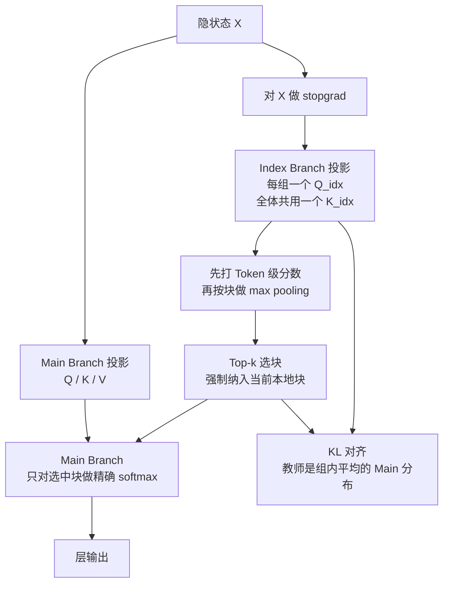
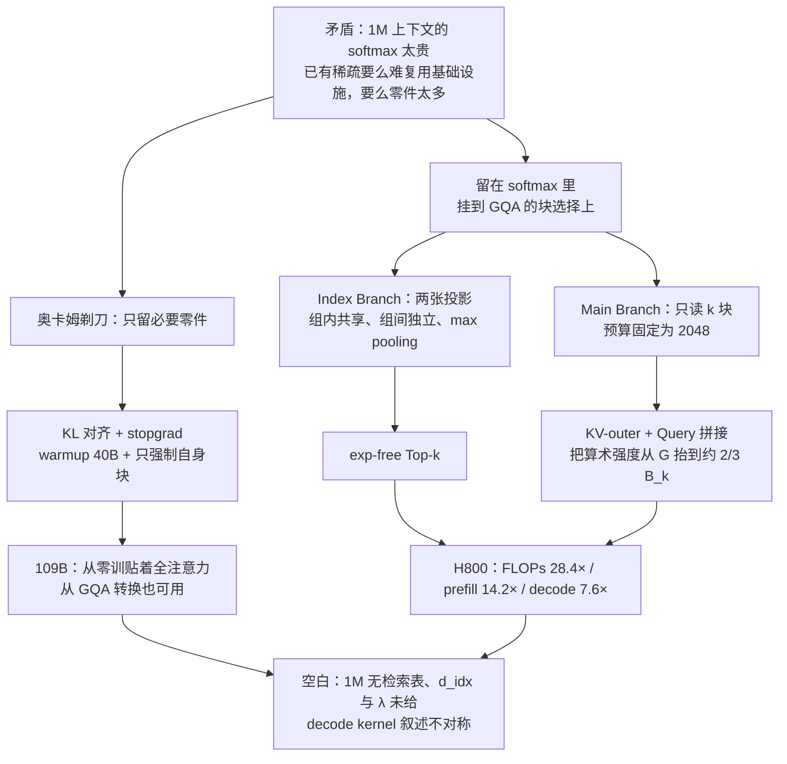

# MSA：先用便宜索引挑块，再让主注意力只读固定预算

<!-- release-date: 2026-06-01 -->

> 本文依据 MiniMax 发布的 **MiniMax Sparse Attention**，即 arXiv:2606.13392v2、封面日期 2026-06-12、共 30 页（正文与参考文献 p.1–21，附录 p.22–30）。动笔前已核对 [arXiv 官方页](https://arxiv.org/abs/2606.13392) 与 [官方 API](http://export.arxiv.org/api/query?id_list=2606.13392)：该论文只有 v1（2026-06-11 14:23:41 UTC）与 v2（2026-06-12 09:42:25 UTC）两个版本，**本地 PDF 就是最新的 v2**，不存在更新修订。页码均指这份 PDF 本身的页码。本文会把三件事分开写：**报告明确写了什么**、**我们如何理解它**（凡属推算、换算或图上读数都会写明）、**外部资料补充**（会给出链接并标注）。
>
> 这是一篇技术论文，不是 MiniMax-M3 的基模报告。生产模型已用上 MSA，只作为外部事实点到为止，不展开 M3 的训练 recipe。

## 阅读前先搭一张最小地图

这篇论文只讲注意力这一件事，但它借了不少系统领域的词。先把会反复出现的概念翻成人话。

- **Token（词元）**：模型读写内容时的基本小块。一百万字的文档会被切成上百万个 Token。
- **Query / Key / Value（查询 / 键 / 值）**：注意力的三个角色。Query 是当前 Token 的提问，Key 是每个历史位置的索引标签，Value 是它真正携带的内容。打分靠 Query 与 Key 做点积。
- **KV Cache（Key-Value Cache，键值缓存）**：生成时把算过的 Key 和 Value 留下来，避免每吐一个新 Token 就重算整段历史。
- **Prefill 与 Decode（预填充与解码）**：处理一个请求分两段。Prefill 一次性读完输入提示，Decode 随后逐个吐字。两段的硬件瓶颈不同。
- **GQA（Grouped-Query Attention，分组查询注意力）**：一组里的多个 Query 头共用一套 KV。目的是减少 decode 时要从显存搬运的 KV 数量。论文把「共用同一套 KV 的那些 Query 头」叫做一个 **GQA group（GQA 组）**。
- **块（block）**：把连续 $B_k$ 个 Token 当成一个搬运单位。论文默认 $B_k=128$（PDF p.6）。
- **Top-k**：只保留分数最高的 $k$ 个对象，其余完全不算。论文默认 $k=16$（PDF p.6）。
- **KL 散度（Kullback–Leibler divergence）**：衡量两个概率分布有多不像。论文用它让索引器的打分去模仿主注意力已经学会的关注模式。
- **算术强度（arithmetic intensity）**：一段计算的运算次数与访存字节数之比。高于 GPU 临界值是 compute-bound（被算力卡住），低于是 memory-bound（被带宽卡住）。

这篇论文自己造的名字只有一个：

- **MSA（MiniMax Sparse Attention，MiniMax 稀疏注意力）**：一种挂在 GQA 上的块稀疏注意力。它把一次注意力拆成两条支路——便宜的 **Index Branch（索引支路）** 负责挑块，昂贵的 **Main Branch（主支路）** 只对挑中的块做精确 softmax。

## 一句话先说清

MSA 想同时反对两件当时已经很常见的做法。

**第一件：为了稀疏，把注意力改成一套全新的、很难复用现有基础设施的结构。** 论文明确说自己走的是「稀疏 softmax 注意力」这条路，为的是尽量复用已经存在的软件和硬件栈（PDF p.2）。

**第二件：为了能训练、能加速，往稀疏注意力里塞进越来越多的分支、辅助头和写死规则。** 论文给自己定的原则是 Occam's razor（奥卡姆剃刀）：经过大量消融之后，只留下必要零件（PDF p.2）。

所以 MSA 的两条核心主张分别对着这两件事：

1. **挂在 GQA 上的块选择**：选择粒度是连续块，选择结果在同一个 GQA 组内共享，但不同组可以选不同的块；
2. **索引器只是选择器**：它不往层输出里掺一份自己的注意力，训练信号来自与主支路的 KL 对齐，并且梯度不许回流进骨干。

论文的完整实验规模是：约 109B 总参数、每 Token 激活约 6B 的 MoE 骨干，在 3T Token 预算下把 MSA 与全注意力 GQA 对照（PDF p.8–9）。

生产侧的外部事实是：MiniMax 后来把 MSA 用进了公开的 MiniMax-M3。那是另一份模型，规模和评测都不是这篇论文的实验对象。本文不把它写成第二份基模综述。

## 先看全景：一次 MSA 注意力发生了什么

这张图根据论文 Figure 1、§3.1–3.2 与 Algorithm 1 重画（PDF p.1、4–6），画的是一次训练前向的**机制顺序**，不代表两条支路的耗时比例。推理时没有 KL。

三组必须先记住的数字，后面每一处都会回到出处：

| 项目 | 取值 | 出处 |
|---|---|---|
| 块大小 $B_k$ / 每组选中块数 $k$ | 128 / 16 | PDF p.6、9 |
| 每条 Query、每个 GQA 组的 KV 预算 | $k B_k=2048$ | PDF p.12 |
| 109B 实验骨干 | 41 层 MoE，总参约 109B，激活约 6B | PDF p.8 |
| 注意力配置 | 64 个 Query 头、4 个 KV 头，$d_h=128$，RoPE 维 64 | PDF p.8–9 |
| 训练预算 | 3T Token；索引器 warmup 40B Token | PDF p.9 |

## 第一层问题：超长上下文到底卡在哪

### 卡点一：全注意力的成本是平方增长的

标准因果 softmax 注意力里，每个 Query 都要与它前面所有 Key 比一次。论文把序列长度写成 $N$，头数写成 $H_q$，头维度写成 $d_h$，于是一次因果注意力的浮点运算量是（PDF p.3，式 1）：

$$
F_{\mathrm{GQA}}(N)=2 H_q d_h N^2
$$

式子本身很朴素：每个 Query 头都要扫完整段可见历史。真正的问题在下标 $N$ 要进平方——上下文从 10 万扩到 100 万，比较工作不是多十倍，而是多一百倍。

论文开篇把这件事定为部署尺度上的主要瓶颈，并指出需求已经不再只是「把一本长文档塞进去」，而是 agent 工作流、仓库级代码推理和持久记忆，往往要同时盯住几十万到上百万 Token（PDF p.1–2）。

### 卡点二：平方项会同时打中训练和推理

超长上下文不只让推理变慢。论文说，二次复杂度会同时给训练和推理加上严重的计算与显存压力，再叠上生产部署的延迟和吞吐约束（PDF p.2）。所以它要的不是「推理期再打一个补丁」，而是一条训练期就能用、推理期也能兑现的稀疏路径。

### 卡点三：少算了，还不等于墙上时钟变快

后面 Kernel 一节会把这条展开。这里先记一句论文自己的判断：要把理论上的稀疏变成端到端加速，必须把算法和 GPU 执行路径一起设计（PDF p.2）。Index 打分、Top-k、反向索引、Query 收集和负载均衡都会把账面 FLOPs 收益吃掉一块（PDF p.12）。

## 已有的路各自付什么代价

论文没有直接跳到自己的方案。它把前人做法收成几类，每类只点出 MSA 真正要躲开的那条代价。下面是**论文原文的口径**，不是我们替它做的完整综述。

**第一类：换掉 softmax。** 线性注意力和 Mamba 这类状态空间模型，用线性复杂度的替代物或选择性递归替换注意力。论文承认它们能降成本，但 MSA 选择留在 softmax 里，为的是复用现有软硬件（PDF p.2、13）。

**第二类：混合栈。** 把一部分 softmax 层换成线性注意力或滑动窗口，减少二次层的数量。论文把自己和 MiniMax-01 / MiniMax-M1 的混合路线分开：MSA 要稀疏化的是 softmax 本身，而不是少放几层 softmax（PDF p.2、13）。混合路线的细节见本仓库已发布的 [MiniMax-01](/reports/MiniMax/MiniMax-01) 与 [MiniMax-M1](/reports/MiniMax/MiniMax-M1)，本文不重讲。

**第三类：写死的稀疏图案。** 局部窗口、全局 Token、attention sink 加滑动窗口。论文的批评是：它们用的是与内容无关的支持集（PDF p.13）。

**第四类：推理期才稀疏。** H2O、SnapKV、Quest、MInference、FlexPrefill、InfLLM 这类方法，在已经预训练好的全注意力骨干上，到服务期才构造稀疏支持。论文的批评很具体：它们继承了全注意力的训练成本，并且至少有一个推理阶段仍然接近全注意力速度（PDF p.13）。

**第五类：预训练期就训练选择器。** 这是 MSA 最近的邻居，论文点了四个名字：NSA、InfLLM-V2、MoBA、DSA（PDF p.13）。它把自己和它们的差别收成两句话：**按 GQA 组做 Top-k 共享，加上按块选择。** 这样既能做多组、块粒度的检索，又能让 KV 读取保持连续（PDF p.13）。代际对照可以链到本仓库已发布的 [NSA](/reports/DeepSeek/NSA)、[MoBA](/reports/Moonshot/MoBA) 和 [DeepSeek-V3.2](/reports/DeepSeek/DeepSeek-V3.2)，本文只讲 MSA 自己怎么走完这条路。

把五类批评串起来，就得到 MSA 的设计约束清单：

1. 留在 softmax 注意力里，不另起一套线性公式；
2. 选择必须依赖内容，不能写死「永远看开头」或「永远看最近一段」；
3. 训练期就要稀疏，不能把训练成本原样留给全注意力；
4. 选择粒度必须是连续块，并且与 GQA 的 KV 共享单位对齐；
5. 零件能少则少，能从全注意力 checkpoint 转过来更好。

## 总框架：把一次注意力拆成「先挑块，再精读」

论文先在 §2.2 把稀疏注意力写成两段式（PDF p.3，式 2）。人话版是：

1. 用一个索引器，根据当前 Query 和已经看见的 Key，决定该看哪些位置；
2. 主注意力只对选中的那些 Key / Value 做标准的缩放点积 softmax。

它把第一段叫做 Index Branch，第二段叫做 Main Branch。索引器的参数记作 $\phi$：固定规则的索引器可以没有参数，可学习的索引器才有 $\phi$。

然后 §2.3 把粒度收紧到 MSA 真正采用的那一档（PDF p.3）：

- 不按单个 Token 选，按大小为 $B_k$ 的块选；
- 不让每个 Query 头各选各的，而让同一个 GQA 组共享一份块索引 $\mathcal{I}_i^{(r)}$。

块的定义是连续切分（PDF p.3，式 4）：

$$
\mathcal{B}_b=\{(b-1)B_k+1,\ldots,\min(b B_k,N)\},\qquad b=1,\ldots,\lceil N/B_k\rceil
$$

$\mathcal{B}_b$ 就是第 $b$ 个块覆盖的 Token 下标。对位置 $i$、GQA 组 $r$ 来说，索引器输出的是一组块号，主注意力只读这些块里因果可见的 Token。

**我们如何理解它。** 这一步看起来只是「变粗粒度」，但它同时回答了两个不同的问题。对算法来说，块选择假设相邻 Token 往往一起有用；对硬件来说，连续块才能让 Tensor Core 吃到规则的矩阵乘。论文把这两件事绑在同一条设计上，后面 Kernel 一节会看到，这个绑定不是修辞。

## 为什么一定要挂在 GQA 上

这是全文最容易被当成「实现细节」而滑过去的决定。

GQA 的做法是：Query 头有 $H_q$ 个，KV 头只有 $H_{kv}$ 个，相邻的 $G=H_q/H_{kv}$ 个 Query 头共用一套 KV。论文把每一套被共用的 KV 叫做一个 GQA 组（PDF p.3）。

如果还在这种架构上让每个 Query 头独立挑 KV 子集，decode 时真正要搬的字节数，就等于**同一组里所有头选择结果的并集**。计算量按每头自己的 $k$ 算，访存量按并集算。组内选得越散，GQA 省下的那份共享就被吃回去。

MSA 的回答是式 (3)（PDF p.3）：同一个 GQA 组里的所有 Query 头，必须共用一份块索引。实验配置里 $H_q=64$、$H_{kv}=4$，所以 $G=16$，全模型有 4 个 GQA 组（PDF p.8–9）。组与组之间**可以**选不同的块；组内 16 个头**必须**看同一批块。

**收益：**

- 选择单位和 KV 共享单位对齐，decode 访存按组而不是按头的并集计；
- 连续块让后续 KV-outer kernel 能一次读进一整块 KV；
- 论文在附录可视化里显示，4 个组确实学出了不同的长程条纹，并没有塌成一份全局选择（PDF p.22，Figure 5）。

**代价与边界：**

- 组内 16 个头的关注被强制拉齐，论文没有做「逐头独立选择」的精度对照；
- 这套逻辑的前提是骨干已经是 GQA。论文结论里说，当前大多数开源前沿模型都共用 GQA 骨干，所以这套配方改动应该很小（PDF p.13）。它没有在 MHA 或 MLA 上做实验。

**可迁移启发：** 系统里某份资源已经被多个消费者共享时，针对它的动态决策必须落在同一个共享单位上。否则消费者各做各的决定，实际成本按并集算，共享的意义就没了。NSA 对 GQA 组内选择一致性的讨论见 [NSA](/reports/DeepSeek/NSA)；MSA 把同一条约束收成了更窄的实现：组内共享、组间独立。

## 核心设计一：Index Branch，用两张投影给每个组挑 $k$ 块

### 旧问题

要挑块，先得给每块打分。打分网络如果太重，省下来的主注意力又被还回去；如果完全无参数，召回又容易差。论文给 Index Branch 的预算非常苛刻：相对标准 GQA，它只新加两张投影矩阵（PDF p.4）。

### 新设计

对输入隐状态 $X\in\mathbb{R}^{N\times d_{\mathrm{model}}}$，索引支路做两件事（PDF p.4，式 5）：

$$
Q^{\mathrm{idx}}=X W_q^{\mathrm{idx}}\in\mathbb{R}^{N\times H_{kv}\times d_{\mathrm{idx}}},\qquad
K^{\mathrm{idx}}=X W_k^{\mathrm{idx}}\in\mathbb{R}^{N\times 1\times d_{\mathrm{idx}}}
$$

拆开读：

1. **每个 GQA 组有一个自己的 index query 头**，所以 $Q^{\mathrm{idx}}$ 的头数等于 $H_{kv}$；
2. **全体组共用一个 index key 头**，所以 $K^{\mathrm{idx}}$ 的头数是 1；
3. 两边都投影到索引维度 $d_{\mathrm{idx}}$。

然后先打 Token 级分数，再聚合成块级分数（PDF p.4，式 6）：

$$
S_{i,j}^{\mathrm{idx},(r)}=\frac{(Q^{\mathrm{idx}})_i^{(r)}(K^{\mathrm{idx}})_j^{\top}}{\sqrt{d_{\mathrm{idx}}}},\qquad
M_{i,b}^{\mathrm{idx},(r)}=\max_{\substack{j\in\mathcal{B}_b\\ j\le i}} S_{i,j}^{\mathrm{idx},(r)}
$$

$r$ 是 GQA 组号，$j\le i$ 是因果掩码，没有任何可见 Token 的块被打成 $-\infty$。最后按块级分数取 Top-k（PDF p.4，式 7），并且**永远纳入包含当前位置 $i$ 的本地块**。这份块索引 $\mathcal{I}_i^{(r)}$ 被组内全部 $G$ 个 Query 头共用。

### 工作机制里有两个容易忽略的细节

**第一，块分数用的是 max pooling，不是平均。** 论文正文只写了 $\max$，没有另做「max 对 mean」的消融。**我们如何理解它：** 一块里只要有一个 Token 特别相关，整块就值得被捞上来。对「针在干草里」这种检索，max 比 mean 更不容易把那根针稀释掉。这是我们对公式的解释，不是论文写明的对比结论。

**第二，组间独立、组内共享，靠的是「每组一个 $Q^{\mathrm{idx}}$、全体共用一个 $K^{\mathrm{idx}}$」。** 各组看见的是同一份索引 Key，差别出在各组自己的 Query。Figure 5 用这个结构学出了不同的长程条纹（PDF p.22）。

### 收益

- 新增参数只有 $W_q^{\mathrm{idx}}$ 和 $W_k^{\mathrm{idx}}$ 两张矩阵（PDF p.4）；
- 选择结果天然是块级、组共享，后面的 kernel 不用再做头间并集；
- 推理期索引器只需要块内最大值，不必走 Value 聚合，也不必做 softmax 的 exp（PDF p.30）。

### 代价与边界

- 正文**没有给出实验用的 $d_{\mathrm{idx}}$**。复杂度公式里有它，109B 配置表里没有它。
- Top-k 本身不可微，索引投影收不到语言模型损失的梯度。这不是实现疏漏，是下一节 KL 对齐要解决的问题（PDF p.5）。
- 强制本地块会占用一个名额，真正留给索引器自由选择的是 $k-1$ 块。

### 可迁移启发

打分器能省到什么程度，往往取决于你愿不愿意让它「只负责路由、不负责回答」。MSA 把索引器做成纯选择器，回答全部交给 Main Branch。后面的消融表明，这个决定不是一开始就成立的，而是 warmup 出现之后才敢把索引器的 Value 头砍掉（PDF p.24、29–30）。

## 核心设计二：Main Branch，只对选中块做精确 softmax

给定 $\mathcal{I}_i^{(r)}$，主支路对组内任意 Query 头 $h$ 做标准注意力，但 Key / Value 只从选中块里取因果可见的 Token（PDF p.4，式 8）：

$$
O_i^{(h)}=\mathrm{softmax}\left(\frac{Q_i^{(h)}\big(K^{(r)}[\mathcal{I}_i^{(r)}]\big)^{\top}}{\sqrt{d_h}}\right)V^{(r)}[\mathcal{I}_i^{(r)}]
$$

$Q_i^{(h)}$ 是位置 $i$、头 $h$ 的 Query；$K^{(r)}$、$V^{(r)}$ 是第 $r$ 组的 KV。方括号表示按块索引收集。组内各头共用同一份 $\mathcal{I}_i^{(r)}$，但各自保留自己的 Query 投影。

因为选中块里最多只有 $k B_k$ 个可见 Token，单条 Query 的主注意力成本从 $O(N)$ 变成 $O(k B_k)$，并且**不随序列变长而增加**（PDF p.4）。代入实验配置，$k B_k=16\times 128=2048$（PDF p.12）。

**我们如何理解它。** 2048 这个数字看起来眼熟，因为 DeepSeek-V3.2 的 DSA 也是每条 Query 精读 2048 个位置。两者的差别不在预算大小，而在选择粒度：DSA 按 Token 选、所有头共享一份索引；MSA 按 128 Token 的块选、按 GQA 组各选一份。口径见已发布的 [DeepSeek-V3.2](/reports/DeepSeek/DeepSeek-V3.2)，不要把两篇的 2048 理解成同一种 2048。

**代价：** 块边界可能把一句关键话切成两半。论文用 $B_k=128$ 作为部署点，并在附录用 32 / 64 / 128 做了对照；PPL 几乎不动，RULER-32K 从 66.1 降到 64.6，没有出现崩溃（PDF p.28–29，Table 4）。它没有测更粗的 256 或 512。

## 核心设计三：KL 对齐、梯度切断、warmup 和强制本地块

Top-k 是离散的。选中哪些块一旦变成路由决定，语言模型损失就无法直接训练 $W_q^{\mathrm{idx}}$ 和 $W_k^{\mathrm{idx}}$（PDF p.5）。MSA 用四件套把这件事绕开：KL 损失、梯度切断、索引器 warmup、强制本地块。

### KL 损失：让索引器去模仿主支路已经学会的关注

对位置 $i$、组 $r$，先把选中块展开成因果可见的 Token 集合 $\mathcal{I}_{i,\mathrm{tok}}^{(r)}$。然后在这个集合上定义两个分布（PDF p.5，式 9）。

索引器分布是它自己的 Token 级分数做 softmax：

$$
P_{i,j}^{\mathrm{idx},(r)}=\frac{\exp(S_{i,j}^{\mathrm{idx},(r)})}{\sum_{u\in\mathcal{I}_{i,\mathrm{tok}}^{(r)}}\exp(S_{i,u}^{\mathrm{idx},(r)})}
$$

教师分布不是某一个主注意力头，而是把组内 $G$ 个 Query 头的 softmax 分布做算术平均：

$$
P_{i,j}^{(r)}=\frac{1}{G}\sum_{\ell\in\mathcal{H}_r}\frac{\exp(S_{i,j}^{(\ell)})}{\sum_{u\in\mathcal{I}_{i,\mathrm{tok}}^{(r)}}\exp(S_{i,u}^{(\ell)})}
$$

然后对所有位置、所有 GQA 组取平均 KL（PDF p.5，式 10）：

$$
\mathcal{L}_{\mathrm{KL}}=\frac{1}{N H_{kv}}\sum_{i=1}^{N}\sum_{r=1}^{H_{kv}}D_{\mathrm{KL}}\big(\mathrm{stopgrad}(P_{i,\cdot}^{(r)})\parallel P_{i,\cdot}^{\mathrm{idx},(r)}\big)
$$

模型总损失是 $\mathcal{L}=\mathcal{L}_{\mathrm{LM}}+\lambda\sum_{\mathrm{layers}}\mathcal{L}_{\mathrm{KL}}$（PDF p.6，Algorithm 1）。**$\lambda$ 的具体数值论文没有给。**

三件必须盯住的事：

1. **KL 只在选中支持集上算**，不是对整段历史。warmup 结束之后，索引器只被要求「在你已经挑中的那些位置上，把相对比例学对」，而不是「先把全世界的块序学对」。
2. **教师在概率层面平均，而不是在 logits 层面平均。** 组内 16 个头可以关注不同 Token，平均之后才成为索引器要追的目标。
3. **教师 $P$ 被 stopgrad。** KL 不许回头改 Main Branch 的 Q / K 投影。

### 梯度切断：别让对齐损失去改骨干

光切断教师还不够。默认 autograd 下，KL 的梯度会穿过索引投影回到隐状态 $X$，再顺着残差流进整棵骨干。论文说这会把 KL 从「索引器的局部监督」变成「骨干的额外目标」（PDF p.25）。

它观察到两种失败（PDF p.25）：

- $\lambda$ 较大时，偶发的 KL 梯度尖峰打进骨干，梯度范数爆炸，LM loss 在几百 step 内发散（Figure 8）；
- 即便 $\lambda$ 能稳住训练，短上下文基准也会慢慢回退（Figure 9）。论文把后者归因于一种自蒸馏：骨干可以通过**简化 Main Branch 的注意力分布**来降低 KL，而不是把索引器教得更好。

切断的实现是式 (11)（PDF p.5）：

$$
Q^{\mathrm{idx}}=\mathrm{stopgrad}(X)W_q^{\mathrm{idx}},\qquad
K^{\mathrm{idx}}=\mathrm{stopgrad}(X)W_k^{\mathrm{idx}}
$$

再叠加教师一侧的 stopgrad，KL 就只更新两张索引投影。

Figure 8 的对照很刺眼：**本文从图上读到**，不切断时 LM loss 停在大约 9–10 并发散，梯度范数在 300–500 step 附近冲到 $10^5$ 量级；切断后 LM loss 降到大约 2.5，梯度范数保持平稳（PDF p.25）。Figure 9 里，切断后 Arc-Challenge / BBH / MMLU / HellaSwag 的回退消失（PDF p.25）。这些是图上读数，论文没有给数值表。

### Indexer warmup：先让主注意力自己变锐，再把方向盘交给索引器

论文观察到，训练最早期 Main Branch 的注意力熵会从平滑迅速变尖，再进入更慢的表征学习（PDF p.26，Figure 10）。如果从 step 0 就做 Top-k，索引器要去追一个还在剧烈变化的目标，而它自己的选择几乎是随机的。早期选错会把主支路路由到无信息 Token，骨干和 KL 监督一起变差。

warmup 的做法（PDF p.5、26）：

1. 前若干步两条支路都跑**全注意力**，用对整段历史的 KL 训练新加的索引投影；
2. 过了 $T_{\mathrm{warm}}$ 之后切到稀疏，KL 改在 Top-k 选中位置上算。

109B 实验把这段 warmup 写成 40B Token（PDF p.9）。10B 预实验没有给出 $T_{\mathrm{warm}}$ 的 step 数。同一套日程也被用于把预训练好的全注意力 checkpoint 稀疏化（PDF p.5）。

Figure 11 在 10B 预实验上比较有无 warmup：**本文从图上读到**，warmup 曲线在 Arc-Challenge、BBH、MMLU、HumanEval、RULER 上整体更高，横轴大约到 400B Token（PDF p.26）。论文的定性结论是：短上下文和长上下文检索都更好（PDF p.26）。

### 强制本地块：给「正在写的那一块」留一个名额

每个 Query 所在的那个块——论文后来称为 special incomplete self block（特殊的、可能还没写完的自身块）——在训练和推理时都强制选入（PDF p.5、29）。它占用 $k$ 个名额里的一个，剩下 $k-1$ 个才由索引器自由选。目的是防止退化选择漏掉当前邻域。

注意：最终配方**并不**强制选序列第一个块，也**不**强制选一大段局部窗口。那两件事被附录 C.2 删掉了，后面消融节会讲（PDF p.29）。

### 这一套训练设计的收益、代价和启发

**收益：** 离散 Top-k 变得可训练，而且不需要让索引器再输出一份注意力去抢层输出；warmup 让从零训和从 GQA checkpoint 转换走同一条日程。

**代价：**

- 多一个要调的 $\lambda$，论文没公开取值；
- warmup 期间主支路仍是全注意力，稀疏带来的训练加速要等 40B Token 之后才开始（PDF p.9）；
- KL 只在选中支持集上算，意味着「没被选中的块」没有直接的负样本监督。漏召回要靠 warmup 的全序列阶段，以及本地块兜底。

**可迁移启发：** 离散路由最稳的监督，往往不是另造一个辅助任务，而是让它去模仿一条**已经被主损失训练过、并且被切断梯度的教师分布**。切断和模仿要同时做：只模仿不切断，教师会为了好模仿而变傻。

## 复杂度账：平方项还在，只是被搬到了更便宜的算子上

在相同的 $H_q$、$H_{kv}$、$d_h$ 和长度 $N$ 下，论文给出（PDF p.6，式 12）：

$$
F_{\mathrm{GQA}}(N)=2 H_q d_h N^2,\qquad
F_{\mathrm{MSA}}(N)=\underbrace{H_{kv}d_{\mathrm{idx}}N^2}_{\text{Index Branch}}+\underbrace{4 H_q d_h N k B_k}_{\text{Main Branch}}
$$

GQA 的主路径仍随 $N^2$ 涨。MSA 留下一个很轻的平方项（索引打分），主注意力变成与 $N$ 无关的固定预算 $k B_k$。当 $k B_k\ll N$ 且 $H_{kv}d_{\mathrm{idx}}\ll H_q d_h$ 时，两者的差距随 $N$ 变大（PDF p.6）。

**本文验算。** 正文没有写实验用的 $d_{\mathrm{idx}}$。若取 $d_{\mathrm{idx}}=d_h=128$，并代入 $H_q=64$、$H_{kv}=4$、$k B_k=2048$：

- 1M 处 GQA 的每 Token 注意力 FLOPs 约为 $2\times 64\times 128\times 10^6=16.384\,\mathrm{G}$；
- MSA 索引约为 $4\times 128\times 10^6=0.512\,\mathrm{G}$，主支路约为 $4\times 64\times 128\times 2048=0.067\,\mathrm{G}$，合计约 $0.579\,\mathrm{G}$；
- 比值约 $28.3\times$，与论文在 Figure 4 标注的 $28.4\times$ 对齐（PDF p.12）。

这是验算，不是论文原文。它还暴露一件论文没有强调的事：**1M 处 MSA 剩下的注意力 FLOPs，大头已经是索引支路那个「便宜的平方」，不是主注意力。** 再往更长做，优化索引打分会比继续减小 $k$ 更关键。

## 核心设计四：exp-free Top-k，以及为什么外循环要按 KV 块转

§4 写的是**稀疏 prefill** 的 GPU 内核（PDF p.6）。Decode 的 7.6× 是测出来的（PDF p.1、12），但 decode kernel 没有得到同等篇幅的结构说明。

### exp-free Top-k：排序不需要 softmax

softmax 保序：$s_i\le s_j$ 当且仅当 $\mathrm{softmax}(s)_i\le\mathrm{softmax}(s)_j$。所以选 Top-k 时不必做 max / exp / sum，直接对原始分数排序（PDF p.6）。这和附录最后那句「推理期索引器完全避开 Value 聚合和指数运算」是同一条逻辑（PDF p.30）。

$B_k=128$、$k=16$ 是和这个 kernel 一起选定的：更大的 $B_k$ 提高主注意力算术强度，更小的 $k$ 让每行候选块数 $B$ 和 $k$ 都落在通用 Top-k 内核不划算的区间里（PDF p.6）。实现上，warp 的 32 条 lane 各流 $1/32$ 的输入行，在共享内存里维护一个 $k$ 元最小堆，堆根缓存在寄存器，最后做 $k$ 轮 shuffle 归并（PDF p.6）。

Table 1 是 H800、fp32、未排序输出、50 次 warmup 后的中位延迟，单位微秒（PDF p.7）：

| 序列长度 $N$ | 块数 $B$ | $k$ | torch.topk | TileLang | 论文实现 | vs torch | vs TileLang |
|---:|---:|---:|---:|---:|---:|---:|---:|
| 128K | 1024 | 16 | 3970 | 2864 | 779 | 5.1× | 3.7× |
| 128K | 2048 | 32 | 5378 | 3630 | 1991 | 2.7× | 1.8× |
| 512K | 4096 | 16 | 33810 | 17779 | 7880 | 4.3× | 2.3× |
| 512K | 8192 | 32 | 57659 | 26100 | 21326 | 2.7× | 1.2× |

部署点就是第一行的 $k=16$。论文强调三种实现产出的索引集合完全相同（PDF p.7）。

**边界：** 这是选块 kernel 的微基准，不是端到端注意力。增益在 $k=16$ 时最大，$k=32$ 时明显收窄。

### KV-outer：为了把算术强度从 $G$ 抬到约 $\frac{2}{3}B_k$

稀疏 prefill 有两种循环顺序。论文用 2 字节元素（bf16 体量）估算 IO，并注明 fp8 只改变绝对 IO、不改变两种顺序的对比（PDF p.7）。

**Q-outer（Query 在外循环）：**

$$
\mathrm{FLOPs}=4 H_q N d_h k B_k,\qquad
\mathrm{FLOPs}/\mathrm{IO}\approx G
$$

**KV-outer（KV 块在外循环，再收集选中了这块的 Query）：**

$$
\mathrm{FLOPs}=4 H_q N d_h k B_k,\qquad
\mathrm{FLOPs}/\mathrm{IO}\approx \tfrac{2}{3}B_k
$$

实验里 $G=16$，$B_k=128$，于是 $\frac{2}{3}B_k\approx 85$。$85\gg 16$，所以选 KV-outer（PDF p.7）。**本文对近似号的验算：** 忽略 $H_{kv}$ 项后，$\mathrm{FLOPs}/\mathrm{IO}=4k B_k/(6k+2)$；代入 $k=16$ 得到 83.6，与 $85.3$ 接近。

人话版：Q-outer 时，每个 Query 选的 KV 子集不同，KV 会被反复读；KV-outer 时，一块 KV 只读一次，把「选中了它的那些 Query」聚过来一起算。算术强度跟的是块长 $B_k$，而不是 GQA 组大小 $G$。

这条选择立刻引出三个工程问题，论文都给了对应零件。

**1. 热点块会压垮「一块一个 CTA」。** 序列开头那个 sink 块几乎被所有 Query 选中，任何热门块都会变成同样的热点。调度器于是沿 Query 维把每个 KV tile 切成至多约 $2k B_k$ 个 Query 的 chunk，让许多 CTA 分担同一份 K/V 加载（PDF p.7）。

**2. 不能用原子加。** 一条 Query 的 $k$ 个部分和现在由 $k$ 个 CTA 分别产出。调度器预先给每个（Query, chunk）对分配 $\mathrm{O_{buf}}$ 里的槽位 $s\in[0,k)$，与 Query 下标 $i$ 打成 32-bit handle，注意力 kernel 写到预分配偏移，不用 atomics（PDF p.7）。

**3. 不能在单个 kernel 里做完 softmax。** 前向因此拆成两个 kernel：注意力 kernel 写出局部归一化的部分输出 $\mathrm{O_{buf}}$ 和每份 logsumexp $\mathrm{LSE_{buf}}$；combine kernel 再按标准 split-K 公式合并。两者用 Programmatic Dependent Launch 遮住 kernel 间启动延迟（PDF p.8）。

最后还有一步 **Query concatenation（Query 拼接）**。KV-outer 时，一个 KV tile 往往只对应几十个 Query。如果一次只处理一个位置，score MMA 的 $M$ 维只有 $G=16$。因为这些 Query 共享同一份 KV 操作数，kernel 把 $\lceil 128/G\rceil$ 个位置连同各自的 $G$ 个头打进 $128\times 128$ 的 score MMA（PDF p.8）。代入 $G=16$，就是 8 个 Query 位置拼在一起。

**我们如何理解它。** Q-outer 做不到这一步，因为不同 Query 选的 KV 不同，没法沿序列维拼接。KV-outer 不是只为了少读 KV，它还把「把 MMA 喂饱」这件事变成合法操作。

### 训练侧：把 KL 的 LSE 融进主前向，反向用持久负载均衡

KL 只影响反向梯度，所以前向不必再跑一次独立的 KL kernel。主前向直接把 $\mathrm{LSE_{main}}$ 和 $\mathrm{LSE_{idx}}$ 写到全局内存；索引支路保存每块 LSE，再在 top-k 块上归约得到 $\mathrm{LSE_{idx}}$。反向 kernel 读这些标量进 softmax，省掉重复前向（PDF p.8）。

反向还要面对「有的 tile 特别忙、有的特别闲」。kernel 做成 persistent grid，CTA 用全局原子计数器抢活；每个 tile 再按收集到的 Query 数切成 sub-tile，并设最小粒度以免切得太碎（PDF p.8）。

**代价：** §4 几乎全是 prefill。decode 的 7.6× 被当作测得的墙钟加速写在摘要和 Figure 4，但读者无法从正文复述 decode kernel 的循环顺序、是否仍用 KV-outer、以及 KV Cache 布局。GitHub 上后来公开的是推理 kernel，那是外部实现，不能回写进论文结论。

## 109B 实验：从零训一条，从 GQA 转一条

### 实验对象不是 M3

§5 的模型是同一个 41 层 MoE 家族：总参约 109B，每 Token 激活约 6B；前 3 层稠密，后 38 层 MoE；词表 200K，$d_{\mathrm{model}}=3072$；注意力 64 / 4 / 128，RoPE 维 64；每层 128 个 routed expert + 1 个共享 expert，top-4（PDF p.8–9）。稀疏训练与评测一律 $B_k=128$、$k=16$（PDF p.9）。

数据是文本与图像 / 视频的混合，论文称之为 native multimodal training（原生多模态训练）（PDF p.8）。优化器、学习率、batch、语料配比和训练硬件**都没有写**。

两条路线共享 3T Token 总预算（PDF p.9）：

| 路线 | 怎么训 | Token 切分 |
|---|---|---|
| Full Attention | 标准 GQA 全注意力 | 3T |
| MSA-PT | 从零稀疏预训练 | 40B warmup + 其余稀疏 |
| MSA-CPT | 从 2.6T 的 GQA checkpoint 换上 MSA 再继续 | 40B warmup + 360B 稀疏 CPT |

另外，MSA-CPT 在稀疏继续预训练之后，还做了约 140B Token 的长上下文扩展，用来测 HELMET 和 RULER（PDF p.11）。

### 训练动态：从零训几乎贴着全注意力走

Figure 2 把 MSA-PT 和 Full Attention 的 LM loss、梯度范数画在同一张 3T 图上。论文的结论是两条 LM loss 几乎不可区分，梯度范数始终落在同一范围，说明大规模下稀疏训练没有引入明显的优化退化或异常波动（PDF p.9–10）。

**本文从图上读到：** 两条 LM loss 都从大约 3.3 降到大约 1.21；最后 50B Token 的局部放大窗里，两条线仍然缠在 1.21–1.22（PDF p.10）。这是读图，不是论文表格。

Figure 3 画的是 MSA-CPT。warmup 阶段 KL 迅速下降；切到稀疏 CPT 之后 KL 保持在低位。论文还定义了两种召回（PDF p.9）：

- **block recall：** 主支路 Top-k 块集合与索引器选择的交，再除以主支路集合大小；
- **score recall：** 交上的那些块，占主支路注意力质量的比例。

论文的定性是：块召回保持有利，分数召回更高，说明捞回来的块覆盖了大部分主支路质量（PDF p.9）。**本文从图上读到：** 稀疏 CPT 期间 score recall 大约在 0.90–0.94，block recall 大约在 0.70–0.75（PDF p.10）。论文没有给数值表。

### Table 2：能力没有集中塌在某一类任务上

Table 2 是 3T 预算下的代表评测。论文自己的读法是：两条稀疏路线与全注意力大体相当；MSA-PT 在许多数学、图像、视频和长上下文检索上更强，说明从零适应稀疏图案有好处；MSA-CPT 更保守，在多数文本、代码和 PPL 上更贴近原 checkpoint，适合已经有稠密模型的转换；剩余差距随基准而变，不集中在单一能力（PDF p.10–11）。

完整数字如下（PDF p.11）。PPL 越低越好，其余越高越好；每行最优已按原文加粗逻辑保留。

| 组 | 基准 | Full | MSA-PT | MSA-CPT |
|---|---|---:|---:|---:|
| General | MMLU | 67.0 | **67.2** | 66.8 |
|  | MMLU-Pro | 38.5 | 38.8 | **39.1** |
|  | BBH | **67.7** | 66.6 | 66.1 |
|  | GPQA Hard | 25.9 | **26.3** | **26.3** |
|  | ARC Challenge | 82.7 | 82.5 | **82.9** |
|  | TriviaQA | 66.0 | 65.5 | **67.7** |
|  | WinoGrande | 58.3 | 60.9 | **62.0** |
| Math | GSM8K | 76.2 | **77.7** | 73.7 |
|  | MGSM | 44.1 | **46.0** | 44.2 |
|  | MathVista | 43.8 | **46.8** | 44.5 |
|  | OlymMATH Easy P@100 | 23.0 | **26.0** | 22.0 |
| Code | HumanEval | 61.0 | **64.0** | 57.9 |
|  | EvalPlus | 59.4 | **61.8** | 60.0 |
|  | BigCodeBench | 44.8 | 44.0 | **45.7** |
|  | MultiPL-E MBPP P@10 | **82.1** | 81.6 | 81.1 |
| Retrieval | RULER-8K | 79.8 | **84.2** | 77.2 |
|  | RULER-32K | 75.0 | **77.5** | 75.7 |
| Image | AI2D | 68.3 | **70.6** | 67.3 |
|  | ChartQA | 75.0 | **75.4** | 71.4 |
|  | MMMU | **46.8** | 45.9 | 44.5 |
|  | OCRBench v2 | 55.0 | **55.7** | 54.3 |
|  | CharXiv | 37.55 | **41.55** | 37.15 |
|  | VisualWebBench | 55.6 | **68.4** | 59.4 |
|  | CVBench | 57.0 | **59.7** | 58.8 |
| Video | EgoSchema | 29.6 | **37.6** | 25.8 |
|  | LongVideoBench | 38.5 | **41.8** | 38.9 |
|  | MLVU | 44.14 | **46.94** | 43.68 |
|  | MMVU | 45.8 | **47.5** | 45.8 |
|  | VideoMME | 41.11 | **45.48** | 39.65 |
|  | TemporalBench | 49.4 | **53.4** | 50.6 |
| PPL ↓ | TAU2 | 1.155 | **1.148** | 1.150 |
|  | AgentCompany | 1.248 | 1.249 | **1.247** |
|  | HLE | **1.275** | 1.278 | **1.275** |
|  | SWE | **1.216** | 1.218 | **1.216** |

读这张表时有三条需要分开写的判断。

**被表格支持的：** MSA-PT 没有系统性崩。VisualWebBench 55.6 → 68.4、EgoSchema 29.6 → 37.6、RULER-8K 79.8 → 84.2，都是稀疏从零训反而更高。Agent 任务的 PPL 与全注意力差在千分位。

**只是观察的：** 论文说 MSA-PT 的优势「说明原生稀疏预训练能让表征适应稀疏图案」（PDF p.10）。这是对表格的解释，没有再做「冻结表征只改注意力」之类的因果实验。

**转换路线的真实代价：** MSA-CPT 在 HumanEval 上 57.9 对全注意力 61.0，MMMU 44.5 对 46.8，VideoMME 39.65 对 41.11。论文把它写成「更保守、更贴近原 checkpoint」（PDF p.10），没有把这些下降解释成转换失败。

### 长上下文扩展：预算仍是 2048，128K 检索没有垮

MSA-CPT 再做约 140B Token 长上下文训练后，评测 HELMET-128K 和 RULER-128K（PDF p.11–12，Table 3）：

| 基准 | 子集 | Full | MSA-CPT | Δ |
|---|---|---:|---:|---:|
| HELMET-128K | Overall | 46.53 | 45.93 | -0.60 |
|  | ICL | 70.40 | 72.80 | +2.40 |
|  | Rerank/RAG | 34.60 | 32.50 | -2.10 |
| RULER-128K | Overall | 72.00 | 72.12 | +0.12 |
|  | CWE/FWE | 46.35 | 45.00 | -1.35 |
|  | MK/MQ/MV | 96.63 | 98.87 | +2.24 |
|  | QA1/QA2 | 47.80 | 46.80 | -1.00 |
|  | VT | 97.80 | 96.80 | -1.00 |

论文的结论是：每组仍然只看 $k B_k=2048$ 个 KV Token，MSA 仍能在很紧的预算下保住长上下文能力（PDF p.11）。Outlook 把 HELMET 上那 0.60 的 overall 缺口，写成「残留的长上下文检索差距」，并列为下一步要补的方向之一（PDF p.13）。

注意：这组 128K 数字只来自 MSA-CPT 的扩展实验，**没有 MSA-PT 的 128K 对照**，也没有 1M 检索表。摘要里的 1M 是效率数字，不是 HELMET / RULER 测到 1M。

### 效率：28.4× 是 FLOPs，14.2× / 7.6× 是 H800 墙钟

Figure 4 在同一套头配置（64 / 4 / 128，$B_k=128$，$k=16$）下画了三件事（PDF p.12）：

- 左：理论每 Token 注意力 FLOPs，1M 处相对 GQA 降 $28.4\times$；
- 中：测得的 prefill 延迟，1M 处 $14.2\times$；
- 右：测得的 decode 延迟，1M 处 $7.6\times$。

摘要补充这些墙钟数字测自 H800（PDF p.1）。论文自己把 FLOPs 和墙钟的缺口写得很清楚：稀疏路径要付索引构建、Top-k、反向索引物化、Query gather 和负载均衡，访存也不如稠密注意力规则，所以运行时加速小于理论 FLOPs 降幅；但随着长度增加，稠密基线继续按全序列涨，MSA 主预算固定，加速比会变大（PDF p.12）。

**本文从图上读到的趋势：** 三条 GQA 曲线都接近随长度直线上升，三条 MSA 曲线明显更平。论文只标注了 1M 这一个点，没有给出 32K 或 512K 的加速比数值。

**不要和官方博客的数字混在一起。** MiniMax 在 M3 发布博客里写的是：相对上一代模型，1M 处每 Token 计算量约 1/20，prefill 超过 9×，decode 超过 15×。那是 **M3 对 MiniMax 上一代** 的产品口径，对照物、模型规模都不是这篇论文的 109B vs GQA。博客链接见文末「资料与阅读边界」。

## 附录在删零件：最终配方是消融删出来的

附录分三块。A 是可视化，B 是 10B 预实验上的训练配方，C 是更靠近最终设计的结构消融。论文明确说 B 和 C 构成了主实验配方的经验基础（PDF p.11–12、22）。

### 附录 A：组间真的选出了不同的长程条纹

Figure 5 画的是第 1 层和第 18 层、各 4 个 GQA 组的索引选择概率。论文的读法是：所有头都把高概率放在局部对角线和 sink 列（最左侧）上，剩下的预算留给少数长程相对位置；非局部选择在组间并不相同，说明索引器学到的是组特异的稀疏图案，而不是塌成一份全局选择（PDF p.22）。

Figure 6 进一步看第一 Token 的平均注意力。第 4 层和第 24 层各采样 8 个头，论文的结论是：即使不强制索引器选第一个 KV 块，学出来的 Index Branch 仍然会给初始块高选择概率；每个头都把可观的注意力质量分给第一 Token（PDF p.22–23）。

**本文从图上读到的 Figure 6 数字**（PDF p.23）：

| 头 | Layer 4 | Layer 24 |
|---|---:|---:|
| H0 | 0.32 | 0.65 |
| H1 | 0.41 | 0.48 |
| H2 | 0.57 | 0.43 |
| H3 | 0.61 | 0.61 |
| H4 | 0.46 | 0.45 |
| H5 | 0.42 | 0.48 |
| H6 | 0.29 | 0.69 |
| H7 | 0.37 | 0.38 |

这些是读图，论文没有另给表。最小值已经到 0.29，最大值到 0.69，所以「普遍存在」说的是数量级，不是每个头都把一半质量分给 BOS。

### 附录 B.1：10B 预实验的规格

消融用的是 16 层、同一家族的 10B 级 MoE：词表 200K，$d_{\mathrm{model}}=2048$，GQA 32 / 4 / 128，RoPE 维 64，64 个 expert、top-4、expert 内维 1536；总参 10.53B，激活 1.47B。优化器、学习率日程和分词器与全规模一致，数据是全规模语料的子集（PDF p.23）。**预实验的训练 Token 数、$\lambda$ 和 $T_{\mathrm{warm}}$ 仍未给出。**

### 附录 B.2：索引器的梯度从哪来

因为 Top-k 不可微，论文试了两种给索引器送梯度的办法（PDF p.23–24）：

1. **Index Branch output：** 给索引支路再加一套 Value，算一份 $O^{\mathrm{idx}}$，经独立输出投影加到层输出上，让索引器通过下一 Token 预测被训练；
2. **KL loss：** 就是正文的 $\mathcal{L}_{\mathrm{KL}}$。

三种配置从 step 0 就稀疏训练：只靠 LM（带 $O^{\mathrm{idx}}$）、只靠 KL（丢掉 $O^{\mathrm{idx}}$）、两者都要。Figure 7 画的是相对全注意力 GQA 的分差（PDF p.24）。论文的定性是：

- 只有 LM：短上下文还在，长上下文检索很差——没有直接压在 Top-k 上的目标，索引器缺乏选对块的压力；
- 只有 KL：检索变好，短上下文变差——拿掉 $O^{\mathrm{idx}}$ 等于减少语言模型可用的注意力容量；
- LM + KL：两条轴上最均衡，因此成为 B 节后续消融的配置。

最终配方后来又把 Value 头删了。论文自己把时间线写清楚：B.2 还需要 $O^{\mathrm{idx}}$ 才能从零稀疏；等 B.4 的 warmup 出现之后，C.3 证明 Value 头不再必要（PDF p.24、29–30）。

### 附录 B.3：KL 梯度必须停在索引器入口

这一节就是正文「Gradient Detach」的实验证据，前文已经用 Figure 8 和 Figure 9 讲过（PDF p.25）。这里只补一句论文没有写成公式的机制解释：**不切断时，降低 KL 有两条路，把索引器变好，或者把教师分布变简单；骨干控制得了教师，所以它会走第二条。** 切断之后，骨干不再能靠变简单来交卷。

### 附录 B.4：warmup 的动机是注意力熵的早期塌缩

Figure 10 画了 Layer 2 / 7 / 12 在早期稀疏训练中的注意力熵：前几百 step 迅速下降，随后部分回升并稳定（PDF p.26）。这是 warmup 的直接动机。Figure 11 则是有无 warmup 的下游对照，前文已述。

同一套 warmup 也被用于 CPT：先对齐新加的索引投影，再让它们控制主支路路由（PDF p.5、26）。

### 附录 B.5：可学习 attention sink 没有进最终配方

既然 Figure 6 显示第一 Token 会吸走质量，要不要像 GPT-OSS 那样给每个头加一个可学习的 sink logit，让它在 softmax 里和真实 Key 竞争？论文试了（PDF p.27）。

Figure 12 的四个头说明这件事没有被「加一个参数」解决（PDF p.27）：

| 头 | 可学习 sink | 第一 Token |
|---|---:|---:|
| Head 4 | 0.00 | 0.23 |
| Head 5 | 0.00 | 0.47 |
| Head 8 | 0.43 | 0.14 |
| Head 9 | 0.76 | 0.06 |

有的头把 sink 质量几乎全部交给新参数，有的头新参数是 0，第一 Token 仍是 implicit sink。Figure 13 在 AgentCompany / BrowseComp / HLE / SWE 的 PPL 上，可学习 sink 没有稳定优势（PDF p.28）。论文的放弃理由是：额外参数、实现复杂度，以及它并不能真正消灭 first-token sink（PDF p.27）。

### 附录 B.6：动态选择对固定滑窗，在相同预算下更低 PPL

对照基线删掉 Index Branch，改成固定图案：每个 Query 看第一个 Key 块，再加上一段以自身为终点、Token 预算相同的局部窗口。于是两种方法选择预算相同，只差「按位置写死」还是「按内容选」（PDF p.27–28）。

Figure 14 在 AgentCompany、BrowseComp、Toolathlon、TerminalBench、SWE、HLE 上，FLOP 对齐的滑窗（图例写 Hybrid-SWA）PPL 全程高于 MSA（PDF p.28）。论文的结论是：对这些 agent 任务，位置固定的稀疏图案不如内容依赖的选择（PDF p.28）。

**边界：** 这是 10B 预实验上的 PPL 曲线，不是 109B，也不是下游准确率。它支持「需要动态选择」这条主张，不能单独证明 109B 上滑窗一定更差。

### 附录 C.1：块大小 32 / 64 / 128，质量几乎不动

在保持选中 Token 总数不变的前提下改 $B_k$。论文注明这些 run 的训练迭代更少、评测子集也更小（PDF p.28）。Table 4（PDF p.29）：

| 基准 | Block 32 | Block 64 | Block 128 |
|---|---:|---:|---:|
| TAU2 PPL ↓ | 1.176 | 1.176 | 1.176 |
| AgentCompany PPL ↓ | 1.266 | 1.276 | 1.266 |
| HLE PPL ↓ | 1.299 | 1.299 | 1.300 |
| SWE PPL ↓ | 1.233 | 1.233 | 1.233 |
| RULER-8K | 72.5 | 72.8 | 73.8 |
| RULER-32K | 66.1 | 65.3 | 64.6 |

PPL 四位小数几乎锁死。RULER-32K 随块变粗略降，RULER-8K 反而略升。论文的结论是：可以用更大 KV 块换 kernel 效率，质量损失有限（PDF p.29）。它没有把 kernel 延迟和这块消融画在同一张图里，所以「换来效率」在 C.1 里是结构推论，不是这张表自己测到的加速。

### 附录 C.2：最终只强制「自身那一块」

早期稀疏训练曾经强制两件事：序列第一个块（sink），以及 Query 附近的固定局部窗口（PDF p.29）。动机是索引器还不可靠时，别把基本上下文漏掉。

后来发现这些先验不必写死。去掉强制 sink 和固定局部窗口后，模型仍然会在有用时把注意力集中到前缀，并且经常选中邻近 Token。Table 5 显示推理、代码、PPL 几乎不变；长上下文检索也大体相当，RULER-32K 甚至是 No Forced 61.5 对 Forced 65.8（PDF p.30）。论文据此把最终配方收成：不强制第一块，不强制大局部窗口，**只强制那个可能还没写完的自身块**（PDF p.29）。

这和正文 §3.2 的 Local Block 对得上，也和 Figure 5 / 6「不强制也会出现对角线和 sink」对得上。写死规则被当成训练初期的护栏，而不是能力来源。

### 附录 C.3：warmup 之后，索引器 Value 头可以删

B.2 需要 $O^{\mathrm{idx}}$ 才能从零稀疏；B.4 的 warmup 改善了初始化之后，C.3 在继续预训练设定里对比 with-value 和 no-value（PDF p.29）。Table 6 的方向是混的（PDF p.30）：

- 通用推理：no-value 略好（MMLU 67.3 对 66.4，BBH 65.9 对 65.3）；
- 数学和部分代码：with-value 略好（GSM8K 77.6 对 76.4，HumanEval 60.4 对 59.1，BigCodeBench 46.0 对 44.0）；
- 多模态和长上下文：两边互有胜负（RULER-8K 84.1 对 83.0，RULER-32K 79.7 对 80.4）。

论文的结论是：一旦有 warmup，Value 头对收敛质量不是关键，它在更早配方里的角色是提供额外的早期训练信号，而不是提供收敛后必不可少的容量。最终设计基于效率把它删掉。推理期 Top-k 索引器只需要 $Q^{\mathrm{idx}}(K^{\mathrm{idx}})^{\top}$ 的块内最大值（PDF p.30）。

把 B 和 C 串成一句：**最终的 MSA 不是一开始就这么瘦，它是先用 Value 头和强制窗口把训练稳住，再靠切断、warmup 和消融把零件拆掉。**

## 和 NSA、MoBA、DSA 的位置

这一节只用来给 MSA 定位，不重写那三篇。对照依据是 MSA 原文 §6 加上本仓库已发布解读，凡是对方论文里的数字都回到那些文章，不在这里展开。

| 维度 | MSA | NSA | MoBA | DSA |
|---|---|---|---|---|
| 挂在什么骨干上 | GQA | 论文写明聚焦 GQA / MQA | GQA（Llama 3.1 8B） | MLA 的 MQA 模式 |
| 选择粒度 | 块，$B_k=128$ | 选择分支是 64 Token 的块 | 很大的块（实验里可到 4096） | Token 级，$k=2048$ |
| 头 / 组之间是否共享选择 | 组内共享，组间独立 | 同一 GQA 组内强制一致 | 逐头独立 | 所有 Query 头共享一份索引 |
| 索引器怎么监督 | KL 对齐 + stopgrad，索引器不贡献层输出 | 复用压缩分支的注意力分数，无辅助损失 | 只通过语言模型梯度 | 闪电索引器，随 DSA 继续训练 |
| 局部门控 / 滑窗 / 压缩 | 最终配方没有独立滑窗分支，只强制自身块 | 压缩 + 选择 + 滑窗三分支 | 当前块强制选中，进同一个 softmax | 没有三分支 |
| 论文里的效率场景 | prefill 内核写细，decode 有墙钟实测 | 训练前向 / 反向实测，decode 多为访存估算 | 主要是 prefill | 服务期 128K |

一句话收口：**四篇文章都在做「先挑再读」，分歧是愿意为硬件让渡多少自由度，以及选择器靠什么信号学习。** MSA 的赌注是：挂在 GQA 上、按块选、用 KL 教一个纯选择器，零件能少则少。

## 论文没写、以及无法核实的

### 论文明确留下的边界

- **实验模型是 109B，不是公开的 M3。** M3 只作为「生产级原生多模态模型已用上 MSA」出现在摘要链接里（PDF p.1）。109B 的权重没有发布。
- **1M 只出现在效率图里。** 下游长上下文评测停在 128K 的 HELMET / RULER，而且只有 MSA-CPT 走了 140B 扩展（PDF p.11–12）。
- **Outlook 自己承认还有长上下文检索残差**，并列出三条候选补法：更长的稀疏训练、推理期加大选择预算、更丰富的索引打分函数。强化学习后训练和 agent 部署被写成下一步，本文没有实验（PDF p.13）。
- **§4 的内核叙述对象是稀疏 prefill**（PDF p.6）。decode 的 7.6× 是测到的墙钟，但结构说明不对称。

### 论文没有写、本文也不替它补的空白

- **$d_{\mathrm{idx}}$ 的实验取值、$\lambda$、10B 上的 $T_{\mathrm{warm}}$ step 数。**
- **109B 的优化器、学习率、batch、语料配比、训练硬件和端到端吞吐。**
- **组内强制共享选择的精度代价。** 没有「逐头独立选」的对照。
- **max pooling 对 mean pooling 的消融。** 公式写了 max，没有对照。
- **$k$ 本身的消融。** 有块大小，没有「同样 $B_k$ 下 $k=8/16/32$」。
- **KL 只在选中支持集上算，漏召回如何被惩罚，没有单独分析。** Figure 3 的 block recall 大约 0.70–0.75，意味着主支路认为重要的块里仍有约四分之一没被索引器选中；论文称其为 favorable，没有进一步拆错误类型。
- **训练 kernel 没有开源。** 论文给的仓库链接写的是 inference kernel（PDF p.1）。
- **短上下文是否更慢。** Figure 4 从 32k 画起，没有给出交叉点。DSA 报告里短序列一度更贵，MSA 这篇没有对应讨论。

## 可迁移的六条

### 1. 先对齐「共享单位」和「选择单位」，再谈稀疏率

MSA 把选择放在 GQA 组上，而不是放在单个头上（PDF p.3–4）。稀疏率可以稍后调，$k$ 和 $B_k$ 也可以稍后调；如果选择单位和 KV 共享单位错位，decode 访存会按并集回升。

**迁移方式：** 任何缓存、批处理和多租户资源，先问「这份资源的共享单位是什么」，再让动态决策以那个单位为最小粒度。

### 2. 能寄生在教师分布上，就不要给路由器再开一条输出

最终的索引器不贡献 $O^{\mathrm{idx}}$，只靠 KL 去追被 stopgrad 的主支路分布（PDF p.5、30）。B.2 说明早期可以靠附加输出把训练稳住，C.3 说明 warmup 之后这份输出可以撤掉。

**迁移方式：** 路由、检索、缓存淘汰这类离散决策，优先模仿一条已经被主损失训练、且不许被辅助损失改写的教师信号。附加输出当作脚手架，不当作成品结构。

### 3. 辅助损失必须切断回骨干的路，否则骨干会为了好模仿而变简单

Figure 8 和 Figure 9 把这条写成可复现的失败模式（PDF p.25）。不切断时，KL 既可能炸训练，也可能在表面稳定的情况下偷走短上下文能力。

**迁移方式：** 任何「让 A 去匹配 B」的蒸馏，先画清梯度允许走到哪。如果 A 是新模块、B 是已经能干活的主干，默认 stopgrad(B) 并且 stopgrad(A 的输入)。

### 4. 在目标分布还在剧烈变尖的阶段，不要把离散路由的方向盘交出去

warmup 的动机不是「多训一会儿更稳」这种空话，而是 Figure 10 里前几百 step 的熵塌缩（PDF p.26）。MSA 用 40B Token 的全注意力给索引器对齐，再切稀疏（PDF p.9）。

**迁移方式：** 新路由器上线时，先在教师仍用稠密决策的阶段对齐，再把教师换成稀疏决策。从稠密 checkpoint 转换和从零训练可以共用这套日程。

### 5. 算术强度的循环顺序，可能比再削一刀 FLOPs 更值钱

KV-outer 并不改变 FLOPs，它改变的是 $\mathrm{FLOPs}/\mathrm{IO}$：从约 $G$ 变成约 $\frac{2}{3}B_k$（PDF p.7）。为了让这个顺序成立，论文愿意加反向索引、预调度切分、两段式 combine 和 Query 拼接。

**迁移方式：** 报「我们把复杂度从 $O(N^2)$ 降到 $O(N)$」之前，先问这段计算被算力卡住还是被带宽卡住，以及外循环扫的是反复使用的那一侧，还是每次都在变的那一侧。

### 6. 写死规则更适合当护栏，不适合当能力来源

强制 sink 和强制大窗口在早期有用，最终被拿掉；模型自己会学出对角线和 sink（PDF p.22、29）。真正留下的硬规则只有「自身那一块不能丢」，因为它对应生成时还在写的不完整块。

**迁移方式：** 给离散系统加先验时，把「训练护栏」和「推理契约」分开。能被数据学出来的图案，不必永久写进实现。

## 用一张图重新串起全文

这张图是本文对全文逻辑的归纳，不对应论文中的任何一张图。

## 关键词回看

- **MSA（MiniMax Sparse Attention）**：挂在 GQA 上的两阶段块稀疏注意力。Index Branch 挑块，Main Branch 精读。
- **Index Branch（索引支路）**：每组一个 $Q^{\mathrm{idx}}$、全体共用一个 $K^{\mathrm{idx}}$；Token 打分后按块 max pooling，取 Top-k。
- **Main Branch（主支路）**：标准缩放点积 softmax，只作用于选中块里因果可见的 Token。
- **GQA 组共享选择：** 组内所有 Query 头看同一批块，组与组可以不同。
- **KL 对齐：** 在选中支持集上，让索引分布去匹配组内平均的主注意力分布；教师 stopgrad。
- **Gradient Detach：** 索引投影的输入也 stopgrad，KL 不许改骨干。
- **Indexer warmup：** 先全注意力对齐索引器，再切稀疏。109B 上是 40B Token。
- **Local / self block：** 最终唯一强制选中的块，即包含当前 Query、可能尚未写完的那一块。
- **exp-free Top-k：** 利用 softmax 保序，直接对原始分数取 Top-k。
- **KV-outer：** 外循环扫 KV 块，收集命中的 Query；算术强度约 $\frac{2}{3}B_k$。
- **MSA-PT / MSA-CPT：** 从零稀疏预训练，以及从 GQA 全注意力 checkpoint 继续预训练的转换路线。

## 最后的判断

MSA 最值得记住的不是「又一个更快的注意力」，而是它把稀疏注意力当成一道**减法题**：在 GQA 已经决定了 KV 共享单位的前提下，选择器只做选择，主注意力只做精读，训练信号只允许改两张投影。

被实验支持的结论：

- 109B、3T Token、原生多模态对照下，MSA-PT 的 LM loss 与全注意力几乎重合，Table 2 没有出现某一类任务的系统性崩盘（PDF p.9–11）；
- MSA-PT 在 RULER-8K / 32K、多数图像和视频基准上高于全注意力，VisualWebBench 55.6 → 68.4，EgoSchema 29.6 → 37.6（PDF p.11）；
- MSA-CPT 提供了一条从 GQA checkpoint 转换的可用路径，40B warmup 后 KL 保持低位，block / score recall 维持在论文所称的有利区间（PDF p.9–10）；
- 再加约 140B 长上下文扩展后，RULER-128K overall 72.12 对全注意力 72.00，HELMET-128K overall 低 0.60（PDF p.12）；
- 相同头配置下，1M 处理论注意力 FLOPs 降 28.4×；H800 上 prefill 墙钟 14.2×、decode 墙钟 7.6×（PDF p.1、12）；
- 10B 预实验支持四条配方决策：KL 需要切断、需要 warmup、不需要可学习 sink、动态选择优于同预算滑窗（PDF p.24–28）；
- 更靠近最终设计的消融支持：块大小 32–128 质量变化有限，强制 sink / 大窗口可删，warmup 之后索引 Value 头可删（PDF p.29–30）。

只是作者观察或推测的部分：

- 「原生稀疏预训练能让表征适应稀疏图案」——这是对 Table 2 的解释，没有因果拆解（PDF p.10）；
- Figure 5 的组特异条纹「说明索引器捕获了组级图案」——可视化支持动机，不是下游指标的证明（PDF p.22）；
- 用更大 $B_k$「换 kernel 效率」在 C.1 里没有直接测速（PDF p.28–29）；
- Outlook 提出的三条补检索差距的办法，都还没有做（PDF p.13）。

完全没有公开的部分：$d_{\mathrm{idx}}$、$\lambda$、完整训练超参与硬件、1M 检索、decode kernel 的对等叙述、组内共享的精度代价、官方训练实现，以及 109B 实验模型的权重。

如果只记一句话，可以记：

> **稀疏注意力的难点往往不是再发明一种公式，而是把「谁来选、选多大、梯度走哪、外循环扫哪一侧」四件事收成和现有骨干同一套共享单位。MSA 的答案是：挂在 GQA 上按块选，让索引器去模仿被切断的主注意力，再把 GPU 外循环改成扫 KV 块。**

## 资料与阅读边界

- 原始依据：本地 `papers/MiniMax/MiniMax-Sparse-Attention.pdf`，**MiniMax Sparse Attention**，arXiv:2606.13392v2，30 页。封面水印为 `arXiv:2606.13392v2 [cs.AI] 12 Jun 2026`。
- 论文页：[arXiv:2606.13392](https://arxiv.org/abs/2606.13392)。官方页显示提交历史为 v1（Thu, 11 Jun 2026 14:23:41 UTC，3976 KB）与 v2（Fri, 12 Jun 2026 09:42:25 UTC，3976 KB），**v2 即最新版，与本地原件一致**（外部核对：[arXiv API](http://export.arxiv.org/api/query?id_list=2606.13392)，`published=2026-06-11T14:23:41Z`，`updated=2026-06-12T09:42:25Z`，`id=http://arxiv.org/abs/2606.13392v2`）。
- `release-date` 取 **2026-06-01**。理由：这篇讲的是 MSA 这项技术，而 MSA 随 MiniMax-M3 在官方渠道对外可用的时间早于论文和权重。已核查的官方事件按时间排列如下：
  1. **2026-06-01：M3 正式发布，API / MiniMax Code / Token Plan 当日可用，并公开点名 MSA。** 官方博客 [MiniMax M3: Frontier Coding, 1M Context, Native Multimodality](https://www.minimax.io/blog/minimax-m3) 标注日期 2026-06-01，正文写明 “MiniMax M3 is officially released today”“The M3 API is now available”，并写 MSA 是团队提出的新注意力架构；同一篇博客还写，未来 10 天将发布技术报告并开源权重。官方平台日志 [Models release notes](https://platform.minimax.io/docs/release-notes/models) 将 MiniMax M3 记于 Jun. 1, 2026。官方账号 [&#64;MiniMax_AI 同日发布帖](https://x.com/MiniMax_AI/status/2061266317815296322) 时间为 2026-06-01 01:59:21 UTC，正文写 MiniMax Sparse Attention scales context to 1M，并给出 API、Token Plan 与 MiniMax Code 入口。按流程，Web / App / API 对外可用算首发。
  2. **2026-06-11 09:22:16 UTC：推理 kernel 仓库首次提交**，commit 信息为 `initial commit of MiniMax Sparse Attention OPs`（外部核对：[commit 9175bebf](https://github.com/MiniMax-AI/MSA/commit/9175bebf2b623ca0ea8ad5247bb615cd424598a0)）。仓库 `created_at=2026-06-11T09:20:28Z`。
  3. **2026-06-11 14:23:41 UTC：arXiv v1 提交。** 晚于 GitHub 首次提交约 5 小时。
  4. **2026-06-12 12:52:11 UTC：Hugging Face `MiniMaxAI/MiniMax-M3` 的权重文件提交。** 59 个 `model-*-of-00059.safetensors` 与 `config.json` 的 `lastCommit` 都是 Initial commit `3a41b311ff`（外部核对：[该 commit](https://huggingface.co/MiniMaxAI/MiniMax-M3/commit/3a41b311ffa5719cef48fed3974ccf2cc03733ea)）。仓库 `createdAt=2026-06-02T07:49:31Z` **不算首发日**——这正是流程要避免的「提前建空仓库」陷阱；权重解禁发生在 10 天之后，与博客「未来 10 天发布技术报告并开源权重」一致。
- 按用户给定规则交叉验证：若只比较「M3 可用权重」与「论文 / 代码」，权重（06-12）晚于论文和代码（06-11），应取更早的 06-11；但官方博客与 API 在 06-01 已经把带 MSA 的 M3 对外可用，故首发日取 06-01。后续 v2 修订、HF README 更新和 GitHub 内核修复都不回写这个日期。
- 论文给出的推理 kernel：[MiniMax-AI/MSA](https://github.com/MiniMax-AI/MSA)。**本文没有阅读该仓库源码，也没有把其中任何实现细节当作论文结论。** 仓库后来的 README 提到 SM100 内核，与论文 H800 测速不是同一代 GPU，不能混引。
- 生产模型权重：[MiniMaxAI/MiniMax-M3](https://huggingface.co/MiniMaxAI/MiniMax-M3)。M3 约 428B 总参、约 23B 激活，与论文 109B / 6B 实验模型不是同一个 checkpoint。M3 的训练 recipe、产品评测和相对上一代的 9× / 15× 口径，以官方博客为准，**不是**这篇 109B vs GQA 论文的结果。
- 本仓库内部交叉引用：NSA 见 [NSA](/reports/DeepSeek/NSA)，MoBA 见 [MoBA](/reports/Moonshot/MoBA)，DSA 见 [DeepSeek-V3.2](/reports/DeepSeek/DeepSeek-V3.2)，MiniMax 前代线性 / 混合注意力见 [MiniMax-01](/reports/MiniMax/MiniMax-01) 与 [MiniMax-M1](/reports/MiniMax/MiniMax-M1)。这些是已发布文章的记述，用来定位 MSA，不是 MSA 原文结论。
- 文中所有标为「本文验算」「本文从图上读到」「我们如何理解它」「本文的判断」的内容，都是对论文数据的二次处理，不是论文原文结论；论文原文结论一律带 PDF 页码。
