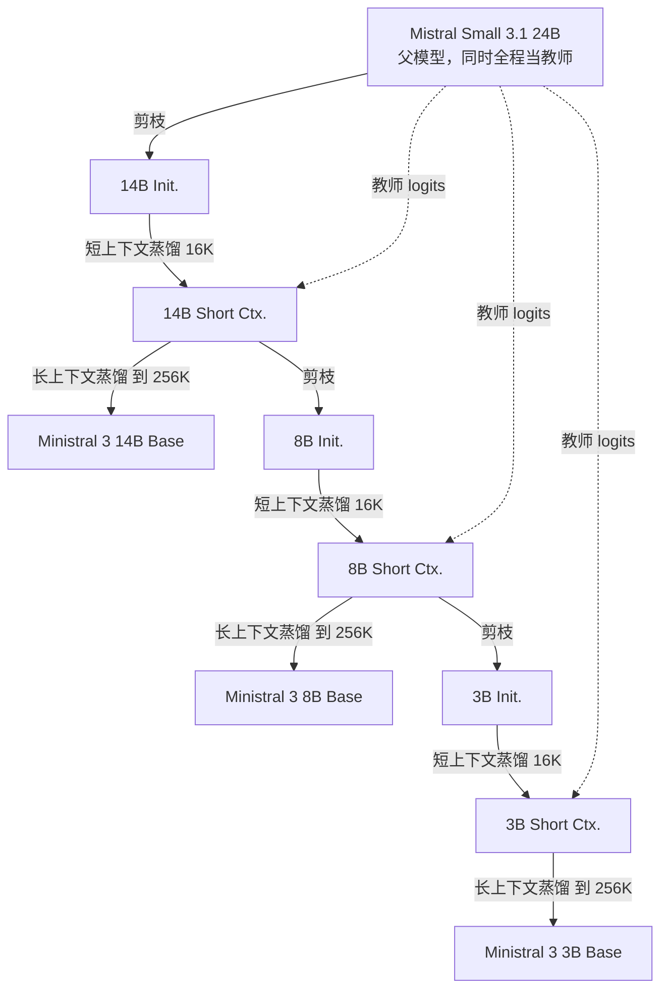
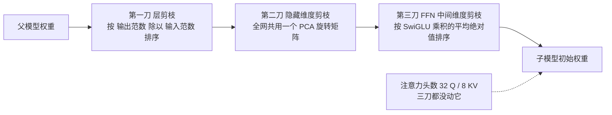
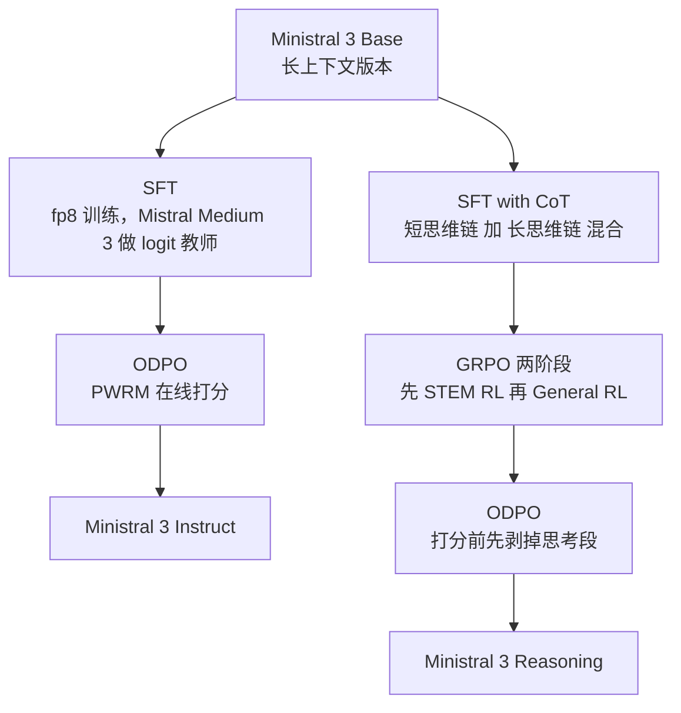

# Ministral 3：小模型不从零练起，而是从 24B 父模型上一刀一刀剪下来

<!-- release-date: 2025-12-02 -->

> 本文依据 Mistral AI 发布的 **Ministral 3**，即 arXiv:2601.08584v1，arXiv 首次提交 2026-01-13。截至写作时 arXiv 上只有 v1，本地原件与官方版本一致。页码均指 PDF 本身的页码。文中会明确区分「报告写了什么」「我们如何解释它」和「外部资料补充」。

## 先说清楚这是一份什么文件

这份 PDF 一共 14 页，拆开看是这样的：

| 页码 | 内容 |
|---|---|
| p.1 | 摘要 + 引言 |
| p.2–p.3 | 训练流程总图、贡献列表、模型架构表 |
| p.3–p.6 | 训练配方：预训练、Instruct 后训练、Reasoning 后训练 |
| p.6–p.8 | 评测结果，四张表 |
| p.8–p.10 | 讨论：教师选择、冗长度、ODPO 消融，四张图 |
| p.11 | 结论 + 一百多人的贡献者名单 |
| p.12–p.14 | 参考文献 |

也就是说，**真正的技术叙事只有 10 页**，其余 4 页是名单和文献。

它不是 DeepSeek-V4、Llama-3 那种几十页、连算子和网络拓扑都写进去的完整技术报告，也不完全是 Nemotron-3 那种「只讲押了哪几个注」的白皮书。它处在中间：**方法讲得相当具体（连伪代码都给了两段），但训练规模、数据、算力和超参几乎全部留白**。

正确的阅读姿势是：把它当成一份 **方法说明书**，不是一份 **复现手册**。它足以让你理解「怎么把一个 24B 模型剪成 3B 还不塌」，但不足以让你照着跑一遍。

这一点会一直影响后面的判断，所以先摆在最前面。

## 阅读前的最小词汇表

下面几个词后面会反复出现，先用人话过一遍：

- **Token（词元）**：模型读写文本时的基本小块。一个汉字、一个英文单词或一个标点，都可能被切成一个或多个 Token。
- **Dense 模型（稠密模型）**：每个 Token 都要把全部参数跑一遍的模型。和 MoE 相反，MoE 只让一小部分「专家」干活。Ministral 3 全家都是 dense。
- **知识蒸馏（Knowledge Distillation）**：让一个小模型（学生）去模仿一个大模型（教师）的输出分布，而不是只学数据里的标准答案。教师的输出比标准答案信息量更大，因为它还告诉你「第二可能、第三可能是什么」。
- **Logit（对数几率）**：模型在 softmax 之前吐出的那一排原始分数，每个词表位置一个。对着 logit 做蒸馏，学生能拿到教师完整的概率轮廓。
- **剪枝（Pruning）**：把训练好的模型里「不太重要」的部分直接删掉，得到一个更小的模型。
- **GQA（Grouped Query Attention，分组查询注意力）**：多个查询头共用一套 Key/Value，用来压缩推理时的显存占用。
- **SwiGLU**：一种前馈层结构，用两条并行的线性变换相乘，其中一条过一个 SiLU 激活。
- **DPO（Direct Preference Optimization，直接偏好优化）**：不训练独立的奖励模型、直接用「这条比那条好」的成对数据去调模型的对齐方法。
- **GRPO（Group Relative Policy Optimization，组相对策略优化）**：一种强化学习算法，对同一个问题采样一组回答，用组内相对好坏当优势信号，省掉价值网络。

## 一句话先说清

Ministral 3 想解决的不是「小模型不够聪明」，而是 **「造一个好的小模型，代价并不小」**。

因为一个反直觉的事实是：**小模型不便宜**。Qwen3 用了 36 万亿 Token，Llama 3 用了 15 万亿（PDF p.1）。这个数字和模型大小几乎无关——你要做一个 3B 模型，照样得把这十几万亿 Token 喂一遍。参数少了，数据的账单没少。

Ministral 3 的答案是：**别从零开始**。

Mistral 已经有一个训练好的 24B 模型（Mistral Small 3.1）。与其从随机初始化开始重走一遍数据，不如把这个 24B 直接剪小，再用它自己当老师，把剪掉的能力补回来；补完之后再剪一次，再补一次，一路剪到 3B。

这个循环就叫 **Cascade Distillation（级联蒸馏）**。靠它，Ministral 3 全家只用了 1–3 万亿 Token（PDF p.1），却做出了和上述模型可比的成绩。

所以整篇报告最值得记住的一句话是：

> **训练预算和模型大小无关，和「你从哪里出发」有关。有一个好的父模型，起点本身就是最大的一笔算力。**

## 全景：一条链，九个模型

先看整条流水线。这是根据 PDF p.2 的 Figure 1 和 p.3 的 Algorithm 1 重画的 **机制示意图**，不含任何实测时间或数据：

三个 Base 模型出来之后，每个再分两条后训练支线，于是一共 **9 个开源权重模型**：3 个尺寸 × 3 个变体（Base / Instruct / Reasoning），全部 Apache 2.0（PDF p.2）。

架构本身没有新东西，这也是报告自己承认的：decoder-only Transformer，GQA、RoPE、SwiGLU、RMSNorm，全是 2023 年就定型的配方（PDF p.3）。真正的创新集中在 **怎么把父模型变成子模型**。

三个尺寸的配置（PDF p.2，Table 1）：

| 配置 | Ministral 3 14B | Ministral 3 8B | Ministral 3 3B |
|---|---:|---:|---:|
| 层数 | 40 | 34 | 26 |
| Latent 维度 | 5120 | 4096 | 3072 |
| Q / KV 头数 | 32 / 8 | 32 / 8 | 32 / 8 |
| FFN 维度 | 16384 | 14336 | 9216 |
| 输入输出嵌入共享 | 否 | 否 | 是 |
| 上下文长度 | 256k | 256k | 256k |

词表全家统一 131K（PDF p.2）。3B 单独用了 tied embeddings（输入嵌入和输出投影共用一份权重），报告给的理由很实在：不然嵌入参数会在总参数里占太大比例（PDF p.3）。131072 × 3072 ≈ 4.03 亿，对一个 3B 模型来说，一份嵌入就吃掉七分之一，两份就是七分之二。

**视觉能力是白送的。** 所有 Ministral 3 都挂了一个 410M 参数的 ViT 视觉编码器，架构沿用 Pixtral，权重直接从 Mistral Small 3.1 Base 复制过来并 **全程冻结**；只有 ViT 到语言模型的投影层被丢弃并为每个尺寸重新训练（PDF p.3）。

这个安排后面会解释很多现象，先记住：**三个尺寸的眼睛完全一样，不一样的只是脑子。**

## 旧问题：为什么「训练一个小模型」并不便宜

先把矛盾摆清楚，否则后面的设计只是名词。

从零训练一个语言模型，成本大致由两件事决定：

$$
\text{训练算力} \approx 6 \times N_{\text{params}} \times N_{\text{tokens}}
$$

参数少了，$N_{\text{params}}$ 确实小了。但问题在于 $N_{\text{tokens}}$：一个模型要学会语法、常识、多语言、数学和代码，需要见过的数据量并不随参数线性缩小。业界的经验反而是相反的——**小模型要练得久**，才能把有限的容量填满。Qwen3 的 36T 和 Llama 3 的 15T 就是这么来的（PDF p.1）。

于是形成一个尴尬局面：

- 大模型贵在参数；
- 小模型贵在数据；
- 两头都贵，而小模型这一头的贵还很难被「买更多卡」直接解决，因为你首先得有那么多高质量数据，并且愿意把它跑完。

Ministral 3 的切入点是：**这些数据其实已经有人跑过了，就凝固在 Mistral Small 3.1 的权重里。** 与其再跑一遍，不如把那份权重当作起点，把「学知识」换成「搬知识」。

这就是剪枝 + 蒸馏的动机。剪枝负责把结构缩小，蒸馏负责把被剪坏的部分补回来。

## 核心方法：Cascade Distillation 的三步循环

### 循环体只有三行

报告给了一段伪代码，直白到几乎不用解释（PDF p.3，Algorithm 1）：

1. **Prune（剪）**：把一个更大的已训练模型剪成目标尺寸，用剪出来的权重初始化子模型；
2. **Distill（补）**：用教师的 logits 对这个刚剪完的模型做续训；
3. **Repeat（再来）**：把这个循环重复用在更小的目标尺寸上。

剪枝方法参考 Minitron 和 Wanda 这两条前人路线，蒸馏教师 **全程固定为 Mistral Small 3.1**，不随子模型变小而更换（PDF p.3）。

报告还给了一个很好的重新表述：整条流水线可以看成 **「带权重剪枝的父模型持续预训练」**（PDF p.3）。这个视角很有用——它提醒你，这不是三次独立训练，而是一次连续的训练过程，中间插了两次剪刀。

配套的一个细节：**整个过程不重复用数据**。级联全程只把数据混合走一遍，剪枝发生在途中（PDF p.3）。所以「1–3 万亿 Token」是全家共享的一条数据流，不是每个尺寸各自 1–3 万亿。

### 最容易读漏的一处：往下传的是短上下文版本

看伪代码时很容易滑过去，但这是整个设计里最值得停一下的地方。

每一跳其实产出 **两个** 检查点：

- 短上下文检查点（16,384 上下文），
- 在它基础上做长上下文扩展得到的最终 Base 模型（262,144 上下文）。

而 **下一次剪枝，剪的是短上下文那个，不是最终 Base 模型**（PDF p.3 的 Algorithm 1，与 p.2 的 Figure 1 一致）。长上下文扩展是一条 **支路**，走到 Base 模型就结束了，不往下游传。

为什么这样安排？报告 **没有解释**。我们只能从工程常识推测两条可能的原因：

- 长上下文训练本身很贵（序列越长，注意力越贵），如果每一跳都要先扩到 256K 再剪，等于把最贵的那段做三遍；
- 剪枝需要跑一批校准数据统计激活值。在短上下文上做这件事，显存和时间都更友好。

这两条都是我们的推测，不是报告的说法。但这个模式本身是可迁移的：

> **把「昂贵的能力扩展」放在链条末端做成叶子节点，别让它进入需要反复执行的主循环。**

### 为什么这样能省钱

报告的说法是「相比每个小模型都从零训练，Cascade Distillation 产出的模型在 FLOP 上显著更高效」（PDF p.3）。

直觉上省在三处：

1. **起点更好**：剪出来的权重不是随机数，而是一个已经会说话、会算数的模型的子集，续训只需要「修复」而不是「从头学」；
2. **信号更浓**：蒸馏的监督信号是教师在整个词表上的概率分布，比 one-hot 的下一个词标签信息量大得多，同样数量的 Token 能传递更多东西；
3. **共享一条数据流**：三个尺寸串在一条链上走完同一份数据，不是各走各的。

需要注意的是：**报告没有给任何一个 FLOP 数字**。没有和从零训练的对照实验，没有 GPU 小时，没有成本估算。「显著更高效」是一个论断，不是一次测量。这是这篇报告最大的证据缺口之一，后面会专门列出来。

## 剪刀落在哪三个轴上

一个 Transformer 可以从三个方向变小：变浅（层数）、变窄（隐藏维度）、变瘦（FFN 中间维度）。Ministral 3 三刀都下了，每刀用不同的重要性判据（PDF p.4）。

这是根据 PDF p.4 的剪枝段落和 Algorithm 2 重画的 **机制示意图**：

### 第一刀：层剪枝，用一个「这层到底改了多少」的比值

旧做法（Minitron 那条线）是逐层做反事实实验：把某一层删掉，看下游困惑度变差多少，变得越多说明这层越重要。这个做法很准，但很贵——有多少层就要跑多少次评测。

Ministral 3 换了个便宜得多的代理指标：**这一层输出激活的范数，除以输入激活的范数**（PDF p.4）。

$$
r_\ell = \mathbb{E}_x\left[\frac{\lVert h_\ell^{\text{out}}(x)\rVert}{\lVert h_\ell^{\text{in}}(x)\rVert}\right]
$$

这里 $h_\ell^{\text{in}}$ 和 $h_\ell^{\text{out}}$ 是第 $\ell$ 层的输入和输出激活，$\lVert\cdot\rVert$ 是向量长度，$\mathbb{E}_x$ 表示在一批校准数据上取平均。比值越大，说明这层把信号改动得越多；比值接近 1，说明这层基本上只是把输入原样传下去。

直觉很好懂：**残差网络里，一个几乎不改变残差流的层，删掉它的代价也小。** 报告的说法是这个简单代理「够强」（PDF p.4），但没有给出它和反事实困惑度排序的一致性对比。所以「够强」目前只是作者的经验结论。

**可迁移的点**：当你需要给成百上千个组件排重要性时，先找一个 **一次前向就能算出来** 的代理量，再考虑要不要上昂贵的逐个消融。代理指标的价值不在于最优，而在于让排序这件事变得可负担。

### 第二刀：隐藏维度剪枝，用一个全网共享的 PCA 旋转

这一刀比看起来精妙。

隐藏维度不能像层那样「删掉第 37 维」了事——每一维在不同层里承载的东西不一样，直接砍某几维会砍出一个七零八落的模型。

Ministral 3 的做法是：先把注意力归一化层和前馈归一化层的输入激活 **全网拼在一起**，对它做主成分分析（PCA），得到 **一个在整个网络里保持一致的旋转矩阵**，把模型投影到一个更低维的空间，同时让保留下来的方差最大（PDF p.4）。

拆成人话，三步：

1. 收集全网所有归一化层看到的激活，堆成一个大矩阵；
2. 对它做 PCA，找出「信息主要沿哪些方向分布」；
3. 用这个旋转把残差流转到新坐标系，然后只保留前 $d'$ 个方向。

关键在于 **「全网共用一个旋转」**。残差流是一条贯穿全网的主干道，每一层都在同一份状态上读写。如果每层各转各的，层与层之间的接口就对不上了。共用一个正交旋转，等价于给整个网络换了一套坐标系——数学上模型的函数几乎没变，但现在「重要的信息集中在前几维」，于是砍掉后面的维度损失最小。

**可迁移的点**：

> **要压缩一个被多个模块共享的表示时，先换基、再截断，比直接按重要性挑维度更安全。因为换基不改变语义，只改变信息的排列方式。**

报告没有给 PCA 保留了多少解释方差，也没有说校准批次有多大、来自什么数据。

### 第三刀：FFN 中间维度剪枝，直接量「这条通路平时有多活跃」

SwiGLU 的前馈层长这样（PDF p.4）：

$$
\mathrm{FFN}(x) = W_2\left(\mathrm{SiLU}(W_1x)\odot W_3x\right)
$$

$\odot$ 是逐元素相乘。$W_1$ 和 $W_3$ 把输入升到中间维度，两条结果相乘之后，$W_2$ 再降回来。中间维度就是要剪的对象。

重要性判据是：**取括号里那个乘积，对每一维求平均绝对值**（PDF p.4）：

$$
s_j = \mathbb{E}_x\left[\left|\;\mathrm{SiLU}(W_1x)_j\cdot(W_3x)_j\;\right|\right]
$$

$s_j$ 大，说明第 $j$ 条中间通路平时输出的幅度大，对最终结果影响也大。按 $s_j$ 排序，保留 top-k 的那些维度：留下 $W_1$、$W_3$ 的对应列，以及 $W_2$ 的对应行（PDF p.4）。

这里有一个容易忽略的正确性细节：$W_1$、$W_3$ 的列和 $W_2$ 的行必须 **用同一组下标** 一起删。中间维度是三个矩阵共享的一根轴，删得不一致，模型直接就废了。报告的伪代码专门把这一点写了出来（PDF p.4，Algorithm 2）。

### 没有被剪的那个轴：注意力

Table 1 里有一件事很显眼但报告没提：**三个尺寸的 Q/KV 头数完全一样，都是 32 / 8**（PDF p.2）。

也就是说，Ministral 3 的三刀 **完全没有碰注意力的头数**。注意力只是被动地跟着隐藏维度变窄（$W_Q$ 的输入维度从 5120 变到 3072），头的数量和每个头的宽度都保持不变。

这是一个有意思的选择。KV 头数直接决定推理时 KV Cache 的大小，而这份报告的立意正是「面向算力和显存受限的场景」（PDF p.1）。既然如此，为什么不顺手把 KV 头也剪一剪？

报告 **没有讨论这个问题**。我们的推测是：8 个 KV 头已经是 GQA 的常见下限，再压会明显伤害质量；而且保持头结构不变，可以让父模型的注意力权重在剪枝后仍然「对得上」，蒸馏修复起来更容易。但这只是推测。

### 三刀在每一跳实际切了多少

**以下是外部资料补充，不是报告内容。** 报告的 Table 1 只给了子模型的配置，没有和父模型并排放。把 Hugging Face 上的官方 `config.json` 拉下来对照，才能看清每一跳到底剪了什么：

| | Mistral Small 3.1 24B | 14B | 8B | 3B |
|---|---:|---:|---:|---:|
| 层数 | 40 | 40 | 34 | 26 |
| 隐藏维度 | 5120 | 5120 | 4096 | 3072 |
| FFN 维度 | 32768 | 16384 | 14336 | 9216 |
| head_dim | 128 | 128 | 128 | 128 |

来源：[Mistral-Small-3.1-24B-Base-2503](https://huggingface.co/mistralai/Mistral-Small-3.1-24B-Base-2503/blob/main/config.json)、[Ministral-3-14B-Base-2512](https://huggingface.co/mistralai/Ministral-3-14B-Base-2512/blob/main/config.json) 等官方仓库的 `config.json`。

这张对照表暴露了一个报告正文完全没写的事实：

> **从 24B 到 14B 这一跳，只动了第三刀。层数没变、隐藏维度没变，只把 FFN 中间维度从 32768 砍到 16384，正好一半。**

这就解释了报告里那句「14B Base 紧密匹配 Mistral Small 3.1 Base，同时小 40% 以上」（PDF p.1）为什么能成立——它的深度和宽度和父模型一模一样，只是每层的前馈变瘦了一半。前馈层通常是参数大头，砍一半就能拿到大部分体积收益，而深度和残差宽度这两个对能力更敏感的维度分文未动。

真正的「结构性收缩」发生在后两跳：14B → 8B 同时砍了 6 层和 1024 维隐藏维度，8B → 3B 又砍了 8 层和 1024 维。也正是这两跳之后，各种问题开始出现（见后面 3B 的部分）。

## 蒸馏目标：纯 forward KL，反而比调配比更好

剪完之后要把模型「修回来」。这一步的损失函数选择，报告给了一个很干脆的结论。

常见做法是把两个目标加权混合：

$$
\mathcal{L} = \alpha\,\mathcal{L}_{\text{distill}} + (1-\alpha)\,\mathcal{L}_{\text{next-token}}
$$

一边学教师的分布，一边学数据的真实下一个词，$\alpha$ 是要调的超参。

Ministral 3 的发现是：**只用 forward KL 蒸馏目标，效果好于去调这个配比**（PDF p.4）。

forward KL 就是让学生分布 $q$ 去覆盖教师分布 $p$：

$$
\mathcal{L}_{\text{distill}} = \mathrm{KL}(p_{\text{teacher}} \Vert q_{\text{student}}) = \sum_{v} p(v)\log\frac{p(v)}{q(v)}
$$

$v$ 遍历整个词表。这个方向的 KL 有个特点：教师认为可能的词，学生 **必须** 给出非零概率，否则惩罚会趋于无穷；反过来，学生在教师认为不可能的地方乱给概率，惩罚相对温和。所以它是一个「覆盖优先」的目标，倾向于让学生把教师的整个概率轮廓摊开学下来。

为什么去掉下一个词预测这一项反而更好？报告 **没有解释**，只给了结论。一个合理的理解是：教师本身已经是在这批数据上训练出来的，它的概率分布里已经包含了「数据的真实答案」这个信息，而且是加了平滑、带置信度的版本。再单独加一项 one-hot 目标，等于把同一个信息用一个更粗糙的形式重复灌一遍，还多出一个要调的超参。

**可迁移的点**：当你的教师和数据是同源的，多目标混合未必比单目标更好；先试试把那个信息量更大的目标单独用满，再决定要不要引入配比这个自由度。

## 长上下文：一条支路，而不是主链

预训练分两段（PDF p.4–p.5）：

1. **短上下文段**：上下文窗口 16,384。这一段的产物既是本尺寸的中间结果，也是下一个子模型剪枝的输入；
2. **长上下文段**：把窗口从 16,384 扩到 262,144，方法是 YaRN 加上 **基于位置的 softmax 温度缩放**。

从 16K 扩到 256K 是 16 倍。YaRN 是一种 RoPE 插值方案，负责让位置编码在没见过的长度上不失效。位置相关的 softmax 温度缩放则针对另一个问题：序列越长，注意力要在越多的位置上分配同一份概率质量，分布会越来越平，模型「越看越糊」。按位置调温度，相当于随着上下文变长逐渐把注意力调锐一点。报告引用了 Scalable-Softmax 和 Llama 4 两条线索（PDF p.3、p.5）。

这里有一个报告没有回答的问题。教师 Mistral Small 3.1 的官方配置里 `max_position_embeddings` 是 131072，也就是 128K（**外部补充**，来源同上）；而学生要在这一段被训到 256K。报告既没有说长上下文蒸馏用的实际序列长度，也没有说教师是否同样被扩展过。**这是一个空白，不是矛盾**，但它让「256K 上下文是怎么监督出来的」这件事无法从报告本身推断。

更要紧的是：**这份报告没有任何长上下文评测**。全篇没有大海捞针、没有 RULER、没有 LongBench，一个都没有。三个模型都宣称 256K，但没有一个数字支持这个数字之下的实际检索或推理质量。对一份把「上下文长度」写进架构表的报告来说，这是相当显眼的缺口。

## 教师悖论：更强的老师，教出更差的学生

这是全文最有信息量的一节（PDF p.8–p.9，§5.1）。报告一共给了三个关于「选谁当老师」的发现，而且明确说这是在 **独立复现前人的结论**，不是首次提出（PDF p.2）。

### 发现一：更强的教师，在预训练阶段反而更差

Mistral 有一个比 Mistral Small 3.1 强得多的模型 Mistral Medium 3。直觉上用它当老师应该更好。实测结果相反：**用 Mistral Small 3.1 蒸馏出来的 14B，在下游各项上一致优于用 Mistral Medium 3 蒸馏的版本**，而且这还是在没有对齐 FLOP 的设置下（PDF p.9）。

报告把这个现象归到 **capacity gap（容量鸿沟）**（PDF p.2）：教师和学生的能力差距太大时，教师的分布对学生来说太难模仿，学生反而学不好。类比是可以理解的——让一个刚学微积分的学生去听菲尔兹奖得主的研究报告，信息量确实更大，但接收不了。

但要注意 **这个结论的证据边界**。Figure 3（PDF p.8）是一张六个基准的柱状图：MMLU-Redux、HellaSwag、TriviaQA、MATH、AGI-EVAL、Winogrande。看图我们可以确认方向确实一致（六项里 Mistral Small 3.1 教出来的都不低于 Mistral Medium 3），但：

- **纵轴从 0.3 起，不是从 0 起**，所以视觉上的差距被放大了；
- 图上 **没有数值标注，也没有误差棒**；
- 目测最大的差距出现在 AGI-EVAL，约 2.5 个百分点；MMLU-Redux 和 HellaSwag 上两者几乎重合。

所以更准确的说法是：**方向一致，幅度很小，且没有量化**。「更强的教师更差」这个反直觉结论在这里成立，但它成立的余量并不宽。

而且报告紧接着说了另一半：**到了后训练阶段，用更强的 Mistral Medium 3.1 蒸馏是有好处的**（PDF p.9）。这也是为什么 SFT 阶段换了老师（PDF p.5）。

两半合起来才是完整结论：

> **容量鸿沟是分阶段的。预训练要让学生「建立自己的表示」，教师太强会压过它；后训练要让学生「学会一种行为」，这时候教师越强越好。**

### 发现二：老师应该是 Instruct 版，不是 Base 版

第二个发现更实用：在 **预训练** 阶段就该用 **后训练过的** 教师，而不是它的 Base 版本（PDF p.9）。

Figure 4（PDF p.9）是 3B 的消融，比较两个教师——「MS3.1 Base」和「MS3.1 Instruct 2506」。这张图的信息比 Figure 3 清楚得多，因为纵轴从 0 起。目测各项差距：

| 基准 | Base 教师 | Instruct 教师 | 差距 |
|---|---:|---:|---:|
| MMLU-Redux | ≈0.69 | ≈0.69 | 几乎为零 |
| HellaSwag | ≈0.70 | ≈0.70 | 几乎为零 |
| TriviaQA | ≈0.42 | ≈0.43 | 极小 |
| MATH（maj@4） | ≈0.40 | ≈0.55 | **极大** |
| MBPP | ≈0.57 | ≈0.59 | 小 |
| MMMU | ≈0.48 | ≈0.49 | 小 |

（以上为我们从 PDF p.9 的 Figure 4 目测读数，报告未给数值；报告自己的定性描述是：对数学和代码影响大，对多模态影响小而一致，对知识类指标影响可忽略。）

这个模式非常清楚，而且解释起来也顺：

- **知识类指标（MMLU、TriviaQA、HellaSwag）几乎不动**，因为这些东西 Base 教师本来就会，后训练并没有往里加事实；
- **数学一骑绝尘**，因为 MATH 这类任务的收益主要来自「按步骤展开、把中间结果写出来」这种 **行为**，而这正是后训练教出来的东西。

换句话说：**从 Instruct 教师蒸馏，等于在预训练阶段就偷偷把一部分后训练的行为先注入进去了。**

**可迁移的点**：如果你在做蒸馏，别默认「预训练配 Base 教师、后训练配 Instruct 教师」。教师选哪个版本，取决于你想搬的是知识还是行为。

### 发现三：偏好对齐过的老师更好

第三个发现最短，也最弱：用两个内部版本的 Mistral Medium 3 做对比——一个只做过 SFT，一个做过偏好对齐——结果是 **从偏好对齐过的检查点蒸馏「总是显著更好」，而且这个收益在学生自己也做完偏好对齐之后依然存在**（PDF p.9）。

注意：**这一条没有任何图，也没有任何数字。** 报告只给了一句定性判断。这是全篇证据最薄的一个主张，读的时候要单独打个折。

## 后训练：两条支线，共用一个 ODPO 结尾

Base 模型出来之后分两条路（PDF p.5–p.6）。这是根据 PDF p.2 的 Figure 1 右半部分重画的 **流程示意图**：

有一个细节值得注意：**Reasoning 分支不是接在 Instruct 之后，而是和 Instruct 并列，都从 Base 出发**（PDF p.5）。报告明确说，推理模型的后训练「从预训练检查点开始，而不是从 ODPO 变体开始」。这意味着两条支线互不干扰，各自可以用最适合自己的数据和目标，代价是两条线的通用能力要各练一遍。

### Instruct 线：SFT 阶段就换了老师

SFT 有三个具体设置（PDF p.5）：

- **用 fp8 量化训练**；
- **仍然带 logit 蒸馏损失，但教师换成了 Mistral Medium 3**，不再是预训练时的 Mistral Small 3.1；
- 视觉编码器保持冻结，只有适配器可训练。

第二条正是「发现一」的下半句在配方里的落地：预训练怕容量鸿沟，用小教师；后训练要行为，用大教师。**同一个流水线的两个阶段，用了两个不同的老师，理由是它们要传递的东西不一样。** 这个安排本身就是一条值得记住的设计思路。

### ODPO：四处很具体的改动

普通 DPO 用离线的成对偏好数据，做背景交代一下它的形状（**以下公式是背景知识，报告并未给出**）：

$$
\mathcal{L}_{\text{DPO}} = -\log\sigma\left(\beta\log\frac{\pi_\theta(y_w\mid x)}{\pi_{\text{ref}}(y_w\mid x)} - \beta\log\frac{\pi_\theta(y_l\mid x)}{\pi_{\text{ref}}(y_l\mid x)}\right)
$$

$y_w$ 是被偏好的回答，$y_l$ 是不被偏好的，$\pi_\theta$ 是当前模型，$\pi_{\text{ref}}$ 是参考模型，$\beta$ 控制偏离参考模型的力度。

Ministral 3 用的是它的在线变体 ODPO，并在此之上做了四处改动（PDF p.5）：

1. **在线采样**：对每个样本，从 **当前策略** 采两个候选回答，温度 $T=0.7$，再用一个文本奖励模型排序。离线数据的问题是它反映的是别的模型的错误分布；在线采样让训练信号始终对准 **这个模型此刻真正会犯的错**。
2. **成对奖励模型（Pairwise Reward Model，PWRM）**：给定对话历史和两个候选，直接预测哪个更好。它由结构化成对数据 SFT 训练而来。
3. **软标签代替硬标签**：这是最实质的一处。经典 DPO 的 $y_w$ 和 $y_l$ 是硬的赢家/输家标签。Ministral 3 把 PWRM 的 **二项概率输出** 接进损失，改成一个 **双边损失**，按「被偏好的概率」给每条回答加权。也就是说，当 PWRM 只有 55% 把握时，这条数据的推力就该比 95% 把握时小。
4. **两处稳定化**：调 PWRM 的温度来校准胜负概率；以及一种 $\beta$ 重缩放技术，让损失对 $\beta$ 的取值更不敏感。

还有一条工程味很重的做法：**把生成时出现无限循环的回答自动判为输家**（PDF p.5）。报告说在线变体对缓解「无限生成」这类模型自身产生的伪影特别重要。这是一个很实在的例子——某些坏行为在离线偏好数据里根本不会出现，因为那些数据不是这个模型生成的；只有在线采样才能把它们抓个现行，然后用偏好信号把它压下去。

最后，**ODPO 阶段开启了工具执行**，报告称这提升了模型的工具使用表现（PDF p.5）。

**可迁移的点**：

> **奖励模型给的是概率，不是判决。把它的置信度直接带进损失，比先阈值化成硬标签再训练，浪费的信息更少。**

### Reasoning 线：SFT、GRPO、ODPO 三段

**SFT 阶段**混合短思维链和长思维链数据。短的来自通用 SFT 数据，长的是推理轨迹，并且被加了一个 **推理专用的系统提示词** 作为前缀（PDF p.5）。轨迹覆盖数学、代码、通用对话、指令遵循、多语言、工具使用和视觉推理七个领域。过滤是「轻量」的，只去掉格式糟糕、重复过多、语言乱切换的样本（PDF p.5）。

**3B 在这里出了事故。** 报告直说：3B 用普通 SFT 得到的模型「脆弱、极度冗长，输出里大量重复和无限生成」。补救办法是拿 Magistral Small 1.2 当教师做 logit 蒸馏，这才把冗长度压下来，也才稳住了后续的强化学习（PDF p.6）。

这是一个很坦率的记录。它说明：**同一份配方在 14B 和 8B 上能走通，到 3B 就走不通了**，需要额外打一个补丁。

**GRPO 阶段**分两步（PDF p.6）：

- **STEM RL**：数学、代码、视觉推理。题目来自开源和自有来源，经过多步流水线过滤，去掉无效、不完整以及太简单或太难的题；
- **General RL**：范围扩大到通用对话、指令遵循和开放式推理。做法是为每个提示生成 **原子化的评分细则（atomic grading rubrics）**，训练时让一个 LLM 裁判逐条核对模型的输出，**奖励等于满足的细则比例**。

第二步的设计很值得看。数学题好判对错，「这段回答好不好」不好判。把一个模糊的「好」拆成一串具体的、可以逐条打钩的小条件，再用比例当奖励——这就把一个连续的主观判断，变成了一个可以稳定给出稠密信号的过程。报告说这一步在提升指令遵循和通用对话的同时，STEM 成绩「保持，有时甚至提升」（PDF p.6）。

还有一个很朴素但很有用的观察：**最大生成长度从 32K 提到了 80K**，理由是他们观察到强化学习期间有「不可忽略比例」的生成被截断；放开长度之后，模型能把最难的题想完，成绩又涨了一截（PDF p.6）。

这条经验值得记住：**在长思维链的强化学习里，截断不是一个中性的工程限制，它会直接污染奖励信号。** 一条本来能做对的轨迹被砍断，会被当成失败样本，模型学到的是错的东西。

**ODPO 阶段**和 Instruct 线基本相同，只有一处修改：**送给奖励模型打分之前，先把思考段剥掉**（PDF p.6）。这个改动很合理——奖励模型是用「最终回答质量」的偏好数据训出来的，不该让它去评判一段本来就写给模型自己看的草稿。

## 评测数字真正说了什么

报告给了四张表（PDF p.7–p.8）。所有对比模型都是用 Mistral 自己的评测流水线重跑的，配置相同（PDF p.6）——这一点值得肯定，因为直接抄别人报告里的数字是常见的不公平来源。

### 学生在数学上反超了老师

Table 3（PDF p.7）把 Base 全家和 24B 教师并排放。最扎眼的一行是 MATH：

| 模型 | MATH（CoT 2-shot） |
|---|---:|
| Mistral Small 24B（教师） | 55.8 |
| Ministral 3 14B | **67.6** |
| Ministral 3 8B | **62.6** |
| Ministral 3 3B | **60.1** |

**三个学生全部超过教师，连 3B 都超了 4.3 分。** GPQA Diamond 上 14B 和 8B 也都是 39.9，高于教师的 36.9；MMMU 上 14B 的 59.9 高于教师的 59.1；MBPP 上 14B 的 71.6 和教师打平。

报告 **完全没有评论这个现象**。这是全篇最值得追问却被跳过的地方。

结合 §5.1 的发现二，最可能的解释是：**最终配方用的是 Instruct 教师，而不是 Base 教师**。Figure 4 显示 Instruct 教师能把 3B 的 MATH 从约 0.40 拉到约 0.55（PDF p.9），量级正好对得上。Table 3 拿来对比的却是 Mistral Small 24B **Base**——一个没有被注入解题行为的模型。所以这不是「学生比老师聪明」，而是 **「学生学的是老师的成品行为，却在和老师的半成品比」**。

但必须说清楚：**§3.1 的配方段落只写了教师是「Mistral Small 3.1」，从头到尾没有指明用的是 Base 还是 Instruct 版本**（PDF p.3–p.4）。上面这个解释是我们的推断，报告本身没有把这个关键参数写死。

### 保留率的梯度：知识先掉，技能后掉

把 Table 3 换算成「相对教师的保留率」，会看到一个非常干净的规律。**以下百分比是我们根据 PDF p.7 的 Table 3 计算的，报告未给出这一列**：

| 评测 | 考的是什么 | 14B | 8B | 3B |
|---|---|---:|---:|---:|
| MATH | 解题过程 | 121% | 112% | 108% |
| MBPP | 代码生成 | 100% | 98% | 88% |
| ARC-Challenge | 常识推理 | 98% | 96% | 93% |
| MMLU | 广谱知识 | 98% | 94% | 87% |
| MMMU | 多模态理解 | 101% | 93% | 89% |
| TriviaQA | 事实记忆 | 94% | 86% | 75% |
| NaturalQS | 开放域事实 | 87% | 75% | **64%** |
| MathVista | 多模态数学 | 85% | 70% | **45%** |

这张表说了三件事：

1. **事实记忆最先塌。** TriviaQA 和 NaturalQS 是纯记忆题，它们的保留率跌得最快。这完全说得通——事实是存在参数里的，参数少了就是装不下，蒸馏也搬不动。
2. **过程性技能几乎不掉，甚至变好。** MATH 三个尺寸全部超过 100%。会不会解题，更多取决于「有没有学到正确的展开方式」，而不是「有多少参数」。
3. **多模态数学是塌得最狠的一项。** MathVista 从 85% 一路跌到 45%，比 MMMU 的跌幅陡得多。

第三点尤其值得琢磨，因为 **三个尺寸的视觉编码器是同一个，冻结不变**（PDF p.3）。所以这个塌方跟「眼睛变差」无关，全部发生在语言模型和新训练的投影层上。MathVista 要求先看懂图、再在图的基础上做多步推理——它同时压榨视觉理解和数学能力，是全套评测里 **复合度最高** 的任务。当模型变小，最先失守的不是单项能力，而是 **把两种能力串起来** 的能力。

**可迁移的点**：

> **压缩模型时，先问「这个能力是存在参数里的，还是存在行为里的」。存参数的（事实、长尾知识）会随体积等比消失；存行为的（推理套路、格式、工具调用）可以靠蒸馏几乎完整搬走。而需要多种能力串联的复合任务，掉得比任何单项都快。**

这条也可以反过来用：如果你的产品场景是「模型自己知道答案」，小模型会让你失望；如果是「模型基于给定材料做推理」，小模型可能够用得多。

### 3B 是这条链上最脆的一环

把散落在各处的证据拼起来，3B 的问题有 **四条独立线索**：

1. **普通 SFT 直接失败**：脆弱、极度冗长、重复、无限生成，只能靠 Magistral Small 1.2 蒸馏来救（PDF p.6）；
2. **ODPO 对它无效**：14B 和 8B 在 ArenaHard、EQBench、WildBench 上都有可观提升，3B「在公开基准上没有显著改善」，最后是靠内部人工评测才选定了 ODPO 检查点（PDF p.10，Figure 6）；
3. **对超参更敏感**：报告的脚注直说「3B base 在微调时比 14B 和 8B 对超参选择更敏感」（PDF p.10，脚注 4）；
4. **对比结果最差**：Table 4 里 Ministral 3 3B 的 ArenaHard 只有 30.5，不但输给 Qwen3-VL-4B 的 43.8，甚至低于 Gemma3-4B 的 31.8（PDF p.8）。

需要公平地补一句：Ministral 3 3B **确实比这些 4B 模型更小**，而报告在 Table 2 和 Table 4 里都把它和 4B 模型放在同一组比较（PDF p.7–p.8）。而且它在推理变体上表现不错——Table 5 里 3B 在 AIME 2024/2025、HMMT 2025、PhyBench、LiveCodeBench 五项上都赢过 Qwen3-VL 4B，只在 GPQA Diamond 上输得比较多（53.4 对 60.1）（PDF p.8）。

但核心问题依然没有答案：**3B 的疲软，是因为它只有 3B，还是因为它是级联的第三跳？**

报告 **没有做这个对照**。没有「直接从 24B 一刀剪到 3B」的基线，也没有「从 8B 单跳剪到 3B」的对照。而这恰恰是 Cascade Distillation 这个方法名里 **「Cascade」那个字的唯一卖点**。整篇报告论证了「剪枝 + 蒸馏有效」，但没有论证 **「多跳比单跳更好」**。这是这份报告最重要的一个缺口。

### 其它几项结果，以及报告没有回避的失分

Table 5（PDF p.8）的推理模型对比里，报告如实列出了自己输的地方：

- **14B 全胜**：六项全部高于 Qwen 3 14B，差距最大的是 HMMT 2025 的 67.5 对 55.8（11.7 分）和 AIME 2025 的 85.0 对 73.7（11.3 分）；
- **8B 六项里输四项**：AIME 2024 打平 86.0，AIME 2025、HMMT 2025、GPQA Diamond、PhyBench 都略低于 Qwen3-VL 8B，只在 LiveCodeBench v6 上以 61.6 对 58.0 领先。

报告的正文对 Table 5 只字未评，既没有挑好的说，也没有解释输在哪。就披露而言这是诚实的；就分析而言这是缺席的。

评测协议也需要注意：Table 5 报的是 **pass@16**，LiveCodeBench 是 **pass@5**（PDF p.8）。pass@16 意思是采 16 次里有一次做对就算对——这个口径下的分数会明显高于日常单次使用的体验，跨报告比较时不能和别人的 pass@1 混着看。

## 冗长度被当成一个设计目标，而不是副作用

§5.2 是这份报告里比较有个性的一节（PDF p.9–p.10）。

Figure 5 把 GPQA Diamond 的准确率画成纵轴，**输出 Token 数** 画成横轴。结论一目了然：Ministral 3 的 Instruct 模型全部挤在图的最左侧（输出很短），而 Qwen3-VL 的 Instruct 模型在右侧 15000–20000 Token 的区间，准确率却不比 Ministral 3 14B 更高。

报告给的原因很具体：**Ministral 3 Instruct 的后训练没有在 General RL 之前做 Reasoning RL，而 Qwen 3 做了**（PDF p.9）。所以两者的冗长度天生不同。

紧接着 §5.3 前面还有一段实验记录（PDF p.10）：他们试过往 Instruct 的 SFT 数据里掺不同比例的长思维链。结果是 **STEM 成绩上去了，但模型开始出现过度反思、内心独白和反复回溯**。报告贴了一段真实输出作为例子，里面充满了「Wait, ... 」「Wait, but let's check another way ... 」这样的自我打断。作者的判断是：对一个通用聊天模型来说，这种行为「不受欢迎且不自然」（PDF p.10）。

于是他们选择了 **不掺**，把长思维链留给 Reasoning 变体。

这个取舍很值得学：

> **同一个改动在基准分数上是收益，在产品体验上可能是代价。当两者冲突时，先想清楚这个模型的角色是什么，而不是默认追分。**

需要说明的是：Figure 5 的图注写着「with Ministral 3 instruction-following and reasoning」，但图上 **只有 Instruct 模型，没有任何 Reasoning 模型**。这属于图注和图内容对不上，后面会一并列出。

## 报告没有写的东西

这是这篇解读必须专门给出一节的部分。**下面每一项都是原件里确实没有的，不是我们没找到。**

### 数据

- 没有数据章节。全篇关于数据的描述只有「文本与图文交错数据的混合」这一句（PDF p.4）。
- 没有来源、配比、去重方法、质量过滤模型、合成数据占比、多语言比例、污染检查。
- **只知道全家总共 1–3 万亿 Token（PDF p.1），不知道 14B、8B、3B 各自分到多少。**

### 算力与成本

- **一个 FLOP 数字都没有。** 「compute-efficient」「a fraction of the cost」「significantly more FLOP efficient」全部是文字表述（PDF p.1、p.3）。
- 没有 GPU 型号、卡数、训练时长、成本估算。
- 没有和「从零训练」的对照实验，所以省了多少无从验证。

### 训练系统

- 没有并行策略、通信、算子、检查点、容错的任何描述。
- 唯一的系统性信息是一句「SFT 用 fp8 量化训练」（PDF p.5）。

### 超参数

- 没有学习率、批大小、调度、warmup、优化器、权重衰减。
- GRPO 没有组大小、KL 系数、裁剪范围、rollout 数量。
- DPO 的 $\beta$ 具体取什么值没写，只说做了「$\beta$ 重缩放」。
- 全篇能查到的数值超参只有两个：ODPO 采样温度 $T=0.7$（PDF p.5），以及强化学习最大生成长度从 32K 提到 80K（PDF p.6）。

### 剪枝的关键细节

- 校准批次多大、取自什么数据，没写（伪代码里只说「a large calibration batch」，PDF p.4）。
- PCA 保留多少解释方差、`n_components` 和 `target_dim` 的关系，没写。
- 每一跳的剪枝比例是怎么定的，没写。
- **三刀分别贡献了多少，没有消融。**

### 方法本身的验证

- **没有「级联多跳」对「单跳直剪」的对照。** 这是方法名里的核心词，却没有实验支撑。
- 没有「剪枝 + 蒸馏」对「从零训练」的对照。
- 没有层剪枝新代理指标（范数比值）对旧方法（反事实困惑度）的一致性验证。

### 评测

- **没有任何长上下文评测**，尽管全家都宣称 256K。
- 没有安全性、红队、偏见、有害内容评测。
- 没有推理侧的实测：延迟、吞吐、显存占用、量化后表现——而这恰恰是「面向算力和显存受限场景」这个立意最该给的数字。
- 没有和引言里提到的 Mistral Small 3.2 2506 的任何表格对比（PDF p.1 提到了它，正文再没出现）。
- Figure 3、4、6 都 **没有数值标注，也没有误差棒**；Figure 3 的纵轴还从 0.3 起。
- §5.1 的第三个发现（偏好对齐教师更好）**连图都没有**。

### 其它

- **没有 Limitations 章节。**
- 没有失败尝试的系统记录（只有 3B SFT 和长 CoT 两处零散提及）。
- 没有说清最终配方用的是 Mistral Small 3.1 的 Base 版还是 Instruct 版。

## 原件内部的前后不一致

逐页核对时发现了几处，按重要性排列：

**一、推理模型的上下文长度，报告自己说了两个数。**

- p.1 引言：所有模型上下文长度最高 256k，**「推理模型为 128k」**；
- p.2 Table 1：三个尺寸都写 **256k**，没有区分变体；
- p.11 结论：「所有模型……支持最高 **256K** 的上下文」。

也就是说 p.1 的那个括号和 p.2、p.11 直接矛盾。**外部补充**：官方 Hugging Face 上 [Ministral-3-14B-Reasoning-2512](https://huggingface.co/mistralai/Ministral-3-14B-Reasoning-2512) 的 `config.json` 里 `max_position_embeddings` 是 262144，模型卡正文也写「Supports a 256k context window」。所以 p.1 的「128k」看起来是笔误。

**二、后训练的教师到底是 Mistral Medium 3 还是 3.1，同一段里两种叫法。**

- p.5 §3.2.1：SFT 「distilled from **Mistral Medium 3** model」；
- p.9 §5.1 同一段的前后两句：先说「the much stronger **Mistral Medium 3**」，脚注 3 却链向 `mistral-medium-3-1-25-08`（也就是 Medium **3.1** 的文档页）；下一句又写「benefit from distillation from the more capable **Mistral Medium 3.1**」；
- p.11 结论：「Mistral Small 3.1 and **Medium 3**」。

一个大版本号的差别在四处被混用，读者无法确定预训练消融里那个「更强的教师」和后训练实际用的教师是不是同一个模型。

**三、Figure 4 的图注和图例对不上。**

图注写「comparing distillation from base and post-trained (**instruct/reasoning**) variants」（PDF p.9），但图例里只有两条：`MS3.1 Base` 和 `MS3.1 Instruct 2506`。**没有 reasoning 教师这一条。**

**四、Figure 5 的图注和图内容对不上。**

图注写「with Ministral 3 **instruction-following and reasoning**」（PDF p.9），但散点图里全部是 Instruct 模型（Ministral3 14B/8B/3B Instruct、Qwen3-VL 8B/4B Instruct、Gemma3 12B/4B Instruct）。**一个 Reasoning 模型都没有。**

**五、图里用的基准，正文的评测清单里没有。**

§4 列出了本文使用的全部基准（PDF p.6），但 Figure 3 用了 **HellaSwag** 和 **Winogrande**（PDF p.8），Figure 6 用了 **EQBench**（PDF p.10），这三个都不在清单里。三者都出现在参考文献中，所以不是凭空捏造，但正文清单不完整。

**六、贡献者名单里「Tom Bewley」出现了两次。**

PDF p.11 的 Contributors 段落里，「Tim Lawson, **Tom Bewley, Tom Bewley**, Tom Edwards」——同一个名字连着列了两遍。PDF 元数据的作者字段里也是重复的。属于排版疏漏，不影响技术内容，但说明这份稿子的校对不算细。

**七、几处文字错误。**

p.4 「The pretraining phase consists of a two-stages」；p.5 「is the input to to the pruning phase」；p.9 §5.1 第三段以一个孤立的「Post」开头（「**Post** We use two internal versions of...」）。

这些加在一起，指向一个判断：**这份报告的成稿相当仓促。** 它在 2025-12-02 模型发布之后六周才挂到 arXiv，但校对状态更像是赶发布日写出来的。

## 哪些结论有对照实验，哪些只是作者观察

这一节把上面的内容按 **证据强度** 重排一遍。

### 有对照实验支撑

| 结论 | 证据 | 强度说明 |
|---|---|---|
| 预训练时 Mistral Small 3.1 教师优于 Mistral Medium 3 | Figure 3，14B，六个基准（PDF p.8） | 方向一致，但无数值、无误差棒，纵轴从 0.3 起，幅度可能只有 1–3 分 |
| 预训练时 Instruct 教师优于 Base 教师 | Figure 4，3B，六个基准（PDF p.9） | 纵轴从 0 起，MATH 上差距很大且模式可解释，是三个教师结论里最扎实的一个 |
| ODPO 对 14B 和 8B 的对齐基准有大幅提升 | Figure 6，三个基准（PDF p.10） | 增量画成叠加柱状，方向和幅度都清楚；3B 无提升也如实画了出来 |
| Ministral 3 与同档开源模型的相对位置 | Table 2–5（PDF p.7–p.8） | 所有对比模型都用同一套流水线重跑，是这份报告最规范的部分 |

### 只是作者观察或论断

| 结论 | 状态 |
|---|---|
| Cascade Distillation 比从零训练「显著更 FLOP 高效」 | 无任何数字、无对照实验 |
| **多跳级联优于单跳直剪** | 无对照实验；方法的核心卖点未被验证 |
| 范数比值是层重要性的「简单而强」的代理 | 无与旧方法的一致性对比 |
| 纯 forward KL 优于调配比 | 有结论，无数据、无消融曲线 |
| 偏好对齐过的教师「总是显著更好」 | 纯文字，无图无数字 |
| Instruct 模型的低冗长度源于「没做 Reasoning RL」 | 作者的归因，非受控实验；Figure 5 只呈现了相关性 |
| 长 CoT 数据会导致「过度反思」 | 定性描述加一段样例输出，无量化 |

### 完全没有公开

- 全部数据细节、算力数字、训练系统、超参数；
- 各尺寸的实际训练 Token 数；
- 剪枝校准集与剪枝比例的选择依据；
- 最终配方所用教师的具体版本（Base 还是 Instruct）；
- 256K 上下文的实际质量；
- 安全性评测与推理侧性能。

## 可以带走的六条

1. **训练预算的大头是起点，不是终点。** 有一个训好的父模型，就等于已经买下了十几万亿 Token 的算力。剪枝加蒸馏，本质是把这笔已经付过的钱重新花一次。这条对任何有自家基座的团队都成立。

2. **压缩前先分清「知识」和「行为」。** 事实型能力存在参数里，随体积等比消失（NaturalQS 保留率 64%）；过程型能力存在行为里，蒸馏几乎能完整搬走（MATH 保留率 108%）。而复合任务掉得比任何单项都快（MathVista 保留率 45%）。这决定了你的小模型该被放在什么场景。

3. **教师的选择要按阶段分开想。** 预训练怕容量鸿沟，教师太强反而更差；后训练要传行为，教师越强越好。Ministral 3 在同一条流水线的两个阶段用了两个不同的老师，理由是它们要搬的东西不一样。

4. **压缩一个被共享的表示时，先换基再截断。** 隐藏维度被全网所有层共用，所以不能各层各挑各的维度。用一个全网一致的 PCA 旋转把信息集中到前几维，再截断，语义不变而损失最小。这个套路可以用在任何「多个模块读写同一份状态」的地方。

5. **奖励模型给的是概率，把它当概率用。** 把 PWRM 的二项输出直接接进 DPO 损失，比阈值化成硬的赢家/输家更省信息。同理，在线采样能抓到离线数据里根本不存在的失败模式（比如无限生成），这类问题只有让模型自己犯一次才能被修。

6. **长思维链的强化学习里，截断会污染奖励。** 把最大生成长度从 32K 提到 80K 就能拿到额外收益，因为原本被砍断的正确轨迹不再被误判为失败。做长输出的 RL 时，先检查截断率，再去调算法。

还有一条不是设计原则，而是阅读方法：**方法名里最响亮的那个词，往往正是消融最薄弱的地方。** 这份报告叫 Cascade Distillation，而「Cascade」恰恰是唯一没有对照实验的部分。看到一个新名词时，先去找验证它的那张表。

## 关键词回看

把全文的词串一遍，看它们是怎么接在一起的：

- **Cascade Distillation（级联蒸馏）** 是主干：剪枝 → 蒸馏 → 再剪枝，一路从 24B 走到 3B；
- 剪枝落在三个轴上：**层剪枝**（按输出/输入范数比值）、**隐藏维度剪枝**（全网共享的 **PCA** 旋转）、**FFN 维度剪枝**（按 **SwiGLU** 乘积的平均绝对值）；**GQA** 的头数三刀都没碰；
- 蒸馏用 **forward KL** 单目标，不混 next-token 损失；教师全程是 **Mistral Small 3.1**；
- 每一跳产出短上下文和长上下文两个检查点，**只有短上下文的那个往下传**；长上下文靠 **YaRN** 加位置相关的 **softmax 温度缩放** 扩到 256K；
- 后训练分两支：Instruct 走 **SFT**（换 **Mistral Medium 3** 当教师）加 **ODPO**（**PWRM** 在线打分，软标签双边损失）；Reasoning 走 **SFT with CoT** 加 **GRPO**（STEM RL 然后 General RL，**rubric** 打钩当奖励）再加 **ODPO**；
- 贯穿全文的两个反直觉结论是 **capacity gap（容量鸿沟）**，以及「**Instruct 教师在预训练阶段就更好**」。

## 最后的判断

这份报告值得读，但要读对地方。

**它做对的事**：把一个真实可用的模型压缩配方写得足够具体——两段伪代码、三种剪枝判据、一个明确的蒸馏目标、四处 ODPO 改动、两阶段 GRPO，都是能直接拿去实现的东西。三个教师结论虽然是复现前人，但放在一起构成了一条清晰的判断线。评测部分全部自己重跑，输的地方也照实登出来。这些都是加分项。

**它没做的事**：没有一个数字支撑「省了多少算力」这个核心卖点；没有一个实验验证「级联」这个方法名；没有一行数据描述；没有一项长上下文评测，尽管架构表上大大写着 256K。

所以，把它当成 **一份写给工程师的方法说明**，收益很高；把它当成 **一份可复现的技术报告**，会失望。它更像是模型发布六周后补交的一份作业——把「我们是怎么做的」交代清楚了，把「我们做得有多好、为什么这么做是对的」留了一半空白。

**如果只记一件事**：小模型的成本大头从来不在参数，而在数据。Ministral 3 的答案是，那笔钱可以只付一次，然后沿着一条链一路花下去。

## 资料与阅读边界

**本文依据的原件**

- `papers/Mistral/Ministral-3.pdf`，arXiv:2601.08584v1，arXiv 首次提交 2026-01-13，共 14 页。截至写作时 arXiv 上只有 v1，本地原件与官方版本一致。

**首发日的依据**

`release-date` 取 **2025-12-02**，即 Ministral 3 家族首次通过官方渠道公开可用的日期。三条互相独立的官方证据一致：

1. 官方博客 [mistral.ai/news/mistral-3](https://mistral.ai/news/mistral-3)，页面标注 December 2, 2025，同时发布 Mistral Large 3 与 Ministral 3 的 14B / 8B / 3B；
2. 官方 [docs.mistral.ai 变更日志](https://docs.mistral.ai/getting-started/changelog/) 的 December 2 条目，API 模型名为 `ministral-3b-2512`、`ministral-8b-2512`、`ministral-14b-2512`，后缀 `2512` 即 2025 年 12 月；
3. Hugging Face 官方权重仓库的 **文件提交时间**：`mistralai/Ministral-3-14B-Base-2512` 等仓库 main 分支的首个提交为 2025-12-02T15:10:52Z。

被排除的候选日期：

- **Hugging Face 仓库 `createdAt` 为 2025-10-31**，比实际发布早 32 天。这正是权重仓库提前预置的典型情况，不能当首发日；
- **arXiv 提交日 2026-01-13** 是论文上线日，比模型发布晚约六周，是这篇文章讲的技术的发表时间，不是模型的可用时间。

**外部补充资料（均已在正文中标注）**

- 官方 `config.json` 对照，用于还原每一跳实际剪了什么，以及确认视觉编码器与推理模型的上下文配置：[Mistral-Small-3.1-24B-Base-2503](https://huggingface.co/mistralai/Mistral-Small-3.1-24B-Base-2503)、[Ministral-3-14B-Base-2512](https://huggingface.co/mistralai/Ministral-3-14B-Base-2512)、[Ministral-3-8B-Base-2512](https://huggingface.co/mistralai/Ministral-3-8B-Base-2512)、[Ministral-3-3B-Base-2512](https://huggingface.co/mistralai/Ministral-3-3B-Base-2512)、[Ministral-3-14B-Reasoning-2512](https://huggingface.co/mistralai/Ministral-3-14B-Reasoning-2512)。

**本文里哪些内容不是报告原话**

- Figure 3、Figure 4 的具体数值是我们从 PDF 页面目测读数，报告未标注数值；
- 「相对教师的保留率」那张表是我们根据 PDF p.7 的 Table 3 计算的；
- 「为什么只有短上下文检查点往下传」「学生为何在 MATH 上反超教师」「为什么不剪 KV 头」三处解释均为我们的推断，报告没有给出理由；
- ODPO 一节里的经典 DPO 公式是背景知识，报告未给出任何损失函数形式；
- 三张 Mermaid 图都是我们根据 PDF p.2 的 Figure 1、p.3 的 Algorithm 1 和 p.4 的剪枝段落重画的机制示意图，不含实测数据。
