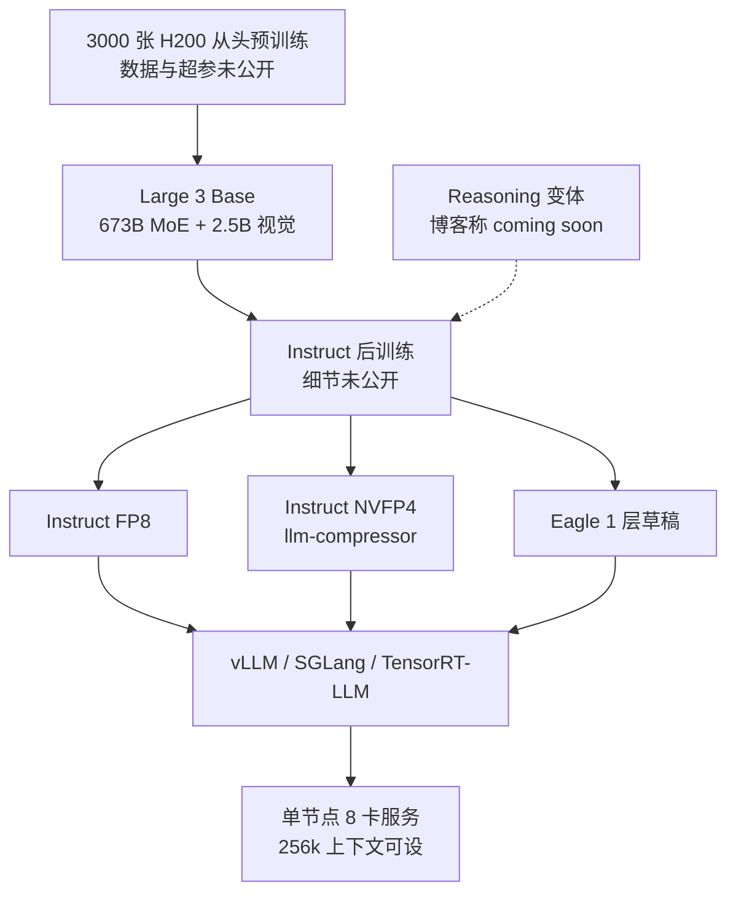

# Mistral Large 3：Mixtral 之后第一次回到 MoE，但这次几乎只交出规格与部署配方

<!-- release-date: 2025-12-02 -->

> 本文依据 Mistral AI 于 2025 年 12 月 2 日发布的官方博客 **Introducing Mistral 3**，以及 Hugging Face 上的 **Mistral Large 3** 模型卡与 collection。访问日期 2026-09-15。
>
> 博客：<https://mistral.ai/news/mistral-3>
>
> Instruct 模型卡：<https://huggingface.co/mistralai/Mistral-Large-3-675B-Instruct-2512>
>
> Collection：<https://huggingface.co/collections/mistralai/mistral-large-3>
>
> **原件是网页，不是技术报告。** 博客同时宣布了 Large 3 与 Ministral 3 全家；**本篇只写 Mistral Large 3**。Ministral 3 另有独立解读（论文 arXiv:2601.08584），这里只保留家族上下文，不再复述小模型如何从 24B 父模型剪枝蒸馏。
>
> 网页会原地改动且不留版本号。记录访问日期即为本次依据的版本。模型卡的「Benchmark Results」在网页上是图片，纯文本抓取会丢掉表中数字；下文凡是从图里读出的数会标明「读自模型卡评测图」。博客与模型卡都没有训练数据、token 量、超参与消融——这本身就是读者要带走的事实，不是漏写。
>
> 全文严格区分三层：**原文写了什么**、**我们如何解释它**、**哪些是外部核实的补充**。第三类会写明来源。

## 先说清楚这是一份什么材料

读这篇之前，先把预期压对。

DeepSeek-V4 那种报告会告诉你注意力怎么拆、优化器怎么改、通信怎么叠。Large 3 不是那种文件。

官方公开物拆开看，大致是三块：

| 来源 | 它实际给了什么 |
|---|---|
| 博客「Mistral Large 3: A state-of-the-art open model」 | 定位、3000 张 H200、Mixtral 之后第一次 MoE、LMArena 名次、Apache 2.0、NVFP4 / vLLM / NVIDIA 合作、API 价格 |
| Instruct / Base 模型卡 | 总参与激活、视觉编码器、能力清单、部署节点、推荐采样、已知限制、vLLM 启动命令、三段示例 |
| HF collection | 四个官方权重：Instruct FP8、Instruct NVFP4、Eagle 草稿模型、Base |

也就是说，**真正能钉死的技术叙事几乎全是架构规格加部署配方**。预训练配方、数据配比、后训练阶段、算力小时、消融实验，原文一律没写。

正确的阅读姿势是：把它当成一份 **开源旗舰的产品说明书**，不是一份 **复现手册**。它足以让你判断「这是什么规模的 MoE、能跑在哪、官方自己承认弱在哪」，但不足以让你照着再训一遍。

这一点会一直影响后面的判断，所以先摆在最前面。

## 阅读前的最小词汇表

下面几个词后面会反复出现，先用人话过一遍：

- **Token（词元）**：模型读写文本时的基本小块。一个汉字、一个英文单词或一个标点，都可能被切成一个或多个 Token。
- **MoE（Mixture-of-Experts，混合专家）**：不是每次把全部参数跑一遍。路由器先挑少数几个「专家」前馈网络，只让它们对当前 Token 干活。总参数可以很大，单次前向激活可以小很多。
- **激活参数（active parameters）**：这一步真正参与计算的参数量。营销口径写 41B 激活 / 675B 总计；模型卡把语言模型单独拆成 673B 总计 / 39B 激活，外加 2.5B 视觉编码器。两套数字后文会分开写。
- **Granular MoE（细粒度混合专家）**：官方自己的形容词。结合权重配置，指的是专家数量多、单个专家相对不那么巨大、每个 Token 选多个专家——相对 Mixtral 那种「每层 8 个专家、每次选 2 个」更细。
- **NVFP4**：NVIDIA 的 4 bit 浮点推理格式。权重量化成 4 bit，缩放因子用更高精度的 FP8，再配合细粒度分块，用来压显存和算力。
- **Prefill / Decode 分离**：预填充把整段提示一次算完，解码一步只出一个 Token。两段对算力和通信的胃口不同，拆开调度往往能抬长上下文吞吐。
- **EAGLE 投机解码**：用一个更小的草稿模型先猜后面几个 Token，主模型再一次性验证。猜对了就白嫖这几步，猜错了退回。
- **MLA 风格压缩（从权重配置读出，不是博客原词）**：查询和键值先投影到低秩，再还原成注意力。模型卡没点名，但 `params.json` 里有 `q_lora_rank`、`kv_lora_rank`。
- **Apache 2.0**：允许商用、修改、再分发的宽松开源许可。权重开源不等于训练过程开源。

## 一句话先说清

Mistral Large 3 不是「又发了一个更大的 Dense 模型」。

它真正对外交付的，是三件事叠在一起：

- 用 **稀疏 MoE** 把旗舰重新做成「总容量很大、单次激活可控」；
- 把 **视觉编码器** 焊进同一个开源权重，而不是另开一个视觉专用模型；
- 把 **Day-0 部署**（FP8、NVFP4、vLLM、Red Hat、NVIDIA 内核）当成发布的一部分，而不是事后补丁。

因此，这篇材料最值得记住的并不是某个孤立名词，而是一种发布策略：

> **当训练细节不公开时，开源旗舰的竞争力会从「论文里的新模块」挪到「你能不能在现有机架上把它跑起来」。**

这也是全文最重要的 insight。

## 家族上下文：同一天两套故事，本篇只跟大的那套

博客开篇就把 Mistral 3 定义成一代产品（原文引言）：

- 三个小稠密模型：14B、8B、3B，即 Ministral 3；
- 一个大稀疏 MoE：Mistral Large 3，41B 激活、675B 总计；
- 全部 Apache 2.0。

两套模型解决的问题完全不同。小模型走边缘与成本；大模型走「指令微调开源权重里最好的那一档」。博客后半专门写 Ministral 的 token 效率与 Reasoning 变体在 AIME '25 上的 85%。**那些数字属于另一篇文章。**

对本篇唯一有用的对照是：Ministral 3 在发布当天就同时给了 Base / Instruct / Reasoning 三套；Large 3 当天只给 Base 与 Instruct，Reasoning 写的是「coming soon」。访问当日（2026-09-15）官方 Large 3 collection 仍只有四项，没有 Reasoning 仓库。这一点后文单独核实。

博客把两套模型放进同一篇「Introducing Mistral 3」，容易让人以为它们共享同一套训练故事。它们共享的其实只有发布日、许可、以及「都在 Hopper 上训」这句硬件话。小模型后来有论文讲剪枝与蒸馏；大模型到访问日仍没有对等的技术报告。**同一品牌、同一天、两种公开程度**，读的时候必须把大脑里的「Mistral 3」拆开，否则会把 Ministral 论文里的 SFT / GRPO / ODPO 误安到 Large 3 头上。本篇后面出现的「后训练」一律只指博客那句 after post-training，不引用 Ministral 的阶段名。

## 第一层问题：Mixtral 之后为什么又回到 MoE

### 旧矛盾

Mistral 最早靠 Mixtral 把「稀疏专家」做成开源默认选项。后来一段时间，公开权重更多是 Dense 中小模型。Dense 的好处很直白：实现简单、量化生态成熟、单卡就能玩。

旗舰一旦要同时满足三件事，Dense 就会卡住：

1. **知识容量**：参数总量不够，长尾知识和多语言就会薄；
2. **单次算力**：总量涨上去，每一步都要把全部参数跑一遍，服务成本不可接受；
3. **开源可部署性**：权重如果大到必须专用超节点，Apache 2.0 只是许可，不是可用性。

博客把 Large 3 明确写成「Mixtral 系列之后 Mistral 的第一个 MoE」，并且说这代表预训练上的实质性一步（原文「Mistral Large 3: A state-of-the-art open model」）。它没有解释中间那几年为什么先离开 MoE，也没有对比 Mixtral 8x7B / 8x22B 的路由细节。原文只钉死一件事：**旗舰重新变成稀疏 MoE，而且是从头训的。**

### 新设计：营销口径与结构口径要分开

模型卡第一句用营销口径（Instruct 模型卡开篇）：

- 多模态、细粒度 MoE；
- **41B 激活 / 675B 总计**；
- 用 3000 张 H200 从头训练。

紧接着「Key Features」换成结构口径：

- 语言模型本身：**673B 参数、39B 激活**；
- 视觉编码器：**2.5B**。

两套数字并不互相打脸。675 ≈ 673 + 2.5；41 与 39 的差，最可能来自「把视觉侧、共享专家或路由相关参数算不算进激活」这种口径，原文没有给公式。读者记住即可：**对外宣传用 675 / 41，拆模块时用 673 / 39 + 2.5B 视觉。**

### 工作机制（能从权重配置钉死的部分）

模型卡正文没有画一张层结构图。下面这些来自 Instruct 仓库的 `params.json`，属于 **打开官方权重配置后的外部核实**，不是博客原话。

| 量 | 值 | 它在系统里干什么 |
|---|---:|---|
| `n_layers` | 61 | Transformer 层数 |
| `dim` | 7168 | 残差流宽度 |
| `n_heads` / `n_kv_heads` | 128 / 128 | 注意力头；这里是 1:1，不是常见的分组查询压缩 |
| `head_dim` | 192 | 与 `qk_nope_head_dim` 128 + `qk_rope_head_dim` 64 对得上 |
| `q_lora_rank` | 1536 | 查询低秩 |
| `kv_lora_rank` | 512 | 键值低秩 |
| `moe.num_experts` | 128 | 每层路由专家数 |
| `moe.num_experts_per_tok` | 4 | 每个 Token 选 4 个专家 |
| `moe.num_shared_experts` | 1 | 另有 1 个共享专家，始终参与 |
| `moe.expert_hidden_dim` | 4096 | 单个专家的隐层宽度，相对 16384 的 dense FFN 窄很多 |
| `moe.first_k_dense_replace` | 3 | 前 3 层仍是稠密，从第 4 层起才 MoE |
| `max_position_embeddings` | 294912 | 位置编码上限；对外宣传上下文是 256k（262144） |
| `vocab_size` | 131072 | 词表 |
| 视觉 `hidden_size` / `num_hidden_layers` / `patch_size` | 1664 / 48 / 14 | 独立视觉塔，图像边长 1540，再 `spatial_merge_size=2` 做 patch 合并 |

NVIDIA 技术博客把「每层大约 128 个专家」写成与 DeepSeek-R1「大约一半专家数」的对照（NVIDIA 文 Table 1 附近）。Red Hat 的 Day-0 文把路由概括成四条（Red Hat「What's new in the Mistral models」）：

- 更少但更大的专家（相对「海量微小专家」那一路）；
- Softmax 路由；
- Top-4；
- Llama 4 风格的 RoPE scaling，用来拉长上下文。

这四条与 `params.json` 对得上：`num_experts_per_tok = 4`、`llama_4_scaling`、以及第三方把 `scoring_func` 写成 `softmax`。博客自己没写 Softmax 还是 Sigmoid，也没写有没有负载均衡损失。

前 3 层稠密、后面才 MoE，是一个很具体的工程选择。浅层更像在做「把 Token 变成稳定表示」，深层才把容量摊到专家上。原文没有消融证明「3」比「0」或「8」更好。能迁移的只是问题本身：**不要默认每一层都稀疏。**

路由本身可以写成一句人话：对每个 Token，先给 128 个专家各打一个分，再用 Softmax 变成权重，只保留最大的 4 个，其余当零。若第 $i$ 个专家的打分是 $s_i$，被选中的集合是 $\mathcal{T}$，则

$$
p_i = \frac{e^{s_i}}{\sum_{j \in \mathcal{T}} e^{s_j}} \quad (i \in \mathcal{T})
$$

这只是把「Top-4 + Softmax」翻成公式，**不是博客给出的训练目标**。博客没有写负载均衡损失、没有写容量因子、没有写掉队专家怎么惩罚。第三方（Red Hat）只证实了推理时的打分函数是 Softmax。不要把上面的式子读成「Mistral 公开了路由训练配方」。

注意力侧能钉死的是低秩形状，不是名字。查询先压到秩 $1536$，键值压到秩 $512$，头维度拆成 $128$ 的非旋转部分加 $64$ 的旋转部分。若残差宽度是 $d=7168$，一次完整的「先压再展」比直接做 $d \times d$ 的 QK 投影更省参数，也给了长上下文一条不靠减少 KV 头数的路。模型卡从头到尾没写 MLA 三个字母。把配置读成「MLA 风格压缩」是我们的解释，必须和原文分开。

上下文数字也要拆开。`max_position_embeddings = 294912` 是位置编码表能编到的上限；对外服务示例用 `--max-model-len 262144`，也就是 $256\,\mathrm{k}$。两者差大约 $32\,\mathrm{k}$。原文没有解释为什么留余量。部署时以官方示例的 $256\,\mathrm{k}$ 为准，不要把位置表上限当成「已经在 $294\,\mathrm{k}$ 上测过」。

### 收益与代价

收益（原文承诺）：

- 总容量到 675B 量级，单次激活落在约 40B，和「训一个 40B Dense 再指望它装下同等知识」不是同一件事；
- 开源许可是 Apache 2.0，企业和二次开发的法律摩擦小；
- 官方把 FP8 单节点（B200 / H200）和 NVFP4 单节点（H100 / A100）写成可落地目标（Instruct 模型卡「deployable on-premises」）。

代价（原文承认 + 结构立刻能看出的）：

- 部署复杂。模型卡「Known Issues」第三条就写：因为体积和架构，在资源受限或大规模下高效部署仍然困难。
- 128 个专家 × Top-4 × 共享专家，推理栈必须会做专家并行，不能当普通 Dense 切张量并行。
- 注意力侧几乎没有 GQA 那种 KV 头压缩（`n_kv_heads = 128`），长上下文的 KV 压力要靠低秩（`kv_lora_rank = 512`）和量化（官方示例里 `--kv-cache-dtype fp8`）来扛。原文没把这条因果写出来，这是我们从配置读出的解释。

### 可迁移启发

- 对外沟通时准备两套数字：产品句用「总 / 激活」，工程句把视觉、共享专家、路由单独拆开。混用会在容量规划时差出几个 B。
- 「细粒度」不是口号。专家数、专家宽度、每 Token 选几个、前几层是否稠密，四件事要一起看。只抄 128 专家、不抄 4096 隐层，得到的是另一个模型。
- 开源 MoE 的第一客户往往是推理框架，不是论文审稿人。Large 3 把 vLLM 的 `--tokenizer_mode mistral --config_format mistral --load_format mistral` 写进模型卡，等于承认：**权重格式本身就是产品。**

## 视觉：2.5B 编码器焊进去，但官方自己说不是视觉第一

模型卡把能力清单的第一项写成 Vision：能看图，再基于视觉内容给见解（Instruct「Key Features」）。推荐设置里专门有一条：部署带视觉时，尽量让图像接近 1:1，避免又瘦又长，必要时裁切。

同一张卡的限制写得同样直白：

> 在多模态任务上，它可能落后于为视觉任务优化的模型。

这是少见的、官方主动降预期。结合结构看，原因并不神秘：视觉塔 2.5B、语言 MoE 673B，容量分配一边倒；图像边长 1540、patch 14、再 2×2 合并，是「能看文档和界面截图」的规格，不是「专门刷视觉基准」的规格。

博客示例级的主张更软：后训练之后，在通用提示上与最好的指令微调开源权重打平，同时展示图像理解，并在非英 / 非中的多语言对话上称 best-in-class（原文 Large 3 节）。**「展示图像理解」不是「视觉 SOTA」。** 两者不要读成一句。

模型卡给了三段用法，其中两段是图 + 文：

1. **Vision Reasoning**：一张对战场景图，问「这种局面你该怎么做」；
2. **Function Calling**：一张数学表达式图，要求先读图再调计算器工具；
3. **Text-Only**：字母顺序造句，用来展示指令遵循。

这三段不是评测，是产品演示。值得注意的是第二段把视觉和原生 function calling 焊在同一条链路里：模型要先认图上的式子，再决定调 `my_calculator`。官方想推销的 agent 形态是 **看图 → 选工具 → 回填结果**，而不是纯文本 CoT。

可迁移启发：多模态旗舰如果语言容量远大于视觉塔，就老实把视觉定位成「文档 / UI / 图表辅助」，不要在发布词里和视觉专用模型横比。Large 3 至少在限制条款里把这句话写出来了。

原生 function calling 在模型卡里不是附录，是主路径。启动命令带 `--enable-auto-tool-choice --tool-call-parser mistral`，推荐设置第三条要求工具清单短而明确。官方示例用一个计算器函数，而不是十几个搜索、邮件、日历工具堆在一起。原因很直白：工具一多，模型要把「该不该调、调哪一个、参数填什么」同时做对，错误会从识别图上的式子传染到 JSON。原文没有给工具调用成功率。能迁移的是产品默认：**先保证少而干净的工具，再谈 agent 编排。**

JSON 与系统提示被写进能力清单，和「不是推理模型」并不矛盾。指令微调可以很会填槽、很会听话，仍然不会为了做对一道竞赛题而自己生成几千 Token 的草稿。把「会用工具」读成「会深度推理」，是把产品能力项当成研究能力项。

## 训练：原文只给了一句硬件

博客与模型卡反复出现的训练事实，完整列出只有这些：

- 从头训练（from scratch / from the ground up）；
- 3000 张 NVIDIA H200；
- 全家（含 Ministral）都在 Hopper GPU 上训练，以吃到 HBM3e 带宽（博客 NVIDIA 合作段）。

没有的清单更长，必须写明：

- 没有 token 总量、数据配比、语言比例、代码比例；
- 没有上下文课程（是不是从 8k 拉到 256k）；
- 没有优化器、学习率、batch、专家负载均衡系数；
- 没有后训练阶段划分（SFT / DPO / RL 是否存在，原文只说 after post-training）；
- 没有视觉数据如何与文本对齐；
- 没有碳排、训练墙钟时间、失败重启。

3000 张 H200 是 **规模锚点**，不是 **配方**。它告诉你这是数据中心级预训练，不是「在现成 70B 上继续练」。它不能告诉你每个 GPU 跑了多久、用了何种并行。

Base 模型卡把 Base 的用途写死：没有为指令或推理任务微调，适合自定义后训练。这与「Reasoning coming soon」是同一条产品线：官方把后训练分成至少两岔，Instruct 先发，推理专用后发。访问当日后岔仍未出现在 collection 里。

可迁移启发：如果自己的项目也决定不公开数据与超参，至少把 **硬件锚点、许可、可跑的 checkpoint 精度、官方承认的弱项** 四件事写清楚。Large 3 做到了这四件，所以它仍然值得作为「开源旗舰怎么发布」的样本。缺配方不是拒读理由，是阅读结论。

还有一件容易被 3000 张卡带跑的事：Hopper 上的 HBM3e 被博客写成训练侧理由，服务侧却把 Blackwell NVL72、H100、A100 一起列出来。训练硬件和服务硬件不必是同一代。原文没有说权重是否在 Blackwell 上做过量化感知训练，NVFP4 卡反而写明最初 checkpoint 是对 Instruct FP8 做训练后量化。也就是说，**训练吃 Hopper 带宽，推理再靠 PTQ 挤进更老或更新的盒子**。这条链路是发布叙事，不是「在目标推理精度上从零训出来」的证据。

## 评测：博客给名次，模型卡给图，文本里几乎没有表

### 博客钉死的名次

Large 3 发布时在 LMArena 上（原文 Large 3 节）：

- 开源非推理类别 **第 2**；
- 开源整体 **第 6**。

链接指向 <https://lmarena.ai/leaderboard/text>。排行榜是活的。2026-09-15 再打开，名次不必仍是 2 和 6。原文记录的是 **debut（首发登场）** 名次，不要回写成「今天仍是」。

博客还用定性句子：后训练后，在通用提示上与市场上最好的指令微调开源权重打平；多语言（非英 / 非中）对话 best-in-class。没有附 GSM8K、MMLU、HumanEval 这类表。

### 模型卡上的图

Instruct 与 Base 都有「Benchmark Results」小节，标题是「与相近规模模型比较」。抓取到的页面在这一节是空的——图没有进文本层。HF 卡片底部的 Evaluation 里，能直接读到的一条是 **GPQA Diamond 67.17**（模型卡页脚 Evaluation results，来源挂在讨论 #12）。其余官方柱状图数字，本次文本抓取无法逐根抄录。

这不是解读偷懒，是网页原件的已知陷阱：表格做成图，OCR 没跑之前不能假装有表。

### 我们如何解释这套评测策略

官方选择用 **人气对战场（LMArena）+ 一张未进文本的对比图 + 一句「与最好的 instruct 开源打平」**，而不是用自建技术报告里的几十项。对读者的含义是：

- 他们要的叙事是「开源 instruct 第一梯队」，不是「数学竞赛第一」；
- 模型卡自己把「不是专用推理模型」写成限制，等于预先挡住「为什么 AIME 不如推理模型」这类追问；
- 视觉也不用图去硬刚视觉专用模型。

第三方榜单（Artificial Analysis、各种聚合站）在访问日前几个月给出过另一组分数。那些 **不是原文**，本篇不拿来充当官方表。若以后官方补技术报告，应以报告页码为准回写，而不是用聚合站填洞。

GPQA Diamond $67.17$ 这条能进正文，是因为它出现在 Instruct 模型卡页脚的 Evaluation results，来源挂讨论 #12，不是我们从柱状图上估的。即便如此，它仍然是一条孤分：没有对照模型、没有标准差、没有说明用的是哪套提示。它能证明「官方愿意在 HF 页脚挂一项科学问答分」，不能证明「Large 3 在科学问答上超过某某人」。把孤分写成排名，是解读越界。

## 部署：这篇材料真正写厚的部分

如果有人问「Large 3 的论文贡献是什么」，答案会很空。如果有人问「官方希望你怎么跑它」，答案突然变厚。这是材料自己的重心，解读必须跟着走。

### 精度与节点

Instruct 模型卡给出的落地组合：

| 精度 | 官方建议硬件 | 官方怎么说 |
|---|---|---|
| FP8（本仓库默认） | 单节点 B200 或 H200 | 更适合还要微调的场景，某些情况下比 NVFP4 更准 |
| NVFP4 | 单节点 H100 或 A100 | 省显存；长上下文（大于 64k）观察到性能下降，那时改回 FP8 |
| BF16 | 另开仓库 | 「如果需要」 |

博客补充：NVFP4 checkpoint 用 **llm-compressor** 做；目标是在 Blackwell NVL72 上高效跑，也能在单机 8×A100 或 8×H100 上用 vLLM 跑（原文「Mistral, NVIDIA, vLLM & Red Hat…」）。

这里有一个需要拆开的口径差。模型卡写 NVFP4 跑在 H100 / A100 单节点；博客写 8×A100 / 8×H100。两者可以同时成立：单节点就是 8 卡。Red Hat 示例把 FP8 配成 `--tensor-parallel-size 8`，并注明这是一台 8×H200。

NVFP4 模型卡在 2026-09-09 加过一段更新（访问时仍在页上）：权重被重新校准，感谢 NVIDIA 的 Dimitrios Bariamis，目标是让长上下文表现接近原始 Large 3。它还写明：最初那个 checkpoint 是对 Instruct FP8 做 **训练后激活量化**，由 vLLM 与 Red Hat 用 llm-compressor 做。校准主要在文本上，所以视觉集会有轻微回退——vLLM recipe 与 NVFP4 卡都写了这句。

**外部补充（NVIDIA 技术博客，2025-12-02）：** 量化配方只打 MoE 权重，其余模块保持原精度；NVFP4 用 FP8 缩放因子加细粒度分块控制误差。GB200 NVL72 相对 H200，在 40 tok/s/user 的交互目标下，每兆瓦吞吐可到 10 倍以上，超过 5,000,000 tokens/s/MW。这些数字是 NVIDIA 的测量叙事，不是 Mistral 博客原文。

**外部补充（同文）：** 每层约 128 专家，大约是 DeepSeek-R1 专家数的一半；NVIDIA 仍用 Wide Expert Parallelism 在 NVL72 的 NVLink 域里做 GroupGEMM、专家分布与负载均衡。Dynamo 负责 prefill / decode 分离，长上下文配置举例是 8K/1K。

### vLLM 是官方主路径

模型卡写得很伤感也诚实：来不及把 Large 3 加进 Hugging Face Transformers，欢迎社区提 PR。主路径是 vLLM，版本要求在访问时的 Instruct 卡上写 **vllm ≥ 1.12.0**，并自动带上 `mistral_common ≥ 1.8.6`。NVFP4 卡写的是 **vllm ≥ 0.12.0**。两张卡版本下限不一致，以你实际要跑的那个仓库为准，不要混抄。

最小启动（Instruct FP8，原文「Simple」）：

```
vllm serve mistralai/Mistral-Large-3-675B-Instruct-2512 \
  --max-model-len 262144 --tensor-parallel-size 8 \
  --tokenizer_mode mistral --config_format mistral --load_format mistral \
  --enable-auto-tool-choice --tool-call-parser mistral
```

三个 mistral 格式开关不是装饰。权重、配置、分词都不是默认 Hugging Face 布局。Red Hat 文档把 `--load-format mistral` 解释为：从 Mistral 原生的 consolidated safetensors 读，而不是标准分片。

投机解码官方绑定的草稿模型是 `Mistral-Large-3-675B-Instruct-2512-Eagle`：`num_speculative_tokens: 3`，`method: eagle`，`max_model_len: 16384`。Eagle 自己的 `params.json` 显示 **1 层**、同样的 128 专家 Top-4，但是 `max_seq_len` 只有 16384。所以官方投机加速明确不覆盖满 256k。这是代价，不是笔误。

多模态服务示例里还有 `--limit-mm-per-prompt '{"image": 10}'`：单条提示最多 10 张图。

### 推荐运行时设置

模型卡「Recommended Settings」四条，全部是产品经验而不是消融：

1. **系统提示**：把环境和用途写清楚，尤其是 agent 里怎么用工具；
2. **采样**：日常和生产用温度低于 0.1；创意场景可以提高，鼓励自己试；
3. **工具**：清单要短、要明确，不要塞一堆用不到的函数；
4. **视觉**：接近正方形。

示例代码里温度写的是 0.15，和「低于 0.1」不完全同一档。这是原文内部的小缝，解读保留，不帮它圆。

### 许可与渠道

许可：Apache 2.0。模型卡另有一句：不得用该模型侵犯第三方权利。这是附加使用约束，不是换许可证。

博客「Available Today」列出的当时渠道：Mistral AI Studio、Amazon Bedrock、Azure Foundry、Hugging Face、Modal、IBM WatsonX、OpenRouter、Fireworks、Unsloth AI、Together AI；NVIDIA NIM 与 AWS SageMaker 写 coming soon。API 标价在博客页底：Large 3 输入 $0.5 / M tokens，输出 $1.5 / M tokens。这是 **发布日标价**，不是 2026-09-15 的实时价。

可迁移启发：

- 开源大 MoE 的发布清单里，**量化 checkpoint 与推理后端的合作公告** 往往比架构段更长。这不是跑题，这是用户真正会卡住的地方。
- 给长上下文一个「能设 256k」和给一个「NVFP4 在大于 64k 会掉速、Eagle 只到 16k」是两件事。容量参数不等于服务甜点。
- 只量化 MoE 权重、留下注意力与视觉，是一种很具体的风险分配：专家矩阵最肥，先砍那里；路由、KV、视觉塔对误差更敏感，先留着。自己做 PTQ 时值得当默认假设去试，而不是当定理。

## Reasoning 变体：发布日承诺，访问日仍未进 collection

博客原句：A reasoning version is coming soon（原文 Large 3 节末）。

模型卡限制第一条：这不是专用推理模型；专用推理模型在严格推理场景上可以超过它。

访问日（2026-09-15）核实：

- Collection「Mistral Large 3」仍是 4 项：Instruct FP8、Instruct NVFP4、Eagle、Base；
- 没有 `*Reasoning*` 官方仓库出现在该 collection；
- NVIDIA 2025-12-02 的规格表里，Large 3 的 Reasoning 行填了 Q4_K_M / NVFP4 / FP8。那是 **发布当日合作方表格里的占位或计划精度**，不能单独当成「权重已上线」的证据；
- Mistral 文档里后来出现的可调 `reasoning_effort` 指向 Small / Medium 产品线，不是 Large 3 开源权重。

结论必须写秃： **截至 2026-09-15，官方开源的 Large 3 仍是 Base + Instruct（外加量化与 Eagle），专用 Reasoning 权重未在官方 collection 交付。** 博客那句 coming soon 在访问日仍成立。

这和 Ministral 3 形成对照：小模型当天就有 Reasoning，还有论文讲 SFT / GRPO / ODPO。大模型把推理后训练留到「以后」，又没有在九个月内用同一 collection 交卷。原因原文没给。不要猜是「做不出来」还是「故意错开产品节奏」。

## 已知限制，按原文三条展开

模型卡「Known Issues / Limitations」就三条。值得逐条讲原因，而不是抄完走人。

**1. 不是专用推理模型。**

Instruct 后训练优化的是聊天、工具、JSON、系统提示。严格竞赛数学、长链科学问答，会输给带着长 CoT 训练的模型。官方把这条放在限制第一位，和 LMArena 用「non-reasoning」分组是同一世界观：他们要在非推理开源里争名次，而不是在推理分组里硬刚。

**2. 视觉落后于视觉第一的模型。**

见上文。2.5B 视觉塔是辅助模态。

**3. 部署复杂。**

675B 稀疏 + 原生 mistral 格式 + 专家并行 + 可选 NVFP4 内核，任意一环版本不对就会从「开源」变成「只有少数集群能跑」。模型卡甚至还没进 Transformers。Apache 2.0 降低的是法律门槛，不是工程门槛。

把「开源」拆成三层会清楚很多：

1. **许可开源**：Apache 2.0，可商用、可改、可再分发；
2. **权重要素开源**：Base、Instruct、NVFP4、Eagle 都能从 Hugging Face 拉；
3. **过程不开源**：数据、超参、后训练、消融全部缺席。

媒体标题里的「开源旗舰」通常只覆盖前两层。面试或内部评审时若有人问「能不能复现」，答案是第三层：不能。若有人问「能不能在自己的集群上微调再卖服务」，答案是前两层：许可允许，工程上仍要过专家并行与 mistral 格式这一关。

博客没有写幻觉率、安全评测、污染、记忆截止日期。这些不是「隐含很好」，是 **没写**。

把三条限制并在一起读，会得到一个比任何单项都硬的产品边界：**这是一个为聊天、工具和接近正方形的图像准备的、可在单节点 8 卡上用 FP8 或 NVFP4 跑起来的开源 MoE 旗舰；它不承诺推理竞赛、不承诺视觉第一、不承诺你在任意框架里随手加载。** 边界写清楚之后，LMArena 的「开源非推理第 2」才读得通——那是他们选择应战的那一格，不是全部格子。

## 把系统再收成一张图

下面这张图是机制示意，根据博客结构与模型卡模块重画，不是官方原图。



读这张图时记住虚线：Reasoning 在访问日仍是虚的。

图里从 Base 分出 Instruct，再分出 FP8、NVFP4、Eagle，对应的是 collection 里真实存在的四个仓库，不是想象中的产品矩阵。虚线从「Reasoning 变体」指回后训练，表示官方承诺过这条岔路，但访问日没有对应权重。若以后 collection 多出第五项，应当改的是这张图的虚线，而不是倒回去改「发布日只给了 Base 与 Instruct」那句史实。

箭头从量化 checkpoint 指向 vLLM / SGLang / TensorRT-LLM，也是有意的：官方主路径是 vLLM，另外两个名字出现在生态叙述里，模型卡没有给后两者的完整启动命令。把三个后端画成并列，只表示「权重最终要进推理引擎」，不表示三条官方文档一样厚。

## 对自己的项目有什么用

分能直接复用的，和绑在这个规模上的。

**可以直接复用：**

- 发布开源旗舰时，把「能跑的精度 × 节点」写成和架构并列的一级标题。用户的第一问是显存，不是专家数。
- 量化先砍 MoE 专家矩阵，注意力、路由、视觉先留高精度。出了问题也知道该回退哪一块。
- 系统提示、低温、短工具清单、近方形图像——这四条便宜，且官方愿意用限制条款给它们托底。
- 投机解码的草稿模型要公开，并且老实写它的最大长度。只说「支持 EAGLE」却不说 16k 上限，会在长文档场景里翻车。
- 对外数字准备两套口径，避免 675 / 41 与 673 / 39 在容量规划会上吵起来。

**绑在这个规模 / 生态上的：**

- 3000 张 H200 从头训，不是中小团队的配方。
- 128 专家 + Top-4 + 共享专家，需要 Wide-EP、NVLink 域、或至少 8 卡张量并行。复制结构却用 2 卡，会得到一个跑不动的子集。
- 原生 mistral 权重格式依赖 vLLM / mistral_common。在 Transformers 主线落地之前，这是生态锁定，不是中立抽象。
- Apache 2.0 旗舰的商业叙事（$0.5 / $1.5、Bedrock、Azure）是公司渠道，不是架构结论。

**不要从原文推出的：**

- 不要推出「Fine-grained MoE 一定优于 DeepSeek 式海量专家」。原文没有对比实验。NVIDIA 文里「大约一半专家数」只是规格对照，不是质量对照。
- 不要推出「41B 激活 ≈ 41B Dense」。激活参数描述的是这一步算了多少，不描述记忆里装了多少。
- 不要把 NVIDIA 的 10× 每兆瓦当成 Mistral 自己的训练成果。那是合作方在 GB200 NVL72 上的服务测量。
- 不要把 coming soon 读成已经发布。
- 不要把 $0.5 / $1.5 每百万 Token 写成 2026 年的现价。那是博客页底的发布日标价。
- 不要把 Base 当成「没能力的 Instruct」。Base 模型卡写的是：没做指令或推理微调，适合自定义后训练。它是原料，不是残次品。

如果只记三条，记这三条就够用：

1. **容量与激活拆开看**，视觉再单独加 2.5B；
2. **发布物的厚度在部署，不在配方**；
3. **Reasoning 在访问日仍是虚线**，Instruct 自己也承认不是推理第一。

## 关键词回看

- **稀疏 MoE**：总参数 675B 量级，单次大约 40B 激活；128 专家、Top-4、1 个共享专家；前 3 层稠密。
- **细粒度**：官方形容词；相对 Mixtral 的粗专家，这里专家更多、单个更窄、每次多选。
- **视觉塔 2.5B**：辅助模态；官方承认打不过视觉第一模型。
- **3000×H200**：唯一公开的预训练锚点。
- **NVFP4 / FP8 / BF16**：三条精度线；长上下文与微调优先 FP8，显存优先 NVFP4。
- **vLLM + mistral 格式**：官方主路径；Transformers 发布日未赶上。
- **Eagle**：1 层草稿，投机 3 个 Token，长度上限 16k。
- **LMArena 首发**：开源非推理第 2、开源整体第 6，是 debut 不是永久排名。
- **Reasoning**：博客承诺，访问日官方 collection 仍无。
- **Apache 2.0**：许可开放；配方不开放；部署仍重。

## 原文没写、因而本文也不补的清单

- 训练数据、token 数、配比、过滤、配比随训程如何变；
- 优化器、学习率、并行拓扑、专家平衡损失；
- Instruct 后训练用了 SFT 还是偏好优化还是 RL；
- 视觉对齐数据与分辨率课程；
- 官方完整基准表的逐项数字（除 GPQA Diamond 67.17 与 LMArena 名次）；
- 与 Mixtral、Mistral Large 2 的受控对比；
- Reasoning 变体的方法与时间表；
- 安全、偏见、记忆截止日期。

缺这些不是解读失败。**原件选择当产品页，解读就应该把「没有技术报告」当成结论写进正文。** 访问半年后仍没有补上 recipe，这份沉默本身也是材料的一部分。

对面试准备来说，这篇材料的考点不在「背 128 专家」，而在能不能当场分清三句话：官方承诺了什么（Apache 2.0、单节点可跑、非推理开源第一梯队）、官方承认了什么（不是推理模型、视觉不是第一、部署很难）、官方沉默了什么（数据、超参、消融、Reasoning 时间表）。分得清这三句，就说明你读的是原件而不是新闻稿摘要。

## 参考资料

**原件**

- Introducing Mistral 3，Mistral AI，2025-12-02。<https://mistral.ai/news/mistral-3>
- Mistral-Large-3-675B-Instruct-2512 模型卡。<https://huggingface.co/mistralai/Mistral-Large-3-675B-Instruct-2512>
- Mistral Large 3 collection。<https://huggingface.co/collections/mistralai/mistral-large-3>
- Base：<https://huggingface.co/mistralai/Mistral-Large-3-675B-Base-2512>
- NVFP4：<https://huggingface.co/mistralai/Mistral-Large-3-675B-Instruct-2512-NVFP4>
- Eagle：<https://huggingface.co/mistralai/Mistral-Large-3-675B-Instruct-2512-Eagle>
- Instruct `params.json`（结构数字的权重侧证据）

以上仓库名里的 `2512` 是版本标记，对应 2025 年 12 月。访问日没有看到更新的年月后缀。若以后出现 `260x` 之类的新仓库，应另开解读，不要把新权重的分数写回这篇 2512 底稿。

**跟进链接（外部补充，不冒充原文）**

- LMArena text leaderboard（博客用来钉首发名次）
- NVIDIA Technical Blog，2025-12-02，*NVIDIA-Accelerated Mistral 3 Open Models…*（GB200 吞吐、Wide-EP、Dynamo、NVFP4 只量化 MoE 权重）
- Red Hat Developer，2025-12-02，*Run Mistral Large 3 & Ministral 3 on vLLM…*（Softmax、Top-4、Llama 4 RoPE、Day-0 容器命令）
- vLLM recipes：Mistral-Large-3-675B-Instruct-2512（FP8 8×H200、NVFP4 与 64k 界限）
- llm-compressor：<https://github.com/vllm-project/llm-compressor>
- AWS Bedrock 上线说明（与博客同一天渠道）
- Ministral 3 论文 arXiv:2601.08584（仅作家族边界，细节见本站 Ministral-3 解读）

访问日期统一为 2026-09-15。网页原件没有页码，正文引用用原文小节名，例如「Mistral Large 3: A state-of-the-art open model」「Key Features」「Recommended Settings」「Known Issues / Limitations」「Available Today」。博客日期与 HF 仓库后缀 `2512` 互相印证，作为本篇 `release-date: 2025-12-02` 的证据。
