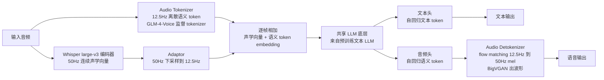
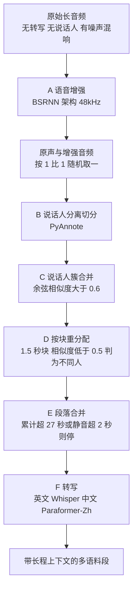
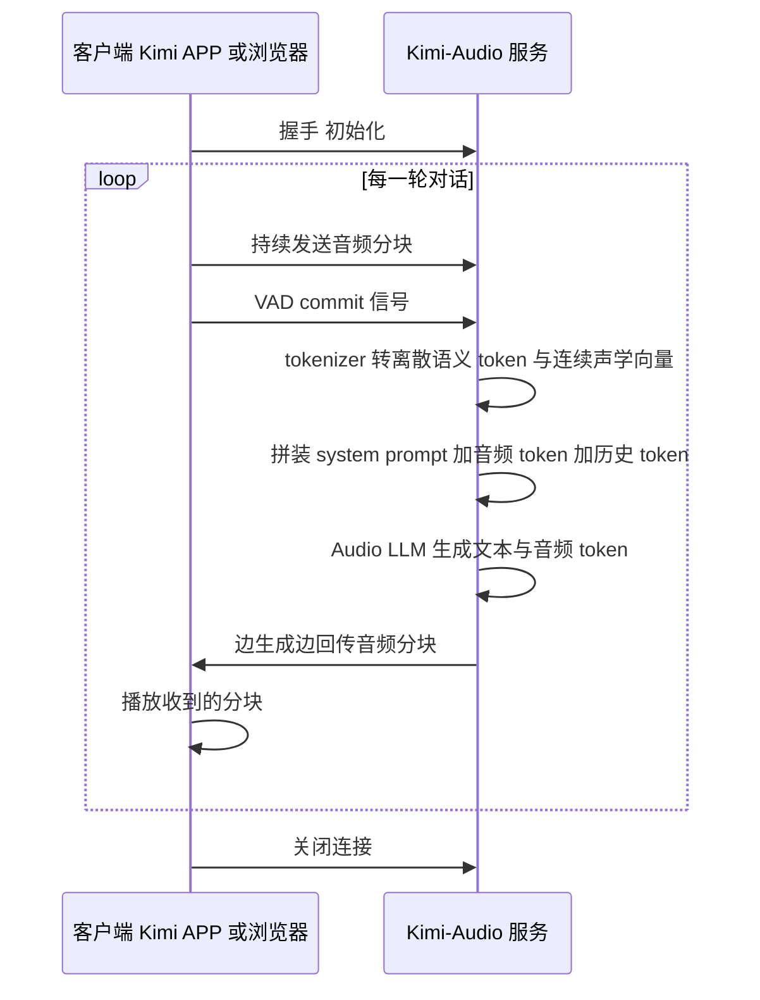
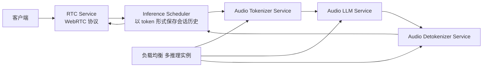

# Kimi-Audio：让语音同时走「离散 token」和「连续向量」两条路

<!-- release-date: 2025-04-25 -->

> 本文依据 Moonshot AI（Kimi Team）发布的 **Kimi-Audio Technical Report**，arXiv:2504.18425v1，2025-04-25 提交，本地 PDF 共 26 页，正文到 p.21，其余为参考文献与贡献者附录（PDF p.26）。页码均指 PDF 页码，与印刷页码一致。代码、权重与评测工具集在 https://github.com/MoonshotAI/Kimi-Audio 与 https://github.com/MoonshotAI/Kimi-Audio-Evalkit 。文中会明确区分「报告写了什么」「我们如何解释」和「外部补充」。

## 读前必要的最小地图

这篇报告几乎每句话都建立在几个音频领域的底层概念上，先把它们说成人话。后面不再重复解释。

- **Token（词元）**：模型读写序列时的最小单位。文本里一个词或一个汉字可能被切成一个或多个 token。
- **音频 tokenizer**：把连续 waveform（声波的振幅序列）变成一串离散编号的模块。离散化之后，音频就能像文本一样喂给自回归语言模型。
- **语义 token vs 声学 token**：这是本篇最重要的一组对立。**语义 token** 是训练时带 ASR（自动语音识别）监督的 tokenizer 产出的，它的编号只关心「说了什么字」；**声学 token** 是训练时带重建损失（把 token 还原成波形）的神经音频 codec 产出的，它关心「听起来是什么样」，包括音色、混响、背景音乐。
- **连续向量**：不做离散化，直接把编码器输出的浮点特征向量当作输入序列的元素。信息全，但它不是「编号」，语言模型的词表和交叉熵损失都用不上。
- **RVQ（Residual Vector Quantization，残差向量量化）**：一种多码本量化方式，第一层量化原始特征，后面每层量化前一层的残差，于是同一帧可以挂多个码本。
- **自回归（autoregressive）**：每次只预测下一个 token，把它接到输入末尾再预测下一个。
- **帧率（Hz）**：每秒钟产出多少个 token 或多少帧特征。12.5 Hz 就是 1 秒音频对应 12.5 个 token；50 Hz 对应 50 帧。
- **flow matching（流匹配）**：一类生成模型，训练目标是「从带噪声的谱图出发，学一条把噪声搬回干净数据的路」。报告用它把语义 token 变成 mel 频谱图（一种近似人耳感知的时间—频率图）。
- **vocoder（声码器）**：从 mel 频谱图还原可播放波形的模块，报告用的是 BigVGAN。
- **WER（Word Error Rate，词错误率）**：识别错多少词，越低越好。
- **chunk-wise streaming（分块流式）**：不等整句生成完，而是一段一段（例如每 1 秒）出结果，用来压低首包延迟。

## 一句话先说清

Kimi-Audio 是一个开源语音基模：它输入音频、输出音频，同时能做识别、理解、问答和实时对话（PDF p.1）。

它真正的做法，是**不给音频选一种表征，而是同时用两种**：

- **输入侧走两路**：一路是 12.5 Hz 的离散语义 token（单个码本），负责「说的是什么」；另一路是 Whisper large-v3 抽出的连续声学向量，从 50 Hz 下采样到 12.5 Hz 后**逐帧加到语义 token 的 embedding 上**，负责「听起来怎么样」（PDF p.4、p.10）。
- **输出侧也走两路**：共享的 Transformer 底层之上分叉出**并行的两个头**，文本头出自回归文本 token，音频头出自回归语义 token；音频 token 再交给流式 detokenizer 变成波形（PDF p.4–5）。
- **为了对上接口，把帧率压到 12.5 Hz**：语义路和声学路都定在 12.5 Hz，逐帧对齐，序列长度也才和文本量级相当（PDF p.3、p.4）。
- **撑起这一切的是 1300 万小时音频预训练**：报告把它列为主要贡献之一，并强调不是「拿 LLM 微调下游任务」，而是真正的音频预训练（PDF p.2–3、p.6）。

全文最值得记住的一点：

> **不要用一种表征同时承担「能被语言模型消化」和「信息不丢」这两个互相拉扯的要求。把两个要求分给两条 12.5 Hz 的对齐通道，语言模型的接口保持不变。**

这也是这篇报告的面试价值所在：它给出的不是一个新算子，而是一个躲开两难的问题切法。

## 核心矛盾：音频表征到底该走哪条路

报告自己在第 8 章把这道矛盾写得最干净（PDF p.21），值得先摆出来，因为全文的架构都是它的直接后果。

### 语义 token 的问题：只剩下「说了什么」

报告的表述是：语义 token 通常由 ASR 辅助损失得到，它「focuses on transcription-oriented information and fails to capture rich acoustic details crucial for understanding and generation」（关注转写导向的信息，抓不住理解与生成所需的大量声学细节）（PDF p.21）。

用人话说：训练信号决定了 tokenizer 的眼里有什么。带 ASR 监督时，「同一个人的清嗓子和这句话的音色」对识别文字没有贡献，于是被量化过程当作噪声丢掉。可下游任务恰恰要靠这些丢掉的东西做情绪识别、场景分类、音乐理解。

### 声学 token 的问题：只剩下「听起来像」

同一页，报告说声学 token 由重建损失学出来，「focuses on description-oriented acoustic details and fails to capture abstractive semantic information that is crucial to bridge to text intelligence」（关注描述导向的声学细节，抓不住通往文本智能所必需的抽象语义）（PDF p.21）。

也就是说，把音频按「能否还原成波形」来量化，token 会优先保住音色与混响，而「这是哪个词」这种抽象信息反而分散在多个码本里，语言模型很难直接拿它当语言用。

### 语言模型的接口是离散的，但连续特征也没被放弃

第二个矛盾不是「离散 vs 连续」的取舍，而是序列长度的错配。报告在架构一节写得很直接：降低每秒 token 数，是为了「bridge the gap between text and audio sequence」（弥合文本序列与音频序列之间的差距），所以把语义和声学 token 的压缩率都定成 12.5 Hz（PDF p.3）。

一个汉字级别的文本 token 大概对应几百毫秒语音，而 50 Hz 的音频表征意味着同样时长要多出四倍的序列位置。序列一长，预训练成本、上下文窗口和对话轮次全部跟着涨。

### 报告的实际答案：不是选一个，是两路都要

综合起来，Kimi-Audio 的选择是（PDF p.3–4）：

1. 主表征用**离散语义 token**，保住语言模型的接口和 12.5 Hz 的长度；
2. 在同一批位置**再加一路连续 Whisper 声学向量**，把被语义量化丢掉的高频细节重新引入输入；
3. 输出侧不试图让音频 token 独立承载全部智能，而是**同时生成文本 token**，让强文本能力去锚住生成质量（PDF p.4、p.11）。

### 两处需要澄清的地方

为避免把常见的说法当成这份报告的内容，这里明确两点（这两点在 PDF 全文中检索不到）：

- **报告里没有任何「重排序 / re-ranking / 重打分」机制。** 生成侧的改进只有一处：在音频 token 前面垫 6 个特殊 blank token 来延迟音频起点（PDF p.11）。
- **报告没有给「离散 token 在长对话上会崩坏」的实验。** 它对离散 token 的批评只停留在上面那两句机理判断（PDF p.21），并且**没有做「只用离散 vs 离散加连续」的对照消融表**来单独证明双表征的收益。这一点对后面的评判很关键。

## 全景：Kimi-Audio 的三段式与两条混合通道

报告的图 2（PDF p.4）把系统画成三块：音频 tokenizer、音频 LLM、音频 detokenizer。下面这张图是据图 2 与 2.1–2.4 节文字重画的机制示意，不是实测时延图。

三个设计各自接在哪里：

| 组件 | 承担的要求 | 报告给的实现 | 位置 |
|---|---|---|---|
| 音频 tokenizer（离散路） | 让语言模型有可预测的离散接口，且序列别太长 | 12.5 Hz、单码本语义 token，沿用 GLM-4-Voice | PDF p.3–4 |
| 音频 tokenizer（连续路） | 保住声学与副语言细节 | Whisper large-v3 特征，经 adaptor 降到 12.5 Hz 后与语义 embedding 相加 | PDF p.4、p.12 |
| 音频 LLM | 同时保住文本智能和音频生成 | 共享底层 + 文本头与音频头并行，共享层与文本头从 Qwen2.5 7B 初始化 | PDF p.4–5、p.12 |
| 音频 detokenizer | 低延迟地把 token 变回波形 | chunk-wise 自回归流式 + look-ahead，flow matching 加 BigVGAN | PDF p.5 |

一个数字先看全貌：音频 LLM 初始化自 Qwen2.5 7B，预训练吃掉 585B 音频 token 与 585B 文本 token，各 1 epoch（PDF p.12）。参数量与算力之外的细节报告没写。

## 设计一：混合 tokenizer——12.5 Hz 离散语义加连续声学

### 旧问题

只走离散语义 token，情绪、场景、音乐这些任务没有可用信息；只走连续特征，语言模型的词表和 next-token 交叉熵没有落点，而且 50 Hz 的序列太长。

### 新设计

报告的说法是：采用「hybrid audio tokenization strategy」，把离散语义 token 与互补的连续声学向量结合，这样「既能利用离散 token 的效率与语义聚焦，又能受益于连续表征捕获的丰富声学细节」（PDF p.3）。

### 工作机制

**离散路。** 语义 token 直接沿用 GLM-4-Voice 提出的方案：在一个 ASR 模型里引入向量量化层，架构取自 Whisper encoder，于是连续语音表征被转成低帧率（12.5 Hz）的离散 token 序列，**使用单个码本**（PDF p.3–4）。Kimi-Audio 复用这套 token 作为音频 LLM 输入与输出的基本表征。

**连续路。** 在预训练 Whisper 模型上抽特征，原始帧率 50 Hz；为了对齐，额外引入一个 **adaptor 把特征从 50 Hz 下采样到 12.5 Hz**；下采样后的特征**加到离散语义 token 的 embedding 上**，共同构成音频 LLM 的输入（PDF p.4）。

**这里有个容易被跳过的细节：两路是「相加」，不是「拼接」。** 报告原文用的是 「are added to the embeddings of discrete semantic tokens」（PDF p.4），p.10 的记号部分也再次写成 $a_i$ 表示 $ac_i$ 与 $ad_i$ 相加后的音频特征。相加意味着两路占用**同一批序列位置**：一个位置既承载「这帧是什么语义 token」，也承载「这帧的声学样子」。拼接会翻倍隐藏维度并让注意力把它们当两个条目处理；相加则保持位置数为音频秒数 $\times\ 12.5$。

### 规格放在一起看

| 通路 | 来源模型 | 帧率 | 码本数 | 是否带 ASR 监督 | 在系统中的角色 |
|---|---|---:|---:|---|---|
| 离散语义 token | GLM-4-Voice 监督 tokenizer（Whisper encoder 架构内加 VQ 层） | 12.5 Hz | 报告写为 single codebook | 是（由 ASR 模型派生） | 音频 LLM 的输入主表征，也是音频头的输出词表 |
| 连续声学向量 | Whisper large-v3 编码器 | 50 Hz，经 adaptor 下采样到 12.5 Hz | 不适用（未量化） | 不适用 | 只进输入，与语义 token embedding 相加 |
| detokenizer 输出 | 语义 token → mel → 波形 | 12.5 Hz 上采样 4 倍得 50 Hz mel | 不适用 | 不适用 | 生成侧，见本节之后 |

证据：PDF p.3–4（离散路与连续路）、p.12（Whisper large-v3 初始化）、p.5（4 倍上采样）。

**报告没有写的规格**：

- 码本的**大小**（每本多少条目）与扩展后的音频词表规模，只说「extend its vocabulary with semantic audio tokens and special tokens」（PDF p.12）；
- **比特率**：因此无法从报告自己给的数字算出来。要算每秒比特数需要「12.5 × 每 token 比特数」，而后者未公开；
- adaptor 的具体结构（层数、是否可学习、下采样方式是平均还是卷积），报告只说「introduce an adaptor」，没给实现（PDF p.4）。

这三处只能按「未公开」处理。任何看起来合理的数字都不该往这里填。

### 收益

- 输入侧同时保住接口与细节，不必为音频另训一套生成模型；
- 两路都在 12.5 Hz，序列长度由音频时长线性决定，与文本同一量级；
- 连续路是可微的，训练时 Whisper 特征提取器在预训练约 20% token 之后解冻，与主干联合微调（PDF p.12）。这意味着连续路不是永久冻住的「外部特征」，表示本身会朝任务适配。

### 代价与边界

- 两路相加意味着**语义路与声学路的帧必须严格一一对应**。报告为此在数据侧统一了长度：训练序列里让音频与文本序列等长，短的一方**补 blank token**（PDF p.10）。
- 保留 Whisper 编码器意味着输入侧多出一个大模型的前向开销。报告没有单列这一路的耗时。
- 细节只补在**输入侧**。输出仍然是纯语义 token，所以生成音频里的声学细节得靠 detokenizer 与后训练数据里的表现力补回来（PDF p.9、p.12）。

### 可迁移启发

当你需要一个多模态模型既要「看得懂原始信号」又要「能被语言模型接口消化」时，比「挑一种表征」更省事的切法是：**保住离散主表征不动，另开一路同帧率的连续特征加到 embedding 上**。它不需要改词表、不需要改损失，代价主要落在「两路必须逐帧对齐」和「多一个编码器的前向」。反过来说，如果两路的帧率天然不一致，或者对齐要靠额外的时长模型，这个方案的工程成本会迅速超过收益。

## 设计二：共享底层加双头并行生成

### 旧问题

语音基模的输出侧有两个目标互相拉扯：要生成「聪明的回答」，就得依赖文本 LLM 的语言能力；要低延迟出声，就得让音频 token 不必等文本写完再开始。让音频 token 直接当唯一输出，模型必须在没有文本锚的情况下自己组织语言。

### 新设计

把标准 LLM 结构拆成共享与专用两部分（PDF p.4–5）：

- **共享层**：原始 Transformer 靠下的若干层（「the first several layers」）共同处理输入序列，学习跨模态表征；
- **文本头**：由若干 Transformer 层组成，自回归预测文本 token；
- **音频头**：同样是若干 Transformer 层，自回归预测离散语义音频 token，随后交给 detokenizer 合成波形。

图 2 里两个头并列，输入序列的标记集是 Text Token、Audio Token、Blank Token 三类（PDF p.4）。

### 工作机制：谁从哪来

预训练文本 LLM 的权重直接搬到**共享层与文本头**；**音频头随机初始化**（PDF p.5）。报告的论证很直白：这样模型在学习处理与生成音频的同时，保住稳健的文本理解与生成能力。

音频 LLM 的起点是 Qwen2.5 7B（PDF p.12）。报告的原文只说「the first several layers」是共享层，没有给出共享层与两头各自的层数切分，也没给两头的层数——这一处是未公开信息。

### 图 2 里三处正文没写的信息

打开 PDF p.4 的图 2 逐项看，能得到三条正文没有用文字复述的事实：

1. **哪些模块可训练、哪些冻住是画在图上的。** 图 2 用两种图标区分：Whisper 编码器与 Adaptor 带可训练标记，Audio Tokenizer 与 Audio Detokenizer 带冻结标记（PDF p.4 图 2）。这与正文两处描述一致——4.1.4 说 Whisper 特征提取器先冻约 20% token 再解冻（PDF p.12），4.3 说 detokenizer 是**另外三阶段单独训练**的（PDF p.12）。也就是说，音频 LLM 训练时语义 tokenizer 与 detokenizer 都不参与更新。
2. **图上的 「Audio Delay」 括号只画了 3 个 blank token，正文写的是 6 个**（PDF p.4 与 p.11）。图是示意，数字以 4.1.3 正文为准。
3. **图上有一条从文本 token 行指回音频头的箭头**（PDF p.4 图 2）。这与 4.1.3 的说法吻合——「语义 token 的预测更像一个流式 text-to-speech 任务」（PDF p.11），即文本侧的进度会喂给音频头。**但报告没有用文字明确定义这条边的语义**，所以这里只能作为读图得到的推断，不能当作者的主张引用。

输入侧的画法也印证了前面的判断：图 2 里音频 embedding（蓝色）与音频 token（绿色）被虚线框**逐帧配成一对**，同一个位置两个条目，正是「相加而不是拼接」的图形表达（PDF p.4）。

### 关键细节：6 个 blank token 把音频起点往后推

这是并行生成方案里唯一一处真正做过实验权衡的机关，值得完整说清（PDF p.11）：

1. 在「音频到语义 token 加文本」交错预训练任务里，序列形如 $\{a_1, ad_2/t_2, a_3, ad_4/t_4, \dots\}$，即同一批位置要同时出文本 token 和语义 token；
2. 语义 token 序列总是比对应文本长，所以这个预测更像流式 TTS；
3. 作者发现**开头几个语义 token 最难预测**，因为模型必须同时给出下一个文本 token 和它的音频 token（「the prediction of the first few semantic tokens is hard because the model needs to concurrently predict the next text token and its semantic audio token」）；
4. 解决办法：在语义音频 token 前面**垫 6 个特殊 blank token**，把音频起点整体延迟；
5. 数字 6 的来处：preliminary experiments 里按生成质量与延迟做的权衡（「6 is determined by trading off the generation quality and latency according to preliminary experiments」）。

报告没给这条权衡曲线的任何数字，也就是说「为什么不是 4 或 8」在 PDF 里查不到（PDF p.11）。

用延迟的代价来理解：6 个 token 在 12.5 Hz 下是 $6 / 12.5 = 0.48$ 秒的音频长度。这是本报告自己数字的换算，不是报告的实测端到端时延。

### 收益

- **生成质量有文本锚**：文本头沿用预训练 LLM 的能力，报告把「在输出侧与离散文本 token 拼接」写成提升生成能力的手段（PDF p.3）；
- **不用等文本写完才出声**：两个头并行，音频 token 与文本 token 同时推进，配合分块流式 detokenizer 压低首包延迟；
- **保住知识能力**：训练目标里文本-only 任务的权重是 7，音频-only 是 1（PDF p.11 表 3），文本数据继续走 MoonLight 的高质量语料（PDF p.11）。

### 代价与边界

- 音频头随机初始化，而它要学的是一路全新词表。报告为此专门设计了四类桥接任务（映射与交错），说明「接上去」不是免费的（PDF p.10–11）。
- 两路长度不一致时要补 blank token，序列里出现无信息位置，训练算力有实际浪费。
- 并行生成对**理解类任务没有直接帮助**：ASR、音频理解这类只要文本输出，报告在评测里也是按任务分别对比（PDF p.16–19）。

### 可迁移启发

给 LLM 加新输出模态时，比「另训一个解码器」更值得先试的结构是：**共享靠下的层，分出专用头，并且把原始模态（文本）的头继续留着当锚**。真正要提前想清楚的是两路长度不匹配怎么办——Kimi-Audio 的答案（补 blank token、延迟音频起点）非常朴素，但报告唯一给出的量化权衡（6）恰恰落在这里。

## 设计三：流式 Detokenizer——分块 flow matching 加 look-ahead

### 旧问题

离散语义 token 只是编号，要变成能听的语音还需要两步：token 到 mel 频谱、频谱到波形。目标是实时对话，就不能等整句生成完再解码。

报告用的架构与 MoonCast 相同：flow-matching 模块把 12.5 Hz 语义 token 转成 50 Hz mel 频谱图，vocoder 再从 mel 生成波形（PDF p.5）。

### 工作机制：为什么「分块各解各的」不够

最直觉的做法是把语义 token 切成块、逐块独立解码。报告说这条路在他们自己的初步实验里「faces an intermittent issue in the chunk boundaries」（在块边界出现断续问题）（PDF p.5）。

于是提出 **chunk-wise 自回归流式框架加 look-ahead 机制**：

1. 音频切成块 $\{c_1, c_2, \dots, c_N\}$，例如每块 1 秒；
2. 为对齐序列长度，把语义 token 上采样 4 倍，使 12.5 Hz 对上 50 Hz mel；
3. 训练与推理都用 **chunk-wise causal mask**：对块 $c_i$，所有 $j<i$ 的块都是 prompt，而 prompt 里同时含 mel（$m_j$）与音频 token（$ad_j$）；
4. flow matching 的前向把 $m_i$ 与高斯噪声混合，反向在 $ad_i$ 与历史 prompt 的条件下把噪声去掉，得到干净 $m_i$；
5. 推理时 LLM 每生成一块，就用 flow matching 把这一块解成 mel，再对每块套 **BigVGAN** vocoder 出波形。

即便有长程历史可看，块边界仍然会退化。报告给的原因是机理性的：**块状因果注意力让边界位置看不到未来上下文**（PDF p.5）。

### look-ahead：用 4 个未来 token 换掉边界断裂

对块 $c_i$，从 $c_{i+1}$ 取未来 $n$ 个（例如 4 个）语义 token 拼到 $c_i$ 末尾得到 $\hat{c}_i$，解码 $\hat{c}_i$，但**只保留属于 $c_i$ 的那段 mel**（PDF p.5）。

作者强调这个机制 **training-free**，代价只体现在首块：把第一块的生成推迟 $n$ 个 token。$n=4$ 在 12.5 Hz 下相当于 0.32 秒的音频长度——这是按报告帧率的换算，报告没有给实测毫秒数。

### 训练分三阶段

| 阶段 | 数据 | 目标 | 位置 |
|---|---|---|---|
| 一 | 预训练语料里约 1M 小时音频 | 联合预训练 flow-matching 模块与 vocoder，学多样音色、韵律与音质 | PDF p.12 |
| 二 | 同一批预训练数据 | chunk-wise 微调，**动态 chunk 大小 0.5–3 秒** | PDF p.12 |
| 三 | Kimi-Audio speaker 的高质量单说话人录音 | 微调，锁定最终音色与表现力 | PDF p.12 |

第二阶段用动态 chunk 尺寸这件事值得注意：如果训练时只见过固定 1 秒块，推理换尺寸就会失配；把 chunk 大小随机化，是让「分块」这个近似在训练里就被暴露出来。

### 代价与边界

- 每块要等它对应的 token 全部生成完才开始解码，块越长首包越慢、越短边界问题越多；报告用 look-ahead 而不是加长块来解，但没给这个取舍的曲线。
- 生成音频的表现力上限受第三阶段数据限制：整个系统对外只有一个录音棚录制的**单一说话人**音色（PDF p.9、p.12）。这一点在下面评测一节会再遇到。

### 可迁移启发

任何「分块流式生成」都会撞上边界不连续。Kimi-Audio 给的两条经验都很可移植：**训练时随机化块长**，以及**解码时向前多看几个单位、只保留自己那段**。后者尤其便宜，因为它是 training-free 的，代价是一次可预测的首块延迟。

## 数据：1300 万小时预训练与约 300K 小时 SFT

架构解决的是「表征怎么摆」，数据解决的是「这套表征能学到多少东西」。报告把数据列为三大贡献之一，并且明确说这不是顺手洗了一批语料，而是一条跑在生产集群上的流水线（PDF p.2、p.6–7）。

### 预训练语料：规模与构成

音频-only 预训练数据约 **1300 万小时**原始音频，覆盖有声书、播客、访谈等真实场景，包含丰富的声学事件、音乐、环境声、人声与多语种信息（PDF p.6；摘要里写作 more than 13 million hours，PDF p.1）。文本-only 数据的细节指向参考文献 [65]，即 Kimi k1.5 一篇报告（PDF p.6）。

绝大多数原始音频**没有转写、没有语言标签、没有说话人标注、没有切分边界**，还常带噪声、混响和说话人重叠（PDF p.6）。这就是下面整条流水线的输入形态。报告强调自己与同类流水线的差别：别人的重点是切出高质量短片段，它的目标是**带一致长程上下文的长音频标注**（PDF p.6）。

### 流水线五步

下图按报告图 3 与 3.1 节文字重画，是处理顺序示意，不是耗时分布（PDF p.6–7）。

几个决定值得逐条记住，因为它们都是被真实缺陷逼出来的：

- **语音增强会伤害理解能力。** 团队发现增强模型会把环境声与音乐一并去掉，这对音频理解是有害的，所以预训练阶段**随机取原始或增强音频，比例 1 : 1**（PDF p.7）。这一条是整篇里少见的「反直觉但诚实」的细节：他们没有把增强当成纯收益。
- **簇合并阈值 0.6。** PyAnnote 有时把同一个人拆成多个标签，于是对每个初始簇算代表 embedding，成对余弦相似度大于 0.6 就合并（PDF p.7）。
- **1.5 秒块重分配阈值 0.5。** 初始分段里偶尔一段混了多人，于是把段落切成 1.5 秒块，相邻两块余弦相似度低于 0.5 判为不同人，每块重新分配给最相似的簇（PDF p.7）。
- **27 秒与 2 秒。** 合并相邻同说话人段落，直到累计长度超过 27 秒或两段之间静音间隔大于 2 秒为止（PDF p.7）。原始切分存在短于 1 秒或长于 100 秒的不实用段落（PDF p.7）。
- **标点用停顿造出来。** 中文走 Paraformer-Zh（FunASR 工具包），它给字符级时间戳但不给标点，于是按停顿插：相邻字符间隔大于 0.5 秒且小于 1.0 秒补逗号，超过 1.0 秒补句号（PDF p.7）。语言检测与英文转写用 Whisper-large-v3，并且**只保留英文与普通话**两个语种的段落进入后续（PDF p.7）。

### 这条流水线跑得多快

| 项目 | 数值 | 位置 |
|---|---:|---|
| 云实例数 | 30 | PDF p.7 |
| 单实例配置 | 128 vCPU、1 TB 内存、8 张 NVIDIA L20 | PDF p.7 |
| 集群总量 | 3840 vCore、30 TB 内存、240 张 L20 | PDF p.7 |
| 日处理吞吐 | 约 200000 小时原始音频 | PDF p.7 |

CPU 侧选 Intel Xeon Platinum 8575C 是为了用到 AMX 这类向量化加速指令（PDF p.7）。

### SFT 数据分三块

SFT 的目的是指令跟随与音频处理能力，报告特别强调一条立场：**绝大部分 SFT 数据用公开可得的数据源与工具构造，没有买数据**（PDF p.2–3）。

**一、音频理解（PDF p.7–8）。** 主要用开源数据集，覆盖 6 类任务：ASR、音频问答（AQA）、音频描述（AAC）、语音情绪识别（SER）、声音事件分类（SEC）、声学场景分类（ASC）。表 1 是一张很长的表（PDF p.8），下面按任务把关键行重排成原生表，epoch 一列就是报告里唯一的「消融结果」。

| 任务 | 代表数据集与时长（小时） | SFT epoch |
|---|---|---:|
| ASR | Emilia 98305、Libriheavy 51448、MLS 45042、WenetSpeech4TTS 12085、WenetSpeech 10518、Gigaspeech 10288、KeSpeech 1428、CommonVoice 1854 与 43、AISHELL-2 1036、zhvoice 901、Magicdata 747、LibriSpeech 960、AISHELL-1 155、Voxpopuli 529、LibriTTS 568、AISHELL-3 65、Fleurs 17 | 2.0 |
| ASR（内部） | Kimi Inhouse ASR Data 55000 | 2.0 |
| AQA | CompA-R 159、AVQA audio-only 112、MusicAVQA audio-only 77.1、ClothoAQA 7.4 | 2.0（ClothoAQA 为 4.0） |
| AAC | WavCaps 3793.3、AudioCaps 137、Clotho-v2 24.0、MACS 10.9 | 2.0 |
| AAC/AQA（内部） | Kimi Inhouse Audio Data 5200 | 2.0 |
| SER | ESD 29、IEMOCAP 10、MELD 9、RAVDESS 3、SAVEE 0.1 | 2.0 |
| SEC | VGGSound 513、FSD50k 80.8 与 74、VocalSound 19、Nonspeech7k 6.2、UrbanSound8K 9、ESC50 1 | 2.0（Nonspeech7k 与 VocalSound 为 4.0） |
| ASC | CochlScene 169.0、TAU2022 67、TUT2017 13、TUT2016 10 | 2.0（TUT2017 为 4.0） |

上表把同名但不同来源的条目（例如 CommonVoice 与 FSD50K 各出现两次）合并在了一行，单个数据点的原值仍以 PDF p.8 的表 1 为准。

**二、语音对话（PDF p.9）。** 数据是多轮对话，用户 query 与助手 response 分开造：

- 用户 query：让 LLM 写文本，再用 Kimi-TTS 转成语音，prompt 语音从一个**超过 125K 音色**的大音色库里随机选；
- 助手 response：**固定一位配音演员**（报告称 Kimi-Audio speaker），用她的单音色合成带风格与情绪的回答。

为了让这位 speaker 有足够表现力，团队在专业录音棚里预定义了**超过 20 种风格与情绪，每种情绪再分 5 个强度等级**，每个风格与情绪级各录一条参考音频以保证跨句子一致，全程由专业录音导演指导（PDF p.9）。

两个配套系统值得单独记：

| 系统 | 作用 | 实现要点 |
|---|---|---|
| Kimi-TTS | 零样本 TTS，3 秒 prompt 保留音色、情绪与风格 | 架构类似 MoonCast：LLM 生成语音 token，flow-matching detokenizer 出声波；在自动流水线产出的约 1M 小时数据上训练，之后用强化学习提升稳健性与质量（PDF p.9） |
| Kimi-VC | 把任意说话人的语音转成 Kimi-Audio speaker 的音色，同时保留风格、情绪与口音 | 建在 Seed-VC 框架上，训练时用时变音色扰动模型做源音色扰动，缓解信息泄漏并让训练与推理阶段一致；再用该 speaker 的录音微调（PDF p.9） |

Kimi-VC 这一步是为了绕开「配音演员录不了所有风格和口音」这个物理限制。换句话说，**表现力数据是从真实语音里搬风格、而不是从零合成**。

**三、音频到文本 chat（PDF p.9–10）。** 收集公开文本 SFT 数据，把用户 query 转成多种音色的语音，得到「输入是语音、回复是文本」的数据。因为不是所有文本都适合念出来，先做三步预处理：过滤掉含复杂数学、代码、表格、复杂多语内容或过长的文本；做口语化改写；把带复杂指令的单轮问答拆成指令更简单的多轮数据（PDF p.9–10）。

| 数据集 | 样本数 | SFT epoch |
|---|---:|---:|
| Infinity-Instruct | 7M | 2.0 |
| OpenOrca | 2M | 2.0 |
| OpenHermes-2.5 | 1M | 2.0 |
| NuminaMath | 860K | 2.0 |
| Tulu3 | 900K | 2.0 |
| Magpie-Pro | 300K | 2.0 |
| Magpie-MT | 300K | 2.0 |
| Evol-Instruct | 143K | 2.0 |
| Synthia | 119K | 2.0 |
| Evol-Instruct-Code | 80K | 2.0 |

数据来自 PDF p.10 的表 2。所有源统一 2.0 epoch，报告没有对这批文本数据单独给 epoch 消融。

SFT 数据总规模：**约 300K 小时**（PDF p.12）。

## 训练 recipe：七类任务的配比与一次解冻

### 序列怎么摆

给定原始音频 $A$，流水线把它切成 $N$ 个片段 $\{S_1, S_2, \dots, S_N\}$，每个片段 $S_i$ 含音频 $a_i$ 与转写 $t_i$；每个 $a_i$ 再抽出连续声学向量 $ac_i$ 与离散语义 token $ad_i$（PDF p.10）。

训练序列写成：

$$
\{ac_1/ad_1/t_1,\ ac_2/ad_2/t_2,\ \dots,\ ac_N/ad_N/t_N\}
$$

这里 $ac_i/ad_i/t_i$ 表示该片段实际取用的一到两种序列，例如只取 $ad_i$、只取 $t_i$、取 $ac_i/ad_i$ 或取 $ad_i/t_i$。两个关键约定：

1. $ac_i$ 与 $ad_i$ **相加**成最终音频特征 $a_i$（语义 token 先过查表变 embedding），后文用 $a_i$ 代指 $ac_i/ad_i$（PDF p.10）；
2. **音频序列与文本序列被补 blank token 到等长**（PDF p.10）。

### 七类预训练任务与权重

下表重排自 PDF p.11 的表 3。原文用下划线标记「哪些位置算损失」，这里用文字说明。

| 类别 | 任务 | 序列形式 | 在哪些 token 上算损失 | 权重 |
|---|---|---|---|---:|
| 音频/文本单模态 | Text Only | $t_1, t_2, \dots, t_N$ | 文本 token | 7 |
| 音频/文本单模态 | Audio Only | $ad_1, ad_2, \dots, ad_N$ | 语义音频 token | 1 |
| 音频文本映射 | Audio to Text（ASR） | $a_1, t_1, a_2, t_2, \dots$ | 文本 token | 1 |
| 音频文本映射 | Text to Audio（TTS） | $t_1, ad_1, t_2, ad_2, \dots$ | 语义音频 token | 1 |
| 音频文本交错 | Audio to Semantic | $a_1, ad_2, a_3, ad_4, \dots$ | 语义音频 token（不在 $a_{i-1}$ 上算） | 1 |
| 音频文本交错 | Audio to Text | $a_1, t_2, a_3, t_4, \dots$ | 文本 token | 1 |
| 音频文本交错 | Audio to Semantic and Text | $a_1, ad_2/t_2, a_3, ad_4/t_4, \dots$ | 两路各自 | 2 |

三组任务的设计意图很清楚（PDF p.10–11）：单模态各自学知识，映射任务强迫模型会「听写」和「念出来」，交错任务让两模态在同一序列里被交替预测。文本-only 权重 7 而不是 1，说明他们最怕的是把语言模型训坏。

交错任务里那条 **6 个 blank token 的延迟**就是这一节出现的（PDF p.11），前面设计二已展开。

### 超参与解冻

| 项 | 预训练 | SFT |
|---|---|---|
| 初始化 | Qwen2.5 7B，词表扩展语义音频 token 与特殊 token（PDF p.12） | 接在预训练权重之后 |
| 数据量 | 585B 音频 token 与 585B 文本 token，各 1 epoch（PDF p.12） | 约 300K 小时，每源 2–4 epoch（PDF p.12） |
| 优化器 | AdamW（PDF p.12） | AdamW（PDF p.12） |
| 学习率 | $2\times10^{-5}$ 余弦衰减到 $2\times10^{-6}$（PDF p.12） | $1\times10^{-5}$ 余弦衰减到 $1\times10^{-6}$（PDF p.12） |
| warmup | 1% token（PDF p.12） | 10% token（PDF p.12） |
| 任务权重 | 1 : 7 : 1 : 1 : 1 : 1 : 2，对应表 3 顺序（PDF p.12） | 不设任务切换标记，用自然语言指令（PDF p.12） |

连续路的调度是这一节唯一涉及「训练动态」的设计：Whisper large-v3 特征提取器在**预训练最初约 20% 的 token 上冻结**，之后解冻，与其余部分联合微调（PDF p.12）。原因报告写得明白——先让主干在一个稳定的表征上收敛，再允许表征本身被任务改写。

SFT 还有两个提升鲁棒性的做法（PDF p.12）：指令同时准备文本版与音频版（音频由 Kimi-TTS 零样本合成），训练时随机选一种；用 LLM 为 ASR 造 **200 条**、为其他任务各造 **30 条**指令，每个样本随机挑一条。

Detokenizer 的三阶段训练在 4.3 节（PDF p.12），已并入设计三。

## 推理与部署：三段服务化

### 一轮对话的时序

报告用实时语音对话作为部署范例，理由是它在基础设施与工程上比其他音频任务更复杂（PDF p.12–13）。据图 4 重画的客户端—服务端时序如下，是消息流示意，不是实测时间轴（PDF p.13）。

服务端单轮推理的四步（PDF p.13）：音频 → tokenizer → 拼装输入（system prompt token、音频 token、会话历史 token）→ Audio LLM 生成 → detokenizer 还原波形。

判定「用户说完了」的职责在服务端的 VAD（voice activity detection，语音活动检测）模块，它触发 commit 信号后才启动推理（PDF p.12–13）。

### 生产架构：三块都要 GPU，所以拆开扩

报告的关键判断是：Audio Tokenizer、Audio LLM、Audio Detokenizer **三个组件都是计算密集的**，因此需要可扩缩的高效基础设施（PDF p.14）。据图 5 重画：

Inference Scheduler 每轮做四件事：调 Tokenizer Service 把用户音频转 token、把新 token 与历史拼成模型输入、发给 LLM Service 生成回复 token、调 Detokenizer Service 把回复 token 变音频；并**把所有输出 token 存回会话历史**以保证连续性（PDF p.14）。

选 WebRTC 是为了稳定与低延迟连接（PDF p.14）。三个服务各自带负载均衡与多个推理实例。

**这一节报告没写的东西值得点出来**：全文没有出现过任何端到端延迟数字、首包时间的毫秒值、实时率、并发量或 GPU 型号配置（部署部分只说「需要 GPU」）。所有延迟相关的表述都是定性的「low latency」，唯一可量化的延迟线索是两处机制：6 个 blank token 与 look-ahead 的 $n=4$ 个 token。也就是说，**流式设计做了，但流式收益没有被量化**。

## 评测工具集：为什么作者认为「没法公平比」

报告把评测工具集当成独立贡献，理由是在音频领域**连复现别人公开的结果都困难**（PDF p.15）。它列出三条成因：

- **度量本身的局限**：同一指标实现不一致，例如不同文本归一化会让 WER 算出不同值；而像音频问答这类任务用精确字符串匹配，无法反映复杂 LLM 回答的语义正确性（PDF p.15）；
- **配置太多样**：模型性能对解码 temperature、system prompt、task prompt 高度敏感，可复现性因此严重受损（PDF p.15）；
- **生成侧没有基准**：理解任务已有进展，但「生成的音频回答质量与连贯性」缺乏 benchmark（PDF p.15）。

工具集给出的三条对策（PDF p.15–16）：

1. 实现标准化 WER 计算，口径基于 Qwen2-Audio；
2. 集成 GPT-4o-mini 作为智能 judge 来评语义正确性，做法沿用 VoiceBench；
3. 提供统一平台支持多模型多版本并排比较，并把标准化的推理参数与提示策略定义为可共享的「recipe」。

工具集当时集成 Kimi-Audio 与 Qwen2-Audio、Qwen2.5-Omni、GLM-4-Voice、Baichuan-Audio、Step-Audio 一批音频 LLM（PDF p.15）。另外他们还录制并发布了一个**语音对话能力**评测基准，从三个角度看：语音控制（情绪、语速、口音）、共情对话、以及讲故事与绕口令这类多样风格（PDF p.16）。

工具集单独开源在 https://github.com/MoonshotAI/Kimi-Audio-Evalkit 。

**我们如何看这件事**：这三条批评里最有分量的不是指标实现，而是第二条。音频 LLM 的评测同时受「提示怎么写」和「解码怎么采」影响，而报告正文只说「性能对温度、system prompt、task prompt 高度敏感」，**没有给敏感性曲线**（PDF p.15）。把配方标准化成 recipe，是承认了这一点之后的工程处理。

## 评测结果：四张表

参与对比的模型：Qwen2-Audio、Baichuan-Audio、Step-Audio、GLM-4-Voice、Qwen2.5-Omni（PDF p.17）。以下四张表全部由 PDF 原表转成原生 markdown 表格，数字逐格核对自对应页。

### 语音识别：WER 越低越好（PDF p.16 表 4）

| 数据集 | Qwen2-Audio-base | Baichuan-Audio-base | Step-Audio-chat | Qwen2.5-Omni | Kimi-Audio |
|---|---:|---:|---:|---:|---:|
| LibriSpeech test-clean \| test-other | 1.74 \| 4.04 | 3.02 \| 6.04 | 3.19 \| 10.67 | 2.37 \| 4.21 | **1.28 \| 2.42** |
| Fleurs zh \| en | 3.63 \| 5.20 | 4.15 \| 8.07 | 4.26 \| 8.56 | 2.92 \| **4.17** | **2.69** \| 4.44 |
| AISHELL-1 | 1.52 | 1.93 | 2.14 | 1.13 | **0.60** |
| AISHELL-2 ios | 3.08 | 3.87 | 3.89 | **2.56** | **2.56** |
| WenetSpeech test-meeting \| test-net | 8.40 \| 7.64 | 13.28 \| 10.13 | 10.83 \| 9.47 | 7.71 \| 6.04 | **6.28 \| 5.37** |
| Kimi-ASR Internal subset1 \| subset2 | 2.31 \| 3.24 | 3.41 \| 5.60 | 2.82 \| 4.74 | 1.53 \| 2.68 | **1.42 \| 2.44** |

要读出三件事：

- 英文朗读体（LibriSpeech）与中文会议（WenetSpeech test-meeting）上优势最大，LibriSpeech test-other 从对手最低 4.04 降到 2.42；
- **Fleurs 英文并不是最好**（4.44，输给 Qwen2.5-Omni 的 4.17），AISHELL-2 与 Qwen2.5-Omni 打平（2.56）。报告正文写「sets SOTA results on AISHELL-1 (0.60) and AISHELL-2 ios (2.56)」，把并列第一也写成 SOTA（PDF p.18）；
- 内部测试集是自选的，只能作横向一致性参考，不构成公开可比证据。

### 音频理解（PDF p.17 表 5）

| 数据集 | Qwen2-Audio-base | Baichuan | GLM-4-Voice | Step-Audio-chat | Qwen2.5-Omni | Kimi-Audio |
|---|---:|---:|---:|---:|---:|---:|
| MMAU music \| sound \| speech | 58.98 \| 69.07 \| 52.55 | 49.10 \| 59.46 \| 42.47 | 38.92 \| 43.54 \| 32.43 | 49.40 \| 53.75 \| 47.75 | **62.16** \| 67.57 \| 53.92 | 61.68 \| **73.27** \| **60.66** |
| ClothoAQA test \| dev | 71.73 \| 72.63 | 48.02 \| 48.16 | 未列 | 45.84 \| 44.98 | **72.86** \| 73.12 | 71.24 \| **73.18** |
| VocalSound | 93.82 | 58.17 | 未列 | 28.58 | 93.73 | **94.85** |
| Nonspeech7k | 87.17 | 59.03 | 未列 | 21.38 | 69.89 | **93.93** |
| MELD | 51.23 | 23.59 | 未列 | 33.54 | 49.83 | **59.13** |
| TUT2017 | 33.83 | 27.9 | 未列 | 7.41 | 43.27 | **65.25** |
| CochlScene test \| dev | 52.69 \| 50.96 | 34.93 \| 34.56 | 未列 | 10.06 \| 10.42 | 63.82 \| 63.82 | **79.84 \| 80.99** |

这张表是全篇最能支撑「双表征」主张的证据，但方向要读准：

- **领先幅度最大的是非语音声学任务**：Nonspeech7k 从 87.17 提到 93.93、TUT2017 从 43.27 到 65.25、CochlScene 从 63.82 到 79.84。这些是场景与事件分类，靠的是声学细节；
- **纯语音类任务的优势小得多甚至没有**：MMAU 的 music 一格 Kimi-Audio 61.68 **低于** Qwen2.5-Omni 62.16，ClothoAQA test 71.24 低于 72.86（PDF p.17）；
- 报告正文的措辞很谨慎，只说在 MMAU 的 sound 与 speech 两类上表现更好（73.27 与 60.66），并且强调 MELD 情绪理解 59.13（PDF p.18）。它没有对 music 一类作 SOTA 声明。

### 音频到文本对话（PDF p.18 表 6）

OpenAudioBench 五列依次是 AlpacaEval、Llama Questions、Reasoning QA、TriviaQA、Web Questions；VoiceBench 两组依次是 AlpacaEval、CommonEval、SD-QA、MMSU 与 OpenBookQA、IFEval、AdvBench、Avg。

| 模型 | OpenAudioBench 五列 | VoiceBench 前四列 | VoiceBench 后四列 |
|---|---|---|---|
| Qwen2-Audio-chat | 57.19 \| 69.67 \| 42.77 \| 40.30 \| 45.20 | 3.69 \| 3.40 \| 35.35 \| 35.43 | 49.01 \| 22.57 \| 98.85 \| 54.72 |
| Baichuan-chat | 59.65 \| 74.33 \| 46.73 \| 55.40 \| 58.70 | 4.00 \| 3.39 \| 49.64 \| 48.80 | 63.30 \| 41.32 \| 86.73 \| 62.51 |
| GLM-4-Voice | 57.89 \| 76.00 \| 47.43 \| 51.80 \| 55.40 | 4.06 \| 3.48 \| 43.31 \| 40.11 | 52.97 \| 24.91 \| 88.08 \| 57.17 |
| Step-Audio-chat | 56.53 \| 72.33 \| 60.00 \| 56.80 \| **73.00** | 3.99 \| 2.99 \| 46.84 \| 28.72 | 31.87 \| 29.19 \| 65.77 \| 48.86 |
| Qwen2.5-Omni | 72.76 \| 75.33 \| **63.76** \| 57.06 \| 62.80 | 4.33 \| 3.84 \| 57.41 \| 56.38 | 79.12 \| 53.88 \| 99.62 \| 72.83 |
| Kimi-Audio | **75.73 \| 79.33** \| 58.02 \| **62.10** \| 70.20 | **4.46 \| 3.97 \| 63.12 \| 62.17** | **83.52 \| 61.10 \| 100.00 \| 76.93** |

这一组的意义在于它测的是**语言智能有没有被音频训练冲掉**——这正是文本-only 权重 7 与「共享层加文本头」要保的东西。Kimi-Audio 在 VoiceBench 的 Avg 上 76.93，比最强的对比模型 Qwen2.5-Omni 高 4.10 分。Reasoning QA 仍是明显落后的一格（58.02 对 63.76），报告正文把这一格写成「highly competitive」而不是领先（PDF p.19）。

### 语音对话：人评 1 到 5 分，越高越好（PDF p.19 表 7）

| 模型 | Speed Control | Accent Control | Emotion Control | Empathy | Style Control | Avg |
|---|---:|---:|---:|---:|---:|---:|
| GPT-4o | 4.21 | **3.65** | 4.05 | **3.87** | **4.54** | **4.06** |
| Step-Audio-chat | 3.25 | 2.87 | 3.33 | 3.05 | 4.14 | 3.33 |
| GLM-4-Voice | 3.83 | 3.51 | 3.77 | 3.07 | 4.04 | 3.65 |
| GPT-4o-mini | 3.15 | 2.71 | 4.24 | 3.16 | 4.01 | 3.45 |
| Kimi-Audio | **4.30** | 3.45 | **4.27** | 3.39 | 4.09 | 3.90 |

报告的说法是：除 GPT-4o 外，Kimi-Audio 在情绪控制、共情、语速控制上最高；口音控制略逊于 GLM-4-Voice；总分 3.90 高于 Step-Audio-chat 3.33、GPT-4o-mini 3.45、GLM-4-Voice 3.65，与 GPT-4o 的 4.06 只差一点点（PDF p.19）。

补两句我们自己核对表 7 得到的事实（不是报告的说法）：

- 风格控制这一列 Kimi-Audio 4.09 排第三，低于 GPT-4o 4.54 与 Step-Audio-chat 4.14，报告正文确实没有声称该列领先；
- 口音控制整列最高的是 GPT-4o 3.65，GLM-4-Voice 3.51 第二，Kimi-Audio 3.45 第三，与正文「GLM-4-Voice shows slightly better accent control」一致但漏提了 GPT-4o 更高。

**这张表的证据强度必须打折看**：它是人评，报告没有公开评分人数、评分者间一致性、评分指引、音频播放方式，也没有说明 GPT-4o 是通过什么接口产生的语音。全文另外三张表都是自动指标，只有这一张依赖主观判断，而它恰好是「表现力」这一核心卖点唯一的证据。

另外，p.1 的图 1 用一张组合图对比了 Kimi-Audio 与 Qwen2-Audio、Baichuan-Audio、Step-Audio、Qwen2.5-Omni 在若干 benchmark 上的表现。该图只作总览，本文所有数字都取自 p.16–19 的表格，**没有从图 1 里读取任何数值**。

## 报告用「初步实验」支撑了哪几个选择

全文只出现一次 ablation 一词（PDF p.12），另有四处 preliminary experiments。把它们集中看，能清楚判断这份报告在哪些地方做了对照：

| 被选中的设计 | 报告给的依据 | 有没有给数字 | 位置 |
|---|---|---|---|
| 各 SFT 数据源训练 2–4 epoch | 「based on comprehensive ablation experiments」 | 只在表 1 给出每个数据集的 epoch，**没有给消融本身的结果** | PDF p.12 |
| 每块 1 秒、块长 0.5–3 秒动态 | detokenizer 第二阶段沿用 MoonCast 的动态 chunk 策略 | 无 | PDF p.12 |
| look-ahead 的 $n=4$ | 初步研究发现块边界仍断续，$n$ 取「例如 4」 | 无，且明确写作 e.g. | PDF p.5 |
| 音频前垫 6 个 blank token | 按生成质量与延迟权衡得出 | 无曲线、无表 | PDF p.11 |
| 语音增强与原声 1 : 1 混采 | 经验发现增强会去掉环境声与音乐，伤害理解 | 无对照数字 | PDF p.7 |

**关键缺口要说透**：报告没有任何一组消融用来隔离它最主要的两个架构主张——

1. **连续声学路值多少分**。要证明这件事，需要「只用语义 token 输入」与「语义 token 加 Whisper 特征」的对照；PDF 里不存在这样一张表。间接线索只有音频理解表里非声学任务优势更大这一模式（PDF p.17），但那是与别的模型比，不是与自己比。
2. **双头并行 vs 先文本后音频串行**。报告没有做串行基线对照，只给了机理论证（PDF p.3、p.5）。

同理，12.5 Hz 这个压缩率也没有与 25 Hz、50 Hz 的对照表；七类任务的权重 1 : 7 : 1 : 1 : 1 : 1 : 2 没给敏感性分析。这些是这份报告在「可验证性」上真实存在的短板，不是它没做的其他事。

## 相关工作：报告给自己安排的坐标

报告第 7 章把前人分成四堆（PDF p.19–20），这个分类本身就是它的立论方式：

- **ASR 与音频理解**：Whisper 当音频编码器，再接 LLM，代表是 Qwen-Audio、Qwen2-Audio、SALMONN、OSUM。报告的批评是这类「大多局限于理解任务，不原生支持音频输出」；
- **TTS 与通用音频生成**：AudioLM、VALL-E、LLASA 用神经 codec 把音频 token 化，再用 decoder-only 语言模型自回归生成；UniAudio、VoiceBox 用混合 tokenization 或 flow matching 提升质量与控制力。批评是只做生成，缺理解、对话与指令跟随；
- **语音对话与实时交互**：Moshi、GLM-4-Voice、Mini-Omni 采用交错或并行解码来同时产文本与音频 token；OmniFlatten 用渐进式训练把冻结的 LLM 改成全双工；LLaMA-Omni、Freeze-Omni 用流式解码器与多任务对齐进一步打磨。批评是「严重依赖纯语音数据集，并因为缺少预训练而牺牲语言建模质量或通用性」；
- **通用音频语言基模**：Baichuan-Audio 用多码本离散化同时捕语义与声学；Step-Audio 是 130B 参数的统一语音文本模型；Qwen2.5-Omni 用 Thinker-Talker 结构同时解文本与语音。报告分别指出：Baichuan-Audio 聚焦语音域、音乐与环境声受限；Step-Audio 依赖合成语音数据且 130B 带来成本门槛；Qwen2.5-Omni 偏重流式推理、缺少在原始音频上的大规模预训练阶段（PDF p.20）。

Kimi-Audio 的自我定位落在最后两点：全开源、有真正预训练（13M 小时，报告称规模远超先前工作）、可指令跟随、可实时（PDF p.20–21）。

与库里已有文章的分工，只做定位不做复述：

- 音频怎么被量化成 token：见 EnCodec 一篇与 DAC 一篇。Kimi-Audio 的离散路不自己造 codec，而是走**语义** tokenizer；
- 语义 token 从哪来：GLM-4-Voice 提出的方案，本库未收录该篇；
- 连续编码器与它转写口径的来源：见 Whisper 一篇（Kimi-Audio 用 large-v3，同时把它当数据流水线的转写器）；
- 用神经 codec token 做自回归生成语音的路线：见 VALL-E 一篇；
- 并行生成文本与音频、以及多码本实时对话：见 Moshi 一篇；
- 中文统一语音交互与规模路线的对照：见 Step-Audio-2 一篇；
- 同为语音文本同时解码但走 Thinker-Talker 的路线：见 Qwen2.5-Omni 一篇；
- 文本-only 预训练语料与优化器背景：见 Muon-is-Scalable-for-LLM-Training 一篇（报告 4.1.1 的 MoonLight 即该文的模型）与 Kimi-k1.5 一篇（文本数据细节引用它）。

一处需要小心的对照：Baichuan-Audio 用**多码本离散化**同时捕语义与声学，Kimi-Audio 用**单码本离散加一路连续向量**达到相近目的。这两条路的差别是这份报告最有讨论价值的地方，但报告只有一段文字定位（PDF p.20），**没有给这两种方案的实验对照**。

## 作者自陈的限制与未来趋势

第 8 章的三条判断（PDF p.21）值得完整保留，因为它们是作者自己承认的天花板，而不是宣传口径：

1. **从转写到描述。** 现有音频预训练用 ASR 转写文本来桥接两模态，而转写只关注「说了什么」，忽略副语言信息（情绪、风格、音色、音调）、声学场景与非语言声音。应当引入描述性文本（audio caption），转写加描述一起用。
2. **更好的音频表征。** 语义 token 由 ASR 辅助损失学出，抓不住声学细节；声学 token 由重建损失学出，抓不住抽象语义。作者认为值得做的是**把转写导向的语义与描述导向的声学整合进同一表征**，同时保住说话人身份、情绪、环境声与高层抽象信息。
3. **在音频建模里扔掉 ASR 与 TTS。** 当前基模在预训练与微调阶段都重度依赖 ASR 与 TTS 造数据，于是「行为像对现有 ASR 与 TTS 系统的一次精致蒸馏」，很难突破 ASR/TTS 的天花板。方向是改用原生音频数据而非 ASR/TTS 造出的伪音频数据。

第 2、3 条与本文前面的分析直接对上：双表征是**在第 2 条还没解决之前的过渡方案**；而整份 SFT 数据构造（LLM 写文本、Kimi-TTS 念出来、Kimi-VC 搬音色）正是第 3 条批评所指的做法，作者自己把它写成了局限。

这三条都是**作者的观点与方向判断，没有任何实验支撑**，报告也没给它们的实现尝试。

## 判断：哪些被实验支撑、哪些只是作者观察、哪些没公开

**被数字支撑（PDF p.16–19 四张表可复核）**

- 多语种 ASR 领先：LibriSpeech 1.28 \| 2.42、AISHELL-1 0.60、WenetSpeech 6.28 \| 5.37；
- 非语音声学理解大幅领先：Nonspeech7k 93.93、TUT2017 65.25、CochlScene 79.84；
- 音频进文本出的对话能力未被音频训练削弱：VoiceBench Avg 76.93；
- 语音对话的人评综合分 3.90，高于除 GPT-4o 外的所有对比项。

**有做法但只有机理理由，没有对照实验（作者的定性判断）**

- 双表征（连续加离散）优于任一单表征：全文最核心的主张，**没有消融**；
- 双头并行生成优于串行：只有论证（PDF p.3、p.5）；
- 12.5 Hz 压缩率的选择：只有「弥合序列长度差距」一句理由；
- 七类任务权重、6 个 blank token、look-ahead 的 4、chunk 尺寸：都只写「由初步实验决定」，不给数据；
- 所有低延迟声明：无一个毫秒数。

**报告完全没写**

- 语义 tokenizer 的码本大小、扩展后的音频词表规模、任何比特率数值；
- adaptor 的结构；共享层与两个头各自的层数；模型总参数（只说起点是 Qwen2.5 7B）；
- 训练 GPU 数量、时长、并行策略与吞吐——第 5 章只讲服务拆分，不讲训练基础设施；
- 13M 小时语料的语种分布、去重与许可处理；
- 人评的评分人数、指引与一致性；
- 推理温度、beam 或采样设置的具体值（只批评别人不公开 recipe，正文里没列自己的）。

**最该带走的判断**：这是一份「工程实践披露」密度很高、但「科学主张验证」密度很低的报告。它把每一个数字（阈值 0.6、0.5、27 秒、200000 小时、585B token、权重 7）都交代清楚了，却几乎没有回答「换一个值会怎样」。读它的时候，数据与配方部分可以当事实用，架构部分要当设计选择用。

## 可迁移启发

**能直接搬走的**

1. **表征两难时加一路同帧率连续特征，不要换掉主表征。** 如果你的多模态模型已经有离散 token 接口，加一路连续特征相加是改动最小的补细节方式：词表、损失、解码器都不用动。前提是两个条件成立——你能拿到一个可信的预训练编码器，以及两路能对齐到同一帧率。
2. **「相加而不是拼接」值得先试。** 拼接改变隐藏维度与序列结构，相加保持位置数不变。Kimi-Audio 用 adaptor 把 50 Hz 降到 12.5 Hz 正是为了让相加可行。
3. **给新输出模态留一个原始模态的并行头，并用最重的权重继续训原始模态。** 权重 7 比 1 这个配置，是防能力回退最便宜的保险。
4. **两路长度不一致时，用特殊 token 补齐到等长，并考虑把新模态的起点整体后移。** 6 个 blank token 这个做法几乎可以在任何「多路异步自回归」场景里复用。
5. **分块流式生成的两件套：训练时随机化块长、解码时向前多看几个单位再截掉。** 后者 training-free，是所有降延迟手段里性价比最高的一类。
6. **数据流水线要把「清洗会不会删掉下游要用的信号」当成一等公民来验。** 语音增强去掉环境声与音乐，于是 1 : 1 混采原声。这条经验不专属音频：任何「让数据更干净」的步骤都可能删掉标签之外的信息。
7. **把评测配方当作交付物开源。** 报告最有社区价值的部分可能不是模型，而是那句「即使完全开源也很难复现论文结果」以及配套的 recipe 机制。

**依赖特定规模或组织条件的**

- 13M 小时语料与日处理 20 万小时的集群（240 张 L20）是纯规模优势，不构成方法洞察；
- 请一位配音演员在录音棚里录 20 多种风格情绪、每种分 5 级强度，是一条只有产品团队会做的数据投资。它能被替代，但那套「用 VC 从真实语音搬风格」的思路比录音本身更可迁移；
- 三段服务各自扩缩需要真实的推理流量才划算。

**如果只记一件事**：面对「某类数据既需要接口兼容又需要信息保真」的问题，先问能不能**把两个要求分给两条对齐的通道**，而不是找一个折中的表征。Kimi-Audio 的全部架构，都可以从这一句推出来。

## 关键词回看与参考资料

把这条链按顺序再走一遍：音频 LLM 的接口必须是离散 token，所以借用 GLM-4-Voice 的 12.5 Hz 单码本语义 tokenizer（PDF p.3–4）；语义 tokenizer 由 ASR 监督训练，会丢掉声学与副语言细节，所以在输入侧加一路 Whisper large-v3 的连续声学向量，用 adaptor 从 50 Hz 降到 12.5 Hz 后与语义 embedding 相加（PDF p.4、p.12）；音频头要学一路全新词表，所以共享层与文本头从 Qwen2.5 7B 初始化、文本-only 任务权重给到 7（PDF p.5、p.12）；并行生成时开头几个音频 token 与文本 token 同时预测最难，所以垫 6 个 blank token 延迟音频起点（PDF p.11）；离散 token 变回波形要分块流式，块边界会断续，所以训练时用 0.5–3 秒动态块、推理时向前多看 4 个 token 再截掉（PDF p.5、p.12）；这一切的数据底座是 13M 小时原始音频加约 300K 小时 SFT，靠一条 30 实例、日处理 20 万小时的流水线构造（PDF p.6–7、p.12）。

**报告本身**

- Kimi-Audio Technical Report，Kimi Team，arXiv:2504.18425v1（eess.AS），2025-04-25 提交，26 页。https://arxiv.org/abs/2504.18425
- 代码与权重：https://github.com/MoonshotAI/Kimi-Audio
- 评测工具集：https://github.com/MoonshotAI/Kimi-Audio-Evalkit

**报告引用的关键外部工作**（本文只提名字与在论证中的角色，不重讲机制）

- GLM-4-Voice：离散语义 tokenizer 的来源，arXiv:2412.02612（PDF p.3、p.20）
- Whisper（large-v3）：连续声学路的编码器，也是数据流水线的转写器，报告参考文献 [58] 记为 ICML 2023（PDF p.4、p.7、p.12）
- MoonCast：detokenizer 架构与动态 chunk 策略的来源，arXiv:2503.14345（PDF p.5、p.12）
- BigVGAN：vocoder（PDF p.5）；BSRNN：语音增强架构（PDF p.7）；PyAnnote：说话人分离工具（PDF p.6）；Paraformer-Zh 与 FunASR：中文转写（PDF p.7）；Seed-VC：Kimi-VC 的基础框架（PDF p.9）
- Qwen2.5 7B：音频 LLM 的初始化模型（PDF p.12）；MoonLight 与 Kimi k1.5：文本预训练数据来源（PDF p.6、p.11）
- VoiceBench、OpenAudioBench、MMAU 等评测基准（PDF p.16、p.18–19）

**版本与日期说明**：本报告截至发稿只有 v1 一个版本，本地 PDF 即官方版，无需替换。`release-date` 取 **2025-04-25**，取证为三条同日事件相互印证：arXiv v1 提交于该日；摘要自陈「We release the codes, model checkpoints, as well as the evaluation toolkits」；权重仓 `moonshotai/Kimi-Audio-7B` 与 `Kimi-Audio-7B-Instruct` 的建立时间均为 2025-04-25（前者 12:22 UTC、后者 08:05 UTC，非 gated，本库经 Hugging Face API 核验）。按本库口径「模型首次对外可用日」，权重开放即成立，无需再等 App 侧事件。

