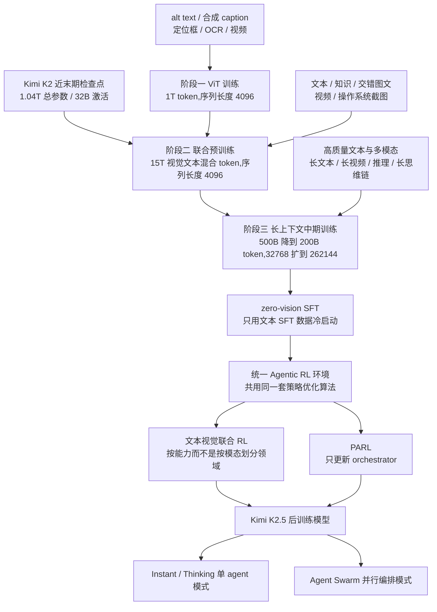
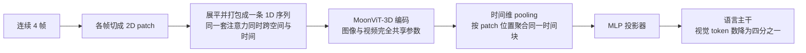
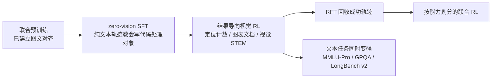
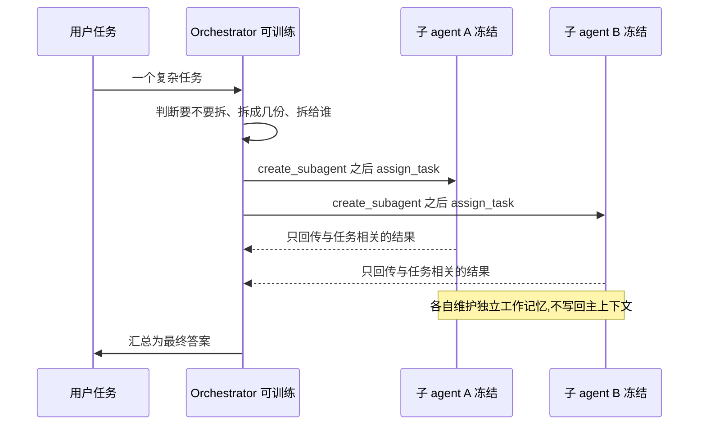
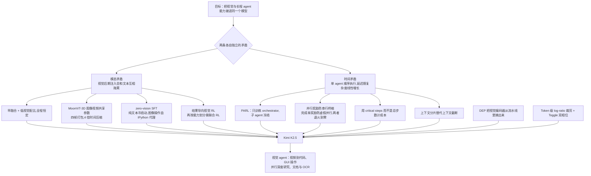

# Kimi K2.5：视觉不是外挂，并行不是编排脚本

<!-- release-date: 2026-01-27 -->

> 本文依据 Kimi Team 发布的 **Kimi K2.5: Visual Agentic Intelligence — Technical Report of Kimi K2.5**，版本为 **arXiv:2602.02276v2（2026-08-07），共 31 页**，本地原件为 `papers/Moonshot/Kimi-K2.5.pdf`。本文初稿依据的是 Moonshot 官方仓库的 2026-01 编译版（30 页），现已整篇统一到 arXiv 最新修订版。两版逐页比对后，唯一的实质内容差异是 §4.3 ViT Training Stage 那一段训练目标的改写（详见下文「ViT 训练阶段」一节），其余只是排版、连字与作者名单页数的变动。文末 `release-date` 仍是 2026-01-27，因为那是模型首发日，论文修订不回写首发日。本文所有页码都指这份 v2 PDF 自身的页码。文中会把「报告明确写了什么」「我们如何理解它」「哪些是外部资料补充」三层分开。

## 阅读前先搭一张最小地图

这篇报告的门槛不在数学，在名词密度。先把会反复出现的概念翻成人话：

- **Token（词元）**：模型读写内容的基本小块。文字、图像和视频最后都会被切成一串 Token 送进模型。
- **VLM（Vision-Language Model，视觉语言模型）**：既能读图又能读文的模型。常见做法是「先有一个语言模型，再接一个看图的部件」。
- **ViT（Vision Transformer，视觉 Transformer）**：把图片切成小方块（patch，图块）再当成序列处理的视觉编码器。K2.5 的这颗叫 MoonViT-3D。
- **MoE（Mixture-of-Experts，混合专家）**：模型内部有很多前馈子网络，但每个 Token 只调用其中几个，所以总参数可以很大而单 Token 成本不变。
- **SFT（Supervised Fine-Tuning，监督微调）**：用「问题—标准回答」的成对数据教模型怎么答。
- **RL（Reinforcement Learning，强化学习）**：让模型真的去做任务，按结果好坏调整参数。模型做一次任务产生的完整过程叫 **rollout（采样轨迹）**。
- **Agent（智能体）**：不只回一句话，而是会调工具、跑代码、看网页、连续执行很多步的模型系统。

K2.5 自己发明的名字也可以先翻一遍：

- **原生多模态预训练（native multimodal pre-training）**：从预训练早期就把视觉数据按一个固定的低比例掺进去，而不是训练快结束时才大批灌入。
- **zero-vision SFT（零视觉监督微调）**：后训练的冷启动阶段**完全不用**视觉数据，只用文本 SFT 数据，就把「看图并调用工具」的行为激活出来。
- **Agent Swarm（智能体集群）**：一个可训练的调度者动态创建一批冻结的专职子 agent，把任务拆开并行做。
- **PARL（Parallel-Agent Reinforcement Learning，并行智能体强化学习）**：训练上面那个调度者的强化学习范式。只更新调度者，子 agent 全程冻结。
- **critical steps（关键步数）**：衡量一个并行 episode 真实耗时的指标，类比计算图里的关键路径。

## 一句话先说清

Kimi K2.5 最容易被误读的一点是：**它几乎没有改动语言模型本身。**

底座就是 Kimi K2：1.04T 总参数、32B 激活参数、384 个专家每 Token 激活 8 个（稀疏度 48），优化器仍是带 QK-Clip 的 MuonClip。报告在这一节直接把 MuonClip、架构设计与训练基础设施的细节指向 Kimi K2 技术报告，自己不再复述。（PDF p.6–7）

顺便厘清一个很容易读混的数字：Kimi K2 本身是在 15T 高质量**文本** Token 上预训练的（PDF p.6）；K2.5 是在此之上**再加** 15T 视觉文本混合 Token（PDF p.2、p.8）。这是两笔独立的 15T，不是同一笔。

所以 K2.5 的创新预算全部花在了另外两件事上：

1. **信息从哪进来**：视觉不是在训练末期焊上去的外设，而是从联合预训练第一天起就以恒定的低比例混在文本里；后训练的冷启动干脆一张图都不给，靠纯文本轨迹把视觉工具调用的行为激活出来；再用结果奖励做视觉 RL。
2. **工作在时间上怎么排**：单个 agent 顺序调工具，完成时间随任务复杂度线性增长。K2.5 训练模型自己决定「要不要拆、拆成几份、拆给谁」，把顺序执行换成并行执行，并用 critical steps 而不是总步数来结算成本。

这两条线在报告里几乎是独立的两章，但它们指向同一个判断：

> **当基座已经够强时，下一段收益往往不来自继续改结构，而来自改变信息进入模型的方式、以及改变工作在时间轴上的摆放方式。**

这也是全文最值得记住的一句。

## 先看全景：三段预训练、两条后训练支线

这张图根据报告 Table 3、§4.2–4.4 与 §3 重画（PDF p.4–8），只表达机制连接，不表示各阶段耗时或算力比例。三个数据节点逐字对应 Table 3 的数据行（PDF p.7）。图中「500B 降到 200B」是长上下文阶段两个子步的 Token 量，不是训练时长的比例。最后两个模式来自引言里「统一了视觉与语言、thinking 与 instant 模式、聊天与 agent」这句话（PDF p.2）；报告只说开源了后训练检查点，没有说明这些检查点与两条 RL 支线的具体对应关系。

两个必须先说清的边界：

- 报告没有给 K2.5 自己的架构表。层数、隐藏维度、专家配置都指向 Kimi K2 报告，本文不代它补。
- 报告也没有给 MoonViT-3D 的参数量、层数和 patch size。它只交代了血缘：Kimi-VL 那一代的 MoonViT 由 **SigLIP-SO-400M** 初始化、沿用 NaViT 的 patch packing；MoonViT-3D 在这条线上继续往时间维扩展。（PDF p.7）

## 第一条主线：视觉不是训练末期焊上去的

### 旧做法卡在哪

多模态模型的常规路线是：先把语言模型训好，再接一个视觉编码器，然后在训练靠后的阶段大量灌视觉数据，比例常常拉到 50% 以上。这个思路的假设是「语言能力是主体，多模态是事后追加的插件」。

报告直接把这个假设称作 conventional wisdom（常规认知），并说他们的实验讲了另一个故事。（PDF p.2–3）

问题出在哪？后期注入意味着模型要在很短的一段训练里，同时完成两件互相冲突的事：接受一种全新的输入分布，同时不能把已经稳定的语言表示搞坏。报告在附录里给出了这个冲突的直接证据：中期融合和后期融合都会出现 **dip-and-recover（先掉后回）** 的曲线——视觉数据刚进来时文本能力先下降，之后才慢慢恢复。作者把原因归为 modality domain shift（模态域偏移）：突然涌入的视觉 Token 打乱了已经建立的语言表示空间，模型只能暂时牺牲文本能力去换跨模态对齐。（PDF p.22，Figure 9）

### 那个被设计得很干净的消融

K2.5 的消融固定了两个预算：视觉 Token 总量和文本 Token 总量都不变。变的只有两件事——视觉从训练的第几成开始注入，以及注入期间的视觉文本配比。（PDF p.3，Table 1）

| 配置 | 注入时机 | 视觉文本配比 | 视觉知识 | 视觉推理 | OCR | 文本知识 | 文本推理 | 代码 |
|---|---|---|---:|---:|---:|---:|---:|---:|
| Early | 0% | 10%:90% | 25.8 | 43.8 | 65.7 | 45.5 | 58.5 | 24.8 |
| Mid | 50% | 20%:80% | 25.0 | 40.7 | 64.1 | 43.9 | 58.6 | 24.0 |
| Late | 80% | 50%:50% | 24.2 | 39.0 | 61.5 | 43.1 | 57.8 | 24.0 |

这张表有个细节很值得自己算一遍（**这是我们的解读，报告没有写出这个乘法**）：把「注入时机之后剩下的训练比例」乘以「视觉配比」，三行分别是 $1.0\times 0.1$、$0.5\times 0.2$、$0.2\times 0.5$，结果都等于 0.1。也就是说，三个配置消耗的视觉 Token 完全一样，只是把同样多的视觉数据摊在不同长度的时间窗里。

结论因此非常干净：**同样多的视觉数据，摊得越早越薄越好。** Early 在六列里赢了五列；唯一的例外是文本推理，Mid 以 58.6 对 58.5 略高 0.1（PDF p.3）。报告的说法是，视觉配比对最终多模态性能的影响极小，真正起作用的是注入时机。

所以 K2.5 的选择是：全程按一个恒定的、不高的比例混合文本与视觉 Token。（PDF p.2）

### 这条结论的适用边界

必须说清三点，否则很容易过度外推：

- 消融是在小规模代理模型上做的，报告没有给这些消融模型的参数量、总 Token 数和评测集构成。
- 报告没有公布 K2.5 正式训练里那个「恒定比例」到底是多少。10%:90% 只是消融表里的一行，不能直接当成正式配方。
- 六列指标的绝对值都不高（视觉知识 25.8、代码 24.8），说明这是一组早期信号，不是终态能力对比。

**可迁移的部分**是方法论而不是数字：做数据课程实验时，把「总预算」和「投放形状」分开控制。很多「加了 X 数据没用」的结论，其实是把总量和时机搅在了一起。

### MoonViT-3D：让图像和视频共用同一套参数

视频进模型最贵的地方不是算力，是 Token 数。一段几分钟的视频抽帧后可以轻松吃掉整个上下文窗口。

常见解法是给视频单独做一个模块或一条分支。K2.5 不这么做。它把 NaViT 的 patch n' pack（图块打包）思路从空间维推广到时间维：最多四个连续帧被当成一个时空体，这些帧的 2D patch 被一起展平、打包成一条一维序列，于是同一套注意力机制可以同时跨空间和时间工作。进入 MLP 投影器之前，一次轻量的时间维 pooling（池化）把同一个时间块内的 patch 聚合起来，得到 **4 倍时间压缩**。（PDF p.2、p.7）

这张图根据报告 §4.2 与引言相应段落重画（PDF p.2、p.7），是机制示意，不表示各步耗时。

这个设计的价值有两层：

1. **同样的上下文窗口能装下 4 倍长的视频**（PDF p.2）。这直接支撑了后面 LVBench、LongVideoBench 那些要喂 2000 帧以上的评测（PDF p.13）。
2. **图像与视频完全共享参数和嵌入空间**。报告明确说，这样做是为了让图像预训练学到的知识整体迁移到视频，而不需要专门的视频模块或架构分叉。（PDF p.7）

代价报告也写了一半：额外的时间注意力确实提升了高速运动和视觉特效的理解，但四帧一压意味着帧间细粒度差异会被平均掉。报告没有给「不做时间压缩」的对照实验，所以我们无法从这份报告判断这 4 倍压缩具体损失了多少。

顺带一句代际关系：同一团队后来的 Kimi K3 报告改成让视觉编码器从零训练、不再由 SigLIP 初始化。那是另一篇报告的结论，本文不展开；但读完下一节会发现，这个代际对比正好卡在「要不要接着别人的权重训」这个分岔上。

### ViT 训练阶段：从 SigLIP 接着训，所以只留一个 caption 损失

第一阶段只训 ViT。报告的措辞很关键：MoonViT-3D 是 **从 SigLIP 继续预训练（continual pre-trained）** 得到的，不是从零训。训练数据是图文对和视频文本对，文本侧的监督目标很杂：图片的 alt text、图像与视频的合成 caption、定位框、OCR 文本。（PDF p.7）

损失只有一项：以输入图像和视频为条件生成描述的交叉熵 $\mathcal L_{\text{caption}}$。报告在这里专门点名了一句对比——**与 Kimi-VL 的实现不同，这一段继续预训练不包含对比损失（contrastive loss）。**（PDF p.7）

这个「少一项损失」比看上去重要得多，因为它和「继续预训练而不是从头训」是同一套逻辑的两半。**以下是我们的解读，报告只给了结论、没有解释原因：**

- 对比损失（SigLIP 那一类）的作用是**从零把图像和文本拉进同一个表示空间**。可是 MoonViT-3D 的起点就是一个已经用对比损失训好的 SigLIP，这层对齐已经烙在权重里了。再跑一遍对比损失，是在重做一件已经做完的事。
- 这一阶段真正缺的能力是另外两样：**读懂原生高分辨率的图像与视频**，以及**把视觉特征吐成语言模型能接着往下算的东西**。这两件事的形状都是「看着东西说话」，一个 caption 交叉熵就够表达，用不上对比目标。
- 对比损失还很贵：它依赖大批量的负样本，批大小、温度、负样本队列都要单独调，跨设备通信也重。省掉它，这一阶段才做得出下面那个反差——**Token 吃得不少，训练 FLOPs 却很少**。

报告自己给这一阶段定的目标也印证了这个读法：这一段是让 MoonViT-3D **主要学会理解高分辨率图像和视频**，不是让它重新学会「什么图配什么字」。（PDF p.7）

对齐策略是两段式，第一段有个容易被略过但很聪明的选择：

- 第一段用 caption 损失更新 MoonViT-3D，把它对齐到 **Moonlight-16B-A3B**（一个小得多的模型），消耗约 1T Token，训练 FLOPs 很少；
- 第二段非常短，只更新 MLP 投影器，把 ViT 接到那个 1T 参数的语言模型上，为后续联合预训练铺路。（PDF p.7）

为什么不直接对齐 1T 模型？报告没有解释。**我们的理解是**：视觉编码器的对齐目标本身对语言模型规模不敏感，而用 16B 模型跑 1T Token 的对齐比用 1T 模型便宜一到两个数量级；等编码器已经会说话了，再花一小段训练把接口换成大模型即可。这一点很值得迁移——**先在便宜的目标上把新模块训熟，再用一小段训练做接口迁移**，比一开始就让新模块和最贵的部件一起训要划算。

把两条放在一起看，这一节的可迁移经验其实是一句话：**先想清楚新模块是「接着谁训」，再决定要带哪些损失。** 从预训练好的权重接着训，就不要把那份权重当初的训练目标再抄一遍；只补它没学过的那部分能力，省下来的算力全是白赚的。反过来，如果像 K3 那样决定从零训视觉编码器，对比损失那类从头建立对齐的目标就重新变成必需品——这也是上一节那个代际对比的真正分歧点。

联合预训练阶段还有一个措辞需要注意：它是从一个 **near-end Kimi K2 checkpoint** 继续训的，也就是 K2 训练快结束但还没完全结束的那个检查点，不是发布版 K2（PDF p.8）。这意味着 K2.5 不完全是「K2 之后再加一段」，而是在 K2 的收尾阶段分叉出去的。数据配方在 K2 基础上引入了新的独特 Token、提高了代码相关内容的权重、并限制每个数据源的最大轮次。

第三阶段做长上下文激活，用 YaRN 插值逐步把上下文从 32768 扩到 262144，同时混入更高质量的中期训练数据（PDF p.7–8，Table 3）。

### 预训练数据：类别清单几乎逐条对应后面的强项

预训练数据写在附录 B（PDF p.22–23）。报告没有给任何占比，但类别清单本身就有信息量——**后面评测表里每一项强成绩，几乎都能在这份清单里找到对应的数据类别**。

文本侧是四个领域：Web Text、代码、数学、知识。大部分处理流程沿用 Kimi K2。唯一被单独强调的调整是 **Enhanced Code Intelligence（强化代码智能）**，扩了三类数据：仓库级代码（支持跨文件推理与架构理解）、来自互联网的 issue、code review 和 commit 历史（捕捉真实开发模式）、以及从 PDF 和网页语料里检索的代码相关文档。目标写得很具体——提升仓库级理解、改善补丁生成与单元测试编写这类 agentic coding 子任务。（PDF p.22）

视觉侧是七类：caption、交错图文、OCR、知识、感知、视频、agent 数据。几条值得单拎出来：

- **caption 数据严格限制合成 caption 的比例，以抑制幻觉。** 这是一个很克制的选择——合成 caption 便宜且量大，但模型会学到「看到什么就编一段像模像样的描述」。
- **OCR 数据覆盖多语言文本、密集版面和多页文档。** 这直接对应 OCRBench 92.3、OmniDocBench 1.5 的 88.8 与 InfoVQA 92.6 这三项表中最高分（PDF p.12）。
- **知识数据用版面解析器（layout parser）处理学术材料。** 对于缺少明确问题格式的资料，团队用 in-context learning 把原始材料自动改写成 K-12 到大学水平的结构化学术题目。这是把「有内容但没有题目」的语料变成可训练监督信号的通用做法。
- **图文—代码配对数据**：HTML、React、SVG 等多种代码格式，与它们各自的渲染截图配成对。报告的说法是要弥合视觉版面与代码之间的模态鸿沟，让模型把抽象结构逻辑和具体视觉几何对齐。引言里说 K2.5 在 image/video-to-code 上取得 SOTA（PDF p.2），这条数据就是来源。
- **GUI 截图与动作轨迹**，覆盖桌面、移动和网页环境，包含人工标注的演示。这条对应 OSWorld-Verified 63.3 与 WebArena 58.9（PDF p.12）。
- **定位数据**：包含边界框标注、基于点的引用，还新引入了一个 **contour-level segmentation（轮廓级分割）** 任务做像素级感知学习。这三种粒度分别对应 RL 阶段的 IoU 奖励、高斯加权距离奖励和分割 IoU 奖励——数据设计和奖励设计是配套的。

这条对照关系值得记住：**看一份报告的评测强项时，回头去数据章节找对应的类别，通常比读方法章节更能解释分数从哪来。** 反过来，如果某项强成绩在数据清单里找不到对应，就该多留一个问号。

## 后训练冷启动：为什么「一张图都不给」反而更好

### 先讲这里的矛盾

预训练完的 VLM 有一个尴尬状态：它看得懂图，但不会**因为看图而去调工具**。要它做「把这张图二值化后数一数有几个物体」这种事，得先教它这套行为。这就是多模态 RL 的冷启动问题。

常规解法是造视觉思维链数据：人工标注，或者用提示工程生成。报告指出这类数据有个固有缺陷——**多样性太差**。视觉推理往往被限制在简单示意图上，工具操作也退化成裁剪、旋转、翻转这三板斧。（PDF p.3）

### zero-vision SFT 的做法

K2.5 的解法反常识：SFT 阶段**只用文本数据**，一张图都不放。

关键在于怎么表达图像操作。K2.5 让所有图像操作都通过 IPython 里的程序化操作来代理——也就是说，模型学到的不是「调用 crop 工具」，而是「写一段代码去处理手上这个对象」。报告把这称作传统视觉工具使用的一种泛化。（PDF p.3）

这个替换为什么成立？因为写代码处理数组这件事，在纯文本 SFT 数据里本来就极其丰富且多样。模型在文本世界里学会的「遇到需要精确计算的对象就写代码、看结果、再修正」这套行为模式，到了图像上是直接通用的：二值化后计数、估物体尺寸、定位、OCR，都能用同一套行为完成。

报告给的解释是：联合预训练已经建立了足够强的图文对齐，所以能力可以跨模态自然泛化（PDF p.2–3）。也就是说，**zero-vision SFT 能成立，前提是前面那条原生多模态预训练路线成立**。这两个设计是绑在一起的，不能单独搬走一个。

更进一步，报告说加入人工设计的视觉轨迹反而**损害泛化**；他们的初步实验里，text-vision SFT 在视觉 agentic 任务上表现「差得多」，可能的原因是缺少高质量视觉数据。（PDF p.2–3）

这里要老实标注边界：报告没有给这组对比的数值表，只给了 Figure 2 的 RL 曲线，而 Figure 2 的起点来自 zero-vision SFT。所以「不给视觉数据更好」这个结论，在这份报告里是**作者的观察加一张训练曲线**，不是带对照数值的消融。

### 接着用结果奖励把视觉真正接进推理

只靠文本激活出来的行为有明显失效模式：模型有时干脆忽略视觉输入，该看图的时候不看图。（PDF p.3）

所以下一步是结果导向的视觉 RL（outcome-based visual RL），任务被限定为「不看图就做不对」的三类：

- 视觉定位与计数：准确定位和数清图中物体；
- 图表与文档理解：读结构化视觉信息并抽取文字；
- 视觉关键的 STEM 题：经过筛选、必须依赖图像才能解的数理题。（PDF p.3）

Figure 2 显示，随着视觉 RL 的 FLOPs 增加，MMMU Pro、MathVision、CharXiv（RQ）、OCRBench 四条曲线持续上升（PDF p.4）。需要注意的是这四张图的横轴只标了「RL flops」，没有刻度值，所以只能读出趋势，读不出绝对算力。

成功轨迹会被回收做 rejection-sampling fine-tuning（RFT，拒绝采样微调），形成一条自我改进的数据管线，让后续联合 RL 阶段能用上更丰富的多模态推理轨迹。（PDF p.3）

这张图根据报告 §2.2–2.3（PDF p.3–4）与 Table 2 重画，是能力激活的因果链示意，不表示各阶段算力比例。

### 一个反直觉的结果：视觉 RL 把文本也拉高了

一般担心是：做视觉 RL 会不会牺牲文本能力？报告直接测了三个纯文本基准（PDF p.4，Table 2）：

| 基准 | 视觉 RL 之前 | 视觉 RL 之后 | 变化 |
|---|---:|---:|---:|
| MMLU-Pro | 84.7 | 86.4 | +1.7 |
| GPQA-Diamond | 84.3 | 86.4 | +2.1 |
| LongBench v2 | 56.7 | 58.9 | +2.2 |

三项全涨。作者给的分析是：视觉 RL 改善了模型在**结构化信息抽取**类问题上的校准，降低了那些「长得像视觉定位任务」的查询上的不确定性——比如计数、OCR 这一类。（PDF p.4）

这个解释是作者观察，不是被隔离验证的机制。报告没有做「同等算力的纯文本 RL」对照，所以严格说我们不能排除「多做一段 RL 本来就会涨」的可能。稳妥的表述是：**在这份报告的设置下，视觉 RL 没有损害文本能力，而且三项文本指标同时上升。**

### 于是领域划分不再按模态

因为跨模态迁移是双向的，K2.5 在正式后训练里放弃了「视觉专家 / 文本专家」这种按输入模态划分的做法，改成**按能力划分领域**：知识、推理、代码、agentic 等等。每个领域专家同时从纯文本和多模态查询里学，生成式奖励模型（GRM）也一样跨异构轨迹优化，中间不设模态屏障。（PDF p.4）

这是全文最容易被低估的一句设计。它的含义是：**模态是输入格式，不是能力边界。** 如果按模态切专家，同一种能力会被切成两份，各自学各自的，跨模态迁移的红利就被切掉了。

**可迁移启发**：给多任务训练划分领域时，先问一句「我要分开的是能力，还是只是输入形式」。按输入形式划分往往会人为制造两套需要各自补齐的能力。

## 第二条主线：Agent Swarm 把顺序执行拆开

### 旧问题：步数可以很多，时间不能很长

现在的 agentic 模型基本都是顺序执行的：想一步、调一次工具、看结果、再想下一步。报告点名了自家的 Kimi K2-Thinking——即使它能撑住几百步推理，推理时间仍然随步数线性增长，导致延迟无法接受，也限制了任务复杂度的上限。（PDF p.2）

更麻烦的是第二个后果：上下文会一直堆积。一个跑了几百步的顺序 agent，工具返回值、中间推理、失败重试全都留在同一条上下文里。

报告给的例子很具体：一个既要做大规模调研、又要做设计、还要做开发的复杂项目，顺序范式会越来越低效。（PDF p.2）

### PARL 的第一个决定：只训调度者，子 agent 全冻结

Agent Swarm 的架构是解耦的：一个**可训练的 orchestrator（调度者）**，加上一批**冻结的子 agent**，后者从固定的中间策略检查点实例化出来。（PDF p.5）

这张图根据报告 Figure 3 与 §5.2 的上下文管理段落重画（PDF p.5、p.14），是机制与信息流示意，不表示真实时序或延迟比例。

为什么不端到端一起训？报告给了两个具体理由（PDF p.5）：

1. **信用分配歧义（credit assignment ambiguity）**：多智能体设置下，结果奖励天然稀疏且带噪。最终答案对了，不代表每个子 agent 都执行得干净；答案错了，也不代表所有子 agent 都出了错。梯度分不清该表扬谁、该批评谁。
2. **训练不稳定**：调度策略和执行策略同时变，二者会互相追着对方的分布跑。

冻结子 agent 之后，它们的输出被当成**环境观测**，而不是可微的决策点。这一步把「高层协调逻辑」和「低层执行能力」彻底解耦了。报告说这样收敛更稳健。

工程上还有两个细节：先用小尺寸子 agent 训调度者，再换成更大的模型，以提高效率；RL 框架支持动态调整子 agent 与调度者的推理实例比例，把集群资源用满。（PDF p.5）

**这个模式非常值得迁移。** 任何「一层做决策、一层做执行」的系统——路由器与后端、编排器与工具、检索器与阅读器——只要你无法把最终结果干净地归因到每一层，就应该先把其中一层钉死当环境，只优化另一层。同时优化两层通常不是更强，而是更难收敛。

代价也要说清：冻结子 agent 意味着子 agent 的执行能力不会因为参与集群而变强。整个 Agent Swarm 的能力上限，被那个固定的中间检查点锁住了。报告没有给「解冻之后会怎样」的对照。

### PARL 的第二个决定：奖励要防两种反向坍缩

PARL 的奖励是三项相加：

$$
r_{\text{PARL}}(x,y)=\lambda_1\, r_{\text{parallel}}+\lambda_2\, r_{\text{finish}}+r_{\text{perf}}(x,y)
$$

- $r_{\text{perf}}(x,y)$ 是主项：对任务 $x$，解 $y$ 的整体成功与质量；
- $r_{\text{parallel}}$ 是**实例化奖励**，鼓励创建子 agent；
- $r_{\text{finish}}$ 是**子任务完成率**，奖励被成功完成的子任务；
- $\lambda_1,\lambda_2$ 是两个权重，会在训练过程中**退火到零**。（PDF p.5–6）

两个辅助项各自防一种失败模式，而且这两种失败模式方向相反：

- 没有 $r_{\text{parallel}}$ 会发生 **serial collapse（串行坍缩）**：并行是有风险的，拆错了就白干，所以策略很容易退回「我自己一步步做」这个局部最优。加这一项是为了逼它去探索并发调度的空间。
- 只有 $r_{\text{parallel}}$ 又会发生 **spurious parallelism（虚假并行）**：这是一种奖励作弊——调度者疯狂 spawn 一堆子 agent，把并行指标刷得很高，但根本没有做有意义的任务分解。$r_{\text{finish}}$ 要求子任务真的被完成，从而把策略推回可行且有效的分解上。（PDF p.6）

退火到零这一步同样关键：辅助项是脚手架，不是目标。如果它们一直留着，最终策略优化的就是「并行度」而不是「把任务做好」。

**这是一条通用的奖励设计经验**：当你为了打破某个局部最优而加辅助奖励时，几乎一定要再加一项来堵住这个辅助奖励自身的作弊路径，并且给整组脚手架安排退场时间。

### PARL 的第三个决定：换一个成本度量

这是整篇报告里最漂亮的一个设计，因为它没有加任何东西，只是换了一把尺子。

如果用「总步数」来约束训练和评测，并行是没有好处的——把 40 步拆给 4 个子 agent 各做 10 步，总步数一点没少。要让并行真的被奖励，得换一个能反映**墙钟时间**的度量。

K2.5 借用计算图里的关键路径概念，定义 critical steps。把一个 episode 看成 $t=1,\dots,T$ 个执行阶段，每个阶段主 agent 执行一个动作——要么直接调工具，要么实例化一组并行的子 agent。设 $S_{\text{main}}^{(t)}$ 是主 agent 在阶段 $t$ 的步数（通常为 1），$S_{\text{sub},i}^{(t)}$ 是这一组里第 $i$ 个子 agent 的步数。**一个阶段的时长由这一组里跑得最久的那个子 agent 决定**，于是：

$$
\text{CriticalSteps}=\sum_{t=1}^{T}\left(S_{\text{main}}^{(t)}+\max_{i}S_{\text{sub},i}^{(t)}\right)
$$

（PDF p.6）

用一个例子体会一下（**这个例子是我们构造的，不是报告里的数据**）。假设某个 episode 有两个阶段：

- 阶段 1：主 agent 自己调 1 次工具，没有子 agent，于是这一段贡献 $1+0=1$；
- 阶段 2：主 agent 用 1 个动作创建 4 个子 agent，它们分别用了 12、9、40、11 步，于是这一段贡献 $1+\max(12,9,40,11)=41$。

总步数是 $1+1+(12+9+40+11)=74$，critical steps 只有 $1+41=42$。

再往下推一步就能看到这个度量的引导方向：如果把那个 40 步的分支再拆成两个 20 步的分支，总工作量一点没变，critical steps 却从 42 掉到 22。反过来，如果多 spawn 五个各跑 3 步的子 agent，总步数涨了 15，critical steps 一点没降。

于是这个度量同时做到了两件事：**奖励能缩短最长分支的均衡分解，惩罚不缩短最长分支的无效并发。** 报告的原话是，调度者被激励去以最小化端到端延迟的方式分配工作，而不是单纯最大化并发度或总工作量。（PDF p.6）

**可迁移启发**：想让系统学会某个行为时，先检查你的成本度量是否根本无法区分这个行为。很多时候不需要加新的约束或惩罚项，只需要把度量从「总量」换成「关键路径」「p99」「最长分支」这类真正对应用户体验的量。加约束是在原有度量上打补丁，换度量是把目标本身摆正。

### 第四个决定：不教它并行，只改任务分布

报告特意强调：用于训练的提示词**没有明确指示模型去并行**。（PDF p.6）

做法是构造一批合成提示，专门压榨顺序执行的极限，分两类：

- **wide search（宽搜索）**：需要同时探索大量互相独立的信息源；
- **deep search（深搜索）**：需要多条推理分支，最后再聚合。

再加上受真实工作负载启发的任务，比如长文档分析和大规模文件下载。这些任务在固定的推理步数和工具调用预算下，顺序执行根本做不完。（PDF p.6）

换句话说：**并行不是被教出来的，是被任务分布逼出来的。** 报告说并行本身并不被假定为天然有利，「要不要并行、什么时候并行、怎么并行」全部通过环境反馈和 RL 探索学出来。

Figure 4 提供了这个学习过程的证据，但它只给得出趋势，给不出数字：随着训练推进，训练准确率平滑上升；同一时期，训练中的并行度也逐步提高（PDF p.6，Figure 4）。图注写到这里就没了，两张子图的横轴只标了「RL flops」、没有刻度值，纵轴同样没有可读取的刻度，所以本文不给这两条曲线的具体数值。

不过光是趋势就够说明问题：**并行度是随训练自己涨上去的，不是被设定进去的。** 这正是「不显式指示模型并行、只把任务分布改成非并行做不完」那套做法要的结果。

### 效果：三个基准与一条时间曲线

（PDF p.14，Table 6）

| 基准 | K2.5 Agent Swarm | Kimi K2.5 单 agent | Claude Opus 4.5 | GPT-5.2 | GPT-5.2 Pro |
|---|---:|---:|---:|---:|---:|
| BrowseComp | 78.4 | 60.6 | 37.0 | 65.8 | 77.9 |
| WideSearch | 79.0 | 72.7 | 76.2 | — | — |
| In-house Swarm Bench | 58.3 | 41.6 | 45.8 | — | — |

三点观察：

- BrowseComp 上 78.4 对 60.6，绝对提升 17.8 个百分点，并且超过了 GPT-5.2 Pro 的 77.9（PDF p.14）。
- WideSearch 的 item-F1 从 72.7 升到 79.0，提升 6.3 个百分点，超过 Claude Opus 4.5 的 76.2。
- 提升最大的是内部 Swarm Bench（16.7 个百分点）——但报告自己写明，这个基准的任务就是**专门为奖励并行分解而设计的**（PDF p.14）。所以这一栏的解读价值应该打折。

时间收益在 Figure 8。这张图的坐标轴和标注文字在 PDF 里都是可直接抽取的文本，所以下面的数字不是读图估计：横轴是 Target Item-F1，从 30.0% 到 70.0%；纵轴是执行时间，从 0x 到 8.0x；图上五处节省倍数依次是 30% 处 3.0 倍、40% 处 3.0 倍、50% 处 3.2 倍、60% 处 3.7 倍、70% 处 4.5 倍；图注原文写的是在 WideSearch 上比单 agent 基线快「3×–4.5×」。（PDF p.15）

曲线形状比倍数更有信息量：目标 Item-F1 越往右，单 agent 那条越陡地爬向纵轴上沿，Agent Swarm 那条则近乎贴着底部走平。两条曲线本身没有数据点标注，所以这里只描述走势，不给具体倍数。

**关键在于斜率，不在于倍数。** 单 agent 的时间随难度快速上升，Agent Swarm 近似平坦。所以「4.5 倍」不是一个固定的加速比，而是在这条曲线最右端读到的值——任务越难，差距越大。图只覆盖 30% 到 70% 这一段，更简单的任务上还剩多少优势，这份报告答不了。

### 一个副产品：上下文管理从被动变主动

这一节是报告里最有产品味的一段。

现有的长任务上下文策略基本都是**被动**的：Hide-Tool-Result（只留最近一轮工具返回）、Summary（摘要压缩）、Discard-all（超过阈值就把历史全丢）。它们都是在上下文溢出之后才反应，而且都会牺牲结构信息或中间推理。（PDF p.14）

Agent Swarm 提供了另一条路：长任务被分解成并行的、语义上互相隔离的子任务，每个子 agent 有自己有界的局部上下文和独立的工作记忆，**不会直接改写或污染调度者的全局上下文**；只有与任务相关的输出会被选择性地回传，而不是完整交互轨迹。（PDF p.14）

报告给这个现象起的名字很准确：**context sharding（上下文分片）而不是 context truncation（上下文截断）**。前者是把上下文按语义切开分给不同执行体，后者是把上下文按位置切掉一段。

Figure 7 给了直接对比：在 BrowseComp 上，Agent Swarm 在效率和准确率两方面都优于 Discard-all（PDF p.14）。报告的措辞是：用远少于均匀截断的 critical steps 达到了更高准确率。

**可迁移启发**：当你在给长任务系统设计上下文策略时，先问一句——我是在压缩一条越来越长的历史，还是可以把这条历史从一开始就切成几条互不干扰的短历史？前者的天花板是压缩率，后者的天花板是任务本身能不能分解。

## 两条主线共用的 RL 底盘

报告把策略优化、奖励函数、Token 效率放在同一节，因为文本视觉联合 RL 和 PARL 都建在这套算法之上。（PDF p.8）

### 统一 Agentic RL 环境：递归协程才是 PARL 能落地的原因

这一节在附录 D（PDF p.23–24），位置很靠后，但它其实是前面两条主线共同的地基。

环境层用了一个 Gym 风格的标准接口，把常见部件做成可插拔模块：**Toolset** 负责各种带沙箱的工具，**Judge** 负责多维度的奖励信号，另有专门的提示词多样化与指令遵循增强模块。这些模块可以和核心 agent 循环动态组合。（PDF p.23–24）

真正关键的是执行层的一句话：**框架把每个 agent 任务都当成一个独立的异步协程，而每个任务可以递归触发子任务的 rollout。**（PDF p.24）

这一句解释了 Agent Swarm 为什么不是一个外挂的编排脚本。如果 rollout 只能是「一条轨迹从头跑到尾」，那么「调度者中途派生四个子 agent，等它们各自跑完再继续」这件事在训练框架里根本无法表达。递归协程把 rollout 从线性结构变成树形结构，于是 Parallel-Agent RL 和 Agent-as-Judge 这两种范式都变成同一个机制的两种用法。报告也是这么说的——递归调用简化了这类复杂多智能体范式的实现。

规模上，一个专门的 **Rollout Manager** 在 RL 过程中编排最多 **100,000 个并发 agent 任务**，并提供细粒度控制以支持 partial rollout（部分采样）这类特性。每个任务激活时从托管池里取一个环境实例，环境自带沙箱和专用工具。（PDF p.24）报告没有展开 partial rollout 在 K2.5 里的具体做法，只给了引用。

还有两条与前面的算法设计直接咬合的工程约定：

- 框架严格遵循 **Token-in-Token-out** 范式，并且**记录推理引擎所有输出的 log probability**，用来做 train-inference mismatch correction（训练—推理失配校正）。这正是下一节那个 Token 级 log-ratio 裁剪的数据来源：没有逐 Token 的推理侧概率，就算不出那个比值。算法上的裁剪和框架上的记录是同一个设计的两半。
- 除了内建的白盒环境，还有一些只能走标准 LLM API 协议的**黑盒环境**。为此团队做了一个 **LLM Gateway** 代理服务，按自定义协议详细记录 rollout 的请求与响应，让黑盒环境下的模型也能被优化。（PDF p.24）

**可迁移启发**：一个训练范式能不能实现，常常取决于你的 rollout 抽象是线性的还是可递归的。如果你打算做多智能体、agent-as-judge 或者任何「轨迹里嵌轨迹」的训练，先改 rollout 的数据结构，再谈算法。同理，任何依赖重要性比的 RL 算法，都要求推理侧把逐 Token 概率完整吐出来——这是接口约定，不是可选的观测项。

### 策略优化：只看 log-ratio 的 Token 级裁剪

先定义每个 Token 的重要性比。设 $y^j$ 是第 $j$ 条采样回答，$y^j_{0:i}$ 是它第 $i$ 个 Token 之前的前缀：

$$
\rho_i^j=\frac{\pi_\theta\!\left(y_i^j\mid x,y_{0:i}^j\right)}{\pi_{\text{old}}\!\left(y_i^j\mid x,y_{0:i}^j\right)}
$$

目标函数是：

$$
\mathcal L_{\text{RL}}(\theta)=\mathbb E_{x\sim\mathcal D}\left[\frac{1}{N}\sum_{j=1}^{K}\sum_{i=1}^{|y^j|}\operatorname{Clip}\!\left(\rho_i^j,\alpha,\beta\right)\bigl(r(x,y^j)-\bar r(x)\bigr)-\tau\bigl(\log\rho_i^j\bigr)^2\right]
$$

其中 $K$ 是每个问题采样的回答数，$\bar r(x)=\frac1K\sum_{j}r(x,y^j)$ 是这组回答的平均奖励，$N$ 是这一批全部回答的总 Token 数，$\alpha,\beta,\tau>0$ 是超参数。（PDF p.8，式 1）

拆开看只有三件事：

1. 用同一批采样里的**平均奖励**当基线，$r-\bar r$ 就是这条回答相对同组的优势；
2. Token 级的 $\operatorname{Clip}$ 是一个**梯度掩码**：log-ratio 落在 $[\alpha,\beta]$ 区间内的 Token 正常算梯度，落在区间外的 Token 梯度直接置零；
3. 最后那项 $\tau(\log\rho)^2$ 惩罚新旧策略在单个 Token 上的偏离。

和标准 PPO 裁剪的关键区别，报告写得很直白：**它严格只看 log-ratio 来限制离策略漂移，不管优势的正负号。**（PDF p.8）

为什么要这么改？动机不是算法美学，是工程现实：训练框架和推理框架的实现差异会放大离策略偏差。同一份权重在 rollout 引擎和训练引擎里算出的概率并不完全一致，这个差异在长程多步工具调用任务里会被不断放大。报告说，这个机制对于在这类复杂领域维持训练稳定「必不可少」，并引用了两篇同期讨论离策略 RL 训练的工作。（PDF p.8）

优化器仍是 MuonClip。

**边界**：报告没有给 $\alpha,\beta,\tau$ 的取值，也没有给「不加这个裁剪会怎样」的量化对照，只有一句定性的「我们发现它必不可少」。

**可迁移启发**：如果你的 RL 系统里「产生数据的那份权重」和「更新的那份权重」跑在不同的推理栈上，那么训练与推理的数值不一致本身就是一个需要被算法显式吸收的误差源，而不是可以忽略的实现细节。

### 奖励函数：可验证的直接判，视觉任务要专门设计

报告把奖励分成几类（PDF p.8）：

- **规则型结果奖励**：用于推理和 agentic 这类有可验证解的任务；
- **预算控制奖励**：为提升 Token 效率而加；
- **GRM（Generative Reward Model，生成式奖励模型）**：用于通用任务，给出与 Kimi 内部价值标准对齐的细粒度评价。

视觉任务最有意思，因为「对不对」在这里不是一个二值判断，报告为不同任务设计了不同的软匹配：

| 视觉任务 | 奖励设计 |
|---|---|
| 视觉定位（grounding） | 基于 F1 的奖励，软匹配来自 IoU（交并比） |
| 点定位（point localization） | 基于 F1 的奖励，软匹配来自最优匹配下的高斯加权距离 |
| 多边形分割 | 把预测多边形栅格化成二值掩码，与真值掩码算分割 IoU |
| OCR | 归一化编辑距离，衡量字符级对齐程度 |
| 计数 | 按预测与真值的绝对差赋奖励 |
| 合成视觉谜题 | 用 LLM verifier（这里就是 Kimi K2）给反馈 |

（PDF p.8）

这张表的共同点是：**它们都在把「几乎对了」和「完全错了」区分开。** 如果定位任务只给 0/1 奖励，一个偏了三个像素的框和一个完全找错物体的框得到同样的惩罚，梯度里就没有「往哪个方向挪」的信息。软匹配把这个方向信息还了回来。

这条经验对任何输出带几何结构或字符串结构的任务都成立：**先问奖励函数能不能表达「接近程度」，再问它准不准。**

GRM 那一段还有两个值得记的设计（PDF p.9）：

- GRM 被部署在**已验证奖励信号之上**，覆盖聊天助手、编码 agent、搜索 agent 和产出物生成 agent，而不只是对话输出；
- 它不是二值裁判，而是细粒度评价者，评的维度包括有用性、回答的就绪程度、上下文相关性、详略是否合适、生成产出物的美观度、以及严格的指令遵循；
- 为了缓解奖励作弊和对单一偏好信号过拟合，K2.5 使用**多套针对不同任务上下文的 GRM rubric（评分标准）**，而不是一套。

用多套 rubric 而不是一套，这是个便宜且有效的防作弊手段：单一评分函数越被优化越容易被找到漏洞，几套互不相同的标准同时打分，作弊路径就要同时满足多个条件。报告没有公开 rubric 内容、GRM 的规模和数量。

### Toggle：效率训练必须留一个反向相位

先说这里的具体矛盾。为了省 Token，常见做法是给每个问题设一个预算，超了就罚。K2.5 之前的工作（K1.5 与 K2）就是这么做的。但报告观察到一个副作用，叫 **length-overfitting（长度过拟合）**：在刚性预算下训练出来的模型，**无法泛化到更高的计算规模**。给它更多推理 Token 它也用不上，只会退回到被截短的推理模式。（PDF p.9）

这是个很实在的坑：你以为在训「简洁」，实际上在训「短」。二者在训练分布内看起来一样，在难题上就分道扬镳了。

Toggle 的解法是交替优化。设 $t$ 是训练迭代数，$m$ 是相位长度，$b(x)$ 是问题相关的预算：

$$
\tilde r(x,y)=
\begin{cases}
r(x,y)\cdot\mathbf 1\!\left[\bar r(x)<\lambda\ \ \text{or}\ \ |y|\le b(x)\right], & \lfloor t/m\rfloor \bmod 2=0\\
r(x,y), & \lfloor t/m\rfloor \bmod 2=1
\end{cases}
$$

两个相位每 $m$ 次迭代切换一次（PDF p.9）：

- **Phase 0（预算受限相位）**：模型必须在任务相关预算内解题。但这个约束是**有条件**的——只有当模型在这道题上的平均正确率超过阈值 $\lambda$ 时才生效。也就是说，还没做对的题不罚长度，避免为了效率过早牺牲质量。
- **Phase 1（标准扩展相位）**：模型可以一直生成到最大 Token 上限，鼓励它利用算力换质量。

预算本身取正确回答长度的第 $\rho$ 分位数：

$$
b(x)=\operatorname{Percentile}\Bigl(\bigl\{\,|y^j|\ :\ r(x,y^j)=1\,\bigr\},\ \rho\Bigr)
$$

而且这个预算在训练开始时估一次，之后固定不变。（PDF p.9，式 2）

报告把 Toggle 描述为一个双目标问题上的随机交替优化，目的是调和推理能力与计算效率。

效果在 K2 Thinking 上验证（PDF p.9，Figure 5）：

- 几乎所有基准上输出长度都下降，**平均减少 25% 到 30% 的输出 Token**，性能影响可忽略；
- 思维链里的冗余模式——重复验证、机械计算——大幅减少；
- 有跨领域泛化：只在数学和编程任务上训练，模型在 GPQA 和 MMLU-Pro 上同样稳定减少 Token，性能只有边际下降。

Figure 5 的雷达图标注是「性能：改善 5 项、退化 2 项；Token 用量：减少 7 项、增加 0 项」（PDF p.10）。所以「性能影响可忽略」这句话的准确版本是：**七个基准里五升二降，Token 全线下降。**

Table 5 给了 K2.5 正式模型的 Token 用量对照（括号里是平均输出 Token 数，单位千）（PDF p.13）：

| 基准 | Kimi K2.5 | Kimi K2 Thinking | Gemini-3.0 Pro | DeepSeek-V3.2 Thinking |
|---|---:|---:|---:|---:|
| AIME 2025 | 96.1 (25k) | 94.5 (30k) | 95.0 (15k) | 93.1 (16k) |
| HMMT Feb 2025 | 95.4 (27k) | 89.4 (35k) | 97.3 (16k) | 92.5 (19k) |
| HMMT Nov 2025 | 91.1 (24k) | 89.2 (32k) | 94.5 (15k) | 90.2 (18k) |
| IMO-AnswerBench | 81.8 (36k) | 78.6 (37k) | 83.1 (18k) | 78.3 (27k) |
| LiveCodeBench | 85.0 (18k) | 82.6 (25k) | 87.4 (13k) | 83.3 (16k) |
| GPQA Diamond | 87.6 (14k) | 84.5 (13k) | 91.9 (8k) | 82.4 (7k) |
| HLE-Text | 31.5 (24k) | 23.9 (29k) | 38.4 (13k) | 25.1 (21k) |

这张表要横着读也要竖着读。横着看，K2.5 相对自家 K2 Thinking 几乎每项都是「分更高、Token 更少」，这是 Toggle 起作用的直接体现。竖着看则要诚实：**Gemini-3.0 Pro 在这张表里几乎每项都用更少的 Token 拿到不低于 K2.5 的分数。** 报告没有回避这个对比，把它放进了同一张表。

**可迁移启发**：优化效率时永远要保留一个不受效率约束的相位。否则模型会把「在这个预算下做对」学成「不要超过这个长度」，而这两件事在分布外会分家。这个思路不限于 LLM——任何用惩罚项压资源的系统，都应该定期解开惩罚看看它还能不能用满资源。

## 系统侧：报告唯一的新 infra 设计

K2.5 的训练基础设施基本继承自 K2，报告的原话是「minimal modifications」。（PDF p.9）真正新增的只有一件：Decoupled Encoder Process（DEP，解耦编码器过程）。

### 旧问题：视觉编码器把流水线第一段搞得忽胖忽瘦

典型的多模态训练在流水线并行（PP）下，视觉编码器和文本嵌入一起放在流水线的第一段（Stage-0）。问题是多模态输入的规模天然波动很大——这一批有几张图、分辨率多高，都不固定。于是 Stage-0 的计算负载和显存占用会剧烈起伏。（PDF p.9）

已有的应付办法是给视觉语言模型定制 PP 配置，比如 Kimi-VL 就手工减少 Stage-0 里文本解码器的层数，给视觉腾出显存。报告对这个做法的评价很直接：它缓解了显存压力，但**没有从根本上解决多模态输入尺寸造成的负载不均**；更要命的是，它让你无法直接复用已经为纯文本训练调优好的并行策略。（PDF p.9–10）

后半句才是真正的成本。纯文本训练的并行策略是几个月调出来的，为了接一个视觉编码器就要重调一遍，这笔账很难算平。

### 新设计：把视觉编码器从流水线里摘出来

DEP 利用了视觉编码器在计算图里的一个特殊拓扑位置——**它是前向传播的起点，也是反向传播的终点**。既然它两头都在边界上，就可以不参与中间那条流水线。

每个训练步被拆成三段（PDF p.10）：

1. **Balanced Vision Forward（均衡视觉前向）**：先把全局 batch 里所有视觉数据的前向跑完。因为视觉编码器很小，就把它**复制到所有 GPU 上**，不管其他并行策略是什么；这一阶段按负载指标（图片数或 patch 数）把前向计算均匀分给所有 GPU，从而同时消掉 PP 造成的不均和视觉 Token 数造成的不均。为了压住显存峰值，**丢弃所有中间激活，只保留最终输出激活**，再把结果收集回 PP Stage-0。
2. **Backbone Training（主干训练）**：正常跑主干 Transformer 的前向和反向。因为上一阶段已经把中间激活丢了，这里可以完整复用纯文本训练验证过的高效并行策略。这一阶段结束时，梯度累积在视觉编码器的输出上。
3. **Vision Recomputation & Backward（视觉重算与反向）**：重新跑一遍视觉编码器前向，再做反向，算出视觉编码器参数的梯度。

结果：K2.5 无缝继承了 K2 的并行策略，多模态训练效率达到纯文本训练的 **90%**。报告还指出 LongCat-Flash-Omni 有相似的设计哲学。（PDF p.10）

这里的取舍非常清楚：**多跑一遍视觉编码器前向，换来负载均衡、显存峰值下降，以及并行策略的完全复用。** 之所以划算，是因为视觉编码器相对主干小得多——重算它一次的代价，远低于让整条流水线为它的波动买单。

**可迁移启发**：分布式系统里遇到一个「体量小但波动大」的组件时，不要试图把它塞进现有调度里去平衡，先看它在依赖图上的位置。如果它位于边界（最前或最后），往往可以整体复制、单独调度、必要时重算，从而把它的波动彻底隔离在主流程之外。

### Appendix C 里那些容易被跳过的数字

（PDF p.23）

- 训练跑在 **NVIDIA H800 GPU 集群**上，节点间是 **8×400 Gbps RoCE** 互连；
- 并行策略是 **16 路流水线并行（带 virtual stages）+ 16 路专家并行 + ZeRO-1 数据并行**，因此可以在任何 32 的倍数个节点上训练；
- EP 的 all-to-all 通信在交错 1F1B 调度下与计算重叠；
- 为了把激活塞进显存：对 LayerNorm、SwiGLU 和 MLA 上投影做选择性重计算，把不敏感的激活压成 FP8-E4M3，剩下的激活以重叠流式方式 offload 到 CPU。

报告没有给 GPU 总数、训练时长、总 FLOPs 和成本。所以「32 的倍数」只说明了拓扑弹性，不说明规模。

数据加载那一段有一条值得单独拎出来：**Determinism（确定性）**——通过严格管理随机种子和 worker 状态保证完全确定性的训练，任何中断都能无缝恢复，恢复之后的数据序列与未中断的运行完全相同（PDF p.23）。另一条是 **Augmentation（增强）**——对视觉和文本都做随机增强，但在几何变换过程中保持 2D 空间坐标和方向元数据的完整性。后者对定位类任务是硬要求：图翻转了，框的坐标也必须跟着翻。

## 评测：先看条件，再看数字

### 评测配置

（PDF p.11、p.24–28）

- K2.5 默认：temperature 1.0、top-p 0.95、上下文长度 256k；
- 对照模型都用各自的高性能推理配置：Claude Opus 4.5 用 extended thinking、GPT-5.2 用最高推理强度 xhigh、Gemini 3 Pro 用 high thinking level、DeepSeek-V3.2 开思考模式（仅文本基准）、Qwen3-VL-235B-A22B 用思考模式（仅视觉基准）；
- 表中带 `*` 的数据点来自 K2.5 团队自己的内部复测；
- 推理类基准最大完成预算 96k Token，AIME 2025 和 HMMT 2025 (Feb) 取 64 次独立运行的平均（Avg@64），GPQA-Diamond 取 Avg@8；
- 图像与视频评测最大 64k Token，Avg@3；短视频取 128 帧、最大空间分辨率 896，长视频取 2048 帧、分辨率 448；
- 编码任务 Avg@5；Seal-0 与 WideSearch 取 Avg@4；其余 agentic 基准默认单次运行。

有三条限制条件必须和分数一起读，否则会误判：

1. **SWE-Bench 系列与 Terminal Bench 2.0 都是在非思考模式下取得的。** SWE-Bench 用的是内部框架，工具集极简，只有 `bash`、`create_file`、`insert`、`view`、`str_replace`、`submit`；报告说所有 SWE-Bench 变体在非思考模式下达到峰值。Terminal Bench 2.0 用默认的 Terminus-2 框架，之所以关掉思考模式，是因为 K2.5 当时的上下文管理实现与 Terminus-2 的会话状态处理在技术上不兼容。（PDF p.26）
2. **GPT-5.2-xhigh 在视觉评测中约有 10% 的失败率**（三次重试仍无输出），这些被算作错误，所以报告里 GPT-5.2 的视觉分数是保守下界。另外因为无法稳定访问 GPT-5.2 API，一些高成本基准（比如 WideSearch）被跳过。LongBench v2 那一栏的 GPT-5.2 用的也不是 xhigh 而是 high，原因是 xhigh 经常不按多选题格式作答。（PDF p.25）
3. **默认不做上下文管理**：超出模型上下文窗口的任务直接算失败，而不是截断。例外是 HLE 的带工具设置用 Hide-Tool-Result 策略（只保留最近一轮工具消息，但**完整保留此前所有步骤的推理链**），以及 BrowseComp 同时报了带与不带 Discard-all 的两组结果。（PDF p.26）

第三条对读表影响最大。BrowseComp 60.6 与 74.9 是同一个模型在两种上下文策略下的分数（PDF p.12），差距 14.3 分——这说明在长程搜索任务里，上下文策略本身就是一个和模型能力同量级的变量。

### 主表里的强项与弱项

完整数值见报告 Table 4（PDF p.12），下面只摘能划出边界的部分。

**明显强的地方：**

- **Agentic 搜索**：BrowseComp 60.6（无上下文管理）/ 74.9（Discard-all），对 GPT-5.2 的 65.8、Opus 4.5 的 37.0、Gemini 3 Pro 的 37.8；DeepSearchQA 77.1、FinSearchComp T2&T3 67.8、Seal-0 57.4，这三项均为表中最高。
- **带工具的 HLE**：不带工具 30.1（文本子集 31.5、图像子集 21.3），带工具跳到 50.2（文本 51.8、图像 39.8），显著高于 Gemini 3 Pro 的 45.8 和 GPT-5.2 的 45.5（PDF p.11）。注意「带工具后涨了 20.1 分」这个跨度本身就是一条信息：K2.5 的优势更多在会用工具，而不是纯参数化知识。
- **文档与 OCR**：OCRBench 92.3、OmniDocBench 1.5 为 88.8、InfoVQA (test) 92.6，均为表中最高。
- **长视频**：LVBench 75.9、LongVideoBench 79.8，报告说是通过喂入 2000 帧以上达成的全球 SOTA（PDF p.13）。这项成绩和 MoonViT-3D 的 4 倍时间压缩是直接因果关系。
- **电脑操作**：OSWorld-Verified 63.3，且是**只靠 GUI 动作、不用外部工具**取得的；对照开源的 Qwen3-VL-235B-A22B 38.1、OpenAI Operator（基于 o3）42.9，接近 Claude Opus 4.5 的 66.3。WebArena 58.9，超过 Operator 的 58.1，接近 Opus 4.5 的 63.4。（PDF p.13）
- **指令遵循**：AdvancedIF 75.6，高于 Opus 4.5 的 63.1 和 Gemini 3 Pro 的 74.7，低于 GPT-5.2 的 81.1。

**明显落后的地方：**

- **参数化知识**：SimpleQA Verified 36.9，对 Gemini 3 Pro 的 72.1——差了将近一倍。这是全表最大的单项差距。
- **纯 HLE（不带工具）**：30.1，低于 GPT-5.2 的 34.5 和 Gemini 3 Pro 的 37.5。
- **软件工程**：SWE-Bench Verified 76.8，低于 Opus 4.5 的 80.9 和 GPT-5.2 的 80.0；Terminal Bench 2.0 为 50.8，低于 Opus 4.5 的 59.3、Gemini 3 Pro 的 54.2、GPT-5.2 的 54.0；SWE-Bench Pro (public) 50.7 也低于两个对照。
- **网络安全**：CyberGym 41.3，低于 Opus 4.5 的 50.6。这项测的是「只给一段高层描述，去真实开源项目里找已被发现过的漏洞」，难度设置为 difficulty level 1。（PDF p.11、p.26）
- **极难视觉推理**：ZeroBench 只有 9%，带工具 11%。绝对值说明这类任务对所有模型都还是开放问题。这里还有一处**正文与表格不一致**值得警惕：正文说 K2.5 在 ZeroBench 上「大幅领先竞争模型」（PDF p.13），但 Table 4 显示不带工具时 GPT-5.2 同为 9，带工具时 Gemini 3 Pro 的 12 反而高于 K2.5 的 11（PDF p.12）。读报告时表格优先于叙述。
- **长上下文理解**：LongBench v2 为 61.0，低于 Gemini 3 Pro 的 68.2 和 Opus 4.5 的 64.4。

综合起来，一个诚实的画像是：**K2.5 是一台很强的「会用工具的视觉 agent」，但不是一台知识最全、单步推理最强的模型。** 它在需要多步调工具、看图、翻网页、操作界面的任务上进入第一梯队；在纯知识问答和高难度软件工程上仍有明显差距。

值得注意的是，这份报告里**没有安全或网络安全专章**。CyberGym 只是编码类目下的一个基准分数，报告没有做能力下界评估、没有第三方红队结果、也没有滥用风险讨论。这是它与同系列后续报告的一个显著差异。

### Agent Swarm 的评测边界

Agent Swarm 的三组结果对应的配置写在 Appendix E.8（PDF p.28），必须一起读：

- **BrowseComp**：调度者最多 15 步，每个子 agent 最多 100 步（即最多 100 次工具调用）；
- **WideSearch**：调度者和每个子 agent 各 100 步；
- **内部 Swarm Bench**：调度者最多 100 步，每个子 agent 最多 50 步。

调度者的工具除了核心的网页搜索、代码解释器、网页浏览之外，多了两个：`create_subagent`（用自定义系统提示和标识符创建可复用的专职子 agent）和 `assign_task`（把任务派发给已创建的子 agent）。报告把这两个工具的完整 JSON schema 都贴了出来（PDF p.27–28）。

`assign_task` 的描述里有一句写给模型看的话：只要有可能就并发启动多个 agent，以最大化性能（PDF p.28）。这说明并行行为不是纯靠 RL 从零涌现的——工具描述本身就给了明确引导。这与正文「提示词不显式指示模型并行」并不矛盾，因为那句说的是**任务提示**；但读者需要知道这是两处分开的引导。

**报告没有给子 agent 数量上限。** Figure 3 里任务编号排到 100（PDF p.5），Appendix E.8 只约束步数。「最多 100 个子 agent」这个说法来自官方博客，不是报告正文，本文在下面的资料一节单独标注。

### 案例：证明能端到端做事，不是消融

（PDF p.29–31）

**Figure 11：黑神话悟空长视频分析。** 输入是 32 个视频文件、共 24 小时 1080p 连续游戏录像、总计 40GB。主 agent 先 `ls` 看目录，读到环境里 `AGENTS.md` 的一条约定——大于 25MB 的视频要交给并行子 agent——于是一次创建 32 个子 agent，每个负责一个视频的抽帧与事件时间线分析；随后又创建 9 个子 agent 并行抽取精彩片段；最后主 agent 汇总所有分析文件，生成带时间线、内嵌视频片段和交互图表的 HTML 页面。

这里有个容易漏掉的观察：**触发并行的不是模型的自主判断，而是环境里的一条配置约定。** 这说明部署时 Agent Swarm 的行为可以被项目级规则文件直接引导，而不必完全依赖 RL 学到的策略。

这个案例把两条主线的连接点展示得最清楚：**没有 MoonViT-3D 的视频压缩，单个子 agent 读不完一段视频；没有 Agent Swarm，32 段视频要串行读完。** 但它是发布方自选的单个案例，没有成功率分布、没有失败样本、没有耗时数据。

**Figure 12：三个视觉推理案例。** 迷宫寻路（二值化后跑 BFS，最终路径 3288 个点）、饼图面积计算（HSV 色彩分割，红 45.9%、蓝 23.4%、绿 30.7%，回答绿+蓝 54.1%）、找不同（像素级差分图先自动检出 27 个区域，再人工式收敛到 10 处主要差异）。

这三个案例正好是 zero-vision SFT 那套「用代码处理图像」行为的成品展示：模型没有调用什么专门的视觉工具，它写的是 OpenCV 和 NumPy。饼图那个例子还展示了一个细节——模型注意到检出的彩色像素总数（58778）与图中总彩色像素（61609）对不上，主动解释为黑边和抗锯齿，并改用检出色彩之和作为分母。这种自我校验行为，正是「写代码、看结果、再修正」这条文本行为链迁移过来的结果。

**GDPVal 那一栏要单独说**：GDPVal-AA 的 41.0 分是引用 Artificial Analysis 的评测，反映的是**截至 2026 年 1 月 28 日**的官方排行榜指标（PDF p.28）。排行榜会变，这个数只是发布时快照。

## 报告没有告诉我们的事

这份报告只有 31 页，其中 4 页是参考文献、2 页是作者名单，所以它的省略比同类报告更多。至少这些内容没有公开：

- **模型架构表**：层数、隐藏维度、专家维度、注意力配置全部指向 Kimi K2 报告，K2.5 自己不给。
- **MoonViT-3D 的规模**：参数量、层数、patch size、分辨率上限都没写。
- **正式训练的视觉文本配比**：只有消融表里的三档，没有最终配方。
- **预训练数据的构成比例**：文本四大领域（Web Text、代码、数学、知识）和视觉七大类（caption、交错图文、OCR、知识、感知、视频、agent 数据）只有类别列表，没有占比、来源清单、许可证和污染检查结果。（PDF p.22–23）
- **训练规模**：GPU 数量、训练时长、总 FLOPs、成本全部缺失，只知道用 H800 集群和 32 的倍数个节点。
- **所有 RL 超参数**：$\alpha$、$\beta$、$\tau$、$\lambda$、$\lambda_1$、$\lambda_2$、$m$、$\rho$ 全部未给。
- **zero-vision SFT 的数据量**，以及「加视觉轨迹更差」那组对比的具体数值。
- **PARL 的关键设定**：子 agent 来自哪个中间检查点、有多少种、并行度上限、以及三项奖励在最终策略里的相对量级。
- **Agent Swarm 的失败模式**：报告只讲了 serial collapse 和 spurious parallelism 两种被奖励设计堵住的失败，没有讲实际训练里出现过什么别的问题。
- **RL 环境的运行细节**：partial rollout 在 K2.5 里怎么做、10 万并发任务的调度与沙箱资源模型、train-inference mismatch correction 的具体校正公式，都只有一句话或一个引用。
- **组件级消融**：早融合、MoonViT-3D 的时间压缩、zero-vision SFT、Toggle、DEP 各自对最终分数贡献多少，全尺寸上没有独立消融。Table 1 和 Table 2 是小规模或单阶段的对比，不能等同于全模型归因。
- **推理与部署**：没有量化方案、没有投机解码、没有服务侧的缓存或调度设计。这份报告完全没有推理服务章节。
- **安全与风险**：没有安全评测章节，没有能力下界评估，没有第三方评估。

还有一点必须点明：**报告没有任何「限制与未来工作」小节。** 结论一页只有一段，全是正面总结（PDF p.15）。所以本文列出的边界，全部是我们从配置、脚注和表格里推出来的，不是作者自陈的。读这份报告时要主动补上这个视角。

## 最值得带回自己项目的十条

### 1. 分开控制「总预算」和「投放形状」

Table 1 的三行消耗的视觉 Token 完全一样，只是摊在不同长度的时间窗里，结论就反了。做数据实验时，如果总量和时机一起变，你得到的结论无法归因。

### 2. 冷启动数据的模态可以和目标能力的模态不一致

zero-vision SFT 用纯文本数据激活视觉工具调用。前提是底层表示已经对齐，且行为本身可以用一种通用载体（这里是写代码）表达。任何「缺少高质量目标模态数据」的冷启动问题，都可以先问一句：这个行为能不能换一种模态来教？

### 3. 按能力而不是按输入格式划分领域

模态是输入格式，不是能力边界。按模态切专家会把同一种能力切成两份，各自补齐，白白丢掉迁移红利。

### 4. 不能干净归因的多层系统，先冻结一层

PARL 冻结子 agent、只训调度者，把信用分配歧义和训练不稳定一次性绕开。编排器与工具、路由器与后端、检索器与阅读器都适用。代价是被冻结那层的能力被锁死。

### 5. 辅助奖励要成对出现，并且要能退场

$r_{\text{parallel}}$ 打破串行坍缩，$r_{\text{finish}}$ 堵住它自身的作弊路径，$\lambda_1,\lambda_2$ 最后退火到零。加一个脚手架奖励时，同时想清楚它会被怎么刷，以及它什么时候该撤。

### 6. 改度量常常比加约束更根本

总步数无法区分并行与串行，critical steps 可以。当你发现要靠一堆惩罚项去引导某个行为时，先检查主度量本身是不是根本没有表达这个行为。

### 7. 奖励要能表达「接近程度」

视觉定位用 IoU、点定位用高斯加权距离、OCR 用归一化编辑距离、计数用绝对差。二值奖励会把「差一点」和「完全错」压成同一个信号，梯度里就没有方向。

### 8. 效率训练必须保留一个不受约束的相位

Toggle 的两相交替防的是长度过拟合。任何用惩罚压资源的训练，都应该周期性解开惩罚，确认模型还能用满资源，而不是只学会了「不要超过这个数」。

### 9. 训练与推理栈的数值不一致是算法问题

K2.5 的 Token 级 log-ratio 裁剪，动机就是吸收两套框架之间的偏差。如果你的 rollout 和训练跑在不同引擎上，这个偏差需要被显式处理，而不是当成实现细节。

### 10. 上下文管理可以是结构设计，不是善后策略

截断、摘要、丢弃都是溢出之后的补救。把长任务分解成语义隔离的子任务，让每个执行体只持有有界的局部上下文，是从一开始就不让它溢出。分片和截断是两个层次的解法。

## 用一张图重新串起全文

这张图综合报告 §2–§5 与 Table 1、Table 3、Table 6 重画（PDF p.2–15），是全文因果关系示意，不是论文原始实验图。左右两支在报告里是并列的两章，不存在先后依赖。

## 关键词回看

- **原生多模态预训练**：视觉从预训练早期就以恒定低比例混入，而不是末期高比例灌入。
- **dip-and-recover**：中后期融合时文本能力先掉后回的曲线，源于模态域偏移。
- **MoonViT-3D**：把 NaViT 的 patch packing 推广到时间维，四帧打包共用一套注意力，池化后得到 4 倍时间压缩。
- **zero-vision SFT**：只用文本 SFT 数据冷启动视觉 agentic 能力，所有图像操作由 IPython 程序化操作代理。
- **结果导向视觉 RL**：只在「不看图做不对」的任务上做 RL，配合定位、分割、OCR、计数各自的软匹配奖励。
- **跨模态迁移**：视觉 RL 之后 MMLU-Pro、GPQA-Diamond、LongBench v2 三项文本指标同时上升。
- **按能力划分领域**：RL 领域按知识、推理、代码、agentic 划分，不按输入模态划分。
- **Agent Swarm**：可训练调度者 + 冻结子 agent 的并行编排框架。
- **PARL**：训练该调度者的强化学习范式，子 agent 轨迹被排除在优化目标之外。
- **统一 Agentic RL 环境**：Gym 风格接口 + 可插拔 Toolset/Judge，每个 agent 任务是可递归触发子 rollout 的异步协程，这是 PARL 能实现的前提。
- **serial collapse / spurious parallelism**：两种方向相反的失败模式，分别由并行奖励和完成率奖励堵住。
- **critical steps**：按关键路径计算的步数，$\sum_t\bigl(S_{\text{main}}^{(t)}+\max_i S_{\text{sub},i}^{(t)}\bigr)$。
- **context sharding**：把上下文按语义切给不同执行体，区别于按位置截断。
- **Toggle**：预算受限相位与标准扩展相位交替，防止长度过拟合。
- **Token 级 log-ratio 裁剪**：只按 log-ratio 掩掉梯度，不看优势符号，用来吸收训练与推理框架的偏差。
- **DEP**：把视觉编码器从流水线里摘出来，均衡前向、丢中间激活、反向前重算，多模态训练效率达纯文本的 90%。

## 最后的判断

这份报告的分量和它的页数不成正比。它没有新架构、没有新算子、没有新并行策略，31 页里有 6 页是参考文献和作者名单。但它回答了一个很多团队正在面对的问题：**基座已经训好了，下一步该往哪投。**

K2.5 给的答案有两条，而且都不在模型结构里。

第一条是把视觉从「事后插件」改成「同期公民」。早融合低配比让两种模态在整个预训练里共同演化；zero-vision SFT 承认高质量视觉轨迹数据稀缺这个现实，转而用充裕的文本数据教一种通用行为；结果导向的视觉 RL 再把这个行为钉死在真的需要看图的任务上。最后按能力而不是按模态划分领域，让两边的进步互相加成——Table 2 那三项文本指标的上升，是这条路线最有说服力的证据。

第二条是承认单 agent 的时间维已经到顶。步数还能加，墙钟时间加不动了。Agent Swarm 的高明之处不在于「多智能体」这个概念本身——那不新——而在于三个具体决定：冻结子 agent 绕开信用分配、成对的辅助奖励堵住两个方向的坍缩、以及把成本度量从总步数换成 critical steps。第三个尤其值得记住，因为它说明**有时候不需要给系统加约束，只需要把你测量的东西换成用户真正在意的东西**。

它的边界同样清楚：架构细节全部外包给 K2 报告，训练总账没有公开，几乎所有设计都没有全尺寸独立消融，SimpleQA 和纯 HLE 上与最强模型有明显差距，SWE-Bench 系列的成绩来自非思考模式和内部 harness，报告本身也没有写限制与未来工作。Agent Swarm 的收益高度依赖任务能不能分解——Figure 8 只覆盖 30% 到 70% 这一段目标 Item-F1，更简单的任务上还剩多少优势，图里没有。

如果只记一句话，可以记：

> **基座稳定之后，最大的杠杆常常不在模型里，而在两件事上：信息以什么形状、什么时机进入模型；以及工作以什么形状被摆在时间轴上。**

## 资料与阅读边界

- 原始依据：本地 `papers/Moonshot/Kimi-K2.5.pdf`，即 **arXiv:2602.02276v2**，Kimi K2.5 Technical Report，共 31 页，首页版本戳为 `arXiv:2602.02276v2 [cs.CL] 7 Aug 2026`。本文全部页码与技术结论只以这份 PDF 为准。
- 官方论文页：[Kimi K2.5: Visual Agentic Intelligence（arXiv:2602.02276）](https://arxiv.org/abs/2602.02276)。v1 提交于 2026-02-02，v2 提交于 2026-08-07。**版本说明**：本文初稿依据的是 Moonshot 官方仓库的 2026-01 编译版（30 页，PDF 内嵌编译时间 2026-01-31），现已整篇迁移到 arXiv v2。两版做过逐页文本比对，结论是——唯一的实质内容修订在 §4.3 的 ViT Training Stage：旧版说损失沿用 CoCa 的两项目标、含 SigLIP 对比损失，v2 改成从 SigLIP 继续预训练、明确不含对比损失、只用 caption 交叉熵，并点名这一点与 Kimi-VL 的实现不同；其余差异只是排版、连字和作者名单从 1 页变成 2 页。**页码提示**：因为作者名单多占一页，旧版 p.21 及以后的页码在本文中一律 +1，p.20 及以前不变。参考文献编号也随之位移：旧版 SigLIP 是 `[78]`、CoCa 是 `[75]`，v2 里 SigLIP 是 `[77]`，而 CoCa 已整条移出参考文献（全文搜不到）。本文正文不使用报告的方括号编号，所以这次位移不影响正文引用。
- 版本与首发日的关系：论文换版不改 `release-date`。本文的 `release-date` 仍是 **2026-01-27**，即模型首发日；arXiv 的 v1/v2 提交日只是论文修订记录，不是发布事件。
- 官方代码与报告入口：[MoonshotAI/Kimi-K2.5](https://github.com/MoonshotAI/Kimi-K2.5)。仓库用于核对公开实现入口，本文没有把仓库中报告未声明的内容冒充论文结论。
- 官方权重：[moonshotai/Kimi-K2.5](https://huggingface.co/moonshotai/Kimi-K2.5)。模型卡会持续更新，不能替代本文使用的固定报告版本。
- 官方技术博客：[Kimi K2.5 Tech Blog](https://www.kimi.ai/blog/kimi-k2-5)（官方仓库 README 里给的链接是 `www.kimi.com/blog/kimi-k2-5.html`，会跳转到此）。**以下内容来自这篇博客而非报告正文**：Agent Swarm 支持「最多 100 个子 agent、跨最多 1500 个协同步骤执行并行工作流」。报告正文只在 Figure 3 里把任务编号排到 100（PDF p.5），并在 Appendix E.8 给出步数预算（PDF p.28），没有给出子 agent 数量上限，也没有提到 1500 这个数字。
- 首发日证据：本文取 **2026-01-27**，即 Kimi K2.5 通过 Kimi.com 网页端与 App 推送、同时上线 API 与 Kimi Code、并在 Hugging Face 开放权重的日期。旁证包括 [AWS Bedrock 的 Kimi K2.5 model card](https://docs.aws.amazon.com/bedrock/latest/userguide/model-card-moonshot-ai-kimi-k2-5.html)（明确写「Model launch date: Jan 27, 2026」）。报告本身也与之自洽：Appendix E.9 引用的 GDPVal-AA 排行榜快照日期是 2026-01-28（PDF p.28），而最早那版 PDF 的编译时间是 2026-01-31，都晚于首发日。注意 Hugging Face 仓库的 `createdAt` 是 2026-01-01，权重文件提交时间同样是 2026-01-01，都早于公开发布——这是仓库先建好再解禁的典型情况，两者都不能当作首发日。
- 报告引用的相关工作（仅供延伸阅读，不是本报告的结论）：[NaViT (Patch n' Pack)](https://arxiv.org/abs/2307.06304)、[SigLIP](https://arxiv.org/abs/2303.15343)、[YaRN](https://arxiv.org/abs/2309.00071)、[Kimi K2](https://arxiv.org/abs/2507.20534)、[Kimi-VL](https://arxiv.org/abs/2504.07491)、[Muon is Scalable for LLM Training](https://arxiv.org/abs/2502.16982)（Moonlight-16B-A3B 的出处）。K2.5 的架构细节需要回到 Kimi K2 报告才能补全。注意 CoCa 只出现在旧编译版里，v2 已经不再引用，所以本列表不含它。
