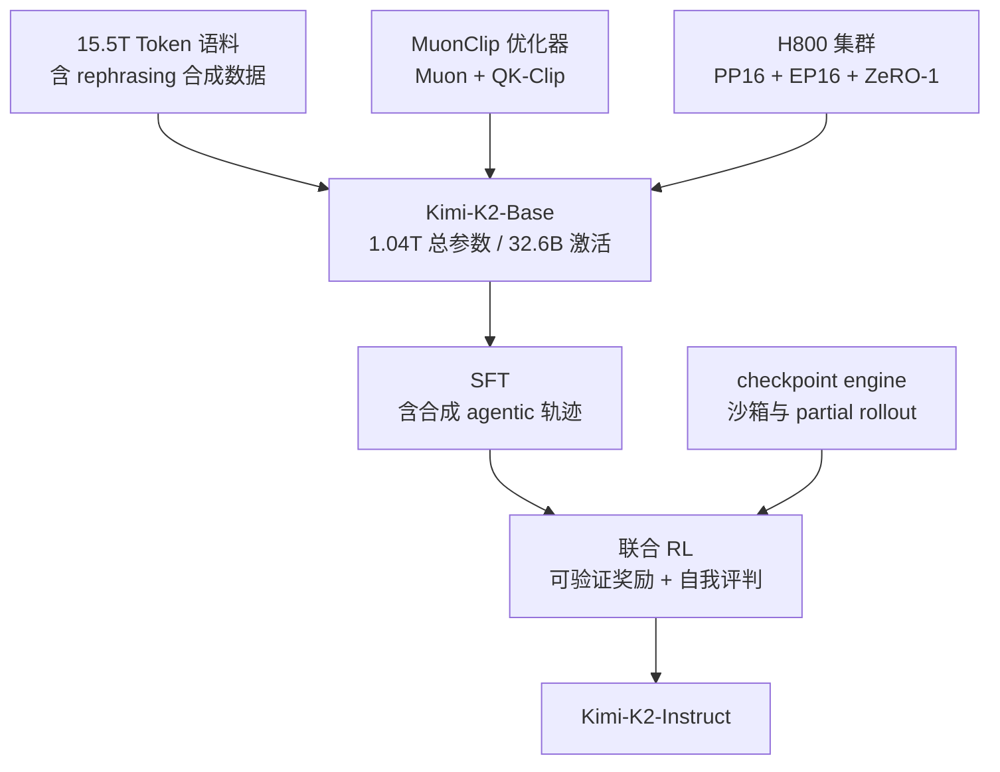
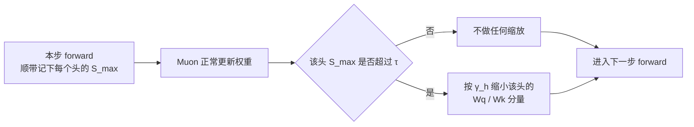
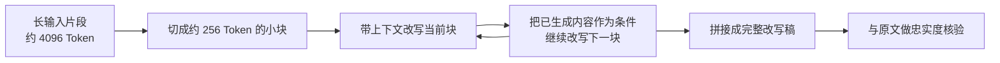
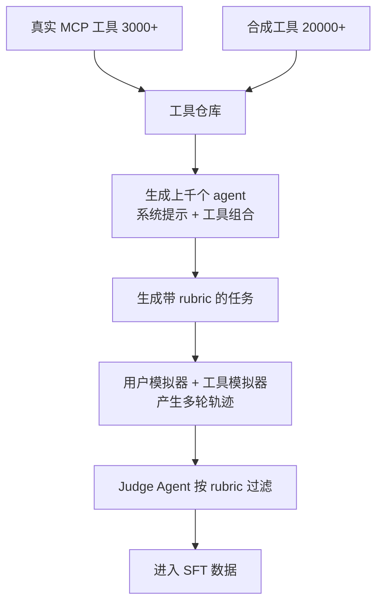
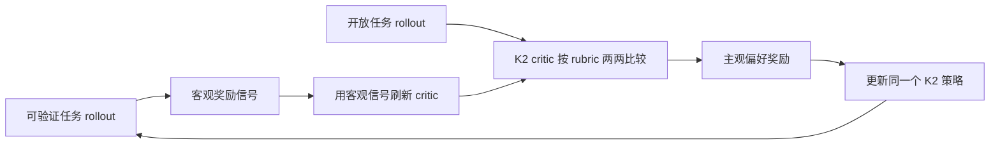
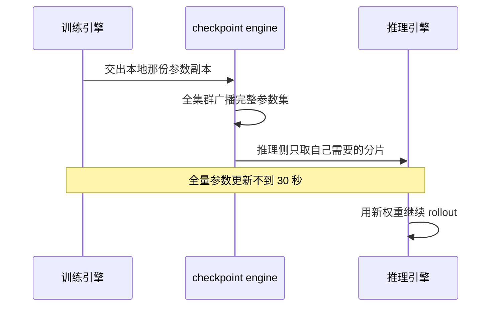
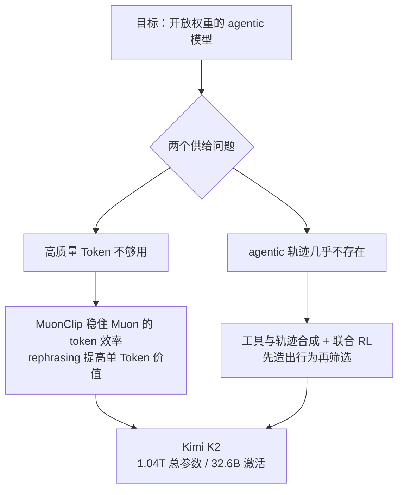

# Kimi K2：高质量数据见底之后，把每个 Token 和每条轨迹都当成稀缺品

<!-- release-date: 2025-07-11 -->

> 本文依据 Kimi Team 发布的 **Kimi K2: Open Agentic Intelligence — Technical Report of Kimi K2**，即 arXiv:2507.20534v2、2026-02-03 修订版，共 32 页。页码均指 PDF 本身的页码。本地原件已核对为 arXiv 官方最新版本（v1 为 2025-07-28，v2 为 2026-02-03，没有更新的修订）。本文会把「报告明确写了什么」「我们如何理解它」与「外部资料补充」三层分开；外部补充都会给出链接并单独标注。

## 阅读前先搭一张最小地图

先认识六个会反复出现的概念。它们不是 K2 的发明，但后面每一节都要用：

- **Token（词元）**：模型读写文本时的基本小块。一个汉字、一个单词或一段标点都可能被切成一个或多个 Token。
- **Mixture-of-Experts（MoE，混合专家）**：模型里有很多组前馈网络（专家），但每个 Token 只调用其中少数几个。这样总参数可以很大，而单个 Token 的计算量不必跟着变大。
- **Attention logits（注意力打分）**：注意力机制在做 softmax 之前算出来的那个原始分数。它由 Query 向量和 Key 向量点乘得到。分数越极端，softmax 的输出越接近「只看一个位置」。
- **Optimizer（优化器）**：决定每一步训练如何根据梯度修改参数的算法。AdamW 是最常见的一种。
- **Supervised Fine-Tuning（SFT，监督微调）**：拿「问题—标准答案」成对数据继续训练已经预训练好的模型。
- **Reinforcement Learning（RL，强化学习）**：让模型自己做任务，再按结果好坏给奖励，用奖励继续训练。模型做一次任务产生的完整过程叫 **rollout（采样轨迹）**。

K2 报告最核心的几个自造名词，也可以先翻成人话：

- **Agentic Intelligence（智能体智能）**：模型不只回答一句话，而是能在复杂环境中自己感知、规划、推理并动手，比如连续调用工具、改文件、跑测试再修错。
- **Token efficiency（Token 效率）**：每消耗一个训练 Token，模型性能能提高多少。报告把它当成和参数量、算力并列的一个扩展系数。（PDF p.2）
- **Muon**：一种优化器。它先累积动量，再把二维权重矩阵的更新方向近似正交化，使各个方向的更新幅度更均衡。
- **QK-Clip（Query-Key 权重裁剪）**：训练每一步之后，直接把某些注意力头的 Query/Key 投影权重按比例缩小，从源头限制注意力打分变大。
- **MuonClip**：Muon 加权重衰减、加更新 RMS 对齐、再加 QK-Clip 打包成的一个优化器。（PDF p.3）

## 一句话先说清

Kimi K2 的重点不是「我们做了一个一万亿参数的模型」。

它真正回答的是两个**供给**问题：

1. **高质量人类文本快用完了。** 想继续变强，就不能只买更多算力、读更多重复语料，必须让同样一批 Token 产生更多学习信号。
2. **Agentic 轨迹在自然语料里几乎不存在。** 互联网上有大量文章和代码，却几乎没有「一个 agent 连续调用十几次工具、中途出错再修正」的完整过程记录。

K2 的答案是两条线各自动手：

- 预训练侧：用 **Muon** 提高 Token 效率，用 **QK-Clip** 修掉 Muon 带来的训练不稳定，再用 **rephrasing（改写）** 把有限的高质量语料变成更多不重复的训练样本；
- 后训练侧：先建一条**大规模 agentic 数据合成流水线**把轨迹「造」出来，再用一个同时包含可验证奖励和自我评判的 **联合 RL** 框架，让模型在真环境和模拟环境里继续学。

因此这篇报告最值得记住的一句话是：

> **当外部供给见底时，能力的来源就从「找到更多数据」变成「把已有数据和已有模型改造成新的训练信号」。**

这条主线会一路影响到优化器设计、数据流水线、奖励函数，甚至 RL 集群里参数怎么搬。

## 先看全景：K2 由哪几块拼成

这张图根据报告 §2–§3 的整体叙事（PDF p.2–15）重画，只表达模块连接顺序，不表示各阶段耗时或算力比例。

模型本身的关键配置放在一起看（PDF p.6，Table 2）：

| 配置 | DeepSeek-V3 | Kimi K2 | 变化 |
|---|---:|---:|---:|
| 层数 | 61 | 61 | 不变 |
| 总参数 | 671B | 1.04T | ↑54% |
| 每 Token 激活参数 | 37B | 32.6B | ↓13% |
| 路由专家总数 | 256 | 384 | ↑50% |
| 每 Token 激活专家 | 8 | 8 | 不变 |
| 共享专家 | 1 | 1 | 不变 |
| 注意力头 | 128 | 64 | ↓50% |
| 稠密层数 | 3 | 1 | ↓67% |
| 专家分组 | 有 | 无 | — |

隐藏维度是 7168，MoE 单个专家的隐藏维度是 2048，注意力用的是 Multi-head Latent Attention（MLA，多头潜变量注意力）——一种先把每个 Token 的 Key/Value 压成低维向量再缓存的注意力。（PDF p.6）

这张表里最反直觉的两格是**总参数变大 54%，激活参数反而变小 13%**，以及**注意力头砍掉一半**（PDF p.6，Table 2）。它们都不是随手调的，后面第三节会讲清楚各自的实验依据。

一个小提醒：报告自己在不同位置写过 32B 与 32.6B 两个激活参数数字（摘要与 Table 4 写 32B，Table 2 写 32.6B），总参数则写过 1.04T 与 1043B（PDF p.1、6、18）。这是同一个数的粗略与精确写法，不是两套配置。

## 第一组矛盾：想省 Token，就得换优化器；换了优化器，训练又会炸

### 旧问题：AdamW 很稳，但它不够省

预训练最贵的资源不是参数，而是**高质量 Token**。报告开门见山地说：在高质量人类数据供给受限的前提下，Token 效率正在成为大模型扩展中的关键系数。（PDF p.2）

Moonshot 之前的工作 Moonlight 给出的结论是：在**相同算力预算、相同模型规模、因而相同数据量**的条件下，Muon 明显优于 AdamW。（PDF p.3）注意这个条件很重要——它说的是「同样的 Token 学得更多」，不是「训练更快」。

Muon 为什么可能更省？直觉是这样：AdamW 主要按元素统计一阶、二阶动量，它很擅长给每个坐标挑合适的步长，却不直接关心整个权重矩阵的各个方向是否被均衡地更新。Muon 会把带动量的更新矩阵近似正交化，让不同奇异方向的尺度接近。在 K2 的 Algorithm 1 里，这一步写成（PDF p.4）：

$$
M_t=\mu M_{t-1}+G_t,
\qquad
O_t=\operatorname{Newton\text{-}Schulz}(M_t)\cdot\sqrt{\max(n,m)}\cdot 0.2
$$

- $G_t$ 是当前梯度，$\mu$ 是动量系数，$M_t$ 是累积动量；
- Newton-Schulz 是一串矩阵乘法，用来近似把矩阵的奇异值都推向 1，避免真的做一次昂贵的奇异值分解；
- 后面乘的 $\sqrt{\max(n,m)}\cdot 0.2$ 是把更新的 RMS 幅度对齐到 AdamW 的常见量级，这样原来那套学习率超参数还能继续用。

参数更新则是 $W_t=W_{t-1}-\eta(O_t+\lambda W_{t-1})$，其中 $\eta$ 是学习率、$\lambda$ 是权重衰减。（PDF p.4）

### 新问题：Muon 更容易把注意力打分推爆

代价来了。报告说，把 Muon 扩到更大规模时会遇到一个特定故障：**注意力 logits 爆炸**。在他们的实验里，这个现象在 Muon 下比在 AdamW 下更频繁。（PDF p.3）

爆炸有多严重？在一个 9B 激活、53B 总参数的中等规模 MoE 上用原版 Muon 训练，最大注意力 logits 很快超过 1000。（PDF p.3、4，Figure 2 左）这种量级通常会带来明显的 loss 尖峰甚至发散。

为什么坏？softmax 的输入变成上千之后，输出会退化成近似 one-hot：某一个位置拿走几乎全部注意力权重，其他位置的梯度基本消失。数值上也很危险，指数运算容易溢出。

### 为什么已有的两种办法都不够用

报告明确点了两个现成方案，并说明它们为什么在这里不适用（PDF p.3）：

- **Logit soft-cap**（Gemma 2 的做法）：直接把算出来的 logits 压到一个范围内。问题是**它只治标**——Query 和 Key 的点乘在被 cap 之前就已经长得很大了，产生这个大数的权重仍在继续增长。
- **QK-Norm**：在算点乘之前先对 Query 和 Key 做归一化。问题是它**用不了在 MLA 上**，因为 MLA 推理时并不会把每个头完整的 Key 矩阵实际展开出来。

第二点很关键：它说明这不是「懒得用现成方法」，而是架构选择（MLA）把一条常规路堵死了。K2 既然沿用 MLA 换取更小的 KV 缓存，就必须为稳定性另找出口。

### 新设计：QK-Clip 直接去改权重，而不是改这一步的输出

QK-Clip 的思路很朴素：既然 logits 变大是因为 $W_q$ 或 $W_k$ 的谱范数在涨，那就在每一步更新完之后，**把这两个矩阵按比例缩小**。（PDF p.3）

先定义一个每个头一个的标量，叫 max logit。它是当前这批数据 $B$ 里进入 softmax 的最大输入：

$$
S_{\max}^{h}=\frac{1}{\sqrt d}\max_{X\in B}\max_{i,j}Q_i^h {K_j^h}^{\top}
$$

其中 $h$ 是注意力头编号，$i,j$ 是同一条训练样本 $X$ 里不同 Token 的下标，$d$ 是 head 维度。（PDF p.3）

然后定一个阈值 $\tau$。朴素版本对所有头一视同仁：

$$
W_q^{h}\leftarrow \gamma^{\alpha}W_q^{h},
\qquad
W_k^{h}\leftarrow \gamma^{1-\alpha}W_k^{h},
\qquad
\gamma=\min\left(1,\;\tau/S_{\max}\right)
$$

$S_{\max}=\max_h S_{\max}^h$，$\alpha$ 是把缩放量在 Query 侧和 Key 侧之间分配的系数，通常取 0.5，也就是两边各承担一半。（PDF p.3）

三个细节值得单独拎出来：

**第一，$\gamma$ 里的 $\min(1,\cdot)$ 意味着这是一个单向阀门。** 只有 $S_{\max}$ 超过 $\tau$ 时 $\gamma$ 才小于 1；没超过就等于 1，什么也不做。

**第二，它不改这一步的前向和反向计算。** 报告特别强调，max logit 只被当作一个「指导信号」，用来决定权重该被压多狠；当前这一步的计算结果不受影响。（PDF p.3）这让 QK-Clip 更像训练循环外挂的一个约束，而不是新的层。

**第三，最终用的是逐头版本。** 实践中只有一小部分头会爆炸，所以 K2 改成对每个头单独算 $\gamma_h=\min(1,\tau/S_{\max}^h)$，最小化对其他头的干预。（PDF p.3）

对普通多头注意力（MHA），逐头裁剪很直接。但 MLA 的一个头由几块拼成，且其中一块是所有头共享的，所以 K2 只裁不共享的部分（PDF p.3）：

- $q^C$ 与 $k^C$（每个头独有的内容分量）：各乘 $\sqrt{\gamma_h}$；
- $q^R$（每个头独有的旋转分量）：乘 $\gamma_h$；
- $k^R$（所有头共享的旋转分量）：**完全不动**，以免影响到其他头。

为什么内容分量各开平方？因为 Query 和 Key 会点乘，两边各乘 $\sqrt{\gamma_h}$，乘积正好被缩小 $\gamma_h$ 倍，落回阈值内。而 $q^R$ 那一路的对面是不能动的共享 $k^R$，所以缩放只能由 Query 侧一边全担，因此直接乘 $\gamma_h$。这是一个很典型的「共享参数限制了可用的干预手段」的例子。

这张图根据报告 §2.1 与 Algorithm 1（PDF p.3–4）重画，是机制与时序示意，不表示各步骤耗时。

把 Muon、权重衰减、更新 RMS 对齐和 QK-Clip 打包成一个优化器，就是 **MuonClip**。（PDF p.3）

### 证据链：报告用三层实验来支撑这件事

这一节是全文实验设计最扎实的地方，值得按层拆开看：

| 层级 | 规模 | 设置 | 结论 | 页码 |
|---|---|---|---|---|
| 问题存在 | 9B 激活 / 53B 总参数 MoE | 原版 Muon | 最大 logits 很快超过 1000 | PDF p.3、4 |
| 药没有副作用 | 0.5B 激活 / 3B 总参数 MoE | Muon vs MuonClip，$\tau=30$ | loss 曲线几乎不受影响，下游任务无统计显著退化 | PDF p.29–30 |
| 药在正式规模有效 | Kimi K2 全量 | MuonClip，$\tau=100$ | 全程无 loss 尖峰 | PDF p.4、5 |

第二层特别聪明：它用了一个**比正式训练严苛得多**的阈值（$\tau=30$ 对 $\tau=100$）。逻辑是——如果连过度激进的裁剪都不伤害收敛，那正式训练那档温和设置就更安全。这比在同一档设置上做一次对比更有说服力。

第三层的曲线也很有意思。K2 全程用 $\tau=100$，最大 logits 一开始迅速冲到 100 被按住，之后**在大约 30% 的训练步之后才自己衰减回正常区间**，全程没有调整过 $\tau$。（PDF p.4，Figure 2 右）训练 loss 曲线未做平滑与降采样，横跨约 15.5T Token，没有出现尖峰。（PDF p.5，Figure 3）

### 最漂亮的一点：这个机制会自己关掉

附录 D 给出了一个很好的数字（PDF p.30）：

- 前 70000 步：**12.7%** 的注意力头至少触发过一次 QK-Clip，被钳到 $S_{\max}=100$；
- 70000 步之后：所有头都曾把自己的 $S_{\max}$ 降到 100 以下，QK-Clip 从此不再生效。

报告把这叫做 **最小干预原则**——需要时才启动，训练稳定后自动停用。（PDF p.29）

这解释了为什么它不太可能损害最终质量：一个在训练后期完全不触发的机制，对最终权重的直接影响是零。它更像脚手架，不像结构件。

### 附录 E 给了一个假设，但那只是假设

报告还试着回答「为什么偏偏是 Muon」。链条是这样的（PDF p.30–31）：

先注意到 logits 的上界由权重的谱范数决定：

$$
|q_i\cdot k_j|\le \lVert q_i\rVert\lVert k_j\rVert\le \lVert x_i\rVert\lVert x_j\rVert\lVert W_q\rVert\lVert W_k\rVert
$$

RMSNorm 已经把 $\lVert x_i\rVert\lVert x_j\rVert$ 管住了，所以问题只能出在 $\lVert W_q\rVert$ 或 $\lVert W_k\rVert$ 上。

接着是结构差异：Muon 的更新来自 msign 操作，结果是**更新矩阵的所有奇异值相等，有效秩是满的**；而 Adam 的更新谱是偏斜的，少数几个奇异值主导，有效秩低。报告说这一点在 16B 的 Moonlight 模型上得到验证——Muon 训出来的权重奇异值熵更高。（PDF p.30）

于是有了假设：既然权重和更新的有效秩都更高，某个奇异向量对 $u_iv_i^{\top}$ 与更新里的 $\bar u_j\bar v_j^{\top}$ 对齐的概率就更大，对应的奇异值就更容易被**加性地**推高。（PDF p.31）

最后是注意力特有的放大：logits 是双线性形式 $q_i\cdot k_j=(x_iW_q)\cdot(x_jW_k)$，其中 $W_qW_k^{\top}$ 把谱范数**平方**了，所以任何一边涨一点，乘积就涨得更多。（PDF p.31）

必须说清楚的是：报告自己用的词是 "we hypothesize"（我们假设）。它给了一个自洽、有一个观测支持（Moonlight 的奇异值熵）的解释，但**没有证明**。读的时候不要把它当定理。

### 代价、边界与可迁移启发

代价其实很轻，但仍存在：

- 需要在 forward 时额外记录每个头的 max logit（报告说是「already computed during forward」，也就是顺带取到，不是另跑一遍，见 PDF p.4）；
- 多了一个超参数 $\tau$。K2 用 100 且全程没调，但报告没有给出 $\tau$ 的搜索过程或敏感性分析；
- 它治的是这一种失稳。报告没有声称 MuonClip 能解决所有 loss spike。

可迁移的有三条：

1. **把「监控指标」直接变成「控制动作」。** 很多团队会画 max logit 曲线，看到涨了就降学习率或回滚。QK-Clip 的做法是让这个指标直接驱动一次确定性的权重缩放，不需要人介入。
2. **干预要贴近病因。** soft-cap 治的是输出，QK-Clip 治的是产生输出的权重。当一个量在持续增长时，压它的结果往往不如压它的来源。
3. **让保护机制可以自己退休。** 12.7% 触发、70000 步后归零，这个形态比常驻约束更值得追求：既在危险期起作用，又不给稳定期加税。

## 第二组矛盾：好语料只有那么多，重复读又会过拟合

### 旧问题：读一遍不够，读十遍变坏

知识密集型文本有个尴尬的中间状态（PDF p.5）：

- 只训一个 epoch，模型吸收不充分；
- 训很多个 epoch，收益递减，过拟合风险上升。

传统做法只能在这两端之间挑一个折中点。K2 想要的是第三个选项。

### 新设计：不是重复读，而是重写

**rephrasing（改写）** 的思路是：既然同一份内容重复看会过拟合到具体表述，那就让它换一种说法再看。语义信息还在，表面形式变了。

K2 的知识改写流水线有三个部件（PDF p.5）：

1. **风格与视角多样的提示**：受 WRAP 启发，用一批精心设计的提示，让一个大模型把原文用不同风格、不同视角忠实地改写。
2. **按块自回归生成**：长文档不整篇丢给模型改，而是切成小块顺序改写，再拼回去。
3. **忠实度核验**：把改写后的段落和原文做语义一致性比对，作为进入训练前的第一道质检。

第二点值得展开，因为它解决的是一个非常具体的工程问题。Figure 4 显示的流程是：一段约 4096 Token 的输入被切成约 256 Token 的小块，每一块带着上下文单独改写，生成的输出又作为后续改写的条件，最后拼接成完整改写稿。（PDF p.6，Figure 4）

为什么要这样切？报告给的理由是**避免长文档改写时的信息丢失，并绕开大模型隐含的输出长度限制**。（PDF p.5）现实中让模型「把这一万字重写一遍」，它很可能写到一半就开始概括、跳段或提前收尾。切块之后每次任务都短，模型有余量把细节写全。

这张图根据报告 Figure 4 与 §2.2（PDF p.5–6）重画，是数据生成机制示意，不表示实际吞吐或过滤通过率。

### 实验：三种配置的对照

报告用 SimpleQA 做了一次三选一的对照（PDF p.5，Table 1）：

| 改写次数 | 训练 epoch | SimpleQA 准确率 |
|---:|---:|---:|
| 0（原始维基文本） | 10 | 23.76 |
| 1 | 10 | 27.39 |
| 10 | 1 | 28.94 |

读法是这样的：三种配置看到的**总 Token 量级相当**，区别只在于这些 Token 是同一份文本重复十次，还是十份不同改写各看一次。准确率从 23.76 一路涨到 28.94，方向很清楚。（PDF p.5）

但边界也必须说清楚：

- 这是**一个数据集、一个指标**（SimpleQA 准确率）上的对照，用的是 K2 的一个早期 checkpoint，不是全量模型；
- 报告没有公开这个实验的模型规模、训练步数或其他任务的表现；
- 最重要的是——**正式训练并没有用「改写 10 次」这一档**。报告紧接着写：把方法推广到其他大规模知识语料后观察到类似的积极结果，且**每份语料最多改写两次**。（PDF p.5）

也就是说，Table 1 证明的是趋势方向，而生产配置是一个更保守的取值。这两件事不能混为一谈。为什么保守？报告没有解释，我们只能推测与成本、幻觉风险和多样性饱和有关——但这是我们的推测，不是报告结论。

### 数学语料走另一条路

数学改写不追求多样风格，而是改成「**学习笔记**」风格，方法沿用 SwallowMath。另外还把其他语言的高质量数学材料翻译成英文来增加多样性。（PDF p.6）

这个差别本身有信息量：知识类文本的价值在于事实覆盖，所以要换视角多看几遍；数学材料的价值在于推理链条，所以要改成更利于学习推导过程的形式。**同一个「合成数据」标签下，不同领域的目标函数其实不一样。**

### 报告自己承认的风险

这一段写得很诚实，值得原样记住（PDF p.6）：合成数据作为持续扩展策略仍是一个**活跃的研究方向**，关键挑战包括——

- 如何推广到多样的源领域而不损害事实准确性；
- 如何最小化幻觉和意外的有害内容；
- 如何扩展到超大规模数据集。

换句话说，K2 没有宣称改写是已经解决的问题。它给出了一条有正向证据的路径，同时列出了三个未解风险。

### 预训练语料的全貌，以及没公开的部分

语料总量 15.5T Token，覆盖四个主要领域：Web Text（网页文本）、Code（代码）、Mathematics（数学）、Knowledge（知识）。大部分数据处理流水线沿用 Kimi K1.5 的方法。（PDF p.6）

报告**没有**公开：各领域的配比、去重阈值、质量分类器细节、合成数据占总语料的比例、污染检查结果、词表大小和分词方案。

所以正确的表述是「K2 用了 15.5T Token，其中知识与数学部分包含最多两轮改写产生的合成数据」，而不是「K2 的数据配方是……」。

### 可迁移启发

- **重复不是唯一的复用方式。** 当高质量样本稀缺时，先问「能不能换一种忠实的表达形式」，再问「要不要多训几个 epoch」。
- **长内容的改写要切块。** 任何让模型「整体重写一大段」的任务，都会撞上隐含长度限制。切块 + 传递上下文 + 拼接是通用解法。
- **合成必须配核验。** 三个部件里，忠实度核验是最容易被省掉、也最不该省的那个。没有它，改写就从数据增强变成了噪声注入。

## 第三组矛盾：同一份算力预算，该买稀疏度还是买注意力头

这一节是全文最像「实验驱动决策」的部分，两个结论方向相反，但依据是同一类实验。

### 稀疏度：越稀疏越好，但要在成本处刹车

先定义：**稀疏度 = 专家总数 ÷ 每 Token 激活的专家数**。（PDF p.7）

K2 的受控实验固定激活专家数为 8、共享专家为 1，只改变专家总数，得到不同稀疏度的模型。结论是：在**固定激活参数量**（因而固定 FLOPs）的前提下，增加专家总数会持续降低训练和验证 loss。（PDF p.7，Figure 5）

具体到数字。要达到同样的 1.5 验证 loss，稀疏度 48 相比稀疏度 8、16、32 分别减少 1.69 倍、1.39 倍、1.15 倍的 FLOPs。（PDF p.7）

留意这个序列：1.69 → 1.39 → 1.15。**边际收益在明显递减。** 从 8 到 16 拿到的好处，远大于从 32 到 48。而 Figure 5 里还画了稀疏度 64 的曲线，K2 却没有选它。

报告给的理由是一句话：稀疏度上升会带来**基础设施复杂度上升**，需要在性能和成本之间平衡，所以取 48——即 384 个专家里每次激活 8 个。（PDF p.7）

这是一个很实在的工程判断。曲线还在往下走，但每多一档，专家并行的通信、负载均衡和显存压力都要重新解决一遍。**scaling law 告诉你方向，不告诉你停在哪。**

### 注意力头：这次实验的结论是「别加」

DeepSeek-V3 把注意力头数设成大约层数的两倍，理由是更好地利用显存带宽、提高计算效率。K2 反过来做了。（PDF p.7）

反对的理由是**推理成本随上下文长度放大**。报告给了一个具体测算：在序列长度 128k、专家总数固定为 384 的条件下，把注意力头从 64 增加到 128，推理 FLOPs 会**增加 83%**。（PDF p.7）

而收益呢？在等 Token 训练条件下的受控实验显示，注意力头翻倍只带来大约 **0.5% 到 1.2%** 的验证 loss 降低，在不同算力预算下都是这个量级。（PDF p.7，Figure 6）

于是决策很清楚：**近 1% 的 loss 换 83% 的长上下文推理开销，不划算**，选 64 个头。（PDF p.7）

报告还给了一层理由：这一点在 agentic 应用里尤其重要，因为高效的长上下文处理在那里是必需的。（PDF p.7）也就是说，这个取舍是被「模型将来主要用来干什么」倒推出来的。

### 两个决策放在一起看

| 维度 | 训练侧收益 | 推理侧成本 | 决策 |
|---|---|---|---|
| 稀疏度 8 → 48 | 同 loss 省 1.69 倍 FLOPs（PDF p.7） | 基础设施复杂度上升 | 采纳，但停在 48 不到 64 |
| 注意力头 64 → 128 | 验证 loss 降 0.5%–1.2%（PDF p.7） | 128k 下推理 FLOPs 增 83%（PDF p.7） | 拒绝 |

这张对照表是全文我最喜欢的一处。它说明 K2 的架构不是「照抄 DeepSeek-V3 再放大」，而是**对每个维度分别追问：这一步的训练收益，值不值它的推理价格**，然后得出方向相反的两个答案。

可迁移的原则是：**架构消融实验必须同时报告部署侧代价。** 只看验证 loss，注意力头翻倍是「免费的小提升」；把 128k 推理成本放进来，它立刻变成一笔坏交易。

## Infra：把一个 1T 模型塞进有限的显存里

### 硬件与并行策略

K2 训练在 NVIDIA H800 集群上。每个节点有 2 TB 内存和 8 张 GPU，节点内用 NVLink 与 NVSwitch 相连，节点之间是 8×400 Gbps 的 RoCE 互连。（PDF p.7）

并行策略有一个明确的设计目标：**能在任意「32 的倍数」个节点上训练**。（PDF p.7）为什么要这样？因为大模型训练常常在动态变化的资源可用性下推进——今天能拿到多少卡，明天不一定一样。与其为某个特定规模优化一套配置，不如让同一套配置在大小规模上都能跑。

具体组合是：16 路流水线并行（Pipeline Parallelism，PP）带虚拟阶段、16 路专家并行（Expert Parallelism，EP）、以及 ZeRO-1 数据并行。（PDF p.8）

在这个设置下，BF16 存参数加 FP32 存梯度累积缓冲，大约需要 6 TB 显存，分布在 256 张 GPU 组成的模型并行组上。优化器状态的放置取决于配置：节点多时分布式存放，每设备占用可忽略；节点少时（比如 32 个）把一部分卸载到 CPU。最终每张 GPU 上所有状态大约占 30 GB，剩下的显存留给激活值。（PDF p.8）

报告特意点出这样做的价值：一致的设计**大幅加速实验迭代**，这是「研究效率」而不只是「训练效率」。（PDF p.8）这个区分值得记住——一个能在 32 卡和 2048 卡上跑同一份配置的系统，让小规模消融实验的结论更容易迁移到正式训练。

### 为什么不用 DualPipe

DeepSeek-V3 用 DualPipe 来重叠通信和计算。K2 明确拒绝了，理由写得很具体（PDF p.8）：

DualPipe 会让参数和梯度所需的内存**翻倍**，为了补偿就得增加并行度。而增加 PP 会引入更多流水线气泡，增加 EP 又会带来更高开销。对一个超过 1 万亿参数的模型来说，这些额外成本高得不可接受。

K2 改用的是**增加 warm-up micro-batch 数量的交错式 1F1B**：多排几个预热微批次，就能在标准调度下把 EP 的 all-to-all 通信藏进计算里。（PDF p.8）

但交错式 1F1B 也有自己的代价：它把模型切成更多阶段，PP 通信开销变得不可忽略。K2 的应对是**把权重梯度计算从每个微批次的反向传播里拆出来**，让它和对应的 PP 通信并行执行。这样除了预热阶段，所有 PP 通信都能被有效重叠。（PDF p.8）

### 一个漂亮的连锁反应：64 个头如何决定了 EP=16

这是全文架构与系统耦合最紧的一处，值得慢读（PDF p.8）：

1. K2 只有 64 个注意力头（DeepSeek-V3 是 128）；
2. 所以 K2 的注意力计算时间更短；
3. 要在 1F1B 阶段做到完全的计算—通信重叠，就必须让 EP 操作的时间也相应缩短；
4. 缩短 EP 时间的办法是采用**最小可行的 EP 并行度**，也就是 EP = 16。

这条链的方向是从模型架构一路推到并行度配置。它给出的通用教训是：**你可以用来隐藏通信的时间，上限是你的计算时间。** 计算变快了，通信预算就同步缩水，不能假设原来的并行配置还成立。

报告还补了一句额外好处：更小的 EP 组会**放松专家均衡的约束**，不用进一步调优就能接近最优速度。（PDF p.8）这也符合直觉——专家分散在越少的设备上，某个专家过热造成的相对不均衡就越小。

### 三层激活压缩

在参数、梯度缓冲和优化器状态占满之后，剩下的显存不足以放下完整的 MoE 激活值，尤其是 1F1B 预热阶段前几个流水线阶段会堆积最多激活。K2 用了三招（PDF p.8–9）：

1. **选择性重计算**：对「便宜但占地方大」的部分重算，包括 LayerNorm、SwiGLU 和 MLA 上投影；另外 MoE 下投影也在训练中重算。报告说最后这一项是可选的，但它能保住足够显存，**防止早期训练阶段因专家不均衡而崩溃**。
2. **FP8 存储不敏感激活**：MoE 上投影和 SwiGLU 的输入被压成 FP8-E4M3，按 1×128 的 tile 配 FP32 缩放因子。小规模实验显示没有可测量的 loss 上升。
3. **激活 CPU 卸载**：其余全部激活卸载到 CPU 内存，由一个拷贝引擎负责流式搬运，与计算和通信核重叠。1F1B 阶段的具体节奏是——卸载上一个微批次的前向激活，同时预取下一个微批次的反向激活。

第 2 条里藏着一个必须读到的限制：**FP8 只用于存储，不用于计算。** 报告的原话是，由于在初步研究中观察到性能退化的潜在风险，他们不在计算中使用 FP8。（PDF p.8）

这一条很有价值。同样是 FP8，「存下来省显存」和「拿去做矩阵乘」是两件风险完全不同的事：前者只损失一次量化精度，后者会让误差在整条计算链里累积。K2 选择只吃前一半的收益。

第 3 条则说明了另一件事：卸载确实会因为 PCIe 流量拥塞轻微影响 EP 通信，但他们的测试显示 EP 通信仍然完全被重叠。（PDF p.9）这是一个诚实的「有干扰但没穿帮」的表述，比笼统说「无开销」可信。

## 训练 recipe：K2 是一个短上下文训练、后期扩展的模型

完整配方在一页里写完（PDF p.9）：

**主训练阶段**

- 上下文窗口 **4096** Token；
- 优化器 MuonClip，学习率用 WSD（Warmup-Stable-Decay，预热—稳定—衰减）调度；
- 总共 15.5T Token；
- 前 10T Token 在 500 步 warm-up 之后保持恒定学习率 $2\times10^{-4}$；
- 后 5.5T Token 用 cosine 从 $2\times10^{-4}$ 衰减到 $2\times10^{-5}$；
- 权重衰减全程 0.1；
- 全局 batch size 恒定为 6700 万 Token。（PDF p.9）

**退火与长上下文激活阶段**

- batch 仍为 6700 万 Token，学习率从 $2\times10^{-5}$ 衰减到 $7\times10^{-6}$；
- 先在 4k 序列长度上训练 4000 亿 Token；
- 再在 32k 序列长度上训练 600 亿 Token；
- 最后用 YaRN 方法把上下文窗口外推到 **128k**。（PDF p.9）

这份配方里有一个容易被忽略但很重要的事实：**K2 的绝大部分训练发生在 4096 Token 上下文里。** 32k 阶段只有 600 亿 Token——用报告给的 600 亿与 15.5T 相除，约占总量的 0.4%，这个百分比是我们换算的，报告本身没有给出（PDF p.9）；而 128k 完全是靠 YaRN 这种位置编码外推方法得到的，没有在 128k 上真正训练过。

这与 K3 那种「8K → 64K → 256K → 1M 的四阶段课程」是截然不同的路线。理解这一点，才能正确解读后面 K2 在长上下文检索基准上的表现（MRCR 55.0，明显低于 Gemini 2.5 Flash 的 81.7，见 PDF p.16）。**长上下文不是 K2 这一代想解决的问题**，报告也从未把它列为贡献。

## 后训练第一段：把不存在的 agentic 轨迹造出来

### 旧问题：真实环境好，但造不出规模

模型要学会自主使用陌生工具、与外部环境交互、通过推理—执行—纠错来改进自己的动作。（PDF p.9）问题在于训练数据从哪来。

报告点明了两难（PDF p.9）：真实环境提供丰富真实的交互信号，但因为成本、复杂度、隐私和可访问性的限制，**难以规模化构建**。

### 新设计：三阶段合成流水线

K2 的流水线分三步（PDF p.9）：

1. **工具规格生成**：先建一个大的工具规格仓库，来源既有真实工具也有模型合成的工具；
2. **Agent 与任务生成**：从工具仓库里采样一组工具，为它生成一个会用这套工具的 agent，以及若干对应任务；
3. **轨迹生成**：让每个 agent 去做每个任务，产生调用工具完成任务的完整轨迹。

这张图根据报告 Figure 8 与 §3.1.1（PDF p.9–11）重画，是数据合成机制示意，不表示各环节的通过率或最终样本量。

### 工具从哪来：真实的补覆盖，合成的补系统性

两条腿走路（PDF p.10）：

- **真实工具**：直接从 GitHub 仓库抓取了 **3000 多个**真实的 MCP（Model Context Protocol，模型上下文协议）工具规格。MCP 是一个让模型调用外部工具的开放协议，这些规格是现成的高质量资产。
- **合成工具**：通过一个层级化的领域生成过程系统性地演化。先定关键类别（比如金融交易、软件应用、机器人控制），再在每个类别里演化出多个具体应用领域，最后为每个领域合成带清晰接口、描述和操作语义的专用工具。这个过程产出了**超过 2 万个**合成工具。

Figure 9 用 t-SNE 展示了两类工具的嵌入分布：真实 MCP 工具按原始来源类别自然聚簇，合成工具则被组织进预定义的领域类别，覆盖工具空间中互补的区域。（PDF p.10）

「互补」这个词是关键。真实工具反映的是**人们实际造了什么**，分布必然不均——热门领域工具多，冷门领域几乎没有。合成工具走的是自顶向下的分类展开，能**按设计填补空白**。两者叠加，覆盖面比任一单独来源都好。

### 任务与轨迹：rubric 是这条流水线的骨架

- **Agent 多样化**：合成各种系统提示，配上不同的工具组合，生成数千个不同的 agent，各有能力、专长和行为模式。（PDF p.10）
- **基于 rubric 的任务生成**：每个任务都配一份明确的 rubric（评分标准），规定成功条件、预期的工具使用模式和评估检查点。（PDF p.10）
- **多轮轨迹生成**：由两个模拟器驱动（PDF p.10–11）——
  - **用户模拟器**：大模型生成的用户人设，各有沟通风格和偏好，与 agent 进行多轮对话；
  - **工具执行环境**：报告称之为「功能上等价于一个世界模型」的工具模拟器。它执行工具调用并给出真实感的反馈，**每次执行后维护并更新状态**，从而支持带持久效果的复杂多步交互；它还引入受控的随机性，产出成功、部分失败和边界情况等多种结果。
- **质量评估与过滤**：一个基于大模型的 judge 按任务 rubric 评估每条轨迹，**只有满足成功标准的轨迹被保留**。（PDF p.11）

工具模拟器里的两个设计特别值得记住。**维护状态**意味着 agent 的第三步动作会真的受到第一步动作的影响，而不是每次调用都在一张白纸上；**受控随机性**意味着训练数据里会自然出现失败，模型因此有机会学到纠错，而不是只见过一路顺利的示范。

### 模拟不够真的地方，用真沙箱补

报告没有假装模拟是完美的。它明确承认模拟保真度的固有局限，因此在真实性至关重要的场景——尤其是编码与软件工程任务——用**真实执行沙箱**补充：真的跑代码，真的和开发环境交互，通过测试通过率这类客观指标提供 ground-truth 反馈。（PDF p.11）

### 这条流水线的本质是什么

报告自己给了一个很好的概括：这套「可扩展的模拟 + 有针对性的真实执行」的混合流水线，加上质量过滤，**实际上实现了大规模的拒绝采样（rejection sampling）**。（PDF p.11）

拒绝采样的意思是：大量生成候选，然后按标准把不合格的扔掉，只留下合格的。它不需要一开始就生成得很好，只需要**能大量生成**且**能可靠判断好坏**。

这就是整条流水线真正的杠杆点——不是「让模型一次写出完美轨迹」，而是「让模型写一万条，再用 rubric 挑出能用的」。

### 边界

报告**没有**公开：最终保留了多少条轨迹、过滤通过率、judge 模型是什么、合成 agentic 数据在 SFT 数据中的占比、以及 SFT 阶段的超参数。所以我们知道这条流水线的形状，但无法据此复现它的产出规模。

SFT 本身的信息也很简略：使用 Muon 优化器（因为 Moonlight 的结论是 Muon 预训练的 checkpoint 配 Muon 微调效果最好），数据构建遵循两条原则——最大化提示多样性、确保回复质量；候选回复由 K1.5 和其他内部领域专家模型生成，再由大模型或人类评判做自动质量评估与过滤。（PDF p.9）

## 后训练第二段：一个同时管可验证和不可验证任务的 RL 框架

K2 的 RL 不分成多个独立阶段，而是一个**联合**框架。它的核心难点是：数学题可以自动判对错，「这篇文章写得好不好」不行。K2 的做法是让这两类任务共用一套训练循环。

### 可验证奖励健身房（Verifiable Rewards Gym）

覆盖五类任务（PDF p.11–12）：

**数学、STEM 与逻辑**。数据准备遵循两条原则：

- *多样覆盖*：高质量 QA 对来自专家标注、内部 QA 抽取流水线和开源数据集，并用一套标签系统**刻意增加覆盖不足领域的比例**。逻辑任务的形式包括结构化数据任务（多跳表格推理、跨表聚合）和逻辑谜题（24 点、数独、谜语、字母算式、摩尔斯电码解码）。
- *适中难度*：太简单和太难的题都产生不了学习信号。K2 用 **SFT 模型的 pass@k 准确率**来评估每道题的难度，只保留难度适中的。

这个 pass@k 筛选法很实用：pass@k 接近 1 说明模型已经会了，接近 0 说明它完全够不着，两者的梯度都接近零。用**当前模型自己的表现**来定义难度，比用人类标注的难度标签更贴合训练需要。

**复杂指令遵循**。两条验证路径并行（PDF p.11）：

- 对有可验证输出的指令（长度、风格约束）用代码解释器做确定性判定；
- 对需要细致理解的约束用 LLM-as-judge。

外加一个 **hack-check 层**，专门检测模型声称完成了指令但实际并未遵守的欺骗性表述。（PDF p.11）这一层很有意思——它承认了一个具体的 reward hacking 模式（「我已经按你的要求写了 300 字」但其实没有），并为它单独设一道关卡。

**忠实性**。受 FACTS Grounding 评测框架启发，训练一个**句子级**的忠实性评判模型，它擅长找出「做了事实断言但上下文里没有支持证据」的句子，然后被当作奖励模型使用。（PDF p.12）句子级的粒度值得注意：它比给整段打一个分更容易定位问题。

**编码与软件工程**（PDF p.12）：

- 竞赛级编程：题目和判题器来自开源数据集和合成来源；为保证合成数据的多样性与奖励信号的正确性，还从**预训练数据里检索出高质量的人工编写单元测试**。这一步很巧妙——单元测试本来就散落在预训练语料里，把它捞出来当奖励验证器，等于把已有数据换了一个用途。
- 软件工程：从 GitHub 收集大量 pull request 和 issue，构建包含用户提示/issue 和可执行单元测试的开发环境。沙箱基础设施由 Kubernetes 支撑，**支持超过 10000 个并发沙箱实例**并保持稳定性能。

**安全**（PDF p.12）：从人工整理的种子提示开始（覆盖暴力、欺诈、歧视等常见风险类别），再用一条自动提示演化流水线模拟复杂越狱尝试（角色扮演、文学叙事、学术论述）。流水线有三个角色——攻击模型迭代生成对抗提示，目标模型产生回复，评判模型判断是否成功绕过安全机制。每次交互按任务特定 rubric 评估，给出二元成败标签。

### 超越可验证：自我评判 rubric 奖励

对于帮助性、创造性、推理深度、事实性和安全性这些**没法压成一条机械规则**的目标，K2 用的是 Self-Critique Rubric Reward（自我评判 rubric 奖励）。（PDF p.12）

它的形状是这样的：

- **K2 actor** 对覆盖广泛用例的通用提示生成回复；
- **K2 critic** 对所有结果做两两比较排序，比较时依据三类 rubric——核心 rubric（附录 F.1，代表 Kimi 珍视的 AI 助手基本价值）、规定性 rubric（附录 F.2，目标是**消除 reward hacking**）、以及数据团队为特定指令场景编写的人工标注 rubric；
- 某些 rubric 可以被指定为强制项，但 K2 保留在它们与自身先验之间权衡的灵活性。（PDF p.12）

critic 的能力在 SFT 阶段就用开源和内部偏好数据初始化好了。（PDF p.12）

### 闭环 critic 校准：这是全篇最值得学的一个设计

自我评判有一个明显的风险：如果模型既当运动员又当裁判，裁判的标准会不会跟着运动员一起漂？

K2 的答案是**用可验证任务的客观信号，持续校准主观裁判**（PDF p.12）：

RL 训练期间，critic 会用可验证信号来精炼。从可验证奖励提示产生的 on-policy rollout 被用来持续更新 critic，这一步把 RLVR（可验证奖励强化学习）的客观性能信号**直接蒸馏进评估模型**。这个迁移过程让 critic 更主观的判断也扎根在可验证数据上，从而使可验证任务上的性能提升能够改善它在缺少显式奖励信号的复杂任务上的判断。这个闭环确保 critic 与策略的演进**同步地**不断重新校准。

这张图根据报告 §3.2.2（PDF p.12）重画，是奖励闭环的机制示意，不表示两类任务的采样比例或更新频率。

这个设计的可迁移价值很高。任何用模型做评估的系统都会面临「裁判会不会漂」的问题。K2 给的答案不是「找更强的外部裁判」，而是**找到一部分能被客观判定的任务，用它们持续把裁判拉回锚点**。锚点任务不需要覆盖全部场景，只需要足够频繁地校准。

不过必须说清楚边界：报告**没有**给出这个校准的频率、权重、critic 的规模，也没有给出「不做闭环校准会漂多少」的对照实验。这个机制的合理性靠论证，不靠本报告里的消融数据。

### RL 算法：K1.5 的目标函数加三个补丁

基础目标函数沿用 K1.5。对每个问题 $x$，从旧策略 $\pi_{\text{old}}$ 采样 $K$ 个回复，然后优化（PDF p.13）：

$$
L_{\text{RL}}(\theta)=\mathbb E_{x\sim\mathcal D}\left[\frac{1}{K}\sum_{i=1}^{K}\left(r(x,y_i)-\bar r(x)-\tau\log\frac{\pi_\theta(y_i\mid x)}{\pi_{\text{old}}(y_i\mid x)}\right)^{2}\right]
$$

拆开看它在算什么：

- $r(x,y_i)$ 是第 $i$ 个回复拿到的奖励；
- $\bar r(x)=\frac1k\sum_{i=1}^{k}r(x,y_i)$ 是这一组采样回复的平均奖励，充当基线；
- $r(x,y_i)-\bar r(x)$ 就是「这个回复比同组平均好多少」；
- $\tau\log\frac{\pi_\theta}{\pi_{\text{old}}}$ 衡量新策略在这个回复上偏离旧策略多远，$\tau>0$ 是促进稳定学习的正则化系数；
- 外面那个平方项，是在要求「相对优势」与「对数概率比」两者**匹配上**，而不是像 PPO 那样直接最大化裁剪后的比值。

用一句话概括：它希望模型提高概率的幅度，与这个回复实际比平均好多少成比例——好得越多，才允许偏离旧策略越多。

三个补丁分别针对 RL 训练中的三个常见毛病（PDF p.13）：

**Budget Control（预算控制）**。RL 常常导致回复长度大幅增长。长回复在复杂推理上确实能换到性能，但在非推理领域，收益往往配不上推理成本。K2 的做法是在整个 RL 训练中强制一个**按任务类型确定的每样本最大 Token 预算**，超预算的回复被截断并给予惩罚。报告称这显著提升了模型的 Token 效率。

注意这里 Token 效率这个词又出现了一次，但含义变了：预训练里它指「每个训练 Token 带来多少性能」，这里指「每个输出 Token 带来多少任务价值」。同一个理念贯穿了训练和推理两端。

**PTX Loss**。联合 RL 训练可能让模型忘掉有价值的高质量数据。K2 挑选出一批高质量样本，通过一个辅助的 PTX loss 并入 RL 目标。报告说这不仅利用了高质量数据的优势，还缓解了对训练中显式出现的有限任务集的过拟合风险。

**Temperature Decay（温度衰减）**。创意写作和复杂推理在训练早期需要高采样温度来促进探索，但后期或评测时保持高温会引入过多随机性、损害可靠性。K2 用一个温度衰减调度，从探索逐步转向利用。

这三个补丁有一个共同点：它们都是在**不改变主目标函数**的前提下，用外围约束修正 RL 的已知副作用（变长、遗忘、过度随机）。这是一种很实用的工程风格。

### 附录 F：把 rubric 写出来，也把 rubric 的副作用写出来

报告在附录里公开了核心 rubric 和规定性 rubric 的内容（PDF p.31）：

**核心 rubric（F.1）** 三条：清晰性与相关性（简洁但完整回应意图，避免不必要的细节和冗长列举）；对话流畅性与参与度（自然的对话推进，恰当使用追问，语气适配场景）；客观与务实的交互（避免元评论，也避免对用户或其输入的无端奉承和过度赞美）。

**规定性 rubric（F.2）** 两条，都是禁令：不得以对用户或问题的恭维开头（例如「这是个很棒的问题」）；不得写解释「本回复为什么好」或「如何成功满足了要求」的句子。

真正难得的是 **F.3 Limitations**，报告主动写出了这套框架的副作用（PDF p.31）：

它可能偏好**显得自信和果断**的回复，即使在存在模糊性或主观性的场景中也是如此。原因是两条约束——

- *回避自我限定*：规定性规则禁止自我评估、明确免责声明或含糊措辞（「这可能不准确」「我可能错了」）。这些短语有时反映的是**认知谦逊**，却常被当作无信息或表演性内容而受罚；
- *偏好清晰与唯一性*：rubric 奖励直接、果断的回答。在复杂或开放的场景里，这可能**打击本应谨慎或多视角的回复**。

结果是模型偶尔会在本该承认模糊、细微差别或保持谦逊的地方过度表达确定性。报告说未来版本可能引入对校准后不确定性的更细粒度处理。（PDF p.32）

这一段的价值在于它揭示了对齐设计的一个真实困境：**简洁果断与承认不确定，在 rubric 层面很难同时表达**，因为两者在表面文本上长得很像。K2 选择了前者并公开了代价。任何在做 LLM 评审或 rubric 奖励的团队都应该读这一节。

## RL 基础设施：1T 模型做 RL，最贵的是搬参数

### 共置架构与它带来的新问题

K2 采用与 K1.5 类似的混合**共置**（colocated）架构：训练引擎和推理引擎住在同一批 worker 上。一个引擎工作时，另一个释放或卸载自己的 GPU 资源。每轮迭代由中央控制器调度：先叫推理引擎生成新数据，再通知训练引擎训练，然后把更新后的参数送回推理引擎。（PDF p.13）

共置省了机器，但制造了一个新瓶颈：**每一轮都要把训练引擎的新参数搬到推理引擎**。对 1T 模型来说，这不是小事——而且两边的分片方式还不一样。

### 为什么不能用共享文件系统

报告算了一笔账：用网络文件系统做重分片和广播是不现实的，因为要把开销压低所需的聚合带宽会达到**每秒数 PB**。（PDF p.14）

### checkpoint engine：一个故意「多传数据」的设计

K2 的方案是在训练节点上共置一个分布式 **checkpoint engine** 来管理参数状态。流程是（PDF p.14）：

1. 每个 checkpoint engine worker 从训练引擎拿到本地那份参数；
2. 把**完整参数集**广播给所有 checkpoint engine worker；
3. 推理引擎只取走自己需要的那个分片。

对 1T 模型，这个过程按参数逐个流水线执行，以最小化内存占用。（PDF p.14）

这张图根据报告 Figure 10 与 §3.3.2（PDF p.14）重画，是参数更新的时序机制示意，不表示各步骤的实际耗时比例。

这里有一个明确的、写出来的取舍（PDF p.14）：

> 他们选择向整个集群广播完整参数集，**不管每个推理 worker 的具体分片方案是什么**。这比理论最优方案多传输了好几倍的数据，但换来的是一个更简单、对训练引擎和推理引擎侵入更小的系统设计。

而且——这是最有意思的部分——报告说这个「笨」方案**实际上跑赢了**精确的 transfer-what-you-need 方案，原因是**同步开销更少、网络带宽利用率更高**。（PDF p.14）

结果是：K2 的一次全量参数更新可以在**不到 30 秒**内完成，相对典型的 RL 训练迭代来说可以忽略。（PDF p.14）checkpoint engine 的源码已经开源在 [MoonshotAI/checkpoint-engine](https://github.com/MoonshotAI/checkpoint-engine)。

这个案例值得单独记住，因为它推翻了一个直觉：**传的数据少，不等于跑得快。** 精确按需传输需要知道谁要什么，就需要同步和协商；无差别广播不需要协商，还能把网络跑满。在集合通信里，规则的大流量常常比不规则的小流量更快。

### 附录 G：三段流水线为什么变成两段

附录里还有一个更细的例子（PDF p.32）。checkpoint engine 在每张 GPU 上管三个等大的缓冲区：一个 H2D（Host to Device，主机到设备）缓冲用于加载卸载在 CPU 的参数，两个 IPC 缓冲用于 GPU 之间广播。IPC 缓冲共享给推理引擎，让它能直接访问同一块物理内存。

理论上这三个缓冲能撑起一条三段流水线：H2D 异步拷贝一个分片 → 拷进 IPC 缓冲并广播到所有设备 → 推理引擎从另一个 IPC 缓冲加载参数。（PDF p.32，Figure 13a）

现实是：在 NVIDIA H800 集群上，并发的 H2D 和广播会**把共享的 PCIe 结构打满**，三段直接塌缩成串行。（PDF p.32，Figure 13b）

于是 K2 退回一个更简单的两段方案：所有设备先做一次同步 H2D 传输，然后广播和加载并行进行。（PDF p.32，Figure 13c）报告还补了一句：两段方案会被多次同步 H2D 拷贝限制，但在大规模设备上模型被切成很小的分片，整个参数集一次传输就能装进 H2D 缓冲，这个开销随之消失。

这是一个很好的「设备扩展改变了瓶颈形态」的例子：小规模下是坏方案，大规模下反而没问题。

### 系统启动：让 checkpoint 只被完整读一次

大规模训练容易出故障，所以启动时间也要优化。K2 的做法（PDF p.14）：

- 训练侧：每个 worker 只从磁盘读参数的一部分（或完全不读），然后把必要参数广播给同伴。设计目标是让所有 worker **合起来只把 checkpoint 读一次**，把昂贵的磁盘 IO 降到最低。
- 推理侧：推理引擎是彼此独立的副本，不希望在它们之间引入额外的同步屏障，所以复用 checkpoint engine 来启动——让 checkpoint engine 集体从磁盘读，再用上一节的方式更新未初始化的推理引擎。

附带好处是系统对**单点故障**更鲁棒：一个推理副本重启时不需要和其他副本通信。（PDF p.14）

### Agentic rollout 的三个具体优化

（PDF p.15）

1. **环境阻塞**：因为环境多样，某些交互会卡在等待环境反馈上（比如虚拟机或代码解释器），让 GPU 空闲。两个对策——把重型环境部署成能独立扩容的专用服务；以及用大量并发 rollout 来摊薄某些昂贵交互的延迟。
2. **超长轨迹**：单条轨迹可能极长。为了不让长尾轨迹阻塞整个 rollout 过程，K2 采用 K1.5 的 **partial rollout（部分采样）** 技术，允许长尾未完成任务被暂停，在下一次 RL 迭代中恢复。
3. **接入成本**：设计了一个受 OpenAI Gym 启发的统一接口，简化新环境的集成。报告把这条明确归因于**研究效率**。

这三条里，第一条的思路可以直接搬走：当一个流水线里既有 GPU 计算又有外部 IO 等待时，先看能不能把等待方独立部署和扩容，再看能不能用并发把等待藏起来。

## 评测：先看条件，再看分数

### 评测条件必须先说清

三个设置直接决定了这些数字怎么读（PDF p.15）：

- **全部模型都在 non-thinking（不展开思考）模式下评测**，包括所有对照模型。目的是排除测试时额外计算带来的增益。
- **输出 Token 上限 8192**，只有 SWE-bench Verified（Agentless）提高到 16384。
- **长上下文任务的窗口设为 128K**，超出部分直接截断。

第一条尤其重要。K2 是一个不做长思维链的模型，它的对照组也都被要求关掉思考。**这张表回答的是「在不允许额外思考的前提下谁更强」，不是「谁的能力上限更高」。**

SWE-bench Verified 有两种模式：Agentless 单补丁无测试；以及用 bash/编辑器工具的 agentic 模式，后者又分单次尝试和多次尝试（用内部验证器做 best-of-N 选择）。SWE-bench Multilingual 只测单次尝试的 agentic 设置。（PDF p.15）报告还说明，部分数据点因评测成本过高而省略，且封面图只对 Claude 4 Sonnet 测了 SWE-bench Multilingual，因为 Claude 4 Opus 的成本过高。（PDF p.1、15）

### Instruct 模型：赢在哪，也输在哪

完整数值见 Table 3（PDF p.16）。这里只摘能划出能力边界的部分：

**明确领先的**（PDF p.16）：

| 项目 | Kimi-K2-Instruct | 最强对照 |
|---|---:|---|
| τ²-Bench 微平均 | 66.1 | Claude Opus 4 的三项分别为 81.8 / 60.0 / 57.0 |
| LiveCodeBench v6 | 53.7 | DeepSeek-V3-0324 46.9 |
| OJBench | 27.1 | DeepSeek-V3-0324 24.0 |
| SWE-bench Multilingual | 47.3 | Claude Sonnet 4 51.0 |
| IFEval（Prompt Strict） | 89.8 | GPT-4.1 88.0 |
| Multi-Challenge | 54.1 | Claude Opus 4 49.0 |
| Arena Hard v2.0 创意写作 | 85.0 | Gemini 2.5 Flash 72.8 |
| FACTS Grounding | 88.5 | Gemini 2.5 Flash 86.6 |
| AIME 2024 | 69.6 | Gemini 2.5 Flash 61.3 |
| GPQA-Diamond | 75.1 | Claude Opus 4 74.9 |

τ²-Bench 那一行需要解释：66.1 是零售、航空、电信三个子域的微平均，K2 在电信子域拿到 65.8 大幅领先 Claude Opus 4 的 57.0，但在零售（70.6 对 81.8）和航空（56.5 对 60.0）落后。（PDF p.16）**微平均领先不等于每个子域都领先。**

**明确落后的**（PDF p.16）：

| 项目 | Kimi-K2-Instruct | 领先者 |
|---|---:|---|
| SWE-bench Verified 单次 agentic | 65.8 | Claude Sonnet 4 的 72.7 |
| SWE-bench Verified 多次 agentic | 71.6 | Claude Sonnet 4 的 80.2 |
| Multi-SWE-bench | 18.3 | Claude Sonnet 4 的 29.2 |
| PaperBench Code-Dev | 27.8 | Claude Sonnet 4 的 43.3 |
| Terminal Bench In-House | 30.0 | Claude Opus 4 的 43.2 |
| Aider-Polyglot | 60.0 | Claude Opus 4 的 70.7 |
| AceBench | 76.5 | GPT-4.1 的 80.1 |
| SimpleQA | 31.0 | GPT-4.1 的 42.3 |
| MMLU-Pro | 81.1 | Claude Opus 4 的 86.6 |
| Humanity's Last Exam | 4.7 | Claude Opus 4 的 7.1 |
| MRCR | 55.0 | Gemini 2.5 Flash 的 81.7 |
| FRAMES | 77.1 | GPT-4.1 的 87.4 |
| LongBench v2 | 49.1 | Gemini 2.5 Flash 的 55.5 |

最后三行都是长上下文相关任务，K2 全部落后。这与前面训练 recipe 那一节能对上：K2 的 128k 是 YaRN 外推得到的，32k 真实训练只有 600 亿 Token（PDF p.9）。**能力边界和训练投入是对应的，不需要额外解释。**

Humanity's Last Exam 只有 4.7 分，而所有对照模型都在 3.7 到 7.1 之间（PDF p.16）。在 non-thinking 设置下，这个基准对谁都很难，这一行说明的是任务难度，不是模型差距。

报告在附录 C 里还补了几个有用的细节（PDF p.28）：

- TerminalBench 用默认 Terminus 框架得 25.0，换到 Moonshot 自己的 agentic 框架升到 30.0。**同一个模型，换 harness 差 5 个点。**
- Aider-Polyglot 的 60.0 是在做了严格去污染处理之后得到的。
- 数学总体上，K2 平均超过 Gemini-2.5-Flash 5.3 个百分点、超过 DeepSeek-V3-0324 5.5 个百分点、超过 GPT-4.1 15.8 个百分点。
- 事实性方面，HHEM-2.1-Open 测出的幻觉率是 1.1%（表里记成 98.9），FaithJudge 在 RAG 任务上的幻觉率是 7.4%（表里记成 92.6）。

### Base 模型：10 项领先，但输掉的三项也很清楚

Kimi-K2-Base 在 12 个英语基准里有 10 个达到 SOTA（PDF p.17）。对照的是 DeepSeek-V3-Base、Qwen2.5-72B-Base 和 Llama 4-Maverick-Base。报告特别说明为什么用 Qwen2.5 而不是 Qwen3：Qwen3-235B-A22B-Base 没有开源，Qwen 系列里最大的开源 base 模型就是 Qwen2.5-72B-Base。（PDF p.17）

代表数字（PDF p.18，Table 4）：

| 基准 | Kimi-K2-Base | DeepSeek-V3-Base | Llama4-Maverick-Base | Qwen2.5-72B-Base |
|---|---:|---:|---:|---:|
| 激活 / 总参数 | 32B / 1043B | 37B / 671B | 17B / 400B | 72B（稠密） |
| MMLU | 87.79 | 87.10 | 84.87 | 86.08 |
| MMLU-Pro | 69.17 | 60.59 | 63.47 | 62.80 |
| SuperGPQA | 44.67 | 39.20 | 38.84 | 34.23 |
| SimpleQA | 35.25 | 26.49 | 23.74 | 10.31 |
| GPQA-Diamond | 48.11 | **50.51** | 49.43 | 40.78 |
| HellaSwag | 94.60 | 89.44 | 86.02 | **95.27** |
| EvalPlus | 80.33 | 65.61 | 65.48 | 66.04 |
| CRUXEval-O-cot | 83.50 | 75.25 | 75.88 | 66.13 |
| MATH | 70.22 | 61.70 | 63.02 | 62.68 |
| CMATH | 90.26 | **90.53** | 88.07 | 86.98 |
| C-Eval | 92.50 | 90.04 | 80.91 | 90.86 |
| CSimpleQA | 77.57 | 72.13 | 53.47 | 50.53 |

输掉的三项分别是 GPQA-Diamond（48.11 对 50.51）、HellaSwag（94.60 对 95.27）和 CMATH（90.26 对 90.53）。（PDF p.18）报告自己也点名了后两者。

两个数字特别值得注意。**SimpleQA 从 26.49 提到 35.25**，涨了近 9 个点，这是本表里最大的相对提升之一，而 SimpleQA 恰好就是 rephrasing 消融实验用的那个指标（PDF p.5、18）。这不是严格的因果证据——K2 同时改了优化器、架构、语料和规模——但方向一致。**EvalPlus 从 65.61 提到 80.33**，接近 15 个点，是代码方向上最大的一跳。

必须强调的归因边界：这张表里 K2 同时改变了优化器（MuonClip）、数据（rephrasing + 15.5T）、架构（384 专家、64 头）和训练规模。**不能从中分离出任何单个组件的贡献。** 报告也没有提供全尺寸的逐组件消融。

### 开放式与人类偏好评测

**中文内部基准**（PDF p.29，Figure 11）。K2-Instruct 对三个模型的胜/平/负是：

| 对手 | 胜 | 平 | 负 |
|---|---:|---:|---:|
| DeepSeek-V3-0324 | 59.6% | 23.5% | 16.9% |
| Claude Sonnet 4 | 64.6% | 18.8% | 16.6% |
| ChatGPT-4o-latest | 65.4% | 17.6% | 17.0% |

三个负率都在 17% 左右，报告据此说 K2 很少落后。（PDF p.29）这个基准是内部构建、访问受限的，报告的理由是防止过拟合，代价是外部无法复核。（PDF p.29）

**LMSYS Arena**：截至 2025-07-17，K2-Instruct 在超过 3000 张真实用户盲投下排开源第一、总榜第五。（PDF p.2、17、29）这是一个**发布时快照**，排行榜会持续更新，不代表今天的名次。

### 安全评测：诚实但覆盖有限

K2 用 Promptfoo 生成对抗提示，与 DeepSeek-V3、DeepSeek-R1、Qwen3 对比。每个 plugin-strategy 组合生成 3 条攻击提示；支持双语的组合各生成 3 条，共 6 条。（PDF p.18）

结果（PDF p.19，Table 6）里 K2-Instruct 的几个极值：

- 最高：Criminal-Basic、Privacy-Basic、Privacy-Base64、Harmful-Base64 都是 100；
- 最低：**Security-Iterative Jailbreak 只有 43.90**，其次是 Criminal-Crescendo 56.06、Criminal-Iterative Jailbreak 57.57、Harmful-Crescendo 64.71。

报告自己的观察（PDF p.19–20）：

- Base64 策略下各模型通过率普遍接近或达到 100%，说明编码变换对基本鲁棒性影响很小；
- Crescendo 策略普遍导致通过率下降，对抗有效性更强；
- 复杂攻击策略不总是优于基础提示——有些原本有对抗性的提示在多轮变换后失去了本意，模型输出也就没那么有意义了。

局限也写得很清楚（PDF p.20）：涉及人工复核，结果不可避免带主观性；某些 plugin 类型涉及 API 滥用或外部工具调用，更适合评估有工具调用能力的 agent 模型，对基础 LLM 相关性有限。

**这里有一处报告自身的小瑕疵值得指出**：Table 5 列出的策略是「Basic, Prompt Injection, Iterative Jailbreak, Crescendo」四项，但 Table 6 的结果里有五行，多出一个 Base64（PDF p.19）。这不影响结论，但说明 Table 5 的策略清单不完整。

另外，安全评测只覆盖 red-teaming 通过率这一个维度，**没有**覆盖 agentic 场景下的实际滥用风险、生物化学等高危领域的能力评估，也没有第三方独立评测。

## 报告写明的限制，和它没告诉我们的事

### 报告自己写的三条限制

§5 很短，但每条都具体（PDF p.20）：

1. 面对困难推理任务或**定义不清的工具**时，模型可能生成过多 Token，有时导致输出被截断或工具调用不完整；
2. 如果**不必要地开启了工具使用**，某些任务上的表现可能下降；
3. 构建完整软件项目时，**一次性提示的成功率不如把 K2 放进 agentic 编码框架**里用。

第三条与附录 C 里 TerminalBench 从 25.0 升到 30.0 的观察是同一个现象的两面（PDF p.28）：K2 的能力高度依赖它被放在什么样的执行框架里。这既是模型的局限，也是使用建议。

第二条很实用：给模型挂上工具不是免费的。工具描述会占上下文，工具的存在会诱导模型去用它，即使当前任务不需要。

### 没有公开的部分

- **训练总账**：GPU 数量、训练时长、总 FLOPs、总成本，全部没有；
- **数据配比**：四个领域各占多少、去重与过滤的具体阈值、合成数据占比、污染检查结果；
- **词表与分词**：报告完全没有提及词表大小或分词方案；
- **逐组件消融**：MuonClip、rephrasing、384 专家、64 头这四项各自贡献了最终分数的多少，没有全尺寸对照；
- **QK-Clip 的 $\tau$ 怎么选**：为什么是 100，敏感性如何，没有说明；
- **rephrasing 的产出规模**：改写产生了多少 Token，占 15.5T 的多大比例；
- **agentic 合成的最终产量**：保留了多少条轨迹，过滤通过率多少，judge 模型是什么；
- **RL 的规模**：训练了多少步、多少 FLOPs、各类任务的采样比例、奖励权重；
- **critic 的一切**：规模、训练量、闭环校准频率、防止评判漂移的量化证据；
- **SFT 超参数**：完全没有。

一个额外的观察：**MTP（Multi-Token Prediction，多 Token 预测）在这份 32 页报告里一次都没出现。** 无论是架构表还是训练配方，都没有提到 K2 有 MTP 层。所以如果你在别处看到「K2 有 1 层 MTP」这类说法，它来自模型配置文件或后续文档，而不是这份技术报告。本文不把它当作报告内容。

## 这一代解决了什么，把什么留给了下一代

把 K2 的边界摆出来，正好能看清它在 Kimi 系列里的位置：

| 维度 | Kimi K2 的状态 | 依据 |
|---|---|---|
| 上下文 | 4k 训练主体，32k 短暂扩展，128k 靠 YaRN 外推 | PDF p.9 |
| 长上下文能力 | MRCR 55.0、FRAMES 77.1、LongBench v2 49.1，均落后于最佳对照 | PDF p.16 |
| 模态 | 纯文本，报告全篇未涉及视觉或音频 | 全文 |
| 推理强度 | 单一 non-thinking 行为，没有可调推理预算 | PDF p.1、15 |
| 稳定性 | QK-Clip 治注意力 logits 爆炸，其他失稳形式未讨论 | PDF p.3 |
| 后训练形态 | 一个联合 RL，没有领域专家再合并 | PDF p.11–13 |

这些正是后续几代要动的地方。同系列的 Kimi K3 报告在讲自己的设计时多次以 K2 为基线——沿用了 K2 的 rephrasing 流程和 weight clipping，也明确写出 K2 没有 LatentMoE 层，并给出相对 K2 的 scaling efficiency 提升。读完这一篇再去读 K3 篇，那些「相对 K2 提升了多少」的数字才有具体的对照对象。本文不展开 K3 的内容。

一处需要提醒读者的记账差异：K3 篇的配置对照表里有一行「MTP 层 1，不变」，隐含 K2 也有 1 层 MTP。如上一节所说，**K2 这份技术报告本身从未提到 MTP**。这不是数字冲突，而是 K3 篇引用了 K2 报告范围之外的配置信息。以本篇的口径，K2 的 MTP 属于「报告未写」。

## 最值得带回自己项目的八条

### 1. 把监控指标直接接成控制动作

QK-Clip 不是「看到 max logit 涨了就人工降学习率」，而是让这个指标按固定规则驱动一次权重缩放。任何你已经在画的曲线，都值得问一句：能不能让它自己触发修正，而不是等人来看？

### 2. 让保护机制能自己退休

12.7% 的头触发过，70000 步后完全静默。（PDF p.30）好的稳定性机制应该在危险期起作用、在稳定期归零，而不是永远给系统加税。

### 3. 干预要贴近病因

soft-cap 压的是输出，QK-Clip 压的是产生输出的权重。当某个量在持续增长时，先找到「谁在推着它涨」，再决定在哪里下手。

### 4. 稀缺数据不只能重复，还能改写

同样的 Token 预算下，十份忠实改写胜过同一份读十遍（23.76 → 28.94，PDF p.5）。但生产环境里 K2 只改写两次——趋势的方向和落地的取值是两件事。

### 5. 架构消融必须带上部署价格

注意力头翻倍只看 loss 是「便宜的小提升」（0.5%–1.2%），加上 128k 推理的 83% FLOPs 增量就变成坏交易（PDF p.7）。任何架构对比表，都应该有一列写推理成本。

### 6. 主观裁判需要客观锚点

用可验证任务的 on-policy 信号持续刷新 critic（PDF p.12），是自我评判系统里最实用的一个防漂移设计。锚点任务不必覆盖全部场景，只要足够频繁。

### 7. 规则化的大流量可能比精确的小流量更快

全集群广播完整参数比精确按需传输多传好几倍数据，却因为同步开销更少、带宽利用更高而更快（PDF p.14）。在集合通信里，「传得少」和「跑得快」不是一回事。

### 8. 造数据的杠杆在「能判好坏」，不在「能写得好」

整条 agentic 合成流水线的本质是大规模拒绝采样（PDF p.11）：大量生成 + 可靠筛选。所以真正的瓶颈是 rubric 和 judge 的质量，不是生成器的单次成功率。

## 用一张图重新串起全文

这张图综合报告 §1–§3（PDF p.2–15）重画，是全文因果关系示意，不是论文原始实验图。

## 关键词回看

- **Token efficiency（Token 效率）**：每消耗一个训练 Token 换来多少性能提升；K2 把它当成与算力并列的扩展系数。
- **Muon**：把带动量的矩阵更新近似正交化的优化器，Token 效率优于 AdamW，但更容易触发注意力 logits 爆炸。
- **QK-Clip**：训练每步之后按比例缩小超阈值注意力头的 Query/Key 投影权重，从权重端而非输出端限制 logits。
- **MuonClip**：Muon + 权重衰减 + 更新 RMS 对齐 + QK-Clip 的组合优化器。
- **Rephrasing（改写）**：用风格与视角多样的提示忠实重写高质量语料，按块自回归生成并做忠实度核验，替代简单的多轮重复。
- **Sparsity scaling law（稀疏度缩放律）**：固定激活参数时，增加专家总数持续降低 loss，但边际收益递减且基础设施成本上升。
- **MCP（Model Context Protocol）**：让模型调用外部工具的开放协议；K2 从 GitHub 抓了 3000 多个真实 MCP 工具规格做训练素材。
- **Rubric（评分标准）**：贯穿 K2 后训练的统一骨架——既定义合成任务的成功条件，也定义 RL 阶段主观任务的偏好信号。
- **Self-Critique Rubric Reward（自我评判 rubric 奖励）**：同一个模型既当 actor 又当 critic，用 rubric 做两两比较产生偏好信号。
- **Closed-Loop Critic Refinement（闭环 critic 校准）**：用可验证任务的客观信号持续刷新 critic，防止主观评判随策略一起漂移。
- **RLVR（Reinforcement Learning with Verifiable Rewards）**：奖励可以被程序自动判定的强化学习，是 K2 里给 critic 提供锚点的那一半。
- **Budget Control（预算控制）**：按任务类型设定每样本最大输出 Token 预算，超出即截断并罚分，抑制 RL 导致的回复变长。
- **PTX Loss**：把精选高质量样本作为辅助损失并入 RL 目标，防止联合训练时遗忘。
- **Partial rollout（部分采样）**：暂停长尾未完成轨迹，在下一次 RL 迭代继续，避免它们阻塞整批。
- **checkpoint engine**：共置在训练节点上的分布式参数中转层，用全量广播换取简单与高带宽，使 1T 模型的参数更新在 30 秒内完成。
- **YaRN**：一种位置编码外推方法，K2 用它把 32k 训练过的上下文窗口扩展到 128k。

## 最后的判断

Kimi K2 最有说服力的地方，不是那张跑赢开源同行的对比表，而是它对两个供给问题给出了形状完整的答案。

高质量 Token 不够用，它就换一个更省 Token 的优化器（Muon），修掉这个优化器带来的具体故障（QK-Clip），再把有限的好语料改写成更多不重复的样本（rephrasing）。三步都有实验，链条闭合。

Agentic 轨迹不存在，它就先建一个工具仓库（3000 多真实 + 2 万多合成），再用 agent、任务、用户模拟器和工具模拟器把轨迹批量生产出来，最后用 rubric 和 judge 筛掉不合格的。这条流水线的本质是大规模拒绝采样——不追求一次写对，追求能大量生成且能可靠判断。

架构层面，它给出了两个方向相反但依据同源的决策：稀疏度加到 48（因为训练收益大），注意力头砍到 64（因为推理代价大）。系统层面，它给出了几个反直觉但被数据支持的选择：拒绝 DualPipe、FP8 只存不算、全量广播参数而不是精确按需传输。

它的边界同样清楚。长上下文不是这一代的目标，MRCR 55.0 就是证据；训练总账、数据配比和逐组件消融都没有公开；critic 的防漂移设计有很好的论证，但没有量化对照；安全评测只覆盖 red-teaming 通过率一个维度；报告自己也承认合成数据的规模化仍是未解问题，以及 rubric 会让模型在该谦逊的地方过度自信。

如果只记一句话，可以记：

> **当外部供给见底，能力的增量就要从「更多数据」转向「更高效地使用已有数据，以及用已有模型制造新数据」——但每一次制造，都必须配一个能判断好坏的验证器。**

## 资料与阅读边界

- 原始依据：本地 `papers/Moonshot/Kimi-K2.pdf`，Kimi K2 Technical Report，arXiv:2507.20534v2，2026-02-03，共 32 页。本文全部技术结论与页码只以这一版为准。
- 官方论文页：[Kimi K2: Open Agentic Intelligence](https://arxiv.org/abs/2507.20534)。提交历史显示 v1 为 2025-07-28、v2 为 2026-02-03，本地原件已是最新版。
- 官方模型权重：[moonshotai/Kimi-K2-Instruct](https://huggingface.co/moonshotai/Kimi-K2-Instruct) 与 [moonshotai/Kimi-K2-Base](https://huggingface.co/moonshotai/Kimi-K2-Base)。模型卡会持续更新，不能替代本文使用的固定 v2 报告。
- 官方代码入口：[MoonshotAI/Kimi-K2](https://github.com/MoonshotAI/Kimi-K2)。仓库用于核对公开实现入口；本文没有把仓库中报告未声明的实现细节冒充论文结论。
- 报告给出的 RL 参数更新实现：[MoonshotAI/checkpoint-engine](https://github.com/MoonshotAI/checkpoint-engine)。这是报告 §3.3.2 明确指向的开源入口（PDF p.14），复现应固定具体 commit 与硬件环境。
- 首发日证据（外部补充，用于确定 `release-date`）：Kimi-K2-Instruct 权重仓库的大文件上传提交时间为 2025-07-11T02:09:51Z，README 与部署文档在同日 UTC 14:35–15:51 之间上线；官方 GitHub 仓库 `MoonshotAI/Kimi-K2` 的首个公开提交为 2025-07-11T14:28:08Z。据此取 **2025-07-11** 为首发日。
  - 注意一个容易踩的坑：`moonshotai/Kimi-K2-Base` 仓库的 `createdAt` 是 2025-07-03，比实际发布早 8 天；`MoonshotAI/Kimi-K2` 的 GitHub 仓库 `created_at` 同样是 2025-07-03。**仓库创建时间不是首发日**，权重仓与代码仓都会提前建好、发布当天才解禁，因此本文只采信文件提交时间与首个公开提交时间。
- Muon 的名称与基础定义补充：[Muon: An optimizer for hidden layers in neural networks](https://kellerjordan.github.io/posts/muon/)。这是 Muon 作者的说明，对应报告参考文献 [34]，不是 K2 报告新增的结论。
- Muon 规模化验证的出处：报告参考文献 [47]，即 Moonshot 自己的 Moonlight 工作 [Muon is Scalable for LLM Training](https://arxiv.org/abs/2502.16982)。本文引用的「相同算力与规模下 Muon 优于 AdamW」这一结论出自该文，K2 报告只是转述（PDF p.3）。
- 本文对 Kimi K3 的提及仅用于说明代际关系，所有 K3 相关数字都以 K3 自己的报告为准，本文不复述也不改写。
