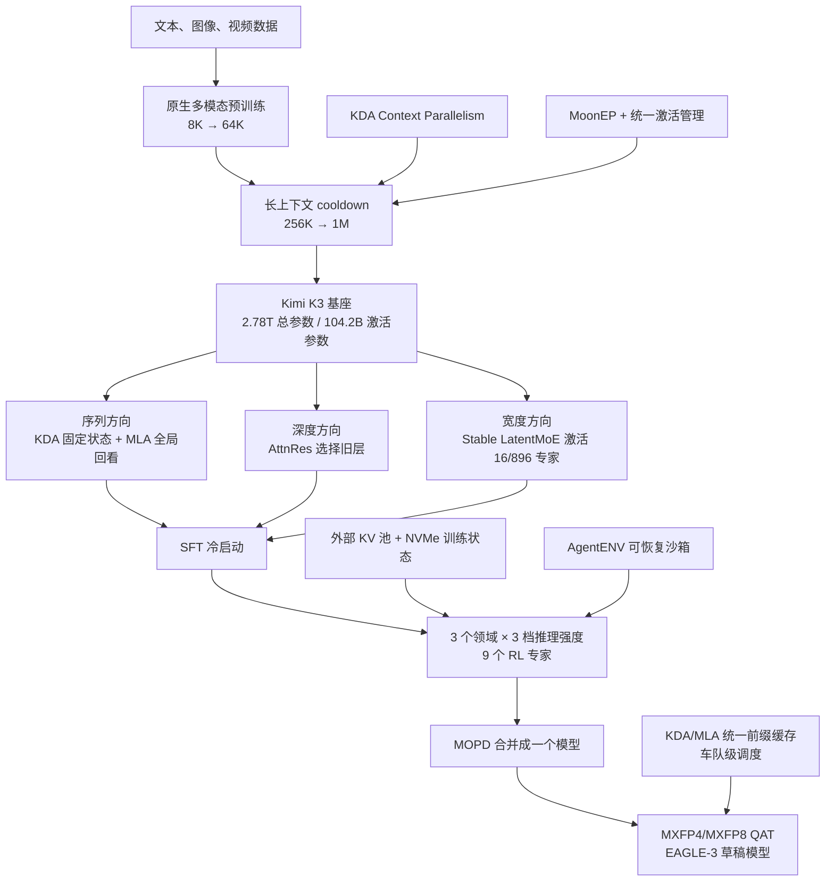
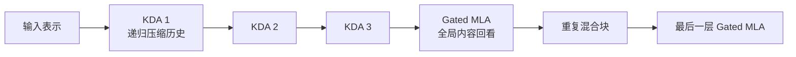
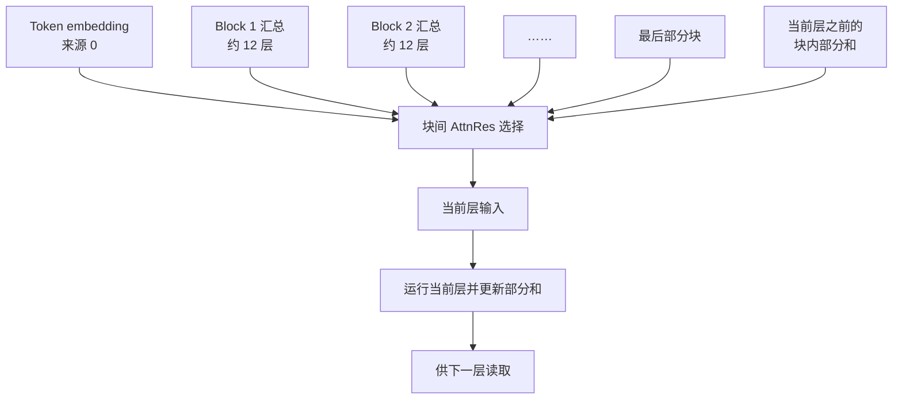
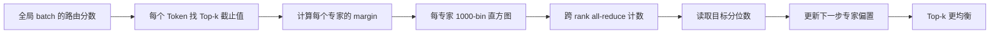
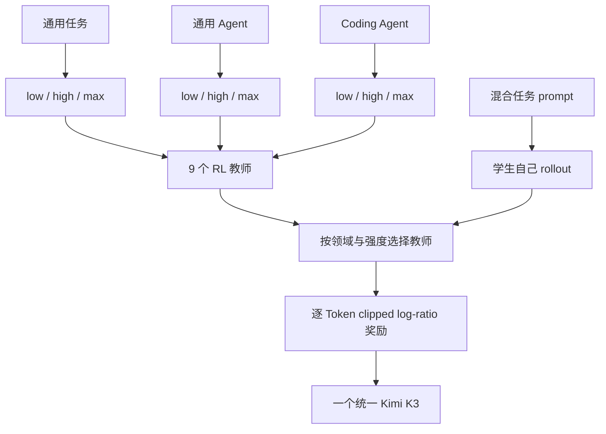
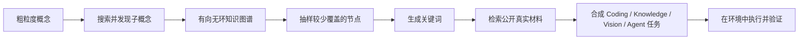
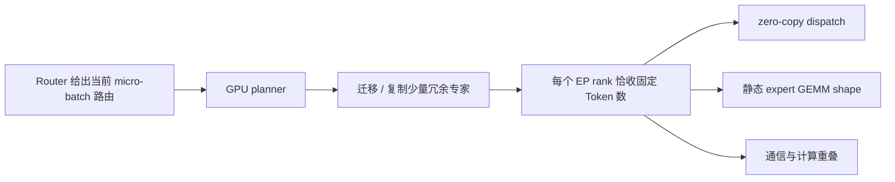
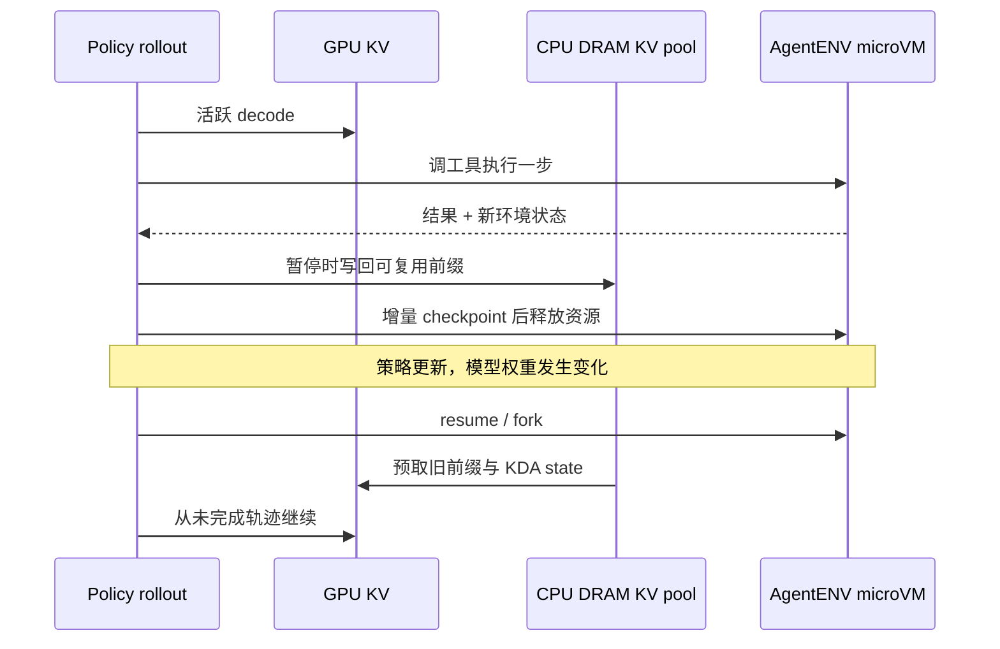
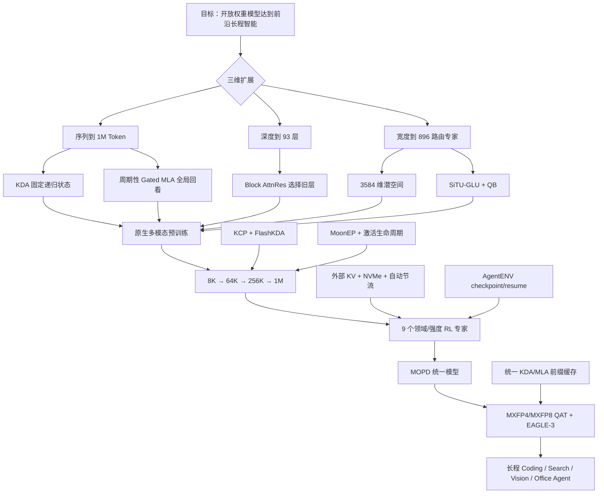

# Kimi K3：把序列、深度和宽度一起扩成一个系统

> 本文依据 Kimi Team 发布的 **Kimi K3: Open Frontier Intelligence — Technical Report of Kimi K3**，即 arXiv:2607.24653v2、2026-08-07 修订版，共 47 页。页码均指 PDF 本身的页码。本地原件已从 v1 更新到 v2，并重新核对全部页码；v2 的实质修订集中在 p.6 的舍入误差归因和 p.21 的 1M RL 问题定义，其余主要是日期、引用、参考文献与作者信息修正。本文会把“报告明确写了什么”“我们如何理解”与“官方外部资料补充”分开。

## 阅读前先搭一张最小地图

先认识七个会反复出现的概念：

- **Token（词元）**：模型读写内容时使用的基本小块。文字、代码、图像和视频最终都会变成 Token 序列。
- **Attention（注意力）**：当前 Token 从上下文中读取信息的机制。全注意力能看所有历史，但上下文越长，计算和缓存越贵。
- **Residual stream（残差流）**：信息穿过一层层网络的主干道。普通残差连接会把所有旧层不断压进同一个状态。
- **Mixture-of-Experts（MoE，混合专家）**：模型有许多不同的前馈网络，但每个 Token 只调用少数几个。这样可以增加总参数，而不让每个 Token 跑完全部参数。
- **KV Cache（Key-Value Cache，键值缓存）**：生成时保存已经读过的注意力中间结果，避免每一步都重算整段历史。
- **Reinforcement Learning（RL，强化学习）**：让模型实际做任务，根据结果好坏继续训练。模型做任务产生的完整过程叫 **rollout（采样轨迹）**。
- **Agent（智能体）**：不只回答一句话，而是会调用工具、读写文件、浏览网页并持续执行许多步的模型系统。

Kimi K3 最关键的名字也可以先翻成人话：

- **Kimi Delta Attention（KDA，Kimi 增量注意力）**：把很长的历史压进固定大小的递归状态，便宜地沿序列传递信息。
- **Multi-head Latent Attention（MLA，多头潜变量注意力）**：先把每个历史 Token 的键和值压成小向量，再做全局注意力。
- **Attention Residuals（AttnRes，注意力残差）**：当前层不是被动接收所有旧层的总和，而是主动选择要从哪些旧层读取。
- **Stable LatentMoE（稳定潜空间混合专家）**：让大量路由专家在较窄的潜空间里工作，再用受控激活和负载均衡避免训练失控。
- **Multi-Teacher On-Policy Distillation（MOPD，多教师同策略蒸馏）**：让一个学生在自己生成的轨迹上，分别向多个领域和推理强度教师学习。

## 一句话先说清

Kimi K3 的核心不是“做了一个 2.8T 参数、1M 上下文的大模型”。

它面对的是三个互相牵连的扩展问题：

1. **序列更长**：模型要读一百万 Token，普通全注意力和 KV Cache 会太贵。
2. **网络更深**：模型有 93 层，信息若只沿一条残差流前进，早期细节会越来越难取回。
3. **专家更宽**：模型有 896 个路由专家，每个 Token 激活 16 个；容量上去了，通信、激活值和负载失衡也会一起放大。

K3 的回答不是只发明一个算子，而是把模型结构、训练稳定性、数据、强化学习、缓存、沙箱和部署放在一起设计：

- 序列方向用 **3 层 KDA + 1 层 Gated MLA**，在固定状态与全局回看之间分工；
- 深度方向用 **AttnRes**，让层能够回读较早的表示；
- 宽度方向用 **Stable LatentMoE**，在较窄潜空间激活更多专家；
- 训练侧用 **原生视觉、Per-Head Muon、渐进式长上下文和九个 RL 专家**；Per-Head Muon 会按注意力头分别整理大矩阵的更新方向；
- 系统侧用 **KDA 并行、MoonEP、外部 KV 池、可恢复沙箱和统一前缀缓存**；MoonEP 负责让专家并行设备获得严格均衡的工作量；
- 部署路径从 **Supervised Fine-Tuning（SFT，监督微调）** 开始就加入 **Quantization-Aware Training（QAT，量化感知训练）**，并专门训练用于投机解码的 EAGLE-3 草稿模型。

报告称这些架构、数据和训练改进合在一起，相比 Kimi K2 获得约 **2.5 倍 scaling efficiency（缩放效率）**。这是拟合 scaling law 后的整体结果，不是某个组件的单独加速，也不是端到端训练吞吐提高 2.5 倍。（PDF p.10–11）

最值得记住的主线是：

> **当序列、深度和专家宽度一起扩张时，信息怎么流动就不再只是模型结构问题。它会一路决定训练如何并行、RL 状态放在哪里、缓存怎样复用、沙箱如何暂停，以及线上请求怎样调度。**

## 先看全景：三维信息流如何接到训练和服务

这张图根据报告 Figure 2、Figure 8、Figure 11 和 Figure 12（PDF p.3、13、19、23）重画，只表达机制连接，不是实测时间或流量比例。

## 第一组矛盾：一百万 Token 既要便宜，也不能失去全局联系

### 为什么不能只用一种注意力

普通全注意力让每个 Token 都查看前面的所有 Token。它擅长精确找远处内容，但比较量会随序列长度近似平方增长，KV Cache 也会一直变大。

递归式线性注意力走另一条路：把历史不断写入固定大小的状态。它的内存不会随序列无限增长，但历史被压缩后，模型很难像全注意力那样直接回到某个具体 Token。

K3 没有在两者中二选一。它把 96 个注意力层排成重复的混合块：

- 连续 3 层 KDA，负责便宜地传播长序列状态；
- 接 1 层 Gated MLA，负责不受限的全局内容交互；
- 主干最后再加 1 层 Gated MLA，确保最终输出经过一次全局注意力。

因此全模型是 **69 层 KDA + 24 层 MLA**，比例约为 3:1。（PDF p.4、11）

这张图根据报告 Figure 2 与 §2.1（PDF p.3–4）重画，是层序机制示意，不表示各层耗时相同。

### KDA：把历史压进固定状态

**Kimi Delta Attention（KDA）** 是一种带遗忘门的 delta-rule recurrence（增量规则递归）。先只看一个注意力头，它维护矩阵状态 $S_t$：

$$
S_t=(I-\beta_t k_tk_t^\top)\operatorname{Diag}(\alpha_t)S_{t-1}
    +\beta_t k_tv_t^\top,
\qquad
\tilde{o}_t=S_t^\top q_t
$$

这里：

- $I$ 是不改变状态的单位矩阵；
- $\alpha_t$ 是逐通道保留率，决定旧状态每一维留下多少；
- $\beta_t$ 决定当前 Token 写入多强；
- $k_t$ 标记写到状态的哪个方向，$v_t$ 是写入内容；
- $q_t$ 从状态中读出当前需要的信息。

第一项先遗忘旧内容，再沿当前 key 方向擦除会冲突的部分。第二项写入新内容。状态大小由 head 维度决定，不随 Token 数继续长大。（PDF p.4，式 1）

这不等于“所有历史都无损保留”。固定状态本身就是压缩。K3 用周期性 MLA 补回直接访问全局 Token 的能力。

### 下界衰减：数值范围先决定能不能用 Tensor Core

KDA 训练时不会按 Token 一个个串行跑。它把序列切成 chunk，chunk 内并行，chunk 之间传递状态。问题在于：并行公式会使用累计保留率的倒数。如果许多很小的 $\alpha$ 连乘，倒数可能溢出。

Kimi Linear 的 log-decay（对数衰减）没有下界。K3 改成：

$$
g_t=g_{\min}\operatorname{Sigmoid}(e^{A}z_t),
\qquad
\alpha_t=e^{g_t},
\qquad
g_{\min}=-5
$$

这样每一步都有 $\alpha_t>e^{-5}\approx6.7\times10^{-3}$。在 16 Token 小块中，累计 log-decay 落在 $(-80,0)$，倒数小于 $e^{80}$，仍在 bfloat16（BF16，16 位脑浮点格式）的动态范围内。（PDF p.5，Figure 3、式 5）

收益不是一句“更稳定”这么简单。范围有界后，原来必须逐位置特殊处理的对角块，也能改用密集 Tensor Core 矩阵乘法。也就是说，参数化方式直接消掉了一个 kernel 慢路径。

代价是衰减率不再能任意接近零。模型不能在单步中把某个通道彻底忘掉。这是用可控数值范围换硬件友好执行。

K3 还把 KDA 输出门从低秩改为输入相关的 full-rank gate（全秩门），并在 head-wise Root Mean Square Normalization（RMSNorm，按头均方根归一化）后逐通道控制输出。这样每个 Token 可以决定哪些读出通道应该通过。（PDF p.5，式 6）

### Gated MLA：隔几层做一次真正的全局回看

**Multi-head Latent Attention（MLA，多头潜变量注意力）** 不保存每个注意力头完整的 Key 和 Value。它先把当前 Token 压成低维向量 $c_t=W_cx_t$，缓存 $c_t$，需要时再上投影成各头的 Key 和 Value。

这仍然是全局注意力，所以缓存会随序列增长，只是每个 Token 的缓存更小。K3 给 MLA 加了一个输入相关、逐通道、全秩的输出门：

$$
y_t=W_o\left[\operatorname{Sigmoid}(W_gx_t)\odot\tilde{o}_t\right]
$$

门让当前 Token 决定全局注意力输出的哪些通道值得进入残差流。（PDF p.5–6，式 7）

所有 MLA 层都使用 **No Position Encoding（NoPE，无显式位置编码）**。它们的 Query 和 Key 不加 Rotary Position Embedding（RoPE，旋转位置编码）等显式位置编码。相邻 KDA 层通过递归衰减提供位置敏感和新近性信息，MLA 只负责按内容做全局交互。（PDF p.5）

这让上下文扩展不必重调 RoPE 频率，但不能推成“完全不需要长上下文训练”。K3 仍然用 256K 到 1M 的课程让模型适应真正的长距离任务。（PDF p.12）

报告还说，训练时保留 32 位浮点数（FP32）注意力输出，以修正 Flash Attention 中已被前人指出的有偏舍入误差。FP32 输出 tile 会让片上占用翻倍，因此团队重排训练 kernel，让它与 KV staging buffer 重叠，而不是与 Query tile 重叠。（PDF p.6）这再次说明：更高精度不是独立开关，必须连同共享内存布局一起改。

### 这组设计可以迁移什么

可以直接迁移的不是“3:1 一定最好”，而是两条原则：

1. **便宜的压缩记忆与昂贵的精确回看可以分层出现。** 日志 Agent、视频模型和长期记忆系统都可以让大部分层做递归或压缩，只让少数层做全局读取。
2. **先把数值范围写进参数化，再设计 kernel。** 若算子因为极端值不得不保留特殊分支，限制参数范围有时比继续优化特殊分支更有效。

但 KDA 的固定状态只属于 KDA 层。整个 K3 仍有 MLA 层，其 KV Cache 会随上下文增长。把 K3 简化成“1M 上下文固定显存”是错误的。

## 第二组矛盾：网络更深后，旧层信息不能只靠不断相加

### 普通残差流是一条会越来越拥挤的路

标准残差连接把每一层输出加到同一个状态里。经过很多层后，当前层只看到“所有过去层已经混在一起”的结果，不能明确选择某个早期层。

**Attention Residuals（AttnRes，注意力残差）** 把注意力的思想从序列搬到深度。当前层有一个可学习 pseudo-query（伪查询），把旧层输出当成 Key 和 Value，再选择性加权：

$$
\alpha_{i\rightarrow l}
=\frac{\exp(q_l^\top\operatorname{RMSNorm}(k_i))}
{\sum_{j<l}\exp(q_l^\top\operatorname{RMSNorm}(k_j))},
\qquad
h_l=\sum_{i<l}\alpha_{i\rightarrow l}v_i
$$

$q_l$ 是当前层的伪查询，$k_i$ 和 $v_i$ 来自第 $i$ 个旧层表示，$\alpha_{i\rightarrow l}$ 是当前层分给旧层的读取权重。RMSNorm 防止某层只因幅度更大就垄断权重。于是当前层能说“我更需要第 5 层和第 20 层的表示”，而不是只能接受平均混合。（PDF p.6，式 8–9）

完整 AttnRes 要保留所有旧层输出。算术量在不足 100 层时还能接受，但显存与跨 pipeline stage 通信会从 $O(Ld)$ 增长。

K3 使用 **Block AttnRes（分块注意力残差）**：把层分成约 8 个块，每块约 12 层。块内只维护逐层累加的部分和，块间才做完整注意力。把 embedding 也算作来源后，共有 9 个块级来源。（PDF p.6）

这张图根据报告 Figure 2 与式 10（PDF p.3、6）重画，是信息路径示意。块内表示是累加的部分和，不是另跑一次注意力。

这样显存和跨 stage 通信从 $O(Ld)$ 降到 $O(Nd)$：$L$ 是总层数，$N$ 是块数，$d$ 是隐藏维度。块间结果可以并行算，块内部分和顺序推进，再用 online softmax 合并。报告的 case study 中，经过 K3 自己的 kernel 优化，AttnRes 运行时间从 **283.6 ms 降到 114.4 ms**；这是一项指定图形处理器（Graphics Processing Unit，GPU）kernel 任务的结果，不是整模型延迟下降比例。（PDF p.24、33）

### 深度检索的边界

AttnRes 扩大的是“访问旧层”的自由度，不是免费的新容量：

- 仍要保存块级表示；
- pipeline parallelism（流水线并行）下仍会跨 stage 传信息；
- 线上 prefill 和 decode 需要两类不同 kernel；
- 报告没有给出 K3 全尺寸上逐组件消融，不能知道 AttnRes 独立贡献了多少最终分数。

可迁移的启发是：深层网络里，信息瓶颈不只存在于 Token 之间，也存在于层之间。若模型总要在后层恢复早期边缘、语法或工具状态，可以尝试让深度方向也具备受控检索，而不是只增加残差宽度。

## 第三组矛盾：896 个专家带来容量，也会带来失控的激活与通信

### 先把“总参数”和“每 Token 成本”分开

Kimi K3 有 **2.78T 总参数**，但每个 Token 只激活约 **104.2B 参数**。它有 896 个 routed experts（路由专家），每 Token 选择 16 个，另有 2 个 shared experts（共享专家）始终工作。模型共 93 层、hidden dimension 7168、96 个注意力头，词表 160K。（PDF p.11，Table 1）

104.2B 激活参数不等于“与 104.2B 稠密模型成本完全相同”。路由、专家通信、稀疏 kernel、共享专家与参数存储仍有额外代价。

### LatentMoE：公共路径保持全宽，专业路径先变窄

普通 MoE 会把完整的 $d$ 维 Token 表示发给每个选中专家。若同时激活更多专家，通信和专家权重读取几乎一起增加。

**LatentMoE（潜空间混合专家）** 把路径拆开：

- shared experts 在完整宽度上做公共变换；
- routed experts 先把 $d=7168$ 压到潜空间 $\ell=3584$，在潜空间里由 16 个专家处理，再投影回完整宽度。

核心可简写为：

$$
u=\sum_{i\in\mathcal{T}(x)}p_iE_i^{\text{routed}}(W_{\downarrow}x),
\qquad
y=\sum_{j=1}^{2}E_j^{\text{shared}}(x)
  +W_{\uparrow}\operatorname{RMSNorm}(u)
$$

$\mathcal{T}(x)$ 是被选中的 16 个专家。RMSNorm 放在潜空间汇总与上投影之间，防止 routed path（路由路径）的尺度直接冲击 full-width shared path（全宽共享路径）。（PDF p.6–7，式 11）

896/16 意味着路由专家池相对每次激活约有 **56 倍稀疏度**。容量很大，但每个专家看到的数据更少，负载波动也更危险。（PDF p.6）

### SiTU-GLU：不是截断激活，而是给两个分支都加软上限

潜空间路由路径连续经过下投影、门控前馈、上投影，接近四次矩阵乘法。报告说在 2.8T 规模下，这条链会产生 exploding internal activations（内部激活爆炸）。

SwiGLU 的两个乘法分支都可能无界。K3 改成 **Sigmoid Tanh Unit GLU（SiTU-GLU，Sigmoid-Tanh 单元门控线性单元）**：

$$
\operatorname{SiTU\text{-}GLU}(x)
=\left[\beta_1\tanh\left(\frac{W_gx}{\beta_1}\right)
\odot\operatorname{Sigmoid}(W_gx)\right]
\odot
\left[\beta_2\tanh\left(\frac{W_ux}{\beta_2}\right)\right]
$$

$W_gx$ 是门控分支，$W_ux$ 是内容分支，$\odot$ 表示逐元素相乘。K3 取 $\beta_1=4,\beta_2=25$，所以每个输出坐标的绝对值小于 $\beta_1\beta_2=100$。（PDF p.7–8，Figure 4、式 12；证明见 PDF p.43）

它在原点附近近似 SwiGLU，只有数值变大时才平滑饱和。与 hard clipping（硬截断）相比，软上限在边界外仍保留非零梯度。

这项技巧很适合迁移到长乘法链：若多个无界分支最终相乘，只在最后裁剪已经太晚。更稳的办法是在每个分支保持常用区间近似不变，同时给极端值设置平滑上限。

### Quantile Balancing：直接求“每个专家应该进多少 Token”

896 个专家要做 expert parallelism（专家并行）。若某些专家很热门，对应 GPU 会排队；其他 GPU 空闲。传统辅助损失只能间接鼓励均衡，还可能干扰主任务。

K3 使用 **Quantile Balancing（QB，分位数均衡）**。路由器仍按原始 score 计算混合权重，但在 Top-k 选择时给每个专家加偏置 $b_j$。关键是，$b_j$ 不通过梯度学习，而是从全局 batch 中该专家的分数 margin（边际）分位数直接更新：

$$
\hat b_j^{(t+1)}
=-\operatorname{quantile}_{1-k/n}
\left(s_{:,j}-\alpha^{(t)}\right),
\qquad
b^{(t+1)}=\hat b^{(t+1)}-\operatorname{mean}(\hat b^{(t+1)})\mathbf{1}
$$

$n$ 是专家数，$k$ 是每 Token 选中的专家数，$m$ 是全局 batch 的 Token 数，$\alpha$ 是每个 Token 的 Top-k 截止分数。直观上，热门专家的门槛被抬高，冷门专家的门槛被降低，让每个专家接近目标负载 $mk/n$。（PDF p.8–9，式 13–14；推导见 PDF p.43–44）

精确收集几百万个 margin 太贵。实践中每个专家维护 **1000 个 bin 的直方图**，跨 rank 只 all-reduce 计数，再从累计计数找分位数。报告称估计误差通常只有几乘 $10^{-3}$，通信成本低于交换原始 margin 的 1%。（PDF p.9、45）

偏置在下一训练步才生效，避免当前 batch 用自己算出的门槛；推理时偏置冻结。它只改变“选谁”，不改变最终混合权重，也不需要在推理时继续算分位数。（PDF p.9）

这张图根据报告 Figure 5、Algorithm 1 与附录 D（PDF p.8、44–45）重画，是训练期路由更新示意。推理时不会循环更新偏置。

### 稳定宽度扩展不是一个组件

Stable LatentMoE 的“Stable”来自三件事共同作用：

1. 在 $W_{\uparrow}$ 前对路由汇总做 RMSNorm；
2. 用 SiTU-GLU 限制长乘法链中的极端激活；
3. 用 QB 直接控制专家负载。

只搬走其中一个名字，不能假设会得到同样效果。报告也没有公开三者在 2.78T 模型上的完整拆分消融。

## 原生视觉：不要先训练好两颗脑，再强行把它们接起来

很多多模态模型先训练语言模型和视觉编码器，再做对齐。K3 选择从预训练第一天就让语言与视觉共同学习同一个 next-token prediction（下一 Token 预测）目标。

文本、图像和视频被放进同一上下文。图像先经过 **MoonViT-V2**，再用轻量 Multilayer Perceptron（MLP，多层感知机）投影器送入语言主干。渲染结果与生成它的代码也处于同一 Token 流中，所以模型可以写界面、看截图，再继续修改，不需要把视觉任务转交另一套模型。（PDF p.9–10）

### 为什么视觉编码器从零训练

Kimi K2.5 的做法是用 Sigmoid Loss for Language-Image Pre-training（SigLIP，使用 Sigmoid 损失的图文预训练模型）初始化编码器。K3 报告观察到：把预训练视觉编码器接到 Large Language Model（LLM，大语言模型）后联合训练，vision-tower gradient norm（视觉塔梯度范数）长期更高，并经常出现 spike。

MoonViT-V2 改为从零开始，用同一个下一 Token 目标训练。Figure 6 显示它的梯度更低、尖峰更少。报告还说，它在视觉评测上与 SigLIP 初始化基线相当。（PDF p.9）

这里的结论是“训练更稳，并且最终匹配基线”，不是“从零训练在视觉分数上显著胜过 SigLIP”。报告没有给出所有下游任务的逐项消融表。

### 视觉路径怎样控制 Token 数

MoonViT-V2 有 **401M 参数、27 层、patch size 14、12 个注意力头**。它使用 RMSNorm，并移除线性层与注意力投影中的 bias，以帮助从零训练稳定。（PDF p.10–11）

图像和视频共享全部参数。视频注意力拆为空间的帧内注意力和时间的帧间注意力，再沿时间做 pooling（池化）。进入语言主干前，$2\times2$ pixel shuffle（像素重排下采样）把视觉 Token 数降为四分之一。这样最高 **3584×3584 像素** 的输入仍能放进 1M 上下文。（PDF p.10）

可迁移的原则是：原生多模态不是简单地“更早加图像”。它要求视觉目标、数值尺度、Token 压缩与语言主干同时设计。若接入现成 encoder 会让联合训练不稳，从零共同训练可能更干净；但只有在数据规模和训练预算足够时，这个选择才现实。

## 预训练：报告公开了路线，却没有公开总账

### 数据覆盖什么

文本数据分四个主要领域：

- Web Text（网页文本）；
- Code（代码）；
- Mathematics（数学）；
- Knowledge（知识）。

每个领域都使用规则过滤、分类器质量评分和去重。采样率由小模型消融决定。知识与数学语料还沿用 Kimi K2 的 rephrasing（改写）流程：从不同风格与视角重写，按块自回归生成，并与来源做忠实度核验。（PDF p.10）

视觉数据包括 caption（图文描述）、交错图文、Optical Character Recognition（OCR，光学字符识别）、感知、视频和视觉编程。定位监督同时使用绝对坐标与归一化到 $[0,1]$ 的坐标。程序化多模态数据把代码与渲染结果配对，覆盖 Scalable Vector Graphics（SVG，可缩放矢量图）、3D 资产、网页、游戏和 Computer-Aided Design（CAD，计算机辅助设计）图。（PDF p.10）

这些类别说明了能力从哪里来，但报告没有公开：

- 预训练总 Token 数；
- 四类文本与视觉数据的占比；
- 各来源清单、许可证和污染检查结果；
- 合成数据与真实数据比例；
- 最终去重阈值与过滤器参数。

因此不能从“2.8T 参数”反推训练了多少 Token，也不能把报告中的数据类别当成可复现 recipe。

### Scaling law：必须分别给不同学习率曲线调参

K3 的 scaling study（缩放规律研究）不只改模型大小。它重新搜索 batch size、learning rate、tokens-per-parameter ratio（TPP，每参数 Token 数）和模型形状。

一个值得迁移的实验习惯是：团队比较 cosine decay（余弦衰减）与 Warmup-Stable-Decay（WSD，预热—稳定—衰减）时，没有强迫两者共享同一组超参数。报告发现它们的最佳峰值学习率与 batch size 明显不同；分别搜索后，cosine 的最终 loss 更低。（PDF p.10）

这避免了常见的伪比较：拿为 A 调好的超参数去跑 B，然后宣布 A 更强。

Figure 7 给出 K2 与 K3 的拟合曲线，报告称 K3 的整体 scaling efficiency 约提高 **2.5 倍**。（PDF p.11）图中没有给出足够细的轴值让读者重建拟合，也没有拆出 KDA、AttnRes、MoE、数据和优化器各自贡献。

### 模型配置与训练 recipe

| 项目 | Kimi K3 | 与 Kimi K2 的主要变化 |
|---|---:|---:|
| 总参数 | 2.78T | +167% |
| 每 Token 激活参数 | 104.2B | +220% |
| 层数 | 93 | +52% |
| 隐藏维度 | 7168 | 不变 |
| LatentMoE 维度 | 3584 | K2 无此层 |
| 每专家隐藏维度 | 3072 | +50% |
| 路由专家 | 896 | +133% |
| 每 Token 激活路由专家 | 16 | +100% |
| 共享专家 | 2 | +100% |
| 注意力头 | 96 | +50% |
| 稠密层 | 1 | 不变 |
| MTP 层 | 1 | 不变 |
| 训练上下文上限 | 1M | 8 倍 |

表中数字来自报告 Table 1（PDF p.11）。**Multi-Token Prediction（MTP，多 Token 预测）** 是让模型额外预测更远 Token 的训练头；报告只在配置表和后续 EAGLE-3 初始化中提到 1 层，没有展开其预训练损失权重。

公开的优化设置很简洁：

- matrix parameter（矩阵参数）使用 Muon；
- 同时沿用 Kimi K2 的 weight clipping（权重裁剪）；
- MoE 用 QB 均衡；
- 学习率用 cosine schedule，前 **1%** 线性 warmup；
- weight decay（权重衰减）始终为 **0.1**。（PDF p.11）

报告没有公开峰值学习率、batch size、梯度裁剪阈值、训练步数、硬件数量、训练时长、总 FLOPs 和总成本。

### Per-Head Muon：不同注意力头不要抢同一个归一化尺度

**Muon（MomentUm Orthogonalized by Newton-Schulz，动量经 Newton-Schulz 迭代正交化）** 是用于二维权重矩阵的优化器。它先积累 momentum（动量），再用 Newton-Schulz 迭代把矩阵更新方向近似正交化。

K3 对 Q、K、V 投影进一步使用 **Per-Head Muon（按头 Muon）**。它不把完整投影矩阵当成一个大块，而是沿 head 维度切开，每个注意力头单独做正交化。（PDF p.10）

原因是：若所有头共享一次全矩阵归一化，梯度或动量较大的头会主导方向，小尺度头得不到充分归一化。按头处理让更新尺度更均衡，而且细长的小矩阵比完整大矩阵的 Newton-Schulz 迭代略便宜。

这不是把注意力头完全独立训练。前向网络、损失和其他参数仍然耦合。它只改变 Q/K/V 动量矩阵的正交化单位。

### 1M 不是一步拉长，而是四阶段课程

预训练先从 **8K** 上下文开始，随后扩到 **64K**。cooldown（训练末期的低学习率收尾阶段）再从 **256K** 扩到 **1M**。（PDF p.12）

长文档和长视频会包含近重复、二进制片段、截断文件、坏日志和重复帧。K3 使用精确与模糊去重、视频 perceptual hash（感知哈希）、规则与分类器过滤、结构验证。真正连贯的长样本稀少，所以 cooldown 会对它们上采样。（PDF p.12）

但“长度长”不代表必须利用远处信息。团队还把多模态文档和子任务精心打乱、拼接，合成长任务，让答案依赖散布在整段 1M 上下文中的证据。这样模型不能只靠局部模式过关。（PDF p.12）

所以 NoPE 只解决“位置编码参数怎样外推”。渐进课程和长距离任务合成解决的是“模型有没有真正学会跨很远使用信息”。两者不能混为一谈。

可迁移的做法是：把最昂贵的超长序列集中到训练后期的小部分预算，并用任务依赖关系验证模型确实需要远程证据。若只是把短样本拼成很长的 padding，训练成本会上升，长程能力未必会出现。

## 后训练：先把能力分开练，再在学生自己的轨迹上合并

K3 的后训练分三步：

1. Supervised Fine-Tuning（SFT，监督微调）建立 Agent 冷启动；
2. 在不同领域和推理强度上分别做 RL；
3. 用 MOPD 把九个专家合并回一个模型。（PDF p.12）

### SFT：统一轨迹格式比多收一批答案更重要

SFT 数据扩大了复杂 Agent 任务覆盖。轨迹由之前的 Kimi 领域模型合成，再经过多阶段验证和 human-in-the-loop annotation（人在环标注）。（PDF p.12）

所有数据使用 **eXtensible Token Markup Language（XTML，可扩展 Token 标记语言）** 模板序列化。它把消息边界、thinking、response、tool call 和 tool result 写成明确的保留 Token，让低层模型不必猜 JSON 字符串的边界。（PDF p.12、46–47）

模板还支持：

- 全局选项，如 reasoning effort、tool choice 和 response format；
- 每次请求的输入选项，不污染历史 KV Cache；
- 会话中动态加载工具；
- 同一消息里并行发出多个 tool call；
- preserved thinking（保留思考历史）与只保留结果两种方式。

这是一个容易被忽略的系统点：当 Agent 训练跨许多工具与 harness（执行框架）时，模板本身就是接口协议。格式不稳定会把本应学习的任务行为污染成解析错误。

### 九个 RL 专家：领域与推理预算交叉

K3 不为每个 benchmark 单独训练模型，而是划分三个大领域：

1. **通用任务**：一般体验、视觉、推理、忠实性、搜索、知识工作；
2. **通用 Agent**：长程助理、深度研究、长文写作；
3. **Coding Agent**：软件工程、代码体验、kernel、网页开发。

每个领域再训练 low、high、max 三档 reasoning effort（推理强度），合计 **3×3=9 个专家模型**。（PDF p.12–13）

Figure 8 显示随着 RL FLOPs 增加，多个内部任务的分数整体提高，但曲线有波动，且没有公开每条曲线的任务样本、置信区间或最终 FLOPs 数值。（PDF p.13）它支持“继续加 RL 计算仍有效”，不等于九类能力同比例增长。

### Partial rollout：长轨迹不必等全部完成再更新

长程 Agent 的一个 batch 可能有快有慢。若一定等最慢轨迹完成，GPU 会空等。

K3 扩展 partial rollout（部分采样）方案。对 $N$ 个 prompt 各采样 $K$ 条轨迹。当完成比例达到 $\lambda$ 时就暂停生成，把已完成轨迹送去策略更新；未完成轨迹进入队列，在下一轮继续。（PDF p.13）

因为轨迹暂停期间模型参数已经更新，续跑数据会带一点 stale off-policy（陈旧离策略）偏差。K3 的 RL 算法本身容忍这种偏差，并加入只在局部邻域生效的逐 Token 正则。报告没有给出该正则的完整公式、阈值和权重，所以不能据此复现。

### Reasoning Effort RL：把预算写进任务，而不是靠提示词祈祷

每个问题有初始 Token 预算 $b_0(x)$，再用随训练增加的 multiplier $\tau$ 扩展。通用任务按 thinking Token 数计成本；Agent 任务还会计算工具 Token 和工具调用次数。超过动态阈值 $b_0(x)\tau$ 的轨迹奖励直接设为 $-1$。（PDF p.13）

训练从预算较宽的 max 模型开始，再逐步缩紧，得到 low 与 high。这样推理强度不是上线时简单截断，而是在训练中学到的预算条件。

### GRM：开放题需要看过程，也要防止靠变长刷分

不可自动验证的通用任务使用 **Agentic Generative Reward Model（Agentic GRM，智能体生成式奖励模型）**。它不只输出一个分数，而是按 rubric（评分标准）做过程化判断：理解要求、逐项分析、给出分数表，再汇总总体分。（PDF p.13）

生成式评审容易偏爱更长答案。K3 加入从冷启动模型估计的平均长度 $\ell_0$ 和倍数 $\sigma$；若候选长度超过 $\sigma\ell_0$，就失去基于比较得到的额外奖励。报告没有公开 $\sigma$、rubric 数据与 GRM 本身规模。

### MOPD：学生必须在自己会走到的地方学

九个专家能力最终要回到一个模型。K3 使用 **Multi-Teacher On-Policy Distillation（MOPD，多教师同策略蒸馏）**：

- 每个 domain 与 effort 由对应教师指导；
- prompt 从所有专家训练过的任务中采样；
- response 由当前 student policy（学生策略）自己生成；
- 每个生成 Token 上，比较教师与学生对这个 Token 的概率。

报告的逐 Token 奖励是：

$$
r_{\text{opd}}^{d}
=\operatorname{clip}\left(
\operatorname{sg}\left[
\log\frac{\pi_{\text{teacher}}^{d}(y_t\mid x,y_{<t})}
{\pi_{\theta}(y_t\mid x,y_{<t})}
\right],-R_{\max},R_{\max}
\right)
$$

$d$ 指当前领域与推理强度所选择的教师，$x$ 是 prompt，$y_{<t}$ 是第 $t$ 个 Token 之前的生成前缀，两项 $\pi$ 分别是教师和学生给已采样 Token 的概率。$\operatorname{sg}$ 表示 stop-gradient（停止梯度），$\operatorname{clip}$ 防止概率比极端值支配更新。（PDF p.13–14，式 15）

它的重点是 on-policy：学生在自己实际会生成的状态上向教师学习，减少离线蒸馏中“训练时见到教师轨迹，部署时却走进学生自己的陌生状态”的落差。

但这不是 DeepSeek-V4 那种完整词表 reverse-KL 蒸馏。K3 报告只给出已采样 Token 的 log probability ratio。报告也没有公开九个教师的 checkpoint、任务路由比例和 MOPD 训练量。

这张图根据报告 §4.1.2–4.1.3 与 Figure 8（PDF p.12–14）重画，是能力合并机制示意，不表示九个教师样本均匀分配。

## 部署不是训练结束后的压缩步骤

### 从 SFT 开始就走量化路径

**Quantization-Aware Training（QAT，量化感知训练）** 是在训练时就模拟或使用部署精度，让模型提前适应低比特误差。

K3 把 MoE 专家权重量化为 Microscaling 4-bit Floating Point（MXFP4，微缩放 4 位浮点格式），专家输入 activation（激活）量化为 Microscaling 8-bit Floating Point（MXFP8，微缩放 8 位浮点格式）；注意力投影、LatentMoE 投影、共享专家和路由器等非专家组件保持高精度。从 SFT 开始，后续 RL 与 rollout 都使用同一量化方案。（PDF p.12、14）

这样训练策略实际看到的数值路径与部署一致，避免“高精度训练很好，最后量化才掉能力”。代价是后训练从一开始就要承受量化噪声，训练 kernel 与 rollout 服务也必须支持同样格式。

报告没有给出 MXFP4 QAT 相对 BF16 后训练的独立质量表，也没有公开具体 scale 粒度。因此能确认的是训练与部署路径一致，不能确认每项任务因此提高多少。

### EAGLE-3：草稿模型要为“被接受”训练

speculative decoding（投机解码）让小草稿模型先提出多个 Token，再由大目标模型一次验证。若草稿猜得准，就能少跑多次昂贵 decode。

K3 的草稿模型使用 EAGLE-3（Extrapolation Algorithm for Greater Language-model Efficiency，面向投机解码的草稿模型）方案，基于预训练的 1 层 MTP 模块，结构与 backbone block 对齐。目标模型冻结，草稿模型训练时展开 **7 步**。它从目标模型第 1 个、第 4 个和最后一个 AttnRes block 读取低、中、高层特征，拼接后做一次 bias-free matrix（无偏置矩阵）投影。（PDF p.14）

为了让训练刚开始时不破坏原 MTP 行为，融合矩阵初始化为 $[0\;0\;I]$：先只使用最后层表示，再逐渐学会融合较早层。

传统草稿训练常用 next-token cross-entropy，但较小的 KL divergence 不保证更高的投机接受率。K3 直接最小化采样 Token 的负对数接受概率：

$$
\mathcal{L}_{\mathrm{LK}}
=-\log\sum_{x\in\mathcal{V}}\min\bigl(p(x),q(x)\bigr)
$$

$p$ 和 $q$ 分别是目标模型与草稿模型在温度 1 下的下一个 Token 分布，$\mathcal V$ 是整个词表。对每个 Token 取两边较小的概率并求和，就是两份分布真正重叠的部分；重叠越大，拒绝越少。训练不再混入额外 cross-entropy 项。（PDF p.14，式 16）

草稿模型也使用专家权重 MXFP4、输入 MXFP8 的后训练量化配置。换句话说，低精度不是最终导出格式，而是整个推理加速链的一部分。

可迁移的启发是：代理模型、检索器或草稿模型应该针对系统真正关心的决策指标训练。若线上目标是“候选被接受”，只优化平均分布距离可能绕了一圈。

## 强化学习要先有环境，不能只靠更多 prompt

RL 的效果受两个瓶颈限制：任务是否多样，以及结果是否能可靠验证。K3 因此把环境与任务合成写成后训练的一部分，而不是附属数据管线。

### Unified White-Box RL Environment：同一任务换不同执行框架

单一 agent harness 容易让模型记住某套工具名、system prompt 和交互协议。**Unified White-Box RL Environment（统一白盒强化学习环境）** 把工具接口、系统提示、上下文管理和交互协议拆成可组合模块。

它能实例化 Kimi Code、Claude Code、Codex、OpenClaw、Hermes 等主流 harness，也能创建新组合。训练时，同一任务组会动态抽取不同配置。（PDF p.14–15）

目的不是让模型背更多 Application Programming Interface（API，应用程序接口），而是逼它学习跨接口不变的能力：读任务、规划、检查结果和恢复失败。报告没有公开完整模块清单与采样概率，因此不能判断每种 harness 覆盖是否均衡。

### 知识图谱引导任务合成：先选空白，再找材料出题

随机抓网页很容易反复采到热门主题。K3 先建一个从粗到细的 knowledge graph（知识图谱）：节点是概念，边是层级关系。Agent 对节点多轮搜索，再决定是否扩出更细的新节点。边始终从粗概念指向细概念，形成有向无环图。（PDF p.15，Figure 9）

真正出题时，系统先抽一个概念节点，再取关键词，从 arXiv、Wikipedia 和代码仓库等公开材料中检索真实内容。最后选择任务类型，把材料合成为 coding、knowledge、vision 或 agent-core 任务。（PDF p.15）

这张图根据报告 Figure 9（PDF p.15）重画，是数据合成流程示意，不代表各领域样本比例。

最可迁移的一点是把“覆盖面”显式建模。先知道知识空间哪里稀疏，再生成数据，比不断向现有分布追加热门样本更容易补长尾。

### 可验证任务：把最终结果与中间进度都暴露出来

报告列出多类可验证 Agent 任务：（PDF p.15–17）

- 多步信息搜索：研究、收集证据、生成带引用报告；
- 系统复现：根据自然语言要求重建黑盒系统；
- kernel 优化：正确性与性能都能自动测；
- 金融分析：计算、写作和工具使用组合；
- 个人助理与自动化：操作网页、日历、邮件和文件；
- 软件工程与网页开发：运行测试或比较可见结果。

Figure 10 的摄像机维修管理系统复现任务不仅看最终页面，还把标准化工具调用进度画成 completion curve。K3 完成率为 **100%**，报告中的 Opus 4.8 为 91.8%、GPT-5.6 为 89.3%、Kimi K2.6 为 56.0%。（PDF p.17）这是一个代表案例，不是整个系统复现分布的平均成功率。

这种环境设计的价值在于：长任务不只有“最后过/不过”。如果能观察中间可验证里程碑，reward 更密，失败也更容易定位。

## 3T 预训练的基础设施：模型结构决定通信形状

K3 的预训练同时面对 KDA 递归、AttnRes 深度状态、896 专家和原生视觉。报告使用 Pipeline Parallelism（PP，流水线并行）及 virtual pipeline stages（VP，虚拟流水线阶段）、Expert Parallelism（EP，专家并行）、Zero Redundancy Optimizer 1（ZeRO-1，零冗余优化器第一阶段）数据并行、Pipeline ZeRO-2 梯度分片、Context Parallelism（CP，上下文并行）等组合。（PDF p.18–19）

这些不是一张固定拓扑表。真正重要的是每个新模块怎样改变通信量与内存生命周期。

### KDA 的两种并行：设备内分段与设备间 KCP

KDA 的递归状态依赖前一个 Token，GPU 却偏好大批量并行。训练和 prefill 使用 FlashKDA chunkwise kernel：chunk 内用 Tensor Core 并行，chunk 间传播状态。单设备超长序列还会在 Streaming Multiprocessor（SM，流式多处理器）之间做 context parallel scan，先独立算每段转移，再合并出精确初始状态。（PDF p.17–18）

跨设备时，普通线性注意力可以直接求前缀和；KDA 的遗忘与 delta update 会让每段输出依赖进入该段的状态。**KDA Context Parallelism（KCP，KDA 上下文并行）** 因此把每个片段先表示成两个可组合对象：

- $M$：片段对进入状态做了什么线性转移；
- $\widetilde S$：从零状态进入时，片段自己写入了什么。

把第 $i$ 段对状态的作用写成仿射变换 $F_i(S)=M_iS+\widetilde S_i$。相邻两段可以这样合并：

$$
F_j(F_i(S))
=M_jM_iS+\left(\widetilde S_j+M_j\widetilde S_i\right)
$$

这个合并满足结合律，所以可以做 prefix scan（前缀扫描）。每个 rank 可以只用本地 Token 先算 $M_i$ 与 $\widetilde S_i$。一次 fixed-size all-gather（固定大小全收集）后，各 rank 独立重建自己的进入状态。通信大小不随序列长度增加。（PDF p.18，式 17）

这条思路很通用：如果一段序列对状态的作用能写成可结合的 transition（转移）与 zero-state contribution（零状态贡献），就可以先本地压缩，再交换片段摘要，而不是交换所有 Token。

### MoonEP：先把每个 rank 的工作量变成确定值

MoE 训练常被热门专家拖慢。即使平均负载接近，某个 micro-batch 仍可能让一台机器收到更多 Token。

K3 的 **MoonEP** 允许在 rank 上放少量 redundant expert（冗余专家副本），每个 micro-batch 根据当前路由结果重新规划，把每个 rank 的输出严格控制为 $S\times K$ 个 Token。$S$ 是序列 Token 数，$K$ 是每 Token 选择专家数在每 rank 上的归一工作量。（PDF p.19）

附录证明：若有 $E$ 个专家、$R$ 个 EP rank，总能在每个 rank 至多放 $E/R$ 个冗余专家而达到完全均衡，而且该上界基本紧：

$$
M(I)=\min_P\max_r m_r(P)\le \frac{E}{R}
$$

$m_r(P)$ 是计划 $P$ 下 rank $r$ 的冗余专家数。（PDF p.45–46，式 28）

实践中不在线求整数规划最优解。团队先用离线 integer linear programming（ILP，整数线性规划）做参考，再训练一个 GPU-resident planner（驻留 GPU 的规划器）快速给出近似最优方案。（PDF p.19）

完全均衡带来几个连锁收益：

- dispatch 直接写入目标 rank 的固定位置，省掉中间 send buffer；
- DeepEP 风格路径最坏要 $S\times K\times R$ 缓冲，MoonEP 固定为 $S\times K$；
- 每个专家的输入数量在执行前已知，可以使用 static shape（静态形状）；
- 每层不再等 Central Processing Unit（CPU，中央处理器）读取计数后启动 kernel；
- expert General Matrix Multiplication（GEMM，通用矩阵乘）、通信与 shared expert 计算更容易重叠。（PDF p.19–20）

这张图根据报告 Figure 11、§5.2.1 和附录 E（PDF p.19、45–46）重画，是负载规划机制示意，不是集群拓扑或吞吐曲线。

MoonEP 已由 Kimi 官方开源，但论文中的生产 planner、硬件参数与完整训练栈不等于仓库里一定全部具备。源码复现应以具体 commit 为准。

### 内存优化不是一招 offload

K3 的统一 activation manager（激活管理器）把每个反向所需张量视为可插拔存储：保留、重计算、量化、CPU offload、远端 PP offload 都由同一抽象控制。（PDF p.20）

报告还列出多项相互配合的优化：

- MoE 反向重算 dispatch，让 permuted probability 的梯度不必保存完整输出；
- AttnRes 块表示只生成一次并驻留 GPU，跨 PP rank 的增量只传新产生的 block cache；
- 把部分激活移到其他 PP rank，平衡流水线 warmup 造成的内存不均；
- Pipeline ZeRO-2 把梯度分片并放到 CPU，避免最后一个 micro-batch 的梯度高峰；
- Muon 的 Newton-Schulz 需要完整矩阵，用 point-to-point 通信在 rank 间轮流传完整参数缓冲，而不是 all-gather 所有矩阵；
- 多模态 CP 按实际图像大小动态分配 patch，并把 ViT 计算塞进 PP bubble（流水线空隙）。（PDF p.20–21）

这些技巧的共同点是：不按“一个模型层一个生命周期”管理内存，而是按每种张量什么时候产生、什么时候最后使用、是否能重建来安排。

## 1M Agentic RL：最稀缺的不是显存，而是跨阶段可恢复状态

v2 对这一节的问题定义写得更直接：在几百张 GPU 的受限预算下做 1M 上下文 RL，长 rollout 会产生额外 Dynamic Random-Access Memory（DRAM，动态随机存取存储器）需求，与训练侧模型权重和 optimizer state（优化器状态）竞争；prefill 与 decode 的效率又依赖前缀管理和请求调度。（PDF p.21）

因此训练和 rollout colocate（共置）还不够。系统必须决定：哪种状态在 GPU，哪种在 CPU DRAM，哪种暂时放 NVMe，以及任务暂停时怎样无损恢复。

### 外部 KV 池：GPU 只留正在 decode 的块

对 1M 多步 rollout，前缀 KV miss 代价很高。partial rollout 在下一轮续跑时，最怕把长前缀重新 prefill 一遍。

K3 的 external KV cache pool（外部 KV 缓存池）使用 write-back（写回）策略：

- 正在 decode 的 block 留在 GPU KV Cache；
- 可复用但暂时不活跃的前缀，被逐出 GPU 时才写到 CPU DRAM；
- 再次使用时提前取回；
- KDA state 与 MLA KV block 对齐 offload 和 prefetch，保持两种注意力状态生命周期一致。（PDF p.21）

训练状态更大。rollout 阶段把 model weights 与 optimizer states 放到 Non-Volatile Memory Express（NVMe，非易失性内存高速协议）存储，等训练再次开始再恢复。报告没有给出 NVMe 带宽、容量和恢复时间，不能判断这一策略在不同机器上会不会成为瓶颈。

### 自动节流：序列越长，允许同时跑的请求越少

多步 rollout 开始时上下文短，可以高并发；越往后 KV 占用越大。若一直保持同样并发，后期会触发 preemption（抢占），反而让总吞吐变差。

K3 根据 KV Cache utilization 与 CPU memory pressure 等信号动态控制并发：早期放宽，后期随缓存压力收紧。（PDF p.21）

这比固定并发更适合长尾长度。可迁移到任何状态随任务进度增长的系统：并发上限应该由剩余资源和未来增长估计决定，不是启动时一次确定。

### 非策略模型借用策略模型的梯度缓冲

RL loss 还需要 reference model 等 non-policy model 前向。K3 不为它们单独长期保留一套 GPU 权重，而是把权重放 CPU，需要时加载，并复用 policy model 的 gradient buffer（梯度缓冲）作为临时存储。（PDF p.22）

配合 ZeRO-2，GPU 在不同阶段只有部分梯度块不活跃。系统在一个 Virtual Pipeline Parallelism（VPP，虚拟流水线并行）chunk 做 reference forward 时加载对应权重，同时预取下一块，把 copy 隐藏在计算后面。

这是“同一块内存在不同阶段扮演不同角色”。它依赖精确的生命周期证明，若错误复用会直接破坏梯度，因此不是简单打开一个框架选项。

### AgentENV：暂停沙箱必须比一直养着便宜

模型等待推理时，沙箱可能占整个生命周期的 **98%**，却不做有效工作。若每条暂停 rollout 都保留完整 VM，规模会被闲置内存拖垮。（PDF p.22）

K3 使用与合作方开发并开源的 **AgentENV**。它基于 micro virtual machine（microVM，微型虚拟机），目标是同时支持高隔离、可恢复和高密度：

- 增量 checkpoint 与 resume 的中位延迟分别是 **133 ms** 和 **49 ms**；
- 暂停时可释放内存与 CPU；
- fork 能从同一状态分出新沙箱，用于多候选 rollout；
- 镜像采用 lazy pulling、内容寻址存储和共享层；
- 结合 memory reclaim 与 copy-on-write，真实工作负载内存 overcommit 可达 **6.5 倍**；
- 整个 K3 训练与评测共创建 **51,219,741 个沙箱**，使用 **1,505,678 个镜像**。（PDF p.22）

这张图根据报告 §4.1.2、§5.3.1–5.3.2（PDF p.13、21–22）重画，是暂停与恢复的时序示意。箭头不代表每次工具调用都会逐出 KV，也不代表延迟按图中比例。

这部分把核心主线说得最清楚：partial rollout 只有在模型状态、KV 状态和环境状态都能恢复时才成立。少任何一层，暂停都可能变成重新计算。

## 在线服务：KDA 固定状态与 MLA 增长缓存必须共用一套边界

K3 的混合注意力让前缀缓存更复杂：

- MLA 保存随 Token 增长的 KV；
- 每个 KDA 层保存固定大小、但与精确前缀绑定的 recurrent state；
- 一个前缀只有在两种状态都能恢复到同一 Token 边界时才真正可复用。

### 两种粒度：粗物理页，细哈希索引

报告 Figure 12 的例子使用 **6144 Token 的 physical cache block（物理缓存块）**，内部包含 12 个 **512 Token 的 prefix-hash block（前缀哈希块）**。（PDF p.23）这是一张说明机制的示例，不应推成所有部署固定只用这两个数字；正文说物理页可在 1024–6144 Token 范围取值。

MLA KV 适合大页，减少分配、淘汰与拷贝开销。KDA state 若每个 Token 存一次又太贵，所以只在稀疏边界 checkpoint，通常与 conversation-turn boundary（对话轮次边界）对齐。

若新请求前 **2800 Token** 与缓存匹配，而最近的 KDA checkpoint 在 $B=2560=5\times512$，系统会：

1. 从包含该位置的物理页 copy-on-write 恢复 MLA；
2. 恢复 $B$ 处所有 KDA 层状态；
3. 从 $B$ 继续 prefill，而不是从 0 重算。

同一物理页中，MLA 可以复用到更细的 hash 边界；KDA 必须退回最近 checkpoint。把两种粒度解耦，既保留大页效率，又不会把 KDA checkpoint 密度强行绑在大页上。（PDF p.23–24）

### 并发一致性比命中率更难

请求同时共享前缀时，缓存不仅要“查得到”，还要保证所有 KDA 层与 MLA 层指向同一逻辑 Token：

- cache group 先注册，再对齐分配；
- head request 可以在必要时锁住相关块；
- 共享块只读，局部写入走 copy-on-write；
- 只有所有 KDA group 都有对应 checkpoint，恢复点才有效；
- eviction 使任一组 checkpoint 失效时，整组可恢复性一起失效。（PDF p.24）

论文说这些一致性断言在开发中抓到了“看似合理但类型混淆”的访问。缓存系统最危险的错误通常不是直接崩溃，而是悄悄把某层状态接到另一个前缀。

### decode kernel 必须接受“草稿可能回滚”

KDA decode 看起来是一步更新一次状态，但 speculative decoding 可能提出多个 Token，其中一部分被拒绝。如果每个草稿位置都复制完整状态，流量会爆炸。

K3 的 ReplaySSM kernel 从上一次验证状态出发，用已接受草稿的投影输入快速重建状态，再写入已验证 Token 与 bonus Token。它还把 recurrent loop 放进单个 fused kernel，减少启动开销。（PDF p.24）

Block AttnRes 分成块间与块内两阶段；Stable LatentMoE 则融合 latent down-projection、MoE router 和 shared-input computation，并让输出通信与 shared expert 计算重叠。小 batch decode 使用 token-centric WarpDecode，一个 warp 负责一个输出神经元，权重离线重排。（PDF p.24–25）

这些细节提醒我们：训练结构能算，不代表 decode 结构自然高效。特别是递归状态、投机回滚和稀疏专家同时存在时，线上 kernel 需要单独设计。

### 车队级调度：缓存局部性与故障域之间做交换

典型 coding agent 请求可能有 **400K Token 前缀，只新增约 4K Token**。命中缓存可以比重新 prefill 便宜几个数量级。但若永远把同一前缀发给固定集群，那个集群故障会影响所有相关会话。（PDF p.25）

K3 让每个 session 绑定两个 cluster：

- 主 cluster 保留缓存，做 cache-aware affinity scheduling；
- 次 cluster 不持有同一缓存，主集群故障时接管并重新 prefill；
- consistent hashing（哈希一致性）把 session 均匀分配，减少故障影响集中。

线上请求长度从不到 2K 到 1M，每请求成本跨度约 **三个数量级**。系统按请求类别分配独立 resource budget（资源预算），避免少量超长请求拖垮所有普通请求的 time-to-first-token 与 Service-Level Objective（SLO，服务级别目标）。（PDF p.25）

这里可迁移的不是“两集群”这个固定数字，而是两个原则：缓存亲和性要与故障隔离共同设计；准入控制要按成本类别分预算，不能把极短与极长请求放在一个无差别队列里。

## 评测先看条件，再看排行榜

### K3 用的是什么推理设置

主表中 Kimi K3 全部使用 max reasoning effort，temperature 为 1.0。无工具的单步任务通常设 top-p=0.95；Agent 任务设 top-p=1.0。对照模型通常也用最大推理强度，GPT-5.5 例外，使用 xhigh。（PDF p.25–26）

这个设置回答的是“每个模型在高预算下能做到什么”，不是“默认聊天模式谁更快、更便宜”。K3 的 low/high 档没有在主表逐项列出。

不同任务还有不同 harness：

- coding 模型可能使用 Kimi Code、Claude Code 或 Codex；
- Terminal-Bench 2.1 报告的是 K3 在多个 harness 中的最好值；
- SWE-Marathon 在 H20 上每题最多 20 小时，且 Claude Fable 5 的 fallback 模型与官方不同；
- 浏览任务通常在 300K Token 后压缩上下文；
- BrowseComp 另做 1M 原生上下文、无 context management 的实验，得分 **90.4%**；
- OfficeQA Pro 直接把整套 PDF 渲染成图像，不提供机器可读文字；
- 部分视觉 benchmark 既报不用 Python，也报允许 Python 工具的结果。（PDF p.26）

这些差异不一定不公平，但意味着表中分数是“模型 + 推理预算 + harness + 工具”的系统结果。

### 公开 benchmark：强项在长程 Agent，弱项也很清楚

下面只摘能代表边界的结果，完整数值见报告 Table 2（PDF p.27）。

| 能力 | Kimi K3 代表结果 | 怎样理解 |
|---|---:|---|
| 学术推理 | GPQA Diamond 93.5 | 接近最高的 GPT-5.6 Sol 94.1 |
| 研究级难题 | HLE-Full 43.5；带工具 56.0 | 带工具明显更强，但低于 Claude Fable 5 的 53.3/63.0 |
| 批判思考 | CritPt 23.4 | 明显低于 Claude Fable 5 的 28.6 与 GPT-5.6 Sol 的 32.3 |
| 软件工程 | DeepSWE 67.5 | 低于 Claude Fable 5 的 70.0 与 GPT-5.6 Sol 的 73.0 |
| 程序推理 | ProgramBench 77.8 | 表中最高，领先幅度很小 |
| 终端任务 | Terminal-Bench 2.1 88.3 | 接近 GPT-5.6 Sol 的 88.8 |
| 长程 SWE | SWE-Marathon 42.0 | 表中最高，但任务设置包含极长时限与 harness 差异 |
| 搜索 Agent | BrowseComp 91.2；DeepSearchQA 95.0 | 两项均为表中最高 |
| 工具调用 | MCPMark-Verified 94.5 | 表中最高 |
| 电脑操作 | OSWorld 2.0 58.3 | 低于 Claude Fable 5 的 66.1 |
| 办公 Agent | OfficeQA Pro 63.3 | 低于 Claude Fable 5 的 69.9 |
| 视觉问答 | OmniDocBench 91.1；Video-MME 90.0 | 两项均很强 |
| 细粒度视觉 | MMVU 82.1；WorldVQA 51.0 | 分别低于 90.5 与 56.7 的最佳对照 |

主表支持的稳妥结论是：K3 在浏览、深度搜索、工具调用、部分 coding 和多模态任务上进入前沿，尤其擅长长程 Agent；但在 CritPt、HLE、复杂视觉、OSWorld 和办公任务上仍有明显领先模型。（PDF p.27–28）

报告自己也在摘要和结论中承认，整体性能仍落后于最强的 Claude Fable 5 与 GPT-5.6 Sol。（PDF p.1、34）

### 内部评测：比公开榜更接近产品，也更难独立核验

K3 还维护 coding experience、general agent experience 和 conversational experience 三类内部集。（PDF p.28–30）

较强项目包括：

- Deep Research Bench 90.0，表中最高；
- Swarm Bench 76.3，表中最高；
- Knowledge Work Vision Bench 64.7，略高于对照；
- CLIF Bench 52.4，略高于对照；
- Kimi Webdev Bench 对 Claude Opus 4.8 的 blind judging 总体是 **58.6% win、13.8% tie、27.6% lose**，净胜 31.0 个百分点。（PDF p.29–30）

仍落后的项目也不少：

- MIRA 64.1，低于 Claude Fable 5 的 72.9；
- Agentic Vision Bench 58.3，低于 Fable 5 的 81.1；
- 24/7 ClawBench 2.0 为 48.3，低于 GPT-5.6 Sol 的 52.0；
- Agent Behavior Bench 65.0，低于 GPT-5.6 Sol 的 76.4；
- Chat All-in-One 85.2，低于 Fable 5 的 88.0。（PDF p.29–30）

这些评测更像真实工作，但题目、rubric、拒答处理和完整原始输出没有公开。最稳妥的说法是“报告中的内部评测显示”，不能把它们当作独立复现结论。

### 网络安全：能力结果本身也是风险信号

报告把 cyber security 分两级。（PDF p.30–31）

**Tier 1：漏洞发现。** 模型检查近期版本的真实系统和开源项目，必须提供可复现证明。经人工审核，约 **70%** 的发现被确认真实，其中包括 **6 个开源项目中的 16 个此前未知漏洞**。（PDF p.30）

**Tier 2：端到端 exploit。** 共 36 个任务，16 个用户态、20 个 Linux kernel。K3 完成 **14/36，即 38.9%**；GLM-5.2 完成 8/36，即 22.2%。K3 的 14 个成功中有 10 个来自用户态，kernel 任务仍是主要瓶颈。报告估算人工完成整套任务约需 540 个 expert-hours。（PDF p.30–31）

失败常来自四类问题：难以从已知 primitive 串成完整 exploit chain、缓解措施下策略选择差、调试循环很长却没有新证据、最终交付前验证不足。（PDF p.31）

英国 AI Security Institute 与美国国家标准与技术研究院（National Institute of Standards and Technology，NIST）旗下的 Center for AI Standards and Innovation（CAISI，AI 标准与创新中心）联合评估给出另一条边界：K3 在 ExploitBench 为 **32% 对 24%**，在 32 步模拟企业网络中平均完成 **17 步对 11 步**，但 41 个端到端 exploit 任务上，两者都 **0 次** 实现任意代码执行。（PDF p.31）

作者明确把这次评估称为 capability lower bound，并说会随模型版本更新重新评估。这里既不能把 0/41 解读成“没有危险”，也不能从漏洞发现率直接推断现实攻击成功率。任务沙箱、访问权限、目标选择和人工复核都会改变结论。

### 第三方评测：快照日期很重要

截至 2026-07-23，报告汇总的第三方结果包括：（PDF p.31–32，Table 5）

- Artificial Analysis Intelligence Index v4.1：57.1，580 个条目中第 4；
- Vals AI Index：74.7，39 个模型中第 2；
- WebDev Arena：Elo 1678，99 个模型中第 1；
- Text Arena：Elo 1486，200 个模型中第 8；
- Agent Arena：9.1，37 个模型中第 4。

排行榜会更新，且报告把同一模型的若干 effort 版本有时合并计算。本文只把它们当作发布时快照，不声称是今天的实时名次。

### 成本曲线比单一最高分更有产品意义

报告用每任务美元成本比较四套 coding 与 agent benchmark。（PDF p.31–32，Figure 13）

- Kimi Code Bench 2.0：K3 比 Claude Fable 5 低 4 分，但成本约为其 **38%**；high effort 已接近 Opus 4.8 max，成本约三分之一。
- BrowseComp：K3 以 **$2.03/题** 得到 91.2%，约为 GPT-5.6 Sol 90.4% 成本的一半，并比两个 Claude max 配置便宜约一个数量级。
- GDPval-AA v2：K3 距 GPT-5.6 Sol 不到 50 Elo，成本约为其 **13%**，并比 Fable 5 便宜约 2.6 倍。
- AA-Briefcase：K3 排第二，低于 Fable 5，成本约为后者一半。

这些价格来自 2026-07-23 的公开定价与报告内部运行统计。它们受 token 用量、缓存计费、工具成本和当时 API 价格影响，不是永久不变的硬件效率指标。

## Case studies：证明“能端到端做事”，但不是消融实验

报告最后给出六类代表案例。（PDF p.33–34）

### GPU kernel 优化

在统一沙箱和 24 小时预算下，模型独立优化 AttnRes、DeepSeek Sparse Attention（DSA，DeepSeek 稀疏注意力）、KDA 与 MLA：

- AttnRes 从 283.6 ms 降到 114.4 ms；
- DSA 与 KDA 运行时间分别降低 **55.1%** 和 **73.6%**；
- MLA 达到硬件峰值 FLOPs 的一半以上。

在这些任务上，K3 匹配 Claude Fable 5，并明显高于 Opus 4.8、GPT-5.6 Sol 和 GPT-5.5。（PDF p.33，Figure 14）这是指定 kernel、硬件和时间预算下的相对结果，不代表所有 Compute Unified Device Architecture（CUDA，NVIDIA 的 GPU 编程平台）优化任务。

### 编译器与训练系统

K3 开发了 MiniTriton：一个面向 NVIDIA L20 的小型 Triton-like 编译器，带 tile-level Python 前端、轻量 Multi-Level Intermediate Representation（MLIR，多层中间表示）优化、Parallel Thread Execution（PTX，NVIDIA GPU 的中间指令）生成和两卡 distributed primitive。报告称在代码生成 benchmark 上，几何平均性能约为 PyTorch eager 的 **190 倍**、torch.compile 的 **15 倍**，大形状下接近 cuBLAS 的 90%。（PDF p.33–34，Figure 15）

它还让 GPT 模型学习 MiniTriton：从约 32 个样例合成任务，过滤到 7 万条，并用 p32 reference 训练，再测试能否适配不同精度。（PDF p.33）这些是模型生成与系统实现共同构成的案例，不是纯语言模型考试。

### 芯片、科研、知识工作与视频

- 芯片设计：在约 48 小时内设计并验证一颗对应 KDA/NoPE-MLA/AttnRes/Block AttnRes 的 nano-model Application-Specific Integrated Circuit（ASIC，专用集成电路）原型。报告给出的 4 mm² 原型为 100 MHz、超过 8700 token/s、1.46M standard cells、0.277 MiB Static Random-Access Memory（SRAM，静态随机存取存储器），并使用 4 位整数（INT4）的 Multiply-Accumulate（MAC，乘加）阵列。（PDF p.33）
- 科研复现：为 L-Love-Q 天体物理问题读 20 多篇论文、交叉核验结果、实现 300 多个方程，写 3000 多行 Python，并约两小时生成交互 HTML dashboard。（PDF p.34）
- Kimi Work：围绕 42 年 AI ASIC 史做 120 轮迭代，阅读 87 份季度报告和 99 份原始 PDF，合计超过 11,000 页，并发起 2800 多次网页搜索与 1100 多次 terminal query。（PDF p.34）
- 视频编辑：生成 3Blue1Brown 风格架构说明，并把 56 个源片段剪成 teaser，迭代处理字体、音频、布局与镜头。（PDF p.34）

这些案例帮助理解“长上下文 + 工具 + 视觉”如何组合，却主要由发布方自己挑选和叙述。它们不能替代成功率分布、失败样本和可重复实验。

## 报告没有告诉我们的事

K3 Technical Report 很长，但离完整复现还有明显距离：

- 没有预训练总 Token 数、数据配比、完整来源和污染检查；
- 没有峰值学习率、batch size、训练步数、GPU 数、训练时长和总成本；
- 没有 KDA、AttnRes、Stable LatentMoE、原生视觉、Muon 与数据变化的全尺寸独立消融；
- 没有 KDA 69 层、MLA 24 层及 3:1 配比的搜索过程；
- 没有 QB、SiTU-GLU 和 Per-Head Muon 在最终模型上的单独收益；
- 没有九个 RL 专家的数据量、reward 权重、partial-rollout 正则细节和训练算力；
- 没有公开 GRM、完整 rubric、$\sigma$、推理预算函数 $b_0(x)$；
- 没有 MOPD 教师 checkpoint、路由概率与各领域采样权重；
- 没有 QAT 的 scale 粒度、精度消融和 EAGLE-3 接受长度/端到端加速数据；
- 没有 1M RL 外部 KV 池容量、NVMe 恢复开销和车队级真实吞吐；
- 内部评测没有公开题目、原始输出、完整 judge 与置信区间；
- 网络安全评测仍是当前版本和当前任务集上的下界，不覆盖开放世界滥用风险。

报告明确承认 K3 与最强 proprietary model（闭源专有模型）仍有差距。（PDF p.1、34）它发布完整权重，降低了研究与部署门槛；但“开放权重”不自动等于训练数据、训练代码和生产系统全部可复现。

## 最值得带回自己项目的十条启发

### 1. 扩模型时先画三条信息流

序列方向问“如何记历史”，深度方向问“如何找旧层”，宽度方向问“如何分给专家”。三条都在解决选择性读取，最好一起评估，而不是分别堆组件。

### 2. 混合昂贵路径和便宜路径

KDA 保持固定状态，MLA 定期全局回看。系统不必让每一层、每一步都拥有同样高的访问能力。把昂贵能力放在少数关键位置，常比把所有层做成折中方案更清楚。

### 3. 数值参数化可以消灭 kernel 特殊分支

给 log-decay 设置下界后，对角 tile 也能走密集 Tensor Core。算法的值域、数据布局和硬件指令应该一起设计。

### 4. 多加自由度时，同时加稳定边界

更多专家和更长乘法链扩大表达力，也扩大极端激活。RMSNorm、SiTU 软上限和 QB 负载目标分别约束尺度、值域和工作量。

### 5. 把“均衡”变成可计算目标

QB 用全局分位数决定专家门槛，MoonEP 再把每个 rank 的 Token 数变成固定值。统计均衡与执行均衡是两层问题，前者不能自动保证后者。

### 6. 长上下文数据必须制造远程依赖

长文件本身不够。只有答案确实依赖远处证据，模型才会学习长程访问。构造数据时应验证“删掉远处部分后任务是否还做得出来”。

### 7. 部署精度要进入后训练闭环

若上线必用低精度，就让 SFT、RL 和 rollout 都看见同一种量化误差。训练/服务 mismatch 往往比单独提高一位精度更伤。

### 8. 保存状态前先问它能否重建

KCP 只交换片段转移，KDA cache 只存稀疏 checkpoint，AgentENV 存增量状态，non-policy 权重复用梯度缓冲。昂贵系统首先应该寻找“恢复所需的最小充分状态”。

### 9. 可恢复性必须跨模型、缓存和环境

partial rollout 不是暂停一个 Python 协程。模型版本、KV/KDA 状态和沙箱状态要指向同一时刻，任何一层错位都会让轨迹不可用。

### 10. 能力、成本和风险要分开报告

最高分回答能力上限，每任务成本回答产品可用性，网络安全评测回答潜在风险。把三者压成一个“模型更强”会丢掉最重要的决策信息。

## 用一张图重新串起全文

这张图综合报告 Figure 2、8、10–12 与 §2–§6（PDF p.3、13、17–25）重画，是全文因果关系示意，不是论文原始实验图。

## 关键词回看

- **KDA**：用逐通道衰减与 delta rule 把历史写进固定大小状态。
- **Lower-bounded decay**：给对数衰减设下界，限制累计缩放范围并消掉 kernel 慢路径。
- **Gated MLA**：压缩每 Token 的 KV，并用全秩门控制全局注意力输出。
- **NoPE**：MLA 不用显式位置编码，位置与新近性主要由 KDA 提供。
- **AttnRes**：让当前层像做注意力一样选择旧层表示。
- **Stable LatentMoE**：潜空间路由专家、归一化上投影、SiTU 与 QB 的组合。
- **SiTU-GLU**：在原点附近近似 SwiGLU，在大值处平滑封顶。
- **QB**：从全局 margin 直方图读分位数，更新下一步 Top-k 路由偏置。
- **Per-Head Muon**：按注意力头分别正交化 Q/K/V 动量矩阵。
- **MOPD**：学生在自己的 rollout 上，由九个领域/强度教师提供逐 Token 信号。
- **MXFP4/MXFP8 QAT**：从 SFT 开始就使用部署低精度的后训练路径。
- **EAGLE-3**：从多层特征训练的投机解码草稿模型，直接优化接受概率。
- **KCP**：把序列片段压成 transition 与 zero-state contribution，再做固定大小通信。
- **MoonEP**：用冗余专家和 GPU planner 让每个 EP rank 工作量严格相等。
- **AgentENV**：可快速 checkpoint、resume 与 fork 的高密度 microVM 沙箱。
- **KDA-aware prefix cache**：让 MLA KV 与 KDA checkpoint 在同一 Token 边界恢复。

## 最后的判断

Kimi K3 最有价值的地方，不是它同时列出了很多新名词，而是这些名词真的接成了一条因果链。

KDA 让长序列状态可压缩，Gated MLA 保留周期性全局回看；AttnRes 让深层网络不必把旧信息全部挤进一条残差流；Stable LatentMoE 让更多专家在较窄空间工作，同时用软上限与分位数控制稳定性。

这些结构一旦放大，训练系统就必须接手：KCP 把递归变成片段摘要通信，MoonEP 把路由波动变成静态工作量，统一激活管理器安排每块内存的生命周期。到了 1M Agentic RL，模型状态又必须和外部 KV、NVMe 训练状态、可恢复沙箱一起暂停和续跑。上线时，KDA 与 MLA 的两种缓存还要共享边界，量化和草稿模型则早在 SFT 阶段就进入训练闭环。

它的边界同样清楚：核心训练总账没有公开，许多收益没有全尺寸独立消融，内部评测难以复现，最强 proprietary model 仍领先，网络安全能力也带来新的风险。

如果只记一句话，可以记：

> **规模扩大后，真正要扩的不是参数数字，而是信息、状态和工作量在模型与系统之间被准确传递的能力。**

## 资料与阅读边界

- 原始依据：本地 `papers/Moonshot/Kimi-K3.pdf`，Kimi K3 Technical Report，arXiv:2607.24653v2，2026-08-07，共 47 页。
- 官方论文页：[Kimi K3: Open Frontier Intelligence](https://arxiv.org/abs/2607.24653)。本文页码与技术结论只以 v2 PDF 为准。
- 官方模型与说明：[MoonshotAI/Kimi-K3](https://huggingface.co/moonshotai/Kimi-K3)。模型卡可能持续更新，不能替代本文使用的固定 v2 报告。
- 官方代码入口：[MoonshotAI/Kimi-K3](https://github.com/MoonshotAI/Kimi-K3)。仓库用于核对公开实现入口；本文没有把仓库中报告未声明的实现细节冒充论文结论。
- 官方 KDA kernel：[MoonshotAI/FlashKDA](https://github.com/MoonshotAI/FlashKDA)。它是报告 §5.1 所指实现入口，复现应固定具体 commit 与硬件环境。
- 官方专家并行实现：[MoonshotAI/MoonEP](https://github.com/MoonshotAI/MoonEP)。公开仓库不自动等于论文生产训练栈完整开源。
- 官方沙箱实现：[kvcache-ai/AgentENV](https://github.com/kvcache-ai/AgentENV)。报告说明它由 Kimi 与合作方共同开发；本文中的性能数字仍只引用 PDF p.22。
- 官方案例代码：[MoonshotAI/MiniTriton](https://github.com/MoonshotAI/minitriton) 与 [MoonshotAI/nano-kpu](https://github.com/MoonshotAI/nano-kpu)。它们帮助检查案例是否有公开入口，不把单个案例外推为平均能力。
