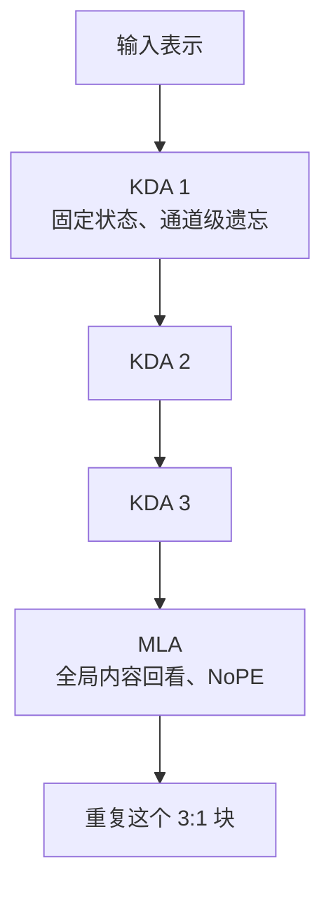
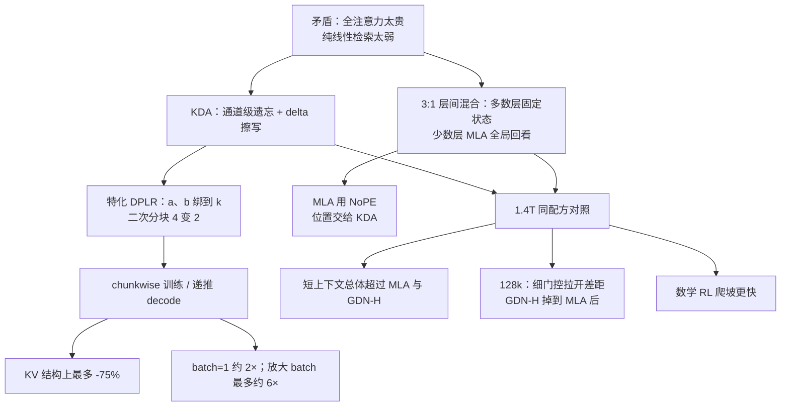

# Kimi Linear：公平对照下，线性注意力第一次全面超过全注意力

<!-- release-date: 2025-10-30 -->

> 本文依据 Kimi Team 发布的 **Kimi Linear: An Expressive, Efficient Attention Architecture**，即 arXiv:2510.26692v2、2025-11-01 修订版，共 28 页（正文与参考文献到 p.23，附录 A–D 为 p.24–28）。封面署名 Kimi Team，项目页指向 [MoonshotAI/Kimi-Linear](https://github.com/MoonshotAI/Kimi-Linear)（PDF p.1）。动笔前已核对 [arXiv 官方页](https://arxiv.org/abs/2510.26692) 与 [arXiv API](http://export.arxiv.org/api/query?id_list=2510.26692)：该论文只有 v1（2025-10-30 16:59:43 UTC）与 v2（2025-11-01 12:05:18 UTC）两个版本，**本地 `papers/Moonshot/Kimi-Linear.pdf` 就是最新的 v2**，不存在更新修订。页码均指这份 PDF 本身的页码。本文会把三件事分开写：**报告明确写了什么**、**我们如何理解它**（凡属推算、换算或图上读数都会写明）、**外部资料补充**（会给出链接并标注）。

这是一篇**架构技术论文**，不是后续基模 Kimi K3 的报告。它讲的是 Kimi Delta Attention（KDA）本身，以及一个已经发布的 48B 总参 / 3B 激活 MoE checkpoint。K3 后来对 KDA 做的改动——例如给对数衰减加下界、把输出门改成全秩——**不是本文原文内容**。若要对照，见文末「外部资料补充」里对 [Kimi K3 解读](/reports/Moonshot/Kimi-K3) 的链接。

## 阅读前先搭一张最小地图

这篇论文只盯注意力这一件事，但会借不少相邻领域的词。先把它们翻成人话。

- **Token（词元）**：模型读写内容时的基本小块。
- **Attention（注意力）**：当前 Token 决定「该参考前文哪些位置」的机制。
- **Softmax 全注意力（full attention）**：每个 Token 都和前面所有 Token 比一遍。表达力强，但比较量近似随长度平方增长，生成时还要把历史的 Key、Value 全部缓存下来。
- **Linear attention（线性注意力）**：不再保存整段历史，而是把过去压进一块固定大小的状态，每来一个新 Token 就更新这块状态。计算和显存都随长度近似线性增长，但「压进去」本身会丢细节。
- **KV Cache（Key-Value Cache，键值缓存）**：生成时把已经算过的 Key 和 Value 留下来，避免每吐一个新 Token 就重算整段历史。全注意力的缓存会随上下文一直变长。
- **RNN 有限状态记忆（finite-state RNN memory）**：线性注意力那个固定大小的状态。它像一块容量写死的白板：新内容可以覆盖旧内容，但白板不会因为文章变长而变大。
- **Mixture-of-Experts（MoE，混合专家）**：模型有许多前馈专家，每个 Token 只调用其中少数几个。这样可以做大总参数，而不让每一步都跑完全部参数。
- **Prefill 与 Decode（预填充与解码）**：读完整段提示叫 Prefill；之后逐个吐字叫 Decode。两段的硬件瓶颈不同。

这篇论文自己反复使用的名字是：

- **Kimi Delta Attention（KDA，Kimi 增量注意力）**：在 Gated DeltaNet 的 delta 更新上，把「一头共用一个遗忘率」改成「每个特征通道自己有一个遗忘率」。
- **Gated DeltaNet（GDN，门控增量网络）**：KDA 的直接前作。它已经有遗忘门，但门是标量的，一个注意力头共用一个。
- **Diagonal-Plus-Low-Rank（DPLR，对角加低秩）**：一类状态转移矩阵，等于「逐维缩放」加上「一个低秩修正」。KDA 用的是它的特化版，不是通用版。
- **Multi-head Latent Attention（MLA，多头潜变量注意力）**：先把每个 Token 的键值压成更短的向量，再做全局注意力。本文拿它当「全注意力层」来用。
- **No Position Encoding（NoPE，无显式位置编码）**：MLA 层的 Query 和 Key 不加旋转位置编码之类的显式位置信息，位置和新近性交给 KDA 去管。

## 一句话先说清

线性注意力便宜，但过去即使在短文本上也打不过 softmax 全注意力。混合架构把少数全注意力层嵌进大量线性层里，是一种折中，可是先前的混合模型规模有限，也缺少同一套配方下的全面对照。（PDF p.2）

Kimi Linear 要证明的不是「线性层可以接近全注意力」，而是更强的一句：

> **在同一套数据、同一套超参、同一个 48B / 3B 规模下，用 KDA 替换大部分全注意力层之后，短上下文、长上下文和强化学习三条线都可以超过纯 MLA 基线，同时把 KV Cache 最多降掉 75%，1M 解码最多快到约 6 倍。**（PDF p.1–2）

这句话里有两个容易被宣传稿吞掉的限定，正文必须一直带着：

1. **「公平」指的是 1.4T token 的同配方对照**，不是后来 5.7T 发布版去打 16B 的 Moonlight。
2. **赢的是「KDA + 周期性 MLA」这个混合体，不是纯线性模型。** 论文自己把长上下文检索写成纯线性注意力的首要瓶颈，所以才要混。（PDF p.6）

最值得记住的主线也在这里：

> **有限状态并不注定更弱。先把遗忘门细到每个通道，让那块固定白板真的会选该留什么；再留少数全局层去补「精确翻回某个 Token」的能力。省下来的缓存和算力，是这种分工的结果，不是把所有层都做成半吊子。**

## 「公平对照」到底公平在哪，以及那句「第一次全面超过」该怎么读

论文摘要写得很满：Kimi Linear 是 hybrid linear attention architecture（混合线性注意力架构），「for the first time, outperforms full attention under fair comparisons across various scenarios」，覆盖短上下文、长上下文和强化学习（RL）缩放。（PDF p.1）

「公平」在正文里被写成三件同时成立的事（PDF p.2、9–10）：

| 对齐项 | 论文的做法 |
|---|---|
| 规模 | 48B 总参数、3B 激活，8 / 256 专家（含 1 个共享专家），第一层是 dense、不用 MoE |
| 配方 | 同一份 1.4T 预训练数据（从 K2 语料抽样）、同一套 MuonClip 优化器、同一套 WSD 学习率日程、上下文 4096、学习率 $1.1\times 10^{-3}$、全局 batch 3200 万 token |
| 骨架 | 除了注意力模块，MLA 纯全注意力基线、GDN-H 混合基线、Kimi Linear 共用同一套其余结构 |

GDN-H 不是「纯 GDN 模型」。论文说它与 Kimi Linear、MLA 基线「share the same architecture, parameter count, and training setup」（PDF p.9）。也就是说：**GDN-H 已经是 3:1 混合骨架，只是线性层用 GDN 而不是 KDA。** 这样拆，实验其实在回答两个不同的问题：

1. **混合本身有没有用**：Kimi Linear / GDN-H 对纯 MLA。
2. **把门控从「一头一个」细到「一维一个」有没有用**：Kimi Linear 对 GDN-H。

「全面超过」也不是每一格数字都第一。正文自己点过例外：预训练的 EvalPlus 上 GDN-H 更高；SFT 的 MATH500、EvalPlus、LiveBench 不是全面领先；长上下文的 LongBench v2 和 Frames 也不是最高。（PDF p.11–12）本文按表格逐项写，不把摘要那句当成逐 benchmark 的精确声明。

还有一场**不算公平对照**的比赛，必须提前分开：附录 D 的 5.7T 发布版去比 Moonlight。两边激活参数都是 3B、token 数都是 5.7T，但总参数是 48B 对 16B，稀疏度差了约 3 倍。那是「发布 checkpoint 有多强」，不是「只换注意力」。（PDF p.10、28）

## 第一层矛盾：线性注意力为什么一直赢不了 softmax

### 全注意力贵在两处，不是一处

普通 softmax 注意力里，当前 Query 要和前面每一个 Key 打分。序列长度是 $T$ 时，这一层的比较量大致按 $T^2$ 走。生成时还要把历史的 Key、Value 留下来，缓存随 $T$ 线性变长。（PDF p.2）

论文把这个瓶颈对准一个具体场景：模型正在变成会跑很长轨迹、会调工具、会在推理期做强化学习缩放的 agent。这时候 decode 又长、KV 又大，吞吐和实时性一起塌。（PDF p.2）

### 线性注意力的旧答案：把历史写成固定状态

线性注意力不再保存 $T$ 份 KV，而是维护一块矩阵状态 $S_t$。来一个新 Token，就用它的 key $k_t$ 和 value $v_t$ 去改 $S_t$，再用当前 query $q_t$ 从 $S_t$ 里读：

$$
S_t = S_{t-1} + k_t v_t^\top,\qquad o_t = S_t^\top q_t
$$

$S_t$ 的形状由头维度决定，不随序列继续长大。这就是「有限状态」：记忆容量写死了。（PDF p.3）

可以把它想成一块白板。全注意力是把走过的每一页都复印存档，随时可以翻回第 37 页某个变量名；线性注意力是只在白板上做摘要。白板永远那么大，所以必须决定：新内容盖掉谁、哪一维该留、哪一维该忘。

### 白板不会自己收拾：从无遗忘，到 delta，再到一个标量门

论文把这条路写成三步，每一步都在补「这块白板缺什么」。（PDF p.3）

**第一步，普通线性注意力只加不减。** 它等价于对「让 $S^\top k$ 去贴紧 $v$」这个无界相关目标做在线梯度下降。结果是：最近的键值对会被不断加强，但没有「该擦掉谁」的标准，状态会无界堆积，长时间后互相干扰。（PDF p.3）

**第二步，DeltaNet 改成修正误差。** 它把目标换成重构损失：希望 $S^\top k_t$ 已经等于 $v_t$。沿着这个损失走一步，就得到经典 delta rule（增量规则）：

$$
S_t = (I - \beta_t k_t k_t^\top)S_{t-1} + \beta_t k_t v_t^\top
$$

第一项先沿着当前 key 的方向，把旧状态里会冲突的部分擦掉；第二项再写入新内容。$\beta_t$ 是这一步写得多硬。论文把它看成对「$k_t\mapsto v_t$」这张快表做一次秩 1 修正，结构上等价于广义 Householder 变换，所以后面才能做硬件友好的分块并行。（PDF p.3）

**第三步，Gated DeltaNet 给整张表加一个遗忘开关。** DeltaNet 会一直留着过时的关联。GDN 引入标量门 $\alpha_t\in[0,1]$：

$$
S_t = \alpha_t(I - \beta_t k_t k_t^\top)S_{t-1} + \beta_t k_t v_t^\top
$$

$\alpha_t$ 像加在快权重上的权重衰减：这一头的所有通道，共用同一个「旧记忆留多少」。论文说这改善了稳定性和长上下文泛化，同时保住 DeltaNet 可并行的结构。（PDF p.3）

到这里，线性注意力已经比「只加不减」像样很多。但论文认为 GDN 的门仍然太粗：一个头只有一个遗忘率，写不出 RoPE 那种「不同特征维度用不同频率」的细位置编码，也就管不好那块本就不大的 RNN 记忆。（PDF p.2、14）

## 核心设计一：KDA 把门控从「一头一个」细到「一维一个」

### 旧问题

GDN 和 Mamba2 一样，用的是 coarse head-wise forget gate（粗粒度、按头的遗忘门）：一个注意力头里，所有特征通道同生共死。（PDF p.2）

有限状态本来容量就小。如果「该忘的噪声」和「该留的线索」挤在同一个头的不同维度上，一个标量门只能做同一件事：要么一起留，要么一起扔。

### 新设计

KDA 把 $\alpha_t$ 从标量换成对角矩阵 $\operatorname{Diag}(\alpha_t)$。每个特征通道自己有一个遗忘率，论文说这类似于 Gated Linear Attention（GLA，门控线性注意力）的通道级衰减。（PDF p.2、4）

一个头上的更新是：

$$
S_t = \bigl(I - \beta_t k_t k_t^\top\bigr)\operatorname{Diag}(\alpha_t)\,S_{t-1} + \beta_t k_t v_t^\top,\qquad o_t = S_t^\top q_t
$$

式 (1) 要算的是：先按通道衰减旧状态，再沿当前 key 做一次秩 1 擦写，最后用 query 读出。（PDF p.4）

符号的人话版：

- $S_{t-1}$：这块白板到上一拍为止的内容，形状是 $d_k\times d_v$；
- $\operatorname{Diag}(\alpha_t)$：给白板的每一行（每个 key 通道）乘一个 $0$ 到 $1$ 的保留率；
- $I-\beta_t k_t k_t^\top$：只在 $k_t$ 指向的方向上做一次「先擦再写」；
- $\beta_t k_t v_t^\top$：把新内容写进去；
- $q_t$：当前要读哪一个方向。

论文在 §6.2 把同一式改写成 DPLR 的样子：$D=\operatorname{Diag}(\alpha_t)$、$a_t=\beta_t k_t$、$b_t=k_t\odot\alpha_t$。也就是说，对角衰减和低秩修正不是两套无关的花样，而是同一条 delta rule 的通道化版本。（PDF p.14）

### 工作机制：通道级遗忘，等于给有限白板加了一排独立开关

一个具体一点的例子。假设某个头的第 3 维正在记「当前函数名」，第 17 维正在记「刚刚那次失败的工具调用」。GDN 只能给这个头一个 $\alpha_t$：下一步要么两个一起淡，要么两个一起留。KDA 可以让第 17 维的 $\alpha$ 接近 0、第 3 维接近 1。论文把这叫做对有限状态 RNN 记忆做更精确的调控。（PDF p.2、4）

参数化上，KDA 并没有为这个细门控支付「再来一整层大矩阵」的代价。每个头的输入是（PDF p.5）：

- $q,k$：短卷积 + Swish，再 L2Norm，稳住特征值；
- $v$：短卷积 + Swish，不做 L2Norm；
- $\alpha$：低秩投影，秩等于头维度，再经过一个与 GDN / Mamba 同类的衰减函数 $f(\cdot)$；
- $\beta$：线性层 + Sigmoid。

实验里 $d_k=d_v=128$。（PDF p.5）衰减函数 $f(\cdot)$ 论文只说「similar to those used in GDN and Mamba」，**没有写出具体公式**。读到这里不要自行补一个 softplus 或 $e^{g_{\min}}$——后者是 K3 的后话，见文末对照。

输出侧还有一道门。KDA 算完之后，先做 head-wise RMSNorm（按头的均方根归一化），再乘一个输入相关的 Sigmoid 门，最后才投影回隐藏维度：

$$
o_t = W_o\Bigl(\operatorname{Sigmoid}\bigl(W_g^\uparrow W_g^\downarrow x_t\bigr)\odot \operatorname{RMSNorm}\bigl(\operatorname{KDA}(q_t,k_t,v_t,\alpha_t,\beta_t)\bigr)\Bigr)
$$

这道输出门是**低秩**的，论文写明是为了和遗忘门一样做公平的参数对照，并声称效果与全秩门相当，同时有助于缓解 Attention Sink（注意力汇点，少数位置吸走过多注意力质量的现象）。（PDF p.6，式 10）

### 收益

细门控的直接证据在合成任务，不在语言模型分数。2 层、2 头、头维度 128 的小模型上，KDA、GDN、Mamba2 比三件事：回文拷贝、多查询联想回忆（MQAR）、以及 64 个独立栈的 LIFO 状态跟踪。训练长度从 256 拉到 2048；另有一组固定 1024 长度看收敛速度。（PDF p.7–8，Figure 4）

图上能读到的定性结果是：

- **Mamba2** 只有乘法衰减、没有 delta rule，在这组设置里三个任务都失败。（PDF p.8）
- **回文和 MQAR** 上，KDA 随长度升高仍最高，并且明显比 GDN 更快收敛。（PDF p.8）
- **栈跟踪** 上 KDA 与 GDN 都能撑到 2048，但 KDA 收敛更快。（PDF p.7 图）

论文的解释是：细粒度衰减让模型能更精确地忘掉无关信息、保住关键记忆。（PDF p.8）这是作者对曲线的解读，不是另做的记忆探针实验。

### 代价与边界

细门控会让分块公式里出现累计衰减的除法，也就是后文 $1/\Gamma$ 那种项，数值更脆。通用 DPLR 和 GLA 的老办法是在对数域算、再做全精度的二次分块，于是半精度矩阵乘用不满，算子变慢。KDA 后面整节算法，都是在给这个更细的门「补一张能跑满 Tensor Core 的账单」。（PDF p.5）

另一个边界：固定状态再会选，也还是压缩。论文把「精确检索和精确拷贝」写成纯线性注意力过不去的坎，所以架构上必须混 MLA。（PDF p.6、17）

### 可迁移启发

对任何「容量写死、必须覆盖旧内容」的记忆——缓存行、固定槽位的会话状态、视频的压缩记忆——**遗忘的粒度应该和信息冲突的粒度对齐**。冲突若发生在通道或字段上，就不要只给整个对象一个开关。

## 核心设计二：特化 DPLR，让 chunkwise 算法既快又像经典 delta rule

### 旧问题

训练时不能真的按 Token 一个个串行更新 $S_t$。GPU 喜欢大块矩阵乘。DeltaNet 那类秩 1 更新可以打成 chunkwise（分块）算法：chunk 内部并行，chunk 之间传状态。（PDF p.4–5）

一旦衰减变成逐通道的对角，分块公式里就会出现累计衰减之比，也就是除法。通用 DPLR 的状态转移是 $D-a_tb_t^\top$，表达力够，但计算贵、不好并行；GLA 用对数域加二次分块来保精度，又把半精度矩阵乘的路堵上了。（PDF p.5、14）

所以矛盾是：**通道级门控要的精度，和 Tensor Core 要的密集半精度矩阵乘，打在同一处。**

### 新设计：不要通用 DPLR，把 $a$ 和 $b$ 都绑到 $k$ 上

通用 DPLR 写出来是 $S_t=(D-a_tb_t^\top)S_{t-1}+k_tv_t^\top$。KDA 加上约束（PDF p.14）：

$$
D=\operatorname{Diag}(\alpha_t),\quad a_t=\beta_t k_t,\quad b_t=k_t\odot\alpha_t
$$

于是它可以先抽出 $\operatorname{Diag}(\alpha_t)$ 做 GLA 式的通道衰减，再做 DeltaNet 式的 Householder 修正。论文强调：这样既减少计算，又「more consistent with the classical delta rule」——因为低秩修正的两个向量都来自当前的 $k$，而不是另学一对无关的 $a,b$。（PDF p.1、14）

### 工作机制：chunk 之间传状态，chunk 内部用 WY / UT 打包

序列切成长度为 $C$ 的块。论文复杂度分析里取 $C=64$。（PDF p.15）一个 chunk 里连续的秩 1 更新，先被收成 WY 表示（把一串 Householder 积压成更紧凑的矩阵）， auxiliary 向量 $w_t$、$u_t$ 由短递推得到；再用 UT transform 把非矩阵乘的 FLOPs 压下去，下三角逆用高斯消元的逐行前代。（PDF p.4，式 3–7）

读公式时不必一次吞下全部下标。记住两拍就够：

1. **状态怎么过 chunk。** 式 (8) 说：新 chunk 的起始状态，等于旧状态按累计衰减缩放，再加上本 chunk 写进去的内容。（PDF p.4）
2. **输出怎么算。** 式 (9) 把输出拆成「跨 chunk 的递推」和「chunk 内的并行」：前者用当前 $Q$ 去读进入本 chunk 的 $S$，后者在 chunk 内做一次带衰减的类注意力，减掉一个「伪 value」项以免把已经写进状态的东西算重。（PDF p.5）

论文把第二拍叫做 inter-block recurrent + intra-block parallel，目的就是让矩阵乘跑满 Tensor Core。（PDF p.5）

相对通用 DPLR，论文列了两笔明确的省（PDF p.15，对照 Listing 8a / 8b）：

| 省在哪 | 通用 DPLR | KDA |
|---|---|---|
| 二次分块 | 累计衰减倒数 $1/\Gamma$ 不稳定，要做二次分块；涉及 $A_{qk},A_{qb},A_{ab},A_{ak}$ 四块 | 固定 $a=b=k$，二次分块从四块减到两块 |
| 矩阵乘 | inter-chunk 和输出阶段更多的 $a,b$ 相关乘加 | 再去掉约三个矩阵乘 |

结果是算子效率相对 DPLR 大约提高 100%。Figure 2 在 batch=1、16 头、输入从 2K 到 64K 上画了两条墙钟曲线；正文把同一对照写成「nearly 2× the speed of DPLR for sequence lengths up to 64k」。（PDF p.5、15）**本文从图上读到**：64K 处 DPLR 接近纵轴上沿（标到 64 ms），KDA 大约一半。论文没有写测这段 kernel 用的是哪张 GPU。

附录 C 的伪代码里，输出阶段仍留着一行注释：`secondary chunking for numerical stability`。（PDF p.27）也就是说，KDA 并没有把二次分块彻底删光，它是把通用 DPLR 里那套更重的二次分块砍掉大半。数值稳定性在这篇论文里靠的是「少做除法 + 仍保留必要的二次分块」，**不是**给 $\alpha_t$ 加一个下界。

### 收益与代价

收益是通道级门控终于能以接近 GDN 的速度跑。后文 Figure 7a 显示：尽管衰减更细，Kimi Linear 的 prefill 延迟和 GDN-H 几乎重合。（PDF p.13）

代价有两层。第一，KDA 的表达力被论文自己对齐到「广义 DPLR」，不是更一般的 $a,b$ 自由 DPLR；它换的是和经典 delta rule 一致，以及能跑的实现。（PDF p.5）第二，chunkwise 训练和 decode 用的不是同一个 kernel：prefill / 训练走 FLOP 更重的分块核，自回归生成切回递推核（式 2）。（PDF p.15–16）

### 可迁移启发

当一个更表达的公式在硬件上逼出特殊分支（全精度二次分块、逐位置处理）时，**先问能不能用约束把公式收回到硬件喜欢的形状**，而不是把特殊分支越写越长。KDA 的约束很具体：让低秩修正的两个向量都等于当前 key。这不是普遍配方，但「用与旧规则一致的约束去换掉慢路径」这一步可以复用。

## 核心设计三：3:1 混合，以及为什么 MLA 层不用位置编码

### 旧问题：纯线性过不了检索，纯全注意力又太贵

论文把 long-context retrieval 写成纯线性注意力的首要瓶颈。（PDF p.6）相关工作里说得更直：精确记忆检索和精确拷贝仍然困难，而这正是工业级长上下文和大规模代码仓库工具调用需要的能力。（PDF p.17）

反过来说，如果每一层都做全注意力，KV Cache 按层数线性堆上去，1M decode 的显存和带宽都会先爆。

### 新设计：层间 3:1，不要层内混头

Kimi Linear 没有在同一层里把一部分头做成 KDA、一部分头做成 MLA。它选的是 layerwise hybrid（层间混合）：连续 $N$ 层 KDA，再插 1 层 Full MLA，$N=3$。（PDF p.6，Figure 3）

这张图根据 Figure 3 与 §4（PDF p.6）重画，是层序机制示意，不表示各层耗时相同，也不表示 48B 模型一共有多少层——**论文没有给出 48B 的层数**。

为什么不用 headwise（层内混头）？论文给的理由是基础设施更简单、训练更稳。（PDF p.6）为什么是 3:1 而不是 1:1 或 7:1，留给下一节消融。

MLA 层全部使用 NoPE：Query 和 Key 不加 RoPE。位置信息和 recency bias（新近性偏差）全部交给 KDA。（PDF p.6）论文还说，KDA 作为主位置算子，作用不弱于短卷积或滑动窗口注意力这类辅助件。（PDF p.6）

主干其余部分跟随 Moonlight：MoE 通道混合、共享专家加路由专家。48B 实验把稀疏度提高到 32，即 8 / 256 专家，含 1 个共享专家；第一层保持 dense。（PDF p.5、9）

### 工作机制：KDA 管「远近和位置」，MLA 管「按内容翻页」

一个有用的分工是：

- **KDA 层**像沿时间走的压缩记忆，带着通道级衰减，天然知道「多久以前」；
- **MLA 层**像不受长度 squashing 的全局索引，只问「内容像不像」，不问「离得远不远」。

所以 MLA 不必再叠一套 RoPE。论文认为这样还有两个工程好处：推理时 MLA 可以转成更高效的纯 MQA（Multi-Query Attention，多查询注意力，所有头共用一套 KV）；扩展上下文时也不用调 RoPE 的频率底或 YaRN。（PDF p.7）

输出门、短卷积仍然留在 KDA 侧。短卷积核很小（文中举例为 4），用来补局部 token 依赖；消融显示拿掉它验证困惑度会变差。（PDF p.8）

### 收益

混合的直接收益是 KV Cache。KDA 每头的状态固定为 $d_k\times d_v=128\times 128$，不随长度长；只有 MLA 层还在按 Token 存 KV。3:1 意味着大约四分之三的层不再贡献线性增长的缓存，于是论文写「最多降低 75%」。（PDF p.1–2、16）这是结构比例推出的上限，不是一篇测过实际字节数的显存报告。

质量上的收益要等 1.4T 对照。这里先记下论文自己的因果：混合是为了补检索，不是为了让线性层「看起来像 Transformer」。

### 代价与边界

混合模型**不是**「1M 上下文固定显存」。MLA 层的 KV 仍随上下文增长。把 Kimi Linear 说成常驻固定状态，是错的。

3:1 也不是理论最优。它是在一组小规模消融里，按训练 / 验证困惑度和推理开销挑出来的。（PDF p.8）论文没有在 48B 上再搜一遍比例。

NoPE 的好处（转 MQA、少调 RoPE）是论文给出的工程观察，没有单独的 MQA 速度表来支撑「转 MQA」这一句。

### 可迁移启发

**把「便宜的压缩记忆」和「贵的精确回看」分层出现，而不是每一层都做同一个折中。** 日志 agent、长视频、长期记忆系统都可以让大部分层做递归或压缩，只让少数层做全局读取。另一条是：谁负责位置，谁就应该真的有衰减或卷积；不要让全局层和局部层各带一套互相打架的位置偏差——下一节 RoPE 消融就是这个教训。

## 合成任务之后：小规模消融把 3:1、输出门和卷积钉死

消融不是在 48B 上做的。论文对着 scaling law 的第一档模型（16 头、16 层），在相同 FLOPs 和超参下比困惑度。验证集刻意选了和预训练分布差得很远的高质量数据，用来看分布外泛化。（PDF p.8，Table 1）

| 配置 | 训练 PPL ↓ | 验证 PPL ↓ | 出处 |
|---|---:|---:|---|
| 3:1（最终采用） | 9.23 | 5.65 | PDF p.8 |
| 0:1（纯 MLA） | 9.45 | 5.77 | PDF p.8 |
| 1:1 | 9.29 | 5.66 | PDF p.8 |
| 7:1 | 9.23 | 5.70 | PDF p.8 |
| 15:1 | 9.34 | 5.82 | PDF p.8 |
| 去掉输出门 | 9.25 | 5.67 | PDF p.8 |
| Swish 输出门 | 9.43 | 5.81 | PDF p.8 |
| 去掉卷积 | 9.29 | 5.70 | PDF p.8 |

论文读这张表的方式是（PDF p.8）：

- **3:1 训练和验证都最好。** 7:1 训练损失相当，但验证明显差，说明线性层再加会伤泛化；1:1 验证接近，但推理更贵；纯全注意力 0:1 两边都差。
- **Sigmoid 输出门比没门好，也远好于 GDN 用的 Swish 门。** 所以 GDN-H 基线也改用 Sigmoid，避免「门函数不同」污染对照。
- **短卷积不是可有可无。** 即使已经是混合模型，拿掉卷积仍会伤验证 PPL。

NoPE 对 RoPE 的对照不在这张 PPL 表里，而在长上下文表。Kimi Linear（RoPE）短任务接近，长上下文平均分掉到 51.8，低于 NoPE 版的 54.5，甚至略低于纯 MLA 的 52.2。（PDF p.12，Table 5）

论文给的解释是位置偏差在深度上的分配：RoPE 版里，全局 MLA 带着很强的显式相对位置，线性层只有弱的隐式位置，于是全局层过分强调短程次序——短上下文占便宜，中途再拉长上下文时就不灵活。NoPE 版把位置和新近性都交给 KDA，层与层之间更均衡。（PDF p.8–9）这是作者的机制假说，没有层间位置探针来直接验证。

## 缩放曲线：同样算力，Kimi Linear 大约值 1.16 倍 MLA

正式 48B 对照之前，论文先在 Moonlight 式 MoE 上做 Chinchilla 风格的 scaling law：激活 8 / 64 专家，Muon 优化器，上下文 4096。五档规模从 653M 到 1.7B 激活。（PDF p.9，Table 2）

| 激活参数 | 头数 | 层数 | hidden | token | 学习率 | batch |
|---:|---:|---:|---:|---:|---:|---:|
| 653M | 16 | 16 | 1216 | 38.8B | $2.006\times 10^{-3}$ | 336 |
| 878M | 18 | 18 | 1376 | 59.8B | $1.790\times 10^{-3}$ | 432 |
| 1.1B | 20 | 20 | 1536 | 85.2B | $1.617\times 10^{-3}$ | 512 |
| 1.4B | 22 | 22 | 1632 | 102.5B | $1.486\times 10^{-3}$ | 576 |
| 1.7B | 24 | 24 | 1776 | 128.0B | $1.371\times 10^{-3}$ | 640 |

MLA 五档做了超参网格搜索；Kimi Linear 固定 3:1，其余严格复用 MLA 的训练配置，不再另调。（PDF p.9）拟合结果是：

$$
\text{MLA: } 2.3092\times C^{-0.0536},\qquad \text{Kimi Linear: } 2.2879\times C^{-0.0527}
$$

图上标了 **1.16×** 的计算效率，含义是：算力最优训练下，Kimi Linear 用更少算力走到同一条 loss。（PDF p.9，Figure 5）论文同时说，若给 KDA 也仔细调超参，曲线还应更好。这是预期，不是结果。

**这 1.16× 不是 48B 训练吞吐，也不是 decode 加速。** 它只描述这五档小 MoE 的 loss–算力拟合。

## 1.4T 公平对照：短上下文、长上下文、强化学习

下面所有主结果，除非写明 5.7T，否则都是 1.4T、同配方、48B / 3B。（PDF p.10）

评测设定：温度 1.0；高方差基准报 Avg@k；基座的 MMLU、MMLU-Redux、GPQA-Diamond、C-Eval 用困惑度评测，其余用生成；GPQA-Diamond 报 8 次平均。框架是内部改过的 LM-Harness。（PDF p.10）

SFT 是多阶段：先通用指令，再加重推理。RL 数据来自数学、代码、STEM，并先筛到对当前 checkpoint 中等难度；训练中加 PTX loss（一边 RL 一边做高质量 SFT，防止通用能力塌），算法沿用 K1.5，另加 truncated importance sampling（截断重要性采样，用来缓解训练引擎和推理引擎精度不一致造成的 off-policy），并动态调 KL 惩罚和 mini-batch，避免熵崩。（PDF p.10）这些 tricks 的超参论文没有给全。

### 短上下文预训练：Kimi Linear 领先，但不是每一格

Table 3（PDF p.11）：

| 类别 | 基准 | MLA | GDN-H | Kimi Linear |
|---|---|---:|---:|---:|
| General | HellaSwag | 81.7 | 82.2 | **82.9** |
|  | ARC-challenge | 64.6 | 66.5 | **67.3** |
|  | Winogrande | 78.1 | 77.9 | **78.6** |
|  | BBH | 71.6 | 70.6 | **72.9** |
|  | MMLU | 71.6 | 72.2 | **73.8** |
|  | MMLU-Pro | 47.2 | 47.9 | **51.0** |
|  | TriviaQA | 68.9 | 70.1 | **71.7** |
| Math & Code | GSM8K | 83.7 | 81.7 | **83.9** |
|  | MATH | **54.7** | 54.1 | **54.7** |
|  | EvalPlus | 59.5 | **63.1** | 60.2 |
|  | CRUXEval-I-cot | 51.6 | 56.0 | **56.6** |
|  | CRUXEval-O-cot | 61.5 | 58.1 | **62.0** |
| Chinese | CEval | 79.3 | 79.1 | **79.5** |
|  | CMMLU | 79.5 | 80.7 | **80.8** |

MMLU-Pro 的 51.0 对 MLA 的 47.2、GDN-H 的 47.9，是 Figure 1a 里那颗红星。（PDF p.1、11）EvalPlus 是正文点名的例外：GDN-H 63.1，Kimi Linear 60.2。（PDF p.11）

### 短上下文 SFT：总体仍强，例外更多一点

Table 4（PDF p.11）：

| 类别 | 基准 | MLA | GDN-H | Kimi Linear |
|---|---|---:|---:|---:|
| General | BBH | 68.2 | 68.5 | **69.4** |
|  | MMLU | 75.7 | 75.6 | **77.0** |
|  | MMLU-Pro | 65.7 | 64.8 | **67.4** |
|  | MMLU-Redux | 79.2 | 78.7 | **80.3** |
|  | GPQA-Diamond（Avg@8） | 57.1 | 58.6 | **62.1** |
|  | LiveBench（Pass@1） | 45.7 | **46.4** | 45.2 |
| Math & Code | AIME 2025（Avg@64） | 20.6 | 21.1 | **21.3** |
|  | MATH500 | 80.8 | **83.0** | 81.2 |
|  | HMMT 2025（Avg@32） | 11.3 | 11.3 | **12.5** |
|  | PolyMath-en（Avg@4） | 41.3 | 41.5 | **43.6** |
|  | LiveCodeBench v6（Pass@1） | 25.1 | 25.4 | **26.0** |
|  | EvalPlus | **62.6** | 62.5 | 61.0 |

正文的概括是：通用任务全面领先；难数学和代码多数领先；MATH500 和 EvalPlus 是少数例外。（PDF p.11）LiveBench 上最高的是 GDN-H 的 46.4，Kimi Linear 的 45.2 低于两个基线，正文没有单独点它。

### 长上下文：KDA 细门控的差距在这里拉大

评测长度是 128k。Table 5（PDF p.12）：

| 模型 | RULER | MRCR | HELMET-ICL | LongBench v2 | Frames | RepoQA | LCA Lib | LCA Commit | 平均 |
|---|---:|---:|---:|---:|---:|---:|---:|---:|---:|
| MLA | 81.3 | 22.6 | 88.0 | **36.1** | **60.5** | 63.0 | 32.8 | **33.2** | 52.2 |
| GDN-H | 80.5 | 23.9 | 85.5 | 32.6 | 58.7 | 63.0 | 34.7 | 30.5 | 51.2 |
| Kimi Linear（RoPE） | 78.8 | 22.0 | 88.0 | 35.4 | 59.9 | 66.5 | 31.3 | 32.5 | 51.8 |
| Kimi Linear | **84.3** | **29.6** | **90.0** | 35.0 | 58.8 | **68.5** | **37.1** | 32.7 | **54.5** |

RULER 的 84.3 和 3.98× 加速，是 Figure 1a 里那颗蓝点。（PDF p.1、12）

这里有一条比短上下文更重要的层次：预训练和 SFT 阶段，论文看到的排序是 **Kimi Linear > GDN-H > MLA**；到了长上下文，GDN-H 掉到 MLA 后面，只剩 Kimi Linear 仍在最前。（PDF p.12）若「混合本身」就够，GDN-H 不该在 128k 上输给纯 MLA。输了，说明 **3:1 骨架救不了粗门控的有限状态；通道级衰减才是长上下文那一截的差额。** 这是本文对 Table 5 与 p.12 那段 hierarchy 的读法，论文没有用「门控粒度」这个词来写这句总结。

LongBench v2 和 Frames 上 MLA 更高，论文也写了。（PDF p.12）所以「长上下文全面第一」不成立，成立的是平均分和 RULER / RepoQA / MRCR 这类检索、多跳阅读。

### 数学 RL：同一套算法下，Kimi Linear 爬得更快

RL 对照只拿 Kimi Linear@1.4T 对 MLA@1.4T，数据是 K2 报告里的内部数学集，算法和超参锁死。（PDF p.12）Figure 6 三张曲线：训练集、MATH500、AIME 2025。两边起点接近，Kimi Linear 的上升更快、间隙拉大。（PDF p.12）

论文的定性结论是：在推理密集、生成很长的 RL 里，Kimi Linear 显著好于 MLA。（PDF p.12）图上没有标出最终精确分数，本文不从图上估数。

把三阶段收口，论文自己的 hierarchy 是（PDF p.12）：

1. 预训练和 SFT：Kimi Linear > GDN-H > MLA；
2. 长上下文：Kimi Linear > MLA > GDN-H；
3. RL：Kimi Linear > MLA（这一段没有报 GDN-H）。

「公平对照下第一次全面超过全注意力」，指的是这场 1.4T 同配方比赛里，Kimi Linear 在三个 regime 的总体表现都压过纯 MLA，而不是每一个子基准、也不是对历史上所有混合模型做元分析。

## 效率：75% 的 KV 和 6× 的 decode，不是同一张图上的同一个量

### 先分清三组速度数字

论文至少讲了三种「快」，混在一起就会引用错。

**第一组：结构比例带来的缓存上限。** 3:1 混合里只有约四分之一的层还在存随长度增长的 KV，于是 KV Cache「最多降 75%」。（PDF p.1–2）KDA 层仍有固定的 $128\times 128$ 状态。这是容量论证，不是 nvidia-smi 读数。

**第二组：batch=1 的延迟。** Figure 7 在 48B 同层数、同头数设定下测 prefill 总延迟和 decode 的 TPOT（Time Per Output Token，每输出 token 耗时），**明确写了 batch size = 1**。（PDF p.13）

| 长度 | Prefill 相对 MLA | Decode TPOT 相对 MLA（batch=1） | 出处 |
|---|---|---|---|
| 4k–16k | 与 MLA 接近 | 接近 | PDF p.13 |
| 128k 起 | 开始明显快 | 开始拉开 | PDF p.13 |
| 512k | 约 2.3× | 图上标 1.8× | PDF p.13，Figure 7 |
| 1M | 约 2.9× | 图上标 2.2× | PDF p.13，Figure 7 |

Kimi Linear 与 GDN-H 的 prefill 曲线几乎重合，说明通道级门控没有把 prefill 变慢。（PDF p.13）§6.3 把 Figure 7b 的 1M 加速写成 2.3×，与图上标注的 2.2× 差 0.1；本文两处都保留，当作同一张图的文字四舍五入，不另做换算。（PDF p.13、16）

**第三组：放大 batch 之后的吞吐。** Figure 1b 在 1M 上标了 **6.3×**，并给出 1.84 ms 对 MLA 的 11.48 ms；同一张图还标了 256K 的 4.8×、512K 的 5.7×。图注写明：Kimi Linear 保持低 TPOT，因而能用更大 batch，才得到这个 6.3×。（PDF p.1）摘要和引言写成「up to 6× decoding throughput」。（PDF p.1–2）§6.3 又把它叫做 long-context 下「theoretical decoding speedup of up to 6.3×」。（PDF p.16）

所以：

- **2.2× / 2.3×**：batch=1 的 TPOT 比；
- **6× / 6.3×**：省下的 KV 换成更大 batch 之后的吞吐比，且 §6.3 用了 theoretical 这个词。

论文没有给出 6.3× 那次测量的 GPU 型号、并行度和具体 batch 大小。引用时不要把它说成「单请求 1M decode 快 6 倍」。

### 复杂度公式在说什么

单头、定长、chunk $C=64$ 时，论文给的理论 FLOPs 是（PDF p.15）：

$$
\mathrm{FLOPs}_{KDA}(T;C,d_h)=6T d_h^2 + 3T C d_h + T C^2
$$

$$
\mathrm{FLOPs}_{Attn}(T;d_h)=2T^2 d_h
$$

全注意力是 $T^2$ 项；KDA 是 $T$ 乘上 $d_h^2$、$C d_h$、$C^2$ 这些与长度无关的块。混合模型里仍有四分之一层走第二式，所以端到端不会变成纯线性。论文也没有用这两式去回推 Figure 7 的实测。

### 推理策略

Prefill 用分块核，decode 用递推核。KDA 状态大小固定；随着长度变长，I/O 受限的 decode 会逼近最多 3:1 的混合效率比。（PDF p.16）这解释了为什么 batch=1 时加速停在约 2× 量级，而把省下的显存拿去加 batch，才能看到 6× 量级。

## 5.7T 发布版：有 checkpoint，但那不是同一场公平赛

最终开源的 Kimi Linear 用同一套流程继续训到 5.7T，对齐 Moonlight 的 token 数，上下文拉到 1M。（PDF p.10）附录 D 把它和 Moonlight 放在一张表里。论文自己的措辞是：3× 稀疏度加新注意力，Kimi Linear 在几乎所有基准上超过 Moonlight。（PDF p.28）

必须一起读的规格差是（PDF p.28，Table 8–9）：

|  | Kimi Linear@5.7T | Moonlight@5.7T |
|---|---|---|
| 总参数 | 48B | 16B |
| 激活参数 | 3B | 3B |
| 上下文 | 1M | Moonlight-Instruct 超过 8K 的项未测 |

所以这是「更大、更稀的 MoE + 新注意力」对「小 3 倍的 MoE + 全注意力」，不是 §5.5 那种只换注意力。挑几个发布版数字，方便对照，不把它们写回 1.4T 公平结论（PDF p.28）：

| 基准 | Kimi-Linear-Base | Moonlight-Base | Kimi-Linear-Instruct | Moonlight-Instruct |
|---|---:|---:|---:|---:|
| MMLU-Pro | 54.8 | 42.4 | 72.7 | 43.8 |
| GPQA-Diamond（Avg@8） | 40.4 | 35.2 | 71.7 | 24.7 |
| MATH / MATH500 | 58.5 | 45.3 | 94.6 | 58.0 |
| LiveCodeBench v6 | 20.0 | 14.3 | 45.7 | 11.9 |
| RULER@128k | — | — | 95.4 | — |
| RULER@1M | — | — | 94.8 | — |

Instruct 的 RULER@1M = 94.8，是论文用来支撑「1M 上下文可用」的主要数字。（PDF p.28）Moonlight-Instruct 在超 8K 的任务上是「-」，不能读成 0 分。

开源内容是：KDA kernel（脚注指向 `fla-org/flash-linear-attention` 的 `fla/ops/kda`）、vLLM 实现、以及预训练和指令微调 checkpoint。（PDF p.1）论文还说这些组件对现有全注意力流水线是 drop-in 的，不必改缓存或调度接口。（PDF p.2）**本文没有阅读这些仓库的源码，不把实现细节写成论文结论。**

## 论文怎样给 KDA 找一个「位置编码」的位置

§6.1 把 gated delta rule 写成和 RoPE 同类的乘法位置编码：Query 和 Key 之间隔了多少步，就连乘多少个转移矩阵。RoPE 的转移矩阵是正交旋转，频率按维写死；GDN / KDA 的转移矩阵是数据相关的，还放松了正交约束。（PDF p.13–14，式 11–12）

这个视角有两层用处。

第一，解释为什么 MLA 可以 NoPE：KDA 已经在扮演 RoPE 的角色，而且因为衰减可学习，论文认为它有潜力缓解 RoPE 对训练长度过拟合的外推问题。（PDF p.14）「有潜力」是原文用词，不是已证明。

第二，解释为什么门必须细到通道。RoPE 的强项正是「每一对维度一套频率」，像沿特征做非均匀傅里叶变换。GDN 一个头一个标量衰减，没有这种按维的多样性，所以才要 KDA 的 channel-wise gate。（PDF p.14）

Table 6 把 SA、RoPE、Mamba2、GLA、DeltaNet、GDN、RWKV7、KDA 等的递推式和并行式列在一起，Table 7 再从 TTT（Test-Time Training，测试时训练）的损失和更新规则对齐一遍。（PDF p.14、16）对理解 Kimi Linear 而言，不必把整表背下来。需要留下的只有：

- GLA：通道衰减，没有 delta 擦写；
- DeltaNet / GDN：有擦写，门太粗；
- KDA：两者都要，并且 $a,b$ 绑在 $k$ 上。

相关工作里，论文把线性注意力和稀疏注意力写成两条路：稀疏更擅长细粒度检索，但必须存全量 KV 才能选；线性走「压缩即智能」，配合 delta rule 在理论上可以有更强表达，检索弱的问题可以用扩状态或混合来补。（PDF p.17）它对 NSA、MoBA、DSA 的评述是定位，不是新实验。未来工作写了一句：线性和稀疏不是互斥的，可以再混。（PDF p.17）

层间混合被写成比层内混合更工程化的选择：异构头会把分布式并行和 KV 管理变复杂；固定 3:1 重复块更易接入现有优化。（PDF p.17–18）线性组件他们不用当时常见的 Mamba2，因为 KDA 在检索和拷贝上更好——依据仍是 §5.1 的合成任务，不是 48B 上对 Mamba2 的对照。（PDF p.18）

## 报告没有公开的部分

### 论文明确留下的边界

- 主公平对照只有 **一个规模**：48B / 3B。Scaling law 停在 1.7B 激活。（PDF p.9–10）
- 1.4T 是公平故事；5.7T 是发布故事。两者不能混着引用。
- 长上下文主表是 **128k**。1M 的质量数字只出现在 5.7T Instruct 的 RULER@1M = 94.8，没有 1.4T 的 1M 质量对照。（PDF p.12、28）
- RL 只报了数学 RLVR，没有代码 / STEM 的 RL 曲线；也没有 GDN-H 的 RL。（PDF p.12）
- Figure 7 的硬件、精度、是否多卡，全文没写。（PDF p.13）
- 6.3× 的具体 batch 没写。（PDF p.1、16）
- 衰减函数 $f(\cdot)$ 没有公式。（PDF p.5）
- 48B 的层数、头数、MLA 层具体下标，正文只给 3:1 比例和 $d_k=d_v=128$。（PDF p.5–6、9）

### 论文没有写、本文也不替它补的空白

- KDA 状态在服务侧如何 checkpoint、如何和 MLA KV 对齐——这是 K3 报告的系统章节，不是本篇。
- 没有 KDA 层数搜索曲线，只有 Table 1 那五档比例的 PPL。
- 没有把 ShortConv、输出门、NoPE 在 48B 上再消融一次。
- 没有报告训练端到端吞吐、墙钟时间、GPU 数和成本。
- 没有把「drop-in、不必改缓存接口」做成一次迁移实验，只是声明。（PDF p.2）
- 附录 B 给出了 WY 形式的归纳证明，但没有数值误差表来说明二次分块还要留多少。

### 不要从 K3 或仓库倒灌回来的内容

下面这些**不是** Kimi Linear 原文，即使它们后来变成了事实：

- 对数衰减下界 $g_{\min}=-5$，以及因此能把对角块改成密集 Tensor Core；
- 输出门从低秩改成 full-rank；
- 69 层 KDA + 24 层 MLA、FlashKDA、KDA Context Parallelism、统一前缀缓存。

这些见 [Kimi K3 解读](/reports/Moonshot/Kimi-K3) 对应章节，是后续基模报告对 KDA 的改动。本篇的输出门明确是低秩的（PDF p.6）；数值稳定靠减少二次分块，而不是给 $\alpha$ 加下界（PDF p.15、27）。

Hugging Face 上的 `config.json` 会写出具体层号。那是权重仓库里的实现，**不是论文表格**。本文未把仓库实现读成论文结论。

## 可迁移启发

### 1. 公平对照要先锁三件事：规模、配方、骨架

Kimi Linear 真正可引用的胜利，来自 1.4T、同 MoE、同优化器、同数据的三方赛，而不是 5.7T 对 Moonlight。做架构结论时，先问：是不是只换了被研究的那一块。

### 2. 有限记忆的遗忘粒度，要对齐冲突粒度

标量门便宜，但会强迫一个头里的不同通道同生共死。缓存淘汰、槽位记忆、压缩状态都可以问同一句：冲突发生在对象级还是字段级。

### 3. 用与旧规则一致的约束，去换掉硬件慢路径

KDA 不是把 DPLR 实现写得更聪明，而是把 $a,b$ 绑回 $k$，让公式重新靠近经典 delta rule，从而少做二次分块和矩阵乘。公式约束有时比 kernel 分支更有效。

### 4. 混合比例是验证集和推理开销一起选的，不是「线性层越多越好」

7:1 训练损失可以和 3:1 打平，验证已经变差。（PDF p.8）压缩层加到伤害泛化为止，再把剩下的预算给全局层。

### 5. 位置编码不要两套系统各写各的

RoPE 版混合在长上下文上输给 NoPE 版，论文归因为全局层和线性层的位置偏差不匹配。（PDF p.8–9、12）谁负责「远近」，就让它独占位置；全局层可以只负责内容。

### 6. 报加速时把「结构上限 / batch=1 延迟 / 放大 batch 的吞吐」拆开

75%、2.2×、6.3× 在这篇论文里不是同一个测量。任何「快了 N 倍」都应带上：测的是什么、batch 多大、对照谁、是否理论值。

### 7. 线性和稀疏可以以后再混，但先不要指望一种机制包办检索和压缩

论文把检索弱写成线性的结构限制，用少数 MLA 补，而不是把 KDA 状态无限制做大。（PDF p.6、17）先分工，再考虑把稀疏选择器嵌进去。

## 用一张图重新串起全文

这张图是本文对全文逻辑的归纳，不对应论文中的任何一张图。

## 关键词回看

- **KDA**：通道级对角遗忘 + 沿当前 key 的 delta 擦写，读出再经低秩 Sigmoid 门。
- **GDN**：同一套 delta 更新，但遗忘门是标量、按头共享。
- **有限状态 RNN 记忆**：每头一块 $d_k\times d_v$ 的 $S_t$，容量不随 $T$ 增长。
- **经典 delta rule**：把状态当成可学习的键值表，按重构误差做秩 1 修正。
- **DPLR**：对角加低秩的状态转移。KDA 是 $a,b$ 都绑到 $k$ 的特化，不是通用 DPLR。
- **Chunkwise 算法**：chunk 内并行、chunk 间传状态；用 WY / UT 把一串秩 1 更新收成矩阵乘。
- **3:1 混合**：三层 KDA 加一层 MLA，层间混合而不是层内混头。
- **MLA + NoPE**：全局层不做显式位置编码，位置和新近性由 KDA 提供。
- **GDN-H**：同一混合骨架上把 KDA 换成 GDN 的基线，用来隔离「门控粒度」。
- **1.4T 公平对照 / 5.7T 发布版**：前者只换注意力，后者是开源 checkpoint，总参数是 Moonlight 的 3 倍。
- **75% KV**：由 3:1 结构推出的缓存上限，不是实测字节。
- **6× / 6.3×**：放大 batch 后的 decode 吞吐；batch=1 的 TPOT 大约是 2.2×。

## 最后的判断

Kimi Linear 最值得记住的，不是又一个「线性注意力接近 Transformer」的分数表，而是它把三件必须同时成立的事接在同一条因果链上：

1. **算法上**，有限白板要有通道级的遗忘和沿 key 的擦写，否则短任务能打平、长任务会把粗门控的混合模型打回原形；
2. **实现上**，细门控必须被收成靠近经典 delta rule 的 DPLR 特化，否则二次分块会把 Tensor Core 吃掉；
3. **架构上**，多数层走固定状态、少数层走全局 MLA，并且不要让两套位置编码互相抢。

被实验支持的结论：

- 同规模同配方的 1.4T 预训练和 SFT 上，Kimi Linear 总体超过纯 MLA 和 GDN-H，MMLU-Pro 51.0 对 47.2 / 47.9（PDF p.11）；
- 128k 长上下文平均 54.5，RULER 84.3，高于 MLA 和 GDN-H；GDN-H 在这一档掉到 MLA 之后（PDF p.12）；
- 数学 RL 曲线全程在 MLA 上方（PDF p.12）；
- 小模型合成任务上，细门控相对 GDN 收敛更快，Mamba2 失败（PDF p.8）；
- 相对通用 DPLR，KDA kernel 大约快一倍（PDF p.5、15）；
- 3:1 在 16 层消融里验证 PPL 最好（PDF p.8）。

只是作者观察或预期的部分：

- 「第一次在公平对照下全面超过全注意力」——总体成立，但 EvalPlus、LiveBench、LongBench v2、Frames 等格子有例外（PDF p.11–12）；
- NoPE 让层间位置偏差更均衡——有 RoPE 对照分数，没有探针（PDF p.8–9）；
- 给 KDA 调超参会得到更好 scaling law——原文是 expect（PDF p.9）；
- 数据相关转移矩阵可能缓解 RoPE 外推问题——原文是 potentially（PDF p.14）；
- 6.3× 在 §6.3 被写成 theoretical，且依赖更大 batch（PDF p.1、16）。

完全没有公开的部分：48B 层数与头数、衰减函数公式、效率实验硬件、6.3× 的 batch、RL 超参全表、以及服务侧如何存 KDA 状态。

如果只记一句话，可以记：

> **有限状态不是注定更弱，弱的是「不会选该忘什么」的有限状态。Kimi Linear 的答案是：把门细到通道，把公式收回到能跑满矩阵乘的 delta rule，再留四分之一的全局层去翻原文。**

## 资料与阅读边界

- 原始依据：本地 `papers/Moonshot/Kimi-Linear.pdf`，**Kimi Linear: An Expressive, Efficient Attention Architecture**，arXiv:2510.26692v2，28 页。
- 论文页：[arXiv:2510.26692](https://arxiv.org/abs/2510.26692)。官方页与 API 显示提交历史为 v1（2025-10-30 16:59:43 UTC，645 KB）与 v2（2025-11-01 12:05:18 UTC，691 KB），**v2 即最新版，与本地原件一致**（外部核对：[arXiv 摘要页](https://arxiv.org/abs/2510.26692)、[arXiv API](http://export.arxiv.org/api/query?id_list=2510.26692)）。
- `release-date` 取 **2025-10-30**。这篇讲的是架构以及已发布的 48B-A3B checkpoint，按流程取「该确切模型首次向公众开放使用」的日期。已核查渠道：
  - Hugging Face 权重文件提交：[`moonshotai/Kimi-Linear-48B-A3B-Instruct`](https://huggingface.co/moonshotai/Kimi-Linear-48B-A3B-Instruct) 的 `919416f`「Upload folder using huggingface_hub」为 **2025-10-30T12:51:21Z**，包含全部 20 个 safetensors 分片；Base 仓库对应上传为 2025-10-30T12:51:18Z。仓库 `createdAt` 是 2025-10-30T12:37:31Z 的空仓时间，**按流程不算首发日**。
  - 权重早于论文：arXiv v1 为 2025-10-30 16:59:43 UTC。按「模型 / 权重若先于论文公开，取权重公开日」，首发日落在 2025-10-30。
  - 官方 GitHub [`MoonshotAI/Kimi-Linear`](https://github.com/MoonshotAI/Kimi-Linear) 首次提交是 2025-10-29T18:56:09Z 的 README（已链到 HF 地址，但当时权重尚未上传）；tech report PDF 提交于 2025-10-30T12:01:24Z。这是文档事件，不是 checkpoint 可下载使用的时刻。
  - 未发现早于 2025-10-30 的官方博客。官方账号 [@Kimi_Moonshot 的介绍帖](https://x.com/Kimi_Moonshot/status/1983937694360322136) 发于 2025-10-30 16:43 UTC，晚于权重上传。v2 修订不回写首发日。
- 论文给出的 kernel 入口：[fla-org/flash-linear-attention 的 `fla/ops/kda`](https://github.com/fla-org/flash-linear-attention/tree/main/fla/ops/kda)。checkpoint：[Kimi-Linear-48B-A3B-Instruct](https://huggingface.co/moonshotai/Kimi-Linear-48B-A3B-Instruct)、[Kimi-Linear-48B-A3B-Base](https://huggingface.co/moonshotai/Kimi-Linear-48B-A3B-Base)。**本文未读这些仓库源码，不把实现细节当作论文结论。**
- 前作与骨架（外部补充，不是本篇新结论）：Gated DeltaNet 见 [Yang 等，ICLR 2025](https://openreview.net/forum?id=r8H7xhYPwz)；MLA 见本站 [DeepSeek-V3](/reports/DeepSeek/DeepSeek-V3)；Moonlight / Muon 见本站 [Muon is Scalable for LLM Training](/reports/Moonshot/Muon-is-Scalable-for-LLM-Training)；K2 数据与 MuonClip 日程见本站 [Kimi K2](/reports/Moonshot/Kimi-K2)。
- 后续基模对照（外部补充）：[Kimi K3](/reports/Moonshot/Kimi-K3) 把 KDA 用进 2.8T 模型，并改了衰减下界与输出门。那些改动不得读回本篇。
- 同期稀疏注意力的定位只依据本篇 §7.1 的评述；NSA、MoBA 的实验细节分别见本站 [NSA](/reports/DeepSeek/NSA) 与 [MoBA](/reports/Moonshot/MoBA)，不是本篇原文证据。
- 文中所有标为「本文的读法」「本文从图上读到」「本文的判断」的内容，都是对论文数据的二次处理，不是论文原文结论；论文原文结论一律带 PDF 页码。
