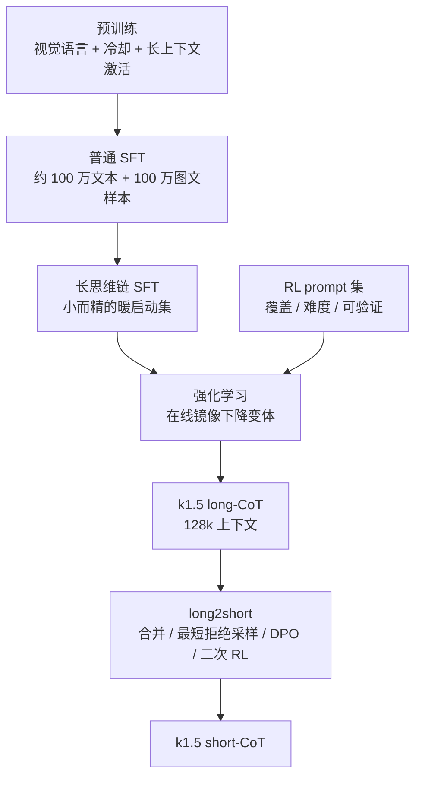
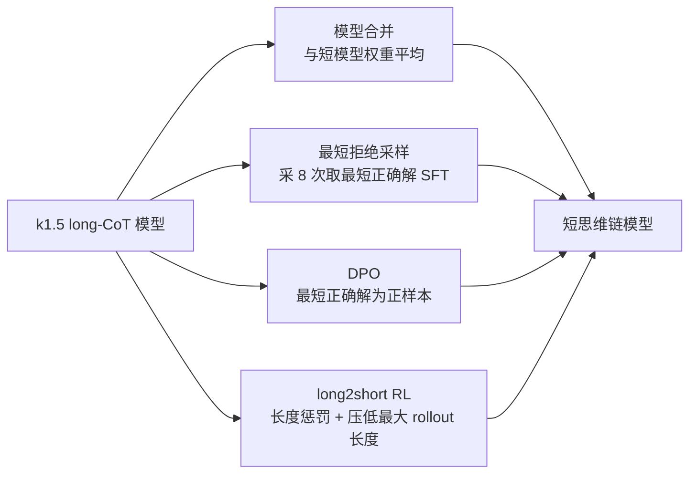
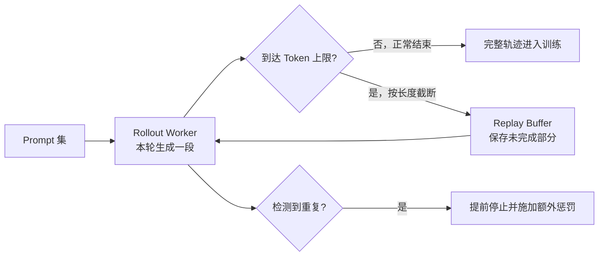
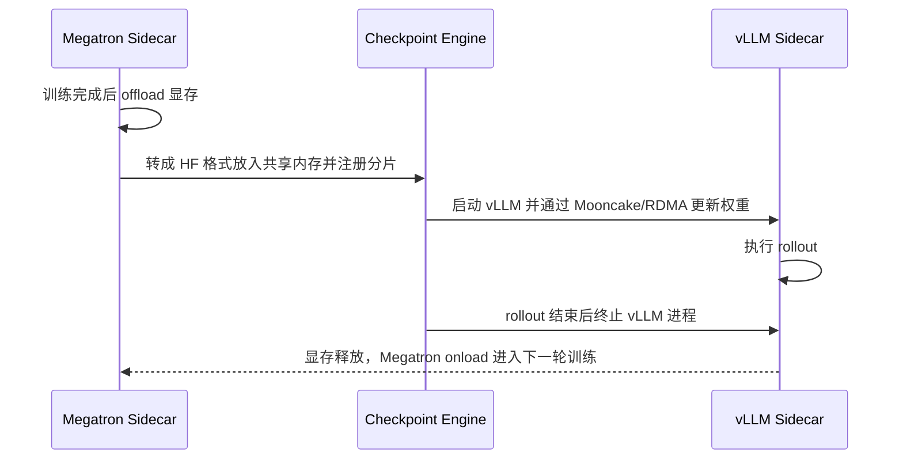

# Kimi k1.5：不搭搜索树，把搜索压进上下文一起训练

<!-- release-date: 2025-01-20 -->

> 本文依据 Kimi Team 发布的 **Kimi k1.5: Scaling Reinforcement Learning with LLMs（Technical Report of Kimi k1.5）**，即 arXiv:2501.12599v4、2025-06-03 修订版，共 25 页。本地原件已核对为 arXiv 当前最新版本，未发现更新修订。页码均指 PDF 本身的页码（本报告的印刷页码与 PDF 页码一一对应）。本文会把「报告明确写了什么」「我们如何理解」「外部资料补充」三层分开写，外部内容一律给出链接并标注为补充。

## 阅读前先搭一张最小地图

这篇报告从头到尾只讲一件事：**怎么用强化学习继续把模型练强**。所以先把会反复出现的词翻成人话。

- **Token（词元）**：模型读写内容时使用的最小单位。一个汉字、一个英文单词或一个标点都可能是一个或多个 Token。
- **上下文长度（context length）**：模型一次能读写多少个 Token。它同时限制了「输入有多长」和「一次回答能想多久」。
- **思维链（Chain of Thought，CoT）**：模型在给出最终答案前，先写出来的一串中间推理步骤。写得长的叫 **long-CoT**，写得短、几乎直接作答的叫 **short-CoT**。
- **强化学习（Reinforcement Learning，RL）**：不给模型标准答案，而是让它自己做题，再根据结果好坏调整参数。
- **rollout（采样轨迹）**：模型在 RL 中实际生成出来的一整条内容，从思维链一直到最终答案。
- **策略（policy）**：这里就指正在被训练的模型本身。写成 $\pi_\theta$，$\theta$ 是它的参数。
- **奖励（reward）**：一次 rollout 得到的分数。本报告中的主奖励只有 0 和 1 两个值，即答案对不对。
- **奖励劫持（reward hacking）**：模型没有真的变强，而是学会了钻打分规则的空子。

还有三个是这篇报告自己的名字，先各给一句话：

- **partial rollout（分段采样）**：一条太长的轨迹不必在一轮里生成完，可以存起来，下一轮接着往下写。
- **long2short（长转短）**：先把长思维链模型练强，再把这份能力压回一个说话短、花 Token 少的模型。
- **在线镜像下降（online mirror descent）**：一类强化学习优化方法。它每一轮都以「上一轮的自己」为参照点，限制这一轮不要跑太远。

## 一句话先说清

k1.5 的主张不是「我们做了一个更大的模型」，报告甚至从头到尾没有公布 k1.5 的参数量。

它主张的是**一个扩展方向的选择**：

> 当预训练数据不够用时，RL 是继续变强的第二根轴；而这根轴真正要扩的维度，是**上下文长度**，不是搜索算法的复杂度。

报告在摘要里就把话说死了：这套方法**不依赖蒙特卡洛树搜索（Monte Carlo Tree Search，MCTS）、价值函数（value function）和过程奖励模型（Process Reward Model，PRM）**，只靠长上下文扩展加上改进的策略优化，就拿到了 AIME 2024 上 77.5、MATH 500 上 96.2、Codeforces 第 94 百分位、MathVista 上 74.9 的成绩，作者称其与 OpenAI o1 相当。（PDF p.1）

所以全文最值得记住的一句是：

> **与其在推理时现搭一棵搜索树，不如把搜索这件事压平成一段更长的文本，让模型在训练里学会自己走。**

后面的每一个设计——prompt 集怎么造、损失怎么写、长度怎么罚、rollout 怎么跑、长模型怎么压回短模型——都是为了让这一句话真的成立。

## 先看全景：k1.5 是四段训练，不是一次 RL

报告明确写出了 k1.5 的训练阶段：预训练 → 普通监督微调（Supervised Fine-Tuning，SFT）→ 长思维链 SFT → 强化学习。整篇报告的重心在最后一段，前两段放在附录和 2.5 节。（PDF p.3）

这张图按 PDF p.3 的阶段描述和 p.7–8 的 long2short 方法重画，是**流程示意**，不含任何实测时间。

要注意两件事。

第一，**long-CoT SFT 只是暖启动，不是主力**。报告称它是一个「小而高质量」的数据集，用来让模型先学会规划、评估、反思、探索这几种写法，随后真正的能力提升交给 RL。（PDF p.3）

第二，**short-CoT 模型不是另一次从头训练**。它是从 long-CoT 模型压回来的，具体走 2.4 节的四条路径。（PDF p.7–8）

## 第一层矛盾：RL 到底要扩哪一维？

### 旧路走到头了

预训练遵循 scaling law：参数和数据同比放大，智能就继续上升。但报告开门见山地说，这条路受限于**可用高质量数据的总量**。（PDF p.2）

数据是有限的，算力却还能买。于是问题变成：还有什么东西可以拿算力换？

RL 给出的答案是：让模型自己做题、自己拿奖励，训练数据就不再局限于一份已有的静态语料。（PDF p.2）

### 但 RL 里「扩」有很多种扩法

在 k1.5 之前，让模型推理更强的主流思路是**规划算法（planning algorithm）**：把解题过程建成一棵搜索树 $\mathcal{T}$，每个节点是一个「问题 + 已写出的若干步思路」的部分解 $s=(x,z_{1:|s|})$，再用一个评论者模型 $v$ 给每个节点打分，指导往哪个方向扩展、什么时候回溯。（PDF p.4）

这套东西在部署时很麻烦：要维护树、要并行扩展、要一个额外的打分模型。

### k1.5 的关键转向：把搜索树压平

报告在 2.3.1 节做了一个很漂亮的观察。规划算法在第 $t$ 步能看到的全部信息，其实就是过去的搜索历史：

$$
s_1,\ v(s_1),\ s_2,\ v(s_2),\ \dots,\ s_{t-1},\ v(s_{t-1})
$$

而思路 $s$ 和反馈 $v$ 都可以写成语言 Token。既然如此，**搜索树里存的所有信息，都可以被拉直成一段线性文本，塞进模型的上下文里**。（PDF p.4）

于是规划算法从「一个外部程序」变成「一个可以被模型近似的映射」$\mathcal{A}(\cdot\mid z_1,z_2,\dots)$。模型自回归地往下写，就等于在隐式地做搜索：写一段思路、发现不对、回头换一条路，全都发生在同一段输出里。

这一步替换带来一个直接推论：

> **思维链里的 Token 数量，就是分配给「搜索」的计算预算。**

所以扩上下文长度 $=$ 扩搜索步数。这就是 k1.5 把上下文长度当成核心扩展维度的理由。（PDF p.4）

### 优化目标反而变得极简

有了上面的转换，训练目标就只剩一行。给定问题 $x$ 和标准答案 $y^*$，模型采样出思维链 $z$ 和答案 $y$，奖励模型 $r(x,y,y^*)\in\{0,1\}$ 只判断最终答案对不对：

$$
\max_{\theta}\ \mathbb{E}_{(x,y^*)\sim\mathcal{D},\,(y,z)\sim\pi_\theta}\left[r(x,y,y^*)\right]
$$

这里 $\mathcal{D}$ 是训练集，$\pi_\theta$ 是当前模型。整个式子只说了一件事：**调参数，让答对的概率变高**。中间怎么想、想多久、要不要走弯路，都不评分。（PDF p.4，式 1）

对可验证的问题，奖励由规则直接给出，比如代码题看能不能通过测试用例；对自由格式答案，则训练一个奖励模型判断是否与标准答案等价。（PDF p.4）

**收益**：不需要 value network，不需要 PRM，不需要在部署时跑树搜索。
**代价**：这条路强依赖「最终答案能被可靠验证」。所以下一节讲的不是算法，而是数据。

## 起点是数据，不是算法：RL prompt 集怎么造

报告把这一节放在 RL 之前，态度很明确：**prompt 集的质量和多样性直接决定 RL 有没有效果。** 它定义了三条性质。（PDF p.3）

| 性质 | 要求 | 不满足会怎样 |
|---|---|---|
| Diverse Coverage（覆盖多样） | 跨 STEM、代码、通用推理等多个学科 | 模型只在窄领域变强 |
| Balanced Difficulty（难度均衡） | 简单、中等、困难分布合理 | 过拟合到某一个复杂度层级 |
| Accurate Evaluability（可准确评判） | 验证器能客观可靠地判分 | 奖励劫持与表面模式拟合 |

### 难度不是人标的，是模型自己测出来的

k1.5 用一个 SFT 模型对每道题在**较高采样温度下生成 10 次**，算出通过率（pass rate），通过率越低就越难。（PDF p.3）

这个做法比人工标注更贴合训练：难度是相对**当前模型能力**而言的。一道题对人类是竞赛难题，对模型可能已经会做；反过来也一样。用模型自己的通过率当难度标签，可以先把大量「太简单，做十次全对」的题过滤掉，把算力留给真正有梯度的样本。

### 三类题被整体删掉

为了避免奖励劫持，报告直接排除了**选择题、判断题和证明题**。（PDF p.3）

理由很直白：这类题「推理过程错了但最终答案蒙对」的概率太高。选择题四选一，瞎猜也有 25% 拿到满奖励。用结果奖励训练时，这些样本会往模型里注入错误的正反馈。

### 「猜得到的题」也要删

还有一类更隐蔽的问题：题目看起来复杂，但答案本身很好猜（比如答案就是 0、1 或题面里出现过的数字）。

k1.5 的过滤方法很朴素也很聪明：**让一个模型在完全不做 CoT 推理的情况下直接猜答案。如果它在 $N$ 次尝试内猜中，这道题就算「易劫持」，删掉。** 报告称 $N=8$ 就能移除大部分这类 prompt。（PDF p.3）

这条经验的可迁移价值很高：

> **想知道一个任务是不是真的需要推理，先测一测「不推理能拿多少分」。这个下限就是奖励噪声的地板。**

任何要做结果奖励 RL 的团队都应该先跑一遍这个测试，成本极低。

## 冷启动：long-CoT SFT 只教「怎么写」，不教「答什么」

有了 prompt 集之后，k1.5 用提示工程构造了一个**小而高质量**的长思维链暖启动数据集，文本和图像输入都有，推理路径都经过准确验证。报告说这个做法「类似拒绝采样」，但重点是生成长推理路径而不是筛选答案。（PDF p.3）

这份数据刻意要覆盖四种认知过程：

1. **规划（planning）**：动手前先列步骤；
2. **评估（evaluation）**：对中间步骤做批判性检查；
3. **反思（reflection）**：意识到不对，重新考虑；
4. **探索（exploration）**：主动想别的解法。

然后只做一次**轻量 SFT**。（PDF p.3）

为什么必须轻？因为 SFT 是模仿。模仿得越重，模型越像老师，也越难在 RL 阶段发现老师没走过的路。这里 SFT 的定位是「教格式和习惯」，把「学能力」的活留给 RL。

> 同期的 DeepSeek-R1 也用少量冷启动 SFT 起步，两篇报告在这一点上是一致的：**先用极少的示范把输出形态固定住，再交给结果奖励去探索。** 这一段对照只依据本仓库已发布的 `reports/DeepSeek/DeepSeek-R1.md` 与本报告原文，两边都没有给出「冷启动数据到底多少条」的完整口径。

## 策略优化：一条不 clip、不要 critic 的路线

这是全文数学最密集的一节。我们先说它要算什么，再看公式。

### 想解决的问题

RL 更新有个老矛盾：走太小学不动，走太大会崩。常见做法是 PPO 式的**裁剪（clipping）**，把新旧策略的概率比强行夹在一个区间里。

k1.5 换了一条路：**在线策略镜像下降（online policy mirror descent）的一个变体**。它不裁剪，而是在目标函数里加一个「别离上一轮太远」的正则项。（PDF p.5）

### 第一步：写出带 KL 约束的目标

算法按轮迭代。第 $i$ 轮把当前模型 $\pi_{\theta_i}$ 冻结成参照模型，然后优化：

$$
\max_{\theta}\ \mathbb{E}_{(x,y^*)\sim\mathcal{D}}\Big[\mathbb{E}_{(y,z)\sim\pi_\theta}\big[r(x,y,y^*)\big]-\tau\,\mathrm{KL}\big(\pi_\theta(x)\,\|\,\pi_{\theta_i}(x)\big)\Big]
$$

符号解释：

- $\pi_{\theta_i}$：这一轮开始时的模型，充当参照点；
- $\mathrm{KL}(\cdot\|\cdot)$：Kullback-Leibler 散度，衡量两个分布差多远；
- $\tau>0$：正则强度。$\tau$ 越大，越不允许模型偏离参照点。

一句话：**在把奖励做高的同时，别把自己改得面目全非。**（PDF p.5，式 2）

### 第二步：这个目标有闭式解

这类「奖励 + KL 正则」的问题有标准答案。最优策略是把参照策略按奖励做指数重加权：

$$
\pi^*(y,z\mid x)=\pi_{\theta_i}(y,z\mid x)\,\frac{\exp\!\big(r(x,y,y^*)/\tau\big)}{Z}
$$

其中 $Z=\sum_{y',z'}\pi_{\theta_i}(y',z'\mid x)\exp\big(r(x,y',y^*)/\tau\big)$ 是归一化因子，保证概率加起来是 1。

直觉上：奖励高的轨迹按指数放大，奖励低的按指数缩小，但整体形状仍以参照策略为底。（PDF p.5）

### 第三步：两边取对数，得到一个可以直接拟合的等式

对闭式解两边取对数并整理，可以得到：对**任意**一条 $(y,z)$，下面这个等式都成立：

$$
r(x,y,y^*)-\tau\log Z=\tau\log\frac{\pi^*(y,z\mid x)}{\pi_{\theta_i}(y,z\mid x)}
$$

这一步是整段推导的关键，值得多说一句。它把「最优策略是什么」变成了一个**逐条轨迹都要满足的约束**。既然对任意轨迹都成立，那这条轨迹是不是当前模型采出来的就不重要了——**这就是报告说「允许利用 off-policy 数据」的来源**。（PDF p.5）

于是把 $\pi^*$ 换成待训练的 $\pi_\theta$，让等式两边尽量相等，就得到平方误差形式的替代损失：

$$
L(\theta)=\mathbb{E}_{(x,y^*)\sim\mathcal{D}}\left[\mathbb{E}_{(y,z)\sim\pi_{\theta_i}}\left[\left(r(x,y,y^*)-\tau\log Z-\tau\log\frac{\pi_\theta(y,z\mid x)}{\pi_{\theta_i}(y,z\mid x)}\right)^{2}\right]\right]
$$

注意内层期望的下标是 $\pi_{\theta_i}$，也就是**这一轮开始时那个冻结的模型**，不是正在被更新的 $\pi_\theta$。（PDF p.5）

### 第四步：$\tau\log Z$ 怎么算

$Z$ 要对所有可能的轨迹求和，实际算不出来。报告用同一道题的 $k$ 条采样估计：

$$
\tau\log Z\approx\tau\log\left(\frac{1}{k}\sum_{j=1}^{k}\exp\!\big(r(x,y_j,y^*)/\tau\big)\right)
$$

然后给了一个更实用的结论：直接用**这 $k$ 条采样奖励的经验均值** $\bar r=\mathrm{mean}(r_1,\dots,r_k)$ 就有很好的效果。理由是当 $\tau\to\infty$ 时，$\tau\log Z$ 会趋向参照策略下的期望奖励。（PDF p.5）

这一步把一个理论量换成了「同题多答的平均分」，非常实用。

### 第五步：最终梯度

对替代损失求梯度，得到实际用于更新的式子。对每道题采 $k$ 条回答：

$$
\frac{1}{k}\sum_{j=1}^{k}\left(\nabla_\theta\log\pi_\theta(y_j,z_j\mid x)\big(r(x,y_j,y^*)-\bar r\big)-\frac{\tau}{2}\nabla_\theta\left(\log\frac{\pi_\theta(y_j,z_j\mid x)}{\pi_{\theta_i}(y_j,z_j\mid x)}\right)^{2}\right)
$$

拆成两半读：

- **左半边**是标准的策略梯度：如果这条回答的奖励高于同题平均分 $\bar r$，就提高它的概率；低于平均分就压低。同题平均分在这里充当基线（baseline）。
- **右半边**是一个 $l_2$ 正则：惩罚 $\log$ 概率比偏离 0，也就是不让新模型对某条轨迹的看法比参照模型变化太大。

报告自己点明了它与常见方法的两处差别：**回答采样自 $\pi_{\theta_i}$ 而不是严格 on-policy；用 $l_2$ 正则替代裁剪。** 所以可以把它理解为「常规 on-policy 正则化策略梯度算法向 off-policy 情形的自然延伸」。（PDF p.5，式 3）

### 两个容易被略过、但很关键的工程细节

1. **每一轮结束后，$\theta_{i+1}$ 成为下一轮的参照策略。** 参照点是滚动前进的，不是固定在初始模型上。
2. **每一轮开始时重置优化器。** 报告的理由是：参照策略变了，每一轮其实是一个不同的优化问题，所以优化器状态（动量之类）不应该跨轮沿用。（PDF p.5）

第二点很少见，但逻辑自洽：既然目标函数换了，之前积累的动量就是对旧目标的记忆。

### 为什么坚决不要 value network

这是全文最值得反复读的一段论证。（PDF p.5）

传统 RL 用价值函数做**信用分配（credit assignment）**：判断某一步比「本来应该达到的水平」好多少。但报告举了一个具体反例。

假设模型已经写了 $(z_1,\dots,z_t)$，接下来有两个候选步骤：$z_{t+1}$ 直接通向正确答案，$z'_{t+1}$ 含有错误。

如果有一个完美的价值函数，它会判定 $z_{t+1}$ 的价值更高。按标准信用分配原则，选 $z'_{t+1}$ 会得到负优势，被压低。

**但这恰恰是长思维链最需要的东西。** 只要模型走进 $z'_{t+1}$ 之后能自己发现问题、纠正回来、最终答对，那这段弯路就是宝贵的训练材料——它教会模型「试错并恢复」这个模式。用最终答案作为奖励信号，弯路会被保留；用价值函数逐步打分，弯路会被扼杀。

作者由此给出结论：**经典 RL 里价值函数做信用分配的做法，可能不适合长思维链场景。** 报告同时说这个设计选择「显著提升了训练效率」，但没有量化省了多少。（PDF p.5）通常的理由是不必再训练一个规模接近策略模型的评论者，这一句是我们的补充解释，不是报告原文。

这一段的可迁移启发是：

> **奖励的粒度决定了模型能学到什么行为。粒度越细，模型越像「每一步都必须正确」；粒度越粗，模型越有空间学会「错了能改」。**

要不要细粒度奖励，应该先问「我希望模型学会哪种行为」，而不是默认「更细的监督总是更好」。

### 与 GRPO 路线的对照

同期的 DeepSeek-R1 使用 GRPO，也放弃了 value model，也用同题一组答案互相当基线。两条路线的落点很接近，但推导起点和实现细节不同：

| | k1.5 的镜像下降变体 | GRPO（据本仓库已发布的 R1 篇） |
|---|---|---|
| 基线来源 | 同题 $k$ 条采样的奖励均值 $\bar r$ | 同题一组答案的奖励均值与标准差 |
| 限制更新幅度 | $\log$ 概率比的 $l_2$ 正则 | 概率比裁剪 + KL 项 |
| 参照策略 | 每一轮更新为上一轮模型 | 训练数千步后定期更新 |
| 优化器 | 每轮重置 | 报告未强调重置 |

这张表只用于对照两篇报告各自写明的内容，**不能推出哪条路线普遍更好**。两篇报告都没有做过对方算法的直接对比实验。

## 长度惩罚：overthinking 是 RL 的自然结果，不是意外

### 现象

报告观察到：RL 训练中模型的回答长度显著增长。（PDF p.5）

这是好事也是坏事。好的一面是长回答确实带来更好的表现；坏的一面是训练和推理都更贵，而且人类通常不喜欢啰嗦。报告把这个现象叫 **overthinking（过度思考）**。

值得注意的是，长度增长并不是被谁鼓励的——目标函数里根本没有长度项。它是「更长的搜索更容易找到正确答案」这一事实的自然副产品。

### 长度奖励怎么设计

对同一道题的 $k$ 条回答 $(y_1,z_1),\dots,(y_k,z_k)$，先记下这一组里最短和最长的长度：$\mathrm{min\_len}=\min_i \mathrm{len}(i)$，$\mathrm{max\_len}=\max_i \mathrm{len}(i)$。

如果 $\mathrm{max\_len}=\mathrm{min\_len}$（长度全一样），所有回答的长度奖励为 0。否则先算一个中间量：

$$
\lambda=0.5-\frac{\mathrm{len}(i)-\mathrm{min\_len}}{\mathrm{max\_len}-\mathrm{min\_len}}
$$

$\lambda$ 把这条回答在组内的长度排名映射到 $[-0.5,\,0.5]$：**最短的拿 $+0.5$，最长的拿 $-0.5$。**

然后按答案对错分两种情况：

$$
\mathrm{len\_reward}(i)=
\begin{cases}
\lambda, & r(x,y_i,y^*)=1\\
\min(0,\lambda), & r(x,y_i,y^*)=0
\end{cases}
$$

这个奖励再乘一个权重系数，加到原始奖励上。（PDF p.6）

### $\min(0,\lambda)$ 这一处是全式的重点

请注意答错时用的是 $\min(0,\lambda)$，也就是**答错的回答最多拿 0，绝不可能拿正分**。

如果这里不加 $\min$，会出现一个灾难性的漏洞：一条又短又错的回答会因为「短」而获得正奖励。模型很快就会学会「不会做就随便快速蒙一个」，因为蒙错的成本比认真想更低。

所以正确的读法是：

> **在答对的回答里鼓励更短；答错的回答只惩罚不奖励，而且写得越长罚得越狠。**

这是一个非常干净的奖励设计范例：**任何附加奖励都必须先检查「它会不会给失败的行为发钱」。**

### 惩罚要暖启动

报告说初期实验中长度惩罚会拖慢训练，所以改成分两段：先做**不带长度惩罚**的标准策略优化，之后再加上一个**常数强度**的长度惩罚跑完剩余训练。（PDF p.6）

原因不难理解：训练早期模型还需要靠写长来找到正确解法，此时就压长度，等于在它学会走路之前先绑住腿。

## 采样策略：不是每道题都值得练

RL 算法本身就有「难题梯度更大」的性质，但报告认为训练效率仍然不够。它利用两种先验做采样。（PDF p.6）

- **课程采样（Curriculum Sampling）**：从简单任务开始，逐步过渡到困难任务。理由很实际：初期模型能力有限，把算力砸在很难的题上往往一条正确样本都采不到，梯度信号接近于零。
- **优先采样（Prioritized Sampling）**：跟踪每道题 $i$ 的历史成功率 $s_i$，按 $1-s_i$ 的比例采样。做得越差的题，被抽到的概率越高。

两者的信息来源不同：课程采样用的是数据自带的年级和难度标签，优先采样用的是训练过程中实时统计出来的成功率。

可迁移的点在于：**RL 的样本效率问题往往不在算法里，而在「你在练哪些题」上。** 这两条策略都不改动损失函数，只改动数据分布。

## 奖励从哪来：三类任务，三种验证器

结果奖励看起来最简单，实际上「怎么可靠地判对错」才是整套方法能不能立住的地基。报告分三类讲。

### 代码题：自己造测试用例

网上抓来的编程题大多没有测试用例。k1.5 的做法是自动生成。（PDF p.6）

流程是：

1. 只处理**不需要特判**（special judge）的题目，并假设有可用的标准解；
2. 用 **CYaRon** 这个公开的测试数据生成库，把它的用法说明和题面一起喂给 base 版 Kimi k1.5，让模型写生成器；
3. 每道题先产生 **50 个测试用例**，再随机抽 **10 份标准解提交**；
4. 一个测试用例只有在 **10 份提交里至少 7 份结果一致**时才算有效；
5. 一道题只有在 **10 份提交里至少 9 份能通过全部选定用例**时，才连同用例进入训练集。

这两道门槛的作用不同：第 4 步过滤「用例本身有歧义或有错」的情况；第 5 步过滤「用例过严，把正确解也判错」的情况。

报告给了完整的漏斗数字：从 **1,000 道线上竞赛题**出发，约 **614 道**不需要特判；开发出 **463 个**能产出至少 40 个有效用例的生成器；最终 **323 道**题进入训练集。（PDF p.6）

1,000 道题最后只剩 323 道，比例约 32%（这一步除法是我们算的，报告只给了四个绝对数）。这是本报告最诚实的数字之一，它说明**构造可靠验证器的成本远高于收集题目的成本**。任何想复刻结果奖励 RL 的人都应该按这个量级做预算，而不是假设题目一抓就能用。

### 数学题：写法不同不等于答错

数学的麻烦在于同一个答案可以有很多等价写法，比如 $a^2-4$ 和 $(a+2)(a-2)$。（PDF p.6）

报告训练了两种奖励模型做对比：

| 奖励模型 | 做法 | 数据量 | 人工抽检准确率 |
|---|---|---|---|
| Classic RM | 参照 InstructGPT，带 value head，输入「问题 + 参考答案 + 回答」，输出一个标量 | 约 800k | 约 84.4 |
| Chain-of-Thought RM | 输入相同，但先显式写出逐步推理，再以 JSON 格式给出正误判断 | 约 800k | 98.5 |

RL 训练最终采用 Chain-of-Thought RM。（PDF p.6–7）

这组对比很有价值：**同样的数据量、同样的输入，只是让判分者先想再判，准确率从 84.4 提到 98.5。** 这里有一个容易被忽略的因果链：奖励模型的错误会被 RL 直接放大成模型的错误行为，所以在判分器上多花的推理成本，比在策略上多训几步更划算。

需要保留的边界是：这两个数字来自**人工抽检（manual spot checks）**，报告没有给出抽检样本量、抽样方法和置信区间。（PDF p.7）

### 视觉题：三类数据各补一块短板

视觉 RL 数据分三类。（PDF p.7）

1. **真实世界数据**：各年级的科学题（需要看懂图表并推理）、位置猜测任务（需要视觉感知与推断）、复杂图表的数据分析；
2. **合成视觉推理数据**：程序生成的图像和场景，用来针对性训练空间关系、几何图案、物体交互，好处是可控且供给无限；
3. **文本渲染数据**：把文本、代码、结构化数据转成图片。目的是让模型面对同一内容时，无论输入是纯文本还是截图，回答都保持一致。

第三类的思路很值得借鉴：它不是在教新知识，而是在**消除模态之间的不一致**。模型已经会读的东西，换成图片之后不应该突然不会了。

## long2short：把长思维链的收益压回短模型

### 要解决的问题

长思维链模型强，但每次回答烧的 Token 多得多。报告的问题是：能不能把长模型的「思考先验」迁移到短模型上，让短模型在有限 Token 预算下也变强？（PDF p.7）

它给了四种方法。

这张图按 PDF p.7–8 的四种方法重画，是**方法关系示意**，不表示它们在流水线里必须串行执行。

### 四种方法各自在做什么

- **模型合并（Model Merging）**：把长思维链模型和一个短模型的权重**直接平均**，不做任何训练就得到新模型。报告称合并本来被用于保持泛化能力，他们发现它对 Token 效率也有效。（PDF p.7）
- **最短拒绝采样（Shortest Rejection Sampling）**：观察到同一道题的回答长度方差很大，于是对同一问题采样 $n=8$ 次，**选其中最短的正确回答**做 SFT。（PDF p.7）
- **DPO（Direct Preference Optimization，直接偏好优化）**：用长思维链模型生成多条回答，最短的正确解当正样本；负样本包括所有错误的长回答，以及**长度超过正样本 1.5 倍的正确回答**。用这些正负对训练。（PDF p.7）
- **long2short RL**：标准 RL 跑完后，挑一个性能与 Token 效率平衡最好的模型当基座，再单独做一轮 RL。这一轮加上 2.3.3 的长度惩罚，并**大幅调低最大 rollout 长度**，进一步惩罚那些「虽然可能对，但超出期望长度」的回答。（PDF p.8）

DPO 的负样本设计最值得单独看一眼：它把「正确但太长」也当成负样本。这是明确在教模型「对不够，还要短」。如果只把错误答案当负样本，模型没有任何压缩的动力。

### 实验结果：long2short RL 赢在 Token 效率

报告在 Figure 7 里把各方法画在「Token 长度 - 准确率」平面上，橙色是 k1.5 系列，蓝色是其他模型。（PDF p.14）

关键数字：

- **k1.5-short w/ rl** 在 AIME 2024 上取得 Pass@1 60.8（8 次运行平均），平均只用 **3,272 个 Token**；
- **k1.5-shortest** 在 MATH500 上取得 Pass@1 88.2，消耗的 Token 数与其他短模型大致相当。（PDF p.13）

报告的结论是：long2short RL 在这四种方法里 Token 效率最高，且整个 k1.5 系列的 Token 效率都优于对照模型。（PDF p.13）

这里要保持准确：Figure 7 展示的是**同一坐标系里的相对位置**，报告没有给出每个点的完整数值表，所以「long2short RL 最优」是基于该图的定性判断加上两个被点名的数据点，不是一张完整对照表。

## 训练之外：让 128k 的 rollout 真的跑得动

前面所有算法设计都建立在一个前提上：模型要能生成非常长的轨迹。而这件事在系统层面非常难。报告用整个 2.6 节讲基础设施。

### 整体是一个同步迭代的循环

系统采用**迭代同步**（iterative synchronous）框架，每一轮包含 rollout 阶段和 training 阶段。（PDF p.9）

角色分工是：

- **Rollout Workers**：与模型交互，生成轨迹；
- **Master**：中央协调者，管理 rollout worker、trainer worker、奖励模型评估和 replay buffer 之间的数据流与通信；
- **Replay Buffer**：存放轨迹，通过打断时间相关性来保证训练数据的多样与无偏；
- **Trainer Workers**：读取轨迹，计算梯度更新，内部含 Policy Model 与 Reference Model；
- **Reward Models**：报告的 Figure 3a 中画出了 Code、Math、K-12、Vision 四类；
- **Code Execution Service**：代码题的实际执行环境，是奖励模型不可分割的一部分。（PDF p.8–9）

### Partial Rollout：本报告最重要的系统创新

**旧问题**：长思维链 RL 里，一条轨迹可能要写几万个 Token。如果要求每条轨迹在一轮内生成完，那么整轮的时间由最长的那条决定，绝大多数 worker 都在空等。

**新设计**：设定一个固定的输出 Token 预算，给每条轨迹的长度封顶。如果一条轨迹在 rollout 阶段超过限额，**未完成的部分存进 replay buffer，下一轮接着写**。（PDF p.9）

**工作机制**：

这张图根据 PDF p.8 的 Figure 3b 和 p.9 的文字重画，是**机制示意**，节点顺序不代表严格的执行时序。

**收益**：

1. 没有一条超长轨迹能独占资源；
2. rollout worker 异步工作，有的在处理长轨迹时，其他的可以独立处理新的短任务；
3. 报告特别指出：**只有当前这一轮（iter n）的分段需要 on-policy 计算，之前的分段（iter n-m 到 n-1）可以直接从 buffer 复用，不必重新 rollout。** 这才是省算力的关键。（PDF p.9）

**代价与边界**：一条轨迹的不同分段是被**不同版本的模型**写出来的。这在数学上必须靠 2.3.2 节允许 off-policy 数据的推导来兜底——这两节其实是配套设计的。报告也提到训练时某些分段可以被排除在损失计算之外，但没有给出具体的排除规则。（PDF p.9）

**附带的一个小功能**：系统会检测生成内容里的重复序列并提前终止，还可以对检测到的重复施加额外惩罚。（PDF p.9）这是长思维链模型很常见的退化模式，放在系统层拦截比放在奖励里更省钱。

**可迁移启发**：

> **当任务时长的分布是重尾的，不要按「整条任务」调度，要按「固定的时间片」调度。** 这在操作系统里叫抢占式调度，在这里叫 partial rollout，思想完全一样。

### 混合部署：训练和推理抢同一批 GPU

**旧问题**：RL 需要交替做训练（Megatron）和推理（vLLM）。如果两者部署在不同节点上，训练节点就要在推理时干等。（PDF p.10）

报告列出了同时满足三个条件的困难：

1. **复杂并行策略**：Megatron 与 vLLM 的并行方式不同，训练权重分散在多个节点上，很难直接共享给 vLLM；
2. **最小化 GPU 空闲**：SGLang、vLLM 等框架常在训练期间预留 GPU，反而让训练 GPU 闲置；
3. **动态伸缩能力**：有时保持训练规模不变、只增加推理节点就能大幅加速。

**新设计**：用 Kubernetes 的 Sidecar 容器，把训练和推理两个工作负载放进**同一个 pod**，共享全部可用 GPU。（PDF p.10）

这张图根据 PDF p.10 的 Figure 4 和三段相位描述重画，是**流程示意**，箭头表示控制与数据流向，不表示实测耗时。

几个具体做法值得记：

- **Checkpoint Engine** 是包在 Megatron 和 vLLM 外面的 shim 进程，暴露 HTTP API 管理 vLLM 生命周期，用 etcd 做全局元数据系统广播状态。（PDF p.10）
- **vLLM 是被终止再重启，而不是 offload**。原因是 CUDA graph、NCCL buffer 和 NVIDIA 驱动让 vLLM 很难彻底释放显存；与其大改 vLLM，不如直接杀掉重来，顺便还获得了容错能力。（PDF p.11）
- **权重转换在共享内存里做**。Megatron worker 把 checkpoint 转成 Hugging Face 格式，转换时把流水线并行和专家并行都吸收掉，**只留下张量并行**；再切成分片注册到全局元数据系统，用 **Mooncake** 通过 RDMA 在节点间传输。（PDF p.11）

**实测收益**：训练切换到推理**不到一分钟**，反向切换**约十秒**。（PDF p.10）

「只留张量并行」这个细节特别聪明：与其让 vLLM 去理解 Megatron 的全部并行策略，不如在导出时先把维度降到两边都能接受的最小公共形态。**接口的复杂度应该在导出侧消解，而不是让下游去适配。**

### 代码沙箱：为什么不用 Docker

代码题的奖励必须真的把代码跑起来。沙箱通过动态切换容器镜像支持不同场景，包括 MultiPL-E、DMOJ Judge Server、Lean、Jupyter Notebook 等；部署在 Kubernetes 上，通过 HTTP 端点暴露。（PDF p.11）

三项优化及其理由：

- **用 crun 代替 Docker 作为容器运行时**，显著降低容器启动时间；
- **cgroup 复用**：预先创建好 cgroup 供容器使用。高并发下，为每个容器创建和销毁 cgroup 会成为瓶颈；
- **磁盘优化**：overlay 文件系统的上层挂成 tmpfs，得到固定大小的高速存储空间，适合用完即弃的负载。（PDF p.11）

报告给出的对比数据是：

| 指标 | Docker | k1.5 Sandbox |
|---|---:|---:|
| 容器启动时间 | 0.12 秒 | 0.04 秒 |
| 16 核机器每秒最多启动容器数 | 27 | 120 |

（PDF p.11，两张未编号的小表）

这两个数字说明了一件常被低估的事：**在结果奖励 RL 里，验证器的吞吐量就是训练的吞吐量。** 如果每条代码轨迹要等 0.12 秒才能开始判分，判分环节会直接成为整个训练循环的瓶颈。把它压到 0.04 秒，训练速度就上去了——这跟模型本身一点关系都没有。

## 预训练与 SFT：报告写了什么，又明确没写什么

### 预训练三阶段

k1.5 base 模型在多模态语料上训练，语言数据覆盖英文、中文、代码、数学推理、知识五个领域；多模态数据包括描述、图文交错、OCR、知识和问答。（PDF p.8）

训练分三个阶段：（PDF p.8、23–24）

1. **视觉语言预训练**：先只用语言数据建立语言基础；然后逐步引入图文交错数据。视觉塔（vision tower）先单独训练、不更新语言模型参数，之后解冻语言模型层，最终把图文数据比例提到 **30%**。最终的数据配比与权重是在小模型上做消融确定的。
2. **冷却（Cooldown）**：用高质量语言与图文数据继续训练。报告说在冷却阶段加入**合成数据**带来显著提升，尤其在数学推理、知识任务和代码生成上。合成方式是用已有的数学、知识、代码语料当素材，用一个自研语言模型生成问答对，再用拒绝采样保证质量，最后统一验证后并入冷却集。
3. **长上下文激活**：上采样长上下文冷却数据。这里有几个具体数字：**40% 全注意力数据 + 60% 部分注意力数据**；**RoPE 频率设为 1,000,000**；最大序列长度从 **4,096 → 32,768 → 131,072** 逐步扩展。（PDF p.24）

### 数据流水线：一套四层质量过滤

英文和中文文本用四种打分方法组合成一个多维质量框架，报告称这样做是为了降低单一方法的偏差：（PDF p.21）

1. **规则过滤**：去重复内容、机器翻译文本、低质网页抓取，以及特殊字符过多、排版异常或垃圾模式的文档；
2. **FastText 分类**：训练专门的 FastText 模型，按语言特征和语义连贯性判断质量；
3. **嵌入相似度分析**：用文档嵌入算相似度，删掉近重复，同时保留有语义价值的变体；
4. **LLM 质量评估**：让大模型按连贯性、信息量和教育价值打分。

最终分数是这几项的组合，然后按分数做**动态采样率**：高质量文档上采样，低质量下采样。（PDF p.21）

代码数据方面，遵循 BigCode 的方法论；把 JSON、YAML、YACC 这类标记语言**下采样**，把 Python、C、C++、Java、Go 等 **32 种主要编程语言上采样**。（PDF p.21）

数学数据有一个很实在的观察：**通用领域的文本抽取、清洗和 OCR 模型在数学领域假阴性率很高**，所以他们专门开发了面向数学内容的清洗流程和 OCR 模型，先把召回率拉起来，再做两阶段清洗（FastText 粗筛 + 微调语言模型精筛）。（PDF p.21–22）

多模态方面有两条同样务实的经验：**严格限制合成描述数据的比例**，以免因为缺乏真实世界知识而加剧幻觉；图文交错数据除了常规过滤去重外，还要做**顺序重排**，保证图和文的先后关系正确。（PDF p.22–23）

### 普通 SFT 的具体配方

普通 SFT 语料约 **100 万条文本样本**，构成是：（PDF p.8）

| 类别 | 数量 |
|---|---:|
| 通用问答 | 500k |
| 代码 | 200k |
| 数学与科学 | 200k |
| 创意写作 | 5k |
| 长上下文任务（摘要、文档问答、翻译、写作） | 20k |

另外还有约 **100 万条图文样本**，覆盖图表理解、OCR、图像对话、视觉编程、视觉推理和带图的数理题。

训练方式是：先在 **32k** 序列长度上训 1 个 epoch，再在 **128k** 上训 1 个 epoch。学习率从 $2\times10^{-5}$ 衰减到 $2\times10^{-6}$；进入 128k 阶段时**重新 warmup 到** $1\times10^{-5}$，最后衰减到 $1\times10^{-6}$。多条样本被 pack 进同一个训练序列以提高效率。（PDF p.8）

数据构造方式也分两条路：非推理任务（问答、写作、文本处理）先人工标注一个种子集，训出种子模型，用它对大量 prompt 生成多条回答，再由标注者排序并润色最优回答；推理任务（数学、代码）因为规则和奖励模型验证比人判更准更快，直接用拒绝采样扩充。（PDF p.8）

### 报告明确没写的部分

这里必须停下来说清楚一件事。附录 B.3 只有两段，原话大意是：k 系列模型使用 Transformer decoder 的一个变体，在架构和优化策略上有改进；然后紧接着写道——

> 大量 scaling 实验表明，base 模型的性能**主要来自预训练数据质量与多样性的提升**；架构 scaling 实验的具体细节**超出本报告范围，将在未来的出版物中讨论**。（PDF p.23）

上面这段是大意转述，不是逐字引用。配套的 Figure 11 也只是一张示意图：文本序列和图文交错序列进入一个标着「Transformer」的灰色方块，旁边写着「Large Scale Reinforcement Learning」。（PDF p.24）

所以：

- **k1.5 的参数量、层数、注意力形式、是否 MoE，报告全部没有公布。**
- 附录 B 开头也直说了「目前不开源我们的专有模型」，同时承诺公开数据流水线与方法论。（PDF p.21）

这不是遗漏，是刻意的边界。读这篇报告时应当把它理解为**一份 RL 方法与系统报告**，而不是一份完整的模型报告。

## 实验：哪些结论有证据，哪些要打问号

### 主榜结果

长思维链模型（PDF p.12，Table 2）：

| Benchmark | QwQ-32B Preview | OpenAI o1-mini | QVQ-72B Preview | OpenAI o1 | Kimi k1.5 |
|---|---:|---:|---:|---:|---:|
| MATH-500 (EM) | 90.6 | 90.0 | – | 94.8 | **96.2** |
| AIME 2024 (Pass@1) | 50.0 | 63.6 | – | 74.4 | **77.5** |
| Codeforces (Percentile) | 62 | 88 | – | 94 | **94** |
| LiveCodeBench (Pass@1) | 40.6 | 53.1 | – | **67.2** | 62.5 |
| MathVista-Test (Pass@1) | – | – | 71.4 | 71.0 | **74.9** |
| MMMU-Val (Pass@1) | – | – | 70.3 | **77.3** | 70.0 |
| MathVision-Full (Pass@1) | – | – | 35.9 | – | **38.6** |

短思维链模型的部分结果（PDF p.12，Table 3）：MMLU 87.4、IF-Eval 87.2、CLUEWSC 91.7、C-Eval 88.3、MATH-500 94.6、AIME 2024 60.8、HumanEval-Mul 81.5、LiveCodeBench 47.3、MathVista-Test 70.1、MMMU-Val 68.0、MathVision-Full 31.0。

**读这两张表必须带上四条限定：**

1. **k1.5 不是每项都赢。** LiveCodeBench 上 o1 的 67.2 高于 k1.5 的 62.5；MMMU-Val 上 o1 的 77.3 高于 k1.5 的 70.0。摘要里说的「matching o1」是整体判断，不是逐项超越。（PDF p.12）
2. **Codeforces 的 94 百分位不是裸模型单次生成的成绩。** 附录写明：为在 Div2 和 Div3 中取得更高排名，他们对 k1.5 long-CoT 生成的代码做**多数投票（majority voting）**，而且用于筛选的测试用例也是同一个模型生成的。百分位数值来自 OpenAI Day12 talk。（PDF p.25）
3. **Table 3 里的 IF-Eval 数字来自一个中间模型**，报告自己说「由于版本变动」，并承诺后续按最终模型更新分数。（PDF p.24）
4. **视觉语言模型的对照分数来自 OpenCompass 平台**，不是 k1.5 团队在同一套环境里复测的。（PDF p.12，Table 3 脚注）

摘要里那个醒目的「最高 +550%」也值得一句解释。报告没有点名是哪一项。**我们的推断是**：Table 3 中 AIME 2024 上 GPT-4o 得 9.3、k1.5 得 60.8，比值约 6.54 倍，即约 +554%，是全表唯一能对上这个量级的组合。（PDF p.12）这是我们的核对，不是报告原文写明的。

### 长上下文 scaling：证据来自小模型，不是 k1.5 本体

这是全文最容易被误读的一节，必须逐字看清楚。

报告说用一个**中等规模模型**研究 RL 的 scaling 性质。Figure 5 展示训练准确率和回答长度随迭代同步上升；Figure 6 展示模型的输出上下文长度与解题能力强相关。（PDF p.12–13）

Figure 5 的图注写得很明白（以下为图注大意，非逐字引用）：

> 上述分数来自一个内部长思维链模型，其规模**远小于** k1.5 long-CoT 模型；阴影区域表示回答长度的 95 百分位。（PDF p.13）

Figure 6 给出了各 benchmark 上「准确率对平均 Token 长度」的拟合斜率，例如 total@temp_1.0 为 2.46e-05、OMNI-MATH500 为 3.05e-05、MATH500 为 1.36e-05、AIME2024 为 3.40e-05、GPQA 为 4.24e-05。（PDF p.14）

关于 k1.5 本体，报告只给了一句：**最终的 k1.5 训练扩展到 128k 上下文长度，并在困难推理 benchmark 上持续改善。**（PDF p.13）

所以正确的表述是：

- ✅ 报告用小模型证明了「RL 训练中回答长度和准确率同步上升，且两者强相关」；
- ✅ 报告声明 k1.5 最终扩到 128k 并持续改善；
- ❌ 报告**没有**给出 k1.5 本体在不同上下文长度下的对照曲线。

这是「作者观察」和「受控实验」之间的差别，读的时候不要合并。

另外还要注意一个方向性问题：Figure 5/6 展示的是**相关性**。长度上升和准确率上升同时发生，并不能直接证明「是长度带来了准确率」——也可能两者都是 RL 训练本身的结果。报告的措辞也是 correlation，没有声称因果。

### 消融一：小模型能靠长思维链追上大模型，但更费 Token

报告用同一份数据训了**两个不同规模的模型**，记录 RL 过程中所有 checkpoint 的评测结果和平均推理长度。（PDF p.14，Figure 8）

结论有三层：

1. 大模型初期表现优于小模型；
2. **小模型可以靠 RL 优化出的更长思维链，达到与大模型相当的表现**；
3. 但大模型的 **Token 效率**通常更好。

由此得到一条实用建议：**若追求最好的性能，扩展「更大模型」的上下文长度，上限更高也更省 Token；若测试时算力有预算约束，训练更小的模型配更长的上下文可能是可行方案。**（PDF p.14）

Figure 8 里的拟合斜率能佐证第二点，比如 OMNI-MATH500 上小模型斜率 3.33e-05、大模型 6.42e-05；AIME2024 上小模型 5.90e-05、大模型 8.10e-05。（PDF p.15）大模型每多写一个 Token 换来的准确率增量更大，这正是「Token 效率更好」的含义。

需要保留的边界：报告**没有说明这两个模型的具体规模**，也没给出交叉点的数值。

### 消融二：负梯度是必要的

报告拿 **ReST（Reinforced Self-Training）** 做对照。ReST 与 k1.5 方法的核心区别是：ReST 只用当前模型采出的最好回答去拟合模型，**不施加负梯度惩罚错误回答**。（PDF p.14）

结果（Figure 10，PDF p.16）：报告称 k1.5 的方法在**样本复杂度**上明显优于 ReST。图中共 12 个面板（11 个 benchmark 加一个 Total），我们逐格看下来，代表 Ours 的曲线大体位于 ReST 之上——这是我们对图的读法，报告本身只给了定性结论，没有列出每格的数值。

报告的解读是：**负梯度显著提升了模型生成长思维链的效率**，而且这个差距在其他领域并不那么明显，说明在长思维链场景下选对策略优化算法特别重要。（PDF p.14–15）

这条结论很有迁移价值：

> **只奖励好答案而不惩罚坏答案，模型学到的是「多写这类内容」；同时惩罚坏答案，模型才学到「不要走那条路」。** 在搜索空间巨大的任务里，后者提供的信息量高得多。

### 消融三：课程采样确实有效

Figure 9 对比了两条曲线：基线是对混合难度题目做均匀采样；课程学习则先用完整数据集 $\mathcal{D}$ 暖启动，**在第 24 次迭代处转向只训练困难题**。（PDF p.15）

结果显示课程采样显著提升表现，两条曲线在转折点之后明显分叉。

不过要注意 Figure 9 只画到约第 40 多次迭代，纵轴准确率约从 0.30 升到 0.60 出头。这是一次演示性实验，不是完整训练。

## 与 DeepSeek-R1 的同日对照

k1.5 和 DeepSeek-R1 在同一天公开，都是「用结果奖励训练推理能力」。放在一起读，最有价值的是它们**共同排除了什么**。

两篇报告都明确表示不依赖 MCTS、价值函数和过程奖励模型。（k1.5 在摘要、引言和结论里各说了一次，见 PDF p.1、2、16；R1 的相应结论见本仓库已发布的 `reports/DeepSeek/DeepSeek-R1.md`）

有意思的是两边给出的理由角度不同：

- **k1.5 的理由是「会伤害探索」**：价值函数会惩罚那条最终能纠正回来的弯路，而弯路正是长思维链要学的东西。（PDF p.5）
- **R1 的理由更偏工程可行性**：中间步骤没有统一粒度、判断中间步骤本身就是难任务、模型式 PRM 同样会被 reward hacking。

两个理由不冲突，反而互补：一个说「细粒度监督会教错行为」，一个说「细粒度监督本身就做不准」。两条一起看，才是这条技术路线在 2025 年初被同时放弃的完整原因。

两边也都强调数据侧的过滤远比算法重要，k1.5 是删掉选择题/判断题/证明题并做 $N=8$ 猜答案过滤，R1 是把任务限制在 verifier 足够可靠的范围内。

**必须说明的边界**：本节只对照两篇报告各自写明的内容。两篇都没有做对方方法的复现实验，因此不能从这些对照推出任何「谁更强」的结论。

## 报告没有告诉我们的事

这一节列出读完后仍然不知道、且不能靠推测补齐的内容。

**模型本身：**

- k1.5 的参数量、层数、注意力实现、是否 MoE——附录 B.3 明确说架构 scaling 细节超出本报告范围。（PDF p.23）
- 视觉塔的具体结构与规模。
- 预训练总 Token 数、算力、GPU 数量与训练时长。

**RL 超参数：**

- 正则强度 $\tau$ 的取值。
- 每道题采样条数 $k$ 的取值。
- 长度奖励加到主奖励上时的权重系数。
- 长度惩罚 warmup 到第几步结束。
- 最终 k1.5 跑了多少轮 RL。Figure 5/6 的迭代数属于一个更小的内部模型，Figure 8 属于两个未公开规模的对照模型，都不能当成 k1.5 本体的训练轮数。

**数据规模：**

- RL prompt 集的总量。
- 长思维链 SFT 暖启动集的条数（只说「小」）。
- 视觉 RL 数据三类各自的比例。
- 冷却阶段合成数据的占比。

**方法细节：**

- 模型合并时两个模型的权重比例（只说「简单平均」，未说是否等权）。
- partial rollout 中哪些分段会被排除出损失计算，按什么规则排除。
- Classic RM 与 CoT RM 人工抽检的样本量与方法。

**可复现性：**

- 权重未开源，报告原文即写明「目前不开源我们的专有模型」。（PDF p.21）
- 主榜里的 Codeforces 成绩依赖多数投票，报告没有给出裸模型单次生成的对应分数。

一句话总结这些缺口：**这篇报告足以让你理解并借鉴 k1.5 的方法论与系统设计，但不足以让你复现 k1.5。** 作者对此是坦率的——他们公开了数据流水线和 RL 方法，同时明说保留了模型本身。

## 最值得带回自己项目的七条

### 1. 先量化「不推理能拿多少分」

$N=8$ 直接猜答案的过滤方法（PDF p.3）成本极低，却能测出任务的奖励噪声地板。任何要上结果奖励 RL 的任务，都应该先跑这个基线。它同时也是一个通用的数据质量检查：如果**不做推理**就能答对，说明答案空间太窄，或者题面里已经泄漏了答案。

### 2. 奖励的粒度会塑造行为，不只是提高精度

k1.5 拒绝价值函数的论证（PDF p.5）比「省钱」深刻得多：逐步打分会惩罚试错，而试错正是要学的能力。设计奖励前先问一句「我希望模型学会哪种行为模式」，再决定监督粒度。

### 3. 任何附加奖励都要检查它会不会给失败发钱

$\min(0,\lambda)$ 这个细节（PDF p.6）是整篇报告里最小、也最容易抄错的设计。**辅助奖励的第一条检查项永远是：它在任务失败时最多能拿到多少分。**

### 4. 重尾任务要按时间片调度，不要按任务调度

Partial rollout（PDF p.9）把「一条轨迹必须一次写完」拆成「一轮写一段」。任何存在长尾耗时的批处理系统——数据流水线、评测集群、Agent 执行——都可以用同样的方式把长尾从关键路径上移开。前提是下游算法能接受分段数据，这也是为什么它必须和 off-policy 推导配套。

### 5. 验证器的吞吐量就是训练的吞吐量

沙箱把容器启动从 0.12 秒压到 0.04 秒、每秒并发从 27 提到 120（PDF p.11），这跟模型毫无关系，却直接决定 RL 循环转多快。**做结果奖励 RL 时，请把验证器当成一个需要认真优化的服务，而不是一个脚本。**

### 6. 接口的复杂度在导出侧消解

混合部署时把流水线并行和专家并行都在导出阶段吸收掉，只留张量并行给 vLLM（PDF p.11）。这是一条通用的系统设计原则：**不要让下游去理解上游的全部内部结构，先把它降维到两边共同的最小形态。**

### 7. 能力和成本可以分两步优化

先不计成本把 long-CoT 模型练到最强，再用 long2short 把它压回短模型（PDF p.7–8、13）。这比一开始就带着长度约束训练更容易，因为长度约束会在早期干扰能力探索。**先追求上限，再压缩成本**，在很多训练与工程场景都成立。

## 关键词回看

- **long-CoT / short-CoT**：长思维链与短思维链。同一套能力的两种输出形态，前者花更多 Token 换更强推理。
- **partial rollout**：给每条轨迹设 Token 预算，超出部分存入 replay buffer，下一轮续写；只有当前分段需要 on-policy 计算。
- **online policy mirror descent**：每轮以上一轮模型为参照点，用带 KL 正则的目标做优化；k1.5 用它的一个变体替代裁剪式方法。
- **$l_2$ 正则替代 clipping**：不夹住概率比，而是惩罚 $\log$ 概率比的平方，效果是「离参照点越远罚得越重」。
- **经验均值基线**：用同题 $k$ 条采样的平均奖励当 baseline，替代难以计算的归一化因子 $\tau\log Z$。
- **length reward**：按组内长度排名给 $[-0.5,0.5]$ 的分，但答错时封顶为 0。
- **curriculum sampling / prioritized sampling**：按难度递进采样、按 $1-s_i$ 的失败率优先采样。
- **easy-to-hack 过滤**：不做 CoT 直接猜，$N$ 次内猜中就删。
- **Chain-of-Thought RM**：先写推理再以 JSON 给判断的奖励模型，抽检准确率 98.5，高于 Classic RM 的 84.4。
- **long2short**：模型合并、最短拒绝采样、DPO、二次 RL 四条把长模型能力压回短模型的路径。
- **hybrid deployment**：Megatron 与 vLLM 以 Sidecar 形式共享同一 pod 的 GPU，由 checkpoint engine 管理生命周期。
- **Mooncake**：报告使用的、基于 RDMA 的节点间权重传输方案。
- **ReST 对照**：只拟合最好回答、不施加负梯度的基线；k1.5 用它证明负梯度是必要的。

## 最后的判断

Kimi k1.5 这篇报告的价值，不在于它公布了一个多强的模型——它连参数量都没写。

它的价值在于给出了一条**完整且自洽的技术路线**，并且每一环都能对上：

- 因为选择「把搜索压平进上下文」，所以目标函数可以极简，不需要树、value 和 PRM；
- 因为目标是结果奖励，所以必须先把数据里所有「能蒙对」的题清掉；
- 因为长思维链的价值在于试错和恢复，所以不能用逐步价值函数做信用分配；
- 因为推导允许 off-policy 数据，所以 partial rollout 才成立；
- 因为 partial rollout 成立，128k 的长轨迹才跑得动；
- 因为长模型太贵，所以还需要 long2short 把能力压回去。

这条链上每一步都有理由，这是它比一堆技巧清单更值得读的原因。

同时要如实记住它的边界：

- 长上下文 scaling 的**曲线证据来自更小的内部模型**，不是 k1.5 本体；
- 主榜里 LiveCodeBench 和 MMMU 并未超过 o1，Codeforces 成绩依赖多数投票，IF-Eval 来自中间模型；
- 消融只覆盖了模型规模 vs 上下文、负梯度、课程采样三项，长度惩罚、优先采样、long2short 各方法之间都没有独立消融；
- 模型架构被明确推迟到未来的出版物，权重未开放。

如果只记一句话，可以记：

> **不要急着给推理过程加更聪明的监督。先让最终结果能被可靠验证，再把算力花在让模型有空间走弯路上。**

## 资料与阅读边界

- 原始依据：本地 `papers/Moonshot/Kimi-k1.5.pdf`，即 arXiv:2501.12599v4（2025-06-03），25 页。
- 版本核验：[arXiv:2501.12599 摘要页](https://arxiv.org/abs/2501.12599)。提交历史为 v1（2025-01-22）、v2（2025-03-05）、v3（2025-05-28）、v4（2025-06-03），本地原件与 v4 一致，无更新版本。**这是版本证据，不是首发日证据。**
- 官方代码与报告仓库：[MoonshotAI/Kimi-k1.5](https://github.com/MoonshotAI/Kimi-k1.5)。该仓库只提供报告与结果，不含可下载权重。
- 首发日证据（**主证据取官方渠道**）：官方仓库 `MoonshotAI/Kimi-k1.5` 的首个公开提交时间为 **2025-01-20T12:23:01Z**（外部核对：[GitHub Commits API](https://api.github.com/repos/MoonshotAI/Kimi-k1.5/commits)）。同日 Moonshot AI 正式发布 k1.5 多模态思考模型，并宣布预览版陆续灰度上线 Kimi.com 网站与 Kimi 智能助手 App（旁证：[IT之家 2025-01-20 报道](https://www.ithome.com/0/826/021.htm)、[英文维基百科 Kimi (chatbot) 条目](https://en.wikipedia.org/wiki/Kimi_(chatbot))）。**这些都是外部补充，用于确定 release-date；报告原文没有写发布日期。** 按本模块口径取**最早的官方公开事件**：仓库首个提交用的是文件提交时间而非仓库创建时间；论文 v1 上传日为 2025-01-22，晚于官方发布，不采用。k1.5 属于「模型以官方 Web/App 形态对外可用」，不属于「只讲公开技术」，因此取官方开放使用日。
- 报告中被引用的外部组件（均为报告原文提及，非本文新增）：[CYaRon 测试数据生成库](https://github.com/luogu-dev/cyaron)、[DMOJ Judge Server](https://github.com/DMOJ/judge-server)、[OpenCompass 评测平台](https://opencompass.org.cn/)。
- 同期对照：本仓库已发布的 `reports/DeepSeek/DeepSeek-R1.md`。本文与 R1 的所有对照只依据两份原文写明的内容，没有引入任何 R1 未写的细节。
- 本文中标注为「我们的推断」的内容只有一处：摘要中「+550%」对应 Table 3 里 AIME 2024 上 GPT-4o 9.3 与 k1.5 60.8 的比值。其余数字均直接来自 PDF 对应页码。
