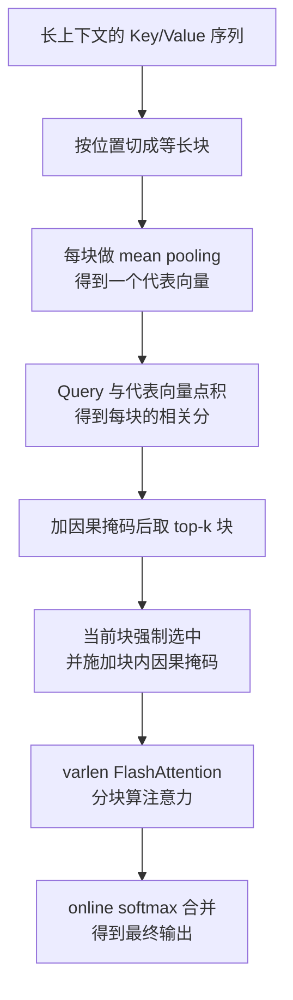
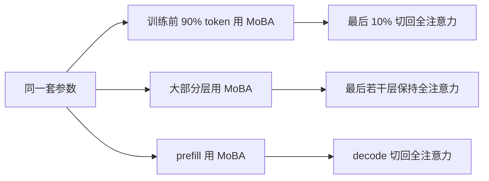
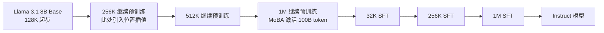
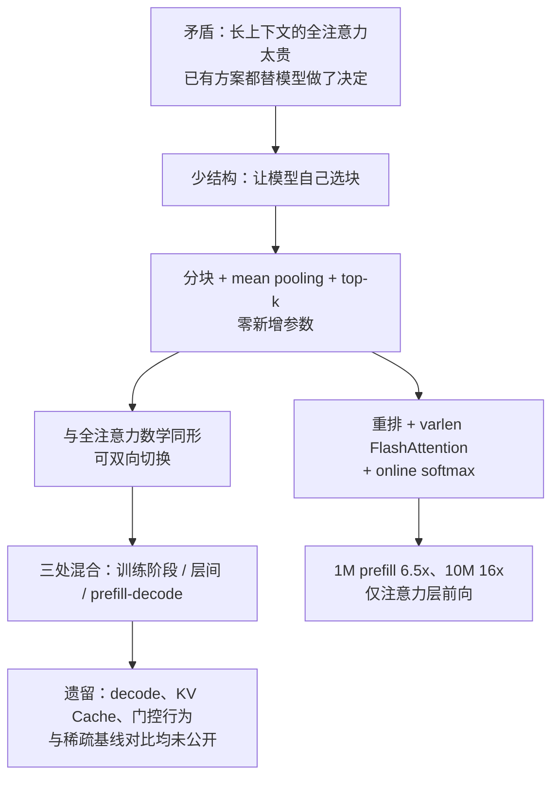

# MoBA：不预设看哪里，让注意力自己挑该读的那几段历史

<!-- release-date: 2025-02-18 -->

> 本文依据 **MoBA: Mixture of Block Attention for Long-Context LLMs**（Technical Report），即 arXiv:2502.13189v1、2025-02-18 提交版，共 15 页。封面署名机构为 Moonshot AI、Tsinghua University、Zhejiang Lab/Zhejiang University 三家（PDF p.1）。截至本文写作时，arXiv 上只有 v1，没有后续修订版；本地原件与官方版本一致。页码均指 PDF 本身的页码。本文会把三件事分开写：**报告明确写了什么**、**我们如何理解它**（凡属推算或推论都会写明）、**外部资料补充**（会给出链接并标注）。

## 阅读前先搭一张最小地图

这篇论文只讲一件事：注意力。但它借了不少别处的词，先把它们翻成人话。

- **Token（词元）**：模型读写内容时的基本小块。一段一百万字的文档，会被切成上百万个 Token。
- **Attention（注意力）**：当前这个 Token 决定「该参考前文哪些位置」的机制。它先给每个历史位置打分，再按分数加权取信息。
- **Query / Key / Value（查询 / 键 / 值）**：注意力的三个角色。Query 是当前 Token 的提问，Key 是每个历史 Token 的索引标签，Value 是它真正携带的内容。打分靠 Query 与 Key 做点积。
- **KV Cache（Key-Value Cache，键值缓存）**：生成时把已经算过的 Key 和 Value 存起来，避免每生成一个新 Token 都重算整段历史。
- **Mixture-of-Experts（MoE，混合专家）**：模型里有很多个前馈网络（专家），但每个 Token 只调用其中少数几个。挑选专家的小模块叫 **门控网络（gating network）**，也叫 **router（路由器）**。
- **FlashAttention**：一种把注意力计算按小块搬进片上高速缓存、避免反复读写显存的实现方式。它算的是**精确**注意力，不做任何近似，只是更省内存带宽。
- **Prefill 与 Decode（预填充与解码）**：模型处理一个请求分两段。Prefill 是一次性读完整段输入提示，Decode 是随后逐个吐出新 Token。两段的计算特征完全不同。

这篇论文自己造的名字只有一个：

- **Mixture of Block Attention（MoBA，混合块注意力）**：把历史上下文按位置切成一段段等长的块，让每个 Query Token 用 MoE 那套 top-k 门控，自己挑少数几个块去读，其余块完全不算。

## 一句话先说清

MoBA 不是一种新的注意力**公式**，它是一种新的注意力**选择机制**。

它没有换掉 softmax，没有改成线性递归，没有新增任何一个参数。它只是在原本的注意力之前插了一步「先选块」：把上下文切成块，给每个块算一个便宜的代表分，只对分数最高的 k 个块做真正的注意力。（PDF p.3、式 2-6）

因为不新增也不删减参数，MoBA 与 full attention（全注意力）之间可以**双向切换**——同一套权重，这一层可以跑 MoBA，下一层可以跑全注意力；训练前 90% 的 Token 可以用 MoBA，最后 10% 可以切回全注意力；prefill 可以用 MoBA，decode 可以切回全注意力。（PDF p.4、7、9）

论文最想让读者记住的原则叫 **less structure（少结构）**：

> 不要替模型规定「你应该看开头」或「你应该看最近的一段」。把选择权交回给模型，只给它一个足够便宜的选择方式。

## 先看全景：一次 MoBA 注意力发生了什么

这张图根据论文 §2.2、§2.3、Figure 1b 与 Algorithm 1 重画（PDF p.3-5），表达的是一次前向计算的机制顺序，不代表各步耗时比例。

三组必须记住的数字，先摆在这里，后面每一处都会回到出处：

| 场景 | 块大小 B | top-k | 序列长度 | 稀疏度 | 出处 |
|---|---:|---:|---:|---:|---|
| scaling law 实验 | 512 | 3 | 8K | 81.25% | PDF p.6 |
| 长上下文 scaling | 512 | 3 | 32K | 95.31% | PDF p.7 |
| Llama-8B-1M-MoBA | 4096 | 12 | 1M | 95.31% | PDF p.9 |

## 第一层问题：长上下文为什么会把全注意力压垮

### 成本是平方增长的

标准注意力里，每个 Query Token 都要和前面所有 Key 比一次。序列长度记作 $N$，则比较次数大约是 $N^2$ 量级：

$$
\text{Attn}(q, K, V) = \mathrm{Softmax}\!\left(qK^{\top}\right) V
$$

这是论文式 (1)（PDF p.2）。式子本身很朴素：$q$ 是一个 Query 向量，$K, V$ 是全部 $N$ 个历史 Token 的 Key 和 Value 矩阵。$qK^{\top}$ 得到 $N$ 个分数，softmax 归一化后去加权 $V$。

问题就在「全部 $N$ 个」这五个字。上下文从 10 万涨到 100 万，比较工作不是多十倍，而是多一百倍。论文开篇把这件事定为长上下文的核心障碍，并指出这个需求不只来自长输入（Kimi、Claude、Gemini），也来自长思维链输出（Kimi k1.5、DeepSeek-R1、OpenAI o1/o3）。（PDF p.1）

### 已有的三条路，各自付什么代价

论文没有直接跳到自己的方案，而是先说清三类前人做法卡在哪（PDF p.1-2）：

**第一类：静态稀疏结构。** 例如 attention sink（注意力汇聚点，永远看开头几个 Token）和 sliding window attention（SWA，滑动窗口注意力，只看最近一段）。这类做法把「该看哪里」写死成一条规则。论文的批评是：它们高度任务特定（task-specific），可能损害模型的整体泛化能力。

**第二类：推理期动态稀疏。** 例如 Quest、Minference、RetrievalAttention，在推理时才动态挑选 Token 子集。论文的批评更具体：它们能减少长序列的推理计算，但**不能实质缓解长上下文模型的训练成本**。训练时还是要跑全注意力，所以模型很难高效地扩到百万级上下文。

**第三类：线性注意力。** Mamba、RWKV、RetNet 用线性近似替换 softmax 注意力。论文给了两条批评：一是与常规注意力差异太大，改造已有 Transformer 的转换成本高，或者干脆得从头训；二是它们在复杂推理任务上的有效性证据仍然有限。

三条路的共同点是：**都替模型做了决定**。要么规定看哪里，要么规定用什么方式记住历史。

### 所以论文的研究问题是什么

论文把它写成一句话（PDF p.2）：能否设计一种既保留原始 Transformer 框架、又遵循「少结构」原则的注意力架构，让模型自己决定看哪里，并且能在全注意力与稀疏注意力之间无缝切换？

这句话里有三个约束，缺一不可：

1. **保留 Transformer 框架**——这样才能直接改造已有的预训练模型，不必从零开始；
2. **少结构**——不预设注意力模式；
3. **可无缝切换**——训练和推理的不同阶段可以用不同模式。

MoBA 的每一个设计选择，都是为了同时满足这三条。

## 核心设计：MoBA 到底怎么工作

### 把 MoE 的思路搬到注意力上

MoE 原本用在前馈网络层：有很多专家，门控网络给每个 Token 挑几个专家。MoBA 的类比很直接——**把「专家」换成「历史块」**。（PDF p.2、3）

于是注意力从「看全部」变成「看选中的一部分」：

$$
\mathrm{MoBA}(q, K, V) = \mathrm{Softmax}\!\left(qK[I]^{\top}\right) V[I]
$$

这是论文式 (2)（PDF p.3）。和式 (1) 唯一的差别是那个 $[I]$：$I \subseteq [N]$ 是被选中的 Key/Value 下标集合。式子的形状没变，softmax 没变，只是参与运算的历史变少了。

### 第一步：切块

把长度 $N$ 的上下文均分成 $n$ 块，块大小 $B = N/n$，第 $i$ 块覆盖的位置区间是：

$$
I_i = \left[(i-1)\times B + 1,\ i \times B\right]
$$

这是论文式 (3)（PDF p.3）。注意这里切的是**序列长度维度**，不是 MoE 那样切前馈网络的中间隐藏维度——论文在 §2.2 专门点明了这个区别（PDF p.4）。

最终被读取的下标集合，就是所有被选中块的并集：

$$
I = \bigcup_{g_i > 0} I_i
$$

这是式 (4)。$g_i$ 是第 $i$ 块的门控值，选中为 1，未选中为 0。

### 第二步：给每块打一个便宜的分

要挑块，就得先给每块打分。MoBA 的打分方式极其简单：

$$
s_i = \left\langle q,\ \mathrm{mean\_pool}\bigl(K[I_i]\bigr) \right\rangle
$$

这是式 (6)（PDF p.3）。拆开读：

1. 把第 $i$ 块里所有 Key 向量**沿序列维度求平均**，得到一个代表向量；
2. 当前 Query 和这个代表向量做内积，得到相关分 $s_i$。

这一步值得停一下。它意味着：**块的代表向量不是学出来的，是算出来的。** 没有任何新参数，没有额外的投影矩阵，就是一个平均。这就是 MoBA 「不新增参数」承诺的技术根基——后面所有的切换自由度都来自这里。

代价当然存在：平均池化会把块内的差异抹平。如果一个 4096 Token 的块里只有一句话跟当前问题相关，那句话的信号会被其余 4000 多个 Token 稀释。论文自己在 Related Work 里点了这一点的另一种可能：Quest 可以看作块更小、且块表示函数同时用 min 和 max pooling 的 MoBA（PDF p.10-11）。但论文**没有**做块表示函数的消融实验，也没有把 mean pooling 与其他池化方式做对比。这是一个明确的空白。

### 第三步：top-k 选块

$$
g_i =
\begin{cases}
1 & s_i \in \mathrm{Topk}\bigl(\{s_j \mid j \in [n]\},\, k\bigr) \\
0 & \text{otherwise}
\end{cases}
$$

这是式 (5)（PDF p.3）。取分数最高的 $k$ 个块，其余全部丢弃。注意这里**没有把门控值乘回注意力输出**——$g_i$ 只是一个 0/1 的选择开关，不是 MoE 里那种参与加权的软权重。选中的块进入 softmax 内部一起归一化，被丢弃的块等价于分数为 $-\infty$。

论文给的走查例子（PDF p.3，Figure 1a）：两个 Query Token、四个 KV 块、top-2。router 给第一个 Query 选了第 1、2 块，给第二个 Query 选了第 3、4 块。同一层里，不同 Token 读的历史可以完全不同——这正是「让模型自己决定」的直观体现。

### 因果性：两道必须打的补丁

自回归语言模型有一条铁律：一个 Token 不能影响它前面的 Token，也不能看到它后面的内容。分块 + 池化会在两个地方破坏这条铁律，论文给了两道对应的补丁（PDF p.4）。

**补丁一：不许选未来的块。** 形式化地说，对任何满足 $\mathrm{pos}(q) < i \times B$ 的块 $i$，直接令 $s_i = -\infty$、$g_i = 0$。$\mathrm{pos}(q)$ 是当前 Query 的位置下标。这一步很直白：还没走到的块，压根不参与 top-k。

**补丁二：当前块必须选中，而且要加块内因果掩码。** 「当前块」指包含 Query 自己的那一块。这块的麻烦在于，它的 mean pooling 代表向量是对**整块**求平均算出来的，里面掺了 Query 之后的 Token 信息——光是给它打分就已经泄漏了未来。论文的处理是两件事一起做：

- 强制 $g_i = 1$，当前块永远被选中，不参与 top-k 竞争；
- 在当前块内部施加标准的因果掩码，Query 只能看到块内位于它之前的位置。

论文特意点出这个设计的第二重收益：它顺带**鼓励模型关注局部上下文**。并给了一个精准的类比——从 MoE 的视角看，MoBA 的当前块注意力扮演的就是现代 MoE 架构里 **shared expert（共享专家）** 的角色：一条绕过路由、永远启用的静态通路。（PDF p.4）

这里有一个论文脚注顺带交代、但很容易被漏掉的推论（PDF p.6，脚注 3）：**当 top-k = 3 时，每个 Query 实际上最多只能看 2 个历史块，外加当前块。** 也就是说 $k$ 这个预算里，有一格是被 shared expert 占掉的。

### 一个论文没写、但可以直接推出的性质

把补丁一和式 (5) 放在一起看，会得到一个有意思的结论：**序列开头的 Token，其实跑的是全注意力。**

推理很简单。位置 $p$ 处的 Query 只有 $\lceil p/B \rceil$ 个块可选。当这个数字小于等于 $k$ 时，top-k 会把所有可用的块都选上，一个都不丢——此时 MoBA 与全注意力在数学上完全等价。以 Llama-8B-1M-MoBA 的配置（$B=4096$、$k=12$）为例，前 $12 \times 4096 = 49152$ 个 Token 全部落在这个区间里。

这是本文对式 (5) 和因果约束的推算，论文正文没有写这一点。它有两个实际含义：一是 MoBA 的「稀疏度」是随位置逐渐生效的，论文报的都是「up to（最高达到）」某个百分比而不是平均值；二是短请求走 MoBA 基本不会掉精度，因为它根本没在稀疏。

### 稀疏度到底怎么算

论文用的公式一律是 $1 - \dfrac{B \times k}{N}$。三组配置代入后：

- 8K 序列、$B=512$、$k=3$：$1 - \frac{512\times3}{8192} = 81.25\%$（PDF p.6）
- 32K 序列、同样的 $B$ 和 $k$：$1 - \frac{512\times3}{32768} = 95.31\%$（PDF p.7）
- 1M 序列、$B=4096$、$k=12$：$1 - \frac{4096\times12}{1\text{M}} = 95.31\%$（PDF p.9）

关键在于：**块大小和 top-k 固定后，稀疏度完全由实际序列长度决定。** 同一个 Llama-8B-1M-MoBA，跑 1M 输入时稀疏度 95.31%，跑 128K 的 RULER 时稀疏度只有 $1 - \frac{4096\times12}{128\text{K}} = 62.5\%$（PDF p.9）。这不是配置变了，是分母变了。看后面的评测表时必须记住这一点。

这里也要指出论文自身的一处口径不一致：§3.1 先用算式得出 8K 设置下稀疏度是 81.25%，同一段末尾总结时却把这套配置的稀疏度写成了 75%（PDF p.6）。两个数字指向同一组实验，论文没有解释 75% 从何而来。本文按 81.25% 这个有算式支撑的数字理解。

## 为什么 MoBA 能和全注意力自由切换

这是 MoBA 区别于大多数稀疏注意力方案的地方，也是它能被真正用起来的原因。

### 根基：参数数量完全不变

论文的原话是：MoBA 被设计成 full attention 的替代品，参数数量完全一致，既不增加也不减少（PDF p.4）。因为门控是无参数的（mean pooling + 点积），切换模式不需要加载新权重，也不需要丢弃旧权重。

由此推出一条很强的性质：**在初始化时，每一层可以自由选择用 full attention 还是 MoBA，而且这个选择可以在训练过程中动态改变。**（PDF p.4）

### 表达力：SWA 和 attention sink 都是 MoBA 的特例

论文在 §2.2 末尾给了一个漂亮的论证（PDF p.4）：

- **滑动窗口注意力（SWA）** 等价于「门控网络永远选最近几个块」的 MoBA；
- **attention sink** 等价于「门控网络永远同时选最开头的块和最近的块」的 MoBA。

也就是说，这两种流行的静态稀疏结构，都可以通过固定 MoBA 的门控行为得到。论文由此得出结论：MoBA 的表达能力严格强于 SWA 和 attention sink，并且能灵活逼近许多静态稀疏架构。

这条论证的分量在于：它把「少结构」从一句口号变成了可验证的主张。静态方案能做到的，MoBA 都能通过特定门控做到；反过来不成立。

### 切换发生在三个不同的位置

这张图根据论文 §3.2 与 §3.3 的三处描述重画（PDF p.7、8、9），是机制示意，三条路径可以同时使用。三种切换分别对应后面三组实验，接下来逐个讲。

## 工程实现：把不规则的稀疏变成规则的 varlen 计算

### 难点在哪

MoBA 的稀疏模式是**逐 Token 不同**的：Token A 选了第 3、7、9 块，Token B 选了第 1、5、9 块。如果照着这个模式直接算，注意力矩阵会变成一堆散乱的小块，GPU 完全跑不满。

论文的解法是换个视角组织计算：**不按 Query 组织，按块组织。** 把所有选了第 9 块的 Query 收集到一起，对第 9 块做一次批量注意力。这样每个块对应一次形状规整的矩阵乘法，只是每个块拿到的 Query 数量不一样——这正好是 FlashAttention 的 **varlen（variable length，变长）** 接口能处理的形态。

### 五个步骤

论文 §2.3 给出的实现流程（PDF p.4-5）：

1. 根据门控网络和因果掩码，确定 Query Token 到 KV 块的分配；
2. 按照分配的 KV 块，**重排** Query Token 的顺序；
3. 对每个 KV 块和分配给它的那批 Query 计算注意力——这一步用变长 FlashAttention 优化；
4. 把注意力输出**重排回**原始顺序；
5. 用 **online softmax（在线 softmax，即 tiling 分块归一化）** 把结果合并，因为一个 Query 会同时读它的当前块和多个历史块。

第 5 步是关键。同一个 Query 的注意力被拆成了好几次独立计算，每次算出来的都是局部归一化结果。online softmax 让这些局部结果可以在只保存运行中的最大值和求和项的前提下正确合并，数学上等价于一次性做完整 softmax。

### Algorithm 1 逐行读

论文把流程写成了 17 行伪代码（PDF p.5，Algorithm 1）。输入是 $Q, K, V \in \mathbb{R}^{N \times h \times d}$，$h$ 是注意力头数，$d$ 是头维度，$n = N/B$ 是块数。核心几步：

- 第 2 行切块，得到 $\tilde{K}_i, \tilde{V}_i \in \mathbb{R}^{B \times h \times d}$；
- 第 4 行 $\bar{K} = \mathrm{mean\_pool}(K, B) \in \mathbb{R}^{n \times h \times d}$，把每块压成一个代表向量；
- 第 5 行 $S = Q\bar{K}^{\top} \in \mathbb{R}^{N \times h \times n}$，一次矩阵乘法算出全部 Query 对全部块的相关分；
- 第 7-8 行加因果掩码后取 top-k，得到稀疏的「Query 到块」映射矩阵 $G$；
- 第 10、13 行处理当前块（`causal=True`）；
- 第 11、14 行处理历史块（`causal=False`）；
- 第 16 行用 online softmax 合并两路结果。

注意第 13 行和第 14 行的 `causal` 参数不同，这就是前面「补丁二」在代码层的落地：历史块整块可见，不需要掩码；当前块必须逐位置掩掉未来。**两路必须分开算，正是因为它们的掩码语义不同。**（PDF p.5）

值得注意的还有一处：第 5 行的门控打分是一次 $N \times h \times n$ 的稠密矩阵乘法。它比全注意力的 $N \times h \times N$ 小了 $B$ 倍，但形状仍然是「所有 Query × 所有块」。这个观察在后面讨论复杂度时会用到。

### Figure 1b 透露的一个细节

论文正文没写、但 Figure 1b 的连线画得很清楚（PDF p.3）：Q 和 K 先经过 **RoPE（Rotary Position Embedding，旋转位置编码）**，MoBA Gating 的两个输入分支都从 RoPE **之后**引出。也就是说，块的 mean pooling 代表向量是在**加过位置编码的 Key** 上算的，门控打分也是用加过位置编码的 Query 做的。

这不是无关紧要的细节：RoPE 会让 Key 向量随位置旋转，对一整块旋转过的 Key 求平均，得到的代表向量同时混合了内容信息和位置信息。论文既没有解释为什么这样接，也没有做「RoPE 前打分 vs RoPE 后打分」的对比。本文只能如实记录图上的接法，不替论文补理由。

## 实验一：scaling law 证明了什么，没证明什么

### 实验配置

论文按 Chinchilla scaling law 训了五个模型（PDF p.6，Table 1）：

| 参数量 | 头数 | 层数 | 隐藏维度 | 训练 Token | 块大小 | top-k |
|---:|---:|---:|---:|---:|---:|---:|
| 568M | 14 | 14 | 1792 | 10.8B | 512 | 3 |
| 822M | 16 | 16 | 2048 | 15.3B | 512 | 3 |
| 1.1B | 18 | 18 | 2304 | 20.6B | 512 | 3 |
| 1.5B | 20 | 20 | 2560 | 27.4B | 512 | 3 |
| 2.1B | 22 | 22 | 2816 | 36.9B | 512 | 3 |

本文换算：隐藏维度除以头数，五个模型全都等于 128——这个系列是靠加头数和加层数扩规模的，头维度保持不变。论文没有点明这一点。

对照实验设计得很干净：MoBA 不引入也不移除参数，所以全部超参（学习率、batch size）完全一致，**唯一的差别就在注意力模块**（PDF p.6）。这是一个很值得学的对照设计——变量真正只有一个。

### 结论一：普通 LM loss 上，两者几乎重合

拟合出的 scaling law 曲线（PDF p.6，Figure 3c）：

| 指标 | MoBA | Full |
|---|---|---|
| LM loss（seqlen=8K） | $2.625 \times C^{-0.063}$ | $2.622 \times C^{-0.063}$ |
| Trailing LM loss（seqlen=32K, last 2K） | $1.546 \times C^{-0.108}$ | $1.464 \times C^{-0.097}$ |

$C$ 是训练算力（横轴单位是 PFLOP/s-days）。第一行两条曲线的指数完全相同，系数只差 0.003。论文说验证 loss 的差异始终保持在 $1e-3$ 范围内（PDF p.6）。

**但第一行几乎说明不了长上下文能力。** 论文自己在下一页解释了原因：LM loss 会被数据长度分布带偏，而真实语料里短序列占绝大多数（PDF p.7）。平均 loss 里，长距离依赖的贡献被淹没了。

### 结论二：真正的指标是 trailing LM loss

于是论文定义了 **trailing LM loss（尾部 Token 的语言模型损失）**：只统计序列**最后若干个 Token** 的 loss，而且只统计那些真正达到了最大序列长度的序列，避免短序列引入偏差（PDF p.7）。

附录 A.1 交代了更具体的做法和一个重要发现（PDF p.13）：他们按实际位置把序列切成离散段，例如 30K-32K 这一段只反映长度超过 30K 的文档，并掩掉该位置之前的部分。**关键发现是：尾部 Token 贡献了全注意力基线与稀疏注意力之间性能差异的大部分。** 因此他们把长上下文 scaling 的研究简化成了 trailing token scaling。

这是一个很有迁移价值的方法论：**当你要评估一个只在特定条件下才退化的改动时，先找到差异集中出现的那个子集，然后只在那个子集上做 scaling 研究。** 它同时降低了计算成本和噪声。

### 结论三：尾部 loss 上 MoBA 确实落后，但曲线更陡

回到上表第二行。MoBA 的系数 1.546 明显高于 full 的 1.464——在同等算力下，MoBA 的尾部 loss 更差。论文的说法是：MoBA 在全部五个实验中的最后一块 LM loss 都略高于全注意力，但**差距在逐步收窄**（PDF p.7）。

「收窄」的依据就是那个指数：MoBA 是 $-0.108$，full 是 $-0.097$，MoBA 的曲线更陡。算力越大，两条线越接近。

本文推算：把这两条拟合线令其相等，$1.546 \times C^{-0.108} = 1.464 \times C^{-0.097}$，解得交点约在 $C \approx 1.4 \times 10^2$ PFLOP/s-days。而从 Figure 3b 的横轴看，实验实际跑到的算力大约在 $10^0$ 到 $10^1$ 量级。**所以这个交点远在实验范围之外，是对两个拟合常数的纯算术外推，不是实验结论。** 论文没有给出这个交点，也没有声称会追平——只说了「差距在收窄」。读的时候要把这两句话区分开。

### 附录 Table 3 里藏着一个论文没有强调的信号

论文在 p.15 的 Table 3 给了 16 个位置区间各自的拟合幂律。本文把 MoBA 与 full 的系数差逐行相减：

| 位置区间 | MoBA 系数 | Full 系数 | 差 |
|---|---:|---:|---:|
| 0K-2K | 3.075 | 3.068 | 0.007 |
| 8K-10K | 1.789 | 1.774 | 0.015 |
| 16K-18K | 1.607 | 1.567 | 0.040 |
| 24K-26K | 1.565 | 1.502 | 0.063 |
| 30K-32K | 1.546 | 1.464 | 0.082 |

（原表 16 行完整数据见 PDF p.15，这里只摘 5 行示意。）

**系数差随位置几乎单调扩大，从 0.007 一路涨到 0.082。** 这是本文对 Table 3 的算术观察，论文正文只说了「尾部 loss 略高」，没有展示这个随位置递增的趋势。它的含义很直白：MoBA 的代价不是均匀分布的，而是越往序列深处越明显。这与 §3.2 中 position-wise loss 曲线的形状（PDF p.8，Figure 5a）是一致的。

### 一处需要指出的标注不一致

同一个指标在 Figure 3 里被标了两种口径：图注说 trailing LM loss 统计的是序列**最后 1K** 个 Token，但同一张图 (b) 的纵轴标签、以及 (c) 表格的行名，写的都是**最后 2K**（PDF p.6）。三处标注里有两处写 2K。本文按 2K 引用，并在此标出这处不一致，供读者核对原件。

## 实验二：块要切多细

### 问题

MoE 文献里有一个成熟结论：把专家切得更细（fine-grained expert segmentation）能提升性能。MoBA 沿的是上下文长度维度切，论文想知道这个结论能不能迁移过来（PDF p.4、7）。

### 设计

用 1.5B 模型、32K 上下文，**保持稀疏度恒定为 75%**，只改块的粒度（PDF p.7）：

| 块数 | 8 | 16 | 32 | 64 | 128 |
|---|---:|---:|---:|---:|---:|
| top-k | 2 | 4 | 8 | 16 | 32 |

每一列的 $k/n$ 都等于 0.25，所以读到的 Token 总量完全一样。唯一变化的是「以多细的颗粒度做选择」。这个对照同样很干净。

### 结果

Figure 4 的读数（PDF p.7）：

| 设置 | 2/8 | 4/16 | 8/32 | 16/64 | 32/128 | 全注意力基线 |
|---|---:|---:|---:|---:|---:|---:|
| LM loss | ≈2.2578 | ≈2.2434 | ≈2.2401 | ≈2.2431 | ≈2.2409 | ≈2.2417 |

（这些是本文从 Figure 4 图上读出的近似值，论文没有给出数值表。）

论文的结论：最粗粒度设置（8 块选 2）与更细粒度设置之间存在 $1e-2$ 量级的性能差异；细粒度分块看来是 MoE 家族——包括 MoBA——的一项通用技术（PDF p.7）。

值得补一句本文的观察：从 4/16 往后，四个设置基本贴着全注意力基线上下抖动，其中 8/32 和 32/128 甚至略低于基线。**真正的落差只发生在最粗的那一档。** 所以这个实验的准确读法不是「越细越好」，而是「别切得太粗」。

### 代价：论文没测的那一半

细粒度不是免费的。回到 Algorithm 1 第 5 行：门控打分矩阵 $S \in \mathbb{R}^{N \times h \times n}$，块数 $n$ 越大这个矩阵越大。从 8 块到 128 块，打分矩阵大了 16 倍。同时，选中的块变多（top-k 从 2 涨到 32），每个块的 Query 批次变小，varlen 内核的调度开销也会上升。

**论文完全没有测量细粒度的效率代价**，Figure 4 只有 loss 一个维度。这是一个明确的空白：读者无法从论文知道「8/32 相比 2/8 多花多少时间」。

## 实验三：两种混合方式，各解决一个具体问题

### 混合方式一：训练阶段切换，救的是尾部 loss

**旧问题：** 全程用 MoBA 训练，尾部 Token 的 loss 会明显高于全注意力（前面 scaling law 已经看到）。但全程用全注意力又太贵。

**新设计：** 两段式配方。三个 1.5B 模型，各训 30B Token，32K 上下文，MoBA 用 $B=2048$、$k=3$（PDF p.7）：

- **MoBA/full 混合**：前 90% 的 Token 用 MoBA 训，后 10% 切回全注意力；
- **纯全注意力**：全程全注意力；
- **纯 MoBA**：全程 MoBA。

本文换算：$B=2048$、$k=3$、$N=32768$ 对应的稀疏度是 81.25%，论文这一段没有写出这个数字。

**评估方式：** position-wise LM loss（逐位置语言模型损失），把每个位置的 loss 单独拆开看，而不是全序列平均（PDF p.7-8）。

**结果：** Figure 5a（PDF p.8）显示，纯 MoBA 配方在尾部位置的 loss 明显更高——本文从图上读到，30K 位置处纯 MoBA 约 1.365，全注意力与混合配方约 1.315。而 **MoBA/full 混合配方的曲线几乎与全注意力完全重合**。

**额外收益：** 论文特别提到，在 MoBA 与全注意力切换的那一刻，**没有观察到明显的 loss spike（损失尖峰）**（PDF p.8）。这是一个工程上很有说服力的证据：切换是平滑的，不需要重新 warmup。

**代价与边界：** 90/10 这个比例论文没有做消融——为什么是 10% 而不是 5% 或 20%，没有依据。而且这个实验规模只有 1.5B / 30B Token / 32K，没有在更大规模上重复。

### 混合方式二：层级混合，救的是 SFT

**旧问题：** 论文观察到，MoBA 在 **SFT（Supervised Fine-Tuning，监督微调）** 阶段有时表现欠佳（PDF p.8，Figure 5b）。

**归因（论文明确写成推测）：** 原文用的词是 speculate。他们怀疑原因出在 SFT 的 **loss masking（损失掩码）**：SFT 时 prompt 部分的 Token 通常不计入 loss。对 MoBA 这类稀疏注意力来说，这会造成**稀疏梯度问题**——梯度最初只从未被掩码的 Token 上产生，而稀疏注意力可能阻碍这些梯度反向传播到整个上下文。（PDF p.8）

这个解释是自洽的：全注意力里，每个未掩码 Token 都与全部历史相连，梯度可以流向任何位置；MoBA 里，只有被 top-k 选中的块才在计算图上，未被选中的历史块**根本没有梯度路径**。prompt 被掩码之后，能产生梯度的 Token 本来就少，再叠加稀疏连接，长上下文里很多位置可能一整步都收不到信号。

**新设计：** 把最后若干层的 MoBA 换回全注意力，其余层保持 MoBA（PDF p.8）。

**结果：** Figure 5b 和 5c（PDF p.8），本文从图上读出的近似值（论文没有给数值表，也没有明写这两张图用的是哪个模型；从 §3.2 的上下文看应该仍是那组 1.5B / 32K 实验，但原文没有写死）：

| 全注意力层数 | 1 层 | 3 层 | 5 层 | 10 层 | 纯 MoBA | 纯全注意力 |
|---|---:|---:|---:|---:|---:|---:|
| SFT LM loss | ≈1.1365 | ≈1.1175 | ≈1.099 | ≈1.077 | ≈1.1445 | ≈1.0755 |
| SFT trailing loss（32K, last 2K） | ≈1.169 | ≈1.129 | ≈1.1015 | ≈1.0925 | ≈1.1705 | ≈1.0920 |

两条曲线都随全注意力层数单调下降，到 10 层时基本追平纯全注意力。论文的结论是这个策略能显著降低 SFT loss（PDF p.8）。

**这里必须诚实地说清一件事：** 表格显示，全注意力层数越多效果越好，10 层最好。但 10 层意味着更少的稀疏收益。论文**没有**讨论这个权衡，也没有给出「几层是性价比最优」的依据。然而在 §3.3 的真实模型里，他们只留了 3 层全注意力（PDF p.9）。按本文上表读数，3 层在 Figure 5b 上只走完了「纯 MoBA → 纯全注意力」那段落差的约四成，在 5c 上约五成。论文没有解释为什么最终选 3 而不是 5 或 10。

## 实验四：接到真实模型上

### 训练配方

论文以 **Llama 3.1 8B Base** 为起点做长上下文继续预训练，得到 **Llama-8B-1M-MoBA**（PDF p.8-9）：

这张图根据论文 Figure 6 与 §3.3 正文重画（PDF p.8-9），是阶段顺序示意，不表示各阶段耗时或数据量比例。需要说明：Figure 6 的第一个方框只写了 LLama3.1 8B，随后直接进入 256K 继续预训练，没有单独画出 128K 阶段——128K 起步这件事写在正文里。

关键细节（PDF p.9）：

- 初始上下文长度 128K，逐步扩到 256K、512K、1M；
- 在 256K 阶段开始时使用 **position interpolation（位置插值）** 来平滑过渡；
- 1M 继续预训练完成后，**MoBA 被激活并训练了 100B Token**；
- MoBA 配置：块大小 4096，top-K 12，稀疏度最高 95.31%；
- 层级混合：**最后 3 层保持全注意力，其余 29 层切成 MoBA**；
- 基线 Llama-8B-1M-Full 走完全相同的流程，唯一差别是全程用全注意力。

本文换算：29 + 3 = 32，即基座的全部注意力层都在这次改造范围内。

### 最关键的一条边界

论文用一句话交代了一件影响很大的事（PDF p.9）：

> 在所有评测任务中，MoBA 只用于 prefill，生成阶段切回全注意力以获得更好的性能。

请把这句话读三遍。它意味着：

1. **Table 2 和 Figure 7 的所有分数，都不是「纯 MoBA 模型」的分数**，而是「prefill 用 MoBA、decode 用全注意力」这个混合系统的分数；
2. 论文**没有**给出 decode 阶段用 MoBA 的任何结果；
3. **MoBA 不省 KV Cache。** 这一点论文没有明说，但从式 (6) 可以直接推出：门控要给**每一个**历史块打分，任何块都可能在下一步被选中，所以全部 Key 和 Value 都必须留在显存里。MoBA 省的是计算，不是显存。

第 3 点是本文的推论，不是论文原文。但它对工程选型很重要：如果你的瓶颈是 KV Cache 显存而不是 prefill 算力，MoBA 帮不上忙。

### 评测结果

Table 2（PDF p.9），加粗表示该行更高：

| Benchmark | Llama-8B-1M-MoBA | Llama-8B-1M-Full |
|---|---:|---:|
| AGIEval [0-shot] | 0.5144 | **0.5146** |
| BBH [3-shot] | 0.6573 | **0.6589** |
| CEval [5-shot] | **0.6273** | 0.6165 |
| GSM8K [5-shot] | **0.7278** | 0.7142 |
| HellaSWAG [0-shot] | 0.8262 | **0.8279** |
| Loogle [0-shot] | **0.4209** | 0.4016 |
| Competition Math [0-shot] | 0.4254 | **0.4324** |
| MBPP [3-shot] | **0.5380** | 0.5320 |
| MBPP Sanitized [0-shot] | **0.6926** | 0.6615 |
| MMLU [0-shot] | 0.4903 | **0.4904** |
| MMLU Pro [5-shot][CoT] | 0.4295 | **0.4328** |
| OpenAI HumanEval [0-shot][pass@1] | 0.6951 | **0.7012** |
| SimpleQA [0-shot] | 0.0465 | **0.0492** |
| TriviaQA [0-shot] | **0.5673** | 0.5667 |
| LongBench @32K [0-shot] | **0.4828** | 0.4821 |
| RULER @128K [0-shot] | 0.7818 | **0.7849** |

本文的读法：**MoBA 赢 7 项，全注意力赢 9 项，多数差距在小数点后第三位。** 这张表支持的结论是「打平」，不是「更优」。论文摘要里写的 superior performance on long-context tasks（PDF p.1）与这张表的实际内容之间是有距离的——表里最长的那个 benchmark（RULER @128K）恰恰是 MoBA 略输的那一项。

论文自己对 RULER 的表述是克制的：MoBA 在这里的稀疏度只有 62.5%，分数 0.7818 对 0.7849，「几乎追平」（PDF p.9）。这个表述是准确的。

再补一句本文的观察：这张表里的绝对值不宜跨论文比较。MMLU 两列都只有 0.49 上下，SimpleQA 两列都不到 0.05，而论文既没有交代评测框架，也没有说明 prompt 模板和判分方式（表头只标了 shot 数）。因为两列走的是同一套评测流程，**横向对比仍然有效，但把这些绝对值拿去和别的论文对齐是不安全的。**

### Needle in a Haystack

Figure 7（PDF p.9）是一张热力图，横轴上下文长度从 32000 一直到 1024000，纵轴是「针」插入的相对位置（0% 到 100%）。全部格子都落在色标顶端的绿色区间。论文的表述是：Llama-8B-1M-MoBA 在扩展到 100 万 Token 的上下文长度下表现令人满意。

本文的判断：这张图证明的是「1M 长度下 MoBA 不会崩」，而不是「1M 长度下 MoBA 检索能力很强」。NIAH 是一个相对容易的检索任务，全绿在这个年代的长上下文模型里是及格线而非高分。而且论文只给了 MoBA 一张图，**没有给全注意力基线的对照热力图**，所以看不出两者差别。

## 实验五：加速比到底测的是什么

### 6.5x 与 16x 的确切含义

论文比较的是 §3.3 里训出的两个模型——Llama-8B-1M-MoBA 与 Llama-8B-1M-Full——的**注意力层前向传播时间**。之所以只看注意力层，是因为其他层（如 FFN）在两个模型里 FLOPs 完全相同（PDF p.10）。

两组测量（PDF p.5，Figure 2；PDF p.10，§3.4）：

- **Figure 2a**：1M 模型，序列长度从 32K 扫到 1M（图注写的范围是 8K-1M，横轴刻度从 32K 标起）。本文从图上读到，1M 处全注意力约 940 ms，MoBA 约 145 ms。论文的结论是：**prefill 1M Token 时加速比最高达到 6.5x。**
- **Figure 2b**：固定稀疏度 95.31%（固定 64 个 MoBA 块、块大小随序列长度变化、top-k=3），序列长度扫到 10M。论文的结论是：**10M Token 时注意力计算时间的加速比达到 16x。**

必须记住的三条限定：

1. 这是**注意力层前向时间**，不是端到端训练吞吐，也不是线上服务延迟；
2. 这是 **prefill** 场景，不含 decode；
3. **论文没有给出任何硬件信息**——GPU 型号、卡数、精度、batch 配置一概没有。这些数字无法在别的环境里复现校验。

### 10M 那个数字还有一个前提

为了跑到 10M 上下文，论文说他们把**张量并行扩展到了 query head 层级**：把 Key 和 Value 张量广播到分布在不同设备上的 query head 上，从而绕开单卡显存限制、同时保住计算效率（PDF p.10）。

也就是说，16x 不是「把 MoBA 换上去就有」的收益，它是在一套特定并行策略下测出来的。论文没有给这套并行方案的实现细节。

### 一个本文认为需要修正的说法

论文说 MoBA 展现出 **sub-quadratic（次二次）** 的计算复杂度（PDF p.10）。本文认为这是对测量范围内曲线形状的描述，而不是严格的渐近性质。理由如下——这是本文对 Algorithm 1 的推算，论文没有做这个分析：

MoBA 的总代价可以拆成两项。第一项是门控打分，也就是 Algorithm 1 第 5 行那次「所有 Query × 所有块」的矩阵乘法；第二项是被选中的块内部真正的注意力：

$$
\text{门控打分} = N \times n = \frac{N^2}{B},
\qquad
\text{块内注意力} = N \times kB
$$

$N$ 是序列长度，$B$ 是块大小，$n = N/B$ 是块数，$k$ 是 top-k。总代价是这两项之和。

- 固定块大小 $B$ 和 top-k 时（Figure 2a 的场景），第二项是**线性**的，但第一项仍然是 $N^2$ 除以常数 $B$，仍是二次项；
- 固定块数 $n$、让块大小随 $N$ 增长时（Figure 2b 的场景），第一项变成线性，但 $B = N/n$ 使第二项变成 $\frac{k}{n}N^2$，二次项换到了另一边。

两种设定下都存在一个二次项，只是常数被压得很小。以 Llama-8B-1M-MoBA 的 $B=4096$、$k=12$ 代入：门控项与注意力项相等需要 $N/B = kB$，即 $N = kB^2 \approx 2.0 \times 10^8$ Token。在实测的 10M 以内，门控项占比不到 1%，所以曲线看起来确实近似线性。

**结论：说 MoBA 在实测范围内近似线性是准确的；说它渐近次二次并不严谨。** 这个区别在实践中未必重要（2 亿 Token 远超当前需求），但读论文时值得分清。

## MoBA 没有解决什么，论文又没有写什么

这一节是本文对全文的盘点，分两类。

### 论文明确留下的边界

- **decode 阶段没有结论。** 所有评测里 MoBA 只用于 prefill，生成阶段切回全注意力，论文给的理由只有「性能更好」四个字，没有量化不切回去会差多少。（PDF p.9）
- **只和全注意力比，没有和其他稀疏方案比。** 论文 Related Work 里点名了 Quest、Minference、SeerAttention、MoA、Longheads 等一大批同类工作（PDF p.10-11），但实验部分**一个稀疏基线都没有跑**。所以我们知道 MoBA 打平了全注意力，不知道它相对同类稀疏方案处在什么位置。
- **长思维链推理没有验证。** 论文引言用 Kimi k1.5、DeepSeek-R1、o1/o3 的长 CoT 需求做动机（PDF p.1），批评线性注意力在复杂推理上证据不足（PDF p.2），但自己的评测里也**没有强化学习或长推理链任务**。这个动机没有被自己的实验闭合。
- **生产部署没有数据。** 摘要说 MoBA 已经部署来支撑 Kimi 的长上下文请求（PDF p.1），但正文没有给任何生产侧数字：哪个模型、多大流量、省了多少成本、线上延迟如何，一概没有。

### 论文没有写、本文也不替它补的空白

- **门控行为完全没有分析。** 模型实际上倾向于选哪些块？是集中在最近的块，还是真的会跳到很远处？不同层、不同头的选择模式一样吗？会不会塌缩到少数几个块？MoE 需要负载均衡损失来防止专家塌缩，MoBA **既没有讨论这个风险，也没有引入任何均衡机制**。论文一张门控统计图都没有。
- **块表示函数没有消融。** 为什么是 mean pooling？换成 max、min+max（Quest 的做法）或者一个可学习的小投影会怎样？没测。
- **RoPE 与门控的关系没有讨论。** Figure 1b 显示门控用的是 RoPE 之后的 Q、K，正文一句都没提。
- **预训练阶段的层级混合没有测。** 层级混合只在 SFT 场景做了实验（Figure 5b/5c），真实模型在继续预训练时就用了「29 层 MoBA + 3 层全注意力」，但这个选择本身没有对照。
- **90/10 的切换比例没有消融。**
- **细粒度分块的效率代价没有测。**
- **硬件与实现环境没有交代。**

## 与同期方案的关系

MoBA 与 DeepSeek 的 **NSA（Native Sparse Attention）** 常被放在一起讨论，因为两者发布时间几乎重合。可核实的事实是：

- NSA 的论文是 **Native Sparse Attention: Hardware-Aligned and Natively Trainable Sparse Attention**，arXiv:2502.11089，v1 于 2025-02-16 提交（外部核对：[arXiv API](http://export.arxiv.org/api/query?id_list=2502.11089)）；
- MoBA 是 arXiv:2502.13189，v1 于 2025-02-18 提交，两者相差两天；
- MoBA 论文的参考文献里**没有**引用 NSA（PDF p.11-13），双方是独立的同期工作。

**本文不对两者的设计做逐点对比**，只交代一条已经核实过的差异。`reports/DeepSeek/DeepSeek-V3.2.md` 记录了 DeepSeek 在 V3.2 报告里引用 NSA 得出的一条内核层面要求。回到 NSA 原文核对后，这条要求的准确口径是：**对于 GQA / MQA 这类 KV 已被多个 Query 头共享的模型，必须确保同一组内各头的「块选择结果」一致**，以最小化 decode 时的 KV Cache 加载（NSA 原文 arXiv:2502.11089v2 p.7 用的是 "has to be ensured"）。两个限定要记住：被要求一致的是**选择索引列表**，不是 KV 条目本身;而且 NSA 在 p.4 明确让步过——**在 MHA 模型上逐头独立选择没有问题**，并集问题只在多头共享 KV 的架构上才成立。

MoBA 论文里没有讨论 Query 头共享这个维度，Algorithm 1 是逐头独立做门控的（$S \in \mathbb{R}^{N \times h \times n}$ 带头维度）。这个差异真实存在，但**恰好落在 MoBA 主动避开的场景里**：NSA 那条要求的动机完全锚定在 decode 访存，而 MoBA 的全部评测只在 prefill 用 MoBA、decode 切回全注意力。反过来它也给 MoBA 那句只有「性能更好」四个字的解释提供了一个结构性的候选原因——MoBA 的基座 Llama 3.1 8B 属于 GQA（见本仓库 `reports/Meta/Llama-3.md`），若在 decode 用逐头门控，要搬的正是并集。**但没有人做过这个实验**，因此不能据此推出「MoBA 在 decode 上一定更差」。

## 可迁移的六条

### 1. 想要「可切换」，就必须先做到「零新增参数」

MoBA 全部的灵活性——层间混合、训练阶段切换、prefill/decode 切换——都建立在一件事上：门控是无参数的。一旦门控里有了可学习矩阵，切回全注意力时这些参数就成了死重，切换也不再免费。

**迁移方式：** 设计任何「可选组件」时，先问它是否需要独占参数。无参数的判别式（池化、点积、统计量）虽然表达力弱，但换来的是部署期的自由度。这个取舍在很多系统里都值得重新算一遍。

### 2. 把新方案表达成旧方案的超集，是最强的辩护

论文证明 SWA 和 attention sink 都是「固定门控的 MoBA」，一举把「我的方法更好」变成了「我的方法能表达你的方法」。这比跑赢几个 benchmark 更有说服力，也更难被反驳。

**迁移方式：** 提出新机制时，先花力气找出「把哪些超参数写死，就退化成现有方案」。能建立这种包含关系，评审和落地的阻力都会小很多。

### 3. 平均指标掩盖问题时，先找到差异集中的子集

论文发现全注意力与稀疏注意力的差距**几乎全部集中在尾部 Token**，于是把长上下文 scaling 研究简化成 trailing token scaling（PDF p.7、13）。这一步同时降低了成本和噪声。

**迁移方式：** 任何「平均看起来没差别」的改动，都该问：差别是不是集中在某个子集里？找到那个子集，把评测集中打在那里。日志分析、推荐系统的长尾、RAG 的困难查询，都适用同一套思路。

### 4. 不规则稀疏要先重排，再交给规则内核

MoBA 的稀疏模式逐 Token 不同，直接算会把 GPU 跑成筛子。它的做法是换一个组织维度——按块聚合 Query，再用变长内核处理批次大小不一的问题（PDF p.4-5）。

**迁移方式：** 遇到不规则计算，先想「能不能通过重排把它变成规则的一批」，而不是直接写一个通用的稀疏内核。重排 + 还原的开销通常远小于内核跑不满的损失。

### 5. 因果性要在「打分」和「读取」两处分别检查

MoBA 的两道补丁值得单独记住：不看未来块管的是**读取**，当前块强制选中 + 块内因果掩码管的是**打分泄漏**。后者更隐蔽——mean pooling 本身就会把未来信息混进块的代表向量。

**迁移方式：** 任何带「先摘要、再选择」结构的系统（分层检索、两阶段召回、缓存索引），都要分别检查摘要环节和读取环节的信息边界。摘要泄漏比读取泄漏更难发现。

### 6. 加速比的分母要写清楚

论文的 6.5x 和 16x 都是**注意力层前向时间**、**prefill 场景**、**未公开硬件**。这三条限定任缺一条，数字就会被读成别的意思。

**迁移方式：** 报告任何加速比时，把测量对象、场景和环境三件事显式写出来。不这样做，好数字反而会变成后续争议的来源。

## 用一张图重新串起全文

这张图是本文对全文逻辑的归纳，不对应论文中的任何一张图。

## 关键词回看

- **MoBA（Mixture of Block Attention，混合块注意力）**：把上下文切成等长块，用无参数 top-k 门控让每个 Query 只读少数块。
- **Less structure（少结构）**：不预设注意力应该看哪里，把选择权交回模型的设计原则。
- **块（block）**：沿序列长度维度切出的一段连续 Token；MoBA 里的「专家」就是块。
- **Mean pooling 块表示**：把一块内所有 Key 求平均得到的代表向量，用于打分。无参数，也因此有损。
- **当前块（current block）**：包含 Query 自身的那一块，永远被强制选中，作用类似 MoE 的 shared expert。
- **Trailing LM loss（尾部损失）**：只统计达到最大长度的序列的最后若干 Token 的 loss，用来避开短序列对平均指标的稀释。
- **Position-wise LM loss（逐位置损失）**：把每个位置的 loss 单独拆开看，用来发现「差距集中在哪一段」。
- **MoBA/full 混合训练**：前 90% Token 用 MoBA、后 10% 切全注意力的两段式配方。
- **层级混合（layer-wise hybrid）**：最后若干层保持全注意力、其余层用 MoBA，主要为解决 SFT 的稀疏梯度问题。
- **Varlen FlashAttention（变长 FlashAttention）**：允许每次调用的序列长度不一致的 FlashAttention 接口，用来吃下 MoBA 重排后大小不齐的 Query 批次。
- **Online softmax**：分块计算注意力后正确合并局部归一化结果的方法，数学上等价于一次完整 softmax。
- **Position interpolation（位置插值）**：把已有的位置编码范围压缩映射到更长上下文的外推方法，用于 128K→256K 的过渡。

## 最后的判断

MoBA 的价值不在于它跑赢了什么，而在于**它把稀疏注意力从「一次性架构决定」变成了「可以随时反悔的运行时选项」**。

被实验支持的结论：

- 在 8K/32K 的中小规模 scaling law 实验里，MoBA 与全注意力的普通 LM loss 几乎完全重合（PDF p.6）；
- 尾部 Token 上 MoBA 确实落后，但拟合曲线更陡（PDF p.6-7）；
- 块切得太粗会明显掉点，4/16 及更细的设置基本贴着全注意力基线（PDF p.7）；
- 训练末段切回全注意力，可以把 position-wise loss 拉回与全注意力几乎重合，切换时没有 loss spike（PDF p.8）；
- 在 Llama 3.1 8B 上做到 1M 上下文，16 个 benchmark 与全注意力基线互有胜负、差距极小（PDF p.9）；
- 注意力层前向在 1M prefill 上快 6.5 倍、10M 上快 16 倍（PDF p.5、10）。

只是作者观察或推测的部分：

- SFT 掉点归因于 loss masking 造成的稀疏梯度——论文原文用的是 speculate（PDF p.8）；
- 尾部差距会继续收窄——依据是拟合指数，不是实测追平（PDF p.7）；
- 「已部署支撑 Kimi 长上下文请求」——没有任何生产数据支撑（PDF p.1）。

完全没有公开的部分：门控的实际选择行为、decode 阶段的表现、与其他稀疏方案的对比、硬件环境、块表示函数与切换比例的消融。

如果只记一句话，可以记：

> **稀疏注意力真正难的不是「少算」，而是「少算之后还能随时改回来」。MoBA 用一个无参数的门控换到了这个自由度，代价是它在最需要精度的序列尾部始终留着一道可测量的差距。**

## 资料与阅读边界

- 原始依据：本地 `papers/Moonshot/MoBA.pdf`，MoBA Technical Report，arXiv:2502.13189v1，15 页。arXiv 官方页与 API 均显示仅有 v1，无后续修订。
- 论文页：[arXiv:2502.13189](https://arxiv.org/abs/2502.13189)。
- 官方代码仓库：[MoonshotAI/MoBA](https://github.com/MoonshotAI/MoBA)。首次公开提交时间 2025-02-18T10:36:11Z（外部核对：[GitHub Commits API](https://api.github.com/repos/MoonshotAI/MoBA/commits)），略早于 arXiv v1 的 2025-02-18T14:06:05Z。本文的 release-date 取这两个官方事件中较早者所在的日期。**本文没有阅读该仓库源码，也没有把仓库中的实现细节当作论文结论。**
- 同期工作的时间关系：NSA 论文 arXiv:2502.11089 v1 提交于 2025-02-16（外部核对：[arXiv API](http://export.arxiv.org/api/query?id_list=2502.11089)）。本文只用这条信息说明两者同期，不对设计做比较。
- 本仓库内部交叉引用：`reports/DeepSeek/DeepSeek-V3.2.md` 中关于 NSA 内核要求的记述，来自 DeepSeek-V3.2 报告的转述，不是 NSA 原文，也不是 MoBA 论文内容。
- 文中所有标为「本文推算」「本文换算」「本文从图上读到」的内容，都是对论文数据的二次处理，不是论文原文结论；论文原文结论一律带 PDF 页码。
