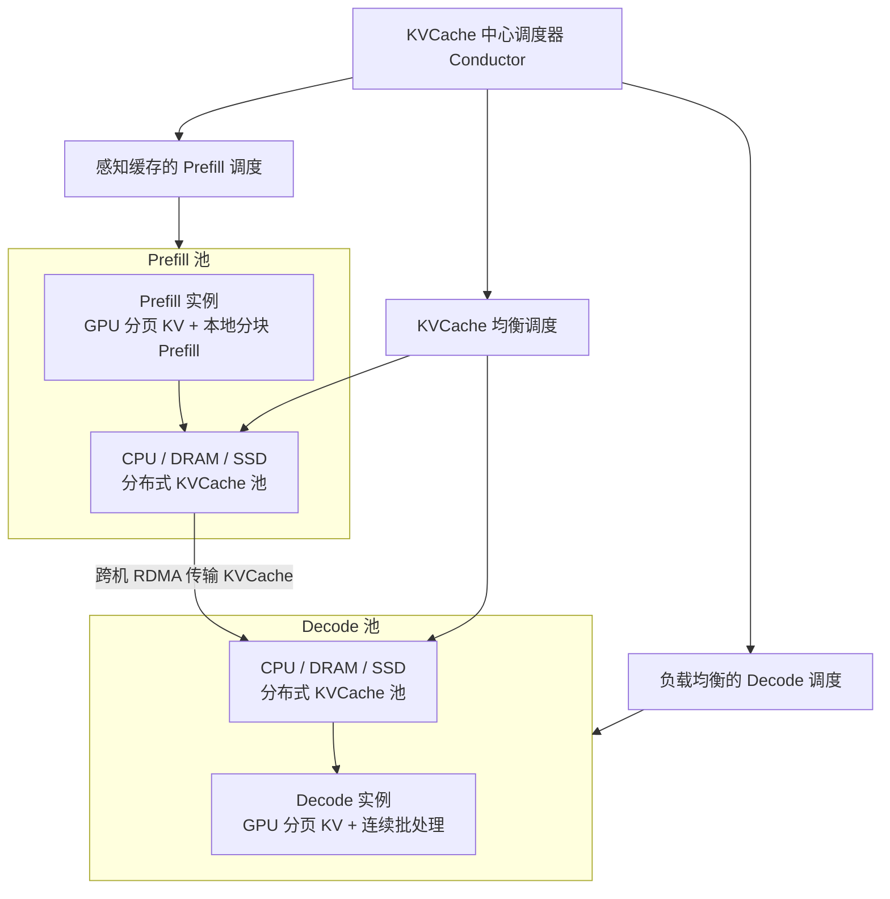
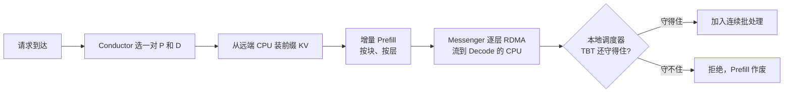

# Mooncake：KV 才是调度中心，过载时先拒绝

<!-- release-date: 2024-06-24 -->

> 本文依据 Moonshot AI 的 **Mooncake: A KVCache-centric Disaggregated Architecture for LLM Serving**，即 arXiv:2407.00079v4（2025-09-03），共 23 页。截至核验 arXiv 最新是 v4。页码均指这份 PDF。全文把三件事分开标注：**报告明确写了什么**、**我们如何解释或验算它**、**哪些是外部资料补充**。

这是 Kimi 的**推理服务架构**论文，不是又一篇 Kimi 模型卡。封面署名 Moonshot AI 与清华大学，通讯作者是清华的 Mingxing Zhang 与 Moonshot 的 Xinran Xu；Ruoyu Qin 的部分工作是在 Moonshot 实习期间完成，与 Zheming Li 共同一作（PDF p.1）。页脚写的是 Preprint Tech Report。论文标题里的小节把项目名拼成了 Mooncacke，正文其余地方都写 Mooncake，本文按后者。

## 读前先把五个词钉死

- **Prefill（预填充）**：把整段提示词一次喂进去，算出所有位置的 Key/Value，并吐出第一个输出词元。计算形状是大矩阵乘，通常算力吃得饱。
- **Decode（解码）**：之后每步只进一个新词元，读完整份历史缓存再吐下一个。计算形状接近矩阵乘向量，通常被显存带宽卡住。
- **KVCache（键值缓存）**：每个词元算过一次的 Key 和 Value。后面每一步都要回看它，所以它被留下来，不必重算。它随上下文线性变大，是这篇论文真正的调度对象。
- **TTFT / TBT**：Time to First Token 是请求到达后等到第一个词的时间；Time Between Tokens 是同一个请求相邻两个输出词之间的间隔。两者分别对应 Prefill 侧和 Decode 侧的服务等级目标（Service Level Objective，SLO）。
- **有效吞吐（effective throughput）**：论文要最大化的目标。它和别人说的 goodput 接近，但口径更严——**只有完整跑完的请求才计入**；中途被拒掉的请求，已经烧掉的 Prefill 算力和已经生成的词都不算（PDF p.4）。

本站知识库里的 [PD分离](/kb/04-Infra/01-原理/PD分离.md) 与 [KVCache](/kb/04-Infra/01-原理/KVCache.md) 讲的是通用原理。本文只讲 Mooncake 这篇 PDF 自己怎么把这两件事做成一套生产调度。

## 一句话先说清

Mooncake 不是「把 Prefill 和 Decode 拆开」这么简单。

拆开只是前提。它真正换掉的，是调度器心里的那张图：以前调度器盯着 GPU 忙不忙、队列里有多少请求；Mooncake 盯着 **KVCache 在哪、有多热、搬过去要多久、搬完 Decode 侧还接不接得住**。过载时它也不假装所有请求都能被处理，而是在 Prefill 开始前就预测 Decode 会不会爆掉，爆就直接拒。

> **KVCache 才是调度中心。过载时先拒绝，不要把算力浪费在注定交不出货的请求上。**

## 先看矛盾：吞吐想复用、想攒批，延迟却不答应

Kimi 作为模型即服务（Model as a Service，MaaS）要解的是一个带约束的优化问题：目标是最大化有效吞吐——论文明说这直接对应收入；约束是不同档位的延迟 SLO，主要就是 TTFT 和 TBT（PDF p.1）。

要提高吞吐，论文只点了两条路（PDF p.1）：

1. **尽量复用 KVCache**，少做重复 Prefill；
2. **尽量把每个 batch 里的词元数做大**，提高模型浮点利用率（Model FLOPs Utilization，MFU）。

两条路都会打到延迟上。远程把缓存搬过来，TTFT 会被拉长；batch 太大，TBT 会被拉长（PDF p.2）。所以「吞吐导向的优化」和「延迟 SLO」不是同一方向上的两个旋钮，而是一对互相卡住的约束。

更深一层的矛盾在 Prefill 和 Decode 的资源画像。论文用一份与 LLaMA2-70B 同架构的 dummy 模型画了 Figure 2（PDF p.4）：

- 左图：batch 固定为 1，序列从 8k 拉到 128k。Prefill 延迟超线性上升，吞吐柱状图往下掉。原因写在正文里：注意力按输入长度平方涨，MLP 按长度线性涨，所以 Prefill 时间总体超线性（PDF p.4）。
- 右图：序列固定 8k，batch 从 1 涨到 16。Decode 延迟只是亚线性往上爬，吞吐柱状图明显升高。原因是自回归每步每条请求只进一个词，Decode 是访存受限的（PDF p.4）。

我们怎么读这张图：它不是在说「拆开就能变快」，它是在说**两个阶段的最优解不在同一台机器上**。Prefill 想要算力、想按长度扩；Decode 想要带宽、想按并发扩。塞进同一批 GPU，长 Prefill 会把 Decode 的 TBT 打毛。

于是论文把 GPU 集群拆成几类彼此协作、但目标不同的资源池（PDF p.1–2）。拆的不只是 Prefill 和 Decode，还有那些平时闲着的 CPU、DRAM 和 SSD。

## 全景：三池一台调度器

Figure 1 把整套架构画成三层（PDF p.2）。下面这张是按该图重画的**机制示意**，不是实测拓扑。

左右两边的优化目标写在图注里，必须分开记（PDF p.2）：

| | Prefill 阶段 | Decode 阶段 |
|---|---|---|
| 优化目标 | 最大化缓存复用 | 最大化吞吐 |
| 约束 | TTFT SLO、最低 MFU、KVCache 装得进 DRAM | TBT SLO、KVCache 装得进显存（VRAM） |

注意两边的内存墙不一样。Prefill 侧论文盯的是 **DRAM**；Decode 侧盯的是 **VRAM**。这不是笔误。后面逐层 Prefill 会解释：Prefill 实例甚至可以几乎不考虑「显存够不够装下所有在途请求的 KV」，只要单条请求装得下（PDF p.9）。

全局调度器名叫 **Conductor**。每个请求它要选一对 Prefill 实例和 Decode 实例，然后按三步走（PDF p.2）：

1. 把尽量多的可复用 KVCache 传到选中的 Prefill 实例；
2. Prefill 按块、按层做完，并把新产生的 KVCache 持续流到对应 Decode 实例；
3. Decode 实例装入 KVCache，把请求加进连续批处理，开始吐词。

选择策略比这三步啰嗦得多。Prefill 想复用，但等低层存储上的缓存可能直接打穿 TTFT；缓存服务器太热还会把网络堵死。所以 Conductor 还要预测 KV 块的未来使用，做换出和复制：最热的块复制到多个节点以免争抢，最冷的换出去省预留成本（PDF p.2）。Prefill 节点自己的 DRAM 也被全局缓存池占掉一大块，调度时必须把剩余 DRAM 算进去。

Decode 侧则是另一套账：batch 越大 MFU 越好，但受 TBT SLO 限制，也受「所有在途请求的 KV 加起来能不能塞进显存」限制（PDF p.2）。

现有研究大多假设资源够用、只优化利用率。论文的判断正好相反：GPU 供给跟不上，MaaS 在高峰会严重过载。过载时必须预测未来负载，如果 Prefill 做完 Decode 已经没有槽位，就该提前拒绝，免得白做 Prefill。可是「看见 Decode 忙就拒」会让两池的负载反着抖。这就是后文 overload-oriented scheduling 的来由（PDF p.2–3）。

## 一条请求怎么走完：复用、增量 Prefill、传输、Decode

Conductor 在分词完成后选出 Prefill 节点（或一组节点）和 Decode 节点，然后走四步（PDF p.5–6，Figure 4）。

**第 1 步：KVCache 复用。** Prefill 节点拿到三样东西：原始输入、可复用的前缀缓存块 ID、给这条请求新分配的完整缓存块 ID。它按前缀块 ID 从远端 CPU 内存把前缀 KV 装进 GPU，作为这条请求的起点。没有前缀就跳过。选哪个 Prefill 节点，要同时满足三件事：复用尽量多、各 Prefill 负载别太偏、TTFT SLO 还守得住（PDF p.5）。

**第 2 步：增量 Prefill。** 用前缀缓存把没命中的那一段算完，新 KV 写回 CPU 内存。未缓存输入超过阈值 `prefill_chunk` 时，Prefill 被切成多块、流水执行。这个阈值按「打满这块 GPU 的算力」来选，**通常大于 1000 个词元**（PDF p.5）。

**第 3 步：KVCache 传输。** 每台机器上有一个独立进程 **Messenger**，用 GPUDirect RDMA 做跨机传输。这一步和增量 Prefill 异步重叠：每一层算完，就把这一层的 KV 流到目标 Decode 节点的 CPU 内存，减少等待（PDF p.5）。

**第 4 步：Decode。** 整份 KV 到达 Decode 节点的 CPU DRAM 之后，请求按连续批处理加入下一批。Conductor 预先按当前负载挑过 Decode 节点，认为不会打穿 TBT SLO；但 Prefill 做完负载可能已经变了，所以本地调度器会再查一次。二次检查仍可能拒掉这条请求——**这时 Prefill 的开销已经浪费了**（PDF p.6）。

这是根据 Figure 4 重画的**机制示意**（PDF p.6）。箭头表示控制顺序，不是实测耗时。

这一段有一个值得单独记的设计：Prefill 侧的加载和存储是**逐层、与计算并行**的；Decode 侧则是 GPU 在算的同时，异步把 CPU 上的 KV 往显存里搬，避免 GPU 空转（PDF p.6 图注）。两边都在藏传输，但藏的位置不同。

## 分离式 KVCache 池：把闲置的 CPU、DRAM、SSD 用起来

论文把 GPU 集群里本来利用不足的 CPU、DRAM、SSD 和 RDMA 收成一个分离的 KVCache（PDF p.4）。它要解决的不是「再买一批专用缓存机器」，而是 **near-GPU 的前缀缓存可以几乎零额外硬件成本地做大**（PDF p.5）。

CPU 内存里的 KV 按分页块存放。每块带一个哈希：哈希由**当前块内容加上它的前缀哈希**一起决定，用来去重（PDF p.5，Figure 3）。淘汰可以用 LRU、LFU，或按请求特征定制。跨 CPU/GPU 的搬运交给 Messenger。这套结构还让他们能对外部用户提供 context caching API，进一步提高复用（PDF p.5）。

哈希链长什么样，用论文自己的例子最好懂。trace 里两条请求的前 12 个 `hash_ids` 完全一样，于是前 `12 × 512 = 6,144` 个词元可以共享前缀缓存（PDF p.7）。块大小在这里是 **512 个词元**，不是 vLLM 论文里那个默认 16。两者管的不是同一层：vLLM 的 16 是 GPU 分页注意力的物理块；Mooncake 这条哈希链是跨请求前缀复用的索引粒度。

我们怎么理解「分离式缓存」这件事：PD 分离之后，KV 必须在机器之间搬家，缓存池如果还钉在单卡显存上，复用半径就只剩「恰好打到同一张卡」。把 DRAM/SSD 拉进来，复用半径变成整个集群。代价是 Conductor 必须把「缓存在哪、搬多久、会不会堵网」算进 TTFT，调度从「找一台空闲 GPU」变成「找一条划得来的 KV 路径」。

## 真实负载长什么样：一条一小时的开源 trace

为了让别人能复现缓存策略，作者从线上抽样了一小时请求，优先收集同一会话里的请求以保留缓存关系（PDF p.6）。数据集有 **23,608** 条，字段只有 `timestamp`、`input_length`、`output_length`、`hash_ids`（PDF p.7）。时间戳是相对到达时间，范围 0 到 **3,600,000 毫秒**，也就是正好一小时（PDF p.7）。没有任何真实用户文本。论文把这份 trace 开源在 `https://github.com/kvcache-ai/Mooncake`（PDF p.3）。

后文实验里多次出现「23,000 条真实请求」（PDF p.11、p.15、p.17），和这里的 23,608 差了六百多条。论文没有解释这个差。我们按字面分开引用，不把两处数字捏成同一个集合。

Figure 5 是输入、输出长度的直方图（PDF p.6）。输入可以拉到约 12 万词元量级，输出大部分在几百，2,000 附近还有一个小高峰。正文给出的平均数是：输入 **7,590** 词元，输出 **182** 词元（PDF p.7）。同一页还写「平均输入输出比约为 720」。

**这是一处无法用同页数字复现的原句。** 7,590 ÷ 182 ≈ 41.7；Table 2 里 Real Data 一行是平均输入 7,955、输出 194，相除约 41.0（PDF p.15）。两条可验算的比都在 41 附近，和 720 对不上。我们按两个平均数理解这条负载：Kimi 这条抽样是**长输入、短输出**，不是 720:1。720 这个原句保留，不当作可引用的统计量。

Table 1 在「假设只有一个全局缓存池」的前提下比较三种淘汰（PDF p.8）：

| 块容量 | Inf | 100,000 | 50,000 | 30,000 | 10,000 | 1,000 |
|---|---:|---:|---:|---:|---:|---:|
| LRUCache | 0.51 | 0.51 | 0.50 | 0.48 | 0.40 | 0.30 |
| LFUCache | 0.51 | 0.51 | 0.49 | 0.43 | 0.35 | 0.30 |
| LengthAwareCache | 0.51 | 0.50 | 0.48 | 0.42 | 0.35 | 0.30 |

容量从 1,000 加到 50,000 块，命中率从约 30% 升到约 50%；再加大收益很小，无穷容量也只有 0.51（PDF p.7–8）。作者立刻补了一句：这不能理解成「更大的缓存没必要」，因为抽样只是真实负载的子集，实际容量要按比例放大（PDF p.8）。这份数据上 LRU 最好，作者猜测是请求利用有时间局部性。

Figure 6 的 CDF 更刺眼：**超过 50% 的缓存块从未被用到，少数块被访问上万次**（PDF p.8）。热块必须复制，否则传输会堵。这直接决定了后文的热点迁移，而不是「做一个更聪明的全局预测器」。

相关工作里还有一个对照数字：即便假设存储容量和 TTFT SLO 都无穷，当前线上负载理论上最多只能复用约 **50%** 的 KVCache；但在他们的 chat-to-paper 服务 [papers.cool](https://papers.cool/) 上，复用可以到约 **90%**（PDF p.18）。复用率是场景的函数，不是架构的常数。

## 为什么还要独立 Prefill 池：chunked prefill 不够

第 5 节一上来就承认：Decode 节点几乎不能商量，但「要不要单独、弹性的 Prefill 池」当时还在争论（PDF p.8）。Splitwise、DistServe、TetriInfer 这些工作都有拆开的直觉；可是 chunked prefill 出现之后，有人会问拆开是否还有必要。

chunked prefill 把输入切成小块，塞进连续批处理。它有两个表面上的好处：所有节点一视同仁，调度简单；小块 Prefill 还能把 Decode batch 的算术强度抬上去，MFU 更好（PDF p.8）。

Mooncake 还是拆开了。一条请求的 Prefill **只有在可以整段、不切块、且不破坏 TBT SLO 的时候**，才会被内联进 Decode batch（PDF p.8）。两条理由：

1. 长上下文的 Prefill 需要另一套跨节点并行，Decode 用不了这套设置（§5.1）；
2. 拆开之后，Prefill 侧可以几乎把 KV 从显存里清走，省下的 VRAM 是混部拿不到的（§5.2）。

我们怎么读这个取舍：chunked prefill 是在**同一台 GPU 上调和两种形状**；Mooncake 认为长上下文一旦跨节点，调和的代价高于拆开再传输。它没有说短请求永远不该混部——它给混部留了一扇很窄的门。

## 长上下文怎么跨节点：分块流水线并行，而不是序列并行

论文写到当时上下文正在从 8k 走到 128K 甚至 1M（PDF p.8）。长请求的输入常常是输出的 **10 到 100 倍**，TTFT 变成主矛盾。长 Prefill 的并行度很高，用超过单个 8 卡节点去并行是划得来的。可是把张量并行（Tensor Parallelism，TP）拉到跨节点，每层要做两次昂贵的 RDMA all-reduce，Prefill 的 MFU 会明显掉下去（PDF p.8）。

序列并行（Sequence Parallelism，SP）把一条请求的输入切到不同节点上，利用注意力的结合律，每层至少通信一次，比跨节点 TP 省网、MFU 也更好（PDF p.8）。但论文仍然认为 SP 的 MFU 不如单节点 TP。理想部署会把 Prefill 分成两组：一组只做 TP，一组做 SP，只在 TTFT SLO 逼着你的时候才把请求丢进 SP 组。这又引出弹性扩缩：静态分组会让一侧空转。LoongServe 那类弹性序列并行可以动态缩放 SP 组，但要预先建全局通信组，还要把缓存复用和 SLO 违约算进 Conductor，对「部署中频繁在线扩缩」不友好（PDF p.8）。SP 还要频繁跨节点通信，既降低 MFU，又和 KVCache 传输抢网（PDF p.9）。

Mooncake 的答案是 **分块流水线并行（Chunked Pipeline Parallelism，CPP）**。把 Prefill 集群里每 X 个节点收成一个流水线组；一条请求的输入按不超过 `prefill_chunk` 切开，同一请求的不同块可以同时在不同节点上算，从而并行、从而降 TTFT（PDF p.9）。论文没有给出 X 的具体取值。

CPP 的两个好处（PDF p.9）：

1. 和训练里的流水线并行一样，跨节点通信只发生在流水级边界，容易和计算重叠，MFU 更好，也更少和 KV 传输抢网；
2. 短上下文几乎不加开销，长上下文也不用频繁改节点分组。

作者说这种按流水加速的办法在训练系统里见过，但据他们所知这是第一次用在推理上——因为长上下文推理当时才刚刚出现（PDF p.9）。

**可迁移的那一点：** 当你已经决定「长 Prefill 必须跨节点」时，先问通信发生在每层还是只发生在级边界。Mooncake 用自回归的因果顺序，把「后一块要等前一块的 KV」变成流水线的数据依赖，而不是把一条序列横切后每层都做一次环。这个选择依赖 decoder-only 的因果性；编码器或双向注意力不能直接抄。

## 逐层 Prefill：把 KV 搬走，把显存腾出来

显存是稀缺资源。论文把一条请求的占用成本写成 $S \times T$：$S$ 是这份 KV 的大小，$T$ 是它在显存里待的时间（PDF p.9）。如果把请求切块、再把每块内联进别人的 Decode，**$T$ 会被拉长**，占用成本反而变大。这是他们对「用 chunked prefill 省显存」的反驳。

Prefill 是逐层、计算受限的，所以可以把 KV 的搬运藏进计算。Mooncake 用 launch / wait 做异步加载和存储（PDF p.9）：

1. 某一层注意力开始前，先等这一层的 KV 异步加载完成，并立刻触发下一层的异步加载；
2. 这一层注意力算完，立刻发起这一层 KV 的异步存储；
3. 所有层算完后，再等全部异步存储结束。

重叠之后，Prefill 实例的执行时间大约等于「KV 加载时间」和「普通 Prefill 时间」里较长的那个，具体取决于前缀缓存占输入的比例（PDF p.9）。

Figure 7 把「把 KV 存出去」的额外延迟单独画出来（PDF p.9）。图注说，逐层那根柱子是「逐层 Prefill」相对「Prefill 但不存 KV」的延迟差。我们从柱状图上读到的近似形状是：串行存储（蓝柱）随序列长度明显升高，128k 时柱高大约 0.85 秒；逐层重叠（橙柱）从 8k 到 128k 都压在大约 0.1 秒附近。这些是读图，不是正文里的精确毫秒。论文的结论只写到：逐层 Prefill 能有效降低长请求的这笔延迟（PDF p.9）。

重叠一旦成立，Prefill 调度就可以**不再看显存容量**，只要单条请求装得下。Figure 1 里 Prefill 的约束因此只剩 KV 分布和可用 DRAM（PDF p.9）。腾出来的显存他们打算另用，例如把没有严格 TBT 的批量离线请求（文中举例 OpenAI Batch API：成本低 50%，但有明确的 24 小时周转）的 Decode 也内联进 Prefill，换更高的 MFU（PDF p.9）。这是设想，不是已部署功能。

## KVCache 中心调度：命中长度、排队、传输一起算 TTFT

第 6 节讲正常负载下 Conductor 怎么选机器，过载留给第 7 节（PDF p.10）。

前人通常按「每台机器上挂了多少请求」做负载均衡。Mooncake 选 Prefill 时还要看前缀命中长度、可复用块分布在哪。请求会被优先打到命中更长的实例以少算，但有时必须打到别的节点，才能保住整体均衡和 TTFT SLO（PDF p.10）。

Algorithm 1 的骨架可以缩成下面这条因果链（PDF p.10）。这是算法的机制转写，不是代码。

1. 把输入按块切，每块的哈希 = 本块词元 + 上一块哈希。这和 vLLM 的复用逻辑类似，但论文写明当时开源 vLLM **只支持本地 KVCache**（PDF p.10）。
2. 对每个 Prefill 实例算出本地前缀命中长度 `prefix_len`，并估计排队时间 $T_{\mathrm{queue}}$。
3. 先找到全局最好的命中 `best_prefix_len`。若 `best_prefix_len / prefix_len` 小于均衡阈值，就只在「本地命中够好」的机器里，用 $T_{\mathrm{queue}} + T_{\mathrm{prefill}}$ 挑 TTFT 最短的。
4. 否则认为本地差得太远，值得把最好那份缓存搬过来：TTFT 改成 $T_{\mathrm{transfer}} + T_{\mathrm{queue}} + T_{\mathrm{prefill}}$，这里的 Prefill 时间按 `best_prefix_len` 估。
5. Decode 实例单独按负载均衡选，得到预估 TBT。
6. 若 TTFT 或 TBT 已经破 SLO，直接拒，向上层返回 **HTTP 429 Too Many Requests**（PDF p.11）。
7. 若最终选中的实例相对全局最好命中仍然差过阈值，就触发一次热点迁移：把 KV 从最好的持有者拷到选中实例（PDF p.10）。

Prefill 时间用离线测出来的预测模型，输入是请求长度和前缀命中长度。Transformer 的计算模式规则，只要离线数据够，误差可以很小。排队时间把队列里已有请求的 Prefill 时间加起来。实际实现里各实例的 TTFT 是并行算的，相对推理时间可以忽略（PDF p.11）。

真正难的是估传输时间：它不只取决于数据量，还取决于发送端当下堵不堵。这也是必须复制热块的原因（PDF p.11）。

## 热点块怎么复制：启发式迁移，不预测未来

每台 Prefill 机器管自己的本地前缀缓存。访问频率差几个数量级：系统提示几乎每条请求都打，某份本地长文档可能只有一个用户用（PDF p.11）。Conductor 要在「命中」和「负载」之间找平衡；从分布式缓存的角度看，就是要想清楚怎么备份，才能让全局调度同时拿到高命中和低负载。

稻草人方案是：收集每块的全局使用，训一个模型预测未来，再决定复制或换出。论文直接否定了它——负载随时间剧烈变化，用户还在指数增长，**不可能准确预测未来使用**（PDF p.11）。他们改用启发式自动热点迁移。

具体两条（PDF p.11）：

- 请求因为负载没打到命中最长的实例时，Conductor 把缓存位置和请求一起转给备选实例。若「额外 Prefill 时间」短于「传输时间」，备选实例就主动把 KV 拉到本地。
- 若全局最好的远程前缀，并不比本地可复用前缀乘上一个阈值更长，他们宁可重算。阈值当时是手工调的，脚注说未来可以改成自适应（PDF p.11）。

两条策略的副作用才是重点：**热块会自动被复制到多台机器**，并不需要先预测谁会热。

调度实验用夜间空闲机器搭了 **8 个 Prefill + 8 个 Decode**，回放约 **23,000** 条真实请求，比较四种算法（PDF p.11–12）。Figure 8 是 TTFT 箱线图，图上标了四个数（读自 PDF p.11 图内标注）：

| 策略 | 图上标注的 TTFT（秒） |
|---|---:|
| KVCache-centric | 6.26 |
| cache-aware | 14.36 |
| load-balancing | 60.41 |
| random | 92.07 |

论文没有写这四个数是均值还是中位数；从箱线图样式看，数字标在箱体附近。能确定的是量级：感知缓存已经比「只看负载」低一个数量级，再加上缓存均衡的 KVCache-centric 又低一截。随机调度的上须可以拉到 250 秒以上（读自 Figure 8 轴范围）。SLO 线画在图的底部附近。结论只引用正文：KVCache-centric 在平均 TTFT 和 TTFT SLO 达成率上都优于随机和负载均衡（PDF p.12）。

**可迁移的那一点：** 分布式前缀缓存不要一上来就做全局热度预测。让「这次没打到最佳命中」这件事本身去驱动复制，预测误差就不会变成振荡源。阈值仍然是个手工缺口，论文自己也承认。

## 过载时的真正问题：不要假设请求都能被处理

第 7 节是这篇论文和 DistServe 一类工作分道的地方。

大多数 LLM 服务论文假设所有请求都会被处理，于是优化吞吐，或优化 TTFT/TBT。商业服务里这既不经济也不现实：请求量涨得比集群快，高峰过载是常态（PDF p.12）。系统应该一直接到某个负载阈值，然后把剩下的直接拒绝或留到以后重试。

Mooncake 拆开之后调度更灵活，但也遇到耦合系统没有、前作 [7, 8, 9] 也没写过的问题（PDF p.12）。那三篇就是 Splitwise、DistServe、TetriInfer，后文相关工作会回到它们。

过载调度的第一件事是定义「系统负载」。耦合系统里 Prefill 和 Decode 互相干扰，TTFT/TBT 不好预测，负载常常简化成「正在处理的请求数 / 最大容量」。Mooncake 两边独立，于是直接用 SLO 是否满足当负载：用 $l_{\mathrm{ttft}}$、$l_{\mathrm{tbt}}$ 表示两条 SLO 约束，实例负载就是「该实例上预测的最大 TTFT/TBT」和这两条线比（PDF p.12）。调度要做两个决定：按 Prefill 负载决定要不要接 Prefill；按 Decode 负载决定要不要继续 Decode。

朴素实现会在 Prefill 之后才发现 Decode 接不住。那笔 Prefill 算力就白烧了，Prefill 侧的「负载」也会高于真正成功的请求数（PDF p.12）。

**提前拒绝（Early Rejection）** 把 Decode 负载评估提前到 Prefill 开始之前。请求一到，Conductor 看 Prefill 池和 Decode 池里**更忙的那一侧**，用这个更大的负载决定接还是拒（PDF p.12）。这样能少做无效 Prefill，也有助于负载均衡。

## 提前拒绝会抖：相位差把两池轮流打空

Figure 9 是 20 台机器的集群上，提前拒绝之后 20 分钟的真实负载（PDF p.13）。绿线 Prefill、黄线 Decode，两者明显反相：一边冲到 80%–90%，另一边经常掉到接近 0。论文说，Prefill 机器越少、Prefill 越耗时，这种现象越重（PDF p.13）。图题写的是「before using the prediction-based early rejection」，也就是还没有用后文那种带预测的版本。

根因是时间差：按**当前** Decode 负载做决定，等 Prefill 做完，Decode 的真实负载已经是另一回事（PDF p.13）。Figure 10a 把这个相位差画成四段理论故事（PDF p.14）：

| 阶段 | 两池状态 | Conductor 的动作 | 下一拍 |
|---|---|---|---|
| 1 | 两边都空 | 大量接受，直到 Prefill 打满 | Prefill 产物涌入 Decode |
| 2 | Decode 高、Prefill 低 | 开始拒绝 | Decode 吃完存货后变空 |
| 3 | Decode 低、Prefill 再打满 | 再次大量接受 | 下一波涌入 Decode |
| 4 | Decode 再高 | 再次拒绝 | Prefill 又被抽空 |

结果是两池轮流打满、轮流空转，集群利用率很差（PDF p.13）。

我们怎么理解这个振荡：它是分离架构特有的反馈环。耦合系统里 Prefill 和 Decode 抢同一块 GPU，忙就是一起忙；拆开之后，Conductor 如果只看「现在」的 Decode，它看到的永远是上一拍 Prefill 的结果。提前拒绝把反馈环做短了，振荡反而更整齐。

## 用预测挡住未来的 Decode 过载

带预测的提前拒绝不再问「Decode 现在忙不忙」，而问「等这批请求 Prefill 做完，Decode 会不会忙」（PDF p.13，Figure 10b）。图 10b 里四个阶段都是 Accept，Decode 负载被维持在高位但不再和 Prefill 对着空。

预测有两条路（PDF p.13–14）：

- **请求级：** 若能预知每条请求的输出长度，就能更准地估 TTFT/TBT，从而知道某个时刻 Decode 能消化多少、会新进多少。困难是输出长度难测：成本高（论文指向 TetriInfer [9]）或精度低，过载且资源紧时更难。
- **系统级：** 不预测单条何时结束，只估一段时间之后实例的 batch 规模或 TBT 状态。它持续进行、精度要求更低，更适合过载。

Mooncake 当时用的是系统级：假设每条请求的 Decode 阶段耗时都是同一个 $t_d$。对未来时刻 $t$，先把 Prefill 在 $t$ 之前能做完的请求加进 Decode，再把已经超过 $t_d$、该结束的请求拿掉，最后用各 Decode 实例的平均 TBT 与 $l_{\mathrm{tbt}}$ 之比当预测负载（PDF p.14）。请求级预测留作未来工作。

**可迁移的那一点：** 分离系统里，「用当前 Decode 利用率做准入」是错的时间点。你要预测的是 **Prefill 延迟之后** 的 Decode。预测不必精确到每条输出长度；先假设一个统一的 $t_d$，往往就够把振荡压住。这个 $t_d$ 怎么估、错了会怎样，论文没给消融。

## 实验怎么证明

先把实验边界说清楚。为了保护专有信息并方便复现，**文中所有实验结果都用与 LLaMA2-70B 同架构的 dummy 模型**，回放真实到达时间、输入长度、输出长度和重映射后的块哈希，不含用户内容（PDF p.3、p.15）。所以下面的倍数是这份 dummy 模型 + 这些 trace 上的系统倍数，不是 Kimi 线上某个真实基模的倍数。

测试集群：每节点 **8 张 NVIDIA A800-SXM4-80GB**，每张 80GB HBM，NVLINK 互连；节点间 RDMA 最高 **800 Gbps**。一个节点启动时要么当 Prefill 实例，要么当 Decode 实例（PDF p.15）。

SLO 口径：端到端实验用 P90。阈值是「最低观测 RPS 下的 TTFT/TBT」分别乘 **10** 和 **5**，也就是 $\mathrm{TTFT}_{P90}=10\times$、$\mathrm{TBT}_{P90}=5\times$（PDF p.4、p.15）。超过阈值视为违约，对应资源算浪费。图里的纵轴把 TTFT/TBT 都除以这条上限，1.0 就是 SLO 墙。生产部署用的是固定 TTFT/TBT；监控发现守不住就加机器或拒请求。弹性扩容在当时 GPU 供给下通常做不到，所以拒哪些请求才是过载调度的核心（PDF p.4）。

基线是 vLLM：连续批处理 + PagedAttention，但 Prefill 和 Decode 耦合，长上下文会干扰 Decode（PDF p.15）。

### 公开数据集：3P+1D 比 2P+2D 更对这组负载

Table 2（PDF p.15）：

| 数据集 | 平均输入 | 平均输出 | 缓存比 | 到达 |
|---|---:|---:|---|---|
| ArXiv Summarization | 8,088 | 229 | 约 0% | 泊松 |
| L-Eval | 19,019 | 72 | 大于 80% | 泊松 |
| Simulated Data | 16k / 32k / 64k / 128k | 512 | 50% | 泊松 |
| Real Data | 7,955 | 194 | 约 50% | 按时间戳回放 |

对照是 4 个 vLLM 实例，记作 vLLM-[4M]。Mooncake 试了两种配比：3 个 Prefill + 1 个 Decode，记作 [3P+1D]；以及 [2P+2D]（PDF p.15）。

正文结论：在守住 SLO 的前提下，Mooncake-[3P+1D] 相对 vLLM-[4M]，ArXiv Summarization 吞吐高 **20%**，L-Eval 高 **40%**（PDF p.15）。L-Eval 额外吃到了前缀缓存，Prefill 时间明显缩短。[2P+2D] 的 TBT 更低，但 TTFT 不如 [3P+1D] 和 vLLM-[4M]——Prefill 和 Decode 负载不平衡（PDF p.15–16）。

Figure 11 把这件事画出来了（PDF p.16）。我们从曲线读到的形状与正文一致，不另报精确拐点：ArXiv 这种几乎无缓存、输入约 8k 的负载上，黄线 [2P+2D] 的 TTFT 最先撞墙；L-Eval 这种高缓存、输入约 19k 的负载上，蓝线 [3P+1D] 的 TTFT 明显更靠后，红线 vLLM 的 TBT 则很早拉升。作者说真实集群里两边需求在一段时间内大致稳定，配比可以预先设好；更灵活的部署和角色转换留待未来（PDF p.16）。

### 模拟长上下文：相对 vLLM 高 50% 到 525%

模拟数据上配比相同。长请求会严重干扰 vLLM 的 Decode，于是 vLLM **改为逐条处理、不再组批**（PDF p.16）。Mooncake 仍然组批，因为两阶段分离让 Prefill 打不到 Decode 的 TBT。正文写：在同样的 TTFT 和 TBT SLO 下，Mooncake 吞吐高 **50% 到 525%**（PDF p.16）。525% 也是摘要里那句「某些模拟场景」（PDF p.1）。

Figure 12 从 16k 画到 128k（PDF p.16）。横轴 RPS 随长度急剧变小：16k 大约到 1.5 req/s，128k 只有 0.02–0.14 req/s（读自坐标轴）。vLLM 的 TTFT 在 16k 就很快顶到 1.0；Mooncake 的 TBT 四张图都停在墙下。525% 对应哪一组长度、哪一个配比，正文没有拆开。引用时只能说「模拟长上下文上的上界」，不要说成线上均值。

### 真实回放：TTFT 差不多，TBT 差在长尾

更大的对照是 Mooncake-[10P+10D] 对 vLLM-[20M]，按真实到达时间回放（PDF p.17）。这组实验的墙是固定的：**TTFT 上限 30 秒，TBT 上限每词 0.1 秒**。Figure 13 的 CDF 显示（PDF p.17）：

- 两边的 TTFT 几乎重合，几乎 100% 的请求都落在 30 秒内；
- Mooncake 几乎 100% 满足 TBT SLO；vLLM 只有约 **57%** 满足，并且有极长的 TBT 尾巴。

在守住 SLO 的前提下，Mooncake 能多处理约 **75%** 的请求（PDF p.17）。这就是摘要里那句「真实负载下 Kimi 多处理 75% 请求」的实验出处。注意分母是「守住 SLO 的有效请求」，不是「系统打满时的原始到达数」。

### 过载：拒得更早，少烧 Prefill

过载实验仍是 8P+8D，23,000 条真实 trace，回放速度提到 **2 倍** 来制造过载（PDF p.17）。三种策略的拒绝数（Table 3，PDF p.17）：

| | 基线 | 提前拒绝 | 带预测的提前拒绝 |
|---|---:|---:|---:|
| 拒绝请求数 | 4,183 | 3,771 | 3,589 |

基线是「两个阶段开始前都按负载拒」，会把已经做完 Prefill 的请求再拒掉。提前拒绝少拒 412 条；再加预测又少拒 182 条。相对 23,000 条，这不是一个巨大的容量跳跃，论文强调的是**少做无效 Prefill、压住负载抖动，从而提高有效利用率**（PDF p.17）。

我们补一笔验算：即便用带预测的策略，仍有 3,589 / 23,000 ≈ 15.6% 的请求被拒。过载实验的叙事不是「预测之后就不再拒」，而是「同样过载，拒在更早、浪费更少」。

## 和 DistServe、Splitwise 差在哪

差别以这篇 PDF 的相关工作为准，不把那几篇的实验数字读进来。

Mooncake 明确感谢 vLLM 开源社区，调度和分页都建立在这条线上（PDF p.18）。Orca 的迭代级调度、SARATHI 的 chunked prefill、FastServe 的换出，都被当作互补而不是对手。

PD 分离这一支，论文点了三篇同期或稍早的工作（PDF p.18）：

- **Splitwise**：arXiv 出现时 Mooncake 还在早期，进一步推动了他们的进度。
- **DistServe**：为每个阶段优化资源分配和并行策略，目标是最大化 GPU goodput。
- **TetriInfer**：同时做 chunked prefill 和两阶段分离，再加一个预测式两阶段调度。

Mooncake 自己划出的差别，散落在摘要、第 2 节和第 9 节，可以收成四条：

1. **调度中心不是 GPU，是 KVCache。** DistServe 一类工作把分离当作「让两个阶段各自用对并行度和资源」；Mooncake 还要把 CPU/DRAM/SSD 收成分布式 KV 池，并让 Conductor 按缓存分布选路（PDF p.1–2、p.18）。
2. **goodput 只计跑完的请求。** 别人说的 goodput 是「满足 SLO 的吞吐」；Mooncake 额外规定，没跑完的请求，已经消耗和已经生成的词元都不计。所以必须尽早拒绝（PDF p.4）。
3. **过载是一等公民。** 前作 [7, 8, 9] 按论文的说法没有处理分离架构下的过载调度（PDF p.12）。Mooncake 面对的是 Kimi 请求指数增长、GPU 弹性扩不出的现实。
4. **长上下文用 CPP，而不是把 chunked prefill 内联进 Decode。** 内联只留给「不切块也不破 TBT」的短 Prefill（PDF p.8–9）。

和分层缓存的同期工作 **AttentionStore** 比：两边都用更便宜的存储装 KV，设计选择有很多重合；差别是长上下文下 KV 极大，需要高容量、高带宽传输，以及 KVCache 中心的全局调度。Mooncake 也不是一个独立缓存服务，它把存储机制和感知缓存的调度绑在一起（PDF p.18）。

和 SGLang 的 RadixAttention、Prompt Cache 比：论文承认前缀缓存已经被广泛采用；他们要强调的是，开源基准复现出来的可复用性，比他们线上 trace 大得多（PDF p.18）。

## 论文写了什么、没写什么

**被实验托住的：**

- 在 dummy LLaMA2-70B + 给定 SLO 墙上，PD 分离对长上下文的 TBT 长尾有效（Figure 12、13）；
- 感知缓存加热点迁移能把 Prefill TTFT 从「只看负载」的量级打下来（Figure 8）；
- 3P+1D 对这组偏 Prefill 的负载比 2P+2D 更合适，配比是一等设计问题（Figure 11）；
- 提前拒绝能少烧 Prefill；再加系统级预测能再少拒一些（Table 3）。

**只是作者观察、没有对照实验的：**

- 「不可能准确预测未来 KV 使用，所以改用启发式迁移」（PDF p.11）——没有把预测器真的训出来打一场；
- 系统级统一 $t_d$ 优于请求级输出长度预测——请求级被留作未来工作（PDF p.14）；
- 线上复用理论上限 50%、papers.cool 可达 90%（PDF p.18）——没有给出统计协议。

**论文承认但没做完的：**

- Prefill/Decode 角色动态转换（PDF p.16）；
- 请求优先级、不同 TTFT/TBT 档位的调度（PDF p.19）；
- KV 的复制、迁移、部分命中和过期淘汰的专门策略（PDF p.19）；
- 把空闲显存拿去跑 Batch 类离线 Decode（PDF p.9）；
- 异构加速器、把注意力算子从其他线性算子再拆一层；他们有一份初步模拟 [46]，以及指向 DeepSeek-V2 MLA 的另一条路（PDF p.19）。

**完全没公开的：**

- Kimi 真实模型的结构、精度、并行度；
- Conductor 的工程实现、`kvcache_balancing_threshold` 的取值、`prefill_chunk` 的精确数字（只说通常大于 1000）；
- CPP 里每个流水组的节点数 X；
- Messenger 的协议细节、是否逐层 RDMA WRITE；
- 系统级预测里 $t_d$ 怎么估；
- 生产环境的绝对 QPS、机器数、成本。

第 10 节还写了一句对硬件的判断：只看每美元带宽或每瓦带宽，当时的 GDDR 甚至 LPDDR 可以比旗舰加速器好一个数量级，更适合 Decode 这种访存受限阶段（PDF p.18）。这是方向，不是评测。

## 论文之后发生了什么（外部补充）

下面整节都不是 v4 PDF 的内容。

- **首发日。** arXiv v1 提交于 2024-06-24 02:05:32 UTC（[arXiv:2407.00079](https://arxiv.org/abs/2407.00079) 的 `published` 字段）。官方仓库 README 把「Initial technical report release」写在 2024-06-26（[kvcache-ai/Mooncake](https://github.com/kvcache-ai/Mooncake)）。按本模块口径取最早官方公开事件，`release-date` 用 **2024-06-24**。Kimi 产品上线更早，不回写到这篇架构论文。v4 修订于 2025-09-03，也不回写。
- **版本。** v1（2024-06-24）、v2（2024-07-02）、v3（2024-07-09）、v4（2025-09-03）。本地 `papers/Moonshot/Mooncake.pdf` 页眉为 `arXiv:2407.00079v4 [cs.DC] 3 Sep 2025`，23 页，与官方最新版一致。
- **开源组件晚于论文。** 仓库 README 记录：2024-07-09 开源 trace；2024-11-28 开源 Transfer Engine；2025-03-07 开源 Mooncake Store。今天仓库里的 Store、EP、PG、以及和 vLLM / SGLang 的对接，都是论文之后的产品化，不能读回 2024 年这 23 页。
- **FAST'25。** 同项目后来以 *Trading More Storage for Less Computation* 为题发表于 FAST 2025，并获最佳论文（仓库 README 写 2025-02-25）。那是另一份 16 页会议论文，标题、页码、部分数字与本文依据的 arXiv v4 不同。
- **期刊版数字不要混进来。** ACM TOS 后续版本摘要里出现过 A800 / H800 上分别多处理 115%、107% 请求的说法（[DOI 10.1145/3773772](https://doi.org/10.1145/3773772)）。**那不是 v4 的数字。** 本文只保留 v4 的 75% 与 525%。
- **vLLM 已经不是论文里那个基线。** 论文写开源 vLLM 当时只有本地 KVCache、且 PD 耦合（PDF p.10、p.15）。今天的 vLLM 默认前缀缓存、也支持 PD 分离。对照见本站 [PagedAttention](/reports/Berkeley/PagedAttention) 文末「论文之后」；那些是 vLLM 文档，不是 Mooncake 原文。
- **本站其他 Kimi 报告**讲的是模型与训练，和这篇服务架构不是同一件事。例如 k1.5 里用 Mooncake/RDMA 传权重，那是后来的用法，不要读回本篇的 Prefill/Decode 调度。

## 能带走的几条

### 1. 先换调度中心，再谈拆不拆

PD 分离是手段。Mooncake 真正换掉的是目标函数的自变量：从「GPU 利用率」换成「KV 在哪、复用多少、搬多久、Decode 还接不接得住」。没有这层，拆开只是多一次传输。

### 2. 有效吞吐要先定义「什么叫浪费」

如果中途拒绝的请求仍计入吞吐，调度器就没有动力把拒绝提前。Mooncake 把没跑完的词元全部记零（PDF p.4）。**指标一旦包含作废工作，过载策略会自动变胖。**

### 3. 分离系统的准入时刻，是「未来的 Decode」而不是「现在的 Decode」

提前拒绝把检查点移到 Prefill 前，这是对的；只看当前 Decode 负载，会制造 Figure 9 那种反相空转。预测不必精确到每条输出长度，先用统一 $t_d$ 把相位对齐（PDF p.14）。

### 4. 长上下文的跨节点 Prefill，通信次数比切分方式更致命

跨节点 TP 每层两次 all-reduce；SP 每层至少一次；CPP 把通信收到流水级边界（PDF p.8–9）。在「还要同时传 KV」的集群里，和 KV 传输抢网本身就是成本。

### 5. 占用成本是 $S \times T$，切块内联可能让 $T$ 变长

把 Prefill 碎成小块塞进 Decode，看起来省了干扰，却让 KV 在显存里待更久（PDF p.9）。省显存的正确动作有时是**更快地把 KV 搬走**，而不是把它切碎。

### 6. 热块复制可以是调度的副作用，不必先预测

「这次没打到最佳命中」就是复制信号（PDF p.11）。对正在涨用户的服务，预测未来热度往往还没启发式稳。

### 7. 配比是一等设计问题

同样 4 个节点，3P+1D 和 2P+2D 在 TTFT 和 TBT 上会互换胜负（PDF p.15–16）。优化了 Decode 却发现 TTFT 变差，先回头数 Prefill 机器，不要继续压 Decode。这一点和知识库里「2p2d 下 Decode 变快、TTFT 反而变差」是同一类瓶颈转移，来源不同，结论可以互相印证。

## 关键词回看

- **KVCache-centric：** 调度、复制、换出、拒绝都以 KV 块的位置和热度为中心，而不是以 GPU 队列长度为中心。
- **Conductor：** 全局调度器，负责选 P/D 对、估 TTFT/TBT、触发热点迁移和过载拒绝。
- **Messenger：** 每节点上独立的 GPUDirect RDMA 传输进程，逐层把 KV 从 Prefill 流到 Decode。
- **CPP（分块流水线并行）：** 长 Prefill 跨节点的方式：按 `prefill_chunk` 切开，在流水线组上并行，通信只在级边界。
- **逐层 Prefill：** 第 $i$ 层算完立刻存、立刻传、立刻预取第 $i+1$ 层，把 KV 占用从「整条请求的时间」变成「一层的时间」。
- **提前拒绝：** Prefill 开始前就用 Decode 侧负载决定接不接，避免白做 Prefill。
- **带预测的提前拒绝：** 用 Prefill 做完之后的 Decode 负载来决定，而不是用当前 Decode 负载，用来打破反相振荡。
- **有效吞吐：** 只统计完整满足 SLO 并跑完的请求；作废请求的已消耗词元记零。
- **HTTP 429：** Conductor 判定这条请求在 SLO 内做不完时，直接给上层的拒绝码。

## 最后的判断

这篇论文的贡献不是发明 PD 分离。Splitwise、DistServe、TetriInfer 当时都在做拆开。它的贡献是把拆开之后**真正变难的那两件事**写成了系统：KV 变成集群里的一等资源；过载变成必须预测的稳态，而不是评测曲线右端的异常。

实验部分要带着三个限制读。第一，模型是 dummy LLaMA2-70B，不是 Kimi 自己的基模。第二，525% 是模拟长上下文相对「不再组批的 vLLM」的上界，75% 才是真实回放、且以 SLO 达成来计的数字。第三，过载实验证明的是「少拒绝、少浪费」，不是「预测之后可以不拒绝」。

如果只带走一句：

> **当 GPU 已经不够用时，调度器最贵的错误不是拒得太多，而是把 Prefill 做完再拒。**

## 参考资料与边界

- 原始依据：本地 `papers/Moonshot/Mooncake.pdf`，即 [arXiv:2407.00079v4](https://arxiv.org/abs/2407.00079)，2025-09-03 修订，23 页，13 张图。页眉为 `arXiv:2407.00079v4 [cs.DC] 3 Sep 2025`。本文全部技术结论与页码只以这一版为准。
- 作者与归属：Ruoyu Qin、Zheming Li、Weiran He、Mingxing Zhang、Yongwei Wu、Weimin Zheng、Xinran Xu；Moonshot AI + 清华大学。Qin 为 Moonshot 实习期间工作，与 Li 共同一作（PDF p.1）。
- `release-date` 取 **2024-06-24**：对象是这篇公开技术，从未以独立产品形态「开放使用」，因此取该架构首次官方公开日。主证据是 arXiv API 的 `published` 字段 2024-06-24T02:05:32Z（[查询](http://export.arxiv.org/api/query?id_list=2407.00079)）。仓库 README 将技术报告发布记在 2024-06-26，晚于 arXiv v1，不采用。Kimi 产品更早的上线日不回写。v4 修订日不回写。
- 开源 trace 与后续组件入口：[kvcache-ai/Mooncake](https://github.com/kvcache-ai/Mooncake)。论文承诺的 trace 在该仓库；Transfer Engine、Mooncake Store 等是后续开源，本文没有把仓库现状冒充论文结论。
- 前作（论文参考文献，供对照，不是本篇实验）：Splitwise [arXiv:2311.18677](https://arxiv.org/abs/2311.18677)；DistServe [arXiv:2401.09670](https://arxiv.org/abs/2401.09670)；TetriInfer [arXiv:2401.11181](https://arxiv.org/abs/2401.11181)；PagedAttention 见本站 [解读](/reports/Berkeley/PagedAttention)。
- 后续正式发表（外部补充，页码与部分数字不同）：FAST 2025 *Trading More Storage for Less Computation*；ACM TOS 期刊版 DOI [10.1145/3773772](https://doi.org/10.1145/3773772)。
- 本站知识库交叉阅读：[PD分离](/kb/04-Infra/01-原理/PD分离.md)、[KVCache](/kb/04-Infra/01-原理/KVCache.md)。它们讲通用原理，不构成本篇论据。
