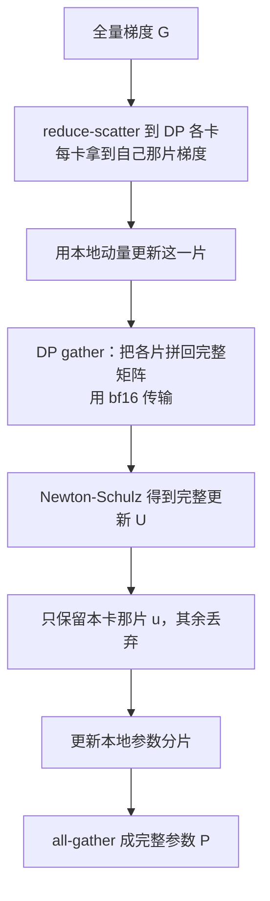
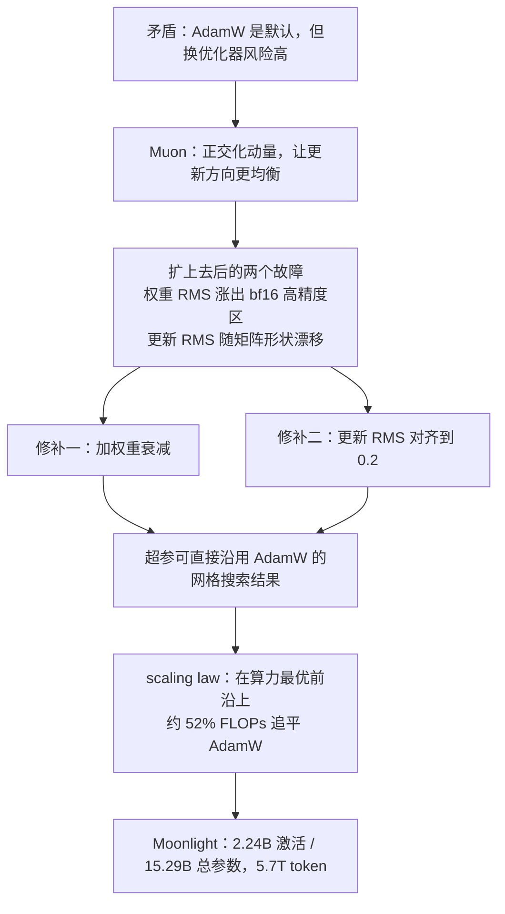

# Muon 能扩到大模型，前提是先补上权重衰减和更新尺度对齐这两件事

<!-- release-date: 2025-02-22 -->

> 本文依据 Moonshot AI 发布的 **Muon is Scalable for LLM Training**（Technical Report），即 arXiv:2502.16982v1，2025-02-24 上传，共 19 页。页码均指 PDF 本身的页码；这份 PDF 的印刷页码与 PDF 页码一致。作者 28 人，其中 27 人署名 Moonshot AI，Xingcheng Yao 署名 UCLA。全文会把三件事分开：**报告明确写了什么**（带页码）、**我们如何理解它**（会写明「我们的读法」「本文推算」），以及**外部资料补充**（会给链接并标成补充）。

## 阅读前的最小地图

这是一篇优化器论文，先认识五个词。第一次读到时不必记住定义，正文会重新解释一遍。

- **优化器（Optimizer）**：拿到梯度之后，决定「这一步权重到底怎么改」的那段规则。
- **AdamW**：目前大模型训练的默认优化器。它按每个参数**单独**统计梯度的一阶、二阶滑动平均，再给每个参数配一个步长。
- **Muon**（MomentUm Orthogonalized by Newton-Schulz，动量经 Newton-Schulz 迭代正交化）：一种只用于**二维权重矩阵**的优化器。它先累积动量，再把这个动量矩阵近似「正交化」，让更新在各个方向上的幅度变得均匀。
- **更新 RMS（update RMS）**：一步更新矩阵里所有元素平方平均后开根号，衡量「这一步改动有多大」。
- **Scaling law（缩放律）**：把「投入多少算力」和「最终 loss 是多少」拟合成一条幂律曲线，用来在小规模上预测大规模。

## 一句话先说清

这篇报告要回答的不是「Muon 是不是一个好优化器」，而是一个更难的问题：

> **一个在小模型上表现好的优化器，能不能原样搬到十亿参数、万亿 token 的训练里？**

报告的答案是：**不能原样搬，但补两件事之后可以。**

这两件事是：

1. **加权重衰减**（weight decay）。原版 Muon 没有它。（PDF p.3、式 3）
2. **把每个矩阵的更新尺度对齐**：先按矩阵形状抵消掉尺度差，再整体对齐到 AdamW 的水平。（PDF p.4、式 4）

补完之后带来一个很实用的性质：**Muon 可以直接复用为 AdamW 调好的学习率和权重衰减，不用重新搜超参**。（PDF p.4）报告的 scaling law 实验显示，在算力最优（compute-optimal）的对照设定下，Muon 只需要约 **52%** 的训练 FLOPs 就能追平 AdamW 的效果。（PDF p.6；Figure 1a 上标注的数字是 **0.519x FLOPs**，PDF p.1）

最后报告用这套配方从零训了一个 MoE 模型 **Moonlight**：2.24B 激活 / 15.29B 总参数（含 embedding 时是 3B / 16B），5.7T token。（PDF p.7）

## 第一层问题：AdamW 到底哪里不够，以及为什么没人敢换

### AdamW 不是不好，它只是「不看方向」

AdamW 的核心动作是按元素（element-wise）做的。对权重矩阵里的每一个数，它维护两个滑动平均：梯度的一阶矩和二阶矩，再用它们算出这个位置该走多大一步。

这套做法非常稳，也非常好并行。但它有一个结构性的盲点：**它从来不把权重当成一个矩阵来看。**

一个权重矩阵在网络里的角色是「算子」——它把一个向量空间映射到另一个向量空间。矩阵的奇异值分解会告诉你，这个映射在哪些方向上放大得多、哪些方向上几乎没动。AdamW 对这件事完全没有感知：它只知道第 $(i,j)$ 个数该加多少。

结果是，更新可能长期集中在少数几个「主导方向」上。报告在引用原版 Muon 的直觉时是这么说的：正交化可以保证更新矩阵是同构的（isomorphic），从而**避免权重只沿着少数几个主导方向学习**。（PDF p.2）

### 换优化器这件事，风险高得不成比例

到这里为止，「换一个能看方向的优化器」听起来是个好主意。但在真实的大规模训练里，这是最不敢碰的一块。原因有三条，报告在引言里直接点了出来。（PDF p.2）

**第一，超参不可迁移。** 大模型训练的学习率、batch size、warmup、权重衰减，是用几十上百次小规模实验网格搜出来的，而且这套结果是**绑定在 AdamW 上的**。换优化器意味着这些数字全部作废，要从头再搜一遍。这个成本经常比换优化器本身的收益还大。

**第二，小规模有效不等于大规模有效。** 报告自己就观察到：Muon 在小规模上明显优于 AdamW，但**当模型变大、token 变多时，这个优势会衰减**（the performance gains diminish）。（PDF p.3）这不是猜测，是他们真的撞上了。

**第三，分布式实现可能根本装不下。** 现代训练框架用 ZeRO-1 把优化器状态切碎分散到各张卡上，因为 AdamW 是按元素算的，切碎完全没问题。但 Muon 需要**完整的梯度矩阵**才能做正交化。报告的原话是：vanilla ZeRO-1 不能直接用在 Muon 上。（PDF p.4）也就是说，换优化器会把已经稳定运行的并行策略一起打破。

这三条合起来，就是这篇报告真正要拆的那堵墙。它的三个技术贡献几乎是一一对应的：分析怎么扩、怎么做分布式实现、以及用 scaling law 给出证据。（PDF p.2）

## Muon 本身：一步更新到底发生了什么

假设读者第一次接触 Muon。先看它的三行更新规则。（PDF p.2、式 1）

先说这三行要算什么：**第一行累积动量，第二行把动量矩阵「洗成方向均匀的形状」，第三行才真正改权重。**

$$
\begin{aligned}
M_t &= \mu M_{t-1} + \nabla L_t(W_{t-1}) \\
O_t &= \text{Newton-Schulz}(M_t) \\
W_t &= W_{t-1} - \eta_t O_t
\end{aligned}
$$

符号的意思是：

- $W_{t-1}$ 是上一步的权重矩阵，$\nabla L_t(W_{t-1})$ 是这一步算出来的梯度；
- $M_t$ 是动量，$\mu$ 是动量系数，$t=0$ 时 $M_0$ 是零矩阵；
- $O_t$ 是正交化之后的更新方向；
- $\eta_t$ 是学习率。

第一行和第三行跟带动量的 SGD 没有区别。**全部新意都在第二行。**

报告还有一个脚注要注意：实际实现用的是 Nesterov 风格动量，送进 Newton-Schulz 的不是 $M_t$，而是 $\mu M_t + \nabla L_t(W_{t-1})$。（PDF p.2，脚注 1）这是个细节，但如果你要照着实现，会差一步。

### 「正交化」到底在做什么

对动量矩阵 $M_t$ 做奇异值分解，写成 $M_t = U\Sigma V^T$。这里 $\Sigma$ 是一个对角阵，对角线上是奇异值，它们代表这个矩阵在各个方向上的「强度」。有的方向奇异值很大，有的接近 0。

Muon 想要的结果是 $UV^T$：**保留所有方向，但把所有奇异值统一拉成 1。**

报告写的是它等价于计算 $(M_t M_t^T)^{-1/2} M_t$，并明确指出这个量就等于 $UV^T$。（PDF p.2）

打个比方帮助建模（这是比方，不是论文证据）：梯度动量像一束光，奇异值谱决定了这束光在各个方向上有多亮。AdamW 会照单全收，亮的方向继续亮。Muon 相当于加了一块滤镜，把每个方向的亮度都调成一样——方向还在，但没有哪个方向能独占这一步的更新预算。

### 为什么用迭代近似，而不是真的做 SVD

一个 4096×4096 的矩阵做一次完整 SVD，代价高得离谱，而且训练的每一步、每一个矩阵都要做一次。所以 Muon 用 **Newton-Schulz 迭代**去逼近这个结果。

它的做法是：先把矩阵按 Frobenius 范数归一化，令 $X_0 = M_t / \lVert M_t \rVert_F$，然后反复套用同一个五次多项式。（PDF p.3、式 2）

$$
X_k = a X_{k-1} + b\,(X_{k-1}X_{k-1}^T)X_{k-1} + c\,(X_{k-1}X_{k-1}^T)^2 X_{k-1}
$$

这一步里：

- $X_{k-1}X_{k-1}^T$ 是矩阵乘矩阵转置，做的是把奇异值平方；
- 所以整条式子实际上是在对**每个奇异值**独立地施加同一个标量多项式 $f(x) = ax + bx^3 + cx^5$；
- $a, b, c$ 是固定系数，跑 $N$ 步之后取 $X_N$。

关键在于系数怎么选。报告说，要让迭代正确收敛，需要调 $a,b,c$ 使得 $f(x)$ 在 **1 附近有一个不动点**。（PDF p.3）不动点在 1 意味着：任何奇异值反复套这个多项式之后都会被拉向 1——这正是「统一奇异值」这件事的数值实现。

Moonlight 沿用了原版 Muon 的系数：$a = 3.4445$、$b = -4.7750$、$c = 2.0315$。（PDF p.3）报告解释说，这组系数是为了让**初始奇异值很小**的方向也能快速收敛而选的。

迭代步数呢？报告实测：**$N = 10$ 确实比 $N = 5$ 得到更准确的正交化结果，但不会带来更好的性能**，所以为了效率选了 $N = 5$。动量 $\mu$ 调参也没有一致收益，直接沿用原版的 0.95。（PDF p.4）

这里有一条很实用的启发：**近似的质量和最终效果不是同一件事。** 把正交化做得更准并没有换来更低的 loss，说明真正起作用的是「让方向大致均衡」这个粗粒度效应，而不是精确的 $UV^T$。愿意为此付 2 倍算力就是浪费。

### 换一个视角：这是在换范数

报告还给了一个理论视角，来自 Bernstein 等人 2024 年的工作：可以把深度学习的优化过程理解成**在某种范数约束下的最速下降**。（PDF p.3）

从这个视角看，Adam 和 Muon 的差别就是范数的差别：

- Adam 对应的是从 Max-of-Max 范数动态调整出来的约束；
- Muon 对应的是某个较大 $p$ 的 Schatten-$p$ 范数所在的静态范围；当式 1 被精确计算时，它给出的就是**谱范数**（spectral norm）约束。

报告的论证是：神经网络的权重是作用在输入空间或隐空间上的算子，而这些空间通常是（局部）欧氏的，所以对权重的范数约束**应该是诱导算子范数**，对权重矩阵而言就是谱范数。在这个意义上，Muon 给出的约束比 Adam 更合理。（PDF p.3）

需要说清楚的边界：这是一段**理论动机**，不是这篇报告的实验结论。报告并没有证明「谱范数约束一定更好」，它只是用这个视角解释为什么值得试。后面 §4 讨论里把「把 Muon 推广到一般 Schatten 范数」列为未来方向，也说明这条线还没走完。（PDF p.11）

上图是**机制示意**，把 PDF p.2 式 1、p.3 式 2 和 p.4 式 4 串成一步完整更新，不是实测时间线。其中 C 是原版 Muon 就有的，D 和 E 是这篇报告补上去的。

## 第二层问题：扩上去之后具体坏在哪

报告没有笼统地说「Muon 扩不上去」。它指出了两个可以定位的故障。这一节是全文最值得记的部分，因为它是「新设计」的直接来源。

### 故障一：权重和层输出的 RMS 一直涨，涨出了 bf16 的高精度区

报告的观察是：随着训练继续，**权重和层输出的 RMS 都在持续增大，大到超出 bf16 的高精度范围**，这可能会伤害模型性能。（PDF p.3）

这个描述值得展开一下（以下是我们的理解）。bf16 只有 8 位尾数，它的相对精度是固定的，但绝对精度随数值量级变差。当激活值和权重整体往大了漂，同一次加法里小量会被大量吃掉，梯度信号被数值噪声淹没。这不是溢出，是**有效精度被吃掉**。

为什么 Muon 更容易出现这个问题？一个自然的解释是：Muon 每一步的更新在各方向上幅度均衡且被归一化，没有 Adam 那种「二阶矩变大 → 步长自动变小」的自抑制，所以权重范数缺少一个自然的刹车。**报告没有给出这个机制解释**，它只报告了现象和修法。

修法就是把 AdamW 的标准权重衰减接进来。（PDF p.3、式 3）

$$
W_t = W_{t-1} - \eta_t\,(O_t + \lambda W_{t-1})
$$

多出来的 $\lambda W_{t-1}$ 就是权重衰减项：每一步都按当前权重的一个固定比例往回收，$\lambda$ 是衰减系数。它给权重范数装了一个恒定的向内拉力。

**实验怎么做的：** 800M 参数模型、100B token，大约是该规模算力最优 token 数的 5 倍——也就是刻意跑进「过训练」（over-train）区间。（PDF p.3）对照三条曲线：AdamW、原版 Muon（无权重衰减）、Muon 加权重衰减。（PDF p.4，Figure 2）

**结果的形状很有意思，别只记结论：**

| 阶段 | 谁领先 | 领先多少 | 页码 |
|---|---|---|---|
| 训练前中期（约 24000 步） | 原版 Muon | 验证 loss 低 0.023 | PDF p.4，Figure 2 内嵌小图 |
| 训练后期（约 66000 步） | Muon 加权重衰减 | 验证 loss 低 0.017 | PDF p.4，Figure 2 内嵌小图 |

也就是说：**原版 Muon 收敛更快，但会在后期被反超。** 报告的措辞是「vanilla Muon initially converges faster」，随后一些权重变得过大，可能限制模型的长期表现。（PDF p.3）而加了权重衰减的 Muon 在过训练区间同时优于原版 Muon 和 AdamW。（PDF p.3）

这条因果链完整走一遍：

- **旧问题**：原版 Muon 在大规模长训练下，权重与层输出 RMS 无约束增长，撞上 bf16 精度边界。
- **新设计**：把 AdamW 式权重衰减加进 Muon 的更新规则。
- **工作机制**：每步按比例回收权重，给范数增长加一个恒定阻尼。
- **收益**：过训练区间的验证 loss 更低，同时压过原版 Muon 和 AdamW。
- **代价 / 边界**：训练前中期会**变慢**（那 0.023）。如果你的训练本来就在算力最优点附近停、不进入过训练区间，这个改动的收益可能看不到，甚至是负的。报告只在 5 倍 token 的设定下做了这个对照。
- **可迁移启发**：**优化器的短期曲线和长期曲线可能给出相反的排序。** 在 5000 步就下结论，很容易选到长期更差的配置。

报告还在附录里补了一个相关的稳定性细节：把权重衰减**也应用到 RMSNorm 的 gamma 参数上**，对训练稳定性至关重要，因为它能有效防止每层输出 RMS 过高。（PDF p.16）这一条容易被漏掉——很多实现默认把 norm 参数排除在权重衰减之外。

### 故障二：更新的大小随矩阵形状漂移

这是更隐蔽的一个问题，也是报告理论味最重的一段。

先说 AdamW 的一个重要性质：它的**理论更新 RMS 大约是 1**，与参数形状无关。（PDF p.3）报告在脚注里补了一句：因为 Adam 的 $\beta_1 < \beta_2$ 且 $\epsilon > 0$，实际更新 RMS 通常小于 1。（PDF p.3，脚注 3）

Muon 没有这个性质。报告给了一条引理。（PDF p.3）

> **引理 1**：对于形状为 $[A, B]$ 的满秩矩阵参数，Muon 的理论更新 RMS 是 $\sqrt{1/\max(A,B)}$。

先说这条引理在说什么：**同一个 Muon，作用在不同形状的矩阵上，实际迈的步子大小完全不同，而且大矩阵迈得更小。**

证明在附录 A（PDF p.14）。思路不难：Muon 的更新形如 $X = U_{[:,:r]}V_{[:r,:]}$，$U$、$V$ 是正交矩阵，$r$ 是秩。因为正交矩阵每列的平方和是 1，逐项展开求平方和之后，$\text{RMS}(X)^2 = r/(mn)$。满秩时 $r = m$（取 $n \ge m$），于是 $\text{RMS}(X) = \sqrt{1/n}$，$n$ 就是较大的那个维度。

报告说，他们在训练中**实测监控**了 Muon 的更新 RMS，发现它通常接近这个理论值。（PDF p.3）这一点很重要：引理不是纸上谈兵。

接着报告指出，这个不一致在扩大模型时会变成两种相反的病：（PDF p.3）

- **$\max(A,B)$ 太大时**，例如稠密 MLP 矩阵，更新变得**太小**，限制模型的表达能力，导致次优表现；
- **$\max(A,B)$ 太小时**，例如把 GQA 或 MLA 里的每个 KV head 当成一个独立参数，更新变得**太大**，导致**训练不稳定**，同样次优。

这一段解释了一件很关键的事：**模型越大、结构越花，矩阵形状的跨度就越大。** 一个 dense 模型可能大部分矩阵都是 $[H, H]$ 或 $[H, 4H]$，问题不明显；但一旦引入 MoE、GQA、MLA、按头切分，形状分布就会被拉开，同一个学习率对不同矩阵意味着完全不同的实际步长。**这就是「小规模没事、大规模出事」的一个具体机制。**

### 修法：先抵消形状，再对齐 AdamW

修法分两步，很直接。

**第一步，抵消形状。** 既然理论 RMS 是 $\sqrt{1/\max(A,B)}$，那就把每个矩阵的更新乘上 $\sqrt{\max(A,B)}$，正好抵消掉。（PDF p.4）

**第二步，对齐到 AdamW 的量级。** 报告的动机很务实：Muon 只管矩阵参数，非矩阵参数（RMSNorm、LM head、embedding）仍然交给 AdamW；他们希望这两组参数**共用同一套学习率 $\eta$ 和权重衰减 $\lambda$**。（PDF p.4）

要共用超参，两个优化器的更新量级就必须对得上。报告的经验观察是：AdamW 的更新 RMS 通常在 **0.2 到 0.4** 之间。（PDF p.4）于是把 Muon 的更新 RMS 缩放到这个区间：

$$
W_t = W_{t-1} - \eta_t\left(0.2 \cdot O_t \cdot \sqrt{\max(A,B)} + \lambda W_{t-1}\right)
$$

（PDF p.4、式 4）读一遍：$O_t$ 是正交化后的更新，$\sqrt{\max(A,B)}$ 抵消形状带来的尺度差，常数 0.2 把整体量级压到 AdamW 的水平，$\lambda W_{t-1}$ 是上一节的权重衰减。

这个 0.2 不是拍的。附录 A 有一组消融：把 Muon 的更新 RMS 分别控制在 0.05、0.1、0.2、0.4、0.8，用 AdamW 作基线，在 2k 步（约 2B token）时看 loss。（PDF p.14，Table 8）

| 设置 | AdamW | 0.05 | 0.1 | **0.2** | **0.4** | 0.8 |
|---|---|---|---|---|---|---|
| 训练 loss | 3.512 | 3.355 | 3.239 | **3.198** | 3.199 | 3.386 |
| 验证 loss | 3.679 | 3.503 | 3.374 | 3.325 | **3.314** | 3.543 |

（数据来自 PDF p.14，Table 8）

0.2 和 0.4 表现接近，且明显好于其他设置——**这与「AdamW 的更新 RMS 在 0.2~0.4」这个经验观察正好对上**。最终选 0.2。（PDF p.14）注意曲线是碗形的：0.05 太小、0.8 太大，都比 AdamW 好不了多少甚至更差。这说明更新量级本身就是一个需要落在合适区间的量。

还有个脚注值得看：原版 Muon 的实现是按 $\sqrt{\max(1, A/B)}$ 缩放的，报告说如果所有矩阵的第二维相同，这与他们的方案**等价（相差一个全局尺度）**。（PDF p.4，脚注 4）也就是说，原版做法在 dense 模型里问题不大，形状一旦拉开就不再等价。同一脚注还指出 Pethick 等人 2025 和 You 2025 同期讨论了类似的更新缩放问题——这不是一家独有的发现。

### 三种缩放方式的对照实验

报告没有只给方案，还比了三种做法。（PDF p.6，§3.1）

1. **Baseline**：统一乘 $0.2 \cdot \sqrt{H}$，$H$ 是隐藏维。理由是「大多数矩阵的 $\max(A,B)$ 就等于 $H$」。（式 5）
2. **Update Norm**：直接把更新归一化，让 RMS 严格变成 0.2，即乘 $0.2 \cdot O_t / \text{RMS}(O_t)$。（式 6）
3. **Adjusted LR**：按形状缩放学习率，乘 $0.2 \cdot \sqrt{\max(A,B)}$。（式 7）

实验设计有个巧妙的地方：他们**故意把问题放大**。用 800M 模型，把 SwiGLU MLP 换成标准两层 MLP，让矩阵形状从 $[H, 2.6H]$ 变成 $[H, 4H]$，以拉大维度差异；然后同时监控注意力 query 矩阵（形状 $[H,H]$）和 MLP 矩阵（形状 $[H,4H]$）。评测点是 20B token 计划中的第 4B token 处——因为他们观察到，在更大规模上**异常行为出现得非常快**。（PDF p.6）

| 方法 | 训练 loss | 验证 loss | query 权重 RMS | MLP 权重 RMS |
|---|---|---|---|---|
| Baseline | 2.734 | 2.812 | 3.586e-2 | 2.52e-2 |
| Update Norm | 2.72 | 2.789 | 4.918e-2 | 5.01e-2 |
| Adjusted LR | 2.721 | 2.789 | 3.496e-2 | 4.89e-2 |

（数据来自 PDF p.6，Table 1）

三条结论：（PDF p.6）

1. Update Norm 和 Adjusted LR 都优于 Baseline；
2. 对 $[H, 4H]$ 的 MLP 矩阵，两者的权重 RMS 都大约是 Baseline 的 2 倍——这完全对得上算术：$\sqrt{\max(H,4H)}/\sqrt{H} = 2$；
3. 对 $[H, H]$ 的 query 矩阵，Adjusted LR 的缩放因子是 $\sqrt{\max(H,H)}/\sqrt{H} = 1$，所以它的权重 RMS 与 Baseline 接近；而 Update Norm 仍然强行归一化，得到一个和 MLP 差不多的、更大的权重 RMS。

最终选 **Adjusted LR**，理由只有一条：**成本更低**。（PDF p.6）Update Norm 每一步都要对每个更新矩阵实际算一次 RMS，而 Adjusted LR 的缩放因子只依赖矩阵形状，是常数，可以预先算好。

这里有一条很干净的迁移启发：**当分析给出的解析修正和实测的数值修正效果相当时，选解析的那个。** 它不引入额外的 kernel、不引入额外的同步、也不会在数值上引入新的方差来源。

## 第三层问题：分布式实现要付什么

到这里算法层面已经修好了。但如果它不能装进现有的并行框架，就没有意义。

### ZeRO-1 和 Muon 的结构性冲突

ZeRO-1 的做法是把昂贵的优化器状态（master 权重、动量）**切碎分散到整个集群**。Megatron-LM 把它集成进自己的并行体系后，配合张量并行（TP）、流水线并行（PP）、专家并行（EP）和数据并行（DP），ZeRO-1 的通信可以从「全世界 gather」缩小到「只在 DP 组内 gather」。（PDF p.4）

冲突点报告说得很清楚：**ZeRO-1 之所以对 AdamW 高效，是因为 AdamW 按元素计算更新；而 Muon 需要完整的梯度矩阵才能算更新，所以原版 ZeRO-1 不能直接用。**（PDF p.4）

这是一个很好的例子：**框架抽象是有前提的**，「参数可以任意切分」这个前提在 AdamW 下成立，在 Muon 下不成立。

### Distributed Muon：多两个动作

报告的方案叫 Distributed Muon，仍然按 ZeRO-1 在 DP 维度上切分优化器状态，只比原版 ZeRO-1 AdamW 多两个动作。（PDF p.5）

1. **DP Gather**：本地只持有 $1/DP$ 大小的参数分片，先把对应的分片梯度 gather 成一个完整的梯度矩阵；
2. **Calculate Full Update**：在完整矩阵上跑 Newton-Schulz，然后**把完整更新矩阵中不属于本卡的部分丢掉**，只保留本地那一片来更新参数。

对，就是「算完整个再扔掉大部分」。这看起来很浪费，但它是保住算法数学性质的唯一办法——正交化本来就不是一个可以分块独立完成的操作。

上图是**机制示意**，按 PDF p.5 的 Algorithm 1 重画，不含实测时间。原文用蓝色标出的新增步骤对应图中的 D、E、F。算法最后还会返回 $\sqrt{u^2.\text{mean}()}$ 作为更新 RMS 供日志记录——这个细节说明他们确实在训练时**持续监控更新 RMS**，与前面「实测接近理论值」的说法对得上。（PDF p.5）

### 三笔账：显存、通信、延迟

报告逐项和 ZeRO-1 版 AdamW（下称 Distributed AdamW）做了对比。（PDF p.5）

**显存：省一半。** Muon 只有一个动量 buffer，AdamW 有两个（一阶矩和二阶矩）。所以 Muon 优化器额外占用的显存是 Distributed AdamW 的一半。

**通信：贵 0% 到 25%。** 报告给了完整的账：

- Distributed Muon 上界 = 4（fp32 的 $G$ reduce-scatter）+ 2（bf16 的 Muon gather）+ 4（fp32 的 $P$ all-gather）= 10
- Distributed AdamW = 4 + 4 = 8
- 比值 = 10 / 8 = 1.25

所以通信量落在 $(1, 1.25]$ 区间。报告解释为什么实际更接近下界 1：新增的 DP gather **只需要本地那一份分片参数 $p$**，通信量小于 $G$ 的 reduce-scatter 或 $P$ 的 all-gather；而且 Newton-Schulz 只需要 bf16，相比 fp32 又把这部分通信砍掉 50%。实践中通常有多个 DP，所以经验上的额外成本更靠近 1。（PDF p.5）

这里的数字 4 和 2 是每个元素的字节数（fp32 = 4 字节，bf16 = 2 字节）。**注意脚注**：如果启用 TP，Distributed Muon 还需要在 TP 组上额外做一次 bf16 gather。（PDF p.5，脚注 5）这笔钱没有算进上面那个 1.25。

**延迟：更慢，但报告论证影响可忽略。** Distributed Muon 的端到端延迟确实比 Distributed AdamW 大，因为多了通信、还要跑 Newton-Schulz。报告给了两条理由说明这不是大问题：（PDF p.5）

- 只需要约 5 步 Newton-Schulz 就够；
- 优化器带来的端到端延迟**相对于前向反向的时间通常只有 1% 到 3%**。

另外还提到工程上可以进一步优化：把 gather 与计算重叠、把优化器的 reduce-scatter 与参数 gather 重叠。最终结论是：在他们的集群里训练大规模模型时，Distributed Muon 相对 AdamW **没有可察觉的延迟开销**。（PDF p.5）

**这一段要留一个判断。** 「1% 到 3%」和「没有可察觉开销」都是**报告在自己集群上的观察**，没有给出具体的硬件配置、并行策略组合或吞吐数字。如果你的场景是小模型、高 DP 度、或者优化器占比本来就高，这个结论未必成立。报告也没有公开重叠优化是否真的实现了，只说「可以」。

**关于开源：** 报告在 p.5 承诺「我们很快会发布一个为开源 Megatron-LM 实现 Distributed Muon 的 pull request」。**外部补充**：这个 PR 是 [NVIDIA/Megatron-LM PR #1428](https://github.com/NVIDIA/Megatron-LM/pull/1428)，标题为「a proof of concept for Distributed Muon」，2025-02-24 创建，目前状态为 closed 且**未被合并**。同时，Moonshot 自己的实现在 [MoonshotAI/Moonlight](https://github.com/MoonshotAI/Moonlight)。这段属于外部核实，不是报告原文内容。

## 规模化验证：这篇报告真正的主张

前面三节讲的都是「怎么修」。这一节才是标题里那个 Scalable 的证据。**这也是整篇报告最需要读准口径的地方**，因为后来的 Kimi K2 直接把这里的结论当作前提在用。

### 对照实验到底控了什么

设定如下：（PDF p.6，§3.2）

- 模型是 **Llama 架构的 dense 模型**，一共五个规模；
- 先为 **AdamW** 做超参网格搜索，遵循算力最优（compute-optimal）训练设定；
- **Muon 直接复用 AdamW 搜到的最优超参**，因为它的更新 RMS 已经对齐到 AdamW。

第三条是整个实验设计的支点。**它同时是「公平性论证」和「主要卖点」**：正因为更新 RMS 对齐了，Muon 才能不重新搜超参；也正因为不重新搜，这个对照才是「同一套超参下换优化器」而不是「两套各自调优的系统对比」。

要小心的是，这把双刃剑另一面朝哪边：**超参是为 AdamW 搜的，不是为 Muon 搜的。** 所以这个对照对 AdamW 是有利的，对 Muon 反而保守——如果给 Muon 单独搜一遍超参，差距可能更大也可能更小，报告没做这个实验。

五个规模的具体配置：（PDF p.7，Table 2）

| 非 embedding 参数 | 头数 | 层数 | 隐藏维 | Token 数 | 学习率 | Batch Size |
|---|---|---|---|---|---|---|
| 399M | 12 | 12 | 1536 | 8.92B | 9.503e-4 | 96 |
| 545M | 14 | 14 | 1792 | 14.04B | 9.143e-4 | 128 |
| 822M | 16 | 16 | 2048 | 20.76B | 8.825e-4 | 160 |
| 1.1B | 18 | 18 | 2304 | 28.54B | 8.561e-4 | 192 |
| 1.5B | 20 | 20 | 2560 | 38.91B | 8.305e-4 | 256 |

Batch Size 的单位是 **8K 上下文长度下的样本数**。（PDF p.7）

注意 Token 数那一列只有一份。**我们的读法**：这说明同一个规模下，Muon 和 AdamW 用的是同一个模型大小和同一个 token 数，也就是同一个算力预算 $C$。报告本身没有专门写一句「我们固定 $N$ 和 $D$ 比较 loss」，但这是 Table 2 的自然含义。

算力最优的具体分配来自附录 B 的拟合：（PDF p.14，Table 9）

$$
N(C) = 0.0483359\,C^{0.5112684},\qquad D(C) = 3.4480927\,C^{0.4887316}
$$

$$
\eta(C) = 0.0127339\,C^{-0.0574752},\qquad B(C) = 0.0065202\,C^{0.4137915}
$$

搜索协议写得很具体：先选定若干算力档位；在每个固定 FLOPs 约束下变动模型大小 $N$，同时反向调整 token 数 $D$ 以维持 $C = 6ND$，训到收敛后记录验证 loss，找出 $N$-$D$ 的帕累托最优组合；然后固定最优的 $N$-$D$ 对，再网格搜索学习率和 batch size；整个流程**重复 2 到 3 轮**逐步收窄搜索空间。（PDF p.15）图 5 展示了三组碗形损失曲面（loss 对 token 数、对学习率、对 batch size），每条曲线对应一个 FLOPs 档位。（PDF p.15，Figure 5）

**这一段值得肯定。** 优化器论文最常见的问题就是基线没调好。报告自己也说了：「在优化器研究中，建立一个强基线至关重要。」（PDF p.6）他们花了整个附录 B 去做这件事。

### 拟合结果与「52%」的准确口径

拟合出来的两条曲线是：（PDF p.7，Table 3）

$$
L_{\text{Muon}} = 2.506 \times C^{-0.052},\qquad L_{\text{AdamW}} = 2.608 \times C^{-0.054}
$$

$L$ 是 8K 序列长度下的 LM loss，$C$ 是算力（图 3 的横轴单位是 PFLOP/s-days，范围大约从 $10^{-2}$ 到 $10^{1}$）。（PDF p.7，Figure 3）

报告在三个地方给出了同一个结论，措辞略有不同：

| 出处 | 原文口径 | 页码 |
|---|---|---|
| 摘要 | 「Muon 相比 AdamW 达到约 $2\times$ 的**计算效率**，在算力最优训练下」 | PDF p.1 |
| 引言 | 「Muon 达到与 AdamW 训练的对照模型**相当的性能**，而只需要约 **52%** 的训练 FLOPs」 | PDF p.2 |
| §3.2 | 「在算力最优设定下，Muon 只需要约 **52%** 的训练 FLOPs 来**匹配** AdamW 的性能」 | PDF p.6 |
| Figure 1a 标注 | **0.519x FLOPs** | PDF p.1 |

**所以准确口径是：等最终 loss，比 FLOPs。** 不是等 token，不是等步数，也不是等时间。而且必须加上限定语——**在算力最优的对照前沿上**。

$1 / 0.519 = 1.927$，四舍五入到「约 2 倍」。

### 我们对拟合曲线的推算（报告没有讨论这一点）

以下是**本文的推算**，不是报告的结论，请与原文分开看。

注意两条曲线的指数：Muon 是 $-0.052$，AdamW 是 $-0.054$。**AdamW 的指数绝对值反而更大**，意味着随着 $C$ 增大，AdamW 的 loss 下降得更快一点，两条曲线在缓慢靠拢。

把「Muon 需要多少算力才能追平 AdamW」写成 $C_M / C_A$，可以直接从两条式子解出来。结果随 $C_A$ 变化：

| AdamW 的算力 $C_A$（PFLOP/s-days） | Muon 追平所需的 $C_M / C_A$ |
|---|---|
| 0.1 | 约 0.43 |
| 1 | 约 0.46 |
| 10 | 约 0.51 |
| 100（已超出拟合区间） | 约 0.55 |

这个推算有一个很好的自洽性检查：反解「比值等于 0.519」对应的 $C_A$ 约为 18 PFLOP/s-days，落在图 1a 横轴**最右端**那一带（图上画到 $10^1$，即 10），也正是那个 0.519x 箭头所指的位置。（PDF p.1，Figure 1a）换句话说，报告引用的那个数字取自曲线的高算力端。

由此得到两个判断：

1. **报告引用的 52% 是拟合区间内偏保守的那一端**，不是挑了最好看的点。这一点应该给出正面评价。
2. **但这条优势不是恒定的。** 按这两条拟合式外推，$C$ 每上一个数量级，比值就往 1 靠一点。报告没有讨论这个趋势，也没有做更大规模的 scaling law 点来验证。所以「2 倍算力效率」不应该被当成一个可以无限外推的常数。

### 「样本效率」这个说法要小心

**外部补充**：Moonshot 官方的 [GitHub README](https://github.com/MoonshotAI/Moonlight) 里有一句「Muon is 2 times more sample efficient than Adam」（Muon 的样本效率是 Adam 的 2 倍）。

但**论文正文里没有出现过 "sample efficiency" 这个词**，我们在全文文本中检索确认了这一点。论文的口径始终是 computational efficiency / training FLOPs。

这个差别不是抠字眼。**本文推算**：在算力最优设定下，$N$ 和 $D$ 都随 $C$ 变化，$D(C) \propto C^{0.4887}$（PDF p.14，Table 9）。所以把算力压到 51.9% 时，token 数只会降到

$$
0.519^{0.4887} \approx 0.726
$$

也就是约 **72.6%**，相当于省了约 1.38 倍的 token，而不是 2 倍；同时模型规模也降到 $0.519^{0.5113} \approx 71.5\%$。**算力的节省是模型变小和数据变少两件事共同贡献的，不是单靠「同样的数据学得更多」。**

所以准确的说法应该是：**Muon 在这套实验里省的是 FLOPs，不是 token。** 如果你的瓶颈是「高质量数据只有这么多」，这篇论文并没有直接证明 Muon 能让同样的数据顶两倍用。（后面的交叉核实一节会回到这个问题。）

## Moonlight：把这套配方放进一次真实的预训练

scaling law 用的是 dense 模型，最终模型换成了 MoE。这是两个不同的族，值得注意。

### 架构

报告选了 **deepseek-v3-small 架构**，理由写得很直白：它性能强、有开放权重，而且原始结果可以作为对照参考。（PDF p.7；附录 C 又强调一次，PDF p.15）报告还明确说 **Muon 与模型架构无关**（agnostic to model architectures）。（PDF p.15）

规模：**2.24B 激活 / 15.29B 总参数**（不含 embedding），含 embedding 时是 3B / 16B。（PDF p.7）

相对 DeepSeek-V3-Small 的三处改动：（PDF p.15，附录 C）

- **不用 MTP**（Multi-token Prediction，多 Token 预测）。理由是「在我们的实验中 MTP 对预训练没有显示出显著收益」，为简化起见不引入。
- **改了 auxfree bias 更新规则**。DeepSeek-V3 的规则是 $b_i = b_i + u \times \text{sign}(e_i)$，其中 $b_i$ 是第 $i$ 个专家的偏置、$e_i$ 是该专家的违规比例、$u$ 是更新比率。Moonlight 改成 $b_i = b_i + u \times (\text{sign}(e_i) - \overline{\text{sign}(e)})$，减去所有专家 sign 的平均值。目的是**控制 bias 的绝对量级，同时不改变 topk 的选择逻辑**——因为对所有 $b_i$ 减去同一个常数不会改变它们的相对排序。
- **gate scaling factor 用 2.446**。DeepSeek-V2-Lite 没有用这个因子，DeepSeek-V3 用的是 2.5。Moonlight 选 2.446 是为了让输出 RMS 与 dense 模型接近，计算这个因子的代码在 Figure 6。（PDF p.15、16）

### 数据与三阶段训练

预训练数据的细节报告没有单列，而是指向 Kimi k1.5 的论文。（PDF p.7）预训练最大上下文长度 **8K**。（PDF p.7）

全程 auxfree bias 更新率在阶段 1、2 为 **1e-3**，阶段 3 为 **0.0**；权重衰减在所有阶段都是 **0.1**。（PDF p.7）

三个阶段：（PDF p.7、8）

| 阶段 | Token 区间 | 学习率 | Batch Size |
|---|---|---|---|
| 1 | 0 → 33B | 2k 步内线性升到 4.2e-4 | 2048 |
| 2 | 33B → 5.2T | 从 4.2e-4 余弦衰减到 4.2e-5 | 2048，到 200B token 后翻倍到 4096 |
| 3（cooldown） | 5.2T → 5.7T | 100 步内升到 1e-4，再在 500B token 内线性衰减到 0 | 恒定 4096 |

阶段 3 使用**质量最高的数据，集中在数学、代码和推理**。（PDF p.8）

### 训练稳定性：一个漂亮结果，一个诚实的异常

**漂亮的部分**：报告说 Moonlight 的训练过程非常平滑，**没有遇到任何 loss 尖峰或梯度范数尖峰**。（PDF p.15）图 7 的 (a)(b) 两幅对照了 Moonlight（蓝）和 AdamW 训练的 Moonlight-A（红）的 loss 与梯度范数曲线，蓝线全程在红线下方。（PDF p.17）

**诚实的部分，也是这篇报告埋下的伏笔**：他们观察到，虽然训练 loss 和梯度范数都稳定，但**最大注意力 logit**（整个 batch 里最大的那个 logit 值）在训练初期的特定层里明显往上走，**超过了 100 的阈值**。而且——

> 「值得注意的是，相比其他优化器，AdamW 在控制这个指标上表现得更健康。」（PDF p.16）

为了衡量严重程度，他们引入了「大注意力 logits 比例」指标，即一个 batch 内 logit 超过 100 的比例。结果这个比例一直很低，约 $10^{-4}$，说明极大值是稀疏的；而且最大 logit 值随训练推进会逐渐下降，说明优化动力学在变健康。（PDF p.16）图 7 的 (c)(d) 显示，Moonlight 的最大注意力 logit 在约 2 万步附近达到峰值（接近 120），之后回落；Moonlight-A 全程稳定在更低的区间。（PDF p.17）

**这个观察后来变成了 Kimi K2 的一个主要工程问题。** 在本报告的规模上它是可控的（峰值接近 120、比例 $10^{-4}$、自行回落），但按 K2 报告的说法，扩到 9B 激活 / 53B 总参数时，原版 Muon 的最大注意力 logits 会很快超过 1000，于是他们发明了 QK-Clip 来直接约束。（详见本站 `reports/Moonshot/Kimi-K2.md`）**本报告只到「我们看到了这个现象、它在这个规模上会自愈」为止，没有提出任何修复机制。** 这条时间线本身就有价值：一个在 2.24B 激活 / 15.29B 总参数上被判定为「良性」的信号，到 9B 激活 / 53B 总参数就变成了必须处理的故障。

### 评测

评测覆盖四类：英文理解与推理（MMLU 5-shot、MMLU-pro 5-shot、BBH 3-shot、TriviaQA 5-shot）、代码生成（HumanEval pass@1、MBPP pass@1）、数学推理（GSM8K 4-shot、MATH、CMATH）、中文理解与推理（C-Eval 5-shot、CMMLU 5-shot）。（PDF p.8）

**第一组对照最重要，因为它是唯一一次「只换优化器」的受控比较。**（PDF p.8，Table 4）三个模型架构相同、规模相同（2.24B 激活 / 15.29B 总参数），Moonlight 和 Moonlight-A 除优化器外训练设置完全一致，都取 5.7T 计划中的 1.2T 中间 checkpoint，此时学习率尚未衰减到最小、也还没进 cooldown。

| 基准 | DSV3-Small（AdamW，1.33T） | Moonlight-A@1.2T（AdamW） | Moonlight@1.2T（Muon） |
|---|---|---|---|
| MMLU | 53.3 | 60.2 | **60.4** |
| MMLU-pro | – | 26.8 | **28.1** |
| BBH | 41.4 | **45.3** | 43.2 |
| TriviaQA | – | 57.4 | **58.1** |
| HumanEval | 26.8 | 29.3 | **37.2** |
| MBPP | 36.8 | 49.2 | **52.9** |
| GSM8K | 31.4 | 43.8 | **45.0** |
| MATH | 10.7 | 16.1 | **19.8** |
| CMath | – | 57.8 | **60.2** |
| C-Eval | – | 57.2 | **59.9** |
| CMMLU | – | 58.2 | **58.8** |

（数据来自 PDF p.8，Table 4）

三点值得记：

1. **AdamW 基线本身很强**。Moonlight-A 在几乎所有项上都大幅优于同架构的 DSV3-Small，说明这不是拿一个弱基线来衬托。报告自己也强调了这一点。（PDF p.8）
2. **Muon 的优势高度集中在数学和代码上**：HumanEval +7.9、MBPP +3.7、MATH +3.7、CMath +2.4；而在 MMLU 上只有 +0.2。报告明确说「Muon 在数学和代码相关任务上尤其出色」，并**公开邀请研究社区进一步调查这个现象**——也就是说，他们自己也没有解释。（PDF p.8）
3. **BBH 上 AdamW 反而更好**（45.3 对 43.2）。报告没有单独讨论这一项。诚实起见应该指出：这是一次受控对照里的一个反向结果。

第二组是与外部模型的比较（PDF p.9，Table 5），此时 Moonlight 已训完 5.7T token：

| 基准 | Llama3.2-3B（9T，AdamW） | Qwen2.5-3B（18T，未知） | DSV2-Lite（5.7T，AdamW） | Moonlight（5.7T，Muon） |
|---|---|---|---|---|
| MMLU | 54.7 | 65.6 | 58.3 | **70.0** |
| MMLU-pro | 25.0 | 34.6 | 25.5 | **42.4** |
| BBH | 46.8 | 56.3 | 44.1 | **65.2** |
| TriviaQA | 59.6 | 51.1 | 65.1 | **66.3** |
| HumanEval | 28.0 | 42.1 | 29.9 | **48.1** |
| MBPP | 48.7 | 57.1 | 43.2 | **63.8** |
| GSM8K | 34.0 | **79.1** | 41.1 | 77.4 |
| MATH | 8.5 | 42.6 | 17.1 | **45.3** |
| CMath | – | 80.0 | 58.4 | **81.1** |
| C-Eval | – | 75.0 | 60.3 | **77.2** |
| CMMLU | – | 75.0 | 64.3 | **78.2** |

（数据来自 PDF p.9，Table 5。TriviaQA 一项报告注明所有模型都用完整测试集重测过。）

**最干净的一列对照是 DSV2-Lite**：同样 2.24B 激活 / 15.29B 总参数、同样 5.7T token，只是优化器不同（还有前面说的三处架构小改）。差距非常大，MMLU 从 58.3 到 70.0。但注意——**这不是只换优化器的消融**，因为架构改了三处、数据也不同。真正只换优化器的证据是上面那张 Table 4。

第三组是与算力更大的模型比较（PDF p.17，Table 10）。Moonlight 用 5.7T token / 2.24B 激活参数，对手是 LLAMA3.1-8B（15T token）、Gemma2-9B（8T）、Qwen2.5-7B（18T）：

| 基准 | Moonlight | LLAMA3.1-8B | Gemma2-9B | Qwen2.5-7B |
|---|---|---|---|---|
| MMLU | 70.0 | 66.7 | 71.3 | **74.2** |
| MMLU-pro | 42.4 | 37.1 | 44.7 | **45.0** |
| BBH | 65.2 | 57.7 | 68.2 | **70.4** |
| HumanEval | 48.1 | 37.2 | 37.8 | **57.9** |
| MBPP | 63.8 | 47.6 | 62.2 | **74.9** |
| GSM8K | 77.4 | 57.2 | 70.7 | **85.4** |
| MATH | 45.3 | 20.3 | 37.7 | **49.8** |

**这张表要读对**：Moonlight **没有**全面胜过这些模型，Qwen2.5-7B 在多数项上更强。报告的主张是「保持有竞争力」（maintains competitive performance），以及**在性能对训练算力的帕累托前沿上**。（PDF p.9）图 1b 和图 8 画的正是 MMLU / GSM8K 对训练 FLOPs 的散点，Moonlight 落在前沿线上。（PDF p.1、18）基线模型的分数和 FLOPs 数据来自 OLMo 2024。（PDF p.9，脚注 6）

**所以正确的说法是「同等算力下最好」，不是「同等参数量下最好」，更不是「绝对最好」。**

## 奇异谱：给「方向更多样」这个直觉找证据

前面一直在说 Muon 让更新方向更均衡。报告用一个可测量的指标去检验这个直觉：**SVD 熵**（SVD entropy）。（PDF p.9，§3.4）

先说它要算什么：**把一个矩阵的奇异值当成一个概率分布，看这个分布有多平均。** 越接近均匀分布，熵越高，说明矩阵的「有效方向」越多；越集中在少数几个奇异值上，熵越低。

对奇异值 $\sigma = (\sigma_1, \dots, \sigma_n)$，先定义归一化的能量占比

$$
p_i = \frac{\sigma_i^2}{\sum_{j=1}^{n}\sigma_j^2}
$$

然后取它的归一化香农熵：

$$
H(\sigma) = -\frac{1}{\log n}\sum_{i=1}^{n} p_i \log p_i
$$

除以 $\log n$ 是为了把结果归一化到 $[0,1]$，这样不同大小的矩阵可以放在一起比。（PDF p.9）

结果：在**所有训练 checkpoint、所有权重矩阵分组**上，Muon 的 SVD 熵都高于 AdamW。（PDF p.9）图 4 把权重分成六组：AttnQO（注意力的 query 和 output 投影）、AttnKV（key 和 value 投影）、Experts（专家矩阵）、SharedExperts（共享专家）、Router（路由器）、Dense（第一层 dense 层）。每组取所有层的宏平均；专家矩阵为了效率只统计 64 个专家中不同层的 3 个。（PDF p.10，Figure 4）

**两个值得记的细节：**

1. **差距在 Router 权重上最显著**，报告由此推断 **MoE 模型可能从 Muon 中获益更多**。（PDF p.9）这是一个有意思的假说：路由器是一个又小又关键的矩阵，它决定 token 送给哪个专家；如果它的更新长期被少数方向主导，路由决策的多样性会受限。**但报告只给了这个观察，没有做「MoE 收益更大」的专门对照实验**，所以这仍是作者的推断。
2. 附录 F 用另一种方式复核：把每个矩阵的奇异值按降序、按最大值归一化后画折线，发现 Muon 训出的分布**更平坦**。（PDF p.16、18、19，Figure 9、10）报告统计说**超过 90% 的权重矩阵**，Muon 的 SVD 熵高于 AdamW。（PDF p.9）图 9、10 用**红色边框**标出反例，即 Muon 熵反而更低的那些矩阵——把反例画出来而不是藏起来，是一个值得称赞的做法。

一个小瑕疵：图 10 的图注写「我们用 E0、E2、E3 表示三个任意选取的专家模型」，但图上实际画了 E0、E1、E2、E3 四组。（PDF p.19）应是图注笔误。

**这一节的性质要说清楚**：SVD 熵证实的是「Muon 确实做到了它设计上要做的事」（更新方向更多样），它**不是**「方向多样 → 性能更好」的因果证据。两者之间的联系仍然是直觉。

## SFT：好消息和一个明确的坏消息

引言里提的第三个挑战是：这类优化器能不能跨越预训练和 SFT 两个阶段。（PDF p.2）报告做了两组实验，答案是「有条件的可以」。

### 实验一：预训练和 SFT 的优化器能不能互换

用 Moonlight@1.2T 和 Moonlight-A@1.2T 两个 checkpoint，各自再用 Muon 和 AdamW 做 SFT，凑成 2×2。数据是开源的 tulu-3-sft-mixture，训练 2 个 epoch，4k 序列长度，学习率从 $5\times10^{-5}$ 线性衰减到 0。（PDF p.10）

| 基准 | Muon 预训练 + Muon SFT | AdamW 预训练 + Muon SFT | Muon 预训练 + AdamW SFT | AdamW 预训练 + AdamW SFT |
|---|---|---|---|---|
| MMLU（0-shot CoT） | **55.7** | 55.3 | 50.2 | 52.0 |
| HumanEval（Pass@1） | **57.3** | 53.7 | 52.4 | 53.1 |
| MBPP（Pass@1） | **55.6** | 55.5 | 55.2 | 55.2 |
| GSM8K（5-shot） | **68.0** | 62.1 | 64.9 | 64.6 |

（数据来自 PDF p.10，Table 6）

**Muon 全程（第一列）在四项上都最好。** 但另外两列的对角组合结果很杂：AdamW 预训练 + Muon SFT 的 MMLU 是 55.3（不错），而 Muon 预训练 + AdamW SFT 只有 50.2（最差）。

报告自己的总结是：「当 SFT 优化器与预训练优化器不同时，用 Muon 做 SFT 相比 AdamW 没有显示出显著优势」，并说这里还有很大探索空间，留作未来工作。（PDF p.9）

### 实验二：能不能把 Muon 用在别人的预训练模型上

这是最有实用价值的一问：绝大多数人手里只有 AdamW 预训练的开源模型。报告拿 Qwen2.5-7B base 做 SFT，数据同样是 tulu-3-sft-mixture，按 8k 序列长度打包，学习率余弦从 $2\times10^{-5}$ 衰减到 $2\times10^{-6}$。（PDF p.10）

| 基准 | Adam-SFT | Muon-SFT |
|---|---|---|
| MMLU（0-shot CoT） | **71.4** | 70.8 |
| HumanEval（Pass@1） | **79.3** | 77.4 |
| MBPP（Pass@1） | **71.9** | 71.6 |
| GSM8K（5-shot） | **89.8** | 85.8 |

（数据来自 PDF p.10，Table 7）

报告的措辞是 Muon 微调「与 Adam 微调持平（on par）」，结论是：**为了获得最优性能，把 Muon 用在预训练阶段比用在 SFT 阶段更有效。**（PDF p.10）

**要留一个判断。** 四项全是 Adam 略高，GSM8K 差了 4.0 分，把这叫「持平」偏乐观。更准确的读法是：**在 AdamW 预训练的模型上换 Muon 做 SFT，没有收益，可能还有轻微损失。**

报告在讨论部分把这件事正式列为一个开放问题：AdamW 预训练的模型用 Muon 微调表现次优，反之亦然；这个**优化器错配**（optimizer mismatch）是有效利用现有大量 AdamW checkpoint 的重大障碍，需要严格的理论研究。（PDF p.11）

**这是全文最实际的一条限制。** 它意味着 Muon 的收益基本上只能通过「从零开始用 Muon 预训练」来获得，不能靠在现成模型上换优化器捡到。

## 交叉核实：Kimi K2 报告转述的那句话准不准

本站已发布的 `reports/Moonshot/Kimi-K2.md` 引用了一条来自本文的结论：

> 「Moonshot 之前的工作 Moonlight 给出的结论是：在**相同算力预算、相同模型规模、因而相同数据量**的条件下，Muon 明显优于 AdamW。」

**结论先说：这句转述是准确的，而且它是 K2 论文原文的逐句翻译，不是本站的加工。** 但它省掉了一个重要限定语，读的时候需要补回来。

**第一，来源核对。** Kimi K2 论文（arXiv:2507.20534）第 3 页 §2.1 的原句是：

> "Experiments in our previous work Moonlight [47] show that, under the same compute budget and model size — and therefore the same amount of training data — Muon substantially outperforms AdamW."

所以本站 K2 报告的中文句子与 K2 论文原文一一对应，**没有过度概括**。

**第二，与本文原文对照。** 这个「同算力、同规模、因而同数据量」的框架，是本文 scaling law 实验的**成立读法**：Table 2 每个模型规模只给了一列 token 数（PDF p.7），而 §3.2 明确说 Muon 直接复用了为 AdamW 搜到的最优超参（PDF p.6）。所以在同一个算力档位上，两个优化器跑的是同样的 $N$ 和同样的 $D$，比较的是最终 loss。K2 那句话读的就是这两条曲线的**纵向差**。

**第三，它省掉了什么。** 本文自己的表述始终是**横向差**——「约 52% 的 FLOPs 追平 AdamW」——而且每一次都带着限定语「**在算力最优训练下**」（with compute optimal training / under compute-optimal setting，PDF p.1、p.6）。K2 那句话把「compute-optimal」丢掉了。

这个限定语不是修辞。本文的对照只在那条算力最优前沿上做过：每个 $C$ 对应的 $N$ 和 $D$ 都由 Table 9 的拟合式给出（PDF p.14）。**离开这条前沿的设定，本文没有 scaling law 证据。**（唯一的例外是权重衰减那个实验，跑在约 5 倍算力最优 token 的过训练区间，PDF p.3；那里 Muon 加权重衰减也赢了，但那是单点，不是一条曲线。）

**第四，「明显优于」这个程度词。** 本文没有在纵向差上给过任何量化描述——没有说「loss 低多少」，也没有说「显著」。可量化的只有横向的 52%。按 Table 3 的拟合式算，在 $C = 1$ PFLOP/s-day 处两条曲线相差约 0.10 nats（$2.506$ 对 $2.608$），而且随 $C$ 增大还在缩小（见前面「我们对拟合曲线的推算」一节）。所以「明显」在 FLOPs 口径上站得住，在 loss 绝对值口径上要看具体算力档位。

**第五，K2 报告加的那句注解是对的。** 它写「它说的是『同样的 Token 学得更多』，不是『训练更快』」。本文完全支持后半句：Distributed Muon 每一步**更慢**而不是更快——通信量是 Distributed AdamW 的 $(1, 1.25]$ 倍，还要跑 5 步 Newton-Schulz。（PDF p.5）报告论证这部分开销可忽略，但方向上确实是增加而不是减少。

不过前半句「同样的 Token 学得更多」要加一个脚注：**本文本身没有做过「固定 token 数、只比 loss」的独立实验**，它是从算力最优的联合缩放里推出来的。上面「样本效率这个说法要小心」一节算过，52% 的算力节省对应的 token 节省只有约 1.38 倍，另一半来自模型变小。所以「Token 效率更高」成立，但**幅度不是 2 倍**。

### 本文给出的适用边界

最后回答「这条结论能迁移到什么范围」。报告写明的边界有这些：

| 维度 | 本文的实际覆盖 | 页码 |
|---|---|---|
| Scaling law 模型族 | Llama 架构 **dense** 模型 | PDF p.6 |
| Scaling law 规模 | 399M – 1.5B 非 embedding 参数 | PDF p.7，Table 2 |
| Scaling law 数据量 | 8.92B – 38.91B token | PDF p.7，Table 2 |
| Scaling law 算力区间 | 约 $10^{-2}$ – $10^{1}$ PFLOP/s-days | PDF p.7，Figure 3 |
| 序列长度 | 8K（loss 也是在 seqlen=8K 下拟合的） | PDF p.7、8 |
| 超参前提 | 必须先做更新 RMS 对齐；超参沿用 AdamW 网格搜索结果 | PDF p.4、6 |
| 必备配件 | 权重衰减（含 RMSNorm gamma）；否则长训练会退化 | PDF p.3、16 |
| 覆盖的参数 | **只有矩阵参数**；RMSNorm、LM head、embedding 仍由 AdamW 管 | PDF p.4 |
| 大模型验证 | 单个 MoE 模型（2.24B/15.29B，5.7T token，8K 上下文） | PDF p.7 |
| SFT | 只在预训练与 SFT 优化器一致时有收益；换到别人的 AdamW checkpoint 上无收益 | PDF p.9、10、11 |

有两条要特别强调：

- **「Muon 可以有效替代 AdamW」这句话（PDF p.2、11）的准确含义是「在矩阵参数上替代」**，不是整个优化器栈都换掉。报告在讨论部分把「把所有参数纳入 Muon 框架」列为未来方向，正说明现在还做不到。（PDF p.11）
- **scaling law 在 dense 模型上拟合，最终模型是 MoE。** 报告没有为 MoE 单独拟合 scaling law，也没有验证那条 52% 的曲线在 MoE 上同样成立。这是一个跨族外推。

## 报告没有告诉我们的事

诚实列一下缺口。以下都是本文原件中**确实没有写**的内容，不是我们没找到：

- **训练算力、GPU 数量、训练时长与总成本**：全文没有任何一处给出 Moonlight 的硬件规模或成本。
- **Distributed Muon 的实测吞吐数字**：只有「1% 到 3%」和「没有可察觉的延迟开销」这类定性描述（PDF p.5），没有 MFU、step time 或强弱扩展曲线。
- **通信重叠是否已实现**：报告说「可以」进一步降低延迟（PDF p.5），没说做没做。
- **预训练数据配比与过滤流水线**：指向了 Kimi k1.5 论文，本文不展开。（PDF p.7）
- **为什么 Muon 在数学和代码上收益特别大**：报告公开承认不知道，邀请社区研究。（PDF p.8）
- **BBH 上 AdamW 反超的原因**：Table 4 里的这个反向结果没有讨论。（PDF p.8）
- **注意力 logit 增长的机制与修复**：只报告了现象，说 AdamW 在这个指标上更健康，没有给原因，也没有给对策。（PDF p.16）
- **权重与层输出 RMS 为什么会持续增长**：同样只有现象，没有机制。（PDF p.3）
- **MoE 上的 scaling law**：没有为 MoE 重新拟合，也没有验证 52% 在 MoE 上是否成立。
- **单独为 Muon 搜超参会怎样**：全部实验都复用 AdamW 的最优超参，没有给出 Muon 自己最优时的上界。
- **Muon 与 AdamW 之外的其他新优化器的对比**：引言列了 Sophia、SOAP、MARS 等一批（PDF p.2），但实验里一个都没比。

最后一条对面试和选型都重要：**这篇报告只证明了「Muon 优于强 AdamW 基线」，没有证明「Muon 是当下最好的优化器」。**

## 最值得带回自己项目的六条

### 1. 分析出来的修正，优先于测出来的修正

Adjusted LR（按形状解析地缩放）和 Update Norm（每步实测 RMS 再归一化）效果几乎一样，报告选了前者，唯一理由是成本更低。（PDF p.6）**当你有一个闭式解释时，就不要在热路径上加一次统计量计算。** 它省的不只是 FLOPs，还有同步点和一个额外的数值噪声源。

### 2. 让新组件对齐旧组件的量纲，超参就能继承

这是本文最漂亮的一手。把 Muon 的更新 RMS 强行对齐到 AdamW 的 0.2，换来的是「学习率和权重衰减可以直接沿用」。（PDF p.4）**任何要替换现有组件的改动，都值得先问一句：能不能让新旧接口的量纲一致，从而继承已有的调参结果？** 这个问题的答案往往决定改动能否真正上线。

### 3. 短期曲线可能给出相反的排序

原版 Muon 在 24000 步领先 0.023，在 66000 步落后 0.017。（PDF p.4）**在训练早期做优化器/超参决策，可能选到长期更差的方案。** 如果你的最终训练要进入过训练区间，消融实验也应该跑到那个区间。

### 4. 框架的分片假设是有前提的，算法可以推翻它

ZeRO-1 能任意切分参数，前提是优化器按元素工作。Muon 需要完整矩阵，这个前提就废了。（PDF p.4）解法不是妥协算法，而是**在需要的地方 gather 完整矩阵、算完再丢掉大部分**。（PDF p.5）**并行策略应该服从算法语义，而不是让算法迁就旧抽象。**

### 5. 把「新组件是否做到了设计目标」和「它是否带来了收益」分开验证

SVD 熵证明的是 Muon 确实让奇异谱更平；benchmark 证明的是模型更好。（PDF p.9）**这是两件事，中间的因果没有被证明。** 自己做设计时也应该这样拆：先确认机制生效，再确认机制有用。两个都失败和只失败一个，需要完全不同的下一步。

### 6. 优化器的收益可能不可后接

Muon 的好处基本只能通过从零预训练拿到；在 AdamW 训好的模型上换 Muon 做 SFT 没有收益。（PDF p.10、11）**这类「必须从头开始才有效」的改进，在评估时要按重训成本折算，而不是按论文里的相对提升折算。**

## 用一张图重新串起来

这是**全文叙事的机制示意**，依据 PDF p.2–p.9 的章节结构重画，不表示训练的时间顺序。

## 关键词回看

- **Muon**：只作用于二维权重矩阵的优化器，先累积动量，再用 Newton-Schulz 迭代把动量矩阵的奇异值近似拉平。
- **Newton-Schulz 迭代**：用一个五次多项式反复作用于矩阵，把每个奇异值推向 1，从而近似 $UV^T$，避免真做 SVD。本文用 5 步、系数 $(3.4445, -4.7750, 2.0315)$。
- **更新 RMS**：一步更新矩阵的元素均方根。AdamW 理论上约为 1、实测 0.2–0.4，Muon 是 $\sqrt{1/\max(A,B)}$，随形状漂移。
- **引理 1**：形状 $[A,B]$ 的满秩矩阵，Muon 理论更新 RMS 为 $\sqrt{1/\max(A,B)}$。
- **Adjusted LR**：按形状把学习率乘 $0.2\sqrt{\max(A,B)}$，本文最终采用的更新尺度对齐方案。
- **权重衰减**：每步按比例回收权重，本文用来阻止权重和层输出 RMS 涨出 bf16 高精度区；也必须应用到 RMSNorm 的 gamma。
- **谱范数视角**：把优化看成范数约束下的最速下降，Adam 对应 Max-of-Max 范数，精确的 Muon 对应谱范数。这是理论动机，不是本文的实验结论。
- **Distributed Muon**：ZeRO-1 之上多做一次 DP gather 把梯度拼成完整矩阵、算完更新后丢弃非本地部分。显存省一半，通信是 AdamW 的 $(1,1.25]$ 倍。
- **SVD 熵**：把奇异值的能量占比当概率分布算归一化香农熵，衡量矩阵的方向多样性。Muon 训出的权重熵更高，Router 上差距最大。
- **优化器错配**：预训练与微调用不同优化器时性能次优，本文列为待解的开放问题。
- **Moonlight**：本文用 Muon 从零训练的 MoE 模型，2.24B 激活 / 15.29B 总参数（含 embedding 为 3B/16B），5.7T token，8K 上下文。

## 最后的判断

这篇报告的价值不在于「Muon 比 AdamW 好」这个结论，而在于它把「换优化器」这件高风险的事拆成了可以逐项检查的工程问题。

**有实验支持的：** 权重衰减在过训练区间的收益（PDF p.4，Figure 2）；更新 RMS 对齐的三方对照（PDF p.6，Table 1）与 0.2 这个取值的消融（PDF p.14，Table 8）；算力最优前沿上约 52% FLOPs 追平 AdamW（PDF p.6、p.7 Table 3）；同架构同 token 下只换优化器的 benchmark 对照（PDF p.8，Table 4）；SVD 熵在所有分组上更高（PDF p.9、10）；SFT 优化器互换的四格实验（PDF p.10，Table 6、7）。

**只是作者观察或推断的：** MoE 从 Muon 获益更多（只有 Router 熵差这一条线索）；Muon 在数学和代码上特别强（明说不知道为什么）；「没有可察觉的延迟开销」（无吞吐数据）；谱范数约束「更合理」（理论动机，本文未验证）。

**没有公开的：** 算力、成本、硬件、实测吞吐、通信重叠的实现状态、MoE 上的 scaling law，以及权重 RMS 增长和注意力 logit 爆涨的机制。

还有一条时间线值得记住：**本文在 2.24B 激活 / 15.29B 总参数上把注意力 logit 超过 100 判为「稀疏且会自愈」的良性现象（PDF p.16、17），并明确写下「AdamW 在这个指标上更健康」。同年 7 月，Kimi K2 在 9B 激活 / 53B 总参数的中等规模实验上撞到同一个现象的放大版，不得不发明 QK-Clip。** 一篇报告最诚实的部分，往往是那个它当时决定不处理的异常。

如果只记一句话：

> **换掉一个默认组件，真正的工作量不在新算法本身，而在把它的量纲、它的分布式语义和它的长期行为，一项项接回既有系统。**

## 资料与阅读边界

- 原始依据：本地 `papers/Moonshot/Muon-is-Scalable-for-LLM-Training.pdf`，19 页，与 [arXiv:2502.16982v1](https://arxiv.org/abs/2502.16982) 一致。截至核验时 arXiv 只有 v1（2025-02-24 提交），**没有更新的修订版**。
- `release-date` 取 **2025-02-22**，依据是 Moonlight 权重首次公开可用日：[moonshotai/Moonlight-16B-A3B](https://huggingface.co/moonshotai/Moonlight-16B-A3B) 仓库的 `first commit`（2025-02-22T15:23:38Z，包含全部 27 个 safetensors 权重分片）与 [Moonlight-16B-A3B-Instruct](https://huggingface.co/moonshotai/Moonlight-16B-A3B-Instruct) 的 `first commit`（2025-02-22T14:38:26Z）。仓库的 `createdAt` 是 2025-02-22T04:14:40Z 的空仓建仓时间，按流程约定不作为首发日依据。论文的 arXiv 上传日 2025-02-24 晚于权重开放日，也不作为首发日。
- 官方代码与实现：[MoonshotAI/Moonlight](https://github.com/MoonshotAI/Moonlight)，首个提交 2025-02-22T18:37:13Z。
- 报告在 PDF p.5 承诺的 Megatron-LM 集成对应 [NVIDIA/Megatron-LM PR #1428](https://github.com/NVIDIA/Megatron-LM/pull/1428)（2025-02-24 创建，标题为 proof of concept，状态 closed 且未合并）。这是外部核实，不是报告原文内容。
- Muon 的名称与原始定义补充：[Muon: An optimizer for hidden layers in neural networks](https://kellerjordan.github.io/posts/muon/)。这是 Muon 作者 Keller Jordan 的博客，也是本报告参考文献中的原始出处，不是本报告新增的结论。
- 「2 倍样本效率」这个说法出现在官方 GitHub README，**不在论文正文中**；论文正文的口径是 computational efficiency 与 training FLOPs。本文正文对此做了区分与推算。
- 与 Kimi K2 的关系：交叉核实一节引用了 Kimi K2 论文（arXiv:2507.20534）第 3 页 §2.1 的原句，以及本站已发布的 `reports/Moonshot/Kimi-K2.md`。本文只依据这两处已写明的内容与本报告原文，不推测未公开细节。
- 与 Kimi K3 的关系：本站 `reports/Moonshot/Kimi-K3.md` 记录 K3 对 Q/K/V 投影使用 Per-Head Muon，即沿 head 维度切开分别正交化。**本报告没有提到 Per-Head Muon**，两者不要混读。
- 本文中标注为「本文推算」的段落（拟合曲线的比值随算力变化、token 节省幅度）均由 PDF p.7 Table 3 与 p.14 Table 9 的公式直接推导，报告本身没有讨论这些推论。
