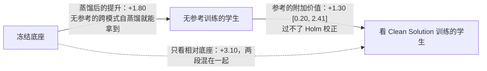

# 给教师看答案，学生到底多学了什么：在线自蒸馏里特权信息的对照实验

<!-- release-date: 2026-09-17 -->

> 本文依据新加坡国立大学（National University of Singapore，NUS）XiuYu Zhang、Wei Chow、Junfeng Fang、Xingyu Zhu、Zhenkai Liang、Tat-Seng Chua 的 **What Does Privileged Information Add to On-Policy Self-Distillation?**，即 arXiv:2609.20612v2（2026-09-18），共 28 页，封面标 Preprint。v1 提交于 2026-09-17。页码均指这份 PDF 的物理页码（与页脚印刷页码一致）。全文把三件事分开标注：**论文明确写了什么**、**我们如何解释它**、**哪些是外部补充**。

## 读前先把几个词说成人话

这篇论文不提新方法。它做的是一次「记账」：把一种流行训练方法的收益拆开，看每一块钱到底是谁挣的。所以先把账本上的几个词说清楚。

- **蒸馏（distillation）**：让一个模型（学生）去模仿另一个模型（教师）给出的下一个词的概率分布，而不只是模仿一个标准答案。
- **在线蒸馏（on-policy distillation）**：学生先自己写答案，教师再逐个位置给学生写出的每个前缀打分。好处是教师的反馈落在学生真正会走到的地方，而不是落在教师自己的理想答案上（PDF p. 9）。
- **自蒸馏（self-distillation）**：教师和学生是同一个底座模型。教师是冻结的一份拷贝，学生是在它上面训练的那份。
- **特权信息（privileged information，PI）**：只在训练时给教师看、推理时学生拿不到的额外信息。这里指题目的答案或解题过程。这个说法来自 Vapnik 等人的「利用特权信息学习」（PDF p. 1）。
- **OPSD（On-Policy Self-Distillation，在线自蒸馏）**：把上面三件事拼在一起。冻结的教师看着答案或解法，给只看题目的学生所写的前缀打分，学生朝教师的分布靠拢（PDF p. 1）。
- **思考模式与直答模式**：Qwen3、SmolLM3 这类模型可以开关「思考」。思考模式（thinking-enabled）先写一段长推理再给答案；直答模式（direct-response）关掉思考、直接作答。两种模式共用同一套参数。
- **无参考对照（reference-free control）**：教师照样开思考模式、照样给学生打分，只是不给它看任何特权信息。它是这篇论文最重要的对照组。
- **Avg@4**：每题采 4 个样本，先算每题的正确比例，再对所有题平均（PDF p. 4、p. 15）。
- **Holm 校正**：同时做好几组比较时，降低「碰巧有一组显著」的概率的一种多重比较修正。论文区分「未校正区间不含 0」和「校正后仍显著」两种强度（PDF p. 15）。

## 一句话先说清

OPSD 的直觉是：教师看了答案，自然比学生懂得多，学生就有东西可学。给得越完整（从只给最终答案，到给一整段原始推理），学生应该学到越多。

这篇论文说：先别急着把功劳记在答案头上。

在最常见的 OPSD 配置里，**教师开思考模式，学生用直答模式写前缀**（PDF p. 2）。于是就算完全不给教师看答案，教师和学生之间仍然有差距：一个在「想过之后」打分，一个在「没想」的状态下写字。这个差距本身就能产生训练信号。

作者为此造了一套对照数据 AMPLE-Math：5,319 道数学题，每题 6 种推理详略不同、但最终答案完全相同的参考视角（PDF p. 1、p. 4）。然后把每一种视角都和「无参考」对照组放在同一配置下比。结论分四层（PDF p. 1、p. 9）：

1. **大部分提升来自蒸馏本身。** Qwen3-1.7B 在思考模式下的提升，大部分在无参考对照里就已经出现，域内和外部竞赛题都是如此。
2. **参考的额外价值小，且看视角、看模型。** Qwen 上只有精修解法（Clean Solution）有一点证据，经多重比较校正后不显著；SmolLM3-3B 上完整推理轨迹（Full Trace）在第 50 步多出 2 个百分点。给得更完整，并不稳定地带来更大收益。
3. **同一个参考，换一种学生训练轨迹，收益就翻成损失。** 把学生的训练采样从短的直答换成长的思考模式，题目、参考、评测全不变，两个模型家族的收益都变成了损失。
4. **改教师的逐 Token 监督，不一定改得动学生行为。** 放松对「wait / check」这类反思词的惩罚，学生几乎照旧；「扩大损失覆盖窗口」看上去的好处，大部分只是停得更早。

作者给出的解读是：OPSD 可能是在通过直答和思考两种模式共享的参数，让模型更容易调出它**已经有**的推理能力；特权参考的价值，在于它给这种跨模式迁移**额外**加了什么，而不在于它把解法透露了多少（PDF p. 1）。

### 一条阅读路线

1. **p. 2 的 Figure 1**：整套实验的全景，六种视角加一个无参考对照，教师、学生、评测怎么连。
2. **p. 3 式 (1) 下面那段话**：为什么无参考对照不是「零信号」。
3. **p. 5 的 Figure 2 与 Table 1**：蒸馏收益和参考贡献是两个不同的量。
4. **p. 6 的 Figure 3**：换训练轨迹，收益翻成损失。
5. **p. 7 的 Figure 4、p. 8 的 Table 2 与 Figure 5**：教师画像和四类干预。
6. 附录 **p. 16–17** 的数据构造，**p. 19–23** 的补表，**p. 26–27** 的正确性对齐反例。

## 主要矛盾：提升不等于参考的贡献

OPSD 的标准叙事是这样的：一份拷贝看着解法当教师，一份只看题目当学生，教师给学生写出的前缀打分，学生朝教师的分布学（PDF p. 1）。它不需要一个更大的外部教师，所以便宜。

围绕它的问题是：**给教师看什么最好？** 只给答案、给要点、给整段推理？直觉说越完整越好。但近期几项工作已经发现反常现象：没有参考、甚至给别的题的参考，也能产生有用的监督；结构化的提示可能比完整解法更好（PDF p. 1，引 Shrestha & Tessier、Ichihara 等、Zhao 等 2026b）。

作者认为这些现象指向一个被忽略的记账问题：

> 学生比底座强了，这个「强了」里面，有多少是蒸馏这个动作本身带来的，有多少是参考信息带来的？

「相对底座有提升」回答不了这个问题（PDF p. 1）。要回答它，需要一个**只拿掉参考、其他一切不变**的对照组。

更麻烦的是，这个对照组并不是「教师等于学生」。论文在式 (1) 后专门点破（PDF p. 3）：如果教师和学生用同一个提示、同一种思考模式、同一份初始参数、同一个打分温度，那么无参考的教师就会和学生完全一致，初始损失为零；这时初始的差异全部由特权信息提供，之后的参数更新才会让学生逐渐偏离冻结的教师。但 OPSD 原始配置以及后续好几项方法，都让**思考模式的教师**去监督**直答模式的学生**（PDF p. 2）。于是即使不给参考，教师仍在用「想过之后」的分布给「没想」的前缀打分。论文把这种设置叫做跨模式自蒸馏（cross-mode self-distillation）（PDF p. 3）。

**我们如何解释它。** 这是全文的支点。OPSD 的信号来源其实有两股：一股是特权信息造成的信息差，一股是思考模式与直答模式之间的模式差。以往的评估把两股混在一起，记在参考头上。这篇论文要做的，就是把两股拆开。

## 先看全景：六种视角、一个空白对照、同一个教师

Figure 1 上半部分就是整套实验（PDF p. 2）。左边一道题 $17u + 5 = 56$，已核实答案 $u = 3$。它被写成六种视角，平均渲染长度从 13 到 4,916 个 Token 不等；另加一个「无视角」的无参考对照。选中的视角 $z_v(x)$ 只交给教师。教师是冻结的、开思考模式的同一个底座；学生只看题目、关掉思考、不见任何特权信息。教师给学生的每个前缀打分，二者的分布差构成 OPSD 损失。每种参考条件训出一个检查点，主评测用思考模式，副评测用直答模式。

图中间那条横箭头是全文要问的问题：「参考给蒸馏加了什么？」它被拆成两个量：

- **蒸馏后的提升**：训练后的学生对比初始模型；
- **参考的附加价值**：用特权信息训练的学生对比无参考训练的学生。

两者同协议、同检查点比较（PDF p. 2）。

Figure 1 把一次训练的全景画清楚了，下面这张图只画那条横箭头的「记账」：同一个总提升被拆成两段。数字取 Qwen3-1.7B 第 100 步域内、三种子的 Clean Solution，这是 Qwen 上参考贡献最大的一组（PDF p. 5，Table 1 与正文）：

读这张图要记住两点。第一，无参考那一段不是零：即使教师什么都不看，思考模式教师和直答模式学生之间的模式差仍在产生信号。第二，只看「相对底座 +3.10」，就会把这两段都记在参考头上（论文说相对底座的提升回答不了参考贡献多少，PDF p. 1）；而在这组里，参考只贡献了其中约四成，且统计上偏弱。

## 核心设计一：损失怎么算，以及一个实现口径的偏离

### 损失函数

学生 $\pi_\theta$ 在直答配置 $m_S$ 下，只看题目 $x$ 生成 $y = (y_1, \dots, y_L)$。在前缀 $s_t = (x, y_{<t})$ 上，学生的下一 Token 分布是 $p^S_t(a) = \pi_\theta(a \mid x, y_{<t}; m_S)$；教师在同一前缀上多看一个视角 $z_v(x)$，并用自己的思考配置 $m_T$ 和打分温度 $\tau$ 给出 $p^T_{v,t}(a)$（PDF p. 3）。

OPSD 损失对被监督的位置集合 $I(y)$ 取平均（PDF p. 3，式 1）：

$$
\mathcal{L}_v(\theta; m_S)
=
\mathbb{E}_{x,\ y \sim \pi_\theta(\cdot \mid x; m_S)}
\left[
\frac{1}{|I(y)|}
\sum_{t \in I(y)}
\widetilde{D}_{\mathrm{KL}}\!\left(p^T_{v,t} \,\Vert\, p^S_t\right)
\right]
$$

这里的 $\widetilde{D}_{\mathrm{KL}}$ 是「从教师到学生」的前向 KL，但对词表里每一项先从上方截断到 0.05 再求和（PDF p. 3）。求梯度时，教师分布和学生采出的那段文本都当常数（PDF p. 3）。

人话版：学生每写一个词，教师就说「换我看着答案来写，这个位置上每个词的概率应该是多少」，学生把自己的概率往那边挪；但每个词最多只罚 0.05，防止个别词的巨大分歧把梯度拉爆。

### 实现口径的一处偏离

附录写明，他们跟的是 OPSD 原作**公开代码**里的广义散度在 $\beta = 0$ 时的形式、每项截断 0.05，而**不是**原论文正文里描述的 $\beta = 0.5$（PDF p. 15）。

**我们如何解释它。** 这是一条对复现很重要的脚注：原论文与原代码不一致时，作者选了代码。读者若要和 OPSD 原作的数字对照，得先确认对方用的是哪个口径。

### 损失只看前 1,024 个 Token

直答采样最长 1,024 个 Token，全部被监督。思考模式采样在 Qwen 上可以长到 20,764 个 Token，但默认仍然只监督前 1,024 个（PDF p. 15）。这个继承自 OPSD 原作的「前 1K 窗口」后面会变成一个关键变量。

## 核心设计二：AMPLE-Math，把「答案」钉死，只改推理的写法

### 旧问题：比较参考时，答案信息也在变

如果一组对照里 A 只给答案、B 给整段推理，那 B 多出来的既有「推理过程」，也可能有「更确定的答案信号」。两个变量一起动，就说不清是谁起作用。

### 新设计：六种视角共享同一个已核实答案

AMPLE-Math 全称 Answer-Matched Privileged Levels of Explanation（答案对齐的分级特权解释），从 OpenThoughts-114k 构造（PDF p. 1、p. 4）。每道题六种视角，全部以同一段规范答案收尾（PDF p. 4）：

| 视角 | 给教师看什么 | 平均渲染长度（Qwen3 Token） | 怎么来的 |
|---|---|---:|---|
| Answer Only | 没有推理正文，只有答案 | 13 | 确定性生成 |
| Gist | 一小段话讲核心方法 | 76 | 由 Qwen3.6-35B-A3B-FP8 从原始轨迹压缩 |
| Key Points | 按顺序的关键步骤 | 284 | 同上 |
| Clean Solution | 一份精修的解法 | 526 | 来自数据源 |
| Summary | 叙述式的推理摘要 | 841 | 由 Qwen3.6-35B-A3B-FP8 压缩 |
| Full Trace | 完整的原始推理轨迹 | 4,916 | 来自数据源 |

长度数字见 PDF p. 2 的 Figure 1 与 p. 5 的 Table 1；来源见 PDF p. 4、p. 16。论文强调，长度描述的是**推理密度**，不是预设的质量高低（PDF p. 4）。

附录给了一个对齐示例（PDF p. 17）：题目是 $6 \times (5 - 2) + 4$，答案 22。Gist 只有一句「按运算顺序：先括号、再乘、再加」；Key Points 列出步骤；Clean Solution 是一份整齐的分步解；Summary 是第一人称叙述；Full Trace 则保留了「Okay, let's see… Hmm… Wait, let me double-check」这种原始思考口吻。

### 构造与审计

- **源与过滤**：取 OpenThoughts-114k 的 metadata 配置，每行一题、一个已核实答案、一条自然推理轨迹。要求答案可判分、轨迹最终答案与之一致；去掉近重复；排除超过 16,384 Token 的轨迹；筛掉与 MATH-500、AIME 2024、JEEBench 精确或语义重叠的题。得到 5,480 题的冻结池（PDF p. 16）。
- **生成与复核**：Gist、Key Points、Summary 由 Qwen3.6-35B-A3B-FP8 生成，最多 5 次可复现尝试，温度依次为 0.0、0.3、0.6、0.9、1.2；先做表面校验（是否完整、格式、有无提示泄漏），再做来源忠实度复核（有无无依据的说法、倒推式推理、信心拔高）（PDF p. 16）。
- **长度脊柱**：只有六种视角都存在、都通过校验、且推理正文长度满足 Answer Only < Gist < Key Points < Summary < Full Trace 的题才入库；Clean Solution 不在这条长度约束里（PDF p. 16）。最终 5,319 题入库，共 $5{,}319 \times 6 = 31{,}914$ 条监督记录，161 题被排除（PDF p. 16）。
- **格式**：每条记录渲染为 `<think> 正文 </think><answer> 答案 </answer>`，答案区恰好一个 boxed 答案（PDF p. 16）。

论文自己点出了两处审计边界（PDF p. 16）：

1. 生成和复核用的是同一个模型、不同提示，所以复核可能与生成共享盲点；
2. 忠实度复核只保证「保留了源轨迹的推理与不确定性」，不认证、也不修补源轨迹里的证明。

### 污染检查

对 90 道外部评测题（AIME 2024、AIME 2025、HMMT 2025 二月赛）做词片扫描，没有精确或近似重复；任意一道评测题的最大 8-gram 包含率是 0.25，来自竞赛题的共同措辞（PDF p. 16）。

另有一处需要注意的重叠：AMPLE-Math 与 OPSD 原作放出的训练数据同源，384 道测试题里有 202 道（52.6%）也出现在那份数据里（PDF p. 16）。论文的处理是：只有「原始数据复现」那一组实验用那份数据训练，并且只在外部基准上评测；所有视角与轨迹比较都用本地数据，训练、开发、测试三份互不相交（PDF p. 16）。

### 难度与切分

难度有两套，用途不同。

**数据集难度**：三个评测模型（Qwen2.5-1.5B-Instruct、Llama-3.1-8B-Instruct、Qwen3.6-35B-A3B-FP8）各对 5,480 题只看题面作答 8–16 次，用二项 Rasch 模型联合拟合模型能力与题目难度（PDF p. 17）。Rasch 模型是心理测量里的经典做法：一道题被做对的概率，取决于「做题者能力减题目难度」。难度中位数 +0.33，中间 50% 落在 −1.24 到 +1.34（PDF p. 18，Figure 6）；完整轨迹越长的题越难，5,319 题上 Spearman 相关 0.67（PDF p. 18）。

**实验切分用的相对难度**：用冻结的 Qwen3-1.7B 底座在直答模式下每题采 4 次，按做对次数分三档：3–4 次对（高成功）、1–2 次对（中间）、0 次对（零成功）（PDF p. 4）。零成功档还要求至少有一个结构化特权视角的教师生成是对的，保证「教师能做出来」（PDF p. 4、p. 17）。每档在训练、开发、测试中各取 512、64、128 题，合计 1,536、192、384 题（PDF p. 4、p. 17）。候选来自 5,319 题中排除 1,920 题后剩下的 3,399 题，画像用的题与三份切分都不相交（PDF p. 17）。

SmolLM3 共用开发集与测试集的题号，但训练集按它自己的直答结果重建；在共享测试题上它的三档分布是 129、97、158 题，不均衡，所以只作次要分析（PDF p. 17）。

### 可迁移启发

想比较「给模型看什么样的提示最好」，先把**答案信息量**钉死，再只改**表达形式**。否则「更详细的提示更好」可能只是「更确定的答案更好」。AMPLE-Math 的长度脊柱、同一规范答案收尾、以及一个「别的题的答案」对照，就是一套可以照搬的对照设计。

## 训练与评测设定

**模型**：主实验是 Qwen3-1.7B，跨家族验证用 SmolLM3-3B（PDF p. 4）。底座冻结，只训 LoRA 适配器（Low-Rank Adaptation，低秩适配：在原权重旁加一对小矩阵，只训练这对小矩阵），秩 $r = 64$、$\alpha = 128$、dropout 0，挂在 q、k、v、o、gate、up、down 七个投影上（PDF p. 4、p. 14）。教师就是关掉学生适配器的同一个底座，开思考模式（PDF p. 15）。

**优化**：有效 batch 32，学习率 $5 \times 10^{-6}$，AdamW、$\beta_2 = 0.999$，采样与损失温度都是 1.1，共 100 个优化步；在第 0、1、2、5、10、15、20、25、50、75、100 步存检查点（PDF p. 14）。SmolLM3 用同一配方，思考模式采样上限 24,536 Token，训练上下文 40,960，损失同样只覆盖前 1,024 个补全 Token（PDF p. 15）。

**域内评测**：384 道测试题，每题 4 个样本，温度 1.0、top-p 0.95、top-k 20；上下文 32,768，初次生成预算 16,384 Token（PDF p. 15）。凡被截断的回答，用同一随机种子从头重生成，新 Token 上限为 $\min(32{,}512,\ 32{,}768 - P - 256)$，$P$ 是提示长度（PDF p. 15）。

**外部评测**：AIME 2024、AIME 2025、HMMT 2025 二月赛各 30 题，每题 12 个样本，生成上限 38,912 Token（PDF p. 4、p. 5、p. 15）。

**统计**：推断单位是「题」。95% 区间来自 10,000 次按题聚类的 bootstrap 重采样，不同条件复用同一组重采样题号，所以是配对比较（PDF p. 4、p. 15）。主要比较在第 50 步和第 100 步（PDF p. 4）。开发集选检查点时，在 192 题开发集上按 Avg@2 从第 25、50、75、100 步里挑，不看测试集（PDF p. 15）。

**算力**：整个项目约 1,000 H100 GPU 小时，含训练、评测、教师画像、数据构造和调试（PDF p. 16）。

**我们如何解释它。** 这是一篇「小模型、短训练、重统计」的论文。100 步 LoRA、1.7B 与 3B 两个学生、只在数学上，这些都限定了结论的外推范围，作者在结论里自己也写了（PDF p. 9）。它的强项在于对照组设计和统计口径，而不在规模。

## 结果一：蒸馏收益和参考贡献是两个不同的量

先看 Figure 2(a) 的 Qwen 那一行（PDF p. 5）：无参考、Answer Only、Full Trace 三条线挤在一起，都在底座之上几个点。(b) 把「相对底座」换成「相对无参考」之后，Qwen 的 Answer Only 与 Full Trace 在第 50、100 步的四个点都贴着 0，区间全部跨 0（读自 Figure 2b）。这就是标题那句话：收益和贡献不是一回事。

### Table 1：六种视角 vs 无参考 vs 错答案

下表是 Qwen3-1.7B 在直答训练、思考模式评测下相对各自冻结底座的提升（PDF p. 5，Table 1）。域内是第 100 步的 ΔAvg@4，外部是第 50 步的 ΔAvg@12；方括号是 95% 区间。「错答案」是把 Answer Only 里的答案换成另一道题的答案。

| 参考 | PI Token | 种子（域内/外部） | 域内 第 100 步 | 外部合并 | AIME 2024 | AIME 2025 | HMMT 2025 |
|---|---:|---|---:|---:|---:|---:|---:|
| 无参考 | 0 | 3/3 | +1.80 [0.20, 3.47] | +4.07 [1.73, 6.54] | +8.24 | +1.67 | +2.31 |
| 错答案 | 13 | 3/3 | +1.67 [0.07, 3.32] | +4.14 [1.33, 7.07] | +6.30 | +2.87 | +3.24 |
| Answer Only | 13 | 4/4 | +2.41 [0.86, 3.99] | +3.73 [1.27, 6.41] | +8.06 | +1.53 | +1.60 |
| Gist | 76 | 1/1 | +2.15 [0.26, 4.04] | +4.35 [1.30, 7.59] | +6.67 | +3.89 | +2.50 |
| Key Points | 284 | 1/1 | +2.80 [0.72, 4.88] | +3.61 [0.37, 7.04] | +3.89 | +5.00 | +1.94 |
| Clean Solution | 526 | 3/1 | +3.10 [1.54, 4.73] | +4.91 [2.04, 7.96] | +7.78 | +4.44 | +2.50 |
| Summary | 841 | 1/1 | +2.54 [0.71, 4.43] | +3.61 [0.83, 6.48] | +6.94 | +1.67 | +2.22 |
| Full Trace | 4,916 | 4/4 | +2.38 [0.91, 3.86] | +2.29 [−0.16, 4.88] | +5.97 | +0.49 | +0.42 |

读这张表要看三件事。

**第一，无参考本身就在涨。** 域内 +1.80，外部合并 +4.07，两个区间都不含 0；连给错答案的对照也涨了（PDF p. 4–5）。

**第二，更多推理不带来一致的更多收益。** 第 100 步 Answer Only 与 Full Trace 都只比无参考高约 0.6 个点，区间都含 0（PDF p. 4）。外部合并那一列，最长的 Full Trace（+2.29）反而是最低的，区间还碰到了 0（PDF p. 5）。附录 Table 5 把外部结果改成「减无参考」后，Full Trace 为 −1.78 [−3.43, −0.21]，未校正区间在 0 以下，但在两组极端视角的 Holm 校正下不显著（PDF p. 19）。

**第三，Clean Solution 是唯一有点证据的视角。** 三种子对三种子，它在第 100 步比无参考高 1.30 [0.20, 2.41] 个点；未校正区间不含 0，但经六种视角的 Holm 校正不再显著（PDF p. 5）。附录 Table 4 的初始六视角检验（单种子视角对三种子对照）里，Clean Solution 减无参考为 +1.78 [0.24, 3.30]，原始 p 值 0.024、Holm 校正后 0.15（PDF p. 19）。种子级 Welch 区间给出 +1.30 [0.27, 2.33]，与 bootstrap 一致（PDF p. 22，Table 10）。论文的判断是：证据更支持「小的、特定视角的贡献」，而不是「把解法给得越多越好」（PDF p. 5）。

### 收益落在哪里：底座直答做不出、思考能做出的题

Figure 2(c) 与附录 Table 7 按底座直答 4 次中做对的次数分组（PDF p. 5、p. 21）：

| 第 100 步（Qwen，思考模式评测） | 0/4 直答做对 | 1–2/4 | 3–4/4 |
|---|---:|---:|---:|
| 底座思考模式正确率 | 61.91% | 83.98% | 94.73% |
| 无参考 相对底座 | +3.97 | +0.98 | +0.46 |
| Answer Only 相对底座 | +4.69 | +2.34 | +0.20 |
| Clean Solution 相对底座 | +7.03 | +1.89 | +0.39 |
| Full Trace 相对底座 | +5.66 | +1.51 | −0.05 |
| Clean Solution 相对无参考 | +3.06 [0.46, 5.79] | +0.91 | −0.07 |

收益集中在「底座直答 4 次全错、但开思考能做对约 62%」的那一档，有无特权信息都是如此；Clean Solution 的额外收益也在这一档最大（PDF p. 5、p. 20–21）。

### 原始数据复现

为确认实现没跑偏，作者用 OPSD 原作的训练数据与设置复训了一次，第 50 步在外部基准上评测（PDF p. 20–21，Table 8）：

| | AIME24 | AIME25 | HMMT25 | 合并 |
|---|---:|---:|---:|---:|
| 冻结底座 | 47.22 | 39.17 | 23.89 | 36.76 |
| OPSD 第 50 步 | 54.72 | 42.78 | 29.44 | 42.31 |
| 差值 | +7.50 | +3.61 | +5.56 | +5.56 [2.22, 9.17] |

同时，合并后的 Majority@12 升了 7.78 个点，Pass@12 却降了 7.78 个点（PDF p. 20）。按底座 12 次思考样本分组，90 道外部题里 27 道从未做对、49 道时对时错、14 道总是做对，对应 Avg@12 变化是 +0.62、+10.03、−0.60（PDF p. 20–21）。

**我们如何解释它。** Majority@12 升、Pass@12 降，是「把分布收窄」的典型签名：模型更稳定地给出它本来就常给的对答案，但少了偶尔撞对难题的多样性。这和收益集中在「时对时错」档是同一件事。它和作者的解读相容：OPSD 更像是在让已有能力更容易被调出来，而不是教会新东西。但这是我们的读法，论文正文只做了描述性分组（PDF p. 21）。

### 作者对收益来源的解释

两个分组模式都符合作者说的「共享参数」解释（PDF p. 5）：学生在直答前缀上学思考模式教师的打分，改的是两种模式共用的参数，因此思考模式下的推理也可能跟着变好（PDF p. 2、p. 5）。论文用的是「may」「suggest」这类措辞，把它当作与证据一致的解释，而没有做直接的机制验证（PDF p. 1、p. 9）。

## 结果二：SmolLM3 上，完整轨迹的参考更有用

SmolLM3-3B 是参考贡献更清楚的一方（PDF p. 5–6，附录 Table 6 在 PDF p. 20）。冻结底座思考模式 82.16%、直答模式 40.23%（PDF p. 20）。

| 学生（直答训练，三种子） | 思考模式 第 50 步 | 思考模式 第 100 步 | 直答模式 第 50 步 | 直答模式 第 100 步 |
|---|---:|---:|---:|---:|
| 无参考 | +0.59 | −5.25 | +13.24 | −10.39 |
| Answer Only | +0.87 | −5.03 | +11.91 | −10.09 |
| Full Trace | +2.58 | −2.19 | +2.60 | +2.76 |
| Full Trace 减 无参考 | +2.00 [0.82, 3.17] | +3.06 [1.71, 4.41] | −10.63 | +13.15 |

表中数字见 PDF p. 20。思考模式下，第 50 步 Full Trace 比无参考多 2.0 个点；到第 100 步三种配置都跌到底座以下，但 Full Trace 跌得少（PDF p. 5–6）。论文说，同一个参考在早期帮了学生、在后期减缓了退化，这是两种不同的贡献，只看「相对底座」分不出来（PDF p. 6）。

直答模式下，退化更严重。无参考与 Answer Only 学生即使经过重生成，无答案率也从第 50 步的 20.2% 和 22.0% 升到第 100 步的 42.0% 和 39.4%（PDF p. 19）。初次生成的平均长度从底座的 833 Token 涨到第 100 步的 11,153 和 10,875 Token，截断率约 43%（PDF p. 20，Table 6C）。

**我们如何解释它。** 直答模式下这两个学生越训越啰嗦、越来越答不出，像是把思考模式的长推理习惯「漏」进了直答模式。这恰好是跨模式迁移的反面：共享参数既能把好东西传过去，也能把不该传的传过去。论文没有用「漏」这个说法，只报告了长度、截断率和无答案率。

## 结果三：换一种评测模式，排名就翻

同一批学生，关掉思考直接作答，参考的排名完全变了（PDF p. 6）：

- Qwen 第 100 步，直答评测下 Answer Only 和无参考学生分别比 Full Trace 高 5.32 和 10.81 个点；
- SmolLM3 第 50 步，Full Trace 的优势从思考模式的 +2.00 变成直答模式的 −10.63。

Answer Only 减 Full Trace 在 Qwen 上的「模式交互」（直答对比减思考对比）是 +5.29 [3.26, 7.32]，四个种子各自都为正（PDF p. 22、p. 24，Table 10、Table 14）；SmolLM3 第 50 步的对应交互是 11.02 [8.14, 13.95]（PDF p. 23）。

论文还发现，Qwen 直答模式的赢家写得更长；如果只给它们存下来的前 4K Token 判分，排名反过来（PDF p. 6）。附录 Table 15 给了细节（PDF p. 24）：

| 判分截取 | Answer Only 减 Full Trace | 无参考 减 Full Trace |
|---|---:|---:|
| 前 4K | −3.01 | −3.99 |
| 前 8K | +3.29 | +3.86 |
| 前 16K | +5.09 | +9.51 |
| 完整评测 | +5.32 | +10.81 |

**我们如何解释它。** 「哪个参考最好」不是参考自己的属性，而是「参考 × 学生怎么作答 × 给多少 Token 预算」的交互。在一个只给 4K 预算的线上服务里，结论会和给 32K 预算的评测相反。评测 OPSD 类方法时，至少要同时报两种推理模式、并看长度，否则排名可能只是长度的影子。

## 结果四：换学生的训练轨迹，收益翻成损失

这是全文最干净的一组对照。Kaur 等人（2026）报告过思考型模型在 OPSD 下会退化（PDF p. 6）。作者在 Answer Only、Clean Solution、Full Trace 三种监督下，把学生的训练采样从直答换成思考模式，评测保持思考模式不变（PDF p. 6）。

需要先说清一个混杂：思考模式采样远长于默认的前 1,024 Token 损失窗口，所以「推理模式」「采样长度」「被监督的比例」三件事是一起变的（PDF p. 6）。

结果见 Figure 3 与附录 Table 11（PDF p. 6、p. 22），冻结底座为 80.21%：

| 视角 | 步 | 直答训练 | 思考训练 | 差（思考 减 直答） |
|---|---:|---:|---:|---:|
| Answer Only | 25 | 82.55 | 79.17 | −3.39 |
| Answer Only | 50 | 83.59 | 75.20 | −8.40 |
| Answer Only | 100 | 82.36 | 77.28 | −5.08 |
| Clean Solution | 25 | 82.03 | 81.05 | −0.98（区间含 0） |
| Clean Solution | 50 | 84.64 | 77.54 | −7.10 |
| Clean Solution | 100 | 83.79 | 77.28 | −6.51 |
| Full Trace | 25 | 82.55 | 78.26 | −4.30 |
| Full Trace | 50 | 82.42 | 75.13 | −7.29 |
| Full Trace | 100 | 82.62 | 72.79 | −9.83 |
| 合并 | 50 | 83.55 | 75.95 | −7.60 [−9.31, −5.95] |

九个差全为负，只有 Clean Solution 第 25 步的区间含 0（PDF p. 21–22）。直答训练在底座之上，思考训练在底座之下，而且惩罚在各检查点持续存在（PDF p. 6）。

这个结论跨模型、跨基准都成立（PDF p. 6、p. 22–23）：

- **SmolLM3 Full Trace**，两个种子：第 50 步差 −6.84，直答训练 84.83% 对思考训练 77.99%，底座 82.16%（PDF p. 22–23）。
- **Qwen Full Trace 外部基准**，第 50 步合并差 −9.44；AIME 2024 −13.06、AIME 2025 −12.78、HMMT 2025 −2.50，其中 HMMT 区间含 0（PDF p. 23，Table 13）。

作者还排除了「只是被截断」的解释（PDF p. 23）：外部评测里思考训练的学生在 1,080 个样本中有 79 个触到 38,912 Token 上限，直答训练只有 2 个。剔掉被截断样本后差距仍为 −8.16 [−12.16, −4.25]；即便把所有被截断样本都当成做对（实际一个都没对），差距也还有 −2.13，只是区间含 0（PDF p. 23）。Qwen 的补全检查也显示，在开发集选出的检查点上，Clean Solution 与 Full Trace 的思考训练学生回答反而更短，同时掉点（PDF p. 23）。

论文的总结是：教师不变、参考不变，只是它的监督被施加在另一种学生尝试上（PDF p. 6）。

**我们如何解释它。** 在 OPSD 里，学生不是被动接收答案，而是自己写前缀、教师在前缀上打分。所以学生写什么样的前缀，决定了教师在哪里、以什么方式给反馈。同一份参考，贴在短的直答前缀上是好信号，贴在长的思考前缀开头 1K 上可能是坏信号。这把「参考设计」和「学生训练轨迹」绑成了一个联合问题，作者在结论里也是这么表述的（PDF p. 9）。

### 可迁移启发

做思考型模型的在线蒸馏时，别默认「让学生也开思考模式训练」更好。这里的证据是：在同样的前 1K 损失窗口下，它在两个家族上都更差。若确实要在长推理上蒸馏，损失窗口、采样上限、被监督比例都要单独控制，否则无法归因。

## 教师画像：监督信号长什么样

结果一到四告诉我们「什么变了」。第 4 节试图回答「为什么」：在固定的学生回答上，比较不同参考下教师与学生的概率差（PDF p. 6）。

### 三个画像指标

画像在训练前做：Qwen3-1.7B 在 512 道题上，每题每种采样配置取 4 条不带特权信息的补全（PDF p. 3）。对每条补全，只取所有教师上下文都装得下的最长前缀 $J(y)$，直答画像再截到 1,024 Token（PDF p. 3）。

**平均对数概率差**（PDF p. 3，式 2）：同一段文本，在视角 $v$ 下教师比学生对每个 Token 平均多给了多少对数概率。

$$
\Delta_v(y) = \frac{1}{|J(y)|}\sum_{t \in J(y)} \left[\log p^T_{v,t}(y_t) - \log p^S_t(y_t)\right]
$$

**正确性对齐 $C_v$**（correctness alignment，PDF p. 3，式 3）：只看「既有对也有错」的题集合 $X_{\text{mix}}$，每题算「对的回答的平均 $\Delta_v$」减「错的回答的平均 $\Delta_v$」，再对题等权平均。

$$
C_v(x) = \overline{\Delta_v}\big(Y^+_x\big) - \overline{\Delta_v}\big(Y^-_x\big),
\qquad
C_v = \frac{1}{|X_{\text{mix}}|}\sum_{x \in X_{\text{mix}}} C_v(x)
$$

其中 $Y^+_x$、$Y^-_x$ 是题 $x$ 的正确与错误样本，上划线表示组内平均。$C_v > 0$ 表示教师相对更偏爱对的回答。

**反思词压力 $F_v$**（correction pressure）：在学生采出的「反思词」位置上平均 $\Delta_v$，负值表示教师压低这些词的概率（PDF p. 3）。反思词按子串匹配一张固定词表：wait、but、however、maybe、actually、recheck、check、verify、reconsider、mistake、instead（PDF p. 15）。

**KL 时间分布**：把保留区间分成四等份，看完整词表的未截断 KL 各占多少（PDF p. 3）。

覆盖规模：思考模式画像涉及 18,467,995 个不同的学生 Token 位置，六个特权上下文加一个无特权上下文，共 129,275,965 次打分（PDF p. 23）。两种画像都要求至少 512 个匹配 Token，这排除了 14.3% 的直答补全，剩 466 题的 1,756 条轨迹（PDF p. 24）。能算对齐的题，思考画像 116 道、直答画像 200 道，两者交集只有 48 道（PDF p. 24–25）。

### 三个发现

**发现一：正确性对齐随被打分的回答而变。** 以 Full Trace 为例，在直答前缀上，对的回答比错的回答拿到更大的概率提升；在思考前缀上，这个顺序反过来（PDF p. 6，Figure 4a）。在直答训练后第 50 步学生自己的回答上，五个视角的对齐大幅变小，只有 Full Trace 保留了大部分（PDF p. 6）。附录 Table 16 的数字（PDF p. 25，单位 nats/Token）：

| 视角 | 底座 · 思考前缀 | 底座 · 直答前缀 | 第 50 步学生 · 直答前缀 |
|---|---:|---:|---:|
| Answer Only | +0.0065 | +0.0041 | +0.0013 |
| Gist | +0.0042 | +0.0067 | +0.0024 |
| Key Points | +0.0019 | +0.0094 | +0.0011 |
| Clean Solution | −0.0005 | +0.0093 | −0.0003 |
| Summary | −0.0031 | +0.0089 | +0.0025 |
| Full Trace | −0.0123 | +0.0131 | +0.0099 |

Full Trace 在训练后保留了约四分之三（PDF p. 25）。论文提醒两点（PDF p. 6–7）：接近 0 的对齐只表示对错两类回答的平均提升差不多，不表示逐 Token 一致；更密的参考整体上引起更大的概率变化，原始 $C_v$ 并不把这一点和「对正确性的选择性」分开。只取思考画像的前 1,024 个 Token，视角间的差异也会减弱（PDF p. 7、p. 25）。所以对齐描述的是「在某个回答分布和某个区间上的监督」，不是参考的固定品质（PDF p. 7）。

附录 Figure 9 还显示，平均而言教师对对的回答和错的回答都给出**比学生更低**的似然，$C_v$ 量的是这两个负数之间的差（PDF p. 25–26）。Figure 1 下半部分那句「both negative, still aligned」说的就是这个（PDF p. 2）。

**发现二：压低反思词在两种前缀下都存在。** Kaur 等人提出「压抑反思」是思考模型退化的原因（PDF p. 7）。在冻结的 Qwen 底座上，每个视角在两种前缀模式下都平均压低了反思词概率（PDF p. 7，Figure 4b）。图 4b 的注脚另标了「student: −0.61 thinking, −1.18 direct」两个数（PDF p. 7，读自 Figure 4b），正文没有进一步解释它们的含义。

既然两种模式符号相同，这个信号就解释不了「一种训练涨、一种训练跌」（PDF p. 7）。这促使作者去做后面的反思词损失干预。

**发现三：KL 集中在回答开头。** 在两种前缀模式下，保留区间的第一个四分位都承载了不成比例的诊断 KL（PDF p. 7，Figure 4c）。从图上读：思考前缀的第一四分位约占 42.9%，直答前缀约 32.8%，均匀分布应是 25%（PDF p. 7，读自 Figure 4c）。这只说明教师和学生在哪里分歧最大，不说明分歧与正确性有关（PDF p. 7）。

继承来的前 1,024 Token 损失窗口，能盖住整条直答采样，却只盖住长思考采样的开头（PDF p. 7）。这引出了第 5 节的「扩大损失覆盖」实验。

### 正确性对齐的一个理论边界

附录 D.4 给了一个值得记住的小反例（PDF p. 26–27）。

先说它能说明什么：对一道题的固定样本，如果按 $\exp(\epsilon\, h_v(y))$ 对样本重新加权，那么正确率对 $\epsilon$ 的导数在 0 处等于 $p_x(1 - p_x)\, C_v(x)$，其中 $p_x$ 是该题的正确比例（PDF p. 26）。所以 $C_v(x) > 0$ 意味着「稍微按教师偏好重加权，这道题的固定样本正确率会升」。

再说它不能说明什么：重加权固定样本不是 OPSD 的参数更新（PDF p. 27）。反例构造了两道题、每道题只有一个二值 Token，学生正确概率分别是 $\sigma(\theta)$ 与 $\sigma(-2\theta)$，初值 $\theta_0 = 0$。两个教师 A、B 给的正确概率分别是 (0.54, 0.51) 与 (0.51, 0.54)，只是对调（PDF p. 27）。于是：

- 两者的期望教师正确率都是 0.525，平均 KL 相等，初始对齐 $C_A = C_B \approx 0.100$；
- 但梯度 $G_A = -0.010$、$G_B = +0.035$，学生正确率导数 $A'(0) = -1/8$；
- 步长为 $\eta$ 的一步梯度下降，A 让正确率变化 $-0.00125\,\eta$，B 让它变化 $+0.004375\,\eta$，符号相反（PDF p. 27）。

原因在共享参数：拟合第一道题时，第二道题会以两倍敏感度往反方向动，而聚合的诊断指标看不到这一点（PDF p. 27）。初值附近每个词表项都低于 0.05 截断阈值，所以结论对实际用的截断散度也成立（PDF p. 27）。

**我们如何解释它。** 这个反例把全文的方法论讲透了：任何「在固定回答上算出来的教师信号质量」指标，都只能用来**提出假设**，不能代替训练结果。因为真正决定学生怎么变的，是梯度通过共享参数的传播，而不是信号在单个样本上看起来好不好。作者在正文说的是「教师画像找出要测试的解释，匹配的训练结果决定哪些改动有用」（PDF p. 2）。

## 哪些监督改动真的影响迁移

第 5 节在 Qwen3-1.7B 上做了四类干预，评测都用思考模式（PDF p. 7–8）。

### Table 2：参考内容与训练信号的匹配干预

下表上半部分是直答训练第 100 步，全部单种子（PDF p. 8，Table 2）。「对匹配」指与对应的原配置比，「对底座」指与冻结底座比；Δ 长度是平均长度变化，Δ 反思词是每千 Token 反思词数的相对变化。

| 干预 | Avg@4 | 对匹配 | 对底座 | Δ 长度 | Δ 反思词 |
|---|---:|---:|---:|---:|---:|
| Clean Solution 换成别的题的视角 | 81.84 | −1.95 [−3.78, −0.20] | +1.63 | −794 | +4.2% |
| Key Points 换成别的题的视角 | 80.86 | −2.15 [−3.97, −0.39] | +0.65 | −1,242 | +7.6% |
| Full Trace 截到 Clean Solution 长度 | 82.03 | −0.59 | +1.82 | +684 | +4.3% |
| Full Trace 截到 Key Points 长度 | 82.42 | −0.20 | +2.21 | +464 | +6.1% |
| Full Trace 截到 Summary 长度 | 81.51 | −1.11 | +1.30 | +599 | +2.2% |
| Full Trace 换原 OPSD 提示模板 | 80.99 | −1.63 | +0.78 | +568 | −1.5% |
| Clean Solution 换原 OPSD 提示模板 | 83.92 | +0.13 | +3.71 | +1,068 | −1.2% |
| Full Trace 反思词位置不计损失 | 81.97 | −0.65 | +1.76 | −164 | +0.4% |
| Full Trace 反思词位置降权 | 81.84 | −0.78 | +1.63 | −64 | −0.3% |
| Clean Solution 反思词位置不计损失 | 83.07 | −0.72 | +2.86 | +231 | +0.3% |
| Clean Solution 反思词位置降权 | 83.07 | −0.72 | +2.86 | +132 | +1.1% |

四个结论如下。

**一、无参考也能涨，不等于参考内容无关。** 把 Clean Solution 或 Key Points 换成另一道题的、长度匹配的视角（连同那道题的答案），思考模式正确率比真视角低约 2 个点；两组在组内 Holm 校正后仍显著（PDF p. 7–8、p. 27）。长度对上了，内容讲的是另一道题，效果就保不住（PDF p. 7）。

**二、截短完整轨迹，改变的是学生从参考里获益的方式。** 把 Full Trace 截到该题 Key Points、Clean Solution 或 Summary 的长度（平均 298、523、870 Token，覆盖 2,112 题），保留开头、去掉后面的推理和答案段（PDF p. 7、p. 27）。思考模式下没有明显收益；但直答模式下，这些截断开头比完整 Full Trace 高约 8–11 个点（PDF p. 7）。附录 Table 17 给出直答差分别为 +9.05、+11.33、+7.81，模式交互全部为正（PDF p. 28）。

**三、放松反思词损失，几乎不改变反思词的使用。** 在反思词位置上不计损失或把损失乘以 0.1，第 100 步都没有提升，反思词用量几乎不变（PDF p. 7、p. 27）。论文的原话要点是：放松对采样到的反思词的惩罚，不等于鼓励学生去反思（PDF p. 7）。

**四、所谓「扩大损失窗口」的好处，大多是检查点选择造成的。** 见下一小节。

### 损失窗口：看上去 +4，其实 76% 是停得早

Figure 5(a) 先说明问题有多大（PDF p. 8）：前 1K 损失窗口能覆盖 Full Trace 直答补全的 100%（平均长 0.9K），但只覆盖思考模式补全的 18.6%（Full Trace，平均 9.4K）、14.8%（Clean Solution，11.2K）、11.4%（Answer Only，13.2K）。图注写，损失窗口最多在 1.4% 的采样里能碰到思考段的结尾（PDF p. 8，读自 Figure 5a）。

于是作者在思考模式的 Full Trace 训练上试了两种替代窗口（PDF p. 8、p. 28）：

- **First-4K**：把默认的 Early-1K 窗口延长到前 4,096 Token；
- **Distributed-1K**：在推理段里放 4 个 256 Token 的小窗口，中心大约在推理段的 0.125、0.375、0.625、0.875 处。

表面上，两种替代都比开发集选出的 Early-1K 高约 4 个点（PDF p. 8）。但开发集给 Early-1K 选的是第 50 步，给两种替代选的是第 25 步（PDF p. 8、p. 28）。三种窗口的逐步结果（PDF p. 28，Table 18）：

| 损失窗口 | 第 25 步 | 第 50 步 | 第 100 步 |
|---|---:|---:|---:|
| Early-1K | 78.26 | 75.13 | 72.79 |
| First-4K | 79.23 | 74.28 | 71.22 |
| Distributed-1K | 79.23 | 75.65 | 71.48 |

三种窗口都在第 25 步最高，然后一路往下掉。Figure 5(b) 把那 4.10 个点的「增益」拆开：从 Early-1K 第 50 步的 75.13 出发，光是把检查点从第 50 步挪到第 25 步就贡献 +3.13，损失窗口本身只贡献 +0.98，合计到 First-4K 第 25 步的 79.23（PDF p. 8，读自 Figure 5b）。图注写「76% 的增益来自检查点」（PDF p. 8）。同步数比较下，两种替代相对 Early-1K 的差在每一步的区间都含 0（PDF p. 8，Table 2 下半）：

| 替代减 Early-1K | 第 25 步 | 第 50 步 | 第 100 步 |
|---|---:|---:|---:|
| First-4K | +0.98 [−0.91, 2.86] | −0.85 [−2.93, 1.17] | −1.56 [−3.91, 0.72] |
| Distributed-1K | +0.98 [−0.91, 2.86] | +0.52 [−1.76, 2.80] | −1.30 [−3.45, 0.91] |

论文的结论是：停止时间是这次表观提升的主要来源（PDF p. 8）。这组损失窗口实验只用了一个训练种子（PDF p. 8）。

**我们如何解释它。** 这是一个在任何训练方法对比里都会踩的坑：两个配置各自在开发集上挑最佳检查点，然后比「最佳对最佳」。如果一个配置只是退化得更快、峰值出现得更早，这种比较就会把「早停」记成「方法更好」。这里的修法很简单，同步数对比加上逐步曲线；成本也很低，只是多存几个检查点。

### 可迁移启发

1. 教师画像（固定回答上的概率差、KL 分布、反思词压力）适合**提出假设**；真正决定一项改动有没有用，只能看匹配后的训练结果。
2. 「对某类 Token 放松惩罚」和「鼓励模型产生这类 Token」是两件事。前者是移除一个负梯度，不会自动产生正梯度。
3. 比较两个训练配置时，除了「开发集最佳对最佳」，一定要给同步数对比。

## 限制、边界，以及不要补进去的实现

论文自己写明的边界（PDF p. 9、p. 10、p. 16）：

- **短训练、小模型、单领域。** 证据来自两个模型家族上的短程 LoRA 数学训练（PDF p. 9）。100 步、1.7B 与 3B，都不能直接外推到全参数、长程、大模型或非数学任务。
- **评测只看数学正确性**，不能当成一般安全评估（PDF p. 10）。
- **数据审计用同一个模型生成与复核**，可能共享盲点（PDF p. 16）。
- **很多干预是单种子。** Table 2 的 17 组比较都是单种子（PDF p. 8）；损失窗口实验一个种子（PDF p. 8）；Gist、Key Points、Summary 在 Table 1 里只有一个种子（PDF p. 5）。
- **区间含 0 不代表等价。** 论文明确写了这一点（PDF p. 15）。「Qwen 上参考几乎没多带来什么」应读成「没找到可靠的额外收益」，而不是「证明了没有」。
- **思考模式训练的对照有混杂。** 推理模式、采样长度、被监督比例三者一起变（PDF p. 6）。损失窗口实验试图拆开其中一项，但没有找到显著差异。

我们读完需要留下的判断：

- **「共享参数带来跨模式迁移」是一个与证据相容的解释，不是被直接证明的机制。** 支持它的证据是：无参考也涨、收益集中在「直答做不出、思考能做出」的题、原始数据复现的收益集中在「时对时错」的题。论文没有做参数层面的分析，用词也是「may」「suggest」（PDF p. 1、p. 5、p. 9）。
- **Clean Solution 的优势是「弱证据」。** 未校正区间不含 0，种子级检验也支持，但过不了六视角的 Holm 校正（PDF p. 5、p. 19、p. 22）。
- **SmolLM3 的参考贡献更清楚，但 SmolLM3 本身在第 100 步已经全线退化。** Full Trace 的作用有一部分是「退化得慢」（PDF p. 5–6、p. 20）。
- **论文没有提出新的训练方法，也没有给出「应该用哪种视角」的推荐。** 它的产出是一套对照数据、一套记账方法和几条否定性结论。结论部分提出的下一步是：测试能随学生尝试而自适应的参考内容，是否优于固定表示（PDF p. 9）。

## 可迁移启发

1. **评估任何「给教师加信息」的方法，先做一个只拿掉信息的对照。** 这篇论文最有价值的一点，就是指出无参考对照在跨模式设置里并不是零信号。凡是教师和学生配置不同（思考与直答、长上下文与短上下文、带工具与不带工具），都要先测「模式差」单独能带来多少。
2. **把答案信息量钉死，再比较表达形式。** AMPLE-Math 的长度脊柱加同一规范答案收尾，是比较「提示详略」时可以直接复用的对照设计。「别的题的视角」这个对照同样便宜又有效。
3. **在线蒸馏里，学生写什么决定教师在哪里说话。** 同一个教师、同一份参考，换一种学生采样，效果可以反号。调在线蒸馏时，学生的采样配置和损失窗口应该当成一级超参数，而不是继承默认值。
4. **两种推理模式都要评测，并看长度。** 同一组检查点在思考与直答模式下的排名可以完全相反；只给 4K 预算判分还能再翻一次。
5. **固定样本上的信号诊断只能提出假设。** D.4 的反例说明，平均 KL、正确性对齐都相同的两个教师，可以让学生朝相反方向走。决定性证据只能来自训练。
6. **比较训练配置时，永远给同步数对比。** 「各挑各的最佳检查点」会把早停记成方法收益。这组实验里约 76% 的表观增益就是这么来的。
7. **Majority@k 升、Pass@k 降，是分布收窄的信号。** 在原始数据复现里两者各动 7.78 个点、方向相反（PDF p. 20）。如果目标是提升探索或多样性，这种自蒸馏可能与目标冲突，值得单独测。

## 关键词回看

- **OPSD（在线自蒸馏）**：冻结的同一底座当教师、看特权信息，给只看题目的学生所写的前缀打分，学生做前向 KL 的截断版蒸馏。
- **特权信息（PI）**：只给训练时的教师、推理时学生拿不到的信息。本文里是六种答案对齐的推理视角。
- **无参考对照**：教师照样开思考模式打分，但不看任何参考。它在跨模式设置下仍有信号。
- **跨模式自蒸馏**：思考模式教师监督直答模式学生。作者认为 OPSD 的很多收益来自这里。
- **AMPLE-Math**：5,319 题 × 6 视角 = 31,914 条监督记录，同一已核实答案，推理详略从 13 到 4,916 Token。
- **蒸馏收益 vs 参考贡献**：前者对比底座，后者对比无参考学生。两者不是同一个量。
- **训练轨迹反转**：学生训练采样从直答换成思考模式后，两个家族的收益都变成损失，第 50 步 Qwen 域内合并差 −7.60。
- **正确性对齐 $C_v$**：同一题里「对的回答的平均概率差」减「错的回答的平均概率差」。只能描述特定回答分布上的监督，不能预测训练方向。
- **反思词压力 $F_v$**：教师在 wait、check 这类词上压低概率。两种前缀下都为负，放松它的损失几乎不改变用量。
- **Early-1K / First-4K / Distributed-1K**：三种损失窗口。看上去的约 4 个点提升，约 76% 来自检查点选择。

## 资料与阅读边界

### 本文依据的版本

- 本地原件：`papers/NUS/Privileged-Info-OPSD.pdf`，28 页，页边标 `arXiv:2609.20612v2 [cs.CL] 18 Sep 2026`。arXiv 上 v1 于 2026-09-17 提交，v2 于 2026-09-18 提交；本地为 v2，即当前最新版。
- 官方页：[arXiv:2609.20612](https://arxiv.org/abs/2609.20612)。
- `release-date` 取 **2026-09-17**。这是一篇只讲公开技术、不发布新模型的方法论文，按流程取该技术首次官方公开日，即 arXiv v1 提交日。

### 论文明确写了、本文覆盖了的部分

摘要；第 1 节动机与三项贡献；第 2 节 OPSD 损失、画像指标、AMPLE-Math、训练与评测设定；第 3 节 Figure 2、Table 1、SmolLM3 结果、评测模式交互、Figure 3 训练轨迹反转；第 4 节 Figure 4 三类画像；第 5 节 Table 2、Figure 5 四类干预；第 6 节相关工作的定位；第 7 节结论；AI 使用、伦理、可复现声明；附录 A 实现与统计口径（含 $\beta = 0$ 的实现偏离、约 1,000 H100 GPU 小时）；附录 B 数据构造、审计、切分与难度（Figure 6、Figure 7）；附录 C 的 Table 3–15；附录 D 的覆盖、Table 16、Figure 9–10、D.4 反例；附录 E 的干预构造、Table 17–18 与原 OPSD 提示模板。

### 外部补充（不是 PDF 原文）

- 论文首页链接了代码仓库 [xiuyuz/opsd-reference-study](https://github.com/xiuyuz/opsd-reference-study) 与数据集 [xiuyuz/ample-math](https://huggingface.co/datasets/xiuyuz/ample-math)（PDF p. 1、p. 16）。仓库与数据集的具体内容本文未展开；逐行评测输出论文写明「按需提供」（PDF p. 16）。
- 本站另有一篇相关的在线自蒸馏论文解读：Self-Distillation-Zero 一篇讲的是同一模型当修订者、把二值奖励蒸成稠密监督，与本文的「给教师看参考」是不同的信号来源，可对照读。
- 论文引用的同期工作（Shrestha & Tessier、Ichihara 等、Zhao 等 2026b、Harne 等、Nguyen 等、Kaur 等）只按 PDF 里的引文转述其观点，本文没有展开这些论文的内容。

### 原文没有公开、本文也不补的缺口

- 除数学外的任何领域、全参数微调、更大模型或更长训练上的结果；
- 「共享参数带来跨模式迁移」的直接机制证据（例如参数或表征层面的分析）；
- 多数干预与损失窗口实验的多种子结果；
- Qwen3.6-35B-A3B-FP8 生成与复核视角时所用的完整提示；
- 逐行的评测输出（论文写明按需提供）。
