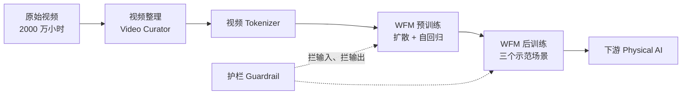
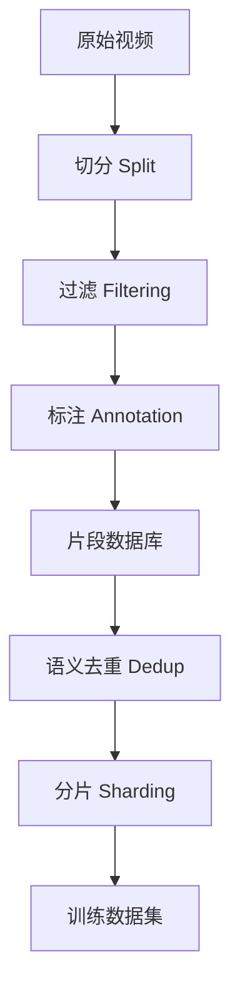
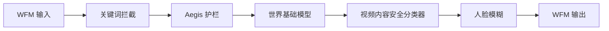

# Cosmos：机器人不能靠摔跤学习，于是 NVIDIA 先造了一个世界

<!-- release-date: 2025-01-06 -->

> 本文依据 NVIDIA 的 **Cosmos World Foundation Model Platform for Physical AI**，本地原件是 arXiv:2501.03575v3（2025-07-09 提交，页眉日期 2025-7-11），共 75 页。这已经是官方最新版：arXiv 官方页的提交历史只有 v1（2025-01-07）、v2（2025-03-18）、v3 三个版本，因此未换件。页码一律指本地 PDF 自身的页码。
>
> 文中会明确区分三层：**报告写了什么**、**我们如何解释或推算**、**哪些是外部资料补充**。外部补充一律标出来源并给链接。
>
> 关于 `release-date`：取 2025-01-06，即 CES 2025 上 Cosmos 平台发布、且首批开放权重同日可下载的那一天。这一篇的「宣布」和「开放使用」恰好是同一天，证据链见文末。

## 先讲矛盾：为什么机器人学不会「多练几遍」

过去几年，语言模型的进步有一条极其朴素的路径：**把数据和算力一起放大**。互联网上有足够多的文本，把它喂进足够大的 transformer，能力就会长出来。

机器人没有这条路。

报告开篇把原因写得很直接：Physical AI 需要的数据必须包含**交替出现的观测与动作**序列，而这些动作会真的扰动物理世界，可能对系统和世界造成严重损害；尤其在 AI 还很稚嫩、探索性动作不可或缺的阶段（PDF p.1）。

把这句话翻译成日常语言：

- 语言模型练错一次，代价是一个错字。
- 机械臂练错一次，代价可能是一只摔碎的杯子、一条撞坏的机械臂，或者更糟。

而且这些数据**不能靠爬取获得**。互联网上有海量视频，但视频只记录了「发生了什么」，没有记录「操作者当时按了什么、发了什么指令」。你想要的那一半数据，只能从你自己控制的系统里录，一次一条，实时速度。

所以问题不是「机器人的算法不够好」，而是**机器人这条赛道上，数据这个自变量根本放不大**。

报告给的解法是一句已经被念了很多年的老话：**先在数字世界里训练**。摘要第一句就是 "Physical AI needs to be trained digitally first"（PDF p.1）。要做到这一点，你需要两个数字孪生（digital twin，即真实对象在计算机里的等价副本）：一个是机器人自己的副本，叫**策略模型**；另一个是世界的副本，叫**世界模型**。

这里就撞上第二个矛盾。

传统的世界副本是**手写的仿真器**——用物理定律加系统辨识写出运动方程，机器人和自动驾驶行业已经这么干了几十年。报告在相关工作里点出了它的死穴：这类系统专用模型通常局限在**低维状态空间**，限制了跨系统的泛化与知识迁移，换个任务或环境就得重做（PDF p.55）。

写一个能模拟「木质桌面上一只玻璃杯被机械爪捏起来」的仿真器很难；写一个能同时模拟这个、和高速公路上一辆卡车在雨中变道、和一只手把毛巾叠成三折的仿真器，基本不可能。

于是 Cosmos 押的注是：

> **既然世界的仿真器写不出来，那就像语言模型学语言一样，从视频里把它学出来。**

这个赌注一旦下定，后面整篇报告就变成了一条**必须逐项还清的账单**。学一个世界模型，你得先解决五件事：互联网视频不是能直接训练的数据；视频太大，塞不进 transformer；生成范式该选扩散还是自回归；学出来的通才怎么变成某个具体机器人能用的专才；以及——你要把一个照片级真实的视频生成器开源出去，安全怎么办。

这五笔账，就是 Cosmos 的五个组件。**它是一个平台而不是一个模型，原因就在这里。**

## 读之前：十个词先各用一句话说清

这一篇里的行话密度不低。下面这些词大多不是 Cosmos 发明的，属于读这份材料的前置背景，先说人话。

- **Physical AI（物理 AI）**：报告自己给的定义是「装有传感器与执行器的 AI 系统」——传感器让它观察世界，执行器让它与世界互动并改变世界（PDF p.1）。机器人、自动驾驶车、智能工厂都算。
- **世界模型（World Model）**：给定过去看到的画面和这一步的扰动，预测下一帧画面的模型。它和普通视频生成模型的差别只有一条：**能不能在中途接受控制**。
- **世界基础模型（World Foundation Model，WFM）**：报告新提出的定位词，指一个**通用**的世界模型，可以通过微调变成某个具体场景的定制世界模型（PDF p.1，摘要）。类比：WFM 之于世界模型，就像基座大模型之于某个垂直领域的对话助手。
- **仿真到真实（sim-to-real）**：在仿真环境里训练、然后把学到的策略搬到真机上用。中间那道「仿真和现实不一样」的落差叫 sim-to-real gap，报告在物理评测一节提到自己的仿真素材还需要提升真实感来弥合这道落差（PDF p.40）。
- **Token 与 tokenizer（词元与分词器）**：模型不直接吃像素。先把画面压缩成一串紧凑的符号，这些符号叫 token，做这件事的模块叫 tokenizer。token 越少，后面的模型越跑得动。
- **连续 token 与离散 token**：连续 token 是一串浮点向量，适合扩散模型；离散 token 是一串整数（相当于查字典的编号），适合用交叉熵训练的 GPT 式模型。报告用一张图专门讲这个区别（PDF p.12，图 7）。
- **扩散模型（diffusion model）**：先给数据加满高斯噪声，再训练一个网络一步步把噪声去掉。生成时从纯噪声出发，反复去噪，得到一段视频。它把「一次生成整段视频」这个难题拆成一串「去掉一点噪声」的易题。
- **DiT（Diffusion Transformer，扩散 Transformer）**：把扩散模型里那个负责去噪的网络从卷积 U-Net 换成 transformer。好处是可以直接吃 transformer 那一整套扩展经验。
- **自回归（autoregressive）**：一次生成一个 token，把结果接回输入，再生成下一个。和语言模型的生成方式完全一样。
- **无分类器引导（Classifier-Free Guidance，CFG）**：扩散模型生成时的一个旋钮。同时算一遍「带提示词的预测」和「不带提示词的预测」，然后朝两者的差值方向多走一点，让结果更贴合提示词。走得越多越听话，但也越容易丢掉多样性和真实感。

再补两个只在本篇里出现的自造词：

- **Text2World / Video2World**：报告给两类任务起的名字。Text2World 是「一句文本 → 一段世界视频」；Video2World 是「过去的视频 + 一个提示 → 未来的视频」。后者才是世界模型的正式形态。
- **pre-Guard / post-Guard**：护栏系统的两半，分别拦输入和拦输出（PDF p.53）。

## 一句话说清 Cosmos 做了什么

报告把世界模型写成一个函数（PDF p.4）：

$$
\hat{x}_{t+1} = \mathcal{W}(x_{0:t},\ c_t)
$$

其中 $x_{0:t}$ 是从 0 时刻到 $t$ 时刻看到的 RGB 视频，$c_t$ 是这一步对世界的**扰动**，$\hat{x}_{t+1}$ 是模型预测的下一帧。

关键在 $c_t$ 的宽松定义。报告明说它可以有很多形式：Physical AI 采取的一个动作、一次随机扰动、一段对扰动的文字描述，等等（PDF p.4）。

**这个宽松定义就是整个平台的设计自由度所在。** 因为 $c_t$ 可以是文字，所以预训练能用互联网视频加自动生成的字幕来做；因为 $c_t$ 也可以是相机位姿、机械爪的七维动作向量、或者一条行车轨迹，所以后训练能把同一个底座接到完全不同的下游场景上。

于是 Cosmos 的形态是：

> **一个用互联网视频以「文字当扰动」预训练出来的通才，加上一套把它改造成「真实动作当扰动」的专才的方法。**

平台在这篇报告里包含五个部件（PDF p.5，图 4）：

这张图由我们根据报告图 4（PDF p.5）与第 3 至 7 节的章节顺序重画，表达的是部件之间的依赖关系，不代表实际的并行方式或时序。

规模上，报告只给了一句总账：论文里报告的**全部** WFM 模型，是在一个 **10,000 块 NVIDIA H100 GPU** 的集群上、用**三个月**时间训练出来的（PDF p.18）。报告没有把这三个月拆到各个模型上，所以我们无法算出任何单个模型的训练成本。

## 和站内已有的世界模型解读怎么分工

站内已经有一篇世界模型方向的解读：[Genie](/reports/Google/Genie)，讲的是初代 Genie（Bruce 等，ICML 2024）——从**没有动作标注**的纯视频里，靠信息瓶颈学出一套只有 8 个码的「潜动作」，从而拿到帧级可控。

Cosmos 的这份报告在相关工作里引用了它：一次列在「自回归式世界模型」里（PDF p.55），另外两次列在「世界模型在电子游戏领域的有效性」和「动作到视频」这两条线上（PDF p.56）。参考文献 [16] 标注的出现页也正是 55 与 56（PDF p.62）。

两者的分工很干净，一句话就能说清：

| | Genie（初代） | Cosmos |
|---|---|---|
| 想解决的缺口 | 动作标注太贵 | 世界仿真器写不出来 |
| 控制信号从哪来 | 从视频里**学**出来 | 从下游场景**给**进来（文本 / 位姿 / 动作 / 轨迹） |
| 交付形态 | 一篇方法，未发权重 | 一个开源平台，权重开放 |

所以 Cosmos 不需要解决 Genie 那个问题：它的控制信号在后训练阶段是有标注的（机器人数据集自带动作，驾驶数据集自带自车运动）。**它要解决的是另一头——底座够不够强，强到只用小数据微调就能接上你的机器人。** Genie 的机制本篇不展开，需要的读者去看那一篇。

提醒一个已知的命名坑：另一份报告曾把 Genie 2（Parker-Holder 等）写成「Genie」。上面对照的是**初代** Genie，两者不是同一篇工作。

## 第一笔账：两千万小时视频，怎么变成能训练的数据

报告说得很直白：**数据决定了模型的天花板**（PDF p.1）。

原始素材是自有的专有视频数据集加上公开的开放域互联网视频，总量约 **2000 万小时**，分辨率从 720p 到 4k（PDF p.7）。目标品类是刻意挑的，覆盖 Physical AI 关心的场景（PDF p.6）：

| 品类 | 占比 |
|---|---:|
| 自然动态 | 20% |
| 手部动作与物体操作 | 16% |
| 空间感知与导航 | 16% |
| 驾驶 | 11% |
| 人体动作与活动 | 10% |
| 第一人称视角 | 8% |
| 动态相机运动 | 8% |
| 合成渲染 | 4% |
| 其他 | 7% |

这张配比表本身就值得读一遍。**它不是互联网视频的自然分布，是一个刻意调出来的分布。** 手部操作 16%、空间导航 16%、第一人称 8%——这三项加起来 40%，全都是「一个身体在世界里干活」的视角，正好对应机器人。而娱乐类、影视类内容被压得很低。

最终产出是：约 **1 亿**（$10^8$）个 2 到 60 秒的视频片段用于预训练，约 **1000 万**（$10^7$）个用于微调（PDF p.1、p.7）。

流水线有五步（PDF p.6，图 5）：

这张图由我们根据报告图 5（PDF p.6）重画，只表达步骤顺序。下面逐步讲清楚每一步在解决什么问题。

### 切分：为什么必须先检测镜头切换

**旧问题。** 原始视频长度任意，而深度模型吃不下很长的视频。更要命的是很多视频里有**镜头切换**：上一秒还是纽约厨房里两个人聊天，下一秒就切到非洲草原上狮子追斑马（PDF p.7，这个例子是报告自己举的）。

如果不切开，模型学到的就是「画面可以毫无理由地整体跳变」——这恰恰是物理世界不会发生的事。报告的原话是：要让模型学到**物理上合理**的视觉内容转换，而不是人为剪辑出来的转换（PDF p.7）。

**新设计。** 用镜头边界检测把长视频切成没有镜头切换的片段。短于 2 秒的丢掉（可能只是转场或特效），长于 60 秒的再切，最长 60 秒（PDF p.7）。

选哪个检测算法，报告专门建了一个基准 ShotBench 来比（PDF p.7–8）。四种方法的 F1 分数：

| 数据集 | PySceneDetect | Panda70M | TransNetV2 | AutoShot |
|---|---:|---:|---:|---:|
| BBC | 0.889 | 0.777 | **0.967** | 0.952 |
| RAI | 0.831 | 0.829 | **0.919** | 0.906 |
| SHOT | 0.718 | 0.622 | 0.821 | **0.834** |
| ClipShots | 0.477 | 0.513 | **0.726** | 0.711 |

（PDF p.8，表 1。原表还给了精确率与召回率，这里只保留 F1。）

结论有两条。第一条报告明写了：端到端学习的方法（TransNetV2、AutoShot）明显好过手工特征与启发式规则（PySceneDetect、Panda70M）（PDF p.8）。

第二条更值得记——**为什么最终选了 TransNetV2 而不是分数互有胜负的 AutoShot**。报告给了两个理由：TransNetV2 在更有挑战性的镜头切换上表现更好；而且用端到端神经网络可以借现代 GPU 加速切分吞吐，不必像 Panda70M 那样用复杂逻辑去拼接 PySceneDetect 和 ImageBind 嵌入（PDF p.8）。**后一个是纯工程理由，和精度无关。** 在 2000 万小时这个量级上，「能不能在 GPU 上一把跑完」和「F1 高 0.013」是同一个数量级的考量。

### 转码：一条被藏在附表里的 6.5 倍

**旧问题。** 原始视频编码格式五花八门，给后续处理和训练时的数据加载都带来麻烦。

**新设计。** 全部重新编码成统一的高码率 mp4。报告说他们用高码率的 `h264_nvenc`，并且拿快速运动和高频纹理的视频做过压力测试，确认没有可察觉的画质退化（PDF p.8）。

真正有意思的是他们为了提速做了什么（PDF p.8，表 2）：

| 方案 | GPU | 编解码器 | 批量 | 吞吐（视频/秒） |
|---|---|---|---:|---:|
| ffmpeg | H100（28 核 CPU） | libx264 | 1 | 0.0574 |
| ffmpeg | L40S | h264_nvenc | 1 | 0.0674 |
| ffmpeg | L40S | h264_nvenc | 16 | 0.1026 |
| PyNvideoCodec + ffmpeg | L40S | h264_nvenc | 1 | **0.3702** |

四行数字里藏着三个不同性质的加速：

1. **换硬件**：L40S 同时带硬件解码器（NVDEC）和编码器（NVENC），H100 只有 NVDEC。给 H100 补到 28 个 CPU 核之后，L40S 仍然快约 17%（PDF p.8）。
2. **批量处理**：同一个视频的多个片段一起转码，0.0674 → 0.1026。
3. **换软件栈**：这一步跳得最大。报告说他们观察到 **ffmpeg 无法充分利用 NVDEC/NVENC 加速器**，在多 GPU 节点上尤其明显；把视频流转码从 ffmpeg 换成 PyNvideoCodec 之后，加速器利用率大幅提升，吞吐从 0.1026 跳到 0.3702（PDF p.8）。他们只保留 ffmpeg 做音频混流。

合起来约 **6.5 倍**（PDF p.8）。$0.3702 / 0.0574 = 6.45$，与报告的说法吻合（本文核算）。

**可迁移启发。** 这一段最值得记的不是 6.5 这个数，而是那句「ffmpeg 没能把加速器用满」。在数据流水线上，**瓶颈经常不在算法，而在某个通用工具没有走到你硬件的快路径上**。这类问题只有实测吞吐才能发现，看代码看不出来。

### 过滤：四道闸，各拦一种垃圾

切完之后的片段质量参差不齐。报告设计了四类过滤（PDF p.9）：

| 过滤 | 拦什么 | 怎么做 | 关键取值 |
|---|---|---|---|
| 运动过滤 | 完全静止的、以及手持相机那种随机抖动的 | ViT 分类器读光流 | 用 TensorRT 加速的光流网络效果最好 |
| 画质过滤 | 有伪影、噪点、模糊、过曝欠曝的 | DOVER 视频质量评估 + 图像美学模型 | 感知质量分**最低 15%** 丢掉；美学阈值 **3.5** |
| 叠字过滤 | 后期加了大量文字的 | InternVideo2 嵌入 + MLP 二分类 | 训练标签由专有 VLM 生成 |
| 类型过滤 | 抽象图案、游戏录像、动画 | 自建分类体系 + MLP 分类器 | 同样用 InternVideo2 嵌入 |

（PDF p.9）

三个细节值得单独拎出来。

**第一，美学阈值定得很低，而且报告解释了原因。** 阈值取 3.5，报告说这是一个**保守**的阈值，因为「美学对 Physical AI 来说不那么重要」（PDF p.9）。这是一句很清醒的话：一段光线难看、构图糟糕的仓库监控录像，对学习物理的价值可能远高于一段调过色的旅拍。**过滤器的严格程度应该由下游用途决定，不该照抄通用图像生成的标准。**

**第二，叠字过滤有一条精确的边界。** 报告特意说明：他们针对的是**后期加上去的**文字，不是原始场景里本来就有的文字，比如驾驶视频里的街道名（PDF p.9）。这个区分很关键——街道名是世界的一部分，弹幕不是。

**第三，类型过滤同时做了「排除」和「配比」两件事。** 排除的是游戏录像、动画、抽象图案这类会导致「生成质量差或动态不真实」的内容；配比则是把与 WFM 更相关的类别（人的动作、人与物体的交互）**上采样**，把不太重要的（自然风光）**下采样**（PDF p.9）。前面那张品类配比表，就是在这一步调出来的。

由于缺少现成的标注数据，这两个分类器的训练集都是用一个专有 VLM 生成的：每个片段均匀采 8 帧喂给 VLM，问它最合适的类别标签（PDF p.9）。**这是一条很典型的现代数据流水线套路**：用一个昂贵的大模型给少量数据打标，再蒸馏成一个便宜的小分类器去跑全量。报告没有公开这两个分类器的准确率数字，只说「在验证集上取得了高预测准确率」（PDF p.9），也没有公开分类体系的完整目录。

### 标注：为什么不用现成的 alt text

**旧问题。** 训练文生视频需要「视频—文本」配对。互联网视频自带标题和描述，为什么不用？

报告的理由很实际：用 VLM 统一生成描述，而不是依赖 alt text，可以**减轻世界模型的学习负担，因为不需要在训练中去适配各种不同的文本风格和格式**（PDF p.10）。

这一点很容易被低估。互联网上的视频描述有的像新闻标题，有的像弹幕，有的是关键词堆砌。模型如果同时见到这些，就得先学会「这是哪种风格的描述」，才能学「这段描述对应什么画面」。**统一成一种风格，等于把这个额外的学习任务删掉。**

具体做法（PDF p.10）：他们比过 VFC、Qwen2-VL、VILA 三家，基于小规模人工评估选了 VILA；用的是一个**内部的 130 亿参数 VILA**，为视频描述任务做过微调，上下文窗口扩大过，最大输入 5904 token、最大输出 256 token。提示词固定为一句英文——大意是请它详细阐述视频的视觉与叙事元素——每个片段喂 8 帧均匀采样。

生成的描述平均 **559 个字符 / 97 个词**（PDF p.10）。

推理效率是被认真优化过的（PDF p.10，表 3）：

| 引擎 | 精度 | 批量 | 吞吐（片段/秒） |
|---|---|---:|---:|
| PyTorch | FP16 | 1 | 0.21 |
| TensorRT-LLM | FP16 | 1 | 0.40 |
| TensorRT-LLM | FP16 | 16 | 1.09 |
| TensorRT-LLM | FP8 | 16 | **1.96** |

报告称这是相对 PyTorch 半精度基线的 **10 倍**加速（PDF p.10）。按表里的数字实算是 $1.96 / 0.21 = 9.33$ 倍（片段吞吐）或 $470.6 / 49.6 = 9.49$ 倍（token 吞吐），**都不到 10 倍**（本文核算）。报告的「10×」是一个向上取整的说法。

顺带算一笔账：1 亿个片段，按 1.96 片段/秒算，需要约 **5100 万秒 GPU 时间**，即约 **590 天单卡**（本文推算，报告未给这个数）。这解释了为什么他们愿意为一个数据标注环节做 FP8 量化和 TensorRT 引擎——**在这个量级上，标注本身就是一次大规模推理任务**。

### 去重与分片：三成数据被删掉

去重用的是 SemDeDup 和 DataComp 的思路（PDF p.10）：

1. 复用过滤阶段已经算好的 InternVideo2 嵌入（**不重算**）；
2. 用多节点 GPU 加速的 k-means 聚成 $k = 10{,}000$ 个簇；
3. 在每个簇**内部**算两两距离，找出重复；
4. 发现重复时，**保留分辨率最高的那个**，避免因去重损失画质。

有一个纯工程细节值得看：为了不把整个两两距离矩阵放进显存，他们**按 256 的块大小在线计算所需的上三角矩阵并做 argmax 归约**（PDF p.10）。结果是去掉约 **30%** 的训练数据（PDF p.10）。

还有一个副产品，报告只用一段话带过，但很实用：他们拿同一批 InternVideo2 嵌入和聚类结果建了一个**视觉搜索引擎**，可以用自由文本或视频去查询整个训练集，用来调试数据问题、以及理解**预训练数据集和下游应用之间的差距**（PDF p.10）。嵌入已经为了过滤算过一次，聚类已经为了去重算过一次，再搭一个检索接口几乎是零边际成本，换来的是「我的训练集里到底有没有雨天隧道场景」这类问题可以直接查。

最后一步分片，是按分辨率、宽高比和长度把片段打包成 webdataset，与训练课程对齐（PDF p.10）。

### 基础设施：让不同的硬件单元同时忙起来

数据流水线本身是一个分布式系统问题。报告说他们用 AnyScale Ray 实现了一套面向**地理上分散的集群**的流式流水线，解决两个问题：同构节点间的资源利用率，以及跨高延迟连接访问数据源时的稳定性；关键设计是**把数据传输和计算解耦**，于是内存需求随流水线复杂度增长、而不是随数据集大小增长，从而支持无界流处理（PDF p.11）。

还有一条值得记：流水线的不同阶段用的是**互补的硬件资源**——网络带宽用于数据摄入、NVDEC 单元用于视频解码、GPU 用于计算密集的变换——所以可以并发跑。他们扩展了 Fragmentation Gradient Descent 算法来做这个多资源分配，调度器会自动伸缩各个阶段，让各类加速器之间的吞吐保持平衡（PDF p.11）。

**可迁移启发：当流水线的各阶段瓶颈落在不同的硬件单元上时，最优解不是串行跑完，而是让它们同时跑、各占各的资源。** 一个 8 卡节点在做视频解码时 GPU 的 SM 是闲的，反过来做模型推理时 NVDEC 是闲的。把两者叠起来，等于凭空多出一台机器。

## 第二笔账：视频太大，先把它压小

第 4 节讲 tokenizer。理解它的关键是先算一笔账。

一段 121 帧、$1280 \times 704$ 的 720p 视频，原始像素数是 $121 \times 1280 \times 704 \times 3 \approx 3.27 \times 10^8$。直接送进 transformer 完全不可能。

报告给的这一档配置是 Cosmos-Tokenize1-CV8×8×8-720p，时间压 8 倍、空间压 $8 \times 8$ 倍，之后扩散模型再做一次 $1 \times 2 \times 2$ 的 patch 化。最终上下文长度是 **56,320** 个 token，报告在表 12 的脚注里把算式写出来了（PDF p.22）：

$$
\underbrace{\frac{1280}{8 \times 2}}_{80} \times \underbrace{\frac{704}{8 \times 2}}_{44} \times \underbrace{\left(\frac{121 - 1}{8} + 1\right)}_{16} = 56{,}320
$$

也就是说，**3.27 亿个像素被压成了 5.6 万个 token，压缩比约 5800 倍**（本文核算）。tokenizer 就是这条链上压缩比最大的一环。

### 因果性：一个看起来很小、影响很大的约束

Cosmos Tokenizer 最核心的设计选择是**时间上因果**：当前帧的 token 计算不依赖未来的观测（PDF p.5）。

报告给了两个理由，一个训练侧、一个应用侧（PDF p.5）：

- **训练侧**：因果视频 tokenizer 在输入是单张图片时**同时也是一个图像 tokenizer**。这让图像和视频的联合训练成为可能。而图像数据集包含丰富的外观信息、而且往往更多样，对视频模型很重要。
- **应用侧**：因果 tokenizer 与「活在因果世界里」的 Physical AI 系统更契合。

第一条的机制值得说清楚。图 7 的说明写道：**第一个时间 token 表示第一个输入帧**，这使得图像（$T = 0$）与视频（$T > 0$）能在共享的潜空间里被 token 化（PDF p.12）。用日常语言讲：因为编码第 1 帧时不许看后面的帧，所以「只有第 1 帧」这个退化情况天然成立。如果 tokenizer 是双向的（编码第 1 帧时要参考第 5 帧），那给它一张单图它就没法工作，你只能再训一个单独的图像 tokenizer，两套潜空间还对不上。

**因果性在这里不是为了推理时的流式生成，而是为了让一个网络同时吃两种模态。** 这是一个很典型的「约束换统一」的设计：主动放弃一部分信息（未来帧），换来一个更简单的系统。代价报告没有量化——双向 tokenizer 在重建质量上理论上应该更占优，但报告没有做因果与非因果的对照实验，所以我们不知道这个代价有多大（本文判断）。

### 小波变换：一个不常见的前置步骤

**旧问题。** 视频里有大量像素级冗余，让编码器的每一层都从原始像素干起，很浪费。

**新设计。** Cosmos Tokenizer **在小波（wavelet）空间里操作**：输入先过一个 2 级小波变换，把视频在 $x$、$y$、$t$ 三个方向各降采样 4 倍（PDF p.13）。分组方式是：

$$
\{x_0,\ x_{1:4},\ x_{5:8},\ \ldots,\ x_{(T-3):T}\} \rightarrow \{g_0,\ g_1,\ g_2,\ \ldots,\ g_{T/4}\}
$$

注意第一组只有 $x_0$ 一帧，后面每组四帧——这正是因果设计的体现，第一帧独立成组（PDF p.13）。报告给的理由是：小波变换让他们在一个**更紧凑的视频表示**上操作，消除了像素信息中的冗余，从而让剩下的层可以专注于更**语义**的压缩（PDF p.13）。

**可迁移启发。** 这是一个很老派但很有效的思路：**先用一个无参数、可逆、计算便宜的变换把已知的冗余去掉，再让神经网络处理剩下的部分。** 小波变换不需要学习、几乎不花算力，却直接把网络要处理的数据量降到 $1/64$（三个方向各 4 倍）。**能用信号处理解决的，不要让梯度下降去学。**

### 网络结构：因果的三个层面

编码器的主体是残差块与下采样块交替（PDF p.13–14）：

- **卷积做成时空分解**：先做 $1 \times k \times k$ 的 2D 卷积抓空间信息，再做 $k \times 1 \times 1$ 的时间卷积抓时间动态；时间方向用 $k-1$ 的**左侧 padding** 保证因果性（PDF p.13）。
- **注意力也做成时空分解且因果**，带全局支持域，比如最后一个编码器块的时间支持域是 $1 + T'$（PDF p.14）。
- **激活函数用 Swish；归一化用 LayerNorm 而不是 GroupNorm**，报告给的理由是这能防止潜空间或重建输出的特定区域出现过大的幅值（PDF p.14）。

解码器镜像编码器，把下采样块换成上采样块（PDF p.14）。

「左侧 padding 保证因果性」这一句值得展开一秒：时间卷积核长度是 $k$，如果两侧各补 $(k-1)/2$，那么算第 $t$ 帧时就会用到第 $t+1$ 帧；全部补在左边，卷积窗口就只覆盖 $t-k+1$ 到 $t$，未来帧碰不到。**这是把「不许看未来」写进算子形状里，而不是靠训练时的技巧。**

### FSQ：为什么不是 VQ-VAE

离散 tokenizer 需要一个量化器。传统选择是 VQ-VAE：维护一本码本，把连续向量映射到最近的码。Cosmos 用的是 **FSQ（Finite-Scalar-Quantization，有限标量量化）**（PDF p.14）。

FSQ 的做法简单到有点粗暴：不学码本，而是把每一维分别**四舍五入到固定的几个档位**上。Cosmos 的配置是 6 维，每维的档数依次是 $(8, 8, 8, 5, 5, 5)$，于是词表大小是

$$
8 \times 8 \times 8 \times 5 \times 5 \times 5 = 64{,}000
$$

（PDF p.14、p.28）。这个 64,000 后来就是自回归 WFM 的词表大小，正好和一个中等规模语言模型的词表同量级。

报告在训练策略一节说明了这么选的直接好处：他们**只监督解码器的最终输出**，不使用任何接在潜空间上的辅助损失，比如 commitment loss 或 KL 先验损失。如果连续 tokenizer 用 VAE 而不是朴素 AE，就需要 KL 先验损失；如果离散量化用 VQ-VAE 而不是 FSQ，就需要 commitment loss（PDF p.14）。

**这是一次「用结构简化换掉损失项」的交易。** VQ-VAE 的码本是学出来的，学的过程需要额外的损失项去约束（否则会码本坍塌、大部分码用不上）。FSQ 的「码本」是固定网格，没有东西可学，也就没有东西会坍塌，损失函数里少一项超参数要调。连续 tokenizer 那边同样朴素：直接用**普通自编码器（AE）** 而不是 VAE，潜维度 16（PDF p.14）。

### 训练：两阶段，加上一个对抗微调

**第一阶段**用 L1 重建损失加 VGG-19 感知损失（PDF p.14–15）：

$$
\mathcal{L}_1 = \|\hat{x}_{0:T} - x_{0:T}\|_1
$$

$$
\mathcal{L}_{\text{Perceptual}} = \frac{1}{L} \sum_{l=1}^{L} \sum_{t} \alpha_l \left\| \text{VGG}_l(\hat{x}_t) - \text{VGG}_l(x_t) \right\|_1
$$

其中 $\text{VGG}_l(\cdot)$ 是预训练 VGG-19 第 $l$ 层的特征，$\alpha_l$ 是该层的权重。L1 管「像不像」，感知损失管「看起来像不像」——前者逐像素比，后者比高层特征，对轻微位移不那么敏感。

**第二阶段**加两项：**光流损失**（比较重建视频与原视频的相邻帧光流，管**时间平滑性**）和 **Gram 矩阵损失**（比较特征的 Gram 矩阵，管**图像锐度**）；最后还有一个**对抗损失**的微调阶段，报告说这是为了在大压缩率下进一步增强重建细节（PDF p.15）。

**这个分阶段设计的逻辑很清楚。** 第一阶段先把「大体正确」学到；第二阶段再补两个第一阶段管不到的维度——L1 和感知损失都是**逐帧**算的，完全不管帧与帧之间的连贯性，所以必须专门加一项光流损失；而 L1 天然偏爱模糊（模糊的图平均误差更小），所以必须专门加锐度项和对抗损失去对冲。

训练时图像与视频的 mini-batch 按预设频率**交替**（PDF p.14）——这正是因果设计换来的那个能力。

### 结果：一张压缩率对质量的表

报告训练了一整套 tokenizer：图像的两档压缩（$8 \times 8$、$16 \times 16$），视频的三档（$4 \times 8 \times 8$、$8 \times 8 \times 8$、$8 \times 16 \times 16$）（PDF p.15）。而且分了两代（PDF p.16）：**Cosmos-0.1-Tokenizer** 用较少帧数的 720p mini-batch 训练（连续 49 帧、离散 17 帧），**Cosmos-Tokenize1** 用更多帧数的 360p 或 720p mini-batch 训练（连续 121 帧、离散 49 帧）。

视频 tokenizer 在 DAVIS 数据集上的对照（PDF p.16，表 5、表 6，这里挑出关键行）：

| Tokenizer | 类型 | 帧数 | PSNR ↑ | rFVD ↓ |
|---|---|---:|---:|---:|
| CogVideoX-Tokenizer 4×8×8 | 连续 | 17 | 29.29 | 19.58 |
| Cosmos-0.1-Tokenizer-CV4×8×8 | 连续 | 49 | 32.80 | 15.93 |
| Cosmos-Tokenize1-CV4×8×8-360p | 连续 | 49 | **35.85** | **10.057** |
| Cosmos-Tokenize1-CV8×8×8-720p | 连续 | 121 | 31.28 | 23.49 |
| VideoGPT-Tokenizer 4×4×4 | 离散 | — | 28.17 | 72.33 |
| Cosmos-Tokenize1-DV4×8×8-360p | 离散 | 49 | 32.97 | 53.44 |
| Cosmos-Tokenize1-DV8×16×16-720p | 离散 | 49 | 25.49 | 259.33 |

（PDF p.16。rFVD 是重建 FVD，越低越好。）

三个必须点出来的读法：

**第一，离散比连续差得很明显。** 同为 $4 \times 8 \times 8$，Cosmos-Tokenize1 的连续版 PSNR 35.85、rFVD 10.057，离散版 32.97、53.44。rFVD 差了五倍。**这不是 Cosmos 的问题，是离散化的固有代价**——把一个 16 维浮点向量换成一个 0 到 63,999 的整数，信息一定会掉。

**第二，$8 \times 16 \times 16$ 这一档掉得非常厉害。** DV8×16×16-720p 的 PSNR 只有 25.49，rFVD 高达 259.33。而这一档**正是自回归 WFM 实际用的那一档**（PDF p.18）。所以自回归模型是站在一个重建质量明显更差的地基上工作的。报告后面专门做了一个扩散解码器来补救，原因就在这里。

**第三，两代 tokenizer 是同一张表里的两行。** Cosmos-0.1 和 Cosmos-Tokenize1 用相同的压缩率但不同的训练配置，后者明显更好（32.80 → 35.85）。报告归因于**训练时采样的帧数更多、分辨率配置不同**（PDF p.16），没有做更细的消融。

运行时性能这一项报告赢得很干净（PDF p.17，表 9）：

| Tokenizer | 分辨率 | 参数量 | 单帧耗时 |
|---|---|---:|---:|
| CogVideoX-Tokenizer 4×8×8 | 720×1280 | 216M | 414 ms |
| Cosmos-0.1-Tokenizer-CV4×8×8 | 720×1280 | 105M | **34.8 ms** |
| FLUX-Tokenizer 8×8 | 1024×1024 | 84M | 242 ms |
| Cosmos-0.1-Tokenizer-CI8×8 | 1024×1024 | 77M | **62.7 ms** |

$414 / 34.8 = 11.9$ 倍，与报告说的「快 2 到 12 倍」一致（本文核算，PDF p.17）。报告还说这套 tokenizer 能在单张 80GB A100 上一次性编码 1080p 8 秒或 720p 10 秒的视频而不 OOM（PDF p.13）。

**为什么它又小又快？** 报告没有单列一节解释，但两个原因可以从设计里读出来（本文推断）：小波变换在网络之外先降了 64 倍数据量；时空分解的卷积把 $k^3$ 的 3D 卷积拆成 $k^2 + k$，参数和计算都大幅下降。

### 边界

评测有一处需要留意：表 5 里各行的**帧数不一样**（CogVideoX 17 帧，Cosmos 49 帧或 121 帧）。PSNR 和 rFVD 都会受序列长度影响，所以这些行不是严格的等条件对照，报告也没有说明这一点（本文判断）。另外报告没有给出**下游影响**的对照：换一档 tokenizer，生成模型的最终质量会变多少？表 5、表 6 只测了重建质量。「重建质量好 → 生成质量好」是一个合理但未被这篇报告验证的假设。

## 第三笔账：两条生成路线，为什么都要走

第 5 节是全文最长的一节，也是最容易迷路的地方。先把地图摆出来（PDF p.18，表 10）：

| | 扩散路线 | 自回归路线 |
|---|---|---|
| 基座 | Cosmos-Predict1-7B-Text2World Cosmos-Predict1-14B-Text2World | Cosmos-Predict1-4B Cosmos-Predict1-12B |
| 派生 | Cosmos-Predict1-7B-Video2World Cosmos-Predict1-14B-Video2World | Cosmos-Predict1-5B-Video2World Cosmos-Predict1-13B-Video2World |
| 用的 tokenizer | Cosmos-Tokenize1-CV8×8×8-720p （连续） | Cosmos-Tokenize1-DV8×16×16-720p （离散） |
| 配套增强件 | Cosmos-UpsamplePrompt1-12B-Text2World （提示词扩写） | Cosmos-Predict1-7B-Decoder- DV8×16×16ToCV8×8×8-720p （扩散解码器） |

两条路线各有两个规模、每个规模各有一个 Video2World 派生版，一共八个模型，再加两个配套件。

**为什么要同时做两条路？** 报告在相关工作和结论里都回答了（PDF p.56、p.58）：**扩散模型渲染的视频画质更好**，而**自回归模型能更好地借用 LLM 社区开发的各种技术**。

结论一节说得更具体：自回归 WFM 有两项尚未兑现的潜力——(1) 可以复用大语言模型的预训练权重来继承广泛的世界知识；(2) 可以用为因果注意力设计的先进推理优化来更快生成。如果这些能力被完全实现，自回归 WFM 可能特别适合需要**交互式控制或实时处理**的应用（PDF p.58）。这是这份报告里最有前瞻性的一段，翻译成更直白的一句话：

> **画质是扩散赢，但「能不能做成一个让机器人实时查询的服务」是自回归赢。而世界模型的终局用途恰恰是后者。**

报告自己也说，两者的边界并不僵硬：双向注意力的扩散 transformer 可以被蒸馏成因果注意力的学生模型从而支持 KV 缓存；自回归模型也可以引入局部双向注意力、用扩散头来生成图像（PDF p.58）。下面分别讲。

## 扩散 WFM：把 DiT 改造成视频世界模型

### 目标函数：EDM 加一层不确定性加权

报告采用 EDM 的框架（PDF p.19）。在噪声水平 $\sigma$ 上，去噪器 $D_\theta$ 的去噪分数匹配损失是：

$$
\mathcal{L}(D_\theta, \sigma) = \mathbb{E}_{x_0, n} \left\| D_\theta(x_0 + n;\ \sigma) - x_0 \right\|_2^2
$$

这里 $x_0$ 是干净的图像或视频，$n \sim \mathcal{N}(0, \sigma^2 I)$ 是高斯噪声。翻译成人话：**给干净数据加上强度为 $\sigma$ 的噪声，让网络把原图猜回来。**

总损失是各噪声水平上的加权期望（PDF p.19）：

$$
\mathcal{L}(D_\theta) = \mathbb{E}_\sigma \left[ \frac{\lambda(\sigma)}{e^{u(\sigma)}} \mathcal{L}(D_\theta, \sigma) + u(\sigma) \right]
$$

$$
\lambda(\sigma) = \frac{\sigma^2 + \sigma_{\text{data}}^2}{(\sigma \cdot \sigma_{\text{data}})^2},
\qquad
\ln(\sigma) \sim \mathcal{N}(P_{\text{mean}}, P_{\text{std}}^2)
$$

这里有两个加权，作用完全不同：

- $\lambda(\sigma)$ 是 EDM 原本就有的**静态**权重，作用是让训练**开始时**每个噪声水平的贡献相等（PDF p.19）。
- $u(\sigma)$ 是 Cosmos 加的**动态**权重。报告说，随着训练推进那个平衡会退化；他们把「在不同噪声水平上优化」当作一种**多任务学习**，引入一个连续的不确定性函数 $u(\sigma)$ 来量化各噪声水平上去噪目标的不确定性，用一个简单的 MLP 参数化它，和主损失一起最小化（PDF p.19）。

$u(\sigma)$ 的机制看公式就明白：它出现在分母的 $e^{u(\sigma)}$ 和加号后面两个地方。模型对某个 $\sigma$ 越没把握，$u(\sigma)$ 越大，$e^{u(\sigma)}$ 越大，这一档的损失贡献被**压小**；但 $u(\sigma)$ 自己又被直接加进损失，所以不能无限变大——报告的原话是「模型会为这份不确定性受到惩罚，鼓励 $u(\sigma)$ 尽可能低」（PDF p.19）。

**它解决的问题是：不同噪声水平的难度天差地别，按固定权重加起来，最难的那几档会主导梯度，把整个训练拖住。** 让模型自己报「我这一档有多难」，再据此打折，同时给「报难」本身收费，就能自动配平。

报告还专门说明了它和另一条流行路线的关系：近期一些视频生成模型用高斯流匹配（Gaussian flow matching）表述，而他们从扩散分数匹配出发；但按 Gao 等人的工作，两个框架在理论上是等价的，主要区别在预条件设计和超参数的选择上，实践中他们没有遇到 EDM 表述带来的性能限制（PDF p.19）。**这句防止了一个常见误读**：社区里常说「flow matching 比 diffusion 先进」，报告在这里明确说两者理论等价，差别在工程细节。

### 网络：DiT 上的五处改动

去噪器建立在 DiT 之上（PDF p.20）。改动有五处：

**一、3D patch 化。** 输入是形状 $T \times C \times H \times W$ 的潜表示（图像被当作单帧视频）。用一个线性层把形状为 $(p_t, p_h, p_w)$ 的不重叠立方体投影成一个个 token，展平后序列长度是 $THW / (p_t p_h p_w)$。Cosmos 取 $p_t = 1$，$p_h = p_w = 2$（PDF p.20）。

注意 $p_t = 1$：**时间方向不再做 patch 化**，因为 tokenizer 已经在时间上压了 8 倍，再压就太狠了。

**二、FPS 感知的 3D RoPE 加可学习绝对位置嵌入。** 报告把特征维度切成三块，分别沿时间、高、宽三个轴施加 RoPE（旋转位置编码），这样就能生成任意尺寸、宽高比和长度的视频（PDF p.20）。

三个工程细节：

- 实现上不需要在每个块里做切分和拼接，只要把频率嵌入按各自的轴拼好，就能**复用为 LLM 优化过的 RoPE kernel**（PDF p.20）。这是一句很实在的话——**把新问题映射回旧算子，才能吃到已有的优化**。
- 为了支持不同帧率的视频，他们**按训练视频的 FPS 重新缩放时间频率**。由于 RoPE 是相对位置编码、而且做了 3D 分解，这个 FPS 感知设计和图文联合训练是兼容的（PDF p.20）。
- 渐进式训练改变分辨率或视频长度时，借助 NTK-RoPE，他们观察到**模型在 5,000 步训练内就能收敛到合理性能**（PDF p.20–21）。

另外他们发现，**每个 transformer 块再加一个额外的可学习绝对位置嵌入**能进一步改善模型、降低训练损失，并减少生成视频中的**形变（morphing）伪影**（PDF p.21）。

**这个「相对 + 绝对」的组合值得注意。** 纯相对位置编码不知道「我在整段视频的哪个位置」，只知道「我和你差多远」。对视频来说，绝对位置是有意义的——第一帧和第一百帧的角色不同。报告没有给这一项的消融数字，只给了定性结论。

**三、交叉注意力做文本条件。** 每个 transformer 块的顺序是：自注意力 → 交叉注意力 → 前馈。自注意力在时空 token 之间做，交叉注意力用 T5-XXL 的文本嵌入当 key 和 value（PDF p.21）。

**四、Query-Key 归一化。** 训练早期他们观察到注意力 logits 增长不稳定，导致注意力熵坍塌；于是用带可学习缩放的 RMSNorm 对 $Q$ 和 $K$ 做归一化，自注意力和交叉注意力层全都加（PDF p.21）。

**五、AdaLN-LoRA，一个纯粹省参数的改动。** 这一处最值得展开。报告的观察是：DiT 的自适应层归一化（AdaLN）层占了模型参数的很大一部分，但在 FLOPs 上的贡献可以忽略不计（PDF p.21）。

**为什么会这样？** AdaLN 根据时间步 $t$ 算出一组 scale / shift / gate 参数去调制每一层的归一化，这个映射通常是一个从时间步嵌入到 $d_{\text{model}}$ 的稠密线性层、每层一组，参数量在 $O(\text{层数} \times d_{\text{model}}^2)$ 量级；但它每次前向只算**一次**（整个序列共享），而自注意力和前馈要在**每个 token 上**算。所以「参数很多、算力很少」（本文解释）。

Cosmos 借鉴 W.A.L.T 的做法，用 LoRA 把这些稠密线性投影分解成低秩近似，秩取 256（PDF p.21）。效果是：对 Cosmos-Predict1-7B 来说，**参数量减少 36%（从 11B 降到 7B），而所有评测指标上性能持平**（PDF p.21）。$(11 - 7) / 11 = 36.4\%$，与报告一致（本文核算）。

> **可迁移启发：在做参数优化之前，先把「参数量占比」和「算力占比」分开画一张表。占参数不占算力的模块，是免费午餐的所在地。**

减掉 4B 参数，意味着模型权重、梯度、优化器状态和 EMA 权重全都少 4B 份，训练显存直接下降；而因为它不占算力，减掉之后训练速度基本不变，性能也没掉。这种改动的性价比比调架构高得多。

配置表（PDF p.21，表 11）：

| 配置 | 7B-Text2World | 14B-Text2World | 7B-Video2World | 14B-Video2World |
|---|---:|---:|---:|---:|
| 层数 | 28 | 36 | 28 | 36 |
| 模型维度 | 4,096 | 5,120 | 4,096 | 5,120 |
| FFN 隐藏维度 | 16,384 | 20,480 | 16,384 | 20,480 |
| AdaLN-LoRA 维度 | 256 | 256 | 256 | 256 |
| 注意力头数 | 32 | 40 | 32 | 40 |
| KV 头数 | 32 | 40 | 32 | 40 |
| 基础学习率 | $2^{-15}$ | $2^{-16}$ | $2^{-15}$ | $2^{-16}$ |
| 权重衰减 | 0.1 | 0.2 | 0.1 | 0.2 |

其余共用：MLP 激活 GELU、混合位置嵌入、学习率线性预热 2,500 步、AdamW $\beta_1 = 0.9$、$\beta_2 = 0.99$、$\epsilon = 10^{-10}$（PDF p.21）。

注意 KV 头数等于注意力头数——**扩散侧是标准多头注意力，没有用分组查询注意力**。这一点后面讲自回归侧时会再提到，因为那里有一处矛盾。

### 训练策略：五个细节

**一、图文联合训练与归一化对齐。** 图像和视频的 batch 交替优化。为了促进跨模态知识迁移，他们用**领域专属的归一化**方案，分别为图像和视频独立估计充分统计量，把两边的潜分布对齐；又因为观察到视频潜表示在**时间和通道维度上统计量非平稳**，进一步做**逐帧、逐通道**的标准化，让潜表示更接近各向同性高斯先验（PDF p.21–22）。

报告给这个方案还找了一个理论好处：**训练时信噪比的尺度不变性**。原文的论证很清晰（PDF p.22）：设两个零均值潜表示，一个方差为 1，一个方差为 4；要让前者达到某个信噪比，加的噪声是 $\mathcal{N}(0, \sigma^2)$，那么后者就必须加 $\mathcal{N}(0, 4\sigma^2)$ 才能保持同样的比值。把所有潜表示都标准化，不同尺度下信噪比就一致了——**即使底层 tokenizer 在训练途中被更新，模型也能适应**（PDF p.22）。

最后这半句很实用：**大项目里 tokenizer 是会中途换版本的，而潜空间的尺度一变，扩散模型的噪声调度就全错了。标准化把这个耦合切断了。**

**二、视频 batch 的噪声要按帧数开方放大。** 报告观察到视频 batch 的去噪损失比图像 batch 收敛更慢，归因于视频帧之间固有的时间冗余导致视频 batch 的梯度幅值更小；解法是把视频 batch 的噪声水平**按帧数的平方根**相对图像 batch 缩放（PDF p.22）。直觉是：一段 57 帧的视频里相邻帧高度相似，等价的「独立信息量」远小于 57 张不相关图像，要让去噪任务的难度可比，就得加更多噪声。**开平方根这个指数，对应的是「独立同分布样本平均后噪声按 $\sqrt{n}$ 衰减」这条老规律**（本文解释；报告只给了做法和归因，没有给推导）。

**三、渐进式训练三阶段**（PDF p.22，表 12）：

| 阶段 | 分辨率 | 帧数 | 上下文长度 | FSDP 规模 | CP 规模 |
|---|---|---:|---:|---:|---:|
| 低分辨率预训练 | 512p（640×512） | 57 | 10,240 | 64 | 2 |
| 高分辨率预训练 | 720p（1280×704） | 121 | 56,320 | 64 | 8 |
| 高质量微调 | 720p（1280×704） | 121 | 56,320 | 64 | 8 |

高质量微调阶段用高质量子集训练 $\mathcal{O}(10k)$ 次迭代，学习率线性衰减（PDF p.22）。

注意上下文长度从 10,240 跳到 56,320，涨了 5.5 倍，而 CP 规模从 2 涨到 8——**并行策略是跟着上下文长度走的，不是跟着模型大小走的**。

**四、多宽高比训练。** 数据按 1:1、3:4、4:3、9:16、16:9 分五个桶，每个数据并行进程组从一个桶里采样，不同进程组可以用不同的桶；用**最长边缩放**最大化保留提示词描述的原始内容；批处理时对缺失像素做**反射填充**，并把填充掩码送给扩散骨干，从而在推理时实现精确控制（PDF p.22）。

**五、混合精度。** 保留 BF16 和 FP32 两份权重，前反向用 BF16，参数更新用 FP32（PDF p.22）。两个稳定性技巧值得记：

- 把去噪分数匹配损失**整体乘以 10**；
- **AdamW 用更低的 beta 和 eps 系数会显著减少 loss spike**。

结果是 14B 扩散模型训练时「很少遇到 loss spike，且没有不可恢复的 loss spike」（PDF p.22）。

**「损失乘 10」这个技巧看起来很土，但在 BF16 下是有道理的**（本文解释）：BF16 的指数位和 FP32 一样多，但尾数只有 7 位，非常小的梯度在累加时容易被舍入吃掉。整体放大损失，等价于把梯度整体抬到一个数值更安全的区间。

### 文本条件与视频条件

**文本条件**用 T5-XXL，嵌入零填充到固定长度 512（PDF p.23）。

这里有一个反常规的选择。为了增强文本对齐，他们用 CFG（无分类器引导），但**不像以往工作那样在训练中随机把文本嵌入置零**，理由是推理时的**负面提示词（negative prompt）已经足够有效**（PDF p.23）。

报告接着给了一段很坦率的观察（PDF p.23）：

- 作为文生图生成器，他们的模型**即使不用引导也能生成高保真图像**，他们把这归因于高质量的训练数据集；
- CFG 通常会促成对偏好视觉内容的**寻峰（mode-seeking）** 行为，但他们发现**精心的数据筛选能达到类似效果**；
- 然而**视频生成缺少同等质量的数据**，低引导设置下结果不佳，所以视频任务必须用更高的引导值。

**这三句话连起来是一条非常有价值的判断：CFG 在某种意义上是在补偿数据质量的不足。** 数据够干净时，模型自己就落在高质量模式上，不需要外力去推；数据不够干净时，就得靠推理时的引导强行把分布往好的方向拉——代价是多样性和真实感。

**视频条件**（Video2World）的做法（PDF p.23）：

1. 条件帧沿时间维度与待生成帧**拼接**；
2. 训练时给条件帧**加增广噪声**，提高对推理时输入变化的鲁棒性，噪声的 sigma 按 $P_{\text{mean}} = -3.0$、$P_{\text{std}} = 2.0$ 采样；
3. 输入沿通道维度拼上一个**二值掩码**，区分条件帧和生成帧；
4. **损失函数排除条件帧位置的贡献**，只算生成部分；
5. 训练时**随机改变条件帧的数量**，于是推理时可以灵活地用单帧（图像）或多帧。

第 2 条和第 5 条都是为了同一件事：**训练分布要覆盖推理分布。** 推理时喂进来的第一帧可能是用户随手拍的照片、也可能是上一段生成的最后几帧（质量不完美），所以训练时就得先见过带噪声的条件帧；推理时可能给 1 帧也可能给 9 帧，所以训练时就得随机变。

### 规模化：一笔清楚的显存账

报告把显存拆成四块（PDF p.23）：

| 项目 | 每参数字节数 | 说明 |
|---|---:|---|
| 模型参数 | 10 | FP32 + BF16 两份，外加 FP32 的 EMA 权重 |
| 梯度 | 2 | BF16 |
| 优化器状态 | 8 | AdamW 一阶二阶动量，FP32 |
| 激活 | — | $2 \times \text{层数} \times 15 \times \text{seq\_len} \times \text{batch} \times d_{\text{model}}$ 字节，BF16 |

以 14B 的 Cosmos-Predict1-14B-Text2World 为例：参数、梯度、优化器状态合计约 **280 GB**，高分辨率预训练时激活另需约 **310 GB**（PDF p.23）。

两个数都能验算（本文核算）：

- $14 \times 10^9 \times (10 + 2 + 8) = 2.8 \times 10^{11}$ 字节 $= 280$ GB ✓
- $2 \times 36 \times 15 \times 56{,}320 \times 1 \times 5{,}120 \approx 3.11 \times 10^{11}$ 字节 $\approx 310$ GB ✓（batch 取 1）

H100 只有 80GB HBM3，所以两块都得切开（PDF p.23）：

- **FSDP（完全分片数据并行）** 切参数、梯度、优化器状态。7B 用分片因子 32，14B 用 64。280 GB / 64 ≈ **4 GB 每卡**。
- **上下文并行（Context Parallelism，CP）** 切激活。把 $Q$ 和 $(K, V)$ 沿序列维切成 CP_SIZE 块，每张卡处理一块 $Q$，用同组内的 $(K, V)$ 块迭代累加部分注意力输出。CP_SIZE = 8 时，310 GB / 8 ≈ **40 GB 每卡**。

报告很诚实地补了一句：**这些计算是低估**，实际还有 tokenizer 和未分片参数占内存，CP 为了重叠通信与计算还要求每张卡保留多块 $(K, V)$（PDF p.24）。

CP 的实现细节有三条（PDF p.24）：

- 用 TransformerEngine 的 **P2P 变体**，在 GPU 之间传输 $(K, V)$ 块的同时并行做注意力计算，块大小选得好就能把传输延迟藏起来；
- **CP 组组织在 NVLink 连接的 GPU 内部**，并让 CP rank 与 FSDP rank 重叠；
- **图像迭代因为上下文短，直接关掉 CP** 以提升吞吐；**交叉注意力层不用 CP**，因为 $(K, V)$ 序列很短，计算量不足以掩盖通信延迟。

最后一句很关键：**并行不是越多越好，它有一个「计算量必须大到能盖住通信」的门槛。** 交叉注意力的 K/V 只有 512 个 token（T5 的固定长度），切开之后每张卡的活太少，通信反而成了纯开销。

**一个和同行的对照。** 报告说他们的并行策略相比 HunyuanVideo 和 MovieGen 是**刻意精简**的——那两家用了张量并行（TP）及其扩展序列并行（SP），而 Cosmos 的扩散侧**不用 TP/SP，却达到了可比的 MFU（模型 FLOPs 利用率）**（PDF p.25）。他们承认 TP/SP 在更大模型或不同网络拓扑下仍有价值，但把详细的权衡分析留给未来工作。

**这是一条很值得记的经验：在这个规模上，FSDP + CP 已经够了，加 TP/SP 只是增加复杂度。** 少一层并行，意味着少一类通信、少一堆边界条件、少一批难复现的 bug。

报告还提醒了一个常见的算错：LLM 的 FLOPs 常用 $6 \times \text{seq\_len} \times P$ 估算（$P$ 是参数量），但**这个公式对他们的扩散 WFM 不准确**，因为长上下文下自注意力的二次代价占比很大；准确的逐算子 FLOPs 见表 13（PDF p.25、p.24）。

### 提示词扩写器：修补训练与推理的分布差

**旧问题。** 训练时的文本提示是 VILA 生成的详细描述（平均 97 个词）。推理时用户输入可能只有一句话。**同一个模型，训练时见的和推理时见的不是同一种分布。**

**新设计。** 训练一个**提示词扩写器（prompt upsampler）**，把短提示改写成长提示。三条要求（PDF p.25）：

1. **忠于输入**：保留主角、动作、关键属性和整体意图；
2. **对齐训练分布**：在长度、语言结构和风格上接近训练提示；
3. **增强视觉细节**：促使 WFM 生成更准确的图像。

数据怎么造？这一步很聪明：他们用 VLM 基于**训练用的长提示和对应视频**生成**短**字幕，得到「短—长」配对（PDF p.25）。

**注意方向是「长到短」，不是「短到长」。** 报告给的理由是这样能 (1) 保留来自详细训练提示的真实视频内容和分布，(2) 保证短提示和长提示之间的忠实性（PDF p.25）。

**可迁移启发。** 这是构造配对数据的一个通用技巧：

> **当你想学一个从劣质输入到优质输出的映射，而优质输出很难造时，就反过来：拿现成的优质数据去生成劣质输入。**

用长提示生成短提示，长提示天然是真实的（它就是训练集里的）；反过来让模型从短提示编长提示，编出来的东西没有视频作依据，很容易跑偏。

两个扩写器（PDF p.25–26）：

- **Text2World 用的**：微调 Mistral-NeMo-12B-Instruct，得到 Cosmos-UpsamplePrompt1-12B-Text2World；
- **Video2World 用的**：直接用开源的 Pixtral-12B 加零样本提示工程，因为输入既有视频条件又有用户文本。报告说**原版 Pixtral-12B 开箱即用效果就很好，所以没有做微调**。

## 自回归 WFM：把视频当语言来写

### 目标函数：就是下一个 token 预测

先用离散 tokenizer 把视频变成一串整数 $\mathcal{V} = \{v_1, v_2, \ldots, v_n\}$，然后训练一个 transformer 解码器最小化负对数似然（PDF p.27）：

$$
\mathcal{L}_{NLL} = \sum_i -\log P(v_i \mid v_1, v_2, \ldots, v_{i-1};\ \Theta)
$$

**这和语言模型的目标函数一字不差。** 这正是这条路线的全部意义所在：只要形式一样，LLM 那一整套训练与推理工具就全都能拿过来用。

报告明确说这些是 **Llama3 风格的 GPT 模型，从零训练用于视频预测任务，不具备语言理解能力**（PDF p.19）。文本条件是后加的：把输入提示词的 T5 嵌入通过**加在 transformer 块上的交叉注意力层**接进来（PDF p.19、p.28）。

### 架构的四处改动

**一、3D 位置嵌入，相对与绝对并用**（PDF p.27）：

- **3D RoPE** 编码时间、高、宽三个维度上的相对位置。训练时序列长度是逐步增加的，为了让 RoPE 适应变化的时间跨度，他们用 **YaRN** 来扩展上下文窗口，且**只在时间轴上施加** YaRN，因为视频序列长度只沿时间维增长。
- **3D 绝对位置嵌入（APE）**，用按时空三轴分解的正弦嵌入，在每个 transformer 块里直接加到输入张量上。报告说组合绝对与相对位置编码能提升性能、降低训练损失、减少形变伪影。

有一处和扩散侧的对比报告自己点了出来：**扩散 WFM 用的是可学习的绝对位置嵌入，自回归 WFM 用的是正弦嵌入**（PDF p.27）。报告没有解释为什么不同。

**二、词表。** 报告花了一段专门做类比：LLM 的词表由 BPE 之类的算法在大语料上训练得到；他们的「词表」则是 FSQ 的 $(8,8,8,5,5,5)$ 网格，大小 64,000（PDF p.27–28）。

**三、交叉注意力做文本条件**，加在**每个自注意力层之后**（PDF p.28）。

**四、QK 归一化，加上 z-loss。** QK 归一化在归一化后用一个**可学习参数 $\gamma$** 来缩放点积，而不是固定的 $1/\sqrt{d_k}$（PDF p.28）。

z-loss 这一项值得单独说。它惩罚 logits 偏离零：

$$
\mathcal{L}_{\text{z-loss}} = \lambda \cdot \sum_i z_i^2
$$

报告说 z-loss **对于把梯度范数维持在健康区间是关键的，尤其在把训练扩展到大量 GPU 节点时**；经验上 $\lambda = 3 \times 10^{-4}$ 是最佳平衡，能有效稳定训练而不损害模型性能（PDF p.28–29）。

**为什么 logits 变大会出问题？** softmax 只关心 logits 之间的**差**，整体加一个常数不改变输出，所以模型在优化交叉熵时对 logits 的**绝对大小**毫无约束，可以随意漂移；漂到很大时 $\exp$ 会溢出、或者在低精度下损失有效位数（本文解释）。z-loss 就是把这个自由度重新钉住。

### 配置与训练阶段

（PDF p.30，表 14）

| 配置 | 4B | 5B-Video2World | 12B | 13B-Video2World |
|---|---:|---:|---:|---:|
| 层数 | 16 | 16 | 40 | 40 |
| 模型维度 | 4,096 | 4,096 | 5,120 | 5,120 |
| 交叉注意力层 | 无 | 有 | 无 | 有 |
| 基础学习率 | $1 \times 10^{-3}$ | $3 \times 10^{-4}$ | $1 \times 10^{-3}$ | $5 \times 10^{-4}$ |

共用配置：权重衰减 0.01、学习率线性预热 5,000 步、激活函数 SwiGLU、FFN 隐藏维度 14,336、注意力头数 32、**KV 头数 8**、token 数 12,800、词表 64,000、位置嵌入为 3D RoPE（$\theta = 500{,}000$）+ 3D APE（PDF p.30）。

「token 数 12,800」这个值可以验算（本文推算）：分辨率固定 $640 \times 1024$，离散 tokenizer 空间压缩 16 倍，所以每个时间 token 平面有 $\frac{640}{16} \times \frac{1024}{16} = 40 \times 64 = 2{,}560$ 个 token；$12{,}800 / 2{,}560 = 5$，即 5 个时间平面。按因果 tokenizer 的 $1 + (T-1)/8$ 公式反推，对应 33 帧视频。

训练分多阶段（PDF p.29–30）：

- **阶段 1**：视频预测。给第一帧当条件，预测未来 16 帧，上下文 17 帧。
- **阶段 1.1**：同样是视频预测，上下文增加到 **34 帧**，用 YaRN 在时间维扩展 RoPE。
- **阶段 2**：引入文本条件，用新初始化的交叉注意力层接入文本嵌入，34 帧上下文，并采用图文联合数据训练（图像 batch 用更大的 batch size，因为图像上下文短得多）。

之后是**降温（cooling down）阶段**：模仿 LLM 训练实践，用高质量数据训练 30,000 次迭代，学习率线性衰减到 0（PDF p.30）。

四个模型的血缘关系是（PDF p.30）：4B 和 12B 是纯粹的下一个视频 token 预测器，走阶段 1 和 1.1；5B 和 13B 分别从 4B 和 12B 派生，多走一个阶段 2。

**这里有一个报告内部的数字对不上，值得记一笔。** 阶段 1.1 和阶段 2 写的是「34 帧上下文」，但表 14 的 token 数 12,800 对应的是 33 帧（本文推算，见上）。$1 + (34-1)/8$ 不是整数，所以 34 这个数无法与因果 tokenizer 的 8 倍时间压缩自洽。这大概率是正文的笔误，但报告没有澄清。

### 规模化：这次用 TP + SP

自回归侧的显存账比扩散侧轻（PDF p.29）：参数 6 字节（BF16 + FP32，**没有 EMA**）、梯度 2 字节、优化器状态 8 字节，合计 16 字节每参数。12B 模型约 **192 GB**（$12 \times 10^9 \times 16 = 1.92 \times 10^{11}$，本文核算 ✓）。

激活约 $2 \times \text{层数} \times 17 \times \text{seq\_len} \times \text{batch} \times d_{\text{model}}$ 字节（PDF p.29）。并行策略和扩散侧**正好相反**：这里用**张量并行（TP）+ 序列并行（SP）**，而把上下文并行和流水线并行留给未来工作（PDF p.29）。

**为什么两条路线的并行选择相反？** 报告没有直接回答，但从数字里能看出来（本文推断）：扩散侧的上下文是 56,320，激活占 310 GB，是显存的大头，所以必须切序列；自回归侧的上下文只有 12,800，激活压力小得多，参数才是大头，所以切权重更划算。**并行策略应该跟着瓶颈走，而不是跟着模型规模走。**

**这里有一处报告内部的明确矛盾。** 正文写道：「与流行的 LLM 相比，我们的模型**没有**采用 MQA 或 GQA 这类省显存的注意力变体」（PDF p.29）。但下一页的表 14 明确写着注意力头数 32、**KV 头数 8**（PDF p.30）——4 比 1 的头数比，这正是分组查询注意力（GQA）的定义。两处不可能同时成立。我们已经对照渲染页面确认过表 14 的数值无误（本文判断）。读者若要复现，应以表 14 为准。

### 推理优化：从 Medusa 到 10 FPS

这一小节是自回归路线「能借 LLM 工具链」这个论点的实证。**基础层**是 KV 缓存、张量并行、`torch.compile`，遵循 PyTorch 的 gpt-fast 实现（PDF p.30）。

**投机解码**用的是 **Medusa**。报告解释了为什么选它：常见的投机解码需要一个单独的草稿模型，或者用免训练方法但加速有限；Medusa 则是在 transformer 骨干上加几个额外的解码头，**并行预测后续多个 token**，再用拒绝采样验证（PDF p.30–31）。

实现细节（PDF p.31）：Medusa 头插在最后一个 transformer 隐状态之后，**所有骨干参数和最终的 unembedding 层在各头之间共享**；每个头是一个带 SiLU 激活和残差连接的单层 FFN；多个头的权重矩阵被**合并成一个统一的 FFN** 以最大化并行；**没有**使用 Medusa 原文的树形注意力机制。

微调哪些层，他们做了对比（PDF p.31）：只微调 Medusa 头 → 多 token 预测很差；全量微调 → 质量退化；**解冻最后两个 transformer 层 + 最终 unembedding 层、骨干冻结 → 最好**。

报告说这个策略保证了不错的投机解码准确率，同时不遭受灾难性遗忘（PDF p.31）。

**这个三选一的结果本身就是一条可迁移经验：投机解码的草稿头需要「一点点」骨干的适配能力——完全不给，它学不会；全给，它会把骨干带偏。**

头数的消融（PDF p.31，表 15，8×H100，50 个未见测试视频，$640 \times 1024$）：

| 模型 | 指标 | 0 头 | 3 头 | 6 头 | 9 头 | 12 头 |
|---|---|---:|---:|---:|---:|---:|
| 4B | 吞吐（token/s） | 444.95 | 663.51 | 829.59 | **894.67** | 890.64 |
| 4B | 前向次数 | 7,680 | 2,860 | 2,073 | 1,812 | **1,682** |
| 5B | 吞吐（token/s） | 303.61 | 659.94 | 758.58 | **982.77** | 978.80 |
| 5B | 前向次数 | 10,240 | 2,857 | 2,382 | 1,799 | **1,673** |

报告的结论：4B 最多 2.0 倍吞吐、4.6 倍更少前向；5B 最多 3.2 倍吞吐、6.1 倍更少前向；**头数更多能进一步减少前向次数，却可能拖慢整体吞吐**，9 个头是最佳权衡（PDF p.31）。

四个倍数都能验算（本文核算）：$894.67/444.95 = 2.01$；$7680/1682 = 4.57$；$982.77/303.61 = 3.24$；$10240/1673 = 6.12$。全部与报告一致。

**「前向次数还在降、吞吐却不涨了」这个拐点，是投机解码的通用现象**（本文解释）：每多一个头，验证阶段就要多算一份 logits，单次前向变贵；当边际接受率带来的收益追不上单次前向变贵的成本时，总吞吐就掉头。

**低分辨率适配换实时。** 为了追求实时推理，他们把模型适配到 $320 \times 512$，做法是三步（PDF p.31）：

1. 先用目标 Physical AI 领域的 320p 视频**微调离散视频 tokenizer**；
2. 再用这个低分辨率 tokenizer 在 $320 \times 512$ 的目标领域视频上**微调预训练的自回归 WFM**；
3. 最后给这个低分辨率模型**加上 Medusa 头**。

结果（PDF p.32，表 17，8×H100，10 FPS 输入）：

| 模型 | token 吞吐 | 视频吞吐 |
|---|---:|---:|
| Cosmos-Predict1-4B（带 Medusa，320×512） | 806.61 token/s | **10.08 帧/秒** |

报告说这证明了**可以做到 10 FPS 的实时视频生成**（PDF p.32）。

**这个 10 FPS 要读清楚它的边界。** 它成立的条件是：4B 模型 + 320×512 分辨率 + 8 张 H100 + 领域内微调 + Medusa。**换句话说，实时是用分辨率、模型规模、领域范围和八张顶级显卡换来的。** 报告没有说 12B 或 720p 下能不能做到，也没有给端到端延迟（首帧时间）。

完整的推理时间矩阵在表 16（PDF p.32），这里摘几行（生成 32 帧，单条件帧，BF16）：

| 模型 | GPU 数 | 无扩散解码器 | 无扩散解码器 + Medusa | 带扩散解码器 | 带扩散解码器 + Medusa | 显存 |
|---|---:|---:|---:|---:|---:|---:|
| 4B | 8 | 17.62 s | 9.91 s | 30.30 s | 22.83 s | 34 GB |
| 5B | 8 | 25.70 s | 11.67 s | 38.41 s | 24.35 s | 49 GB |
| 12B | 8 | 45.69 s | — | 58.81 s | — | 37 GB |
| 13B | 8 | 67.22 s | — | 80.93 s | — | 55 GB |

两个读法：

**第一，扩散解码器很贵。** 4B 加上它，8 卡从 17.62 秒涨到 30.30 秒——**画质增强这一步的成本和生成本身是同一量级**。

**第二，12B 和 13B 没有 Medusa 数据。** 报告没有解释为什么，我们也无法从别处推断（本文判断）。

### 扩散解码器：用扩散模型给自回归擦屁股

**旧问题。** 自回归 WFM 用的是 DV8×16×16 这一档，压缩率高达 2048 倍。前面 tokenizer 那张表已经显示这一档的重建 rFVD 高达 259.33。报告自己说：**激进压缩有时会导致视频生成模糊和可见伪影，在自回归 WFM 里尤其明显，因为那里只用几个整数来表示一段丰富的视频**（PDF p.32）。

**新设计。** 用一个更强的解码器替换轻量解码器。具体是**微调 Cosmos-Predict1-7B-Text2World**，让它把 DV8×16×16 空间的离散 token 映射到 CV8×8×8 空间的连续 token（PDF p.19、p.32）。

训练怎么做（PDF p.32–33，图 15）：

1. 每段训练视频**同时**用 CV8×8×8 和 DV8×16×16 两个 tokenizer 编码一遍，得到一份连续 token 视频和一份离散 token 视频；
2. 离散 token 视频作为**条件输入**送给 7B 去噪器：每个离散 token 先经一个**可学习的词表嵌入层**变成 16 维向量，再在 $x$、$y$ 方向**上采样 2 倍**，使其与连续 token 的噪声输入尺寸一致；
3. 把带噪的连续输入与条件输入沿**通道维**拼接，作为去噪器的输入。去噪器第一层的通道数相应扩大；
4. 微调这个模型去除加进去的噪声。**因为离散 token 视频没有被加噪，去噪器就学会利用条件输入里残留的信息来去噪**（PDF p.33）。

推理时两步（PDF p.33，图 16）：自回归 WFM 输出 8×16×16 的离散 token → 条件去噪器 rollout 出 8×8×8 的连续 token → CV8×8×8 解码器还原成 RGB 视频。

**这个设计的本质，是把「解码」重新表述成「条件生成」。** 普通解码器要从少量信息里**确定性地**重建像素，信息不够就只能给出一个模糊的平均值。扩散解码器则是从这些信息**采样**一个合理的清晰结果——它可以补上原本不存在的细节，因为它见过大量真实视频，知道「这块模糊的区域在真实世界里长什么样」。

代价有两条：

- **算力**，见上面的表 16，几乎翻倍；
- **它补出来的细节不保证是真的**。报告的说法很克制：扩散解码器能「增强细节同时保留内容」（PDF p.34）。对 Physical AI 来说，这个区别是有意义的——如果一个机器人依据补出来的细节去规划抓取，那些细节的真实性就变得重要了（本文判断；报告没有讨论这一点）。

### 结果与失败模式

定性结论：12B 比 4B 的运动更好、细节更锐利；13B 比 5B 运动更好（PDF p.33–34）。

有一条阴性结果，报告如实写了：**自回归的 Text2World WFM 用提示词扩写器扩写后的提示，输出并没有改善**。他们的猜测是这些 WFM 在大部分训练里做的是纯视频生成任务，**没有被逼得足够狠去利用文本输入**（PDF p.34）。

失败模式做得很扎实。他们观察到一个显著的失败：**物体会从画面下方意外冒出来**（PDF p.34，图 19）。为了量化失败率，他们造了一个 100 个 Physical AI 输入的评测集，用两种条件模式（单帧图像条件、9 帧视频条件）跑遍所有模型，人工检查失败案例（PDF p.34–35）：

| 模型 | 图像条件（1 帧） | 视频条件（9 帧） |
|---|---:|---:|
| Cosmos-Predict1-4B | 15% | 1% |
| Cosmos-Predict1-5B-Video2World | 7% | 2% |
| Cosmos-Predict1-12B | 2% | 1% |
| Cosmos-Predict1-13B-Video2World | 3% | 0% |

（PDF p.36，表 18）

**这张表比很多正面指标更有信息量。**

- **单帧条件下，小模型崩得很厉害（15%），大模型稳（2%）。** 规模在这里买到了实实在在的鲁棒性。
- **9 帧条件下，所有模型都低于 2%。** 也就是说，**多给 8 帧历史，比把模型从 4B 放大到 12B 更有效**。

第二条的含义值得掂量：单帧条件本质上是一个**欠定问题**——一张静止的图无法告诉模型场景在往哪个方向演化，模型只能自己编，编错了就出现「物体从下面冒出来」这种违反物体恒存性的现象。多给几帧，运动方向就被钉住了。

**可迁移启发：当模型在某个输入模式下崩溃率异常高时，先检查这个输入是不是本身信息不足，再考虑扩大模型。**

## 评测：3D 一致性买到了，物理没买到

这是全篇最重要的一节。报告一开头就把话说清楚：世界模型的评测是高度非平凡的任务，他们承认还有其他重要方面需要评测，把更全面的评测留给未来工作（PDF p.35）。

他们只测了两件事：**3D 一致性**和**物理对齐**。结论截然相反。

### 3D 一致性：赢得很漂亮，但要小心怎么读

**测法**（PDF p.35–36）：从 RealEstate10K 测试集随机取 500 个视频，用专有 VLM 生成把视频描述成**静态场景**的文本提示（这样算指标时不用考虑场景运动），基线是 VideoLDM。

指标分两类：

- **几何一致性**：Sampson 误差（一个兴趣点到它在另一视图中的对极线的一阶近似距离），以及相机位姿估计算法的**成功率**；
- **视图合成一致性**：每 8 帧留一帧当测试帧，用其余帧拟合 3D 高斯溅射模型，再看能不能把留出的视图合成出来，报 PSNR / SSIM / LPIPS。

结果（PDF p.37，表 19）：

| 方法 | Sampson 误差 ↓ | 位姿估计成功率 ↑ | PSNR ↑ | SSIM ↑ | LPIPS ↓ |
|---|---:|---:|---:|---:|---:|
| VideoLDM | 0.841 | 4.4% | 26.23 | 0.783 | 0.135 |
| Cosmos-Predict1-7B-Text2World | **0.355** | 62.6% | **33.02** | **0.939** | **0.070** |
| Cosmos-Predict1-7B-Video2World | 0.473 | **68.4%** | 30.66 | 0.929 | 0.085 |
| Cosmos-Predict1-4B | 0.433 | 35.6% | 32.56 | 0.933 | 0.090 |
| Cosmos-Predict1-5B-Video2World | 0.392 | 27.0% | 32.18 | 0.931 | 0.090 |
| 真实视频（参考） | 0.431 | 56.4% | 35.38 | 0.962 | 0.054 |

对 VideoLDM 的碾压是明确的：Sampson 误差 0.355 对 0.841，位姿估计成功率 62.6% 对 4.4%。**4.4% 这个数意味着 VideoLDM 生成的视频里，二十段有十九段连相机位姿都估不出来**——几何上根本不自洽。

但有一处必须停下来看：**Cosmos 的 Sampson 误差（0.355）比真实视频（0.431）还低，位姿估计成功率（62.6% / 68.4%）也比真实视频（56.4%）还高。**

报告注意到了，并把它表述为「甚至达到了真实世界视频的水平」（PDF p.36–37）。

**我们认为这句话应该反过来读（本文判断）。** 生成视频在这个几何指标上超过真实视频，更可能说明的是**指标本身的偏好**，而不是模型超越了现实。真实视频里有运动模糊、有动态物体、有曝光变化、有压缩伪影——这些都会让特征点匹配变难、让对极几何约束不成立。生成视频画面更「干净」，反而更容易通过几何检验。

换句话说：**这个指标衡量的是「画面在几何上有多自洽」，而不是「画面有多真实」。一个过分平滑、过分静态的视频可以在这个指标上拿高分。** 报告特意选择了静态场景来测，这个选择本身也强化了这种偏好。

真实视频的 PSNR（35.38）仍然高于所有模型，这一列没有被超过。

### 物理对齐：报告最诚实的一节

报告在这一节的开头就把结论说了：他们的预训练 WFM 表现出一定的物理理解并推进了 SOTA，但**仍然很容易生成不遵守物理定律的例子**；他们相信还需要在数据整理阶段移除物理上不合理的视频，以及改进模型设计；一个强物理对齐的 WFM 留作未来工作（PDF p.37）。

**测法很讲究。** 他们用物理仿真引擎（PhysX 和 Isaac Sim）造了一个**受控基准**，设计 8 个 3D 场景，各测不同的物理效应（PDF p.37）：

| 场景 | 测什么 |
|---|---|
| 自由落体 | 重力、碰撞 |
| 倾斜斜面 | 重力、转动惯量 |
| U 形滑道 | 势能与动能转换 |
| 稳定堆叠 | 力的平衡 |
| 不稳定堆叠 | 重力、碰撞 |
| 多米诺骨牌 | 动量传递、碰撞 |
| 跷跷板 | 力矩、转动惯量 |
| 陀螺 | 角动量、进动 |

每个场景随机化动态物体的数量与种类（尺寸、纹理、形状，取自 Omniverse 资产）以及背景外观，从 4 个不同静态相机视角渲染，共 **800 段 1080p、100 帧**的视频。物体的摆放保证**从第一帧起全部可见**，以避免存在性歧义（PDF p.37）。

**最后这个细节很关键。** 如果某个物体在第一帧看不见，那模型「没画出它」就无法判定是错误还是合理——这个设计把这类歧义排除掉了。

三层指标（PDF p.39）：

1. **像素级**：PSNR、SSIM；
2. **特征级**：DreamSim 相似度；
3. **物体级**：用 SAMURAI 把第一帧的真值实例掩码传播到后续预测帧上得到轨迹，算真值掩码与预测掩码的 IoU。

**第三层是这套评测里最有价值的设计。** 报告说得很清楚，物体级指标是为了**消除混杂因素**（背景变化、视觉质量等）（PDF p.39）。一个画质很好但物体运动全错的视频，在 PSNR 上未必吃亏，在 IoU 上一定吃亏。

结果（PDF p.39，表 20，指标算在 33 帧上，这是自回归变体支持的最大长度）：

| 模型 | 条件 | PSNR ↑ | SSIM ↑ | DreamSim ↑ | 平均 IoU ↑ |
|---|---|---:|---:|---:|---:|
| 7B-Video2World（扩散） | 提示 + 1 帧 | 17.34 | 0.538 | 0.836 | 0.332 |
| 7B-Video2World（扩散） | 提示 + 9 帧 | **21.06** | **0.691** | 0.859 | 0.592 |
| 14B-Video2World（扩散） | 提示 + 1 帧 | 16.81 | 0.521 | 0.836 | 0.338 |
| 14B-Video2World（扩散） | 提示 + 9 帧 | 20.21 | 0.635 | 0.860 | **0.598** |
| 4B（自回归） | 9 帧 | 18.13 | 0.482 | 0.859 | 0.481 |
| 12B（自回归） | 9 帧 | 18.22 | 0.487 | **0.869** | 0.487 |
| 13B-Video2World（自回归） | 提示 + 9 帧 | 18.26 | 0.482 | 0.865 | 0.482 |

（完整表还有 5B 与 1 帧条件的若干行，趋势一致。）

三条结论，报告都写了（PDF p.39–40）：

1. **条件帧越多越准。** 报告的解释是更多帧让模型能更好地推断速度、加速度这类一阶二阶量。
2. **扩散在像素级指标上好于自回归**（9 帧条件下），这与「扩散画质更高」的视觉观察一致。
3. **更大的模型在物理对齐上并不更好。** 报告的原话是：结果**不表明**更大的模型在物理对齐上表现更好；虽然更大模型渲染的视觉质量更高，**所有 WFM 在物理遵从性上都同样吃力**，需要更好的数据整理和模型设计。

**第三条是整篇报告最重要的一句话。**

把它和 3D 一致性那一节放在一起看，结论就成型了：

> **规模化把「画面看起来像一个自洽的三维空间」这件事解决得相当好，但完全没有解决「画面里的东西按牛顿定律运动」这件事。**

这两件事听起来相近，本质不同。3D 一致性是**几何**约束，可以从大量多视角画面里统计地学到；物理定律是**动力学**约束，需要模型内化「力—加速度—轨迹」这条因果链，而这条链在训练视频里从来没有被显式标注过。

平均 IoU 最好也只有 0.598（PDF p.39）。这是八个场景平均后的数字，意味着**预测的物体位置和真值只有六成重叠**——而这八个场景全都是自由落体、滚斜面、堆叠、多米诺这一类课本级别的刚体力学。

报告还列了它们观察到的具体失败类型：低层次的**物体不恒存**（物体自发出现和消失）与**形变**（形状改变），以及更复杂的**不合理运动学**、**违反重力**等（PDF p.40）。

报告的态度是把这套仿真基准当成一个**发现失败案例的工具**，并打算持续改进：加入更复杂的场景、提升照片真实感以弥合 sim-to-real 落差（因为 WFM 的预训练数据是真实视频）、以及细化评测指标（PDF p.40）。

**可迁移启发。** 这套物理评测方法本身比它的分数更值得学：

> **当你怀疑模型只是学会了表象，就用一个你能完全控制真值的合成环境去测它。** 仿真器给你的不只是标签，而是**可以逐维消融的因果结构**——你可以单独测重力、单独测动量传递，从而知道模型到底在哪一维上失败。

代价当然是 sim-to-real 落差：模型在真实视频上训练，却在仿真渲染的画面上被测。报告承认了这道落差、并把「提升照片真实感」列为改进方向（PDF p.40）；至于画风差异对像素级指标的具体污染有多大，报告没有量化，这一条是我们的推断。

## 第四笔账：把通才变成专才

第 6 节是「平台」这个词的兑现。报告示范了三种后训练（PDF p.40，表 21）：

| 场景 | 模型 | 条件输入 |
|---|---|---|
| 相机控制 | Cosmos-Predict1-7B-Video2World-Sample-CameraCond | 文本 + 图像 + 相机位姿 |
| 机器人（指令） | Cosmos-Predict1-7B/5B-Video2World-Sample-Instruction | 文本 + 视频 |
| 机器人（动作） | Cosmos-Predict1-7B/5B-Video2World-Sample-ActionCond | 动作 + 视频 |
| 自动驾驶 | Cosmos-Predict1-7B-Text2World-Sample-MultiView（及两个变体） | 文本 /（+ 轨迹）/（+ 视频） |

报告特意加了一段免责声明：每个模型名字里都带 `-Sample-`，是为了强调这些只是**示范应用**，绝不是任何真实应用的完整系统或生产模型；开发者需要在自己的定制数据集上为自己的场景微调（PDF p.40）。**这段免责声明本身就是「平台」定位的一部分**：NVIDIA 不打算替你造你的机器人世界模型，它提供的是底座和一套怎么接的示范。

### 相机控制：把「视角」变成一个可拨的旋钮

**怎么接。** 用 **Plücker 嵌入**做条件（PDF p.41）：

$$
r = (d, m) \in \mathbb{R}^6, \quad \text{其中} \quad m = c \times d
$$

$c$ 是相机中心位置，$d$ 是每个「潜像素」的单位射线方向。所有相机位姿都相对于第一帧。这个 6 维表示和潜嵌入有相同的空间尺寸，直接**拼接**上去。

有一个对齐细节：CV8×8×8 的时间压缩率是 8，所以**每 8 帧取第 4 帧的 Plücker 嵌入**去和对应的潜表示拼接（PDF p.41）。取中间那一帧而不是首尾，是为了让这个嵌入代表这 8 帧的平均视角（本文解释；报告未说明理由）。

**为什么用 Plücker 而不是直接给 4×4 的位姿矩阵？** Plücker 坐标描述的是**每个像素对应的那条光线**，它天然是逐像素的、和图像网格对齐的；而位姿矩阵是全局的一组数，模型得自己学「这组数怎么影响每个像素」（本文解释；报告只给了做法）。

数据用 DL3DV-10K，切成 256 帧的片段，用 GLOMAP 跑运动恢复结构（structure-from-motion）拿到逐帧相机位姿，第一帧设为单位变换（PDF p.40–41）。训练时输入帧缩放到 $704 \times 1252$ 再反射填充到 $704 \times 1280$，采样 57 帧（PDF p.41）。

**结果**（PDF p.43，表 22。基线 CamCo 同样在 DL3DV-10K 上微调过；测试用 RealEstate10K 的同一批 500 个样本）：

| 方法 | 位姿估计成功率 ↑ | 旋转误差(°) ↓ | 平移误差 ↓ | FID ↓ | FVD ↓ |
|---|---:|---:|---:|---:|---:|
| CamCo | 43.0% | 8.277 | 0.185 | 57.49 | 433.24 |
| Cosmos-...-CameraCond | **82.0%** | **1.646** | **0.038** | **14.30** | **120.49** |

旋转误差 1.646° 对 8.277°，差了 5 倍；FVD 120.49 对 433.24，差了 3.6 倍。

报告点出了一个对双方都成立的困难条件：**两个模型都在 DL3DV-10K 上后训练、在 RealEstate10K 上评测，训练和测试之间存在显著的分布偏移**；Cosmos 模型成功克服了这个偏移，同时展示了对未见过的输入相机轨迹的泛化能力（PDF p.43）。图 21 的说明补充道：CamCo 受分布偏移之苦，常生成不准确的轨迹、甚至产生分布外的图像合成，导致位姿根本估不出来（PDF p.42）。

**这个对照最能说明「预训练底座值多少钱」。** 两个模型见的是同一批后训练数据，差别在底座——Cosmos 那个见过 2000 万小时视频的底座，扛住了分布偏移。

定性上还有两个能力（PDF p.43）：**摇杆式控制**（前进、后退、左转、右转，像玩游戏一样在生成的世界里导航，图 22）；以及**同一输入 + 同一相机控制 + 不同随机种子 → 不同的世界**，而每个世界内部仍保持 3D 与时间上的连贯（图 23），报告说这可以用来模拟「给定当前状态下的不同可能未来」。后一条对 Physical AI 有实际意义：**规划需要的不是一个未来，而是一组可能的未来。**

### 机器人操作：指令与动作两条接法

两个任务（PDF p.43）：

- **基于指令的视频预测**：输入是机器人当前的视频帧加一句文字指令，输出是机器人执行该指令的预测视频；
- **基于动作的下一帧生成**：输入是当前帧加一个「当前到下一帧之间」的动作向量，输出是执行该动作后的下一帧。给定一串动作，模型可以自回归地滚出整段视频。

**数据**（PDF p.43、p.46）：

| 数据集 | 来源 | 规模 | 规格 |
|---|---|---|---|
| Cosmos-1X（内部） | 1X 的人形机器人 EVE 第一人称视频 | 约 200 小时，选出约 12,000 个 1–9 秒的 episode | 30 FPS，512×512，每个 episode 一句指令（后用专有 VLM 扩写） |
| Bridge（公开） | 厨房环境中机械臂第三人称视频 | 约 20,000 个 episode | 320×256，5 FPS，动作为 7 维夹爪坐标向量 |

7 维动作向量是 $(\Delta x, \Delta y, \Delta z, \Delta\theta_r, \Delta\theta_p, \Delta\theta_y, \Delta\text{Gripper})$，与 OpenVLA 一致（PDF p.46）。

**怎么接。** 指令任务直接算 T5 嵌入，通过交叉注意力接入（PDF p.46）。动作任务更有意思，因为**动作是预训练时完全没见过的新模态**（PDF p.46）：**5B 自回归版**加一个动作嵌入 MLP 把动作向量投影成张量，通过**交叉注意力**接入；**7B 扩散版**同样加动作嵌入 MLP，但把结果**加到 DiT 模块的时间步嵌入上**。

**这两种接法的差别值得想一下（本文解释）。** 交叉注意力让每个 token 自己决定要不要看动作；加到时间步嵌入上，则是通过 AdaLN 去调制整层的归一化——影响是全局且强制的。扩散模型本来就有一条「时间步 → AdaLN」的调制通路，把动作塞进去等于**复用了一条已经存在的全局控制线**，改动最小。报告没有比较这两种接法的优劣。

**结果一：指令任务用人工评测。** 基线是在同一个 Cosmos-1X 数据集上微调的 VideoLDM。四个评测维度是（PDF p.46–47）：**指令遵循**（视频是否与指令对齐）、**物体恒存**（场景中的物体是否全程存在）、**真实性 Verity**（是否忠实反映真实世界、没有意外的想象物体）、**总体**（视频对机器人做规划是否合理）。

**10 位人工评测员**在 **23 个测试 episode** 上做成对匿名比较（PDF p.47）。结果：Cosmos-Predict1-7B-Video2World-Sample-Instruction 的总体偏好率 **78.3%**，VideoLDM-Instruction 是 **13.0%**（其余为平局）；5B 版本同样优于基线（PDF p.47）。**但样本量必须说清楚**：10 个人、23 个 episode 是一个很小的评测，报告如实给出了这两个数字、没有夸大，读者也不应把 78.3% 当作高置信度结论（本文判断）。

**结果二：动作任务用自动指标。** 基线是同样在 Bridge 上微调的 IRASim。在官方 Bridge 测试集里随机选 100 个 episode（PDF p.48，表 23）：

| 方法 | PSNR ↑ | SSIM ↑ | Latent L2 ↓ | FVD ↓ |
|---|---:|---:|---:|---:|
| IRASim-Action | 19.13 | 0.64 | 0.38 | 593 |
| Cosmos-...-5B-...-ActionCond | 19.95 | 0.80 | 0.36 | 434 |
| Cosmos-...-7B-...-ActionCond | **21.14** | **0.82** | **0.32** | **190** |

FVD 从 593 降到 190，是三倍多的改善。而且**扩散版（7B）明显好于自回归版（5B）**，与前面「扩散画质更好」的结论一致。

### 自动驾驶：六路视图同时生成

这是三个后训练场景里工程量最大的一个。**问题的特殊性**在于：大多数自动驾驶车装了多个朝向不同方向的相机，一个理想的自动驾驶世界模型应该也是**多视图**的，而且最好匹配目标车辆的精确传感器配置（PDF p.48）。

**数据。** 内部的 Real Driving Scene（RDS）数据集：约 **360 万段 20 秒的环视视频片段**（约 **2 万小时**），用 NVIDIA 内部驾驶平台采集，每段包含**前、左、右、后、左后、右后**六个视角，另含自车运动信息用于构造轨迹数据；用前置相机的时间戳同步其他视角（PDF p.48）。

数据是按目标分布**挑**出来的，属性标签包括（PDF p.48）：对手车密度、天气（晴/雨/雪/雾）、光照（昼/夜）、自车速度（静止/低速/城市/高速）、自车行为（曲率与加速度高中低）、道路类型与人口密度（按 OpenStreetMap 定义分乡村/居民区/城市）。还做了第二轮数据挖掘，保证收费站、桥梁、隧道、减速带这类**罕见道路结构**有最少数量的片段（PDF p.48）。

**这个数据构造方式很值得学。** 它不是「采一堆然后随机抽」，而是**先定义一个属性空间，再按目标分布去填格子，最后专门补齐稀有格子**。对于安全关键场景，长尾覆盖率比平均质量更重要。

字幕也是逐视角单独生成，并且统一以一句模板开头：「The video is captured from a camera mounted on a car. The camera is facing forward|left|right|backward|rear-left|rear-right.」（PDF p.48）

**这个模板前缀是一个很便宜的技巧**：它把「哪个视角」这个信息用文本显式告诉模型，不需要改架构（本文解释）。

**怎么接。** 从 Cosmos-Predict1-7B-Text2World 微调，让它**同时生成全部六个相机的视频**。三个模型（PDF p.49）：

1. **Cosmos-Predict1-7B-Text2World-Sample-MultiView**：文本 → 六视角视频；
2. **...-MultiView-TrajectoryCond**：在上一个基础上加轨迹输入；
3. **Cosmos-Predict1-7B-Video2World-Sample-MultiView**：支持视频条件，可以接在第一个的输出后面做续写。

三个模型都输出 6 个视角、57 帧、$848 \times 480$（PDF p.49）。

架构上两处改动（PDF p.49）：

- **视角无关的位置嵌入 + 视角嵌入**：他们**没有**把 FPS 感知的 3D RoPE 扩展出一个视角维度，而是对每个视角**独立地**使用同一套位置嵌入；视角差异通过给去噪函数 $D_\theta$ 额外输入一个**全局视角嵌入**来表达。
- **视角相关的交叉注意力**：自注意力在六个视角的所有元素之间做（把六视角整体当作扩散过程的状态），但**交叉注意力只让每个视角关注它自己那一段文本描述**。

**第一处的选择很有意思（本文解释）。** 把视角当成一个位置维度（像时间、高、宽那样），会隐含「视角之间有远近顺序」的假设——但前置相机和左后相机之间没有自然的「距离」。改成一个全局嵌入，就避免了给模型灌输一个错误的几何先验。

**轨迹条件**定义为 3D 空间里的 **64 个点**，表示智能体从初始位置 $(0,0,0)$ 到最终目的地的一串平移，每个点间隔 **0.1 秒**（PDF p.49）。报告明说可以用逐区间的动作向量做更细粒度的控制，但留给未来工作。

**结果。** 生成质量与多视图一致性（PDF p.52，表 24。基线 VideoLDM-MultiView 用同样的微调 recipe 得到；质量指标用 1000 个样本，一致性指标用 800 个样本、按前进/左转/右转/其他四类各 200 个）：

| 方法 | FID ↓ | FVD ↓ | 时间 Sampson 误差 ↓ | 跨视角 Sampson 误差 ↓ |
|---|---:|---:|---:|---:|
| VideoLDM-MultiView | 60.84 | 884.46 | 1.24 | 6.48 |
| Cosmos-...-MultiView | 32.16 | 210.23 | 0.68 | 2.11 |
| Cosmos-...-MultiView-TrajectoryCond | — | — | **0.59** | **2.02** |
| 真实视频（参考） | — | — | 0.69 | 1.71 |

两个 Sampson 误差的定义（PDF p.51）：

- **时间 Sampson 误差（TSE）** 衡量每个相机生成的内容是否随时间保持一致，取各视角相邻帧 Sampson 误差的中位数；
- **跨视角 Sampson 误差（CSE）** 衡量多视角一致性是否随时间保持，是不同生成视角之间的 Sampson 误差在时间上的平均。

这里又出现了「比真实视频还好」的现象：Cosmos 的 TSE 是 0.68 和 0.59，真实视频是 0.69。CSE 上真实视频仍然最好（1.71 对 2.02）。**同样的读法适用：这更可能是指标偏好干净画面，而不是生成超越了现实**（本文判断）。

轨迹一致性（PDF p.52，表 25。TAE 系列数值已乘以 $10^2$，TFE 单位是厘米）：

| 方法 | TAE-ATE ↓ | TAE-RPE-R ↓ | TAE-RPE-t ↓ | TFE ↓ |
|---|---:|---:|---:|---:|
| VideoLDM-MultiView | 0.88 | 22.94 | 0.77 | — |
| Cosmos-...-MultiView | 0.77 | 4.25 | 0.29 | — |
| Cosmos-...-MultiView-TrajectoryCond | **0.54** | 4.31 | **0.18** | 20.20 |
| 真实视频（参考） | 0.49 | **4.60** | 0.14 | 13.49 |

两个指标的思路都值得学（PDF p.52）：

- **轨迹一致性误差（TAE）**：用「前 + 左前」和「前 + 右前」**两套相机组合分别估计前置相机的位姿**，再比较两条轨迹的差异。两套独立观测得到的答案一致，说明多视角生成是自洽的。**这是一个不需要真值就能算的自检指标。**
- **轨迹跟随误差（TFE）**：只对有轨迹条件的模型算，把估计出的位姿和输入的真值轨迹比，衡量模型有多听话。

TFE 结果是 20.20 cm，而真值预言机是 13.49 cm，**只差不到 7 厘米**（PDF p.52）。报告说这个相当小的差距表明模型能准确跟随给定轨迹，这对训练自动驾驶智能体至关重要（PDF p.52–53）。

最后还有一项**物体跟踪一致性**检查（PDF p.53）：用 YOLOv11x 对生成的 8 秒视频做检测与跟踪，人工标注员找出跟踪算法误判为物理上不可能的场景（比如一个人和一辆车错误地合并成同一个被跟踪实体）。在随机抽取的 **20 段视频、157 个物体**上，**没有一个物体出现物理上不可能的情况**（PDF p.53）。

**这个 0/157 的结果要谨慎解读（本文判断）。** 样本量只有 20 段视频；而且这个检查测的是「跟踪器有没有把两个物体混成一个」这一类相当粗的错误，不测轨迹是否符合物理。它和前面物理对齐一节里 IoU 只有 0.6 的结果并不矛盾——**两者测的是完全不同层次的东西**。

## 第五笔账：护栏，报告写了什么、没写什么

报告把这一节定位为「为了 WFM 的安全使用」（PDF p.53）。系统分两级（PDF p.53–54，图 30）：

这张图由我们根据报告图 30（PDF p.54）重画，前两个节点属于 pre-Guard，后两个属于 post-Guard。

**pre-Guard（文本域，拦输入）**：

- **关键词拦截**（PDF p.54）：第一道防线，用硬编码的黑名单做关键词检索。输入词先用 WordNetLemmatizer 做**词形还原**——报告举的例子是 "abacii" 的词根是 "abacus"——再与黑名单比对，命中任何脏词就**整条提示被拒绝**。报告说他们使用了一套「全面的关键词集合」以最大程度保护用户，但没有公开这套关键词。
- **Aegis 护栏**（PDF p.54）：第二道防线，用 Aegis-AI-Content-Safety-LlamaGuard-LLM-Defensive-1.0，这是 Llama-Guard 在 NVIDIA 的 Aegis 内容安全数据集上微调的版本，覆盖 NVIDIA 的 **13 类关键安全风险**分类体系。Aegis 1.0 有防御版和宽松版两个版本，防御版的许可边界更紧，**Cosmos 用的是防御版**。如果提示被判为不安全，**视频不会生成，返回一条错误信息**。

作为提示词过滤器时，判定为不安全的类别是（PDF p.54）：暴力、性、犯罪策划、武器、药物滥用、自杀、儿童性虐待材料、仇恨、骚扰、威胁、脏话。不属于上述类别的提示，从提示过滤的角度就算安全。

**post-Guard（视觉域，拦输出）**：

- **视频内容安全过滤器**（PDF p.54–55）：一个**逐帧**的多类分类器，在他们的视频数据集和生成结果上训练。报告说训练时的主要挑战是平衡**假阳性**（把安全内容误判为不安全）和**假阴性**（把不安全内容误判为安全），他们通过仔细平衡训练数据来减少分类错误。

  标注数据有三种来源：(1) 从数据集中采样大量视频、抽帧、用 VLM 判定类别；(2) 用他们的 WFM 生成合成视频，覆盖边角案例和代表性最不足的内容类别；(3) 人工标注员对一部分数据提供「黄金标准」标签。技术实现是：提取每帧的 SigLIP 嵌入，在嵌入上训练一个简单的 MLP 分类器。**只要有任何一帧被判为不安全，整段视频就被标记为不安全**（PDF p.55）。

- **人脸模糊过滤器**（PDF p.55）：用 RetinaFace 以高置信度识别人脸区域，对任何**大于 20 × 20 像素**的人脸区域做**像素化**处理，同时保留整体场景构图以服务 Physical AI 应用。

**红队工作**（PDF p.55）：他们雇了一支专门的红队，用标准与对抗样本主动探测系统，这些样本收集在一个内部攻击提示数据集里。视频输出由一组受过专门训练的专家标注员标注，按 7.1.2 节的分类体系在多个伤害类别上**用 1 到 5 分打分**；标注还会指明检测到不安全内容的**起止帧**。红队也会**独立探测每个护栏组件**，用针对性样本找弱点。截至发表之日，红队已测试并标注了**超过 10,000 对**精心构造的提示—视频对，覆盖广泛的不安全内容。

**这一节没有写什么，同样要说清楚（本文判断）：**

- **没有给出任何量化的护栏性能指标。** 没有假阳性率、假阴性率、拦截率、绕过率的数字。报告只说「仔细平衡了训练数据」，没有说平衡到了什么程度。
- **没有公开关键词黑名单、13 类风险分类体系的细目、或视频安全分类器的类别定义。**
- **红队的 10,000 对是工作量，不是结果。** 报告说了做了多少测试，没有说测出了多少问题、修复了多少、剩余风险如何。
- **没有讨论权重开放之后护栏能不能被绕过。** Cosmos 的权重是开放下载的，理论上使用者可以不加载护栏模块直接跑模型。报告没有讨论这个场景。

**这不是批评，是如实转述。** 这份报告在护栏一节的写法是「我们做了这些机制」，而不是「这些机制的有效性如下」。读者应按这个层次去理解它的可信度。

## 报告没写的、以及无法核实的

按契约把缺口一次列清。

**训练成本无法拆解。** 只有一句「全部模型用 10,000 块 H100 训练三个月」（PDF p.18），没有任何单模型的 GPU 小时、token 数、迭代步数（除了少数几处如 cooling down 的 30,000 步、高质量微调的 $\mathcal{O}(10k)$ 步）。**因此我们无法算出任何一个 Cosmos 模型的训练成本，也无法与其他模型做算力对照。**

**没有扩展律实验。** 报告有两个规模（7B/14B，4B/12B），但**没有画任何损失对规模、或指标对算力的曲线**。「更大更好」这个结论在画质上是定性观察，在物理对齐上被明确否定。

**数据配方的关键参数缺失。** 品类配比给了，但没有给：各过滤器的准确率、类型分类体系的完整目录、上采样与下采样的具体倍数、专有数据集的来源与规模拆分、图像数据的规模与来源。

**tokenizer 的下游影响没有测。** 没有「换 tokenizer → 生成质量变多少」的对照。

**多个设计只有定性结论，没有消融数字。** 包括：额外的可学习绝对位置嵌入、AdaLN-LoRA 的秩取 256、损失乘 10、AdamW 低 beta/eps、图文归一化对齐、视频噪声按 $\sqrt{\text{帧数}}$ 缩放、扩散侧与自回归侧绝对位置嵌入形式不同、动作条件的两种接法孰优孰劣。

**内部模型与数据不可复现。** 用到的专有 VLM（做类型标注、字幕、安全标注）、内部 13B VILA、Cosmos-1X 数据集、RDS 数据集都不公开。

**第 2.1 节列的五个用途全部没有实验。** 报告列了策略评估、策略初始化、策略训练、规划/模型预测控制、合成数据生成五种用途，然后**明确写道**：本文没有包含把 Cosmos WFM 应用到它们上的实证结果，他们期待在未来工作中验证这些说法（PDF p.5）。

**最后这一条是理解整篇报告定位的关键。** 报告论证的是「我们造出了一个高质量、可后训练的视频世界模型」，**没有**论证「用它训出来的机器人策略在真机上更好」。这中间还隔着一整个验证环节。

## 我们发现的报告内部不一致

四处，按重要性排列。

**一、GQA 的自相矛盾。** 正文说自回归模型「没有采用 MQA 或 GQA 这类省显存的注意力变体」（PDF p.29），但表 14 写着注意力头 32、KV 头 8（PDF p.30），这就是 4:1 的 GQA。我们已渲染页面确认表 14 数值无误。

**二、34 帧与 12,800 token 对不上。** 阶段 1.1 和阶段 2 写「34 帧上下文」（PDF p.29–30），而表 14 的 12,800 token 对应 33 帧（本文推算，见前文）。$1 + (34-1)/8$ 不是整数。

**三、表 15 与表 16 的 5B 基线对不上。** 按表 15，5B 在 0 个 Medusa 头时吞吐 303.61 token/s、需 10,240 次前向，推出耗时约 **33.7 秒**；但表 16 里 5B 在 8 卡、无扩散解码器、无 Medusa 时是 **25.70 秒**（本文核算）。同样的推算对 4B 是吻合的：$7680 / 444.95 = 17.26$ 秒，对表 16 的 17.62 秒（差 2%）。**4B 对得上、5B 对不上**，报告没有说明两张表的测量条件是否有别。

**四、「10 倍」是向上取整。** VILA 推理加速报告写「10×」（PDF p.10），表 3 的数字实算是 9.33 倍（片段吞吐）或 9.49 倍（token 吞吐）。

另外有一处不算错误但容易误读：报告在 3D 一致性和多视角一致性两处都出现了「生成视频的几何指标优于真实视频」，报告把它描述为「达到真实视频水平」。我们认为更准确的解释是指标偏好干净画面（前文已展开，本文判断）。

## 可迁移启发

按「能不能直接用」分成两档。

### 可以直接借用的做法

| 原则 | 在 Cosmos 里的样子 | 页码 |
|---|---|---|
| 把「参数占比」和「算力占比」分开画一张表，占参数不占算力的模块是免费午餐 | AdaLN-LoRA 减掉 36% 参数，性能不变 | p.21 |
| 造配对数据时，从优质端反向生成劣质端 | 提示词扩写器走「长提示 → 短提示」而不是反过来 | p.25 |
| 能用信号处理解决的，不要让梯度下降学 | 小波变换在网络之外把数据量降 64 倍，零参数零训练 | p.13 |
| 用结构简化换掉损失项，少一项就少一组超参 | FSQ 免掉 commitment loss，AE 免掉 KL 损失 | p.14 |
| 把已算过的中间产物二次利用 | 一份 InternVideo2 嵌入用在叠字过滤、类型过滤、去重、检索四处 | p.9–10 |
| 并行策略跟着瓶颈走，不跟着模型规模走 | 扩散侧激活大（310 GB）用 CP 切序列，自回归侧参数大（192 GB）用 TP 切权重 | p.23、p.29 |
| 并行有一个「计算量要盖住通信」的门槛，够不着就别切 | 交叉注意力 K/V 只有 512 token 不切；图像迭代关掉 CP | p.24 |
| 少一层并行就少一堆 bug，加之前先确认必要 | 扩散侧不用 TP/SP 也拿到可比 MFU | p.25 |
| 某个输入模式下崩溃率异常高时，先看输入是不是信息不足 | 单帧条件失败率 15%，9 帧条件 1% | p.36 |
| 用你能控制真值的合成环境，测模型是不是只学会了表象 | 八个物理场景逐维消融，测出规模没带来物理对齐 | p.37–40 |
| 构造安全关键数据集：先定义属性空间，按目标分布填格子，再补稀有格子 | RDS 的属性标签 + 第二轮罕见结构挖掘 | p.48 |
| 设计不需要真值的自检指标 | TAE 用两套相机组合分别估同一相机位姿，比较是否一致 | p.52 |

### 依赖特定规模或硬件的做法

- **10,000 块 H100 三个月**（PDF p.18），以及 2000 万小时原始视频。整条数据流水线的设计（Ray、地理分散集群、多资源调度）只有在这个量级上才有意义。
- **10 FPS 实时**依赖 8 张 H100、320×512 分辨率、4B 模型和领域内微调（PDF p.32）。
- **CFG 那条观察**——数据够好就不需要强引导——依赖他们那套 2000 万小时起步的数据整理流水线。数据量小的项目仍然需要引导。
- **L40S 优于 H100 做转码**（PDF p.8）只在「有 NVENC 硬件编码器」这个具体差异上成立，换代硬件后结论可能变。

### 一条更抽象的判断

如果只从这篇报告里带走一句话，我们会选这句：

> **规模化能把「看起来对」推到很高的水平，但「看起来对」和「物理上对」之间有一道规模化跨不过去的坎。**

报告用两个指标把这道坎量出来了：3D 一致性上，7B 模型已经和真实视频难分伯仲；物理对齐上，14B 的平均 IoU 只有 0.598，而且**不比 7B 好**。

这个结论对任何想用生成模型替代仿真的人都很重要：**你能拿到一个好看的、几何自洽的、可控的世界，但你还不能拿到一个可信的物理引擎。** 报告自己的结论一节也是这么说的——当前的模型，包括他们自己的，**作为物理世界的可靠仿真器还不合格**，仍然存在物体不恒存、接触密集动力学不准确、指令遵循不一致等问题；生成视频的真实感也不总是等于遵守重力、光照交互、流体动力学这些基本物理原理（PDF p.58）。

## 关键词回看

把全文的词串成一条线：

**Physical AI** 的训练数据扩不动，所以需要一个**世界模型**当数字孪生；要让它通用，就要先做成**世界基础模型（WFM）**，再靠**后训练**变成专才。

为此第一步是**视频整理流水线**：镜头检测切段、GPU 转码、四道**过滤**、VLM **标注**、语义**去重**、**分片**。

第二步是 **tokenizer**：**因果**设计让它同时是图像 tokenizer，**小波变换**先削冗余，**FSQ** 替代 VQ 省掉 commitment loss，产出**连续 token**（给扩散）和**离散 token**（给自回归）。

第三步是两条**预训练**路线：**扩散 WFM** 用 **EDM** 目标加不确定性加权，网络是改造过的 **DiT**（**3D patch 化**、**FPS 感知 3D RoPE**、**QK 归一化**、**AdaLN-LoRA**），靠 **FSDP + 上下文并行**扛显存，靠**提示词扩写器**弥合训练与推理的提示分布差，靠 **CFG** 补数据质量的不足；**自回归 WFM** 就是一个 Llama3 风格的下一个 token 预测器，靠 **YaRN** 扩上下文、**z-loss** 稳训练、**TP + SP** 扛显存、**Medusa** 投机解码加速，再用**扩散解码器**补回激进压缩丢掉的细节。

练完之后是**评测**：**3D 一致性**（Sampson 误差、位姿估计成功率、视图合成）赢了，**物理对齐**（八个仿真场景、像素/特征/物体三层指标）没赢，而且规模帮不上忙。

第四步是**后训练**三例：**Plücker 嵌入**做相机控制、动作嵌入 MLP 做机器人控制、**视角嵌入 + 视角相关交叉注意力**做六路自动驾驶。

第五步是**护栏**：**pre-Guard**（关键词 + Aegis）拦输入，**post-Guard**（SigLIP 分类器 + RetinaFace 人脸模糊）拦输出，加一支红队。

## 参考资料与 release-date 证据链

**报告原件**

- arXiv 官方页：<https://arxiv.org/abs/2501.03575> —— 标题 *Cosmos World Foundation Model Platform for Physical AI*，提交历史为 v1（2025-01-07 06:55 UTC）、v2（2025-03-18 16:59 UTC）、v3（2025-07-09 19:35 UTC）。本地原件是 v3，即最新版。
- 本地 PDF 的水印是 `arXiv:2501.03575v3 [cs.CV] 9 Jul 2025`，页眉日期 2025-7-11，共 75 页，与官方页一致。

**release-date = 2025-01-06 的依据**

1. **官方新闻稿**：[NVIDIA Launches Cosmos World Foundation Model Platform to Accelerate Physical AI Development](https://nvidianews.nvidia.com/news/nvidia-launches-cosmos-world-foundation-model-platform-to-accelerate-physical-ai-development)，日期 2025 年 1 月 6 日（CES，拉斯维加斯），明确写着 Cosmos WFM **现已**在 Hugging Face 和 NVIDIA NGC catalog 上以 NVIDIA 开放模型许可提供。
2. **权重仓库的建立时间**：全部 Cosmos 1.0 系列的 Hugging Face 仓库都建立于 2025-01-07 的 02:59 至 04:53 UTC 之间（对应美西时间 1 月 6 日 18:59 至 20:53），即 CES 主题演讲当晚。抽查的仓库包括 `nvidia/Cosmos-1.0-Tokenizer-CV8x8x8`（02:59 UTC）、`nvidia/Cosmos-1.0-Diffusion-14B-Text2World`（03:08 UTC）、`nvidia/Cosmos-1.0-Autoregressive-4B`（03:10 UTC）、`nvidia/Cosmos-1.0-Diffusion-7B-Text2World`（04:52 UTC）。数据取自 Hugging Face 公开 API 的仓库 `_id` 字段（MongoDB ObjectId 前 4 字节即创建时间戳）。
3. **许可证版本日期**：这些仓库挂的 NVIDIA Open Model License Agreement 写明 "Version Release Date: January 6, 2025"。

**为什么「宣布」和「开放使用」在这里是同一天。** 本模块的规则要求取最早的官方「开放使用」事件，而不是最早的「宣布」事件。Cosmos 的特殊之处在于两者重合：CES 主题演讲当晚，权重仓库同时上线，新闻稿用的是 "are now available" 而不是 "will be available"。因此 2025-01-06 既是宣布日也是首次可用日。**证据强度：强**（新闻稿 + 权重仓库时间戳 + 许可证日期三方互证）。

**几个需要说明的时间点，都不改变上面的结论：**

- **arXiv v1 是 2025-01-07**，比开放使用晚一天。论文页只在没有更直接的官方记时时才作备选证据，这里不用它。
- **GitHub 的 `NVIDIA/cosmos` 仓库建立于 2024-12-30**，属于发布前预建，不是首发日。
- **`nvidia/Cosmos-0.1-Tokenizer-*` 系列仓库建立于 2024-10-30 与 2024-11-02**，`NVIDIA/Cosmos-Tokenizer` 这个（现已归档为只读的）GitHub 仓库建立于 2024-10-30。也就是说，Cosmos **tokenizer 组件**比平台早两个多月对外。我们仍取 2025-01-06，理由是：本文讲的确切对象是**这份报告所定义的 Cosmos WFM 平台**，它的核心交付物是世界基础模型，而这些模型首次开放是 2025-01-06。tokenizer 是这个平台的一个组件的早期版本，报告里它以 `Cosmos-0.1-Tokenizer` 的名字出现，与平台正式版的 `Cosmos-Tokenize1` 是两代（PDF p.16）。这一取舍写在这里供复核。

**外部补充（与报告内容分开）**

- **报告里的模型命名与首发时的命名不同。** v3 用的是 `Cosmos-Predict1-*` 和 `Cosmos-Tokenize1-*`，而 2025-01-06 开放的 Hugging Face 仓库叫 `nvidia/Cosmos-1.0-*`。带 `Cosmos-Predict1-` 前缀的仓库建立于 2025 年 3 月 6 日至 19 日，`Cosmos-Tokenize1-` 系列建立于 2025 年 3 月 14 日，与 arXiv v2（2025-03-18）同期。可交叉印证的是：arXiv v1 摘要的最后一句写的是「we make our platform open-source and our models open-weight ... available via `https://github.com/NVIDIA/Cosmos`」，而 v3 改成了「we make Cosmos open-source ... available via NVIDIA Cosmos-Predict1」（PDF p.1）。**因此读这份 v3 时要知道：文中的模型名是 2025 年 3 月之后的命名，不是 2025 年 1 月首发时的名字。** 以上时间戳同样取自 Hugging Face 与 GitHub 公开 API。
- **代码仓库现状**：`https://github.com/nvidia-cosmos/cosmos-predict1`（建立于 2025-03-02）是与本报告对应的开源实现；`https://github.com/NVIDIA/Cosmos` 是 Cosmos 的总入口，现已推进到更新的代际。**本篇只解读这份 2025 年的报告写了什么，不追踪项目现状**——项目现状属于开源解读模块的范围。
- 报告自建并公开的两个基准：ShotBench（`https://github.com/NVlabs/ShotBench`，PDF p.7）与 TokenBench（`https://github.com/NVlabs/TokenBench`，PDF p.12、p.16）。

**版本核验的完整度说明。** 我们从 arXiv 官方规范 URL（`https://arxiv.org/pdf/2501.03575v3`）重新取回原件，与本地件做了**全量逐字节比对**。单次请求会被环境的下载上限截断、连续请求还会触发 arXiv 限流（HTTP 429），因此改用 HTTP Range 分段抓取、逐段与本地文件的对应偏移比对，最终覆盖 **43,473,963 / 43,473,963 字节（100%）**，包括文件尾部的交叉引用表与 trailer，**全部一致**。再加上 arXiv 官方页确认 v3 是最新版、本地件自带的 `arXiv:2501.03575v3` 水印与页眉日期、以及 `pdfinfo` 报告的 75 页与标题元数据，可以确认本地件就是官方 v3，未做换件。
