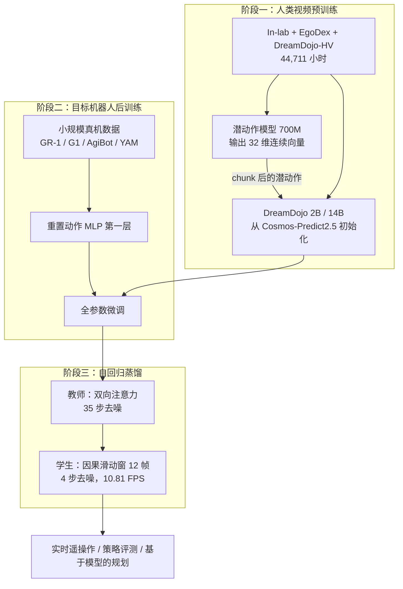

# DreamDojo：人类视频有物理、没有按键，他们先发明一套连续的潜动作

<!-- release-date: 2026-02-18 -->

> 本文依据 NVIDIA 的 **DreamDojo: A Generalist Robot World Model from Large-Scale Human Videos**，本地原件是 arXiv:2602.06949v1（2026-02-06 提交，封面日期 2026-2-9），共 33 页。这已经是官方最新版：arXiv 官方页的提交历史只有 v1，因此未换件。页码一律指这份本地 PDF 自身的页码。
>
> 文中会明确区分三层：**报告写了什么**、**我们如何解释或推算**、**哪些是外部资料补充**。外部补充一律标出来源并给链接。
>
> 关于 `release-date`：取 2026-02-18，即官方代码仓库把 2B / 14B 预训练与后训练权重标成公开发布的那一天。论文先于权重公开，Jim Fan 的公开宣布还更晚；按本模块约定，取「权重首次官方开放使用」而不是论文上传日。证据链见文末。

## 先讲矛盾：视频最多的地方，恰恰没有动作标签

机器人世界模型要做一件看起来很朴素的事：给定现在看到的画面和这一步要执行的动作，预测下一帧世界会变成什么样。报告把它写成状态转移（PDF p.3，式 1）：

$$
s_{t+1} \sim p(\cdot \mid s_t, a_t)
$$

$s_t$ 是当前观测，$a_t$ 是这一步的动作，$\hat{s}_{t+1}$ 是模型对下一状态的采样。

如果数据里既有画面又有动作，这件事可以按监督学习来做。问题是这两样东西几乎不同时出现。

报告开篇把卡点写得很具体（PDF p.2）：

- 游戏和驾驶数据相对好拿，动作空间也常常是离散的；机器人要面对的是**高维、接触密集**的连续动作。
- 真机数据覆盖面窄。硬件型号多、采集贵，真实世界的环境种类几乎是无限的，很容易就把现有机器人数据甩在分布外面。
- 现有机器人数据集又几乎全是**专家示范**，缺少「意图本身的随机性」。模型见过的都是「该怎么做」，很少见到「不该怎么做」或者「差一点没做成」。于是它对反事实动作常常没反应。

所以现有视频世界模型经常停在两个坑里：只能复现训练时见过的台面布置；对没见过的动作不听话。

一条直觉的路是：把真机数据再采大几个数量级。报告认为这不是最有效的轴——每一条新轨迹都要人去遥操作（PDF p.4）。另一条路上，人类每天都在用第一人称视角抓、倒、折、装、失败再试，物理规律在人和机器人之间大体是共享的。于是他们押的注是：

> **先从大规模第一人称人类视频里把交互物理学出来，再在少量目标机器人数据上把控制接口接到真关节。**

这个赌注一旦下定，立刻撞上第二个矛盾：**人类视频几乎没有细粒度动作标签。** 没有 $a_t$，上面那个转移函数就训不成。把各种动作格式硬转成同一种，又要大量工程。被动地只预测下一帧，能搬一点物理，但搬不来「动作会导致什么」的因果（PDF p.2、p.6）。

DreamDojo 的核心设计就是为这个缺口准备的：**连续潜动作（continuous latent action）当所有视频的统一代理动作。** 它不是推理时给人按的「游戏按键」，而是预训练时给世界模型看的伪标签；后训练时再把这条接口换成目标机器人的真实连续动作。

## 读之前：这条线上的词先各用一句话说清

这篇和站内已有的 [Cosmos](/reports/NVIDIA/Cosmos)、[Genie](/reports/Google/Genie)、[π0.7](/reports/PhysicalIntelligence/pi0.7) 同属 Physical AI / 世界模型方向，但解的缺口不同。下面这些词多数不是 DreamDojo 发明的。

- **世界模型（World Model）**：给定过去画面和这一步动作，预测下一帧。报告把「可交互世界模型」收窄成上面那个状态转移，后文「世界模型」都指这一类（PDF p.3）。
- **动作标签（action label）**：某一帧到下一帧，操作者实际发了什么指令。游戏里是按键，机器人里是关节或末端位姿。互联网视频普遍没有这个东西。
- **潜动作（latent action）**：不从外部拿标签，而从相邻帧的像素差异里，用信息瓶颈压出一个「最能解释画面变化」的变量，当作动作的代理。
- **连续潜动作 vs 离散潜动作**：离散做法把动作量化进一本有限码本（Genie 是 8 选 1）；连续做法保留一个浮点向量，不先切成有限几种。DreamDojo 选连续，报告写明是因为它在跨本体泛化和后训练适配上更强（PDF p.6–7）。
- **DiT（Diffusion Transformer，扩散 Transformer）**：用 transformer 做扩散模型的去噪网络。DreamDojo 的底座 Cosmos-Predict2.5 就是这种结构。
- **流匹配（flow matching）**：一类生成目标。它不直接一次吐出干净视频，而是学习如何把噪声「流」成真实样本。Cosmos-Predict2.5 用它训练（PDF p.3，式 2）。
- **Tokenizer**：不直接吃像素。WAN2.2 tokenizer 把视频压到连续潜空间，时间维压缩比是 4，也就是一个视频潜向量对应 4 帧像素（PDF p.6）。
- **后训练（post-training）**：这里不是对齐人类偏好，而是在小规模目标机器人数据上，把已经学到的世界动力学接到该机器人的动作空间。
- **蒸馏 / Self Forcing**：把又慢又双向的教师扩散模型，收成能自回归、少步数、实时出帧的学生模型。Self Forcing 的关键是训练时让学生吃自己先前生成的上下文，而不是一直吃教师的标准答案。

再补几个本篇会反复出现的名字：

- **Cosmos-Predict2.5**：NVIDIA 的视频世界基础模型，DreamDojo 从它的权重初始化（PDF p.3）。
- **AdaWorld**：Gao 等人 2025 年的工作，连续潜动作这条线的直接前作。DreamDojo 写明自己受它启发（PDF p.6，参考文献 [23]）。
- **Genie（初代）**：从无标签视频里学出 8 个离散「按键」。DreamDojo 的潜动作编码器借用了它的时空 Transformer 骨架，但动作是连续的，用途也不同。
- **GR-1 / G1 / AgiBot / YAM**：后训练用到的四种本体。消融默认拿 Fourier GR-1 当代表（PDF p.9–10）。

## 一句话说清 DreamDojo 做了什么

DreamDojo 不是从零搭一个视频生成器。它是：

> **一个用 44,711 小时第一人称人类视频、以连续潜动作为统一条件预训练出来的通才世界模型，再在小规模目标机器人数据上后训练，最后蒸馏成可实时闭环的学生模型。**

报告自己列了四项贡献（PDF p.2）：

1. **DreamDojo-HV**：44k 小时第一人称人类视频，报告称为当时用于世界模型学习的最大、最多样数据语料。
2. **基础世界模型**：人类视频放大 + 连续潜动作当统一代理；后训练后能对未见物体和新环境做零样本泛化。这里的「零样本」是相对**后训练用的那批有限机器人场景**而言，不是「完全不看目标机器人」。
3. **蒸馏管线**：自回归少步预测，并改善上下文一致性。最终模型可以实时交互超过 1 分钟而不退化。
4. **下游应用**：实时遥操作、策略评测、基于模型的规划。

规模上，世界模型有 2B 和 14B 两个变体，都在 **256 张 NVIDIA H100** 上预训练 **140k** 步，有效 batch 1024（PDF p.9）。潜动作模型另有 **700M** 参数，单独训 **400k** 步（PDF p.9）。报告没有把这些步数折成总 GPU 小时，本文不补。

## 先看全景：三段训练，两种动作接口

根据报告图 1（PDF p.3）与 3.1 节重画。这是机制示意，不表示实测时长或并行方式。

三件事必须先分开，后面才不会把「潜动作」和「机器人动作」混成同一种东西：

1. **预训练时**，世界模型看到的动作条件是潜动作模型从相邻帧抽出来的 32 维连续向量。
2. **后训练时**，这条动作接口被重置，改吃目标机器人的相对关节动作。
3. **推理给机器人用时**，控制信号是真机动作，不是潜动作码。Genie 那套「用户按 0 到 7」在这里不成立。

## 和 Cosmos、Genie、π0.7 怎么分工

站内三篇前作解的是相邻但不同的缺口。对照写在这里，避免后文和它们打架。

| | [Genie](/reports/Google/Genie) | [Cosmos](/reports/NVIDIA/Cosmos) | [π0.7](/reports/PhysicalIntelligence/pi0.7) | 本篇 DreamDojo |
|---|---|---|---|---|
| 卡住的缺口 | 互联网视频没有动作标签 | 手写仿真器写不出通用物理世界 | 多样机器人数据会把策略平均掉 | 机器人数据盖不住开放世界，人类视频又没有细动作标签 |
| 潜动作是什么 | 离散 VQ，8 个码，推理时就是按键 | 不用潜动作；控制信号后训练时从下游标注给进来 | 不学潜动作；世界模型只画近未来子目标图 | 连续 32 维 VAE 向量，**只当预训练代理**；后训练换成真关节 |
| 「世界模型」在系统里干什么 | 从纯视频生成可交互环境 | 用视频学一个可后训练的世界基础模型平台 | 给 VLA 一张视觉 prompt | 在 Cosmos-Predict2.5 上接动作条件，模拟灵巧接触 |
| 最终交付 | 可交互生成环境（未发权重） | 开源世界模型平台 | 可被语言 / 图像 / 元数据操控的策略 | 可后训练、可蒸馏到实时的机器人世界模型 |

和 Genie 的同与不同，是这篇最容易写串的地方，单独说清：

**相同的思想**：动作不必从外部标签来。把一个变量放在「只有它能解释两帧差异」的位置上，模型会自己把动作的含义填进去。DreamDojo 的潜动作模型明确用了 Genie 那套时空 Transformer 骨架（PDF p.6、p.9，参考文献 [11]）。

**不同的三处，决定了它为什么不是「Genie 换到机器人上」**：

1. **离散变连续。** Genie 把动作量化成 8 选 1，适合游戏按键；机器人关节是高维连续的，硬切成几十个码会把细动作切没。DreamDojo 用 VAE 而不是 VQ，保留 32 维连续向量，并写明连续空间让后训练更好适配（PDF p.7）。
2. **潜动作不是推理接口。** Genie 训完会扔掉潜动作模型，只留码本给人按。DreamDojo 预训练用潜动作当伪标签，后训练**重置动作条件层**，推理时吃的是 GR-1 / G1 的真实相对动作。PICO 手柄遥操作虚拟 G1，走的是真机动作通道（PDF p.14）。
3. **底座和目标都换了。** Genie 从像素学游戏动态；DreamDojo 站在 Cosmos-Predict2.5 这个已经用大规模视频预训练过的扩散世界模型上，目标是接触丰富的灵巧操作，而不是像素风游戏。

和 Cosmos 的关系更直接：DreamDojo **就是 Cosmos 平台那条「后训练接到机器人」的账，往人类视频和动作标签缺口上又还了一笔。** Cosmos 报告里的扰动 $c_t$ 可以是文本、位姿或动作；DreamDojo 发现，若预训练数据是没有动作的人类视频，文本条件还被固定成空 prompt（PDF p.9），那就必须先发明一套代理动作，否则因果学不起来。

π0.7 解的是策略侧「多样数据被平均掉」，不是世界怎么被模拟。本篇的世界模型输出视频，不输出关节指令。

## 数据：44,711 小时第一人称，不是把互联网视频再倒一遍

### 旧问题

现有机器人世界模型走不出分布，报告认为根因很具体：训练数据的动词、物体、环境都太窄（PDF p.4）。把真机数据堆上去，每条轨迹都要遥操作，覆盖「所有可能的交互类型」并不划算。

### 新设计

人类数据来自三个来源（PDF p.4–5）：

| 来源 | 小时 | 轨迹 | 技能 | 场景 | 它补什么 |
|---|---:|---:|---:|---:|---|
| In-lab | 55 | 13.9k | 35 | 1 | 实验室桌面，戴 Manus 手套 + Vive Ultimate Tracker，手部位姿可重定向到 GR-1，用来验证核心设计 |
| EgoDex | 829 | 30k | 194 | 5 | 公开的灵巧操作集，Apple Vision Pro 第一人称，带高精度 3D 手指位姿，丰富物体种类 |
| DreamDojo-HV | 43,827 | 1,135k | 6,015† | 1,135k | 众包内部集，家居 / 工业 / 零售 / 教育 / 行政等，每段有任务文本 |
| 最终混合 | 44,711 | 1,179k | ≥6,015† | ≥1,135k | 预训练实际使用的混合物 |

†技能数由 GPT 根据每段视频的全局语言标注估计（PDF p.5，表 1）。

对照先前世界模型常用的大数据集，报告称这套混合物时长约为此前最大集的 **15 倍**、技能约 **96 倍**、场景约 **2,000 倍**（PDF p.5）。用表 1 的数字可以对上后两项的数量级：相对 DROID 的 564 个场景，$1{,}135\mathrm{k} / 564 \approx 2{,}000$；相对 AgiBot-World 的 2.9k 小时，$44{,}711 / 2{,}900 \approx 15$。技能那一栏，6,015 相对 DROID 的 86 或 AgiBot-World 的 87 大约是 70 倍，和「约 96 倍」不完全同口径——报告没写 96 这个乘数的精确分母，本文按原文引用，不改写成表内除法。

正文还另给了三个去重后的多样性数字：超过 **9,869** 个独特场景、**6,015** 个独特任务、**43,237** 个独特物体（PDF p.5）。表 1 的「# Scene = 1,135k」和这里的 9,869 不是同一个计数：前者与轨迹数相同，更像「每条轨迹算一个场景」；后者才是去重后的独特场景。两个数字报告都写了，不互相替代。

DreamDojo-HV 的场景分布不是均匀的互联网切片。图 2a 的饼图读下来，43,827 小时里最大的几块是（PDF p.4，图 2）：

| 类别 | 小时 | 占比 |
|---|---:|---:|
| 家务 Home Task | 18,483 | 42.2% |
| 零售与消费品 | 6,161 | 14.1% |
| 汽车与交通 | 3,895 | 8.9% |
| 食品饮料 | 3,693 | 8.4% |
| 时尚配饰 | 2,360 | 5.4% |
| 一般维修 | 1,956 | 4.5% |

其余行政、工厂、酒店、教育、运动、食品加工、工业制造等把长尾补满。图 2b 左边是每段视频的子任务个数分布，多数视频是需要多次交互才能做完的长程任务；右边是技能频次，pick / place / move / fold / wipe / cut 都在，不只是抓放。图 2c 的词云里，物体侧是 shirt、box、shelf、bag、table、bowl、paper 这类日常件（PDF p.4）。

预训练采样比不是按小时均匀切。最终 2B / 14B 对 In-lab : EgoDex : DreamDojo-HV 的采样比是 **1 : 2 : 10**（PDF p.9）。HV 占绝对多数。后文 4.3 节的数据消融为了公平比较，改成各集合均匀采样，和最终模型不是同一套配比。

报告没公开 DreamDojo-HV 原片本身。后文会把「开了什么、没开什么」写进缺口。

## 核心设计一：连续潜动作——为什么需要、怎么学、怎么接到机器人

这是整篇的发动机，按因果链走完。

### 旧问题

没有细动作标签时，最省事的做法是把人类视频当成普通视频预测：只看过去的帧，猜未来的帧。报告自己做了这个对照：这种 **action-free** 预训练确实能搬一部分物理，让未见物体看起来更像样；但世界模型必须学「动作的后果」，只看被动视频会把因果学浅，接到目标机器人上就不够可交互（PDF p.6）。

另一条路是用现成的手部估计器，比如 HaMeR，从像素里抠手部位姿。报告指出三个不够用的地方（PDF p.6）：

- 它主要描述手，管不好手臂和行走；
- 遮挡和相机大运动时容易崩；
- 它抓住的是人手的低层几何，本体差一大，迁到机器人上会卡住。

再把各数据集自带的真值动作（手套、Vision Pro）统一成同一种格式，工程量会随数据源线性涨。这套做法也不可扩展到没有动作捕捉设备的众包视频。

### 新设计

潜动作这条线不是新词。报告点名了 Genie、AdaWorld 和 LAPA（Ye 等，2025）等前作（PDF p.6）。DreamDojo 选的是 **AdaWorld 那种连续潜动作**：不用码本把动作切成有限几种，而是压出一个短的连续向量。

潜动作模型是一个 **VAE**，骨架是时空 Transformer（PDF p.6–7）：

- **编码器**吃相邻两帧 $f^{t:t+1}$，抽出时空特征，投影成低维嵌入 $\hat{a}_t$。
- **解码器**只看到前一帧 $f^t$ 和这个嵌入，去重建后一帧 $f^{t+1}$。
- 监督是后一帧重建损失加上 KL 正则。嵌入很短、再加 KL，一起构成信息瓶颈：想重建后一帧，就得把两帧之间最关键的运动压进 $\hat{a}_t$。

把下标摊开，训练目标是（PDF p.7，式 3）：

$$
\mathcal{L}^{\mathrm{pred}}_{\theta,\phi}(f^{t+1})
=
\mathbb{E}_{q_\phi(\hat{a}\mid f^{t:t+1})}
\log p_\theta(f^{t+1}\mid \hat{a}, f^t)
-
\beta\, D_{\mathrm{KL}}\!\bigl(q_\phi(\hat{a}\mid f^{t:t+1}) \,\|\, p(\hat{a})\bigr)
$$

- $q_\phi$：编码器，从两帧推断潜动作；
- $p_\theta$：解码器，从前一帧和潜动作重建后一帧；
- $\beta$：KL 的权重，实验里取 $10^{-6}$，报告说这是「表征容量」和「后训练可迁移性」之间的折中（PDF p.9）。

注意不对称：**编码器能看见未来，解码器不能。** 这和 Genie 的潜动作模型是同一类信息瓶颈，只是这里没有向量量化，输出是连续向量而不是 8 选 1。

图 3 右边是一个很能说明「学到了什么」的检索实验：在不同数据集里找出潜动作最接近的帧对，人和不同机器人尽管背景完全不同，做的却是同类动作（PDF p.6，图 3）。这是报告给出的定性证据，不是定量对齐指标。

规格（PDF p.9）：

| 项 | 取值 |
|---|---|
| 参数量 | 700M |
| 动作维度 | 32 |
| 结构 | 编码器 24 块 + 解码器 24 块 |
| 训练步数 | 400k，总 batch 256 |
| 分辨率 | 中心裁剪到 $320\times 240$ |
| 时间增强 | 随机按 $\{1,2,3,4\}$ 倍降采样，覆盖不同速度 |
| 数据 | 三个人类集 + 内部机器人数据（G1、GR-1、AgiBot、YAM） |
| 优化 | AdamW，weight decay 0.01，学习率 $2.5\times 10^{-5}$，从零训练 |

它同时看了人类和机器人视频。我们的理解是：潜动作空间从一开始就被要求跨本体一致，后面检索实验才能把「人手伸进盒子」和「爪子伸进盒子」搜到一起。报告没有单独消融「LAM 要不要看机器人数据」。

### 潜动作怎么接到世界模型上

抽出来之后，并不是当成文本 prompt 塞进去。流程是（PDF p.7）：

1. 从连续帧提取潜动作；
2. 按 tokenizer 的时间压缩比，把 4 个潜动作打成一块，对齐到对应的视频潜帧；
3. 用一个轻量 MLP 投到和 timestep 嵌入相同的维度；
4. 与 timestep 嵌入相加，送进每个 DiT 块的自适应 LayerNorm（scale / shift / gate）。

动作 MLP **最后一层零初始化**（PDF p.7）。这是 ControlNet 一类条件注入的老技巧：训练开头先别把已经预训练好的 Cosmos 权重打乱。报告说经验上这会让物理更好。

文本条件在预训练里被固定成**空 prompt**（PDF p.9）。所以这条世界模型在人类视频阶段几乎全靠「画面 + 潜动作」，不靠语言指挥。

### 后训练：把代理接口换成真关节

人类视频把物理交互的面铺开了，但下游要控的是具体机器人。后训练做了三件具体的事（PDF p.7、p.9）：

1. 把目标机器人的真值动作展成序列，整段送进动作 MLP。
2. **重新初始化动作 MLP 的第一层**——输入维度从 32 维潜动作换成该机器人的动作维。
3. 其余预训练权重全部一起微调。

视频大约按 10 Hz 采样，clip 长度 13 帧：第 1 帧当条件帧，后面 12 步是相对动作（PDF p.9）。默认后训练是 **128 张 H100、50k 步、batch 512**。

这就是「潜动作如何接到机器人动作」的答案：

> **潜动作负责在无标签视频里先把「动作」这个槽位占住，让世界模型学会条件化；后训练把槽位的输入分布换成真关节，槽位本身（条件注入通路）留下来。**

连续空间的好处在这里显现：从 32 维平滑向量换到连续关节，比从 8 个离散码换过去更顺。报告把这一点指向 AdaWorld 的结论（PDF p.7）。

因为预训练已经见过足够杂的物理，目标机器人数据可以「领域有限、规模较小」，微调后仍能对未见物体做零样本泛化（PDF p.7）。后文实验要证明的就是这句话。

### 收益、代价、可迁移启发

收益：表 2 显示，潜动作预训练在 In-lab Eval 和 EgoDex Eval 上大幅逼近「戴着动作捕捉设备」的理想设定，明显好于不预训练和 action-free（PDF p.10）。代价：多训一个 700M 的 LAM；$\beta$ 要调；后训练仍要重置第一层，不是完全零成本换本体。

可迁移的不是「必须用 32 维」，而是：**当标签跟不上数据规模时，先用信息瓶颈给无标签数据发明一套代理条件，再在有标签的小数据上把接口换掉。** 代理条件要连续还是离散，取决于下游动作本身是不是连续的。

## 核心设计二：相对动作 + 分块注入，让高维连续控制别搅在一起

潜动作解决的是「人类视频没标签」。机器人自己的动作条件，还有两个更土的问题。

### 旧问题

世界模型和普通视频生成器的差别，报告写在可控性上（PDF p.5）。游戏是离散按键；机器人是高维、接触密集的连续动作。两件具体的事会把学习搅糊：

1. **绝对关节位姿**轨迹之间不可比。同一句「把杯子拿起来」，起始关节角可以差很远，模型要在一个很宽的空间里拟合。
2. **整段动作当全局条件**会泄未来。交互严格遵守因果：看第 20 步的动作，帮不了第 3 步的预测，只会加噪声。

### 新设计

第一，把绝对关节变成**相对动作**：每个视频潜帧（每 4 个时间步）开头的位姿当原点，后面的动作相对它来写（PDF p.5）。相对量挤在更窄、跨轨迹更共享的空间里，组合泛化会容易一些。

第二，按 tokenizer 的时间压缩比把动作**切成块**，只注入到对应的潜帧，而不是让所有潜帧共享整条动作（PDF p.6）。视频潜 $x^{i}$ 对应像素帧 $f^{i:i+4}$，就把 $a^{t:t+4}$ 拼成一块送给这一潜帧。

### 收益

表 5 在**只后训练、不走人类视频预训练**的设定里，把这两项和后文的时间一致性损失逐项加上（PDF p.12）。GR-1 验证集 PSNR 从 16.199 走到 16.522（相对），再跳到 17.626（分块）。分块是最大的一跳。反事实集上同样是分块把 PSNR 从 19.482 拉到 20.783。附录图 9 的杯子和夹持定性对比也是同一件事：基线对不准接触，三项叠上之后物体更完整、手臂更跟手（PDF p.19）。

可迁移启发：**条件信号的时间对齐，往往比把条件做得更花哨更重要。** 能按因果切块，就不要做成全局广播。

## 核心设计三：时间一致性损失——别只监督每一帧，要监督帧与帧怎么变

### 旧问题

Cosmos-Predict2.5 的流匹配损失对每一帧单独算（PDF p.3，式 2）：

$$
\mathcal{L}_{\mathrm{flow}}(\theta)
=
\mathbb{E}_{\mathbf{x},\epsilon,\mathbf{c},t}
\bigl\|
\mathbf{u}(\mathbf{x}_t, t, \mathbf{c}; \theta) - \mathbf{v}_t
\bigr\|^2
$$

其中 $\mathbf{v}_t = \epsilon - \mathbf{x}$，即噪声减干净样本。它对「这一帧像不像」有梯度，对「这一帧到下一帧应该怎么变」没有直接信号。物体动力学和动作跟随恰恰住在这个差分里。

### 新设计

设 $\mathbf{z}_t = \mathbf{u}(\mathbf{x}_t, t, \mathbf{c}; \theta)$ 是预测速度，报告加一项让相邻帧的速度差去贴真值速度差（PDF p.7，式 4–5）：

$$
\mathcal{L}_{\mathrm{temporal}}(\theta)
=
\mathbb{E}
\sum_{i=1}^{K-1}
\bigl\|
(z^{i+1}-z^{i}) - (v^{i+1}-v^{i})
\bigr\|^2
$$

$$
\mathcal{L}_{\mathrm{final}}(\theta)
=
\mathcal{L}_{\mathrm{flow}}(\theta) + \lambda\,\mathcal{L}_{\mathrm{temporal}}(\theta)
$$

实验里 $\lambda = 0.1$。$K$ 是视频潜的长度。

报告的观察是：这项不但让动作可控学得更快，还改善物体完整、减少伪影（PDF p.7）。表 5 里它是第三项，GR-1 验证集上 PSNR 几乎不动（17.626 → 17.630），反事实集上从 20.783 到 20.980，SSIM / LPIPS 也略好（PDF p.12）。所以它不是主引擎，是给接触和反事实补的一项。

## 蒸馏：从 2.72 FPS 的教师，收到 10.81 FPS 还能看见上下文

### 旧问题

实时遥操作和在线规划要求世界模型边看边出帧。双向视频扩散有两个结构障碍（PDF p.8）：

1. 双向注意力预设了固定时长，不能无限往下滚；
2. 去噪步数很多（报告举的典型数是 50 步），速度上不去。

他们实际推理时教师用 **35** 步，学生用 **4** 步，并关掉 classifier-free guidance——经验上 CFG 好处有限（PDF p.10）。

### 新设计

蒸馏跟 Self Forcing（Huang 等，2025）走两阶段，教师 $G_{\mathrm{teacher}}$ 蒸成学生 $G_{\mathrm{student}}$（PDF p.8）。学生沿用教师的结构和权重，但双向注意力改成因果注意力，时间表收到少步（例如 4 步）。

**Warmup。** 学生用 teacher forcing，上下文是教师 ODE 轨迹上的潜变量，回归教师解出的干净样本 $x_0$（PDF p.8，式 6）：

$$
\mathcal{L}_{\mathrm{warmup}}
=
\mathbb{E}_{x,t}
\bigl\|
G_{\mathrm{student}}(x_t, t) - x_0
\bigr\|^2
$$

**Distillation。** 此后学生改吃**自己先前生成的潜变量**，训练分布才跟推理一致，复合误差才会被看见。监督是把学生分布推向教师的分布匹配损失，形式上是 $D_{\mathrm{KL}}(p_{\mathrm{teacher}} \| p_{\mathrm{student}})$。这个 KL 本身不可直接算，但梯度可以用一对「真 / 假」分数模型来估（PDF p.8，式 8）：

$$
\nabla \mathcal{L}_{\mathrm{distill}}
=
-\mathbb{E}_{z,t}
\Bigl[
\bigl(s_{\mathrm{real}}(x_t,t) - s_{\mathrm{fake}}(x_t,t)\bigr)
\frac{d G_{\mathrm{student}}}{d\theta}
\Bigr]
$$

$s_{\mathrm{real}}$ 来自教师，$s_{\mathrm{fake}}$ 来自一个在学生预测上训练的模型。

即便如此，长程仍会漂。他们让学生在训练时生成 $N' > N$ 帧（$N$ 是教师视野），再随机切一个长度为 $N$ 的窗口回传蒸馏损失，等于在训练里提前演练更长的自 rollout（PDF p.8）。

具体数字（PDF p.10）：学生因果滑动窗 **12** 帧；warmup 生成 10k 条 ODE 轨迹、训 10k iteration；蒸馏阶段学生随机生成 13 到 49 帧，损失算在最后 13 帧，跑 3k iteration。全部蒸馏在 **64 张 H100** 上，warmup batch 256，蒸馏 batch 64。

他们蒸馏的是 **GR-1 后训练过的 DreamDojo-2B**，不是 14B（PDF p.12）。实时数字因此只属于 2B 学生。

### 收益：快了，而且多看见了 11 帧历史

表 6 在 GR-1 Long Eval 上滚 **600 帧（1 分钟）**（PDF p.13）：

| | PSNR↑ | SSIM↑ | LPIPS↓ | FPS↑ | 每步预测长度↓ | 上下文长度↑ |
|---|---:|---:|---:|---:|---:|---:|
| 教师 | 14.086 | 0.442 | 0.412 | 2.72 | 12 | 1 |
| 学生 | 13.146 | 0.379 | 0.485 | 10.81 | 4 | 12 |

单卡 H100 上大约 **4 倍**加速，画质有下降但报告称为 minor。更有结构意义的是两列交互指标：学生每步只吐 4 帧，粒度更细；上下文从 1 帧变成 12 帧。教师只看初始一帧，被挡住的物体没有历史可回看；学生可以靠短上下文把被遮住的东西找回来。附录图 11 的对照就是这件事：教师在遮挡和相机一晃之后水果消失或变形，学生还能把袋子里的物体维持住（PDF p.22）。

表 7 还问了一个关键问题：蒸馏会不会把人类视频预训练的泛化蒸没？把「有人类视频预训练的教师」和「没有预训练、直接从 Cosmos-Predict2.5 后训练的教师」分别蒸馏，四个 OOD 集上前者全面更好（PDF p.13）。所以预训练的好处会传到学生身上。

## 实验怎么证明这套因果链

评测刻意做成「对机器人训练数据是 OOD、对人类数据是同类交互」。六套基准都用 Fourier GR-1 去复现人类视频里见过的物体和物理，但这些物体 / 动作不在默认机器人训练集里（PDF p.9–10，图 4）：

| 基准 | 测什么 |
|---|---|
| In-lab Eval | 实验室新物体、新动词 |
| EgoDex Eval | EgoDex 风格的日常物体交互 |
| DreamDojo-HV Eval | HV 风格的多样场景交互 |
| Counterfactual Eval | 机器人数据集里没有的反事实，例如拍玩具、伸手但没碰到 |
| EgoDex-novel / DreamDojo-HV-novel | 用 Gemini 2.5 Flash Image 改背景，各 25 条，测环境变化 |

无蒸馏模型的自动指标是 PSNR / SSIM / LPIPS。为了把差异拉大，他们把最后一帧预测再当下一轮条件，自回归滚三轮，得到 100 段、每段 49 帧（PDF p.10）。改过背景的两套没有真值视频，改成 12 名志愿者的 pairwise 偏好：物理正确看物体恒存、形状一致、接触因果；动作跟随看机器人姿态，允许平局（PDF p.10，附录图 7）。

### 潜动作是否真的比「只预测视频」更值

表 2 所有方法都在对应人类集上预训练 50k 步，再在分布内 GR-1 上后训练 25k 步（PDF p.11）：

**In-lab Eval**

| 方法 | PSNR↑ | SSIM↑ | LPIPS↓ |
|---|---:|---:|---:|
| 不预训练 | 20.576 | 0.774 | 0.222 |
| action-free | 20.797 | 0.773 | 0.222 |
| 潜动作 | 20.913 | 0.776 | 0.219 |
| 重定向真值动作（理想，需手套） | 20.960 | 0.773 | 0.219 |

**EgoDex Eval**

| 方法 | PSNR↑ | SSIM↑ | LPIPS↓ |
|---|---:|---:|---:|
| 不预训练 | 19.952 | 0.787 | 0.219 |
| action-free | 19.924 | 0.783 | 0.222 |
| 潜动作 | 20.344 | 0.790 | 0.214 |
| MANO 真值（理想，需 Vision Pro） | 20.474 | 0.795 | 0.211 |

两件事值得记住。第一，action-free 在 EgoDex 上甚至略差于不预训练，说明「只看视频」不是稳定地在搬因果。第二，潜动作已经贴到需要额外硬件的理想设定附近，而它是唯一能扩到没有动作捕捉的众包视频上的那条。附录图 13 的后训练 PSNR 曲线还显示，潜动作的上限明显高于另外两条，EgoDex 上尤其明显（PDF p.20、图 13）。

### 数据放大是否还在起作用

表 3 的消融把采样比改成各集合均匀，预训练仍是 50k、后训练 25k（PDF p.11）。In-lab → +EgoDex → +DreamDojo-HV，四个 OOD 集的 PSNR 基本单调上升。最终 DreamDojo-2B / 14B 用的是 140k 步和 1:2:10 采样，数字再高一截，14B 全面最好。这张表不能直接和表 2 逐格比步数，但它支持报告的主张：多样人类数据继续涨，OOD 物理和反事实可控都还在涨。

附录图 8 的定性对照更直观：不预训练时纸张、纸箱、植物、洗碗机门会糊、会穿模；加上人类视频预训练后，接触和物体完整性明显像样（PDF p.18）。

### 人看 OOD 环境和动作，14B 赢在哪

表 4 是 12 名志愿者在 EgoDex-novel 和 DreamDojo-HV-novel 共 50 条上的胜率，三个模型都后训练 30k 步（PDF p.12）：

| | DreamDojo-2B 胜 Cosmos-Predict2.5 | DreamDojo-14B 胜 Cosmos-Predict2.5 | DreamDojo-14B 胜 2B |
|---|---:|---:|---:|
| 物理正确 | 62.50% | 73.50% | 72.50% |
| 动作跟随 | 63.45% | 72.55% | 65.53% |

这里的 Cosmos-Predict2.5 是**没有人类视频预训练、只做同样后训练**的底座。2B 已经明显赢，14B 再赢 2B，报告归因于容量（PDF p.12）。这是全文最接近「开放世界接触任务」的人评数字。

自动指标的绝对增益看起来不大（PSNR 往往只高零点几），人评的差距更宽。一个合理的读法是：像素指标对「杯子还在不在、有没有穿模」不敏感，而这正是志愿者被要求盯的东西。

## 应用：评测、规划和实时遥操作

这三项都建立在「动作条件视频」已经能跑、其中两项还要求学生模型够快。

### 策略评测：世界里的成功率能不能给真机排名

任务是 AgiBot 装水果。他们训一个单视角、无状态的 GR00T N1.5 变体，同时把 DreamDojo-2B 后训练到同一份 AgiBot 数据上。20 个场景，梨 / 芒果 / 香蕉 / 杨桃的组合和位置都变；5 个水果都装进袋子算 100%。每个场景真机滚大约 80 秒，再用同一张初始帧让 DreamDojo-2B 模拟整段，人工按同一套标准打分（PDF p.13）。

图 5a 里，DreamDojo 成功率对真机成功率的 Pearson $r = 0.995$，MMRV $= 0.003$（PDF p.13–14）。作为**排序器**它很能干：哪个 checkpoint 更好，模拟和真机几乎同序。

报告在限制里立刻补了一刀：DreamDojo 的**绝对**成功率常常高于真机，说明它不太会生成细腻的失败（PDF p.15）。所以它更像排名工具，不是校准过的物理引擎。

### 基于模型的规划：用世界模型在测试时挑一条更好的未来

10 个 AgiBot 装水果场景。集成 5 个训练中的策略 checkpoint 出动作提案，批发给蒸馏后的 DreamDojo-2B 预测未来视频，再用外部价值模型挑最好的一条真机执行（PDF p.13–14）。

价值模型本身在附录 D.6：冻住的 DINOv2 逐帧提特征，上面一个全局注意力模块，预测「距离下一个子任务边界还有多少步」。子任务边界是相邻子任务语言标注之间的关键帧。对生成视频做步长 1 的滑动窗，最终价值取「从开头到估值回升前那个谷」的平均；**价值最低**（离完成当前子任务最近）的提案被选中（PDF p.20）。

图 5b 读到的柱状数字是（PDF p.14，图 5）：

**方差较大的一组**：五个 checkpoint 成功率约 5%、16%、35%、47%、53%，均匀采样 37%，加上 DreamDojo 规划到 **70%**。相对最好单点 +17 个百分点，相对均匀采样接近 2 倍。

**已经收敛的一组**：约 35%、39%、41%、48%、63%，均匀采样 55%，规划到 **68%**。提升更小，报告仍写「仍然接近 2 倍」——若对照均匀采样 55%→68%，并不是 2 倍；更接近对照最弱点 35%→68%。本文按图读数，不把「2 倍」套到右图的均匀采样上。

代价写得很坦率：世界模型会引入额外延迟（PDF p.14）。换来的是测试时能先看几种未来再下手。

### 实时遥操作：在梦里开 G1

DreamDojo-2B 部署在带 **RTX 5090** 的本地桌上，PICO VR 手柄采上半身动作，当作 G1 的动作条件。报告说可以直接实时遥操作虚拟机器人（PDF p.14，图 6）。这是学生模型 10.81 FPS 存在的理由：教师 2.72 FPS 闭环遥操作会明显钝。

## 限制：报告自己划的边界

限制段不长，但每条都具体（PDF p.15）：

- **不常见动作**仍差，点名了拍打和快速挥手。
- **策略评测的绝对成功率偏高**，细腻失败生成不出来。报告建议未来用策略自己的 rollout 来覆盖更广的动作分布。
- **推理速度还有工程空间。** 这里引用了若干后续工作，其中一篇是 Ye 等 2026 的 DreamZero。DreamZero 是另一篇文章，讲的是把世界动作模型当零样本策略；**它的实验结果不属于本篇，本文不写入。** 需要的读者去看那一篇。
- **不天然支持多视角。** 报告认为这对当前最强策略很关键。
- **后训练如何尽量留住预训练知识，没有被认真研究。** 将来可以试别的微调策略。

另外一些「没写」比限制段更重要，单独放进文末缺口，避免假装报告已经回答。

## 可迁移启发

### 可直接复用的设计原则

- **标签稀缺时，先占住条件槽，再换槽里的东西。** 潜动作不是终点，是让世界模型在无标签数据上学会「看着动作预测」的脚手架。
- **代理动作的拓扑要跟下游动作一致。** 游戏按键用离散码本；机器人关节用连续向量。Genie 和 DreamDojo 不是同一种潜动作，只是同一种信息瓶颈思想。
- **条件必须按因果切块。** 表 5 里分块注入的增益大于相对化，也大于时间损失。
- **蒸馏不但换速度，还换上下文形态。** 学生从「只看 1 帧」变成「看 12 帧」，遮挡恢复是结构红利，不是画质红利。
- **世界模型当评测器，先问能不能排序，再问绝对值准不准。** Pearson / MMRV 很好，绝对成功率偏高——这两个结论可以同时成立。
- **动作 MLP 零初始化最后一层，后训练再重置第一层。** 这是在「不打乱底座」和「换输入维度」之间的具体接法，小项目也用得上。

### 依赖特定规模或硬件的做法

- **44,711 小时众包第一人称视频**本身不可复现；没有这份内部 HV，表 3 的数据缩放曲线没有起点。
- **256 张 H100 训 140k 步、128 张做后训练、64 张做蒸馏**（PDF p.9–10）。单卡桌面只能跑已经蒸好的 2B 学生。
- **10.81 FPS** 是蒸馏后的 2B、在单卡 H100 上、分辨率 $640\times 480$ 的数字（PDF p.13）。14B 没有对应的实时表。遥操作演示用的是 RTX 5090（PDF p.14），报告没给 5090 上的 FPS。
- **空文本预训练**依赖潜动作已经把可控性扛起来；数据少、动作更乱时，语言条件可能还得留着。

### 一条更抽象的判断

如果只从这篇带走一句话，我们会选：

> **开放世界的机器人仿真，瓶颈往往不在「视频生成器够不够像」，而在「动作条件从哪来、以什么形态接到哪一帧」。**

人类视频解决覆盖，连续潜动作解决无标签，相对化与分块解决高维因果，蒸馏解决闭环速度。每一段都在还同一张账单：让 $p(s_{t+1}\mid s_t, a_t)$ 在 $a_t$ 稀缺、环境无穷时仍然成立。

它也没有宣称已经替代物理引擎。OOD 人评赢了 Cosmos-Predict2.5，策略排序几乎完美，但绝对失败生成、多视角、罕见动作和知识保持都还空着。作为设计材料，这些空白比「44k 小时」这个整数更有用。

## 关键词回看

把全文的词串成一条线：

机器人世界模型要学 $p(s_{t+1}\mid s_t, a_t)$，但真机数据盖不住开放世界，人类第一人称视频又几乎没有动作标签。DreamDojo 用 **DreamDojo-HV** 把覆盖铺开，用 **连续潜动作 VAE** 给无标签视频发明 32 维代理动作，经 **chunk 注入**和 **AdaLN** 接到从 **Cosmos-Predict2.5** 初始化的 **DiT** 上，训练目标是 **流匹配 + 时间一致性损失**。

后训练**重置动作 MLP 第一层**，把代理接口换成目标机器人的**相对关节动作**。要闭环，再按 **Self Forcing** 蒸成因果、4 步、12 帧上下文的学生，H100 上 **10.81 FPS**。于是它可以做真机策略的排序评测、测试时规划，以及 PICO 手柄里的实时遥操作。

和 Genie 共享信息瓶颈，不共享码本，也不共享「推理时按潜动作」这条接口。

## 参考资料与 release-date 证据链

**报告原件**

- arXiv 官方页：<https://arxiv.org/abs/2602.06949> —— 标题 *DreamDojo: A Generalist Robot World Model from Large-Scale Human Videos*，提交历史只有 **v1**（Fri, 6 Feb 2026 18:49:43 UTC，9,739 KB）。本地原件水印是 `arXiv:2602.06949v1 [cs.RO] 6 Feb 2026`，封面日期 2026-2-9，共 33 页，与官方页一致，因此未换件。
- 项目页：[dreamdojo-world.github.io](https://dreamdojo-world.github.io/)
- 本地文件 `papers/NVIDIA/DreamDojo.pdf`，`pdfinfo` 报告 33 页、A4、约 10.2 MB。

**release-date = 2026-02-18 的依据**

DreamDojo 后来开放了权重，所以不能改用「只讲公开技术」的论文上传日。按本模块约定，取该模型首次通过官方渠道向公众开放使用的日期。

1. **官方仓库日志**：[NVIDIA/DreamDojo](https://github.com/NVIDIA/DreamDojo) 的 README News 写明：`[2026/02/18] We released all pretrained and post-trained checkpoints (2B and 14B)`，同日还发布了预训练 / 后训练代码，以及 GR-1 后训练数据和评测集。同一段日志把论文单独记成 `[2026/02/09] We released our paper on arXiv`。这是项目自己把「论文公开」和「权重公开」拆开的官方记时。
2. **公开宣布晚于日志**：Jim Fan（`@DrJimFan`）在 2026-02-20 发帖宣布开源权重、代码、后训练数据和评测集。按「官方发布日志早于传播最广的官宣则取日志」这条，不取 02-20。
3. **论文日更早，但当时权重不可用**：arXiv v1 提交于 2026-02-06；GitHub 仓库 `created_at` 为 2026-02-09T14:51:34Z，与论文日一致。仓库建立不等于权重可下载。

**几个需要说明、但不改写上面日期的时间点：**

- **Hugging Face `nvidia/DreamDojo` 的 `createdAt` 不是首发日。** 仓库 `_id` `6990468d61b2cd203fcb2457` 解码为 2026-02-14T09:55:25Z，与「initial commit」只提交 README / 许可证的时间一致。权重文件随后在 2 月 14 日用 `upload-large-folder` 写入。按本模块约定，HF `createdAt` 和预传文件时间都可能早于真正解禁，**不以它们回写首发日**。
- **GitHub 仓库描述后来写了 ICML 2026**。本地 PDF 和 arXiv 页都没有会议录用信息；这是仓库元数据，不是本报告原文。
- 论文封面 2026-2-9、arXiv 2026-02-06，都只用于核对原件版本，不进入 `release-date`。

**证据强度：中偏强。** 有项目自己把权重发布日写成 2026-02-18 的 changelog，也有更晚的公开宣布可以交叉印证「不是论文当天就能下载」。缺少一份像 Cosmos CES 新闻稿那样「are now available」的公司新闻稿，也缺少权重文件在 02-18 当天从 gated 变为可下载的截图。若未来出现更早的官方「现已可下载」记录，应回查，而不是根据 HF 预传时间前移。

**外部补充（与报告内容分开）**

- 连续潜动作的方法前作：AdaWorld，Gao 等，ICML 2025。报告在 3.3.2 和相关工作里引用，不是本篇新发明。
- 离散潜动作与时空 Transformer 骨架：Genie，Bruce 等，ICML 2024。站内解读见 [Genie](/reports/Google/Genie)。
- Self Forcing 蒸馏范式：Huang 等，2025。DreamDojo 的蒸馏是它在机器人世界模型上的实例化。
- 底座 Cosmos-Predict2.5：Ali 等，2025，arXiv:2511.00062。平台级讨论见 [Cosmos](/reports/NVIDIA/Cosmos)；注意 Cosmos 那篇讲的是更早的 Cosmos WFM 平台，和本篇用的 Predict2.5 不是同一份报告。
- 代码与权重（发布后的项目现状，不属于论文原文）：[github.com/NVIDIA/DreamDojo](https://github.com/NVIDIA/DreamDojo)、[huggingface.co/nvidia/DreamDojo](https://huggingface.co/nvidia/DreamDojo)。开源解读模块若要写实现，应以当时仓库为准，不要回写进本篇。
- README 声称发布了 GR-1 后训练数据与评测集；论文里的 DreamDojo-HV（43,827 小时内部众包）在报告中仍写作 in-house，**不能从「开源了代码」推出 44k 小时原片也已公开**。
- 结论限制段引用 Ye 等 2026 的 DreamZero 作为推理加速的未来工作。DreamZero 是另一篇文章，本篇不讨论它的实验数字。

**版本核验。** 2026-09-10 访问 <https://arxiv.org/abs/2602.06949>，提交历史只有 v1，本地件水印、页数、标题与官方页一致，未换件。
