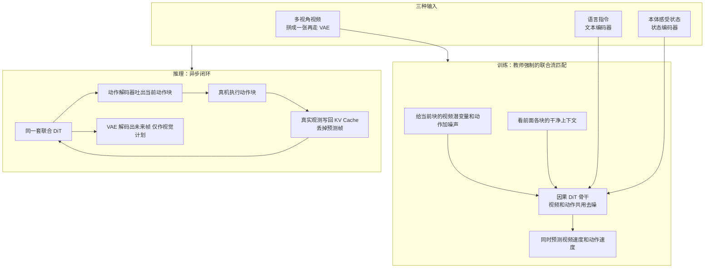
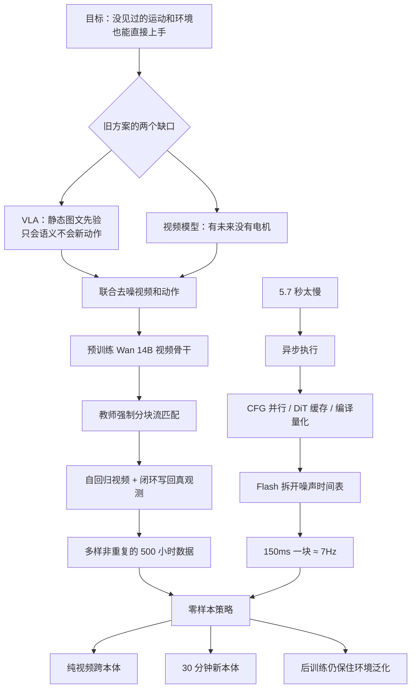

# DreamZero：VLA 会认物体却不会新动作，于是策略必须同时梦见画面和电机

<!-- release-date: 2026-02-04 -->

> 本文依据 NVIDIA 的 **World Action Models are Zero-shot Policies**，本地原件是 arXiv:2602.15922v1（2026-02-17 提交，封面日期 2026-2-19），共 36 页。这已经是官方最新版：arXiv 官方页的提交历史只有 v1，因此未换件。页码一律指本地 PDF 自身的页码。项目页为 [https://dreamzero0.github.io](https://dreamzero0.github.io)。
>
> 文中会明确区分三层：**报告写了什么**、**我们如何解释或推算**、**哪些是外部资料补充**。外部补充一律标出来源并给链接。
>
> 关于 `release-date`：取 2026-02-04，即作者公开宣布开源权重与推理代码、GitHub 放出可运行代码、Hugging Face 上 DreamZero-DROID 权重文件同一天可下载的那一天。论文 PDF 封面是 2026-2-19，arXiv 提交是 2026-02-17，都晚于权重首次开放。证据链见文末。

## 先讲矛盾：会认「泰勒·斯威夫特」，不等于会解鞋带

近年的机器人基础模型几乎都走同一条路：先拿一个在互联网图文上预训练过的视觉—语言模型，再把它改成输出电机指令。报告把这类模型叫做**视觉—语言—动作模型**（Vision-Language-Action model，VLA）（PDF p.2）。

这条路在语义上确实通了。报告举的例子很具体：VLA 能执行「把可乐罐移到泰勒·斯威夫特那边」，因为它在视觉—语言模型预训练里见过这个人，再把它接到机器人数据里学过的「移动」技能上（PDF p.2）。

换一句「解开鞋带」，它就不行——如果机器人训练数据里没有这个技能的话。

报告把缺口写得很硬：VLA 继承的是「**做什么**」的语义先验，缺的是「**怎么做**」——那种对齐几何、动力学和电机控制的空间意识（PDF p.2）。所以它擅长换物体、换说法，却很难泛化到没见过的运动、没见过的环境；想补上，就得再采一大批任务专属、环境专属的动作数据（PDF p.2）。

站在这条线上，两个看起来相反的补丁其实都不够：

- **只克隆动作**：给定当前画面和一句话，直接回归关节。数据一杂、每个任务又不反复演示，模型就会把「同一句话对应的许多种手法」平均掉，或者过拟合到抓取、摆放这种主导行为。
- **只预测视频**：模型可以梦见「鞋带被拉开」的画面，但画面不是电机指令。你还得另接一个逆动力学模型、光流、或者测试时搜索，才能把梦变成可执行的动作。

DreamZero 押的注是第三种组合：

> **在同一次去噪里，既生成未来的视频，也生成与这段视频对齐的连续动作。视频负责梦见世界怎么演化，动作负责把这场梦翻译成电机指令。于是这个世界模型自己就是策略，不必再在测试时另找一个规划器。**

报告把这种架构叫做**世界动作模型**（World Action Model，WAM）（PDF p.2）。DreamZero 是一个建在预训练图像到视频扩散骨干上的 14B WAM。

## 和站内已有的解读怎么分工

站内已经有三篇和这条赛道相邻的解读，解的不是同一个缺口：

| | [Genie](/reports/Google/Genie) | [Cosmos](/reports/NVIDIA/Cosmos) | [π0.7](/reports/PhysicalIntelligence/pi0.7) | 本篇 DreamZero |
|---|---|---|---|---|
| 想解决的缺口 | 互联网视频没有动作标签 | 世界仿真器写不出来 | 混杂数据会把 VLA 平均掉 | VLA 有语义、缺物理运动泛化 |
| 控制信号从哪来 | 从视频里**学**出潜动作 | 后训练时**给**进来（文本 / 位姿 / 动作） | 把「怎么做」写进 prompt | 和未来视频**一起生成** |
| 测试时还要不要另接模块 | 潜动作码本当按键 | 世界模型仍是仿真器，策略是另一边 | 轻量世界模型只出子目标图 | **不再另接规划器**，动作就是输出 |

一句话对照：Cosmos 造的是「世界的数字孪生」；Genie 问的是「没有按键标签能不能学出按键」；π0.7 问的是「VLA 怎样才吃得下杂数据」；DreamZero 问的是「**已经会做梦的视频模型，能不能直接当零样本策略用**」。

报告自己也把 WAM 和两条近亲划开（PDF p.5、p.20）：

- 相对 **VLA**：骨干从「静态图文」换成「会预测时间演化的视频模型」。
- 相对 **潜空间世界模型**（Dreamer、V-JEPA 2）和 **3D 点云世界模型**（PointWorld）：那些建模的是 $p(s_{t+1}\mid s_t,a_t)$，测试时还要做目标条件规划或 MPPI 一类搜索；WAM 直接建模 $p(\mathbf{o}_{t:t+H},\mathbf{a}_{t:t+H}\mid \mathbf{o}_{0:t},\mathbf{c})$，动作轨迹跟着视觉未来一起出来，不必测试时优化。

报告还特意解释了为什么叫 World Action Model 而不是 Video Action Model：视频只是当前这一种世界建模目标，以后也可以把动作对齐到触觉、力反馈或学出来的潜表示（PDF p.5）。本篇只依据这份 PDF 写视频这一路，不补未写的模态。

## 读之前：这条线上的词先各用一句话说清

下面这些词大多不是这篇发明的，先说人话，避免后文被缩写淹没。

- **VLA（视觉—语言—动作模型）**：从预训练视觉—语言模型出发，看画面、读指令、直接输出机器人动作。本篇的对照基线是 GR00T N1.6 和 π0.5（PDF p.10）。
- **世界模型（World Model）**：给定过去画面和这一步的扰动，预测世界接下来长什么样。在 Cosmos / Genie 里它常常是仿真器；在本篇里，它被直接训练成策略的一半。
- **WAM（世界动作模型）**：报告给「用世界建模能力来预测动作」的模型起的类名。DreamZero 是其中一个，而且是**联合**预测视频和动作的那一种（PDF p.2、p.5）。
- **逆动力学模型（Inverse Dynamics Model，IDM）**：看见「这一帧到下一帧世界怎么变了」，反推当时应该发了什么动作。WAM 把这件事内化进同一个网络。
- **行为克隆（Behavioral Cloning）**：最朴素的模仿学习——用专家的「观测 → 动作」对做监督学习。VLA 的动作学习大体是这个；WAM 把它改成「观测 → 未来视频 + 动作」。
- **扩散 / 流匹配（flow matching）**：不一次给出干净样本，而是学习如何把噪声「流」成数据。DreamZero 对视频潜变量和动作共用这件事。
- **去噪时间步（timestep）**：流匹配里从噪声走到干净样本的进度。$t=0$ 是纯噪声，$t=1$ 是干净数据。
- **分块（chunk）**：一次预测一小段未来，而不是一步一个动作。DreamZero 的视频块和动作块在时间上对齐。
- **KV Cache**：自回归生成时把已经算过的历史中间结果留下来，下一步不用从头算。闭环节奏里，DreamZero 会拿**真实观测**覆盖掉缓存里的预测帧。
- **本体（embodiment）**：机器人的身体。换一只手臂、换一对夹爪，动作空间和外观都变了，策略通常不能直接搬。
- **零样本 / 少样本**：本篇的零样本指预训练完直接评、不再为这个任务微调；少样本指给新机器人大约 30 分钟玩耍数据做后训练（PDF p.1–3）。
- **任务进度（task progress）**：按完成了多少阶段打 0 到 1 的分，不是只能 0/1 的成功率。后训练里叠衣服看 5 段完成了几段，装水果看 10 个装进了几个（PDF p.13）。

本篇会反复出现、属于 NVIDIA 自家前作或同期工作的名字：

- **Wan2.1-I2V-14B-480P**：报告用作骨干的开源图像到视频扩散模型（Team Wan, 2025）（PDF p.11）。
- **GR00T N1.6**：NVIDIA 自己的 VLA 基线（PDF p.10）。
- **Cosmos Policy**（Kim 等，2026）：报告引用的另一个 WAM，用来对照「微调视频模型做控制」这条近亲，不是站内 Cosmos 那篇世界基础模型平台（PDF p.2、p.5、p.19）。

## 一句话说清 DreamZero 做了什么

DreamZero 把一个 14B 的预训练视频扩散模型，改成**同时去噪未来视频和连续动作**的自回归策略，然后靠一套系统优化让它在真机上闭环节奏跑起来。

报告声称这带来四件事（PDF p.1，图 1）：

1. 能从多样、非重复的机器人数据里学会技能，不必每个任务反复演示；
2. 能零样本泛化到没见过的任务、环境和物体；
3. 能从**只有视频、没有动作标签**的其他机器人或人类演示里转移任务；
4. 能用大约 30 分钟玩耍数据适应一只新机器人，并保住语言跟随。

数字上，报告自己强调的主结果是：真机实验里，对新任务和新环境的泛化相对当时最强的 VLA **超过 2 倍**；14B 自回归视频扩散模型经优化后做实时闭环控制，动作块生成大约 **7Hz**；跨本体只用 10–20 分钟纯视频，未见任务相对提升超过 **42%**；新本体适应只要 **30 分钟玩耍数据**（PDF p.2–3）。

## 先看全景：训练时它在学什么，推理时谁在说话

根据报告图 4（PDF p.6）重画。这是机制示意，不表示真实延迟或 GPU 切分。

读这张图时先抓住一件事：**推理时生成的视频不是给观众看的，是给动作当对齐物的。** 真机走完这一块之后，预测帧会被扔掉，缓存里换上真实摄像头画面。报告把它写成 WAM 相对纯视频生成的独特优势：自回归视频那种误差累积，在闭环策略里可以被真实世界掐掉（PDF p.8）。

## 为什么「世界动作模型」能当策略，而不能只当一场梦

这一节是全文的机制核心。先不引入新名词，把旧问题拆开。

### 旧问题一：动作克隆没有「未来世界」这个监督

VLA 学的是直接映射：当前观测、一句话 → 现在该发的动作。世界接下来会怎样，不出现在损失函数里。于是两件事会同时发生：

- 数据必须足够重复，模型才能从嘈杂的状态—动作对里把动力学「暗暗」补出来（PDF p.10）；
- 没在机器人数据里出现过的运动，语义再清楚也接不上电机（PDF p.2）。

报告的观察是：VLA 的预训练来自**静态**图文，继承不到时空先验（PDF p.4）。环境泛化往往要靠在几百个真实环境里采集同一任务的遥操作；任务泛化则靠堆一大库语言条件的运动原语——但可能的物理交互组合，根本没法用一份固定的回合级任务表穷尽（PDF p.4–5）。

### 旧问题二：视频模型有未来，却没有手

另一条线用视频生成来帮机器人：先生成轨迹视频，再在测试时用逆动力学、光流或轨迹预测把动作抠出来（PDF p.5）。视频确实把「世界会怎么动」说清楚了，但策略被拆成两段，对齐和对时都要另做。

### 新设计：一次生成里同时写出未来和动作

DreamZero 要学的联合分布，报告写成一次分解（PDF p.6，式 1）。先用人话读：给定历史画面、指令和当前关节状态，同时写出未来 $H$ 步的视频和动作，这件事等价于「先预测未来视频，再从这段视频里反推动作」。

$$
\pi_0(\mathbf{o}_{l:l+H},\mathbf{a}_{l:l+H}\mid \mathbf{o}_{0:l},\mathbf{c},\mathbf{q}_l)
=
\pi_0(\mathbf{o}_{l:l+H}\mid \mathbf{o}_{0:l},\mathbf{c},\mathbf{q}_l)
\cdot
\pi_0(\mathbf{a}_{l:l+H}\mid \mathbf{o}_{0:l+H},\mathbf{q}_l)
$$

右边第一项是视频预测，第二项就是逆动力学。$l$ 是一条轨迹里随机抽的起点，$H$ 是固定地平线，$\mathbf{c}$ 是语言，$\mathbf{q}_l$ 是本体感受。

关键选择是：报告**不用两个分开的模型**去拟合这两项，而是端到端训练一个联合网络（PDF p.7）。他们的理由是：预训练视频模型已经在互联网视频上优化过第一项，DreamZero 只需要额外学会「机器人自己的视频」以及「从生成视频里抽出对应动作」；两端共用一个去噪过程，视频—动作对齐会更深。

这就是「WAM 为什么是策略」的机制答案：

1. **输出里本来就有可执行的连续动作**，不是测试时再搜出来的。
2. **视频是隐式视觉规划器**：动作被训练成与预测的视觉未来对齐，所以「梦对了，电机才跟得上」。
3. **闭环时用真观测换掉梦**：动作块执行完，KV Cache 写入真实帧，下一场梦从现实重新开始。

报告后文的失败案例把这件事说得更白：策略会忠实地执行视频预测出来的轨迹；失败主要来自视频生成错了，而不是动作提取错了（PDF p.13–14、p.29，图 16）。所以他们才说：把机器人能力往前推，可以还原成把视频生成往前推（PDF p.5）。

这是我们的解释，不是报告原话：联合训练让动作头不能「自己编一套和画面无关的关节轨迹」——画面不对，动作损失也会一起受罚。分开的视频模型加后接 IDM，没有这条共同梯度。

## 核心设计一：在预训练视频骨干上，只加最少的动作零件

为了保住视频模型的泛化，报告说他们引入的额外参数尽量少：状态编码器、动作编码器、动作解码器（PDF p.7）。多相机数据不改骨干，而是把所有视角**拼成一张图**再送进去（PDF p.7）。

骨干是 Wan2.1-I2V-14B-480P。训练时更新全部 DiT 块、状态编码器、动作编码器、动作解码器；冻结文本编码器、图像编码器和 VAE。他们试过 LoRA，结果更差，所以没用（PDF p.11）。

动作表示默认是**相对关节位置**，并滤掉空闲动作（PDF p.11）。AgiBot 和 DROID 各自单独预训练，多本体联合训练留作未来工作（PDF p.10）。

### 自回归只加在视频上，而且按块走

DreamZero 按块自回归地预测视频帧和对应动作。报告给了三条理由（PDF p.7）：

1. 能用 KV Cache，推理更快；
2. 策略能把视觉历史当下一步的条件，是有状态的；
3. 避开双向扩散常见的模态对齐困难。

第三条需要展开。双向扩散通常处理固定长度序列，往往要给视频做子采样，原生帧率被扭曲，视频和动作对不齐。自回归加 KV Cache 可以在一次前向里吃任意长上下文，从而保住原生帧率（PDF p.7）。附录 B 用一个闭环节拍的例子把坑画出来：语言标注对应的是整段任务，双向模型若不子采样，生成的视频往往只覆盖任务的一小截，语言在描述画面里还没发生的事；若子采样去迁就语言，采样点落在任务中途时帧率又被扭曲。自回归用「视频上下文」而不是子采样，三条模态可以同时对齐（PDF p.20–21，图 13）。

他们**只对视频做自回归**，避免闭环动作预测把误差传下去（PDF p.7）。每一块有固定 $K$ 个潜帧，与动作地平线对齐。变长视频就像语言模型吃变长 token 一样，按块切。

附录 C 给出具体尺寸（PDF p.21）：

| 项 | AgiBot | DROID |
|---|---|---|
| 每块潜帧 $K$ | 2（预实验里优于 $K=1$） | 同左 |
| 默认块数 $M$ | 4；轨迹更短则更少 | 同左 |
| 视频采样 | 5 FPS | 5 FPS |
| 动作采样 | 30 Hz | 15 Hz |
| 动作地平线 $H$ | 48 | 24 |
| 每块墙钟时间 | 1.6 秒 | 1.6 秒 |
| 最大视觉上下文 | 8 个潜帧 = 33 帧原视频 ≈ 6.6 秒 | 同左 |

视觉记忆目前是短程的。报告在正文脚注里写明：这篇没有专门评、也没有后训练「必须靠记忆才能成功」的任务（PDF p.8）。讨论里把它称为 System 1，上下文大约 6 秒；长程要么另接 System 2 规划器，要么把 WAM 的上下文做长（PDF p.18–19）。

### 训练目标：教师强制的联合流匹配

和近年视频扩散模型、VLA 一样，他们用流匹配（PDF p.7）。和其他一些 WAM 不同的是：标准 DreamZero 让视频和动作**共享同一个去噪时间步**，报告说这样训练初期收敛更快（PDF p.7）。后面的 DreamZero-Flash 会把这两条时间表拆开，但那是最后阶段的事。

教师强制的意思是：当前块是带噪声的，前面各块是干净的；模型只负责把当前块去噪。

对第 $k$ 块、时间步 $t_k\in[0,1]$，噪声视频潜变量和噪声动作是干净样本与高斯噪声的线性插值（PDF p.7，式 2）：

$$
\mathbf{z}^k_{t_k}=t_k\mathbf{z}^k_1+(1-t_k)\mathbf{z}^k_0,
\qquad
\mathbf{a}^k_{t_k}=t_k\mathbf{a}^k_1+(1-t_k)\mathbf{a}^k_0
$$

其中 $\mathbf{z}^k_0,\mathbf{a}^k_0\sim\mathcal{N}(0,\mathbf{I})$ 是噪声，$\mathbf{z}^k_1$ 和 $\mathbf{a}^k_1$ 是干净视频潜变量和归一化动作。同一块里所有帧共享 $t_k$，不同块的时间步独立。前面各块的干净上下文记作 $\mathcal{C}_k$。

模型 $\mathbf{u}_\theta$ 预测两个模态的联合速度，损失是加权均方（PDF p.7，式 3）。式 3 里的求和上限原文也写成 $K$，指的是一条轨迹里的**块数**；附录 C 把每块潜帧数同样叫 $K$（并取 $K=2$），块数改称 $M$。下面按式 3 抄，不把两处 $K$ 混成一个量。

$$
\mathcal{L}(\theta)=\mathbb{E}\left[\frac{1}{K}\sum_{k=1}^{K}w(t_k)\left\|\mathbf{u}_\theta([\mathbf{z}^k_{t_k},\mathbf{a}^k_{t_k}];\mathcal{C}_k,\mathbf{c},\mathbf{q}_k,t_k)-\mathbf{v}^k\right\|^2\right]
$$

目标速度是「干净减去噪声」：$\mathbf{v}^k=[\mathbf{z}^k_1,\mathbf{a}^k_1]-[\mathbf{z}^k_0,\mathbf{a}^k_0]$。$w(t_k)$ 是预定义的时间步权重。训练按整条轨迹更新，并用注意力掩码让当前噪声块只能看见前面的干净块（PDF p.8、p.21，图 14）。

图 14 的注意力可以收成两句话（PDF p.21）：

- **训练**：查询来自当前噪声视频块 $Z$ 和动作块 $Y$，键值来自更早的干净条件帧 $C$ 以及已经处理过的块，是下三角式的教师强制。
- **推理**：先把条件帧写入 KV Cache；之后每一步动作用这份缓存当历史。闭环节奏里，$C$ 会被替换成真实观测，而不是模型自己生成的帧。

### 对自己的项目有什么用

- 想把生成模型改成控制器时，先问：输出空间里有没有「环境接下来会怎样」这一项。没有的话，动作只能从当前帧瞎猜动力学。
- 有未来预测时，尽量让动作和未来走同一条计算图，而不是生成完再另接一个翻译器。
- 闭环系统里，**能被真实观测替换的模态**适合做成自回归上下文；不能被替换的模态（这里是已执行的动作）不要把误差再灌回下一步。

## 核心设计二：14B 视频扩散怎样赶上实时控制

扩散 WAM 的泛化来自迭代去噪，而迭代去噪和「几十毫秒内必须反应」是对着干的（PDF p.8）。报告先把缺口量化，再分层把它填上。

### 反应缺口有多大

单卡朴素实现，DreamZero 生成一个动作块大约要 **5.7 秒**，三个瓶颈是：平滑动作需要 16 步扩散、14B DiT 本身贵、推理不结束机器人就不能动（PDF p.8）。这完全做不了闭环。

一个直觉上的捷径——推理时只出动作、不出视频——在 14B 规模上几乎不省时间：延迟由扩散步数和 DiT 块数主导。而且视频和动作是联合训练出来的，随便减少动作去噪步数会掉质量。这正是后面 Flash 要解决的事（PDF p.8）。

双臂操作的部署设定是：动作地平线 48 步、控制频率 30Hz，所以**每一块覆盖 1.6 秒真机时间**。他们把推理延迟目标定在大约 200ms 以下，好让下一块的计算和当前块的执行重叠（PDF p.8）。

这里容易把两个频率读混。报告说的「约 7Hz 闭环控制」，指的是 **150ms 生成一个动作块**（$1000/150\approx 6.7$），不是把电机指令降到 7Hz。电机侧仍按 30Hz 执行块内的 48 个动作（PDF p.3、p.8、p.17）。

### 第一层：异步执行，把「算完才能动」改成「算完之前当前块别过期」

运动控制器一直在执行最近一块动作，推理在最新观测上并行跑。约束从「推理必须在机器人动之前结束」变成「推理必须在当前动作块用完之前结束」（PDF p.8、p.23）。

### 第二层：系统级并行和缓存

- **CFG 并行**：无分类器引导要跑有条件和无条件两次前向。他们把这两次分到两张 GPU 上，每步延迟降 **47%**（PDF p.8）。
- **DiT 缓存**：流匹配里相邻步的速度方向往往很像。余弦相似度超过阈值就复用缓存速度，有效 DiT 步数从 16 降到 4，动作质量损失很小（PDF p.8、p.23）。附录写了他们和 TeaCache、TaylorSeer 的差别：这里直接看速度向量的方向一致性。阈值的具体数字报告没给。

### 第三层：实现级

- `torch.compile` 加 CUDA Graphs，静态形状，只在第一条轨迹上因 KV Cache 变长而反复编译（PDF p.9、p.23）。
- Blackwell 上把权重和激活量化到 NVFP4，敏感的 QKV 与 Softmax 留在 FP8，LayerNorm、RoPE 一类非线性用 FP16 累加（PDF p.9、p.23）。
- 注意力走 cuDNN；调度器从 CPU 迁到 GPU，去掉同步气泡（PDF p.9、p.23）。

除了 DiT 缓存和量化，报告称这些系统/实现优化与基线数学等价，测不到性能下降（PDF p.10）。

### 第四层：DreamZero-Flash，把视频和动作的噪声时间表拆开

系统优化之后，步数仍是主瓶颈。直接减步不行：当前块里视频还很噪，残差噪声会漏进动作（PDF p.9）。

Flash 的洞察是训练—推理失配。标准 DreamZero 给两个模态抽同一个 $t_k\sim\mathcal{U}(0,1)$。训练时模型看见的是「视频和动作一样噪」；少步或单步推理时，却要求「动作已经干净、视频还半噪」（PDF p.9）。

于是 Flash 让视频时间步偏向高噪声（PDF p.9、p.24，式 5）：

$$
t_k^{\mathrm{video}}=1-\eta,\quad \eta\sim\mathrm{Beta}(\alpha,\beta),\quad t_k^{\mathrm{action}}\sim\mathcal{U}(0,1)
$$

实践里用 $\mathrm{Beta}(7,1)$，于是 $\mathbb{E}[t_k^{\mathrm{video}}]=0.125$（大部分时候视频很噪），动作时间步仍均匀。训练时模型必须从吵闹的视觉上下文里预测干净动作，正好对上少步推理（PDF p.9，图 5）。结果是扩散步从 4 降到 1，推理从约 350ms 降到约 150ms（PDF p.9、p.17）。

Flash 主要作为主模型训练之后的最后阶段来用（PDF p.9）。

动作块还会做平滑：先上采样到 2 倍，用 Savitzky-Golay 滤波（窗口 21、三次多项式），再降回原分辨率（PDF p.9、p.24）。

### 累计加速

从表 1 读（PDF p.10）：

| 优化（每行包含上面全部） | H100 | GB200 |
|---|---:|---:|
| 基线 | $1\times$ | $1.1\times$ |
| + CFG 并行 | $1.9\times$ | $1.8\times$ |
| + DiT 缓存 | $5.5\times$ | $5.4\times$ |
| + Torch Compile + CUDA Graphs | $8.9\times$ | $10.9\times$ |
| + Kernel 与调度器 | $9.6\times$ | $14.8\times$ |
| + NVFP4 量化 | — | $16.6\times$ |
| + DreamZero-Flash | — | $38\times$ |

系统加实现在 H100 上大约 9 倍、GB200 上大约 16 倍；再加上 Flash，GB200 上 38 倍，延迟从 5.7 秒降到 150ms（PDF p.9–10）。讨论里补充：这是用 **2 张 GB200** 跑到 7Hz；当前 VLA 在消费级 GPU 上可以到 20Hz 以上，DreamZero 仍然更贵（PDF p.18）。

### 对自己的项目有什么用

- 生成模型当控制器时，把延迟约束改写成「必须在当前动作块过期前完成」，而不是「必须在机器人动之前完成」。异步执行是结构，不是微调。
- 训练分布要覆盖推理时会遇到的噪声搭配。Flash 不是「少走几步」的推理技巧，是把少步推理会看见的「干净动作 + 吵闹视频」塞回训练。
- 缓存和量化会动数值，报告把它们和「数学等价的图编译 / kernel」分开写，是值得抄的实验纪律。

## 核心设计三：多样优先于重复的数据采集

报告认为，VLA 吃不好高度异构、非重复的数据，因为模型必须从吵闹的状态—动作对里暗暗推断动力学；WAM 有世界建模目标，就可以在采集时优先广度，而不是每个任务反复演示（PDF p.10）。

### AgiBot 预训练语料

用 AgiBot G1 采集大约 **500 小时**遥操作，覆盖 **22 个真实环境**：家庭、餐厅、超市、咖啡店、办公室、仓库、实验室、酒店、零售店等（PDF p.10–11、p.24–25，图 15）。图 6 的统计（PDF p.11；图例数字由我们读图）：

| 量 | 数值 |
|---|---|
| 回合数 | 7,193 |
| 总时长 | 约 500 小时 |
| 平均回合长度 | 4.4 分钟 |
| 平均每回合子任务 | 42.4 |
| 独特技能 | 244 |
| 子任务总数 | 304,791 |
| 图例 Navigation | 66,355 |
| 图例 Turning | 58,442 |
| 图例 Torso | 46,269 |
| 图例 Manipulation | 125,062 |

四类图例计数之和是 296,128，与总计 304,791 差 8,663。原文没有解释差额，本文不当成互斥划分来用。回合显著长于常见操作数据集。技能分布反映真实部署：导航用来在工位之间移动，躯干调整用来够不同高度的架子和柜子（PDF p.10–11）。

采集流程刻意让分布变长尾（PDF p.24–25）：

- 每天给遥操作员一张任务单。每回合从中选 **3 个粗粒度任务**连续做（例如「收拾」），每个大约 1–2 分钟，回合大约 5 分钟。
- 某个任务累计到 **50 个回合**就从任务单上撤掉，逼操作员提新任务。
- 三个任务串在一回合里，既增加多样性，也让模型学习任务之间的平滑过渡。例子：收盘子 → 擦桌子 → 整理调料。

报告计划开源这批数据，当时还没有放出来；项目页有样本（PDF p.11）。

### DROID 作为可复现的异构公开集

第二条线用 Franka 单臂和公开的 DROID 数据集，用来证明 WAM 在多样开源数据上同样成立，并在放出内部 AgiBot 数据之前提供可复现检查点（PDF p.11）。他们开源了检查点和在 PolaRiS 上跑部分 DROID 仿真评测的代码。

### 训练配方

两条数据都是 100K 步、全局 batch 128（PDF p.11）。消融里会把骨干换成 Wan2.1-I2V-5B-480P，看 5B 对 14B（PDF p.11、p.17）。

### 对自己的项目有什么用

- 「每个任务采集几百条几乎相同的演示」不是物理定律，它是动作克隆目标逼出来的采集习惯。换了监督信号，采集策略就应该一起换。
- 用「到 50 回合就退役」这种硬规则制造长尾，比口头强调多样性更可执行。
- 粗粒度、多任务回合（平均 42 个子任务）把任务切换变成训练信号，而不是评测时才出现的新问题。

## 实验怎么证明

评测默认就是**没见过的环境、没见过的物体**：预训练和后训练数据的采集地，和评测场地不在同一个地理位置，所以每项基准测的都是分布外，而不是训练集内部插值（PDF p.11–12，图 7）。

任务粒度按「所需运动 + 物体类型」定义。训练里折过红衬衫、评测时折一件尺寸颜色不同的黑衬衫，算**见过的任务**；改去折袜子，运动模式变了，算**没见过的任务**（PDF p.11–12）。

对照是两个当时的强 VLA：GR00T N1.6 和 π0.5。每个都跑两种初始化（PDF p.10）：

1. **从零开始**：只用预训练 VLM 权重，没有先前的机器人数据，和 DreamZero 公平对比；
2. **从官方预训练来**：官方检查点已经在数千小时跨本体机器人数据上预训练过。

然后两边都在**同一份数据**上继续训：AgiBot 约 500 小时，Franka 用 DROID。总 batch 和梯度步对齐。从预训练出发的基线，等于在官方权重上做持续训练（PDF p.10）。

AgiBot：10 个见过任务 + 10 个没见过任务，每任务 8 次 rollout、4 台机器人（不同环境、不同物体），每个检查点 80 次（PDF p.12）。见过任务分成三类：PnP-Easy、PnP-Hard、接触丰富操作。

DROID：20 个见过任务 + 20 个 DROID 里没出现过的动词，每任务 2 次，共 80 次。物体位置在检查点之间固定。每次按部分完成打 0 到 1.0（PDF p.12）。

后训练三条下游任务（PDF p.12–13）：叠衣服 33 小时（5 段、2 种衣服、随机初始位置）、装水果 12 小时（10 个水果）、收拾桌子 40 小时（5 件垃圾 + 5 件餐具）。各 50K 步。每任务 10 次 rollout。初始画面加了图像叠加以降低方差。

### Q1. 多样、非重复的数据，WAM 是不是学得更好？

图 8，预训练完直接评，任务在预训练分布里，但环境和物体都是零样本（PDF p.13）。数字由我们结合正文与图 8 读出：

| 设置 | 从零 VLA | 预训练 VLA 最强 | DreamZero（从零） |
|---|---:|---:|---:|
| AgiBot PnP-Easy | 接近 0（GR00T 2.1%） | π0.5 52.1% | 93.8% |
| AgiBot PnP-Hard | 接近 0 | π0.5 22.7% | 48.4% |
| AgiBot 接触丰富 | 接近 0 | GR00T 4.2% | 49.0% |
| AgiBot 平均任务进度 | 接近 0 | 27.4% | **62.2%** |
| DROID 平均任务进度 | — | 62% / 69% | **82%** |
| DROID 平均成功率 | — | 42% / 42% | **75%** |

DROID 这一侧图里只有三条柱，对应公开的 π0.5-DROID、内部训的 GR00T N1.6-DROID，以及只在 DROID 上训练的 DreamZero（PDF p.12–13）。

从零开始的 VLA 在 AgiBot 上几乎全军覆没：简单抓放偶尔会伸向正确物体，但在新环境的新物体上交互不准。DreamZero 的 62.2% 比最强预训练 VLA 的 27.4% 高一倍还多，尽管那些 VLA 在吃这份数据之前，已经在数千小时跨本体数据上预训练过（PDF p.13）。DROID 上同样：只吃 DROID 的 DreamZero，超过了吃过多个本体的预训练 VLA。

报告把差距归因于联合视频—动作：VLA 需要海量机器人数据才能学观测到动作的直接映射；WAM 把视频生成当作动作预测的强先验，所以多样数据学得动，没见过的环境也泛化得动（PDF p.13）。

### Q2. 没见过的任务呢？

图 9 评 10 个预训练里完全没有的任务，包括解鞋带、熨烫、用刷子画画、握手（PDF p.14）。

AgiBot 上从零 VLA 平均任务进度不到 1%；DreamZero 平均 **39.5%**，其中「从头模上摘帽子」85.7%、握手 59.2%。预训练 VLA 平均 16.3%，即便它们在跨本体预训练里可能见过其中一些任务（PDF p.14）。

DROID-Franka 上 DreamZero 是 49% 任务进度、22.5% 成功率；GR00T N1.6 是 31% / 12.5%，π0.5 是 33% / 7.5%（PDF p.14）。

定性上，预训练 VLA 常常不管指令是什么，都伸向物体试图抓——过拟合到抓放这种主导行为，所以会有一点任务进度，却完不成指定任务。DreamZero 会为没见过的任务做视觉规划再执行，生成视频和真机动作对齐（PDF p.14）。

结构化评测之外，他们还用口语指令做了 100+ 个自由形式任务，例如「把气球戳破」「按电梯按钮」（PDF p.14，图 3）。这些是展示，不是和基线对齐的对照实验。

### Q3. 任务专属后训练之后，环境泛化还在不在？

图 10（PDF p.15；数字由我们读图，正文只强调相对关系）：

| 任务 | GR00T 从零 | GR00T 预训练 | π0.5 从零 | π0.5 预训练 | DreamZero |
|---|---:|---:|---:|---:|---:|
| 叠衣服 | 2.5% | 65% | 1.5% | 92.5% | 92.5% |
| 装水果 | 27% | 56% | 0% | 71% | 96% |
| 收拾桌子 | 0% | 39% | 0% | 76% | 83% |
| 平均 | 9.8% | 53.3% | 0.5% | 79.8% | **90.5%** |

DreamZero 在叠衣服、收拾桌子上与最强预训练 VLA 相当或略好，装水果上明显更好。引言里写的「后训练后仍比 SOTA VLA 平均高 10% 任务进度」，对应这里 90.5% 对 79.8%（PDF p.3、p.15）。

从零 VLA 会过拟合训练场景，换桌高、桌距、物体和摆放就不准——评测场地本就在另一个地理区位。多本体、重复数据的预训练能大幅抬升 VLA 的后训练泛化，但 DreamZero 在没有跨本体预训练的情况下仍然打平或超过它们。后训练评测仍在没见过的环境里做，所以报告说环境泛化在后训练后被保住了（PDF p.15）。

### Q4. 纯视频的跨本体，能不能补没见过的任务？

设定（PDF p.15–16，图 11、表 2）：

- 跨本体数据**只走视频预测目标，没有动作标签**；
- AgiBot 预训练数据仍走联合视频—动作；
- 两种来源：双臂 YAM 机器人，以及第一人称人类演示；
- 各采 9 个未见任务的 72 条多视角轨迹（每任务 8 条）；YAM 20 分钟，人类 12 分钟；
- 从 DreamZero-AgiBot 检查点出发，与预训练数据 1:1 混合再训 10K 步；
- 排除「拉购物车」，因为他们的双臂 YAM 采不了这个遥操作。

| 方法 | 未见任务平均进度 |
|---|---|
| DreamZero | $38.3\%\pm 7.6\%$ |
| + 人类到机器人 | $54.3\%\pm 10.4\%$ |
| + 机器人到机器人 | $55.4\%\pm 9.5\%$ |

38.3% 不是图 9 的 39.5%，因为这里去掉了拉车、只剩 9 个任务。机器人到机器人相对提升约 45%，人类到机器人约 42%，对应摘要里「超过 42%」（PDF p.2–3、p.16）。报告猜测 YAM 和 AgiBot 都是双臂平行夹爪，本体差距更窄，所以机器人到机器人略好；人类视角是动态第一人称，形态差距更大，但仍然有用。

报告自己把话说得很克制：当前成功率仍只是中等；这只是「10–20 分钟纯视频就有稳定提升」的早期信号。它指向一条可能的缩放路径：人类视频比机器人数据大几个数量级，也许能让 WAM 在没有动作标注的情况下学技能——前提是转移机制还得加强（PDF p.16）。

讨论里他们承认：人类数据实验仍限于实验室内 **12 分钟**；真正大规模的第一人称人类视频（他们点名了 Action100M、Ego4D、EgoDex）还没在这篇里做（PDF p.18）。**本篇 PDF 没有写任何「数万小时人类视频」的实验，那些数字不属于这里。**

### Q5. 新机器人，30 分钟玩耍数据够不够？

把 DreamZero-AgiBot 检查点后训练到全新的双臂 YAM 上：11 个独特任务、**55 条轨迹、大约 30 分钟**玩耍数据（PDF p.16，图 12）。评测是需要语言跟随的抓放变体，物体包括训练里没见过的南瓜、泰迪熊、笔、杯面、纸袋。

报告给的是定性结果加机制解释，没有一张对照表。他们观察到：语言跟随还在，视频—动作仍然对齐。效率被归到两件事（PDF p.17）：

1. AgiBot G1 和 YAM 外观相近，都是双臂平行夹爪；
2. 更根本的是，从预测视频学隐式 IDM，可能比直接学策略更省样本——模型只需学「视觉未来 → 动作」，物理动力学已经在视频预训练里。

失败仍然主要来自视频预测而不是动作提取。这个后训练只用了 11 条短的、任务级全局语言标注；他们猜测把语言多样化会更强，但没做（PDF p.17）。

### Q6. Flash 单步去噪，还剩多少分？

在收拾桌子上（PDF p.17，表 3）：

| 方法 | 去噪步数 | 任务进度 | 推理 | 加速 |
|---|---:|---|---:|---:|
| DreamZero | 4 | $83\%\pm 6.1\%$ | 350ms | $1\times$ |
| DreamZero | 1 | $52\%\pm 10.2\%$ | 150ms | $2.33\times$ |
| DreamZero-Flash | 1 | $74\%\pm 10.1\%$ | 150ms | $2.33\times$ |

标准模型从 4 步砍到 1 步，83% 掉到 52%。Flash 单步回到 74%，离 4 步基线只差 9 个点，速度快大约 2 倍。报告把 74% 写成「更高的平均成功率」，表头则是任务进度；我们按表格的 Task Progress 列来记。

### 消融：多样性、规模、自回归

计算不够，消融全部 50K 步、batch 32，只评 PnP-Easy（PDF p.17，表 4）。因此这些数字**不能**和图 8 主结果的 93.8% 直接比。

| 问题 | 设置 | 任务进度 |
|---|---|---|
| 数据多样性 | 14B AR，500 小时**重复**数据（70 个任务、物体位置相近的反复演示） | $33\%\pm 4.2\%$ |
|  | 14B AR，500 小时**多样**数据 | $50\%\pm 6.3\%$ |
| 模型规模 | 5B AR，多样 | $21\%\pm 4.2\%$ |
|  | 14B AR，多样 | $50\%\pm 6.3\%$ |
|  | 5B VLA，多样 | $0\%$ |
|  | 14B VLA，多样 | $0\%$ |
| 结构 | 14B 双向，多样 | $50\%\pm 14.4\%$ |
|  | 14B 自回归，多样 | $50\%\pm 6.3\%$ |

多样性：同样 500 小时，多样比重复从 33% 做到 50%。报告的解释是：视频预测大多从预训练继承，真正要新学的是逆动力学；稳健的 IDM 需要多样上下文里的状态—动作对应，重复数据天生不够（PDF p.17–18）。

规模：14B 明显好于 5B；小模型容易出现视觉幻觉，再变成错误动作。为了公平，VLA 也按规模对齐——从 8B 和 32B 预训练 VLM 初始化，截断前一半 Transformer 块，再接上 DiT 动作模块。更大的 VLA 在多样数据上仍然是 0%，常常在物体附近徘徊却不接触。报告的结论是：只把容量做大，解决不了 VLA 吃多样数据的困难（PDF p.18）。

自回归对双向：任务进度均值一样，但自回归动作明显更平滑——反传穿过整段动作序列，时间一致性更好；推理还因 KV Cache 快 3–4 倍。双向的标准误差也大得多（14.4% 对 6.3%）（PDF p.18）。

## 失败长什么样

附录 H 和图 16 给了两对「生成视频 / 真机执行」（PDF p.28–29）：

- AgiBot：「拿起马克笔在白板上画线」。生成视频里左臂抓住笔、递给右臂，并没有去画。真机同样抓到笔的上端，然后交给右臂，而不是画线。
- DROID：「把可颂放进烤箱」。生成视频里机器人先抓面包，而不是先开烤箱门。真机同样先抓面包，拿着面包够到烤箱后卡住。

两例都是**视频计划错了，动作忠实地跟着错计划走**。报告的推论：提高 WAM 的语言跟随和视觉规划，才会提高动作执行（PDF p.28）。

这和主结果里「改进视频骨干会直接变成更好的 WAM」是同一句话的失败版（PDF p.13–14）。

## 报告承认的边界，以及没写的东西

讨论第 6 节写得很清楚（PDF p.18–19）：

- **还没有 WAM 的缩放律。** 更大视频骨干和更多样数据在表 4 里有用，但模型规模、数据规模、训练算力之间的最优配比没有画出来。他们预期 WAM 的缩放会和 VLA 不同，对动作更「直接」，但没做。
- **人类视频仍是小规模室内数据。** 12 分钟，不是野外大规模。
- **仍然太贵。** 2 张 GB200 才 7Hz；VLA 在消费卡上可以 20Hz 以上。若更小的视频骨干也能泛化，WAM 才可能当端侧 System 1。
- **长程不够。** 现在是短程 System 1，视觉记忆约 6 秒。
- **高精度操作可能吃亏。** 行为克隆在亚厘米级（插钥匙、精细装配）上的老问题还在。多样预训练偏广度，可能欠了这些任务需要的密集演示。他们引用 Cosmos Policy，说 WAM 在毫米公差上也可能有优势，但那是别人的结果，不是本篇实验。
- **本体设计有张力。** 更高自由度需要更多玩耍数据才能学准隐式 IDM；更像人的本体（尤其带灵巧手的人形）尽管自由度更高，却可能更好地吃视频预训练和海量人类第一人称视频。两条力方向相反。

训练与系统上没公开或没给够的：

- 完整超参、学习率、硬件卡数、墙钟时间和总成本；
- DiT 缓存的余弦阈值、CFG 引导强度；
- Flash 作为最后阶段的步数、数据量和是否冻结哪些层；
- AgiBot 内部数据集本身（当时计划后续开源）；
- Genie Sim 3.0、PolaRiS、RoboArena 的具体分数——论文只说开源了评测代码，并在脚注里写：只在约 500 小时真机数据上训练，没吃过 Genie Sim 3.0 那 10k 小时仿真数据，仍有「非平凡」表现，但没有把这个表现写成数字（PDF p.3–4）；
- 少样本 YAM 实验没有对照表，也没有和其他方法比「多少小时才适应新本体」；
- 多本体联合预训练明确留作未来工作。

这些缺口意味着：主结果的 2 倍泛化、42% 相对提升、30 分钟适应，都建立在「AgiBot / YAM 都是双臂平行夹爪、评测协议由作者定义、任务进度不是纯成功率」之上。换到差得更远的本体，或换成独立第三方协议，报告没有给出保证。

## 最值得带回自己项目的启发

### 1. 先问监督信号里有没有「未来」

动作克隆把动力学藏在「观测 → 动作」的平均里，所以必然渴求重复演示。把未来世界状态写成显式目标之后，同一条杂数据从噪声变成教材。换目标比换网络更先。

### 2. 能联合生成就不要拆成「先做梦、再翻译」

式 1 在数学上可以拆成视频预测乘 IDM，工程上却选择一个网络、一次去噪。共同梯度是对齐的来源。测试时再接一个 IDM，省了训练复杂度，却把模态对齐变成另一项工程。

### 3. 闭环里用真值覆盖预测，是策略相对纯生成的特权

纯视频自回归会累积误差。策略每执行一块就能看到真实世界。把真实观测写回 KV Cache、丢掉预测帧，等于每个动作块都从现实重新校准。任何「生成 + 执行」系统都该问：哪些中间量可以被真值替换。

### 4. 采集规则要和损失匹配

50 回合退役、每回合三个粗任务、22 个真实环境，是世界建模目标下才合理的采集法。若损失仍是动作克隆，这样采出来的数据会被当成噪声。

### 5. 把推理会看见的噪声搭配，写回训练

Flash 不是推理技巧，是纠正「训练时两模态同噪、推理时动作已净视频仍噪」。少步蒸馏、投机解码、早停，都可以先列出推理时的失配，再在训练分布里制造它。

### 6. 容量解决不了目标错了的问题

表 4 里 14B VLA 在多样数据上仍是 0%。先换表示和损失，再谈加参数。

### 7. 失败分析要能指向下一个该改的模块

「视频错了，动作就跟着错」把责任定位在视觉规划，而不是动作头。这才导出「改进视频骨干 = 改进策略」这条可检验的链。如果失败分析分不清是梦错了还是手错了，后续工作会同时改两个地方。

## 用一张图重新串起全文

## 关键词回看

- **WAM**：用世界建模（本篇是未来视频）来带动动作预测的一类模型；DreamZero 是联合生成的那一种。
- **VLA**：视觉—语言—动作模型，骨干来自静态图文预训练，直接映射到电机。
- **联合预测**：同一次去噪里出未来视频和连续动作，数学上等于视频预测乘逆动力学，工程上却是一个网络。
- **逆动力学（IDM）**：从视觉变化反推动作；在 DreamZero 里是隐式的，不单独部署。
- **教师强制分块**：当前块带噪、历史块干净；按块对齐视频潜帧和动作地平线。
- **流匹配**：学从噪声到干净样本的速度场；标准版视频和动作共享时间步。
- **DreamZero-Flash**：视频时间步偏向高噪声、动作仍均匀，为单步推理补上训练分布。
- **KV Cache 写回**：闭环执行后用真实观测替换预测帧，切断视频自回归的误差累积。
- **任务进度**：按阶段完成比例打分，不是只能成功/失败。
- **跨本体纯视频转移**：其他机器人或人类的视频只当世界模型的额外视觉经验，不提供动作标签。
- **少样本本体适应**：新机器人大约 30 分钟玩耍数据，用来学「这具身体的隐式 IDM」。

## 最后的判断

DreamZero 最强的叙事不是「我们做了一个 14B 机器人模型」，而是：**如果视频模型已经在像素里学会世界怎么动，策略就不该再从静态图文出发重学一遍物理；它应该在同一场去噪里把电机对准这场梦。**

这条链被实验撑住的部分很清楚。从零 VLA 几乎吃不动 500 小时非重复数据；吃过数千小时跨本体数据的预训练 VLA，在新环境见过任务上仍只有 27.4% 进度，DreamZero 是 62.2%。没见过的动词和运动上，39.5% 对 16.3%。同样 500 小时，多样比重复多 17 个点；把 VLA 做到同样 14B 也救不回来。失败案例显示动作在跟着视频走，好的坏的都是。这些合在一起，支持「联合预测让世界模型自己成为策略」，而不是只支持「视频辅助一下 VLA」。

它也留下必须看清的边界。7Hz 是 2 张 GB200 上 150ms 一块的结果，不是消费级实时。跨本体和 30 分钟适应都发生在外观相近的双臂平行夹爪之间，人类视频只有 12 分钟室内数据。高精度装配没有赢过的证据。AgiBot 主结果是作者自己的任务进度协议，RoboArena / Genie Sim 3.0 的数字这篇 PDF 里没有。缩放律、多本体联合训练、长程记忆，报告自己都标成未做。

如果只记一句话，可以记：

> **语义先验告诉机器人「那是鞋带」；要解开它，模型必须能梦见鞋带被拉开的画面，并且在同一场计算里把关节对准这场梦。**

## 资料与阅读边界

- **原始依据**：本地 `papers/NVIDIA/DreamZero.pdf`，即 arXiv:2602.15922v1，标题 *World Action Models are Zero-shot Policies*，36 页。全文页码均指这份 PDF。
- **arXiv 官方页**：[https://arxiv.org/abs/2602.15922](https://arxiv.org/abs/2602.15922)。提交历史只有 v1（Tue, 17 Feb 2026 15:04:02 UTC），本地件水印为 `arXiv:2602.15922v1 [cs.RO] 17 Feb 2026`，封面日期 2026-2-19，与官方页一致，故未换件。
- **项目页**：[https://dreamzero0.github.io](https://dreamzero0.github.io)。评测录像、训练数据样本、YAM 30 分钟玩耍数据的可视化在项目页上，**不是** PDF 正文的数字来源；本文主结果一律回到 PDF。
- **代码**：[https://github.com/dreamzero0/dreamzero](https://github.com/dreamzero0/dreamzero)。阅读源码时应以具体 commit 为准；本文没有把源码里未写入报告的细节冒充论文结论。

### `release-date = 2026-02-04` 的依据

本模块的规则是：取这篇文章所讲模型首次通过任一官方渠道向公众开放使用的日期。DreamZero 在论文里明确写了开源权重和推理代码（PDF p.3），因此不改用「论文首次公开日」。

1. **作者公开宣布开源。** 项目共同负责人 Joel Jang 在 2026-02-04 16:19 UTC 发帖介绍 DreamZero，并写明开源模型权重与推理代码，指向 GitHub 与项目页（[帖子](https://x.com/jang_yoel/status/2019086869162811894)）。Yuke Zhu、Linxi 「Jim」 Fan 同日转发同一发布（[Yuke Zhu](https://x.com/yukez/status/2019096072690553112)、[Jim Fan](https://x.com/DrJimFan/status/2019112603637920237)）。
2. **GitHub 代码同日可克隆。** `dreamzero0/dreamzero` 仓库的首次 commit 时间为 2026-02-04 16:42:48 UTC，作者 seonghyeonye，包含推理服务与评测脚本。仓库创建于 2026-01-27，属于发布前预建，不取作首发日。
3. **权重文件提交时间（不用仓库 `createdAt`）。** Hugging Face `GEAR-Dreams/DreamZero-DROID` 在 2026-02-04 09:59–10:06 UTC 连续多次 `Add files using upload-large-folder tool`，随后同日上传 `config.json` 等配置。这是权重文件的提交时间，不是仓库创建时间。AgiBot 检查点更晚（GitHub README 记为 02/27，HF 仓库 `GEAR-Dreams/DreamZero-AgiBot` 的文件提交从 2026-02-28 开始），是后续检查点，不回写家族首发日。

**为什么不取封面 2026-2-19 或 arXiv 2026-02-17。** 两者都晚于 2026-02-04 的权重与代码开放。论文页只在没有更直接官方记时时才作备选证据。**证据强度：强**（作者宣布 + GitHub 首 commit + HF 权重文件提交时间三方落在同一公历日）。

几个不改变结论的时间点：

- 封面日期 2026-2-19、arXiv v1 2026-02-17，都是论文归档，不是首次可下载权重的日子。
- GitHub README 的 02/20 训练代码、02/27 AgiBot 检查点，是同一项目的后续交付。
- Hugging Face 模型卡后来写的下载量、参数展示（页面上出现过 23B 字样）以及「约 75k 条 DROID 回合」，都不是 PDF 原文；论文始终把骨干写成 14B。本文不采用这些页面数字。

### 外部补充（与报告内容分开）

- 论文之后，NVIDIA 技术博客把 DreamZero 放进 WAM 综述，并引用过后续 RoboArena 排行榜快照。那是论文之后的外部材料，例如 [Pretrained to Imagine, Fine-Tuned to Act](https://developer.nvidia.com/blog/pretrained-to-imagine-fine-tuned-to-act-the-rise-of-world-action-models/)（2026-06-15）和 [Beyond VLAs](https://developer.nvidia.com/blog/beyond-vlas-how-world-action-models-reshape-robot-manipulation/)（2026-08-04）。**本篇主结果不使用这些博客里的 Elo 或 Cosmos 3 数字。**
- 开源检查点：[`GEAR-Dreams/DreamZero-DROID`](https://huggingface.co/GEAR-Dreams/DreamZero-DROID)、[`GEAR-Dreams/DreamZero-AgiBot`](https://huggingface.co/GEAR-Dreams/DreamZero-AgiBot)。HF 页面许可与 GitHub Apache-2.0 不必相同，部署前应各自核对；这不是论文结论。
- 本文明确标为读图所得的内容：图 6 图例中的技能分项计数（Navigation 66,355、Turning 58,442、Torso 46,269、Manipulation 125,062）以及总计 304,791 / 244；图 8–10 中正文未逐条写出的柱高。正文有写的平均数一律用正文。四类图例之和与总计不等，差额按读图如实保留。
- 本文明确标为解释而非原话的内容：「共同梯度迫使动作不能脱离画面」「7Hz 是动作块生成频率不是 30Hz 控制频率的降频」「38.3% 与 39.5% 的差来自去掉拉车任务」。这些是为了让机制可读，不是报告里的现成句子。
