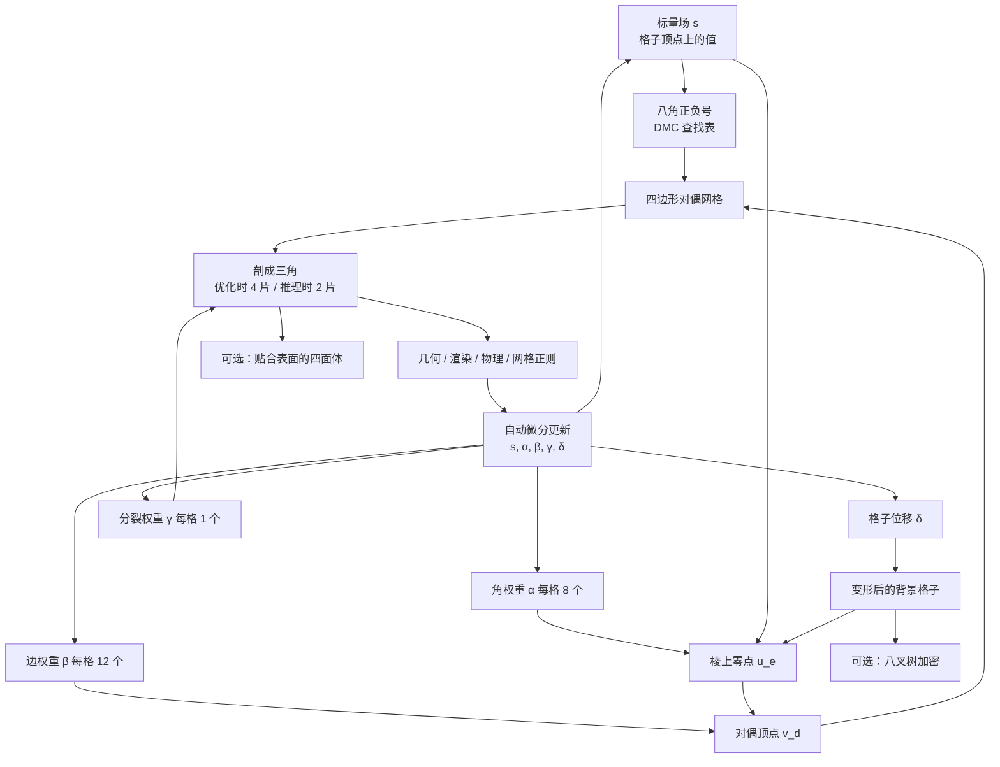

# FlexiCubes：等值面提取要能跟着梯度改网格

<!-- release-date: 2023-07-26 -->

> 本文依据 NVIDIA、多伦多大学与 Vector Institute 的 **Flexible Isosurface Extraction for Gradient-Based Mesh Optimization**，即 arXiv:2308.05371v1（2023-08-10，25 页），同时是 SIGGRAPH 2023 / *ACM Transactions on Graphics* 第 42 卷第 4 期 Article 37。动笔前核过 arXiv 官方提交历史：目前只有 v1，本地件封面水印为 `arXiv:2308.05371v1 [cs.GR] 10 Aug 2023`，与官方件一致，**未做替换**。ACM 记录为 doi:[10.1145/3592430](https://doi.org/10.1145/3592430)。
>
> 全文页码指 PDF 自身页码。本篇从第 2 页起页眉印着 `1:2`，PDF 页码与印刷页码一致（PDF p. N 对应 `1:N`）。第 1–16 页是正文，第 17–25 页是装订进同一份 PDF 的补充材料。
>
> `release-date` 取 **2023-07-26**。这篇文章讲的是一项公开技术，不是对外可用的模型，按流程取该技术首次官方公开日。ACM Digital Library 该条目的 Published 为 2023-07-26；SIGGRAPH 2023 Technical Papers 把 TOG 第 42 卷第 4 期的官方出版日写成 2023-07-23（专利与会议记录口径，见 [Technical Papers 时间表](https://s2023.siggraph.org/program/technical-papers/)）；NVIDIA 研究页写成 2023-08-07；arXiv v1 提交于 2023-08-10 06:40:19 UTC；官方博客 [Better 3D Meshes, from Reconstruction to Generative AI](https://developer.nvidia.com/blog/better-3d-meshes-from-reconstruction-to-generative-ai/) 是 2023-08-11；代码仓 [nv-tlabs/FlexiCubes](https://github.com/nv-tlabs/FlexiCubes) 的 `first commit` 在 2023-09-14。Hugging Face `createdAt` 按本模块规则不是首发日。本文取 ACM 对该篇的 Published 日。
>
> 文中始终区分三件事：**报告写了什么**、**本文如何解释**、**哪些是外部补充**。凡是本文自己推出来的、从图里读出来的、或者从项目页 / 代码仓补进来的，都会当场说明。
>
> 边界说明：本篇是**网格提取与可微优化**，不是文生 3D 基模。同方向已发布的物体级生成报告是 Hunyuan3D 2.0 与 Seed3D 2.0，它们用等值面抽出网格，但讲的是生成系统；本篇讲的是抽出这一步本身怎样才能被梯度推动。论文之后别人怎么接 FlexiCubes，标成外部补充，不写进报告原文。

## 先讲矛盾：表面要从目标函数里长出来

先把场景说清楚，再上名词。

游戏引擎、建模软件、物理仿真吃的都是三角网格：一堆顶点，再用三角形把它们连成一层壳。如果网格已经摆在桌上，移动顶点、算渲染、算弹性，都还算常规。难的是网格一开始并不存在。摄影测量要从多张照片里长出物体，生成模型要从噪声里长出资产，反物理要从一段视频里长出既能看、又能弹的形体。这些任务有一个共同写法（PDF p. 1–2）：

1. 在空间里放一个标量场，每个点一个数；
2. 把「这个数等于零」的那张曲面抽成三角网格；
3. 在网格上算几何、外观或物理目标；
4. 把误差沿自动微分送回标量场，改一轮，再抽一次。

这叫**基于梯度的网格优化**。表面不是人手雕的，是优化器一轮一轮改出来的。抽网格的算法因此不再是后处理，它就是表示本身：它决定优化器「够得着」哪些形状，也决定梯度好不好走。

经典的移动立方体（Marching Cubes）不是为这件事设计的。它假设标量场已经定了，只要忠实地把零等值面划出来。顶点被钉在格子棱上，斜着的锐边对不齐，薄片三角形到处都是。对偶轮廓（Dual Contouring）能把顶点放进格子内部去贴锐边，可定位顶点的线性系统在优化里会炸掉。Deep Marching Tetrahedra（DMTet）让整个背景格子变形，锐边有了，可每个抽出来的顶点仍然不能独立挪，细长的星形三角形还在（PDF p. 2、p. 4）。

报告把这件事收成两个经常打架的性质（PDF p. 2）：

- **Grad.**：对网格的微分有定义，而且梯度下降在实践里真的收敛。
- **Flexible.**：每个顶点都能局部挪动，用较少的面片贴上表面特征。

多一个自由度，就多一份退化、自交和发散的空间。已有方法通常只保住其中一条。FlexiCubes 要同时保住两条：抽网格仍然走对偶移动立方体的查表拓扑，但每个格子多出一组被自动微分更新的局部参数，让顶点位置、四边形怎么剖成三角、背景格子怎么对齐，都跟着下游目标一起改。

它明确不是「再发明一种 Marching Cubes」。报告自己写：FlexiCubes **不是**给已知、固定标量场做一次性提取用的（PDF p. 3）。它是给「场还不知道、提取要做很多轮」的优化场景准备的表示。

## 读之前只需要这几个概念

下面这些词正文都会用到。这一节是**读前背景**，不全是报告自己定义的。

**标量场与等值面。** 给空间里每一点一个数 $s(x)$。把 $s(x)=0$ 的点连起来，得到一张曲面，叫等值面。若 $s$ 还带符号——外面为正、里面为负——它就是有向距离场（Signed Distance Function，SDF）的近亲。形状于是变成「这个函数的零水平集」。

**规则格子。** 把空间切成一堆立方体。报告里 $X$ 是格子顶点，$C$ 是格子单元，抽出的网格是 $M=(V,F)$（PDF p. 4）。$s$ 可以存在格子顶点上，也可以由网络现场求值；对提取算法来说都一样。

**Marching Cubes（移动立方体，MC）。** 看每个立方体八角的正负号，按查找表在格子**棱**上插值出顶点，再在立方体内部拼三角。顶点只能落在棱上，所以斜边会对不齐，等值面擦过顶点时会出现薄片三角。

**对偶。** MC 的顶点在棱上、面在立方体里。对偶思路反过来：每个立方体（或每个 MC 面）出一个顶点，相邻立方体的顶点连成面。对偶轮廓（Dual Contouring，DC）走格子的对偶；对偶移动立方体（Dual Marching Cubes，DMC）走「MC 那张网格」的对偶。差别很大：DMC 在困难构型里可以在同一个立方体里放出多个顶点，从而保住流形（PDF p. 5）。

**二次误差函数（Quadratic Error Function，QEF）。** DC 用局部法向拟合顶点位置。锐边贴得好，可共面法向会让解飞到格子外面，优化时数值不稳（PDF p. 4，Figure 2）。

**DMTet。** 报告多次对照的前作（Shen et al. 2021）：在四面体格子上做可微 Marching Tetrahedra，并允许格子顶点变形。Grad. 和锐边都有，但抽出的顶点仍不能独立移动，均匀性差（PDF p. 2，Table 1）。

**流形、水密、自交。** 流形大致是「局部像一张纸」；水密是没有洞；自交是三角形互相穿过。报告保证均匀格子上的 FlexiCubes 输出是 2-流形，**不保证**无自交（PDF p. 2、p. 14）。

**查表拓扑 vs 连续几何。** 正负号决定哪几条棱被切、哪几个顶点该连成面——这一步是离散的。顶点落在哪、四边形沿哪条对角线剖开——这一步可以是连续的。FlexiCubes 的全部技巧，都是在后一步加可学参数，前一步继续查表。

## 一句话先说清

FlexiCubes 是一套专为梯度网格优化准备的等值面表示（PDF p. 1）。它在 Dual Marching Cubes 上加了三组局部参数，和标量场 $s$ 一起被自动微分更新（PDF p. 5）：

- 每个格子 8 个角权重 $\alpha$、12 条边权重 $\beta$，用来在对偶单元里灵活安放顶点；
- 每个格子 1 个分裂权重 $\gamma$，用来决定非平面四边形怎么剖成三角；
- 每个背景格子顶点 1 个位移 $\delta$，用来让格子贴薄特征，做法与 DMTet 同类。

另外还可以按需输出贴合表面的四面体体网格，以及在细节多的地方做八叉树加密（PDF p. 5、p. 7）。实验分两块：一块是 79 个形状上的合成重建，一块是摄影测量、生成、动画减面和反物理这些下游（PDF p. 8–14）。

全文最值得记住的不是又一张查找表，而是这条设计原则：

> **拓扑继续查表，几何交给可学的局部参数；参数要被约束在格子里，优化器才既走得动、又贴得上锐边。**

## 报告地图：25 页里各写了什么

先摊开篇幅。这份报告图多、表多，公式集中在第 4–8 页。

| 报告章节 | PDF 页 | 讲了什么 | 密度 |
|---|---|---|---|
| 标题、摘要、Figure 1 | p. 1 | 定位；手模型对照；六项应用示意 | 高 |
| §1 引言 + Table 1 | p. 2 | Grad. 与 Flexible 的冲突；方法分类表 | 高 |
| §2 相关工作 | p. 3 | 等值面三类；ML 里的可微网格 | 中 |
| §3 背景 + Figure 2–3 | p. 4 | MC / DC 的公式与失败模式 | 高 |
| Figure 4 + §3.3 + §4 起 | p. 5 | 从球优化的对照；DMC；三组参数总览 | 高 |
| §4.2–4.3 + Figure 5–8 | p. 6 | $\alpha$、$\beta$ 公式；DMC 23 种构型；四边形剖分 | 高 |
| Figure 9–11 + §4.4–4.6 | p. 7 | 消融外观；四面体；八叉树裂缝 | 高 |
| Figure 12 + Table 2 + 正则 | p. 8 | 八叉树约束；重建主表；$\mathcal{L}_{\mathrm{dev}}$、$\mathcal{L}_{\mathrm{sign}}$ | 高 |
| Figure 13 + §5.1 | p. 9 | 79 形状的视觉对照；数据与基线 | 高 |
| Figure 14 + Table 3–4 | p. 10 | 自适应数字；参数消融；等边正则 | 高 |
| Figure 15–18 + §6.1 起 | p. 11 | 内在质量直方图；可展；nvdiffrec | 高 |
| Figure 19 + Table 5 + §6.2 | p. 12 | 真实照片；NeRF 合成集 PSNR / CD；动画 | 高 |
| Figure 22–23 + Table 6 + §6.3 | p. 13 | 蒙皮动画；GET3D 的 FID | 高 |
| Figure 24 + Table 7–8 + §7.2 | p. 14 | 反物理；耗时显存；自交与连续性 | 高 |
| 未来工作、致谢、参考文献起 | p. 15–16 | 不连续、4D、层次生成；参考文献前半 | 低 |
| 参考文献续 | p. 16 | — | — |
| 补充 A 方法细节 | p. 17 | 四面体歧义、八叉树约束、C16 / C19 | 高 |
| 补充 B–C.1 | p. 18 | Figure 4 的设置；DC 正则化 QEF | 中 |
| 补充 C.2–C.4 + Table 9 | p. 19 | 指标定义；旋转稳健性；$\mathcal{L}_{\mathrm{dev}}$ | 高 |
| 补充 D.1–D.3 | p. 20 | nvdiffrec 损失；动画蒙皮；GET3D 的 21 个权重 | 高 |
| 补充 D.4 | p. 21 | 反物理的两阶段训练与四面体过滤 | 高 |
| Figure 27–30 | p. 22–25 | 更多重建、NeRF 分解、GET3D、物理线框 | 中 |

读正文前先知道这几件会决定能挖多深：

- **这不是基模报告。** 没有参数量、没有预训练数据、没有 token。GET3D 那一节只改生成器最后一层（PDF p. 13、p. 20）。
- **定量主场在 Table 2–4 和 Table 9。** 下游应用的图像指标（PSNR、FID）经常差不多，差距写在几何和三角质量上。
- **作者自己承认方法并不全局连续**（PDF p. 15）。他们用 Adam 一类随机优化「在实践里够用」来辩护，没有给出形式化可微证明。
- **均匀格子上的 2-流形是补丁之后的结果**：补充材料按 Wenger 的办法处理了 DMC 的 C16、C19 歧义（PDF p. 17）。

## 全景：场、参数、查表、网格

按 §4 与 Figure 5–8 重画。这张图只表示模块怎么连，不含耗时。

三个要点：

**第一，标量场还在，但它不再是唯一的自由度。** 正负号仍然决定拓扑；$\alpha$、$\beta$、$\gamma$、$\delta$ 决定几何和剖分。报告的原话是：这些参数与底层标量场一起，经自动微分按下游任务更新（PDF p. 1）。

**第二，对偶顶点被故意写成凸组合。** 抽出的点一定落在格子顶点的凸包里，同一个凸格子里多个对偶顶点对应的原面也不相交，从而「几乎」避免自交（PDF p. 6）。这是 Grad. 能站住的几何原因。

**第三，四面体和八叉树是同一套表面提取的延伸，不是另一套表示。** 体网格的顶点集是「格子顶点 ∪ 抽出的表面顶点 ∪ 空格子中点」（PDF p. 7）；自适应只改背景分辨率，提取公式大部分照旧。

## 旧方案卡在哪：Grad. 和 Flexible 为什么打架

### Marching Cubes：顶点被钉在棱上

MC 在符号变化的格子棱上做线性插值（PDF p. 4，式 1）：

$$
u_e = \frac{x_a\, s(x_b) - x_b\, s(x_a)}{s(x_b) - s(x_a)}
$$

$x_a$、$x_b$ 是棱的两端，$s$ 是标量。分母为零时表达式奇异；Shen et al. 2021 指出提取时不会走到这个点。网格无自交，但是顶点只能沿棱滑动。斜着的棱、不与坐标轴对齐的锐边，永远对不齐（PDF p. 2，Figure 1、3）。等值面擦过格子顶点时，还会挤出薄片三角。

让背景格子变形（DefTet、DMTet）能改善贴合，可抽出的顶点仍然绑在「格子的某个自由度」上，会围着这个自由度聚成星形瘦三角（PDF p. 4）。

### Dual Contouring：锐边有了，梯度没了

DC 在格子内部解 QEF 放顶点（PDF p. 4，式 2）。报告把它写成对局部梯度的极小化；补充材料里实际实现还加了把解往零点质心拉的正则（PDF p. 18，式 10）。好处是锐边。坏处有三（PDF p. 4，Figure 2–3）：

- 解不一定在格子里；共面法向会让顶点飞走，出现自交，反传也不稳。
- 把顶点硬夹回格子会把某些方向的梯度掐死。
- 正则加得够重，锐边优势就没了。

Neural Dual Contouring 用网络代替 QEF，对**固定**坏场的一次性提取有帮助；把网络再嵌进对场的优化，景观更绕，Figure 4 里 NDC 直接发散（PDF p. 4–5）。

### Dual Marching Cubes：拓扑对了，质心不够活

DMC 抽的是「MC 网格的对偶」，而不是「格子的对偶」（PDF p. 5）。困难构型可以在一个格子里放最多四个顶点（Figure 7 的 C13），输出保证流形。顶点位置有两条路：QEF，或原面质心。QEF 继承 DC 的数值病；质心没有病，但没有贴单个锐边的自由。

Figure 3 把三种经典提取摆在一起：MC 贴不上锐边；DC 贴得上但可能非流形；DMC 流形，锐边自由度不如 DC（PDF p. 4）。

### 一张表把冲突写死

Table 1 是报告自己的分类（PDF p. 2）。**Grad.** 表示梯度优化在实践里有效，**Uniform** 表示剖分大体均匀、少瘦三角。

| 方法 | Grad. | 锐边 | Uniform | 无自交 | 2-流形 |
|---|---|---|---|---|---|
| MC | 是 | 否 | 否 | 是 | 否 |
| DC | 否 | 是 | 否 | 否 | 否 |
| NDC | 否 | 是 | 是 | 是 | 否 |
| DMC 质心 | 是 | 否 | 是 | 是 | 是 |
| DMC QEF | 否 | 是 | 是 | 是 | 是 |
| 模板网格 | 否 | 否 | 是 | 否 | 是 |
| DMTet | 是 | 是 | 否 | 是 | 是 |
| FlexiCubes | 是 | 是 | 是 | 否 | 是 |

FlexiCubes 唯一没勾的是「无自交」。这不是表格笔误：§7.2 把自交写成了限制，而不是保证（PDF p. 14）。

Figure 4 用从球出发、优化到 CAD 零件的过程把冲突变成画面（PDF p. 5）：MC 贴不上锐边；强正则的 DC 收敛但有伪影；NDC 发散；DMTet 有锐边但瘦三角多；FlexiCubes 在 1000 步时既有细节也有可用三角。补充材料把这次分析的格子写成：DMTet 用 $64$ 的四面体格子，其余用 $48$ 的体素格子，好让三角数大致相当（PDF p. 17）。

## 核心设计一：在 DMC 质心上加可学的顶点位置

### 旧问题

质心 DMC 的 Grad. 是好的，Flexible 不够。DC / QEF 的 Flexible 是好的，Grad. 不够。报告要的是：顶点能在对偶单元里自由走，但走不出格子，反传才稳。

### 新设计

先按 DMC 查表得到连接关系，再改顶点怎么算（PDF p. 5–6）。

普通 DMC 的两步是：棱上插值得到零点 $u_e$（式 3，与式 1 同类），再把对偶顶点放在这些零点的质心（式 4）：

$$
v_d = \frac{1}{|V_E|} \sum_{u_e \in V_E} u_e
$$

FlexiCubes 给每个格子两套正权重。角权重 $\alpha \in \mathbb{R}^8_{>0}$ 改棱上零点的位置（式 5）：

$$
u_e = \frac{s(x_i)\alpha_i\, x_j - s(x_j)\alpha_j\, x_i}{s(x_i)\alpha_i - s(x_j)\alpha_j}
$$

边权重 $\beta \in \mathbb{R}^{12}_{>0}$ 把质心改成加权质心（式 6）：

$$
v_d = \frac{1}{\sum_{u_e \in V_E} \beta_e} \sum_{u_e \in V_E} \beta_e u_e
$$

实现里对 $\alpha$、$\beta$ 都做 $\tanh(\cdot)+1$，把范围限制在 $[0,2]$（PDF p. 6）。两组加起来每格 20 个标量。权重**按格子独立**，相邻角、相邻边不共享——对偶设定下没有必须维持的连续性条件，独立反而更活（PDF p. 6）。

Figure 6 把可走区域涂成绿色：对偶顶点可以落在这块区域的任何地方，而不再钉在质心（PDF p. 6）。Figure 2 最右格用同一块绿三角对照 DC 的三种修法（PDF p. 4）。

### 工作机制

式 5、式 6 都是凸组合。抽出的点一定在格子顶点的凸包内。一个格子放出多个对偶顶点时（Figure 7），它们各自的原面不相交，这是「几乎无自交」的来源（PDF p. 6）。拓扑仍然只看 $s$ 的符号，所以亏格、孔洞、几片表面，都还能变。

### 收益、代价、边界

Table 3 在 $64^3$ 上按添加顺序消融（PDF p. 10）。只看 Chamfer Distance（$10^{-5}$，越低越好）和边 Chamfer（ECD，$10^{-2}$）：

| 配方 | IN$>5^\circ$ ↓ | CD ↓ | F1 ↑ | ECD ↓ | EF1 ↑ |
|---|---:|---:|---:|---:|---:|
| DMC 质心 | 53.02 | 5.85 | 0.65 | 2.60 | 0.19 |
| + 灵活顶点（§4.2） | 40.88 | 5.34 | 0.68 | 0.99 | 0.37 |
| + 格子变形（§4.4） | 39.46 | 5.01 | 0.69 | 0.98 | 0.41 |
| + 灵活剖分（§4.3） | 34.87 | 4.87 | 0.70 | 0.71 | 0.43 |

灵活顶点一项就把 ECD 从 2.60 打到 0.99，锐边是这一步赚来的。Figure 9 从左到右：质心 DMC 的边对不齐；加上灵活顶点后对齐明显好转（PDF p. 7）。

代价是参数变多、前向后向都更贵，以及不再保证无自交。$\tanh$ 把 $\alpha$ 推到 0 附近时，式 5 理论上仍可能退化；作者说没观察到收敛问题（PDF p. 6）。

### 可迁移启发

> **给优化器的自由度要同时满足两件事：够用，以及走不出安全集。凸组合是一种便宜的安全集：参数再怎么学，点还在格子里。**

直接把顶点写成「格子内任意 $xyz$」也能 Flexible，但边界和反传都要另做。把位置写成权重的凸组合，约束和可微是同一件事。

## 核心设计二：让四边形怎么剖开也变成连续自由度

### 旧问题

DMC / FlexiCubes 抽出的是非平面四边形。下游渲染、仿真通常要三角。随便挑一条对角线，弯曲区域会出现明显台阶（PDF p. 6，Figure 8 左）。几何还不知道的时候，不存在一条永远正确的剖分规则。

### 新设计

每个格子一个正权重 $\gamma$（PDF p. 7）。优化期间，四边形不剖成两片，而插一个中点剖成四片（Figure 8 中）。中点是两条可能对角线中点的加权平均（式 7）：

$$
\overline{v_d} = \frac{\gamma_{c_1}\gamma_{c_3}(v_d^{c_1}+v_d^{c_3})/2 + \gamma_{c_2}\gamma_{c_4}(v_d^{c_2}+v_d^{c_4})/2}{\gamma_{c_1}\gamma_{c_3} + \gamma_{c_2}\gamma_{c_4}}
$$

$\gamma$ 连续地在两种剖分之间插值。优化结束后不再插中点，只沿 $\gamma$ 乘积更大的那条对角线剖成两片（PDF p. 7，Figure 8 右）。

### 工作机制、收益、代价

这是「训练时软、推理时硬」的离散选择。梯度能流过两种剖分；最终网格仍是普通三角网。Table 3 最后一行相对前一行，IN$>5^\circ$ 从 39.46% 降到 34.87%，ECD 从 0.98 降到 0.71（PDF p. 10）。Figure 9 最右：剖分对角线跟着特征走（PDF p. 7）。

代价是优化时每个四边形多四个三角、多一个中点；推理时这个成本消失。$\gamma$ 只在格子一级，同一格子发出的多个顶点共用一个 $\gamma$，细拓扑里未必够用——报告没讨论这一点，这是**本文的观察**。

### 可迁移启发

> **离散选择不要在前向里用 argmax 掐死。先用连续权重混合两种合法结果，让梯度选出它要的那一边，最后再硬切。**

和网络里的 Gumbel-Softmax、混合专家的软路由是同一类动作，只是对象换成了四边形的对角线。

## 核心设计三：格子还可以再变形，但有上限

### 旧问题

只在格子内部挪对偶顶点，仍然受格子朝向限制。薄片、斜着的细结构，需要格子自己转过去。

### 新设计

每个背景格子顶点一个位移 $\delta \in \mathbb{R}^3$，灵感来自 DefTet 和 DMTet（PDF p. 7）。变形不超过格子间距的一半，防止格子翻转。

### 收益与边界

Table 3 里，格子变形把 CD 从 5.34 降到 5.01，ECD 几乎不动（0.99 → 0.98）。它补的是贴合，不是锐边——锐边已经由 $\alpha$、$\beta$ 负责。Figure 9 第三张相对第二张，薄处更贴（PDF p. 7）。

位移上限是有意的刚性：再放宽，格子可能翻转，查表拓扑与几何就会打架。报告把「小心约束之后的 Flexible」当成方法的一部分，而不是事后补丁。

## 核心设计四：表面网格之外，按需给出四面体

### 旧问题

物理仿真和角色体变形要的是体网格，不是一层壳。先抽表面再四面体化，对表面的梯度和对体的梯度是断开的。

### 新设计

沿用 Liang 与 Zhang 2014 给 DC 的体剖分，改接到 DMC 连接关系上（PDF p. 7，Figure 10）：

- 顶点 = 格子顶点 ∪ 抽出的表面顶点 ∪ 没有表面顶点的格子中点。
- 同号格子棱：四个四面体，由这条棱的两端加上相邻格子里的两个抽出点构成。
- 异号格子棱：两个四棱锥，再按 §4.3 从底面剖成两个四面体。

一个格子可能有多个抽出点，选哪一个要对。多数构型能从 Figure 7 直接读出；补充材料给了两条规则，并用查找表实现（PDF p. 17）。构型 C18 的内部不能被这些四面体填满——作者写明这是限制，优化里很少遇到，也不妨碍下游（PDF p. 17）。

### 收益、代价、实验里真正用到的修补

Figure 24 把抽出的四面体送进可微 FEM（GradSim）和可微渲染，从多视视频联合恢复形状、纹理和质量密度（PDF p. 14）。参考密度 $D=0.300$，初始化 $D=1.500$，优化后 $D=0.311$。补充材料里另一例从 1.500 优化到 0.511，参考是 0.500（PDF p. 25，Figure 30）。

报告没写的实现细节在补充 D.4（PDF p. 21），属于**原件补充材料，不是外部猜测**：

- 体网格用 $32^3$，为了仿真便宜；
- 体积小于 $2\times 10^{-7}$ 的四面体被删掉（形状归一化到 $(-0.45,0.45)$），否则仿真数值不稳；
- 删除会在表面上留下缝，作者希望将来用新正则解决；
- 形状和物理参数不能一起优化，会出 NaN。实际是两阶段：先用第一帧做刚体重建，再用视频损失只优化密度。

### 可迁移启发

> **下游要体网格，就让抽出步骤直接给出与表面共形的体，而不是抽完再四面体化。同时要承认：能微分不等于能稳定仿真，体积过滤这类脏活仍然要做。**

## 核心设计五：细节多的地方把格子加密

### 旧问题

均匀 $128^3$ 处处一样密，平面浪费三角，尖角仍可能不够。八叉树能变分辨率，可相邻层符号不一致时会出现裂缝或非流形（PDF p. 7，Figure 11）。已有 DC 自适应规则依赖事先知道的拓扑，优化过程中拓扑一直在变，套不上。

### 新设计

背景格子局部细分成八叉树。细格子挨着粗格子时，细格子多出来的顶点不自己学 SDF，而用粗面四个角的双线性插值（PDF p. 7–8，Figure 12）。细分层策略由应用定：几何拟合看曲率，反渲染看视觉误差（PDF p. 7）。

补充 A.2 写了实现：先找八叉树的最小棱，再给与粗面相邻的细顶点预计算双线性权重；八叉树结构更新时才重算这些被约束的顶点（PDF p. 17）。

### 收益与边界

Figure 12：无约束 318 个非流形顶点，加约束后剩 1 个（PDF p. 8）。Figure 14 两组自适应数字（CD 为 $10^{-5}$，PDF p. 10）：

| | 均匀 $32^3$ | 自适应 $64^3$ | 自适应 $128^3$ | GT |
|---|---|---|---|---|
| 例 1 | 2.1k 三角，CD 4.3 | 4.5k，CD 2.5 | 7.6k，CD 2.4 | 10k |
| 例 2 | 2.1k 三角，CD 5.7 | 5.7k，CD 4.7 | 22k，CD 4.4 | 104k |

补充 C.3：从均匀粗格子出发，对每个格子维护目标损失的滑动平均，形状收敛后把损失大于 0.04 的格子细分（PDF p. 19）。不同层相邻的全部 Figure 7 组合里，仍有少数构型会留下洞。作者的评价是：几乎水密，自适应仍然明显更值（PDF p. 8）。

§7.3 把「把层次提取接进生成模型」写成未来工作（PDF p. 15）。也就是说，论文里的 GET3D 实验用的不是自适应格子。

### 可迁移启发

> **变分辨率时，真正要守住的不是「每个顶点都自由」，而是交界面上的符号一致。自由给细处，约束给接缝。**

## 两组正则：过参数化是故意的，所以要留活动余地

$\alpha$、$\beta$ 把每个顶点的位置写过了头，这是故意的：凸权重、有界变形、随机优化都靠这份冗余（PDF p. 8）。报告给所有例子都加了两项内部正则。

**$\mathcal{L}_{\mathrm{dev}}$**（式 8）惩罚对偶顶点到其原面各零点的距离分散程度，用平均绝对偏差（MAD）。它鼓励顶点待在格子中部，旁边留出还能再挪的余量，并正则化抽出的连接关系（PDF p. 8）。

**$\mathcal{L}_{\mathrm{sign}}$**（式 9）惩罚所有异号格子棱，用交叉熵。图像监督看不到物体内部时，它用来赶走漂浮碎片和内腔，做法跟 nvdiffrec 同类（PDF p. 8）。

补充 Figure 26：关掉 $\mathcal{L}_{\mathrm{dev}}$ 会在平坦处留下可见接缝（PDF p. 19）。这是论文自己的定性证据，没有单独的消融表。

两项都不替代应用损失。应用损失可以是深度、SDF、渲染、可展性、等边长度；这两项只让内部参数别把自己逼进死角。

## 实验一：在「监督很干净」时，抽出算法本身差多少

### 设置

§5.1 要回答：如果目标函数没有坑，不同等值面表示的容量差在哪（PDF p. 8–9）。每一步抽出网格，随机相机渲染深度和剪影，再随机采 1000 个点比较 SDF。数据是 Myles et al. 2014 收集的形状，去掉非水密和极瘦（如铁丝）之后剩 79 个，从噪声扫描到精细 CAD 都有。

基线分两类。可微的：MC、DMTet、FlexiCubes，三者都靠优化重建。不可微的：用**真值 SDF** 做一次性提取的 $MC_{SDF}$、$DC_{hermite}$、$NDC_{SDF}$。四面体格子的「分辨率 $n$」和体素格子不可比——同样的 $n$，四面体只有约 $(n/2+1)^3$ 个顶点——所以表里给了 DMTet 的对照分辨率，例如 $64^3$ FlexiCubes 对 $80^3$ DMTet，好让三角数接近（PDF p. 9）。

补充 C.1 的训练配方（PDF p. 18）：1000 步，学习率 0.01；mask / depth / SDF / $\mathcal{L}_{\mathrm{dev}}$ 的权重是 1 / 10 / 2000 / 1；$\mathcal{L}_{\mathrm{sign}}$ 从 0.2 线性降到 0.01。物体放进 $[-1,1]^3$，最长包围盒边缩到 1.8。

### 重建精度

Table 2 的 $64^3$ 一档最常被引用（PDF p. 8）。CD 的单位是 $10^{-5}$，ECD 是 $10^{-2}$。

| 方法 | IN$>5^\circ$ ↓ | CD ↓ | F1 ↑ | ECD ↓ | EF1 ↑ | 顶点数 | 面数 |
|---|---:|---:|---:|---:|---:|---:|---:|
| $MC_{SDF}$ | 80.67 | 6.84 | 0.55 | 2.55 | 0.14 | 9881 | 19783 |
| $DC_{hermite}$ | 63.34 | 5.90 | 0.61 | 3.80 | 0.23 | 9828 | 19769 |
| $NDC_{SDF}$ | 55.22 | 6.16 | 0.57 | 1.22 | 0.26 | 9828 | 19769 |
| MC | 52.37 | 6.33 | 0.66 | 1.25 | 0.25 | 10459 | 20801 |
| DMTet($64$) | 50.20 | 7.50 | 0.66 | 3.77 | 0.28 | 6783 | 13566 |
| DMTet($80$) | 48.66 | 5.17 | 0.66 | 3.59 | 0.29 | 10385 | 20784 |
| FlexiCubes | 34.87 | 4.87 | 0.70 | 0.71 | 0.43 | 9916 | 19843 |

两件重要的事：

**可微优化本身就强过「拿真值 SDF 再提取」。** $MC_{SDF}$ 的 CD 是 6.84，可微 MC 是 6.33，FlexiCubes 是 4.87。报告的解释是：端到端能把提取引入的离散误差一起优化掉（PDF p. 10）。这不是「场估得更准」，而是「表示和提取是同一套参数」。

**锐边指标上，FlexiCubes 比对真值场做 DC / NDC 还好。** $64^3$ 的 ECD：DC 3.80，NDC 1.22，FlexiCubes 0.71。EF1 同样是 FlexiCubes 最高（0.43）。$32^3$ 和 $128^3$ 方向一致（PDF p. 8）。$128^3$ 时 DMTet 的 F1（0.74）略高于 FlexiCubes（0.71），但 IN$>5^\circ$、CD、ECD 仍是 FlexiCubes 更好。

Figure 13、Figure 27 是同一套对照的视觉版（PDF p. 9、p. 22）。从真值 SDF 抽出的左侧三列，楼梯感和掉面更明显；可微的右侧三列里，DMTet 瘦三角多，FlexiCubes 更贴特征。

### 三角质量

Figure 15 画了长宽比、半径比、最小角、最大角的分布（PDF p. 11）。FlexiCubes 的瘦三角明显更少，最小角、最大角的分布更平滑——作者解读为：它能把三角微调到略非平面的区域，而不是死钉在格子上。

Table 4 再加一项「边长尽量相等」的正则（PDF p. 10）。先无正则重建 1000 步，再把正则权重从 0 升到 100 跑 300 步。$64^3$ 上最小角 $<10^\circ$ 的三角比例：

| | IN$>5^\circ$ | CD | 长宽比$>4$ (%) | 最小角$<10^\circ$ (%) |
|---|---:|---:|---:|---:|
| FlexiCubes | 34.87 | 4.87 | 2.93 | 2.04 |
| FlexiCubes + 正则 | 41.05 | 5.46 | 0.39 | 0.24 |
| DMTet($80$) | 48.66 | 5.17 | 17.31 | 17.83 |
| DMTet($80$) + 正则 | 67.65 | 6.69 | 0.29 | 0.26 |
| MC | 52.37 | 6.33 | 11.71 | 11.84 |
| MC + 正则 | 50.16 | 8.56 | 11.46 | 11.62 |

DMTet 加上正则，瘦三角几乎消失，但 IN$>5^\circ$ 从 48.66% 升到 67.65%，几何掉得狠。FlexiCubes 同样能把最小角比例打到 0.24%，IN$>5^\circ$ 只升到 41.05%。MC 几乎动不了三角质量——格子太死，正则没有可动的自由度。Figure 16 是同一件事的画面：FlexiCubes 加正则细节还在，MC 和 DMTet 局部被抹平（PDF p. 11）。

Figure 17 把 Stein et al. 2018 的可展能量加进合成摄影测量。可展性惩罚的是「不能由一张平板弯出来」的拉伸，不惩罚单方向弯曲，和离散连接关系绑定。FlexiCubes 能一边贴形状一边分出板片；MC 既丢特征也做不出这种风格（PDF p. 11）。

这是整篇最重要的实验结论之一：**网格正则要起作用，提取表示必须有能力同时满足「像」和「规整」。** 只换损失、不换表示，MC 做不到。

Figure 25 还测了旋转：MC 在轴对齐时好看，一转就出现台阶；DMTet 稳健但瘦三角多；FlexiCubes 两种毛病都轻（PDF p. 19）。

## 实验二：下游并不需要改整条流水线

§6 的共同姿势是：已有系统里负责抽网格的那一层换成 FlexiCubes，其余尽量不动（PDF p. 11–14）。

### 摄影测量：nvdiffrec / nvdiffrecmc

nvdiffrec 从图像联合优化形状、材质和光照，拓扑阶段原来是 DMTet。换成 FlexiCubes 后，三角数相当的几何更规整（PDF p. 11，Figure 20）。Table 5 是 NeRF 合成集的新视图 PSNR 和可见三角上的 CD（$10^{-2}$，2.5M 点；这份 CD **不能**和 Table 2 比，尺度不同，PDF p. 12、p. 18）：

| | Chair | Drums | Ficus | Hotdog | Lego | Mats | Mic | Ship |
|---|---:|---:|---:|---:|---:|---:|---:|---:|
| PSNR DMTet | 31.8 | 24.6 | 30.9 | 33.2 | 29.0 | 27.0 | 30.7 | 26.0 |
| PSNR FlexiCubes | 31.8 | 24.7 | 30.9 | 33.4 | 28.8 | 26.7 | 30.8 | 25.9 |
| CD DMTet | 4.51 | 3.98 | 0.30 | 2.67 | 2.41 | 0.41 | 1.20 | 55.8 |
| CD FlexiCubes | 0.45 | 2.27 | 0.37 | 1.44 | 1.60 | 0.53 | 1.51 | 10.5 |

PSNR 几乎打平，几何不是。Chair 的 CD 从 4.51 降到 0.45，Ship 从 55.8 降到 10.5；Ficus、Mats、Mic 上 FlexiCubes 的 CD 略差。作者强调的是三角质量和可展开的 UV，而不是再刷一点 PSNR。Figure 18 的最小角直方图：八个场景合在一起，FlexiCubes 的小角更少（PDF p. 11）。Figure 21 用现成的 xatlas 做 UV，FlexiCubes 的纹理块更大，过滤更好（PDF p. 12）。

真实照片：Tanks & Temples 的 Family（nvdiffrecmc）PSNR 28.49 / 28.47 dB（DMTet / FlexiCubes），三角约 96k / 79k；GoldCape（nvdiffrec）24.44 / 24.56 dB，三角约 55k / 38k。视觉上 FlexiCubes 更匀，GoldCape 的凹槽更清楚（PDF p. 12，Figure 19）。

补充 D.1 的损失是 $\lambda_{dev}\mathcal{L}_{\mathrm{dev}} + \mathcal{L}_{\mathrm{sign}} + \lambda_{mask}\mathcal{L}_{\mathrm{mask}}$，$\lambda_{dev}=0.25$，$\lambda_{mask}=5.0$；nvdiffrec 第二段「拓扑冻结后再优化光和材质」保持不动（PDF p. 20）。

### 动画减面：同一套壳要经得住整段动作

给定已知骨骼和动画图像，用粗格子（$32^3$）学一张低面数网格，并在同一骨架上重蒙皮（PDF p. 12–13、p. 20）。只在 T-pose 上优化再事后蒙皮，动作一拉开三角就会被扯瘦。FlexiCubes 可以每一步都可微地重蒙皮，对随机相机和随机帧算图像损失，让三角密度跟着整段动画走。Figure 22：参考 23k 三角，FlexiCubes 两档都是 1.7k；端到端那一档在关节处更经拉（PDF p. 13）。

蒙皮权重本身没有一起优化。补充材料说这需要顶点增删时仍一致的参数化，留给未来（PDF p. 20）。

### 生成：GET3D 只改最后一层

GET3D 用可微等值面直接出带纹理的网格，原来的抽出模块是 DMTet。这里把生成器最后一层改成：每个格子再多 21 个数——8 个角权重、12 个边权重、1 个剖分权重——其余结构、训练、ShapeNet 的 Car / Chair / Motorbike 划分都不变（PDF p. 13、p. 20）。Table 6 的 FID（越低越好）：

| | Motorbike | Chair | Car |
|---|---:|---:|---:|
| DMTet | 48.90 | 22.41 | 10.60 |
| FlexiCubes | 44.87 | 17.51 | 9.55 |

三类都降了，Chair 降得最多。Figure 23、Figure 29 是定性：细结构更多，表面更匀（PDF p. 13、p. 24）。报告把这写成「即插即用的可微抽网格模块」（PDF p. 13）。计算开销「相对可忽略」，因为只动最后一层（PDF p. 20）——这是作者的定性判断，没有单独的生成器 FLOPs 表。

### 反物理：形状和密度分两段学

§6.4 与 Figure 24 已在四面体一节写过。这里只补判断：它证明抽出的体网格能直接进现成可微仿真，不证明「从视频联合恢复几何加全部本构参数」已经成熟。作者自己写，联合优化会 NaN，必须先形状后密度（PDF p. 21）。Lamé 参数在造真值时取 $\mu=\lambda=1000$、阻尼 $1.5$，优化阶段没有把它们一起当作未知数。

## 代价：抽出更贵，但通常不是整条流水线的瓶颈

Table 7 是抽出本身（PDF p. 14）：

| | 前向 (ms) | 反向 (ms) | 显存 (MB) |
|---|---:|---:|---:|
| $64^3$ MC | 2.28 | 0.43 | 12.05 |
| $64^3$ DMTet | 2.33 | 1.38 | 22.44 |
| $64^3$ DMC 质心 | 4.97 | 1.69 | 25.08 |
| $64^3$ FlexiCubes | 8.93 | 7.32 | 116.56 |
| $128^3$ MC | 5.08 | 0.58 | 72.85 |
| $128^3$ DMTet | 6.94 | 1.39 | 168.27 |
| $128^3$ DMC 质心 | 7.34 | 1.74 | 150.75 |
| $128^3$ FlexiCubes | 14.06 | 9.53 | 816.17 |

$64^3$ 上 FlexiCubes 的反向比 DMTet 慢约 5 倍，显存约 5 倍；$128^3$ 显存到了 816 MB。作者的论点是：这点成本放进下游仍然小。Table 8 在 $96^3$ 上（PDF p. 14）：

| | nvdiffrecmc DMTet | nvdiffrecmc FlexiCubes | GET3D DMTet | GET3D FlexiCubes |
|---|---:|---:|---:|---:|
| 每步 (ms) | 307 | 315 | 510 | 610 |
| 显存 (GiB) | 13.1 | 15.3 | 11.6 | 11.1 |

nvdiffrecmc 把每顶点参数存在显存里，多出来的 $\alpha$、$\beta$、$\gamma$ 会抬显存；GET3D 用 MLP 预测这些参数，FlexiCubes 因为三角更少，总显存甚至略降（11.6 → 11.1 GiB）。最高格子分辨率受渲染和网络限制，不受抽出限制；作者始终取高端 GPU 能撑住的最高分辨率（PDF p. 14）。

## 限制：没保证的东西，报告自己写了

**自交。** 均匀 $64^3$、Table 2 的 79 个形状上，自交三角占 0.10%；DC 是 1.48%，NDC 是 0.13%（PDF p. 14）。补充 Table 9 把 $32^3$ / $64^3$ / $128^3$ 的非流形顶点、非流形边、自交百分比写全：FlexiCubes 的 NV、NE 为 0，SI 在三档分别是 0.715%、0.103%、0.017%（PDF p. 19）。把运动严格限制在无自交，会明显伤害表达和优化，作者选择不这样做。

**四面体和八叉树的保证更弱。** 歧义构型可能出现小空洞或非流形。均匀格子上的 2-流形，依赖于对 C16、C19 的修补（PDF p. 17）。应用若硬性要求水密，需要额外处理（PDF p. 14–15）。

**并不全局连续。** 等值面滑过格子顶点时，网格会跳。这是从 DC / DMC 继承的。作者的辩护是：Adam 一类随机优化吃得下这种局部不连续，所以分析焦点放在「下游优不优化得动」，而不是形式可微（PDF p. 15，Figure 4）。这是作者观察，不是定理。

**未来工作写了但没做：** 和体渲染结合改善视觉任务的梯度；4D 时空网格；把自适应层次提取接到生成上（PDF p. 15）。

## 可迁移的设计原则

把上面串回一件事：抽出算法一旦进入优化闭环，它就不再是算法，而是表示。

1. **先分清哪一步必须离散，哪一步可以连续。** 拓扑查表，几何用凸权重。两件事绑在同一个可微表达式里，优化器才会同时改「连什么」和「连在哪」。
2. **自由度要配安全集。** $\alpha$、$\beta$ 是凸组合，$\delta$ 有半格上限，$\gamma$ 在两种合法剖分之间插值。没有安全集的 Flexible，就是 DC 那种飞出格子的 Flexible。
3. **过参数化要配「留活动余地」的正则。** $\mathcal{L}_{\mathrm{dev}}$ 不是为了让网格好看，是为了别把权重用满，下一步才还有地方挪。
4. **网格正则能生效的前提，是表示听得懂网格语言。** Table 4 和 Figure 17 说明：同样的等边、可展损失，MC 几乎无动于衷，FlexiCubes 可以在几何损失和网格损失之间折中。
5. **即插即用是一种产品策略。** 摄影测量、生成、仿真三条线都只换抽出层。衡量成功的不是 PSNR 再高 0.1 dB，而是同样面数下几何更忠、三角更匀、UV 更好展、体网格能进仿真。
6. **能反传不等于能联合优化所有物理量。** 反物理必须两阶段、必须过滤瘦四面体。可微流水线的工程边界，和表示的数学边界不是一回事。

## 报告没写什么，以及之后发生了什么

报告没写的，不要补：

- 没有把 FlexiCubes 做成前馈生成器的训练配方；GET3D 一节只证明它可以换上。
- 没有自适应格子接入生成的实验（§7.3 明文是未来工作）。
- 没有形式化的可微 / Lipschitz 分析。
- 没有大规模场景、开空间重建。
- 补充材料里的四面体过滤阈值、NaN、两阶段，说明物理这条线在论文里仍是可行性演示。

**以下是外部补充，不是本 PDF 的内容。**

官方项目页：[https://research.nvidia.com/labs/toronto-ai/flexicubes/](https://research.nvidia.com/labs/toronto-ai/flexicubes/)。官方代码仓 [nv-tlabs/FlexiCubes](https://github.com/nv-tlabs/FlexiCubes) 于 2023-09-14 首次提交，晚于论文公开约七周；README 写明核心函数从 Kaolin v0.15.0 起进入 `kaolin.ops.conversions.FlexiCubes`，论文原实现仍留在仓内的 `flexicubes.py`。NVIDIA 技术博客 2023-08-11 把它概括成优化流水线里对 Marching Cubes 的即插替换，并指向 SIGGRAPH 2023。

论文自己已经在 nvdiffrec 和 GET3D 里做过替换。再往后，不少物体级 3D 生成系统把同类可微抽出当作网格头来用。那些系统如何安排潜空间、如何批评等值面场，是它们自己的报告该讲的事；本篇不把后人的用法或批评写回 2023 年的原文。本站同方向的 Hunyuan3D 2.0、Seed3D 2.0 讲的是生成系统，抽出算法在那里只是解码器末端的一步，和本篇的问题不是同一个。

## 关键词回看

| 词 | 它在本篇里具体指什么 |
|---|---|
| 基于梯度的网格优化 | 标量场 → 抽网格 → 在网格上算目标 → 反传到场，多轮迭代 |
| Grad. / Flexible | 优化走得动 vs 顶点能局部贴特征；两者默认冲突 |
| Marching Cubes | 顶点钉在格子棱上的经典提取 |
| Dual Contouring / QEF | 格子内拟合锐边，优化时数值不稳 |
| Dual Marching Cubes | 对 MC 网格取对偶；质心版稳、QEF 版活 |
| DMTet | 可微 Marching Tetrahedra + 格子变形；锐边有、均匀性差 |
| $\alpha$、$\beta$ | 每格 8+12 个正权重，凸组合安放对偶顶点 |
| $\gamma$ | 每格 1 个权重，软选四边形对角线 |
| $\delta$ | 背景格子位移，不超过半格 |
| $\mathcal{L}_{\mathrm{dev}}$ / $\mathcal{L}_{\mathrm{sign}}$ | 留活动余地；赶走无监督区域的碎片 |
| nvdiffrec / GET3D | 论文里两条即插即用的下游，不是本方法的训练目标 |

## 资料与阅读边界

- 原件：`papers/NVIDIA/FlexiCubes.pdf`（25 页，含补充材料）。arXiv:[2308.05371v1](https://arxiv.org/abs/2308.05371)，ACM TOG 42(4) Article 37，doi:[10.1145/3592430](https://doi.org/10.1145/3592430)。
- 官方项目页与代码：上文外部补充。Kaolin 文档以当前版本为准，不代表 2023 年论文实现。
- `release-date` 取 2023-07-26，证据见文首。代码首日是 2023-09-14，晚于技术公开，不回写该日期。
