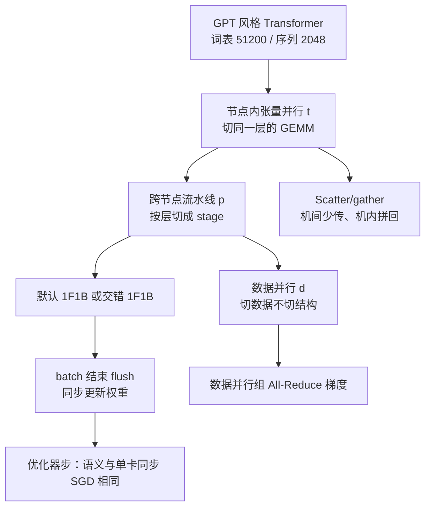

# Megatron-LM-2：节点内切张量、跨节点走流水，朴素组合到几千卡会崩

<!-- release-date: 2021-04-09 -->

> 本文依据 NVIDIA / Stanford 的 **Efficient Large-Scale Language Model Training on GPU Clusters Using Megatron-LM**，即 arXiv:2104.04473 **v5**（2021-08-23），共 13 页。封面水印为 `arXiv:2104.04473v5 [cs.CL] 23 Aug 2021`。页码均指这份 PDF，不用 SC 2021 会议录页码回写。全文把三件事分开标注：**论文明确写了什么**、**我们如何解释或验算它**、**哪些是外部资料补充**。
>
> 动笔前核过 [arXiv:2104.04473](https://arxiv.org/abs/2104.04473)：v1（2021-04-09，3,055 KB）、v2（2021-05-14）、v3（2021-07-30）、v4（2021-08-15）、v5（2021-08-23，1,195 KB）。Comments 写 **Accepted to SC 2021**。本地件与官方最新 v5 一致，13 页，未做替换。**数字一律用 v5**。v1 已经给出万亿模型约 84 天 / 约 3 个月的估计，v5 维持同一组数；v1 Table 1 有一列把模型并行写成合计数（530B 写 280、1T 写 512），v5 拆成张量并行与流水线并行两列；v1 有一处把每卡 163 误写成 petaFLOP/s，v5 改回 teraFLOP/s。
>
> 作者是 Deepak Narayanan（Stanford，文中注明 NVIDIA intern）、Mohammad Shoeybi、Jared Casper、Patrick LeGresley、Mostofa Patwary、Vijay Korthikanti、Dmitri Vainbrand、Prethvi Kashinkunti、Julie Bernauer、Bryan Catanzaro（NVIDIA）、Amar Phanishayee（Microsoft Research）、Matei Zaharia（Stanford）。目录按主要归属放在 NVIDIA。Microsoft 是合作单位，正文说明，不改目录。
>
> `release-date` 取 **2021-04-09**。这是一篇训练系统论文，对象从未作为产品对外可用，按该技术首次官方公开日取值，即 arXiv v1。v5 修订日与 SC 开会日（2021-11-14 至 19，圣路易斯）都不回写。同一工作的 ACM 条目是 `10.1145/3458817.3476209`，本文仍用 arXiv v5 的 1–13 页。
>
> 论文自己把代码放在 [https://github.com/NVIDIA/Megatron-LM](https://github.com/NVIDIA/Megatron-LM)（PDF p. 2）。仓库可作 2021 年这篇的原文，**不要拿后来的 Megatron Core 现状改写这篇**。
>
> **不要把前作读进来当本篇实验。** 本库前作是 [Megatron-LM](/reports/NVIDIA/Megatron-LM)（Shoeybi 等人，arXiv:1909.08053）：intra-layer 张量切分、8.3B、512 V100、15.1 PFLOPS。本篇是张量 + 流水 + 数据并行的组合（论文自己的名字是 **PTD-P**）、交错流水线、万亿参数 / 3072 GPU。前作的 WikiText / LAMBADA / RACE 分数不属于这篇。

## 读前先认识几个词

这篇论文的门槛不在新公式，在于它同时用了「三种并行怎么叠」和「一条训练步在时间轴上怎么走」两套词。先说人话。前几个是通用背景，不全是论文自己定义的。

- **Token（词元）**：模型读写文本的最小单位。
- **数据并行（data parallelism，DP）**：每张卡放一份（或一份切好的）模型，各吃不同数据，反向后把梯度加总。卡变多，吞吐可以涨，但单卡仍要装得下自己那份模型状态。
- **张量并行（tensor model parallelism，TP）**：把同一层里的大矩阵切开，几张卡各算一块。前作 Megatron-LM 把这条路叫做 intra-layer（层内）模型并行。本篇沿用那套切法，开始正式叫张量并行。
- **流水线并行（pipeline model parallelism，PP）**：把网络按层切成几段，每段放一张（或一组）GPU。一个 batch 再切成更小的 **microbatch（微批）**，像流水一样往下传。
- **流水线气泡（pipeline bubble）**：因为层与层有依赖，有的 GPU 算完了必须等上游。这段空转就是气泡。
- **Pipeline flush（流水线冲刷）**：一个 batch 结束时，不再注入新微批，让管子里剩下的前反向跑完，再统一更新权重。这是为了保住同步优化器语义。
- **1F1B（one-forward-one-backward）**：热身之后，每张卡交替做一次前向、一次反向。气泡比例和 GPipe 那种「先全部前向再全部反向」差不多，但同时挂在空中的微批更少，峰值激活显存更低。
- **交错流水线（interleaved pipeline）**：同一张卡不再只拿连续几层，而拿好几块不连续的 **model chunk（模型块 / 虚拟 stage）**。气泡被切小，通信变多。
- **All-Reduce / 点对点**：All-Reduce 是一组卡把各自的张量加总后再人手一份，张量并行和数据并行都用它。流水线阶段之间主要是点对点传激活和梯度。
- **激活重计算（activation recomputation）**：前向时只留下每段的入口激活，反向前把这一段再算一遍。用算力换显存。
- **弱缩放（weak scaling）**：加卡的同时把问题做大。本篇 Table 1 是模型变大、卡变多，不是把同一个 1B 模型摊到 3072 张卡上。

论文自己反复出现的专有设定：

- **PTD-P**：Pipeline + Tensor + Data Parallelism 的组合。结论里写白了分工：**跨节点流水线、节点内张量并行，再叠数据并行**（PDF p. 2、p. 12）。
- **Selene**：实验用的超算。每节点 8 张 80 GB A100，NVLink / NVSwitch；每节点 8 张 200 Gbps HDR InfiniBand 做应用通信，另 2 张专给存储（PDF p. 7）。
- **Scatter/gather 通信优化**：张量并行让相邻流水线阶段其实在重复传同一份激活。发送端先切开，各走自己的 IB 卡，接收端再用 NVLink all-gather 拼回来（PDF p. 7）。

如果你只想先记住一句：

> **单卡甚至单机都塞不下。张量并行不要跨节点，流水线不要无限加深，剩下的卡交给数据并行。气泡用交错日程切小，优化器语义保持同步。**

## 一句话先说清

这篇不是新的注意力，也不是新的优化器。它是一篇 **组合与调度** 论文。

2019 年的 Megatron 已经能把一层里的矩阵切开，在一台多 GPU 服务器里训到约 200 亿参数。再大，就必须跨服务器。跨服务器之后，把张量、流水、数据三种并行随便叠到几千张卡上，通信和空转会把效率吃掉。本篇要回答的问题写在引言里（PDF p. 2）：

> 给定 batch 大小、并且保住严格的优化器语义，三种并行应该怎样组合，才能把大模型的训练吞吐做到最大？

它做成了四件事：

1. 给出一种具体组合，名字叫 **PTD-P**：节点内张量并行、跨节点流水线、再叠数据并行。
2. 提出 **interleaved pipeline（交错流水线）**：一张卡拿多个虚拟 stage，气泡大约按虚拟 stage 数缩小，吞吐相对已有日程最多约 **+10%**，显存与现有方法可比。
3. 用解析模型和消融给出选 $p$、$t$、$d$、微批大小的配置直觉。
4. 在 Selene 上对 GPT 风格模型做弱缩放：最大一档 **1008.0B 参数、3072 张 A100、每卡 163 teraFLOP/s、聚合 502 petaFLOP/s、约 52% peak**。

它明确不解决的问题也要先说清：

- 没有新层、没有新损失、没有下游精度表。WikiText、LAMBADA、RACE 是前作的数字，不是这篇的。
- 万亿这一档测的是 **训练迭代吞吐**，再按 token 数 **估计** 端到端时间。论文没有声称已经把万亿模型训到收敛。
- 不自动搜索并行策略。FlexFlow、PipeDream、DAPPLE、Tarnawski 等人的搜索器被点名放下，作者只给启发式（PDF p. 2）。

### 一条阅读路线

如果只有半小时读原文，建议按这个顺序：

1. **p. 1–2 摘要与问题**：单机 20B 是张量并行的边界；PTD-P；502 petaFLOP/s / 52% / 约 3 个月。
2. **p. 3 图 2–4**：张量切一层、流水切深度；GPipe 的气泡；默认 1F1B 与交错 1F1B。
3. **p. 4–6 第 3 节三条 Takeaway**：张量并行用到节点宽度；模型并行只切到刚好装得下；微批大小是问题相关的。
4. **p. 7 图 9**：scatter/gather，这是交错日程在跨节点上还能跑的原因。
5. **p. 8 表 1**：1.7B 到 1008B 的弱缩放。
6. **p. 8–9 表 2 与图 10**：和 **ZeRO-3**（不加模型并行）比，翻倍加卡时大约 +70%。
7. **p. 9 图 12**：交错相对非交错，小 batch 优势大，大 batch 差距收窄。
8. **p. 9–11 图 13–16**：同一份卡预算下，TP / PP / DP 怎么换手。

## 报告地图：13 页里各写了什么

这是一篇系统论文。密度最高的是第 2 节的日程、第 3 节的配置账和第 5 节的表。

| 报告章节 | PDF 页 | 讲了什么 | 密度 |
|---|---|---|---|
| 标题、摘要、图 1 | p. 1 | 10+% 交错日程；1T / 502 petaFLOP/s / 3072 GPU / 52% peak；模型规模指数涨 | 高 |
| §1 后半 | p. 1–2 | 单机约 20B 是 TP 边界；问题陈述；PTD-P；163 teraFLOP/s；约 3 个月；对 ZeRO-3 约 +70%；四条配置原则 | 高 |
| §2 + 图 2 | p. 2–3 | 三种并行；严格优化器语义靠 flush；不做异步 | 高 |
| 图 3–4 + §2.2 | p. 3–4 | GPipe、PipeDream-Flush / 1F1B、交错虚拟 stage；气泡公式 | 高 |
| §2.3 + 图 5 | p. 4–5 | 沿用前作的列切 / 行切 / 按头切；一层四次 All-Reduce | 中 |
| §3.1–3.3 + 图 6 | p. 5–6 | 记号 $(p,t,d)$；TP 与 PP 的通信量；Takeaway #1 #2 | 高 |
| §3.4–3.5 + 图 7–8 | p. 6 | 微批；式 (1)；重计算检查点数；Takeaway #3 | 高 |
| §4 + 图 9 | p. 7 | scatter/gather；数据布局；融合 kernel | 高 |
| §5 起 + 式 (2)(3) | p. 7–8 | Selene；词表 51200、序列 2048；参数与 FLOP 公式 | 高 |
| 表 1 + 式 (4) + 图 10 | p. 8 | 弱缩放；34 天 / 84 天；对 ZeRO-3 | 高 |
| 表 2 + §5.3 + 图 11–12 | p. 9 | ZeRO-3 细表；PP 弱缩放；交错 vs 非交错 | 高 |
| §5.4–5.5 + 图 13–16 | p. 9–10 | TP/PP/DP 两两对照；91B 上最优微批是 2 | 高 |
| §5.6–5.10 + 图 17–18 | p. 11 | 重计算、scatter/gather +11%、融合 +19%/+11%；892 GB/s 与 12.9 TB/s；13.8 TB checkpoint | 高 |
| §6 | p. 11–12 | TeraPipe、PipeTransformer、DeepSpeed 36% vs 52%、ZeRO、自动切分 | 高 |
| §7 + 致谢 | p. 12 | PTD-P 一句话；加速器无关的三条思想 | 中 |
| 附录 FLOP | p. 12 | 一层 $96Bsh^{2}(1+s/(6h))$，再加词表头 | 高 |
| 参考文献 | p. 13 | GPipe、Megatron、ZeRO、ZeRO-Infinity、PipeDream | 低 |

13 页 PDF 没有单独的算法环境。日程画在图 3、图 4 里。附录只有 FLOP 推导。

## 主要矛盾：单卡单机都塞不下，朴素组合到几千卡会崩

论文没有从「我们发明了一种新并行」开场。它先把 2018 到 2021 年的模型规模画成图 1：ELMo 94M、BERT-Large 340M、GPT-2 1.5B、Megatron-LM 8.3B、Turing-NLG 17.2B、GPT-3 175B，参数量指数涨（PDF p. 1）。

卡住的是两件事，不是一件（PDF p. 1）：

1. **装不下**：连刚发布的 80 GB A100 也塞不进这些模型的参数。就算用主机内存换入换出，算力账单仍在。论文举的例子：GPT-3 175B 若只用一张 V100，大约要 **288 年**。
2. **数据并行加不上去**：每卡 batch 太小，利用率掉、通信占比涨；而且能用的卡数被全局 batch 卡住——batch 是 1536，纯数据并行最多 1536 张卡，可是把 GPT-3 在合理时间里训完大约用了 **一万张** 卡（PDF p. 10）。

前作的张量并行在 **DGX A100（8 张 80 GB A100）上大约到 20B** 还好用。再大必须跨服务器，于是出现两个新问题（PDF p. 1）：

- 张量并行的 All-Reduce 要走机间链路，比机内 NVLink 慢；
- 切得太碎，GEMM 变小，GPU 利用率掉。

流水线按层切，看起来正好补这一刀。可是要保住 **严格优化器语义**——同一步里所有卡看到同一版权重——每个 batch 结束必须 flush。微批不够多时，flush 可以吃掉多达 **50%** 的时间（PDF p. 1）。

三种技术分开都能讲通，叠到一起却会互相伤害。论文自己的实验后来证明：张量和流水的次优组合，即使机间带宽已经很高，吞吐仍可低到大约 **一半**（PDF p. 2）。

矛盾因此变成：

> 模型已经跨出单机，batch 又不能无限加大。必须同时用张量、流水和数据并行；但跨节点 All-Reduce、流水气泡、过小的 GEMM 会把几千张卡的效率打穿。还不能靠异步更新去换吞吐，因为作者要同步优化器语义。

## 先看全景：PTD-P 是一种放置，不是一种新网络

这张图按 PDF p. 2–4、p. 7 的叙事重画，是 **机制示意**，不是论文原图，也不表示实测耗时。主路径不是新层，而是「节点内切开宽度 → 跨节点切开深度 → 剩下的卡做数据并行 → flush 之后才更新」。

三个整数贯穿全文，必须先分清（PDF p. 5）：

| 旋钮 | 符号 | 改它会怎样 | 论文认为该放哪 |
|---|---|---|---|
| 张量并行度 | $t$ | 一层里的矩阵更碎，All-Reduce 更密 | 用到节点内 GPU 数 $g$（A100 节点上是 8） |
| 流水线并行度 | $p$ | stage 变多，气泡变大，点对点变多 | 只用来让模型装得下，跨节点走这条 |
| 数据并行度 | $d$ | 同样的模型副本变多 | 模型已经装下之后，用来加卡 |
| 约束 | $p\cdot t\cdot d=n$ | 三者乘积等于卡数 | 不能独立乱加 |

全局 batch 记作 $B$，微批大小记作 $b$。每条流水线里的微批数是（PDF p. 5）：

$$
m=\frac{1}{b}\cdot\frac{B}{d}=\frac{B}{bd}
$$

$m$ 才是摊薄气泡的那个数。加卡如果只加 $p$，管子变长，$m$ 不变，气泡更难看；$d$ 变大时 $m$ 变小，也会伤气泡——所以后文三条 Takeaway 其实是在排这几个数的优先级。

## 张量并行：这篇沿用前作，不发明新切法

第 2.3 节把前作的切法又写了一遍，图 5 直接借用 Megatron（PDF p. 5）。机制上没有新东西，但本篇后面所有「节点内用 $t=8$」都建立在这套切法上，所以仍要会读。

MLP 是两张 GEMM 加 GeLU：

$$
Y=\operatorname{GeLU}(XA),\qquad Z=\operatorname{Dropout}(YB)
$$

$A$ 按列切成 $[A_1,A_2]$，GeLU 可以就地做，不必先同步。$B$ 按行切，正好吃进 $Y_1,Y_2$。第二张 GEMM 的输出在进 Dropout 之前做一次 All-Reduce。

注意力更适合切：Q、K、V 按列切之后，每张卡拿到若干完整的头，头内部的 $QK^{\top}$、softmax、乘 $V$ 全部本地完成；输出投影按行切。一层里注意力一块、MLP 一块，前向两次 All-Reduce（算子 $g$），反向两次（算子 $f$）。

**我们的读法，不是论文原话：** 前作证明「切得动」；本篇证明「切完之后不要让这次 All-Reduce 跑到机间去」。所以后文 Takeaway #1 不是新算法，是把前作的通信形状放到层次化网络上的放置规则。前作 8.3B 的 WikiText 10.81、LAMBADA 66.51%、RACE 90.9% **不要写进这篇的成绩单**。

## 流水线：GPipe 先全部前向，1F1B 省显存，交错把气泡切小

### 默认日程：气泡一样大，1F1B 只是少存激活

要同步语义，每个 batch 必须 flush。论文把异步和有界陈旧（PipeMare、PipeDream、PipeDream-2BW）整段推迟到未来工作（PDF p. 2–3）。本篇只打磨 **带 flush 的同步流水线**。

GPipe 的日程最容易画：一个 batch 里 $m$ 个微批先全部前向，再全部反向（PDF p. 3，图 3）。图注假设反向是前向的两倍长，并立刻声明 **效率公式不依赖这个倍数**。气泡是开头 $p-1$ 次前向、结尾 $p-1$ 次反向：

$$
t_{pb}=(p-1)\cdot(t_f+t_b),\qquad
t_{id}=m\cdot(t_f+t_b),\qquad
\frac{t_{pb}}{t_{id}}=\frac{p-1}{m}
$$

所以要 $m\gg p$。代价是：这 $m$ 份激活（或重计算时的入口激活）都得挂在显存里，直到这个 batch 结束（PDF p. 4）。

本篇实际用的默认日程是 **PipeDream-Flush**（PDF p. 4，图 4 上）。热身阶段各卡做的前向次数不同，把「正在飞、还没反向」的微批数限制在流水线深度 $p$ 以内；稳态里一前一向，就是 1F1B；batch 结束再把剩下的反向收完。**气泡时间与 GPipe 相同**，但激活最多为 $p$ 份微批，而不是 $m$ 份。$m\gg p$ 时，这是显存账，不是吞吐账。

本站 [GPipe](/reports/Google/GPipe) 是这条流水线的前作语境：它证明「按层切开、微批填管、同步累积不改梯度对象」。1F1B 和交错日程 **以本 PDF 为准**。GPipe 自己的气泡公式写成 $O((K-1)/(M+K-1))$，本篇在 $t_{id}=m(t_f+t_b)$ 的口径下收成 $(p-1)/m$。两种写法差在分母包不包括气泡本身；本篇后文的 Takeaway 都用 $(p-1)/m$。

### 交错日程：一张卡拿多个虚拟 stage

气泡要再小，不能只靠加大 $m$——batch 往往已经被数据配方钉死。论文的新日程是：每张卡不再拿连续一层段，而拿 **多个 model chunk**（PDF p. 4）。

例子。原来每卡 4 层：卡 1 拿 1–4，卡 2 拿 5–8。改成每卡两个 chunk、每个 chunk 2 层之后：

- 卡 1：层 1、2 和层 9、10；
- 卡 2：层 3、4 和层 11、12。

每张卡被赋予多个更短的流水线 stage。可以做「全部前向再全部反向」的交错版，但显存又跟 $m$ 成正比。作者改的是 **交错的 1F1B**（PDF p. 4，图 4 下）。约束是：一个 batch 里的微批数必须是流水线设备数的整数倍。4 张卡，微批数就得是 4 的倍数。

图 4 下半用深色画第一个 chunk、浅色画第二个 chunk。同一份 batch 的 flush 更早到来。若每卡 $v$ 个 stage（chunk），每个 chunk 的前反向时间变成 $t_f/v$ 和 $t_b/v$，气泡时间和气泡比例变成（PDF p. 4）：

$$
t_{pb}^{\mathrm{int.}}=\frac{(p-1)\cdot(t_f+t_b)}{v},\qquad
\frac{t_{pb}^{\mathrm{int.}}}{t_{id}}=\frac{1}{v}\cdot\frac{p-1}{m}
$$

论文原话：新日程把气泡时间缩小 **$v$ 倍**。不是免费的：通信量也增加 **$v$ 倍**。多出来的点对点，要靠下一节的 8 张 IB 卡和 scatter/gather 才能扛住。

**我们的读法：** 交错没有把一次反向再拆成「对输入的梯度」和「对参数的梯度」。这里的粒度仍是完整的前向块和反向块，只是把「一台设备 = 一个 stage」改成「一台设备 = 一条更短的虚拟流水线」。气泡从「等整段层」变成「等更短的 chunk」，flush 提前。显存仍按 1F1B 的 in-flight 微批走，所以摘要才说 footprint 与现有方法可比。后作若再拆反向，那是另一篇文章的日程，文末「论文之后」再写。

## 配置直觉：第 3 节把三种并行的互相伤害写成公式

作者自称这是第一份分析这几个并行维度 **如何互相作用** 的工作（PDF p. 5）。他们给通信量的体积模型，不给层次化网络上的时间模型——机内和机间带宽差一截，时间更难写成闭式。

### Takeaway #1：张量并行用到节点宽度，再大就改走流水线

先令 $d=1$，则 $t\cdot p=n$。气泡 $(p-1)/m=(n/t-1)/m$。$t$ 变大，$p$ 变小，气泡变小（PDF p. 5）。

通信账是另一面：

- 流水线：相邻设备之间，每个微批的前向或反向传 $bsh$（$s$ 序列长，$h$ 隐藏维）。点对点，体积小。
- 张量并行：每层每个微批，大小 $bsh$ 的张量要在 $t$ 张卡上 All-Reduce 两次前向、两次反向，折合每卡每层 $8bsh\cdot(t-1)/t$。一个 stage 有 $l^{\mathrm{stage}}$ 层，再乘上去。

所以 $t$ 大于单节点 GPU 数时，All-Reduce 会落到更慢的机间链路上，作者认为不划算。经验规则（PDF p. 5）：

> 用 $g$ 卡服务器时，张量并行一般用到 $g$；再大的模型，用流水线跨服务器。

后文图 13 用 64 张 A100 验证：峰值出现在 $t=8$，也就是一台 DGX A100 的宽度。

### Takeaway #2：模型并行只切到刚好装得下，加卡走数据并行

流水线与数据并行一起变时，令 $t=1$，则 $p=n/d$，$m=b'/d$，其中 $b':=B/b$。气泡变成（PDF p. 5–6）：

$$
\frac{p-1}{m}=\frac{n-d}{b'}
$$

$d$ 变大，$n-d$ 变小，气泡变小。图 6 画的就是这件事：横轴是 $d$，纵轴是气泡比例，四条线对应不同的 $n$ 和 $b'=B/b$。$n=32,b'=32$ 时，$d$ 不够大，气泡接近 1；同一 $n$ 把 $b'$ 加到 128，气泡一开始就低在 0.25 附近。$d$ 不能加到 $n$，因为模型可能一张卡装不下。

环 All-Reduce 的通信时间按 $(d-1)/d=1-1/d$ 降，所以 $d$ 变大通常不会把数据并行通信变成新的墙。$B$ 变大则 $b'$ 变大，气泡摊得更薄，数据并行 All-Reduce 也更不频繁。

张量并行与数据并行对比更狠：张量并行的 All-Reduce **每个微批都要做**，跨节点时很贵；数据并行的 All-Reduce **每个 batch 一次**。切碎之后每卡 GEMM 还可能不够大，算力利用率自己先掉一截（PDF p. 6）。

于是第二条（PDF p. 6）：

> 模型并行总数 $M=t\cdot p$ 只要让参数和中间元数据装进 GPU 显存；再加卡，用数据并行。

### Takeaway #3：微批大小是问题相关的，不是越大越好

单卡上把微批从 1 加到 16，1B 模型（128 头、隐藏维 4096、4 层）的每卡吞吐最多大约 **1.3 倍**（PDF p. 6，图 7）。流水线里这件事有两面：微批变大，算术强度变好；但 $m=B/(db)$ 变小，气泡变大。

忽略通信，一个 batch 的计算时间写成式 (1)。这里有一处符号前后不一致，先按数学对象说。§3.3.1 定义 $b':=B/b$。§3.4 又写「把 $b'$ 定义为 $B/d$」，接着给出（PDF p. 6）：

$$
\Bigl(\frac{b'}{b}+p-1\Bigr)\cdot\bigl(t_f(b)+t_b(b)\bigr)
\tag{1}
$$

**我们的读法：** 两次 $b'$ 不是同一个量。式 (1) 想写的是「每条流水线里的微批数 $m=B/(db)$ 加上气泡 $p-1$」。若把 §3.4 的 $b'$ 理解成 $B/d$，则 $b'/b=m$，式子自洽。若沿用 §3.3.1 的 $b'=B/b$，式 (1) 应写成 $b'/d+p-1$。后文按 $m+p-1$ 来用，不把两种符号混着代进去。

图 8 用同一个 1B 模型和 $(p,t)=(8,8)$，按式 (1) 估吞吐：batch 128 和 512 的最优微批都是 **4**。引言把这件事收成：最优微批问题相关，实验里可以再抬大约 **15%** 吞吐（PDF p. 2）。第 5.5 节 91B、$(t,p)=(8,8)$ 的最优微批变成 **2**（PDF p. 10，图 16）。所以「15%」不是一个可到处代的常数，是「值得扫一扫」的量级。

第三条（PDF p. 6）：

> 最优微批 $b$ 取决于模型自己的吞吐和显存形状，以及 $p$、$d$、$B$。

### 重计算：吞吐几乎不取决于检查点个数，显存取决于

流水线要训「还算大」的模型，激活重计算几乎是必选项（PDF p. 6）。它多做一次前向，只存每个 stage 的入口激活。检查点个数 $c$ 不改吞吐，改显存。一个 stage 有 $l$ 层，入口激活 $A^{\mathrm{input}}$，每层中间激活 $A^{\mathrm{intermediate}}$（PDF p. 6）：

$$
c\cdot A^{\mathrm{input}}+\frac{l}{c}\cdot A^{\mathrm{intermediate}}
$$

最小点在

$$
c=\sqrt{l\cdot\frac{A^{\mathrm{intermediate}}}{A^{\mathrm{input}}}}
$$

实践中 $A^{\mathrm{intermediate}}$ 靠实测。多数情况 **每隔 1 或 2 个 Transformer 层存一次** 最优。也可以再叠 ZeRO 那种激活切分，进一步降激活显存；本篇实验主线没有把它当成默认。

## 实现：交错日程能跨节点，靠的是 scatter/gather

PTD-P 做在 Megatron-LM 代码上，PyTorch + NCCL（PDF p. 6–7）。真正让「通信量 × $v$」还能跑的，是针对 **张量并行已经把激活复制了一份** 这一事实的通信优化。

相邻两个流水线阶段、对应的张量并行 rank，本来要传 **同一份** 层输出——因为 MLP 的 $g$ 已经 All-Reduce 过，各卡都有完整隐藏向量（PDF p. 7，图 9a）。$t=8$ 时，同一份张量会在机间 IB 上被送 8 遍，而且还用不齐节点上 8 张 IB 卡：流水线的 send/recv 是点对点，一次调用只涉及一对 GPU。

Scatter/gather 的修法（PDF p. 7，图 9b）：

1. 发送端把这份张量切成 $t$ 块；
2. 每个 rank 只通过 **自己的** IB 卡，把其中一块送给下一节点的对应 rank；
3. 接收端用 NVLink 做 all-gather，把完整张量拼回来。

体积从「每对相邻 stage 传一份 $bsh$」降到 $bsh/t$。$t=8$ 时，每条 IB 只扛原来的八分之一。论文说，这让通信更密的交错日程变得可行。

计算图上另有三刀，不是并行算法，但吞吐表里有它们的份（PDF p. 7）：

1. 数据布局从 $[b,s,a,h]$ 改成 $[s,b,a,h]$，去掉昂贵转置，换上 strided batched GEMM；
2. PyTorch JIT 融合 `bias+GeLU` 和 `bias+dropout+add`；
3. 两个自定义 kernel 融合 scale / mask / softmax：一份给 BERT 那种通用 mask，一份给 GPT 那种隐式因果 mask。

## 硬件：Selene 上的混合精度迭代，不是「训完一个万亿模型」

全部结果在 **Selene** 上、混合精度（PDF p. 7）：

- 每节点 8 张 NVIDIA 80 GB A100，NVLink + NVSwitch；
- 每节点 8 张 NVIDIA Mellanox 200 Gbps HDR InfiniBand 做应用通信，另 2 张专给存储；
- 三级（leaf / spine / core）胖树，850 台交换机，利于 All-Reduce；
- 全 NVMe 共享并行文件系统；
- A100 16-bit 峰值 **312 teraFLOP/s**。

论文多数时候报每卡吞吐；聚合吞吐 = 每卡 × 卡数。微基准里，模型必须装得进该实验用的模型并行卡数。结构尽量用 GPT-3 一类的标准配置。词表 $V=51200$（1024 的倍数），序列 $s=2048$（PDF p. 7）。

参数量用式 (2)，FLOP 用式 (3)，推导在附录（PDF p. 7–8、p. 12）：

$$
P=12lh^{2}\left(1+\frac{13}{12h}+\frac{V+s}{12lh}\right)
\tag{2}
$$

$$
F=96Bslh^{2}\left(1+\frac{s}{6h}+\frac{V}{16lh}\right)
\tag{3}
$$

式 (3) 是下界，只计 Transformer 和 logit 里的 GEMM，并把重计算多出来的那次前向算进去。一次 FLOP 不论精度。附录把一层前向写成 $24Bsh^{2}+4Bs^{2}h$，反向按两倍、再加一次前向，得到每层 $96Bsh^{2}(1+s/(6h))$；词表头再加 $6BshV$。

**我们的验算，不是论文原话：** 式 (2)(3) 在 $6h\gg s$、$16lh\gg(V+s)$、$12lh\gg V$ 时，$F\approx 8BsP$。迭代次数 $I=T/(Bs)$，每卡吞吐 $X$，墙钟

$$
\text{时间}\approx\frac{IF}{nX}\approx\frac{8TP}{nX}
$$

这就是式 (4)（PDF p. 8）。它对 Table 1 那些又深又宽的配置成立；拿去套很浅的模型会偏。

## 弱缩放：1.7B 到 1008B，3072 卡上每卡 163 teraFLOP/s

Table 1 是全文的成绩单。并行度按第 3 节启发式选，日程是 **交错流水线 + scatter/gather**。模型变大的同时加大 $B$ 和 $n$。吞吐含数据加载、优化器、通信、打日志，不是纯 kernel 峰值（PDF p. 8）。

| 参数（十亿） | 头数 | 隐藏维 | 层数 | $t$ | $p$ | GPU | batch | 每卡 teraFLOP/s | 峰值比 | 聚合 petaFLOP/s |
|---:|---:|---:|---:|---:|---:|---:|---:|---:|---:|---:|
| 1.7 | 24 | 2304 | 24 | 1 | 1 | 32 | 512 | 137 | 44% | 4.4 |
| 3.6 | 32 | 3072 | 30 | 2 | 1 | 64 | 512 | 138 | 44% | 8.8 |
| 7.5 | 32 | 4096 | 36 | 4 | 1 | 128 | 512 | 142 | 46% | 18.2 |
| 18.4 | 48 | 6144 | 40 | 8 | 1 | 256 | 1024 | 135 | 43% | 34.6 |
| 39.1 | 64 | 8192 | 48 | 8 | 2 | 512 | 1536 | 138 | 44% | 70.8 |
| 76.1 | 80 | 10240 | 60 | 8 | 4 | 1024 | 1792 | 140 | 45% | 143.8 |
| 145.6 | 96 | 12288 | 80 | 8 | 8 | 1536 | 2304 | 148 | 47% | 227.1 |
| 310.1 | 128 | 16384 | 96 | 8 | 16 | 1920 | 2160 | 155 | 50% | 297.4 |
| 529.6 | 128 | 20480 | 105 | 8 | 35 | 2520 | 2520 | 163 | 52% | 410.2 |
| 1008.0 | 160 | 25600 | 128 | 8 | 64 | 3072 | 3072 | 163 | 52% | 502.0 |

（PDF p. 8，Table 1。）

读这张表时有三条不要读错：

1. **$t$ 在 18.4B 之后钉死为 8。** 再大全靠 $p$ 和 $d$。1008B 上 $p=64$，$n=3072$，所以 $d=3072/(64\times 8)=6$。模型并行总数 $M=t\cdot p=512$，和 v1 把 1T 那一列写成 512 对得上。
2. **超线性。** 论文把 3072 卡（384 个 DGX A100 节点）写成超线性：模型变大，GEMM 变大，通信相对计算没有同比例变坏。最小档 44% peak，最大档 52% peak。$163/312\approx 52\%$，$137/312\approx 44\%$，和峰值 312 teraFLOP/s 对得上。
3. **这是迭代吞吐，不是收敛质量。** 1008B 这一行证明「这个配置能以 502 petaFLOP/s 做训练迭代」。它不证明已经跑完 4500 亿 token。

### 端到端时间：GPT-3 估计 34 天，万亿估计 84 天

式 (4) 是（PDF p. 8）：

$$
\text{端到端训练时间}\approx\frac{8TP}{nX}
\tag{4}
$$

两个例子，都以 v5 为准（v1 已经是同一组估计）：

- GPT-3，$P=175\text{B}$，$T=300\text{B}$ token，$n=1024$，$B=1536$，$X=140$ teraFLOP/s → **34 天**。
- 万亿参数，假设 $T=450\text{B}$ token，$n=3072$，$X=163$ teraFLOP/s → **84 天**。引言和结论把 84 天说成约 **3 个月**（PDF p. 2、p. 12）。

**我们的验算：** $8\times 300\times 10^{9}\times 175\times 10^{9}/(1024\times 140\times 10^{12})\approx 33.9$ 天；万亿那条 $\approx 83$ 天。450B token 是作者的假设，不是这篇训出来的数据配比，也不是 Chinchilla 那种 20 token / 参数——本篇发表时那条定律还没有写出来，而且本模块本来也不收规模定律。

作者认为这些时间「用一个合理的卡数」是实际的。相关工作里拿 DeepSpeed 当时的万亿吞吐做对照：36% peak、聚合 37.6 petaFLOP/s，同等规模大约要 **40 个月**（PDF p. 11–12）。52% 对 36% 的差，被他们拆成四笔：算子融合、更省气泡的流水线日程、A100 对 V100 加高带宽机间链路、以及扩到更多 GPU。

## 和 ZeRO-3 比：本 PDF 的数字是最多约 70%，前提是对方不加模型并行

第 5.2 节把 PTD-P 接到 DeepSpeed 的 Python 库里，对照 **不加模型并行的 ZeRO-3**（PDF p. 8–9）。全局 batch 随卡数不变。图 10 的虚线是 175B GPT-3，实线是 Table 1 的 530B。

Table 2 把墙钟也折成「300B token 要多少天」（PDF p. 9）：

| 方案 | 参数（十亿） | 模型并行 | batch | GPU | 微批 | 每卡 teraFLOP/s | 300B token（天） |
|---|---:|---:|---:|---:|---:|---:|---:|
| ZeRO-3，无模型并行 | 174.6 | 1 | 1536 | 384 | 4 | 144 | 90 |
|  |  |  |  | 768 | 2 | 88 | 74 |
|  |  |  |  | 1536 | 1 | 44 | 74 |
|  | 529.6 | 1 | 2560\* | 640 | 4 | 138 | 169 |
|  |  |  | 2240 | 1120 | 2 | 98 | 137 |
|  |  |  | 2240 | 2240 | 1 | 48 | 140 |
| PTD-P | 174.6 | 96 | 1536 | 384 | 1 | 153 | 84 |
|  |  |  |  | 768 | 1 | 149 | 43 |
|  |  |  |  | 1536 | 1 | 141 | 23 |
|  | 529.6 | 280 | 2240 | 560 | 1 | 171 | 156 |
|  |  |  |  | 1120 | 1 | 167 | 80 |
|  |  |  |  | 2240 | 1 | 159 | 42 |

530B 的 ZeRO-3 在 560 卡、微批 4 时装不下，作者把卡加到 640、全局 batch 加到 2560，表里打了 `*`（PDF p. 9）。PTD 一侧 174.6B 的模型并行 96，对得上 GPT-3 常用的 $t\times p=8\times 12$；529.6B 的 280 对得上 Table 1 的 $8\times 35$。

正文只收两档对照，不要把表里每一行都说成「70%」（PDF p. 8）：

- 卡少、微批 4：PTD-P 在 175B / 530B 上分别高 **6%** 和 **24%**。
- **把 GPU 数翻倍、batch 不变**：两个模型上都大约高 **70%**，原因是跨节点通信更少。175B 在 768 卡是 149 对 88；530B 在 1120 卡是 167 对 98。

引言把这件事写成「175B 和 530B 上超出 ZeRO-3 70%，因为跨节点通信更少；这些模型已经大到单机塞不下」（PDF p. 2）。口径要带着走：对照的是 **孤立的 ZeRO-3，没有张量并行**。作者自己补了一句：ZeRO-3 可以再叠模型并行，缩放可能会好一些。本篇没有做那一组。

**不要** 把本站 [ZeRO-Infinity](/reports/Microsoft/ZeRO-Infinity) 的 32T / NVMe / 25 petaflops 写进本文结论。那是另一份 PDF。本篇相关工作对 ZeRO-Infinity 只说了一句：NVMe 换入换出能在少量 GPU 上装很大的模型，但少量 GPU 训极大模型会得到不现实的时间，例如收敛要 **数千年**（PDF p. 12）。这是本篇的评论，不是 Infinity 自己的成绩单。

ZeRO 家族的第一篇（Rajbhandari 等人 2019）本批同期、本站按任务不把它当已有专文。本篇引用它的程度就是：ZeRO-3 把参数和梯度也切到数据并行组上，额外通信在没有张量并行、或 batch 不够大时更难藏住——图 10 就是这个意思。

## 流水线自己的消融：交错赢在小 batch，大 batch 会被通信追上

### 弱缩放管子

第 5.3.1 节把隐藏维钉在 20480、头数 128、微批 1，$t=8$，只加 $p$。$p=1$ 时 3 层、约 15B；$p=8$ 时 24 层、约 121B。总卡数从 8 到 64（PDF p. 9，图 11）。batch 8 时每卡吞吐随 $p$ 明显往下掉；batch 128 几乎走平。这就是气泡 $(p-1)/m$：微批不够，加 stage 就是加空转。

### 交错对非交错

图 12 用 GPT-3 175B（96 层、96 头、隐藏维 12288）在 96 张 GPU 上比两种日程，交错一侧开了 scatter/gather（PDF p. 9）。论文的定性结论：

- 交错更高；
- batch 变大，差距收窄。原因有二：默认日程的气泡被摊薄；点对点通信量跟 batch 成正比，交错每样本通信更多，非交错会赶上来；
- **关掉 scatter/gather 之后，大 batch 上默认日程反而更好**（图未画出）。

摘要和引言把收益写成最多约 **10%**（PDF p. 1–2）。图 12 的纵轴是每卡 teraFLOP/s，小 batch 时两条曲线分得很开，大 batch 时靠拢。本文不把读图估计当成论文数字；定量主张以「10+%」和「小 batch 更明显」为准。

## 同一份卡预算，三种并行两两换手

第 5.4 节把 $n$ 和模型钉住，只改 $(p,t,d)$ 的组合。这是第 3 节启发式的实验版。

### 张量对流水：峰值在 $t=$ 节点宽度

图 13：162.2B（正文写成 161B；32 层以支持 $p=32$，128 头，隐藏维 20480），64 张 A100（PDF p. 9–10）。横轴是 $(p,t)$ 从 $(2,32)$ 走到 $(32,2)$。batch 32 和 128 都在 **$(8,8)$** 附近最高。$t=32$ 等于张量并行跨了 4 个节点，All-Reduce 太贵；$p=32$ 则气泡太大。结论原话：前作那种纯张量并行、以及 PipeDream 一类纯流水线，单独都比不上两者一起用。

同一份 PDF 里图注写 162.2B、正文写 161B，本文把它们当作同一档配置的两种写法，不另造一个模型。

### 流水对数据、张量对数据：能装下就优先 DP

图 14、图 15 改用 5.9B（32 层、32 头、隐藏维 3840），因为要看模型并行只有 2 时也能装下的情况。64 卡，微批先钉成 1（PDF p. 10）。

- 流水 + 数据：每个 batch 上，吞吐都随 $p$ 下降，和 §3.3 的气泡公式一致。流水线用来装模型，加卡走数据并行。
- 张量 + 数据：大 batch、微批 1 时，数据并行通信已经很稀；张量并行却每个微批都要做一次类似 all-to-all 的 All-Reduce，跨节点时它会主导整步时间。$t$ 再大，每卡 GEMM 更碎，利用率自己再掉一截。

数据并行不是万能。GPT-3 收敛用的 batch 是 1536，纯 DP 最多 1536 张卡，而把该模型在合理时间里训完大约用了 10000 张（PDF p. 10）。装不下、以及 batch 把 DP 卡住，是必须上模型并行的两个独立理由。

### 微批再扫一次

图 16：91B，$(t,p)=(8,8)$，64 卡。这条配置上最优微批是 **2**，和其他模型不同（PDF p. 10）。解析模型可以当选 $b$ 的代理，不能当「永远是 4」的口诀。

## 重计算、通信优化、融合算子：吞吐表里的另外三笔

**重计算。** 图 17：145B（80 层、96 头、12288），128 张 A100，$(t,p)=(8,16)$，纵轴改成 sequences/s（PDF p. 11）。小 batch 上，多一次前向最多让吞吐低约 **33%**。但它能撑起更大的 batch；大 batch 加重计算的吞吐，可比「不用重计算时能跑的那个较小 batch 的最好吞吐」高到约 **2 倍**，因为气泡更小。所以重计算在这篇里不只是省显存，它还通过允许更大 $B$ 来买效率。

**Scatter/gather。** 图 18：175B，96 张 A100，交错日程。通信密集（大 batch + 交错）时最多约 **+11%**（PDF p. 11）。

**融合算子。** 175B：113 → 135 teraFLOP/s，约 **+19%**。530B：133 → 148 teraFLOP/s，约 **+11%**（PDF p. 11）。530B 的配置指回图 1 那一档，不是新模型。

**机间带宽。** 万亿档、3072 卡上，流水线阶段之间点对点的有效对开带宽 **892 GB/s**，数据并行 All-Reduce 的有效对开带宽 **12.9 TB/s**（引言写成 13 TB/s）（PDF p. 2、p. 11）。放置再差一点，机间字节数会先把缩放打穿。

**Checkpoint。** 万亿模型一份 checkpoint **13.8 TB**。384 个节点一起做初次加载，读带宽到 **1 TB/s**，已经是并行文件系统的峰值读。保存大约是峰值写带宽的 40%，即 **273 GB/s**（PDF p. 11）。这不是算法贡献，是把「训得动」从迭代延伸到可断点续训。

## 相关工作里点到、但不是本篇实验的几件事

第 6 节把邻居排开，本篇只取它写到的程度（PDF p. 11–12）：

- **TeraPipe**：一个序列内部按 token 做更细的流水，服务自回归模型。
- **PipeTransformer**：按层是否已经「稳定」弹性调整流水和数据并行。
- **HetPipe**：异构卡上的流水 + 数据并行。
- **PipeDream-2BW / PipeMare / Kosson 等人**：放松语义、去掉昂贵 flush，吞吐可以更高，但可能伤收敛或最终精度。纯流水线还受「卡数不能超过层数」限制。
- **DeepSpeed**：已经把流水 + 张量 + 数据并行叠到万亿，但峰值占用 36% 对这篇的 52%，估计时间 40 个月对约 3 个月。理由见上。
- **Mesh-TensorFlow / Switch Transformers**：用语言声明切法；Switch 训了 1.6T 的稀疏专家模型。本篇点到的是 Mesh-TF 和 Switch，**不是 GShard**。GShard 即使同属 Google 稀疏专家这条线，本批也不把它当本站已有专文。
- **自动切分**（FlexFlow、PipeDream、DAPPLE、Tarnawski）：都没有同时覆盖本篇的全部旋钮——TP、PP、DP、微批、重计算、以及「模型比单卡大」。作者选择启发式而不是再搜一遍。
- **HPC 训 ImageNet**：那些卷积模型单卡就装得下、batch 可以大于 32k，和这篇的墙不是同一面。

异步流水线被明确推迟。本篇的同步语义不是没看见那些工作，是不愿意用版本分叉换气泡。

## 限制、未公开信息，以及不要和前作、后作混

先说这篇自己承认的边界。

- **测的是迭代吞吐，不是收敛质量。** 没有困惑度曲线，没有零样本表。万亿是「能按 502 petaFLOP/s 做训练迭代」，再加上 450B token 的假设得到 84 天。
- **ZeRO-3 对照不加张量并行。** 70% 是这个口径。作者写明叠模型并行可能会改善 ZeRO 一侧。
- **不做自动搜索，不处理非对称网络。** 层数相同的 Transformer 块才能均分到 stage 上（PDF p. 2）。
- **交错相对非交错的「未展示」消融：** 关掉 scatter/gather 之后，大 batch 上默认日程更好。这句话只有文字，没有图。
- **没有把 All-Reduce 藏进 GEMM 的重叠测量。** 163 teraFLOP/s 已经含通信；没有再拆「纯计算 vs 等待」。
- **没有新注意力，没有新优化器。** 优化器步发生在 flush 之后，语义保持同步，但优化器算法本身不是贡献。

论文没写、本文也不补的：

- 万亿模型真实用了多少 token、学习率、warmup、数据配比；
- 图 12、图 13 各点的精确 teraFLOP/s（正文没有表）；
- 交错日程 $v$ 在 Table 1 里具体取几；
- 激活检查点在万亿档是每 1 层还是每 2 层；
- Megatron Core、专家并行、序列并行、上下文并行、FP8 / FP4——这些都不在 2021 年这份 PDF 里。

**和前作 Megatron-LM 的隔离，按下面几条执行：**

1. 本文件名是 `Megatron-LM-2`，不是 `Megatron-LM`。
2. 前作最大 8.3B、512 张 V100、15.1 PFLOPS、76% / 74% 弱缩放效率，以及 WikiText 10.81、LAMBADA 66.51%、RACE 90.9%，**不出现在本文任何表格或换算里**。
3. 张量切法（列切接行切、$f$/$g$、按头切）可以讲机制，并注明图 5 借自前作。成绩单只报本 PDF 的 A100 / Selene 数字。
4. 前作结论里「超过 16B 需要混合层内和层间」是那篇的未来工作。本篇是对那句话的回答，不要反过来改写前作。

**和 ZeRO / Zero-Bubble 的隔离：**

1. ZeRO-3 的对照数字只用 Table 2 / 图 10：6%、24%、翻倍加卡约 70%。不要用二手摘要改成「最多 70% 随便套所有卡数」。
2. ZeRO-Infinity 的 32T、单机微调万亿、25 petaflops **不进本文结论**。本篇只保留「少量 GPU + NVMe 换入换出会把墙钟拖到数千年」这句评论。
3. Zero-Bubble 的 +23% / +31%、DualPipe、拆 B/W、后验证，一律放「论文之后」，标明外部。不要写进本文实验。

## 论文之后发生了什么（外部补充，不是本 PDF）

本模块讲当年写了什么。下面这些明确标成外部，只为防止读者把 2023–2026 年的调度和仓库现状读回 2021。

- 论文给出的代码地址仍是 [NVIDIA/Megatron-LM](https://github.com/NVIDIA/Megatron-LM)。今天这份 README 把仓库拆成参考实现和 **Megatron Core**，并行维度已经包括张量 / 流水 / 数据 / 专家 / 上下文并行，精度包括 FP8 / FP4。这些都不在 2104.04473 里。
- 流水线后作 [Zero Bubble](/reports/SeaAILab/Zero-Bubble-Pipeline-Parallelism)（2023）把反向拆成 B 和 W，同步语义下把气泡打到接近零；相对 1F1B 的约 +23% / +31% 是那一篇的表，不是本篇 Figure 12 的 10+%。同一方向后来还有 DualPipe 等，同样不是本 PDF 的日程。
- 工程手册 [Ultra-Scale Playbook](/reports/HuggingFace/Ultra-Scale-Playbook) 把「TP 尽量不跨节点、PP 吃机间、DP 最后加」写成 2025 年的操作口诀。思想可以对着第 3 节的三条 Takeaway 读；数字必须留在各篇自己的硬件上。
- 本站 [ZeRO-Infinity](/reports/Microsoft/ZeRO-Infinity) 与本篇几乎同时出现在 arXiv（2021-04），走的是「GPU+CPU+NVMe」另一条内存边界。两篇都谈万亿，做法正交：一篇把模型切到几千张 GPU 上算满，一篇把模型状态卸到更慢的存储上。不要用其中一篇的规模改写另一篇。

## 能带走的几条

### 1. 先按带宽层次放并行，再谈日程

张量并行的 All-Reduce 密、体积跟隐藏向量成正比，应该留在 NVLink 里。流水线的点对点稀、体积是一份激活，可以跨 IB。数据并行每个 batch 才同步一次，适合最后加卡。这条规则不依赖 A100 这个型号，依赖的是「机内比机间快一截」。自己的集群如果机间已经和机内一样快，Takeaway #1 的 $g$ 可以重新量；如果机间更慢，更要守。

### 2. 模型并行是「装得下」的税，不是「加卡」的手段

Takeaway #2 说的是：把 $t\cdot p$ 加到参数和元数据刚好进显存，然后停。再加卡走 $d$。图 14、图 15 在能装下的 5.9B 上把这件事画成「$p$ 或 $t$ 变大，吞吐单调往下」。今天有人一上来就把流水线开到和层数一样长，气泡会先把卡吃掉。

### 3. 气泡公式决定你该买 batch 还是买虚拟 stage

$(p-1)/m$ 是默认 1F1B 的税单。$m$ 不够时，有两条合法的路：加大全局 batch（图 11 的 128 对 8），或者用交错把气泡再除以 $v$。交错的代价是通信 × $v$，所以没有 scatter/gather 这种「把重复的字节改走机内」的配套时，大 batch 上它会输给默认日程。不要把交错当成无条件的 +10%。

### 4. 同步语义是产品决策，不是物理定律

本篇用 flush 换「所有卡同一版权重」。异步方案当时已经能去掉 flush。作者愿意付气泡，不愿意付版本分叉。后作证明气泡还可以在同步语义下再打。迁移时先问自己的训练能不能接受陈旧权重，再决定付哪一种税。

### 5. 吞吐表里往往藏着算子融合，不只藏着并行

175B 上融合自己就 +19%，scatter/gather 在通信密集日程上 +11%。把 52% peak 全部记在 PTD-P 名下会高估放置、低估 kernel。复现「万亿 52%」却不融合 scale/mask/softmax，数字对不上是正常的。

### 6. 「训得动万亿」和「训完万亿」不是同一句话

502 petaFLOP/s 是迭代吞吐。84 天是 $T=450\text{B}$ 的估计。checkpoint 13.8 TB、加载 1 TB/s，才是把迭代变成可中断任务的那一层。写系统论文的成绩单时，把这三句话拆开，比合成一句「我们训了一个万亿模型」更可核对。

## 关键词回看

- **PTD-P**：跨节点流水线 + 节点内张量并行 + 数据并行。本篇的主方法。（PDF p. 2、p. 12）
- **$(p,t,d)$**：三个并行度，乘积等于卡数 $n$。（PDF p. 5）
- **Pipeline flush / 气泡**：同步语义下每个 batch 的空转，默认比例 $(p-1)/m$。（PDF p. 2–4）
- **PipeDream-Flush / 1F1B**：气泡时间和 GPipe 相同，激活只挂 $p$ 份微批。（PDF p. 4）
- **Interleaved pipeline / model chunk / $v$**：每卡多个虚拟 stage，气泡再除以 $v$，通信乘 $v$。（PDF p. 4）
- **Scatter/gather**：相邻 stage 不再重复传完整激活，机间传 $bsh/t$，机内 all-gather。（PDF p. 7）
- **Takeaway #1 #2 #3**：TP 用到节点宽度；模型并行只切到装得下；微批问题相关。（PDF p. 5–6）
- **式 (3)(4)**：含重计算的 GEMM FLOP；墙钟 $\approx 8TP/(nX)$。（PDF p. 8、p. 12）
- **Selene / 312 teraFLOP/s**：8×80 GB A100 节点，16-bit 峰值。（PDF p. 7）

## 最后的判断

这篇论文的价值，不在于发明张量并行或发明流水线——前作和 GPipe 已经分别做了。它的价值在于把三种并行的 **互相伤害** 写成可以算的体积和气泡，并给出一个在 2021 年的 GPU 胖树上能跑到每卡 52% peak 的放置：节点内切宽度、跨节点切深度、剩下的卡切数据；再用交错日程和 scatter/gather 把小 batch 上的气泡切小。

被实验直接支持的是：Table 1 的弱缩放吞吐、Table 2 在「ZeRO-3 不加模型并行」口径下的 6% / 24% / 约 70%、交错日程相对非交错最多约 10% 且依赖 scatter/gather、以及第 5.4 节「$t$ 等于节点宽度时最好」。

只是作者观察、没有单独成表的是：次优 TP+PP 可到 2× 更低、最优微批 +15%、关掉 scatter/gather 后大 batch 上默认日程更好。

没有公开、不能当成已经做完的是：万亿模型训到收敛、交错的 $v$ 取值、以及把 ZeRO-3 再叠张量并行之后还会不会输 70%。

对训练系统来说，口号不如边界要紧。你买到的是一套 **同步语义下的组合规则**，外加一个在 Selene 上量过的万亿迭代吞吐。你没有买到新模型和一张下游分数表。后作可以把气泡再打薄，也可以把模型状态卸到 NVMe；那些是另一篇文章的墙。
